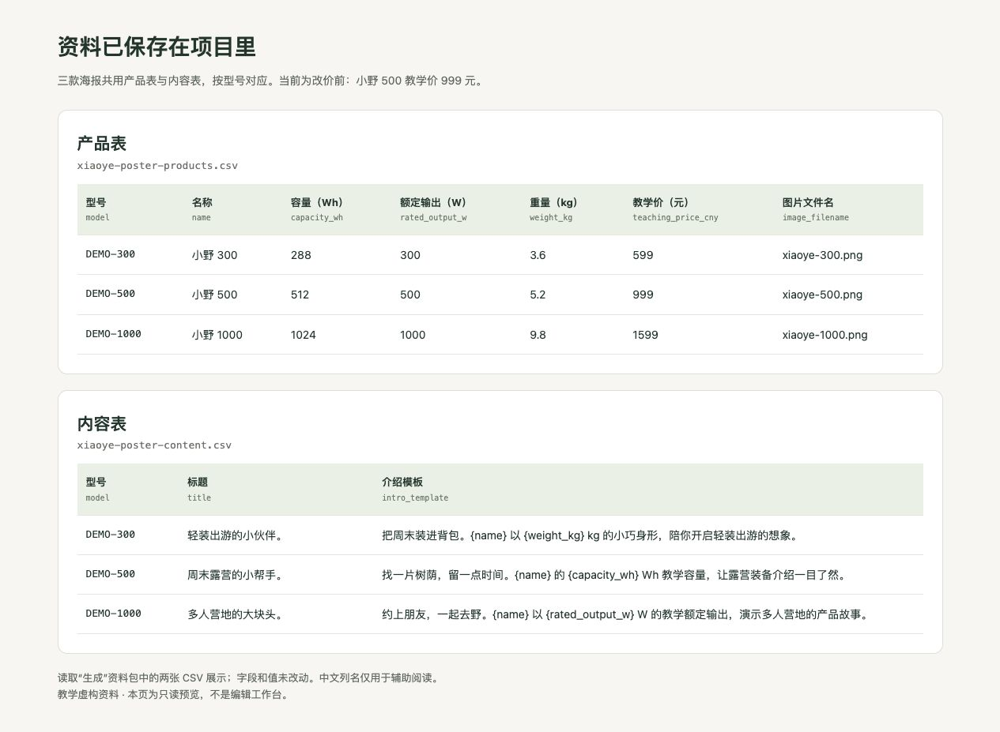
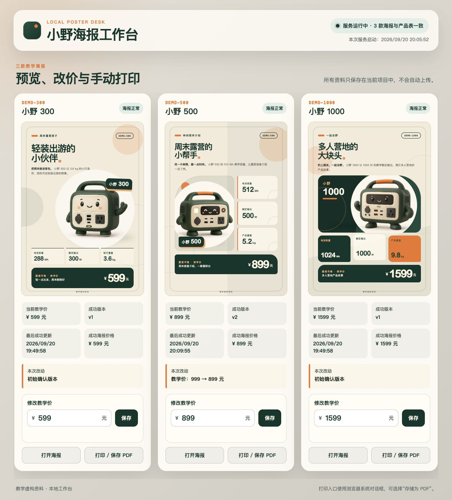
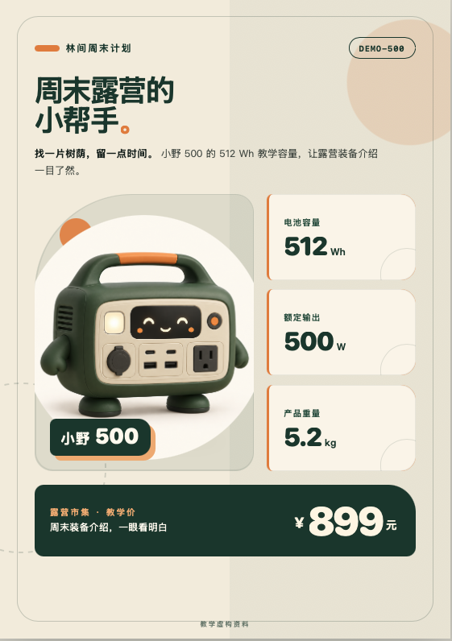
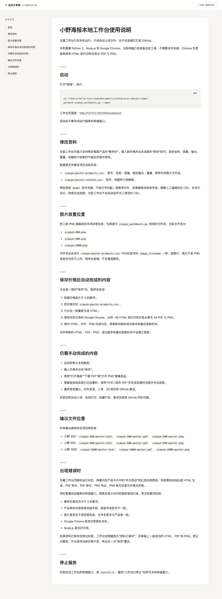

# 海报生成过程：提示词与结果对照

按顺序复制提示词，看到这一步的结果，再继续下一步。始终使用同一个项目文件夹，尽量留在同一个对话里。每步保留实际结果截图；中间如果补充了要求或修过问题，也把追加的提示词和修正后的结果一起留下。本页引用的截图、HTML、CSV、PDF、PNG 和使用说明，都是这些提示词实际生成的文件。

**第一次只做第 1 步，再改一处文字并核对，就可以收工。** 第 2–3 步再练三款海报与资料复用，第 4–6 步再做工作台和自动导出，第 7 步是可选的钉钉分享。不是一次就要搭完七步。

本页统一使用 **HTML + CSS → 浏览器导出 PDF / PNG**。想先体验成品，可下载 [配套工作台](../downloads/xiaoye-poster-workbench.zip)，按 [使用说明](07_工作台使用说明.html) 检查环境；这是试用入口，不代替从空文件夹制作的过程。[结果与核验边界](08_工作台验收记录.html) 单独列出已留下的证据。

**记录进度：** 第 1 步已有 GPT-5.6 Sol（High）的真实生成截图，第 2 步已补齐三款海报实图；第 3 步已补资料表截图，重新生成的核对结果待补；第 4 步已补改价后的工作台和小野 500 海报实图；第 5 步已补自动导出工作台、PDF 与 PNG；第 6 步已补使用说明，并验证重启后保留 899 元；第 7 步已完成真实表格上传与 MCP 回读核对。

## 1. 准备插画，做出第一张

先确认 Codex 或 Claude Code 已安装、能登录并打开项目文件夹；还没有准备好时，先完成这一步。本轮只生成能在浏览器打开的 HTML，不需要先配置 Python、Node.js 或自动导出工具。

打开一个空文件夹，先下载小野 300 插画，保留文件名。另两张等做到第 2 步再下载。这次用现成插画，不需要另外生成图片。

- [小野 300 插画](../05_露营海报/assets/xiaoye-300.png){download="xiaoye-300.png"}
- [小野 500 插画](../05_露营海报/assets/xiaoye-500.png){download="xiaoye-500.png"}
- [小野 1000 插画](../05_露营海报/assets/xiaoye-1000.png){download="xiaoye-1000.png"}

把下面整段发给 Agent：

> 帮我做一张露营市集的 A5 单页产品海报。下面是完整的教学虚构资料，不是真实销售产品，不需要上网查参数。
>
> 产品名：小野 300；型号：DEMO-300。容量：288 Wh；额定输出：300 W；重量：3.6 kg；教学价：599 元。
>
> 标题：轻装出游的小伙伴。介绍：把周末装进背包。小野 300 以 3.6 kg 的小巧身形，陪你开启轻装出游的想象。
>
> 插画使用当前文件夹里的 xiaoye-300.png。请先确认能读到图片；找不到就告诉我补充，不要猜图片路径。
>
> 用 HTML 和 CSS 排版，奶油色底、森林绿点缀，产品图突出，参数和价格清楚。文字和数字单独排版，方便以后修改；页脚注明“教学虚构资料”。
>
> 把文件保存在当前文件夹，在浏览器里打开给我看。支持 A5 单页打印或保存为 PDF，检查文字、图片没有截断。先做这一张，不要上传钉钉；做好后告诉我下次打开哪个文件、在哪里改文字和价格。

对照这张实际生成的海报：

<figure class="learning-figure" style="max-width:450px;margin:28px auto 34px">

<figcaption>GPT-5.6 Sol（High）生成，使用配套的小野 300 插画。点击可查看原图。</figcaption>
</figure>

**检查：** 图片能显示，产品名和介绍齐全，参数为 288 Wh、300 W、3.6 kg，价格为 599 元，页脚有“教学虚构资料”。文字可以选中，不是把整张海报当成一张图片。

同一句提示词再次生成，排版可能不同。如果想贴近这张实图，把上面的海报截图也发给 Agent，再补充：

> 按我附上的海报截图调整当前 HTML：奶油色底、森林绿文字，左上是两行大标题，中间偏右放大产品插画，右侧加“小野 300”标牌；底部三张参数卡横排，下面是深绿色价格条。尽量贴近截图的比例和留白。文字和数字保留为独立元素，不要直接把截图铺成整张海报；产品数据不变。调整后打开给我看。

**本步截图：** 第一张海报的完整画面。上方已放入本次实际结果。

**第一次练习，到这里再做一个小修改就够了：**

> 把标题“轻装出游的小伙伴”改成“周末，轻装出发”。产品参数、价格、图片和布局保持不变，改完重新打开给我看。

亲自确认新标题已出现，599 元和三个参数没变，文字没有挤出页面。能完成这一次“提出要求—看结果—再修改—再检查”，第一次练习就成功了；暂时不做批量、后台和钉钉也完全可以。下面继续记录原始制作过程，实录里的标题保持原样，不把这条练习建议冒充已执行的操作。

## 2. 补齐另外两款，做出三种排版

第一张满意后，继续发：

> 保留刚才确认的小野 300 海报。现在增加两款，资料如下，均为教学虚构，不需要上网补充参数。
>
> 小野 500：型号 DEMO-500；容量 512 Wh；额定输出 500 W；重量 5.2 kg；教学价 999 元。标题“周末露营的小帮手”。介绍“找一片树荫，留一点时间。小野 500 的 512 Wh 教学容量，让露营装备介绍一目了然。”图片用当前文件夹里的 xiaoye-500.png。
>
> 小野 1000：型号 DEMO-1000；容量 1024 Wh；额定输出 1000 W；重量 9.8 kg；教学价 1599 元。标题“多人营地的大块头”。介绍“约上朋友，一起去野。小野 1000 以 1000 W 的教学额定输出，演示多人营地的产品故事。”图片用当前文件夹里的 xiaoye-1000.png。
>
> 三款都用 HTML + CSS 制作 A5 竖版单页海报，保留奶油色、森林绿、少量橙色点缀和相同字体风格。小野 300 保留大图主视觉；小野 500 用图片在左、参数在右的分栏；小野 1000 用三张参数卡片突出容量、输出、重量。不要把三张简单复制成一样的排版。每张都注明“教学虚构资料”。
>
> 把共用的颜色、字体和参数卡样式放在一起维护，每款布局分别控制。检查图片和型号一一对应，打开三张结果给我看；先不要做后台或上传。

**检查：** 三张价格依次为 599、999、1599 元；每张用自己的插画和参数；颜色与字体一致，布局有区别。文字没有重叠或超出纸张。

**本步实际结果：** 三款海报风格一致，分别采用大图、图文分栏和参数卡片。点击图片可放大查看。

<figure class="learning-figure" style="flex:1 1 180px;min-width:0;margin:0"><figcaption>小野 300 · 大图主视觉 · 599 元</figcaption></figure>
<figure class="learning-figure" style="flex:1 1 180px;min-width:0;margin:0"><figcaption>小野 500 · 图文分栏 · 999 元</figcaption></figure>
<figure class="learning-figure" style="flex:1 1 180px;min-width:0;margin:0"><figcaption>小野 1000 · 参数卡片 · 1599 元</figcaption></figure>

这里保留改价前的结果：小野 500 为 **999 元**；第 4 步展示已记录的 899 元海报，可前后对照。

## 3. 把资料留在项目里

继续发：

> 把刚才三款已经确认的资料保存到这个项目中。产品表包含型号、名称、容量、额定输出、重量、教学价、图片文件名；内容表包含型号、标题和介绍模板。用型号关联，不能靠行的位置匹配。
>
> 介绍中出现的产品名称、容量和重量用表格里的值填入。用一个生成入口，读取这两张表和三张插画，生成三张 HTML 海报。现有海报的布局、文案和数据都保持不变。缺字段、缺图片或型号对不上时，指出具体问题，不要猜。
>
> 给我看保存后的两张表，再运行一次生成，逐款核对结果与刚才一致。暂时不要修改价格，也不要连接钉钉。

**检查：** 资料已保存为项目文件，重新生成后海报仍正确。小野 500 此时仍为 999 元。

**本步实际资料：** 以下截图读取本次“生成”资料包中的两张 CSV 展示，保留原始字段和值，另加中文列名便于阅读。小野 500 为 999 元。

<figure class="learning-figure">

<figcaption>原始 CSV 的只读预览截图，不是编辑工作台。点击可放大查看。</figcaption>
</figure>

[打开表格预览](../07_HTML海报过程/资料表预览.html) · [产品表 CSV](../07_HTML海报过程/xiaoye-poster-products.csv) · [内容表 CSV](../07_HTML海报过程/xiaoye-poster-content.csv)

资料保存结果已记录；统一生成入口的运行与三款海报核对结果待补。

## 4. 做一个能改价的工作台

继续发：

> 为这个项目做一个本地工作台：顶部显示运行状态，中间并排展示三款海报预览，每款旁边能修改教学价，点“保存”后把数据写回本地产品表。每款提供“打开海报”和“打印 / 保存 PDF”入口。
>
> 保存资料后，程序自动更新对应的 HTML 海报，不需要我再发生成指令；只更新有变化的那一款，另外两款的文件、版本和更新时间不变。页面显示每款当前价格、成功版本、最后更新时间和本次改动。
>
> 输入不是数字或价格小于等于零时，提示错误且不保存。生成失败时保留上一次成功的海报，并显示失败原因，不能把“资料保存成功”写成“海报更新成功”。
>
> 由你检查环境、启动服务并在浏览器里打开。需要安装软件时先说明用途。告诉我下次怎样打开、用完怎样停止。先保留手动打印 PDF，不做自动上传。

**亲手测试：** 在页面把小野 500 从 999 改为 899，点保存后停止发消息。等页面提示海报更新成功，再打开海报，确认其中也是 899；另外两款仍为 599 和 1599，版本与更新时间不变。不要要求版本号刚好与旧截图一样，运行次数不同，编号也可能不同。

如果没成功，把你的工作台截图和海报截图一起发给 Agent：

> 我已保存小野 500 的价格 899，但海报仍显示 999。请检查从保存资料到生成海报的过程，找到原因并修复。不要只改页面显示，也不要直接把海报里的数字写死。修好后先恢复 999，再陪我做一次 999 → 899 的保存测试，确认另外两款不变。

**本步实际结果：** 工作台显示三款海报与产品表一致。小野 500 的教学价和成功海报价格均为 899 元，成功版本为 v2，本次改动记录为“教学价：999 → 899 元”；小野 300 和小野 1000 仍为 v1。

<figure class="learning-figure">

<figcaption>改价后的真实工作台。点击可放大查看三款价格、版本、更新时间和本次改动。</figcaption>
</figure>

<figure class="learning-figure" style="max-width:450px;margin:28px auto 34px">

<figcaption>工作台更新后的小野 500 海报，教学价为 899 元。</figcaption>
</figure>

改价前的 999 元海报保留在第 2 步，可与这里的 899 元结果直接对照。改价前的整页工作台截图尚未记录，因此不补写为已完成。

## 5. 检查打印，并导出 PDF

继续发：

> 检查三张海报的打印样式：A5 竖版，每款一页；工作台按钮、输入框和导航不出现在海报里。保留背景色、图片、文字和“教学虚构资料”页脚，不能出现多余空白页或内容截断。不要修改现有产品数据和屏幕版布局。修正后打开海报，告诉我打印时应选的纸张和设置。

在浏览器中打开每款海报的打印预览，选择 A5、关闭页眉页脚，并开启背景图形（如果打印面板提供此选项）。确认每款一页，再保存 PDF。打开保存的 PDF，核对小野 500 为 **899 元**。

之前保存的 PDF 不会随网页自动变化。需要“改价后 PDF 也自动更新”时，再发下一段：

> 在已经能自动更新 HTML 海报的基础上，增加自动导出 PDF 和 PNG 预览。沿用现有 HTML 和打印样式，不要另做一套排版。说明所需的浏览器导出工具，安装前等我确认。
>
> 保存某款价格后，只更新这款的 HTML、PDF 和 PNG；三者都核对成功后，再更新这款的成功版本和时间。导出失败时保留旧文件，明确显示哪个步骤失败。工作台增加对应的 PDF 下载入口。
>
> 完成后实际测试小野 500 的 999 → 899，打开生成的 PDF 和 PNG 检查价格；同时确认另外两款文件未变。不能只拿页面里的价格证明导出成功。

**本步实际结果：** 工作台已显示“预览、改价与自动导出”，三款均有 PDF 下载和 PNG 入口。小野 500 为 899 元、v4，本次改动仍是“教学价：999 → 899 元”；另外两款仍为 v1。

<figure class="learning-figure">

<figcaption>自动导出版本的真实工作台。点击可放大查看 PDF、PNG 入口与版本状态。</figcaption>
</figure>

[打开自动导出的 PNG](../07_HTML海报过程/自动导出/xiaoye-500-poster.png) · [打开自动导出的 PDF](../07_HTML海报过程/自动导出/xiaoye-500-poster.pdf)

已核对 PDF 为 A5 单页，文本中包含“小野 500”“¥ 899 元”和“教学虚构资料”。自动导出的 PNG 与工作台预览一致。浏览器系统打印预览没有单独截图，因此这里只记录自动导出结果，不把手动打印步骤写成已验证。

## 6. 留下下次打开的方法

继续发：

> 把这个项目的用法写成一份简短说明：怎样启动、在哪个页面修改资料、图片放在哪里、如何停止服务、输出文件在哪里，以及出现错误时看什么。说明哪些步骤会自动完成，哪些仍需手动操作。不要把尚未实现的功能写成已经支持。
>
> 帮我检查本轮改动，展示差异。等我确认后，用 Git 保存一个可用版本。先保存在本机；需要多端同步或协作时，再决定是否推送到 GitHub。

**检查：** 按说明关闭、重新打开工具，确认 899 元已保存，三款海报和下载入口都能正常使用。

**本步实际结果：** Agent 已生成完整的工作台使用说明，写清了启动命令、操作页面、资料和图片位置、自动导出内容、手动操作、输出位置、排错方法与停止方式。

<figure class="learning-figure">

<figcaption>制作当时生成的使用说明实录，保留原样；下载包的当前目录和启动方式以文字版使用说明为准。</figcaption>
</figure>

[打开完整使用说明](07_工作台使用说明.html)

随后从“工作台 2.0”目录重新启动服务。工作台仍显示小野 500 为 899 元、v4，三款 HTML、PDF 和 PNG 入口均正常；第 5 步的工作台截图就是这次重启后的页面。使用说明文件已经生成并可从本教程打开；当前工作台页面本身还没有“使用说明”按钮或链接。

## 7. 需要在钉钉分享时，再做这一步

先按 [钉钉 MCP 连接说明](05_钉钉MCP.html) 完成连接，准备自己有权限的测试空间。需要上传的三份 PDF 和 PNG 应先在本地导出、打开并核对。将测试空间链接单独发给 Agent，再发：

> 请先检查我刚发的钉钉测试空间链接，确认能访问正确位置。为这三款教学产品建立“产品与海报”多维表，保存型号、名称、参数、教学价，以及对应的海报 PNG 和 PDF。
>
> 如果已有同名表或相同型号的记录，先告诉我，不要重复创建或覆盖其他资料。上传后重新读取这三条记录，核对型号、价格和附件是否对应，并给我可以打开的链接。缺权限或工具不支持时，说明卡在哪里，不要声称已经完成。

亲自点开三条记录的附件，确认小野 500 的海报和表格价格都是 899。本步骤是一次上传；在钉钉修改价格后自动生成、自动替换附件，需要另外实现和验证。

**本步实际结果：** “产品与海报”表已建立三条记录。截图中可确认 DEMO-300、DEMO-500、DEMO-1000 的参数和教学价分别对应 599、899、1599 元，每行均有海报 PNG 和海报 PDF 附件。

<figure class="learning-figure">

<figcaption>提示词实际生成并上传的“产品与海报”表。点击可放大查看三条记录和附件栏。</figcaption>
</figure>

[打开钉钉教学表：产品与海报](https://alidocs.dingtalk.com/i/nodes/jb9Y4gmKWr75RdmdSeQzdAlkVGXn6lpz?utm_scene=person_space&iframeQuery=viewId%3DqvGDAH2%26sheetId%3DhERWDMS)

上传后，Agent 又通过 MCP 重新读取三条记录，核对型号、参数、价格以及 PNG、PDF 附件。第一次回读发现 5 个附件尺寸异常，重新上传并再次核对后才判定完成。

<figure class="learning-figure" style="max-width:720px;margin:28px auto 34px">

<figcaption>真实的 MCP 回读结果：三条记录与对应附件均已核对。</figcaption>
</figure>

现场分享时，还可以逐一打开 PNG 和 PDF，让大家直接看到型号与价格对应。
