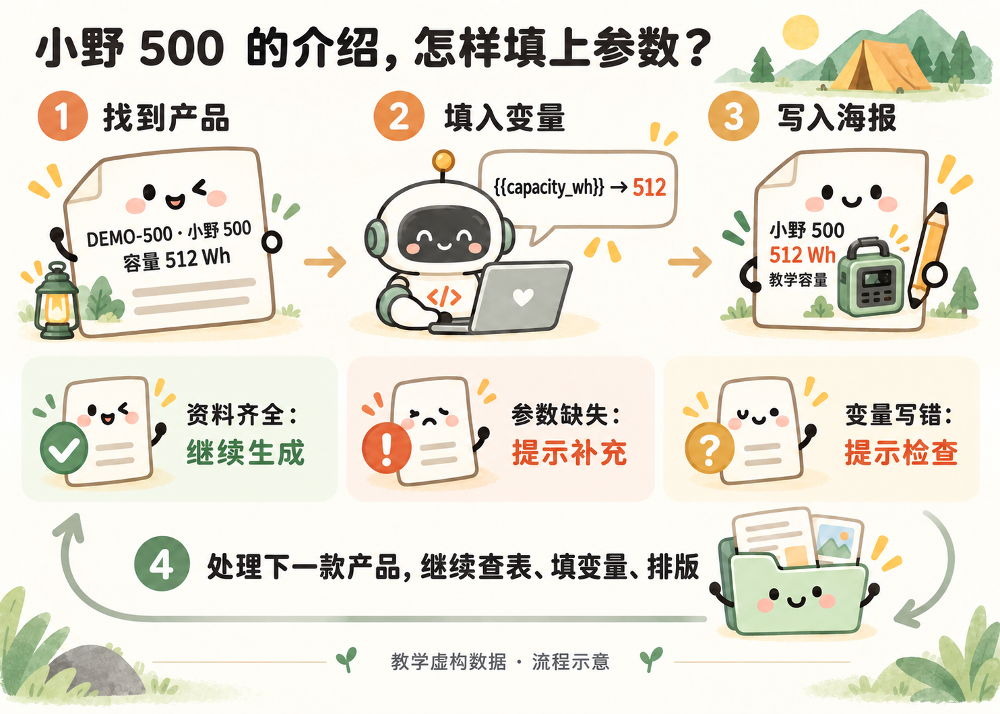
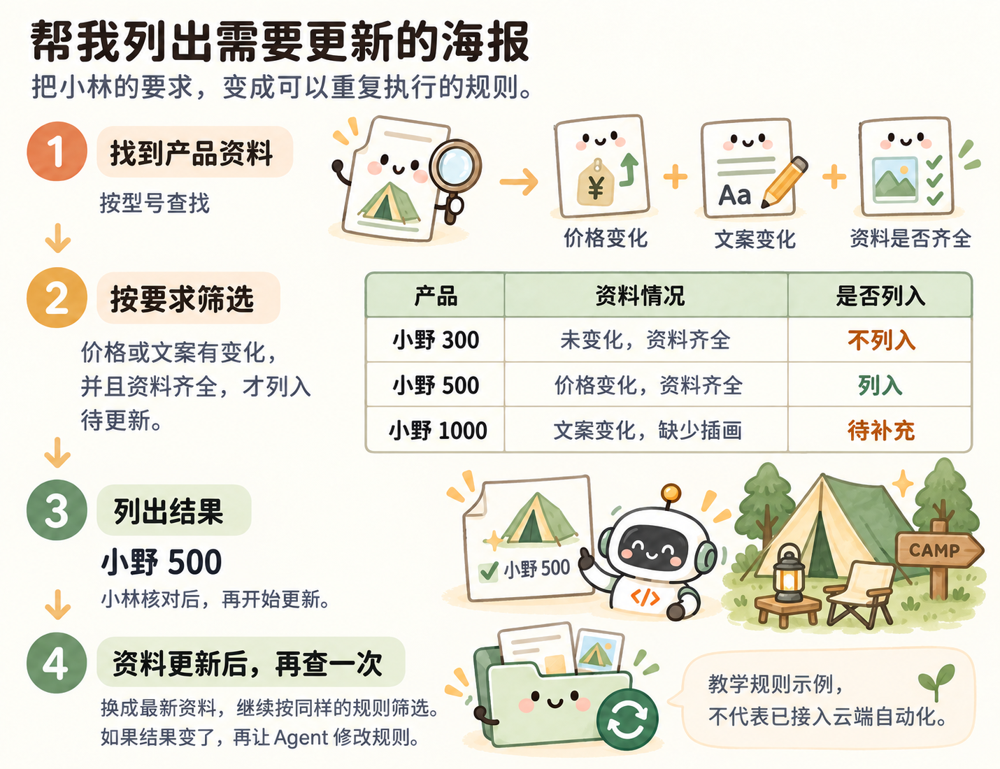

# 用过以后，再看代码怎样工作

小林看到海报上的“小野 500 · 512 Wh”，想知道它是怎么从表格变过来的。把刚才的结果拆开，就能看懂程序在做什么，不用先记代码语法。

按型号找资料 → 填入变量 → 写入海报

| 刚才看到的结果 | 程序做了什么 |
| --- | --- |
| 小野 500 用自己的参数和介绍 | 查找：按型号找到对应资料 |
| 介绍中的容量变成 512 Wh | 替换：把表格里的值填进文案变量 |
| 每款得到自己的 PDF | 写入：将文字、插画放进对应版式 |
| 三款都能生成 | 重复：处理完一款，再处理下一款 |

参数缺失时，程序应提示补充，不猜一个数字填进去。小林只需要把这个规则告诉 Agent，再看错误提示是否真的出现。

### 再看一个例子：帮我列出需要更新的海报

小林可以直接说：

> 价格或者介绍改过了，而且资料齐全的产品，帮我列出来准备更新。缺少插画的先提示我补充，不要继续生成。

按小林的要求筛选待更新产品（教学规则示例）

这个例子里，小野 300 没变化，不列入；小野 500 改了价格且资料齐全，列入；小野 1000 改了文案但缺插画，先提示补充。小林核对名单后，再让程序处理。

程序会把这段要求拆成两个判断：资料是否齐全，价格或介绍是否有变化。资料齐全，而且至少一项有变化，就进入待更新名单；资料不全，则提示补充。小林用日常语言说清条件，Agent 把条件写成代码，再用这三款产品检查筛选结果是否符合要求。

### 为什么 Agent 可能先把资料整理成表

小林最初给的是几段文字。为了下次还能查找，Agent 可以整理成“型号、产品名称、容量、价格”等固定栏目。

产品表和内容表都保留型号，就能把同一款的参数与介绍对应起来。比如 DEMO-500 对应小野 500，不能仅靠“第二行”匹配，因为表格可能重新排序。

| 文件 | 在本案例里的作用 |
| --- | --- |
| products.csv、content.csv | 保存产品参数和介绍；CSV 是常见表格文件 |
| assets 里的图片 | 固定插画，改价时不重新画 |
| LaTeX 排版文件 | 公共样式和三种不同版式 |
| demo.py | 读取资料、生成海报、运行本地页面 |
| README | 说明怎样打开和使用 |

这些文件由 Agent 创建和维护。小林不必先手工整理成这个结构，提供现有资料即可。

### 下次为什么还能继续用

小林提供资料 → 程序查表、填变量和排版 → 小林核对 PDF。

程序保存了这套做法，下一次改资料就能复用。加上后台检测后，本地数据变化还可以触发更新。是否真的生效，要用一次改价测试确认，不能只看 Agent 的完成说明。
