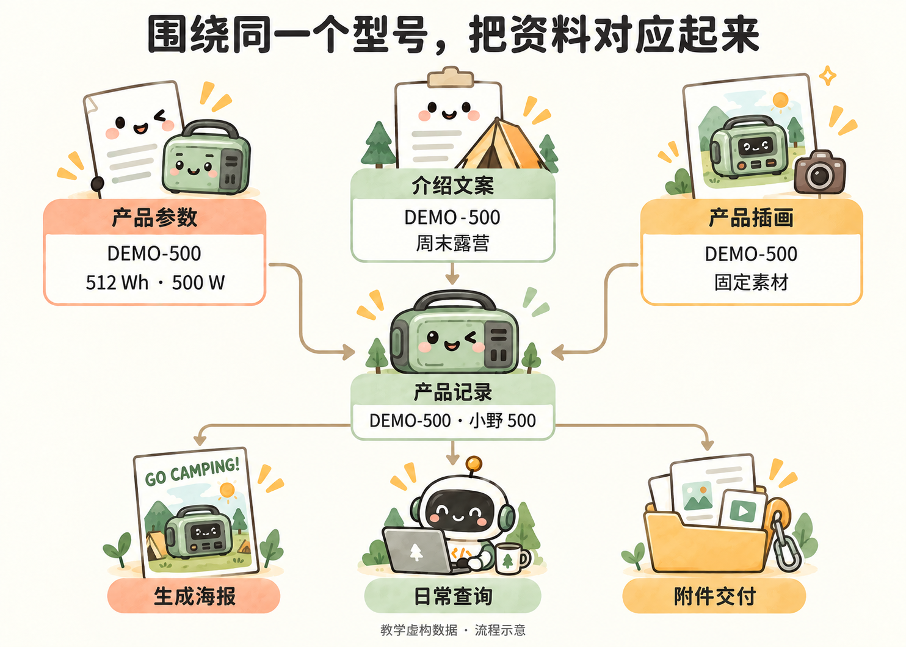

# 下次再做，怎样少重复交代

小林已经做出三张海报。下次活动又有新资料，他不想重新解释颜色、排版和参数怎么用，于是把确认过的要求留下来：

> 把这次确认的海报要求记进项目说明：三张共享颜色、字体和组件样式，但排版不同；参数从表格取，插画不带文字；记录实际使用的排版方式，以及预览和导出步骤。下次先读说明，再处理新资料。

他保存的是已经确定的做法，不是一大段零散聊天。原始资料、生成结果和使用说明分别保留，后面就容易接着做。

如果同事发来的资料很乱，小林也可以先说：

> 根据这个文件夹的资料整理产品参数和介绍，标明出处。数字冲突、读不到或缺少的内容单独列出来，不要自己补猜。先给我看整理结果。

拿到结果后，小林核对型号、数字和介绍，再让 Agent 生成海报。资料核对清楚，比生成后逐张找错更省事。

### 哪些重复工作可以交给 Agent

| 眼前的需要 | 可以交给 Agent 的任务 |
| --- | --- |
| 产品图片文件名很乱 | 按型号整理命名，保留原文件 |
| 新活动需要一批介绍资料 | 根据参数与文案生成统一风格的海报 |
| 经常查某款最新海报 | 把参数、介绍和附件放到同一产品记录 |
| 每次都要修改价格再导出 | 做成改资料后更新对应海报的工具 |

先解决眼前的问题。重复出现的步骤，再让 Agent 写成程序，不必一开始就设计完整系统。

### 用多维表保存和关联资料

同事也要查资料时，小林把资料放进钉钉多维表。配置好 MCP 后，他给出目标空间和需求，建表、整理资料、关联型号、上传附件由 Agent 在账号权限和工具支持范围内完成。

围绕同一个型号，关联参数、文案、插画和交付物

> 在这个钉钉空间里建一张“产品与海报”表，把三款产品的参数和介绍整理进去，再把对应海报图片和 PDF 放到各自那一行。不要修改空间里的其他资料。完成后给我表格链接，并检查有没有放错产品。

小林打开表格，只需检查自己熟悉的业务内容：型号、参数、介绍、附件是不是对应。他不必事先研究字段 ID 或逐条录入。

练习用虚构资料；真实业务资料应放在获准使用的空间内。MCP 不会扩大账号权限，也不保证提供软件的所有功能。

一张表集中资料，不等于自动更新已经开启。持续更新需要另行实现并测试；本案例目前完成了本地自动生成和钉钉一次上传。
