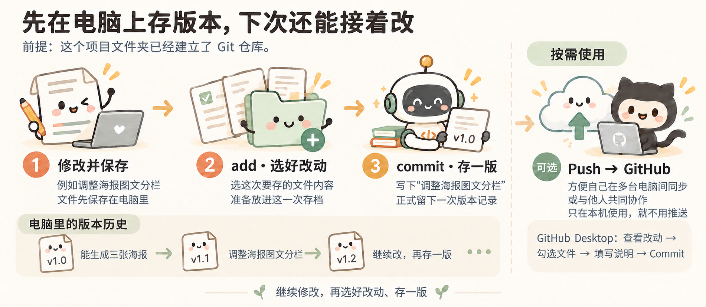

# 去 GitHub 找现成项目

[跟着小林走一遍：从参考仓库做成自己的工具](../index.html#s4)

### GitHub 是什么，为什么去那里找

[GitHub](https://github.com/) 上有很多别人分享的代码项目。有些已经做成了可以使用的工具，附有使用说明和演示。项目文件通常放在一个“仓库”里，后面说的下载项目，就是把仓库里的文件下载到电脑。

比如想批量改文件名、自动生成文档，可以先搜搜有没有现成的工具。找到合适的，再让 Agent 帮忙运行和调整。即使不能直接用，也可以参考别人是怎么做的。

### 从一句产品介绍开始试

GitHub 上有些项目用 Jupyter Notebook 展示做法。它像一本能动手试的笔记：一段说明、一段代码，下面就是运行结果。先看结果，再改一个条件、运行一次，就能看看变化。

本分享借鉴这种边看边试的方式，另写了一个普通 Python 小练习，不需要先安装 Jupyter：

- [从 the craft of selfteaching 开始：改一句产品介绍](../03_GitHub原例/阅读版.html)：参考[the craft of selfteaching](https://github.com/selfteaching/the-craft-of-selfteaching)，先运行一句产品介绍，只改价格再看结果；结合露营海报理解变量怎样填入文字。

先打开“阅读版”就能看说明、代码和已经生成的结果，不用安装软件。想修改并重新运行时，把对应文件夹交给 Agent，并明确运行其中的 `product_intro.py`：

> 请运行 product_intro.py，先让我看到原来的结果。然后带我只改价格，再运行一次。每次只解释当前这一步用到的知识，不运行目录里的旧 Notebook。

阅读版展示的是保存下来的运行结果；重新执行小练习只需要 Python。具体准备方法见 [使用说明](../03_GitHub原例/使用说明.txt)。原书使用 Notebook，不代表本地小练习也需要同样的环境。

### 按自己要做的事去找

打开 [GitHub](https://github.com/)，在搜索框输入想做的功能。比如 `batch rename`（批量改名）、`document generation`（生成文档）。搜索词可以先让 Agent 帮你想，也可以把需求直接交给能联网的 Agent：

> 我想把产品参数、介绍文案和插画合在一起，批量生成产品海报，数据变了还能更新。帮我在 GitHub 找几个功能接近的项目，给我实际找到的链接。用简单的话说清楚：各自能做什么、有没有效果示例、在我的电脑上试用需要准备什么。

打开项目后，先看页面上的介绍、效果图或演示，再看 `README`，也就是它的使用说明。重点看它能解决什么问题、怎么使用，不用一开始就逐个读代码文件。拿不准时，把链接交给 Agent，让它结合你的需求解释。

找到接近的项目后，再决定是否下载试用。准备采用或修改其中的代码时，查看 `LICENSE` 里允许怎样使用。[GitHub 许可证说明](https://docs.github.com/en/repositories/managing-your-repositorys-settings-and-features/customizing-your-repository/licensing-a-repository)

### 把项目下载到电脑上


图中展示了先 Fork 再 Clone 的路线；只在本地试用，可以跳过 Fork，按下面的步骤直接 Clone。

**建议初学者用 GitHub Desktop 操作**，下载项目、查看改动、保存版本都可以通过按钮完成，不用先记 Git 命令。这里有三个名字容易混：Git 用来管理版本，GitHub 是存放和分享项目的网站，GitHub Desktop 则让你在电脑上通过界面操作，不必逐条输入命令。

**先准备 Git 和 GitHub Desktop。**

**Windows：** 从 [Git 官方下载页](https://git-scm.com/install/windows)下载安装程序，按向导完成安装，再重新打开 PowerShell。

安装完成后，在 PowerShell 中输入下面的命令。显示版本号，就说明 Git 已经安装好。

```powershell
git --version
```

然后到 [GitHub 注册账号](https://github.com/signup)，验证邮箱；从 [官网下载 GitHub Desktop](https://desktop.github.com/)，安装后登录，按引导设置姓名和邮箱。[安装说明](https://docs.github.com/en/desktop/installing-and-authenticating-to-github-desktop/installing-github-desktop)

**再下载选好的项目。**

1. 打开选中的仓库，复制仓库网址。先在本地试用，不必先 Fork。
2. 打开 GitHub Desktop，选择 **File → Clone Repository → URL**，粘贴网址，选好保存位置，点击 **Clone**。
3. 用 Codex 或 Claude Code 打开下载得到的整个文件夹，把下面这段话发给 Agent。

Clone 是把仓库下载到电脑，本地修改可以直接用 Git 保存。以后想把改造版推送到自己账号，再考虑 Fork：在 GitHub 网页点击 **Fork → Create fork** 建立自己的仓库副本。已经 Clone 的项目，可以请 Agent 或按 Desktop 提示将推送目标设为自己的 Fork，不用丢掉本地修改重新开始。[Fork 说明](https://docs.github.com/en/pull-requests/how-tos/work-with-forks/fork-a-repo) · [Clone 说明](https://docs.github.com/en/desktop/adding-and-cloning-repositories/cloning-and-forking-repositories-from-github-desktop)

### 让 Agent 帮你运行项目

先请 Agent 帮忙说明项目用途，再运行它：

```text
先读一下这个项目的说明，告诉我它能做什么，再帮我运行起来。
需要装什么软件、点哪里、输入什么命令，请一步步告诉我。
如果出错了，帮我看看原因。

先看看原来的功能能不能用，
再看看要改成“按型号读取资料、生成产品海报”，需要调整哪里。
先改一个能看见结果的部分，让我试用。
做好后，把下次怎么打开和使用也记进 README。
```

项目运行后，可以再问：“我刚才点的这个功能，对应哪些文件？如果想改输出内容，要改哪里？”带着已经看见的结果读代码，会更容易把文件和功能对应起来。

有的项目还需要安装 Python、Node.js 等软件。遇到这些提示，不需要先把它们全部学会，可以把项目说明和报错交给 Agent，让它一步步协助安装和运行。下载好仓库，只是先拿到了文件。

### 一个人做东西，为什么也值得用 Git？

小林的三张海报原来都能正常生成。后来他请 Agent 调整图文分栏，产品图变大了，介绍却挤到了价格上。这时他想知道的是：**刚才改了哪里？原来能用的那版还在吗？**

Git 就像给项目留“存档点”。确认能用时存一版，再继续改。即使只有自己一个人用，也能派上用场：

- **改坏了，有以前的版本可找。** 原来能用的内容如果已经存进 Git，就可以取出来比较，必要时恢复。
- **想查问题，有改动记录可看。** 能看到这次哪些文件、哪些内容变了，也可以让 Agent 对照记录排查，不用全凭回忆。
- **做了一半，下次容易接着做。** “能生成三张海报”“调整图文分栏”“改价后自动更新”各留一版、写句说明，过一阵子回来，还知道自己做到了哪里。

遇到这样的排版问题，小林可以直接告诉 Agent：

> 上一个版本的海报排版正常，这次放大产品图后，介绍挤到了价格上。帮我对比这次改了哪里，保留大图效果，把文字间距修好，另外两款不要改。

**每做好一个能用的部分，就留一个存档点，再继续尝试。** 以后改出了问题，就有之前的版本可以对照，也不用复制一堆“最终版、最终版2”。记得在继续修改前存一版，没存过的内容，Git 也没法帮你找回。

### 先学会在本地存一版

**先在自己的电脑上存版本就行，不用急着上传 GitHub。** 日常可以先记住两个动作：

- **add：选好这次要存的改动。** 这次只想保存哪些文件的改动，就先选中哪些。
- **commit：把选好的改动存成一个版本，写一句说明。** 比如写“调整海报图文分栏”，以后就知道这一版改了什么。继续修改文件，也不会覆盖已经提交的版本。

文件本身还是照常编辑和保存。add、commit 是把选好的改动记入版本历史；Git 不会自动记录每次打字。[Git 的 add 说明](https://git-scm.com/docs/git-add) · [commit 说明](https://git-scm.com/docs/git-commit)

### 用 GitHub Desktop，就按这几步做



修改并保存 → 选好改动 → 存一版；需要协作时再推送 GitHub

1. 改好文件并保存，试一下功能是否正常。
2. 在 **Changes** 里查看差异，勾选这次要存的文件。这对应“选好这次的改动”，不用另找一个 add 按钮。
3. 写一句说明，比如“调整海报图文分栏”，点击 **Commit**。以后在 **History** 里查看这些存档。[Desktop 提交说明](https://docs.github.com/en/desktop/making-changes-in-a-branch/committing-and-reviewing-changes-to-your-project-in-github-desktop)

从 GitHub Clone 下来的项目，已经是 Git 仓库。自己新建的文件夹，可以先请 Agent 帮你建立 Git 仓库，并设置提交用的姓名和邮箱。准备好后，就可以反复“修改 → 选好改动 → 存一版”。

<details>
<summary>想试命令时，再看 add 和 commit 怎么写</summary>

在已经建立 Git 仓库的项目文件夹里，例如只保存这次对 `index.html` 的修改：

```bash
git status
git add index.html
git commit -m "调整海报图文分栏"
```

第一行先看看哪些文件改了；第二行选中 `index.html` 当前的改动；第三行存成一个版本。文件名要换成你实际修改的文件。add 之后如果又改了文件，想把新改动一起存进去，就再 add 一次。

</details>

### 需要多端同步或共同协作时，再推送到 GitHub

**如果想换台电脑接着做，或者把项目交给同事一起修改，就可以推送到 GitHub。只在自己这台电脑上用，保存在本地就行，不需要推送。**

推送后，另一台电脑或有权限的同事就能获取这些版本，接着修改。**Commit 是在本机存一版；Push 是把这些版本推送到 GitHub。** 在 Desktop 中点击 **Push origin** 即可推送；新建项目首次上传时通常显示 **Publish repository**。

上传前确认仓库是公开还是私有，不要上传密码或未经授权的业务资料。[可见范围说明](https://docs.github.com/en/repositories/creating-and-managing-repositories/about-repositories) · [创建和发布仓库说明](https://docs.github.com/en/desktop/overview/creating-your-first-repository-using-github-desktop)

代码上传到 GitHub，也不等于网页已经上线。
