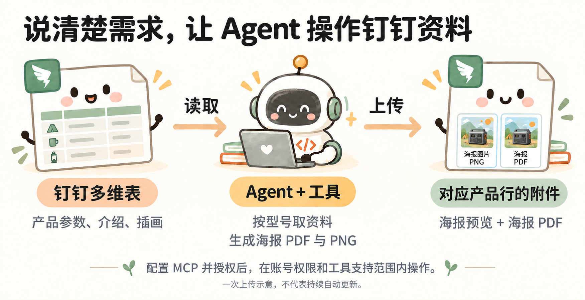

# 钉钉 MCP：把产品资料和海报放到一起

本页承接小林的露营海报工具。[返回主稿：从做一次，到以后都能用](../00_打开分享.html#s4)

小林的海报在电脑上生成了，但同事平时在钉钉查产品。他想把资料与成品放到一起，不用自己建字段、逐条复制和上传。

### 钉钉 MCP 案例：整理产品资料，上传海报附件

读取产品资料、生成海报、上传到对应产品行（一次操作示意）

**先连接钉钉 MCP。**

打开 [钉钉 MCP 入口](https://aihub.dingtalk.com/#/mcp)，按页面说明连接所需服务并完成授权。这个例子用“钉钉 AI 表格”管理表格和附件；需要其他文档操作时，再连接相应服务。

连接后，Agent 可以在账号权限与工具支持范围内执行任务。小林要说清楚目标空间和要做的事，不需要自己先了解表格内部的技术编号。

**把目标链接和需求交给 Agent。**

小林把有权操作的空间链接发过去：

> 请用已经配置的钉钉 MCP，在这个空间新建“小野露营海报 · 教学演示”多维表：[我的空间链接]。
>
> 把本地三款产品的参数、介绍和版式整理进去，每款一行。再将对应的最终 PNG 和 PDF 分别放进“海报预览”和“海报 PDF”附件栏。按型号对应，不要放错，也不要修改空间里其他资料。资料注明教学虚构。
>
> 做完后检查三款的内容和附件，把表格链接发给我。遇到权限不足或工具不支持，直接告诉我，不要假装完成。

如果表已经建好，就换成“更新这张表”，给出表格链接。已有附件是否替换要说清楚，避免误盖掉同事留存的文件。

**打开表格，核对结果。**

小林检查三款都有自己的记录，参数与本地资料一致，PNG 和 PDF 都能打开。随后截取实际表格页面，作为分享素材。

[查看本次教学表](https://alidocs.dingtalk.com/i/nodes/oP0MALyR8k75ewkwSDQoEkxn83bzYmDO?entrance=data&sheetId=e84ttux)（需要相应权限）。自己跟做时，请新建练习表，不修改这张演示表。

本次已完成三款 PNG 和 PDF 的一次上传；这不等于钉钉资料变化后会持续自动更新。

### 下次资料变了，怎样继续

小林可以先手动发起下一次任务：

> 小野 500 的价格变了，请按最新资料重新生成它的海报并更新对应附件，其他两款不动。完成后再核对一次。

如果想不发消息也能自动更新，就需要另外部署持续运行的服务或触发机制，再测试生成、上传、回写和失败处理。目前案例尚未完成这部分，不能把 MCP 已连接当成自动化已运行。

MCP 是 Agent 调用外部工具的一种连接方式。小林负责提需求、确认范围和检查结果；具体调用哪些功能，由 Agent 完成。[MCP 官方说明](https://modelcontextprotocol.io/docs/getting-started/intro)
