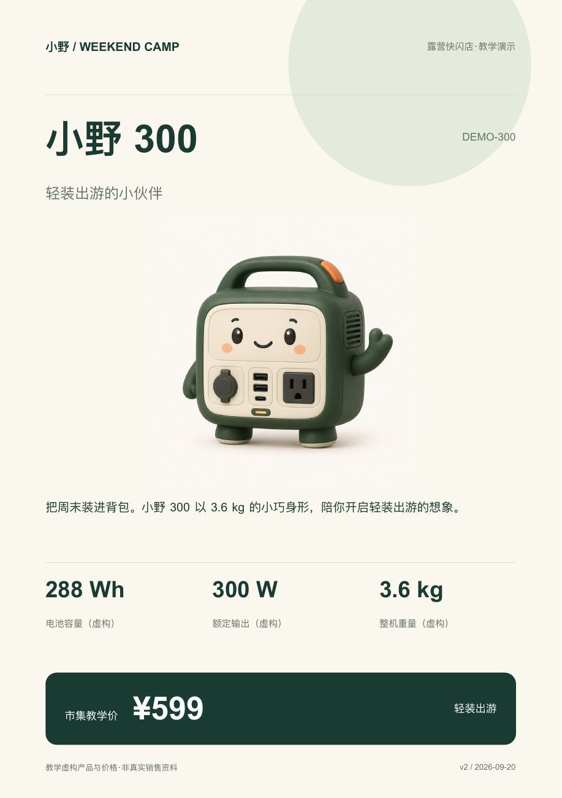
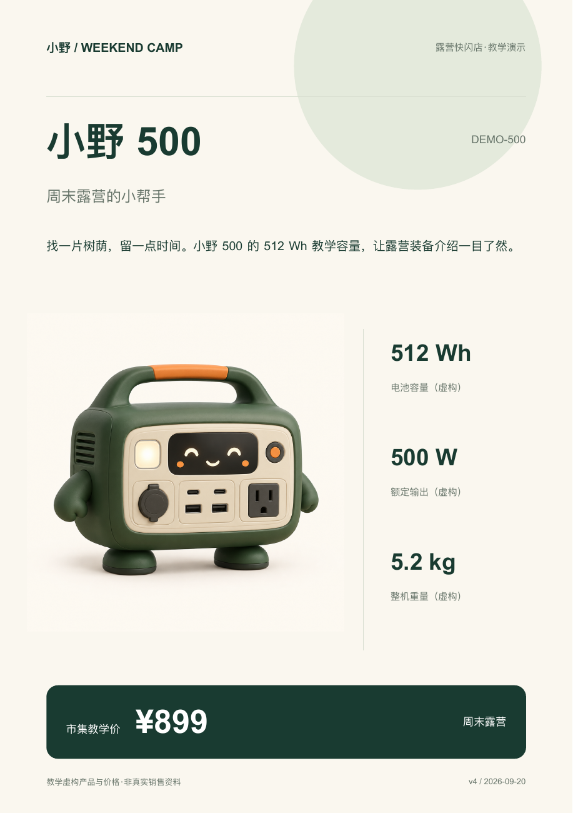
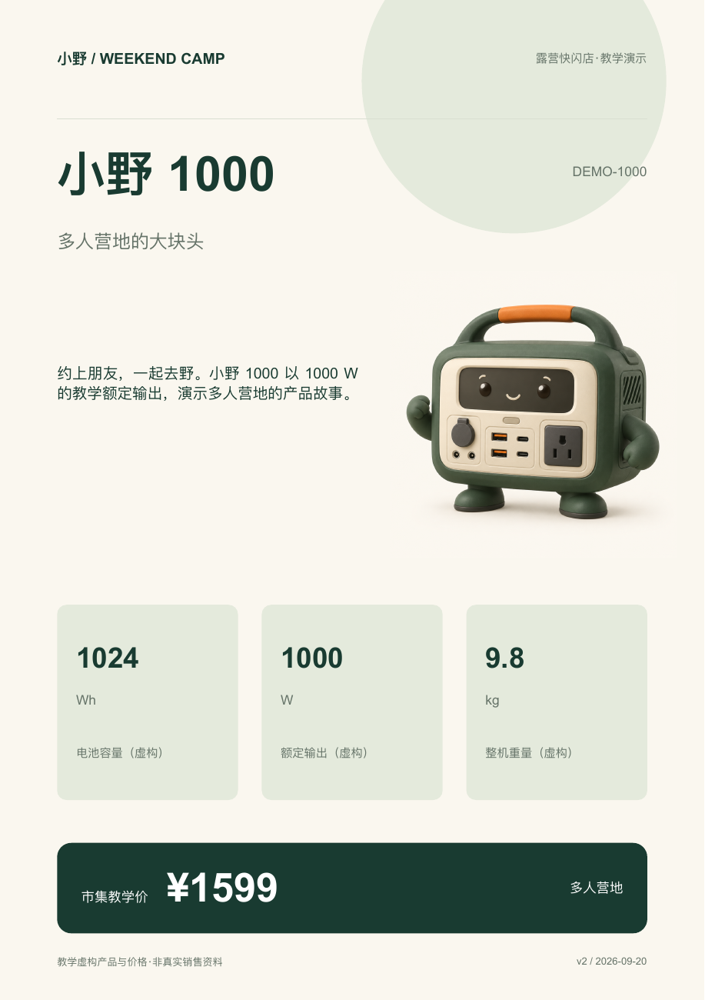
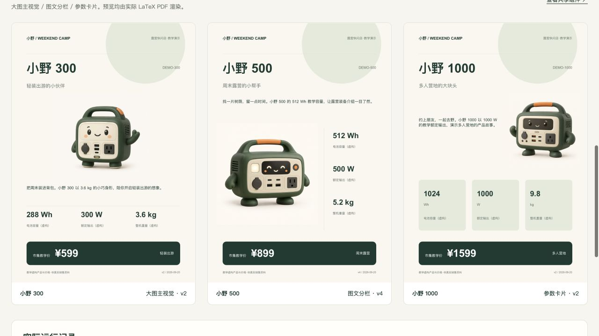

# 小野露营市集 LaTeX 案例

## 三张小海报，一次真实的自动更新

周五下午，小林要为明天的露营市集准备三张产品海报。临出摊前，小野 500 的活动价从 999 调整到 899。用两张 CSV 管数据和文案，让本地程序只重建受影响的那一张，并记录更新信息。

> 教学虚构产品与参数 · 本地已跑通 · 三张海报 PNG 和三份 PDF 已上传钉钉教学表，钉钉持续自动更新尚未接入。本页是静态素材入口，不会运行后台或修改数据。

## 先看三张海报

<figure><figcaption>小野 300 · 大图主视觉 · v2 <a href="deliverables/DEMO-300.pdf">打开 PDF</a></figcaption></figure>
<figure><figcaption>小野 500 · 图文分栏 · v4 <a href="deliverables/DEMO-500.pdf">打开 PDF</a></figcaption></figure>
<figure><figcaption>小野 1000 · 参数卡片 · v2 <a href="deliverables/DEMO-1000.pdf">打开 PDF</a></figcaption></figure>

三张都是 A5 单页海报，可以打开 PDF 查看。颜色、字体和组件样式共用，排版各有不同。

## 再看真实过程

[改价前：999 / v3](evidence/10-three-layouts-before.png) → [保存 CSV](evidence/11-three-layouts-saved.png) → [自动更新：899 / v4](evidence/12-three-layouts-after.png)

另外两张的版本和 PDF 哈希保持不变。全部取证见 [验收记录](evidence/acceptance.json)，冻结文件校验见 [交付物清单](deliverables/manifest.json)。

## 自己操作一次

在本案例目录运行：

~~~sh
python3 demo.py serve --port 8765
~~~

然后打开 [本地工作台](http://127.0.0.1:8765)。运行前请先按 [运行说明](README.html) 准备环境；此链接不是已部署的公网应用。在 macOS 上也可双击“启动本地演示.command”。

先把小野 500 改回 999，等待成功，再改为 899。保存以后不要手动点击生成；观察后台更新 PDF 和版本。保持服务运行与电脑唤醒，Ctrl+C 停止。

## 分享时用哪些文件

- [完整分享稿](../index.html)：沿一个故事讲清整个流程。
- [当前分享的现场脚本](演示脚本.html)：12–15 分钟的 HTML 工作台演示。
- [本 LaTeX 案例运行说明](README.html)：依赖、结构、验证与边界。
- [素材清单](素材清单.html)：截图用途与真实性说明。
- [产品表](data/products.csv) / [内容表](data/content.csv)：教学输入。
- [图像生成提示词](assets/provenance.json)：插画资产的制作来源。

离线分享请保留目录结构，完整解压后打开上级“index.html”。静态成品和截图无需联网；互动生成需要本地运行环境。不要把静态页面当成正在运行的工作台。
