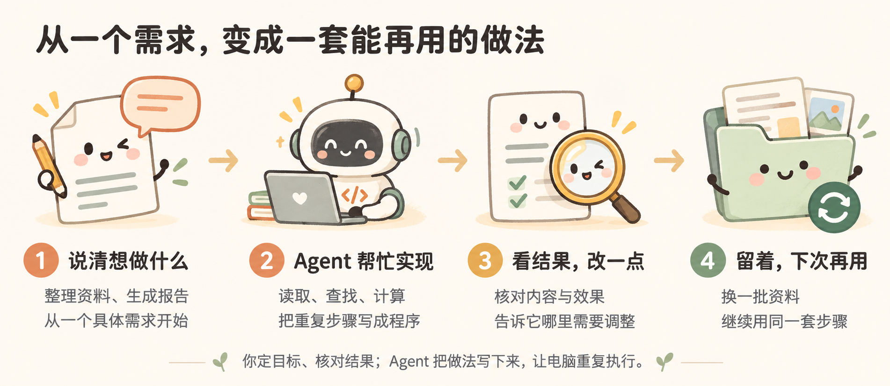

# 【产品运营部】AI 使用知识分享

> 让 Agent 写代码，把想法做成能用的工具。

## 一、用代码解决工作中的问题

工作中，有些需求很具体，现成的软件却未必刚好合用。比如想把分散的资料放在一起查，按自己的规则批量处理文件，或者做一个符合自己使用习惯的页面。借助 Agent，我们可以尝试用代码把这些想法实现出来。

你说要求、看结果；Agent 把重复步骤写成程序

## 二、从需求到实现

以露营市集的小海报为例：周五下午，小林要为明天的快闪店准备三款产品的介绍海报。每张有 Q 版产品插画、简短介绍、参数和活动价，方便打印，也能发给同事查看。

这个例子用网页查看数据和生成结果，用 LaTeX 输出三张 A5 单页 PDF。三张海报的字体、颜色和组件样式统一，但分别采用大图主视觉、图文分栏、参数卡片排版。

演示使用“小野 300 / 500 / 1000”三个虚构型号，产品参数、价格和插画均为教学用途，不是真实销售资料。完整需求和练习材料附在后面。

露营海报生成流程示意

> [打开露营海报案例和素材](05_露营海报/index.html) · 成品与截图可离线看，交互演示需启动本地程序。

### 怎样开始

用已经安装并登录的 Codex 或 Claude Code 打开一个空文件夹，把要用的资料放进去就可以开始。文件内容先保持原样，让 Agent 阅读和整理。

本例准备两张 CSV。CSV 是一种简单的表格文件，每行是一条记录，每列是一类信息。

| 资料 | 放什么 | 在例子里怎么用 |
| --- | --- | --- |
| 产品表 | 型号、名称、容量、输出、重量、教学价、插画文件、版式 | 查找小野 500 的 512 Wh、500 W 和价格 |
| 内容表 | 型号、副标题、介绍模板、适用场景 | 按同一型号找到对应文案，填入产品变量 |
| 插画文件 | 三张固定的 Q 版产品图 | 用于排版，修改参数时不重新画图 |

例如，内容表中写“{{product_name}} 的 {{capacity_wh}} Wh 教学容量”，查到小野 500 这一行后，就得到“小野 500 的 512 Wh 教学容量”。文案中的变量引用表格数据，不让 AI 临时猜参数。

[打开钉钉多维表：产品与海报](https://alidocs.dingtalk.com/i/nodes/oP0MALyR8k75ewkwSDQoEkxn83bzYmDO?entrance=data&sheetId=e84ttux)

钉钉表中集中展示产品参数和介绍模板；本地练习仍使用素材包中的两张 CSV。

产品参数与介绍模板：按型号查找数据，填入文案变量。

接着，把要做的事告诉它：

> 帮我做一个在电脑上使用的产品海报工具。根据这两张 CSV，按型号查找参数和介绍，替换文案里的变量，再配上对应的 Q 版插画。用 LaTeX 生成三张 A5 单页 PDF，共享颜色、字体和组件样式，但采用不同排版。缺少参数、型号重复或变量写错时标出来，不要补猜。先本地生成，不上传钉钉。做好后告诉我怎么打开、怎么换资料。

先说清手头有哪些资料、最后想做成什么样，不用急着决定用什么技术。下面准备了完整需求和样例资料，可以直接复制给 Agent 试一试。

> [跟着做一次：运行说明、样例资料和检查方法](05_露营海报/README.html) · [现场演示脚本](05_露营海报/演示脚本.html)

做完后，按照 Agent 的说明打开结果。看看参数有没有取对、介绍和插画有没有放错型号、PDF 有没有缺字或截断。比如小野 500 应显示 512 Wh、500 W、5.2 kg；三张都应是一页。打不开就把现象或截图发给它，让它继续检查。

## 三、修改与调试

海报能生成后，试着改一个具体要求：

> 小野 500 改成图片在左、参数在右；小野 1000 改成下面三张参数卡片。小野 300 保留大图排版。三张只共享样式，不要求布局相同，也不要修改产品数据。

做好后，对照三张 PDF，看看布局是否真的不同、参数是否仍对应正确。还可以接着问 Agent：“共享样式在哪个文件里？哪份文件负责分栏？为什么调整小野 500 的布局，不会把另外两张一起改掉？结合成品给我讲讲。”

这个例子把颜色和字体放在 theme.tex，把标题、插画、指标、价格等组件放在 components.tex，三种版式各有一份 layout 文件。布局组合组件，组件使用共享样式，不必在三张海报里各维护一套颜色和字号。

再试一个自己用得上的改动，比如调整介绍的位置或价格条的大小。每次只改一处，看看页面有什么变化，也让 Agent 指出对应改了哪些代码。

如果版式改好了，文字却超出了卡片，就把现象和对应 PDF 发给 Agent，让它排查输入长度和布局。对着一个自己正在用的功能看代码，更容易明白它在做什么。这次实际制作中也遇到了字体不可用导致编译失败，修正字体配置后才完成生成；失败记录没有抹掉。

> 想看看这几个文件怎样配合？[查看案例的文件分工与失败边界](05_露营海报/README.html)。插画是 AI 生成的素材，PDF 预览来自真实编译；操作截图来自运行中的程序，三者不要混淆。

## 四、复用与维护

工具做好后，换一批产品资料再试一次。查表、变量替换、排版的代码还在，主题和组件也可以继续用。如果新资料的格式不同，再让 Agent 调整读取方式。

不只是下一批资料可以复用，同一批资料也需要维护。小林准备出摊前，负责人临时通知：“小野 500 的活动价从 999 改成 899，另外两款不变。”这时可以继续提出要求：

> 本地服务运行时，自动检查产品和内容 CSV 是否变化。只重新生成受影响型号的 PDF，并维护版本、更新时间、变更摘要和文件指纹。没有变化就跳过；生成失败保留上一份成功文件。保存数据后，由后台独立检测，不要让我再点一次生成。

这次实际演示中，保存价格只写入 CSV，后台每两秒检测一次变化，再调用 XeLaTeX 生成对应 PDF。完成后把更新信息写入本地输出状态表；状态表不参与输入检测，避免回写时间又触发新一轮生成。

| 产品 | 修改前 | 修改后 | 核验结果 |
| --- | --- | --- | --- |
| 小野 300 | 599，v2 | 599，v2 | PDF 文件指纹不变 |
| 小野 500 | 999，v3 | 899，v4 | 新版 PDF 显示 899，记录价格变化 |
| 小野 1000 | 1599，v2 | 1599，v2 | PDF 文件指纹不变 |

[看改价前截图](05_露营海报/evidence/10-three-layouts-before.png) · [看保存后的截图](05_露营海报/evidence/11-three-layouts-saved.png) · [看自动更新完成截图](05_露营海报/evidence/12-three-layouts-after.png) · [看实际验收记录](05_露营海报/evidence/acceptance.json)

保存成功不等于交付物已经更新。要检查新版 PDF 的价格、运行日志，以及另外两张是否保持不变。素材包里已是改价后的结果，重复演示时先改回 999，等生成成功，再改到 899；版本继续累计，不清掉历史。

目前这个自动更新只在本地服务运行、电脑唤醒时有效，还没有接上钉钉的持续触发和附件自动更新。

也可以换成自己的工作：批量改文件名、对比两份表格、做一个资料查询页面。选一个具体功能，让 Agent 帮你实现，边用边改。项目文件和使用说明一起保存好，下次就能接着做。

> 工具用久了，资料和要求怎么保存？[让 Agent 记住要求，按需整理资料](04_参考资料/03_整理输入资料.html)

可以先做一个自己用得上的小功能。代码看不懂的地方，就结合运行结果让 Agent 解释。

## 五、GitHub：借鉴项目与版本管理

想实现一个功能，可以先去 GitHub 看看有没有现成项目。读介绍、看演示，找到接近的，再让 Agent 帮忙运行和修改，也能参考其中的代码。

露营海报就借鉴了 Auto-Manual 的分层方法：数据、共享样式、组件和版式分别维护。这里没有照搬说明书的外观，也没有接入正式说明书生产链。借鉴的是适合这个任务的方法，复用代码和素材时还要核对许可。

修改过程中，用 Git 留下可用的版本，方便对比改动、排查问题。GitHub Desktop 可以通过界面完成这些操作。需要在多台电脑间同步，或与别人一起修改时，再推送到 GitHub；只在本机使用，保存本地版本就可以。

> [GitHub 实践：找项目、网页 Fork、Desktop Clone，以及保存版本](04_参考资料/04_GitHub.html)

## 六、让 Agent 调用更多工具：CLI 与 MCP

项目里不必每个功能都从头写。Agent 也可以调用已有工具，运行程序、查看改动，或读取工作软件里的资料。CLI 和 MCP 是两种常见的方式。

### CLI：通过命令调用工具

CLI 就是命令行接口。比如查看项目里有哪些文件改了，可以在 GitHub Desktop 里看，也可以在终端运行 `git status`。有终端访问能力的 Agent，也能调用这条命令，读取结果后继续检查。

> 看看这个项目有哪些文件改了，再查看具体差异，帮我梳理这次改了什么。先不要提交。

同样的方式也可以用来运行脚本、处理文件。在露营海报案例目录中，下面的命令会启动本地工作台和变更检测：

~~~sh
python3 demo.py serve --port 8765
~~~

然后在浏览器打开 http://127.0.0.1:8765。如果只想执行一次构建，可以运行 `python3 demo.py build`。本例还调用 XeLaTeX 输出 PDF，并用 PDF 工具检查页数、提取文字、生成预览。这些都是现成工具，不必重新写一套。

GitHub 也提供了 CLI，可以查询项目中的问题记录、查看合并请求等。工具需要先安装；涉及账号的操作，还需要登录和相应权限。

[git status 说明](https://git-scm.com/docs/git-status) · [GitHub CLI](https://cli.github.com/)

### MCP：连接工具和资料

MCP 是连接 AI 应用与外部工具、资料的一套协议。接入后，Agent 可以发现服务提供的功能，并按约定调用。比如连接钉钉的相关服务后，读取表格，再创建一篇整理好的文档。

用露营海报的资料来说，就可以让 Agent 读取钉钉多维表中的产品参数和介绍，生成海报，再把成品放到同一型号所在行的附件字段。实际能读什么、能写什么，取决于接入的服务和账号权限。

> 把这三款最终海报的 PNG 和 PDF，按型号上传到教学表对应行的“海报预览”和“海报 PDF”字段。不要覆盖其他字段；上传后重新读取这三行，核对型号和附件。先完成一次上传，不开启自动更新。

本次已建立三条虚构产品记录，并上传三张 PNG 和三份 PDF，回读确认附件位于对应型号行。成功版本、成功更新时间尚未接入自动回写，钉钉端自动更新仍需继续实现。

后面如果要做到“同事在钉钉改了数据，海报就自动更新”，还需要接入持续运行的服务或触发机制，并实际验证生成、上传、回写和失败重试。连接 MCP 或完成一次上传，并不等于已经开启自动化。

> [钉钉 MCP 实践：整理产品资料、上传海报](04_参考资料/05_钉钉MCP.html)

CLI 和 MCP 有时能完成相同的事。同一个项目也可以配合使用：通过 MCP 读取资料，再调用命令行工具处理文件。

[MCP 官方说明](https://modelcontextprotocol.io/docs/getting-started/intro)

## 附录：跟着小林，从空文件夹做出一个海报工具

周五下午，小林要给周末露营市集做三张产品海报。同事交来参数和介绍，又说：“活动价可能还会改。”

小林想：能不能做个小工具，以后改一次表格，海报就跟着更新？他不准备先学编程，而是打开 Agent，一步一步把这件事做出来。下面以三款教学虚构产品为例，你也可以照着他说的话试一次。

### 1. 小林打开空文件夹，说清楚要什么

小林在电脑上新建一个空文件夹，用已经登录的 Codex 或 Claude Code 打开，然后说：

> 我不懂编程，想做一个露营产品海报工具。请带我一步步做，每次只告诉我当前需要做什么。需要的文件和代码由你创建，环境由你检查；需要安装软件时，先说明用途并征求我确认。先做出一张能看的海报，不要一开始做完整系统。

小林这一步只需要回答 Agent 的问题，例如用什么电脑、文件放在哪里。遇到安装确认，先看清楚再同意；看不懂就继续问：“这一步是做什么的？我需要点哪里？”

**这一步做到什么算完成？** Agent 确认可以开始，并告诉小林接下来要提供哪些资料。小林不用自己建一堆子文件夹，也不用先学终端命令。

### 2. 他把资料交过去，让 Agent 整理成表

小林先把三款产品的资料贴进对话：

| 产品 | 容量 | 输出 | 重量 | 教学价 | 介绍场景 |
| --- | --- | --- | --- | --- | --- |
| 小野 300 | 288 Wh | 300 W | 3.6 kg | 599 元 | 轻装出游 |
| 小野 500 | 512 Wh | 500 W | 5.2 kg | 999 元 | 周末露营 |
| 小野 1000 | 1024 Wh | 1000 W | 9.8 kg | 1599 元 | 多人营地 |

> 这些都是教学虚构资料，请整理成表格保存，再给每款写一句简短介绍。介绍里涉及容量、重量等参数时，要从表格取值，不要自己编。先把整理结果展示给我，不急着做海报。

Agent 负责把资料保存为程序能读取的表格。小林只核对三件事：产品有没有漏、数字对不对、介绍合不合适。

比如小野 500 的介绍里出现“512 Wh”，小林再补一句：

> 以后容量改了，这句话也要跟着变，不要让我再改一遍文案。

这样就提出了“变量”的需求。怎么保存、怎么替换，由 Agent 实现，小林不需要先写变量代码。

**这一步做到什么算完成？** 三款资料正确，介绍里使用的参数能对应上表格。

### 3. 小林先看一张海报，再决定另外两张怎么做

小林希望海报有点可爱，就让有图片生成功能的工具先画一张产品插画：

> 帮我画一张露营用便携电源的 Q 版插画，森林绿配奶油色，圆润可爱。不要画文字、参数和价格，这些后面再排。先做小野 300，等我看过再做另外两款。

如果当前工具不能生成图片，小林也可以上传自己准备的产品图。确认第一张的画风后，他再要求另外两张保持同一系列，体量有所区别。

接着，小林把插画交给 Agent：

> 用刚才的参数、介绍和插画，先做小野 300 的 A5 单页海报，PDF 用 LaTeX 制作。把预览打开给我看。价格和文字不要画死在图片里，以后要能修改。

小林看的是实际海报：字清不清楚、图够不够大、参数有没有错。如果不满意，他截下问题直接说：

> 这段介绍太挤了，产品图再大一点，价格更醒目一些。改完再给我看。

第一张确认后，他继续说：

> 再做另外两款。三张共享颜色、字体和组件样式，但排版不同：300 用大图，500 用图文分栏，1000 用参数卡片。以后改公共样式，要能一起更新。

**这一步做到什么算完成？** 小林能打开三份 PDF：看起来属于同一个系列，但不是同一张版式换数字。Agent 要检查页数、缺字和内容，小林再看一遍实际效果。

### 4. 同事改了价格，小林让工具自己更新

同事说：“小野 500 活动价改成 899，其他两款不动。”

小林没有让 Agent 只改这一次，而是接着提出：

> 给这个工具做一个简单的本地页面，让我能看资料、改价格、看海报。保存数据后，程序要自己发现变化并更新对应海报，不用我再发一句“重新生成”。请启动好，把页面打开，并告诉我下次怎么打开、用完怎么关闭。

Agent 负责写程序、运行和排错。小林等页面打开后，只做一次小测试：

1. 把小野 500 的价格从 999 改成 899，点击保存。
2. 不再发生成指令，等页面显示更新完成。
3. 打开新 PDF，确认价格是 899，另外两款没有变化。

如果网页数字变了，PDF 却没变，他就把现象告诉 Agent：

> 页面已经是 899，但 PDF 还是 999。请检查哪里没连上，修好后再陪我测一次。

**这一步做到什么算完成？** 不是 Agent 说“自动更新已实现”，而是小林亲眼看到：只改表格，PDF 就更新了。

### 5. 小林让工具记住结果，也防止改错

小林担心以后搞不清哪个是新版，也怕资料填错后把好文件覆盖。他提出：

> 页面上告诉我每款最近什么时候更新、改了什么、有没有成功。资料缺了或填错了，就明确提示，不要猜；生成失败时保留上一次成功的海报。请在测试副本里检查这些情况，不要弄坏我的资料。

怎么记录版本、保存旧文件、写测试，仍由 Agent 处理。小林只需要让它展示检查结果：改错时有提示，旧海报还能打开，失败没有被标成成功。

**这一步做到什么算完成？** 小林知道自己看到的是哪一版，也知道出了问题该看哪里。

### 6. 海报做好了，小林把附件放回钉钉

同事平时在钉钉多维表里查产品，小林想让他们在同一行就能拿到海报。他先连接钉钉工具；不会连接，就参考 [钉钉 MCP 连接说明](04_参考资料/05_钉钉MCP.html)，不要把账号密码贴进对话。

配置好 MCP 后，小林把目标空间链接和要求一起发过去，建表和上传让 Agent 完成：

> 在这个钉钉空间新建“产品与海报”多维表，把三款产品的参数和介绍整理进去，再把最终图片和 PDF 放到对应产品行的附件栏。不要修改其他资料。已有表就先核对是否是这次要用的表，不要重复创建。完成后给我链接，并检查哪些成功、哪些失败。

Agent 在账号权限和工具支持范围内操作；小林不需要先知道字段 ID 或记录 ID。

小林回到钉钉，逐行点开附件，确认产品与海报对应。用于分享的表格截图，就在这个真实页面上截取。

**这一步做到什么算完成？** 同事从产品那一行能打开对应的图片和 PDF。本案例已经完成三款附件的一次上传。

### 再往前一步：钉钉改了资料，也自动更新

小林接下来想省掉上传这一步：

> 我希望同事在钉钉改了产品资料后，工具自动生成并上传新海报。请先告诉我还需要哪些权限、工具要运行在哪里、我需要确认什么。确认后再做，失败要保留旧附件，并告诉我原因。

这是下一阶段，不是“连接了钉钉”就自动具备的功能。本案例目前跑通了本地自动更新和钉钉一次上传，尚未跑通钉钉端持续自动更新。

小林验收时仍然只做一个动作：在钉钉改一款价格，然后检查新 PDF 和附件是否真的自己更新。技术细节交给 Agent，结果要由小林亲自核对。

### 下次换资料，不必再从头来

工具可用后，小林让 Agent 留下一份简单说明：

> 请告诉我下次怎么打开、在哪里换资料和图片、怎么检查结果、出错时怎么办。用不懂代码的人也能看懂的话写下来。

以后他想增加第四款、换一个品牌色，就在原来的工具上继续说需求，一次改一处，再看实际结果。

跟着小林做，关键不是记住命令，而是：**把资料给清楚，把要求说具体，先做小一步，看到结果再继续。**

> 想看实现细节或对照成品时，再打开 [技术与运行说明](05_露营海报/README.html) · [现场演示脚本](05_露营海报/演示脚本.html) · [真实截图与素材清单](05_露营海报/素材清单.html)。
