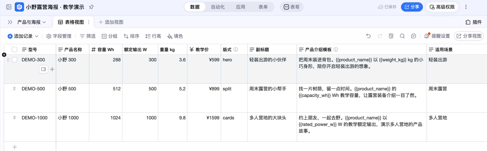
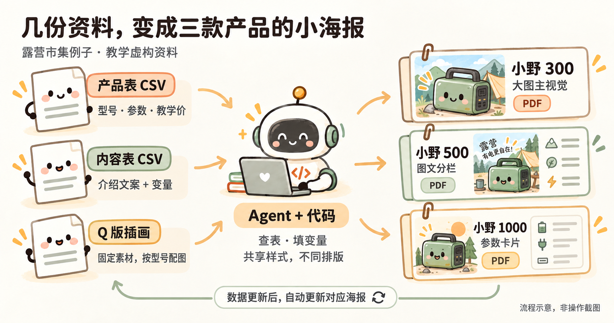

# 【产品运营部】AI 使用知识分享：从工作需求做起

> 从一项明天要交的任务开始，把一次性的结果做成以后还能继续用的小工具。

## 一、先从一件明天要交的工作开始

工作中，有些需求很具体，现成的软件却未必刚好合用。比如想把分散的资料放在一起查，按自己的规则批量处理文件，或者做一个符合自己使用习惯的页面。借助 Agent，我们可以尝试用代码把这些想法实现出来。

我们沿着一件具体的工作往下看：先把要交的东西做出来，再看怎样减少下一次的重复劳动。

周五下午，小林收到一条消息：

> 明天露营市集，三款产品各做一张小海报。要有介绍、参数、活动价，风格统一，但别长得一模一样。

过了一会儿，又来一条：

> 价格可能还要改。

小林看了一眼表格，又看了一眼时间。他需要的显然不只是一张漂亮图片——参数要对，三张要成套，临时改价还得来得及。

先看按提示词实际生成的三张海报：

<figure class="learning-figure" style="flex:1 1 180px;min-width:0;margin:0"><figcaption>小野 300 · 大图主视觉 · 599 元</figcaption></figure>
<figure class="learning-figure" style="flex:1 1 180px;min-width:0;margin:0"><figcaption>小野 500 · 图文分栏 · 999 元</figcaption></figure>
<figure class="learning-figure" style="flex:1 1 180px;min-width:0;margin:0"><figcaption>小野 1000 · 参数卡片 · 1599 元</figcaption></figure>

三张 A5 海报：小野 300 用大图，小野 500 用图文分栏，小野 1000 用参数卡片。颜色和字体风格一致，布局各有各的样子。点击图片可放大查看。

插画是生成素材，介绍、参数和价格则作为文字单独排版。这样改价格时，不需要让 AI 再画一张“数字差不多”的图。

本案例的“小野 300 / 500 / 1000”、参数、价格和插画都明确用于教学，不是真实销售资料。[查看完整生成过程：提示词与结果对照](04_参考资料/01_完整练习.html#s1)。

### 交稿前，熟悉的那条消息来了

下面的改价演示来自旧版案例；这三张 HTML 海报的后续操作记录会继续补到生成过程页。

> 小野 500 改成 899，另外两款不动。

这次小林在本地页面把 999 改成 899，点保存，然后停手。没有再发“帮我重新生成”。

后台发现变化后，只重做了小野 500。打开新 PDF，价格已经是 899；另外两款文件保持不变。

[改价前的真实截图](05_露营海报/evidence/10-three-layouts-before.png) · [保存后](05_露营海报/evidence/11-three-layouts-saved.png) · [自动更新完成](05_露营海报/evidence/12-three-layouts-after.png)

这比“AI 帮我做了三张海报”多了一点东西：**它帮小林做出了一套以后还能继续用的办法。** 下次改资料，不必重新从排版开始。

不过，保存成功和海报更新成功是两件事。案例核验了新 PDF 和另外两款文件，记录在 [验收结果](05_露营海报/evidence/acceptance.json)；不是只看页面上的数字变了就算完成。

## 二、不会写代码，怎么把它用起来？

别被刚才的结果吓住。小林开头并没有说：“请给我设计一个包含变量替换、组件化排版和增量构建的系统。”

他打开的只是一个**空文件夹**。

自己跟做时，可以用 HTML + CSS 排版，先在浏览器里看效果，再打印或保存为 PDF。

用已经安装并登录的 Codex 或 Claude Code 打开空文件夹。先把 [小野 300 示例插画](05_露营海报/assets/xiaoye-300.png){download="xiaoye-300.png"} 保存到这个文件夹，保留文件名 `xiaoye-300.png`，再把下面整段发给 Agent：

> 帮我做一张露营市集的 A5 单页产品海报。下面是完整的教学虚构资料，不是真实销售产品，不需要上网查参数。
>
> 产品名：小野 300；型号：DEMO-300。容量：288 Wh；额定输出：300 W；重量：3.6 kg；教学价：599 元。
>
> 标题：轻装出游的小伙伴。介绍：把周末装进背包。小野 300 以 3.6 kg 的小巧身形，陪你开启轻装出游的想象。
>
> 插画使用当前文件夹里的 xiaoye-300.png。请先确认能读到图片；找不到就告诉我补充，不要猜图片路径。
>
> 用 HTML 和 CSS 排版，奶油色底、森林绿点缀，产品图突出，参数和价格清楚。文字和数字单独排版，方便以后修改；页脚注明“教学虚构资料”。
>
> 把文件保存在当前文件夹，在浏览器里打开给我看。支持 A5 单页打印或保存为 PDF，检查文字、图片没有截断。先做这一张，不要上传钉钉；做好后告诉我下次打开哪个文件、在哪里改文字和价格。

先要一张，不是因为只能做一张，而是这样最容易看出自己到底想要什么。

<figure class="learning-figure" style="max-width:450px;margin:28px auto 34px">

<figcaption>使用上面的提示词，由 GPT-5.6 Sol（High）生成。点击图片可放大查看。</figcaption>
</figure>

<a href="04_参考资料/01_完整练习.html">查看完整生成过程：提示词与结果对照</a>

### 你负责看结果，也负责说“不对”

第一张出来后，小林说：“方向对，但三张都这样排，有点像复制粘贴。”

于是接着提：

> 300 保留大图；500 改成图片在左、参数在右；1000 用三张参数卡片。三张只共享颜色、字体和组件样式，布局要不同，不要修改产品数据。

**共享样式，不等于共享排版。** 就像同一套积木，可以搭出不同的东西。共同的颜色和字体放在一处管理，每张海报决定自己的摆法。这种组织方式借鉴了 [Auto-Manual](https://github.com/Bingboom/Hello-Docs)，没有照搬说明书的外观。

你不用先会写布局文件，也能判断：数字有没有错？文字是不是挤了？三张像不像一个系列？

发现问题，就截下真实结果，具体地说：

> 小野 500 的介绍挤到价格上了。请调整间距，保留现在的左右分栏，另外两张不动。改好后再打开给我看。

这就是修改与调试的起点。本次制作也遇到过字体不可用、编译失败，修正配置后才生成成功。报错不是故事的结尾，是下一次修改的线索。

### 为什么后来又有了表格和变量？

因为小林不想下次换产品时，还得重新发一遍所有资料。

于是产品表放名称、参数和价格，内容表放介绍模板，用型号把两边对应起来。本地以 CSV 保存，整理后也放进了钉钉教学表：

[打开钉钉教学表：产品与海报](https://alidocs.dingtalk.com/i/nodes/jb9Y4gmKWr75RdmdSeQzdAlkVGXn6lpz?utm_scene=person_space&iframeQuery=viewId%3DqvGDAH2%26sheetId%3DhERWDMS)

比如介绍模板留两个空位：

> {{product_name}} 的 {{capacity_wh}} Wh 教学容量

程序按型号查表，填出来就是：

> 小野 500 的 512 Wh 教学容量

大括号是变量标记。你可以把它理解成“这里请填表格里的值”，不是“这里请 AI 自由发挥”。

先有“下次能不能少做一遍”的需求，再遇见表格、变量和组件，不必反过来先背完一套术语。

[想看变量的小练习](03_GitHub原例/阅读版.html) · [想知道代码怎样配合](04_参考资料/02_代码怎样工作.html)

## 三、从做一次，到以后都能用

能做出海报之后，小林才继续加要求。不是一次提得越多越好，而是每加一项，都能试一试到底有没有用。

### 第一件事：别让我每次都喊“再生成一次”

> 让我在本地页面改价格。保存后，工具自己发现变化，只更新受影响的海报。告诉我哪款更新成功、最近改了什么；失败时保留上一次成功的文件。

第三节的改价演示，就是这一步的结果。程序持续检查资料变化，生成后记录版本和状态。电脑要保持唤醒，本地服务也要运行；关掉服务，它不会自己继续工作。

想亲手复现，素材包里的小野 500 已是 899：先在本地改回 999、等生成成功，再改成 899。保存后不要追加生成指令，等状态成功，再打开 PDF 检查。

启动工具时，也不必先背命令。可以直接让有终端工具的 Agent “启动工作台、打开页面，并告诉我用完怎么关闭”。它通过命令调用程序，这种入口叫 **CLI**。[具体运行说明](05_露营海报/README.html) 留着需要时查。

### 第二件事：别把文件变成“最终版真的最终版”

确认三张海报都能用了，就留一个存档点。下次改坏了，至少知道上一版长什么样。

这件事由 **Git** 管：在本机记录文件版本、查看改动。需要同步和协作时，再推送到 **GitHub**；也可以用 GitHub Desktop 的按钮操作。

> 帮我查看这次改动，确认没有账号信息或临时文件。先展示差异，等我确认后再保存一个版本，说明这次做成了什么。

Git 不会自动记住每次修改，确认能用时要主动存一版。[版本管理的图解步骤](04_参考资料/04_GitHub.html) · [下次还用得上的资料怎么整理](04_参考资料/03_整理输入资料.html)。

### 第三件事：同事去哪里拿海报？

小林不想在群里反复发附件。同事本来就在钉钉查产品，那就把海报放回对应的产品行。

接好钉钉 **MCP** 后，Agent 可以调用服务提供的工具，在账号权限和工具支持范围内读表、写表、上传附件。你给目标位置和要求，不用自己先找字段 ID、记录 ID：

> 把三款最终海报的 PNG 和 PDF，按型号放到教学表对应行。不要覆盖其他字段。完成后重新读取这三行，检查型号与附件是否对应。

本案例已经完成这次上传：三张 PNG、三份 PDF，按型号放好并回读核对。可以到 [教学表](https://alidocs.dingtalk.com/i/nodes/jb9Y4gmKWr75RdmdSeQzdAlkVGXn6lpz?utm_scene=person_space&iframeQuery=viewId%3DqvGDAH2%26sheetId%3DhERWDMS) 点开查看；要自己改数据，请先复制测试表。

上传后又通过 MCP 回读三条记录，核对型号、参数、价格和附件。第一次发现 5 个附件尺寸异常，重新上传并再次核对后才完成。

CLI 和 MCP 都是让 Agent 使用工具的入口。模型更强，不代表自动有账号权限；连接成功，也不代表任务已经完成。[钉钉 MCP 连接与操作说明](04_参考资料/05_钉钉MCP.html)。

### 那以后在钉钉改价，也会自己更新吗？

现在跑通的是本地自动生成和一次上传。继续往下，这个小工具还可以加入更多产品、批量生成、审核和版本记录；也可以接通钉钉，在资料变化后自动更新海报和附件。需要哪一项，就在现有项目上继续增加。

这些仍是后续方向。真正接通后，要在测试表里实际改一款资料，确认新海报和附件会更新，失败时旧文件仍然保留。

## 四、海报之外，Agent 还能接着做什么？

周末市集结束，小林以为这个工具可以收起来了。周一，同事看过海报，问了三个问题：

> 下次上十款产品，也能这样做吗？
>
> 不去现场的人，能不能在手机上看？
>
> 顾客问得最多的问题，能不能补进下一版介绍？

这时，海报就不只是海报了。它成了一个起点：已经有整理好的资料、有能复用的样式，也有可以继续修改的程序。接下来，不必换一个大而空的目标，顺着这三个问题往前走就好。

下面是可以继续尝试的延伸场景，不是本案例已经完成的功能。

### 从三张海报，到一整场活动的物料

十款产品，不只是把“生成三次”改成“生成十次”。有的产品名很长，有的缺图，有的没有活动价；同一个价格又可能同时出现在海报、价签和销售介绍卡上。

小林可以接着说：

> 仍用这份产品表，为下次活动做海报、桌面价签和销售介绍卡。共用品牌风格，各自排版。缺资料的先列出来，不要编；先拿两款差别最大的产品试做，我确认后再批量生成。

要挑战的能力从“做出一页”变成了“让一批不同的东西都做对”：资料怎么对应、样式怎么复用、长文字怎么处理、哪些产品应该暂停生成。这类多条件配合的任务，可以继续交给 Agent 尝试，再检查实际结果。

### 从打印出来，到让人打开就能看

再往前一步，小林想给没来现场的同事发一个链接，而不是六个附件。

> 用同一份资料做一个手机上也好看的产品展示页，能按使用场景筛选、对比参数、下载海报。先在本地打开给我看，确认后再决定放到哪里。

前面的海报已经用 HTML 把资料、图片和版式组织在一起。这里再换成产品卡片、筛选和下载，同样是在已有项目上继续增加一项具体能力。

这里要检查的也更具体：筛选有没有漏产品，参数有没有串行，手机上按钮能不能点。页面做出来之后，还要单独安排托管，才能真的把链接发给别人。

### 从发出去，到知道下一版该改什么

活动结束，大家问得最多的可能不是参数，而是“我这种使用场景，该看哪一款？”小林不想让这些问题散在聊天记录里。

> 在展示页上增加自愿反馈入口，只收集问题和使用场景。把反馈整理回测试表，归纳常见问题，给出介绍文案的修改建议。不要自动改产品参数；我确认文案后，再更新相关物料。

这一步就不只是生成内容了：要连接页面、表格和反馈，分清“顾客说了什么”和“产品事实是什么”，还要决定哪里自动做、哪里停下来等人确认。真正开放使用前，需要验证接收服务、权限和隐私说明。

**任务升级了，对模型的要求也升级了。** 从一张海报，到一份表批量生成物料，再到多个工具之间的协作——值得期待的是它能否理解更多关联、处理例外、修改后不破坏原来的功能，而不是单纯一次写更多代码。

### 今天先走哪一步？

先挑一件自己确实需要完成、又经常重复的工作，把现有资料和想要的结果交给 Agent：

> 我每次都要把这份资料整理成这个结果。请先帮我做最小的一版，打开给我看；我确认后，再考虑批量和自动更新。

先检查第一版是否真的解决问题，再决定要不要继续投入。能省下重复操作、能被核对、下次还能接着用，才值得把它逐步做成工具。

想多懂一点原理，可以读 [the craft of selfteaching](https://github.com/selfteaching/the-craft-of-selfteaching)。它不是海报生成器，而是一份适合边学边试的学习资料。本分享另做了 [一句产品介绍的小练习](03_GitHub原例/阅读版.html)：运行一次，只改价格，再看输出，先弄明白一个小变化。

## 附录 1：跟着小林，从空文件夹做出一个海报工具

准备一台电脑、已登录的 Codex 或 Claude Code，以及一个空文件夹。下面从 HTML + CSS 海报开始，先用浏览器预览和打印。产品资料仅用于教学；后续需要安装软件时，先让 Agent 解释用途，再确认。

### 1. 打开空文件夹

**对 Agent 说：**

> 我不懂编程，想做一个露营产品海报工具。请带我一步步做，每次只告诉我当前需要做什么。由你创建文件和代码、检查环境；安装软件先问我。先做出一张海报，不要一开始做完整系统。

**看到这些再继续：** Agent 确认文件夹位置、说明下一步要提供哪些资料。看不懂就问“我现在需要点哪里？”

### 2. 提供资料，先核对表格

| 产品 | 容量 | 输出 | 重量 | 教学价 | 介绍场景 |
| --- | --- | --- | --- | --- | --- |
| 小野 300 | 288 Wh | 300 W | 3.6 kg | 599 元 | 轻装出游 |
| 小野 500 | 512 Wh | 500 W | 5.2 kg | 999 元 | 周末露营 |
| 小野 1000 | 1024 Wh | 1000 W | 9.8 kg | 1599 元 | 多人营地 |

**对 Agent 说：**

> 把这些教学虚构资料整理成表格保存，为每款写一句介绍。涉及容量、重量等参数时，从表格取值，不要编。展示整理结果；以后参数改了，生成的介绍也要使用新值。

**看到这些再继续：** 三款资料没有漏，数字正确，介绍与型号对应。资料如何保存、变量如何替换，让 Agent 实现。

### 3. 先做一张，再扩展成三张

先提供自己的产品图，或对有图片生成功能的工具说：

> 画一张露营便携电源的 Q 版插画，森林绿配奶油色，圆润可爱，不要文字、参数和价格。先做小野 300，确认后再做同系列的另外两款。

**再对 Agent 说：**

> 用参数、介绍和插画做小野 300 的 A5 单页海报，用 HTML 和 CSS 排版。在浏览器里打开给我看，并支持打印或保存为 PDF。文字和价格以后要能修改。

第一张看过后再说：

> 再做另外两款。三张共享颜色、字体和组件样式，但分别用大图、图文分栏和参数卡片排版。

**看到这些再继续：** 三张海报在浏览器里显示正常。打开打印预览，选择 A5 纸张，关闭浏览器页眉页脚，检查每款各占一页，没有缺字或截断，数字正确，再保存为 PDF。

### 4. 做页面，测试自动更新

**对 Agent 说：**

> 做一个本地页面，让我看资料、改价格、查看海报。保存后自动更新对应的 HTML 海报，不用我再说“重新生成”。先保留浏览器打印和保存 PDF 的方式。请启动并打开页面，告诉我下次怎么打开、用完怎么关闭。

**亲自做一次：** 把小野 500 从 999 改成 899，保存后打开对应海报，确认价格更新，再看另外两款是否未变。重新打印并保存一份 PDF，核对其中也是 899；之前保存的 PDF 不会随网页变化。

如果不一致，把现象告诉 Agent，让它排查后陪你重新测试。页面改价、海报更新和导出 PDF 都要实际试过。

用顺手后，再考虑增加“改价后自动导出 PDF”。这一步可能需要浏览器自动化工具，另让 Agent 说明运行条件并验证。

### 5. 让工具说明状态，并保留好文件

**对 Agent 说：**

> 告诉我每款最近什么时候更新、改了什么、有没有成功。资料缺失或填错要提示，不要猜；生成失败时保留上一份成功海报。请在测试副本里验证这些情况。

**看到这些再继续：** Agent 展示失败提示和测试结果，旧海报还能打开，失败没有被记成成功。最后让它留下“怎么打开、换资料、换图、检查和排错”的简短说明。

### 6. 本地确认后，再放到钉钉

先从已经确认的 HTML 海报导出 PDF；需要图片预览时，再让 Agent 导出 PNG 并核对。按 [连接说明](04_参考资料/05_钉钉MCP.html) 配好 MCP，不要把密码贴进对话。提供自己有权限的测试空间链接，然后说：

> 在这个空间为教学产品建立“产品与海报”多维表，放入三款参数、介绍，以及对应图片和 PDF。已有表先核对，不重复建表，不修改其他资料。完成后给我链接，回读检查每一行。

**亲自做一次：** 在表格里逐行点开图片和 PDF，核对型号。真实操作截图就在实际页面截取，不用生成图代替。

如果还想做钉钉自动更新，另提下一步需求：

> 请先说明钉钉数据变化后自动生成、上传新海报，需要哪些权限和持续运行条件。我确认后再做；失败时保留旧附件。

这一步是后续扩展，本案例尚未跑通。验收时必须实际改一款数据，确认文件和附件自行更新，不能用一次人工上传代替。

[完整练习](04_参考资料/01_完整练习.html){.process-cta-link} · [技术与运行说明](05_露营海报/README.html) · [现场演示脚本](05_露营海报/演示脚本.html) · [真实截图与素材清单](05_露营海报/素材清单.html)

从一个小结果开始：先做出来，看清它怎么工作，再改成自己需要的样子。

## 附录 2：从 GitHub 找参考仓库，做成自己的工具

小林准备给海报工具加一个产品展示页。正想从头描述，同事提醒他：“这种东西，可能已经有人做过了。”

不用每次都从空文件夹开始。另一条入口是：**找到一个接近需求的项目，先跑起来，再改成自己的。** GitHub 上存放项目文件的地方叫“仓库”，可以把它理解成带说明书的工具材料包。

### 1. 先说要做什么，再想搜什么

小林想找的不是“厉害的 AI 项目”，而是“能展示产品、筛选、下载海报的网页”。功能越具体，越容易找到可以借鉴的东西。

打开 [GitHub](https://github.com/)，试着搜 `product catalog`（产品目录）、`product showcase`（产品展示）。如果要找海报生成工具，可以试 `poster generator`；找批量文档工具，可以试 `document generation`。先搜最想解决的一个功能，不必把所有要求塞进搜索框。

也可以把需求交给能联网的 Agent：

> 我想用产品表和图片做一个展示页，能按场景筛选、查看参数、下载海报。请在 GitHub 找 3 个接近的参考仓库，给我实际查到的链接、效果示例和简单比较。优先选说明清楚、能在本地试用的小项目，先不要下载运行。

**这一步的结果：** 得到几个能打开的仓库链接，知道各自哪里接近自己的需求，而不是收集一长串看不懂的项目名字。

### 2. 先看效果和说明，不用先读代码

打开候选仓库，先看截图或演示，再看 `README`（使用说明）。小林关心四件事：它现在能做什么；自己的电脑能不能运行；需要账号、付费服务或额外软件吗；能否按许可证要求修改和使用。

看不懂，就把链接交给 Agent：

> 请读这个仓库的说明和 LICENSE，用小白能听懂的话告诉我：哪些功能已经有，哪些还需要改，运行起来要准备什么。有没有必须联网或上传数据的地方？先给我建议，不执行安装命令。

`LICENSE` 是使用许可。公开能看见，不等于可以任意复制、修改和发布；没找到许可时，先确认，不急着搬代码。Star 多可以作为线索，但不能代替“适不适合我”。

**这一步的结果：** 选出一个小而接近的项目，讲得清“借它什么、自己改什么”。学习资料和成品工具也要分开：比如 [the craft of selfteaching](https://github.com/selfteaching/the-craft-of-selfteaching) 适合学习，不是现成的海报生成器。

### 3. 把选中的仓库放到电脑上

偶尔试一次，可以在仓库页面点 **Code → Download ZIP**，下载后解压到单独文件夹。不要只打开其中一段代码，要让 Agent 看到整个项目及其说明。

准备持续修改，建议用 [GitHub Desktop](https://desktop.github.com/)：安装后选择 **File → Clone Repository → URL**，粘贴仓库网址，选保存位置，再点 **Clone**。这就是把仓库下载到本机，同时保留版本历史。

先在本地试用，不必先 Fork。以后想把改造版放到自己账号，再按项目许可决定是否 Fork——也就是在 GitHub 上建立自己的仓库副本。

图中展示了先 Fork 再 Clone 的可选路线；本地试用按上面的步骤直接 Clone 即可。

### 4. 先跑原来的例子，别急着大改

用 Codex 或 Claude Code 打开项目文件夹，对 Agent 说：

> 先读这个项目的 README，帮我检查运行条件。需要安装软件或执行下载脚本，先解释用途，等我确认。用项目自带的示例资料在本地运行，打开给我看；先不要修改功能，也不要连接公司账号或上传业务资料。

如果报错，把实际报错交给它继续排查。先用示例数据，不把密码、客户资料塞进去“试试看”。

**这一步的结果：** 原项目在自己的电脑上能运行，知道怎么打开、怎么关闭。下载到文件夹，只算拿到了材料，还不算工具已经能用。

### 5. 每次只改一个看得见的部分

小林先不提“接钉钉、自动更新、收集反馈”，只换一张产品卡：

> 把示例中的一张产品卡换成小野 500 的教学资料和图片，保留现有布局、筛选和按钮。请先说明需要改哪些文件，再修改并打开结果给我看。资料缺了就问，不要猜。

确认产品名、参数和图片都对应后，再提下一步：

> 把另外两款也接进来，数据统一从产品表读取。每张卡的下载按钮要对应自己的海报，别把三款都指向同一份文件。

亲自点开三款产品，试一次筛选，再分别下载。做对一小步，再加下一项功能；发现问题，就告诉 Agent 哪个操作、哪里不对、期望怎样。

**这一步的结果：** 不只是换了个标题，而是拿自己的资料，真正完成了一次需要的操作。

### 6. 留下自己的版本，下次接着用

改好后，让 Agent 留一份简短说明：

> 请写清楚怎么启动和关闭、在哪里换产品资料和图片、怎么检查下载文件。保留原项目的来源、许可证和署名要求，并说明我们改了哪些功能。然后展示本次差异，等我确认后，用 Git 保存一个能用的版本。

用 GitHub Desktop 可以查看 **Changes**，确认改动后填写说明、点击 **Commit**。如果最初下载的是 ZIP，先让 Agent 帮忙初始化本地 Git 仓库。需要同步或分享时，再决定是否上传；不要把密钥和未经授权的业务资料一起传上去。

[GitHub 下载、版本保存和推送的详细图解](04_参考资料/04_GitHub.html)

从空文件夹开始，是把需求交给 Agent 实现；从参考仓库开始，是带着一个已经存在的做法继续改造。两条路的落脚点一样：**先让它在你这里能用，再让它更适合你。**

## 彩蛋：一句话生成会骑车的鹈鹕

这个例子留在文末，供大家观察模型面对一句很开放的要求时，会怎样补全代码、画面和交互。真正使用时，还是从手头需要完成的工作出发，再决定要不要继续投入。

> 生成鹈鹕骑车的 HTML

把这句话发给 GPT-6 Astra（High），一次生成的作品如下。提示词没有规定画风、分镜和交互，但交付物补出了画面、动作、暂停、调速和车铃。

<iframe src="06_动画示例/pelican-bike.html" title="鹈鹕海边骑行动画，可暂停、调速和按铃" loading="lazy" sandbox="allow-scripts" style="display:block;width:100%;height:780px;border:1px solid #e7e4de;border-radius:14px;background:#f7f4e9;"></iframe>

[单独打开动画](06_动画示例/pelican-bike.html) · [查看模型说明、实现细节和测试方法](04_参考资料/06_GPT-6-Astra.html)

看作品时可以检查三件事：脚是否跟着踏板运动，车轮、围巾和背景是否彼此配合，暂停和调速是否真的生效。还可以只提一个修改：

> 只把围巾改成蓝色，其他画面和动作不变。

这和修改工作工具时的要求是相通的：知道该改哪里，也知道哪些部分必须保留。无论作品有趣还是实用，都要打开实际结果核对，不能只听 Agent 说“已经完成”。
