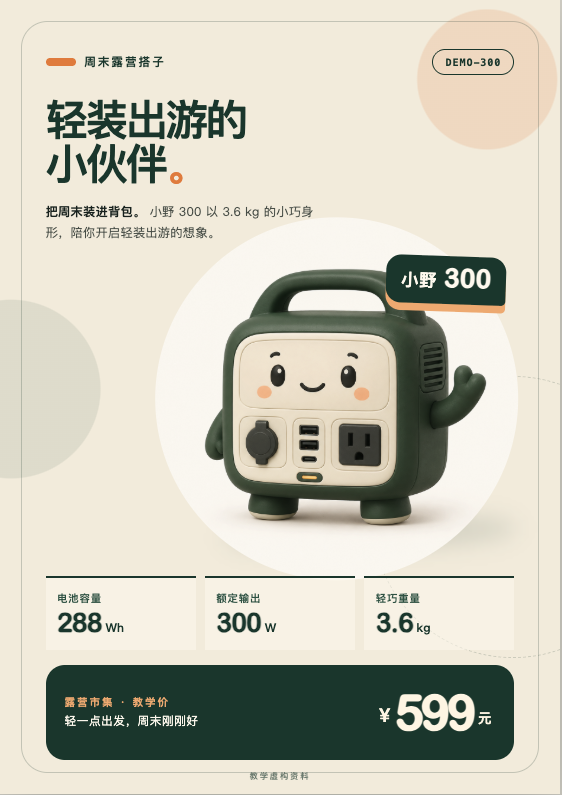
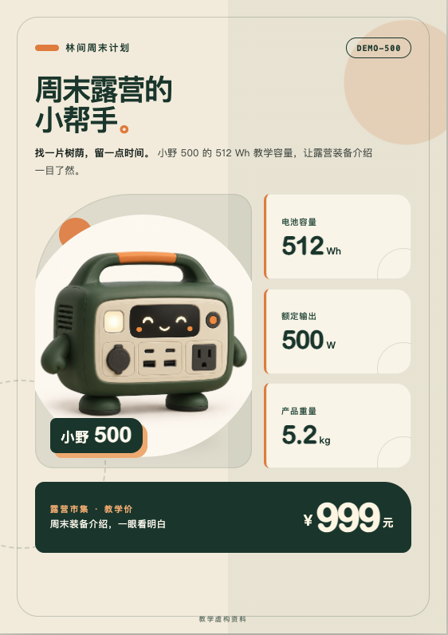
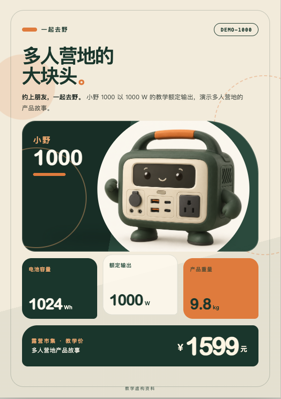
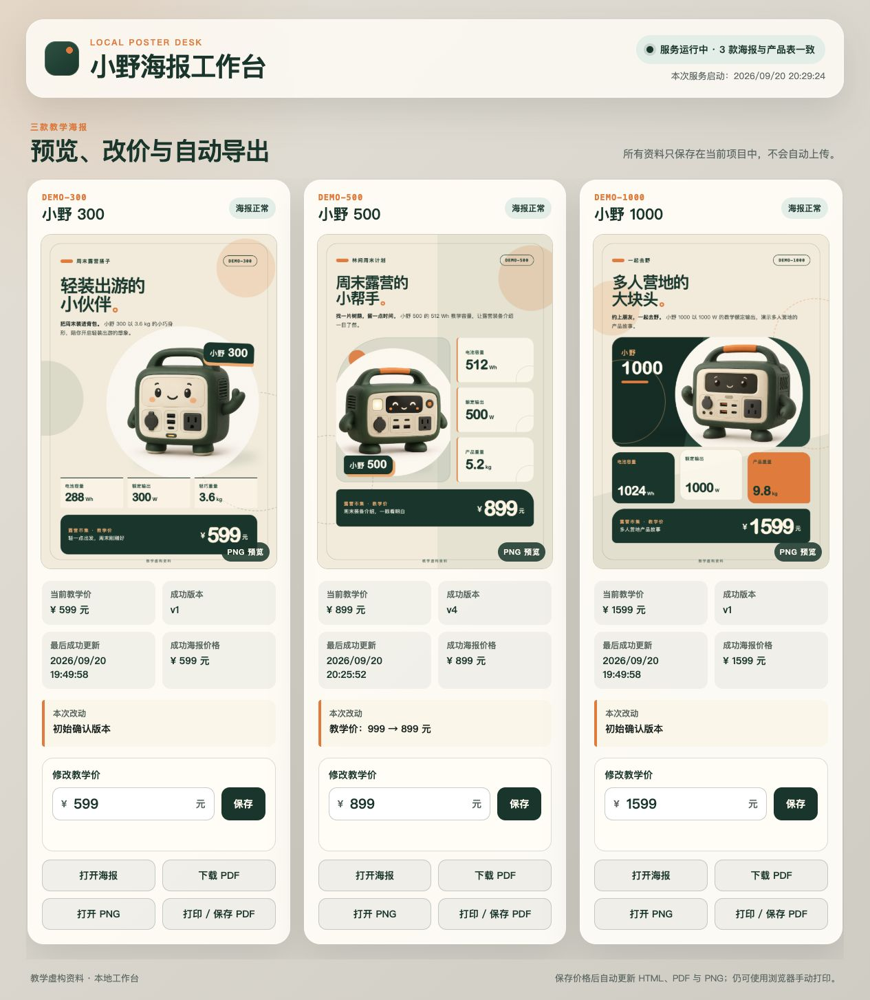
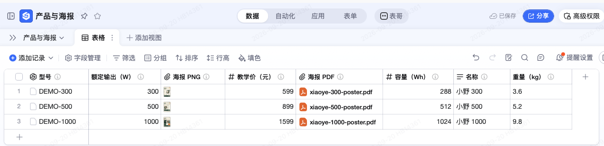
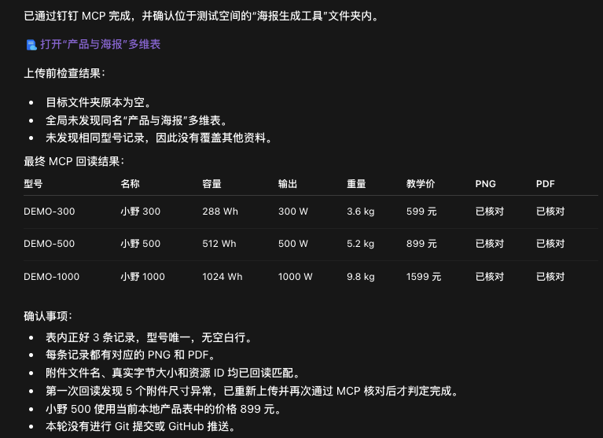

# 【产品运营部】AI 使用知识分享：从工作需求做起

## 一、先从一件具体的工作开始

工作中，有些需求很具体，现成的软件却未必能直接合用。比如想按自己的规则批量处理文件，或者做一个符合自己工作习惯的小工具。借助 Agent，我们可以尝试用代码把这些想法实现出来。

我们沿着一件具体的工作往下看：先把要交的东西做出来，再看怎样减少下一次的重复劳动。

周五下午，小林收到一条消息：

> 明天露营市集，三款产品各做一张小海报。要有介绍、参数、活动价，风格统一，但别长得一模一样。

先看最终做出的三张海报：小野 300 是把资料和提示词交给 Agent 后一次生成的；小野 500 和 1000 也由提示词生成，只是在看过第一张后调整了提示词，分别换成图文分栏和参数卡片布局。

<figure class="learning-figure" style="flex:1 1 180px;min-width:0;margin:0"><figcaption>小野 300 · 大图主视觉 · 599 元</figcaption></figure>
<figure class="learning-figure" style="flex:1 1 180px;min-width:0;margin:0"><figcaption>小野 500 · 图文分栏 · 999 元</figcaption></figure>
<figure class="learning-figure" style="flex:1 1 180px;min-width:0;margin:0"><figcaption>小野 1000 · 参数卡片 · 1599 元</figcaption></figure>

三张 A5 海报：小野 300 用大图，小野 500 用图文分栏，小野 1000 用参数卡片。颜色和字体风格一致，布局各有各的样子。点击图片可放大查看。

插画是生成素材，介绍、参数和价格则作为文字单独排版。这样改价格时，不需要让 AI 再画一张“数字差不多”的图。

本案例的“小野 300 / 500 / 1000”、参数、价格和插画都明确用于教学，不是真实销售资料。

<a href="04_参考资料/01_完整练习.html">查看完整生成过程</a>

## 二、打开一个空文件夹

这三张海报不是为了教程重新编出来的。小林从一个空文件夹开始，后面的提示词、修改记录和截图都来自同一次真实制作。主稿只讲关键转折；逐字提示词和每一步的真实结果留在完整过程里，不在这里重抄。

### 1. 先做一张，看清方向

小林用 Codex 打开空文件夹，把三张现成插画放进去。第一轮只做小野 300：资料、标题、介绍、图片文件名和 A5 排版要求一次说清，同时要求文字和数字单独排版，方便以后修改。

第一张出来后，先看产品名、参数、价格和图片是否对应，再看文字有没有截断、能不能打印。先做一张，不是因为只能做一张，而是这样最容易看清自己到底想要什么。

### 2. 再补两张，不复制版式

方向确认后，小林补充小野 500 和小野 1000 的资料：三张共享颜色、字体和组件样式，但分别采用大图、图文分栏和参数卡片。

**共享样式，不等于共享排版。** 就像同一套积木，可以搭出不同的东西。共同的颜色和字体放在一处管理，每张海报决定自己的摆法。这种组织方式借鉴了 [Auto-Manual](https://github.com/Bingboom/Hello-Docs)，没有照搬说明书的外观。

你不用先会写布局文件，也能判断：数字有没有错？文字是不是挤了？三张像不像一个系列？发现问题，就指出是哪一张、哪里不对、希望保留什么。修改和调试就是从这样的反馈开始。

## 三、改一次价，不用重新来

三张海报方向确认后，小林让 Agent 把产品资料和介绍保存到项目里，再做一个能查看资料、修改价格和打开海报的本地工作台。这里不再重复搭建步骤，直接看它能不能处理一次真实变化。

### 1. 做本地页面，测一次自动更新

页面做好后，熟悉的那条消息来了：

> 小野 500 改成 899，另外两款不动。

小林在本地页面把 999 改成 899，点保存，然后停手，没有再发“帮我重新生成”。后台发现变化后，只重做了小野 500；另外两款保持不变。

<figure class="learning-figure">

<figcaption>工具继续完善后的真实工作台：小野 500 已更新为 899 元，另外两款保持不变；三款均可打开海报并下载 PDF、PNG。</figcaption>
</figure>

真正要检查的是整条链路：页面里的价格变了，海报也要更新；小野 300 和 1000 不能被误改；新 PDF 里仍然要是 899。保存成功和海报更新成功是两件事，案例的核验结果记录在 [验收结果](05_露营海报/evidence/acceptance.json)。

为什么这里要用表格和变量？因为产品名、参数和价格只要在表格里改一次，海报和介绍就能读取同一份资料，不必重新发送全部内容。像 `{{product_name}}` 这样的标记，可以理解成“这里填表格里的产品名”，不是让 AI 自由发挥。

启动工具时，也不必先背命令。可以直接让有终端工具的 Agent 启动工作台、打开页面，并说明用完怎么关闭。它通过命令调用程序，这种入口叫 **CLI**。[具体运行说明](05_露营海报/README.html) 留着需要时查。

### 2. 别把文件变成“最终版真的最终版”

确认三张海报都能用，就应该留一个存档点。工具还应说明每款最近改了什么、有没有成功；资料错误要提示，生成失败时要保留上一份成功结果。最后留下一份简短说明，写清怎么启动、换资料、换图和排错。

确认结果可用时，再用 **Git** 在本机记录这个版本和改动。需要多端同步或与别人协作时，再推送到 **GitHub**；也可以用 GitHub Desktop 操作。具体步骤留在后文的 GitHub 附录。[下次还用得上的资料怎么整理](04_参考资料/03_整理输入资料.html)。

### 3. 同事去哪里拿海报？

小林不想在群里反复发附件。同事本来就在钉钉查产品，那就把确认过的 PNG 和 PDF 放回对应的产品行。接好钉钉 **MCP** 后，Agent 可以在账号权限和工具支持范围内读表、写表和上传附件；MCP 就是让 Agent 连接这些工作工具的方式之一。

本案例已经完成这次上传：三张 PNG、三份 PDF 按型号放好，并重新读取三条记录，核对型号、参数、价格和附件。可以到 [教学表](https://alidocs.dingtalk.com/i/nodes/jb9Y4gmKWr75RdmdSeQzdAlkVGXn6lpz?utm_scene=person_space&iframeQuery=viewId%3DqvGDAH2%26sheetId%3DhERWDMS) 点开查看；要自己改数据，请先复制测试表。

第一次回读发现附件尺寸异常，重新上传并再次核对后才完成。连接成功不等于任务完成，结果仍要打开检查。

[现场演示脚本](05_露营海报/演示脚本.html) · [真实截图与素材清单](05_露营海报/素材清单.html)

到这里，小林得到的已经不只是一张海报，而是一套能继续修改的办法：资料放在一处，改价会更新对应结果，也知道怎样留住可用版本、让同事取到文件。下次换资料，不用再从排版开始。

想直接试用，可以下载已经跑通的本地工作台，支持 macOS 和 Windows。解压后先看包内 README；它只在本机运行，不会自动连接钉钉或 GitHub。

<a href="downloads/xiaoye-poster-workbench.zip" download>下载最终小工具：小野海报工作台（ZIP）</a>

## 四、接下来还能往哪儿走

这套工具已经有整理好的资料、能复用的样式和可以继续修改的程序。接下来不用换一个大而空的目标，只要顺着真实需求继续加一项能力：

- **十款产品批量出物料：** 用同一份产品表生成海报、价签和销售介绍卡，缺资料的先停下来，不要编。
- **做成手机能看的展示页：** 把同一份资料变成可筛选、可对比、可下载海报的页面，先在本地核对，再决定放到哪里。
- **收集反馈改下一版：** 把大家的问题和使用场景整理回来，提出文案修改建议；产品参数仍由人确认。

今天先挑一件自己确实需要完成、又经常重复的工作，把现有资料和想要的结果交给 Agent：

> 我每次都要把这份资料整理成这个结果。请先帮我做最小的一版，打开给我看；我确认后，再考虑批量和自动更新。

先检查第一版是否真的解决问题，再决定要不要继续投入。

## 附录：从 GitHub 找参考仓库，做成自己的工具

小林准备给海报工具加一个产品展示页。正想从头描述，同事提醒他：“这种东西，可能已经有人做过了。”

不用每次都从空文件夹开始。另一条入口是：**找到一个接近需求的项目，先跑起来，再改成自己的。** GitHub 上存放项目文件的地方叫“仓库”，可以把它理解成带说明书的工具材料包。

### 1. 先说要做什么，再想搜什么

小林想找的不是“厉害的 AI 项目”，而是“能展示产品、筛选、下载海报的网页”。功能越具体，越容易找到可以借鉴的东西。

打开 [GitHub](https://github.com/)，试着搜 `product catalog`（产品目录）、`product showcase`（产品展示）。如果要找海报生成工具，可以试 `poster generator`；找批量文档工具，可以试 `document generation`。先搜最想解决的一个功能，不必把所有要求塞进搜索框。

也可以把需求交给能联网的 Agent：

> 我想用产品表和图片做一个展示页，能按场景筛选、查看参数、下载海报。请在 GitHub 找 3 个接近的参考仓库，给我实际查到的链接、效果示例和简单比较。优先选说明清楚、能在本地试用的小项目，先不要下载运行。

**这一步的结果：** 得到几个能打开的仓库链接，知道各自哪里接近自己的需求，而不是收集一长串看不懂的项目名字。

### 2. 先看效果和说明，不用先读代码

打开候选仓库，先看截图或演示，再看 `README`（使用说明）。小林关心四件事：它现在能做什么；自己的电脑能不能运行；需要账号、付费服务或额外软件吗；能否按许可证要求修改和使用。

看不懂，就把链接交给 Agent：

> 请读这个仓库的说明和 LICENSE，用小白能听懂的话告诉我：哪些功能已经有，哪些还需要改，运行起来要准备什么。有没有必须联网或上传数据的地方？先给我建议，不执行安装命令。

`LICENSE` 是使用许可。公开能看见，不等于可以任意复制、修改和发布；没找到许可时，先确认，不急着搬代码。Star 多可以作为线索，但不能代替“适不适合我”。

**这一步的结果：** 选出一个小而接近的项目，讲得清“借它什么、自己改什么”。学习资料和成品工具也要分开：比如 [the craft of selfteaching](https://github.com/selfteaching/the-craft-of-selfteaching) 适合学习，不是现成的海报生成器。

### 3. 把选中的仓库放到电脑上

偶尔试一次，可以在仓库页面点 **Code → Download ZIP**，下载后解压到单独文件夹。不要只打开其中一段代码，要让 Agent 看到整个项目及其说明。

准备持续修改，建议用 [GitHub Desktop](https://desktop.github.com/)：安装后选择 **File → Clone Repository → URL**，粘贴仓库网址，选保存位置，再点 **Clone**。这就是把仓库下载到本机，同时保留版本历史。

先在本地试用，不必先 Fork。以后想把改造版放到自己账号，再按项目许可决定是否 Fork——也就是在 GitHub 上建立自己的仓库副本。

图中展示了先 Fork 再 Clone 的可选路线；本地试用按上面的步骤直接 Clone 即可。

### 4. 先跑原来的例子，别急着大改

用 Codex 或 Claude Code 打开项目文件夹，对 Agent 说：

> 先读这个项目的 README，帮我检查运行条件。需要安装软件或执行下载脚本，先解释用途，等我确认。用项目自带的示例资料在本地运行，打开给我看；先不要修改功能，也不要连接公司账号或上传业务资料。

如果报错，把实际报错交给它继续排查。先用示例数据，不把密码、客户资料塞进去“试试看”。

**这一步的结果：** 原项目在自己的电脑上能运行，知道怎么打开、怎么关闭。下载到文件夹，只算拿到了材料，还不算工具已经能用。

### 5. 每次只改一个看得见的部分

小林先不提“接钉钉、自动更新、收集反馈”，只换一张产品卡：

> 把示例中的一张产品卡换成小野 500 的教学资料和图片，保留现有布局、筛选和按钮。请先说明需要改哪些文件，再修改并打开结果给我看。资料缺了就问，不要猜。

确认产品名、参数和图片都对应后，再提下一步：

> 把另外两款也接进来，数据统一从产品表读取。每张卡的下载按钮要对应自己的海报，别把三款都指向同一份文件。

亲自点开三款产品，试一次筛选，再分别下载。做对一小步，再加下一项功能；发现问题，就告诉 Agent 哪个操作、哪里不对、期望怎样。

**这一步的结果：** 不只是换了个标题，而是拿自己的资料，真正完成了一次需要的操作。

### 6. 留下自己的版本，下次接着用

改好后，让 Agent 留一份简短说明：

> 请写清楚怎么启动和关闭、在哪里换产品资料和图片、怎么检查下载文件。保留原项目的来源、许可证和署名要求，并说明我们改了哪些功能。然后展示本次差异，等我确认后，用 Git 保存一个能用的版本。

用 GitHub Desktop 可以查看 **Changes**，确认改动后填写说明、点击 **Commit**。如果最初下载的是 ZIP，先让 Agent 帮忙初始化本地 Git 仓库。需要同步或分享时，再决定是否上传；不要把密钥和未经授权的业务资料一起传上去。

[GitHub 下载、版本保存和推送的详细图解](04_参考资料/04_GitHub.html)

从空文件夹开始，是把需求交给 Agent 实现；从参考仓库开始，是带着一个已经存在的做法继续改造。两条路的落脚点一样：**先让它在你这里能用，再让它更适合你。**

## 彩蛋：一句话生成会骑车的鹈鹕

这个例子留在文末，供大家观察模型面对一句很开放的要求时，会怎样补全代码、画面和交互。真正使用时，还是从手头需要完成的工作出发，再决定要不要继续投入。

> 生成鹈鹕骑车的 HTML

把这句话发给 GPT-6 Astra（High），一次生成的作品如下。提示词没有规定画风、分镜和交互，但交付物补出了画面、动作、暂停、调速和车铃。

<iframe src="06_动画示例/pelican-bike.html" title="鹈鹕海边骑行动画，可暂停、调速和按铃" loading="lazy" sandbox="allow-scripts" style="display:block;width:100%;height:780px;border:1px solid #e7e4de;border-radius:14px;background:#f7f4e9;"></iframe>

[单独打开动画](06_动画示例/pelican-bike.html) · [查看模型说明、实现细节和测试方法](04_参考资料/06_GPT-6-Astra.html)

看作品时可以检查三件事：脚是否跟着踏板运动，车轮、围巾和背景是否彼此配合，暂停和调速是否真的生效。还可以只提一个修改：

> 只把围巾改成蓝色，其他画面和动作不变。

这和修改工作工具时的要求是相通的：知道该改哪里，也知道哪些部分必须保留。无论作品有趣还是实用，都要打开实际结果核对，不能只听 Agent 说“已经完成”。
