# IMPORTANTE

Felicitaciones por su nuevo Jackery FridgeGuard. Antes de utilizar el producto, lea cuidadosamente este manual, especialmente las precauciones relevantes para asegurar un uso adecuado. Mantenga este manual en un lugar accesible para futuras consultas.

De acuerdo con las leyes y regulaciones, el derecho de interpretación final de este documento y todos los documentos relacionados con este producto corresponde a la Empresa. Aunque se ha hecho todo lo posible para garantizar la exactitud de este manual, Jackery Inc. no asume ninguna responsabilidad por los errores que puedan aparecer.

Tenga en cuenta que no se emitirán notificaciones adicionales en caso de actualizaciones, revisiones o terminación. Para obtener la última versión de los manuales del producto, visite support.jackery.com.

- Las cifras son sólo de referencia. Consulte el producto real.

# INFORMACIÓN IMPORTANTE DE SEGURIDAD

<figure class="hb-symbol-signal-composition hb-safety-instruction"><table class="hb-symbol-signal-table"><colgroup><col style="width:7%"/><col style="width:93%"/></colgroup><tbody><tr><td></td><td>
<strong>INSTRUCCIONES RELATIVAS AL RIESGO DE INCENDIO, DESCARGA ELÉCTRICA O LESIONES PERSONALES</strong>
</td></tr></tbody></table></figure>

<table class="manual-two-col-table" style="width:100%; border-collapse:separate; border-spacing:12px 0; margin:0 0 16px 0;">
<colgroup>
<col style="width: 50%" />
<col style="width: 50%" />
</colgroup>
<tbody>
<tr>
<td style="width: 50%; border: none; padding: 0 8px 0 0; vertical-align: top">

<figure class="hb-symbol-signal-composition hb-safety-lead"><table class="hb-symbol-signal-table"><colgroup><col style="width:20%"/><col style="width:80%"/></colgroup><tbody><tr><td class="hb-symbol-signal-label-cell"></td><td class="hb-symbol-signal-meaning-cell">
<strong>ADVERTENCIA</strong>

<strong>Sigue siempre estas precauciones básicas al usar este producto.</strong>
</td></tr></tbody></table></figure>

<ul>
<li>Lee todas las instrucciones antes de usar el producto.</li>
<li>No permitas que los niños jueguen sobre del producto. Se requiere la supresión cercana de adultos cuando se use cerca de niños.</li>
<li>Evita colocar las manos o los dedos dentro del producto.</li>
<li>Deja de usar el producto de inmediato si ha sufrido daños físicos o modificados. El uso inadecuado puede causar un comportamiento impredecible, provocando incendio, explosión o lesiones.</li>
<li>Si se observan los siguientes síntomas —(incluyendo sobrecalentamiento, olores extraños o humo, fugas o quemaduras)— deja de usar el producto de inmediato y contacta al distribuidor o a nuestro servicio al cliente.</li>
<li>Nunca intentes abrir, reparar o modificar el producto. Cualquier manipulación, re ensamblaje o modificación puede resultar en descarga eléctrica, incendio o daños a la batería.</li>
</ul></td>
<td style="width: 50%; border: none; padding: 0 0 0 8px; vertical-align: top"><ul>
<li>Ten en cuenta que el líquido expulsado del producto puede causar irritación o quemaduras. El uso inapropiado o abusivo puede causar fugas en la batería. Evita el contacto directo con líquidos que se filtren. Si el líquido entra en contacto con los ojos, busca atención médica de inmediato. Si entra en contacto con otras partes del cuerpo, enjuaga con agua corriente y consulta a un médico de inmediato.</li>
<li>No expongas el producto al fuego o a temperaturas extremas. Hacerlo puede provocar una explosión si la temperatura supera los 130°C (265°F).</li>
<li>El uso de materiales o piezas no recomendadas o no suministradas puede implicar riesgo de incendio, descarga eléctrica o lesiones personales.</li>
<li>No dejes la batería cargando sin supervisión durante periodos prolongados. Supervisa siempre el proceso de carga para garantizar un funcionamiento seguro.</li>
<li>Para reducir el riesgo de descarga eléctrica, desconecta el producto de cualquier fuente de energía antes de realizar servicio técnico o resolución de problemas.</li>
</ul></td>
</tr>
</tbody>
</table>

## INSTRUCCIONES DE USO

<table class="manual-two-col-table" style="width:100%; border-collapse:separate; border-spacing:12px 0; margin:0 0 16px 0;">
<colgroup>
<col style="width: 50%" />
<col style="width: 50%" />
</colgroup>
<tbody>
<tr>
<td style="width: 50%; border: none; padding: 0 8px 0 0; vertical-align: top"><strong>GUARDE ESTAS INSTRUCCIONES</strong>
<ul>
<li>Deja de usar el producto de inmediato si muestra signos de daño. Suspende el uso y contacta al servicio al cliente para recibir asistencia.</li>
<li>No cargues la batería en ambientes extremadamente calientes o fríos y cumple estrictamente con los rangos de temperatura especificados por el producto: --Temperatura de carga: -4°F a 113°F (-20°C a 45°C); --Temperatura de descarga: -4°F a 113°F (-20°C a 45°C);</li>
<li>Para garantizar una circulación de aire adecuada, no cubras las rejillas de ventilación del producto. El área donde se use el producto debe tener un flujo de aire adecuado en un entorno fresco y seco para evitar el sobrecalentamiento. --Cargar en espacios húmedos o mal ventilados puede representar riesgos para la seguridad. --El agua puede provocar cortocircuitos o dañar el cargador, generando riesgos de seguridad.</li>
<li>Desconecta el cable de alimentación de la toma de corriente durante tormentas eléctricas.</li>
<li>Apaga el producto de inmediato presionando el botón de encendido si se ha caído, golpeado o expuesto a vibraciones.</li>
<li>Asegúrate de que los dispositivos estén apagados antes de conectarlos al producto.</li>
<li>No cargues el producto con un cable o enchufe dañado o roto.</li>
<li>No uses el producto para cargar dispositivos con cable o enchufe dañado o roto.</li>
<li>Siempre desconecta el cable de carga tirando del enchufe, no del cable, para evitar daños.</li>
<li>Asegúrate de que el producto esté bien asegurado al transportarlo en un vehículo en movimiento.</li>
<li>NO coloques la unidad boca abajo ni de lado durante el uso o almacenamiento.</li>
<li>NO coloques el producto en el suelo o a una altura menor de 18 pulgadas (457 mm) sobre el suelo durante el funcionamiento en un taller o centro de reparación.</li>
<li>NO uses los accesorios del producto con otros dispositivos o equipos.</li>
<li>El tiempo de carga solar depende de las condiciones meteorológicas. Coloque su panel solar donde reciba la mayor cantidad posible de luz solar directa.</li>
</ul></td>
<td style="width: 50%; border: none; padding: 0 0 0 8px; vertical-align: top"><ul>
<li>La potencia de arranque de un compresor de refrigerador suele variar entre tres y siete veces su potencia nominal. Este producto tiene una capacidad de potencia de pico de 1600 W, con una duración aproximada de un segundo. Si la potencia de arranque del equipo conectado se mantiene por debajo de 1600 W, este producto puede, en teoría, soportar sus requisitos de arranque. Sin embargo, en la práctica, factores como la temperatura ambiente, la antigüedad del equipo y las estrategias de control específicas de cada marca pueden activar la protección contra sobrecarga debido a fluctuaciones transitorias de corriente, incluso cuando las especificaciones de potencia parecen compatibles. La compatibilidad final debe verificarse mediante pruebas en condiciones reales de funcionamiento. Para aplicaciones que impliquen el almacenamiento de vacunas u otros artículos de alto valor, se recomienda monitorizar el equipo durante su funcionamiento inicial para garantizar un suministro de energía estable. La empresa no asume responsabilidad alguna por posibles interrupciones de energía derivadas de exceder la carga o la capacidad de arranque del producto, ni por pérdidas indirectas resultantes.</li>
</ul>
<h2 id="instrucciones-para-la-conexión-a-tierra">INSTRUCCIONES PARA LA CONEXIÓN A TIERRA</h2>
<ul>
<li>Este producto debe estar conectado a tierra. Si presenta mal funcionamiento o fallas, la conexión a tierra proporciona una ruta de menor resistencia para la corriente eléctrica y reduce el riesgo de shock eléctrico. Este producto está equipado con un cable que tiene un conductor de conexión a tierra y un enchufe con polo a tierra. El enchufe debe conectarse a un tomacorriente que esté instalado y conectado a tierra correctamente, de acuerdo con todos los códigos y ordenanzas locales.</li>
</ul>
<strong>ADVERTENCIA</strong>
<ul>
<li>Una conexión incorrecta del conductor de conexión a tierra del equipo puede provocar riesgo de shock eléctrico. Consulte con un electricista cualificado si tiene dudas sobre si el producto está conectado a tierra correctamente. No modifique el enchufe proporcionado con el producto; si no se ajusta al tomacorriente, haga que un electricista cualificado instale un tomacorriente adecuado.</li>
</ul></td>
</tr>
</tbody>
</table>

<table class="manual-callout-table" style="width:100%; border-collapse:collapse; margin:0 0 16px 0;"><tbody><tr><td class="manual-callout-label" style="width:16%; border:1px solid #000; padding:6px 8px; vertical-align:top;">
<strong>PELIGRO</strong>
PELIGROPRECAUCIÓNCONSEJOSNOTA</td><td class="manual-callout-body" style="border:1px solid #000; padding:6px 8px; vertical-align:top;">
Este dispositivo está diseñado únicamente para uso en interiores (coloque este dispositivo en un ambiente similar a interiores cuando lo use en exteriores, ej. autocaravanas, tiendas de campaña, cabañas, etc.). ※ Este dispositivo no es resistente al agua ni al polvo.Manténgalo alejado de la lluvia y ambientes húmedos durante su uso.
</td></tr></tbody></table>

## INSTRUCCIONES DE MANTENIMIENTO PARA EL USUARIO

Durante el ciclo de los productos de almacenamiento de energía, se producirá cierto grado de degradación de capacidad y energía. A medida que aumenta el número de ciclos de uso y se extiende el tiempo de almacenamiento, esta degradación se intensificará gradualmente, lo cual es un fenómeno normal acorde con el patrón de envejecimiento natural de las celdas de la batería.

# SIGNIFICADO DE LOS SÍMBOLOS

<figure aria-label="Símbolo / Significados" class="hb-symbol-signal-composition" data-component-id="HB-TABLE-SYMBOL-SIGNAL"><table class="hb-symbol-signal-table"><colgroup><col class="hb-symbol-signal-col-label"/><col class="hb-symbol-signal-col-meaning"/></colgroup><thead><tr><th class="hb-symbol-signal-label-heading" scope="col">
Símbolo
</th><th class="hb-symbol-signal-meaning-heading" scope="col">
Significados
</th></tr></thead><tbody><tr><td class="hb-symbol-signal-label-cell">⚠ADVERTENCIA</td><td class="hb-symbol-signal-meaning-cell">
Prácticas peligrosas que pueden resultar en lesiones graves, muerte y/o daños a la propiedad.
</td></tr><tr><td class="hb-symbol-signal-label-cell">⚠PRECAUCIÓN</td><td class="hb-symbol-signal-meaning-cell">
Prácticas peligrosas que pueden resultar en lesiones personales y/o daños a la propiedad.
</td></tr><tr><td class="hb-symbol-signal-label-cell">NOTA</td><td class="hb-symbol-signal-meaning-cell">
Prácticas peligrosas que pueden resultar en daño al equipo, pérdida de datos, deterioro del rendimiento o resultados inesperados.
</td></tr><tr><td class="hb-symbol-signal-label-cell">CONSEJOS</td><td class="hb-symbol-signal-meaning-cell">
Complementa la información importante o consejos de operación en el texto.
</td></tr></tbody></table></figure>

<figure aria-label="Símbolo / Significados" class="hb-symbol-pair-composition" data-component-id="HB-TABLE-SYMBOL-ICON">

<table class="hb-symbol-panel-table"><colgroup><col class="hb-symbol-col-icon"/><col class="hb-symbol-col-meaning"/></colgroup><thead><tr><th class="hb-symbol-icon-heading" scope="col">
Símbolo
</th><th class="hb-symbol-meaning-heading" scope="col">
Significados
</th></tr></thead><tbody><tr><td class="hb-symbol-icon"></td><td class="hb-symbol-meaning">
Precaución! El incumplimiento de los mensajes de advertencia puede provocar lesiones.
</td></tr><tr><td class="hb-symbol-icon"></td><td class="hb-symbol-meaning">
Lea el manual del operador
</td></tr><tr><td class="hb-symbol-icon"></td><td class="hb-symbol-meaning">
No desarme el producto.
</td></tr><tr><td class="hb-symbol-icon"></td><td class="hb-symbol-meaning">
No fumar ni hacer llamas abiertas
</td></tr><tr><td class="hb-symbol-icon"></td><td class="hb-symbol-meaning">
No se permiten niños
</td></tr></tbody></table>

<table class="hb-symbol-panel-table"><colgroup><col class="hb-symbol-col-icon"/><col class="hb-symbol-col-meaning"/></colgroup><thead><tr><th class="hb-symbol-icon-heading" scope="col">
Símbolo
</th><th class="hb-symbol-meaning-heading" scope="col">
Significados
</th></tr></thead><tbody><tr><td class="hb-symbol-icon"></td><td class="hb-symbol-meaning">
Este símbolo indica que el producto contiene una batería de iones de litio (Li-ion), la cual debe desecharse o reciclarse de forma adecuada.
</td></tr><tr><td class="hb-symbol-icon"></td><td class="hb-symbol-meaning">
Este símbolo indica que el producto no debe desecharse con los residuos domésticos. En su lugar, debe llevarse a un punto de recogida designado para su correcto reciclaje. El desecho y reciclaje adecuados ayudan a proteger el medioambiente. Para más información, póngase en contacto con su autoridad local, el servicio de gestión de residuos o el distribuidor del producto.
</td></tr></tbody></table>

</figure>

# FCC

<figure aria-label="FCC" class="hb-fcc-composition" data-component-id="HB-SPECIAL-FCC">

Este dispositivo cumple con la parte 15 de la normativa FCC. Su operación está sujeta a las siguientes dos condiciones: (1) este dispositivo no debe causar interferencias dañinas, y (2) este dispositivo debe aceptar cualquier interferencia recibida, incluyendo interferencias que puedan causar un funcionamiento no deseado.

<strong>NOTA:</strong> Este aparato ha sido probado y cumple con los límites para un dispositivo digital de Clase B, de acuerdo con el Apartado 15 de las Reglas de la FCC. Estos límites están diseñados para proporcionar una protección razonable contra interferencias perjudiciales en una instalación residencial. Este aparato genera, usa y puede irradiar energía de radiofrecuencia y, si no se instala y utiliza de acuerdo con las instrucciones, puede causar interferencias perjudiciales en las comunicaciones por radio. Sin embargo, no hay garantía de que no se produzcan interferencias en una instalación concreta.

Si este aparato causa interferencias dañinas en la recepción de radio o televisión, lo cual puede determinarse encendiendo y apagando el equipo, se recomienda al usuario que intente corregir la interferencia mediante una o varias de las siguientes medidas:
<ul class="simple"><li>
Reorientar o reubicar la antena receptora.
</li><li>
Aumentar la separación entre el equipo y el receptor.
</li><li>
Conecte el aparato a una toma de corriente en un circuito diferente al que está conectado el receptor.
</li><li>
Consulte con el distribuidor o con un técnico de radio o TV experimentado para recibir ayuda.
</li></ul>
<strong>MODIFICACIÓN:</strong> Cualquier cambio o modificación no aprobado expresamente por el cesionario de este dispositivo podría anular la autoridad del usuario para utilizar el dispositivo.

</figure>

# CONTENIDO DE LA CAJA

<figure aria-label="CONTENIDO DE LA CAJA" class="hb-inbox-composition" data-card-count="4" data-component-id="HB-SPECIAL-INBOX" data-inbox-variant="responsive-card-grid"><ol class="hb-inbox-grid"><li class="hb-inbox-card" data-item-number="1">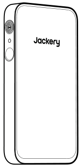

<strong>Jackery FridgeGuard</strong>

</li><li class="hb-inbox-card" data-item-number="2">

<strong>Cable de carga de CA</strong>

</li><li class="hb-inbox-card" data-item-number="3">

<strong>Documentos</strong>

</li><li class="hb-inbox-card" data-item-number="4">

<strong>Soporte Vertical</strong>

</li></ol>

<strong>CONSEJOS</strong>

El cable de carga para automóvil no está incluido, pero está disponible para su compra por separado en nuestro sitio web. Para obtener asistencia, comunícate con el servicio al cliente de Jackery.

</figure>

# DESCRIPCIÓN GENERAL DEL PRODUCTO

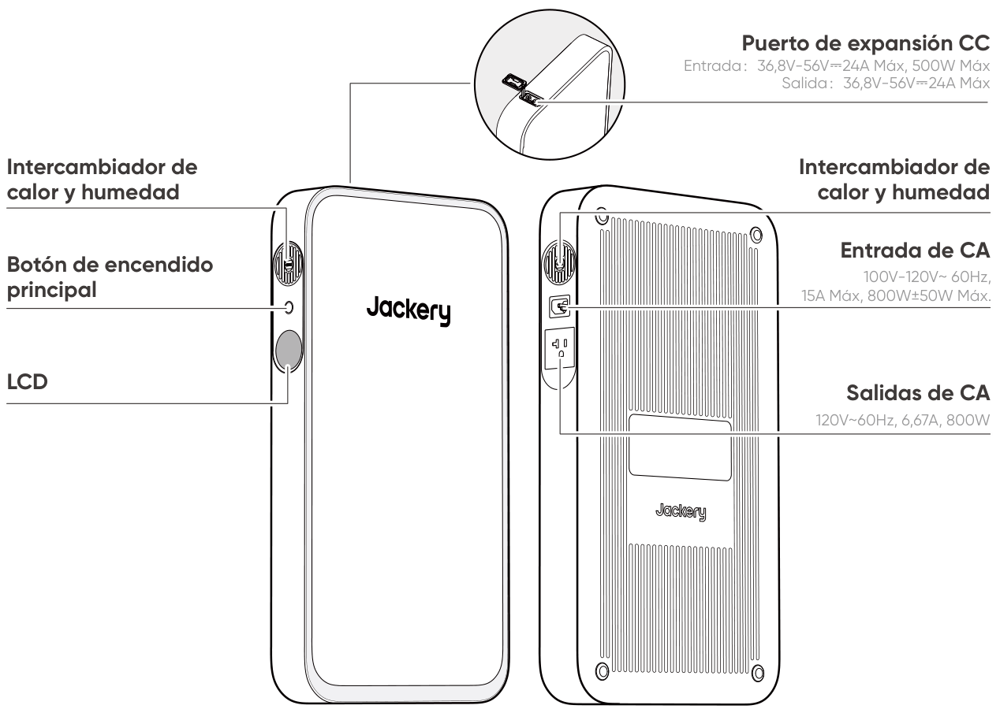

# PANTALLA LCD

<figure aria-label="LCD icon meanings" class="hb-lcd-table-composition" data-component-id="HB-TABLE-LCD-ICON" tabindex="0"><table class="hb-lcd-icon-table"><colgroup><col class="hb-lcd-col-number"/><col class="hb-lcd-col-icon"/><col class="hb-lcd-col-name"/><col class="hb-lcd-col-description"/></colgroup><tbody><tr><td class="hb-lcd-number">
1
</td><td class="hb-lcd-icon"></td><td class="hb-lcd-name">
Porcentaje de Batería Restante
</td><td class="hb-lcd-description">
Muestra el porcentaje de batería restante.
</td></tr><tr><td class="hb-lcd-number" rowspan="2">
2
</td><td class="hb-lcd-icon"></td><td class="hb-lcd-name">
Potencia de Entrada
</td><td class="hb-lcd-description" rowspan="2">
Muestra alternativamente la potencia de entrada y el tiempo de carga restante.
</td></tr><tr><td class="hb-lcd-icon"></td><td class="hb-lcd-name">
Tiempo de Carga Restante
</td></tr><tr><td class="hb-lcd-number">
3
</td><td class="hb-lcd-icon"></td><td class="hb-lcd-name">
UPS
</td><td class="hb-lcd-description">
Encendido: El producto está en modo bypass, en el cual el tiempo de cambio de la energía de la red a la batería interna es de 10 ms. Apagado: El producto no está en modo bypass.
</td></tr><tr><td class="hb-lcd-number" rowspan="2">
4
</td><td class="hb-lcd-icon"></td><td class="hb-lcd-name">
Wi-Fi
</td><td class="hb-lcd-description">
Encendido: Wi-Fi conectado. Parpadeo: listo para conectarse al Wi-Fi. Apagado: Wi-Fi desconectado.
</td></tr><tr><td class="hb-lcd-icon">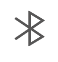</td><td class="hb-lcd-name">
Bluetooth
</td><td class="hb-lcd-description">
Encendido: Bluetooth conectado. Parpadeo: listo para conectarse al Bluetooth. Apagado: Bluetooth desconectado.
</td></tr><tr><td class="hb-lcd-number" rowspan="2">
5
</td><td class="hb-lcd-icon">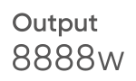</td><td class="hb-lcd-name">
Potencia de Salida
</td><td class="hb-lcd-description" rowspan="2">
Muestra alternativamente la potencia de salida y el tiempo de descarga restante.
</td></tr><tr><td class="hb-lcd-icon"></td><td class="hb-lcd-name">
Tiempo de Descarga Restante
</td></tr><tr><td class="hb-lcd-number">
6
</td><td class="hb-lcd-icon"></td><td class="hb-lcd-name">
Código de fallo
</td><td class="hb-lcd-description">
Se ha producido un error en el producto. Por favor, consulte la sección de solución de problemas para más detalles.
</td></tr><tr><td class="hb-lcd-number">
7
</td><td class="hb-lcd-icon"></td><td class="hb-lcd-name">
Indicador de carga
</td><td class="hb-lcd-description">
Encendido: el Jackery FridgeGuard está en estado de carga. Apagado: el Jackery FridgeGuard no está en estado de carga.
</td></tr><tr><td class="hb-lcd-number">
8
</td><td class="hb-lcd-icon"></td><td class="hb-lcd-name">
Mode TOU
</td><td class="hb-lcd-description">
Activado: el modo TOU está habilitado (SOC de respaldo predeterminado: 60 %). Durante las horas pico, el producto prioriza la descarga de la batería para reducir los costos de la electricidad en momentos de alta demanda, cuando la energía almacenada supera el SOC de respaldo. Durante las horas valle, el sistema carga la batería desde la red para lograr recortar los picos y llenar los valles. Desactivado: el modo TOU está deshabilitado. El dispositivo no sigue la estrategia TOU (tarifa por periodo de uso) y opera según la lógica predeterminada de suministro de energía y carga. Por favor, active/desactive esta función en la aplicación. Cuando el dispositivo se apaga, se retiene la configuración.
</td></tr><tr><td class="hb-lcd-number">
9
</td><td class="hb-lcd-icon"></td><td class="hb-lcd-name">
Retardo de salida de CA
</td><td class="hb-lcd-description">
Encendido: el modo de retardo de salida de CA está habilitado. Conectado a un tomacorriente de pared de CA, el dispositivo se descarga en modo de derivación (bypass). Sin entrada de CA, el dispositivo pausa la descarga e inicia una cuenta regresiva en la pantalla LCD. La descarga se reanudará cuando termine la cuenta regresiva, a menos que se detenga manualmente antes. Apagado: el modo de retardo de salida de CA está deshabilitado. Configura el período de retardo de salida de CA en la aplicación Jackery.
</td></tr><tr><td class="hb-lcd-number">
10
</td><td class="hb-lcd-icon"></td><td class="hb-lcd-name">
Indicador del paquete de baterías
</td><td class="hb-lcd-description">
Encendido: el paquete de baterías está conectado. Apagado: el paquete de baterías está desconectado.
</td></tr><tr><td class="hb-lcd-number">
11
</td><td class="hb-lcd-icon"></td><td class="hb-lcd-name">
Entrada de CC
</td><td class="hb-lcd-description">
Encendido: el paquete de baterías está conectado. Apagado: el paquete de baterías está desconectado.
</td></tr><tr><td class="hb-lcd-number">
12
</td><td class="hb-lcd-icon">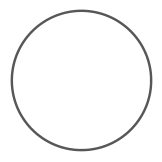</td><td class="hb-lcd-name">
Indicador de Potencia de la Batería
</td><td class="hb-lcd-description">
El círculo naranja indica el nivel de batería restante.
</td></tr></tbody></table></figure>

# OPERACIONES

## ENCENDIDO/APAGADO

<figure class="hb-operation-figure hb-operation-layout-status-right hb-base-art-live-copy" data-component-id="HB-SPECIAL-OPERATION" data-operation-id="main-power" data-source-fragment-sha256="bde94e75f10169b221c43a5f3934880d37eeb871e96f88a20f19a8ad692eeef5" data-web-base-art-ref="renderers/web/assets/je1000e_sil_us_en/power_art.png" data-web-presentation-mode="base-art-live-copy">

3s

<strong>Encendido</strong>

Presione una vez

<strong>Apagado</strong>

Mantén presionado durante 3 segundos

Tiempo de espera predeterminado: 2 horas Si el botón de encendido está apagado y no hay entrada o salida de carga, el producto se apagará automáticamente después de 2 horas.

* El tiempo en espera puede configurarse en la App de Jackery.

</figure>

## ENCENDER/APAGAR PANTALLA LCD

<figure aria-label="LCD Screen On/Off: Main Power Button location" class="hb-lcd-mode-composition hb-lcd-mode-portrait" data-component-id="HB-TABLE-LCD-MODE">

<table class="hb-lcd-mode-table"><colgroup><col class="hb-lcd-mode-col-state"/><col class="hb-lcd-mode-col-action"/><col class="hb-lcd-mode-col-copy"/></colgroup><tbody><tr><td class="hb-lcd-mode-state" rowspan="3">
En breve
</td><td class="hb-lcd-mode-action">
Encender
</td><td class="hb-lcd-mode-copy">
Presione el botón de encendido principal o cuando el producto se esté cargando.
</td></tr><tr><td class="hb-lcd-mode-action">
Apagar
</td><td class="hb-lcd-mode-copy">
Presione el botón de encendido principal.
</td></tr><tr><td class="hb-lcd-mode-action">
Apagado automático
</td><td class="hb-lcd-mode-copy">
La pantalla LCD se apaga automáticamente y entra en modo de suspensión después de 2 minutos de inactividad.
</td></tr><tr><td class="hb-lcd-mode-state" rowspan="3">
Estable en (durante el estado de carga o descarga)
</td><td class="hb-lcd-mode-action">
Encender
</td><td class="hb-lcd-mode-copy">
Presione dos veces el botón de encendido principal cuando el producto está encendido.
</td></tr><tr><td class="hb-lcd-mode-action">
Apagar
</td><td class="hb-lcd-mode-copy">
Presione el botón de energía principal.
</td></tr><tr><td class="hb-lcd-mode-action">
Apagado automático
</td><td class="hb-lcd-mode-copy">
El modo de estable se apaga automáticamente después de 2 horas de inactividad.
</td></tr></tbody></table>
</figure>

# FUENTE DE ALIMENTACIÓN ININTERRUMPIDA (UPS)

Conecte el producto a un tomacorriente de pared con el cable de carga de CA, luego presione el interruptor de alimentación principal para alimentar sus electrodomésticos.

<figure class="hb-reference-figure hb-base-art-live-copy" data-component-id="HB-SPECIAL-REFERENCE-FIGURE" data-reference-id="ups-connection" data-source-fragment-sha256="5f91758fd2f6ce34b6aadf0b69fc5c22ffb8420aef7bd411faa3d64c2389896b" data-web-base-art-ref="renderers/web/assets/je1000e_sil_us_en/ups_art.png" data-web-presentation-mode="base-art-live-copy" data-web-replace-key="reference.ups-connection">

123

</figure>

Un sistema de alimentación ininterrumpida (UPS) es un tipo de sistema de energía continua que proporciona energía eléctrica de respaldo automática a una carga cuando falla la energía de la red principal.

En caso de una pérdida repentina de energía de la red, el Jackery FridgeGuard cambiará automáticamente a la energía almacenada en menos de 10 ms para mantener sus electrodomésticos en funcionamiento.

En modo UPS, la potencia máxima de salida de la unidad alcanza 800 W antes de los cortes de energía. Como la carga y descarga simultáneas están habilitadas en el modo derivación, la potencia de salida real es menor que la potencia nominal en este modo, pero vuelve a la potencia nominal durante los cortes.

<table class="manual-callout-table" style="width:100%; border-collapse:collapse; margin:0 0 16px 0;"><tbody><tr><td class="manual-callout-label" style="width:16%; border:1px solid #000; padding:6px 8px; vertical-align:top;">
<strong>PRECAUCIÓN</strong>
PELIGROPRECAUCIÓNCONSEJOSNOTA</td><td class="manual-callout-body" style="border:1px solid #000; padding:6px 8px; vertical-align:top;"><ul class="hb-list"><li>Este producto no admite conmutación de 0 ms. No lo conecte a equipos que requieran una fuente de alimentación ininterrumpida, como servidores de datos o estaciones de trabajo.</li><li>Antes de usar, pruebe la compatibilidad con su dispositivo varias veces.</li><li>Se recomienda conectar un solo dispositivo a la vez. No use utilice múltiples dispositivos simultáneamente, ya que esto podría activar la protección contra sobrecarga.</li></ul></td></tr></tbody></table>

# INSTALACIÓN

<table class="manual-callout-table" style="width:100%; border-collapse:collapse; margin:0 0 16px 0;"><tbody><tr><td class="manual-callout-label" style="width:16%; border:1px solid #000; padding:6px 8px; vertical-align:top;">
<strong>PRECAUCIÓN</strong>
PELIGROPRECAUCIÓNCONSEJOSNOTA</td><td class="manual-callout-body" style="border:1px solid #000; padding:6px 8px; vertical-align:top;"><ul class="hb-list"><li>No instale el producto en estructuras no portantes, como placas de yeso, muros aislantes o ladrillos huecos, ya que podría caerse.</li><li>Evite los cables eléctricos, tuberías de agua, tuberías de gas y otras instalaciones dentro de las paredes.</li></ul></td></tr></tbody></table>

## SOPORTE VERTICAL

El Jackery FridgeGuard instalado con el soporte vertical se puede colocar en el suelo. Siga los pasos de instalación a continuación:

<figure class="hb-reference-figure hb-base-art-live-copy" data-component-id="HB-SPECIAL-REFERENCE-FIGURE" data-reference-id="stand-preparation" data-source-fragment-sha256="c91c4d5926d6b241c50d341c62b1050cd3b1fae168c82495560a0a10012ba6a2" data-web-base-art-ref="renderers/web/assets/je1000e_sil_us_en/stand_prepare_art.png" data-web-presentation-mode="base-art-live-copy" data-web-replace-key="reference.stand-preparation">

Preparación antes de la instalación:

</figure>

<figure class="hb-reference-figure hb-base-art-live-copy" data-component-id="HB-SPECIAL-REFERENCE-FIGURE" data-reference-id="stand-1" data-source-fragment-sha256="c6815909a140992421a4bd713f25691cc1df3df2bcc3e71237b5a44dc28840ba" data-web-base-art-ref="renderers/web/assets/je1000e_sil_us_en/stand_1_art.png" data-web-presentation-mode="base-art-live-copy" data-web-replace-key="reference.stand-1">

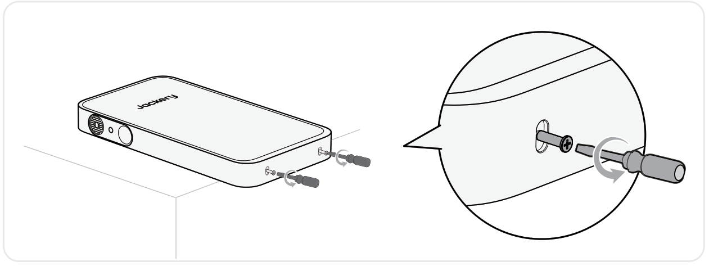1. Remove two screws from the bottom of the product.

</figure>

<figure class="hb-reference-figure hb-base-art-live-copy" data-component-id="HB-SPECIAL-REFERENCE-FIGURE" data-reference-id="stand-2" data-source-fragment-sha256="e5884825b64dddbe01d24e3b567b9a7f786406618d17855535f2d34bf8a768e8" data-web-base-art-ref="renderers/web/assets/je1000e_sil_us_en/stand_2_art.png" data-web-presentation-mode="base-art-live-copy" data-web-replace-key="reference.stand-2">

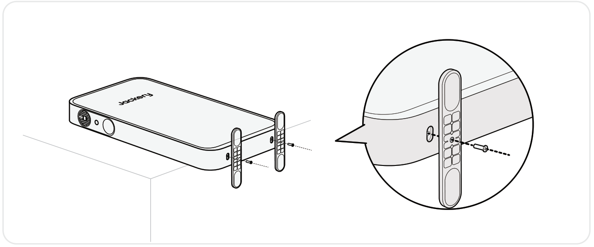2. Alinee los orificios de montaje en la parte inferior del producto con los orificios en el soporte vertical.

</figure>

<figure class="hb-reference-figure hb-base-art-live-copy" data-component-id="HB-SPECIAL-REFERENCE-FIGURE" data-reference-id="stand-3" data-source-fragment-sha256="5a7d0754fa30402182aba58180027a32824181c03f425ab7ad7581717569a58d" data-web-base-art-ref="renderers/web/assets/je1000e_sil_us_en/stand_3_art.png" data-web-presentation-mode="base-art-live-copy" data-web-replace-key="reference.stand-3">

3.Apriete los tornillos.

</figure>

## JACKERY WALL-MOUNTED BRACKET (SE VENDE POR SEPARADO)

El Jackery FridgeGuard instalado con el soporte de montaje se puede colocar en la pared. Siga los pasos de instalación a continuación：

## EN PAREDES DE MADERA

<figure class="hb-reference-figure hb-base-art-live-copy" data-component-id="HB-SPECIAL-REFERENCE-FIGURE" data-reference-id="wood-prepare" data-source-fragment-sha256="e0da22e07232facf97af23ad2d3fa36bdd4f2672d3b727444be2ae4f4d9c1c5b" data-web-base-art-ref="renderers/web/assets/je1000e_sil_us_en/wood_prepare_art.png" data-web-presentation-mode="base-art-live-copy" data-web-replace-key="reference.wood-prepare">

Preparación antes de la instalación：SE VENDE POR SEPARADO

</figure>

<figure class="hb-reference-figure hb-base-art-live-copy" data-component-id="HB-SPECIAL-REFERENCE-FIGURE" data-reference-id="wood-1" data-source-fragment-sha256="441c14db94a665fcb6967a874974028725786c337ede122ce3cf672795db1710" data-web-base-art-ref="renderers/web/assets/je1000e_sil_us_en/wood_1_art.png" data-web-presentation-mode="base-art-live-copy" data-web-replace-key="reference.wood-1">

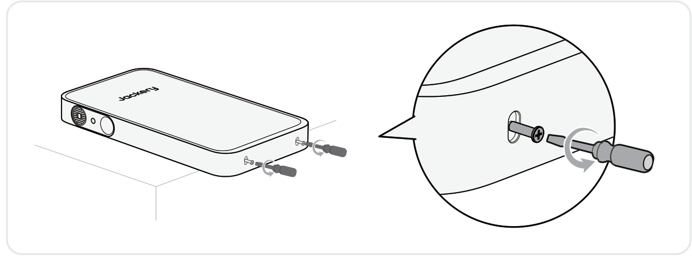1. Retire los dos tornillos de la parte inferior del producto.

</figure>

<figure class="hb-reference-figure hb-base-art-live-copy" data-component-id="HB-SPECIAL-REFERENCE-FIGURE" data-reference-id="wood-2-3" data-source-fragment-sha256="64452548e08b24fe3b6bbbcf149d1ae26a5d76729cbf2f28cc61e9bde1f35a96" data-web-base-art-ref="renderers/web/assets/je1000e_sil_us_en/wood_2_3_art.png" data-web-presentation-mode="base-art-live-copy" data-web-replace-key="reference.wood-2-3">

2. Fije firmemente los soportes de montaje superior e inferior en la parte posterior del producto.3. Utilice un buscador de montantes para identificar los montantes de madera detrás de la pared.Estructura de madera

</figure>

<figure class="hb-reference-figure hb-base-art-live-copy" data-component-id="HB-SPECIAL-REFERENCE-FIGURE" data-reference-id="wood-4-5" data-source-fragment-sha256="1863b7cfa6028a0e8bea8ef9a50d13f7de7e01c0f3a341e7163089712e40a166" data-web-base-art-ref="renderers/web/assets/je1000e_sil_us_en/wood_4_5_art.png" data-web-presentation-mode="base-art-live-copy" data-web-replace-key="reference.wood-4-5">

4. Marque el punto de montaje en el montante de madera de la pared.5. Atornille el tornillo para madera en la pared en el punto de montaje, dejando un espacio de 2-4mm entre el tornillo y la pared.Estructura de maderaEstructura de madera2~4mm

</figure>

<figure class="hb-reference-figure hb-base-art-live-copy" data-component-id="HB-SPECIAL-REFERENCE-FIGURE" data-reference-id="wood-6" data-source-fragment-sha256="3a2090db190747d8060c927b6146f623a11a4df83a380df9b07ea38f17295a54" data-web-base-art-ref="renderers/web/assets/je1000e_sil_us_en/wood_6_art.png" data-web-presentation-mode="base-art-live-copy" data-web-replace-key="reference.wood-6">

6. Cuelgue el producto verticalmente sobre el tornillo. Atornille el tornillo autorroscante a través del orificio de montaje en el soporte inferior hacia la pared y apriételo. Luego, apriete completamente el tornillo para madera.

</figure>

## EN PAREDES DE CONCRETO

<figure class="hb-reference-figure hb-base-art-live-copy" data-component-id="HB-SPECIAL-REFERENCE-FIGURE" data-reference-id="concrete-prepare" data-source-fragment-sha256="b806c862b502be024cb349fd97b1e628527e1375b7cb99419ac38839cf9a17fe" data-web-base-art-ref="renderers/web/assets/je1000e_sil_us_en/concrete_prepare_art.png" data-web-presentation-mode="base-art-live-copy" data-web-replace-key="reference.concrete-prepare">

Preparación antes de la instalación：SE VENDE POR SEPARADO

</figure>

<figure class="hb-reference-figure hb-base-art-live-copy" data-component-id="HB-SPECIAL-REFERENCE-FIGURE" data-reference-id="concrete-1" data-source-fragment-sha256="8a5657529e75520f8ff99333d3ada3b67c85e3d6db095f6991451cccee1968a8" data-web-base-art-ref="renderers/web/assets/je1000e_sil_us_en/concrete_1_art.png" data-web-presentation-mode="base-art-live-copy" data-web-replace-key="reference.concrete-1">

1. Retire los dos tornillos de la parte inferior del producto.

</figure>

<figure class="hb-reference-figure hb-base-art-live-copy" data-component-id="HB-SPECIAL-REFERENCE-FIGURE" data-reference-id="concrete-2" data-source-fragment-sha256="ad75ebaed25dc5f90346bc8ffd8ed412dc4d8617f13269e9995c2784503862e5" data-web-base-art-ref="renderers/web/assets/je1000e_sil_us_en/concrete_2_art.png" data-web-presentation-mode="base-art-live-copy" data-web-replace-key="reference.concrete-2">

2. Fije firmemente los soportes de montaje superior e inferior en la parte posterior del producto.

</figure>

<figure class="hb-reference-figure hb-base-art-live-copy" data-component-id="HB-SPECIAL-REFERENCE-FIGURE" data-reference-id="concrete-3-4" data-source-fragment-sha256="68908ec02df63a585b74053143cec7a26a282154a0da918c52d4adf88eb8fa28" data-web-base-art-ref="renderers/web/assets/je1000e_sil_us_en/concrete_3_4_art.png" data-web-presentation-mode="base-art-live-copy" data-web-replace-key="reference.concrete-3-4">

3. Marque el punto de montaje en la pared.4. Perfore un agujero en el punto de montaje utilizando un taladro de impacto para mampostería de 8mm hasta una profundidad de aproximadamente 70mm. Inserta un perno de expansión y afloja su tuerca de 2 a 4 mm.70mm2~4mm8mm

</figure>

<figure class="hb-reference-figure hb-base-art-live-copy" data-component-id="HB-SPECIAL-REFERENCE-FIGURE" data-reference-id="concrete-5-6" data-source-fragment-sha256="74fc7c3e69e54f5676eb43530c4a454e7493dcd15e300505472155319dc4208e" data-web-base-art-ref="renderers/web/assets/je1000e_sil_us_en/concrete_5_6_art.png" data-web-presentation-mode="base-art-live-copy" data-web-replace-key="reference.concrete-5-6">

5. Cuelga el producto verticalmente en el perno de expansión y marca el punto de montaje en la pared.6. Retira el producto. Perfora un orificio en el punto de montaje e inserta un perno de expansión sin la tuerca y la arandela en el agujero.70mm8mm

</figure>

<figure class="hb-reference-figure hb-base-art-live-copy" data-component-id="HB-SPECIAL-REFERENCE-FIGURE" data-reference-id="concrete-7-8" data-source-fragment-sha256="3f1f732bf3d298a01867a4e1a8d9d51bc665edd941ee9f68de25d067b3dfadf3" data-web-base-art-ref="renderers/web/assets/je1000e_sil_us_en/concrete_7_8_art.png" data-web-presentation-mode="base-art-live-copy" data-web-replace-key="reference.concrete-7-8">

7. Cuelga el producto en el perno de expansión superior.8. Levanta el producto para alinear el perno preinstalado y bájalo hasta su posición. Aprieta la tuerca.

</figure>

# CONEXIONES

## CONECTAR AL/LOS PAQUETE(S) DE BATERÍAS SE (VENDE POR SEPARADO)

Este producto es compatible con un paquete de baterías para satisfacer la necesidad de una gran capacidad de potencia. Para detalles sobre su uso, consulte el manual de usuario del Jackery Battery Pack.

<table class="manual-callout-table" style="width:100%; border-collapse:collapse; margin:0 0 16px 0;"><tbody><tr><td class="manual-callout-label" style="width:16%; border:1px solid #000; padding:6px 8px; vertical-align:top;">
<strong>PRECAUCIÓN</strong>
PELIGROPRECAUCIÓNCONSEJOSNOTA</td><td class="manual-callout-body" style="border:1px solid #000; padding:6px 8px; vertical-align:top;"><ul class="hb-list"><li>Asegúrese de que todos los productos estén apagados antes de conectar el Jackery FridgeGuard al paquete de Jackery Battery Pack.</li></ul></td></tr></tbody></table>

# MANTENIMIENTO

Limpie el filtro regularmente: Retire la cubierta de silicona. Use un destornillador de cruz M3 para aflojar y retirar el tornillo, luego saque la pieza de plástico y el filtro para limpiarlos.

<figure class="hb-reference-figure hb-base-art-live-copy" data-component-id="HB-SPECIAL-REFERENCE-FIGURE" data-reference-id="maintenance-filter" data-source-fragment-sha256="884c79ac11fa22f29a9485cd876a3209521b21facf2a44361544465bd1862887" data-web-base-art-ref="renderers/web/assets/je1000e_sil_us_es/maintenance_art.png" data-web-presentation-mode="base-art-live-copy" data-web-replace-key="reference.maintenance-filter">

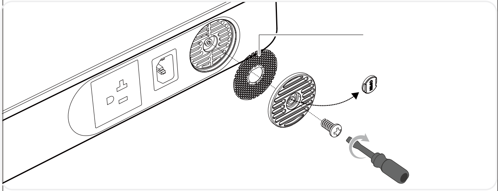filtro

</figure>

<table class="manual-callout-table" style="width:100%; border-collapse:collapse; margin:0 0 16px 0;"><tbody><tr><td class="manual-callout-label" style="width:16%; border:1px solid #000; padding:6px 8px; vertical-align:top;">
<strong>CONSEJOS</strong>
PELIGROPRECAUCIÓNCONSEJOSNOTA</td><td class="manual-callout-body" style="border:1px solid #000; padding:6px 8px; vertical-align:top;"><ul class="hb-list"><li>Se recomienda una limpieza profunda cada 3–6 meses. Si hay mascotas en el hogar o el entorno es propenso al polvo, aumente la frecuencia de revisión en consecuencia.</li><li>Después de la limpieza, asegúrese de que el filtro esté completamente seco antes de reinstalarlo.</li></ul></td></tr></tbody></table>

# CARGANDO

Energía renovable primero: Abogamos por utilizar primero energía renovable. Este producto admite dos modos de carga al mismo tiempo: carga solar y carga de pared de CA. Cuando la carga en la pared de CA y la carga solar están activadas al mismo tiempo, el producto dará prioridad a la carga solar y se utilizarán ambos métodos para cargar la batería a la máxima potencia permitida.

**Carga completamente el producto antes de usarlo por primera vez.**

<table class="manual-callout-table" style="width:100%; border-collapse:collapse; margin:0 0 16px 0;"><tbody><tr><td class="manual-callout-label" style="width:16%; border:1px solid #000; padding:6px 8px; vertical-align:top;">
<strong>NOTA</strong>
PELIGROPRECAUCIÓNCONSEJOSNOTA</td><td class="manual-callout-body" style="border:1px solid #000; padding:6px 8px; vertical-align:top;"><ul class="hb-list"><li>La temperatura de carga recomendada para el producto está entre -4°F a 113°F (-20°C a 45°C), y la temperatura de descarga está entre -4°F a 113°F (-20°C a 45°C). Operar el producto fuera de este rango de temperatura puede limitar sus capacidades de carga y descarga, e incluso impedir la carga o descarga.</li><li>La potencia de carga y la capacidad de la batería del producto pueden variar debido a fluctuaciones de temperatura.</li></ul></td></tr></tbody></table>

<table class="manual-callout-table" style="width:100%; border-collapse:collapse; margin:0 0 16px 0;"><tbody><tr><td class="manual-callout-label" style="width:16%; border:1px solid #000; padding:6px 8px; vertical-align:top;">
<strong>PRECAUCIÓN</strong>
PELIGROPRECAUCIÓNCONSEJOSNOTA</td><td class="manual-callout-body" style="border:1px solid #000; padding:6px 8px; vertical-align:top;"><ul class="hb-list"><li>Asegúrese de que el cable de carga de CA esté completamente y firmemente conectado al puerto de entrada de CA. Una conexión incompleta puede causar una corriente inestable, sobrecalentamiento, mal contacto o un mal funcionamiento del dispositivo.</li></ul></td></tr></tbody></table>

## CHARGE VIA PANNEAUX SOLAIRES

Conectado al Módulo de Entrada CC de Jackery, el Jackery FridgeGuard es compatible con los paneles solares Jackery. Para obtener detalles sobre cómo usarlo, consulta el Manual del Usuario del Módulo de Entrada CC de Jackery.

<figure class="hb-reference-figure hb-base-art-live-copy" data-component-id="HB-SPECIAL-REFERENCE-FIGURE" data-reference-id="solar-connection" data-source-fragment-sha256="332a339c92d1ce352c7e176d34c613d41eb848864b71f05dd5cfae6a86342b49" data-web-base-art-ref="renderers/web/assets/je1000e_sil_us_en/solar_art.png" data-web-presentation-mode="base-art-live-copy" data-web-replace-key="reference.solar-connection">

SolarSaga 500 X※ Los paneles solares y el módulo de entrada de CC de Jackery se venden por separado.

</figure>

Se recomienda usar el panel solar Jackery para cargar el Jackery FridgeGuard. Asegúrese de que el voltaje en circuito abierto (Voc) del panel solar esté dentro del rango de entrada de CC (36,8V-56V) del Jackery FridgeGuard. Jackery no se hace responsable de pérdidas causadas por el uso de paneles solares de otras marcas.

## CARGA CON UN CARGADOR DE EN EL VEHÍCULO

Conectado al Módulo de Entrada CC de Jackery, el Jackery FridgeGuard puede cargarse con un cargador de automóvil de 12V. Asegúrese de que el cargador para coche y la toma de encendedor de 12 V del vehículo tengan una buena conexión. Para obtener detalles sobre cómo usarlo, consulta el Manual del Usuario del Módulo de Entrada CC de Jackery.

<figure class="hb-reference-figure hb-base-art-live-copy" data-component-id="HB-SPECIAL-REFERENCE-FIGURE" data-reference-id="car-connection" data-source-fragment-sha256="f1e0bda3e0104c96ce775204703fa67c1e0ea85aeedfef73fcdb0a39f3cd8e9f" data-web-base-art-ref="renderers/web/assets/je1000e_sil_us_en/car_art.png" data-web-presentation-mode="base-art-live-copy" data-web-replace-key="reference.car-connection">

Vehículo※ El cable de carga para automóvil y el módulo de entrada de CC de Jackery se venden por separado.

</figure>

# RESOLUCIÓN DE PROBLEMAS

Si aparece alguno de los siguientes códigos de falla, siga las acciones correctivas listadas para resolver el problema.Si la falla persiste, por favor contacte con atención al cliente de Jackery.

<figure aria-label="Código de Error / Medidas correctivas" class="hb-troubleshooting-composition" data-component-id="HB-TABLE-TROUBLESHOOTING" tabindex="0"><table class="hb-troubleshooting-table"><colgroup><col class="hb-troubleshooting-col-code"/><col class="hb-troubleshooting-col-measures"/></colgroup><thead><tr><th class="hb-troubleshooting-code" scope="col">
Código de Error
</th><th class="hb-troubleshooting-measures" scope="col">
Medidas correctivas
</th></tr></thead><tbody><tr><td class="hb-troubleshooting-code">F0/F1/F2/F3</td><td class="hb-troubleshooting-measures">
Reiniciar el producto.
</td></tr><tr><td class="hb-troubleshooting-code">F4</td><td class="hb-troubleshooting-measures">
Conecte el producto a cargas para descargar su batería hasta que la falla desaparezca.
</td></tr><tr><td class="hb-troubleshooting-code">F5</td><td class="hb-troubleshooting-measures">
Cargue el producto mediante paneles solares o toma de corriente CA hasta que la falla desaparezca.
</td></tr><tr><td class="hb-troubleshooting-code">F6</td><td class="hb-troubleshooting-measures">
1. Espere a que la red eléctrica se normalice antes de cargar el producto a través de una toma de corriente CA. 2. Verifique si las rejillas de entrada y salida de aire están obstruidas; asegure un espacio libre de 0,2 pulgadas (5 cm) a ambos lados del producto. 3. Coloque el producto en un lugar que no esté expuesto a la luz solar directa o a altas temperaturas ambientales. 4. Desconecte todas las cargas del producto. Mantenga el producto inactivo y espere hasta que la falla desaparezca. 5. Reiniciar el producto.
</td></tr><tr><td class="hb-troubleshooting-code">F7</td><td class="hb-troubleshooting-measures">
1. Retire todas las entradas de CC del producto. 2. Si carga el producto mediante un panel solar, verifique el voltaje en circuito abierto (Voc) del panel solar conectado. El producto permite un voltaje máximo de entrada de CC de 56 V. 3. Reinicie el producto y déjelo en reposo. Espere hasta que la falla desaparezca.
</td></tr><tr><td class="hb-troubleshooting-code">F8</td><td class="hb-troubleshooting-measures">
Contacte con atención al cliente de Jackery.
</td></tr><tr><td class="hb-troubleshooting-code">FC</td><td class="hb-troubleshooting-measures">
1. Reinicie los paquetes de baterías y el Jackery FridgeGuard respectivamente. 2. Si la falla persiste, desconecte el paquete de baterías del Jackery FridgeGuard y reconéctelos.
</td></tr><tr><td class="hb-troubleshooting-code">FF</td><td class="hb-troubleshooting-measures">
En condiciones de alta temperatura: 1. Desconecte todos los cables de carga y descarga del producto (incluyendo cargador de pared, paneles solares, cargador de coche y dispositivos de carga). 2. Coloque el producto en un área sombreada y bien ventilada donde la temperatura ambiente sea inferior a 113°F (45 °C). 3. Verifique si las aberturas de entrada y salida de aire están obstruidas; asegúrese de dejar un espacio libre de 0,2 pulgadas (5 cm) a ambos lados del producto. 4. Mantenga el producto en reposo y espere a que la falla desaparezca. 5. Si la falla persiste después de varios intentos, contacte al distribuidor o al Servicio de Atención al Cliente de Jackery.

En condiciones de baja temperatura: 1. Traslade el producto a un ambiente más cálido por encima de 32°F (0 °C). 2. No utilice ni cargue el producto al aire libre en condiciones extremadamente frías. Si es necesario, précaliéntelo en interiores. 3. Si el dispositivo se traslada al interior desde un ambiente frío, déjelo reposar un tiempo antes de usarlo. 4. Cuando aparezca el indicador de Baja Temperatura, mantenga el producto en reposo y espere a que el sistema se recupere automáticamente. 5. Si la falla persiste después de varios intentos, contacte al distribuidor o al Servicio de Atención al Cliente de Jackery.
</td></tr></tbody></table></figure>

# ESPECIFICACIONES

## INFORMACIÓN GENERAL

<figure aria-label="INFORMACIÓN GENERAL" class="hb-spec-table-composition"><table class="hb-spec-table manual-table manual-spec-table"><colgroup><col class="hb-spec-col-label"/><col class="hb-spec-col-value"/></colgroup>
<tbody>
<tr>
<th class="hb-spec-label manual-spec-label" scope="row">Nombre del producto</th>
<td class="hb-spec-value manual-spec-value">Jackery FridgeGuard</td>
</tr>
<tr>
<th class="hb-spec-label manual-spec-label" scope="row">Nº de modelo</th>
<td class="hb-spec-value manual-spec-value">JE-1000E-SIL</td>
</tr>
<tr>
<th class="hb-spec-label manual-spec-label" scope="row">Capacidad</th>
<td class="hb-spec-value manual-spec-value">20Ah/51,2V DC (1024Wh)</td>
</tr>
<tr>
<th class="hb-spec-label manual-spec-label" scope="row">Química Celular</th>
<td class="hb-spec-value manual-spec-value">LiFePO₄</td>
</tr>
<tr>
<th class="hb-spec-label manual-spec-label" scope="row">Peso</th>
<td class="hb-spec-value manual-spec-value">Aproximadamente 23,2 libras/10.5 kg</td>
</tr>
<tr>
<th class="hb-spec-label manual-spec-label" scope="row">Dimensiones</th>
<td class="hb-spec-value manual-spec-value">23,6 × 12,8 × 2,6 pulgadas / 60 × 32,5 × 6,7 cm</td>
</tr>
<tr>
<th class="hb-spec-label manual-spec-label" scope="row">Ciclo de vida</th>
<td class="hb-spec-value manual-spec-value">6000 ciclos de carga hasta 70 % + de capacidad</td>
</tr>
</tbody>
</table></figure>

## PUERTOS DE ENTRADA

<figure aria-label="PUERTOS DE ENTRADA" class="hb-spec-table-composition"><table class="hb-spec-table manual-table manual-spec-table"><colgroup><col class="hb-spec-col-label"/><col class="hb-spec-col-value"/></colgroup>
<tbody>
<tr>
<th class="hb-spec-label manual-spec-label" scope="row">Entrada CA</th>
<td class="hb-spec-value manual-spec-value">100V-120V~ 60Hz, 15A max., 800W±50W Máx</td>
</tr>
<tr>
<th class="hb-spec-label manual-spec-label" scope="row">Entrada CC</th>
<td class="hb-spec-value manual-spec-value">36,8V-56V⎓24A Máx, 500W Máx</td>
</tr>
</tbody>
</table></figure>

## PUERTOS DE SALIDA

<figure aria-label="PUERTOS DE SALIDA" class="hb-spec-table-composition"><table class="hb-spec-table manual-table manual-spec-table"><colgroup><col class="hb-spec-col-label"/><col class="hb-spec-col-value"/></colgroup>
<tbody>
<tr>
<th class="hb-spec-label manual-spec-label" scope="row">Salidas CA</th>
<td class="hb-spec-value manual-spec-value">120V~60Hz, 6,67A, 800W nominales, 1600 W pico de sobretensión (-4°F a 113°F/-20°C a 45°C)</td>
</tr>
<tr>
<th class="hb-spec-label manual-spec-label" scope="row">Salida de CA en modo bypass①</th>
<td class="hb-spec-value manual-spec-value">100V-120V~60Hz, 800W Máx</td>
</tr>
<tr>
<th class="hb-spec-label manual-spec-label" scope="row">Puerto de expansión CC</th>
<td class="hb-spec-value manual-spec-value">36,8V-56V⎓24A Máx</td>
</tr>
<tr>
<th class="hb-spec-label manual-spec-label" scope="row">Corriente máxima de cortocircuito y duración</th>
<td class="hb-spec-value manual-spec-value">1600A/1.25ms</td>
</tr>
</tbody>
</table></figure>

## TEMPERATURA DE FUNCIONAMIENTO

<figure aria-label="TEMPERATURA DE FUNCIONAMIENTO" class="hb-spec-table-composition"><table class="hb-spec-table manual-table manual-spec-table"><colgroup><col class="hb-spec-col-label"/><col class="hb-spec-col-value"/></colgroup>
<tbody>
<tr>
<th class="hb-spec-label manual-spec-label" scope="row">Temperatura de carga</th>
<td class="hb-spec-value manual-spec-value">-4°F a 113°F/-20°C a 45°C</td>
</tr>
<tr>
<th class="hb-spec-label manual-spec-label" scope="row">Temperatura de descarga</th>
<td class="hb-spec-value manual-spec-value">-4°F a 113°F/-20°C a 45°C</td>
</tr>
</tbody>
</table></figure>

① El producto puede cargar la batería desde una toma de corriente CA mientras suministra energía a través de los puertos de salida CA.

# ALMACENAMIENTO

<figure class="hb-text-panel">
Almacene el producto en un lugar seco y limpio con ventilación adecuada.Temperatura y humedad de almacenamiento:
<ul class="hb-list"><li>1 mes: -4°F a 113°F / -20 a 45 °C (0-60 % HR)</li><li>3 meses: 32°F a 113°F / 0 a 45 °C (0-60 % HR)</li><li>12 meses: 32°F a 77°F / 0 a 25 °C (0-60 % HR)</li></ul>
Si este producto se almacena durante un período prolongado (de 3 a 6 meses) con la batería descargada, podría volverse imposible recargarlo. Para evitar esto y mantener la salud de la batería, se recomienda revisar y recargar el producto cada tres meses, y realizar un ciclo completo de carga y descarga al menos una vez cada 6 a 12 meses.
</figure>

# GARANTÍA

<figure aria-label="GARANTÍA" class="hb-warranty-intro-composition" data-component-id="HB-WARRANTY-LEAD">

Solo ofrecemos nuestra garantía a clientes que compren en el sitio web oficial de Jackery, plataformas de terceros con la marca Jackery o distribuidores autorizados locales.

*El periodo de garantía y los detalles pueden variar según las leyes, regulaciones y distribuidores autorizados locales.

</figure>

## Garantía limitada

<figure aria-label="Garantía limitada" class="hb-warranty-card" data-component-id="HB-WARRANTY-SECTION" data-warranty-card-index="1">
Jackery Inc. garantiza al consumidor original que el producto Jackery estará libre de defectos relativos al acabado y a los materiales en condiciones normales de uso por parte del consumidor durante el período de garantía aplicable identificado en la sección "Período de garantía" que figura a continuación, sujeto a las exclusiones que se establecen a continuación.

Esta declaración de garantía establece la obligación de garantía total y exclusiva de Jackery. No asumiremos ni autorizaremos que ninguna persona asuma por nosotros ninguna otra responsabilidad en relación con la venta de nuestros productos.
</figure>

## Período de garantía

<figure aria-label="Período de garantía" class="hb-warranty-period-card" data-component-id="HB-WARRANTY-YEARS">

3
<strong class="hb-warranty-years-unit">AÑOS</strong><strong class="hb-warranty-period-label">Garantía estándar</strong>

El periodo de garantía estándar de Jackery FridgeGuard es de 36 meses. En cada caso, el período de garantía se mide a partir de la fecha de compra por parte del comprador consumidor original. Para establecer la fecha de inicio del período de garantía, se necesita el recibo de venta de la primera compra del consumidor u otra prueba documental razonable.

2
<strong class="hb-warranty-years-unit">AÑOS</strong><strong class="hb-warranty-period-label">Garantía extendida</strong>

Para activar la extensión de garantia,debe registrar su producto en línea oponerse en contacto con nuestro equipo de atención al cliente en hello@jackery.com para ampliar laduración de la garantia estándar.

</figure>

## Reparación o reemplazo

<figure aria-label="Reparación o reemplazo" class="hb-warranty-card" data-component-id="HB-WARRANTY-SECTION" data-warranty-card-index="3">
Jackery reparará o reemplazará (a cargo de Jackery) cualquier producto Jackery que no funcione durante el periodo de garantía aplicable debido a defectos en la mano de obra o el material. El producto reparado o reemplazado asumirá el periodo restante de la garantía desde la fecha original de compra.
</figure>

## Limitado al comprador consumidor original

<figure aria-label="Limitado al comprador consumidor original" class="hb-warranty-card" data-component-id="HB-WARRANTY-SECTION" data-warranty-card-index="4">
La garantía del producto de Jackery se limita al consumidor original y no es transferible a ningún propietario posterior.
</figure>

## Exclusiones

<figure aria-label="Exclusiones" class="hb-warranty-card" data-component-id="HB-WARRANTY-SECTION" data-warranty-card-index="5">
La garantía de Jackery no se aplica a:
<ul class="simple">
<li>
Mal uso, abuso, modificación, daño por accidente, o uso para cualquier cosa que no sea el uso normal del consumidor según lo autorizado en los folletos actuales del producto de Jackery.
</li>
<li>
Intento de reparación por cualquier persona que no sea un centro autorizado.
</li>
<li>
Cualquier producto adquirido a través de una casa de subastas en línea.
</li>
<li>
La garantía de Jackery no se aplica a la célula de la batería a menos que usted la cargue completamente en los siete días siguientes a la compra del producto y, a partir de entonces, al menos una vez cada 6 meses.
</li>
</ul></figure>

## Derechos de interpretación

<figure aria-label="Derechos de interpretación" class="hb-warranty-card" data-component-id="HB-WARRANTY-SECTION" data-warranty-card-index="6">
La garantía del producto de Jackery se limita al consumidor original y no es transferible a ningún propietario posterior.
</figure>

# CONFIGURACIÓN DE LA APLICACIÓN

## 1. Para descargar la aplicación e iniciar sesión

<figure aria-label="1. Para descargar la aplicación e iniciar sesión" class="hb-app-download-composition" data-component-id="HB-SPECIAL-APP">

Buscar "Jackery" en Google Play o en la App Store para instalar la aplicación. Después, podrá registrarte e iniciar sesión.

Alternativamente, escanee el código QR a continuación para descargar e instalar la app.

</figure>

## 2. Pour ajouter un appareil

2.1 Haga clic en el botón Añadir dispositivo .

2.2 Mantenga pulsado el botón de \"encendido\" del dispositivo para encenderlo. Los iconos del wifi y del Bluetooth del dispositivo parpadearán para indicar que el dispositivo ha entrado en el modo de configuración de red. A continuación, pulse el botón \"icono parpadeante\" y permita que la aplicación se conecte a los dispositivos cercanos y abra los permisos de Bluetooth;

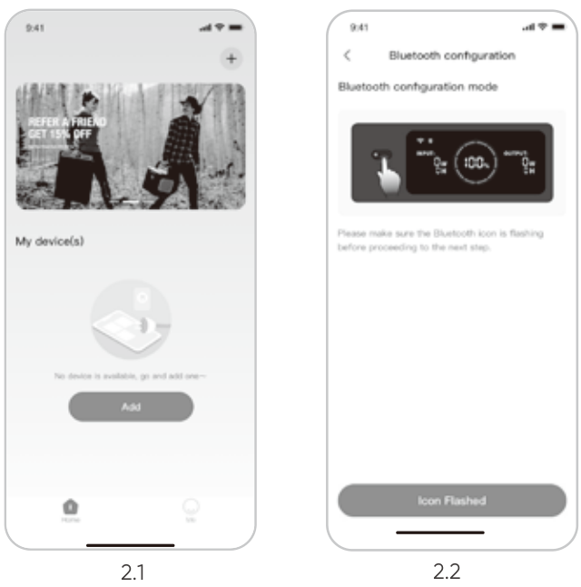

<figure class="hb-reference-figure hb-base-art-live-copy" data-component-id="HB-SPECIAL-REFERENCE-FIGURE" data-reference-id="app-power-label" data-source-fragment-sha256="51385a8ea17c49a66463cd79e31481889c0a155d2d471eb8748827c1266d5fa2" data-web-base-art-ref="renderers/web/assets/je1000e_sil_us_es/app_power_art.png" data-web-presentation-mode="base-art-live-copy" data-web-replace-key="reference.app-power-label">

Botón de encendido

</figure>

2.3 Tras hacer clic en el icono del dispositivo buscado, la aplicación conecta automáticamente el dispositivo a través de Bluetooth.

<table class="manual-callout-table" style="width:100%; border-collapse:collapse; margin:0 0 16px 0;"><tbody><tr><td class="manual-callout-label" style="width:16%; border:1px solid #000; padding:6px 8px; vertical-align:top;">
<strong>NOTA</strong>
PELIGROPRECAUCIÓNCONSEJOSNOTA</td><td class="manual-callout-body" style="border:1px solid #000; padding:6px 8px; vertical-align:top;"><ul class="hb-list"><li>Si durante el proceso de vinculación se indica que "el dispositivo ha sido vinculado", se pueden utilizar las dos formas siguientes para la conexión.</li><li>El propietario del dispositivo lo compartirá con otros usuarios a través de la App.</li><li>Con el dispositivo apagado, mantenga presionado el botón de encendido principal durante 10 segundos para restablecer la configuración del Wi-Fi y Bluetooth a los valores de fábrica y luego vuelva a vincular el dispositivo.</li></ul></td></tr></tbody></table>

2.4 Una vez que el dispositivo se haya conectado correctamente, es necesario introducir el nombre y la contraseña de la red Wi-Fi a la que se conectará el dispositivo. Una vez introducidos, el dispositivo se conectará automáticamente a la red Wi-Fi.

<table class="manual-callout-table" style="width:100%; border-collapse:collapse; margin:0 0 16px 0;"><tbody><tr><td class="manual-callout-label" style="width:16%; border:1px solid #000; padding:6px 8px; vertical-align:top;">
<strong>NOTA</strong>
PELIGROPRECAUCIÓNCONSEJOSNOTA</td><td class="manual-callout-body" style="border:1px solid #000; padding:6px 8px; vertical-align:top;"><ul class="hb-list"><li>Selecciona una red Wi-Fi en la banda de 2,4 GHz. El dispositivo no admite una red Wi-Fi en la banda de 5 GHz.</li></ul></td></tr></tbody></table>

2.5 Después de agregar exitosamente el dispositivo en la App, el icono del Wi-Fi en el dispositivo permanecerá siempre encendido.

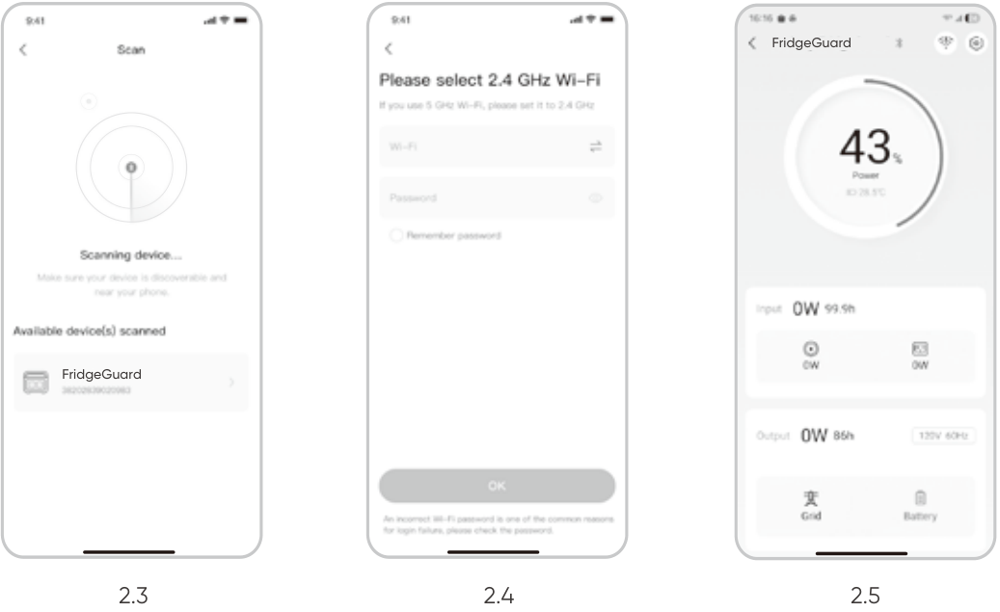

Las capturas de pantalla anteriores sirven solo de referencia.

<table class="manual-callout-table" style="width:100%; border-collapse:collapse; margin:0 0 16px 0;"><tbody><tr><td class="manual-callout-label" style="width:16%; border:1px solid #000; padding:6px 8px; vertical-align:top;">
<strong>NOTA</strong>
PELIGROPRECAUCIÓNCONSEJOSNOTA</td><td class="manual-callout-body" style="border:1px solid #000; padding:6px 8px; vertical-align:top;"><ul class="hb-list"><li>La aplicación Jackery solo puede conectarse a una estación de energía a la vez mediante Bluetooth. Regresar a la lista de dispositivos desconecta automáticamente Bluetooth. Toque la estación de energía en la lista nuevamente para reconectarse automáticamente.</li></ul></td></tr></tbody></table>

## 3. Desvincular el dispositivo

Haga clic en el botón «Configuración» situado en la esquina superior derecha de la interfaz principal del dispositivo para entrar en la página de configuración. Después, haga clic en el botón «Desvincu- lar» situado en la parte inferior de la página para desvincular el dispositivo.

## 4. Notas

**4.1 Estado de Wi-Fi y del Bluetooth:**

- El Wi-Fi y el Bluetooth se encienden/apagan automáticamente con el dispositivo y los íconos de Wi-Fi y Bluetooth en la pantalla se iluminan/apagan.

**4.2 Para restablecer el Wi-Fi y el Bluetoot**

- Con el dispositivo apagado, mantenga presionado el botón de encendido principal durante 10 segundos para restablecer la configuración del Wi-Fi y Bluetooth a los valores de fábrica y luego vuelva a vincular el dispositivo.
