# 安全上のご注意

ご使用の前にこの「安全上のご注意」をよくお読みのうえ、正しくお使いください。

絵表示について

製品を安全に正しくお使いいただき、お客様や他の方々への危害や財産への損害を未然に防止するための表示です。

内容をよく理解してから本文をお読みください。

# 安全上のご注意

ご使用の前にこの「安全上のご注意」をよくお読みのうえ、正しくお使いください。

絵表示について

製品を安全に正しくお使いいただき、お客様や他の方々への危害や財産への損害を未然に防止するための表示です。

内容をよく理解してから本文をお読みください。

|  |  |
|----|----|
| **警告** | この表示を無視して、誤った取り扱いをすると、人が死亡または重傷を負う可能性が想定される内容を示しています。 |
| **注意** | この表示を無視して、誤った取り扱いをすると、人が傷害を負う可能性が想定される内容または物的損害の発生が想定される内容を示しています。 |
| **説明** | この表示を無視して誤った取り扱いをすると、機器の損傷、データの消失、性能の低下、または予期しない動作が発生する可能性があることを示しています。 |
| **ヒント** | 文章内の重要な情報や操作のヒントを補足する内容を示しています。 |

## 絵表示の説明

<table>
<colgroup>
<col style="width: 10%" />
<col style="width: 40%" />
<col style="width: 10%" />
<col style="width: 40%" />
</colgroup>
<tbody>
<tr>
<td></td>
<td>
潜在的な危険やリスクについて注意喚起するために、必ずお読みください。
</td>
<td></td>
<td>
このシンボルは、本製品を一般家庭ごみとして廃棄せず、リサイクルのために指定の回収施設に持ち込む必要があることを示しています。

適切な廃棄およびリサイクルは、環境保護に役立ちます。

本製品の廃棄やリサイクルについての詳細は、お住まいの自治体、廃棄物処理業者、または販売店にお問い合わせください。
</td>
</tr>
<tr>
<td></td>
<td>
操作の前に取扱説明書をお読みください。
</td>
<td>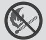</td>
<td>
本製品を火気の近くに置かないでください。
</td>
</tr>
<tr>
<td></td>
<td>
小さなお子様の手の届かない場所に保管してください。
</td>
<td></td>
<td>
電池および蓄電池は家庭ごみと一緒に廃棄してはいけません。

消費者の皆様は、有害物質の有無にかかわらず、すべての電池および蓄電池を指定された収集場所で廃棄することが法律で義務付けられています。

使用済みの電池および蓄電池は、お近くの収集拠点、リサイクルセンター、または購入した小売店にお持ちください。適切な廃棄は環境に配慮したリサイクルを確保し、人間の健康と環境への潜在的な害を防ぎます。
</td>
</tr>
<tr>
<td>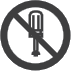</td>
<td>
製品を分解、改造を禁止する記号
</td>
<td></td>
<td>
<strong>充電式電池のリサイクルについて</strong>

本機はリサイクル可能な充電池を内蔵しています。

この商品を廃棄する場合は、当社のカスタマーサポートにご連絡ください。

充電池の取りはずしはお客様自身では行わないでください。
</td>
</tr>
<tr>
<td></td>
<td>
コンセントから電源プラグを抜く記号
</td>
<td></td>
<td>
行為を指示する記号
</td>
</tr>
<tr>
<td></td>
<td>
製品に濡れた手で触れることを禁止する記号
</td>
<td></td>
<td>
行為を禁止する記号
</td>
</tr>
<tr>
<td>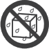</td>
<td>
製品を濡らすことを禁止する記号
</td>
<td></td>
<td></td>
</tr>
</tbody>
</table>

## 警告

<table>
<colgroup>
<col style="width: 10%" />
<col style="width: 40%" />
<col style="width: 10%" />
<col style="width: 40%" />
</colgroup>
<tbody>
<tr>
<td></td>
<td>
<strong>火のそばや炎天下の車内、熱器具の周辺など高温（45℃以上）になる場所で使用したり、放置しない</strong>

発熱や発火、破裂する原因になります。
</td>
<td></td>
<td>
<strong>端子部にケーブル以外の金属類を差し込まない</strong>

発熱や発火の原因になります。
</td>
</tr>
<tr>
<td></td>
<td>
<strong>強い衝撃を与えたり、投げつけたりしない</strong>

発熱や発火、破裂する原因になります。
</td>
<td></td>
<td>
<strong>雷が鳴りだしたら、電源プラグにふれない (充電をしない)</strong>

感電の原因になります。
</td>
</tr>
<tr>
<td></td>
<td>
<strong>水など、液体を入れたり、濡らしたりしない</strong>

発熱や発火の原因になります。
</td>
<td></td>
<td>
<strong>各接続端子には確実に差し込む</strong>

差し込みが不十分だと、発熱したりほこりが付着して火災や感電の原因になります。
</td>
</tr>
<tr>
<td></td>
<td>
<strong>濡れた手で本体や接続するケーブルを触らない</strong>

火災や感電の原因になります。
</td>
<td></td>
<td>
<strong>接地接続は必ず、電源プラグを電源につなぐ前に行って下さい</strong>

また、接地接続を外す場合は、必ず電源プラグを切り離してから行って下さい。
</td>
</tr>
</tbody>
</table>

## 警告

<table>
<colgroup>
<col style="width: 10%" />
<col style="width: 90%" />
</colgroup>
<tbody>
<tr>
<td></td>
<td>
万が一、次のような異常が発生したときはすぐに使用をやめる

<ul>
<li>
煙が出ている、異臭がする
</li>
<li>
内部に水や異物が入ったとき
</li>
<li>
落としたり、破損したとき
</li>
<li>
電源コード (AC充電ケーブル) が傷んだとき
</li>
<li>
異音がする
</li>
</ul>

このような異常が発生したまま使用していると、火災や感電の原因になります。 すぐにAC充電ケーブルをコンセントから抜いてください。また、本製品に接続されている機器もすべて外してください。

<strong>万が一発煙や発火したら、大量の水で消火して煙が見えなくなるまで本製品を水浸しにしてください。</strong>

煙が出なくなることを確認してからカスタマーサポートにご連絡ください。 お客様による修理は危険ですので絶対におやめください。
</td>
</tr>
<tr>
<td></td>
<td>
<strong>分解、改造しない</strong>

故障、発熱、火災·感電の原因になります。
</td>
</tr>
<tr>
<td></td>
<td>
<strong>表示された電源電圧以外で使用しない</strong>

故障、発熱、火災·感電の原因になります。また、本製品を使用できるのは日本国内のみです。
</td>
</tr>
<tr>
<td></td>
<td>
<strong>付属品と本製品が破損した場合は、ご自身で修理をしない</strong>
</td>
</tr>
</tbody>
</table>

## 注意

<table>
<colgroup>
<col style="width: 10%" />
<col style="width: 90%" />
</colgroup>
<tbody>
<tr>
<td></td>
<td>
<strong>本製品の上に物を載せたり、不安定な場所に置かない</strong>

倒れたり、落ちたりしてけがの原因になります。
</td>
</tr>
<tr>
<td></td>
<td>
<strong>データサーバや医療機器など、非常時に不具合が起こると人命 / 財産に重大な危険を及ぼしうる用途でのご使用はお控えください。次のようなような機器では、万が一使用中に給電ができなくなった場合、人命 / 財産にかかわる被害が想定されます。</strong>

<ul>
<li>
医療機器や使用上、生命に関わるような機器
</li>
<li>
社会的、公共的に重要な機器など
</li>
<li>
重要な事業用機器など
</li>
</ul></td>
</tr>
<tr>
<td></td>
<td>
<strong>心臓にペースメーカーを装着している方は使用しない</strong>

ペースメーカーが、本製品の影響を受ける恐れがあります。
</td>
</tr>
<tr>
<td></td>
<td>
<strong>格納式ハンドルを使用してJackery ポータブル電源 1000 Newを移動するときは、積み重ねたり、上に他の物を置いたりしないでください。落下して怪我をする場合があります。</strong>
</td>
</tr>
</tbody>
</table>

## 使用上のご注意

Jackery ポータブル電源 1000 Newは、定格出力1500Wです。通常時で消費電力が1500Wまでの機器に給電ができるため、多くの電化製品や端末に対応可能です。ただし、電気モーターを搭載している製品（掃除機、ポンプ、冷蔵庫、電動丸ノコ、エアコン、洗濯機、電子レンジ、ドライヤーなど）は、起動時に「誘導負荷」が発生し、公称電力の3～7倍の電力が必要になる場合があります。

定格出力1500Wとは、一定の電力で動作する機器に対して安定して出力できる最大電力を指します。 接続する機器の消費電力が1500Wを超えた場合、保護機能が作動し、自動的に出力が停止することがあります。

また、本製品にはAC出力ポートが3つ搭載されていますが、複数の機器を同時に使用する場合でも、合計消費電力が1500W以内になるようにご確認ください。

<table class="manual-callout-table" style="width:100%; border-collapse:collapse; margin:0 0 16px 0;"><tbody><tr><td class="manual-callout-label" style="width:16%; border:1px solid #000; padding:6px 8px; vertical-align:top;">
<strong>ご注意</strong>
ご注意説明備考</td><td class="manual-callout-body" style="border:1px solid #000; padding:6px 8px; vertical-align:top;">
始動電力が出力上限値（定格出力）を大幅に超える可能性のある製品のご利用や、定格出力を超え給電がストップした製品を繰り返し利用することはポータブル電源のバッテリーが損傷するリスクがありますのでお控えください。
</td></tr></tbody></table>

### ■ 給電に関する注意事項

- 出力上限値を超える電化製品は使用しないでください。

- 特に、始動電力が公称電力の3\~7倍になる誘導負荷（ポンプ、ヒーター、掃除機、冷蔵庫、エアコン、電気丸ノコなどの電動道具、洗濯機、電子レンジなど）の使用にはご注意ください。

- 接続機器の消費電力が本製品の出力範囲内であることをご確認の上、出力ボタンを押してください。

- 給電中、機器の制御や環境により、急速充電にならない・給電できない場合があります。

- 充電または給電中、ラジオ・チューナー・テレビなどに雑音が入る場合があります。その際は、それらの機器から離してご使用ください。

### ■ 使用環境について

- 本製品は防塵・防水仕様ではありません。ほこり、水、海水などがかからないようご注意ください。

- ほこりの多い場所や高温多湿の場所での充電・使用・放置は避けてください。

- 平坦で安定した場所に設置し、不安定な場所に置かないでください。

- 本製品の通風孔は、安全上絶対にふさがないでください。各面から5cm以上スペースを確保してください。

- 充電・給電中は本体が温かくなります。周囲に物を置かないでください。

### ■ 接続時の注意事項

- ケーブルを接続する際は、まっすぐに差し込んでください。

- 抜く際は必ずプラグ部分を持って抜いてください。ケーブルを引っ張ったり折り曲げたりしないでください。

- この機器に同梱した指定の電源コードセットだけを使用する。

### ■ お手入れについて

- 本体が汚れた場合は、電源プラグを抜いた状態で、柔らかい布で乾拭きしてください。

- 汚れがひどい場合は、水または薄めた中性洗剤で拭き取ってください。

- シンナーやベンジンなどの使用は絶対に使わないでください。

### ■ 入出力・温度・表示に関するご注意

- 接続機器の入力が本製品の出力上限を超えている場合、自動で電源が遮断されます。

- 本機は-10℃ \~ 45℃の温度範囲でお使いの機器に電力供給が可能となり、本機の蓄電は0℃ \~ 45℃で行えます。

  - 動作温度が上記範囲外にある場合、本製品が温度異常マークが表示され、動作しない可能性があります。

  - 温度異常マークが表示された場合は、本製品を2時間以上、動作温度範囲内の環境に置いてください。

- 容量表示は参考値であり、電圧により表示数値と実際の容量に差異が出る場合があります。

## 免責事項

- 火災、地震、第三者による行為、その他の事故、お客様の故意または過失誤用・誤動作・その他の異常な条件下での使用により生じた損害に関して、当社は一切責任を負いません。

- 付属品と本製品が破損した場合は、ご自身で修理を行わないでください。ご自身で分解・修理したことにより生じた損害に関し、当社は一切責任を負いません。

- 保証範囲は利用規約に適用され、記載されていない内容は当社の保証範囲外となります。

- 取扱説明書の記載事項が遵守されないことにより生じた不適合について当社は責任を負いかねます。

- 本製品の使用、または使用不能から発生する付随的な損害(事業利益損失含む)、当社が関与しない接続機器との組み合わせによる誤動作などから生じた損害に関して、当社は一切の責任を負いません。

- 本製品は病院仕様のシーパップ（CPAP）、エクモ（ECMO）、ペースメーカなど、身の安全に関わる医療救急機械の電源としての使用、または、消費電力の大きいな設備、例えば核施設設備、スペースシャトル製造などの使用は推薦されません。上記設備の使用後、火災、機器故障など個人安全を脅かす事故の責任を取りません。

# 同梱品

<figure class="hb-reference-composition hb-reference-plain-inventory" aria-label="同梱品" data-component-id="HB-TABLE-REFERENCE" data-component-variant="plain-inventory" tabindex="0">
<table class="hb-reference-table">
<tbody>
<tr>
<td>
本体
</td>
<td>
AC充電ケーブル
</td>
<td>
取扱説明書一式
</td>
</tr>
</tbody>
</table>
</figure>

※ 付属品を故障、紛失等してしまった場合はカスタマーサポートまでご連絡ください。

※ AC充電ケーブルは、同梱されている本体以外には使用しないでください。

※ シガーソケット充電ケーブルは別売りです。Jackery公式サイトよりご購入いただけます。サポートが必要な場合は、Jackeryカスタマーサポートまでお問い合わせください。

**本機の仕様および外観は、改善のため予告なく変更することがあります。**

# 各部の名称

## 正面

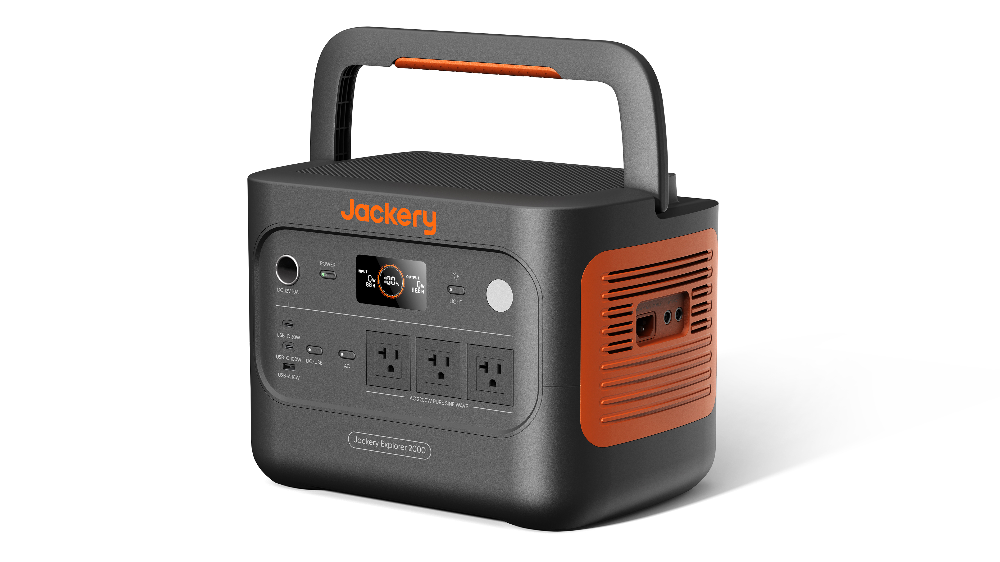

<table>
<colgroup>
<col style="width: 50%" />
<col style="width: 50%" />
</colgroup>
<tbody>
<tr>
<td>
<strong>主電源ボタン</strong>
</td>
<td>
<strong>ハンドル</strong>
</td>
</tr>
<tr>
<td>
<strong>シガーソケット出力ポート</strong>

12V⎓最大10A
</td>
<td>
<strong>LCDディスプレイ</strong>
</td>
</tr>
<tr>
<td>
<strong>DC/USB出力ボタン</strong>
</td>
<td>
<strong>LEDライトボタン</strong>
</td>
</tr>
<tr>
<td>
<strong>USB-C 30W出力ポート</strong>

5V⎓3A，9V⎓3A，12V⎓2.5A，15V⎓2A，20V⎓1.5A，最大30W
</td>
<td>
<strong>LEDライト</strong>
</td>
</tr>
<tr>
<td>
<strong>USB-C 100W出力ポート</strong>

5V⎓3A，9V⎓3A，12V⎓3A，15V⎓3A，20V⎓5A，最大100W
</td>
<td>
<strong>AC出力ボタン</strong>
</td>
</tr>
<tr>
<td>
<strong>USB-A 18W出力ポート</strong>

5-6V⎓3A，6-9V⎓2A，9-12V⎓1.5A，最大18W
</td>
<td>
<strong>AC出力ポート</strong>

100V~ 50Hz/60Hz，最大15A，定格1500W，瞬間最大3000W
</td>
</tr>
</tbody>
</table>

## 右側面

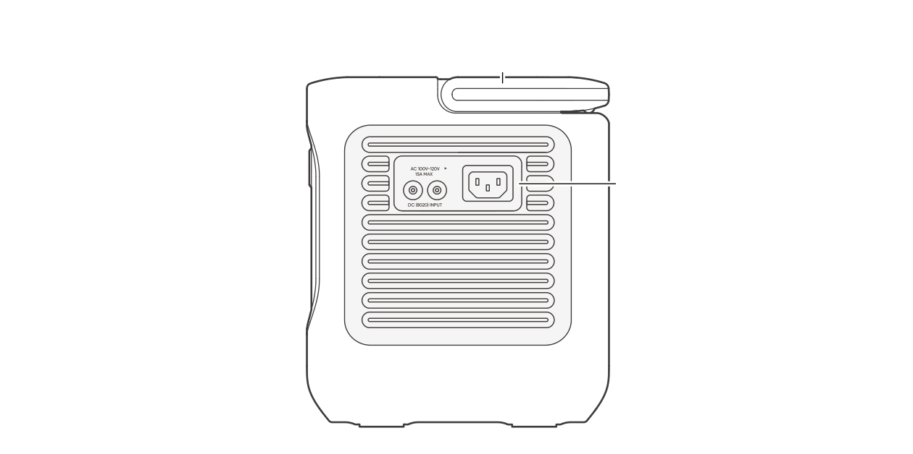

<table>
<colgroup>
<col style="width: 100%" />
</colgroup>
<tbody>
<tr>
<td>
<strong>DC入力ポート（DC8020）</strong>

PV：16V-60V⎓12A，2ポート最大21A，最大400W

ｼｶﾞｰｿｹｯﾄ ：11V-16V⎓最大8A, 2ポート最大8A
</td>
</tr>
<tr>
<td>
<strong>AC入力ポート</strong>

100V-120V~ 50Hz/60Hz，最大15A
</td>
</tr>
</tbody>
</table>

# 液晶画面

<figure aria-label="LCD icon meanings" class="hb-lcd-table-composition" data-component-id="HB-TABLE-LCD-ICON" tabindex="0"><table class="hb-lcd-icon-table"><colgroup><col class="hb-lcd-col-number"/><col class="hb-lcd-col-icon"/><col class="hb-lcd-col-name"/><col class="hb-lcd-col-description"/></colgroup><tbody><tr><td class="hb-lcd-number">
1
</td><td class="hb-lcd-icon"></td><td class="hb-lcd-name">
Wi-Fi
</td><td class="hb-lcd-description">

オン：Wi-Fiに接続されています。

<strong>点滅：</strong> Wi-Fi接続の準備中です。

オフ：Wi-Fiは切断されています。

</td></tr><tr><td class="hb-lcd-number">
2
</td><td class="hb-lcd-icon"></td><td class="hb-lcd-name">
Bluetooth
</td><td class="hb-lcd-description">

オン：Bluetoothに接続されています。

<strong>点滅：</strong> Bluetooth接続の準備中です。

オフ：Bluetoothは切断されています。

</td></tr><tr><td class="hb-lcd-number">
3
</td><td class="hb-lcd-icon"></td><td class="hb-lcd-name">
静音充電モード
</td><td class="hb-lcd-description">

オン：充電中のノイズが大幅に低減され、充電電力が低下し、充電速度が低減します。

オフ：静音充電モードが無効になっています。

（Jackeryアプリで有効/無効にできます。電源オフ時も設定は保持されます。）

</td></tr><tr><td class="hb-lcd-number">
4
</td><td class="hb-lcd-icon"></td><td class="hb-lcd-name">
計画充電モード
</td><td class="hb-lcd-description">

Jackery ポータブル電源 1000 New の充電時間をカスタマイズすることで、電気料金のピーク時間とオフピーク時間に基づいた充電プランを選択。これにより月々の電気料金を削減することができます。

（Jackeryアプリで設定してください。電源オフ時も設定は保持されます。）

</td></tr><tr><td class="hb-lcd-number">
5
</td><td class="hb-lcd-icon"></td><td class="hb-lcd-name">
自家発電モード
</td><td class="hb-lcd-description">

点灯時：自家発電モードがオンになっており、太陽光エネルギーの利用を最大化し、電力会社からの電力消費を削減して電気代を節約します。

消灯時：自家発電モードがオフ、または未設定の状態です。

（Jackeryアプリで設定してください。電源オフ時も設定は保持されます。）

</td></tr><tr><td class="hb-lcd-number">
6
</td><td class="hb-lcd-icon"></td><td class="hb-lcd-name">
TOUモード
</td><td class="hb-lcd-description">

オン：TOUモードが有効です（デフォルトバックアップSOC：60%）。 ピーク時間帯に、蓄積エネルギーがバックアップSOCを上回ると、本製品はバッテリーの放電を優先し、ピーク時の電力コストを削減します。 オフピーク時間帯には、系統からバッテリーを充電し、ピークカットと谷埋めを実現します。

オフ：TOUモードは無効になります。 本デバイスはTOU（時間帯別料金）戦略に従わず、デフォルトの電力供給および充電ロジックに基づいて動作します。

（Jackeryアプリで設定してください。電源オフ時も設定は保持されます。）

</td></tr><tr><td class="hb-lcd-number">
7
</td><td class="hb-lcd-icon"></td><td class="hb-lcd-name">
UPS機能
</td><td class="hb-lcd-description">

点灯時：製品が給電と充電を同時に行う「パススルー充電」状態にあります。停電時には家庭用電源からポータブル電源の切り替え時間が10ミリ秒で行われます。

消灯時：製品がパススルー充電状態ではありません。

</td></tr><tr><td class="hb-lcd-number">
8
</td><td class="hb-lcd-icon"></td><td class="hb-lcd-name">

交流電源による出力マーク

（正弦波)

</td><td class="hb-lcd-description">
AC出力（純正弦波）がオンになっています。
</td></tr><tr><td class="hb-lcd-number">
9
</td><td class="hb-lcd-icon"></td><td class="hb-lcd-name">
出力電圧と周波数
</td><td class="hb-lcd-description">
出力される電圧と周波数を表示します。
</td></tr><tr><td class="hb-lcd-number">
10
</td><td class="hb-lcd-icon"></td><td class="hb-lcd-name">
入力電力表示
</td><td class="hb-lcd-description">
入力電力をワットで表示します。
</td></tr><tr><td class="hb-lcd-number">
11
</td><td class="hb-lcd-icon"></td><td class="hb-lcd-name">
充電残り時間
</td><td class="hb-lcd-description">
充電残り時間を表示します。
</td></tr><tr><td class="hb-lcd-number">
12
</td><td class="hb-lcd-icon"></td><td class="hb-lcd-name">
AC入力電力表示
</td><td class="hb-lcd-description">
製品は、系統電力を使用し、AC入力を介して充電されます。
</td></tr><tr><td class="hb-lcd-number">
13
</td><td class="hb-lcd-icon"></td><td class="hb-lcd-name">
シガーソケット入力電力表示
</td><td class="hb-lcd-description">
製品は、DC 12V（カーチャージ）を使用し、8020入力ポートを介して充電されます。
</td></tr><tr><td class="hb-lcd-number">
14
</td><td class="hb-lcd-icon"></td><td class="hb-lcd-name">
ソーラー(グリーンエネルギー)充電接続
</td><td class="hb-lcd-description">
製品は、ソーラーパネルを使用し、8020入力ポートを介して充電されています。
</td></tr><tr><td class="hb-lcd-number">
15
</td><td class="hb-lcd-icon"></td><td class="hb-lcd-name">

バッテリー節約モード

Jackeryアプリで有効/無効にできます

</td><td class="hb-lcd-description">

バッテリー節約モード設定時は、バッテリー残量が既定値に設定されるため、バッテリーの寿命を延ばすことが可能です。

（Jackeryアプリで設定してください。電源オフ時も設定は保持されます。）

この機能が有効な場合、本製品はSOCを較正するために、時折フル充放電サイクルを実行します。

</td></tr><tr><td class="hb-lcd-number">
16
</td><td class="hb-lcd-icon"></td><td class="hb-lcd-name">
充電速度制限
</td><td class="hb-lcd-description">

点灯時：アプリ側で充電速度制限が有効になっています。

消灯時：アプリ側で充電速度制限が無効になっています。

（Jackeryアプリで設定してください。電源オフ時も設定は保持されます。）

</td></tr><tr><td class="hb-lcd-number">
17
</td><td class="hb-lcd-icon"></td><td class="hb-lcd-name">
バッテリーアイコン
</td><td class="hb-lcd-description">
製品の充電中は、バッテリーのパーセンテージを囲むオレンジ色の円が順番に点灯します。他のデバイスの充電時には、オレンジ色の円は点灯したままになります。
</td></tr><tr><td class="hb-lcd-number">
18
</td><td class="hb-lcd-icon"></td><td class="hb-lcd-name">
バッテリーレベルパーセントタグ
</td><td class="hb-lcd-description">
バッテリー残量を表示します。
</td></tr><tr><td class="hb-lcd-number">
19
</td><td class="hb-lcd-icon"></td><td class="hb-lcd-name">
バッテリー残量警告灯
</td><td class="hb-lcd-description">

オン：バッテリー残量が20％未満です。

<strong>点滅：</strong> バッテリー残量が5％未満です。

オフ：製品は充電中です。

</td></tr><tr><td class="hb-lcd-number">
20
</td><td class="hb-lcd-icon"></td><td class="hb-lcd-name">
放電タイマー
</td><td class="hb-lcd-description">

オン：放電タイマーが設定されています。

オフ：放電タイマーは設定されていません。

Jackeryアプリで設定してください。本設定は、デバイスの電源を切ると保持されません。

</td></tr><tr><td class="hb-lcd-number">
22
</td><td class="hb-lcd-icon"></td><td class="hb-lcd-name">
省エネモード
</td><td class="hb-lcd-description">

ACまたはDC出力をACまたはDC/USB電源ボタンを押してオンにしたとき：

アイコン表示：省エネモードがオンになっています。

アイコン無表示：省エネモードがオフになっています。

電源オフ時も設定は保持されます。

</td></tr><tr><td class="hb-lcd-number">
23
</td><td class="hb-lcd-icon"></td><td class="hb-lcd-name">
高温インジケーター
</td><td class="hb-lcd-description">
高温保護が作動しました。製品の温度が通常の動作範囲に戻るまで、製品の機能が停止する場合があります。
</td></tr><tr><td class="hb-lcd-number">
24
</td><td class="hb-lcd-icon"></td><td class="hb-lcd-name">
低温インジケーター
</td><td class="hb-lcd-description">
低温保護が作動しました。製品の温度が通常の動作範囲に戻るまで、製品の機能が停止する場合があります。
</td></tr><tr><td class="hb-lcd-number">
25
</td><td class="hb-lcd-icon"></td><td class="hb-lcd-name">
エラーコード
</td><td class="hb-lcd-description">
製品エラーが発生しました。詳細については、トラブルシューティングのセクションを参照してください。
</td></tr><tr><td class="hb-lcd-number">
26
</td><td class="hb-lcd-icon"></td><td class="hb-lcd-name">
消費電力
</td><td class="hb-lcd-description">
出力電力をワットで表示します。
</td></tr><tr><td class="hb-lcd-number">
27
</td><td class="hb-lcd-icon"></td><td class="hb-lcd-name">
バッテリー使用可能時間
</td><td class="hb-lcd-description">
接続した機器の使用可能な時間を表示します。
</td></tr></tbody></table></figure>

# 使い方

## 主電源ボタン/オフ

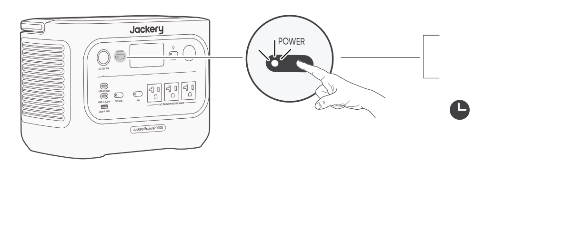

オン

1回押す

オフ

3秒間長押し

本製品のデフォルトの待機時間は2時間です（充電または放電がない場合、2時間後に自動的にシャットダウンします）。待機時間はJackeryアプリで設定できます。

省エネモードがオンのとき、AC出力またはDC/USB出力がオンでも、12時間連続して充放電が行われない場合は、自動的に電源がオフになります。

## AC出力のオン/オフ

● **前提：** 主電源ボタンがオンになっていることを確認してください。

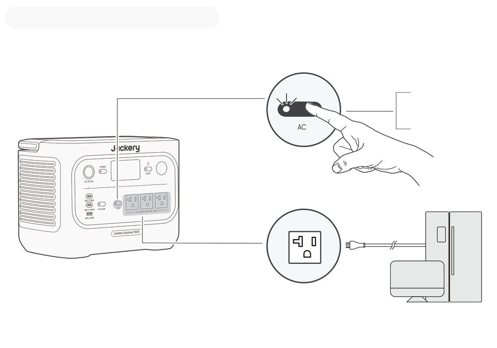

オン

1回押す

オフ

1回押す

**50Hz/60Hz周波数の切り替え**

※ 工場出荷時のデフォルト設定は60Hzに設定されています。

自動識別：お客様のお住まいの地域に応じて周波数を自動的に識別し、対応する出力に自動調整されます。

手動調整：AC出力がオンの状態で、AC出力ボタンを5秒間長押しすることで周波数を切り替えることができ、対応する周波数が画面に表示されます。

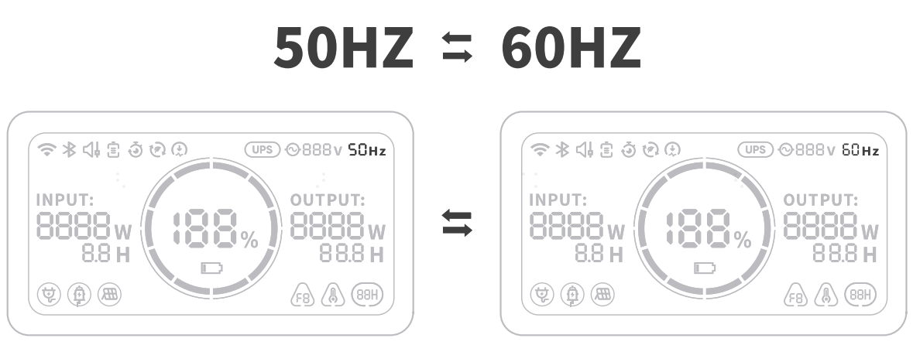

## USB/カーポート出力オン/オフ

● **前提：** 主電源ボタンがオンになっていることを確認してください。

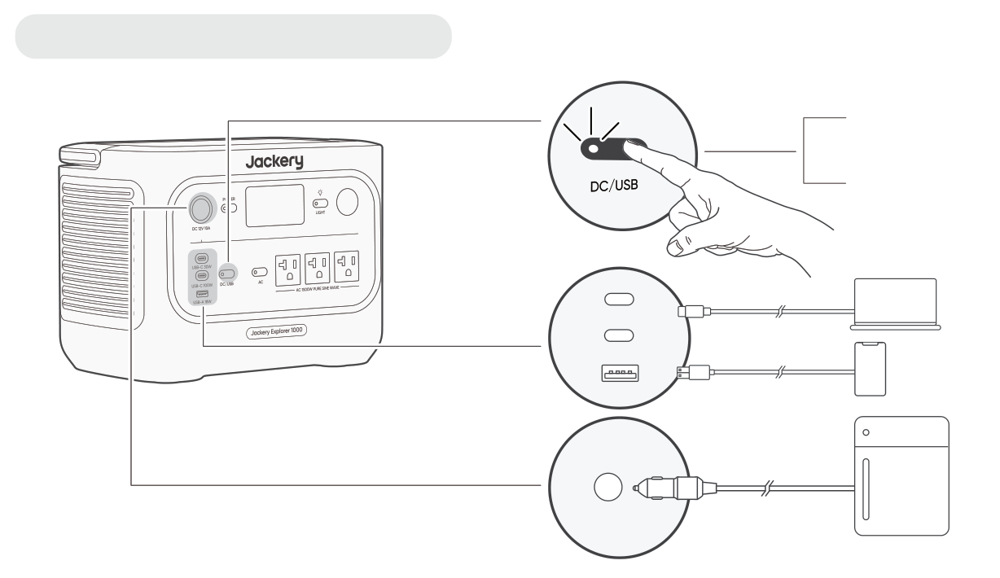

オン

1回押す

オフ

1回押す

<table class="manual-callout-table" style="width:100%; border-collapse:collapse; margin:0 0 16px 0;"><tbody><tr><td class="manual-callout-label" style="width:16%; border:1px solid #000; padding:6px 8px; vertical-align:top;">
<strong>ご注意</strong>
ご注意説明備考</td><td class="manual-callout-body" style="border:1px solid #000; padding:6px 8px; vertical-align:top;">
● USB-C 100Wは、USB-PD Power Source 3（PS3）の高出力ポートです。接続されたユーザーデバイスまたはアクセサリーが安全基準を満たしていない場合、火災の危険性があります。これらのポートを使用する前に、接続するデバイスまたはアクセサリーに耐火安全保護が備わっていることを確認してください。

● Jackery ポータブル電源 1000 Newは、IEC/EN/UL 62368-1（または同等の規格）の6.3、6.4、6.5条に準拠したデバイスまたはアクセサリーのみに接続してください。

● 最大出力を得るためには、USB-C to USB-C 5Aケーブル（20V DC/5A、100W）を使用してください。

</td></tr></tbody></table>

本製品は、別売のJackery 12V 自動車用バッテリー充電ケーブルを使用することで、車のバッテリーへの充電が可能です。

※ Jackery 12V 自動車用バッテリー充電ケーブルは付属しておりません。Jackery公式サイトよりお求めいただけます。

<table class="manual-callout-table" style="width:100%; border-collapse:collapse; margin:0 0 16px 0;"><tbody><tr><td class="manual-callout-label" style="width:16%; border:1px solid #000; padding:6px 8px; vertical-align:top;">
<strong>ご注意</strong>
ご注意説明備考</td><td class="manual-callout-body" style="border:1px solid #000; padding:6px 8px; vertical-align:top;">
● 12V車専用であり、24V車には対応しておりません。

● 本製品の12V DC出力（シガーソケット）から車のバッテリーへ充電中は、エンジンを始動しないでください。製品の故障につながる恐れがあります。

● この機能はあくまで車のバッテリーの緊急補助用であり、深刻なバッテリー上がりや故障したバッテリーには対応しておりません。

</td></tr></tbody></table>

## 省エネモード 

省エネモードは、出力ボタンの消し忘れによる無駄なバッテリー消耗を防ぐための機能で、初期設定ではオンになっています。AC出力が25W以下、またはDC/USB出力が2W以下の状態が12時間続くと、自動的に出力がオフになります。ACまたはDC/USB出力がオンの状態では、画面に省エネアイコン  が表示されます。アイコンの表示時間は、設定された省エネ時間に応じて変わります。省エネ時間は、Jackeryアプリで1H、2H、8H、12H、24Hに設定できます。「オフにしない」に設定すると、省エネモードは無効になります。

<table>
<thead>
<tr>
<th class="head">
出力ポートタイプ
</th>
<th class="head">
電力設定値
</th>
<th class="head">
デフォルト設定
</th>
</tr>
</thead>
<tbody>
<tr>
<td>
AC出力ポート
</td>
<td>
≤25W
</td>
<td rowspan="2">
12時間経つとすべての出力は自動的にオフになります。
</td>
</tr>
<tr>
<td>
DC/USB出力ポート
</td>
<td>
≤2W
</td>
</tr>
</tbody>
</table>

※ 交流25Wおよび直流2W以下の低消費電力機器をご使用の場合、出力が途中で自動的にオフにならないように、省エネモードをオフにしてください。省エネモードをオフにすると、画面上の  アイコンは表示されなくなります。

AC出力ボタンがオンの状態で、AC出力ボタンと主電源ボタンを同時に長押しし、省エネアイコンの表示（オン）／非表示（オフ）が切り替わるまで押し続けてください。

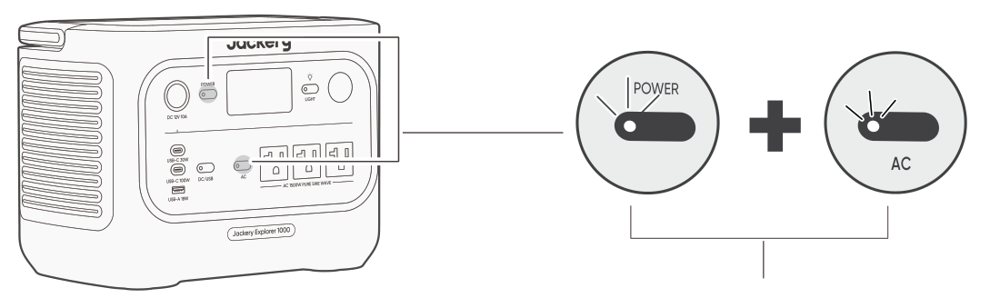

オン/オフ

両方を3秒間長押し

<table class="manual-callout-table" style="width:100%; border-collapse:collapse; margin:0 0 16px 0;"><tbody><tr><td class="manual-callout-label" style="width:16%; border:1px solid #000; padding:6px 8px; vertical-align:top;">
<strong>説明</strong>
ご注意説明備考</td><td class="manual-callout-body" style="border:1px solid #000; padding:6px 8px; vertical-align:top;">
省エネモードは電源投入後に前回の状態を維持します。モード変更には手動での切り替えが必要です。
</td></tr></tbody></table>

## ACおよびDC出力の復帰機能

ACおよびDC出力の復帰機能はデフォルトでオフになっています。本機能を使用するには、アプリで有効にしてください。有効にすると、本機はACおよびDCの出力状態を記憶し、所定の条件下でACおよびDC出力を自動的に再開します。

<figure aria-label="自動復帰する条件 / 自動復帰しない条件" class="hb-auto-resume-composition" data-component-id="HB-TABLE-AUTO-RESUME" tabindex="0"><table class="hb-auto-resume-table"><colgroup><col class="hb-auto-resume-col"/><col class="hb-auto-resume-col"/></colgroup><thead><tr><th class="hb-auto-resume-left" scope="col">自動復帰する条件</th><th class="hb-auto-resume-right" scope="col">自動復帰しない条件</th></tr></thead><tbody><tr><td class="hb-auto-resume-left">シャットダウンまたは再起動後の電源オン／再起動</td><td class="hb-auto-resume-right">手動で出力をオフにした場合（ボタン／アプリ）</td></tr><tr><td class="hb-auto-resume-left" rowspan="2">バッテリーSOCが放電制限に達した後、制限値＋10％以上
に回復した場合</td><td class="hb-auto-resume-right">省エネモードによる出力オフ</td></tr><tr><td class="hb-auto-resume-right">保護動作による出力オフ</td></tr><tr><td class="hb-auto-resume-left">OTAアップグレード完了後</td><td class="hb-auto-resume-right">放電タイマーによる出力オフ</td></tr></tbody></table></figure>

## LEDライト

LEDライトには、照明モードとSOSモードの2つのモードがあります。いずれのモードでも、LEDスイッチを長押しすることでLEDライトを消灯できます。

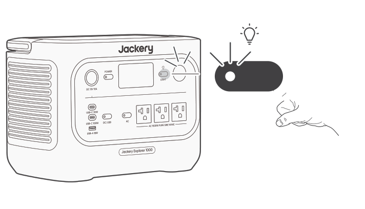

LEDスイッチを短く押すとLEDライトが点灯し

再度短く押すとSOSモードに切り替わります。

再度短く押すとでライトが消灯します。

## LCDスクリーン

<figure aria-label="LCD display mode diagram." class="hb-lcd-mode-composition" data-component-id="HB-TABLE-LCD-MODE">
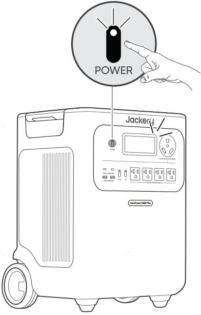

<table class="hb-lcd-mode-table"><colgroup><col class="hb-lcd-mode-col-state"/><col class="hb-lcd-mode-col-action"/><col class="hb-lcd-mode-col-copy"/></colgroup><tbody><tr><td class="hb-lcd-mode-state" rowspan="3">短くオン</td><td class="hb-lcd-mode-action">オンにする</td><td class="hb-lcd-mode-copy">主電源ボタンを押すか、充電入力がある場合。</td></tr><tr><td class="hb-lcd-mode-action">オフにする</td><td class="hb-lcd-mode-copy">主電源ボタンを押します。</td></tr><tr><td class="hb-lcd-mode-action">自動オフ</td><td class="hb-lcd-mode-copy">2分後にLCDは自動的に消灯し、スリープモードになります。</td></tr><tr><td class="hb-lcd-mode-state" rowspan="3">常時オン</td><td class="hb-lcd-mode-action">オンにする</td><td class="hb-lcd-mode-copy">デバイスが起動している状態で主電源ボタンを2回押します。</td></tr><tr><td class="hb-lcd-mode-action">オフにする</td><td class="hb-lcd-mode-copy">主電源ボタンを押します。</td></tr><tr><td class="hb-lcd-mode-action">自動オフ</td><td class="hb-lcd-mode-copy">常時点灯ディスプレイモードは、2時間操作がないと自動的に消灯します。</td></tr></tbody></table>
</figure>

Jackeryアプリで画面表示モードを設定することもできます。

## ボタン操作

<figure aria-label="ボタン / 操作 / 機能" class="hb-key-combination-composition" data-component-id="HB-TABLE-KEY-COMBINATIONS" tabindex="0"><table class="hb-key-combination-table"><colgroup><col class="hb-key-col-buttons"/><col class="hb-key-col-operation"/><col class="hb-key-col-function"/></colgroup><thead><tr><th class="hb-key-buttons" scope="col">
ボタン
</th><th class="hb-key-operation" scope="col">
操作
</th><th class="hb-key-function" scope="col">
機能
</th></tr></thead><tbody><tr><td class="hb-key-buttons">
主電源ボタン + AC出力ボタン
</td><td class="hb-key-operation">
両方を3秒間長押し
</td><td class="hb-key-function">
省エネモードのオン/ オフを切り替えます
</td></tr><tr><td class="hb-key-buttons">
主電源ボタン + DC/USB出力ボタン
</td><td class="hb-key-operation">
両方を3秒間長押し
</td><td class="hb-key-function">
Wi-Fiのリセット
</td></tr><tr><td class="hb-key-buttons">
AC出力ボタン + USB出力ボタン
</td><td class="hb-key-operation">
両方を1秒間長押し
</td><td class="hb-key-function">
Wi-Fi＆Bluetooth オン/オフ
</td></tr><tr><td class="hb-key-buttons">
主電源ボタン + ライトボタン
</td><td class="hb-key-operation">
両方を1秒間長押し
</td><td class="hb-key-function">
緊急充電モードのオン／オフを切り替えます
</td></tr></tbody></table></figure>

# UPS 機能

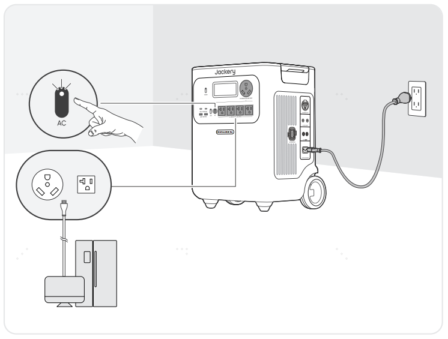

電気製品のコンセントをポータブル電源のAC出力ポートに接続し、ポータブル電源のAC入力ポートを家庭のコンセントにつなぐことで、停電時などにポータブル電源を予備電源として活用できます。

本製品は、電気系統（家庭内の電源など）が突然停止した場合、自動的にバッテリー給電モードに切り替わるUPS（無停電電源装置）機能を備えています。切替時間は約10ミリ秒（0.010秒）以内です。

ただし、本機能は0msでの完全な無停止給電には対応しておりません。そのため、以下のような高精度な連続電源供給を必要とする機器への接続はお控えください。

- データサーバー

- ワークステーション

- 医療機器など

- その他、停電・瞬断の許容時間が10ms以下の精密機器／業務機器全般

これらの機器でご使用を希望される場合は、事前に複数回の動作テストを実施し、機器との互換性をご確認の上でご使用ください。

※記載の手順に従わずに機器が正常に動作しなかったり、データ消失などの損害が発生した場合、弊社では責任を負いかねます。あらかじめご了承ください。

UPSとして使用している際はパススルー機能により充電と出力が同時に行われている状態のため、ポータブル電源の最大出力は1500Wに制限され、停電時には定格出力に戻ります。複数の機器をUPSモードで同時に接続する場合は、合計負荷電力がバイパス時の最大出力（1500W）を超えないようにしてください。超えると、機器が過負荷保護により停止するおそれがあります。

# 充電方法

## グリーンエネルギー優先モード:

本製品はグリーンエネルギー優先モードを搭載していますが、ソーラーパネルとAC充電ケーブルを使って同時に充電できます。同時に充電すると、ソーラーが優先されますが、バッテリーの最大許容電力で同時に充電されます。

<table class="manual-callout-table" style="width:100%; border-collapse:collapse; margin:0 0 16px 0;"><tbody><tr><td class="manual-callout-label" style="width:16%; border:1px solid #000; padding:6px 8px; vertical-align:top;">
<strong>ご注意</strong>
ご注意説明備考</td><td class="manual-callout-body" style="border:1px solid #000; padding:6px 8px; vertical-align:top;">
● 製品の充電動作温度範囲は0℃ ~ 45℃、放電動作温度範囲は-10℃ ~ 45℃です。上限・下限温度を超えた場合、充放電が制限され、または充放電不可の可能性があります。

● 温度によって、製品の充電効率と実際の容量は異なります。

</td></tr></tbody></table>

<table class="manual-callout-table" style="width:100%; border-collapse:collapse; margin:0 0 16px 0;"><tbody><tr><td class="manual-callout-label" style="width:16%; border:1px solid #000; padding:6px 8px; vertical-align:top;">
<strong>ご注意</strong>
ご注意説明備考</td><td class="manual-callout-body" style="border:1px solid #000; padding:6px 8px; vertical-align:top;">
● はじめてお使いになるときは、本製品をフル充電してからご使用ください。

● 充電池は空の状態で長期保管(3カ月~6カ月）すると、性能が劣化したり、充電できなくなる場合があります。

● 長期保管中は、電池残量が0％にならないよう、3か月に一度の充電をおすすめします。

</td></tr></tbody></table>

## AC充電ケーブル

コンセントからJackery ポータブル電源 1000 New本体へ充電する際は、電流容量が大きいため、他の機器との併用や途中での抜き差しはお控えください。コンセントの定格を超えることで充電停止が発生したり、配線やコンセント・接続部の発熱、火災の原因となるおそれがあります。電源タップの使用や他の電気製品との併用は避けてご使用ください。

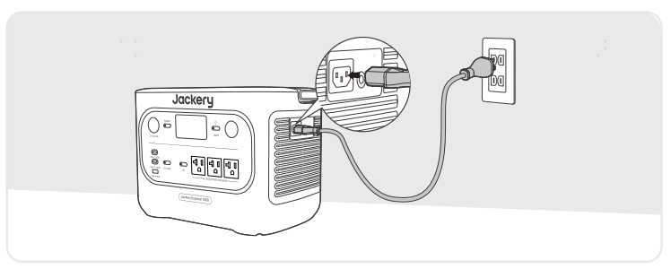

付属のAC充電ケーブルをご使用ください。

<table class="manual-callout-table" style="width:100%; border-collapse:collapse; margin:0 0 16px 0;"><tbody><tr><td class="manual-callout-label" style="width:16%; border:1px solid #000; padding:6px 8px; vertical-align:top;">
<strong>ご注意</strong>
ご注意説明備考</td><td class="manual-callout-body" style="border:1px solid #000; padding:6px 8px; vertical-align:top;">
AC充電ケーブルのプラグが製品のAC入力ポートにしっかりと、かつ完全に差し込まれていることを確認してください。差し込みが不完全な場合、電流の不安定、発熱、接触不良などが発生し、機器の正常な動作に支障をきたす恐れがあります。
</td></tr></tbody></table>

**緊急充電モード：**

ACコンセントからの充電時、お急ぎの場合には緊急充電モードを使って充電することができます。使用するには「Jackery App」でこの機能を「有効」または「無効」に設定してください。緊急充電モードでは、バッテリーの残量(SOC)を示す円形のライトの点滅速度が速くなります。

※バッテリーは通常の速度で充電することでバッテリーを最大限に保護できるよう設計されているため、緊急充電は必要場合にのみ使用し、常時使用することはお勧めしません。

## ソーラー充電

ソーラーパネル接続用のDC入力ポート（8020メス）×2を搭載しており、合計最大入力電力は400Wです。そのため、ソーラーパネル100Wの場合は最大4枚までとなります。

■ 必要なアクセサリー

• 1枚または2枚接続時：アクセサリー不要、直接本体に接続可能です。

• 4枚接続時：別売りの「SolarSagaアダプター（Pro/Plus/New専用）」を2個ご用意いただく必要があります。

※ Jackery SolarSagaアダプターを使って3枚接続はできません（電圧が許容範囲を超え、故障のリスクがあります）。

■ 1枚または2枚接続時

- 直接接続可能です。追加のアクセサリーは不要です。

  本製品のDC入力ポートは「8020メス」です。ソーラーパネル側の「8020オス」と接続してください。

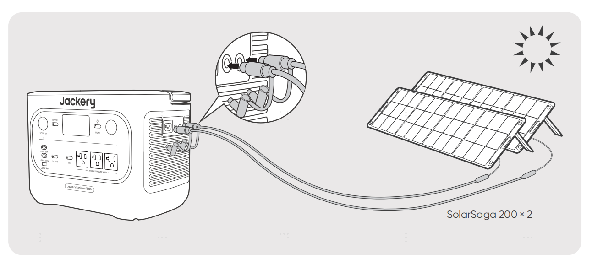

■ 4枚接続時

- 別売りの「Jackery SolarSaga アダプター（Pro/Plus/New専用）」が必要です。

  - 「Jackery SolarSaga アダプター（Pro/Plus/New専用）」（オス・メス）とも8020端子です。

  - ソーラーパネルの8020オス端子を「Jackery SolarSaga アダプター（Pro/Plus/New専用）」の8020メス端子に接続してください。

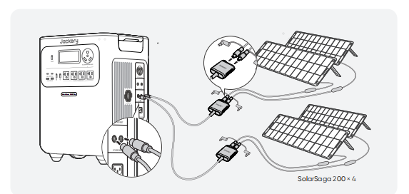

<table class="manual-callout-table" style="width:100%; border-collapse:collapse; margin:0 0 16px 0;"><tbody><tr><td class="manual-callout-label" style="width:16%; border:1px solid #000; padding:6px 8px; vertical-align:top;">
<strong>ご注意</strong>
ご注意説明備考</td><td class="manual-callout-body" style="border:1px solid #000; padding:6px 8px; vertical-align:top;">

DC入力ポートの電圧を一致させてください

 

2つのDC入力ポートに接続する電源の電圧は必ず一致させてください。電圧が異なると、製品の異常動作や故障の原因となる可能性があります。

例:

 

● 2つのDC8020入力ポートにソーラーパネルを接続する際は、同じ型番のJackery製ソーラーパネルを使用し、接続する枚数も揃えてください。異なる型番や接続枚数で接続すると、電圧が不均一になり、製品が故障するおそれがあります。

● 車載充電器とソーラーパネルを同時に使用して製品を充電しないでください。車のヒューズが切れたり、充電が正常に行われなかったりする可能性があります。

</td></tr></tbody></table>

Jackeryブランド以外の付属品を使用して充電しないでください。特に、ソーラーパネルで充電する際は、Jackeryのソーラーパネルを使用することをお勧めします。ソーラーパネルの開放電圧（Voc）が、Jackery ポータブル電源 1000 NewのDC入力電圧範囲（16V〜60V）内に収まっていることを確認してください。他社ソーラーパネルで充電することによる損失について、当社は一切の責任を負いません。

## シガーソケット充電

■ 本製品は、車載シガーソケット（12V）からの充電に対応しています。

（車載充電入力：11V〜16V、最大8A）

ご使用の際は、以下にご注意ください。

- 必ず車のエンジンを始動させてから接続してください。エンジン停止状態で使用すると、車両のバッテリーが上がる恐れがあります。

- 車の充電ポートとシガーソケット充電ケーブルの接触状態をご確認ください。

- ケーブルが確実に奥まで差し込まれていることをご確認ください。

- 悪路などで車両の振動が激しい場合は、接触不良や発熱・焼損の恐れがあるため、充電を中止してください。

- 誤使用による故障・損傷については、弊社では責任を負いかねます。あらかじめご了承ください。

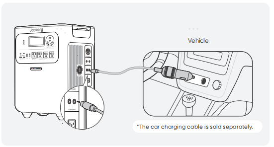

※ シガーソケット充電ケーブルは別売りです。

<table class="manual-callout-table" style="width:100%; border-collapse:collapse; margin:0 0 16px 0;"><tbody><tr><td class="manual-callout-label" style="width:16%; border:1px solid #000; padding:6px 8px; vertical-align:top;">
<strong>ご注意</strong>
ご注意説明備考</td><td class="manual-callout-body" style="border:1px solid #000; padding:6px 8px; vertical-align:top;">

● シガーソケット充電とソーラー充電を同時に使用しないでください。同時に使用すると、車のヒューズが損傷する可能性があります。

● シガーソケット充電は12V、10A車専用で、24V車は充電できません。人身傷害や物的損害を避けるため、本製品の充電に24V車を使用しないでください。

</td></tr></tbody></table>

# トラブルシューティング

次のいずれかのエラーコードが表示された場合は、記載されている対処方法に従って問題を解決してください。問題が解決しない場合は、Jackeryカスタマーサポートまでご連絡ください。

<figure aria-label="エラーコード / 対処方法" class="hb-troubleshooting-composition" data-component-id="HB-TABLE-TROUBLESHOOTING" tabindex="0"><table class="hb-troubleshooting-table"><colgroup><col class="hb-troubleshooting-col-code"/><col class="hb-troubleshooting-col-measures"/></colgroup><thead><tr><th class="hb-troubleshooting-code" scope="col">
エラーコード
</th><th class="hb-troubleshooting-measures" scope="col">
対処方法
</th></tr></thead><tbody><tr><td class="hb-troubleshooting-code">
F0
</td><td class="hb-troubleshooting-measures">
製品を再起動してください。
</td></tr><tr><td class="hb-troubleshooting-code">
F1
</td><td class="hb-troubleshooting-measures">
製品を再起動してください。
</td></tr><tr><td class="hb-troubleshooting-code">
F2
</td><td class="hb-troubleshooting-measures">
製品を再起動してください。
</td></tr><tr><td class="hb-troubleshooting-code">
F3
</td><td class="hb-troubleshooting-measures">
製品を再起動してください。
</td></tr><tr><td class="hb-troubleshooting-code">
F4
</td><td class="hb-troubleshooting-measures">
製品に負荷を接続してバッテリーを放電し、エラーが消えるまで続けてください。
</td></tr><tr><td class="hb-troubleshooting-code">
F5
</td><td class="hb-troubleshooting-measures">
ソーラーパネルまたはAC電源コンセントを使用して、エラーが消えるまで製品を充電してください。
</td></tr><tr><td class="hb-troubleshooting-code">
F6
</td><td class="hb-troubleshooting-measures">

1. AC電源コンセントから充電する前に、電源供給が安定するのを待ってください。

2. 吸気口および排気口が塞がれていないか確認し、製品の両側に20cmのスペースを確保してください。

3. 製品は日陰で通気の良い場所に設置し、周囲温度が45℃未満であることを確認してください。

4. 製品からすべての負荷を取り外し、アイドル状態にして、エラーが消えるまで待ってください。ご使用の機器の起動時消費電力が本製品の出力範囲を超えていないかをご確認ください。

5. 製品を再起動してください。

</td></tr><tr><td class="hb-troubleshooting-code">
F7
</td><td class="hb-troubleshooting-measures">

1. 製品からすべてのDC入力を取り外してください。

2. ソーラーパネルで充電する場合は、接続されたソーラーパネルの開放電圧（Voc）を確認してください。本製品の最大DC入力電圧は60Vです。

3. 製品を再起動し、アイドル状態を保ってください。エラーが消えるまで待ってください。

</td></tr><tr><td class="hb-troubleshooting-code">
F8
</td><td class="hb-troubleshooting-measures">
販売店またはJackeryカスタマーサポートにお問い合わせください。
</td></tr><tr><td class="hb-troubleshooting-code">
F9
</td><td class="hb-troubleshooting-measures">
製品のDC/USBポートに接続されている負荷を取り外してください。故障が消えるまで待機してください。
</td></tr><tr><td class="hb-troubleshooting-code">
FE
</td><td class="hb-troubleshooting-measures">
販売店またはJackeryカスタマーサポートにお問い合わせください。
</td></tr></tbody></table></figure>

# 主な仕様

## 基本情報

<figure aria-label="基本情報" class="hb-spec-table-composition"><table class="hb-spec-table manual-table manual-spec-table"><colgroup><col class="hb-spec-col-label"/><col class="hb-spec-col-value"/></colgroup>
<tbody>
<tr>
<th class="hb-spec-label manual-spec-label" scope="row">製品の名称</th>
<td class="hb-spec-value manual-spec-value">Jackery ポータブル電源 1000 New</td>
</tr>
<tr>
<th class="hb-spec-label manual-spec-label" scope="row">型番</th>
<td class="hb-spec-value manual-spec-value">JE-1000F</td>
</tr>
<tr>
<th class="hb-spec-label manual-spec-label" scope="row">定格容量</th>
<td class="hb-spec-value manual-spec-value">1024Wh (20Ah/51.2V DC)</td>
</tr>
<tr>
<th class="hb-spec-label manual-spec-label" scope="row">バッテリータイプ</th>
<td class="hb-spec-value manual-spec-value">LiFePO₄ (リン酸鉄リチウムイオン電池)</td>
</tr>
<tr>
<th class="hb-spec-label manual-spec-label" scope="row">サイズ＆重量</th>
<td class="hb-spec-value manual-spec-value">約314 × 201 × 236 mm (約10.6 kg）</td>
</tr>
<tr>
<th class="hb-spec-label manual-spec-label" scope="row">サイクル寿命</th>
<td class="hb-spec-value manual-spec-value">4000回（4000回の充放電後も容量の70％以上を維持）</td>
</tr>
</tbody>
</table></figure>

## 入力ポート

<figure aria-label="入力ポート" class="hb-spec-table-composition"><table class="hb-spec-table manual-table manual-spec-table"><colgroup><col class="hb-spec-col-label"/><col class="hb-spec-col-value"/></colgroup>
<tbody>
<tr>
<th class="hb-spec-label manual-spec-label" scope="row">1×ACポート</th>
<td class="hb-spec-value manual-spec-value">100V-120V~50Hz/60Hz, 最大15A① バススルー②: 100V-120V~ 50Hz/60Hz，最大15A</td>
</tr>
<tr>
<th class="hb-spec-label manual-spec-label" scope="row">2×DC8020ポート</th>
<td class="hb-spec-value manual-spec-value">PV: 16V-60V⎓12A, 2ポート 最大21A, 最大400W シガーソケット: 11V-16V⎓最大8A, 2ポート 最大8A</td>
</tr>
</tbody>
</table></figure>

## 出力ポート

<figure aria-label="出力ポート" class="hb-spec-table-composition"><table class="hb-spec-table manual-table manual-spec-table"><colgroup><col class="hb-spec-col-label"/><col class="hb-spec-col-value"/></colgroup>
<tbody>
<tr>
<th class="hb-spec-label manual-spec-label" scope="row">3×ACポート</th>
<td class="hb-spec-value manual-spec-value">100V~50Hz/60Hz，最大15A，定格1500W，瞬間最大3000W</td>
</tr>
<tr>
<th class="hb-spec-label manual-spec-label" scope="row">AC出力(パススルー)②</th>
<td class="hb-spec-value manual-spec-value">100V-120V~50Hz/60Hz, 最大15A, 最大1500W</td>
</tr>
<tr>
<th class="hb-spec-label manual-spec-label" scope="row">2×USB-Cポート</th>
<td class="hb-spec-value manual-spec-value">5V⎓3A, 9V⎓3A, 12V⎓2.5A, 15V⎓2A, 20V⎓1.5A, 最大30W 5V⎓3A, 9V⎓3A, 12V⎓3A, 15V⎓3A, 20V⎓5A, 最大100W</td>
</tr>
<tr>
<th class="hb-spec-label manual-spec-label" scope="row">1×USB-Aポート</th>
<td class="hb-spec-value manual-spec-value">5-6V⎓3A, 6-9V⎓2A, 9-12V⎓1.5A, 最大18W</td>
</tr>
<tr>
<th class="hb-spec-label manual-spec-label" scope="row">シガーソケット出力</th>
<td class="hb-spec-value manual-spec-value">12V⎓最大10A</td>
</tr>
</tbody>
</table></figure>

## 温度範囲

<figure aria-label="温度範囲" class="hb-spec-table-composition"><table class="hb-spec-table manual-table manual-spec-table"><colgroup><col class="hb-spec-col-label"/><col class="hb-spec-col-value"/></colgroup>
<tbody>
<tr>
<th class="hb-spec-label manual-spec-label" scope="row">充電温度</th>
<td class="hb-spec-value manual-spec-value">0℃ ~ 45℃</td>
</tr>
<tr>
<th class="hb-spec-label manual-spec-label" scope="row">動作温度</th>
<td class="hb-spec-value manual-spec-value">-10℃ ~ 45℃</td>
</tr>
<tr>
<th class="hb-spec-label manual-spec-label" scope="row">保存温度</th>
<td class="hb-spec-value manual-spec-value">1ヶ月 -20℃~45℃ 3ヶ月 0℃~45℃ 1年間 0℃~25℃</td>
</tr>
</tbody>
</table></figure>

認証：

※ USB Type-C® and USB-C® are registered trademarks of USB Implementers Forum.

① この数値は最大充電電力の参考値です。実際の電力量は、温度、バッテリー残量(SOC)、アプリの設定によって変動する場合があります。

② 本製品は、ACコンセントからバッテリーを充電しながら、AC出力ポートを通じて給電することができます。

# 保証について

<figure aria-label="保証について" class="hb-warranty-intro-composition" data-component-id="HB-WARRANTY-LEAD">

このたびはJackery製品をご購入いただき、誠にありがとうございます。

本保証書は、Jackeryポータブル電源製品に関する保証内容を明確にご案内するものです。

ご使用前に必ずご確認のうえ、大切に保管してください。

</figure>

## 保証期間

<figure aria-label="保証期間" class="hb-warranty-card" data-component-id="HB-WARRANTY-SECTION" data-warranty-card-index="1">

本製品の保証期間は以下の通りです。

• 電源本体：ご購入日より3年間

• 付属品（AC充電ケーブルなど）：ご購入日より1年間

なお、延長保証にご登録いただいた場合、電源本体の保証期間はさらに2年間延長されます。

※付属品（AC充電ケーブルなど）は延長保証の対象外です。

詳細につきましては、公式サイトをご確認ください。

</figure>

## 保証の適用範囲

<figure aria-label="保証の適用範囲" class="hb-warranty-card" data-component-id="HB-WARRANTY-SECTION" data-warranty-card-index="2">

1. 購入チャネルについて

本保証は、Jackery公式オンラインストアまたは正規代理店で購入された製品に限り有効です。

※ Jackery公式オンラインストアまたは正規代理店以外での購入品は保証対象外となります。

2. 保証提供地域

保証は、日本国内に在住の方が、日本国内で使用する場合に限り有効です。

</figure>

## 保証の適用条件

<figure aria-label="保証の適用条件" class="hb-warranty-card" data-component-id="HB-WARRANTY-SECTION" data-warranty-card-index="3">
以下のすべての条件を満たす場合に、保証の適用対象となります。
<ul class="simple">
<li>
Jackery公式オンラインストアまたは正規代理店にてご購入されたこと
</li>
<li>
保証期間内であること
</li>
<li>
下記の「保証対象外」に該当しないこと
</li>
</ul></figure>

## 保証対象外となる場合

<figure aria-label="保証対象外となる場合" class="hb-warranty-card" data-component-id="HB-WARRANTY-SECTION" data-warranty-card-index="4">
以下のいずれかに該当する場合、保証期間内であっても保証の対象外となります。
<ol class="arabic simple">
<li>
故障・損傷が保証期間内に発生していても、保証期間終了後に申請された場合
</li>
<li>
使用上の誤り（取扱説明書や本体ラベルに記載の注意事項に従わなかった使用）による故障・損傷
</li>
<li>
他機器からの影響、不適切な修理または改造による故障・損傷
</li>
<li>
移設・輸送・落下などに起因する故障・損傷
</li>
<li>
火災・地震・風水害・落雷などの天災、または公害・塩害・異常電圧などによる故障・損傷
</li>
<li>
消耗部品の劣化や摩耗、または外観の汚損など
</li>
</ol></figure>

## 購入証明について

<figure aria-label="購入証明について" class="hb-warranty-card" data-component-id="HB-WARRANTY-SECTION" data-warranty-card-index="5">
保証をご利用の際には、以下いずれかの購入証明書類をご提示いただく必要があります。

● Jackery公式オンラインストアでの購入：注文番号（注文履歴画面または確認メール）

● 正規代理店での購入：購入日・販売店名の記載された領収書または納品書

※ ご提示がない場合、保証対応いたしかねます。

</figure>

## 保証内容

<figure aria-label="保証内容" class="hb-warranty-card" data-component-id="HB-WARRANTY-SECTION" data-warranty-card-index="6">

1. 初期不良による交換（ご購入日から30日以内）

• 取扱説明書に従った正常な使用中に不具合が発生した場合、同一製品の新品と交換いたします。

• 在庫切れや販売終了の場合は、同等品への交換または返金にて対応いたします。

2. 無償修理（ご購入日から31日以上~保証期間内）

• 保証条件を満たす自然故障については、無料で修理対応いたします。

• 修理が困難な場合は、同等品（同モデルまたは同等スペック品）への交換にて対応いたします。

3. 有償修理

以下に該当する場合は、有償での修理対応となります。

• 保証期間を超えた製品

• 保証対象外と判断された場合

• Jackery公式オンラインストアまたは正規代理店以外で購入された製品

有償修理後の保証期間は、修理完了日より90日間です。

<em>無償修理の場合、残りの保証期間が90日未満であれば「90日間」、90日以上であれば「元の保証期間に準じます」。</em>

</figure>

## 免責事項

<figure aria-label="免責事項" class="hb-warranty-card" data-component-id="HB-WARRANTY-SECTION" data-warranty-card-index="7">

1. 弊社では、いかなる場合においても、間接的損害または付随的損害（データの損失・逸失利益など）に対して責任を負いません。

2. 本保証書は、お客様が法律上有する権利を制限するものではありません。

3. 保証内容は、予告なく変更される場合がございます。あらかじめご了承ください。

Jackery製品を安心してご使用いただくために、本保証書の内容をご確認のうえ、ご活用くださいますようお願いいたします。

ご不明点がございましたら、Jackeryカスタマーサービスまでお問い合わせください。

<strong>公式サイト</strong>: <a class="reference external" href="https://www.jackery.jp">https://www.jackery.jp</a>

<strong>カスタマーサポート</strong>: <a class="reference external" href="mailto:jackery.jp@jackery.com">jackery.jp@jackery.com</a>

<strong>お問い合わせ電話番号</strong>: 050-3198-9007

</figure>

# Jackeryアプリ ユーザーマニュアル

## 1 アプリをダウンロードしてログインするには

Google PlayまたはApp Storeで「Jackery」と検索し、アプリをインストールしてください。その後、登録とログインを行ってください。 または、下のQRコードをスキャンしてアプリをダウンロードし、インストールしてください。

## 2 デバイスを追加するには

2.1 APPの右上にあるデバイス追加ボタンをクリックします。

2.2 デバイスの主電源ボタンを長押しして電源をいれると、ディスプレー画面にWi-FiとBluetoothのアイコンが点滅し、デバイスがネットワーク設定モードに入ったことを示します。アイコン点滅中ボタンをクリックし、アプリが近くのデバイスに接続し、Bluetoothのアクセス許可を開くことを許可します。

<figure class="hb-app-add-device-composition" data-component-id="HB-SPECIAL-APP" data-reference-id="app-add-device" data-step-captions="embedded">
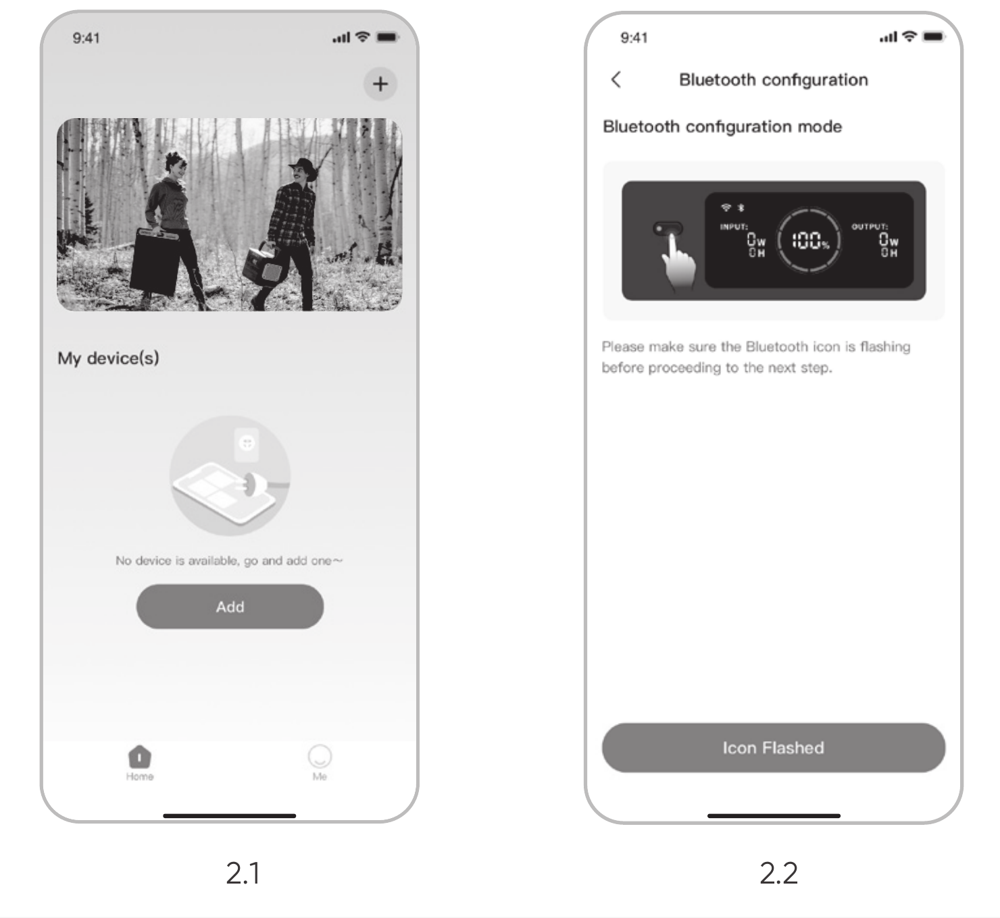

主電源ボタンAC出力ボタンDC/USB出力ボタン
</figure>

2.3 検出されたデバイスアイコンをクリックすると、アプリは自動的にBluetoothでデバイスを接続します。

<table class="manual-callout-table" style="width:100%; border-collapse:collapse; margin:0 0 16px 0;"><tbody><tr><td class="manual-callout-label" style="width:16%; border:1px solid #000; padding:6px 8px; vertical-align:top;">
<strong>備考</strong>
ご注意説明備考</td><td class="manual-callout-body" style="border:1px solid #000; padding:6px 8px; vertical-align:top;">
バインド処理中に「デバイスがバインドされました」と表示された場合は、以下の2つの方法で接続できます。

<ul class="simple">
<li>
デバイス所有者は、アプリを通じてこのデバイスを他のユーザーと共有します。
</li>
<li>
主電源ボタンとDC/USB出力ボタンを同時に3秒間押すと、Wi-FiとBluetoothが初期化されます。
</li>
</ul>
</td></tr></tbody></table>

2.4 デバイスが正常に接続されると、デバイスが接続するWi-Fiの名前とパスワードを入力する必要があり、デバイスは自動的にWi-Fiネットワークに接続します。

<table class="manual-callout-table" style="width:100%; border-collapse:collapse; margin:0 0 16px 0;"><tbody><tr><td class="manual-callout-label" style="width:16%; border:1px solid #000; padding:6px 8px; vertical-align:top;">
<strong>備考</strong>
ご注意説明備考</td><td class="manual-callout-body" style="border:1px solid #000; padding:6px 8px; vertical-align:top;">
2.4GHz帯のWi-Fiネットワークを選択してください。デバイスは、5GHz帯のWi-Fiネットワークには対応していません。
</td></tr></tbody></table>

2.5 デバイスのホーム画面でデバイスが正常に追加されると、デバイスのWi-Fiアイコンは常にオンになります。

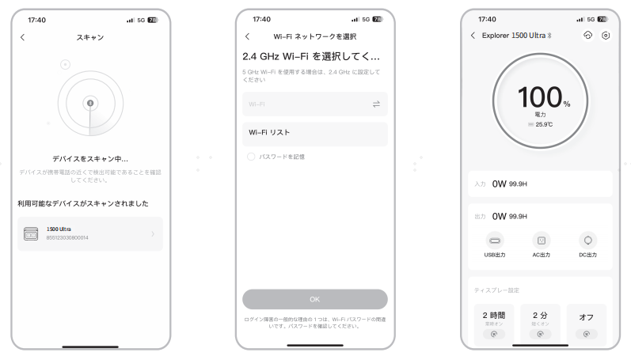

上記のスクリーンショットはイメージです。

> - - 備考
>
>   - Jackeryアプリは、一度に1台のポータブル電源としかBluetooth接続できません。デバイスリストに戻ると、自動的にBluetoothが切断されます。リスト内のポータブル電源をもう一度タップすると、自動的に再接続されます。

## 3 デバイスのバインドを解除するには

デバイスのメインインターフェースの右上隅にある「設定」ボタンをクリックして設定ページに入り、ページの下部にある「バインド解除」ボタンをクリックしてデバイスのバインドを解除します。

## 4 ご確認Wi-Fi・Bluetoothの設定

4.1 Wi-FiとBluetoothをオンにするには（ディスプレーにWi-FiとBluetoothのアイコンが点灯）：

- デバイスがオンになれば自動的にオンになり、ディスプレーにWi-FiとBluetoothのアイコンが点灯します。

- 上記アイコンが点灯しない場合、ディスプレーにWi-FiとBluetoothのアイコンが点灯するまで、DC/USB出力ボタンとAC出力ボタンを同時長押しします。

4.2 Wi-FiとBluetoothをオフにするには（ディスプレーにWi-FiとBluetoothのアイコンが消える）：

ディスプレーにWi-FiとBluetoothのアイコンが消えるまで、DC/USB出力ボタンとAC出力ボタンを同時長押しします。

4.3 Wi-FiとBluetoothをリセットするには：

主電源ボタンとDC/USB出力ボタンを同時に3秒間押すと、Wi-FiとBluetoothが初期化され、接続されているポータブル電源はバインド解除されます。
