# WICHTIGE SICHERHEITSINFORMATIONEN

<table class="manual-callout-table" style="width:100%; border-collapse:collapse; margin:0 0 16px 0;"><tbody><tr><td class="manual-callout-label" style="width:16%; border:1px solid #000; padding:6px 8px; vertical-align:top;">
<strong>WARNUNG</strong>
</td><td class="manual-callout-body" style="border:1px solid #000; padding:6px 8px; vertical-align:top;">
SICHERHEITSHINWEISE ZUR VERMEIDUNG VON BRANDGEFAHR, STROMSCHLAG ODER VERLETZUNGEN
</td></tr></tbody></table>

Befolgen Sie bei der Verwendung dieses Produkts stets die folgenden grundlegenden Vorsichtsmaßnahmen.

- Bitte lesen Sie alle Anweisungen, bevor Sie dieses Produkt verwenden.
- Lassen Sie Kinder nicht mit dem Produkt spielen. Achten Sie darauf, dass Kinder beaufsichtigt werden, wenn das Produkt in ihrer Nähe verwendet wird.
- Bei der Verwendung von Zubehör, das von nicht professionellen Herstellern empfohlen oder verkauft wird, besteht die Gefahr eines Stromschlags.
- Wenn das Produkt nicht verwendet wird, ziehen Sie bitte den Netzstecker aus der Steckdose des Produkts.
- Zerlegen Sie das Produkt nicht, da dies zu unvorhersehbaren Risiken führen kann, wie Feuer, Explosion oder Stromschlag.
- Verwenden Sie das Produkt nicht mit beschädigten Kabeln oder Steckern oder beschädigten Ausgangskabeln, die einen Stromschlag verursachen können.
- Um eine ordnungsgemäße Luftzirkulation zu gewährleisten, lassen Sie die Lüftungsschlitze des Produkts unbedeckt. Der Bereich, in dem das Produkt verwendet wird, muss über eine ausreichende Luftzirkulation in einer kühlen, trockenen Umgebung verfügen, um eine Überhitzung zu vermeiden.
  - Das Laden in feuchten oder schlecht belüfteten Räumen kann Sicherheitsrisiken verursachen.
  - Wasser kann Kurzschlüsse oder Schäden am Ladegerät verursachen und dadurch Sicherheitsrisiken mit sich bringen.
- Setzen Sie das Produkt keinem Feuer, hohen Temperaturen, direkter Sonneneinstrahlung oder heißen Umgebungen wie dem Innenraum eines geparkten Fahrzeugs aus. Eine solche Einwirkung kann zu Feuer oder Explosion führen.

## ANWEISUNGEN ZUR BENUTZERWARTUNG

Im Lebenszyklus von Energiespeicherprodukten ist ein gewisser Kapazitäts- und Energieverlust zu erwarten. Mit zunehmender Anzahl von Lade- und Entladezyklen sowie längerer Lagerzeit nimmt dieser Verlust allmählich zu. Dies ist ein normaler Vorgang, der mit der natürlichen Alterung der Batteriezellen einhergeht.

# BEDEUTUNG DER SYMBOLE

<figure aria-label="Symbol / Bedeutung" class="hb-symbol-signal-composition" data-component-id="HB-TABLE-SYMBOL-SIGNAL"><table class="hb-symbol-signal-table"><colgroup><col class="hb-symbol-signal-col-label"/><col class="hb-symbol-signal-col-meaning"/></colgroup><thead><tr><th class="hb-symbol-signal-label-heading" scope="col">
Symbol
</th><th class="hb-symbol-signal-meaning-heading" scope="col">
Bedeutung
</th></tr></thead><tbody><tr><td class="hb-symbol-signal-label-cell">⚠WARNUNG</td><td class="hb-symbol-signal-meaning-cell">
Gefährliche Handlungen, die zu schweren Verletzungen, Todesfällen und/oder Sachschäden führen können.
</td></tr><tr><td class="hb-symbol-signal-label-cell">⚠VORSICHT</td><td class="hb-symbol-signal-meaning-cell">
Gefährliche Handlungen, die zu Personenschäden und/oder Sachschäden führen können.
</td></tr><tr><td class="hb-symbol-signal-label-cell">⚠HINWEIS</td><td class="hb-symbol-signal-meaning-cell">
Gefährliche Handlungen, die zu Geräteschäden, Datenverlust, Leistungsverschlechterung oder unvorhergesehenen Ergebnissen führen können.
</td></tr><tr><td class="hb-symbol-signal-label-cell">⚠TIPP</td><td class="hb-symbol-signal-meaning-cell">
Ergänzt wichtige Informationen oder Bedienungshinweise im Text.
</td></tr></tbody></table></figure>

<figure aria-label="Symbol / Bedeutung" class="hb-symbol-pair-composition" data-component-id="HB-TABLE-SYMBOL-ICON">

<table class="hb-symbol-panel-table"><colgroup><col class="hb-symbol-col-icon"/><col class="hb-symbol-col-meaning"/></colgroup><thead><tr><th class="hb-symbol-icon-heading" scope="col">
<strong>Symbol</strong>
</th><th class="hb-symbol-meaning-heading" scope="col">
<strong>Bedeutung</strong>
</th></tr></thead><tbody><tr><td class="hb-symbol-icon"></td><td class="hb-symbol-meaning">
Warn- und Sicherheitssymbole. Unbedingt lesen, um auf mögliche Gefahren oder Risiken aufmerksam zu machen.
</td></tr><tr><td class="hb-symbol-icon"></td><td class="hb-symbol-meaning">
Lesen Sie vor der Anwendung die Benutzeranleitung.
</td></tr><tr><td class="hb-symbol-icon"></td><td class="hb-symbol-meaning">
Demontieren Sie das Produkt nicht.
</td></tr><tr><td class="hb-symbol-icon"></td><td class="hb-symbol-meaning">
Vermeiden Sie Hitze.
</td></tr></tbody></table>

<table class="hb-symbol-panel-table"><colgroup><col class="hb-symbol-col-icon"/><col class="hb-symbol-col-meaning"/></colgroup><thead><tr><th class="hb-symbol-icon-heading" scope="col">
<strong>Symbol</strong>
</th><th class="hb-symbol-meaning-heading" scope="col">
<strong>Bedeutung</strong>
</th></tr></thead><tbody><tr><td class="hb-symbol-icon"></td><td class="hb-symbol-meaning">
Halten Sie das Produkt fern von Kindern.
</td></tr><tr><td class="hb-symbol-icon"></td><td class="hb-symbol-meaning">
Dieses Symbol zeigt an, dass sich ein Lithium-Ionen-Akku (Li-Ion) im Produkt befindet und ordnungsgemäß entsorgt oder recycelt werden sollte.
</td></tr><tr><td class="hb-symbol-icon"></td><td class="hb-symbol-meaning">
Dieses Symbol zeigt an, dass das Produkt nicht als Haushaltsabfall entsorgt werden soll und an eine dafür vorgesehene Sammelstelle zur Entsorgung und Recycling gebracht werden sollte. Eine ordnungsgemäße Entsorgung und Recycling kann dazu beitragen, die Umwelt zu schützen. Für weitere Informationen zur Entsorgung und Recycling dieses Produkts wenden Sie sich an Ihre örtliche Gemeinde, Entsorgungsdienstleistungen oder Ihren Händler.
</td></tr></tbody></table>

</figure>

# LIEFERUMFANG

<figure aria-label="LIEFERUMFANG" class="hb-inbox-composition" data-card-count="3" data-component-id="HB-SPECIAL-INBOX" data-inbox-variant="three-card-responsive"><ol class="hb-inbox-grid"><li class="hb-inbox-card" data-item-number="1">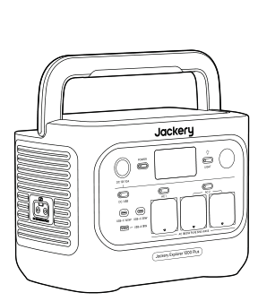

<strong>Jackery Explorer 1000 Plus</strong>

</li><li class="hb-inbox-card" data-item-number="2">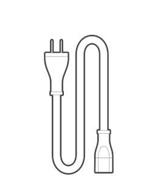

<strong>AC-Ladekabel</strong>

</li><li class="hb-inbox-card" data-item-number="3">

Benutzerhandbuch

</li></ol>

<strong>TIPP</strong>

Das Autoladekabel ist nicht im Lieferumfang enthalten, kann jedoch separat auf unserer Website erworben werden.
Bei Fragen wenden Sie sich bitte an den Jackery-Kundendienst.

</figure>

# PRODUKTÜBERSICHT

## VORDERANSICHT

## ANSICHT DER RECHTEN SEITE

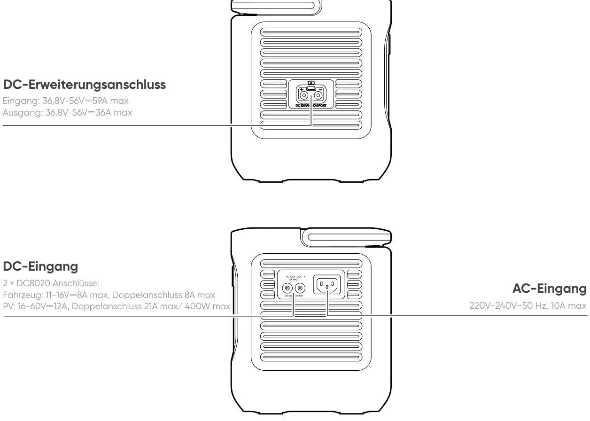

# LCD-ANZEIGE

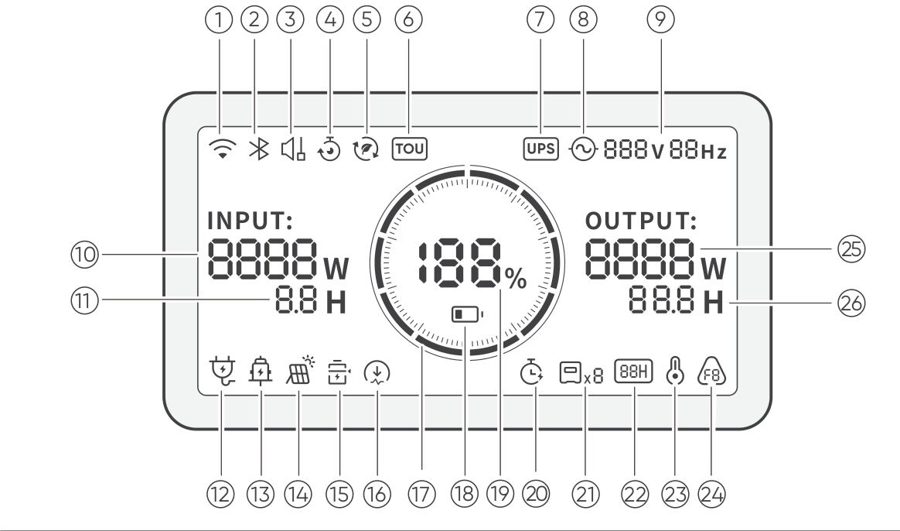

<table class="longtable lcd-text-only">
<colgroup>
<col style="width: 8%" />
<col style="width: 12%" />
<col style="width: 28%" />
<col style="width: 52%" />
</colgroup>
<tbody>
<tr>
<td>
1
</td>
<td></td>
<td>
WLAN
</td>
<td><strong>Ein:</strong> WLAN verbunden.
Blinkt: Bereit für die WLAN-Verbindung.
<strong>Aus:</strong> WLAN getrennt.</td>
</tr>
<tr>
<td>
2
</td>
<td></td>
<td>
Bluetooth
</td>
<td><strong>Ein:</strong> Bluetooth verbunden.
Blinkt: Bereit für die Bluetooth-Verbindung.
<strong>Aus:</strong> Bluetooth getrennt.</td>
</tr>
<tr>
<td>
3
</td>
<td></td>
<td>
Leiser Lademodus
</td>
<td><strong>Ein:</strong> Das Rauschen beim Laden wird deutlich minimiert, während die Ladeleistung reduziert und die Ladegeschwindigkeit verlangsamt wird.
<strong>Aus:</strong> Der leise Lademodus ist deaktiviert.
Diese Funktion kann in der Jackery-App aktiviert oder deaktiviert werden.</td>
</tr>
<tr>
<td>
4
</td>
<td></td>
<td>
Ladeplan Plan
</td>
<td>Customizes the charging time of the Jackery Explorer 1000 Plus. Suitable for situations with fluctuating electricity prices, it allows for charging plans based on peak and off-peak electricity times, reducing electricity costs.
Enable/disable this feature in the Jackery App. The setting is retained when the device is powered off.</td>
</tr>
<tr>
<td>
5
</td>
<td></td>
<td>
Selbstversorgungsmodus
</td>
<td>
Maximiert die Nutzung von Solarenergie und reduziert die Abhängigkeit vom Netzstrom, indem gespeicherte Solarenergie priorisiert wird, wodurch die Stromkosten gesenkt werden (bitte aktivieren/deaktivieren Sie diese Funktion in der App). Die Power Station muss gleichzeitig mit beiden Solarmodulen und dem Netz verbunden sein, wobei die Lastleistung durch die Bypass-Leistung begrenzt werden muss.
</td>
</tr>
<tr>
<td>
6
</td>
<td></td>
<td>
TOU-Modus
</td>
<td><strong>Ein:</strong> Der TOU-Modus (Time-of-Use) ist aktiviert (Standard-Backup-SOC: 60 %). Während Spitzenlastzeiten entlädt das Produkt bevorzugt die Batterie, sobald die gespeicherte Energie den Backup-SOC überschreitet, um Stromkosten zu reduzieren. Während der Niedriglastzeiten lädt das System die Batterie aus dem Netz, um Spitzenlasten zu reduzieren und Lasttäler auszugleichen.
<strong>Aus:</strong> Der Tarifzeitmodus (TOU-Modus) ist deaktiviert. Das Gerät folgt keiner Tarifzeitmodus(TOU-Modus)-Strategie und arbeitet gemäß der standardmäßigen Stromversorgungs- und Ladelogik. Aktivieren oder deaktivieren Sie diesen Modus in der Jackery App. Die Einstellung bleibt auch nach dem Ausschalten des Geräts erhalten.</td>
</tr>
<tr>
<td>
7
</td>
<td></td>
<td>
USV
</td>
<td><strong>Ein:</strong> Das Produkt befindet sich im Bypass-Modus, und die Umschaltzeit vom Netzstrom auf die interne Batterie beträgt 10 ms.
<strong>Aus:</strong> Das Produkt befindet sich nicht im Bypass-Modus.</td>
</tr>
<tr>
<td>
8
</td>
<td></td>
<td>
AC-Stromanzeige
</td>
<td>
Der AC-Ausgang (reine Sinuswelle) ist eingeschaltet.
</td>
</tr>
<tr>
<td>
9
</td>
<td></td>
<td>
Ausgangsspannung und -frequenz
</td>
<td>
Zeigt die Ausgangsspannung und -frequenz an, wenn der AC-Ausgang eingeschaltet ist.
</td>
</tr>
<tr>
<td>
10
</td>
<td></td>
<td>
Eingangsleistung
</td>
<td>
Zeigt die Eingangsleistung in Watt an.
</td>
</tr>
<tr>
<td>
11
</td>
<td></td>
<td>
Verbleibende Aufladezeit
</td>
<td>
Anzeige der verbleibenden Ladezeit.
</td>
</tr>
<tr>
<td>
12
</td>
<td></td>
<td>
AC-Netzladeanzeige
</td>
<td>
Das Produkt wird über den AC-Eingang mit Netzstrom geladen.
</td>
</tr>
<tr>
<td>
13
</td>
<td></td>
<td>
Autoladeanzeige
</td>
<td>
Das Produkt wird über den DC-Eingang (DC8020) mit 12V Gleichstrom (Autoladung) geladen.
</td>
</tr>
<tr>
<td>
14
</td>
<td></td>
<td>
Solar-Ladeanzeige
</td>
<td>
Das Produkt wird über den DC-Eingang (DC8020) mit Solarpanel(s) geladen.
</td>
</tr>
<tr>
<td>
15
</td>
<td></td>
<td>
Batteriesparmodus
</td>
<td><strong>Ein:</strong> Begrenzt die maximal nutzbare Batteriekapazität, um die Lebensdauer der Batterie zu verlängern.
<strong>Aus:</strong> Der Batteriesparmodus ist deaktiviert.
Diese Funktion kann in der Jackery-App aktiviert oder deaktiviert werden. Die Einstellung bleibt auch nach dem Ausschalten des Geräts erhalten.
Hinweis 1: Diese Funktion ist nicht verfügbar, wenn das Produkt mit Batteriepacks verbunden ist.
Hinweis 2: Ist diese Funktion aktiviert, führt das Produkt gelegentlich einen vollständigen Lade-/Entladezyklus zur Kalibrierung des SOC durch.</td>
</tr>
<tr>
<td>
16
</td>
<td></td>
<td>
Begrenzung der Ladeleistung
</td>
<td><strong>Ein:</strong> Die Begrenzung der Ladeleistung ist in der Jackery App aktiviert.
<strong>Aus:</strong> Die Begrenzung der Ladeleistung ist in der Jackery App deaktiviert. Die Einstellung bleibt auch nach dem Ausschalten des Geräts erhalten.</td>
</tr>
<tr>
<td>
17
</td>
<td></td>
<td>
Batteriezustandsanzeige
</td>
<td>
Wenn das Produkt geladen wird, leuchtet der orangefarbene Kreis um die Batterieanzeige nacheinander auf. Beim Laden anderer Geräte bleibt der orangefarbene Kreis dauerhaft eingeschaltet.
</td>
</tr>
<tr>
<td>
18
</td>
<td></td>
<td>
Batterietiefstandsanzeige
</td>
<td><strong>Ein:</strong> Der Batteriestand liegt unter 20 %.
Blinkt: Der Batteriestand liegt unter 5 %.
<strong>Aus:</strong> Der Batteriestand liegt nicht unter 20 % oder das Produkt wird aufgeladen.</td>
</tr>
<tr>
<td>
19
</td>
<td></td>
<td>
Verbleibender Batterieprozentsatz
</td>
<td>
Zeigt den verbleibenden Batteriestand an.
</td>
</tr>
<tr>
<td>
20
</td>
<td></td>
<td>
Entlade-Timer
</td>
<td><strong>Ein:</strong> Ein Entlade-Timer ist eingestellt.
<strong>Aus:</strong> Es ist kein Entlade-Timer eingestellt.
Diese Funktion kann in der Jackery-App aktiviert oder deaktiviert werden. Die Einstellung bleibt nach dem Ausschalten des Geräts nicht gespeichert.</td>
</tr>
<tr>
<td>
21
</td>
<td></td>
<td>
Batteriepack-Anzeige und Anzahl der angeschlossenen Batterien
</td>
<td>
Zeigt die Anzahl der angeschlossenen Batteriepacks an, sofern diese angeschlossen sind.
</td>
</tr>
<tr>
<td>
22
</td>
<td></td>
<td>
Energiesparmodus
</td>
<td>Wenn der AC- oder USB-Ausgang durch Drücken der AC- oder USB-Stromtaste eingeschaltet wird:
<strong>Ein:</strong> Der Energiesparmodus ist aktiviert.
<strong>Aus:</strong> Der Energiesparmodus ist deaktiviert.</td>
</tr>
<tr>
<td>
23
</td>
<td></td>
<td>
Warnung vor hoher Temperatur
</td>
<td>
Der Hochtemperaturschutz wurde aktiviert. Das Produkt kann die Funktion einstellen, bis die Temperatur wieder im normalen Betriebsbereich liegt.
</td>
</tr>
<tr>
<td>
23
</td>
<td></td>
<td>
Warnung bei niedriger Temperatur
</td>
<td>
Der Niedrigtemperaturschutz wurde aktiviert. Das Produkt kann die Funktion einstellen, bis die Temperatur wieder im normalen Betriebsbereich liegt.
</td>
</tr>
<tr>
<td>
24
</td>
<td></td>
<td>
Fehlermeldung
</td>
<td>
Ein Produktfehler ist aufgetreten. Bitte lesen Sie den Abschnitt „Fehlerbehebung“ für weitere Informationen.
</td>
</tr>
<tr>
<td>
25
</td>
<td></td>
<td>
Ausgangsleistung
</td>
<td>
Zeigt die Ausgangsleistung in Watt an.
</td>
</tr>
<tr>
<td>
26
</td>
<td></td>
<td>
Verbleibende Entladezeit
</td>
<td>
Anzeige der verbleibenden Entladezeit.
</td>
</tr>
</tbody>
</table>

# GRUNDLEGENDE OPERATIONEN

## HAUPTSTROMVERSORGUNG EIN/AUS

## AC-AUSGANG EIN/AUS

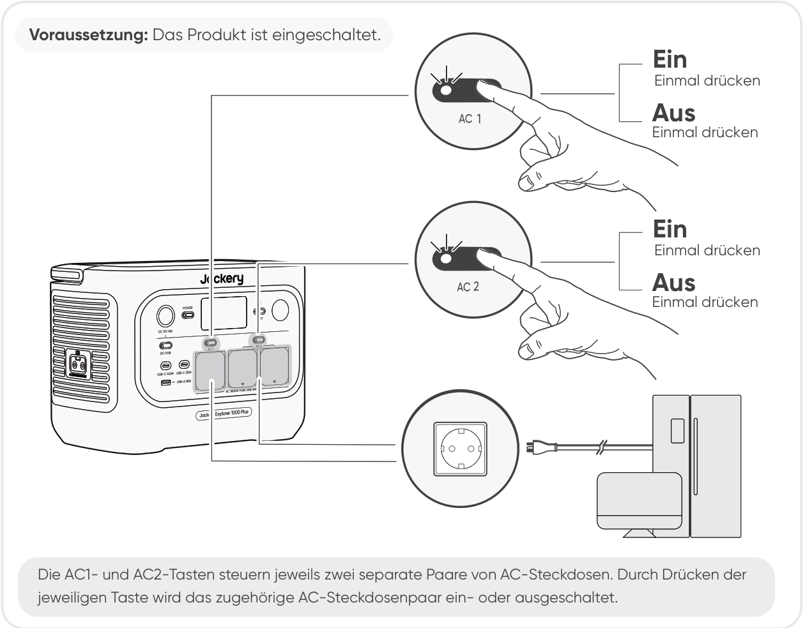

## DC 12V/USB-AUSGANG EIN/AUS

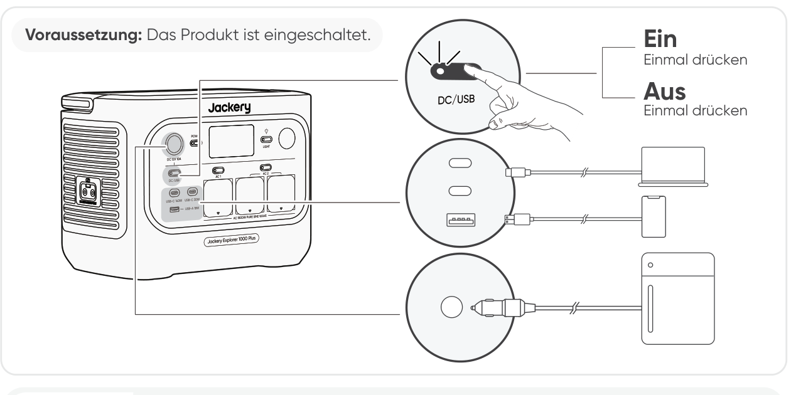

<table class="manual-callout-table" style="width:100%; border-collapse:collapse; margin:0 0 16px 0;"><tbody><tr><td class="manual-callout-label" style="width:16%; border:1px solid #000; padding:6px 8px; vertical-align:top;">
<strong>VORSICHT</strong>
</td><td class="manual-callout-body" style="border:1px solid #000; padding:6px 8px; vertical-align:top;"><ul class="simple">
<li>
<strong>Der USB-C-100-W-Anschluss ist ein Hochleistungs-Ausgangsanschluss des USB-PD-Typs Power Source 3 (PS3).</strong> Wenn das angeschlossene Benutzergerät oder Zubehör die Sicherheitsanforderungen nicht erfüllt, kann Brandgefahr bestehen. Stellen Sie vor der Verwendung dieses Anschlusses sicher, dass das angeschlossene Gerät oder Zubehör über Brandschutz verfügt.
</li>
<li>
Schließen Sie Jackery Explorer 1000 Plus nur an Geräte oder Zubehör an, die den Abschnitten 6.3, 6.4 und 6.5 der IEC/EN/UL 62368-1 (oder anderen gleichwertigen Normen) entsprechen.
</li>
<li>
Verwenden Sie für die maximale Ausgangsleistung das USB-C-auf-USB-C-5 A-Kabel (20 V DC/5 A, 100 W).
</li>
</ul>
</td></tr></tbody></table>

Das Produkt kann Ihre Fahrzeugbatterie mit dem Jackery 12-V-Autobatterie-Ladekabel aufladen, das separat erhältlich und auf unserer Website verfügbar ist.

<table class="manual-callout-table" style="width:100%; border-collapse:collapse; margin:0 0 16px 0;"><tbody><tr><td class="manual-callout-label" style="width:16%; border:1px solid #000; padding:6px 8px; vertical-align:top;">
<strong>VORSICHT</strong>
</td><td class="manual-callout-body" style="border:1px solid #000; padding:6px 8px; vertical-align:top;"><ul class="simple">
<li>
Der DC-12-V-Anschluss ist nur mit 12-V-Autobatterien kompatibel und nicht für 24-V-Systeme geeignet.
</li>
<li>
Starten Sie das Fahrzeug nicht, während das Produkt die Fahrzeugbatterie über den 12-V-DC-Ausgang lädt, da dies das Produkt beschädigen kann.
</li>
<li>
Diese Funktion ist nur für den Notfall vorgesehen und kann eine leere oder beschädigte Fahrzeugbatterie nicht aufladen.
</li>
</ul>
</td></tr></tbody></table>

## ENERGIESPARMODUS

Um zu verhindern, dass die Batterie unnötig entladen wird, wenn das Ausschalten des Ausgangs vergessen wird, ist der Energiesparmodus standardmäßig aktiviert. Wenn der AC- oder DC/USB-Ausgang eingeschaltet wird, wird das Energiesparmodus-Symbol auf dem LCD angezeigt. In diesem Modus schaltet sich der entsprechende Ausgang nach der eingestellten Zeit automatisch aus, wenn kein Gerät angeschlossen ist oder die Leistungsaufnahme des angeschlossenen Geräts unter einem bestimmten Schwellenwert liegt (25 W beim AC-Ausgang oder 2 W beim DC/USB-Ausgang). Die Standardeinstellung ist 12 Stunden. Die Dauer des Energiesparmodus kann in der Jackery-App auf 1 H, 2 H, 8 H, 12 H oder 24 H eingestellt werden. Wenn \"Nie ausschalten\" eingestellt ist, wird der Energiesparmodus deaktiviert.

Wenn Sie Geräte mit geringem Stromverbrauch betreiben (AC \<= 25 W oder DC/USB \<= 2 W), deaktivieren Sie den Energiesparmodus, damit der Ausgang während des Betriebs nicht automatisch ausgeschaltet wird.

<table class="manual-callout-table" style="width:100%; border-collapse:collapse; margin:0 0 16px 0;"><tbody><tr><td class="manual-callout-label" style="width:16%; border:1px solid #000; padding:6px 8px; vertical-align:top;">
<strong>HINWEIS</strong>
</td><td class="manual-callout-body" style="border:1px solid #000; padding:6px 8px; vertical-align:top;">
Der Energiesparmodus kehrt nach dem Einschalten in seinen vorherigen Zustand zurück. Für einen Moduswechsel ist ein manuelles Umschalten erforderlich.
</td></tr></tbody></table>

## LED-LICHT EIN/AUS

## Wiederaufnahmefunktion für AC- und DC-Ausgänge

Die Wiederaufnahmefunktion für AC- und DC-Ausgänge ist standardmäßig deaktiviert. Aktivieren Sie diese Funktion in der Jackery-App, damit das Gerät den Status der AC- und DC-Ausgänge speichert und die AC- und DC-Ausgänge unter festgelegten Bedingungen automatisch wiederherstellt.

<figure aria-label="Bedingungen für automatische Wiederherstellung / Bedingungen ohne automatische Wiederherstellung" class="hb-auto-resume-composition"><table class="hb-auto-resume-table"><colgroup><col class="hb-auto-resume-col"/><col class="hb-auto-resume-col"/></colgroup>
<thead>
<tr><th class="head hb-auto-resume-left" scope="col">
Bedingungen für automatische Wiederherstellung
</th>
<th class="head hb-auto-resume-right" scope="col">
Bedingungen ohne automatische Wiederherstellung
</th>
</tr>
</thead>
<tbody>
<tr><td class="hb-auto-resume-left">
Einschalten/Neustart nach Abschalten oder Neustart
</td>
<td class="hb-auto-resume-right">
Manuelles Ausschalten der Ausgänge (Taste/App)
</td>
</tr>
<tr><td class="hb-auto-resume-left" rowspan="2">
Batterie-SOC ≥ Entladegrenze +10% nach Erreichen der Grenze
</td>
<td class="hb-auto-resume-right">
Ausgang im Energiesparmodus deaktiviert
</td>
</tr>
<tr><td class="hb-auto-resume-right">
Schutzbedingter Ausgang deaktiviert
</td>
</tr>
<tr><td class="hb-auto-resume-left">
OTA-Update abgeschlossen
</td>
<td class="hb-auto-resume-right">
Durch Entlade-Timer gesteuerter Ausgang deaktiviert
</td>
</tr>
</tbody>
</table></figure>

## LCD-ANZEIGE

<figure aria-label="Platzhalter für den LCD-Anzeigemodus." class="hb-lcd-mode-composition" data-component-id="HB-TABLE-LCD-MODE">
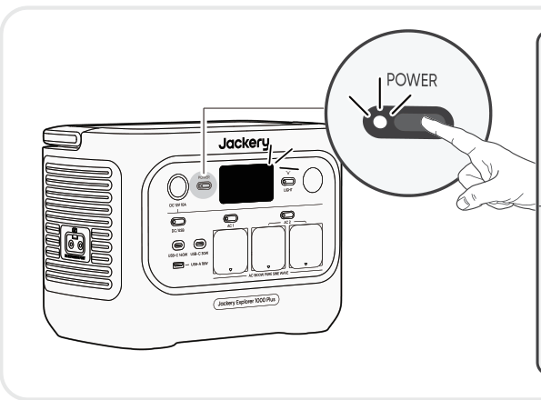

<table class="hb-lcd-mode-table"><colgroup><col class="hb-lcd-mode-col-state"/><col class="hb-lcd-mode-col-action"/><col class="hb-lcd-mode-col-copy"/></colgroup><tbody><tr><td class="hb-lcd-mode-state" rowspan="3">Kurzzeitig an</td><td class="hb-lcd-mode-action">Ein</td><td class="hb-lcd-mode-copy">Drücken Sie die Haupt-POWER-Taste oder während das Produkt geladen wird.</td></tr><tr><td class="hb-lcd-mode-action">Aus</td><td class="hb-lcd-mode-copy">Drücken Sie die Haupt-POWER-Taste.</td></tr><tr><td class="hb-lcd-mode-action">Autom. aus</td><td class="hb-lcd-mode-copy">Die LCD-Anzeige schaltet sich nach 2 Minuten Inaktivität automatisch aus und wechselt in den Schlafmodus.</td></tr><tr><td class="hb-lcd-mode-state" rowspan="3">Dauerhaft an (beim Laden oder Entladen)</td><td class="hb-lcd-mode-action">Ein</td><td class="hb-lcd-mode-copy">Drücken Sie die Haupt-POWER-Taste zweimal, wenn das Produkt eingeschaltet ist.</td></tr><tr><td class="hb-lcd-mode-action">Aus</td><td class="hb-lcd-mode-copy">Drücken Sie die Haupt-POWER-Taste.</td></tr><tr><td class="hb-lcd-mode-action">Autom. aus</td><td class="hb-lcd-mode-copy">Die LCD-Anzeige schaltet sich nach 2 Stunden Inaktivität automatisch aus.</td></tr></tbody></table>
</figure>

Sie können den Bildschirm-Anzeigemodus auch in der Jackery-App einstellen.

## TASTENKOMBINATION

<figure aria-label="Tasten / Bedienung / Funktion" class="hb-key-combination-composition" tabindex="0"><table class="hb-key-combination-table"><colgroup><col class="hb-key-col-buttons"/><col class="hb-key-col-operation"/><col class="hb-key-col-function"/></colgroup>
<thead>
<tr><th class="head hb-key-buttons" scope="col">
Tasten
</th>
<th class="head hb-key-operation" scope="col">
Bedienung
</th>
<th class="head hb-key-function" scope="col">
Funktion
</th>
</tr>
</thead>
<tbody>
<tr><td class="hb-key-buttons">
Haupt-POWER-Taste + AC-Einschalttaste
</td>
<td class="hb-key-operation">
Beide 3 s lang gedrückt halten
</td>
<td class="hb-key-function">
Energiesparmodus ein-/ausschalten
</td>
</tr>
<tr><td class="hb-key-buttons">
Haupt-POWER-Taste + DC/USB-Einschalttaste
</td>
<td class="hb-key-operation">
Beide 3 s lang gedrückt halten
</td>
<td class="hb-key-function">
WLAN und Bluetooth zurücksetzen
</td>
</tr>
<tr><td class="hb-key-buttons">
DC/USB-Einschalttaste + AC-Einschalttaste
</td>
<td class="hb-key-operation">
Beide 1 s lang gedrückt halten
</td>
<td class="hb-key-function">
WLAN und Bluetooth ein-/ausschalten
</td>
</tr>
<tr><td class="hb-key-buttons">
Haupt-POWER-Taste + LED-Lichttaste
</td>
<td class="hb-key-operation">
Beide 1 s lang gedrückt halten
</td>
<td class="hb-key-function">
Notfall-Lademodus ein-/ausschalten
</td>
</tr>
</tbody>
</table></figure>

# UNTERBRECHUNGSFREIE STROMVERSORGUNG (UPS)

Schließen Sie das Produkt mit dem AC-Ladekabel an eine Steckdose an und drücken Sie anschließend die AC-1-Ausgangstaste/AC-2-Ausgangstaste, um Ihre Geräte gleichzeitig zu versorgen.

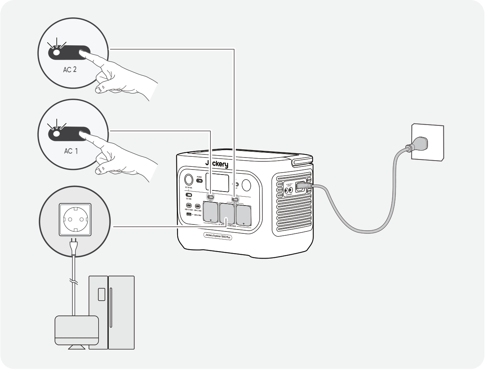

Eine unterbrechungsfreie Stromversorgung (UPS) ist ein kontinuierliches Stromversorgungssystem, das bei einem Ausfall der Netzstromversorgung automatisch Backup-Strom für angeschlossene Geräte bereitstellt.

Bei einem plötzlichen Ausfall der Netzstromversorgung schaltet Jackery Explorer 1000 Plus innerhalb von 10 ms automatisch auf gespeicherte Energie um, damit Ihre Geräte weiterlaufen.

Im USV-Modus erreicht das Gerät vor Stromausfällen eine Spitzenleistung von 10 A. Da im Bypass-Modus gleichzeitiges Laden und Entladen möglich ist,

liegt die tatsächliche Ausgangsleistung in diesem Modus unter der Nennleistung; bei Stromausfällen wird jedoch wieder die Nennleistung erreicht.

<table class="manual-callout-table" style="width:100%; border-collapse:collapse; margin:0 0 16px 0;"><tbody><tr><td class="manual-callout-label" style="width:16%; border:1px solid #000; padding:6px 8px; vertical-align:top;">
<strong>VORSICHT</strong>
</td><td class="manual-callout-body" style="border:1px solid #000; padding:6px 8px; vertical-align:top;"><ul class="simple">
<li>
Dieses Produkt unterstützt kein Umschalten mit 0 ms. Schließen Sie es nicht an Geräte an, die eine Stromversorgung mit 0-ms-Umschaltung erfordern, wie z. B. Datenserver oder Workstations.
</li>
<li>
Testen Sie vor der Verwendung die Kompatibilität mit Ihrem Gerät mehrmals.
</li>
<li>
Schließen Sie keine Lasten an, die die maximale Ausgangsleistung des Produkts überschreiten. Andernfalls wird der Überlastschutz ausgelöst.
</li>
</ul>
</td></tr></tbody></table>

# ANSCHLUSS AN BATTERIEPACK(S) (SEPARAT ERHÄLTLICH)

Dieses Gerät unterstützt bis zu fünf Batteriepacks, um einen hohen Leistungsbedarf abzudecken. Weitere Informationen zur Verwendung finden Sie im Benutzerhandbuch des Jackery Battery Pack 2000.

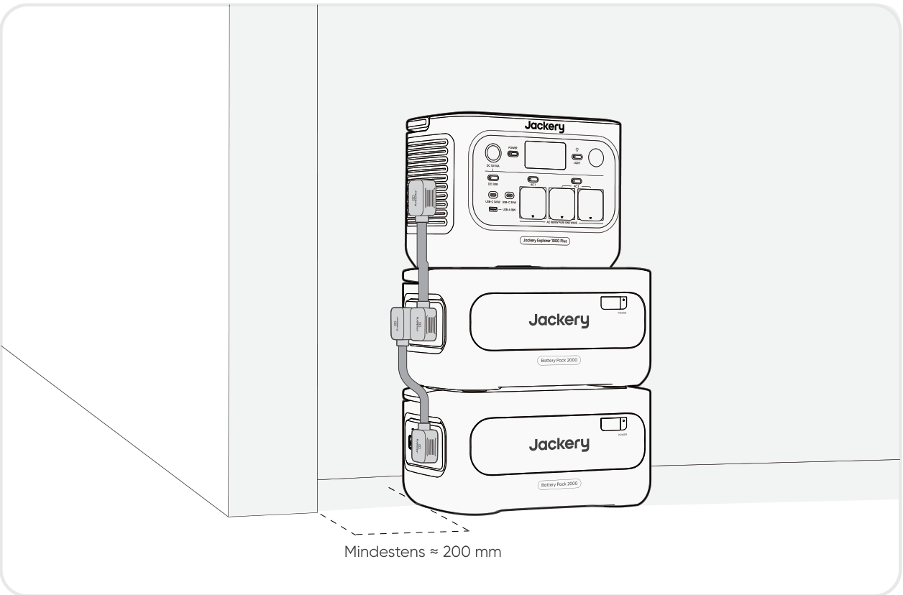

<table class="manual-callout-table" style="width:100%; border-collapse:collapse; margin:0 0 16px 0;"><tbody><tr><td class="manual-callout-label" style="width:16%; border:1px solid #000; padding:6px 8px; vertical-align:top;">
<strong>VORSICHT</strong>
</td><td class="manual-callout-body" style="border:1px solid #000; padding:6px 8px; vertical-align:top;"><ul class="simple">
<li>
Stellen Sie sicher, dass alle Geräte ausgeschaltet sind, bevor Sie den Jackery Explorer 1000 Plus an das Jackery Battery Pack 2000 anschließen.
</li>
<li>
Stellen Sie für einen ordnungsgemäßen Betrieb sicher, dass die Lufteinlass- und Abluftöffnungen auf beiden Seiten nicht blockiert sind. Halten Sie zwischen den Lüftungsöffnungen und anderen Gegenständen einen Abstand von mindestens 200 mm ein, um eine ausreichende Wärmeableitung zu gewährleisten.
</li>
<li>
Bei Verwendung mit angeschlossenen Batteriepacks beträgt die standardmäßige maximale Stapelanzahl 3 und das Produkt muss auf einer ebenen, stabilen und ausreichend tragfähigen Oberfläche aufgestellt werden.
</li>
<li>
Wenn 4 oder mehr Batteriepacks gestapelt werden müssen, muss das Produkt in einem stabilen Bereich an einer Wand aufgestellt und vor äußeren Einwirkungen geschützt werden, und es sind entsprechende Kippsicherungsmaßnahmen zu treffen.
</li>
</ul>
</td></tr></tbody></table>

|                               |                        |                      |
|-------------------------------|------------------------|----------------------|
| **Jackery Battery Pack 2000** | **Verlängerungskabel** | **Benutzerhandbuch** |

# LADEN

**Grüne Energie zuerst:** Wir befürworten die Nutzung grüner Energie zuerst. Dieses Produkt unterstützt zwei gleichzeitige Ladearten: Solaraufladung und AC-Wandladung. Wenn AC-Wandladung und Solaraufladung gleichzeitig eingeschaltet sind, gibt das Produkt der Solaraufladung Vorrang, und beide Methoden werden mit der maximal zulässigen Leistung zum Laden der Batterie verwendet.

**Laden Sie das Produkt vor der ersten Verwendung vollständig auf.**

<table class="manual-callout-table" style="width:100%; border-collapse:collapse; margin:0 0 16px 0;"><tbody><tr><td class="manual-callout-label" style="width:16%; border:1px solid #000; padding:6px 8px; vertical-align:top;">
<strong>HINWEIS</strong>
</td><td class="manual-callout-body" style="border:1px solid #000; padding:6px 8px; vertical-align:top;"><ul class="simple">
<li>
Die empfohlene Ladetemperatur für das Produkt liegt bei -10 °C bis 45 °C, und die Entladetemperatur liegt bei -10 °C bis 45 °C.
</li>
<li>
Der Betrieb des Produkts außerhalb dieses Temperaturbereichs kann die Lade- und Entladefähigkeit einschränken oder sogar verhindern, dass das Produkt lädt oder entlädt.
</li>
<li>
Ladeleistung und Batteriekapazität des Produkts können sich aufgrund von Temperaturschwankungen ändern.
</li>
</ul>
</td></tr></tbody></table>

## AUFLADEN ÜBER EINE AC-STECKDOSE

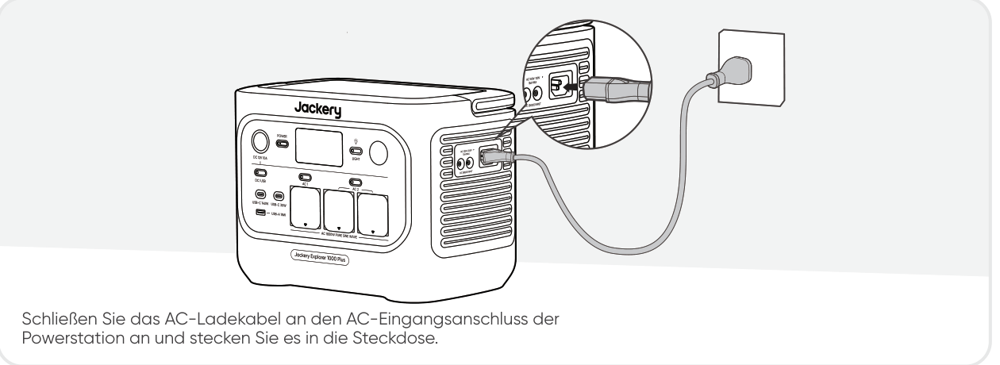

<table class="manual-callout-table" style="width:100%; border-collapse:collapse; margin:0 0 16px 0;"><tbody><tr><td class="manual-callout-label" style="width:16%; border:1px solid #000; padding:6px 8px; vertical-align:top;">
<strong>VORSICHT</strong>
</td><td class="manual-callout-body" style="border:1px solid #000; padding:6px 8px; vertical-align:top;">
Stellen Sie sicher, dass das AC-Ladekabel vollständig und sicher in den AC-Eingangsanschluss eingesteckt ist. Eine unvollständige Verbindung kann zu instabilem Strom, Überhitzung, schlechtem Kontakt oder Fehlfunktionen des Geräts führen.
</td></tr></tbody></table>

**Notfall-Lademodus**

In diesem Modus können Sie die tragbare Powerstation mit der AC-Lademethode schnell aufladen. Diese Notfall-Ladefunktion kann über die Jackery-App aktiviert oder deaktiviert werden. Im Notfall-Lademodus blinkt die kreisförmige Leuchte, die den Ladezustand (SOC) anzeigt, schneller.

\*Um die Batterielebensdauer zu maximieren, ist das Laden mit normaler Geschwindigkeit vorzuziehen. Verwenden Sie den Notfall-Lademodus nur bei Bedarf. Für den regelmäßigen Langzeitgebrauch wird er nicht empfohlen.

## AUFLADEN ÜBER SOLARMODULE (SEPARAT ERHÄLTLICH)

Jackery Explorer 1000 Plus verfügt über zwei DC8020-Eingangsanschlüsse und ist mit den Jackery-Solarmodulen kompatibel.

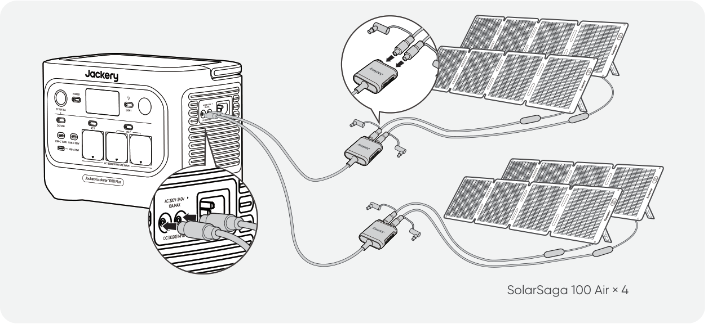

Wenn ein DC8020-Eingangsanschluss zwei Solarmodule gleichzeitig anschließen muss, beziehen Sie sich bitte auf die folgende Abbildung zum Aufladen über den Solarpanel-Anschluss (separat erhältlich, nicht im Lieferumfang enthalten).

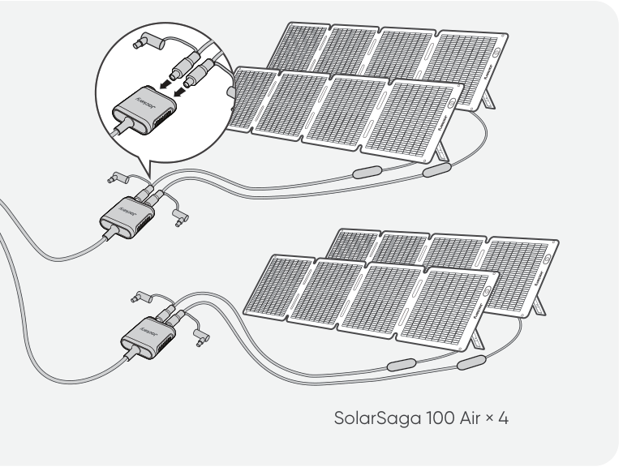

<table class="manual-callout-table" style="width:100%; border-collapse:collapse; margin:0 0 16px 0;"><tbody><tr><td class="manual-callout-label" style="width:16%; border:1px solid #000; padding:6px 8px; vertical-align:top;">
<strong>VORSICHT</strong>
</td><td class="manual-callout-body" style="border:1px solid #000; padding:6px 8px; vertical-align:top;">
An einen DC8020-Eingangsanschluss können höchstens zwei Solarmodule angeschlossen werden.
</td></tr></tbody></table>

<table class="manual-callout-table" style="width:100%; border-collapse:collapse; margin:0 0 16px 0;"><tbody><tr><td class="manual-callout-label" style="width:16%; border:1px solid #000; padding:6px 8px; vertical-align:top;">
<strong>VORSICHT</strong>
</td><td class="manual-callout-body" style="border:1px solid #000; padding:6px 8px; vertical-align:top;"><ul class="simple">
<li>
Stellen Sie sicher, dass die Eingangsspannung an beiden DC-Eingangsanschlüssen gleich ist. Andernfalls kann das Produkt beschädigt werden. Zum Beispiel:
</li>
<li>
Verwenden Sie beim Anschluss von Solarmodulen an beide DC8020-Eingangsanschlüsse das gleiche Jackery-Solarmodell und die gleiche Anzahl an Modulen.
</li>
<li>
Laden Sie das Produkt nicht gleichzeitig mit einem Autoladegerät und einem Solarpanel. Andernfalls kann die Fahrzeugsicherung durchbrennen oder der Ladevorgang fehlschlagen.
</li>
</ul>
</td></tr></tbody></table>

Es wird empfohlen, das Jackery-Solarpanel zum Laden des Produkts zu verwenden. Stellen Sie sicher, dass die Leerlaufspannung (Voc) des Solarpanels innerhalb des DC-Eingangsbereichs (16 V-60 V) von Jackery Explorer 1000 Plus liegt. Jackery ist nicht verantwortlich für Schäden oder Verluste, die durch die Verwendung von Solarmodulen Dritter entstehen.

## AUFLADEN ÜBER DAS AUTOLADEGERÄT (SEPARAT ERHÄLTLICH)

Dieses Produkt kann mit einem 12-V-Autoladegerät aufgeladen werden. Stellen Sie sicher, dass das Autoladegerät und die 12-V-Autosteckdose (Zigarettenanzünder) gut verbunden sind.

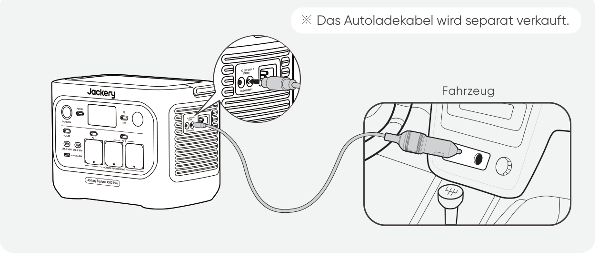

<table class="manual-callout-table" style="width:100%; border-collapse:collapse; margin:0 0 16px 0;"><tbody><tr><td class="manual-callout-label" style="width:16%; border:1px solid #000; padding:6px 8px; vertical-align:top;">
<strong>VORSICHT</strong>
</td><td class="manual-callout-body" style="border:1px solid #000; padding:6px 8px; vertical-align:top;"><ul class="simple">
<li>
Bitte starten Sie das Fahrzeug, bevor Sie Ihre Powerstation laden.
</li>
<li>
Wenn das Fahrzeug auf unebenen Straßen fährt, darf das Autoladegerät nicht verwendet werden, da dies zu einem nicht standardmäßigen Betrieb führen kann. Das Unternehmen übernimmt keine Verantwortung für Verluste, die durch einen nicht standardmäßigen Betrieb entstehen.
</li>
<li>
Das Laden über das Fahrzeug ist nur für Fahrzeuge mit 12 V DC geeignet, nicht für 24 V DC. Bitte laden Sie dieses Produkt nicht in einem 24-V-Fahrzeug, um Personen- und Sachschäden zu vermeiden.
</li>
</ul>
</td></tr></tbody></table>

# LAGERUNG

Lagern Sie das Produkt an einem trockenen, sauberen und gut belüfteten Ort. Lagertemperatur und Luftfeuchtigkeit:

- 1 Monat: -20 °C bis 45 °C (0--60 % relative Luftfeuchtigkeit)

- 3 Monate: 0 °C bis 45 °C (0--60 % relative Luftfeuchtigkeit)

- 12 Monate: 0 °C bis 25 °C (0--60 % relative Luftfeuchtigkeit)

Wenn dieses Produkt über einen längeren Zeitraum (3 bis 6 Monate) mit entladener Batterie gelagert wird, kann es unaufladbar werden. Um dies zu verhindern und die Batteriegesundheit zu erhalten, wird empfohlen, das Produkt alle drei Monate zu überprüfen und aufzuladen und mindestens einmal alle 6 bis 12 Monate einen vollständigen Lade- und Entladezyklus durchzuführen.

# FEHLERSUCHE

Wenn einer der folgenden Fehlercodes angezeigt wird, befolgen Sie die aufgeführten Korrekturmaßnahmen, um das Problem zu beheben. Wenn der Fehler weiterhin besteht, wenden Sie sich bitte an den Jackery-Kundendienst.

<figure aria-label="Fehlercode / Korrekturmaßnahmen" class="hb-troubleshooting-composition" data-component-id="HB-TABLE-TROUBLESHOOTING" tabindex="0"><table class="hb-troubleshooting-table"><colgroup><col class="hb-troubleshooting-col-code"/><col class="hb-troubleshooting-col-measures"/></colgroup><thead><tr><th class="hb-troubleshooting-code" scope="col">
Fehlercode
</th><th class="hb-troubleshooting-measures" scope="col">
Korrekturmaßnahmen
</th></tr></thead><tbody><tr><td class="hb-troubleshooting-code">
F0
</td><td class="hb-troubleshooting-measures">
Starten Sie das Gerät neu.
</td></tr><tr><td class="hb-troubleshooting-code">
F1
</td><td class="hb-troubleshooting-measures">
Starten Sie das Gerät neu.
</td></tr><tr><td class="hb-troubleshooting-code">
F2
</td><td class="hb-troubleshooting-measures">
Starten Sie das Gerät neu.
</td></tr><tr><td class="hb-troubleshooting-code">
F3
</td><td class="hb-troubleshooting-measures">
Starten Sie das Gerät neu.
</td></tr><tr><td class="hb-troubleshooting-code">
F4
</td><td class="hb-troubleshooting-measures">
Schließen Sie das Gerät an Verbraucher an, um die Batterie zu entladen, bis der Fehler verschwindet.
</td></tr><tr><td class="hb-troubleshooting-code">
F5
</td><td class="hb-troubleshooting-measures">
Laden Sie das Gerät über Solarmodule oder eine AC-Wandsteckdose, bis der Fehler verschwindet.
</td></tr><tr><td class="hb-troubleshooting-code">
F6
</td><td class="hb-troubleshooting-measures">

1. Warten Sie, bis das Stromnetz stabil ist, bevor Sie das Gerät über eine Netzsteckdose laden. 2.Überprüfen Sie, ob die Lufteinlass- und -auslassöffnungen blockiert sind; stellen Sie sicher, dass auf beiden Seiten des Geräts ein Abstand von 20 cm eingehalten wird.

3.Platzieren Sie das Gerät an einem Ort, der nicht direktem Sonnenlicht oder hohen

Umgebungstemperaturen ausgesetzt ist.

4.Trennen Sie alle Verbraucher vom Gerät, lassen Sie es im Leerlauf und warten Sie, bis der Fehler verschwindet.

5. Starten Sie das Gerät neu.

</td></tr><tr><td class="hb-troubleshooting-code">
F7
</td><td class="hb-troubleshooting-measures">

1. Trennen Sie alle DC-Eingänge vom Gerät.

2.Wenn Sie das Produkt über ein Solarpanel laden, überprüfen Sie die Leerlaufspannung (Voc) des angeschlossenen Solarpanels. Das Gerät erlaubt eine maximale DC-Eingangsspannung von 60V. 3. Starten Sie das Gerät neu und lassen Sie es im Leerlauf. Warten Sie, bis der Fehler verschwindet.

</td></tr><tr><td class="hb-troubleshooting-code">
F8
</td><td class="hb-troubleshooting-measures">
Kontaktieren Sie den Händler oder den Jackery-Kundendienst.
</td></tr><tr><td class="hb-troubleshooting-code">
F9
</td><td class="hb-troubleshooting-measures">
Trennen Sie die an die USB-Anschlüsse des Geräts angeschlossenen Verbraucher. Warten Sie, bis der Fehler verschwindet.
</td></tr><tr><td class="hb-troubleshooting-code">
FC
</td><td class="hb-troubleshooting-measures">

1. Starten Sie die Batteriepacks sowie den Jackery Explorer 1000 Plus jeweils neu.

2. Besteht der Fehler weiterhin, trennen Sie das Batteriepack vom Jackery Explorer 1000 Plus und schließen Sie es erneut an.

</td></tr><tr><td class="hb-troubleshooting-code">
FE
</td><td class="hb-troubleshooting-measures">
Kontaktieren Sie den Händler oder den Jackery-Kundendienst.
</td></tr></tbody></table></figure>

# TECHNISCHE DATEN

## ALLGEMEINE INFORMATIONEN

<figure aria-label="ALLGEMEINE INFORMATIONEN" class="hb-spec-table-composition"><table class="hb-spec-table manual-table manual-spec-table"><colgroup><col class="hb-spec-col-label"/><col class="hb-spec-col-value"/></colgroup>
<tbody>
<tr>
<th class="hb-spec-label manual-spec-label" scope="row">Produktname</th>
<td class="hb-spec-value manual-spec-value">Jackery Explorer 1000 Plus</td>
</tr>
<tr>
<th class="hb-spec-label manual-spec-label" scope="row">Modell-Nr.</th>
<td class="hb-spec-value manual-spec-value">JE-1000H</td>
</tr>
<tr>
<th class="hb-spec-label manual-spec-label" scope="row">Kapazität</th>
<td class="hb-spec-value manual-spec-value">1024 Wh (20 Ah/51,2 V DC)</td>
</tr>
<tr>
<th class="hb-spec-label manual-spec-label" scope="row">Zellchemie</th>
<td class="hb-spec-value manual-spec-value">LiFePO₄</td>
</tr>
<tr>
<th class="hb-spec-label manual-spec-label" scope="row">Gewicht</th>
<td class="hb-spec-value manual-spec-value">Etwa 10,8 kg</td>
</tr>
<tr>
<th class="hb-spec-label manual-spec-label" scope="row">Abmessungen</th>
<td class="hb-spec-value manual-spec-value">313,5 × 201 × 233,5 mm</td>
</tr>
<tr>
<th class="hb-spec-label manual-spec-label" scope="row">Nutzungsdauer</th>
<td class="hb-spec-value manual-spec-value">6000 Zyklen bis über 70% Kapazität</td>
</tr>
</tbody>
</table></figure>

## EINGANGSANSCHLÜSSE

<figure aria-label="EINGANGSANSCHLÜSSE" class="hb-spec-table-composition"><table class="hb-spec-table manual-table manual-spec-table"><colgroup><col class="hb-spec-col-label"/><col class="hb-spec-col-value"/></colgroup>
<tbody>
<tr>
<th class="hb-spec-label manual-spec-label" scope="row">1 × AC-Eingang</th>
<td class="hb-spec-value manual-spec-value">Lademodus: 220 V-240 V~ 50 Hz, 10 A max. Bypassmodus①: 220 V-240 V~ 50 Hz, 7,83 A</td>
</tr>
<tr>
<th class="hb-spec-label manual-spec-label" scope="row">2 × DC8020-Anschlüsse</th>
<td class="hb-spec-value manual-spec-value">Fahrzeug: 11 V-16 V⎓8 A max., Doppelanschluss 8 A PV: 16 V-60 V⎓12 A, Doppelanschluss 21 A / 400 W max.</td>
</tr>
<tr>
<th class="hb-spec-label manual-spec-label" scope="row">1 × DC-Erweiterungsanschluss</th>
<td class="hb-spec-value manual-spec-value">36,8 V-56 V⎓59 A max.</td>
</tr>
</tbody>
</table></figure>

## AUSGANGSANSCHLÜSSE

<figure aria-label="AUSGANGSANSCHLÜSSE" class="hb-spec-table-composition"><table class="hb-spec-table manual-table manual-spec-table"><colgroup><col class="hb-spec-col-label"/><col class="hb-spec-col-value"/></colgroup>
<tbody>
<tr>
<th class="hb-spec-label manual-spec-label" scope="row">3 × AC-Ausgang</th>
<td class="hb-spec-value manual-spec-value">230 V~ 50 Hz, 7,83 A, 1800 W</td>
</tr>
<tr>
<th class="hb-spec-label manual-spec-label" scope="row">AC-Gesamtleistung②</th>
<td class="hb-spec-value manual-spec-value">1800 W Nennleistung, 3600 W Überspannungsspitze</td>
</tr>
<tr>
<th class="hb-spec-label manual-spec-label" scope="row">AC-Ausgang im Bypassmodus①</th>
<td class="hb-spec-value manual-spec-value">220 V-240 V~ 50 Hz, 7,83 A</td>
</tr>
<tr>
<th class="hb-spec-label manual-spec-label" scope="row">2 × USB-C-Ausgang</th>
<td class="hb-spec-value manual-spec-value">USB-C 30W: 30 W max., 5 V⎓3 A, 9 V⎓3 A, 12 V⎓2,5 A, 15 V⎓2 A, 20 V⎓1,5 A USB-C 140W: 140 W max., 5 V⎓3 A, 9 V⎓3 A, 12 V⎓3 A, 15 V⎓3 A, 20 V⎓5 A, 28 V⎓5 A</td>
</tr>
<tr>
<th class="hb-spec-label manual-spec-label" scope="row">1 × USB-A 18W</th>
<td class="hb-spec-value manual-spec-value">18 W max., 5-6 V⎓3 A, 6-9 V⎓2 A, 9-12 V⎓1,5 A</td>
</tr>
<tr>
<th class="hb-spec-label manual-spec-label" scope="row">1 × DC 12 V-Anschluss</th>
<td class="hb-spec-value manual-spec-value">12 V⎓10 A max.</td>
</tr>
<tr>
<th class="hb-spec-label manual-spec-label" scope="row">1 × DC-Erweiterungsanschluss</th>
<td class="hb-spec-value manual-spec-value">36,8 V-56 V⎓36 A max.</td>
</tr>
</tbody>
</table></figure>

## ENVIRONMENTAL OPERATING TEMPERATURE

<figure aria-label="ENVIRONMENTAL OPERATING TEMPERATURE" class="hb-spec-table-composition"><table class="hb-spec-table manual-table manual-spec-table"><colgroup><col class="hb-spec-col-label"/><col class="hb-spec-col-value"/></colgroup>
<tbody>
<tr>
<th class="hb-spec-label manual-spec-label" scope="row">Ladetemperatur</th>
<td class="hb-spec-value manual-spec-value">-10 °C bis 45 °C</td>
</tr>
<tr>
<th class="hb-spec-label manual-spec-label" scope="row">Entladetemperatur</th>
<td class="hb-spec-value manual-spec-value">-10 °C bis 45 °C</td>
</tr>
</tbody>
</table></figure>

※ USB Type-C® und USB-C® sind eingetragene Marken des USB Implementers Forum.

① Das Produkt kann den Akku über die Steckdose aufladen und gleichzeitig Strom über die AC-Ausgangsports liefern.

② Zeigt an, dass zwei oder mehr AC-Ausgangsanschlüsse gemeinsam arbeiten.

# GARANTIE

<figure aria-label="GARANTIE" class="hb-warranty-intro-composition" data-component-id="HB-WARRANTY-LEAD">

<strong>Diese Garantie gilt nur für Kunden, die über die offizielle Jackery-Website, Jackery-Marken-Drittanbieterplattformen oder lokale autorisierte Händler kaufen.</strong>

*Die Garantiezeit und die Details können je nach lokalen Gesetzen, Vorschriften und autorisierten Händlern variieren.

</figure>

## Eingeschränkte Garantie

<figure aria-label="Eingeschränkte Garantie" class="hb-warranty-card" data-component-id="HB-WARRANTY-SECTION" data-warranty-card-index="1">
Jackery garantiert dem ursprünglichen Käufer, dass das Jackery-Produkt während der unten im Abschnitt „Garantiezeitraum“ angegebenen Garantiezeit bei normalem Gebrauch frei von Material- und Verarbeitungsfehlern ist, vorbehaltlich der unten aufgeführten Ausschlüsse.

Diese Garantieerklärung legt Jackerys gesamte und ausschließliche Garantieverpflichtung fest. Wir übernehmen keine weitere Haftung und autorisieren auch keine andere Person, eine solche Haftung in unserem Namen im Zusammenhang mit dem Verkauf unserer Produkte zu übernehmen.
</figure>

## Garantiezeitraum

<figure aria-label="Garantiezeitraum" class="hb-warranty-period-card" data-component-id="HB-WARRANTY-YEARS">

3
<strong class="hb-warranty-years-unit">JAHRE</strong><strong class="hb-warranty-period-label">Standardgarantie</strong>

Die Standardgarantiezeit für Jackery Explorer 1000 Plus beträgt 36 Monate.
In jedem Fall beginnt die Garantiezeit mit dem Kaufdatum des ursprünglichen Käufers.
Die Kaufquittung des ersten Käufers oder ein anderer angemessener schriftlicher Nachweis ist erforderlich, um das Startdatum der Garantiezeit zu belegen.

2
<strong class="hb-warranty-years-unit">JAHRE</strong><strong class="hb-warranty-period-label">Verlängerte Garantie</strong>

Um die Garantieverlängerung zu aktivieren, müssen Sie Ihr Produkt online registrieren oder unser Kundendienstteam unter <a class="reference external" href="mailto:hello.eu@jackery.com">hello.eu@jackery.com</a> kontaktieren, um die Standardgarantiezeit zu verlängern.

</figure>

## Umtausch

<figure aria-label="Umtausch" class="hb-warranty-card" data-component-id="HB-WARRANTY-SECTION" data-warranty-card-index="3">
Jackery tauscht (auf Kosten von Jackery) jedes Jackery Produkt aus, das während der geltenden Garantiezeit aufgrund eines Verarbeitungs- oder Materialfehlers nicht mehr funktioniert. Ein Ersatzprodukt übernimmt die Restgarantie des Originalprodukts.
</figure>

## Beschränkt auf den ursprünglichen Käufer

<figure aria-label="Beschränkt auf den ursprünglichen Käufer" class="hb-warranty-card" data-component-id="HB-WARRANTY-SECTION" data-warranty-card-index="4">
Die Garantie auf das Jackery-Produkt ist auf den ursprünglichen Käufer beschränkt und nicht auf spätere Eigentümer übertragbar.
</figure>

## Ausschlüsse

<figure aria-label="Ausschlüsse" class="hb-warranty-card" data-component-id="HB-WARRANTY-SECTION" data-warranty-card-index="5">
Die Garantie von Jackery gilt nicht für:
<ul class="simple">
<li>
Jedes Produkt, das missbräuchlich verwendet, falsch verwendet, verändert, durch einen Unfall beschädigt oder anders als für den normalen Verbrauchereinsatz gemäß der aktuellen Produktdokumentation von Jackery verwendet wurde.
</li>
<li>
Reparaturversuche durch andere als autorisierte Stellen.
</li>
<li>
Jedes Produkt, das über ein Online-Auktionshaus gekauft wurde.
</li>
<li>
Die Garantie von Jackery gilt nicht für die Batteriezelle, es sei denn, Sie haben die Batteriezelle innerhalb von sieben Tagen nach dem Kauf des Produkts und danach mindestens einmal alle 6 Monate vollständig aufgeladen.
</li>
</ul></figure>

## Auslegungsrechte

<figure aria-label="Auslegungsrechte" class="hb-warranty-card" data-component-id="HB-WARRANTY-SECTION" data-warranty-card-index="6">
Jackery behält sich das Recht auf die endgültige Auslegung der oben genannten After-Sales-Richtlinie vor.
</figure>

# APP-EINSTELLUNG

## 1. Laden Sie die App herunter und melden Sie sich an

## 2. Gerät hinzufügen

2.1 Klicken Sie auf die Schaltfläche **+**, um Ihr Gerät hinzuzufügen.

2.2 Drücken Sie die Hauptnetzschalter am Gerät, um es einzuschalten. Die WLAN- und Bluetooth-Symbole auf dem Gerät blinken, um anzuzeigen, dass das Gerät in den Netzwerkkonfigurationsmodus gewechselt ist. Tippen Sie auf die Schaltfläche \"**Symbol blinkt**\" und erlauben Sie der App, sich mit Geräten in der Nähe zu verbinden und auf Bluetooth zuzugreifen.

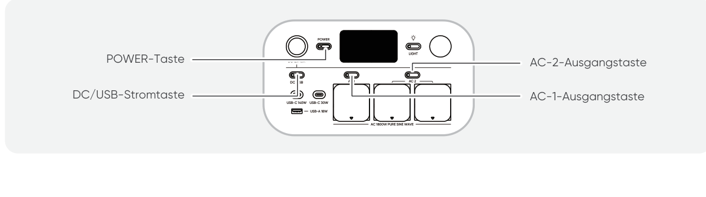

2.3 Nachdem Sie auf das gefundene Gerätesymbol getippt haben, koppelt sich die App automatisch per Bluetooth mit dem Gerät.

<table class="manual-callout-table" style="width:100%; border-collapse:collapse; margin:0 0 16px 0;"><tbody><tr><td class="manual-callout-label" style="width:16%; border:1px solid #000; padding:6px 8px; vertical-align:top;">
<strong>HINWEIS</strong>
</td><td class="manual-callout-body" style="border:1px solid #000; padding:6px 8px; vertical-align:top;">
Wenn während des Kopplungsvorgangs „das Gerät wurde bereits gekoppelt“ angezeigt wird, können die folgenden zwei Möglichkeiten für die Kopplung verwendet werden:

<ul class="simple">
<li>
Der Besitzer des Geräts teilt dieses Gerät über die App mit anderen Benutzern.
</li>
<li>
Halten Sie Hauptnetzschalter + DC/USB-Stromtaste 3 Sekunden lang gedrückt, um WLAN und Bluetooth des Geräts zurückzusetzen, und koppeln Sie das Gerät anschließend erneut.
</li>
</ul>
</td></tr></tbody></table>

2.4 Nachdem das Gerät erfolgreich gekoppelt wurde, geben Sie Ihr WLAN-Passwort ein und tippen Sie auf die Schaltfläche **OK**.

<table class="manual-callout-table" style="width:100%; border-collapse:collapse; margin:0 0 16px 0;"><tbody><tr><td class="manual-callout-label" style="width:16%; border:1px solid #000; padding:6px 8px; vertical-align:top;">
<strong>HINWEIS</strong>
</td><td class="manual-callout-body" style="border:1px solid #000; padding:6px 8px; vertical-align:top;"><ul class="simple">
<li>
Bitte wählen Sie ein WLAN-Netzwerk im 2,4-GHz-Band aus. Das Gerät unterstützt kein WLAN-Netzwerk im 5-GHz-Band.
</li>
</ul>
</td></tr></tbody></table>

Nachdem das Gerät erfolgreich zur App hinzugefügt wurde, leuchtet das WLAN-Symbol am Gerät dauerhaft.

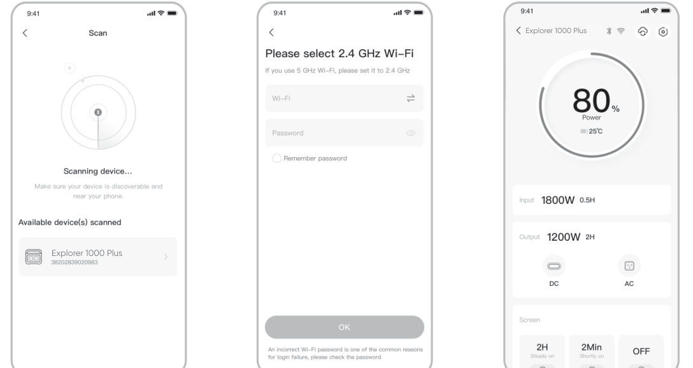

Die oben gezeigten Screenshots dienen nur als Referenz.

<table class="manual-callout-table" style="width:100%; border-collapse:collapse; margin:0 0 16px 0;"><tbody><tr><td class="manual-callout-label" style="width:16%; border:1px solid #000; padding:6px 8px; vertical-align:top;">
<strong>VORSICHT</strong>
</td><td class="manual-callout-body" style="border:1px solid #000; padding:6px 8px; vertical-align:top;">
Die Jackery-App kann jeweils nur mit einer Powerstation gleichzeitig per Bluetooth verbunden sein. Wenn Sie zur Geräteliste zurückkehren, wird Bluetooth automatisch getrennt. Tippen Sie die Powerstation in der Liste erneut an, um die Verbindung automatisch wiederherzustellen.
</td></tr></tbody></table>

## 3. Gerät entkoppeln

Klicken Sie im Hauptbildschirm des Geräts auf das Symbol **Einstellungen** oben rechts, um die Einstellungsseite zu öffnen, und klicken Sie unten auf der Seite auf die Schaltfläche **Entkoppeln**, um die Kopplung des Geräts aufzuheben.

## 4. Hinweise

### 4.1 WLAN und Bluetooth einschalten

- WLAN und Bluetooth werden automatisch eingeschaltet, nachdem das Gerät eingeschaltet wurde, und die WLAN- und Bluetooth-Symbole auf dem Bildschirm leuchten auf.

- Halten Sie DC/USB-Stromtaste + AC-1-Ausgangstaste/AC-2-Ausgangstaste gleichzeitig gedrückt, bis die WLAN- und Bluetooth-Symbole auf dem Bildschirm aufleuchten.

### 4.2 WLAN und Bluetooth ausschalten

Halten Sie DC/USB-Stromtaste + AC-1-Ausgangstaste/AC-2-Ausgangstaste gleichzeitig gedrückt, bis die WLAN- und Bluetooth-Symbole auf dem Bildschirm erlöschen.

### 4.3 WLAN und Bluetooth zurücksetzen

Halten Sie Hauptnetzschalter + DC/USB-Stromtaste gleichzeitig 3 Sekunden lang gedrückt, um WLAN und Bluetooth auf die Werkseinstellungen zurückzusetzen. Das verbundene App-Konto wird entkoppelt.
