# ВАЖЛИВА ІНФОРМАЦІЯ З БЕЗПЕКИ

<table class="manual-callout-table" style="width:100%; border-collapse:collapse; margin:0 0 16px 0;"><tbody><tr><td class="manual-callout-label" style="width:16%; border:1px solid #000; padding:6px 8px; vertical-align:top;">
<strong>ПОПЕРЕДЖЕННЯ</strong>
</td><td class="manual-callout-body" style="border:1px solid #000; padding:6px 8px; vertical-align:top;">
ІНСТРУКЦІЇ З БЕЗПЕКИ ДЛЯ ЗАПОБІГАННЯ ПОЖЕЖІ, УРАЖЕННЮ ЕЛЕКТРИЧНИМ СТРУМОМ АБО ТРАВМАМ
</td></tr></tbody></table>

Завжди дотримуйтеся цих базових запобіжних заходів під час використання цього виробу.

- Прочитайте всі інструкції перед використанням цього виробу.
- Не дозволяйте дітям гратися з виробом. Потрібен постійний нагляд за дітьми, коли виріб використовується поблизу них.
- Ризик ураження електричним струмом може виникнути, якщо використовуються аксесуари, рекомендовані або продані непрофесійними виробниками.
- Коли виріб не використовується, від'єднайте вилку живлення від розетки виробу.
- Не розбирайте виріб, оскільки це може спричинити непередбачувані ризики, як-от пожежу, вибух або ураження електричним струмом.
- Не використовуйте виріб із пошкодженими шнурами, вилками або вихідними кабелями, оскільки це може спричинити ураження електричним струмом.
- Щоб забезпечити належну циркуляцію повітря, не закривайте вентиляційні отвори виробу. Місце використання виробу має мати достатній потік повітря в прохолодному сухому середовищі, щоб запобігти перегріванню.
  - Заряджання у вологих або погано вентильованих місцях може створити загрозу безпеці.
  - Вода може спричинити коротке замикання або пошкодити зарядний пристрій, що створює ризики для безпеки.
- Не піддавайте виріб впливу вогню, високих температур, прямого сонячного світла або гарячих середовищ, наприклад салону припаркованого автомобіля. Такий вплив може спричинити пожежу або вибух.

## ІНСТРУКЦІЇ З ТЕХНІЧНОГО ОБСЛУГОВУВАННЯ КОРИСТУВАЧЕМ

Протягом життєвого циклу виробів для накопичення енергії очікується певний ступінь деградації ємності та енергії. Зі збільшенням кількості циклів заряджання й розряджання та подовженням часу зберігання ця деградація поступово посилюватиметься. Це нормальний стан, що відповідає природному старінню елементів батареї.

# ЗНАЧЕННЯ СИМВОЛІВ

<figure aria-label="Символ / Значення" class="hb-symbol-signal-composition" data-component-id="HB-TABLE-SYMBOL-SIGNAL"><table class="hb-symbol-signal-table"><colgroup><col class="hb-symbol-signal-col-label"/><col class="hb-symbol-signal-col-meaning"/></colgroup><thead><tr><th class="hb-symbol-signal-label-heading" scope="col">
Символ
</th><th class="hb-symbol-signal-meaning-heading" scope="col">
Значення
</th></tr></thead><tbody><tr><td class="hb-symbol-signal-label-cell">⚠AVVERTENZA</td><td class="hb-symbol-signal-meaning-cell">
Небезпечні дії, які можуть призвести до серйозних травм, смерті та/або пошкодження майна
</td></tr><tr><td class="hb-symbol-signal-label-cell">⚠УВАГА</td><td class="hb-symbol-signal-meaning-cell">
Небезпечні дії, які можуть призвести до травмування та/або пошкодження майна.
</td></tr><tr><td class="hb-symbol-signal-label-cell">⚠ПРИМІТКА</td><td class="hb-symbol-signal-meaning-cell">
Небезпечні дії, які можуть призвести до пошкодження обладнання, втрати даних, погіршення продуктивності або непередбачуваних результатів.
</td></tr><tr><td class="hb-symbol-signal-label-cell">⚠ПОРАДА</td><td class="hb-symbol-signal-meaning-cell">
Доповнює важливу інформацію або поради щодо експлуатації в тексті.
</td></tr></tbody></table></figure>

<figure aria-label="Символ / Значення" class="hb-symbol-pair-composition" data-component-id="HB-TABLE-SYMBOL-ICON">

<table class="hb-symbol-panel-table"><colgroup><col class="hb-symbol-col-icon"/><col class="hb-symbol-col-meaning"/></colgroup><thead><tr><th class="hb-symbol-icon-heading" scope="col">
<strong>Символ</strong>
</th><th class="hb-symbol-meaning-heading" scope="col">
<strong>Значення</strong>
</th></tr></thead><tbody><tr><td class="hb-symbol-icon"></td><td class="hb-symbol-meaning">
Попереджувальні та застережні символи. Обов’язково прочитайте, щоб попередити користувачів про потенційні небезпеки або ризики.
</td></tr><tr><td class="hb-symbol-icon"></td><td class="hb-symbol-meaning">
Перед використанням прочитайте посібник користувача.
</td></tr><tr><td class="hb-symbol-icon"></td><td class="hb-symbol-meaning">
Не розбирайте продукт.
</td></tr><tr><td class="hb-symbol-icon"></td><td class="hb-symbol-meaning">
Тримайте продукт подалі від вогню.
</td></tr></tbody></table>

<table class="hb-symbol-panel-table"><colgroup><col class="hb-symbol-col-icon"/><col class="hb-symbol-col-meaning"/></colgroup><thead><tr><th class="hb-symbol-icon-heading" scope="col">
<strong>Символ</strong>
</th><th class="hb-symbol-meaning-heading" scope="col">
<strong>Значення</strong>
</th></tr></thead><tbody><tr><td class="hb-symbol-icon"></td><td class="hb-symbol-meaning">
Тримайте подалі від дітей.
</td></tr><tr><td class="hb-symbol-icon"></td><td class="hb-symbol-meaning">
Цей символ вказує, що всередині продукту є літій-іонна (Li-ion) батарея, яку необхідно утилізувати або переробити належним чином.
</td></tr><tr><td class="hb-symbol-icon"></td><td class="hb-symbol-meaning">
Цей символ вказує, що продукт не можна утилізувати разом із побутовими відходами, і його слід передати до спеціалізованого пункту збору для переробки. Правильна утилізація та переробка допомагають захистити довкілля. Для отримання додаткової інформації щодо утилізації та переробки цього продукту зверніться до місцевої громади, служби утилізації або дилера.
</td></tr></tbody></table>

</figure>

# ЩО В КОРОБЦІ

<figure aria-label="ЩО В КОРОБЦІ" class="hb-inbox-composition" data-card-count="3" data-component-id="HB-SPECIAL-INBOX" data-inbox-variant="three-card-responsive"><ol class="hb-inbox-grid"><li class="hb-inbox-card" data-item-number="1">

<strong>Jackery Explorer 1000 Plus</strong>

</li><li class="hb-inbox-card" data-item-number="2">

<strong>Кабель для заряджання AC</strong>

</li><li class="hb-inbox-card" data-item-number="3">

Посібник користувача

</li></ol>

<strong>ПОРАДИ</strong>

Кабель для заряджання від автомобіля не входить до комплекту, але його можна придбати окремо на нашому вебсайті.
Для отримання допомоги зверніться до служби підтримки Jackery.

</figure>

# ОГЛЯД ПРОДУКТУ

## ВИГЛЯД СПЕРЕДУ

## ВИГЛЯД ПРАВОГО БОКУ

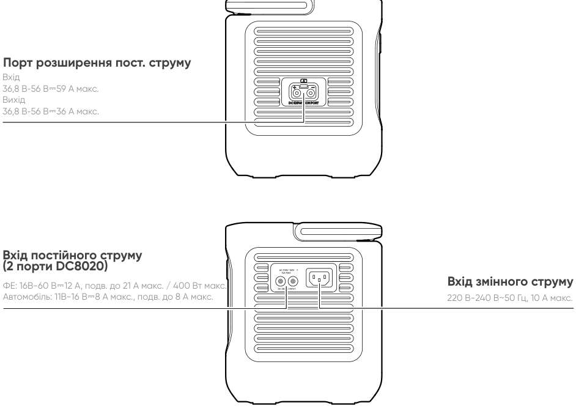

# ЖК-ДИСПЛЕЙ

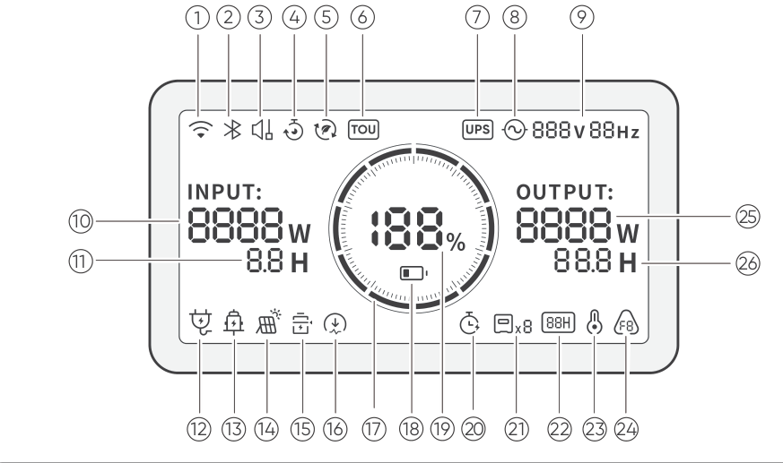

<table class="longtable lcd-text-only">
<colgroup>
<col style="width: 8%" />
<col style="width: 12%" />
<col style="width: 28%" />
<col style="width: 52%" />
</colgroup>
<tbody>
<tr>
<td>
1
</td>
<td></td>
<td>
Wi-Fi
</td>
<td><strong>Увімкнено:</strong> Wi-Fi підключено.
<strong>Блимає:</strong> Готово до підключення до Wi-Fi.
<strong>Вимкнено:</strong> Wi-Fi відключено.</td>
</tr>
<tr>
<td>
2
</td>
<td></td>
<td>
Bluetooth
</td>
<td><strong>Увімкнено:</strong> Bluetooth підключено.
<strong>Блимає:</strong> Готово до підключення до Bluetooth.
<strong>Вимкнено:</strong> Bluetooth відключено.</td>
</tr>
<tr>
<td>
3
</td>
<td></td>
<td>
Режим тихої зарядки
</td>
<td><strong>Увімкнено:</strong> Рівень шуму під час заряджання значно зменшується, водночас знижується потужність заряджання і сповільнюється швидкість заряджання.
<strong>Вимкнено:</strong> Тихий режим заряджання вимкнено.
Увімкніть/вимкніть цю функцію в Jackery App. Налаштування зберігається після вимкнення пристрою.</td>
</tr>
<tr>
<td>
4
</td>
<td></td>
<td>
План заряджання
</td>
<td>Налаштовує час заряджання Jackery Explorer 1000 Plus. Підходить для умов із коливаннями цін на електроенергію; дозволяє створювати плани заряджання на основі пікових і непікових періодів, зменшуючи витрати на електроенергію.
Увімкніть/вимкніть цю функцію в Jackery App. Налаштування зберігається після вимкнення пристрою.</td>
</tr>
<tr>
<td>
5
</td>
<td></td>
<td>
Режим самозабезпечення
</td>
<td>Максимізує використання сонячної енергії та зменшує залежність від електромережі, віддаючи пріоритет накопиченій сонячній енергії, що знижує витрати на електроенергію. Електростанцію необхідно одночасно підключити до сонячних панелей і електромережі, при цьому потужність навантаження обмежується байпасною потужністю.
Увімкніть/вимкніть цю функцію в Jackery App. Налаштування зберігається після вимкнення пристрою.</td>
</tr>
<tr>
<td>
6
</td>
<td></td>
<td>
Режим TOU
</td>
<td><strong>Увімкнено:</strong> Режим TOU (розрахунок за часом використання) увімкнено (резервний рівень заряду за замовчуванням: 60%). У пікові періоди, коли накопичена енергія перевищує резервний рівень заряду, пристрій віддає пріоритет розряджанню акумулятора, щоб зменшити витрати на електроенергію в піковий час. У непікові періоди система заряджає акумулятор від електромережі для згладжування пікових навантажень і заповнення провалів.
<strong>Вимкнено:</strong> Режим TOU вимкнено. Пристрій не дотримується стратегії TOU і працює відповідно до логіки живлення та заряджання за замовчуванням.
Увімкніть/вимкніть цей режим у Jackery App. Налаштування зберігається після вимкнення пристрою.</td>
</tr>
<tr>
<td>
7
</td>
<td></td>
<td>
ДБЖ
</td>
<td><strong>Увімкнено:</strong> Пристрій працює в байпасному режимі, час перемикання з електромережі на внутрішній акумулятор становить 10 мс.
<strong>Вимкнено:</strong> Продукт не працює в байпасному режимі.</td>
</tr>
<tr>
<td>
8
</td>
<td></td>
<td>
Індикатор живлення змінного струму
</td>
<td>
Вихід змінного струму (чиста синусоїда) увімкнено.
</td>
</tr>
<tr>
<td>
9
</td>
<td></td>
<td>
Вихідна напруга та частота
</td>
<td>
Відображає вихідну напругу та частоту, коли вихід змінного струму увімкнено.
</td>
</tr>
<tr>
<td>
10
</td>
<td></td>
<td>
Вхідна потужність
</td>
<td>
Відображає вхідну потужність у ватах.
</td>
</tr>
<tr>
<td>
11
</td>
<td></td>
<td>
Час, що залишився до повного заряджання
</td>
<td>
Відображає залишковий час заряджання.
</td>
</tr>
<tr>
<td>
12
</td>
<td></td>
<td>
Індикатор заряджання від мережі змінного струму
</td>
<td>
Пристрій заряджається через вхід змінного струму від електромережі.
</td>
</tr>
<tr>
<td>
13
</td>
<td></td>
<td>
Індикатор заряджання від автомобіля
</td>
<td>
Пристрій заряджається через вхід постійного струму (DC8020) із використанням 12 В постійного струму (автомобільне заряджання).
</td>
</tr>
<tr>
<td>
14
</td>
<td></td>
<td>
Індикатор заряджання від сонячних батарей
</td>
<td>
Пристрій заряджається через вхід постійного струму (DC8020) із використанням сонячної(-их) панелі(-ей).
</td>
</tr>
<tr>
<td>
15
</td>
<td></td>
<td>
Режим енергозбереження акумулятора
</td>
<td><strong>Увімкнено:</strong> Обмежує максимальну доступну ємність акумулятора для продовження терміну його служби.
<strong>Вимкнено:</strong> Режим енергозбереження акумулятора вимкнено. Увімкніть/вимкніть цю функцію в Jackery App. Налаштування зберігається після вимкнення пристрою.
Примітка 1: Ця функція недоступна, коли пристрій підключено до акумуляторного(-их) блоку(-ів).
Примітка 2: Коли ця функція активована, пристрій періодично виконує повний цикл заряджання та розряджання для калібрування SOC (рівня заряду).</td>
</tr>
<tr>
<td>
16
</td>
<td></td>
<td>
Обмеження потужності заряджання
</td>
<td><strong>Увімкнено:</strong> Обмеження потужності заряджання активовано в Jackery App.
<strong>Вимкнено:</strong> Обмеження потужності заряджання вимкнено в Jackery App.
Налаштування зберігається після вимкнення пристрою.</td>
</tr>
<tr>
<td>
17
</td>
<td></td>
<td>
Індикатор заряду акумулятора
</td>
<td>
Коли пристрій заряджається, помаранчеве коло навколо відсотка заряду акумулятора почергово засвічуватиметься. Під час заряджання інших пристроїв помаранчеве коло світитиметься постійно.
</td>
</tr>
<tr>
<td>
18
</td>
<td></td>
<td>
Індикатор низького заряду батареї
</td>
<td><strong>Увімкнено:</strong> Рівень заряду акумулятора нижче 20%.
<strong>Блимає:</strong> Рівень заряду акумулятора нижче 5%.
<strong>Вимкнено:</strong> Рівень заряду не нижче 20% або пристрій заряджається.</td>
</tr>
<tr>
<td>
19
</td>
<td></td>
<td>
Залишковий відсоток заряду акумулятора
</td>
<td>
Відображає залишковий відсоток заряду акумулятора.
</td>
</tr>
<tr>
<td>
20
</td>
<td></td>
<td>
Таймер розряджання
</td>
<td><strong>Увімкнено:</strong> Таймер розряджання встановлено.
<strong>Вимкнено:</strong> Таймер розряджання не встановлено.
Увімкніть/вимкніть цю функцію в Jackery App. Налаштування не зберігається після вимкнення пристрою.</td>
</tr>
<tr>
<td>
21
</td>
<td></td>
<td>
Підключені акумулятори
</td>
<td>
Відображає кількість акумуляторних блоків, якщо вони підключені.
</td>
</tr>
<tr>
<td>
22
</td>
<td></td>
<td>
Режим енергозбереження
</td>
<td>Коли вихід змінного або постійного струму увімкнено натисканням кнопки живлення змінного струму 1/2 або постійного струму/USB:
<strong>Увімкнено:</strong> Режим енергозбереження увімкнено. Вимкнено: Режим енергозбереження вимкнено.</td>
</tr>
<tr>
<td>
23
</td>
<td></td>
<td>
Індикатор високої температури
</td>
<td>
Активовано захист від високої температури. Продукт може припинити роботу, доки його температура не повернеться до нормального робочого діапазону.
</td>
</tr>
<tr>
<td>
23
</td>
<td></td>
<td>
Індикатор низької температури
</td>
<td>
Активовано захист від низької температури. Продукт може припинити роботу, доки його температура не повернеться до нормального робочого діапазону.
</td>
</tr>
<tr>
<td>
24
</td>
<td></td>
<td>
Код помилки
</td>
<td>
Виникла помилка продукту. Детальніше див. у розділі «Усунення несправностей».
</td>
</tr>
<tr>
<td>
25
</td>
<td></td>
<td>
Вихідна потужність
</td>
<td>
Відображає вихідну потужність у ватах.
</td>
</tr>
<tr>
<td>
26
</td>
<td></td>
<td>
Час розряду, що залишився
</td>
<td>
Відображає залишковий час розряджання.
</td>
</tr>
</tbody>
</table>

# ОПЕРАЦІЇ

## ВКЛ./ВИКЛ.

## УВІМК./ВИМК. ВИХОДУ AC

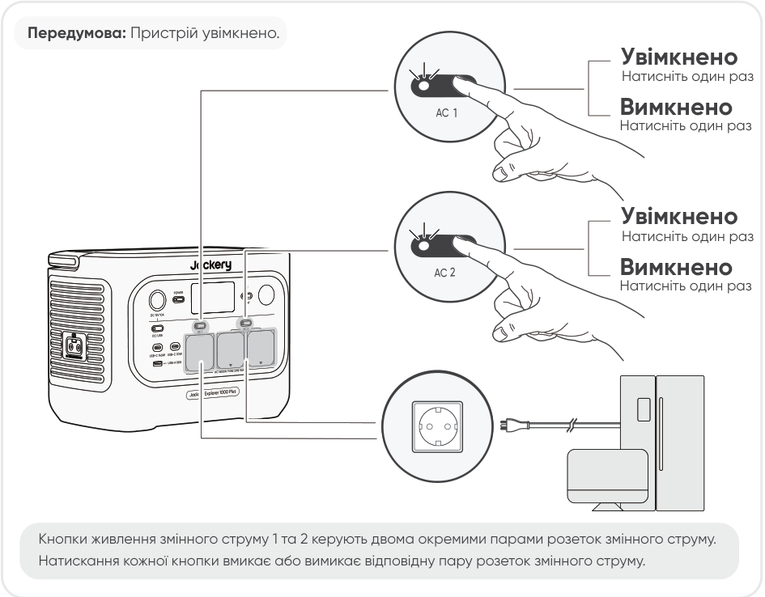

## УВІМК./ВИМК. ВИХОДУ DC 12 В / USB

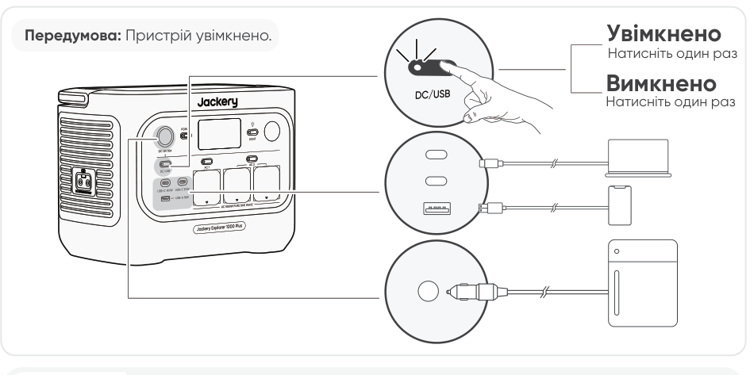

<table class="manual-callout-table" style="width:100%; border-collapse:collapse; margin:0 0 16px 0;"><tbody><tr><td class="manual-callout-label" style="width:16%; border:1px solid #000; padding:6px 8px; vertical-align:top;">
<strong>УВАГА</strong>
</td><td class="manual-callout-body" style="border:1px solid #000; padding:6px 8px; vertical-align:top;"><ul class="simple">
<li>
<strong>USB-C 100 Вт є високопотужним вихідним портом USB-PD Power Source 3 (PS3).</strong> Якщо підключений пристрій користувача або аксесуар не відповідає вимогам безпеки, існує ризик пожежі. Перед використанням цих портів переконайтеся, що підключений пристрій або аксесуар має захист від пожежі.
</li>
<li>
Підключайте Jackery Explorer 1000 Plus лише до пристроїв або аксесуарів, що відповідають пунктам 6.3, 6.4 і 6.5 IEC/EN/UL 62368-1 (або іншим еквівалентним стандартам).
</li>
<li>
Щоб отримати максимальну вихідну потужність, використовуйте кабель USB-C до USB-C 5 A (20 В DC/5 A, 100 Вт).
</li>
</ul>
</td></tr></tbody></table>

Пристрій може заряджати акумулятор вашого автомобіля за допомогою автомобільного кабелю заряджання Jackery 12 В, який продається окремо та доступний на нашому вебсайті.

<table class="manual-callout-table" style="width:100%; border-collapse:collapse; margin:0 0 16px 0;"><tbody><tr><td class="manual-callout-label" style="width:16%; border:1px solid #000; padding:6px 8px; vertical-align:top;">
<strong>УВАГА</strong>
</td><td class="manual-callout-body" style="border:1px solid #000; padding:6px 8px; vertical-align:top;"><ul class="simple">
<li>
Порт DC 12 В сумісний лише з автомобільними акумуляторами 12 В і не підходить для систем 24 В.
</li>
<li>
Не запускайте автомобіль, поки пристрій заряджає автомобільний акумулятор через вихідний порт DC 12 В, оскільки це може пошкодити пристрій.
</li>
<li>
Ця функція призначена лише для екстреного використання і не може зарядити повністю розряджений або пошкоджений автомобільний акумулятор.
</li>
</ul>
</td></tr></tbody></table>

## РЕЖИМ ЕНЕРГОЗБЕРЕЖЕННЯ

Щоб запобігти зайвому витрачанню заряду батареї через забутий увімкнений вихід, пристрій за замовчуванням активує режим енергозбереження. Коли вихід AC або DC / USB увімкнено, на екрані LCD відображатиметься значок режиму енергозбереження. У цьому режимі, якщо пристрій не підключено або споживання підключеного пристрою нижче певного порогу (25 Вт для виходу AC або 2 Вт для виходу DC / USB), відповідний вихід автоматично вимкнеться після встановленого часу. Значення за замовчуванням - 12 годин. Тривалість режиму енергозбереження можна встановити в Додатку Jackery на 2H, 8H, 12H або 24H. Якщо вибрано Never Off, режим енергозбереження буде вимкнено.

Під час живлення малопотужних пристроїв (AC \<= 25 Вт або DC / USB \<= 2 Вт) вимкніть режим енергозбереження, щоб запобігти автоматичному вимкненню виходу під час роботи.

<table class="manual-callout-table" style="width:100%; border-collapse:collapse; margin:0 0 16px 0;"><tbody><tr><td class="manual-callout-label" style="width:16%; border:1px solid #000; padding:6px 8px; vertical-align:top;">
<strong>ПРИМІТКА</strong>
</td><td class="manual-callout-body" style="border:1px solid #000; padding:6px 8px; vertical-align:top;">
Після ввімкнення пристрій відновлює попередній стан режиму енергозбереження. Для зміни режиму потрібне ручне перемикання.
</td></tr></tbody></table>

## ВКЛ./ВИКЛ. LED-СВІТЛА

## Функція відновлення виходів AC і DC

Функцію відновлення виходів AC і DC за замовчуванням вимкнено. Увімкніть цю функцію в Додатку Jackery, щоб пристрій запам'ятовував стан виходів AC/DC та автоматично відновлював виходи AC і DC за визначених умов.

<figure aria-label="Умови автоматичного відновлення / Умови без автоматичного відновлення" class="hb-auto-resume-composition"><table class="hb-auto-resume-table"><colgroup><col class="hb-auto-resume-col"/><col class="hb-auto-resume-col"/></colgroup>
<thead>
<tr><th class="head hb-auto-resume-left" scope="col">
Умови автоматичного відновлення
</th>
<th class="head hb-auto-resume-right" scope="col">
Умови без автоматичного відновлення
</th>
</tr>
</thead>
<tbody>
<tr><td class="hb-auto-resume-left">
Увімкнення/перезапуск після вимкнення або перезапуску
</td>
<td class="hb-auto-resume-right">
Ручне вимкнення виходу (кнопкою/у Додатку)
</td>
</tr>
<tr><td class="hb-auto-resume-left" rowspan="2">
SOC батареї ≥ ліміт розряджання +10% після досягнення ліміту
</td>
<td class="hb-auto-resume-right">
Вихід вимкнено в режимі енергозбереження
</td>
</tr>
<tr><td class="hb-auto-resume-right">
Вихід вимкнено через спрацювання захисту
</td>
</tr>
<tr><td class="hb-auto-resume-left">
Оновлення OTA завершено
</td>
<td class="hb-auto-resume-right">
Вихід вимкнено таймером розряджання
</td>
</tr>
</tbody>
</table></figure>

## ЕКРАН LCD

<figure aria-label="Заглушка режиму дисплея LCD." class="hb-lcd-mode-composition" data-component-id="HB-TABLE-LCD-MODE">
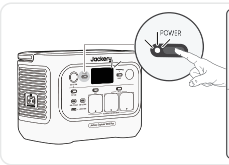

<table class="hb-lcd-mode-table"><colgroup><col class="hb-lcd-mode-col-state"/><col class="hb-lcd-mode-col-action"/><col class="hb-lcd-mode-col-copy"/></colgroup><tbody><tr><td class="hb-lcd-mode-state" rowspan="3">Короткочасне увімкнення</td><td class="hb-lcd-mode-action">Увімкнути</td><td class="hb-lcd-mode-copy">Натисніть кнопку POWER або коли пристрій заряджається.</td></tr><tr><td class="hb-lcd-mode-action">Вимкнути</td><td class="hb-lcd-mode-copy">Натисніть кнопку POWER.</td></tr><tr><td class="hb-lcd-mode-action">Автовимкнення</td><td class="hb-lcd-mode-copy">LCD автоматично вимикається та переходить у режим сну після 2 хвилин бездіяльності.</td></tr><tr><td class="hb-lcd-mode-state" rowspan="3">Постійно увімкнено (під час заряджання або розряджання)</td><td class="hb-lcd-mode-action">Увімкнути</td><td class="hb-lcd-mode-copy">Натисніть кнопку POWER двічі, коли пристрій увімкнено.</td></tr><tr><td class="hb-lcd-mode-action">Вимкнути</td><td class="hb-lcd-mode-copy">Натисніть кнопку POWER.</td></tr><tr><td class="hb-lcd-mode-action">Автовимкнення</td><td class="hb-lcd-mode-copy">LCD автоматично вимикається після 2 годин бездіяльності.</td></tr></tbody></table>
</figure>

Ви також можете встановити режим відображення екрана в Додатку Jackery.

## КОМБІНАЦІЯ КНОПОК

<figure aria-label="Кнопки / Дія / Функція" class="hb-key-combination-composition" tabindex="0"><table class="hb-key-combination-table"><colgroup><col class="hb-key-col-buttons"/><col class="hb-key-col-operation"/><col class="hb-key-col-function"/></colgroup>
<thead>
<tr><th class="head hb-key-buttons" scope="col">
Кнопки
</th>
<th class="head hb-key-operation" scope="col">
Дія
</th>
<th class="head hb-key-function" scope="col">
Функція
</th>
</tr>
</thead>
<tbody>
<tr><td class="hb-key-buttons">
Головна кнопка POWER + Кнопка AC
</td>
<td class="hb-key-operation">
Натисніть і утримуйте обидві протягом 3 с
</td>
<td class="hb-key-function">
Увімк./вимк. режим енергозбереження
</td>
</tr>
<tr><td class="hb-key-buttons">
Головна кнопка POWER + кнопка DC / USB
</td>
<td class="hb-key-operation">
Натисніть і утримуйте обидві протягом 3 с
</td>
<td class="hb-key-function">
Скинути Wi-Fi та Bluetooth
</td>
</tr>
<tr><td class="hb-key-buttons">
кнопка DC / USB + Кнопка AC
</td>
<td class="hb-key-operation">
Натисніть і утримуйте обидві протягом 1 с
</td>
<td class="hb-key-function">
Увімк./вимк. Wi-Fi та Bluetooth
</td>
</tr>
<tr><td class="hb-key-buttons">
Головна кнопка POWER + кнопка LED Light
</td>
<td class="hb-key-operation">
Натисніть і утримуйте обидві протягом 1 с
</td>
<td class="hb-key-function">
Увімк./вимк. аварійний режим заряджання
</td>
</tr>
</tbody>
</table></figure>

# ДЖЕРЕЛО БЕЗПЕРЕБІЙНОГО ЖИВЛЕННЯ (UPS)

Підключіть виріб до настінної розетки за допомогою кабелю для заряджання AC, потім натисніть кнопку AC і одночасно подавайте живлення на свої прилади.

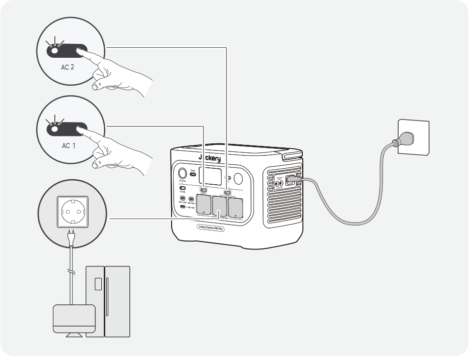

Джерело безперебійного живлення (UPS) - це тип системи безперервного живлення, яка автоматично забезпечує резервне живлення підключеного навантаження у разі відмови електромережі.

У разі раптового зникнення мережевого живлення Jackery Explorer 1000 Plus автоматично перемкнеться на накопичену енергію протягом 10 мс, щоб ваші прилади продовжували працювати.

У режимі UPS пікова вихідна потужність пристрою досягає 10 A перед відключенням електроенергії. Оскільки в режимі байпасу ввімкнено одночасне заряджання та розряджання,

фактична вихідна потужність у цьому режимі нижча за номінальну, але під час відключення електроенергії вона повертається до номінальної.

<table class="manual-callout-table" style="width:100%; border-collapse:collapse; margin:0 0 16px 0;"><tbody><tr><td class="manual-callout-label" style="width:16%; border:1px solid #000; padding:6px 8px; vertical-align:top;">
<strong>УВАГА</strong>
</td><td class="manual-callout-body" style="border:1px solid #000; padding:6px 8px; vertical-align:top;"><ul class="simple">
<li>
Цей пристрій не підтримує перемикання 0 мс. Не підключайте його до обладнання, яке потребує джерела живлення з перемиканням 0 мс, наприклад до серверів даних або робочих станцій.
</li>
<li>
Перед використанням кілька разів перевірте сумісність із вашим пристроєм.
</li>
<li>
Не підключайте навантаження, що перевищують максимальну вихідну потужність виробу. Інакше спрацює захист від перевантаження.
</li>
</ul>
</td></tr></tbody></table>

# ПІДКЛЮЧЕННЯ ДО АКУМУЛЯТОРНИХ БЛОКІВ (ПРОДАЮТЬСЯ ОКРЕМО)

Цей продукт може підтримувати до 5 акумуляторних блоків для задоволення потреб у великій ємності живлення. Щоб дізнатися більше про те, як його використовувати, зверніться до Керівництва користувача Jackery Battery Pack 2000.

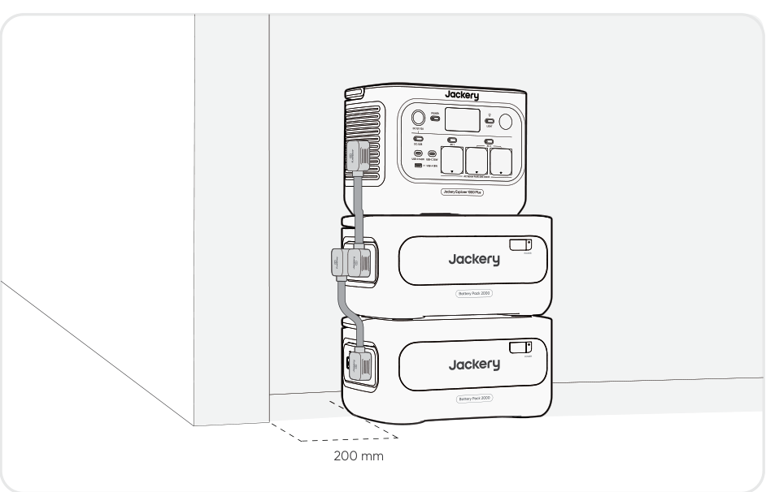

<table class="manual-callout-table" style="width:100%; border-collapse:collapse; margin:0 0 16px 0;"><tbody><tr><td class="manual-callout-label" style="width:16%; border:1px solid #000; padding:6px 8px; vertical-align:top;">
<strong>УВАГА</strong>
</td><td class="manual-callout-body" style="border:1px solid #000; padding:6px 8px; vertical-align:top;"><ul class="simple">
<li>
Перед підключенням Jackery Battery Pack 2000 до Jackery Explorer 1000 Plus переконайтеся, що всі пристрої вимкнені.
</li>
<li>
Щоб забезпечити належну роботу продукту, переконайтеся, що вентиляційні отвори для забору та виходу повітря з обох боків розблоковані. Залишайте щонайменше 200 мм простору між вентиляційними отворами та будь-якими об’єктами для належного відведення тепла.
</li>
<li>
Коли продукт використовується з підключеними акумуляторними модулями, максимальна кількість модулів за замовчуванням — 3, і продукт слід розміщувати на рівній, стабільній поверхні з достатньою несучою здатністю.
</li>
<li>
Якщо потрібно скласти 4 або більше акумуляторних модулів, продукт слід розмістити в стабільному місці біля стіни, захистити від зовнішніх впливів і вжити необхідних заходів проти перекидання.
</li>
</ul>
</td></tr></tbody></table>

|  |  |  |
|----|----|----|
| **Jackery Battery Pack 2000** | **Розширювальний кабель** | **Керівництво користувача** |

# ЗАРЯДЖАННЯ

**Спочатку зелена енергія:** ми підтримуємо використання зеленої енергії в першу чергу. Цей пристрій підтримує два режими заряджання одночасно: заряджання від сонячних панелей і заряджання від настінної розетки AC. Коли заряджання від настінної розетки AC і сонячне заряджання увімкнені одночасно, пристрій надаватиме пріоритет сонячному заряджанню, а обидва способи використовуватимуться для заряджання батареї з максимально допустимою потужністю.

**Повністю зарядіть пристрій перед першим використанням.**

<table class="manual-callout-table" style="width:100%; border-collapse:collapse; margin:0 0 16px 0;"><tbody><tr><td class="manual-callout-label" style="width:16%; border:1px solid #000; padding:6px 8px; vertical-align:top;">
<strong>ПРИМІТКА</strong>
</td><td class="manual-callout-body" style="border:1px solid #000; padding:6px 8px; vertical-align:top;"><ul class="simple">
<li>
Рекомендований діапазон температури заряджання для пристрою становить від -10°C до 45°C, а діапазон температури розряджання - від -10°C до 45°C.
</li>
<li>
Робота пристрою поза цим температурним діапазоном може обмежити його можливості заряджання та розряджання або навіть унеможливити заряджання чи розряджання.
</li>
<li>
Потужність заряджання та ємність батареї пристрою можуть змінюватися через коливання температури.
</li>
</ul>
</td></tr></tbody></table>

## ЗАРЯДЖАННЯ ЧЕРЕЗ НАСТІННУ РОЗЕТКУ AC

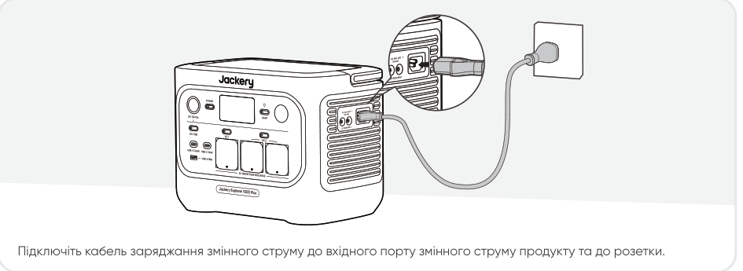

<table class="manual-callout-table" style="width:100%; border-collapse:collapse; margin:0 0 16px 0;"><tbody><tr><td class="manual-callout-label" style="width:16%; border:1px solid #000; padding:6px 8px; vertical-align:top;">
<strong>УВАГА</strong>
</td><td class="manual-callout-body" style="border:1px solid #000; padding:6px 8px; vertical-align:top;">
Переконайтеся, що кабель для заряджання AC повністю та надійно вставлений у вхід AC. Неповне підключення може спричинити нестабільний струм, перегрів, поганий контакт або несправність пристрою.
</td></tr></tbody></table>

**Аварійний режим заряджання**

У цьому режимі ви можете швидко зарядити портативну електростанцію за допомогою заряджання AC. Цю функцію аварійного заряджання можна ввімкнути або вимкнути через додаток Jackery. Під час аварійного режиму заряджання круговий індикатор стану заряду (SOC) блиматиме швидше.

\*Щоб максимально продовжити термін служби батареї, найкраще заряджати її зі звичайною швидкістю. Використовуйте аварійний режим заряджання лише за потреби. Його не рекомендується застосовувати регулярно або тривалий час.

## ЗАРЯДЖАННЯ ВІД СОНЯЧНИХ ПАНЕЛЕЙ (ПРОДАЮТЬСЯ ОКРЕМО)

Jackery Explorer 1000 Plus має два вхідні порти DC8020 і сумісний із сонячними панелями Jackery.

Якщо до одного входу DC8020 потрібно одночасно підключити дві сонячні панелі, зверніться до наведеної нижче схеми заряджання через з\'єднувач сонячних панелей (продається окремо, до стандартної комплектації не входить).

<table class="manual-callout-table" style="width:100%; border-collapse:collapse; margin:0 0 16px 0;"><tbody><tr><td class="manual-callout-label" style="width:16%; border:1px solid #000; padding:6px 8px; vertical-align:top;">
<strong>УВАГА</strong>
</td><td class="manual-callout-body" style="border:1px solid #000; padding:6px 8px; vertical-align:top;">
До одного входу DC8020 можна підключити не більше двох сонячних панелей.
</td></tr></tbody></table>

<table class="manual-callout-table" style="width:100%; border-collapse:collapse; margin:0 0 16px 0;"><tbody><tr><td class="manual-callout-label" style="width:16%; border:1px solid #000; padding:6px 8px; vertical-align:top;">
<strong>УВАГА</strong>
</td><td class="manual-callout-body" style="border:1px solid #000; padding:6px 8px; vertical-align:top;">
Переконайтеся, що вхідна напруга для обох портів DC однакова. Інакше можна пошкодити пристрій. Наприклад:

<ul class="simple">
<li>
Використовуйте сонячні панелі Jackery однієї моделі та однакову кількість панелей, якщо підключаєте сонячні панелі до обох входів DC8020.
</li>
<li>
Не заряджайте пристрій одночасно від автомобільного зарядного пристрою та сонячної панелі. Це може призвести до перегорання автомобільного запобіжника або до збою заряджання.
</li>
</ul>
</td></tr></tbody></table>

Рекомендується використовувати сонячну панель Jackery для заряджання пристрою. Переконайтеся, що напруга холостого ходу (Voc) сонячної панелі входить до діапазону входу DC (16-60 В) Jackery Explorer 1000 Plus. Jackery не несе відповідальності за будь-які пошкодження або втрати, спричинені використанням сонячних панелей сторонніх виробників.

## ЗАРЯДЖАННЯ ЧЕРЕЗ АВТОМОБІЛЬНИЙ ЗАРЯДНИЙ ПРИСТРІЙ (ПРОДАЄТЬСЯ ОКРЕМО)

Цей пристрій можна заряджати за допомогою автомобільного зарядного пристрою 12 В. Переконайтеся, що автомобільний зарядний пристрій і автомобільна розетка живлення 12 В (прикурювач) мають надійне з\'єднання.

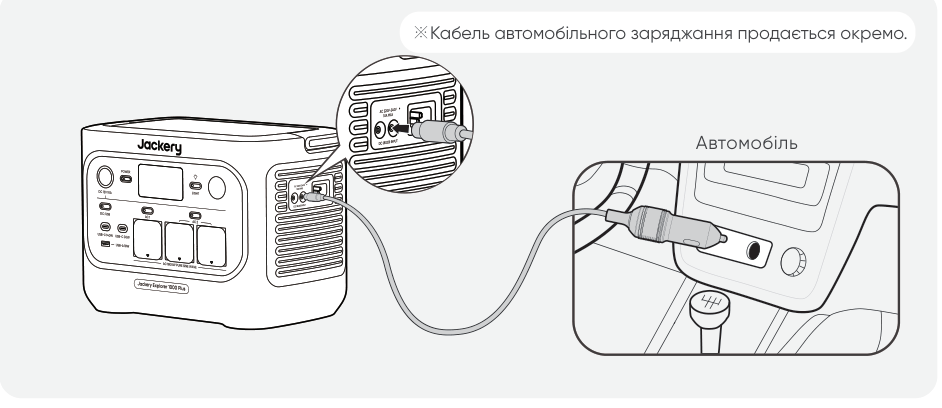

<table class="manual-callout-table" style="width:100%; border-collapse:collapse; margin:0 0 16px 0;"><tbody><tr><td class="manual-callout-label" style="width:16%; border:1px solid #000; padding:6px 8px; vertical-align:top;">
<strong>УВАГА</strong>
</td><td class="manual-callout-body" style="border:1px solid #000; padding:6px 8px; vertical-align:top;"><ul class="simple">
<li>
Перед заряджанням електростанції обов'язково запустіть транспортний засіб.
</li>
<li>
Якщо транспортний засіб рухається нерівними дорогами, використовувати автомобільний зарядний пристрій заборонено, оскільки це може спричинити нестандартну роботу. Компанія не несе відповідальності за будь-які втрати, спричинені нестандартною роботою.
</li>
<li>
Автомобільне заряджання застосовується лише для транспортних засобів із 12 В DC, але не для 24 В DC. Будь ласка, не заряджайте цей пристрій у транспортному засобі з 24 В, щоб уникнути травмування людей і матеріальних збитків.
</li>
</ul>
</td></tr></tbody></table>

# ЗБЕРІГАННЯ

Зберігайте пристрій у сухому, чистому та добре вентильованому місці. Температура та вологість під час зберігання:

- 1 month: від -20 °C до 45 °C (0-60 % RH)

- 3 months: від 0 °C до 45 °C (0-60 % RH)

- 12 months: від 0 °C до 25 °C (0-60 % RH)

Якщо цей пристрій зберігати тривалий час (3-6 місяців) із розрядженим акумулятором, він може стати нездатним до заряджання. Щоб уникнути цього та зберегти стан батареї, рекомендується перевіряти та заряджати пристрій кожні три місяці, а також виконувати повний цикл заряджання та розряджання щонайменше раз на 6-12 місяців.

# УСУНЕННЯ НЕСПРАВНОСТЕЙ

Якщо з\'являється будь-який із наведених нижче кодів помилки, виконайте вказані дії для усунення проблеми. Якщо несправність не зникає, зверніться до служби підтримки Jackery.

<figure aria-label="Код помилки / Способи усунення" class="hb-troubleshooting-composition" data-component-id="HB-TABLE-TROUBLESHOOTING" tabindex="0"><table class="hb-troubleshooting-table"><colgroup><col class="hb-troubleshooting-col-code"/><col class="hb-troubleshooting-col-measures"/></colgroup><thead><tr><th class="hb-troubleshooting-code" scope="col">
Код помилки
</th><th class="hb-troubleshooting-measures" scope="col">
Способи усунення
</th></tr></thead><tbody><tr><td class="hb-troubleshooting-code">
F0
</td><td class="hb-troubleshooting-measures">
Перезапустіть продукт.
</td></tr><tr><td class="hb-troubleshooting-code">
F1
</td><td class="hb-troubleshooting-measures">
Перезапустіть продукт.
</td></tr><tr><td class="hb-troubleshooting-code">
F2
</td><td class="hb-troubleshooting-measures">
Перезапустіть продукт.
</td></tr><tr><td class="hb-troubleshooting-code">
F3
</td><td class="hb-troubleshooting-measures">
Перезапустіть продукт.
</td></tr><tr><td class="hb-troubleshooting-code">
F4
</td><td class="hb-troubleshooting-measures">
Підключіть продукт до навантаження, щоб розрядити його акумулятор, доки несправність не зникне.
</td></tr><tr><td class="hb-troubleshooting-code">
F5
</td><td class="hb-troubleshooting-measures">
Заряджайте продукт за допомогою сонячних панелей або від мережевої розетки змінного струму, доки несправність не зникне.
</td></tr><tr><td class="hb-troubleshooting-code">
F6
</td><td class="hb-troubleshooting-measures">

1. Зачекайте, доки електромережа стабілізується, перш ніж заряджати продукт від мережевої розетки змінного струму.

2. Перевірте, чи не заблоковані вентиляційні отвори для забору та виходу повітря; забезпечте зазор 20 см з обох боків продукту.

3. Розмістіть продукт у місці, не підданому прямому сонячному світлу або високим температурам навколишнього середовища.

4. Від'єднайте все навантаження від продукту. Залиште продукт у стані бездіяльності та зачекайте, доки несправність не зникне.

5. Перезапустіть продукт.

</td></tr><tr><td class="hb-troubleshooting-code">
F7
</td><td class="hb-troubleshooting-measures">

1. Від'єднайте всі входи постійного струму від продукту.

2. Перевірте напругу холостого ходу (Vхх) підключених сонячних панелей. Продукт допускає максимальну вхідну напругу постійного струму 60 В.

3. Перезапустіть продукт і залиште його в стані бездіяльності. Зачекайте, доки несправність не зникне.

</td></tr><tr><td class="hb-troubleshooting-code">
F8
</td><td class="hb-troubleshooting-measures">
Зверніться до служби підтримки клієнтів Jackery.
</td></tr><tr><td class="hb-troubleshooting-code">
F9
</td><td class="hb-troubleshooting-measures">
Від'єднайте навантаження, підключене до USB-портів продукту. Зачекайте, доки несправність не зникне.
</td></tr><tr><td class="hb-troubleshooting-code">
FC
</td><td class="hb-troubleshooting-measures">

1. Перезапустіть акумуляторні блоки та Jackery Explorer 1000 Plus відповідно.

2. Якщо несправність не зникає, від'єднайте акумуляторний блок від Jackery Explorer 1000 Plus і під'єднайте їх знову.

</td></tr><tr><td class="hb-troubleshooting-code">
FE
</td><td class="hb-troubleshooting-measures">
Зверніться до служби підтримки клієнтів Jackery.
</td></tr></tbody></table></figure>

# ТЕХНІЧНІ ХАРАКТЕРИСТИКИ

## ЗАГАЛЬНА ІНФОРМАЦІЯ

<figure aria-label="ЗАГАЛЬНА ІНФОРМАЦІЯ" class="hb-spec-table-composition"><table class="hb-spec-table manual-table manual-spec-table"><colgroup><col class="hb-spec-col-label"/><col class="hb-spec-col-value"/></colgroup>
<tbody>
<tr>
<th class="hb-spec-label manual-spec-label" scope="row">Product Name</th>
<td class="hb-spec-value manual-spec-value">Jackery Explorer 1000 Plus</td>
</tr>
<tr>
<th class="hb-spec-label manual-spec-label" scope="row">Model No.</th>
<td class="hb-spec-value manual-spec-value">JE-1000H</td>
</tr>
<tr>
<th class="hb-spec-label manual-spec-label" scope="row">Ємність</th>
<td class="hb-spec-value manual-spec-value">1024 Вт-год (20 A-год/51,2</td>
</tr>
<tr>
<th class="hb-spec-label manual-spec-label" scope="row">Cell Chemistry</th>
<td class="hb-spec-value manual-spec-value">LiFePO₄</td>
</tr>
<tr>
<th class="hb-spec-label manual-spec-label" scope="row">Вага</th>
<td class="hb-spec-value manual-spec-value">Близько 10,8</td>
</tr>
<tr>
<th class="hb-spec-label manual-spec-label" scope="row">Розміри</th>
<td class="hb-spec-value manual-spec-value">313,5 × 201 × 233,5</td>
</tr>
<tr>
<th class="hb-spec-label manual-spec-label" scope="row">Ресурс циклів</th>
<td class="hb-spec-value manual-spec-value">6000 циклів до 70%</td>
</tr>
</tbody>
</table></figure>

## ВХІДНІ ПОРТИ

<figure aria-label="ВХІДНІ ПОРТИ" class="hb-spec-table-composition"><table class="hb-spec-table manual-table manual-spec-table"><colgroup><col class="hb-spec-col-label"/><col class="hb-spec-col-value"/></colgroup>
<tbody>
<tr>
<th class="hb-spec-label manual-spec-label" scope="row">1 вхід змінного струму</th>
<td class="hb-spec-value manual-spec-value">Charge Mode: 220 В-240 В~50 Гц, 10 A Bypass Mode①: 220 B-240 В~50 Гц, 7,83 A</td>
</tr>
<tr>
<th class="hb-spec-label manual-spec-label" scope="row">2 порти DC8020</th>
<td class="hb-spec-value manual-spec-value">11 В-16 В 8 A макс., подв. до 8 A 16 В-60 В 12 A, подв. до 21 A макс./400</td>
</tr>
<tr>
<th class="hb-spec-label manual-spec-label" scope="row">1 порт розширення постійного струму</th>
<td class="hb-spec-value manual-spec-value">36,8 В-56 В 59 A</td>
</tr>
</tbody>
</table></figure>

## ВИХІДНІ ПОРТИ

<figure aria-label="ВИХІДНІ ПОРТИ" class="hb-spec-table-composition"><table class="hb-spec-table manual-table manual-spec-table"><colgroup><col class="hb-spec-col-label"/><col class="hb-spec-col-value"/></colgroup>
<tbody>
<tr>
<th class="hb-spec-label manual-spec-label" scope="row">3 виходи AC</th>
<td class="hb-spec-value manual-spec-value">230 В~ 50 Гц, 7,83 A, 1800</td>
</tr>
<tr>
<th class="hb-spec-label manual-spec-label" scope="row">Загальний вихід змінного струму②</th>
<td class="hb-spec-value manual-spec-value">1800 Вт ном. потужності, 3600</td>
</tr>
<tr>
<th class="hb-spec-label manual-spec-label" scope="row">Вихід змінного струму у①</th>
<td class="hb-spec-value manual-spec-value">220 B-240 В~50 Гц, 7,83 A</td>
</tr>
<tr>
<th class="hb-spec-label manual-spec-label" scope="row">2 виходи USB-C</th>
<td class="hb-spec-value manual-spec-value">USB-C 30W: 30 Вт макс., 5 В 3 A, 9 В 3 A, 12 В 2,5 A, 15 В 2 A, 20 В 1,5 A USB-C 140W: 140 Вт макс., 5 В 3 A, 9 В 3 A, 12 В 3 A, 15 В 3 A, 20 В 5 A, 28 В 5 A</td>
</tr>
<tr>
<th class="hb-spec-label manual-spec-label" scope="row">1 вихід USB-A</th>
<td class="hb-spec-value manual-spec-value">18 Вт макс., 5-6 В 3 A, 6-9 В 2 A, 9-12 В 1,5 A</td>
</tr>
<tr>
<th class="hb-spec-label manual-spec-label" scope="row">1 × порт DC 12 В</th>
<td class="hb-spec-value manual-spec-value">12 В 10</td>
</tr>
<tr>
<th class="hb-spec-label manual-spec-label" scope="row">1 порт розширення постійного струму</th>
<td class="hb-spec-value manual-spec-value">36,8 В-56 В 36 A</td>
</tr>
</tbody>
</table></figure>

## РОБОЧА ТЕМПЕРАТУРА НАВКОЛИШНЬОГО СЕРЕДОВИЩА

<figure aria-label="РОБОЧА ТЕМПЕРАТУРА НАВКОЛИШНЬОГО СЕРЕДОВИЩА" class="hb-spec-table-composition"><table class="hb-spec-table manual-table manual-spec-table"><colgroup><col class="hb-spec-col-label"/><col class="hb-spec-col-value"/></colgroup>
<tbody>
<tr>
<th class="hb-spec-label manual-spec-label" scope="row">Температура заряджання</th>
<td class="hb-spec-value manual-spec-value">від -10°C до 45°C</td>
</tr>
<tr>
<th class="hb-spec-label manual-spec-label" scope="row">Температура розряду</th>
<td class="hb-spec-value manual-spec-value">від -10°C до 45°C</td>
</tr>
</tbody>
</table></figure>

※ USB Type-C® und USB-C® є зареєстрованими торговельними марками USB Implementers Forum.

① Продукт може заряджати акумулятор від мережевої розетки змінного струму або ATS, одночасно подаючи живлення через вихідні порти змінного струму.

② Вказує, що два або більше вихідних портів змінного працюють разом.

# ГАРАНТІЯ

<figure aria-label="ГАРАНТІЯ" class="hb-warranty-intro-composition" data-component-id="HB-WARRANTY-LEAD">

<strong>Ця гарантія поширюється лише на клієнтів, які купують товар на офіційному вебсайті Jackery, на сторонніх платформах під брендом Jackery або в місцевих авторизованих дилерів.</strong>

* Терміни та умови гарантії можуть відрізнятися залежно від місцевих законів, нормативних актів та авторизованих дилерів.

</figure>

## Обмежена гарантія

<figure aria-label="Обмежена гарантія" class="hb-warranty-card" data-component-id="HB-WARRANTY-SECTION" data-warranty-card-index="1">
Jackery гарантує первинному споживачу-покупцеві, що продукт Jackery не матиме дефектів виготовлення та матеріалів під час звичайного споживчого використання протягом відповідного гарантійного періоду, зазначеного в розділі "Гарантійний період" нижче, за умови дотримання виключень, викладених нижче.

Ця гарантійна заява визначає повне та виключне гарантійне зобов'язання Jackery. Ми не беремо на себе і не уповноважуємо жодну особу брати від нашого імені будь-яку іншу відповідальність, пов'язану з продажем нашої продукції.
</figure>

## Гарантійний період

<figure aria-label="Гарантійний період" class="hb-warranty-period-card" data-component-id="HB-WARRANTY-YEARS">

3
<strong class="hb-warranty-years-unit">РОКИ</strong><strong class="hb-warranty-period-label">Стандартна гарантія</strong>

Стандартний гарантійний період для Jackery Explorer 1000 Plus становить 36 місяців.
У кожному випадку гарантійний період обчислюється з дати придбання первинним споживачем-покупцем.
Для визначення дати початку гарантійного періоду потрібен чек про продаж від першого споживача-покупця або інший обґрунтований документальний доказ.

2
<strong class="hb-warranty-years-unit">РОКИ</strong><strong class="hb-warranty-period-label">Подовжена гарантія</strong>

Щоб активувати подовження гарантії, потрібно зареєструвати продукт онлайн або звернутися до нашої служби підтримки за адресою <a class="reference external" href="mailto:hello.eu@jackery.com">hello.eu@jackery.com</a>, щоб продовжити стандартний гарантійний період.

</figure>

## Обмін

<figure aria-label="Обмін" class="hb-warranty-card" data-component-id="HB-WARRANTY-SECTION" data-warranty-card-index="3">
Jackery замінить (за рахунок Jackery) будь-який продукт Jackery, який не працює протягом відповідного гарантійного періоду через дефект матеріалів або виготовлення. Заміна отримує залишок гарантійного терміну оригінального продукту.
</figure>

## Лише для первинного споживача-покупця

<figure aria-label="Лише для первинного споживача-покупця" class="hb-warranty-card" data-component-id="HB-WARRANTY-SECTION" data-warranty-card-index="4">
Гарантія на продукт Jackery поширюється лише на первинного споживача-покупця і не передається жодному наступному власнику.
</figure>

## Винятки

<figure aria-label="Винятки" class="hb-warranty-card" data-component-id="HB-WARRANTY-SECTION" data-warranty-card-index="5">
Гарантія Jackery не поширюється на:
<ul class="simple">
<li>
Будь-який продукт, який було використано неналежним чином, зловживано, модифіковано, пошкоджено внаслідок нещасного випадку або використовувано не за призначенням, відмінним від звичайного споживчого використання, дозволеного в поточній документації Jackery щодо продукту.
</li>
<li>
Спробу ремонту будь-ким, окрім авторизованого сервісного центру.
</li>
<li>
Будь-який продукт, придбаний через онлайн-аукціон.
</li>
<li>
Гарантія Jackery не поширюється на елемент батареї, якщо ви не повністю зарядили цей елемент протягом семи днів після придбання продукту та не заряджали його щонайменше раз на 6 місяців після цього.
</li>
</ul></figure>

## Права на тлумачення

<figure aria-label="Права на тлумачення" class="hb-warranty-card" data-component-id="HB-WARRANTY-SECTION" data-warranty-card-index="6">
Jackery залишає за собою право на остаточне тлумачення вищезазначеної політики післяпродажного обслуговування.
</figure>

# НАЛАШТУВАННЯ ДОДАТКА

## 1. Завантажте додаток і увійдіть

## 2. Додайте пристрій

2.1 Натисніть кнопку **+**, щоб додати свій пристрій.

2.2 Натисніть головну кнопку POWER на пристрої, щоб увімкнути його; значки Wi-Fi та Bluetooth на пристрої блимають, що означає перехід пристрою в режим налаштування мережі, торкніться кнопки \"**Значок блимає**\" і дозвольте додатку підключитися до найближчих пристроїв та надати дозвіл Bluetooth.

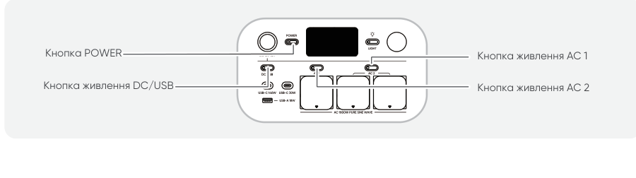

2.3 Після натискання на значок знайденого пристрою додаток автоматично підключить пристрій через Bluetooth.

<table class="manual-callout-table" style="width:100%; border-collapse:collapse; margin:0 0 16px 0;"><tbody><tr><td class="manual-callout-label" style="width:16%; border:1px solid #000; padding:6px 8px; vertical-align:top;">
<strong>ПРИМІТКА</strong>
</td><td class="manual-callout-body" style="border:1px solid #000; padding:6px 8px; vertical-align:top;">
Якщо під час процесу прив'язування з'являється повідомлення "<strong>пристрій уже прив'язано</strong>", для підключення можна скористатися одним із двох способів:

<ul class="simple">
<li>
Власник пристрою поділиться цим пристроєм з іншими користувачами через додаток.
</li>
<li>
Натисніть і утримуйте головну кнопку POWER + кнопку DC / USB протягом 3 секунд, щоб скинути Wi-Fi та Bluetooth пристрою, а потім знову прив'яжіть пристрій.
</li>
</ul>
</td></tr></tbody></table>

2.4 Після успішного підключення пристрою введіть пароль Wi-Fi та натисніть кнопку **ОК**.

<table class="manual-callout-table" style="width:100%; border-collapse:collapse; margin:0 0 16px 0;"><tbody><tr><td class="manual-callout-label" style="width:16%; border:1px solid #000; padding:6px 8px; vertical-align:top;">
<strong>ПРИМІТКА</strong>
</td><td class="manual-callout-body" style="border:1px solid #000; padding:6px 8px; vertical-align:top;"><ul class="simple">
<li>
Будь ласка, вибирайте мережу Wi-Fi у діапазоні 2,4 ГГц. Пристрій не підтримує мережі Wi-Fi у діапазоні 5 ГГц.
</li>
</ul>
</td></tr></tbody></table>

Після успішного додавання пристрою до додатка значок Wi-Fi на пристрої буде постійно увімкнений.

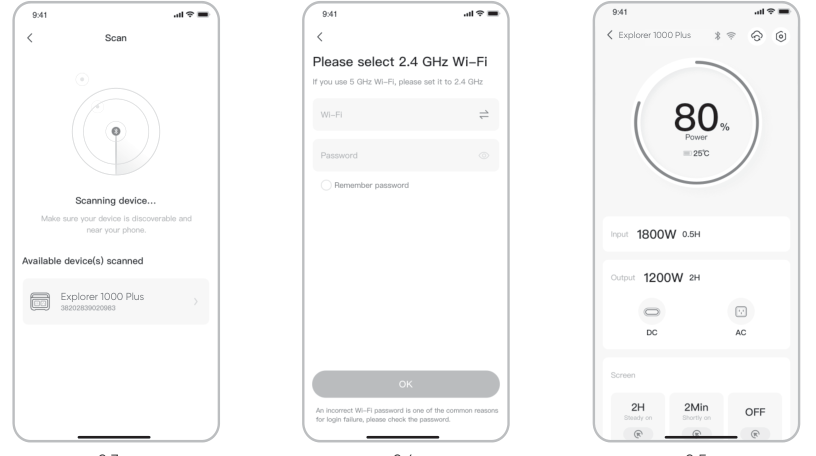

Наведені вище знімки екрана наведено лише для довідки.

<table class="manual-callout-table" style="width:100%; border-collapse:collapse; margin:0 0 16px 0;"><tbody><tr><td class="manual-callout-label" style="width:16%; border:1px solid #000; padding:6px 8px; vertical-align:top;">
<strong>УВАГА</strong>
</td><td class="manual-callout-body" style="border:1px solid #000; padding:6px 8px; vertical-align:top;">
Додаток Jackery може одночасно підключатися лише до однієї електростанції через Bluetooth. Повернення до списку пристроїв автоматично відключає Bluetooth. Щоб знову підключитися автоматично, торкніться електростанції у списку ще раз.
</td></tr></tbody></table>

## 3. Відв\'яжіть пристрій

Торкніться значка **Налаштування** у правому верхньому куті головного інтерфейсу пристрою, щоб перейти на сторінку налаштувань, а потім торкніться кнопки **Відв\'язати** внизу сторінки, щоб відв\'язати пристрій.

## 4. Примітки

### 4.1 Щоб увімкнути Wi-Fi та Bluetooth

- Wi-Fi та Bluetooth автоматично вмикаються після увімкнення пристрою, а значки Wi-Fi та Bluetooth на екрані загоряються.

- Одночасно натисніть і утримуйте кнопку DC / USB + кнопку AC, доки значки Wi-Fi та Bluetooth на екрані не загоряться.

### 4.2 Щоб вимкнути Wi-Fi та Bluetooth

Одночасно натисніть і утримуйте кнопку DC / USB + кнопку AC, доки значки Wi-Fi та Bluetooth на екрані не згаснуть.

### 4.3 Щоб скинути Wi-Fi та Bluetooth

Одночасно натисніть і утримуйте головну кнопку POWER + кнопку DC / USB протягом 3 секунд, щоб скинути Wi-Fi та Bluetooth до заводських налаштувань. Обліковий запис підключеного додатка буде відв\'язано.
