# IMPORTANT SAFETY INFORMATION

INSTRUCTIONS PERTAINING TO RISK OF FIRE, ELECTRIC SHOCK, OR INJURY TO PERSONS

Warning

Always follow these basic precautions when using this product.

- Read all the instructions before using the product.

- Do not allow children to play with the product. Close supervision of children is necessary when the product is used near children.

- Risk of electric shock may occur if using accessories that are not recommended or sold by professional product manufacturers.

- When the product is not in use, unplug the power plug from the product\'s socket.

- Do not dismantle the product, as this may lead to unpredictable risks such as fire, explosion, or electric shock.

- Do not use the product with damaged cords, plugs, or output cables, as this may cause electric shock.

- To ensure proper air circulation, keep the product vents uncovered. The area where the product is used must have adequate airflow in a cool, dry environment to prevent overheating.

  - Charging in damp or poorly ventilated spaces may cause safety hazards.

  - Water can cause short circuits or damage to the charger, leading to safety risks.

- Do not expose the product to fire, high temperatures, direct sunlight, or high-heat environments such as inside a parked vehicle. Such exposure may result in fire or explosion.

## USER MAINTENANCE INSTRUCTIONS

During the lifecycle of energy storage products, a certain degree of capacity and energy degradation is expected. As the number of charge and discharge cycles increases and storage time extends, this degradation will gradually intensify, which is a normal phenomenon consistent with the natural aging of battery cells.

# MEANING OF SYMBOLS

| Signal word | Meaning |
|----|----|
| **WARNING** | Hazardous practices that may result in severe injury, death, and/or property damage. |
| **CAUTION** | Hazardous practices that may result in personal injury and/or property damage. |
| **NOTE** | Hazardous practices that may result in equipment damage, data loss, performance deterioration, or unanticipated results. |
| **TIP** | Supplements the important information or operation tips in the text. |

|  |  |
|----|----|
| Warning and Caution Symbols. Must read to alert individuals to potential hazards or risks. | Do not dismantle the product. |
| Read the user manual before operation. | Keep the product away from fire. |
| This symbol indicates that the product shall not be disposed of as household waste, and should be delivered to a designated collection facility for recycling. Proper disposal and recycling can help protect the environment. For more information about the disposal and recycling of this product, contact your local community, disposal service, or dealer. | Keep away from children. |
|  | This symbol indicates that a lithium-ion (Li-ion) battery is inside the product and should be disposed of or recycled properly. |

# WHAT\'S IN THE BOX

<figure aria-label="WHAT'S IN THE BOX" class="hb-inbox-composition" data-card-count="3" data-component-id="HB-SPECIAL-INBOX" data-inbox-variant="three-card-responsive"><ol class="hb-inbox-grid"><li class="hb-inbox-card" data-item-number="1">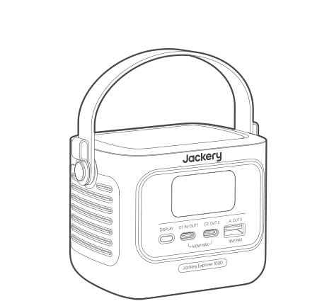

<strong>Jackery Explorer 100D</strong>

</li><li class="hb-inbox-card" data-item-number="2">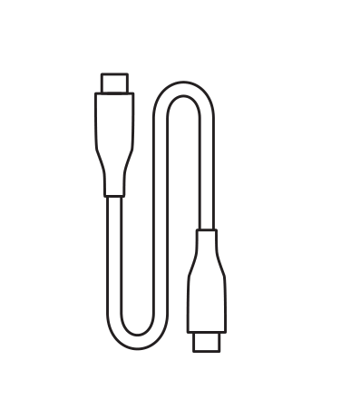

<strong>USB-C Cable</strong>

</li><li class="hb-inbox-card" data-item-number="3">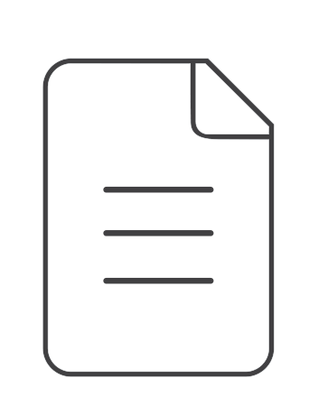

<strong>User Manual</strong>

</li></ol></figure>

# PRODUCT OVERVIEW

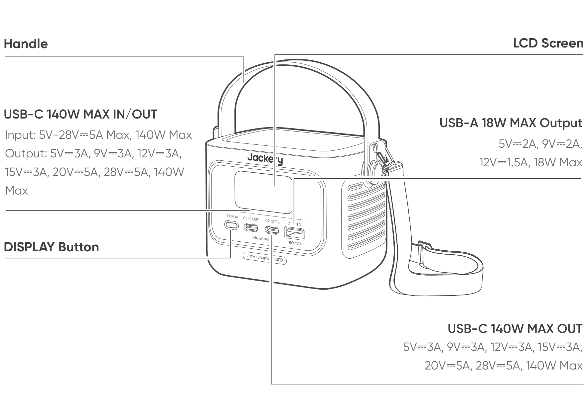

Note

Additional straps can be purchased and attached to the sides of the product.

# LCD DISPLAY

## INTERFACE 1

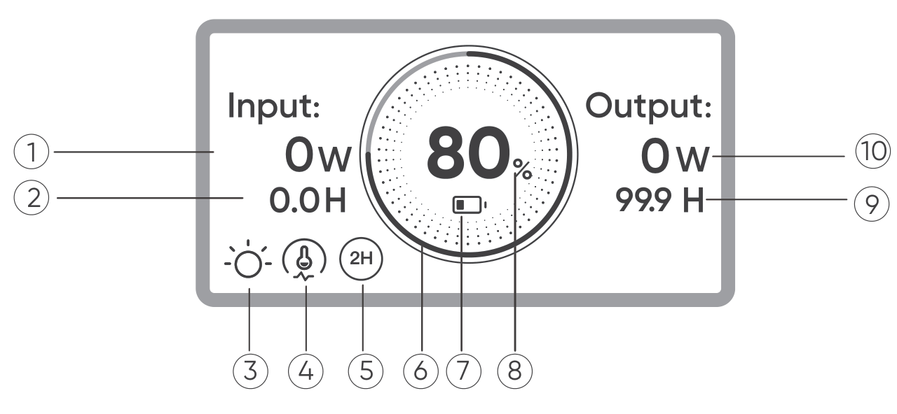

| No. | Indicator | Description |
|----|----|----|
| 1 | Input Power | Displays the input power in watts. |
| 2 | Remaining Charging Time | Displays the remaining charging time. |
| 3 | Steady-on Mode | On: Steady-on Mode is enabled. Off: Steady-on Mode is disabled. |
| 4 | Thermal Power Limiting | On: The battery temperature is high. Discharging Power Limit is enabled. Off: Discharging Power Limit is disabled. |
| 5 | Energy Saving Mode | On: Energy Saving Mode is enabled. Off: Energy Saving Mode is disabled. |
| 6 | Battery Power Indicator | When the product is being charged, the orange circle around the battery percentage will light up in sequence. When charging other devices, the orange circle will stay on. |
| 7 | Battery Power Indicator | On: The battery level is below 20%. Blink: The battery level is below 5%. Off: The battery level is not below 20% or the product is charging. |
| 8 | Remaining Battery Percentage | Displays the remaining battery percentage. |
| 9 | Remaining Discharge Time | Displays the remaining discharging time. |
| 10 | Output Power | Displays the output power in watts. |
|  | Fault code | Remove the load or unplug the charging plug. If the problem cannot be resolved, please contact the Jackery Customer Support. |
|  | High Temperature Indicator | High temperature protection is triggered. The product may stop functioning until its temperature returns to the normal operating range. |
|  | Low Temperature Indicator | Low temperature protection is triggered. The product may stop functioning until its temperature returns to the normal operating range. |

## INTERFACE 2

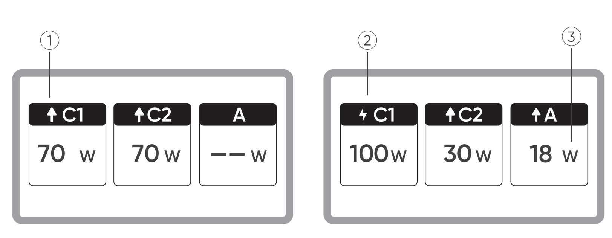

| No. | Indicator | Description |
|----|----|----|
| 1 | Discharging Indicator | This USB port is discharging. |
| 2 | Charging Indicator | This USB port is charging. |
| 3 | Charging or Discharging Power | Displays charging or discharging power of the corresponding port. |

## INTERFACE 3

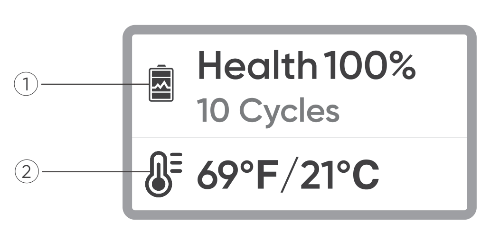

| No. | Indicator | Description |
|----|----|----|
| 1 | Battery Health and Cycle Count | Displays the current battery health percentage and the number of charge/discharge cycles. Green: Battery health is high. Yellow: Battery health is moderate. Red: Battery health is low. |
| 2 | Battery Temperature | Displays the current battery temperature. |

# OPERATIONS

## OUTPUT ON/OFF

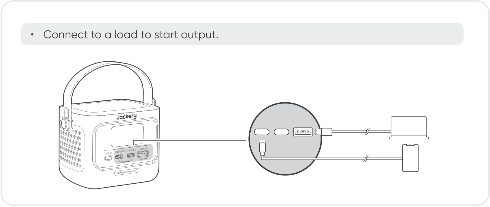

Caution!

- USB-C 140W MAX is a USB-PD Power Source 3 (PS3) high-power output port. If the connected user device or accessory does not meet safety requirements, there may be a fire risk. Before using these ports, ensure that the connected device or accessory has fire safety protection.

- Only connect the 100D to devices or accessories that comply with clauses 6.3, 6.4, and 6.5 of IEC/EN/UL 62368-1 (or other equivalent standards).

- To obtain maximum output power, use the USB-C to USB-C 5A cable (20V DC/5A, 100W; 28V DC/5A, 140W).

## ENERGY SAVING MODE

The Energy Saving Mode is disabled by default. To prevent unnecessary battery drain caused by forgetting to turn off the output, press and hold the DISPLAY button to enable Energy Saving Mode.

If no device is connected or the connected device\'s power consumption is below 2W for 2 hours, the product automatically turns off the outputs. When the output is on, the icon \"2H\" will appear on the screen.

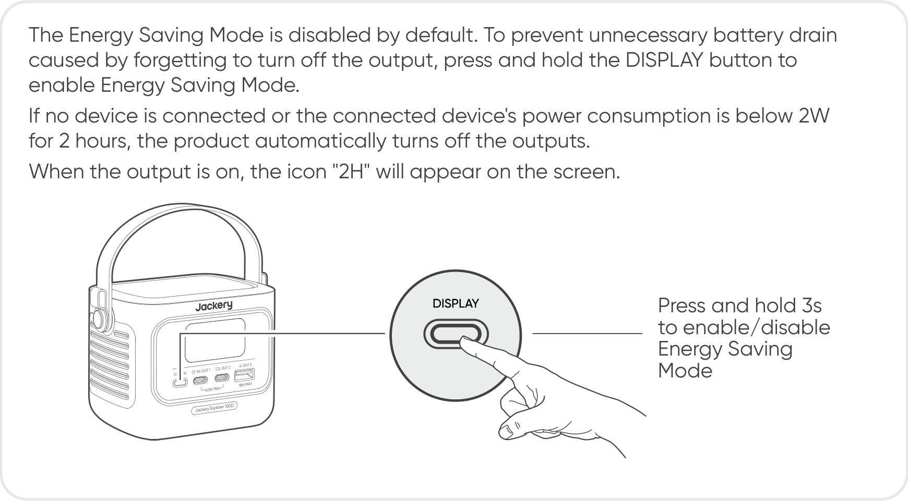

Note

Energy Saving Mode resumes its previous state after powering on. Manual switching is required for mode changes.

## LCD SCREEN

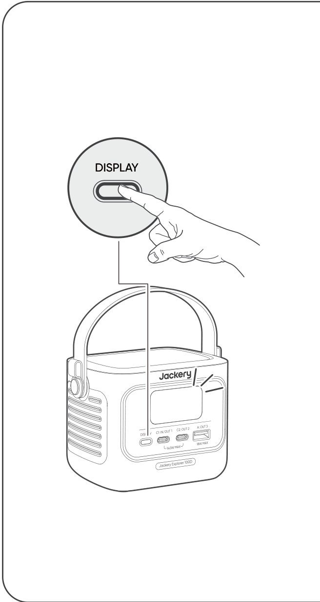

| Function | Description |
|----|----|
| Screen Wake-Up | Lights up when the DISPLAY button is briefly pressed, or automatically during charging or discharging. |
| Screen Always On | While the screen is lit, double-press the DISPLAY button. |
| Screen Switching | After the screen lights up, briefly press the DISPLAY button to switch pages. |
| Turn Off Screen Always-On | Double-press the DISPLAY button again. |
| Auto Screen Off | 10 seconds after lighting up with no operation, or 2 hours after entering always-on mode. |

# CHARGING

Fully charge the product before its first use.

Caution!

- The recommended charging temperature for the product ranges from 0°C to 45°C, and the discharging temperature ranges from -20°C to 45°C. Operating the product beyond this temperature range may restrict its charging and discharging capabilities, or even prevent it from charging or discharging.

- The charging power and battery capacity of the product may vary due to temperature fluctuations.

## CHARGING VIA AC CHARGING CABLE

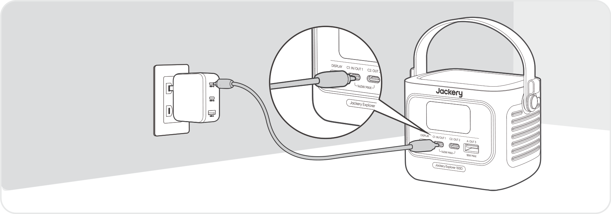

Caution!

- Please purchase AC charging cable separately.

- Make sure the AC charging cable is fully and securely plugged into the AC input port. An incomplete connection may cause unstable current, overheating, poor contact, or device malfunction.

## CHARGING VIA SOLAR PANELS (SOLD SEPARATELY)

This product supports a maximum solar charging power of 100W and can be used with the Jackery SolarSaga series solar panels.

Charged by 40W or 100W solar panel:

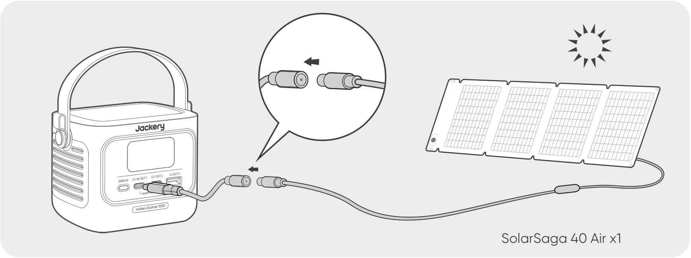

The DC8020 to USB-C cable is sold separately.

It is recommended to use the Jackery solar panel to charge the product. Ensure that the open-circuit voltage (Voc) of the solar panel is within the DC input range (10V-30V) of the 100D. Jackery is not responsible for any damage or loss resulting from the use of third-party solar panels.

## CHARGING VIA A CAR CHARGER (SOLD SEPARATELY)

This product can be charged using 12V and 24V car chargers. Ensure that the car charger and the car power outlet (car cigarette lighter) provide a good connection.

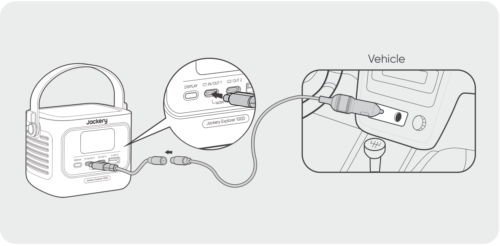

The car charging cable and DC8020 to USB-C cable are sold separately.

Caution!

- Please start the vehicle before charging your power station.

- If the vehicle is running on bumpy roads, it is forbidden to use the car charger in case it causes non-standard operation. The Company will not be responsible for any loss caused by non-standard operation.

# STORAGE

Store the product in a dry, clean place with proper ventilation. Storage temperature and humidity:

- Storage temperature: -20°C to 60°C

- Storage humidity: 5-95% RH

If this product is stored for a long period of time (3 months - 6 months) with the power depleted, it may become unchargeable. To prevent this and maintain battery health, it is recommended to check and recharge the product every three months and perform a full charge and discharge cycle at least once every 6 to 12 months.

# SPECIFICATIONS

## GENERAL INFO

|                |                                               |
|----------------|-----------------------------------------------|
| Product Name   | Jackery Explorer 100D                         |
| Model No.      | JE-100C                                       |
| Capacity       | 96Wh (5Ah/19.2V DC)                           |
| Cell Chemistry | LiFePO4                                       |
| Weight         | 855 g ± 10 g                                  |
| Dimensions     | (118.7 ± 1) × (82.6 ± 0.5) × (85.68 ± 0.8) mm |

## INPUT PORTS

<table>
<colgroup>
<col style="width: 34%" />
<col style="width: 66%" />
</colgroup>
<tbody>
<tr>
<td>
1 × USB-C 140W MAX IN/OUT
</td>
<td>
Charger: 5V⎓3A, 9V⎓3A, 12V⎓3A, 15V⎓3A, 20V⎓5A, 28V⎓5A, 140W Max

Vehicle: 12V⎓5A Max, 24V⎓5A Max

PV: 10V-30V, 100W Max
</td>
</tr>
</tbody>
</table>

## OUTPUT PORTS

|                    |                                                        |
|--------------------|--------------------------------------------------------|
| 1 × USB-A 18W MAX  | 5V⎓2A, 9V⎓2A, 12V⎓1.5A, 18W Max                        |
| 2 × USB-C 140W MAX | 5V⎓3A, 9V⎓3A, 12V⎓3A, 15V⎓3A, 20V⎓5A, 28V⎓5A, 140W Max |

## TOTAL OUTPUT

|                       |                       |
|-----------------------|-----------------------|
| USB-C + USB-C         | (70W + 70W) Max       |
| USB-C + USB-A         | (140W + 18W) Max      |
| USB-C + USB-C + USB-A | (70W + 70W + 18W) Max |

## ENVIRONMENTAL OPERATING TEMPERATURE

|                       |               |
|-----------------------|---------------|
| Charge Temperature    | 0°C to 45°C   |
| Discharge Temperature | -20°C to 45°C |

※ USB Type-C® and USB-C® are registered trademarks of USB Implementers Forum.

# WARRANTY

Contact Us

For any inquiries or comments concerning our products, please send an email to <a href="mailto:hello.eu@jackery.com" class="reference external">hello.eu@jackery.com</a>, and we will respond to you as soon as possible. If there is any quality-related issue with the product, you may request a replacement or refund by submitting a request form at www.jackery.com.

Customer Service

**2-year limited warranty**

<a href="mailto:hello.eu@jackery.com" class="reference external">hello.eu@jackery.com</a>

Lifetime technical support
