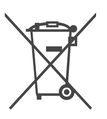
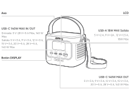
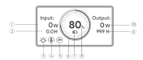
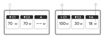
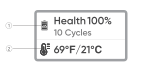
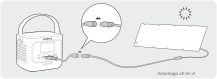
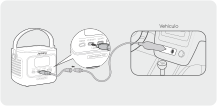

# INFORMACIÓN IMPORTANTE DE SEGURIDAD

<strong>INSTRUCCIONES RELATIVAS AL RIESGO DE INCENDIO, DESCARGA ELÉCTRICA O LESIONES PERSONALES</strong>

<table class="manual-callout-table" data-callout-variant="warning" lang="es" style="width:100%; border-collapse:collapse; margin:0 0 16px 0;"><tbody><tr><td class="manual-callout-label" style="width:16%; border:1px solid #000; padding:6px 8px; vertical-align:top;">
<strong>ADVERTENCIA</strong>
ADVERTENCIAPRECAUCIÓNNOTA</td><td class="manual-callout-body" style="border:1px solid #000; padding:6px 8px; vertical-align:top;">
<strong>Sigue siempre estas precauciones básicas al usar este producto.</strong>

</td></tr></tbody></table>

- Lee todas las instrucciones antes de usar el producto.

- Para reducir el riesgo de lesiones, se requiere la supervisión estrecha cuando el producto se use cerca de niños.

- No metas los dedos ni las manos en el producto.

- No expongas la batería externa a la lluvia ni a la nieve.

- No expongas la batería externa al calor ni al fuego. No la guardes bajo la luz solar directa ni dentro de un vehículo.

- El uso de una fuente de alimentación o de un cargador no recomendado o no vendido por el fabricante de la batería externa puede provocar un riesgo de incendio o de lesiones a personas.

- No uses la batería externa por encima de su potencia de salida nominal. La sobrecarga de las salidas por encima del valor nominal puede provocar un riesgo de incendio o de lesiones a personas.

- No uses una batería externa dañada o modificada. Las baterías dañadas o modificadas pueden presentar un comportamiento impredecible, provocando incendio, explosión o riesgo de lesiones.

- No desmontes la batería externa. Llévala a un técnico cualificado cuando requiera mantenimiento o reparación. Un montaje incorrecto puede provocar un riesgo de incendio o de lesiones a personas.

- No expongas la batería externa al fuego o a temperaturas extremas. La exposición al fuego o a temperaturas superiores a 60 °C puede provocar una explosión.

- El mantenimiento debe ser realizado por un técnico de servicio o reparación cualificado utilizando únicamente piezas de repuesto idénticas. Esto garantizará que se mantenga la seguridad del producto.

- Apaga la batería externa cuando no esté en uso.

GUARDE ESTAS INSTRUCCIONES

<table class="manual-callout-table" data-callout-variant="caution" lang="es" style="width:100%; border-collapse:collapse; margin:0 0 16px 0;"><tbody><tr><td class="manual-callout-label" style="width:16%; border:1px solid #000; padding:6px 8px; vertical-align:top;">
<strong>PRECAUCIÓN</strong>
ADVERTENCIAPRECAUCIÓNNOTA</td><td class="manual-callout-body" style="border:1px solid #000; padding:6px 8px; vertical-align:top;">
Riesgo de incendio y quemaduras. No abrir, aplastar, calentar por encima de 60 °C ni incinerar. Siga las instrucciones del fabricante.

</td></tr></tbody></table>

La eliminación de una batería en el fuego o en un horno caliente, o el aplastamiento o corte mecánico de una batería, que puede provocar una explosión; dejar una batería en un entorno con temperatura extremadamente alta que puede provocar una explosión o la fuga de líquido o gas inflamable; y una batería sometida a una presión de aire extremadamente baja que puede provocar una explosión o la fuga de líquido o gas inflamable.

# INSTRUCCIONES DE MANTENIMIENTO PARA EL USUARIO

Durante el ciclo de vida de los productos de almacenamiento de energía, se producirá cierto grado de degradación de capacidad y energía. A medida que aumenta el número de ciclos de carga y descarga y se extiende el tiempo de almacenamiento, esta degradación se intensificará gradualmente, lo cual es un fenómeno normal acorde con el envejecimiento natural de las celdas de la batería.

# SIGNIFICADO DE LOS SÍMBOLOS

<figure aria-label="SIGNIFICADO DE LOS SÍMBOLOS" class="hb-symbol-signal-composition" data-component-id="HB-TABLE-SYMBOL-SIGNAL"><table class="hb-symbol-signal-table"><colgroup><col class="hb-symbol-signal-col-label"/><col class="hb-symbol-signal-col-meaning"/></colgroup><thead><tr><th class="hb-symbol-signal-label-heading" scope="col">
Símbolo
</th><th class="hb-symbol-signal-meaning-heading" scope="col">
Significados
</th></tr></thead><tbody><tr><td class="hb-symbol-signal-label-cell">⚠ADVERTENCIA</td><td class="hb-symbol-signal-meaning-cell">
Prácticas peligrosas que pueden resultar en lesiones graves, muerte y/o daños a la propiedad.
</td></tr><tr><td class="hb-symbol-signal-label-cell">⚠PRECAUCIÓN</td><td class="hb-symbol-signal-meaning-cell">
Prácticas peligrosas que pueden resultar en lesiones personales y/o daños a la propiedad.
</td></tr><tr><td class="hb-symbol-signal-label-cell">NOTA</td><td class="hb-symbol-signal-meaning-cell">
Prácticas peligrosas que pueden resultar en daño al equipo, pérdida de datos, deterioro del rendimiento o resultados inesperados.
</td></tr><tr><td class="hb-symbol-signal-label-cell">CONSEJOS</td><td class="hb-symbol-signal-meaning-cell">
Complementa la información importante o consejos de operación en el texto.
</td></tr></tbody></table></figure>

<figure aria-label="Símbolo / Significados" class="hb-symbol-pair-composition" data-component-id="HB-TABLE-SYMBOL-ICON">

<table class="hb-symbol-panel-table"><colgroup><col class="hb-symbol-col-icon"/><col class="hb-symbol-col-meaning"/></colgroup><thead><tr><th class="hb-symbol-icon-heading" scope="col">
Símbolo
</th><th class="hb-symbol-meaning-heading" scope="col">
Significados
</th></tr></thead><tbody><tr><td class="hb-symbol-icon"></td><td class="hb-symbol-meaning">
Precaución! El incumplimiento de los mensajes de advertencia puede provocar lesiones.
</td></tr><tr><td class="hb-symbol-icon"></td><td class="hb-symbol-meaning">
Lea el manual del operador
</td></tr><tr><td class="hb-symbol-icon"></td><td class="hb-symbol-meaning">
Este símbolo indica que el producto no debe desecharse con los residuos domésticos. En su lugar, debe llevarse a un punto de recogida designado para su correcto reciclaje. El desecho y reciclaje adecuados ayudan a proteger el medioambiente. Para más información, póngase en contacto con su autoridad local, el servicio de gestión de residuos o el distribuidor del producto.
</td></tr><tr><td class="hb-symbol-icon"></td><td class="hb-symbol-meaning">
Las baterías y acumuladores no deben desecharse junto con los residuos domésticos. Como consumidor, usted está obligado por ley a desechar todas las baterías y acumuladores en los puntos de recolección designados, independientemente de si contienen sustancias peligrosas. Devuelva las baterías y acumuladores usados a un punto de recolección local, un centro de reciclaje o al minorista donde los compró. La eliminación adecuada garantiza un reciclaje responsable con el medio ambiente y evita posibles daños a la salud humana y al medio ambiente.
</td></tr></tbody></table>

<table class="hb-symbol-panel-table"><colgroup><col class="hb-symbol-col-icon"/><col class="hb-symbol-col-meaning"/></colgroup><thead><tr><th class="hb-symbol-icon-heading" scope="col">
Símbolo
</th><th class="hb-symbol-meaning-heading" scope="col">
Significados
</th></tr></thead><tbody><tr><td class="hb-symbol-icon"></td><td class="hb-symbol-meaning">
No desarme el producto.
</td></tr><tr><td class="hb-symbol-icon"></td><td class="hb-symbol-meaning">
No fumar ni hacer llamas abiertas
</td></tr><tr><td class="hb-symbol-icon"></td><td class="hb-symbol-meaning">
Les enfants ne sont pas admis.
</td></tr><tr><td class="hb-symbol-icon"></td><td class="hb-symbol-meaning">
Este símbolo indica que el producto contiene una batería de iones de litio (Li-ion), la cual debe desecharse o reciclarse de forma adecuada.
</td></tr></tbody></table>

</figure>

# CONTENIDO DE LA CAJA

<figure aria-label="CONTENIDO DE LA CAJA" class="hb-inbox-composition" data-card-count="3" data-component-id="HB-SPECIAL-INBOX" data-inbox-variant="three-card-responsive"><ol class="hb-inbox-grid"><li class="hb-inbox-card" data-item-number="1">

<strong>Jackery Explorer 100D</strong>

</li><li class="hb-inbox-card" data-item-number="2">

<strong>Cable USB-C</strong>

</li><li class="hb-inbox-card" data-item-number="3">

<strong>Manual del usuario</strong>

</li></ol></figure>

# DESCRIPCIÓN GENERAL DEL PRODUCTO

<figure>

</figure>

<strong>Se pueden comprar correas adicionales y fijarlas a los lados del producto.</strong>

# PANTALLA LCD

## INTERFAZ 1

<figure aria-label="LCD icon meanings" class="hb-lcd-table-composition" data-component-id="HB-TABLE-LCD-ICON" tabindex="0"><table class="hb-lcd-icon-table"><colgroup><col class="hb-lcd-col-number"/><col class="hb-lcd-col-icon"/><col class="hb-lcd-col-name"/><col class="hb-lcd-col-description"/></colgroup><tbody><tr><td class="hb-lcd-number">
1
</td><td class="hb-lcd-icon"></td><td class="hb-lcd-name">
Potencia de Entrada
</td><td class="hb-lcd-description">
Muestra la potencia de entrada en vatios.
</td></tr><tr><td class="hb-lcd-number">
2
</td><td class="hb-lcd-icon"></td><td class="hb-lcd-name">
Tiempo de Carga Restante
</td><td class="hb-lcd-description">
Muestra el tiempo de carga restante.
</td></tr><tr><td class="hb-lcd-number">
3
</td><td class="hb-lcd-icon"></td><td class="hb-lcd-name">
Modo de encendido continuo
</td><td class="hb-lcd-description">
Encendido: el modo de encendido continuo está habilitado.

Apagado: el modo de encendido continuo está deshabilitado.
</td></tr><tr><td class="hb-lcd-number">
4
</td><td class="hb-lcd-icon"></td><td class="hb-lcd-name">
Limitación térmica de potencia
</td><td class="hb-lcd-description">
Encendido: la temperatura de la batería es alta. El límite de potencia de descarga está habilitado.

Apagado: El límite de potencia de descarga está deshabilitado.
</td></tr><tr><td class="hb-lcd-number">
5
</td><td class="hb-lcd-icon"></td><td class="hb-lcd-name">
Modo de Ahorro de Energía
</td><td class="hb-lcd-description">
Encendido: Modo de ahorro de energía activado.

Apagado: Modo de ahorro de energía desactivado.
</td></tr><tr><td class="hb-lcd-number">
6
</td><td class="hb-lcd-icon"></td><td class="hb-lcd-name">
Indicador de Potencia de la Batería
</td><td class="hb-lcd-description">
Cuando el producto se está cargando, el círculo naranja alrededor del porcentaje de batería se ilumina secuencialmente. Cuando está cargando otros dispositivos, el círculo naranja permanece encendido.
</td></tr><tr><td class="hb-lcd-number">
7
</td><td class="hb-lcd-icon"></td><td class="hb-lcd-name">
Indicador de Batería Baja
</td><td class="hb-lcd-description">
Encendido: el nivel de la batería está por debajo del 20 %.

Parpadeo: el nivel de la batería está por debajo del 5 %.

Apagado: el nivel de la batería no está por debajo del 20 % o el producto se está cargando.
</td></tr><tr><td class="hb-lcd-number">
8
</td><td class="hb-lcd-icon"></td><td class="hb-lcd-name">
Porcentaje de Batería Restante
</td><td class="hb-lcd-description">
Muestra el porcentaje de batería restante.
</td></tr><tr><td class="hb-lcd-number">
9
</td><td class="hb-lcd-icon"></td><td class="hb-lcd-name">
Tiempo de Descarga Restante
</td><td class="hb-lcd-description">
Muestra el tiempo de descarga restante.
</td></tr><tr><td class="hb-lcd-number">
10
</td><td class="hb-lcd-icon"></td><td class="hb-lcd-name">
Potencia de Salida
</td><td class="hb-lcd-description">
Muestra la potencia de salida en vatios.
</td></tr></tbody></table></figure>

<figure aria-label="LCD icon meanings" class="hb-lcd-table-composition" data-component-id="HB-TABLE-LCD-ICON" tabindex="0"><table class="hb-lcd-icon-table"><colgroup><col class="hb-lcd-col-icon"/><col class="hb-lcd-col-name"/><col class="hb-lcd-col-description"/></colgroup><tbody><tr><td class="hb-lcd-icon"></td><td class="hb-lcd-name">
Código de fallo
</td><td class="hb-lcd-description">
Retire la carga o desconecte el enchufe de carga. Si el problema no se puede resolver, comuníquese con atención al cliente de Jackery.
</td></tr><tr><td class="hb-lcd-icon"></td><td class="hb-lcd-name">
Indicador de Alta Temperatura
</td><td class="hb-lcd-description">
Se activó la protección por alta temperatura. El producto puede dejar de funcionar hasta que su temperatura vuelva al rango normal de operación.
</td></tr><tr><td class="hb-lcd-icon"></td><td class="hb-lcd-name">
Indicador de Baja Temperatura
</td><td class="hb-lcd-description">
Se activó la protección por baja temperatura. El producto puede dejar de funcionar hasta que su temperatura vuelva al rango normal de operación.
</td></tr></tbody></table></figure>

## INTERFAZ 2

<figure aria-label="LCD icon meanings" class="hb-lcd-table-composition" data-component-id="HB-TABLE-LCD-ICON" tabindex="0"><table class="hb-lcd-icon-table"><colgroup><col class="hb-lcd-col-number"/><col class="hb-lcd-col-icon"/><col class="hb-lcd-col-name"/><col class="hb-lcd-col-description"/></colgroup><tbody><tr><td class="hb-lcd-number">
1
</td><td class="hb-lcd-icon"></td><td class="hb-lcd-name">
Indicador de descarga
</td><td class="hb-lcd-description">
Este puerto USB está descargando.
</td></tr><tr><td class="hb-lcd-number">
2
</td><td class="hb-lcd-icon"></td><td class="hb-lcd-name">
Indicador de carga
</td><td class="hb-lcd-description">
Este puerto USB está cargando.
</td></tr><tr><td class="hb-lcd-number">
3
</td><td class="hb-lcd-icon"></td><td class="hb-lcd-name">
Potencia de carga o descarga
</td><td class="hb-lcd-description">
Muestra la potencia de carga o descarga del puerto correspondiente.
</td></tr></tbody></table></figure>

## INTERFAZ 3

<figure aria-label="LCD icon meanings" class="hb-lcd-table-composition" data-component-id="HB-TABLE-LCD-ICON" tabindex="0"><table class="hb-lcd-icon-table"><colgroup><col class="hb-lcd-col-number"/><col class="hb-lcd-col-icon"/><col class="hb-lcd-col-name"/><col class="hb-lcd-col-description"/></colgroup><tbody><tr><td class="hb-lcd-number">
1
</td><td class="hb-lcd-icon"></td><td class="hb-lcd-name">
Estado de la batería y número de ciclos
</td><td class="hb-lcd-description">
Muestra el porcentaje actual del estado de la batería y el número de ciclos de carga/descar- ga.

<ul class="simple">
<li>
Verde: el estado de la batería es bueno.
</li>
<li>
Amarillo: el estado de la batería es moderado.
</li>
<li>
Rojo: el estado de la batería es malo.
</li>
</ul></td></tr><tr><td class="hb-lcd-number">
2
</td><td class="hb-lcd-icon"></td><td class="hb-lcd-name">
Temperatura de la batería
</td><td class="hb-lcd-description">
Muestra la temperatura actual de la batería.
</td></tr></tbody></table></figure>

# OPERACIONES

## SALIDA ENCENDIDO/APAGADO

Conecte una carga para iniciar la salida.

<table class="manual-callout-table" data-callout-variant="caution" lang="es" style="width:100%; border-collapse:collapse; margin:0 0 16px 0;"><tbody><tr><td class="manual-callout-label" style="width:16%; border:1px solid #000; padding:6px 8px; vertical-align:top;">
<strong>PRECAUCIÓN</strong>
ADVERTENCIAPRECAUCIÓNNOTA</td><td class="manual-callout-body" style="border:1px solid #000; padding:6px 8px; vertical-align:top;"><ul class="simple">
<li>
El USB-C 140W MAX es el puerto de salida de alta potencia fuente de alimentación 3 (PS3) del USB-PD. Si el dispositivo del usuario o accesorio conectado no cumple con los requisitos de seguridad, puede existir riesgo de incendio. Antes de usar estos puertos, asegúrese de que el dispositivo o accesorio conectado tenga protección contra incendios.
</li>
<li>
Solo conecte el Jackery Explorer 100D a dispositivos o accesorios que cumplan con las cláusulas 6.3, 6.4 y 6.5 de IEC/EN/UL 62368-1 (u otros estándares equivalentes).
</li>
<li>
Para obtener la potencia máxima de salida, utilice el cable USB-C a USB-C de 5 A (20 V CC/5 A, 100W; 28 V CC/5 A, 140 W).
</li>
</ul>
</td></tr></tbody></table>

## MODO DE AHORRO DE ENERGÍA

El modo de ahorro de energía está deshabilitado de forma predeterminada. Para evitar el consumo innecesario de batería causado por olvidar apagar la salida, mantenga presionado el botón DISPLAY para habilitar el modo de ahorro de energía. Si no hay ningún dispositivo conectado o el consumo de energía del dispositivo conectado es inferior a 2 W durante 2 horas, el producto apaga automáticamente las salidas. Cuando la salida está encendida, el icono "2H" aparecerá en la pantalla.

Mantenga presionado durante 3 s para habilitar/deshabilitar el modo de ahorro de energía

<table class="manual-callout-table" data-callout-variant="note" lang="es" style="width:100%; border-collapse:collapse; margin:0 0 16px 0;"><tbody><tr><td class="manual-callout-label" style="width:16%; border:1px solid #000; padding:6px 8px; vertical-align:top;">
<strong>NOTA</strong>
ADVERTENCIAPRECAUCIÓNNOTA</td><td class="manual-callout-body" style="border:1px solid #000; padding:6px 8px; vertical-align:top;">
El modo de ahorro de energía reanuda el estado anterior después de encender. Se requiere un cambio manual para modificar el modo.

</td></tr></tbody></table>

## PANTALLA LCD

<figure aria-label="PANTALLA LCD" class="hb-reference-composition hb-reference-lcd-actions-compact" data-component-id="HB-TABLE-REFERENCE" data-component-variant="lcd-actions-compact" tabindex="0"><table class="hb-reference-table"><thead><tr><th scope="col">
Función
</th><th scope="col">
Descripción
</th></tr></thead><tbody><tr><td>
Activación de pantalla
</td><td>
Se enciende al pulsar brevemente el botón DISPLAY, o automática- mente durante la carga o la descarga.
</td></tr><tr><td>
Pantalla siempre encendida
</td><td>
Con la pantalla encendida, pulse dos veces el botón DISPLAY.
</td></tr><tr><td>
Cambio de pantalla
</td><td>
Una vez encendida la pantalla, pulse brevemente el botón DISPLAY para cambiar de página.
</td></tr><tr><td>
Desactivar pantalla siempre encendida
</td><td>
Pulse de nuevo dos veces el botón DISPLAY.
</td></tr><tr><td>
Apagado automático de pantalla
</td><td>
10 segundos después de encenderse sin ninguna operación, o 2 horas después de entrar en el modo siempre encendido.
</td></tr></tbody></table></figure>

# CARGANDO

Carga completamente el producto antes de usarlo por primera vez.

<table class="manual-callout-table" data-callout-variant="note" lang="es" style="width:100%; border-collapse:collapse; margin:0 0 16px 0;"><tbody><tr><td class="manual-callout-label" style="width:16%; border:1px solid #000; padding:6px 8px; vertical-align:top;">
<strong>NOTA</strong>
ADVERTENCIAPRECAUCIÓNNOTA</td><td class="manual-callout-body" style="border:1px solid #000; padding:6px 8px; vertical-align:top;"><ul class="simple">
<li>
La temperatura de carga recomendada para el producto está entre 0°C a 45 °C, y la temperatura de descarga está entre -20 °C a 45 °C. Operar el producto fuera de este rango de temperatura puede limitar sus capacidades de carga y descarga, e incluso impedir la carga o descarga.
</li>
<li>
La potencia de carga y la capacidad de la batería del producto pueden variar debido a fluctuaciones de temperatura.
</li>
</ul>
</td></tr></tbody></table>

## CARGA MEDIANTE UN CARGADOR USB-C

<strong>Cargador USB-C vendido por separado.</strong>

## CARGA MEDIANTE PANELES SOLARES (SE VENDE POR SEPARADO)

Este producto admite una potencia máxima de carga solar de 100 W y puede utilizarse con los paneles solares de la serie Jackery SolarSaga.

Cargado por un panel solar de 40 W o 100 W:

<strong>El cable DC8020 a USB-C se vende por separado.</strong>

Se recomienda usar el panel solar Jackery para cargar el Jackery Explorer 100D. Asegúrese de que el voltaje en circuito abiert (Voc) del panel solar esté dentro del rango de entrada CC (10 V-30 V) del Jackery Explorer 100D. Jackery no se hace responsable de pérdidas causadas por el uso de paneles solares de otras marcas.

## CARGA CON UN CARGADOR DE COCHE (SE VENDE POR SEPARADO)

Este producto se puede cargar utilizando cargadores de automóvil de 12 V y 24 V. Asegúrese de que el cargador de coche y el encendedor de coche ofrecen una buena conexión.

<strong>El cable de carga para automóvil y el cable DC8020 a USB-C se venden por separado.</strong>

<table class="manual-callout-table" data-callout-variant="caution" lang="es" style="width:100%; border-collapse:collapse; margin:0 0 16px 0;"><tbody><tr><td class="manual-callout-label" style="width:16%; border:1px solid #000; padding:6px 8px; vertical-align:top;">
<strong>PRECAUCIÓN</strong>
ADVERTENCIAPRECAUCIÓNNOTA</td><td class="manual-callout-body" style="border:1px solid #000; padding:6px 8px; vertical-align:top;"><ul class="simple">
<li>
Por favor, encienda el vehículo antes de cargar su batería externa.
</li>
<li>
Si el vehículo circula por caminos accidentados, está prohibido usar el cargador de coche para evitar que se queme debido a una mala conexión. La empresa no se responsabiliza por pérdidas causadas por un uso incorrecto.
</li>
</ul>
</td></tr></tbody></table>

# ALMACENAMIENTO

Almacene el producto en un lugar seco y limpio con ventilación adecuada. Temperatura y humedad de almacenamiento:

- Temperatura de almacenamiento: -20°C a 60°C

- Humedad de almacenamiento: 5-95% RH

Si este producto se almacena durante un período prolongado (de 3 a 6 meses) con la batería descargada, podría volverse imposible recargarlo. Para evitar esto y mantener la salud de la batería, se recomienda revisar y recargar el producto cada tres meses, y realizar un ciclo completo de carga y descarga al menos una vez cada 6 a 12 meses.

# ESPECIFICACIONES

## INFORMACIÓN GENERAL

<figure aria-label="INFORMACIÓN GENERAL" class="hb-spec-table-composition"><table class="hb-source-specification hb-spec-table manual-table manual-spec-table"><colgroup><col class="hb-spec-col-label"/><col class="hb-spec-col-value"/></colgroup>
<tbody>
<tr><th class="manual-spec-label hb-spec-label" scope="row">
Nombre del producto
</th>
<td class="manual-spec-value hb-spec-value">
Jackery Explorer 100D
</td>
</tr>
<tr><th class="manual-spec-label hb-spec-label" scope="row">
N° de modelo
</th>
<td class="manual-spec-value hb-spec-value">
JE-100C
</td>
</tr>
<tr><th class="manual-spec-label hb-spec-label" scope="row">
Capacidad
</th>
<td class="manual-spec-value hb-spec-value">
96 Wh (5 Ah/19,2 V DC)
</td>
</tr>
<tr><th class="manual-spec-label hb-spec-label" scope="row">
Química Celular
</th>
<td class="manual-spec-value hb-spec-value">
Li-ion LFP
</td>
</tr>
<tr><th class="manual-spec-label hb-spec-label" scope="row">
Peso
</th>
<td class="manual-spec-value hb-spec-value">
855 g ± 10 g
</td>
</tr>
<tr><th class="manual-spec-label hb-spec-label" scope="row">
Dimensiones
</th>
<td class="manual-spec-value hb-spec-value">
(118,7 ± 1) × (82,6 ± 0,5) × (85,68 ± 0,8) mm
</td>
</tr>
<tr><th class="manual-spec-label hb-spec-label" scope="row">
Ciclo de vida
</th>
<td class="manual-spec-value hb-spec-value">
3000 ciclos de carga hasta 80%+de capacidad
</td>
</tr>
</tbody>
</table></figure>

## PUERTOS DE ENTRADA

<figure aria-label="PUERTOS DE ENTRADA" class="hb-spec-table-composition"><table class="hb-source-specification hb-spec-table manual-table manual-spec-table"><colgroup><col class="hb-spec-col-label"/><col class="hb-spec-col-value"/></colgroup>
<tbody>
<tr><th class="manual-spec-label hb-spec-label" scope="row">
USB-C1
</th>
<td class="manual-spec-value hb-spec-value">
5 V⎓3 A, 9 V⎓3 A, 12 V⎓3 A, 15 V⎓3 A, 20 V⎓5 A, 28 V⎓5 A, 140 W Máx

Auto: 12 V⎓5 A Máx, 24 V⎓5 A Máx

PV: 10 V-30 V⎓, 5 A Máx, 100 W Máx

</td>
</tr>
</tbody>
</table></figure>

## PUERTOS DE SALIDA

<figure aria-label="PUERTOS DE SALIDA" class="hb-spec-table-composition"><table class="hb-source-specification hb-spec-table manual-table manual-spec-table"><colgroup><col class="hb-spec-col-label"/><col class="hb-spec-col-value"/></colgroup>
<tbody>
<tr><th class="manual-spec-label hb-spec-label" scope="row">
USB-A
</th>
<td class="manual-spec-value hb-spec-value">
5 V⎓2 A, 9 V⎓2 A, 12 V⎓1,5 A, 18 W Máx
</td>
</tr>
<tr><th class="manual-spec-label hb-spec-label" scope="row">
USB-C1 / USB-C2
</th>
<td class="manual-spec-value hb-spec-value">
5 V⎓3 A, 9 V⎓3 A, 12 V⎓3 A, 15 V⎓3 A, 20 V⎓5 A, 28 V⎓5 A, 140 W Máx
</td>
</tr>
</tbody>
</table></figure>

## SALIDA TOTAL

<figure aria-label="SALIDA TOTAL" class="hb-spec-table-composition"><table class="hb-source-specification hb-spec-table manual-table manual-spec-table"><colgroup><col class="hb-spec-col-label"/><col class="hb-spec-col-value"/></colgroup>
<tbody>
<tr><th class="manual-spec-label hb-spec-label" scope="row">
USB-C1 + USB-C2
</th>
<td class="manual-spec-value hb-spec-value">
( 70W + 70W ) Máx
</td>
</tr>
<tr><th class="manual-spec-label hb-spec-label" scope="row">
USB-C1 + USB-A / USB-C2 + USB-A
</th>
<td class="manual-spec-value hb-spec-value">
( 140W + 18W ) Máx
</td>
</tr>
<tr><th class="manual-spec-label hb-spec-label" scope="row">
USB-C1 + USB-C2 + USB-A
</th>
<td class="manual-spec-value hb-spec-value">
( 70W + 70W + 18W ) Máx
</td>
</tr>
</tbody>
</table></figure>

## TEMPERATURA DE FUNCIONAMIENTO

<figure aria-label="TEMPERATURA DE FUNCIONAMIENTO" class="hb-spec-table-composition"><table class="hb-source-specification hb-spec-table manual-table manual-spec-table"><colgroup><col class="hb-spec-col-label"/><col class="hb-spec-col-value"/></colgroup>
<tbody>
<tr><th class="manual-spec-label hb-spec-label" scope="row">
Temperatura de carga
</th>
<td class="manual-spec-value hb-spec-value">
0°C a 45°C
</td>
</tr>
<tr><th class="manual-spec-label hb-spec-label" scope="row">
Temperatura de descarga
</th>
<td class="manual-spec-value hb-spec-value">
-20°C a 45°C
</td>
</tr>
</tbody>
</table></figure>

※ USB Type-C® y USB-C® son marcas registradas de USB Implementers Forum.

# GARANTÍA

Contáctenos

Para cualquier consulta o comentario sobre nuestros productos, envíe un correo electrónico a <a class="reference external" href="mailto:hello.eu@jackery.com">hello.eu@jackery.com</a> y le responderemos lo antes posible. Si hay algún problema relacionado con la calidad del producto, puede solicitar un reemplazo o reembolso enviando un formulario de solicitud en www.jackery.com.

Servicio al cliente

Garantía limitada de 2 años

<a class="reference external" href="mailto:hello.eu@jackery.com">hello.eu@jackery.com</a>

Soporte técnico de por vida

