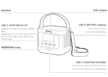
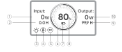
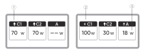
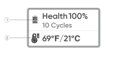
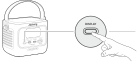
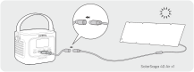
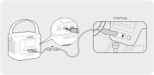

# BELANGRIJKE VEILIGHEIDSINFORMATIE

<strong>AANWIJZINGEN BETREFFENDE HET RISICO OP BRAND, EEN ELEKTRISCHE SCHOK OF LETSEL AAN PERSONEN</strong>

<table class="manual-callout-table" data-callout-variant="warning" lang="nl" style="width:100%; border-collapse:collapse; margin:0 0 16px 0;"><tbody><tr><td class="manual-callout-label" style="width:16%; border:1px solid #000; padding:6px 8px; vertical-align:top;">
<strong>Waarschuwing:</strong>
Waarschuwing:OPGELETOPMERKING</td><td class="manual-callout-body" style="border:1px solid #000; padding:6px 8px; vertical-align:top;">
<strong>Volg altijd deze basisvoorzorgsmaatregelen wanneer u dit product gebruikt.</strong>

</td></tr></tbody></table>

- Lees alle instructies voordat u het product gebruikt.

- Om het risico op letsel te verminderen, is nauwlettend toezicht noodzakelijk wanneer het product in de buurt van kinderen wordt gebruikt.

- Steek geen vingers of handen in het product.

- Stel de powerbank niet bloot aan regen of sneeuw.

- Stel de powerbank niet bloot aan hitte of vuur. Bewaar de powerbank niet in direct zonlicht of in een voertuig.

- Het gebruik van een stroomvoorziening of oplader die niet door de fabrikant van de powerbank wordt aanbevolen of verkocht, kan leiden tot brand of letsel.

- Gebruik de powerbank niet boven het nominale uitgangsvermogen. Overbelasting van de uitgangen boven het nominale vermogen kan leiden tot brand of letsel.

- Gebruik geen powerbank die beschadigd of gemodificeerd is. Beschadigde of gemodificeerde batterijen kunnen onvoorspelbaar gedrag vertonen, wat kan leiden tot brand, explosie of letsel.

- Haal de powerbank niet uit elkaar. Breng deze naar een gekwalificeerde servicemonteur wanneer onderhoud of reparatie nodig is. Onjuiste hermontage kan leiden tot brand of letsel.

- Stel de powerbank niet bloot aan vuur of overmatige hitte. Blootstelling aan vuur of temperaturen boven 60°C kan een explosie veroorzaken.

- Laat onderhoud uitvoeren door een gekwalificeerde servicemonteur die uitsluitend identieke vervangingsonderdelen gebruikt. Dit zorgt ervoor dat de veiligheid van het product behouden blijft.

- Schakel de powerbank uit wanneer deze niet wordt gebruikt.

BEWAAR DEZE INSTRUCTIES

<table class="manual-callout-table" data-callout-variant="caution" lang="nl" style="width:100%; border-collapse:collapse; margin:0 0 16px 0;"><tbody><tr><td class="manual-callout-label" style="width:16%; border:1px solid #000; padding:6px 8px; vertical-align:top;">
<strong>OPGELET</strong>
Waarschuwing:OPGELETOPMERKING</td><td class="manual-callout-body" style="border:1px solid #000; padding:6px 8px; vertical-align:top;">
Risico op brand en brandwonden. Niet openen, niet pletten, niet verhitten boven (60°C) en niet verbranden. Volg de instructies van de fabrikant.

</td></tr></tbody></table>

Het weggooien van een batterij in vuur of een hete oven, of het mechanisch pletten of doorsnijden van een batterij, kan leiden tot een explosie; Het achterlaten van een batterij in een omgeving met extreem hoge temperatuur kan leiden tot een explosie of het lekken van brandbare vloeistof of gas. Een batterij die is blootgesteld aan extreem lage luchtdruk kan leiden tot een explosie of het lekken van brandbare vloeistof of gas.

# INSTRUCTIES VOOR GEBRUIKERSONDERHOUD

Tijdens de levensduur van energieopslagproducten kunt u rekening houden met een zekere mate van capaciteits- en energieverlies. Naarmate het aantal laad- en ontlaadcycli toeneemt en de opslagduur langer wordt, zal deze achteruitgang geleidelijk toenemen; dit is een normaal verschijnsel dat samenhangt met de natuurlijke veroudering van batterijcellen.

# BETEKENIS VAN SYMBOLEN

<figure aria-label="BETEKENIS VAN SYMBOLEN" class="hb-symbol-signal-composition" data-component-id="HB-TABLE-SYMBOL-SIGNAL"><table class="hb-symbol-signal-table"><colgroup><col class="hb-symbol-signal-col-label"/><col class="hb-symbol-signal-col-meaning"/></colgroup><thead><tr><th class="hb-symbol-signal-label-heading" scope="col">
Symbool
</th><th class="hb-symbol-signal-meaning-heading" scope="col">
Betekenis
</th></tr></thead><tbody><tr><td class="hb-symbol-signal-label-cell">⚠WAARSCHUWING</td><td class="hb-symbol-signal-meaning-cell">
Gevaarlijke handelingen die kunnen leiden tot ernstig letsel, overlijden en/of materiële schade.
</td></tr><tr><td class="hb-symbol-signal-label-cell">⚠OPGELET</td><td class="hb-symbol-signal-meaning-cell">
Gevaarlijke praktijken die kunnen leiden tot persoonlijk letsel en/of schade aan eigendommen.
</td></tr><tr><td class="hb-symbol-signal-label-cell">OPMERKING</td><td class="hb-symbol-signal-meaning-cell">
Gevaarlijke praktijken die kunnen leiden tot schade aan apparatuur, gegevensverlies, slechtere prestaties of onverwachte resultaten.
</td></tr><tr><td class="hb-symbol-signal-label-cell">TIP</td><td class="hb-symbol-signal-meaning-cell">
Vult de belangrijke informatie of bedieningstips in de tekst aan.
</td></tr></tbody></table></figure>

<figure aria-label="Symbool / Betekenis" class="hb-symbol-pair-composition" data-component-id="HB-TABLE-SYMBOL-ICON">

<table class="hb-symbol-panel-table"><colgroup><col class="hb-symbol-col-icon"/><col class="hb-symbol-col-meaning"/></colgroup><thead><tr><th class="hb-symbol-icon-heading" scope="col">
Symbool
</th><th class="hb-symbol-meaning-heading" scope="col">
Betekenis
</th></tr></thead><tbody><tr><td class="hb-symbol-icon"></td><td class="hb-symbol-meaning">
Waarschuwings- en voorzorgssymbolen. Moet worden gelezen om personen te waarschuwen voor mogelijke gevaren of risico's.
</td></tr><tr><td class="hb-symbol-icon"></td><td class="hb-symbol-meaning">
Lees de gebruikershandleiding voor gebruik.
</td></tr><tr><td class="hb-symbol-icon"></td><td class="hb-symbol-meaning">
Dit symbool geeft aan dat het product niet als huishoudelijk afval mag worden weggegooid en naar een aangewezen inzamelingspunt voor recycling moet worden gebracht. Een juiste afvalverwerking en recycling dragen bij aan een beter milieu. Voor meer informatie over de verwijdering en recycling van dit product, neem contact op met uw gemeente, afvalverwerkingsdienst of leverancier.
</td></tr><tr><td class="hb-symbol-icon"></td><td class="hb-symbol-meaning">
Batterijen en accu's mogen niet bij het huishoudelijk afval worden weggegooid. Als consument bent u wettelijk verplicht om alle batterijen en accu's in te leveren bij daarvoor aangewezen inzamelpunten, ongeacht of ze gevaarlijke stoffen bevatten. Lever gebruikte batterijen en accu's in bij een plaatselijk inleverpunt, recyclingcentrum of bij de winkel waar u ze heeft gekocht. Een juiste afvalverwerking verzekert dat recycling op een milieuvriendelijke manier gebeurt en voorkomt mogelijke schade aan de menselijke gezondheid en het milieu.
</td></tr></tbody></table>

<table class="hb-symbol-panel-table"><colgroup><col class="hb-symbol-col-icon"/><col class="hb-symbol-col-meaning"/></colgroup><thead><tr><th class="hb-symbol-icon-heading" scope="col">
Symbool
</th><th class="hb-symbol-meaning-heading" scope="col">
Betekenis
</th></tr></thead><tbody><tr><td class="hb-symbol-icon"></td><td class="hb-symbol-meaning">
Demonteer het product niet.
</td></tr><tr><td class="hb-symbol-icon"></td><td class="hb-symbol-meaning">
Houd het product uit de buurt van vuur.
</td></tr><tr><td class="hb-symbol-icon"></td><td class="hb-symbol-meaning">
Houd het product buiten het bereik van kinderen.
</td></tr><tr><td class="hb-symbol-icon"></td><td class="hb-symbol-meaning">
Dit symbool geeft aan dat zich een lithium-ion (Li-ion) batterij in het product bevindt en dat deze op de juiste manier moet worden afgevoerd of gerecycled.
</td></tr></tbody></table>

</figure>

# WAT ZIT ER IN DE DOOS

<figure aria-label="WAT ZIT ER IN DE DOOS" class="hb-inbox-composition" data-card-count="3" data-component-id="HB-SPECIAL-INBOX" data-inbox-variant="three-card-responsive"><ol class="hb-inbox-grid"><li class="hb-inbox-card" data-item-number="1">

<strong>Jackery Explorer 100D</strong>

</li><li class="hb-inbox-card" data-item-number="2">

<strong>USB-C-kabel</strong>

</li><li class="hb-inbox-card" data-item-number="3">

<strong>Gebruikershandleiding</strong>

</li></ol></figure>

# PRODUCTOVERZICHT

<figure>

</figure>

<strong>Extra riemen kunnen worden gekocht en aan de zijkanten van het product worden bevestigd.</strong>

# LCD-SCHERM

## INTERFACE 1

<figure aria-label="LCD icon meanings" class="hb-lcd-table-composition" data-component-id="HB-TABLE-LCD-ICON" tabindex="0"><table class="hb-lcd-icon-table"><colgroup><col class="hb-lcd-col-number"/><col class="hb-lcd-col-icon"/><col class="hb-lcd-col-name"/><col class="hb-lcd-col-description"/></colgroup><tbody><tr><td class="hb-lcd-number">
1
</td><td class="hb-lcd-icon"></td><td class="hb-lcd-name">
Invoervermogen
</td><td class="hb-lcd-description">
Toont het ingangsvermogen in watt.
</td></tr><tr><td class="hb-lcd-number">
2
</td><td class="hb-lcd-icon"></td><td class="hb-lcd-name">
Resterende oplaadtijd
</td><td class="hb-lcd-description">
Toont de resterende oplaadtijd.
</td></tr><tr><td class="hb-lcd-number">
3
</td><td class="hb-lcd-icon"></td><td class="hb-lcd-name">
Continu-aan-mo dus
</td><td class="hb-lcd-description">
Aan: De Continu-aan-modus is ingeschakeld.

Uit: De Continu-aan-modus is uitgeschakeld.
</td></tr><tr><td class="hb-lcd-number">
4
</td><td class="hb-lcd-icon"></td><td class="hb-lcd-name">
Thermische vermogensbep erking
</td><td class="hb-lcd-description">
Aan: De batterijtemperatuur is hoog. Het maximale ontladingsvermogen is ingeschakeld.

Uit: Het maximale ontladingsvermogen is uitgeschakeld.
</td></tr><tr><td class="hb-lcd-number">
5
</td><td class="hb-lcd-icon"></td><td class="hb-lcd-name">
Energiebesp aringsmodus
</td><td class="hb-lcd-description">
Aan: De Energiebesparingsmodus is ingeschakeld.

Uit: De Energiebesparingsmodus is uitgeschakeld.
</td></tr><tr><td class="hb-lcd-number">
6
</td><td class="hb-lcd-icon"></td><td class="hb-lcd-name">
Batterijstroom-in dicator
</td><td class="hb-lcd-description">
Wanneer het product wordt opgeladen, licht de oranje cirkel rond het batterijpercentage geleidelijk op. Wanneer u andere apparaten van stroom voorziet, blijft de oranje cirkel branden.
</td></tr><tr><td class="hb-lcd-number">
7
</td><td class="hb-lcd-icon"></td><td class="hb-lcd-name">
Batterijstroom-in dicator
</td><td class="hb-lcd-description">
Aan: Het batterijniveau is lager dan 20%.

Knipperend: Het batterijniveau is lager dan 5%.

Uit: Het batterijniveau is niet lager dan 20% of het product wordt opgeladen.
</td></tr><tr><td class="hb-lcd-number">
8
</td><td class="hb-lcd-icon"></td><td class="hb-lcd-name">
Resterend batterijpercentage
</td><td class="hb-lcd-description">
Geeft het resterende batterijpercentage weer.
</td></tr><tr><td class="hb-lcd-number">
9
</td><td class="hb-lcd-icon"></td><td class="hb-lcd-name">
Resterende ontlaadtijd
</td><td class="hb-lcd-description">
Geeft de resterende ontlaadtijd weer.
</td></tr><tr><td class="hb-lcd-number">
10
</td><td class="hb-lcd-icon"></td><td class="hb-lcd-name">
Uitgangsvermogen
</td><td class="hb-lcd-description">
Geeft het uitgangsvermogen in watt weer.
</td></tr></tbody></table></figure>

<figure aria-label="LCD icon meanings" class="hb-lcd-table-composition" data-component-id="HB-TABLE-LCD-ICON" tabindex="0"><table class="hb-lcd-icon-table"><colgroup><col class="hb-lcd-col-icon"/><col class="hb-lcd-col-name"/><col class="hb-lcd-col-description"/></colgroup><tbody><tr><td class="hb-lcd-icon"></td><td class="hb-lcd-name">
Foutcode
</td><td class="hb-lcd-description">
Verwijder de belasting of koppel de oplaadstekker los. Als het probleem niet kan worden opgelost, neem dan contact op met de klantenservice van Jackery.
</td></tr><tr><td class="hb-lcd-icon"></td><td class="hb-lcd-name">
Indicator voor hoge temperatuur
</td><td class="hb-lcd-description">
De beveiliging tegen hoge temperaturen is geactiveerd. Het product kan stoppen met werken totdat de temperatuur weer binnen het normale bedrijfsbereik is.
</td></tr><tr><td class="hb-lcd-icon"></td><td class="hb-lcd-name">
Indicator voor lage temperatuur
</td><td class="hb-lcd-description">
De beveiliging tegen lege temperaturen is geactiveerd. Het product kan stoppen met werken totdat de temperatuur weer binnen het normale bedrijfsbereik is.
</td></tr></tbody></table></figure>

## INTERFACE 2

<figure aria-label="LCD icon meanings" class="hb-lcd-table-composition" data-component-id="HB-TABLE-LCD-ICON" tabindex="0"><table class="hb-lcd-icon-table"><colgroup><col class="hb-lcd-col-number"/><col class="hb-lcd-col-icon"/><col class="hb-lcd-col-name"/><col class="hb-lcd-col-description"/></colgroup><tbody><tr><td class="hb-lcd-number">
1
</td><td class="hb-lcd-icon"></td><td class="hb-lcd-name">
Ontlaadindicator
</td><td class="hb-lcd-description">
Deze USB-poort is aan het ontladen.
</td></tr><tr><td class="hb-lcd-number">
2
</td><td class="hb-lcd-icon"></td><td class="hb-lcd-name">
Laadindicator
</td><td class="hb-lcd-description">
Deze USB-poort is aan het laden.
</td></tr><tr><td class="hb-lcd-number">
3
</td><td class="hb-lcd-icon"></td><td class="hb-lcd-name">
Laad- of ontlaadvermogen
</td><td class="hb-lcd-description">
Toont het laad- of ontlaadvermogen van de betreffende poort.
</td></tr></tbody></table></figure>

## INTERFACE 3

<figure aria-label="LCD icon meanings" class="hb-lcd-table-composition" data-component-id="HB-TABLE-LCD-ICON" tabindex="0"><table class="hb-lcd-icon-table"><colgroup><col class="hb-lcd-col-number"/><col class="hb-lcd-col-icon"/><col class="hb-lcd-col-name"/><col class="hb-lcd-col-description"/></colgroup><tbody><tr><td class="hb-lcd-number">
1
</td><td class="hb-lcd-icon"></td><td class="hb-lcd-name">
Batterijgezondheid en aantal laadcycli
</td><td class="hb-lcd-description">
Toont het huidige batterijgezondheidspercentage en het aantal oplaad-/ontlaadcycli.

<ul class="simple">
<li>
Groen: de batterijgezondheid is hoog.
</li>
<li>
Geel: de batterijgezondheid is matig.
</li>
<li>
Rood: de batterijgezondheid is laag.
</li>
</ul></td></tr><tr><td class="hb-lcd-number">
2
</td><td class="hb-lcd-icon"></td><td class="hb-lcd-name">
Batterijtemperatuur
</td><td class="hb-lcd-description">
Toont de huidige batterijtemperatuur.
</td></tr></tbody></table></figure>

# HANDELINGEN

## AAN/UIT VOOR UITGANG

Sluit een belasting aan om de uitgang te starten.

<table class="manual-callout-table" data-callout-variant="caution" lang="nl" style="width:100%; border-collapse:collapse; margin:0 0 16px 0;"><tbody><tr><td class="manual-callout-label" style="width:16%; border:1px solid #000; padding:6px 8px; vertical-align:top;">
<strong>OPGELET</strong>
Waarschuwing:OPGELETOPMERKING</td><td class="manual-callout-body" style="border:1px solid #000; padding:6px 8px; vertical-align:top;"><ul class="simple">
<li>
USB-C 140W MAX is een USB-PD Power Source 3 (PS3)-uitgangspoort met hoog vermogen. Als het aangesloten apparaat of accessoire niet aan de veiligheidsvereisten voldoet, kan er brandgevaar ontstaan. Controleer voordat u deze poorten gebruikt of het aangesloten apparaat of accessoire beschikt over brandbeveiliging.
</li>
<li>
Sluit de 100D alleen aan op apparaten of accessoires die voldoen aan clausules 6.3, 6.4 en 6.5 van IEC/EN/UL 62368-1 (of andere gelijkwaardige normen).
</li>
<li>
Gebruik voor maximaal uitgangsvermogen de USB-C naar USB-C 5A-kabel (20 V DC/5A, 100W; 28 V DC/5A, 140 W).
</li>
</ul>
</td></tr></tbody></table>

## ENERGIEBESPARINGSMODUS

De Energiebesparingsmodus is standaard uitgeschakeld. Om onnodig batterijverbruik te voorkomen, bijvoorbeeld doordat u bent vergeten de uitgang uit te schakelen, houdt u de WEERGAVE-knop ingedrukt om de Energiebesparingsmodus in te schakelen. Als er gedurende 2 uur geen apparaat is aangesloten of het stroomverbruik van het aangesloten apparaat lager is dan 2W, schakelt het product automatisch de uitgangen uit. Wanneer de uitgang is ingeschakeld, verschijnt het pictogram "2H" op het scherm.

Houd 3 seconden ingedrukt om de Energiebesparings modus in of uit te schakelen.

<table class="manual-callout-table" data-callout-variant="note" lang="nl" style="width:100%; border-collapse:collapse; margin:0 0 16px 0;"><tbody><tr><td class="manual-callout-label" style="width:16%; border:1px solid #000; padding:6px 8px; vertical-align:top;">
<strong>OPMERKING</strong>
Waarschuwing:OPGELETOPMERKING</td><td class="manual-callout-body" style="border:1px solid #000; padding:6px 8px; vertical-align:top;">
De Energiebesparingsmodus hervat de vorige status na het inschakelen. Voor het wijzigen van de modus is handmatig schakelen vereist.

</td></tr></tbody></table>

## LCD-SCHERM

<figure aria-label="LCD-SCHERM" class="hb-reference-composition hb-reference-lcd-actions-compact" data-component-id="HB-TABLE-REFERENCE" data-component-variant="lcd-actions-compact" tabindex="0"><table class="hb-reference-table"><thead><tr><th scope="col">
Functie
</th><th scope="col">
Beschrijving
</th></tr></thead><tbody><tr><td>
Scherm wekken
</td><td>
Het scherm licht op na een korte druk op de WEERGAVE-knop of licht automatisch op tijdens het laden of ontladen.
</td></tr><tr><td>
Scherm altijd aan
</td><td>
Druk tweemaal op de WEERGAVE-knop terwijl het scherm brandt.
</td></tr><tr><td>
Van scherm wisselen
</td><td>
Druk na het oplichten van het scherm kort op de WEERGAVE-knop om van pagina te wisselen.
</td></tr><tr><td>
Scherm altijd-aan uitschakelen
</td><td>
Druk nogmaals tweemaal op de WEERGAVE-knop.
</td></tr><tr><td>
Scherm automatisch uitschakelen
</td><td>
10 seconden na het oplichten zonder gebruik of 2 uur na het activeren van de altijd-aan-modus.
</td></tr></tbody></table></figure>

# OPLADEN

Laad het product voor het eerste gebruik volledig op.

<table class="manual-callout-table" data-callout-variant="caution" lang="nl" style="width:100%; border-collapse:collapse; margin:0 0 16px 0;"><tbody><tr><td class="manual-callout-label" style="width:16%; border:1px solid #000; padding:6px 8px; vertical-align:top;">
<strong>OPGELET</strong>
Waarschuwing:OPGELETOPMERKING</td><td class="manual-callout-body" style="border:1px solid #000; padding:6px 8px; vertical-align:top;"><ul class="simple">
<li>
De aanbevolen oplaadtemperatuur voor het product ligt tussen 0°C en 45°C, en de ontlaadtemperatuur tussen -20°C en 45°C. Het gebruik van het product buiten dit temperatuurbereik kan de laad- en ontlaadmogelijkheden beperken of zelfs voorkomen dat het product kan opladen of ontladen.
</li>
<li>
Het oplaadvermogen en de batterijcapaciteit van het product kunnen variëren als gevolg van verschillende temperaturen.
</li>
</ul>
</td></tr></tbody></table>

## OPLADEN VIA EEN USB-C-OPLADER

<strong>USB-C-oplader apart verkrijgbaar.</strong>

## OPLADEN VIA ZONNEPANELEN (APART VERKRIJGBAAR)

Dit product ondersteunt een maximaal oplaadvermogen via zonne-energie van 100W en kan worden gebruikt met de zonnepanelen uit de Jackery SolarSaga-serie.

Opgeladen via een zonnepaneel van 40W of 100W:

<strong>De DC8020-naar-USB-C-kabel wordt apart verkocht.</strong>

Het wordt aanbevolen om het product op te laden met het Jackery-zonnepaneel. Zorg ervoor dat de openklemspanning (Voc) van het zonnepaneel binnen het DC-ingangsbereik (10 V-30 V) van de 100D ligt. Jackery is niet verantwoordelijk voor schade of verlies als gevolg van het gebruik van zonnepanelen van derden.

## OPLADEN VIA EEN AUTO-OPLADER (AFZONDERLIJK VERKRIJGBAAR)

Dit product kan worden opgeladen met zowel 12 V- als 24 V-autoladers. Zorg ervoor dat de autolader en de aansluiting in de auto (sigarettenaansteker) goed zijn aangesloten.

<strong>De oplaadkabel voor de auto en de DC8020-naar-USB-C-kabel zijn apart verkrijgbaar.</strong>

<table class="manual-callout-table" data-callout-variant="caution" lang="nl" style="width:100%; border-collapse:collapse; margin:0 0 16px 0;"><tbody><tr><td class="manual-callout-label" style="width:16%; border:1px solid #000; padding:6px 8px; vertical-align:top;">
<strong>OPGELET</strong>
Waarschuwing:OPGELETOPMERKING</td><td class="manual-callout-body" style="border:1px solid #000; padding:6px 8px; vertical-align:top;"><ul class="simple">
<li>
Start het voertuig voordat u uw powerbank oplaadt.
</li>
<li>
Als het voertuig over een hobbelige weg rijdt, mag de auto-oplader niet worden gebruikt om oververhitting door een slechte verbinding te voorkomen. Het bedrijf is niet aansprakelijk voor verliezen die worden veroorzaakt door onjuist gebruik.
</li>
</ul>
</td></tr></tbody></table>

# OPSLAG

Bewaar het product op een droge, schone plaats met voldoende ventilatie. Opslagtemperatuur en -vochtigheid:

- Opslagtemperatuur: -20°C tot 60°C

- Opslagvochtigheid: 5-95% RV

Als dit product gedurende langere tijd (3 maanden - 6 maanden) met een lege batterij wordt bewaard, kan het zijn dat het niet meer kan worden opgeladen. Om dit te voorkomen en de batterij in goede conditie te houden, is het aan te raden om het product elke drie maanden te controleren en op te laden, waarbij minstens één keer per 6 tot 12 maanden een volledige laad- en ontlaadcyclus moet worden uitgevoerd.

# SPECIFICATIES

## ALGEMENE INFORMATIE

<figure aria-label="ALGEMENE INFORMATIE" class="hb-spec-table-composition"><table class="hb-source-specification hb-spec-table manual-table manual-spec-table"><colgroup><col class="hb-spec-col-label"/><col class="hb-spec-col-value"/></colgroup>
<tbody>
<tr><th class="manual-spec-label hb-spec-label" scope="row">
Productnaam
</th>
<td class="manual-spec-value hb-spec-value">
Jackery Explorer 100D
</td>
</tr>
<tr><th class="manual-spec-label hb-spec-label" scope="row">
Modelnummer
</th>
<td class="manual-spec-value hb-spec-value">
JE-100C
</td>
</tr>
<tr><th class="manual-spec-label hb-spec-label" scope="row">
Capaciteit
</th>
<td class="manual-spec-value hb-spec-value">
96 Wh (5 Ah/19,2 V DC)
</td>
</tr>
<tr><th class="manual-spec-label hb-spec-label" scope="row">
Celchemie
</th>
<td class="manual-spec-value hb-spec-value">
Li-ion LFP
</td>
</tr>
<tr><th class="manual-spec-label hb-spec-label" scope="row">
Gewicht
</th>
<td class="manual-spec-value hb-spec-value">
855 g ± 10 g
</td>
</tr>
<tr><th class="manual-spec-label hb-spec-label" scope="row">
Afmetingen
</th>
<td class="manual-spec-value hb-spec-value">
(118,7 ± 1) × (82,6 ± 0,5) × (85,68 ± 0,8) mm
</td>
</tr>
<tr><th class="manual-spec-label hb-spec-label" scope="row">
Levensduur
</th>
<td class="manual-spec-value hb-spec-value">
3000 cycli tot 80% of meer van de capaciteit
</td>
</tr>
</tbody>
</table></figure>

## Ingangspoorten

<figure aria-label="Ingangspoorten" class="hb-spec-table-composition"><table class="hb-source-specification hb-spec-table manual-table manual-spec-table"><colgroup><col class="hb-spec-col-label"/><col class="hb-spec-col-value"/></colgroup>
<tbody>
<tr><th class="manual-spec-label hb-spec-label" scope="row">
USB-C1
</th>
<td class="manual-spec-value hb-spec-value">
5 V⎓3 A, 9 V⎓3 A, 12 V⎓3 A, 15 V⎓3 A, 20 V⎓5 A, 28 V⎓5A, 140W Max

Voertuig: 12 V⎓5 A Max, 24 V⎓5 A Max

PV: 10 V-30 V⎓, 5A Max, 100W Max

</td>
</tr>
</tbody>
</table></figure>

## Uitgangspoorten

<figure aria-label="Uitgangspoorten" class="hb-spec-table-composition"><table class="hb-source-specification hb-spec-table manual-table manual-spec-table"><colgroup><col class="hb-spec-col-label"/><col class="hb-spec-col-value"/></colgroup>
<tbody>
<tr><th class="manual-spec-label hb-spec-label" scope="row">
USB-A
</th>
<td class="manual-spec-value hb-spec-value">
5 V⎓2 A, 9 V⎓2 A, 12 V⎓1,5 A, 18 W Max
</td>
</tr>
<tr><th class="manual-spec-label hb-spec-label" scope="row">
USB-C1 / USB-C2
</th>
<td class="manual-spec-value hb-spec-value">
5 V⎓3 A, 9 V⎓3 A, 12 V⎓3 A, 15 V⎓3 A, 20 V⎓5 A, 28 V⎓5 A, 140 W Max
</td>
</tr>
</tbody>
</table></figure>

## Totaal uitgangsvermogen

<figure aria-label="Totaal uitgangsvermogen" class="hb-spec-table-composition"><table class="hb-source-specification hb-spec-table manual-table manual-spec-table"><colgroup><col class="hb-spec-col-label"/><col class="hb-spec-col-value"/></colgroup>
<tbody>
<tr><th class="manual-spec-label hb-spec-label" scope="row">
USB-C1 + USB-C2
</th>
<td class="manual-spec-value hb-spec-value">
( 70W + 70W ) Max
</td>
</tr>
<tr><th class="manual-spec-label hb-spec-label" scope="row">
USB-C1 + USB-A / USB-C2 + USB-A
</th>
<td class="manual-spec-value hb-spec-value">
( 140W + 18W ) Max
</td>
</tr>
<tr><th class="manual-spec-label hb-spec-label" scope="row">
USB-C1 + USB-C2 + USB-A
</th>
<td class="manual-spec-value hb-spec-value">
( 70W + 70W + 18W ) Max
</td>
</tr>
</tbody>
</table></figure>

## BEDRIJFSTEMPERATUUR

<figure aria-label="BEDRIJFSTEMPERATUUR" class="hb-spec-table-composition"><table class="hb-source-specification hb-spec-table manual-table manual-spec-table"><colgroup><col class="hb-spec-col-label"/><col class="hb-spec-col-value"/></colgroup>
<tbody>
<tr><th class="manual-spec-label hb-spec-label" scope="row">
Oplaadtemperatuur
</th>
<td class="manual-spec-value hb-spec-value">
0°C tot 45°C
</td>
</tr>
<tr><th class="manual-spec-label hb-spec-label" scope="row">
Ontlaadtemperatuur
</th>
<td class="manual-spec-value hb-spec-value">
-20°C tot 45°C
</td>
</tr>
</tbody>
</table></figure>

※ USB Type-C® en USB-C® zijn geregistreerde handelsmerken van USB Implementers Forum.

# GARANTIE

NEEM CONTACT MET ONS OP

Stuur uw vragen of opmerkingen over onze producten naar <a class="reference external" href="mailto:hello.eu@jackery.com">hello.eu@jackery.com</a>, we zullen u zo snel mogelijk beantwoorden. Als er sprake is van een kwaliteitsprobleem met het product, kunt u een vervangend product of terugbetaling aanvragen door een aanvraagformulier in te vullen op www.jackery.com.

KLANTENSERVICE

2 jaar beperkte garantie.

<a class="reference external" href="mailto:hello.eu@jackery.com">hello.eu@jackery.com</a>

Levenslange technische ondersteuning

