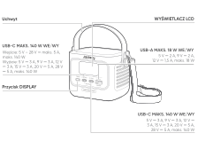
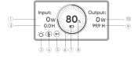
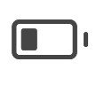
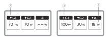
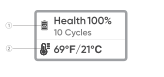
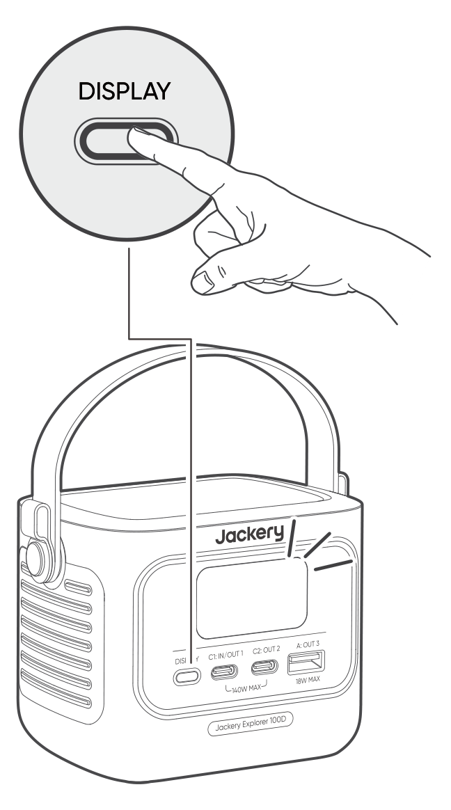
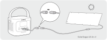
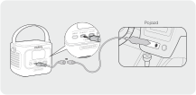

# WAŻNE INFORMACJE DOTYCZĄCE BEZPIECZEŃSTWA

<strong>INSTRUKCJE DOTYCZĄCE RYZYKA POŻARU, PORAŻENIA PRĄDEM LUB OBRAŻEŃ CIAŁA</strong>

<table class="manual-callout-table" data-callout-variant="warning" lang="pl" style="width:100%; border-collapse:collapse; margin:0 0 16px 0;"><tbody><tr><td class="manual-callout-label" style="width:16%; border:1px solid #000; padding:6px 8px; vertical-align:top;">
<strong>OSTRZEŻENIE:</strong>
OSTRZEŻENIE:PRZESTROGAUWAGA</td><td class="manual-callout-body" style="border:1px solid #000; padding:6px 8px; vertical-align:top;">
<strong>Podczas korzystania z tego produktu należy zawsze przestrzegać wskazanych podstawowych środków ostrożności.</strong>

</td></tr></tbody></table>

- Przed przystąpieniem do korzystania z produktu należy przeczytać wszystkie instrukcje.

- W przypadku korzystania z produktu w pobliżu dzieci należy zapewnić im ścisły nadzór, aby ograniczyć ryzyko obrażeń ciała.

- Nie wkładać palców ani rąk do produktu.

- Nie wystawiać powerbanka na deszcz ani śnieg.

- Nie wystawiać powerbanka na działanie wysokiej temperatury lub ognia. Nie przechowywać w miejscu bezpośrednio nasłonecznionym ani w pojeździe.

- Używanie modeli zasilaczy lub ładowarek niezalecanych ani nie sprzedawanych przez producenta powerbanka może stwarzać ryzyko pożaru lub obrażeń.

- Nie przekraczać znamionowej mocy wyjściowej powerbanka. Przeciążenie wyjść powyżej wartości znamionowej może stwarzać ryzyko pożaru lub obrażeń.

- Nie używać powerbanka, jeśli został uszkodzony lub zmodyfikowany. Uszkodzone lub zmodyfikowane baterie mogą wykazywać nieprzewidywalne zachowanie, prowadząc do pożaru, wybuchu lub stwarzając ryzyko obrażeń.

- Nie rozbierać powerbanka na części. W razie potrzeby serwisu lub naprawy należy oddać urządzenie do wykwalifikowanego serwisu. Nieprawidłowe zmontowanie urządzenia może stwarzać ryzyko pożaru lub obrażeń.

- Nie narażać powerbanka na działanie ognia ani nadmierną temperaturę. Narażenie na działanie ognia lub temperatur powyżej 60°C może spowodować wybuch.

- Prace serwisowe powinny być wykonywane przez wykwalifikowany personel serwisowy lub naprawczy, z wykorzystaniem wyłącznie identycznych części zamiennych. Pozwoli to zapewnić bezpieczeństwo produktu.

- Gdy powerbank nie jest używany, należy go wyłączać.

NINIEJSZĄ INSTRUKCJĘ NALEŻY ZACHOWAĆ

<table class="manual-callout-table" data-callout-variant="caution" lang="pl" style="width:100%; border-collapse:collapse; margin:0 0 16px 0;"><tbody><tr><td class="manual-callout-label" style="width:16%; border:1px solid #000; padding:6px 8px; vertical-align:top;">
<strong>PRZESTROGA</strong>
OSTRZEŻENIE:PRZESTROGAUWAGA</td><td class="manual-callout-body" style="border:1px solid #000; padding:6px 8px; vertical-align:top;">
Ryzyko pożaru i oparzeń. Nie otwierać, nie zgniatać, nie nagrzewać powyżej (60°C) ani nie spalać. Przestrzegać instrukcji producenta.

</td></tr></tbody></table>

Utylizacja baterii w ogniu lub piecu topielniczym, albo mechaniczne zgniatanie lub cięcie baterii mogą spowodować wybuch. Pozostawienie baterii w środowisku o wyjątkowo wysokiej temperaturze może spowodować wybuch lub wyciek łatwopalnej cieczy lub gazu, podobnie jak narażenie jej na działanie skrajnie niskiego ciśnienia.

# INSTRUKCJE KONSERWACJI DLA UŻYTKOWNIKA

W cyklu życia produktów do magazynowania energii należy spodziewać się pewnej degradacji pojemności i energii. Wraz ze wzrostem liczby cykli ładowania i rozładowywania oraz wydłużeniem czasu przechowywania, degradacja ta będzie się stopniowo nasilać, co jest normalnym zjawiskiem zgodnym z naturalnym starzeniem się ogniw baterii.

# ZNACZENIE SYMBOLI

<figure aria-label="ZNACZENIE SYMBOLI" class="hb-symbol-signal-composition" data-component-id="HB-TABLE-SYMBOL-SIGNAL"><table class="hb-symbol-signal-table"><colgroup><col class="hb-symbol-signal-col-label"/><col class="hb-symbol-signal-col-meaning"/></colgroup><thead><tr><th class="hb-symbol-signal-label-heading" scope="col">
Symbol
</th><th class="hb-symbol-signal-meaning-heading" scope="col">
Znaczenie
</th></tr></thead><tbody><tr><td class="hb-symbol-signal-label-cell">⚠OSTRZEŻENIE</td><td class="hb-symbol-signal-meaning-cell">
Niebezpieczne praktyki, które mogą prowadzić do poważnych obrażeń, śmierci i/lub szkód materialnych.
</td></tr><tr><td class="hb-symbol-signal-label-cell">⚠PRZESTROGA</td><td class="hb-symbol-signal-meaning-cell">
Niebezpieczne praktyki, które mogą skutkować obrażeniami ciała i/lub szkodami materialnymi.
</td></tr><tr><td class="hb-symbol-signal-label-cell">Uwaga</td><td class="hb-symbol-signal-meaning-cell">
Niebezpieczne praktyki, które mogą prowadzić do uszkodzenia sprzętu, utraty danych, pogorszenia wydajności lub nieprzewidzianych wyników.
</td></tr><tr><td class="hb-symbol-signal-label-cell">WSKAZÓWKA</td><td class="hb-symbol-signal-meaning-cell">
Uzupełnia ważne informacje lub wskazówki dotyczące obsługi zawarte w tekście.
</td></tr></tbody></table></figure>

<figure aria-label="Symbol / Znaczenie" class="hb-symbol-pair-composition" data-component-id="HB-TABLE-SYMBOL-ICON">

<table class="hb-symbol-panel-table"><colgroup><col class="hb-symbol-col-icon"/><col class="hb-symbol-col-meaning"/></colgroup><thead><tr><th class="hb-symbol-icon-heading" scope="col">
Symbol
</th><th class="hb-symbol-meaning-heading" scope="col">
Znaczenie
</th></tr></thead><tbody><tr><td class="hb-symbol-icon"></td><td class="hb-symbol-meaning">
Symbole ostrzeżeń i środków ostrożności. Należy koniecznie przeczytać, aby poznać potencjalne zagrożenia lub ryzyka.
</td></tr><tr><td class="hb-symbol-icon"></td><td class="hb-symbol-meaning">
Przed przystąpieniem do użytkowania przeczytaj instrukcję obsługi.
</td></tr><tr><td class="hb-symbol-icon"></td><td class="hb-symbol-meaning">
Ten symbol oznacza, że produktu nie wolno wyrzucać razem z odpadami domowymi i należy go dostarczyć do wyznaczonego punktu zbiórki w celu recyklingu. Prawidłowa utylizacja i recykling przyczynią się do ochrony środowiska. Aby uzyskać więcej informacji na temat utylizacji i recyklingu tego produktu, skontaktuj się z lokalną gminą, firmą zajmującą się utylizacją lub sprzedawcą.
</td></tr><tr><td class="hb-symbol-icon"></td><td class="hb-symbol-meaning">
Baterii i akumulatorów nie wolno wyrzucać razem z odpadami domowymi. Jako konsument masz prawny obowiązek oddawania wszystkich baterii i akumulatorów do wyznaczonych punktów zbiórki, niezależnie od tego, czy zawierają substancje niebezpieczne. Zużyte baterie i akumulatory należy przekazać do lokalnego punktu zbiórki, centrum recyklingu lub do sprzedawcy, u którego zostały zakupione. Prawidłowa utylizacja zapewnia recykling przyjazny dla środowiska i zapobiega potencjalnym szkodom dla zdrowia ludzi i środowiska.
</td></tr></tbody></table>

<table class="hb-symbol-panel-table"><colgroup><col class="hb-symbol-col-icon"/><col class="hb-symbol-col-meaning"/></colgroup><thead><tr><th class="hb-symbol-icon-heading" scope="col">
Symbol
</th><th class="hb-symbol-meaning-heading" scope="col">
Znaczenie
</th></tr></thead><tbody><tr><td class="hb-symbol-icon"></td><td class="hb-symbol-meaning">
Nie rozmontowuj produktu.
</td></tr><tr><td class="hb-symbol-icon"></td><td class="hb-symbol-meaning">
Trzymaj produkt z dala od ognia.
</td></tr><tr><td class="hb-symbol-icon"></td><td class="hb-symbol-meaning">
Przechowuj w miejscu niedostępnym dla dzieci.
</td></tr><tr><td class="hb-symbol-icon"></td><td class="hb-symbol-meaning">
Ten symbol oznacza, że wewnątrz produktu znajduje się bateria litowo-jonowa (Li-ion), którą należy prawidłowo utylizować lub poddać recyklingowi.
</td></tr></tbody></table>

</figure>

# ZAWARTOŚĆ OPAKOWANIA

<figure aria-label="ZAWARTOŚĆ OPAKOWANIA" class="hb-inbox-composition" data-card-count="3" data-component-id="HB-SPECIAL-INBOX" data-inbox-variant="three-card-responsive"><ol class="hb-inbox-grid"><li class="hb-inbox-card" data-item-number="1">

<strong>Jackery Explorer 100D</strong>

</li><li class="hb-inbox-card" data-item-number="2">

<strong>Kabel USB-C</strong>

</li><li class="hb-inbox-card" data-item-number="3">

<strong>Instrukcja obsługi</strong>

</li></ol></figure>

# WIDOK OGÓLNY PRODUKTU

<figure>

</figure>

<strong>Dodatkowe paski można dokupić i zamocować do boków produktu.</strong>

# WYŚWIETLACZ LCD

## INTERFEJS 1

<figure aria-label="LCD icon meanings" class="hb-lcd-table-composition" data-component-id="HB-TABLE-LCD-ICON" tabindex="0"><table class="hb-lcd-icon-table"><colgroup><col class="hb-lcd-col-number"/><col class="hb-lcd-col-icon"/><col class="hb-lcd-col-name"/><col class="hb-lcd-col-description"/></colgroup><tbody><tr><td class="hb-lcd-number">
1
</td><td class="hb-lcd-icon"></td><td class="hb-lcd-name">
Moc wejściowa
</td><td class="hb-lcd-description">
Wyświetla moc wejściową w watach.
</td></tr><tr><td class="hb-lcd-number">
2
</td><td class="hb-lcd-icon"></td><td class="hb-lcd-name">
Pozostały czas ładowania
</td><td class="hb-lcd-description">
Wyświetla pozostały czas ładowania.
</td></tr><tr><td class="hb-lcd-number">
3
</td><td class="hb-lcd-icon"></td><td class="hb-lcd-name">
Tryb ciągłego włączenia
</td><td class="hb-lcd-description">
Wł.: Tryb ciągłego włączenia jest włączony.

Wył.: Tryb ciągłego włączenia jest wyłączony.
</td></tr><tr><td class="hb-lcd-number">
4
</td><td class="hb-lcd-icon"></td><td class="hb-lcd-name">
Ograniczenie termiczne mocy
</td><td class="hb-lcd-description">
Wł.: Temperatura baterii jest wysoka. Limit mocy zasilania urządzeń odbiorczych jest włączony.

Wył.: Limit mocy zasilania urządzeń odbiorczych jest wyłączony.
</td></tr><tr><td class="hb-lcd-number">
5
</td><td class="hb-lcd-icon"></td><td class="hb-lcd-name">
Tryb oszczędzania energii
</td><td class="hb-lcd-description">
Wł.: Tryb oszczędzania energii jest włączony.

Wył.: Tryb oszczędzania energii jest wyłączony.
</td></tr><tr><td class="hb-lcd-number">
6
</td><td class="hb-lcd-icon"></td><td class="hb-lcd-name">
Wskaźnik poziomu baterii
</td><td class="hb-lcd-description">
W trakcie ładowania produktu pomarańczowy pierścień wokół wartości procentowej baterii będzie się zapalał sekwencyjnie. Podczas ładowania innych urządzeń pomarańczowy pierścień będzie stale zaświecony.
</td></tr><tr><td class="hb-lcd-number">
7
</td><td class="hb-lcd-icon"></td><td class="hb-lcd-name">
Wskaźnik poziomu baterii
</td><td class="hb-lcd-description">
Wł.: Poziom naładowania baterii jest niższy niż 20%.

Miga: Poziom naładowania baterii jest niższy niż 5%.

Wył.: Poziom baterii nie jest niższy niż 20% lub produkt jest ładowany.
</td></tr><tr><td class="hb-lcd-number">
8
</td><td class="hb-lcd-icon"></td><td class="hb-lcd-name">
Pozostały procent baterii
</td><td class="hb-lcd-description">
Wyświetla pozostały procent baterii.
</td></tr><tr><td class="hb-lcd-number">
9
</td><td class="hb-lcd-icon"></td><td class="hb-lcd-name">
Pozostały czas zasilania urządzeń odbiorczych
</td><td class="hb-lcd-description">
Wyświetla pozostały czas do rozładowania.
</td></tr><tr><td class="hb-lcd-number">
10
</td><td class="hb-lcd-icon"></td><td class="hb-lcd-name">
Moc wyjściowa
</td><td class="hb-lcd-description">
Wyświetla moc wyjściową w watach.
</td></tr></tbody></table></figure>

<figure aria-label="LCD icon meanings" class="hb-lcd-table-composition" data-component-id="HB-TABLE-LCD-ICON" tabindex="0"><table class="hb-lcd-icon-table"><colgroup><col class="hb-lcd-col-icon"/><col class="hb-lcd-col-name"/><col class="hb-lcd-col-description"/></colgroup><tbody><tr><td class="hb-lcd-icon"></td><td class="hb-lcd-name">
Kod błędu
</td><td class="hb-lcd-description">
Odłącz urządzenie odbiorcze lub wtyczkę ładowania. Jeśli nie uda się rozwiązać problemu, skontaktuj się z działem obsługi klienta Jackery.
</td></tr><tr><td class="hb-lcd-icon"></td><td class="hb-lcd-name">
Wskaźnik wysokiej temperatury
</td><td class="hb-lcd-description">
Zadziałało zabezpieczenie przed wysoką temperaturą. Produkt może nie działać do czasu przywrócenia temperatury do normalnego zakresu roboczego.
</td></tr><tr><td class="hb-lcd-icon"></td><td class="hb-lcd-name">
Wskaźnik niskiej temperatury
</td><td class="hb-lcd-description">
Zadziałało zabezpieczenie przed niską temperaturą. Produkt może nie działać do czasu przywrócenia temperatury do normalnego zakresu roboczego.
</td></tr></tbody></table></figure>

## INTERFEJS 2

<figure aria-label="LCD icon meanings" class="hb-lcd-table-composition" data-component-id="HB-TABLE-LCD-ICON" tabindex="0"><table class="hb-lcd-icon-table"><colgroup><col class="hb-lcd-col-number"/><col class="hb-lcd-col-icon"/><col class="hb-lcd-col-name"/><col class="hb-lcd-col-description"/></colgroup><tbody><tr><td class="hb-lcd-number">
1
</td><td class="hb-lcd-icon"></td><td class="hb-lcd-name">
Wskaźnik zasilania urządzenia odbiorczego
</td><td class="hb-lcd-description">
Na tym porcie USB trwa zasilanie urządzenia odbiorczego.
</td></tr><tr><td class="hb-lcd-number">
2
</td><td class="hb-lcd-icon"></td><td class="hb-lcd-name">
Wskaźnik ładowania
</td><td class="hb-lcd-description">
Na tym porcie USB trwa ładowanie.
</td></tr><tr><td class="hb-lcd-number">
3
</td><td class="hb-lcd-icon"></td><td class="hb-lcd-name">
Moc ładowania lub zasilania
</td><td class="hb-lcd-description">
Wyświetla moc ładowania lub zasilania odpowiedniego portu.
</td></tr></tbody></table></figure>

## INTERFEJS 3

<figure aria-label="LCD icon meanings" class="hb-lcd-table-composition" data-component-id="HB-TABLE-LCD-ICON" tabindex="0"><table class="hb-lcd-icon-table"><colgroup><col class="hb-lcd-col-number"/><col class="hb-lcd-col-icon"/><col class="hb-lcd-col-name"/><col class="hb-lcd-col-description"/></colgroup><tbody><tr><td class="hb-lcd-number">
1
</td><td class="hb-lcd-icon"></td><td class="hb-lcd-name">
Kondycja baterii i liczba cykli
</td><td class="hb-lcd-description">
Wyświetla aktualną kondycję baterii w procentach oraz liczbę cykli ładowania/rozładowania.

<ul class="simple">
<li>
Zielony: dobra kondycja baterii.
</li>
<li>
Żółty: umiarkowana kondycja baterii.
</li>
<li>
Czerwony: słaba kondycja baterii.
</li>
</ul></td></tr><tr><td class="hb-lcd-number">
2
</td><td class="hb-lcd-icon"></td><td class="hb-lcd-name">
Temperatura baterii
</td><td class="hb-lcd-description">
Wyświetla bieżącą temperaturę baterii.
</td></tr></tbody></table></figure>

# OBSŁUGA

## WŁĄCZANIE/WYŁĄCZANIE WYJŚCIA

Podłącz urządzenie odbiorcze, aby uruchomić wyjście.

<table class="manual-callout-table" data-callout-variant="caution" lang="pl" style="width:100%; border-collapse:collapse; margin:0 0 16px 0;"><tbody><tr><td class="manual-callout-label" style="width:16%; border:1px solid #000; padding:6px 8px; vertical-align:top;">
<strong>PRZESTROGA</strong>
OSTRZEŻENIE:PRZESTROGAUWAGA</td><td class="manual-callout-body" style="border:1px solid #000; padding:6px 8px; vertical-align:top;"><ul class="simple">
<li>
USB-C MAKS. 140 W to port wyjściowy USB-PD Power Source 3 (PS3) o dużej mocy. Jeśli podłączone urządzenie użytkownika lub akcesorium nie spełnia wymogów bezpieczeństwa, może występować ryzyko pożaru. Przed użyciem tych portów należy się upewnić, że podłączone urządzenie lub akcesorium ma zabezpieczenie przeciwpożarowe.
</li>
<li>
100D wolno podłączać wyłącznie do urządzeń lub akcesoriów spełniających wymagania punktów 6.3, 6.4 i 6.5 norm IEC/EN/UL 62368-1 (lub innych równoważnych norm).
</li>
<li>
Aby uzyskać maksymalną moc wyjściową, należy użyć kabla USB-C do USB-C 5 A (20 V DC/5 A, 100 W; 28 V DC / 5 A, 140 W).
</li>
</ul>
</td></tr></tbody></table>

## TRYB OSZCZĘDZANIA ENERGII

Tryb oszczędzania energii jest domyślnie wyłączony. Aby zapobiec niepotrzebnemu rozładowaniu baterii, jeśli przez przypadek pozostawi się wyjście włączone, naciśnij i przytrzymaj przycisk DISPLAY, aby włączyć tryb oszczędzania energii. Jeśli żadne urządzenie nie jest podłączone lub pobór mocy podłączonego urządzenia utrzymuje się przez 2 godziny na poziomie poniżej 2 W, produkt automatycznie wyłącza wyjścia. Gdy wyjście jest włączone, na ekranie pojawia się ikona „2H”.

Naciśnij i przytrzymaj przez 3 sekundy, aby włączyć/wyłączyć tryb oszczędzania energii.

<table class="manual-callout-table" data-callout-variant="note" lang="pl" style="width:100%; border-collapse:collapse; margin:0 0 16px 0;"><tbody><tr><td class="manual-callout-label" style="width:16%; border:1px solid #000; padding:6px 8px; vertical-align:top;">
<strong>UWAGA</strong>
OSTRZEŻENIE:PRZESTROGAUWAGA</td><td class="manual-callout-body" style="border:1px solid #000; padding:6px 8px; vertical-align:top;">
Po włączeniu zasilania tryb oszczędzania energii powraca do poprzedniego stanu. Zmiana trybu wymaga ręcznego przełączenia.

</td></tr></tbody></table>

## WYŚWIETLACZ LCD

<figure aria-label="WYŚWIETLACZ LCD" class="hb-reference-composition hb-reference-lcd-actions-compact" data-component-id="HB-TABLE-REFERENCE" data-component-variant="lcd-actions-compact" tabindex="0"><table class="hb-reference-table"><thead><tr><th scope="col">
Funkcja
</th><th scope="col">
Opis
</th></tr></thead><tbody><tr><td>
Wybudzanie ekranu
</td><td>
Podświetla się po krótkim naciśnięciu przycisku DISPLAY lub automatycznie podczas ładowania lub zasilania urządzeń odbiorczych.
</td></tr><tr><td>
Ekran zawsze włączony
</td><td>
Gdy ekran jest podświetlony, naciśnij dwukrotnie przycisk DISPLAY.
</td></tr><tr><td>
Przełączanie ekranu
</td><td>
Po podświetleniu ekranu naciśnij krótko przycisk DISPLAY, aby przełączać strony.
</td></tr><tr><td>
Wyłączanie trybu zawsze włączonego ekranu
</td><td>
Ponownie naciśnij dwukrotnie przycisk DISPLAY.
</td></tr><tr><td>
Automatyczne wyłączanie ekranu
</td><td>
Po 10 sekundach podświetlenia bez wykonania jakiejkolwiek czynności lub 2 godziny po wejściu w tryb zawsze włączonego ekranu.
</td></tr></tbody></table></figure>

# ŁADOWANIE

Przed pierwszym użyciem w pełni naładuj produkt.

<table class="manual-callout-table" data-callout-variant="caution" lang="pl" style="width:100%; border-collapse:collapse; margin:0 0 16px 0;"><tbody><tr><td class="manual-callout-label" style="width:16%; border:1px solid #000; padding:6px 8px; vertical-align:top;">
<strong>PRZESTROGA</strong>
OSTRZEŻENIE:PRZESTROGAUWAGA</td><td class="manual-callout-body" style="border:1px solid #000; padding:6px 8px; vertical-align:top;"><ul class="simple">
<li>
Zalecany zakres temperatury otoczenia podczas ładowania produktu wynosi od 0°C do 45°C, a zakres temperatury otoczenia podczas zasilania urządzeń odbiorczych – od -20°C do 45°C. Eksploatacja produktu poza tym zakresem temperatur może ograniczyć możliwości ładowania i zasilania urządzeń odbiorczych, a nawet uniemożliwić te czynności.
</li>
<li>
Moc ładowania i pojemność baterii produktu mogą się zmieniać w zależności od wahań temperatury.
</li>
</ul>
</td></tr></tbody></table>

## ŁADOWANIE ZA POMOCĄ ŁADOWARKI USB-C

<strong>Ładowarka USB-C jest sprzedawana oddzielnie.</strong>

## ŁADOWANIE Z PANELI SŁONECZNYCH (SPRZEDAWANYCH ODDZIELNIE)

Ten produkt obsługuje ładowanie z paneli słonecznych o maksymalnej mocy 100 W i może być używany z panelami słonecznymi z serii Jackery SolarSaga.

Ładowanie z panelu słonecznego 40 W lub 100 W:

<strong>Przewód DC8020 do USB-C jest sprzedawany oddzielnie.</strong>

Do ładowania produktu zaleca się korzystanie z panelu słonecznego Jackery. Upewnij się, że napięcie obwodu otwartego (Voc) panelu słonecznego mieści się w zakresie napięcia wejściowego DC (10 V -- 30 V) urządzenia 100D. Jackery nie ponosi odpowiedzialności za jakiekolwiek szkody lub straty wynikające z użycia paneli słonecznych innych producentów.

## ŁADOWANIE ZA POMOCĄ ŁADOWARKI SAMOCHODOWEJ (SPRZEDAWANEJ ODDZIELNIE)

Produkt można ładować za pomocą ładowarek samochodowych 12 V i 24 V. Upewnij się, że ładowarka samochodowa i gniazdo zasilania samochodu (zapalniczka samochodowa) są prawidłowo podłączone.

<strong>Przewód samochodowy do ładowania oraz przewód DC8020 do USB-C są sprzedawane oddzielnie.</strong>

<table class="manual-callout-table" data-callout-variant="caution" lang="pl" style="width:100%; border-collapse:collapse; margin:0 0 16px 0;"><tbody><tr><td class="manual-callout-label" style="width:16%; border:1px solid #000; padding:6px 8px; vertical-align:top;">
<strong>PRZESTROGA</strong>
OSTRZEŻENIE:PRZESTROGAUWAGA</td><td class="manual-callout-body" style="border:1px solid #000; padding:6px 8px; vertical-align:top;"><ul class="simple">
<li>
Uruchomić pojazd przed przystąpieniem do ładowania powerbanka.
</li>
<li>
Jeśli pojazd porusza się po wyboistej drodze, nie wolno używać ładowarki samochodowej, aby uniknąć przegrzania spowodowanego nieprawidłowym połączeniem. Firma nie ponosi odpowiedzialności za jakiekolwiek straty wynikające z nieprawidłowej eksploatacji.
</li>
</ul>
</td></tr></tbody></table>

# PRZECHOWYWANIE

Produkt należy przechowywać w suchym, czystym i dobrze wentylowanym miejscu. Temperatura i wilgotność w miejscu przechowywania:

- Temperatura przechowywania: -20°C do 60°C

- Wilgotność przechowywania: 5--95% wilgotności względnej

Jeśli produkt będzie przechowywany przez długi czas (3--6 miesięcy) z rozładowaną baterią, jego naładowanie może okazać się niemożliwe. Aby temu zapobiec i zadbać o kondycję baterii, zaleca się sprawdzanie i ładowanie produktu co trzy miesiące oraz przeprowadzanie pełnego cyklu ładowania i rozładowania co najmniej raz na 6--12 miesięcy.

# DANE TECHNICZNE

## Informacje ogólne

<figure aria-label="Informacje ogólne" class="hb-spec-table-composition"><table class="hb-source-specification hb-spec-table manual-table manual-spec-table"><colgroup><col class="hb-spec-col-label"/><col class="hb-spec-col-value"/></colgroup>
<tbody>
<tr><th class="manual-spec-label hb-spec-label" scope="row">
Nazwa produktu
</th>
<td class="manual-spec-value hb-spec-value">
Jackery Explorer 100D
</td>
</tr>
<tr><th class="manual-spec-label hb-spec-label" scope="row">
Numer modelu
</th>
<td class="manual-spec-value hb-spec-value">
JE-100C
</td>
</tr>
<tr><th class="manual-spec-label hb-spec-label" scope="row">
Pojemność
</th>
<td class="manual-spec-value hb-spec-value">
96 Wh (5 Ah / 19,2 V DC)
</td>
</tr>
<tr><th class="manual-spec-label hb-spec-label" scope="row">
Typ ogniw
</th>
<td class="manual-spec-value hb-spec-value">
Li-ion LFP
</td>
</tr>
<tr><th class="manual-spec-label hb-spec-label" scope="row">
Waga
</th>
<td class="manual-spec-value hb-spec-value">
855 g ± 10 g
</td>
</tr>
<tr><th class="manual-spec-label hb-spec-label" scope="row">
Wymiary
</th>
<td class="manual-spec-value hb-spec-value">
(118,7 ± 1) × (82,6 ± 0,5) × (85,68 ± 0,8) mm
</td>
</tr>
<tr><th class="manual-spec-label hb-spec-label" scope="row">
Żywotność cykliczna
</th>
<td class="manual-spec-value hb-spec-value">
3000 cykli do 80% lub więcej pojemności
</td>
</tr>
</tbody>
</table></figure>

## Porty wejściowe

<figure aria-label="Porty wejściowe" class="hb-spec-table-composition"><table class="hb-source-specification hb-spec-table manual-table manual-spec-table"><colgroup><col class="hb-spec-col-label"/><col class="hb-spec-col-value"/></colgroup>
<tbody>
<tr><th class="manual-spec-label hb-spec-label" scope="row">
USB-C1
</th>
<td class="manual-spec-value hb-spec-value">
5 V ⎓ 3 A, 9 V ⎓ 3 A, 12 V ⎓ 3 A, 15 V ⎓ 3 A, 20 V ⎓ 5 A, 28 V ⎓ 5 A, maks. 140 W

Pojazd: 12 V ⎓ maks. 5 A, 24 V ⎓ maks. 5 A

Fotowoltaika: 10 V – 30 V ⎓ maks. 5 A, maks. 100 W

</td>
</tr>
</tbody>
</table></figure>

## Porty wyjściowe

<figure aria-label="Porty wyjściowe" class="hb-spec-table-composition"><table class="hb-source-specification hb-spec-table manual-table manual-spec-table"><colgroup><col class="hb-spec-col-label"/><col class="hb-spec-col-value"/></colgroup>
<tbody>
<tr><th class="manual-spec-label hb-spec-label" scope="row">
USB-A
</th>
<td class="manual-spec-value hb-spec-value">
5 V ⎓ 2 A, 9 V ⎓ 2 A, 12 V ⎓ 1,5 A, maks. 18 W
</td>
</tr>
<tr><th class="manual-spec-label hb-spec-label" scope="row">
USB-C1 / USB-C2
</th>
<td class="manual-spec-value hb-spec-value">
5 V ⎓ 3 A, 9 V ⎓ 3 A, 12 V ⎓ 3 A, 15 V ⎓ 3 A, 20 V ⎓ 5 A, 28 V ⎓ 5 A, maks. 140 W
</td>
</tr>
</tbody>
</table></figure>

## Całkowita moc wyjściowa

<figure aria-label="Całkowita moc wyjściowa" class="hb-spec-table-composition"><table class="hb-source-specification hb-spec-table manual-table manual-spec-table"><colgroup><col class="hb-spec-col-label"/><col class="hb-spec-col-value"/></colgroup>
<tbody>
<tr><th class="manual-spec-label hb-spec-label" scope="row">
USB-C1 + USB-C2
</th>
<td class="manual-spec-value hb-spec-value">
Maks. ( 70 W + 70 W )
</td>
</tr>
<tr><th class="manual-spec-label hb-spec-label" scope="row">
USB-C1 + USB-A / USB-C2 + USB-A
</th>
<td class="manual-spec-value hb-spec-value">
Maks. ( 140W + 18W )
</td>
</tr>
<tr><th class="manual-spec-label hb-spec-label" scope="row">
USB-C1 + USB-C2 + USB-A
</th>
<td class="manual-spec-value hb-spec-value">
Maks. ( 70 W + 70 W + 18 W )
</td>
</tr>
</tbody>
</table></figure>

## TEMPERATURA OTOCZENIA ROBOCZEGO

<figure aria-label="TEMPERATURA OTOCZENIA ROBOCZEGO" class="hb-spec-table-composition"><table class="hb-source-specification hb-spec-table manual-table manual-spec-table"><colgroup><col class="hb-spec-col-label"/><col class="hb-spec-col-value"/></colgroup>
<tbody>
<tr><th class="manual-spec-label hb-spec-label" scope="row">
Temperatura ładowania
</th>
<td class="manual-spec-value hb-spec-value">
0°C do 45°C
</td>
</tr>
<tr><th class="manual-spec-label hb-spec-label" scope="row">
Temperatura zasilania urządzeń odbiorczych
</th>
<td class="manual-spec-value hb-spec-value">
-20°C do 45°C
</td>
</tr>
</tbody>
</table></figure>

※ USB Type-C® i USB-C® są zastrzeżonymi znakami towarowymi USB Implementers Forum.

# GWARANCJA

Kontakt

W przypadku jakichkolwiek pytań lub uwag dotyczących naszych produktów wyślij wiadomość e-mail na adres <a class="reference external" href="mailto:hello.eu@jackery.com">hello.eu@jackery.com</a>, a my postaramy się jak najszybciej odpowiedzieć. Jeśli produkt wykazuje jakiekolwiek problemy związane z jakością, można poprosić o wymianę lub zwrot pieniędzy, przesyłając formularz na stronie www.jackery.com.

Obsługa klienta

Ograniczona gwarancja na 2 lata

<a class="reference external" href="mailto:hello.eu@jackery.com">hello.eu@jackery.com</a>

Dożywotnie wsparcie techniczne

