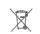
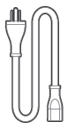
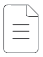
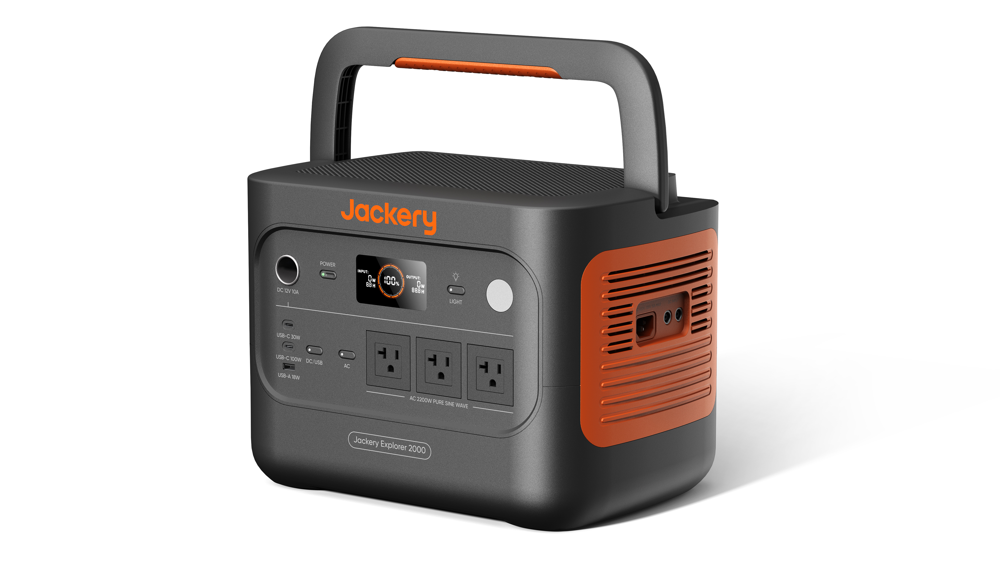
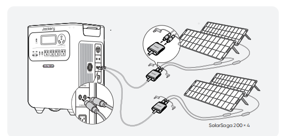
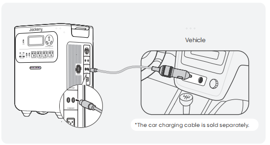
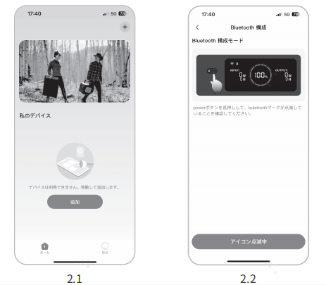

# INFORMATIONS DE SÉCURITÉ IMPORTANTES

<table class="manual-callout-table" style="width:100%; border-collapse:collapse; margin:0 0 16px 0;"><tbody><tr><td class="manual-callout-label" style="width:16%; border:1px solid #000; padding:6px 8px; vertical-align:top;">
<strong>AVERTISSEMENT</strong>
</td><td class="manual-callout-body" style="border:1px solid #000; padding:6px 8px; vertical-align:top;">
INSTRUCTIONS DE SÉCURITÉ POUR PRÉVENIR LES INCENDIES, LES CHOCS ÉLECTRIQUES OU LES BLESSURES
</td></tr></tbody></table>

Respectez toujours les précautions suivantes lors de l'utilisation du produit.

- Lisez toutes les instructions avant d'utiliser ce produit.
- Ne laissez pas les enfants jouer avec le produit. Une surveillance étroite est nécessaire lorsque le produit est utilisé à proximité d'enfants.
- Un risque de choc électrique peut survenir si des accessoires recommandés ou vendus par des fabricants non professionnels sont utilisés.
- Lorsque le produit n'est pas utilisé, débranchez la fiche d'alimentation de la prise du produit.
- Ne démontez pas le produit, car cela peut entraîner des risques imprévisibles tels qu'un incendie, une explosion ou un choc électrique.
- N'utilisez pas le produit avec des cordons, des fiches ou des câbles de sortie endommagés, car cela peut provoquer un choc électrique.
- Pour garantir une bonne circulation de l'air, gardez les orifices de ventilation du produit dégagés. La zone où le produit est utilisé doit disposer d'une circulation d'air suffisante dans un environnement frais et sec afin d'éviter toute surchauffe.
  - La charge dans un espace humide ou mal ventilé peut présenter des risques pour la sécurité.
  - L'eau peut provoquer des courts-circuits ou endommager le chargeur, entraînant des risques pour la sécurité.
- N'exposez pas le produit au feu, à des températures élevées, à la lumière directe du soleil ou à des environnements chauds comme l'intérieur d'un véhicule stationné. Une telle exposition peut provoquer un incendie ou une explosion.

## INSTRUCTIONS D\'ENTRETIEN PAR L\'UTILISATEUR

Pendant le cycle de vie des produits de stockage d\'énergie, une certaine dégradation de la capacité et de l\'énergie est attendue. À mesure que le nombre de cycles de charge et de décharge augmente et que la durée de stockage s\'allonge, cette dégradation s\'intensifie progressivement. Il s\'agit d\'un phénomène normal, conforme au vieillissement naturel des cellules de batterie.

# SIGNIFICATION DES SYMBOLES

<figure aria-label="Symbole / Signification" class="hb-symbol-signal-composition" data-component-id="HB-TABLE-SYMBOL-SIGNAL"><table class="hb-symbol-signal-table"><colgroup><col class="hb-symbol-signal-col-label"/><col class="hb-symbol-signal-col-meaning"/></colgroup><thead><tr><th class="hb-symbol-signal-label-heading" scope="col">
Symbole
</th><th class="hb-symbol-signal-meaning-heading" scope="col">
Signification
</th></tr></thead><tbody><tr><td class="hb-symbol-signal-label-cell">⚠AVERTISSEMENT</td><td class="hb-symbol-signal-meaning-cell">
Pratiques dangereuses pouvant entraîner des blessures graves, la mort et/ou des dommages matériels.
</td></tr><tr><td class="hb-symbol-signal-label-cell">⚠ATTENTION</td><td class="hb-symbol-signal-meaning-cell">
Pratiques dangereuses pouvant entraîner des blessures corporelles et/ou des dommages matériels.
</td></tr><tr><td class="hb-symbol-signal-label-cell">⚠REMARQUE</td><td class="hb-symbol-signal-meaning-cell">
Pratiques dangereuses pouvant entraîner des dommages à l'équipement, une perte de données, une détérioration des performances ou des résultats inattendus.
</td></tr><tr><td class="hb-symbol-signal-label-cell">⚠CONSEIL</td><td class="hb-symbol-signal-meaning-cell">
Complète les informations importantes ou les conseils d'utilisation dans le texte.
</td></tr></tbody></table></figure>

<figure aria-label="Symbole / Signification" class="hb-symbol-pair-composition" data-component-id="HB-TABLE-SYMBOL-ICON">

<table class="hb-symbol-panel-table"><colgroup><col class="hb-symbol-col-icon"/><col class="hb-symbol-col-meaning"/></colgroup><thead><tr><th class="hb-symbol-icon-heading" scope="col">
<strong>Symbole</strong>
</th><th class="hb-symbol-meaning-heading" scope="col">
<strong>Signification</strong>
</th></tr></thead><tbody><tr><td class="hb-symbol-icon"></td><td class="hb-symbol-meaning">
Symboles d’avertissement et de mise en garde. Signalent aux personnes des informations qui doivent être lues afin d’éviter les dangers ou risques potentiels.
</td></tr><tr><td class="hb-symbol-icon"></td><td class="hb-symbol-meaning">
Lire le manuel de l'opérateur
</td></tr><tr><td class="hb-symbol-icon"></td><td class="hb-symbol-meaning">
Ne démontez pas le produit.
</td></tr><tr><td class="hb-symbol-icon"></td><td class="hb-symbol-meaning">
Tenir le produit à l’écart du feu.
</td></tr></tbody></table>

<table class="hb-symbol-panel-table"><colgroup><col class="hb-symbol-col-icon"/><col class="hb-symbol-col-meaning"/></colgroup><thead><tr><th class="hb-symbol-icon-heading" scope="col">
<strong>Symbole</strong>
</th><th class="hb-symbol-meaning-heading" scope="col">
<strong>Signification</strong>
</th></tr></thead><tbody><tr><td class="hb-symbol-icon"></td><td class="hb-symbol-meaning">
Les enfants ne sont pas admis
</td></tr><tr><td class="hb-symbol-icon"></td><td class="hb-symbol-meaning">
Ce symbole indique que le produit contient une batterie lithium-ion (Li-ion), qui doit être éliminée ou recyclée de manière appropriée.
</td></tr><tr><td class="hb-symbol-icon"></td><td class="hb-symbol-meaning">
Ce symbole indique que le produit ne doit pas être jeté avec les ordures ménagères. Il doit être apporté à un point de collecte désigné pour un recyclage approprié.
Une élimination et un recyclage corrects contribuent à la protection de l’environnement. Pour plus d’informations, veuillez contacter votre autorité locale, le service de gestion des déchets ou le revendeur du produit.
</td></tr><tr><td class="hb-symbol-icon"></td><td class="hb-symbol-meaning">
Les piles et accumulateurs ne doivent pas être jetés avec les ordures ménagères.
En tant que consommateur, vous êtes légalement tenu de déposer toutes les piles et accumulateurs dans des points de collecte désignés, qu'ils contiennent ou non des substances dangereuses.
Veuillez rapporter les piles et accumulateurs usagés à un point de collecte local, un centre de recyclage ou au détaillant où ils ont été achetés. Une élimination appropriée garantit un recyclage respectueux de l'environnement et prévient les dommages potentiels pour la santé humaine et l'environnement.
</td></tr></tbody></table>

</figure>

# CONTENU DE LA BOÎTE

<figure aria-label="CONTENU DE LA BOÎTE" class="hb-inbox-composition" data-card-count="3" data-component-id="HB-SPECIAL-INBOX" data-inbox-variant="three-card-responsive"><ol class="hb-inbox-grid"><li class="hb-inbox-card" data-item-number="1">

<strong>Jackery Explorer 2000 Plus</strong>

</li><li class="hb-inbox-card" data-item-number="2">

<strong>Câble de charge CA</strong>

</li><li class="hb-inbox-card" data-item-number="3">

Manuel d’utilisation

</li></ol>

<strong>CONSEILS</strong>

Le câble de chargement pour voiture n'est pas inclus, mais peut être acheté séparément sur notre site Web.
Pour obtenir de l'aide, veuillez contacter le service client Jackery.

</figure>

# APERÇU DU PRODUIT

## VUE DE FACE

<table>
<colgroup>
<col style="width: 50%" />
<col style="width: 50%" />
</colgroup>
<tbody>
<tr>
<td>
<strong>Bouton POWER principal</strong>
</td>
<td>
<strong>LCD</strong>
</td>
</tr>
<tr>
<td>
<strong>Port 12 V CC</strong>

12 V⎓10 A max.
</td>
<td>
<strong>Bouton lumière LED</strong>
</td>
</tr>
<tr>
<td>
<strong>Bouton CC / USB</strong>
</td>
<td>
<strong>Lumière LED</strong>
</td>
</tr>
<tr>
<td>
<strong>Sortie USB-C 30 W</strong>

30 W max., 5 V⎓3 A, 9 V⎓3 A, 12 V⎓2,5 A, 15 V⎓2 A, 20 V⎓1,5 A
</td>
<td>
<strong>Bouton CA1</strong>
</td>
</tr>
<tr>
<td>
<strong>Sortie USB-C 140 W</strong>

140 W max., 5 V⎓3 A, 9 V⎓3 A, 12 V⎓3 A, 15 V⎓3 A, 20 V⎓5 A, 28 V⎓5 A
</td>
<td>
<strong>Bouton CA2</strong>
</td>
</tr>
<tr>
<td>
<strong>Sortie USB-A 18 W</strong>

18 W max., 5-6 V⎓3 A, 6-9 V⎓2 A, 9-12 V⎓1,5 A
</td>
<td>
<strong>Sortie AC</strong>

230 V~ 50 Hz, 10 A max., 2400 W Nominal
</td>
</tr>
</tbody>
</table>

<table>
<colgroup>
<col style="width: 100%" />
</colgroup>
<tbody>
<tr>
<td>
<strong>Sortie totale</strong>

2400 W Nominal, 4800 W crête
</td>
</tr>
</tbody>
</table>

## VUES LATÉRALES GAUCHE ET DROITE

<table>
<colgroup>
<col style="width: 50%" />
<col style="width: 50%" />
</colgroup>
<tbody>
<tr>
<td>
<strong>Poignée</strong>
</td>
<td>
<strong>Port d’extension CC</strong>

Connecter au bloc-batterie
</td>
</tr>
<tr>
<td></td>
<td>
<strong>Entrée CA</strong>

220 V-240 V~ 50 Hz, 10 A max.
</td>
</tr>
<tr>
<td></td>
<td>
<strong>Entrée CC (2×ports DC8020)</strong>

PV : 16-60 V⎓12 A max., Double à 21 A / 800 W max.

Véhicule : 11-16 V⎓8 A max., Double à 8 A max.
</td>
</tr>
</tbody>
</table>

# AFFICHAGE LCD

<figure aria-label="LCD icon meanings" class="hb-lcd-table-composition" data-component-id="HB-TABLE-LCD-ICON" tabindex="0"><table class="hb-lcd-icon-table"><colgroup><col class="hb-lcd-col-number"/><col class="hb-lcd-col-icon"/><col class="hb-lcd-col-name"/><col class="hb-lcd-col-description"/></colgroup><tbody><tr><td class="hb-lcd-number">
1
</td><td class="hb-lcd-icon"></td><td class="hb-lcd-name">
Wi-Fi
</td><td class="hb-lcd-description">

<strong>Allumé :</strong> Wi-Fi connecté.

<strong>Clignotant :</strong> Prêt à se connecter au Wi-Fi.

<strong>Éteint :</strong> Wi-Fi déconnecté.

</td></tr><tr><td class="hb-lcd-number">
2
</td><td class="hb-lcd-icon"></td><td class="hb-lcd-name">
Bluetooth
</td><td class="hb-lcd-description">

<strong>Allumé :</strong> Bluetooth connecté.

<strong>Clignotant :</strong> Prêt à se connecter au Bluetooth.

<strong>Éteint :</strong> Bluetooth déconnecté.

</td></tr><tr><td class="hb-lcd-number">
3
</td><td class="hb-lcd-icon"></td><td class="hb-lcd-name">
Mode de Charge Silencieuse
</td><td class="hb-lcd-description">

<strong>Allumé :</strong> Le bruit pendant la charge est considérablement réduit, tandis que la puissance de la charge connectée est limitée par la puissance de dérivation.

<strong>Éteint :</strong> Le mode de charge silencieuse est désactivé. Activez/désactivez cette fonction dans l'application Jackery. Le réglage est conservé lorsque l’appareil est mis hors tension.

</td></tr><tr><td class="hb-lcd-number">
4
</td><td class="hb-lcd-icon"></td><td class="hb-lcd-name">
Plan de Charge
</td><td class="hb-lcd-description">

Personnalisez le temps de charge du Jackery Explorer 2000 Plus. Adapté aux situations avec des tarifs d’électricité variables, il permet d’établir des plans de charge en fonction des heures pleines et creuses, afin de réduire les coûts d’électricité.

Veuillez configurer cette fonction dans l’application Jackery. Le réglage est conservé lorsque l’appareil est mis hors tension.

</td></tr><tr><td class="hb-lcd-number">
5
</td><td class="hb-lcd-icon"></td><td class="hb-lcd-name">
Mode Autonome
</td><td class="hb-lcd-description">

Maximise l’utilisation de l’énergie solaire et réduit la dépendance à l’électricité du réseau en donnant la priorité à l’énergie solaire stockée, ce qui diminue les coûts d’électricité. La station d’énergie doit être connectée simultanément aux panneaux solaires et au réseau, la puissance de charge étant limitée par la puissance de dérivation.

Veuillez activer/désactiver cette fonction dans l’application. Le réglage est conservé lorsque l’appareil est mis hors tension.

</td></tr><tr><td class="hb-lcd-number">
6
</td><td class="hb-lcd-icon"></td><td class="hb-lcd-name">
Mode TOU
</td><td class="hb-lcd-description">

<strong>Allumé :</strong> Le mode TOU est activé (SOC de secours par défaut : 60 %). Pendant les heures de pointe, le produit privilégie la décharge de la batterie afin de réduire les coûts liés à la consommation en période de pointe, lorsque l’énergie stockée dépasse le SOC de réserve. Pendant les heures creuses, le système recharge la batterie à partir du réseau afin de réaliser l’écrêtage des pics et le remplissage des creux.

<strong>Éteint :</strong> Le mode TOU est désactivé. L’appareil ne suit pas la stratégie TOU (heures pleines / heures creuses) et fonctionne selon la logique d’alimentation et de charge par défaut.

Veuillez activer/désactiver cette fonction dans l’application. Le réglage est conservé lorsque l’appareil est mis hors tension.

</td></tr><tr><td class="hb-lcd-number">
7
</td><td class="hb-lcd-icon"></td><td class="hb-lcd-name">
UPS (ASI)
</td><td class="hb-lcd-description">

<strong>Allumé :</strong> Le produit fonctionne en mode bypass. Les charges connectées aux ports CA sont alimentées par le réseau électrique au lieu de la station d’énergie.

En cas de coupure soudaine du réseau, le produit bascule automatiquement sur son alimentation par batterie en 10 ms.

<strong>Éteint :</strong> Le produit n’est pas en mode bypass. Les charges connectées aux ports CA sont alimentées par la batterie interne de la station d’énergie.

</td></tr><tr><td class="hb-lcd-number">
8
</td><td class="hb-lcd-icon"></td><td class="hb-lcd-name">
Indicateur d'alimentation CA
</td><td class="hb-lcd-description">
La sortie CA (onde sinusoïdale pure) est activée.
</td></tr><tr><td class="hb-lcd-number">
9
</td><td class="hb-lcd-icon"></td><td class="hb-lcd-name">
Tension et fréquence de sortie
</td><td class="hb-lcd-description">
Affiche la tension et la fréquence de sortie lorsque la sortie CA est activée.
</td></tr><tr><td class="hb-lcd-number">
10
</td><td class="hb-lcd-icon"></td><td class="hb-lcd-name">
Puissance d’Entrée
</td><td class="hb-lcd-description">
Affiche la puissance d'entrée en watts.
</td></tr><tr><td class="hb-lcd-number">
11
</td><td class="hb-lcd-icon"></td><td class="hb-lcd-name">
Temps de Charge Restant
</td><td class="hb-lcd-description">
Affiche le temps de charge restant.
</td></tr><tr><td class="hb-lcd-number">
12
</td><td class="hb-lcd-icon"></td><td class="hb-lcd-name">
Indicateur de Charge sur Prise Murale CA
</td><td class="hb-lcd-description">
Le produit est chargé via l'entrée CA en utilisant l'énergie du réseau.
</td></tr><tr><td class="hb-lcd-number">
13
</td><td class="hb-lcd-icon"></td><td class="hb-lcd-name">
Indicateur de Charge Voiture
</td><td class="hb-lcd-description">
Le produit est chargé via l’entrée CC (DC8020) en utilisant du CC 12V (charge via voiture).
</td></tr><tr><td class="hb-lcd-number">
14
</td><td class="hb-lcd-icon"></td><td class="hb-lcd-name">
Indicateur de Charge Solaire
</td><td class="hb-lcd-description">
Le produit est chargé via l’entrée CC (DC8020) à l’aide de panneaux solaires.
</td></tr><tr><td class="hb-lcd-number">
15
</td><td class="hb-lcd-icon"></td><td class="hb-lcd-name">
Mode d’Économie de Batterie
</td><td class="hb-lcd-description">

<strong>Allumé :</strong> Le mode d’économie de batterie est activé. Des limites de charge et de décharge sont appliquées afin de prolonger la durée de vie de la batterie.

<strong>Éteint :</strong> Le mode d'économie de batterie est désactivé.

Activez/désactivez cette fonction dans l'application Jackery. Le réglage est conservé lorsque l’appareil est mis hors tension.

Lorsque cette fonction est activée, le produit effectue occasionnellement un cycle de charge-décharge complet pour calibrer le SOC.

</td></tr><tr><td class="hb-lcd-number">
16
</td><td class="hb-lcd-icon"></td><td class="hb-lcd-name">
Limite de puissance de charge
</td><td class="hb-lcd-description">

<strong>Allumé :</strong> La limite de puissance de charge est activée dans l'application Jackery.

<strong>Éteint :</strong> La limite de puissance de charge est désactivée dans l'application Jackery.

Le réglage est conservé lorsque l’appareil est mis hors tension.

</td></tr><tr><td class="hb-lcd-number">
17
</td><td class="hb-lcd-icon"></td><td class="hb-lcd-name">
Indicateur de Puissance de la Batterie
</td><td class="hb-lcd-description">
Lorsque le produit est en charge, le cercle orange autour du pourcentage de batterie s’allume en séquence. Lorsqu’il charge d’autres appareils, le cercle orange reste allumé.
</td></tr><tr><td class="hb-lcd-number">
18
</td><td class="hb-lcd-icon"></td><td class="hb-lcd-name">
Pourcentage de Batterie Restant
</td><td class="hb-lcd-description">
Affiche le pourcentage de batterie restant.
</td></tr><tr><td class="hb-lcd-number">
19
</td><td class="hb-lcd-icon"></td><td class="hb-lcd-name">
Indicateur de Batterie Faible
</td><td class="hb-lcd-description">

<strong>Allumé :</strong> Le niveau de la batterie est inférieur à 20 %.

<strong>Clignotant :</strong> Le niveau de la batterie est inférieur à 5 %.

<strong>Éteint :</strong> Le niveau de la batterie n'est pas inférieur à 20 % ou le produit est en charge.

</td></tr><tr><td class="hb-lcd-number">
20
</td><td class="hb-lcd-icon"></td><td class="hb-lcd-name">
Minuterie de décharge
</td><td class="hb-lcd-description">

<strong>Allumé :</strong> une minuterie de décharge est définie.

<strong>Éteint :</strong> aucune minuterie de décharge n’est définie.

Activez/désactivez cette fonction dans l'application Jackery. Le réglage n'est pas conservé lorsque l'appareil est mis hors tension.

</td></tr><tr><td class="hb-lcd-number">
21
</td><td class="hb-lcd-icon"></td><td class="hb-lcd-name">
Batteries connectées
</td><td class="hb-lcd-description">
Indique que le produit est connecté au nombre spécifié de blocs-batterie 2000.
</td></tr><tr><td class="hb-lcd-number">
22
</td><td class="hb-lcd-icon"></td><td class="hb-lcd-name">
Mode d’Économie d’Énergie
</td><td class="hb-lcd-description">

Lorsque la sortie CA ou CC est activée en appuyant sur le bouton CA ou le bouton CC / USB :

<strong>Allumé :</strong> Mode d'économie d'énergie activé.

<strong>Éteint :</strong> Mode d'économie d'énergie désactivé.

Le réglage est conservé lorsque l’appareil est mis hors tension.

</td></tr><tr><td class="hb-lcd-number">
23
</td><td class="hb-lcd-icon"></td><td class="hb-lcd-name">
Indicateur de Température Élevée
</td><td class="hb-lcd-description">
La protection contre les températures élevées est déclenchée. Le produit peut cesser de fonctionner jusqu'à ce que sa température revienne dans la plage de fonctionnement normale.
</td></tr><tr><td class="hb-lcd-number">
24
</td><td class="hb-lcd-icon"></td><td class="hb-lcd-name">
Indicateur de Basse Température
</td><td class="hb-lcd-description">
La protection contre les basses températures est déclenchée. Le produit peut cesser de fonctionner jusqu'à ce que sa température revienne dans la plage de fonctionnement normale.
</td></tr><tr><td class="hb-lcd-number">
25
</td><td class="hb-lcd-icon"></td><td class="hb-lcd-name">
Code d’erreur
</td><td class="hb-lcd-description">
Une erreur produit s’est produite. Veuillez consulter la section « Dépannage » pour plus de détails.
</td></tr><tr><td class="hb-lcd-number">
26
</td><td class="hb-lcd-icon"></td><td class="hb-lcd-name">
Puissance de Sortie
</td><td class="hb-lcd-description">
Affiche la puissance de sortie en watts.
</td></tr><tr><td class="hb-lcd-number">
27
</td><td class="hb-lcd-icon"></td><td class="hb-lcd-name">
Temps de Décharge Restant
</td><td class="hb-lcd-description">
Affiche le temps de décharge restant.
</td></tr></tbody></table></figure>

# FONCTIONNEMENT

## MARCHE/ARRÊT

Marche : appuyez une fois.

Arrêt : appuyez et maintenez pendant 3 secondes.

**Temps de veille par défaut :** 2 heures.

Le produit s\'éteindra automatiquement après 2 heures d\'inactivité, sans charge ni décharge.

\*Le temps de veille peut être réglé dans l\'application Jackery.

Lorsque le mode d\'économie d\'énergie est activé, le produit s\'éteindra automatiquement après 12 heures si le bouton CA1/2 ou le bouton CC / USB est activé mais que le produit ne charge ni ne décharge.

## SORTIE CA MARCHE/ARRÊT

**Prérequis :** Le produit est allumé.

Les boutons CA1 et CA2 contrôlent deux paires de prises CA séparées. Appuyer sur chaque bouton active ou désactive sa paire de prises CA correspondante.

**Marche**

appuyez une fois

**Arrêt**

appuyez une fois

## SORTIE CC 12V/USB MARCHE/ARRÊT

**Prérequis :** Le produit est allumé.

**Marche**

appuyez une fois

**Arrêt**

appuyez une fois

<table class="manual-callout-table" style="width:100%; border-collapse:collapse; margin:0 0 16px 0;"><tbody><tr><td class="manual-callout-label" style="width:16%; border:1px solid #000; padding:6px 8px; vertical-align:top;">
<strong>ATTENTION</strong>
</td><td class="manual-callout-body" style="border:1px solid #000; padding:6px 8px; vertical-align:top;"><ul class="simple">
<li>
<strong>Les ports USB-C de 140 W sont des ports de sortie haute puissance de type Source d'alimentation 3 (PS3) selon USB-PD.</strong> Si l'appareil utilisateur ou l'accessoire connecté ne répond pas aux exigences de sécurité, il peut présenter un risque d'incendie. Avant d'utiliser ces ports, assurez-vous que l'appareil ou l'accessoire connecté dispose d'une protection contre les incendies.
</li>
<li>
Ne connectez Jackery Explorer 2000 Plus qu'à des appareils ou accessoires conformes aux clauses 6.3, 6.4 et 6.5 de la norme IEC/EN/UL 62368-1 (ou autres normes équivalentes).
</li>
<li>
Pour obtenir la puissance de sortie maximale, utilisez le câble USB-C vers USB-C 5 A (28 V CC/5A, 140 W).
</li>
</ul>
</td></tr></tbody></table>

Le produit peut charger la batterie de votre voiture à l\'aide du câble de charge de batterie automobile Jackery 12V, vendu séparément et disponible sur notre site web.

<table class="manual-callout-table" style="width:100%; border-collapse:collapse; margin:0 0 16px 0;"><tbody><tr><td class="manual-callout-label" style="width:16%; border:1px solid #000; padding:6px 8px; vertical-align:top;">
<strong>ATTENTION</strong>
</td><td class="manual-callout-body" style="border:1px solid #000; padding:6px 8px; vertical-align:top;"><ul class="simple">
<li>
Le port CC 12V est uniquement compatible avec les batteries de voiture 12V et ne convient pas aux systèmes 24V.
</li>
<li>
Ne démarrez pas la voiture pendant que le produit charge la batterie via le port de sortie CC 12V, car cela pourrait endommager le produit.
</li>
<li>
Cette fonctionnalité est destinée à un usage d'urgence uniquement et ne peut pas charger une batterie de voiture morte ou endommagée.
</li>
</ul>
</td></tr></tbody></table>

## MODE D\'ÉCONOMIE D\'ÉNERGIE

Pour éviter une consommation inutile de la batterie due à l\'oubli de désactiver la sortie, le produit active par défaut le mode d\'économie d\'énergie. Lorsque la sortie CA ou CC/USB est activée, l\'icône du mode d\'économie d\'énergie s\'affiche sur l\'écran LCD. Dans ce mode, si aucun appareil n\'est connecté ou si la consommation de l\'appareil connecté est inférieure à un certain seuil (sortie CA de 25 W ou sortie CC/USB de 2 W), la sortie correspondante s\'éteint automatiquement après la durée définie. Le réglage par défaut est 12 heures. La durée du mode d\'économie d\'énergie peut être réglée dans l\'application Jackery sur 1H, 2 H, 8 H, 12 H ou 24 H. Si l\'option \"Never Off\" est sélectionnée, le mode d\'économie d\'énergie sera désactivé.

Pour désactiver le mode d\'économie d\'énergie, appuyez simultanément sur le bouton CA1 et sur le bouton POWER principal pendant plus de 3 secondes. Une fois le mode d\'économie d\'énergie désactivé, l\'icône ne s\'affichera plus sur l\'écran LCD et le produit n\'éteindra pas automatiquement la sortie CA ou CC/USB.

Lors de l\'alimentation d\'appareils à faible puissance (CA ≤ 25 W ou CC/USB ≤ 2 W), désactivez le mode d\'économie d\'énergie afin d\'éviter l\'arrêt automatique de la sortie pendant le fonctionnement.

Maintenez les deux boutons enfoncés pendant plus de 3 secondes.

<table class="manual-callout-table" style="width:100%; border-collapse:collapse; margin:0 0 16px 0;"><tbody><tr><td class="manual-callout-label" style="width:16%; border:1px solid #000; padding:6px 8px; vertical-align:top;">
<strong>REMARQUE</strong>
</td><td class="manual-callout-body" style="border:1px solid #000; padding:6px 8px; vertical-align:top;">
Le mode d'économie d'énergie reprend l'état précédent après l'allumage. Toute modification du mode doit être effectuée manuellement.
</td></tr></tbody></table>

## LAMPE LED MARCHE/ARRÊT

La lampe LED dispose de deux modes : mode éclairage et mode SOS. Dans n\'importe quel mode, appuyez et maintenez sur le bouton pour éteindre la lumière.

Appuyez une fois sur le bouton de la lampe LED pour l\'allumer.

Appuyez de nouveau pour passer en mode SOS.

Appuyez une troisième fois pour éteindre la lampe.

## Fonction de reprise de Sortie CA et CC

La fonction de reprise de la sortie CA/CC est désactivée par défaut. Activez cette fonction dans l'application afin que l'appareil mémorise l'état de sortie CA/CC et reprenne automatiquement les sorties CA et CC dans les conditions définies.

<table>
<thead>
<tr>
<th class="head">
Conditions de reprise automatique
</th>
<th class="head">
Conditions sans reprise automatique
</th>
</tr>
</thead>
<tbody>
<tr>
<td>
Mise sous tension/redémarrage après arrêt ou redémarrage
</td>
<td>
Sortie désactivée manuellement (bouton/App)
</td>
</tr>
<tr>
<td rowspan="2">
SOC de la batterie ≥ limite de décharge +10 % une fois la limite atteinte
</td>
<td>
Sortie désactivée en mode économie d’énergie
</td>
</tr>
<tr>
<td>
Sortie désactivée suite à un déclenchement de protection
</td>
</tr>
<tr>
<td>
Mise à niveau OTA terminée
</td>
<td>
Sortie désactivée par le minuteur de décharge
</td>
</tr>
</tbody>
</table>

## AFFICHAGE LCD

<table style="width:100%; border-collapse:collapse; margin:0.75rem 0 0.5rem 0;">
<tbody>
<tr>
<td rowspan="6" style="text-align: center; width: 24%; border: 1px solid #cfcfcf; padding: 8px; vertical-align: top;"></td>
<td rowspan="3" style="width: 18%; border: 1px solid #cfcfcf; padding: 8px; vertical-align: top">Allumer en discontinu</td>
<td style="width: 12%; border: 1px solid #cfcfcf; padding: 8px; vertical-align: top">Allumer</td>
<td style="width: 46%; border: 1px solid #cfcfcf; padding: 8px; vertical-align: top">Appuyez sur le bouton POWER principal ou lorsque le produit est en charge.</td>
</tr>
<tr>
<td style="border: 1px solid #cfcfcf; padding: 8px; vertical-align: top">Éteindre</td>
<td style="border: 1px solid #cfcfcf; padding: 8px; vertical-align: top">Appuyez sur le bouton POWER principal.</td>
</tr>
<tr>
<td style="border: 1px solid #cfcfcf; padding: 8px; vertical-align: top">Arrêt automatique</td>
<td style="border: 1px solid #cfcfcf; padding: 8px; vertical-align: top">L'écran LCD s'éteint automatiquement et entre en mode veille après 2 minutes d'inactivité.</td>
</tr>
<tr>
<td rowspan="3" style="border: 1px solid #cfcfcf; padding: 8px; vertical-align: top">Allumer en continu (en cours de charge ou de décharge)</td>
<td style="border: 1px solid #cfcfcf; padding: 8px; vertical-align: top">Allumer</td>
<td style="border: 1px solid #cfcfcf; padding: 8px; vertical-align: top">Appuyez deux fois sur le bouton POWER principal lorsque le produit est allumé.</td>
</tr>
<tr>
<td style="border: 1px solid #cfcfcf; padding: 8px; vertical-align: top">Éteindre</td>
<td style="border: 1px solid #cfcfcf; padding: 8px; vertical-align: top">Appuyez sur le bouton POWER principal.</td>
</tr>
<tr>
<td style="border: 1px solid #cfcfcf; padding: 8px; vertical-align: top">Arrêt automatique</td>
<td style="border: 1px solid #cfcfcf; padding: 8px; vertical-align: top">L'écran LCD s'éteint automatiquement après 2 heures d'inactivité.</td>
</tr>
</tbody>
</table>

Vous pouvez également définir le mode d\'affichage de l\'écran dans l\'application Jackery.

## FONCTIONNEMENT DES BOUTONS

| Boutons | Utilisation | Fonction |
|----|----|----|
| Bouton POWER principal + Bouton CA1 | Appuyer 3 secondes sur les deux | Activer/désactiver le mode économie d\'énergie |
| Bouton POWER principal + Bouton **CC/USB** | Appuyer 3 secondes sur les deux | Réinitialiser le Wi-Fi et le Bluetooth |
| Bouton **CC/USB** + Bouton CA1 | Appuyer 1 seconde sur les deux | Activer/désactiver le Wi-Fi et le Bluetooth |
| Bouton POWER principal + Bouton d\'éclairage LED | Appuyer 1 seconde sur les deux | Activer/désactiver le mode de charge d\'urgence |

# ALIMENTATION SANS INTERRUPTION (ASI)

Connectez le produit à une prise murale à l\'aide du câble de charge CA, puis appuyez sur le bouton d'alimentation CA pour alimenter vos appareils en même temps.

Une alimentation sans coupure (UPS) est un système d\'alimentation continue qui fournit automatiquement une alimentation électrique de secours à une charge lorsque l\'alimentation du réseau principal est interrompue.

En cas de perte soudaine de l\'alimentation du réseau, le Jackery Explorer 2000 Plus basculera automatiquement sur l\'alimentation stockée en moins de 10 ms pour maintenir vos appareils en fonctionnement.

En mode UPS, la puissance de crête de sortie de l\'appareil atteint 10 A avant les coupures de courant. Comme la charge et la décharge simultanées sont activées en mode bypass, la puissance de sortie réelle est inférieure à la puissance nominale en mode bypass, mais revient à la puissance nominale lors des coupures.

<table class="manual-callout-table" style="width:100%; border-collapse:collapse; margin:0 0 16px 0;"><tbody><tr><td class="manual-callout-label" style="width:16%; border:1px solid #000; padding:6px 8px; vertical-align:top;">
<strong>ATTENTION</strong>
</td><td class="manual-callout-body" style="border:1px solid #000; padding:6px 8px; vertical-align:top;"><ul class="simple">
<li>
Ce produit ne prend pas en charge un basculement instantané (0 ms). Ne le connectez pas à des équipements nécessitant une alimentation avec commutation en 0 ms, tels que des serveurs de données ou des stations de travail.
</li>
<li>
Avant toute utilisation, testez plusieurs fois la compatibilité avec votre appareil.
</li>
<li>
Ne connectez pas de charges dépassant la puissance maximale de sortie du produit. Sinon, la protection contre les surcharges sera déclenchée.
</li>
</ul>
</td></tr></tbody></table>

# CONNECTER AU(X) PACK(S) BATTERIE (VENDU SÉPARÉMENT)

## CONNECTER AU(X) PACK(S) BATTERIE (VENDU SÉPARÉMENT)

Ce produit peut prendre en charge jusqu\'à 5 packs batterie pour répondre aux besoins d\'une grande capacité énergétique. Pour les détails sur son utilisation, veuillez vous référer au *manuel d\'utilisation du Jackery Battery Pack 2000*.

<table class="manual-callout-table" style="width:100%; border-collapse:collapse; margin:0 0 16px 0;"><tbody><tr><td class="manual-callout-label" style="width:16%; border:1px solid #000; padding:6px 8px; vertical-align:top;">
<strong>ATTENTION</strong>
</td><td class="manual-callout-body" style="border:1px solid #000; padding:6px 8px; vertical-align:top;"><ul class="simple">
<li>
Assurez-vous que tous les produits sont éteints avant de connecter Jackery Explorer 2000 Plus au(x) Jackery Battery Pack 2000.
</li>
<li>
Pour assurer le bon fonctionnement du produit, assurez-vous que les entrées et sorties d'air sur les deux côtés ne sont pas obstruées. Laissez un espace d'au moins 200 mm entre les ouvertures et tout objet pour permettre une dissipation thermique adéquate.
</li>
<li>
Lorsque le produit est utilisé avec des batteries d'extension connectées, le nombre maximal de batteries d'extension empilées est de 3 par défaut, et le produit doit être placé sur une surface plane, stable et suffisamment résistante.
</li>
<li>
Si 4 batteries d'extension ou plus doivent être empilées, le produit doit être placé dans une zone stable, contre un mur et à l'abri des chocs extérieurs, et les mesures nécessaires de fixation anti-basculement doivent être prises.
</li>
</ul>
</td></tr></tbody></table>

|  |  |  |
|----|----|----|
| **Jackery Battery Pack 2000** | **Câble de rallonge** | **Manuel d'utilisation** |

## CHARGE

**L\'énergie verte d\'abord :** nous préconisons l\'utilisation de l\'énergie verte en premier. Ce produit prend en charge deux modes de recharge simultanés : la recharge solaire et la recharge par prise murale CA.

Quand la recharge par prise murale CA et la recharge solaire sont effectuées en même temps, le produit privilégie la recharge solaire. Les deux méthodes sont utilisées pour charger la batterie à la puissance maximalement autorisée.

**Chargez complètement le produit avant sa première utilisation.**

<table class="manual-callout-table" style="width:100%; border-collapse:collapse; margin:0 0 16px 0;"><tbody><tr><td class="manual-callout-label" style="width:16%; border:1px solid #000; padding:6px 8px; vertical-align:top;">
<strong>REMARQUE</strong>
</td><td class="manual-callout-body" style="border:1px solid #000; padding:6px 8px; vertical-align:top;"><ul class="simple">
<li>
La température de charge recommandée pour le produit est de -10 °C à 45 °C, et la température de décharge est de -10 °C à 45 °C.
</li>
<li>
Utiliser le produit en dehors de cette plage de températures peut limiter ses capacités de charge et de décharge, voire empêcher la charge ou la décharge.
</li>
<li>
La puissance de charge et la capacité de la batterie du produit peuvent varier en raison des fluctuations de température.
</li>
</ul>
</td></tr></tbody></table>

### CHARGEMENT PAR PRISE MURALE CA

Connectez le câble de charge CA au port d\'entrée CA de l\'appareil et à une prise murale.

<table class="manual-callout-table" style="width:100%; border-collapse:collapse; margin:0 0 16px 0;"><tbody><tr><td class="manual-callout-label" style="width:16%; border:1px solid #000; padding:6px 8px; vertical-align:top;">
<strong>ATTENTION</strong>
</td><td class="manual-callout-body" style="border:1px solid #000; padding:6px 8px; vertical-align:top;">
Assurez-vous que le câble de charge CA est entièrement et solidement inséré dans le port d’entrée CA. Une connexion incomplète peut entraîner un courant instable, une surchauffe, un mauvais contact ou un dysfonctionnement de l'appareil.
</td></tr></tbody></table>

**Mode de charge d\'urgence**

Dans ce mode, vous pouvez recharger rapidement la station d'énergie portable en utilisant la méthode de charge CA. Cette fonction de charge d\'urgence peut être activée ou désactivée via l\'application Jackery. En mode de charge d\'urgence, la lumière circulaire indiquant l\'état de charge (SOC) clignote plus rapidement.

\*Pour prolonger au maximum la durée de vie de la batterie, il est préférable de charger à la vitesse standard. La charge d\'urgence doit être utilisée uniquement pour des situations nécessitant un boost rapide en énergie et n\'est pas recommandée pour un usage régulier sur le long terme.

## CHARGEMENT PAR PANNEAUX SOLAIRES (Vendu séparément)

Le Jackery Explorer 2000 Plus dispose de deux ports d'entrée DC8020 et est compatible avec les panneaux solaires de Jackery.

Si un seul port d'entrée DC8020 doit être connecté à deux panneaux solaires simultanément, veuillez vous référer au schéma ci-dessous pour le branchement via le connecteur de panneau solaire (vendu séparément, non inclus en standard).

<table class="manual-callout-table" style="width:100%; border-collapse:collapse; margin:0 0 16px 0;"><tbody><tr><td class="manual-callout-label" style="width:16%; border:1px solid #000; padding:6px 8px; vertical-align:top;">
<strong>ATTENTION</strong>
</td><td class="manual-callout-body" style="border:1px solid #000; padding:6px 8px; vertical-align:top;">
Un port d’entrée DC8020 peut être connecté à un maximum de deux panneaux solaires.
</td></tr></tbody></table>

<table class="manual-callout-table" style="width:100%; border-collapse:collapse; margin:0 0 16px 0;"><tbody><tr><td class="manual-callout-label" style="width:16%; border:1px solid #000; padding:6px 8px; vertical-align:top;">
<strong>ATTENTION</strong>
</td><td class="manual-callout-body" style="border:1px solid #000; padding:6px 8px; vertical-align:top;">
Assurez-vous que la tension d’entrée pour les deux ports d’entrée CC est la même. Sinon, le produit pourrait être endommagé. Par exemple:

<ul class="simple">
<li>
Utiliser le même modèle de panneaux solaires Jackery et le même nombre de panneaux lors de la connexion des panneaux solaires aux deux ports d’entrée DC8020.
</li>
<li>
Ne chargez pas le produit à la fois avec un chargeur de voiture et un panneau solaire simultanément. Cela pourrait faire sauter le fusible de la voiture ou entraîner un échec de la charge.
</li>
</ul>
</td></tr></tbody></table>

Il est recommandé d'utiliser le panneau solaire Jackery pour charger le Jackery Explorer 2000 Plus. Assurez-vous que la tension en circuit ouvert (Voc) du panneau solaire se situe dans la plage de tension d'entrée CC de Jackery Explorer 2000 Plus (16 V-60 V). Jackery décline toute responsabilité pour tout dommage ou toute perte résultant de l'utilisation de panneaux solaires tiers.

## CHARGEMENT PAR PRISE DE VOITURE (Vendu séparément)

Ce produit peut être chargé à l\'aide d\'un chargeur de voiture 12 V. Assurez-vous que le chargeur de voiture est correctement connecté à la prise 12 V du véhicule (allume-cigare).

Véhicule

※Le câble de chargement de voiture est vendu séparément.

<table class="manual-callout-table" style="width:100%; border-collapse:collapse; margin:0 0 16px 0;"><tbody><tr><td class="manual-callout-label" style="width:16%; border:1px solid #000; padding:6px 8px; vertical-align:top;">
<strong>ATTENTION</strong>
</td><td class="manual-callout-body" style="border:1px solid #000; padding:6px 8px; vertical-align:top;"><ul class="simple">
<li>
Veuillez démarrer le véhicule avant de charger votre station d'énergie.
</li>
<li>
Si le véhicule roule sur des routes accidentées, il est interdit d'utiliser le chargeur de voiture afin d'éviter tout risque de surchauffe dû à une mauvaise connexion. La société ne sera pas responsable des pertes causées par une utilisation non conforme.
</li>
<li>
La charge par véhicule est uniquement applicable aux véhicules en 12 V CC, pas en 24 V CC. Veuillez ne pas charger ce produit dans un véhicule 24 V afin d'éviter tout risque de blessure ou de dommage matériel.
</li>
</ul>
</td></tr></tbody></table>

# STOCKAGE

Conservez le produit dans un endroit propre et sec avec une ventilation adéquate. Température et humidité de stockage :

- 1 mois : -20 °C à 45 °C (0-60 % HR)

- 3 mois : 0 °C à 45 °C (0-60 % HR)

- 12 mois : 0 °C à 25 °C (0-60 % HR)

Si ce produit est stocké pendant une longue période (3 à 6 mois) avec la batterie déchargée, il peut devenir impossible de le recharger. Pour éviter cela et préserver la santé de la batterie, il est recommandé de vérifier et de recharger le produit tous les trois mois, et d\'effectuer un cycle de charge et de décharge complet au moins une fois tous les 6 à 12 mois.

# DÉPANNAGE

Si l\'un des codes d\'erreur suivants apparaît, suivez les actions correctives indiquées pour résoudre le problème. Si l\'erreur persiste, veuillez contacter le service client Jackery.

<figure aria-label="Code d'erreur / Mesures correctives" class="hb-troubleshooting-composition" data-component-id="HB-TABLE-TROUBLESHOOTING" tabindex="0"><table class="hb-troubleshooting-table"><colgroup><col class="hb-troubleshooting-col-code"/><col class="hb-troubleshooting-col-measures"/></colgroup><thead><tr><th class="hb-troubleshooting-code" scope="col">
Code d'erreur
</th><th class="hb-troubleshooting-measures" scope="col">
Mesures correctives
</th></tr></thead><tbody><tr><td class="hb-troubleshooting-code">
F0
</td><td class="hb-troubleshooting-measures">
Redémarrez le produit.
</td></tr><tr><td class="hb-troubleshooting-code">
F1
</td><td class="hb-troubleshooting-measures">
Redémarrez le produit.
</td></tr><tr><td class="hb-troubleshooting-code">
F2
</td><td class="hb-troubleshooting-measures">
Redémarrez le produit.
</td></tr><tr><td class="hb-troubleshooting-code">
F3
</td><td class="hb-troubleshooting-measures">
Redémarrez le produit.
</td></tr><tr><td class="hb-troubleshooting-code">
F4
</td><td class="hb-troubleshooting-measures">
Connectez le produit à des charges pour décharger sa batterie jusqu'à ce que l'erreur disparaisse.
</td></tr><tr><td class="hb-troubleshooting-code">
F5
</td><td class="hb-troubleshooting-measures">
Chargez le produit via des panneaux solaires ou une prise murale CA jusqu'à ce que l'erreur disparaisse.
</td></tr><tr><td class="hb-troubleshooting-code">
F6
</td><td class="hb-troubleshooting-measures">

1. Attendez que le réseau se normalise avant de charger le produit via une prise murale CA.

2. Vérifiez si les entrées et sorties d'air sont obstruées; assurez un espace de 20 cm de chaque côté du produit.

3. Placez le produit dans un endroit qui n'est pas exposé à la lumière directe du soleil ou à des températures ambiantes élevées.

4. Déconnectez toutes les charges du produit. Laissez le produit inactif et attendez que l'erreur disparaisse.

5. Redémarrez le produit.

</td></tr><tr><td class="hb-troubleshooting-code">
F7
</td><td class="hb-troubleshooting-measures">

1. Retirez toutes les entrées CC du produit.

2. Vérifiez la tension en circuit ouvert (Voc) des panneaux solaires connectés. Le produit accepte une tension d'entrée CC maximale de 60V.

3. Redémarrez le produit et laissez-le inactif. Attendez que l'erreur disparaisse.

</td></tr><tr><td class="hb-troubleshooting-code">
F8
</td><td class="hb-troubleshooting-measures">
Contacter le service client Jackery.
</td></tr><tr><td class="hb-troubleshooting-code">
F9
</td><td class="hb-troubleshooting-measures">
Retirez la charge connectée aux ports DC/USB du produit. Attendez que l'erreur disparaisse.
</td></tr><tr><td class="hb-troubleshooting-code">
FE
</td><td class="hb-troubleshooting-measures">
Contacter le service client Jackery.
</td></tr></tbody></table></figure>

# SPÉCIFICATIONS

## INFORMATIONS GÉNÉRALES

<figure aria-label="INFORMATIONS GÉNÉRALES" class="hb-spec-table-composition"><table class="hb-spec-table manual-table manual-spec-table"><colgroup><col class="hb-spec-col-label"/><col class="hb-spec-col-value"/></colgroup>
<tbody>
<tr>
<th class="hb-spec-label manual-spec-label" scope="row">Nom du produit</th>
<td class="hb-spec-value manual-spec-value">Jackery Explorer 2000 Plus</td>
</tr>
<tr>
<th class="hb-spec-label manual-spec-label" scope="row">N° de modèle</th>
<td class="hb-spec-value manual-spec-value">JE-2000E</td>
</tr>
<tr>
<th class="hb-spec-label manual-spec-label" scope="row">Capacité</th>
<td class="hb-spec-value manual-spec-value">2048 Wh (40 Ah / 51,2 V CC)</td>
</tr>
<tr>
<th class="hb-spec-label manual-spec-label" scope="row">Cellule Chimique</th>
<td class="hb-spec-value manual-spec-value">LiFePO₄</td>
</tr>
<tr>
<th class="hb-spec-label manual-spec-label" scope="row">Poids</th>
<td class="hb-spec-value manual-spec-value">Environ 18,8 kg</td>
</tr>
<tr>
<th class="hb-spec-label manual-spec-label" scope="row">Dimensions</th>
<td class="hb-spec-value manual-spec-value">36,6 x 25,5 x 27,2 cm</td>
</tr>
<tr>
<th class="hb-spec-label manual-spec-label" scope="row">Durée de vie</th>
<td class="hb-spec-value manual-spec-value">Capacité de 6000 cycles à 70 % ou plus</td>
</tr>
</tbody>
</table></figure>

## PORTS D'ENTRÉE

<figure aria-label="PORTS D’ENTRÉE" class="hb-spec-table-composition"><table class="hb-spec-table manual-table manual-spec-table"><colgroup><col class="hb-spec-col-label"/><col class="hb-spec-col-value"/></colgroup>
<tbody>
<tr>
<th class="hb-spec-label manual-spec-label" scope="row">1 × Entrée CA</th>
<td class="hb-spec-value manual-spec-value">Mode de charge: 220 V-240 V~ 50 Hz, 10 A max. Mode bypass①: 220 V-240 V~ 50 Hz, 10 A max.</td>
</tr>
<tr>
<th class="hb-spec-label manual-spec-label" scope="row">2 × Ports DC8020</th>
<td class="hb-spec-value manual-spec-value">PV: 11 V-16 V⎓8 A max., Double à 8 A max. Car: 16 V-60 V⎓12 A, Double à 21 A / 800 W max.</td>
</tr>
<tr>
<th class="hb-spec-label manual-spec-label" scope="row">1 × Port d’extension CC</th>
<td class="hb-spec-value manual-spec-value">36.8 V-57.6 V⎓75 A max.</td>
</tr>
</tbody>
</table></figure>

## PORTS DE SORTIE

<figure aria-label="PORTS DE SORTIE" class="hb-spec-table-composition"><table class="hb-spec-table manual-table manual-spec-table"><colgroup><col class="hb-spec-col-label"/><col class="hb-spec-col-value"/></colgroup>
<tbody>
<tr>
<th class="hb-spec-label manual-spec-label" scope="row">3 × Sortie CA</th>
<td class="hb-spec-value manual-spec-value">230 V~ 50 Hz, 10 A max., 2400 W nominal au total, 4800 W pointe de surtension</td>
</tr>
<tr>
<th class="hb-spec-label manual-spec-label" scope="row">Sortie CA en mode bypass①</th>
<td class="hb-spec-value manual-spec-value">230 V~ 50 Hz, 10 A max.</td>
</tr>
<tr>
<th class="hb-spec-label manual-spec-label" scope="row">1 × Sortie USB-A</th>
<td class="hb-spec-value manual-spec-value">18 W max., 5-6 V⎓3 A, 6-9 V⎓2 A, 9-12 V⎓1,5 A</td>
</tr>
<tr>
<th class="hb-spec-label manual-spec-label" scope="row">2 × Sortie USB-C</th>
<td class="hb-spec-value manual-spec-value">30 W max., 5 V⎓3 A, 9 V⎓3 A, 12 V⎓2,5 A, 15 V⎓2 A, 20 V⎓1,5 A 140 W max., 5 V⎓3 A, 9 V⎓3 A, 12 V⎓3 A, 15 V⎓3 A, 20 V⎓5 A, 28 V⎓5 A</td>
</tr>
<tr>
<th class="hb-spec-label manual-spec-label" scope="row">1 × Port CC 12 V</th>
<td class="hb-spec-value manual-spec-value">12 V⎓10 A max.</td>
</tr>
<tr>
<th class="hb-spec-label manual-spec-label" scope="row">1 × Port d’extension CC</th>
<td class="hb-spec-value manual-spec-value">36.8 V-57.6 V⎓55 A max.</td>
</tr>
</tbody>
</table></figure>

## TEMPÉRATURE DE FONCTIONNEMENT

<figure aria-label="TEMPÉRATURE DE FONCTIONNEMENT" class="hb-spec-table-composition"><table class="hb-spec-table manual-table manual-spec-table"><colgroup><col class="hb-spec-col-label"/><col class="hb-spec-col-value"/></colgroup>
<tbody>
<tr>
<th class="hb-spec-label manual-spec-label" scope="row">Température de charge</th>
<td class="hb-spec-value manual-spec-value">-10 °C à 45 °C</td>
</tr>
<tr>
<th class="hb-spec-label manual-spec-label" scope="row">Température de décharge</th>
<td class="hb-spec-value manual-spec-value">-10 °C à 45 °C</td>
</tr>
</tbody>
</table></figure>

※ USB Type-C® et USB-C® sont des marques déposées de USB Implementers Forum.

① Le produit peut charger la batterie à partir d\'une prise murale CA tout en fournissant de l\'énergie via les ports de sortie CA.

# GARANTIE

<figure aria-label="GARANTIE" class="hb-warranty-intro-composition" data-component-id="HB-WARRANTY-LEAD">

<strong>Nous ne fournissons notre garantie qu'aux clients qui achètent sur le site officiel de Jackery, sur des plateformes tierces portant la marque Jackery, ou auprès de revendeurs autorisés locaux.</strong>

*La durée et les détails de la garantie peuvent varier en fonction des lois, réglementations et revendeurs autorisés locaux.

</figure>

## Garantie limitée

<figure aria-label="Garantie limitée" class="hb-warranty-card" data-component-id="HB-WARRANTY-SECTION" data-warranty-card-index="1">
Jackery garantit à l'acheteur et consommateur d'origine que le produit de Jackery sera exempt de tout défaut de fabrication et de matériaux dans le cadre d'une utilisation normale pendant toute la durée de la période de garantie applicable identifiée dans la section « Période de garantie » ci-dessous, sous réserve des exceptions énoncées ci-dessous.

Cette déclaration de garantie énonce les obligations totales et exclusives de garantie de Jackery. Nous n'assumerons pas et nous n'autorisons personne à assumer pour nous toute autre responsabilité en lien avec la vente de nos produits.
</figure>

## Période de garantie

<figure aria-label="Période de garantie" class="hb-warranty-period-card" data-component-id="HB-WARRANTY-YEARS">

3
<strong class="hb-warranty-years-unit">ANS</strong><strong class="hb-warranty-period-label">Garantie standard</strong>

La période de garantie standard de Jackery Explorer 2000 Plus est de 36 mois. Dans tous les cas, la période de garantie commence à compter de la date d'achat par l'acheteur et consommateur d'origine. La facture du premier achat du consommateur ou toute autre preuve documentaire raisonnable est nécessaire afin d'établir la date de début de la période de garantie.

2
<strong class="hb-warranty-years-unit">ANS</strong><strong class="hb-warranty-period-label">Garantie prolongée</strong>

Pour activer l'extension de garantie, vous devez enregistrer votre produit en ligne ou bien contacter notre service client à <a class="reference external" href="mailto:hello.eu@jackery.com">hello.eu@jackery.com</a> afin de prolonger la durée de la garantie standard.

</figure>

## Échanger

<figure aria-label="Échanger" class="hb-warranty-card" data-component-id="HB-WARRANTY-SECTION" data-warranty-card-index="3">
Jackery remplacera (aux frais de Jackery) tout produit Jackery qui ne fonctionne pas pendant la période de garantie applicable en raison d’un défaut de fabrication ou de matériau. Un produit de remplacement bénéficie de la garantie restante du produit d’origine.
</figure>

## Limitée à l\'acheteur et consommateur d\'origine

<figure aria-label="Limitée à l'acheteur et consommateur d'origine" class="hb-warranty-card" data-component-id="HB-WARRANTY-SECTION" data-warranty-card-index="4">
La garantie d'un produit Jackery est limitée à l'acheteur et consommateur d'origine, elle ne peut pas être transférée à un autre propriétaire.
</figure>

## Exclusions

<figure aria-label="Exclusions" class="hb-warranty-card" data-component-id="HB-WARRANTY-SECTION" data-warranty-card-index="5">
La garantie de Jackery ne s'applique pas à :
<ul class="simple">
<li>
Une utilisation incorrecte, abusée, modifiée, aux dégâts provoqués par un accident ou toute autre utilisation qui n'est pas une utilisation normale de ce produit et autorisée par la documentation actuelle du produit de Jackery.
</li>
<li>
À une réparation tentée par quelqu'un d'autre qu'un établissement agréé.
</li>
<li>
Tout autre produit acheté par l'intermédiaire d'une vente aux enchères en ligne.
</li>
<li>
La garantie de Jackery ne s'applique pas aux cellules de la batterie, sauf si vous avez entièrement chargé les cellules de la batterie dans les sept jours suivant l'achat du produit et au moins une fois tous les 6 mois par la suite.
</li>
</ul></figure>

## Droits d\'interprétation

<figure aria-label="Droits d'interprétation" class="hb-warranty-card" data-component-id="HB-WARRANTY-SECTION" data-warranty-card-index="6">
Jackery se réserve le droit d'interpréter de manière définitive la politique après-vente des clients ci-dessus.
</figure>

# CONFIGURATION DE L\'APPLICATION

## 1. Télécharger l\'application et se connecter

Recherchez \"Jackery\" dans Google Play ou dans l\'App Store pour installer l\'application. Une fois que c\'est fait, vous pouvez vous inscrire et vous connecter.

Vous pouvez également scanner le code QR ci-dessous pour télécharger et installer l\'application.

## 2. Ajouter un appareil

2.1 Cliquez sur le bouton **+** pour ajouter un appareil.

2.2 Appuyez sur le bouton POWER principal de l'appareil pour l'allumer. Les icônes Wi-Fi et Bluetooth clignotent sur l'appareil afin d'indiquer qu'il est entré dans le mode Configuration réseau. Cliquez sur le bouton « Icône qui clignote » et autorisez l'application à se connecter aux appareils alentour, puis ouvrez les autorisations Bluetooth.

Bouton POWER principal

Bouton CC / USB

Bouton CA1

Bouton CA2

2.3 Après avoir appuyé sur l'icône de l'appareil détecté, l'application se connecte automatiquement à l'appareil via Bluetooth.

<table class="manual-callout-table" style="width:100%; border-collapse:collapse; margin:0 0 16px 0;"><tbody><tr><td class="manual-callout-label" style="width:16%; border:1px solid #000; padding:6px 8px; vertical-align:top;">
<strong>REMARQUE</strong>
</td><td class="manual-callout-body" style="border:1px solid #000; padding:6px 8px; vertical-align:top;">
Si le message «l'appareil a été associé» s'affiche pendant l'appairage, vous pouvez suivre l'une de ces deux étapes pour procéder à la connexion.

<ul class="simple">
<li>
Le propriétaire de l'appareil peut partager ce dernier avec d'autres utilisateurs dans l'application.
</li>
<li>
Maintenez le bouton POWER principal et le bouton CC / USB enfoncés pendant 3 secondes pour réinitialiser le Wi-Fi et le Bluetooth de l'appareil et l'associer de nouveau.
</li>
</ul>
</td></tr></tbody></table>

2.4 Une fois l'appairage réalisé avec succès, saisissez le nom et le mot de passe du Wi-Fi pour que l'appareil se connecte automatiquement au réseau Wi-Fi.

<table class="manual-callout-table" style="width:100%; border-collapse:collapse; margin:0 0 16px 0;"><tbody><tr><td class="manual-callout-label" style="width:16%; border:1px solid #000; padding:6px 8px; vertical-align:top;">
<strong>REMARQUE</strong>
</td><td class="manual-callout-body" style="border:1px solid #000; padding:6px 8px; vertical-align:top;"><ul class="simple">
<li>
Veuillez choisir un réseau Wi-Fi 2,4 GHz. L'appareil ne prend pas en charge le réseau Wi-Fi 5 GHz.
</li>
</ul>
</td></tr></tbody></table>

Une fois l\'appareil ajouté à la page d\'accueil, l\'icône Wi-Fi de l\'appareil restera allumée.

Les captures d\'écran ci-dessus sont fournies à titre indicatif.

<table class="manual-callout-table" style="width:100%; border-collapse:collapse; margin:0 0 16px 0;"><tbody><tr><td class="manual-callout-label" style="width:16%; border:1px solid #000; padding:6px 8px; vertical-align:top;">
<strong>ATTENTION</strong>
</td><td class="manual-callout-body" style="border:1px solid #000; padding:6px 8px; vertical-align:top;">
L'application Jackery ne peut se connecter qu'à une seule station d'énergie à la fois via Bluetooth. Revenir à la liste des appareils déconnecte automatiquement le Bluetooth. Touchez à nouveau la station d'énergie dans la liste pour vous reconnecter automatiquement.
</td></tr></tbody></table>

## 3. Dissocier l\'appareil

Cliquez sur le bouton des paramètres en haut à droite de l\'interface principale pour accéder à la page des paramètres. Cliquez sur le bouton de dissociation en bas de la page pour dissocier l\'appareil.

## 4. Remarques

### 4.1 Pour activer le Wi-Fi et le Bluetooth

- Le Wi-Fi et le Bluetooth sont automatiquement activés, une fois l\'appareil allumé. Leurs icônes s\'allument sur l\'écran.

- Appuyez simultanément sur le bouton CC / USB et le bouton CA1 jusqu\'à ce que les icônes Wi-Fi et Bluetooth s\'allument sur l\'écran.

### 4.2 Pour désactiver le Wi-Fi et le Bluetooth

Appuyez simultanément sur le bouton CC / USB et le bouton CA1 jusqu'à ce que les icônes Wi-Fi et Bluetooth s'éteignent sur l'écran.

### 4.3 Pour réinitialiser le Wi-Fi et le Bluetooth

Maintenez le bouton POWER principal et le bouton CC / USB enfoncés simultanément pendant 3 secondes pour réinitialiser le Wi-Fi et le Bluetooth aux paramètres d'usine. Le compte connecté dans l'application sera dissocié.
