# 用户指南

电小二便携式储能电源

感谢您选择购买电小二产品。在使用之前请您务必仔细阅读本用户指南，按照指引正确使用并妥善保管。

在遵从法律法规的情况下，本公司享有对本文档及本产品所有相关文档的最终解释权。如有更新改版或终止请以官方发布最新通知为准。

您现在可以通过微信注册您的产品，激活质保服务。注册过程轻松快速，注册后您将享有：

<figure aria-label="质保注册" class="hb-registration-composition">

自购买日起享质保3年+注册延保2年

电小二售后专家技术支持

真伪查询服务

售后维修进度实时查看

<ol class="arabic simple">
<li>
打开微信，点击“发现”中的“扫一扫”
</li>
<li>
扫描右方的二维码
</li>
<li>
按照提示完成注册激活
</li>
</ol>

</figure>

如您未能成功注册，您可以联系电小二官方服务热线 **400-668-9293** 或联系在线客服进行注册，产品具体保修条款和注册细则，请登录 **电小二便携式储能电源服务小程序** 查看。

以下情况不在保修范围内：产品使用后外观损坏；自行拆机或维修；因人为原因造成产品性能故障；由于自然灾害、雷电、事故等不可抗拒的因素造成的损害。

# 使用注意安全事项

使用本产品时，应始终遵循基本注意事项，包括:

- 使用本产品之前，请阅读所有说明。

- 为了降低风险，当在儿童附近使用本产品时，需要进行密切监督。

- 使用非专业产品制造商推荐或销售的配件可能会导致触电的风险。

- 产品在未使用时，请将电源插头拔出产品插座。

- 禁止对产品进行拆机，产品拆机后可能会导致火灾、爆炸或触电等不可预测的风险。

- 禁止使用损坏的电线或插头，或损坏的输出电缆来使用产品，有触电的危险。

- 请在通风良好的地方对产品进行充电，请勿以任何方式限制产品的通风。

- 请将产品放置在干燥的地方，不得淋雨，不得使产品进水，这会有触电风险（非预定仅在室外安装使用）。

- 首次使用时，请在使用前将设备充满电。如果本产品在电量耗尽的情况下长时间（3 个月 - 6个月）存放，其性能会下降，甚至无法充电。

- 使用本产品时必须接地，接地可以在发生故障时减少触电风险，本产品配备带设备接地线和接地插头的电源线，必须根据当地法规和规范正确地安装和连接插头至接地插座。

- 禁止使电池组置于极低气压环境内，这可能导致爆炸或泄露可燃液体或气体。

- 若使用电源适配器供电，则应购买配套使用获得CCC认证并满足PD协议标准要求的电源适配器。

- 禁止用错误型号的电池替换原电池组，这可能会导致安全防护失效。

- 禁止将产品放置在极高温度环境（直热的阳光下或很热的汽车车内），否则可能会引起内部电池功能失效、过热、泄露可燃气体或液体、起火，爆炸或寿命减短等风险。

- 禁止撞击、挤压或切割产品，禁止将产品投入火中或加热炉中，这可能导致产品发生起火，爆炸等安全事故。

# 包装清单

<figure class="hb-reference-composition hb-reference-plain-inventory" aria-label="包装清单" data-component-id="HB-TABLE-REFERENCE" data-component-variant="plain-inventory" tabindex="0">
<table class="hb-reference-table">
<tbody>
<tr>
<td>
便携式储能电源
</td>
<td>
AC电源线
</td>
<td>
用户指南
</td>
</tr>
</tbody>
</table>
</figure>

车载充电线需单独购买，请前往电小二官网选购或联系电小二售后客服寻求帮助。

# 产品外观

## 正视图

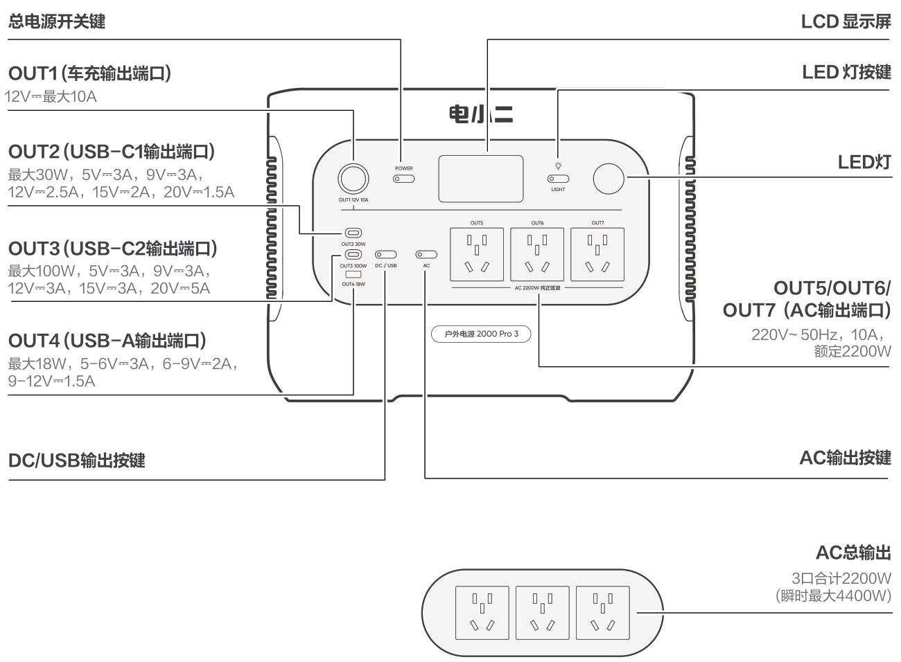

## 右视图

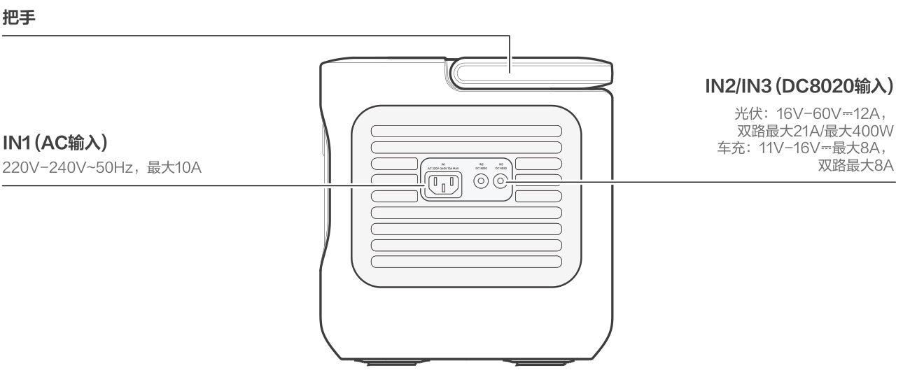

# 显示屏界面

<figure aria-label="LCD icon meanings" class="hb-lcd-table-composition" data-component-id="HB-TABLE-LCD-ICON" tabindex="0"><table class="hb-lcd-icon-table"><colgroup><col class="hb-lcd-col-number"/><col class="hb-lcd-col-icon"/><col class="hb-lcd-col-name"/><col class="hb-lcd-col-description"/></colgroup><tbody><tr><td class="hb-lcd-number">
1
</td><td class="hb-lcd-icon"></td><td class="hb-lcd-name">
Wi-Fi
</td><td class="hb-lcd-description">

<strong>点亮：</strong> Wi-Fi 已连接。

<strong>闪烁：</strong> 准备连接 Wi-Fi。

<strong>熄灭：</strong> Wi-Fi 未连接。

</td></tr><tr><td class="hb-lcd-number">
2
</td><td class="hb-lcd-icon"></td><td class="hb-lcd-name">
Bluetooth
</td><td class="hb-lcd-description">

<strong>点亮：</strong> 蓝牙已连接。

<strong>闪烁：</strong> 准备连接蓝牙。

<strong>熄灭：</strong> 蓝牙未连接。

</td></tr><tr><td class="hb-lcd-number">
3
</td><td class="hb-lcd-icon"></td><td class="hb-lcd-name">
静音充电模式
</td><td class="hb-lcd-description">

<strong>点亮：</strong> 静音充电模式已开启。

充电功率降低，充电速度变慢，同时显著降低充电时的噪音。

<strong>熄灭：</strong> 静音充电模式未开启/已关闭。

（请在 APP 中开启/关闭该功能，关机可记忆保存）。

</td></tr><tr><td class="hb-lcd-number">
4
</td><td class="hb-lcd-icon"></td><td class="hb-lcd-name">
充电计划
</td><td class="hb-lcd-description">

自定义便携式储能电源的充电计划，适用于电价有波动的情况，可根据电价峰谷时间段制定充电计划，减少用电成本。

（请在 APP 中开启/关闭该功能，关机可记忆保存）。

</td></tr><tr><td class="hb-lcd-number">
5
</td><td class="hb-lcd-icon">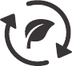</td><td class="hb-lcd-name">
自发自用模式
</td><td class="hb-lcd-description">

<strong>点亮：</strong> 自发自用模式已开启，最大化利用太阳能，减少电网电力消耗，减少用电成本。

<strong>熄灭：</strong> 自发自用模式未开启/已关闭。

（请在 APP 中开启/关闭该功能，关机可记忆保存）。

</td></tr><tr><td class="hb-lcd-number">
6
</td><td class="hb-lcd-icon"></td><td class="hb-lcd-name">
TOU模式
</td><td class="hb-lcd-description">

<strong>点亮：</strong> TOU模式开启（默认60%备电电量）。高峰时段，当储能电量高于备电电量时，优先使用储能供电，减少高峰用电成本；谷价时段，利用市电对储能进行充电，实现 削峰填谷 的电价优化策略。

<strong>熄灭：</strong> TOU模式关闭。设备不执行 TOU（分时电价）策略，按照默认供电与充电逻辑运行。

（请在 APP 中开启/关闭该功能，关机可记忆保存）。

</td></tr><tr><td class="hb-lcd-number">
7
</td><td class="hb-lcd-icon"></td><td class="hb-lcd-name">
UPS
</td><td class="hb-lcd-description">

<strong>点亮：</strong> 设备处于同充同放状态，此时市电切换至储能电池供电的时间为 10 ms。

<strong>熄灭：</strong> 设备未处于同充同放状态。

</td></tr><tr><td class="hb-lcd-number">
8
</td><td class="hb-lcd-icon"></td><td class="hb-lcd-name">
交流输出符号
</td><td class="hb-lcd-description">
AC输出（纯正弦波）已开启。
</td></tr><tr><td class="hb-lcd-number">
9
</td><td class="hb-lcd-icon"></td><td class="hb-lcd-name">
输出电压和频率
</td><td class="hb-lcd-description">
显示AC输出口的输出电压和频率。
</td></tr><tr><td class="hb-lcd-number">
10
</td><td class="hb-lcd-icon"></td><td class="hb-lcd-name">
充电功率显示
</td><td class="hb-lcd-description">
显示当前充电功率。
</td></tr><tr><td class="hb-lcd-number">
11
</td><td class="hb-lcd-icon"></td><td class="hb-lcd-name">
剩余充电时间
</td><td class="hb-lcd-description">
显示剩余充电时间。
</td></tr><tr><td class="hb-lcd-number">
12
</td><td class="hb-lcd-icon"></td><td class="hb-lcd-name">
市电充电接入
</td><td class="hb-lcd-description">
产品通过市电进行充电。
</td></tr><tr><td class="hb-lcd-number">
13
</td><td class="hb-lcd-icon"></td><td class="hb-lcd-name">
车充充电接入
</td><td class="hb-lcd-description">
产品通过 DC 输入端口（DC8020）连接 12V 车载充电线进行充电。
</td></tr><tr><td class="hb-lcd-number">
14
</td><td class="hb-lcd-icon"></td><td class="hb-lcd-name">
太阳能（绿色能源）充电接入
</td><td class="hb-lcd-description">
产品通过 DC 输入端口（DC8020）连接太阳能板进行充电。
</td></tr><tr><td class="hb-lcd-number">
15
</td><td class="hb-lcd-icon"></td><td class="hb-lcd-name">
节省电池模式
</td><td class="hb-lcd-description">

<strong>点亮：</strong> 节省电池模式已开启，通过限制电池的最大可用容量来延长电池使用寿命。

<strong>熄灭：</strong> 节省电池模式未开启/已关闭。

（请在 APP 中开启/关闭该功能，关机可记忆保存）。

注：开启后偶尔会满充满放，用于校准SOC。

</td></tr><tr><td class="hb-lcd-number">
16
</td><td class="hb-lcd-icon"></td><td class="hb-lcd-name">
充电速度限制
</td><td class="hb-lcd-description">

<strong>点亮：</strong> 充电速度限制已开启

关机重启后继续执行此充电功率

<strong>熄灭：</strong> 充电速度限制已关闭。

（请在 APP 中开启/关闭该功能，关机可记忆保存）。

</td></tr><tr><td class="hb-lcd-number">
17
</td><td class="hb-lcd-icon">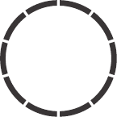</td><td class="hb-lcd-name">
电池电量图标
</td><td class="hb-lcd-description">

当本产品处于充电状态时，该图标顺时针转动；

当产品处于放电状态时，该图标显示当前电量。

</td></tr><tr><td class="hb-lcd-number">
18
</td><td class="hb-lcd-icon"></td><td class="hb-lcd-name">
电池电量百分比
</td><td class="hb-lcd-description">
显示当前电池电量。0%代表电池完全放电,100%代表电池电量已充满。
</td></tr><tr><td class="hb-lcd-number">
19
</td><td class="hb-lcd-icon"></td><td class="hb-lcd-name">
低电量提醒
</td><td class="hb-lcd-description">

<strong>点亮：</strong> 当前电池电量低于 20%。

<strong>闪烁：</strong> 当前电池电量低于 5%。

<strong>熄灭：</strong> 设备正在充电中。

</td></tr><tr><td class="hb-lcd-number">
20
</td><td class="hb-lcd-icon"></td><td class="hb-lcd-name">
放电倒计时
</td><td class="hb-lcd-description">

通过App为输出端口设置关闭倒计时，时间结束后自动断电，节约能源并保护电池。

仅对当前设置有效，设备重启后需重新设定。

</td></tr><tr><td class="hb-lcd-number">
22
</td><td class="hb-lcd-icon"></td><td class="hb-lcd-name">
节能模式
</td><td class="hb-lcd-description">

出厂默认开启，默认时间为 12H。AC 输出≤25W、DC 输出≤2W（不含应急灯）且持续达到设定时间后，将自动关闭对应输出。

<strong>点亮：</strong> 节能模式开启。

<strong>熄灭：</strong> 节能模式关闭。

（可在 APP 中设置时间，关机可记忆保存）。

</td></tr><tr><td class="hb-lcd-number">
23
</td><td class="hb-lcd-icon"></td><td class="hb-lcd-name">
高温警告
</td><td class="hb-lcd-description">
如果屏幕上出现【高温警告符号】，请勿担心，电池降温后可自行恢复。
</td></tr><tr><td class="hb-lcd-number">
24
</td><td class="hb-lcd-icon"></td><td class="hb-lcd-name">
低温警告
</td><td class="hb-lcd-description">
如果屏幕上出现【低温警告符号】，请勿担心，环境温度恢复后自动恢复。
</td></tr><tr><td class="hb-lcd-number">
25
</td><td class="hb-lcd-icon"></td><td class="hb-lcd-name">
故障代码
</td><td class="hb-lcd-description">
产品发生故障，请参考故障代码模块内容了解详情。
</td></tr><tr><td class="hb-lcd-number">
26
</td><td class="hb-lcd-icon"></td><td class="hb-lcd-name">
放电功率显示
</td><td class="hb-lcd-description">
显示当前放电功率。
</td></tr><tr><td class="hb-lcd-number">
27
</td><td class="hb-lcd-icon"></td><td class="hb-lcd-name">
剩余放电时间
</td><td class="hb-lcd-description">
显示剩余放电时间。
</td></tr></tbody></table></figure>

# 产品使用

## 电源开机 / 关机

<figure class="hb-reference-figure hb-base-art-live-copy" data-component-id="HB-SPECIAL-REFERENCE-FIGURE" data-reference-id="cn-operation-main-power" data-source-fragment-sha256="c6b45f4526fa7cb579482a0f5e6ac8c7047be15005b64ccd19baac69e4034217" data-web-base-art-ref="operation/main_power" data-web-presentation-mode="base-art-live-copy" data-web-replace-key="reference.cn-operation-main-power">

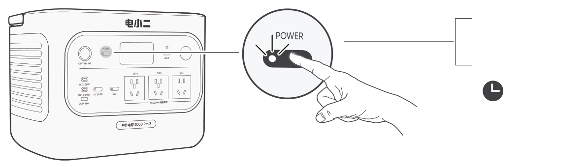<strong>开机</strong>短按一次<strong>关机</strong>长按3秒3秒

</figure>

本产品的默认待机时间为2小时，若产品无任何充电输入或放电输出，2小时后将自动关机，自动关机时间可以在app上设置。

节能模式下，开启AC或DC/USB输出，若产品无任何充电输入或放电输出，12小时后将关闭AC或DC/USB输出（节能模式时间可以在app上设置）。

## AC输出开/关

确保总电源开关键已打开。

AC输出按键统一控制所有AC输出口，短按一次开启，再短按一次关闭。

<figure class="hb-reference-figure hb-base-art-live-copy" data-component-id="HB-SPECIAL-REFERENCE-FIGURE" data-reference-id="cn-operation-ac-output" data-source-fragment-sha256="c09d78829b35bda86069203c7f62b5ed562de01509c97e8aae41fecaee98fe72" data-web-base-art-ref="operation/ac_output" data-web-presentation-mode="base-art-live-copy" data-web-replace-key="reference.cn-operation-ac-output">

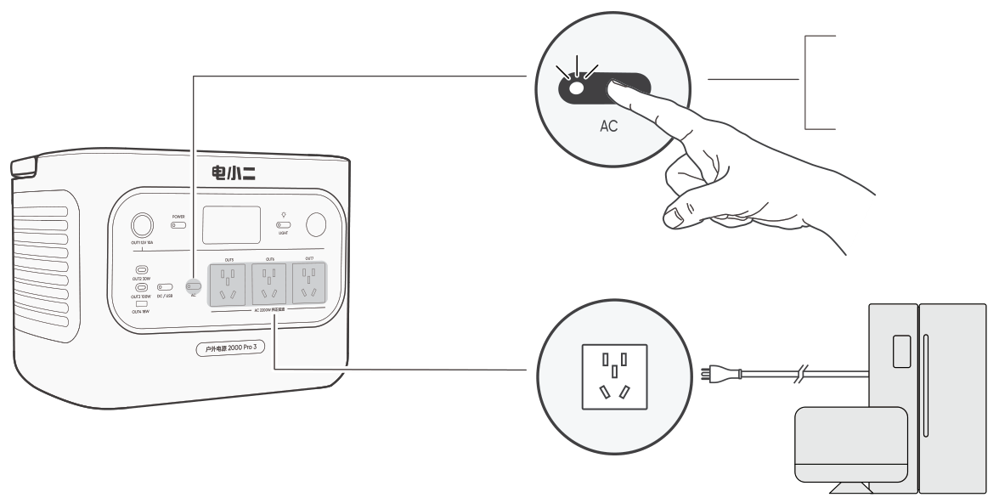<strong>开启</strong>短按一次<strong>关闭</strong>短按一次

</figure>

## DC/USB输出开 / 关

确保总电源开关键已打开。

<figure class="hb-reference-figure hb-base-art-live-copy" data-component-id="HB-SPECIAL-REFERENCE-FIGURE" data-reference-id="cn-operation-dc-usb-output" data-source-fragment-sha256="bf53f67fbfb26349c2eacefd0084669b0449b104127db7acfd96711bdfee1b43" data-web-base-art-ref="operation/dc_usb_output" data-web-presentation-mode="base-art-live-copy" data-web-replace-key="reference.cn-operation-dc-usb-output">

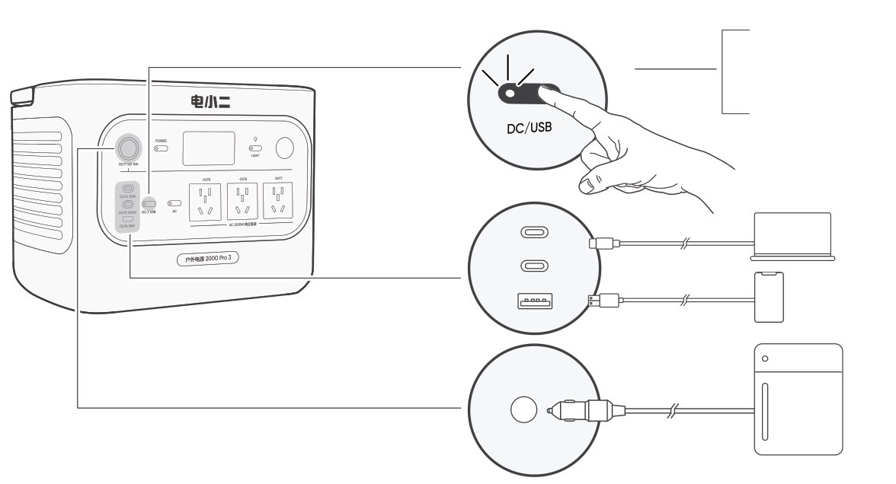<strong>开启</strong>短按一次<strong>关闭</strong>短按一次

</figure>

<table class="manual-callout-table" style="width:100%; border-collapse:collapse; margin:0 0 16px 0;"><tbody><tr><td class="manual-callout-label" style="width:16%; border:1px solid #000; padding:6px 8px; vertical-align:top;">
<strong>注意</strong>
注意提示</td><td class="manual-callout-body" style="border:1px solid #000; padding:6px 8px; vertical-align:top;"><ul class="simple">
<li>
仅将便携式电源连接到符合GB4943.1第 6.3、6.4 和 6.5 条款（或其它等效标准）的设备或配件。
</li>
<li>
为了实现USB-C端口的最大输出功率，请使用USB-C to USB-C 5A数据线（20V DC/5A，100W）。
</li>
</ul>
</td></tr></tbody></table>

本产品可通过电小二 **12V 汽车电池补电线** 为汽车电池充电。该补电线需单独购买，可前往电小二官网选购。

<table class="manual-callout-table" style="width:100%; border-collapse:collapse; margin:0 0 16px 0;"><tbody><tr><td class="manual-callout-label" style="width:16%; border:1px solid #000; padding:6px 8px; vertical-align:top;">
<strong>注意</strong>
注意提示</td><td class="manual-callout-body" style="border:1px solid #000; padding:6px 8px; vertical-align:top;"><ul class="simple">
<li>
该功能仅适用于 12V 车型，不适用于 24V 车型。
</li>
<li>
产品通过 12V DC 输出（车充口）为汽车电池补电时，请勿启动汽车，否则可能导致产品损坏。
</li>
<li>
仅适用于汽车电池应急补电，不适用于汽车电池深度亏电或已损坏的情况。
</li>
</ul>
</td></tr></tbody></table>

## 节能模式

为防止因忘记关闭输出而造成电池电量的不必要消耗，产品默认开启节能模式。当 AC 或 DC/USB 输出开启时，屏幕将显示节能图标"12H"。在此模式下，当未连接设备，或已连接设备的功率低于设定值（AC 输出 25W 或 DC/USB 输出 2W）时，对应输出将在设定时间后自动关闭。默认设置为 12 小时。节能模式时长可在 Jackery App 中设置为 1H、2H、8H、12H 或 24H。若设置为"Never Off"，则节能模式将被关闭。

在 AC 输出按键开启状态下，同时长按 AC 输出按键与总电源开关键，持续按压直至节能图标显示（开启）与隐藏（关闭）状态切换。

<figure class="hb-reference-figure hb-base-art-live-copy" data-component-id="HB-SPECIAL-REFERENCE-FIGURE" data-reference-id="cn-operation-energy-saving" data-source-fragment-sha256="6234085658316cbcfad3a5f6c4835ade547bf4071328c683e4c9fb90e0a9f291" data-web-base-art-ref="operation/energy_saving" data-web-presentation-mode="base-art-live-copy" data-web-replace-key="reference.cn-operation-energy-saving">

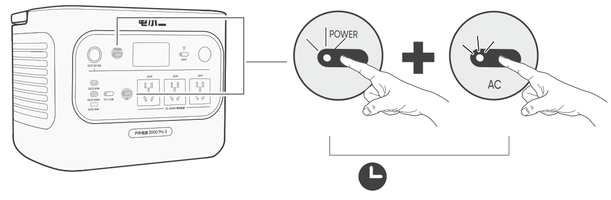总电源开关键AC输出按键<strong>开启/关闭</strong>同时长按3秒

</figure>

※ 使用交流 25W 或直流 2W 以下低功耗设备时，请关闭节能模式，以避免输出中途自动关闭。关闭节能模式后，屏幕将不再显示"12H"图标，此时输出不会自动关闭。

|          |                                                  |
|----------|--------------------------------------------------|
| **说明** | 设备重新上电后，节能模式将保持上次断电前的状态。 |

## LED灯开 / 关

LED灯有两种模式：照明模式和SOS模式，默认设置为照明模式。无论处于何种模式，长按LED灯按钮均可关闭LED灯。

<figure class="hb-reference-figure hb-base-art-live-copy" data-component-id="HB-SPECIAL-REFERENCE-FIGURE" data-reference-id="cn-operation-led-light" data-source-fragment-sha256="333f837eb7abaa128da214081f58cbbe413529481c62fcf7105d1cb8652a009d" data-web-base-art-ref="operation/led_light" data-web-presentation-mode="base-art-live-copy" data-web-replace-key="reference.cn-operation-led-light">

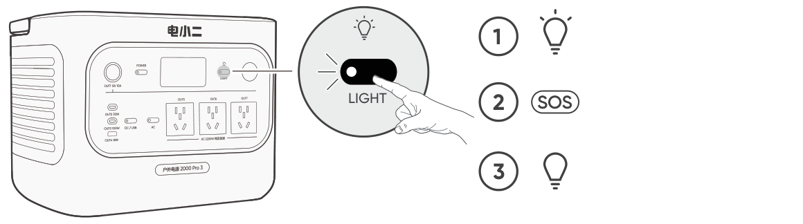首次按下LED灯按钮可开启照明模式。再次按下可切换至SOS模式。第三次按下将关闭灯光。

</figure>

## AC和DC输出恢复功能

AC/DC输出恢复功能默认关闭。可在 Jackery App 中开启此功能，使设备记忆 AC/DC 输出状态，并在特定条件下自动恢复 AC 和 DC 输出。

<figure aria-label="自动恢复条件 / 不自动恢复条件" class="hb-auto-resume-composition" data-component-id="HB-TABLE-AUTO-RESUME" tabindex="0"><table class="hb-auto-resume-table"><colgroup><col class="hb-auto-resume-col"/><col class="hb-auto-resume-col"/></colgroup><thead><tr><th class="hb-auto-resume-left" scope="col">自动恢复条件</th><th class="hb-auto-resume-right" scope="col">不自动恢复条件</th></tr></thead><tbody><tr><td class="hb-auto-resume-left">关机或重启后的上电/重启</td><td class="hb-auto-resume-right">手动关闭输出（按键/App）</td></tr><tr><td class="hb-auto-resume-left" rowspan="2">达到放电限制后，电池 SOC ≥ 放电限制 +10%</td><td class="hb-auto-resume-right">节能模式关闭输出</td></tr><tr><td class="hb-auto-resume-right">保护触发关闭输出</td></tr><tr><td class="hb-auto-resume-left">OTA 升级完成</td><td class="hb-auto-resume-right">放电定时器触发关闭输出</td></tr></tbody></table></figure>

## 屏幕显示

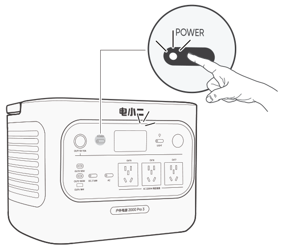

<figure class="hb-reference-composition hb-reference-lcd-actions" aria-label="屏幕显示模式示意图。" data-component-id="HB-TABLE-REFERENCE" data-component-variant="lcd-actions" tabindex="0">
<table class="hb-reference-table">
<thead>
<tr>
<th scope="col">
分类
</th>
<th scope="col">
操作
</th>
<th scope="col">
说明
</th>
</tr>
</thead>
<tbody>
<tr>
<td>
屏幕短亮
</td>
<td>
打开
</td>
<td>
短按总电源开关键或有充电输入
</td>
</tr>
<tr>
<td></td>
<td>
关闭
</td>
<td>
短按总电源开关键
</td>
</tr>
<tr>
<td></td>
<td>
自动关闭
</td>
<td>
2 分钟后显示屏将自动熄灭，进入休眠模式
</td>
</tr>
<tr>
<td>
屏幕常亮
</td>
<td>
打开
</td>
<td>
开机状态下，双击总电源开关键
</td>
</tr>
<tr>
<td></td>
<td>
关闭
</td>
<td>
短按总电源开关键
</td>
</tr>
<tr>
<td></td>
<td>
自动关闭
</td>
<td>
在常亮模式下，无充放电情况，屏幕将在 2 小时后自动熄灭
</td>
</tr>
</tbody>
</table>
</figure>

## 组合按键

<figure aria-label="按键 / 操作 / 功能" class="hb-key-combination-composition" data-component-id="HB-TABLE-KEY-COMBINATIONS" tabindex="0"><table class="hb-key-combination-table"><colgroup><col class="hb-key-col-buttons"/><col class="hb-key-col-operation"/><col class="hb-key-col-function"/></colgroup><thead><tr><th class="hb-key-buttons" scope="col">
按键
</th><th class="hb-key-operation" scope="col">
操作
</th><th class="hb-key-function" scope="col">
功能
</th></tr></thead><tbody><tr><td class="hb-key-buttons">
总电源开关键 + AC输出按键
</td><td class="hb-key-operation">
长按 3 秒
</td><td class="hb-key-function">
切换节能模式
</td></tr><tr><td class="hb-key-buttons">
AC输出按键+ DC/USB输出按键
</td><td class="hb-key-operation">
长按 1 秒
</td><td class="hb-key-function">
Wi-Fi&amp;蓝牙开关
</td></tr><tr><td class="hb-key-buttons">
总电源开关键 + DC/USB输出按键
</td><td class="hb-key-operation">
长按 3 秒
</td><td class="hb-key-function">
Wi-Fi＆蓝牙重置
</td></tr><tr><td class="hb-key-buttons">
总电源开关键 + LED灯按键
</td><td class="hb-key-operation">
长按 1 秒
</td><td class="hb-key-function">
切换应急闪充模式
</td></tr></tbody></table></figure>

# 不间断电源（UPS）

本产品通过AC电源线连接电网，电器可以使用本产品的交流输出端口工作（此时交流电来自电网，而不是电池），当电网突然断电后，本产品可以在10 ms内自动换为本产品电池供电模式。

确保总电源开关键已打开。

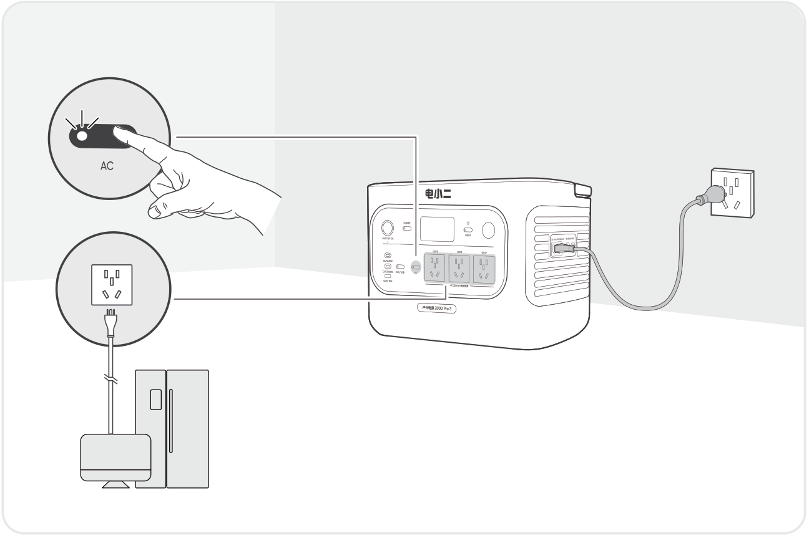

<table class="manual-callout-table" style="width:100%; border-collapse:collapse; margin:0 0 16px 0;"><tbody><tr><td class="manual-callout-label" style="width:16%; border:1px solid #000; padding:6px 8px; vertical-align:top;">
<strong>注意</strong>
注意提示</td><td class="manual-callout-body" style="border:1px solid #000; padding:6px 8px; vertical-align:top;"><ul class="simple">
<li>
本产品不支持0 ms切换，请勿接到要求0ms切换供电的设备上，例如数据服务器或工作站，请充分测试确认兼容性后使用。
</li>
<li>
使用UPS功能连接负载时，请勿超出设备最大输出功率，以防触发过载保护。
</li>
<li>
因未按说明操作导致设备异常或数据丢失，本公司不承担相关责任。
</li>
</ul>
</td></tr></tbody></table>

# 充电方式

**绿色能源优先模式**：本产品倡导优先使用绿色能源，本产品支持太阳能充电与市电充电同时使用。当同时开启市电充电与太阳能充电时，产品会优先太阳能充电且太阳能充电与市电充电同时以电池最大允许功率充电。

**首次使用前请先将本设备充满电！**

<table class="manual-callout-table" style="width:100%; border-collapse:collapse; margin:0 0 16px 0;"><tbody><tr><td class="manual-callout-label" style="width:16%; border:1px solid #000; padding:6px 8px; vertical-align:top;">
<strong>提示</strong>
注意提示</td><td class="manual-callout-body" style="border:1px solid #000; padding:6px 8px; vertical-align:top;"><ul class="simple">
<li>
产品充电环境温度为 -10°C~45°C，放电环境温度为 -10°C~45°C，超出此温度范围会限制产品充放电，甚至无法充放电。
</li>
<li>
产品的充电功率和电池能量会因温度的变化有所差异。
</li>
</ul>
</td></tr></tbody></table>

## 市电充电

请使用官方标配的AC电源线。

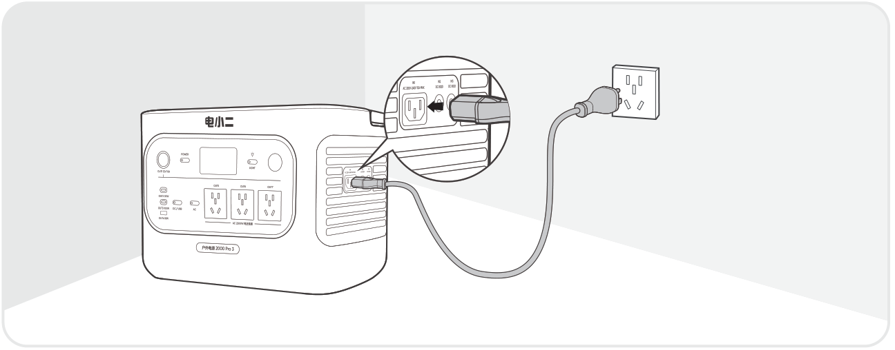

<table class="manual-callout-table" style="width:100%; border-collapse:collapse; margin:0 0 16px 0;"><tbody><tr><td class="manual-callout-label" style="width:16%; border:1px solid #000; padding:6px 8px; vertical-align:top;">
<strong>注意</strong>
注意提示</td><td class="manual-callout-body" style="border:1px solid #000; padding:6px 8px; vertical-align:top;">
请确保 AC 充电线插头牢固且完全插入产品的 AC 输入接口，避免因插入不完全引发电流不稳、发热或接触不良等问题，影响设备正常运行。
若使用电源适配器供电，则应购买配套使用获得CCC认证并满足PD协议标准要求的电源适配器。
</td></tr></tbody></table>

**应急闪充模式**

储能可以通过AC充电方式实现超速充电，请在电小二app上激活或关闭此功能。应急闪充模式下，显示剩余电量的环形灯闪烁速度加快。

※以正常充电速度充电能最大程度保护电池。我们建议仅在必要时使用应急充电，不建议长期使用此功能。

# 太阳能充电

本产品有两个DC8020 直流输入端口，最大支持400W输入，可搭配电小二SolarSaga 系列太阳能板使用。

<figure class="hb-reference-figure hb-base-art-live-copy" data-component-id="HB-SPECIAL-REFERENCE-FIGURE" data-reference-id="charging-solar-direct" data-source-fragment-sha256="3ad469074e777a7311a48ca7208f04a85ef4127f6ed4ecb03653b2c1b3908e42" data-web-base-art-ref="charging/solar_direct" data-web-presentation-mode="base-art-live-copy" data-web-replace-key="reference.charging-solar-direct">

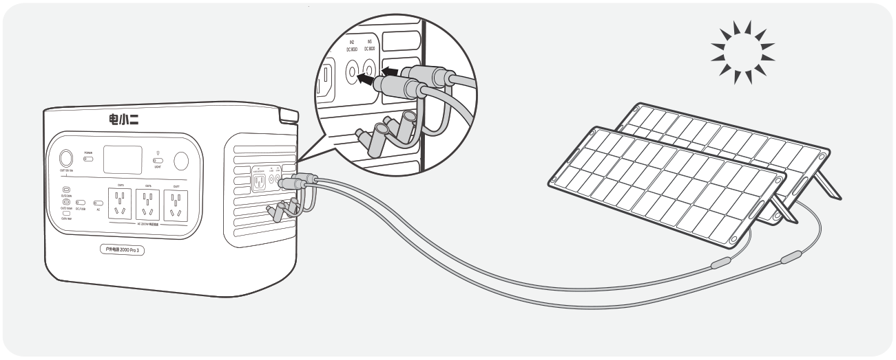SolarSaga 200 × 2

</figure>

如果单个DC8020直流输入端口需要同时连接两个太阳能板，请参考下图，需使用太阳能串联转接盒（单独售卖）。

<figure class="hb-reference-figure hb-base-art-live-copy" data-component-id="HB-SPECIAL-REFERENCE-FIGURE" data-reference-id="charging-solar-adapter" data-source-fragment-sha256="d0adf9f4d82e92159f7783862770e7f4ff02c776d0d5967fc82de92dc4ccfac4" data-web-base-art-ref="charging/solar_adapter" data-web-presentation-mode="base-art-live-copy" data-web-replace-key="reference.charging-solar-adapter">

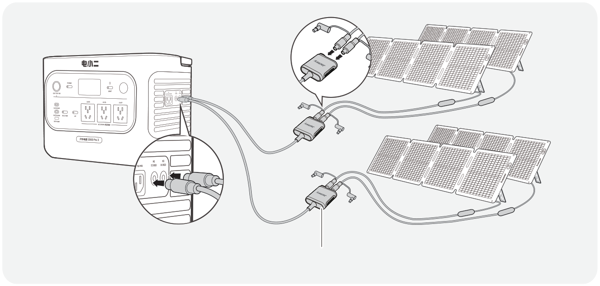SolarSaga 100 Air × 4太阳能串联转接盒（单独售卖）

</figure>

<table class="manual-callout-table" style="width:100%; border-collapse:collapse; margin:0 0 16px 0;"><tbody><tr><td class="manual-callout-label" style="width:16%; border:1px solid #000; padding:6px 8px; vertical-align:top;">
<strong>注意</strong>
注意提示</td><td class="manual-callout-body" style="border:1px solid #000; padding:6px 8px; vertical-align:top;">
单个DC8020输入端口请勿连接两个以上光伏板。
</td></tr></tbody></table>

<table class="manual-callout-table" style="width:100%; border-collapse:collapse; margin:0 0 16px 0;"><tbody><tr><td class="manual-callout-label" style="width:16%; border:1px solid #000; padding:6px 8px; vertical-align:top;">
<strong>注意</strong>
注意提示</td><td class="manual-callout-body" style="border:1px solid #000; padding:6px 8px; vertical-align:top;">
同时连接到两个DC输入端口的电源，其电压必须保持一致，否则可能导致产品异常或损坏。例如：

<ul class="simple">
<li>
连接太阳能板至两个DC8020输入端口时，请使用相同型号的太阳能板，并确保连接的数量一致。
</li>
<li>
给产品充电时，请勿同时使用车载充电与光伏充电，否则可能烧坏车内保险丝或无法充电。
</li>
</ul>
</td></tr></tbody></table>

建议使用电小二的太阳能板为本产品充电。请确保所用太阳能板的开路电压（Voc）在1000 Pro 3的直流输入电压范围内（16V--60V）。因使用第三方太阳能板或配件而导致的任何损坏或损失，电小二概不负责。

## 车充充电

本产品适用 12V 车型车充口对本产品进行充电，请确保汽车车充口和车充线的点烟器接触良好，确保点烟器完全插入到位。

<figure class="hb-reference-figure hb-base-art-live-copy" data-component-id="HB-SPECIAL-REFERENCE-FIGURE" data-reference-id="charging-car" data-source-fragment-sha256="7d4dbc6adfbace464d3c69142e9d3fec0aee3ae3c261fc067205e0ebf4b931d3" data-web-base-art-ref="charging/car_charge" data-web-presentation-mode="base-art-live-copy" data-web-replace-key="reference.charging-car">

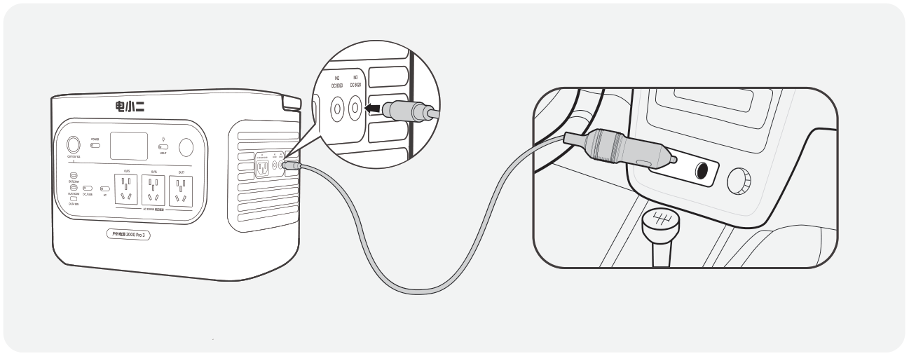车辆* 车载充电线需单独购买。

</figure>

<table class="manual-callout-table" style="width:100%; border-collapse:collapse; margin:0 0 16px 0;"><tbody><tr><td class="manual-callout-label" style="width:16%; border:1px solid #000; padding:6px 8px; vertical-align:top;">
<strong>注意</strong>
注意提示</td><td class="manual-callout-body" style="border:1px solid #000; padding:6px 8px; vertical-align:top;"><ul class="simple">
<li>
请在汽车点火启动后使用车充充电，以免造成汽车电瓶亏电无法启动。
</li>
<li>
汽车在行驶过程中，路况颠簸，禁止使用车充充电，防止车充接触不良，引起接触点烧坏。若因不按规范操作而造成损失，本公司不予承担相应责任。
</li>
<li>
车充充电只支持 12V 车型，不支持 24V 车型，请勿使用 24V 车型的车给本产品充电以免造成人身伤害及财产损失。
</li>
</ul>
</td></tr></tbody></table>

# 存储

请将产品存放在干燥、清洁、通风良好的环境中。存储温度和湿度要求如下：

- **1 个月：** -20°C ～ 45°C（0--60%RH）

- **3 个月：** 0°C ～ 45°C（0--60%RH）

- **12 个月：** 0°C ～ 25°C（0--60%RH）

若产品在电量耗尽的情况下长时间（3～6 个月）存放，可能会导致无法再次充电。为避免此情况并保持电池健康，建议每隔三个月检查并为产品充电一次，并在 **6～12 个月内至少进行一次完整的充放电循环**。

# 故障处理

如果出现以下任一故障代码，请按照所列的处理方法进行处理。如故障仍然存在，请联系电小二客户支持。

<figure aria-label="故障代码 / 处理方法" class="hb-troubleshooting-composition" data-component-id="HB-TABLE-TROUBLESHOOTING" tabindex="0"><table class="hb-troubleshooting-table"><colgroup><col class="hb-troubleshooting-col-code"/><col class="hb-troubleshooting-col-measures"/></colgroup><thead><tr><th class="hb-troubleshooting-code" scope="col">
故障代码
</th><th class="hb-troubleshooting-measures" scope="col">
处理方法
</th></tr></thead><tbody><tr><td class="hb-troubleshooting-code">
F0
</td><td class="hb-troubleshooting-measures">
重启产品。
</td></tr><tr><td class="hb-troubleshooting-code">
F1
</td><td class="hb-troubleshooting-measures">
重启产品。
</td></tr><tr><td class="hb-troubleshooting-code">
F2
</td><td class="hb-troubleshooting-measures">
重启产品。
</td></tr><tr><td class="hb-troubleshooting-code">
F3
</td><td class="hb-troubleshooting-measures">
重启产品。
</td></tr><tr><td class="hb-troubleshooting-code">
F4
</td><td class="hb-troubleshooting-measures">
将产品连接负载，放电直至故障消失。
</td></tr><tr><td class="hb-troubleshooting-code">
F5
</td><td class="hb-troubleshooting-measures">
通过太阳能板或交流墙充为产品充电，直至故障消失。
</td></tr><tr><td class="hb-troubleshooting-code">
F6
</td><td class="hb-troubleshooting-measures">

1. 待电网恢复正常后再通过交流墙插为产品充电。

2. 检查进风口和出风口是否堵塞；确保产品两侧有 20 厘米的间隙。

3. 将产品放置在避免阳光直射、环境温度低于45℃的地方。

4. 断开产品连接的所有负载，保持产品空闲待机，等待故障消失。检查负载的启动功率是否超出本产品的输出范围。

5. 重启产品。

</td></tr><tr><td class="hb-troubleshooting-code">
F7
</td><td class="hb-troubleshooting-measures">

1. 移除连接到产品的所有太阳能板。

2. 检查连接到产品的太阳能板的开路电压（Voc）。产品允许的最大直流输入电压为 60V。

3. 重启产品，保持产品空闲待机，等待故障消失。

</td></tr><tr><td class="hb-troubleshooting-code">
F8
</td><td class="hb-troubleshooting-measures">
请联系经销商或电小二客户支持。
</td></tr><tr><td class="hb-troubleshooting-code">
F9
</td><td class="hb-troubleshooting-measures">
移除连接到产品 DC/USB 端口的负载，等待故障消失。
</td></tr><tr><td class="hb-troubleshooting-code">
FE
</td><td class="hb-troubleshooting-measures">
请联系经销商或电小二客户支持。
</td></tr></tbody></table></figure>

# 主要规格

## 基本信息

<figure aria-label="基本信息" class="hb-spec-table-composition"><table class="hb-spec-table manual-table manual-spec-table"><colgroup><col class="hb-spec-col-label"/><col class="hb-spec-col-value"/></colgroup>
<tbody>
<tr>
<th class="hb-spec-label manual-spec-label" scope="row">产品名称</th>
<td class="hb-spec-value manual-spec-value">便携式储能电源</td>
</tr>
<tr>
<th class="hb-spec-label manual-spec-label" scope="row">型号</th>
<td class="hb-spec-value manual-spec-value">JE-2000F</td>
</tr>
<tr>
<th class="hb-spec-label manual-spec-label" scope="row">电芯类型</th>
<td class="hb-spec-value manual-spec-value">磷酸铁锂电芯</td>
</tr>
<tr>
<th class="hb-spec-label manual-spec-label" scope="row">电池组能量</th>
<td class="hb-spec-value manual-spec-value">40Ah/51.2V DC（2048 Wh）</td>
</tr>
<tr>
<th class="hb-spec-label manual-spec-label" scope="row">电池组电压/容量</th>
<td class="hb-spec-value manual-spec-value">51.2V/40Ah DC</td>
</tr>
<tr>
<th class="hb-spec-label manual-spec-label" scope="row">重量</th>
<td class="hb-spec-value manual-spec-value">约17.9 kg</td>
</tr>
<tr>
<th class="hb-spec-label manual-spec-label" scope="row">尺寸</th>
<td class="hb-spec-value manual-spec-value">约366×255×269 mm</td>
</tr>
<tr>
<th class="hb-spec-label manual-spec-label" scope="row">循环寿命</th>
<td class="hb-spec-value manual-spec-value">6000 次循环，≥70%SOH</td>
</tr>
</tbody>
</table></figure>

## 输入

<figure aria-label="输入" class="hb-spec-table-composition"><table class="hb-spec-table manual-table manual-spec-table"><colgroup><col class="hb-spec-col-label"/><col class="hb-spec-col-value"/></colgroup>
<tbody>
<tr>
<th class="hb-spec-label manual-spec-label" scope="row">IN1 (AC输入)</th>
<td class="hb-spec-value manual-spec-value">220V-240V ~ 50Hz，最大10A</td>
</tr>
<tr>
<th class="hb-spec-label manual-spec-label" scope="row">IN2/IN3 (DC8020输入)</th>
<td class="hb-spec-value manual-spec-value">光伏: 16V-60V⎓12A，双路最大21A/最大400W 车充: 11V-16V⎓最大8A，双路最大8A</td>
</tr>
</tbody>
</table></figure>

## 输出

<figure aria-label="输出" class="hb-spec-table-composition"><table class="hb-spec-table manual-table manual-spec-table"><colgroup><col class="hb-spec-col-label"/><col class="hb-spec-col-value"/></colgroup>
<tbody>
<tr>
<th class="hb-spec-label manual-spec-label" scope="row">OUT1 (车充输出端口)</th>
<td class="hb-spec-value manual-spec-value">12V⎓最大10A</td>
</tr>
<tr>
<th class="hb-spec-label manual-spec-label" scope="row">OUT2 (USB-C1输出端口)</th>
<td class="hb-spec-value manual-spec-value">最大30W，5V⎓3A，9V⎓3A，12V⎓2.5A，15V⎓2A，20V⎓1.5A</td>
</tr>
<tr>
<th class="hb-spec-label manual-spec-label" scope="row">OUT3 (USB-C2输出端口)</th>
<td class="hb-spec-value manual-spec-value">最大100W，5V⎓3A，9V⎓3A，12V⎓3A，15V⎓3A，20V⎓5A</td>
</tr>
<tr>
<th class="hb-spec-label manual-spec-label" scope="row">OUT4 (USB-A输出端口)</th>
<td class="hb-spec-value manual-spec-value">最大18W，5-6V⎓3A，6-9V⎓2A，9-12V⎓1.5A</td>
</tr>
<tr>
<th class="hb-spec-label manual-spec-label" scope="row">OUT5/OUT6/OUT7 (AC输出端口)</th>
<td class="hb-spec-value manual-spec-value">220V~50Hz，10A，额定2200W， 瞬时最大4400W</td>
</tr>
<tr>
<th class="hb-spec-label manual-spec-label" scope="row">AC旁路输出①</th>
<td class="hb-spec-value manual-spec-value">220V-240V~ 50Hz，最大10A</td>
</tr>
</tbody>
</table></figure>

## 工作环境温度

<figure aria-label="工作环境温度" class="hb-spec-table-composition"><table class="hb-spec-table manual-table manual-spec-table"><colgroup><col class="hb-spec-col-label"/><col class="hb-spec-col-value"/></colgroup>
<tbody>
<tr>
<th class="hb-spec-label manual-spec-label" scope="row">充电温度</th>
<td class="hb-spec-value manual-spec-value">-10°C~45°C</td>
</tr>
<tr>
<th class="hb-spec-label manual-spec-label" scope="row">放电温度</th>
<td class="hb-spec-value manual-spec-value">-10°C~45°C</td>
</tr>
</tbody>
</table></figure>

① 产品支持边充边放。

# APP操作说明书

## 1. 下载并登录App

<figure aria-label="App 下载二维码示意图。" class="hb-app-download-composition hb-app-download-qr-only" data-component-id="HB-SPECIAL-APP">
在App Store或者国内各大应用市场搜索 “电小二”App安装并注册登录。或扫描以下二维码下载电小二App。
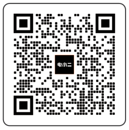</figure>

## 2. 添加设备

2.1 在App内点击 + 添加设备。

2.2 长按设备上的"总电源开关键"开机，设备上的WiFi和蓝牙图标闪烁后表示设备已进入配网模式，在App内点击"图标已快闪"按钮并允许应用连接附近的设备和打开蓝牙权限。

<figure class="hb-app-add-device-composition hb-has-reference-captions" data-component-id="HB-SPECIAL-APP" data-reference-id="app-add-device" data-step-captions="live">
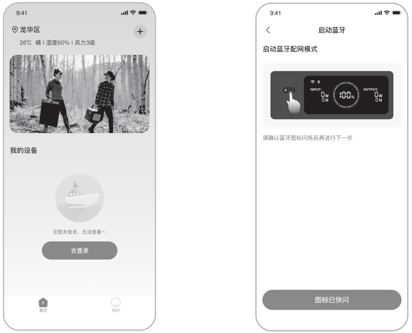
<figcaption class="hb-reference-caption-grid" data-caption-count="2" data-caption-layout="equal" style="--hb-caption-count:2;width:min(100%,30rem)">2.12.2</figcaption>
<table>
<colgroup>
<col style="width: 12.0%"/>
<col style="width: 88.0%"/>
</colgroup>
<tbody>
<tr><td>
<strong>备注</strong>
</td>
<td>
打开设备，如果两小时内未连接到APP，设备会自动关闭Wi-Fi和蓝牙。
</td>
</tr>
</tbody>
</table>

总电源开关键AC 输出按键DC/USB输出按键
</figure>

2.3 点击搜索到的设备图标后App通过蓝牙自动连接设备。

<table>
<colgroup>
<col style="width: 12%" />
<col style="width: 88%" />
</colgroup>
<tbody>
<tr>
<td>
<strong>备注</strong>
</td>
<td>
如果在绑定过程中提示“设备已被绑定”，可通过以下两种方式连接:

<ul>
<li>
设备拥有者通过App将此设备分享给其他用户；
</li>
<li>
同时长按“总电源开关按键”和“USB输出按键”重置设备Wi-Fi后可重新绑定设备。
</li>
</ul></td>
</tr>
</tbody>
</table>

2.4 设备连接成功后输入设备将要连接的Wi-Fi名称和密码，设备自动连接到Wi-Fi网络。

|          |                                                              |
|----------|--------------------------------------------------------------|
| **备注** | 请选择2.4GHz频段的Wi-Fi网络，设备不支持5GHz频段的Wi-Fi网络。 |

2.5 设备添加成功后进入设备主页面，设备上的Wi-Fi图标会常亮。

<figure class="hb-reference-figure hb-has-reference-captions" data-component-id="HB-SPECIAL-REFERENCE-FIGURE" data-reference-id="app-connect-result" data-source-fragment-sha256="f3e5bc226c5155c4bb42d7698319cbdea8b9a72ed8bc788783311f7687a1793e" data-web-replace-key="reference.app-connect-result">
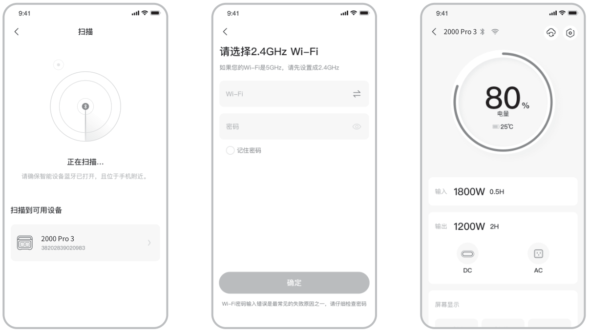
<figcaption class="hb-reference-caption-grid" data-caption-count="3" data-caption-layout="equal" style="--hb-caption-count:3">2.32.42.5</figcaption></figure>

图片仅供参考

<table class="manual-callout-table" style="width:100%; border-collapse:collapse; margin:0 0 16px 0;"><tbody><tr><td class="manual-callout-label" style="width:16%; border:1px solid #000; padding:6px 8px; vertical-align:top;">
<strong>注意</strong>
注意提示</td><td class="manual-callout-body" style="border:1px solid #000; padding:6px 8px; vertical-align:top;">
App 通过蓝牙与储能设备连接，每次仅支持一台设备。连接后返回设备列表时，蓝牙连接将自动断开。再次点击储能设备图标时，App 会自动重新连接。
</td></tr></tbody></table>

## 3. 解绑设备

点击设备主界面右上角的设置按钮进入设置页面，点击页面最下方的解除绑定按钮解绑设备。

## 4. 其他说明

4.1 打开Wi-Fi&蓝牙：

开机后自动打开Wi-Fi&蓝牙，屏幕上的Wi-Fi&蓝牙图标点亮表示Wi-Fi&蓝牙已被打开。

同时长按"AC输出按键"和"DC/USB输出按键"1秒手动打开Wi-Fi和蓝牙。

4.2 关闭Wi-Fi&蓝牙：

两小时内未连接WiFi或蓝牙，设备上的Wi-Fi&蓝牙会自动关闭。

同时长按" AC输出按键"和"DC/USB输出按键"1秒手动关闭Wi-Fi和蓝牙。

4.3 重置Wi-Fi&蓝牙：

同时长按"总电源开关按键"和"DC/USB输出按键"将重置 Wi-Fi和蓝牙，同时清除App中的自定义设置。

关注官方品牌公众号 获取更多资讯服务

制造商 / 生产厂：深圳华宝新能源股份有限公司

地址：深圳市龙华区大浪街道同胜社区华繁路东侧嘉安达科技工业园
