# Jackery ポータブル電源 5000 Plus 取扱説明書

型番：JE-5000A

国内専用/For use only in Japan

カスタマーサポート: jackery.jp@jackery.com

ご使用の前にこの「取扱説明書」をよくお読みのうえ、正しくお使いください。
特に「安全上のご注意」は、必ずお読みいただき、安全にお使いください。
お読みになったあとは、すぐに取り出せる場所に大切に保管してください。
本製品の取扱説明書は随時更新されますので、最新の取扱説明書は公式サイトでご確認ください。

お買い上げありがとうございます。

(je5000a-spec)=
## 主な仕様

【Jackery ポータブル電源 5000 Plus】

<div class="table-wrapper">
<table>
<tbody>
<tr><td>製品の名称</td><td>Jackery ポータブル電源 5000 Plus</td></tr>
<tr><td>型番</td><td>JE-5000A</td></tr>
<tr><td>定格容量</td><td>45Ah/112Vdc (5040Wh)</td></tr>
<tr><td>バッテリータイプ</td><td>LiFePO4（リン酸鉄リチウムイオン電池）</td></tr>
<tr><td>サイズ＆重量</td><td>約420×390×635 mm （約60 kg）</td></tr>
<tr><td>UPS</td><td>バックアップUPS:20ms、オンラインUPS:0ms</td></tr>
<tr><td colspan="2"><strong>入力ポート</strong></td></tr>
<tr><td>AC入力</td><td>100V-120V ~ 50/60Hz, 最大15A</td></tr>
<tr><td>パススルー充電 AC入力/出力</td><td>100V-120V ~ 50/60Hz, 最大15A</td></tr>
<tr><td colspan="2"><strong>DC 入力</strong></td></tr>
<tr><td>1 x DC 拡張ポート（入力）</td><td>80.5V-126V⎓98A 最大98A</td></tr>
<tr><td>高電圧入力</td><td>135V-450V⎓15A 最大15A， 最大4000W</td></tr>
<tr><td>低電圧入力</td><td>2 x DC 8mm ポート; 16V-60V⎓10.5A 最大21A/1200Wに倍増<br>11V-16V（動作電圧）⎓8A 最大8Aに倍増</td></tr>
<tr><td colspan="2"><strong>出力ポート</strong></td></tr>
<tr><td>AC 出力(NEMA L14-30R)</td><td>100V/200V ~ 50/60Hz, 最大30A</td></tr>
<tr><td>AC 出力(NEMA 6-20)</td><td>200V ~ 50/60Hz, 最大20A</td></tr>
<tr><td>パススルー充電 AC入力/出力</td><td>100V-120V ~ 50/60Hz, 最大15A</td></tr>
<tr><td>4 × AC 出力</td><td>100V ~ 50/60Hz, 20A, 2000W</td></tr>
<tr><td>AC Total 出力</td><td>最大6000W, 瞬間最大12000W</td></tr>
<tr><td>2 × USB-C 出力</td><td>5V⎓3A, 9V⎓3A, 12V⎓3A, 15V⎓3A, 20V⎓5A, 最大100W</td></tr>
<tr><td>2 × USB-A 出力</td><td>5-6V⎓3A, 6-9V⎓2A, 9-12V⎓1.5A, 最大18W</td></tr>
<tr><td>シガーソケット出力</td><td>12V⎓10A 最大10A</td></tr>
<tr><td>1 × DC 拡張ポート(出力)</td><td>80.5V-126V⎓41A 最大41A</td></tr>
<tr><td>充電温度</td><td>0°C~45°C (32°F~113°F)</td></tr>
<tr><td>動作温度</td><td>-15°C~45°C (5°F~113°F)<br>-15°C~-10°C (5°F~14°F) 出力電力：3000W</td></tr>
<tr><td>保存温度</td><td>1ヶ月 -20℃~45℃ (-4℉~113℉); 3ヶ月 0℃~45℃ (32℉~113℉);<br>1年 0℃~25℃ (32℉~77℉)</td></tr>
<tr><td>認証</td><td>UN38.3</td></tr>
</tbody>
</table>
</div>

※USB Type-C® and USB-C® are registered trademarks of USB Implementers Forum.

**■本機の仕様および外観は、改善のため予告なく変更することがあります。**

<div class="table-wrapper">
<table class="manual-callout-table">
<tbody>
<tr>
<td class="manual-callout-label"></td>
<td class="manual-callout-body">
<p><strong>充電式電池のリサイクルについて（Li-ion）</strong></p>
<ul>
<li>本機はリサイクル可能な充電池を内蔵しています。</li>
<li>この商品を廃棄する場合は、当社のカスタマーサポートにご連絡ください。</li>
<li>充電池の取りはずしはお客様自身では行わないでください。</li>
</ul>
</td>
</tr>
</tbody>
</table>
</div>

(je5000a-contents)=
## 同梱品

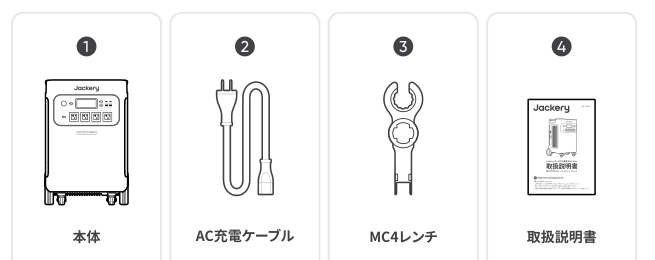

同梱品：本体、AC充電ケーブル、MC4レンチ、取扱説明書。

- 付属品を故障、紛失等してしまった場合はカスタマーサポートまでご連絡ください。
- シガーソケット充電ケーブルは別売りです。Jackery公式サイトよりご購入いただけます。サポートが必要な場合は、Jackeryカスタマーサポートまでお問い合わせください。

(je5000a-parts)=
## 各部の名称

(je5000a-parts-front)=
### 前面

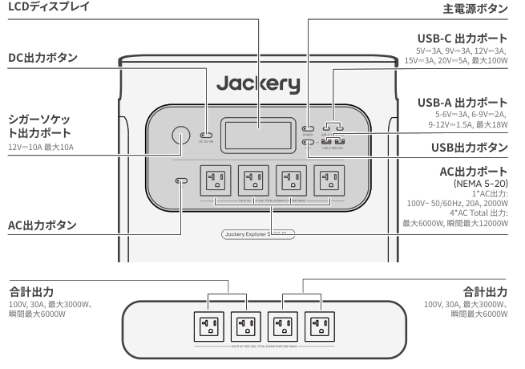

- LCDディスプレイ
- 主電源ボタン
- DC出力ボタン（シガーソケット出力ポート 12V⎓10A 最大10A）
- USB出力ボタン
  - USB-C 出力ポート：5V⎓3A, 9V⎓3A, 12V⎓3A, 15V⎓3A, 20V⎓5A, 最大100W
  - USB-A 出力ポート：5-6V⎓3A, 6-9V⎓2A, 9-12V⎓1.5A, 最大18W
- AC出力ボタン
  - AC出力ポート（NEMA 5-20）：1×AC出力 100V~50/60Hz, 20A, 2000W／4×AC Total出力 最大6000W, 瞬間最大12000W
  - 合計出力（左2口・右2口とも）：100V, 30A, 最大3000W、瞬間最大6000W

(je5000a-parts-left)=
### 左側面

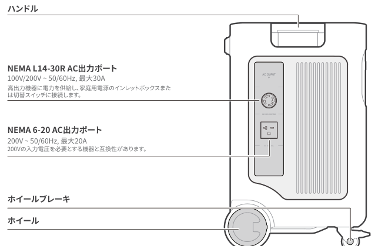

- ハンドル
- NEMA L14-30R AC出力ポート：100V/200V ~ 50/60Hz, 最大30A。高出力機器に電力を供給し、家庭用電源のインレットボックスまたは切替スイッチに接続します。
- NEMA 6-20 AC出力ポート：200V ~ 50/60Hz, 最大20A。200Vの入力電圧を必要とする機器と互換性があります。
- ホイールブレーキ
- ホイール

(je5000a-parts-right)=
### 右側面

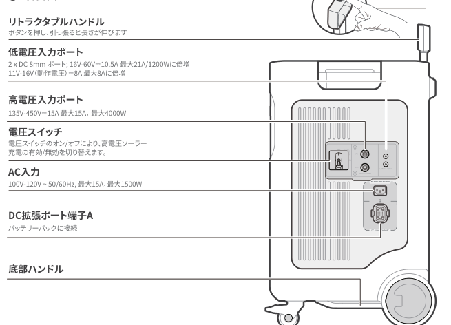

- リトラクタブルハンドル：ボタンを押し、引っ張ると長さが伸びます
- 低電圧入力ポート：2 x DC 8mm ポート; 16V-60V⎓10.5A 最大21A/1200Wに倍増；11V-16V（動作電圧）⎓8A 最大8Aに倍増
- 高電圧入力ポート：135V-450V⎓15A 最大15A，最大4000W
- 電圧スイッチ：電圧スイッチのオン/オフにより、高電圧ソーラー充電の有効/無効を切り替えます。
- AC入力：100V-120V ~ 50/60Hz, 最大15A，最大1500W
- DC拡張ポート端子A：バッテリーパックに接続
- 底部ハンドル

(je5000a-lcd)=
## 液晶画面

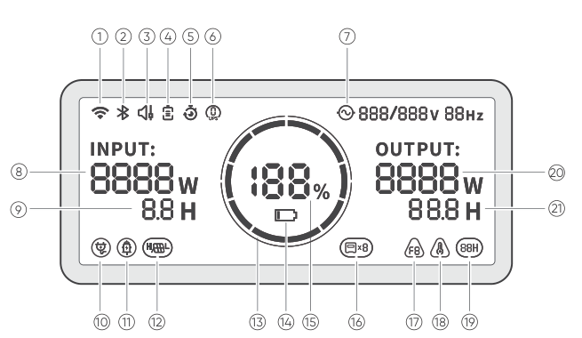

<div class="table-wrapper">
<figure aria-label="液晶画面アイコンの意味" class="hb-lcd-table-composition">
<table class="longtable hb-lcd-icon-table">
<colgroup><col class="hb-lcd-col-number"/><col class="hb-lcd-col-icon"/><col class="hb-lcd-col-name"/><col class="hb-lcd-col-description"/></colgroup>
<tbody>
<tr><td class="hb-lcd-number"><p>①</p></td>
<td class="hb-lcd-icon"></td>
<td class="hb-lcd-name"><p>Wi-Fi</p></td>
<td class="hb-lcd-description"><p>オン：Wi-Fi接続済。点滅：Wi-Fiに接続する準備ができました。オフ：Wi-Fi接続解除済。</p></td></tr>
<tr><td class="hb-lcd-number"><p>②</p></td>
<td class="hb-lcd-icon"></td>
<td class="hb-lcd-name"><p>Bluetooth</p></td>
<td class="hb-lcd-description"><p>オン：Bluetooth接続済。点滅：Bluetoothに接続する準備ができました。オフ：Bluetooth接続解除済。</p></td></tr>
<tr><td class="hb-lcd-number"><p>③</p></td>
<td class="hb-lcd-icon"></td>
<td class="hb-lcd-name"><p>静音充電モード<br><small>Jackeryアプリで有効/無効にできます</small></p></td>
<td class="hb-lcd-description"><p>オン：充電中の騒音が大幅に低減され、充電電力が低下し、充電速度が低減します。オフ：静音充電モードが無効になっています。</p></td></tr>
<tr><td class="hb-lcd-number" rowspan="2"><p>④</p></td>
<td class="hb-lcd-icon"></td>
<td class="hb-lcd-name"><p>バッテリー節約モード<br><small>Jackeryアプリで有効/無効にできます</small></p></td>
<td class="hb-lcd-description"><p>オン：製品の電力使用量を削減して、バッテリー寿命を延ばします。オフ：バッテリー節約モードが無効になっています。</p></td></tr>
<tr>
<td class="hb-lcd-icon"></td>
<td class="hb-lcd-name"><p>自家発電モード<br><small>Jackeryアプリで有効/無効にできます</small></p></td>
<td class="hb-lcd-description"><p>太陽光エネルギーの利用を最大化し、蓄電された太陽光エネルギーを優先することで、ご家庭の電力からの供給量を削減します。</p></td></tr>
<tr><td class="hb-lcd-number"><p>⑤</p></td>
<td class="hb-lcd-icon"></td>
<td class="hb-lcd-name"><p>計画充電モード<br><small>Jackeryアプリで設定してください</small></p></td>
<td class="hb-lcd-description"><p>Jackery ポータブル電源 5000 Plusの充電時間をカスタマイズすることで、電気料金オフピーク時間に基づいた充電プランを選択。これにより月々の電気料金を削減することができます。</p></td></tr>
<tr><td class="hb-lcd-number"><p>⑥</p></td>
<td class="hb-lcd-icon"></td>
<td class="hb-lcd-name"><p>オンラインUPS<br><small>Jackeryアプリで設定できます</small></p></td>
<td class="hb-lcd-description"><p>オン：製品はオンラインUPSモードです（0 ms）。オフ：バックアップUPSモード（デフォルト）。</p></td></tr>
<tr><td class="hb-lcd-number"><p>⑦</p></td>
<td class="hb-lcd-icon"></td>
<td class="hb-lcd-name"><p>交流電源による出力マーク（正弦波）</p></td>
<td class="hb-lcd-description"><p>AC出力（純正弦波）がオンになっています。</p></td></tr>
<tr><td class="hb-lcd-number"><p>⑧</p></td>
<td class="hb-lcd-icon">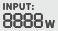</td>
<td class="hb-lcd-name"><p>入力電力表示</p></td>
<td class="hb-lcd-description"><p>入力電力をワットで表示します。</p></td></tr>
<tr><td class="hb-lcd-number"><p>⑨</p></td>
<td class="hb-lcd-icon"></td>
<td class="hb-lcd-name"><p>充電残り時間</p></td>
<td class="hb-lcd-description"><p>充電残り時間を表示します。</p></td></tr>
<tr><td class="hb-lcd-number"><p>⑩</p></td>
<td class="hb-lcd-icon"></td>
<td class="hb-lcd-name"><p>AC入力電力表示</p></td>
<td class="hb-lcd-description"><p>製品は、系統電力を使用し、AC入力を介して充電されます。</p></td></tr>
<tr><td class="hb-lcd-number"><p>⑪</p></td>
<td class="hb-lcd-icon"></td>
<td class="hb-lcd-name"><p>シガーソケット入力電力表示</p></td>
<td class="hb-lcd-description"><p>製品は、DC 12V（カーチャージ）を使用し、低PV入力（8020）を介して充電されています。</p></td></tr>
<tr><td class="hb-lcd-number" rowspan="2"><p>⑫</p></td>
<td class="hb-lcd-icon">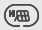</td>
<td class="hb-lcd-name"><p>高電圧入力インジケーター</p></td>
<td class="hb-lcd-description"><p>製品は、高PV入力（MC4）を介し、ソーラーパネルを使用して充電されます。</p></td></tr>
<tr>
<td class="hb-lcd-icon"></td>
<td class="hb-lcd-name"><p>低電圧入力インジケーター</p></td>
<td class="hb-lcd-description"><p>製品は、ソーラーパネルを使用し、低PV入力（8020）を介して充電されています。</p></td></tr>
<tr><td class="hb-lcd-number"><p>⑬</p></td>
<td class="hb-lcd-icon"></td>
<td class="hb-lcd-name"><p>バッテリーアイコン</p></td>
<td class="hb-lcd-description"><p>製品の充電中は、バッテリーのパーセンテージを囲むオレンジ色の円が順番に点灯します。他のデバイスの充電時には、オレンジ色の円は点灯したままになります。</p></td></tr>
<tr><td class="hb-lcd-number"><p>⑭</p></td>
<td class="hb-lcd-icon"></td>
<td class="hb-lcd-name"><p>バッテリー残量警告灯</p></td>
<td class="hb-lcd-description"><p>オン：バッテリー残量が20％未満です。点滅：バッテリー残量が5％未満です。オフ：製品は充電中です。</p></td></tr>
<tr><td class="hb-lcd-number"><p>⑮</p></td>
<td class="hb-lcd-icon"></td>
<td class="hb-lcd-name"><p>バッテリーレベルパーセントタグ</p></td>
<td class="hb-lcd-description"><p>バッテリー残量を表示します。</p></td></tr>
<tr><td class="hb-lcd-number"><p>⑯</p></td>
<td class="hb-lcd-icon">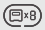</td>
<td class="hb-lcd-name"><p>バッテリーパックインジケータと接続された量</p></td>
<td class="hb-lcd-description"><p>本製品が指定された数の5000 Plusバッテリーパックに接続されていることを示します。</p></td></tr>
<tr><td class="hb-lcd-number"><p>⑰</p></td>
<td class="hb-lcd-icon"></td>
<td class="hb-lcd-name"><p>エラーコード</p></td>
<td class="hb-lcd-description"><p>製品エラーが発生しました。詳細については、トラブルシューティングのセクションを参照してください。</p></td></tr>
<tr><td class="hb-lcd-number" rowspan="2"><p>⑱</p></td>
<td class="hb-lcd-icon"></td>
<td class="hb-lcd-name"><p>高温インジケーター</p></td>
<td class="hb-lcd-description"><p>高温保護が作動しました。製品の温度が通常の動作範囲に戻るまで、製品の機能が停止する場合があります。</p></td></tr>
<tr>
<td class="hb-lcd-icon"></td>
<td class="hb-lcd-name"><p>低温インジケーター</p></td>
<td class="hb-lcd-description"><p>低温保護が作動しました。製品の温度が通常の動作範囲に戻るまで、製品の機能が停止する場合があります。</p></td></tr>
<tr><td class="hb-lcd-number"><p>⑲</p></td>
<td class="hb-lcd-icon"></td>
<td class="hb-lcd-name"><p>省エネモード</p></td>
<td class="hb-lcd-description"><p>出力の消し忘れによる不要なバッテリー消費を防ぐため、製品はデフォルトで省エネモードを有効にしています。デバイスが接続されていない場合、または接続されているデバイスの消費電力が特定のしきい値（AC出力≤25W、USB出力≤2W、カー出力≤2W）を下回っている場合、デバイスは12時間後にすべての出力を自動的にオフにします。オン/オフ：AC電源ボタンと主電源ボタンの両方を長押しします</p></td></tr>
<tr><td class="hb-lcd-number"><p>⑳</p></td>
<td class="hb-lcd-icon">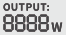</td>
<td class="hb-lcd-name"><p>出力電力</p></td>
<td class="hb-lcd-description"><p>出力電力をワットで表示します。</p></td></tr>
<tr><td class="hb-lcd-number"><p>㉑</p></td>
<td class="hb-lcd-icon"></td>
<td class="hb-lcd-name"><p>残り放電時間</p></td>
<td class="hb-lcd-description"><p>放電残りの時間を表示します。</p></td></tr>
</tbody>
</table>
</figure>
</div>

(je5000a-usage)=
## 使い方

```{important}
省エネモードでは、DC出力またはAC出力をオンにするか、充電入力または放電出力がない場合、12時間後に自動的にシャットダウンします。
```

(je5000a-usage-power)=
### 出力オン/オフ

**前提：主電源ボタンのみがオンになっています。**

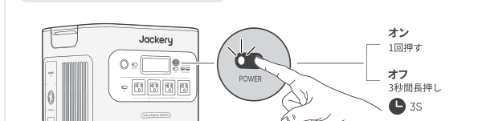

- オン：1回押す
- オフ：3秒間長押し

```{note}
本製品のデフォルトの待機時間は2時間です。（充電または放電がない場合、2時間後に自動的にシャットダウンします）。自動シャットダウン時間はJackeryアプリで設定できます。
```

(je5000a-usage-ac)=
### AC出力のオン/オフ

**前提：主電源ボタンがオンになっていることを確認してください。**

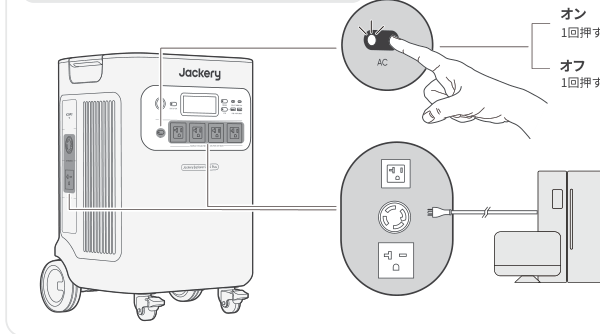

- オン：1回押す
- オフ：1回押す

(je5000a-usage-usb)=
### USB出力オン/オフ

**前提：主電源ボタンがオンになっていることを確認してください。**

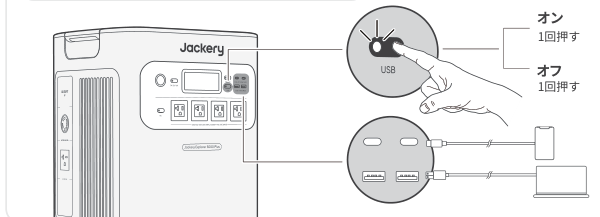

- オン：1回押す
- オフ：1回押す

(je5000a-usage-dc)=
### DC出力オン/オフ

**前提：主電源ボタンがオンになっていることを確認してください。**

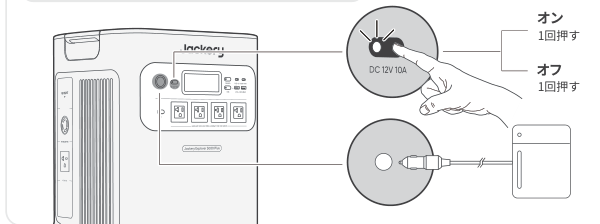

- オン：1回押す
- オフ：1回押す

(je5000a-usage-lcd)=
### LCDスクリーン

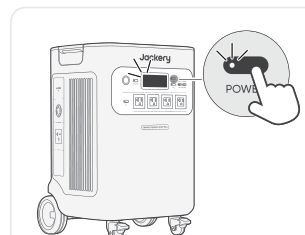

<div class="table-wrapper">
<table>
<tbody>
<tr><td rowspan="3">LCDスクリーン</td><td>オンにする</td><td>主電源ボタンを押すか、充電入力がある場合。</td></tr>
<tr><td>オフにする</td><td>主電源ボタンを押します。</td></tr>
<tr><td>自動オフ</td><td>2分間操作がないとLCDは自動的に消灯し、スリープモードになります。</td></tr>
<tr><td rowspan="3">常時点灯表示モード（充電中または放電中）</td><td>オンにする</td><td>LCD画面がオンのときに主電源ボタンをダブルクリックします。</td></tr>
<tr><td>オフにする</td><td>主電源ボタンを押します。</td></tr>
<tr><td>自動オフ</td><td>常時点灯ディスプレイモードは、2時間操作がないと自動的に消灯します。</td></tr>
</tbody>
</table>
</div>

(je5000a-usage-keycombo)=
### キーの組み合わせ

| ボタン | 操作 | 機能 |
| --- | --- | --- |
| 主電源ボタン + USB電源ボタン | 両方を3秒間長押し | Wi-FiとBluetoothをリセット |
| 主電源ボタン + AC電源ボタン | 両方を3秒間長押し | 省エネモードのオン/オフを切り替えます |
| USB電源ボタン + AC電源ボタン | 両方を3秒間長押し | Wi-FiとBluetoothをオンにします |
| DC電源ボタン + AC電源ボタン | 両方を3秒間長押し | オンラインUPSまたはバックアップUPSに切り替えます |

(je5000a-troubleshooting)=
## トラブルシューティング

| エラーコード | 名前 | 説明（内部故障メンテナンス専用） |
| --- | --- | --- |
| F0 | BMSデータ通信エラー | BMSとメインボード間のデータ通信障害 |
| F1 | インバーターデータ通信エラー | インバーターとメインボード間のデータ通信障害 |
| F2 | DC入力データ通信エラー | DC充電モジュールとBMS間のデータ通信障害 |
| F3 | BMSまたはバッテリーの故障 | BMSまたはバッテリーの故障 |
| F4 | バッテリー過電圧 | バッテリー過電圧 |
| F5 | バッテリー低電圧 | バッテリー低電圧 |
| F6 | インバーターの故障 | AC出力過電流/過負荷/短絡；系統電力入力過電圧/低電圧/過周波数/低周波数；インバーター過熱保護オン（起動）絶縁検出障害 |
| F7 | DC入力障害 | PV入力過電圧；DC充電モジュール過熱保護オン/起動；DC充電モジュールの出力過電流保護オン/起動 |
| F8 | バッテリーの充電/放電過電流/短絡 | BMS過電流/短絡保護オン/起動 |
| F9 | DC出力過電流/短絡 | USB短絡保護オン/起動 |
| FA | 並列ユニット通信エラー | 2つの5000 Plusの欠陥が原因で発生した両ユニット間のデータ通信障害。 |
| FC | バッテリーパック通信エラー | 5000 Plusとバッテリーパック間のデータ通信障害 |

(je5000a-ups)=
## UPS機能

UPS（無停電電源装置）は、停電などが発生した時に電気の供給を自動で切り替え、自動バックアップ電力を供給する継続的な電源システムです。

本製品はバックアップUPS（20ミリ秒切り替え）とオンラインUPS（0ミリ秒切り替え）に対応しています。

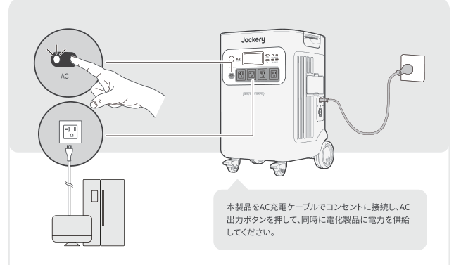

```{important}
- 本製品のNEMA L14-30RおよびNEMA 6-20 コンセントは、製品が AC 充電ケーブルを使用して壁のコンセントに接続されている場合、パススルー機能により100V 出力を提供します。
- システム設定は、製品がオンラインUPSモードで再起動すると、バックアップUPSモードに戻ります。
- オンラインUPSモードでは、NEMA 5-20出力ポートのみが動作し、0ミリ秒スイッチングをサポートし、最大出力電力は3000Wです。
- バックアップUPSとして使用している際はパススルー機能により充電と出力が同時に行われている状態のため、ポータブル電源の最大出力は1500Wに制限され、停電時には定格出力に戻ります。
```

(je5000a-ups-backup)=
### バックアップUPS

デフォルトではバックアップUPS機能が有効になっています。主電源が突然失われた場合、このデバイスは20ミリ秒以内に自動的に電源供給を切り替え、電化製品の電源を入れます。

本製品をAC充電ケーブルでコンセントに接続し、AC出力ボタンを押して、同時に電化製品に電力を供給してください。

(je5000a-ups-online)=
### オンラインUPS

オンラインUPSモード(0ミリ秒電源切り替え)に変更する方法は2通りあります。

1. Jackeryアプリでオンラインおよび機能を有効にする。
2. ディスプレイ画面にオンラインUPSのアイコンが表示されるまで、DCボタンとACボタンを同時に押してください。

(je5000a-battery-pack)=
## バッテリーパック（別売）に接続

本製品は最大5個のバッテリーパックに対応し、大容量電源のニーズに応えることができます。使用方法の詳細については、Jackery Battery Pack 5000 Plusの取扱説明書を参照してください。

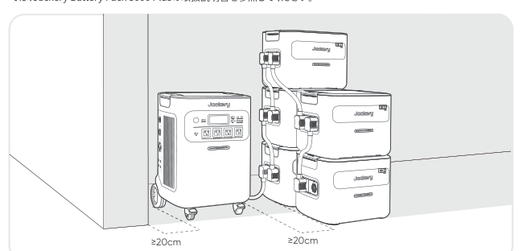

```{important}
- Battery packを Jackery Explorer 5000 Plus に接続する前に、両方の電源がオフになっていることを確認してください。
- 製品が適切に動作するよう、両側の吸気口と排気口が遮られていないことを確認してください。適切な放熱を確保するため、通気口と物との間に少なくとも20cmの空間を空けてください。
```

(je5000a-charging)=
## 充電方法

```{important}
最初に使用する前に、デバイスを完全に充電してください。
```

**グリーンエネルギー優先モード**

本製品はグリーンエネルギー優先モードを搭載しており、ソーラーパネルとAC充電ケーブルを使って同時に充電できます。同時に充電すると、ソーラーが優先されますが、バッテリーの最大許容電力で同時に充電されます。

```{caution}
- 製品の充電動作温度範囲は0℃～45℃、放電動作温度範囲は-15℃～45℃です。上限・下限温度を超えた場合、充放電が制限され、または充放電不可の可能性があります。
- 温度によって、製品の充電効率と実際の容量は異なります。
- 周囲温度が-15℃～-10℃の場合、最大出力は3000Wに低下します。
```

```{caution}
- はじめてお使いになるときは、本製品をフル充電してからご使用ください。
- 充電池は空の状態で長期保管(3カ月～6カ月）すると、性能が劣化したり、充電できなくなる場合があります。
- 本機を長期保管する場合には、3ヵ月に１度を目安に本体にACアダプターやソーラーパネルを通して蓄電が可能か、他製品に給電可能かなど動作確認をお願い致します。長期保管の際は満充電(電池残量100%)で保管することを推奨します。
```

(je5000a-charging-ac)=
### AC充電ケーブル

コンセントよりJackery ポータブル電源 5000 Plus 本体に充電する場合、電流容量が大きいため、他機器と併用したり途中接続をすると、コンセントの電流上限値を超え充電停止したり、配線やコンセント・接続部が発熱し、火災の原因となる恐れがあります。電源タップなどを使って他の電気製品と併用しないでください。

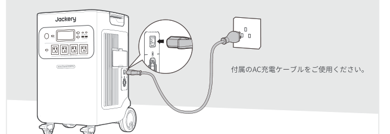

(je5000a-charging-solar)=
### ソーラー充電

```{caution}
ソーラーパネルを直列に接続する場合、すべてのパネルの最大電圧出力が低電圧入力ポートでは16V〜60V、高電圧入力ポートでは135V〜450Vの範囲内にあることを確認してください。
```

(je5000a-charging-solar-low)=
#### 低電圧入力ポートに接続

低電圧入力電圧範囲：16V < ソーラー入力合計 < 60V

Jackery ポータブル電源 5000 Plusには2つの低電圧入力ポートがあり、各ポートはJackery SolarSaga 200を3枚まで直接接続することができます（SolarSaga 200 × 6 まで対応）。1つの低電圧入力ポートに2つ以上のソーラーパネルを同時に接続する必要がある場合は、下図を参照してSolarsagaアダプター（別売り）を介して充電してください。

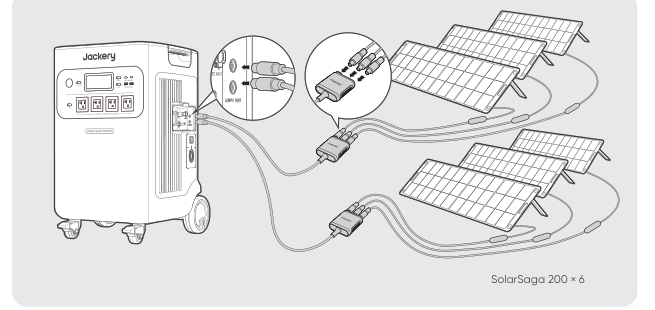

```{caution}
2つの入力を同時に使用する場合、2つのチャンネルの電圧の不一致による機器の損傷や充電の問題を避けるため、必ず同じ種類のソーラーパネルを使用し、2つの入力のソーラーパネルの数は同じでなければなりません。
```

(je5000a-charging-solar-high)=
#### 高電圧入力ポートに接続

高電圧入力電圧範囲：135V < 総太陽光入力 < 450V

```{caution}
- 高電圧入力を接続する前またはメンテナンス中には、高電圧スイッチをオフにしておきます。
- 高電圧入力ポートを使用する前に、電圧スイッチがオンになっていることを確認してください。
- 付属のMC4レンチを使用してMC4コネクタを分解する前に高電圧スイッチが「OFF」または「LOCK」の位置にあることを確認してください。
```

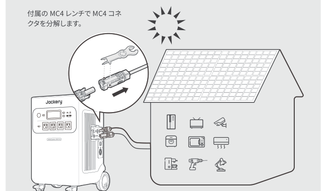

**ロック**

高電圧スイッチを「LOCK」位置に回し、ロック機構を押します。

**ロック解除**

ロック機構を解除すると、スイッチは「OFF」位置に戻ります。

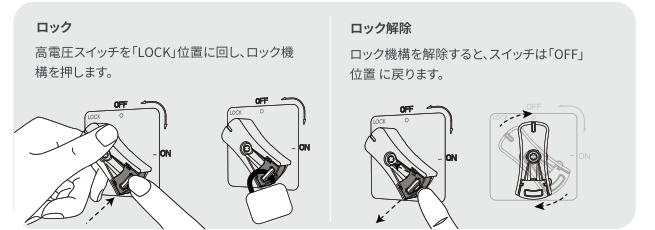

(je5000a-charging-solar-combo)=
#### 高電圧＋低電圧入力

低電圧入力用の電圧範囲：16V < 総太陽光入力 < 60V
高電圧入力の電圧範囲：135V < 総太陽光入力 < 450V

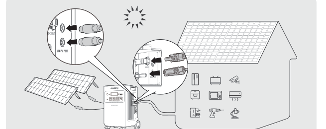

(je5000a-charging-car)=
### 車載シガーソケットからの充電について

- 本製品は12V / 10A対応の車のシガーソケットから充電が可能です。
- 必ずエンジンを始動した後にシガーソケットをご使用ください。車のバッテリー上がりを防止するためです。
- ご使用前に、車側の充電ポートとシガーライターケーブルの接触に問題がないかをご確認ください。しっかりと所定の位置に差し込まれているかもご確認ください。
- 悪路などで車の振動が大きい場合は、接触不良により発熱・焼損の恐れがあります。その場合は、安全のためシガーソケットでの充電を中止してください。

※本製品の誤った取り扱いにより生じた損害について、当社では一切の責任を負いかねます。あらかじめご了承ください。

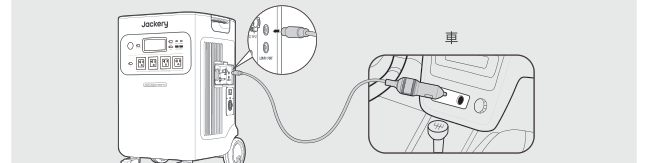

*シガーソケット充電ケーブルは別売りです。

```{caution}
**充電に関する安全上のご注意**

- シガーソケット充電とソーラー充電を同時に使用しないでください。同時に使用すると、車のヒューズが損傷する可能性があります。
- シガーソケット充電は12V，10A車専用で、24V車は充電できません。人身傷害や物的損害を避けるため、本製品の充電に24V車を使用しないでください。
- Jackeryブランド以外の付属品を使用して充電しないでください。特に、ソーラーパネルで充電する際は、Jackeryのソーラーパネルを使用することをお勧めします。他社ソーラーパネルで充電することによる損失について、当社は一切の責任を負いません。
```

(je5000a-safety)=
## 安全上のご注意

ご使用の前にこの「安全上のご注意」をよくお読みのうえ、正しくお使いください。

(je5000a-safety-legend)=
### 絵表示について

製品を安全に正しくお使いいただき、お客様や他の方々への危害や財産への損害を未然に防止するための表示です。
内容をよく理解してから本文をお読みください。

<div class="table-wrapper">
<table class="manual-callout-table">
<tbody>
<tr>
<td class="manual-callout-label"><p><strong>警告</strong></p></td>
<td class="manual-callout-body"><p>この表示を無視して、誤った取り扱いをすると、人が死亡または重傷を負う可能性が想定される内容を示しています。</p></td>
</tr>
<tr>
<td class="manual-callout-label"><p><strong>注意</strong></p></td>
<td class="manual-callout-body"><p>この表示を無視して、誤った取り扱いをすると、人が傷害を負う可能性が想定される内容または物的損害の発生が想定される内容を示しています。</p></td>
</tr>
</tbody>
</table>
</div>

(je5000a-safety-symbols)=
### 絵表示の説明

<div class="table-wrapper">
<table>
<tbody>
<tr><td></td><td>コンセントから電源プラグを抜く記号</td></tr>
<tr><td></td><td>行為を指示する記号</td></tr>
<tr><td></td><td>製品を分解、改造を禁止する記号</td></tr>
<tr><td>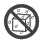</td><td>製品を濡らすことを禁止する記号</td></tr>
<tr><td></td><td>製品に濡れた手で触れることを禁止する記号</td></tr>
<tr><td></td><td>行為を禁止する記号</td></tr>
</tbody>
</table>
</div>

(je5000a-safety-warning)=
### 警告

<div class="table-wrapper">
<table class="manual-callout-table">
<tbody>
<tr>
<td class="manual-callout-label"><p><strong>警告</strong></p></td>
<td class="manual-callout-body"></td>
</tr>
</tbody>
</table>
</div>

<div class="table-wrapper">
<table>
<tbody>
<tr><td></td><td><p><strong>火のそばや炎天下の車内、熱器具の周辺など高温（45℃以上）になる場所で使用したり、放置しない</strong></p><p>発熱や発火、破裂する原因になります。</p></td></tr>
<tr><td></td><td><p><strong>強い衝撃を与えたり、投げつけたりしない</strong></p><p>発熱や発火、破裂する原因になります。</p></td></tr>
<tr><td></td><td><p><strong>水など、液体を入れたり、濡らしたりしない</strong></p><p>発熱や発火の原因になります。</p></td></tr>
<tr><td></td><td><p><strong>濡れた手で本体や接続するケーブルを触らない</strong></p><p>火災や感電の原因になります。</p></td></tr>
<tr><td></td><td><p><strong>端子部にケーブル以外の金属類を差し込まない</strong></p><p>発熱や発火の原因になります。</p></td></tr>
<tr><td></td><td><p><strong>雷が鳴りだしたら、電源プラグにふれない（充電をしない）</strong></p><p>感電の原因になります。</p></td></tr>
<tr><td></td><td><p><strong>各接続端子には確実に差し込む</strong></p><p>差し込みが不十分だと、発熱したりほこりが付着して火災や感電の原因になります。</p></td></tr>
<tr><td></td><td><p><strong>接地接続は必ず、電源プラグを電源につなぐ前に行って下さい</strong></p><p>また、接地接続を外す場合は、必ず電源プラグを切り離してから行って下さい。</p></td></tr>
</tbody>
</table>
</div>

<div class="table-wrapper">
<table>
<tbody>
<tr>
<td rowspan="2"></td>
<td>
<p><strong>万が一、次のような異常が発生したときはすぐに使用をやめる</strong></p>
<ul>
<li>煙が出ている、異臭がする</li>
<li>落としたり、破損したとき</li>
<li>異音がする</li>
<li>内部に水や異物が入ったとき</li>
<li>電源コード（ACアダプター）が傷んだとき</li>
</ul>
<p>このような異常が発生したまま使用していると、火災や感電の原因になります。すぐにACアダプターをコンセントから抜いてください。また、本製品に接続されている機器もすべて外してください。</p>
</td>
</tr>
<tr>
<td>
<p><strong>万が一発煙や発火したら、大量の水で消火して煙が見えなくなるまで本製品を水浸しにしてください。</strong></p>
<p>煙が出なくなることを確認してからカスタマーサポートにご連絡ください。お客様による修理は危険ですので絶対におやめください。</p>
</td>
</tr>
<tr>
<td></td>
<td><p><strong>分解、改造しない</strong></p><p>故障、発熱、火災・感電の原因になります。</p></td>
</tr>
<tr>
<td></td>
<td><p><strong>表示された電源電圧以外で使用しない</strong></p><p>故障、発熱、火災・感電の原因になります。また、本製品を使用できるのは日本国内のみです。</p></td>
</tr>
<tr>
<td></td>
<td><p><strong>付属品と本製品が破損した場合は、ご自身で修理をしない</strong></p></td>
</tr>
</tbody>
</table>
</div>

(je5000a-safety-caution)=
### 注意

<div class="table-wrapper">
<table class="manual-callout-table">
<tbody>
<tr>
<td class="manual-callout-label"><p><strong>注意</strong></p></td>
<td class="manual-callout-body"></td>
</tr>
</tbody>
</table>
</div>

<div class="table-wrapper">
<table>
<tbody>
<tr><td></td><td><p><strong>本製品の上に物を載せたり、不安定な場所に置かない</strong></p><p>倒れたり、落ちたりしてけがの原因になります。</p></td></tr>
<tr><td></td><td>
<p><strong>データサーバや医療機器など、非常時に不具合が起こると人命/財産に重大な危険を及ぼしうる用途でのご使用はお控えください。</strong>次のようなような機器では、万が一使用中に給電ができなくなった場合、人命/財産にかかわる被害が想定されます。</p>
<ul>
<li>医療機器や使用上、生命に関わるような機器</li>
<li>社会的、公共的に重要な機器など</li>
<li>重要な事業用機器など</li>
</ul>
</td></tr>
<tr><td></td><td><p><strong>心臓にペースメーカーを装着している方は使用しない</strong></p><p>ペースメーカーが、本製品の影響を受ける恐れがあります。</p></td></tr>
<tr><td></td><td><p><strong>格納式ハンドルを使用してJackery ポータブル電源 2000 を移動するときは、積み重ねたり、上に他の物を置いたりしないでください。落下して怪我をする場合があります。</strong></p></td></tr>
</tbody>
</table>
</div>

(je5000a-precautions)=
## 使用上のご注意

Jackery ポータブル電源 5000 Plusは、定格出力6000Wです。通常時で消費電力が6000Wまでの機器に給電ができるため、多くの電化製品や端末に対応可能です。ただし、電気モーターを搭載している製品については、例(ヒーター、掃除機、ポンプ、冷蔵庫、電動丸ノコ、エアコン、洗濯機、電子レンジ、ドライヤーなど)起動時に「誘導負荷」が発生し、公称電力の3～7倍の電力が必要となります。定格出力6000Wは、一定の電力で動く機器への出力可能範囲を指しています。

6000Wの出力を超えた場合は、電気回路が自動的に調整され、電力が低減、または保護機能が作動し自動で遮断することがあります。

またAC出力ポート6つ搭載されておりますが、6つ同時にご利用頂く場合、合計して6000W以内であることをご確認の上ご利用ください。

```{caution}
始動電力が出力上限値(定格出力)を大幅に超える可能性のある製品のご利用や、定格出力を超え給電がストップした製品を繰り返し利用することはポータブル電源のバッテリーが損傷するリスクがありますのでお控えください。
```

- 出力上限値を超えた電化製品を利用しない(始動電力が公称電力3倍〜7倍の誘導負荷のヒーター、掃除機、冷蔵庫、エアコン、電子レンジ、洗濯機、電動丸、ポンプなどは特にご注意下さい)。
- 本製品は、充電ケーブル、DCケーブル、USBケーブルの差し込みが緩い状態で使用した場合、発火や発煙などの恐れがあります。確実に奥まで差し込んでから、ご使用ください。
- 本製品は防塵・防水仕様ではありませんので、ほこりや水、海水などがかからないように注意してください。
- ほこりが多い場所や高温多湿の場所での充電および使用、放置をしないでください。
- 本製品を不安定な場所に置かないでください。必ず、平坦で安定した場所に置いて使用してください。
- 本製品の通風孔は、安全上絶対にふさがないでください。また、本製品の各面から5cm以上スペースを空けてください。
- 充電または給電中は本製品が温かくなります(故障ではありません)、周囲には物を置かないでください。
- 本製品接続機器のケーブルを差すときは、真っすぐな向きに差してください。
- 接続機器のケーブルを抜くときは、必ずプラグ部分を持って抜いてください。ケーブルを引っ張ったり折り曲げると、断線などの原因となります。
- 給電する機器の充電制御や充電状況、環境などにより給電できない、または急速充電にならない場合があります。
- 充電または給電中はラジオやチューナー、テレビなどに雑音が入る場合があります。雑音が入る場合には、それらの製品から離れた場所でお使いください。
- 本体が汚れたらコンセントから電源プラグを抜き、柔らかい布で乾拭きしてください。
  汚れがひどいときは、水または薄めた中性洗剤でふきとってください。シンナーやベンジンなどは絶対に使わないでください。
- 入出力の電力(W)
  接続機器の消費電力が本製品の出力上限値を超えている場合、電源を自動的に遮断します。消費電力が仕様以下であることを確認してから出力ボタンを押してください。
- 低/高温警報
  本機は-15℃〜45℃(5°F〜113°F)の温度範囲でお使いの機器に電力供給が可能となり、本機への蓄電は0℃〜45℃(32°F〜113°F)で行えます。
  動作温度が上記範囲外にある場合、本製品が温度異常マークが表示され動作しない可能性がございます。
  温度異常マークを解除するには、動作温度範囲内の環境に2時間以上置くようにお願い致します。
- 容量表示に関しては、あくまで参考値となり、電圧により電力が算出され、表示数値にズレが発生することがあります。

(je5000a-disclaimer)=
## 免責事項

- 火災、地震、第三者による行為、その他の事故、お客様の故意または過失誤用・誤動作・その他の異常な条件下での使用により生じた損害に関して、当社は一切責任を負いません。
- 付属品と本製品が破損した場合は、ご自身で修理を行わないでください。
  ご自身で分解・修理したことにより生じた損害に関し、当社は一切責任を負いません。
- 保証範囲は利用規約に適用され、記載されていない内容は当社の保証範囲外となります。
- 取扱説明書の記載事項が遵守されないことにより生じた不適合について当社は責任を負いかねます。
- 本製品の使用、または使用不能から発生する付随的な損害(事業利益損失含む)、当社が関与しない接続機器との組み合わせによる誤動作などから生じた損害に関して、当社は一切の責任を負いません。
- 本製品は病院仕様のCPAP（シーパップ）、ECMO（エクモ）、ペースメーカなど、身の安全に関わる医療救急機械の電源としての使用、または、消費電力の大きいな設備、例えば核施設設備、スペースシャトル製造などの使用は推薦されません。上記設備の使用後、火災、機器故障など個人安全を脅かす事故の責任を取りません。

(je5000a-app)=
## Jackeryアプリ ユーザーマニュアル

(je5000a-app-download)=
### 1. アプリをダウンロードしてログインするには

Google PlayまたはApp Storeで「Jackery」と検索し、アプリをインストールしてください。その後、登録とログインを行ってください。

または、下の QR コードをスキャンしてアプリをダウンロードし、インストールしてください。


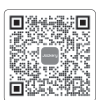

(je5000a-app-add)=
### 2. デバイスを追加するには

2.1 APPの右上にあるデバイス追加ボタン を クリックします；

2.2 デバイスの主電源ボタンを長押しして電源をいれると、ディスプレー画面にWi-FiとBluetoothのアイコンが点滅し、デバイスがネットワーク設定モードに入ったことを示します。アイコン点滅中ボタンをクリックし、アプリが近くのデバイスに接続し、Bluetoothのアクセス許可を開くことを許可します；

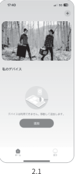
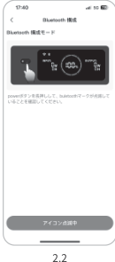

```{note}
電源を入れた後、アプリが2時間以内接続されていないと、デバイスは自動的にWi-FiとBluetoothをオフにします。再度Wi-FiとBluetoothをオンにするには、「USBボタン」と「ACボタン」を同時長押しする必要があります。
```

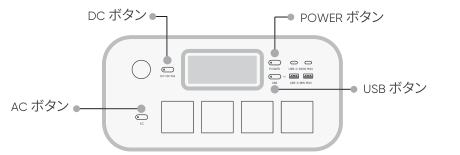

2.3 検出されたデバイスアイコンをクリックすると、アプリは自動的にBluetoothでデバイスを接続します。

```{note}
バインド処理中に「デバイスがバインドされました」と表示された場合は、以下の2つの方法で接続できます：

- デバイス所有者は、アプリを通じてこのデバイスを他のユーザーと共有します。
- 「POWERボタン」と「USBボタン」を3秒間長押ししてデバイスをリセットし、再度バインドしてください。
```

2.4 デバイスが正常に接続されると、デバイスが接続するWi-Fiの名前とパスワードを入力する必要があり、デバイスは自動的にWi-Fiネットワークに接続します。

```{note}
2.4GHz帯のWi-Fiネットワークを選択してください。デバイスは、5GHz帯のWi-Fiネットワークには対応していません。
```

2.5 デバイスのホーム画面でデバイスが正常に追加されると、デバイスのWi-Fi アイコンは常にオンになります。

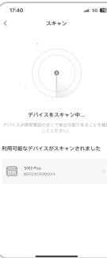
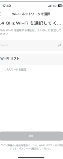
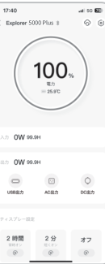

*上記のスクリーンショットはご参考まで。*

(je5000a-app-unbind)=
### 3. デバイスのバインドを解除するには

デバイスのメインインターフェースの右上隅にある「設定」ボタンをクリックして設定ページに入り、ページの下部にある「バインド解除」ボタンをクリックしてデバイスのバインドを解除します。

(je5000a-app-verify)=
### 4. ご確認

#### 4.1 Wi-FiとBluetoothをオンにするには（ディスプレーにWi-FiとBluetoothのアイコンが点灯）

- デバイスがオンになれば自動的にオンになり、ディスプレーにWi-FiとBluetoothのアイコンが点灯します；
- 上記アイコンが点灯しない場合、ディスプレーにWi-FiとBluetoothのアイコンが点灯するまで、USB出力ボタンとAC出力ボタンを同時長押しします。

#### 4.2 Wi-FiとBluetoothをオフにするには（ディスプレーにWi-FiとBluetoothのアイコンが消える）

- ディスプレーにWi-FiとBluetoothのアイコンが消えるまで、USB出力ボタンとAC出力ボタンを同時長押しします；
- 2時間以内にデバイスが接続されない場合、Wi-FiとBluetoothは自動的にオフになります。

#### 4.3 Wi-FiとBluetoothをリセットするには

- 主電源ボタンとUSBボタンを同時に3秒間押すと、Wi-FiとBluetoothが初期化され、システムが再起動します。接続されているアプリアカウントはバインド解除されます。

(je5000a-warranty)=
## 保証サービス

本書は、株式会社 Jackery Japan（以下、当社）製品の交換・修理にかかる保証サービスの内容を説明するものです。

1. 当社は、当社が運営するJackery Japan 公式オンラインストア、当社もしくは正規販売代理店が販売元として販売した当社のポータブル電源・ソーラーパネル、その他の付属製品について保証期間中に、当社が定める条件に従って保証サービスを提供しております。
2. 当社は、保証期間中に、当社が定める「保証条件」に合致した場合、Jackery 製品を交換・無償修理するものとします。

   保証期間内に当社に有効な請求が行われた場合、当社は、同じJackery 製品を交換もしくは価値の等しい製品と交換いたします。無償修理については、当社ポータブル電源の新品のご購入日から30 日以上5 年間以内の製品を対象といたします。
3. 取扱説明書、本体貼付ラベルなどの注意書に従った使用状態で、保証期間内に製品が故障した場合のみ無償交換・無償修理をさせていただきます。
4. 当社は、日本国内に居住または滞在中のお客様のみを対象として、日本国内においてのみ本サービスを提供いたします。
5. 保証期間内でも次の場合には保証対象外となります。

   1. 保証期間中に発生した故障について、保証期間終了後に請求された場合
   2. 使用上の誤り(取扱説明書、本体貼付ラベル等の注意書きに従った正常な使用をしなかった場合を含む)による故障・損傷
   3. 他の機器から受けた障害または不当な修理、改造による故障・損傷
   4. お買上げ後の移設、輸送、落下などによる故障・損傷
   5. 火災や地震、風水害、落雷その他の天災地変、公害、塩害、異常電圧などによる故障・損傷
   6. 業務用など一般家庭用以外での使用による故障損傷
   7. 消耗・摩耗した部品の交換、汚損した部分の交換
6. 在庫切れや販売終了など当社都合で新品製品が調達できなかった場合返金にて対応することがあります。
7. 本書に基づく交換・修理製品については、最初のご購入時の保証期間、または交換日から90 日間のどちらか長い期間で保証されます。
8. お客様の修理依頼品の状態、故障部分あるいは当社の事情により、修理による対応が不可能、困難または合理的でないと判断した場合、かつ保証期間内と確認できた場合に、当社が選定する同等程度の機能・性能を有する製品（修理依頼品と類似の製品・異機種を含みます）と修理依頼品との交換をさせていただく場合がございます。
9. 当社は、保証期間が過ぎた製品及び保証対象外の製品について、修理すれば使用できる場合は、ご希望により有償修理にて承ります。
10. 当社の製品または製品のご使用から起因して生じた障害・損傷により、直接または間接的に発生した製品以外への損失、その他の金銭的損害につきまして、弊社はその一切の責任は負わないものとします。
11. 本書は再発行いたしませんので紛失しないよう大切に保管してください。

※保証期間はお買い上げ日より5 年間となります。

※本書は、本書記載内容（上記記載）で無償製品交換・無償修理を行うことをお約束するものです。故障による保証サービスを受ける際は、当社もしくは当社製品正規取扱店が運営するショップでの購入が証明できるもの（インターネットでの購入は注文番号、それ以外はレシートや領収書など）をお手元にご用意の上、Jackery Japan カスタマーサービス、もしくは販売店へお問い合わせください。

※故障による保証サービスを受ける際は、当社もしくは当社製品正規取扱店が運営するショップでの購入が証明できるもの（インターネットでの購入は注文番号、それ以外はレシートや領収書など）が必須となりますのでご注意ください。当社製品正規取扱店につきましては、当社公式HP をご確認ください。

※本書によって保証責任者、及びそれ以外の事業者に対するお客様の法律上の権利を制限するものではありません。

※保証内容は都合により予告なく変更する場合がございますのでご了承ください。

公式サイト：<a href="http://www.jackery.jp">http://www.jackery.jp</a>

カスタマーサービス：<a href="mailto:jackery.jp@jackery.com">jackery.jp@jackery.com</a>
