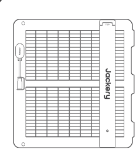
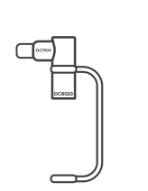
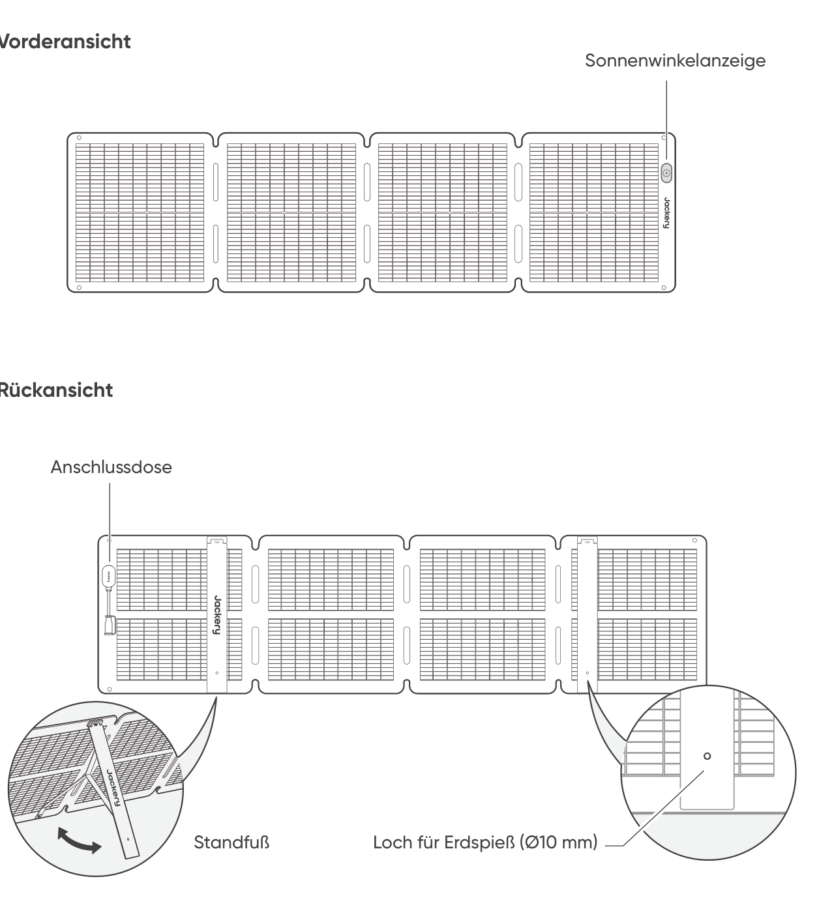
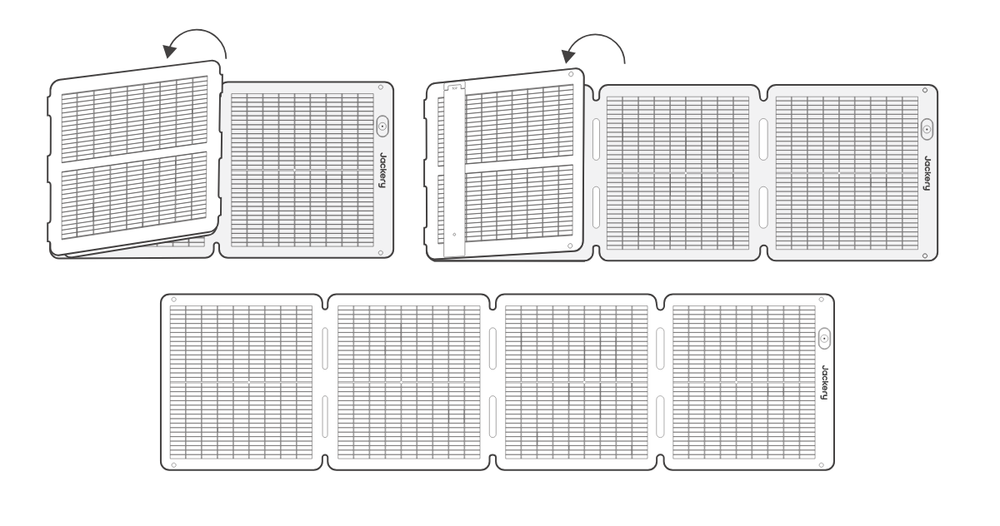
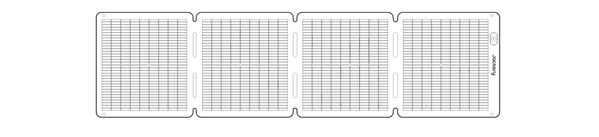

# SICHERHEITSTIPPS

- Bitte lesen Sie zuerst die Bedienungsanleitung, bevor Sie dieses Produkt verwenden.

- Biegen Sie die Solarpaneele nicht.

- Stellen Sie die Solarmodule nicht in Bäumen, Gebäuden oder anderen schattigen Bereichen auf.

- Tauchen Sie die Solarmodule nicht über längere Zeit in Wasser oder andere Flüssigkeiten ein.

- Wischen Sie die Solarmodule mit einem feuchten Tuch vorsichtig ab.

- Verwenden oder lagern Sie die faltbaren Solarmodule nicht in der Nähe von offenen Flammen oder brennbaren Materialien.

- Zerkratzen Sie die Solarmodule nicht mit scharfen Gegenständen.

- Geben Sie keine ätzenden Substanzen auf die Solarmodule.

- Treten Sie nicht auf die Solarmodule und stellen Sie keine schweren Gegenstände darauf ab.

- Die Solarmodule dürfen nicht demontiert werden.

- Der Ausgangsschaltkreis des faltbaren Solarmodulpa- kets muss ordnungsgemäß an das Gerät angeschlossen werden, und eine Verpolung der positiven und negativen Pole ist strengstens untersagt.

- Überprüfen Sie vor der Verwendung den Anschlussstatus der verschiedenen Komponenten, Kabel und Stecker.

- Lassen Sie das Gerät nicht fallen, da dies zu inneren Schäden führen und es unbrauchbar machen kann.

- Das Solarpanel ist nicht für eine dauerhafte Installation vorgesehen. Bitte lagern Sie die Solarpanels bei starkem Wind, Hagel oder anderen extremen Wetterbedingungen an einem sicheren Platz, um Schäden zu vermeiden.

- Unter normalen Umständen können PV-Module höheren Strömen oder Spannungen ausgesetzt sein als unter Standard-Testbedingungen. Bei der Berechnung der Nominalspannung des Bauteils, des Nennstroms des Leiters und der Größe des an den PV-Ausgang angeschlossenen Steuergeräts ist es daher erforderlich, die auf dem Bauteil angegebenen Werte für Kurzschlussstrom (Isc) und Leerlaufspannung (Voc) mit dem Faktor 1,25 zu multiplizieren.

- Jede Beschädigung des Geräts kann zu einem Stromschlag oder Brand führen.

- Setzen Sie die Solarpanels keinem künstlichen Scheinwerferlicht aus.

- Schließen Sie das Solarpanel nicht an andere Solarpanels oder Stromquellen an, es sei denn, die Kombination verfügt über einen Schutz gegen Rückstrom und Überspannung.

# LIEFERUMFANG

<figure aria-label="LIEFERUMFANG" class="hb-inbox-composition" data-card-count="5" data-component-id="HB-SPECIAL-INBOX" data-inbox-variant="responsive-card-grid"><ol class="hb-inbox-grid"><li class="hb-inbox-card" data-item-number="1">

<strong>Jackery SolarSaga 100 Air</strong>

</li><li class="hb-inbox-card" data-item-number="2">

<strong>Aufbewahrungstasche</strong>

</li><li class="hb-inbox-card" data-item-number="3">

<strong>Multifunktionales Solarladekabel (3 m)</strong>

</li><li class="hb-inbox-card" data-item-number="4">

<strong>DC8020 auf DC7909 Adapter</strong>

</li><li class="hb-inbox-card" data-item-number="5">

<strong>Benutzerhandbuch</strong>

</li></ol>

<strong>HINWEIS</strong>

Das multifunktionale Solarladekabel ist ausschließlich mit dem Solarmodul SolarSaga 100 Air (JS-100I) kompatibel. Verwenden Sie es nicht mit anderen Solarmodul-Modellen.

</figure>

# NUTZUNGSHINWEISE

<figure class="manual-step-figure">

<figcaption>
Vorderansicht · Rückansicht · Sonnenwinkelanzeige · Anschlussdose · Standfuß · Loch für Erdspieß (Ø10 mm)
</figcaption>
</figure>

# AUFKLAPPEN DES SOLARMODULS

<figure class="manual-step-figure">

<figcaption aria-hidden="true">
1. Nehmen Sie das Solarmodul aus der Aufbewahrungstasche.
</figcaption>
</figure>

<figure class="manual-step-figure">

<figcaption aria-hidden="true">
2. Klappen Sie das Solarmodul wie in der Abbildung gezeigt Schritt für Schritt auf.
</figcaption>
</figure>

<figure class="manual-step-figure">

<figcaption aria-hidden="true">
3. Öffnen Sie die beiden Standfüße auf der Rückseite des Solarmoduls.
</figcaption>
</figure>

<figure class="manual-step-figure">

<figcaption aria-hidden="true">
4. Richten Sie das Modul zur Sonne aus und verbinden Sie es anschließend mit Ihrer tragbaren Powerstation.
</figcaption>
</figure>

# ZUSAMMENKLAPPEN DES SOLARMODULS

<figure class="manual-step-figure">

<figcaption aria-hidden="true">
1. Trennen Sie das Multifunktions-Ladekabel und klappen Sie die Standfüße ein.
</figcaption>
</figure>

<figure class="manual-step-figure">

<figcaption aria-hidden="true">
2. Falten Sie das Solarmodul wie in der Abbildung gezeigt der Reihe nach entlang der Faltlinien zusammen.
</figcaption>
</figure>

<figure class="manual-step-figure">

<figcaption aria-hidden="true">
3. Legen Sie das Solarmodul in die Aufbewahrungstasche zurück.
</figcaption>
</figure>

# AUFLADEN EINER TRAGBAREN JACKERY-POWERSTATION

Verbinden Sie das Ladekabel mit dem/den Solarpanel(en) und dem DC-Eingang der tragbaren Powerstation.

## DC8020-ANSCHLUSS

Kompatibel mit tragbaren Jackery-Powerstationen mit DC8020-Eingangsanschluss/-anschlüssen.

<figure class="manual-step-figure">

<figcaption>
DC8020 Stecker
</figcaption>
</figure>

## DC8020-DC7909 ADAPTER

Kompatibel mit tragbaren Jackery-Powerstationen mit DC7909-Eingangsanschluss/-anschlüssen.

<figure class="manual-step-figure">

<figcaption>
DC8020-DC7909 Adapter
</figcaption>
</figure>

## DC8020-ZU-USB-C-ADAPTERKABEL (SEPARAT ERHÄLTLICH)

Kompatibel mit tragbaren Jackery-Powerstationen mit USB-C-Eingangsanschluss/-anschlüssen.

<figure class="manual-step-figure">

<figcaption>
DC8020-zu-USB-C-Adapterkabel
</figcaption>
</figure>

<table class="manual-callout-table" style="width:100%; border-collapse:collapse; margin:0 0 16px 0;"><tbody><tr><td class="manual-callout-label" style="width:16%; border:1px solid #000; padding:6px 8px; vertical-align:top;">
<strong>HINWEIS</strong>
</td><td class="manual-callout-body" style="border:1px solid #000; padding:6px 8px; vertical-align:top;">
Das DC8020-zu-USB-C-Adapterkabel ist ausschließlich zum Laden von tragbaren Jackery-Powerstationen vorgesehen. Verwenden Sie es nicht zum Laden anderer Geräte.
</td></tr></tbody></table>

## BEI VERWENDUNG DES SOLARMODUL-ANSCHLUSSES (SEPARAT ERHÄLTLICH)

Verbinden Sie die beiden Solarmodule jeweils mit dem Anschluss für das Solarmodul und schließen Sie dann den Anschluss für das Solarmodul an den Gleichstromeingang der tragbaren Powerstation an.

<figure class="manual-step-figure">

<figcaption>
DC8020 Stecker · Solarmodul-Anschlussstück
</figcaption>
</figure>

※ Stellen Sie sicher, dass nur Solarmodule desselben Modells an den Eingang des Anschlusses angeschlossen werden.

# SONNENWINKELANZEIGE

Das Produkt verfügt über eine Sonnenwinkelanzeige. Wenn Sonnenlicht auf seine Oberfläche trifft, erscheint an seiner Unterseite ein Schatten.

<figure class="manual-step-figure">

<figcaption>
Sonnenwinkelanzeige · Indikatorpunkt · Schatten
</figcaption>
</figure>

Wenn der Schatten auf den inneren weißen Kreis unten fällt, bedeutet dies, dass das Solarpanel direkt der Sonne zugewandt ist und eine optimale Stromerzeugung erzielt wird; Wenn nicht, wird empfohlen, den Winkel anzupassen, bis dies der Fall ist.

<figure class="manual-step-figure manual-detail-figure">

<figcaption aria-hidden="true">
Schatten fällt in den inneren weißen Kreis
</figcaption>
</figure>

<figure class="manual-step-figure manual-detail-figure">

<figcaption aria-hidden="true">
Schatten fällt nicht in den inneren weißen Kreis
</figcaption>
</figure>

<table class="manual-callout-table" style="width:100%; border-collapse:collapse; margin:0 0 16px 0;"><tbody><tr><td class="manual-callout-label" style="width:16%; border:1px solid #000; padding:6px 8px; vertical-align:top;">
<strong>HINWEIS</strong>
</td><td class="manual-callout-body" style="border:1px solid #000; padding:6px 8px; vertical-align:top;">
Um die Stromerzeugung zu maximieren, richten Sie das Jackery SolarSaga 100 Air im Tagesverlauf entsprechend aus, sodass die Moduloberfläche möglichst vollständig direkter Sonneneinstrahlung ausgesetzt ist.
</td></tr></tbody></table>

## IHR GERÄT MIT ENERGIE VERSORGEN

<figure class="manual-step-figure">

<figcaption>
Jackery SolarSaga 100 Air · Multifunktions-Adapter · USB-C · LED · USB-A · Handy · Power Bank · Tablet
</figcaption>
</figure>

<figure class="manual-step-figure">

<figcaption>
* Setzen Sie den Gummistopfen ein, wenn die USB-Anschlüsse nicht verwendet werden, um das Eindringen von Staub zu verhindern.
</figcaption>
</figure>

# TECHNISCHE PARAMETER

## GRUNDLEGENDE INFORMATIONEN

<figure aria-label="GRUNDLEGENDE INFORMATIONEN" class="hb-spec-table-composition"><table class="hb-spec-table manual-table manual-spec-table"><colgroup><col class="hb-spec-col-label"/><col class="hb-spec-col-value"/></colgroup>
<tbody>
<tr>
<th class="hb-spec-label manual-spec-label" scope="row">Produktname</th>
<td class="hb-spec-value manual-spec-value">Jackery SolarSaga 100 Air</td>
</tr>
<tr>
<th class="hb-spec-label manual-spec-label" scope="row">Modell</th>
<td class="hb-spec-value manual-spec-value">JS-100I</td>
</tr>
<tr>
<th class="hb-spec-label manual-spec-label" scope="row">Abmessungen (aufgeklappt)</th>
<td class="hb-spec-value manual-spec-value">1630 × 423 × 17mm</td>
</tr>
<tr>
<th class="hb-spec-label manual-spec-label" scope="row">Abmessungen (zusammengeklappt)</th>
<td class="hb-spec-value manual-spec-value">423,5 × 423 × 47mm</td>
</tr>
<tr>
<th class="hb-spec-label manual-spec-label" scope="row">Gewicht</th>
<td class="hb-spec-value manual-spec-value">3,2kg ± 0,2kg</td>
</tr>
<tr>
<th class="hb-spec-label manual-spec-label" scope="row">IP-Schutzart</th>
<td class="hb-spec-value manual-spec-value">IP68</td>
</tr>
<tr>
<th class="hb-spec-label manual-spec-label" scope="row">Betriebstemperaturbereich</th>
<td class="hb-spec-value manual-spec-value">-4 bis 149 / -20 °C bis 65 °C</td>
</tr>
</tbody>
</table></figure>

## ELEKTRISCHE DATEN

<figure aria-label="ELEKTRISCHE DATEN" class="hb-spec-table-composition"><table class="hb-spec-table manual-table manual-spec-table"><colgroup><col class="hb-spec-col-label"/><col class="hb-spec-col-value"/></colgroup>
<tbody>
<tr>
<th class="hb-spec-label manual-spec-label" scope="row">Maximale Leistung (Pmax)</th>
<td class="hb-spec-value manual-spec-value">STC*: 100W±5% / BNPI*: 110W±5%</td>
</tr>
<tr>
<th class="hb-spec-label manual-spec-label" scope="row">Leerlaufspannung (Voc)</th>
<td class="hb-spec-value manual-spec-value">STC*: 26,0V±5% / BNPI*: 26,3V±5%</td>
</tr>
<tr>
<th class="hb-spec-label manual-spec-label" scope="row">Kurzschlussstrom (Isc)</th>
<td class="hb-spec-value manual-spec-value">STC*: 4,95A±5% / BNPI*: 5,38A±5%</td>
</tr>
<tr>
<th class="hb-spec-label manual-spec-label" scope="row">Spannung bei maximaler Leistung (Vmp)</th>
<td class="hb-spec-value manual-spec-value">STC*: 21,7V±5% / BNPI*: 22,0V±5%</td>
</tr>
<tr>
<th class="hb-spec-label manual-spec-label" scope="row">Strom bei maximaler Leistung (Imp)</th>
<td class="hb-spec-value manual-spec-value">STC*: 4,67A±5% / BNPI*: 5,08A±5%</td>
</tr>
<tr>
<th class="hb-spec-label manual-spec-label" scope="row">Maximale Systemspannung</th>
<td class="hb-spec-value manual-spec-value">80V</td>
</tr>
<tr>
<th class="hb-spec-label manual-spec-label" scope="row">Maximaler Rückstrom</th>
<td class="hb-spec-value manual-spec-value">15A</td>
</tr>
<tr>
<th class="hb-spec-label manual-spec-label" scope="row">Schutzklasse gegen Stromschlag</th>
<td class="hb-spec-value manual-spec-value">Klasse II</td>
</tr>
<tr>
<th class="hb-spec-label manual-spec-label" scope="row">Bifazialitätskoeffizient (hinten/vorne)</th>
<td class="hb-spec-value manual-spec-value">Pmax: &gt;65 %, Voc: &gt;97 %, Isc: &gt;65 %</td>
</tr>
<tr>
<th class="hb-spec-label manual-spec-label" scope="row">Temperaturkoeffizient der Spannung</th>
<td class="hb-spec-value manual-spec-value">-0,27%/°C</td>
</tr>
<tr>
<th class="hb-spec-label manual-spec-label" scope="row">Leistungs-Temperaturkoeffizient</th>
<td class="hb-spec-value manual-spec-value">-0,33%/°C</td>
</tr>
<tr>
<th class="hb-spec-label manual-spec-label" scope="row">Photovoltaik-Endverbraucherprodukte</th>
<td class="hb-spec-value manual-spec-value">IEC TS 63163 – Produktkategorie 2</td>
</tr>
</tbody>
</table></figure>

## MULTIFUNKTIONS-ADAPTER

<figure aria-label="MULTIFUNKTIONS-ADAPTER" class="hb-spec-table-composition"><table class="hb-spec-table manual-table manual-spec-table"><colgroup><col class="hb-spec-col-label"/><col class="hb-spec-col-value"/></colgroup>
<tbody>
<tr>
<th class="hb-spec-label manual-spec-label" scope="row">USB-A-Ausgang</th>
<td class="hb-spec-value manual-spec-value">5V⎓2,4A</td>
</tr>
<tr>
<th class="hb-spec-label manual-spec-label" scope="row">USB-C-Ausgang</th>
<td class="hb-spec-value manual-spec-value">5V⎓3A</td>
</tr>
</tbody>
</table></figure>

\* STC (Standard-Testbedingungen, 1000 W/m2, 25 °C, AM 1,5)

\* BNPI (Bifacial Nameplate Irradiance, Vorderseite 1000 W/m2, Rückseite 135 W/m2, 25 °C, AM 1,5) Klappen Sie die Halterung auf und legen Sie sie auf eine ebene Fläche. Die Bemessungslast beträgt 1600 Pa und der Sicherheitsfaktor ist 1,5 mal.

# GARANTIE

## Garantiezeitraum

### 1 JAHR --- Standardgarantie

Für den Erstkäufer unterliegt das Produkt von Jackery einer eingeschränkten Garantie, die das Produkt für 12 Monate ab dem Kaufdatum vor Verarbeitungs- und Materialfehlern abdeckt (Schäden durch normalen Verschleiß, Veränderung, Missbrauch, Vernachlässigung, Unfall, Wartung durch ein nicht autorisiertes Servicezentrum oder höhere Gewalt sind nicht eingeschlossen). Während der Garantiezeit und bei Nachweis von Mängeln wird dieses Produkt bei Rücksendung mit ordnungsgemäßem Kaufnachweis ersetzt.

### 2 JAHRE --- Erweiterte Garantie

Um die Garantieverlängerung in Anspruch zu nehmen und die Standardgaran- tie-laufzeit zu verlängern, registrieren Sie Ihr Produkt online oder kontaktieren Sie unseren Kundendienst unter <a href="mailto:hello.eu@jackery.com" class="reference external">hello.eu@jackery.com</a>.

## Kontaktieren Sie Uns

Wenn Sie Fragen oder Anmerkungen zu unseren Produkten haben, senden Sie bitte eine E-Mail an <a href="mailto:hello.eu@jackery.com" class="reference external">hello.eu@jackery.com</a>, und wir werden Ihnen so schnell wie möglich antworten. Wenn es ein qualitätsbezogenes Problem mit dem Produkt gibt, können Sie durch Einreichen eines Antragsfor- mulars auf www.de.jackery.com einen Ersatz oder eine Rückerstattung beantragen.

## Kundenservice

<a href="mailto:hello.eu@jackery.com" class="reference external">hello.eu@jackery.com</a> Lebenslanger technischer Support

## EU Regulations

CE Declaration of Conformity Shenzhen Hello Tech Energy Co., Ltd. hereby declares that this: Jackery SolarSaga 100 Air JS-100I is in compliance with the essential requirements and other relevant provisions of the CE Directive 2014/30/EU, 2011/65/EU+2015/863. The full text of the EU declaration of conformity is available at the following internet address: <a href="https://de.jackery.com/pages/user-guides" class="reference external">https://de.jackery.com/pages/user-guides</a> MANUFACTURER: SHENZHEN HELLO TECH ENERGY CO.,LTD. Address: F2-3, Bldg. 7, Jiaanda Science and technology industrial park factory, the east side of Huafan Road, Tongsheng Community, Dalang Street, Longhua District, Shenzhen, Guangdong, China +86 400 668 9293 <a href="mailto:sales@hello-tech.com" class="reference external">sales@hello-tech.com</a> www.hello-tech.com
