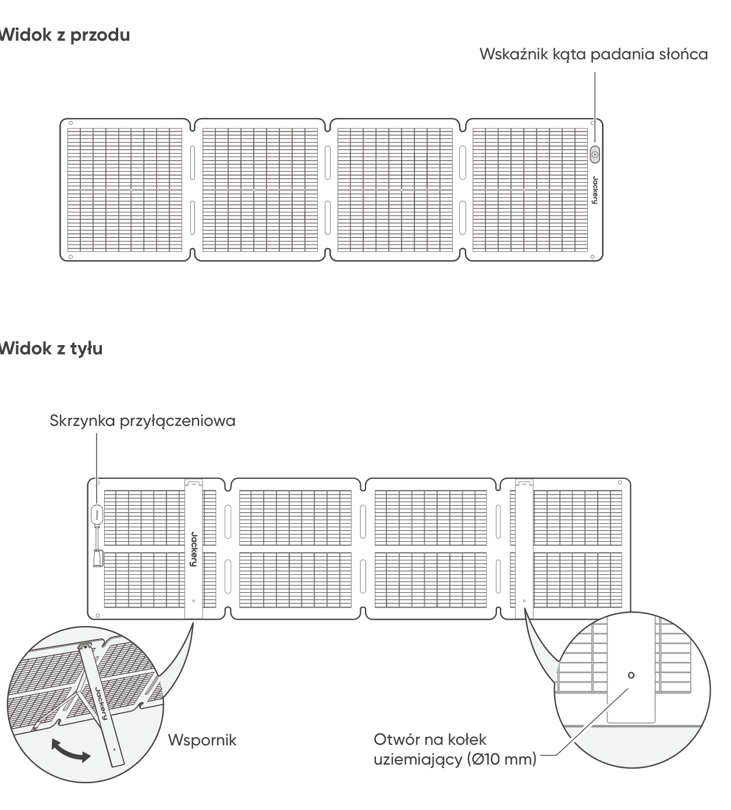
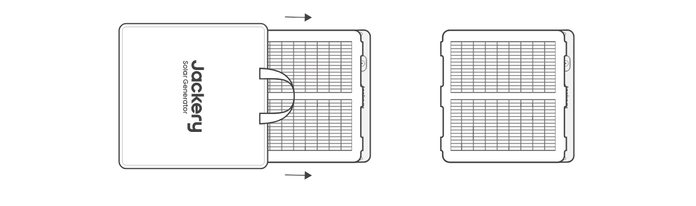
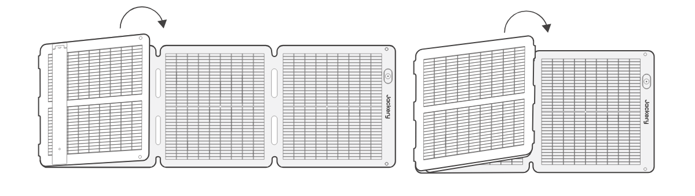
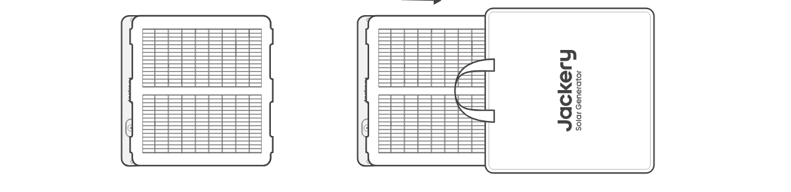
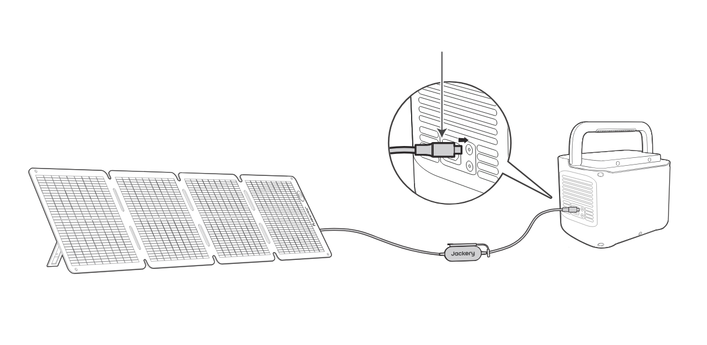
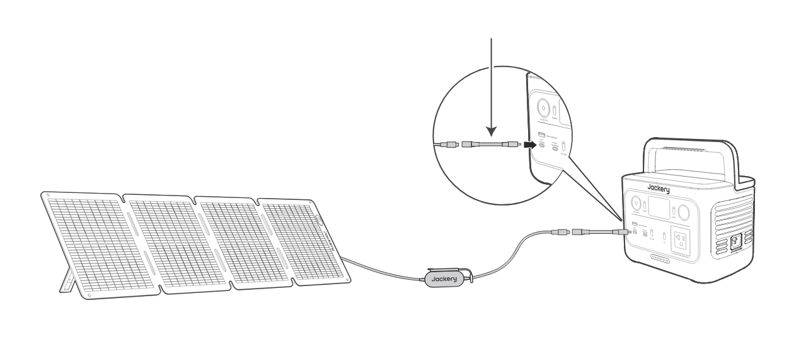
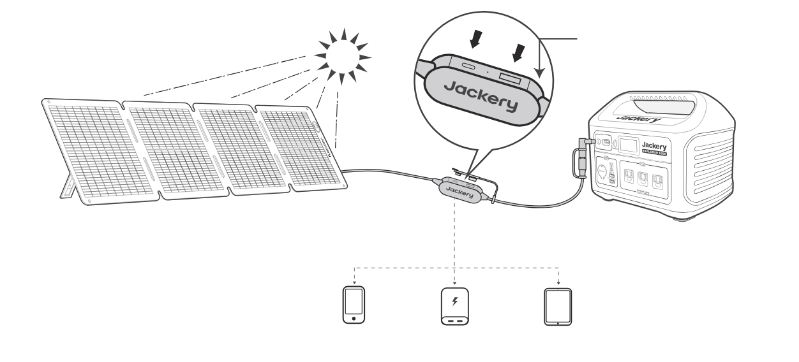
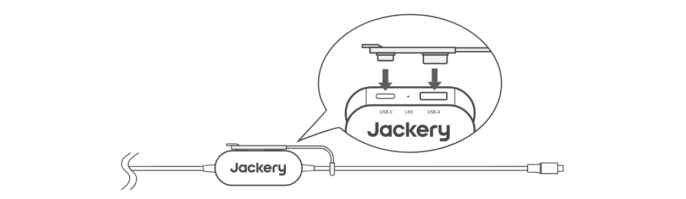

# WSKAZÓWKI DOTYCZĄCE BEZPIECZEŃSTWA

- Przed użyciem produktu należy najpierw przeczytać instrukcję obsługi.

- Nie zginać paneli słonecznych.

- Nie używać paneli słonecznych pod drzewami, w budynkach ani w innych zacienionych miejscach.

- Nie zanurzać paneli słonecznych w wodzie ani w jakichkolwiek innych płynach na dłuższy czas.

- Aby wyczyścić panele, delikatnie przetrzeć je wilgotną ściereczką.

- Nie używać ani nie przechowywać paneli słonecznych w pobliżu otwartego ognia lub materiałów łatwopalnych.

- Nie dopuszczać do zarysowania paneli słonecznych ostrymi przedmiotami.

- Trzymać substancje żrące z dala od paneli słonecznych.

- Nie stawać na panelach słonecznych ani nie kłaść na nich ciężkich przedmiotów.

- Nie demontować paneli słonecznych.

- Obwód wyjściowy panelu słonecznego musi być prawidłowo podłączony do urządzenia, a odwrotne podłączenie biegunów dodatnich i ujemnych jest surowo zabronione.

- Przed użyciem sprawdzić stan połączeń wszystkich elementów, przewodów i wtyczek.

- Nie upuszczać produktu, ponieważ może to spowodować uszkodzenia wewnętrzne i uniemożliwić jego użytkowanie.

- Panel słoneczny nie jest przeznaczony do trwałego montażu. Panele słoneczne należy schować podczas silnego wiatru, gradu lub innych skrajnych warunków pogodowych, aby uniknąć uszkodzeń lub potencjalnych zagrożeń.

- W normalnych warunkach panele słoneczne mogą być narażone na wyższe prądy lub napięcia niż te, które występują w standardowych warunkach testowych. Podczas obliczania napięcia znamionowego podzespołów, prądu znamionowego przewodów oraz rozmiaru urządzenia sterującego podłączonego do wyjścia PV należy pomnożyć wartości prądu zwarciowego (Isc) i napięcia obwodu otwartego (Voc) podane na tabliczce znamionowej panelu przez współczynnik 1,25.

- Każde uszkodzenie produktu może doprowadzić do porażenia prądem lub pożaru.

- Nie wystawiać paneli słonecznych na działanie sztucznego światła punktowego.

- Nie podłączać panelu słonecznego do innych paneli słonecznych ani źródeł zasilania, chyba że zestawienie zawiera zabezpieczenie przed prądem wstecznym i przepięciem.

# ZAWARTOŚĆ OPAKOWANIA

<figure aria-label="ZAWARTOŚĆ OPAKOWANIA" class="hb-inbox-composition" data-card-count="5" data-component-id="HB-SPECIAL-INBOX" data-inbox-variant="responsive-card-grid"><ol class="hb-inbox-grid"><li class="hb-inbox-card" data-item-number="1">

<strong>Jackery SolarSaga 100 Air</strong>

</li><li class="hb-inbox-card" data-item-number="2">

<strong>Torba do przechowywania</strong>

</li><li class="hb-inbox-card" data-item-number="3">

<strong>Wielofunkcyjny przewód do ładowania przy użyciu paneli słonecznych (3 m)</strong>

</li><li class="hb-inbox-card" data-item-number="4">

<strong>Adapter DC8020-DC7909</strong>

</li><li class="hb-inbox-card" data-item-number="5">

<strong>Instrukcja obsługi</strong>

</li></ol>

<strong>UWAGA</strong>

Wielofunkcyjny przewód do ładowania przy użyciu paneli słonecznych jest kompatybilny wyłącznie z panelem słonecznym SolarSaga 100 Air (JS-100I). Nie używaj go z innymi modelami paneli słonecznych.

</figure>

# SPOSÓB UŻYCIA

<figure class="manual-step-figure">

<figcaption>
Widok z przodu · Widok z tyłu · Wskaźnik kąta padania słońca · Skrzynka przyłączeniowa · Wspornik · Otwór na kołek uziemiający (Ø10 mm)
</figcaption>
</figure>

# ROZKŁADANIE PANELU SŁONECZNEGO

<figure class="manual-step-figure">

<figcaption aria-hidden="true">
1. Wyjmij panel słoneczny z torby do przechowywania.
</figcaption>
</figure>

<figure class="manual-step-figure">

<figcaption aria-hidden="true">
2. Rozłóż panel słoneczny krok po kroku, jak pokazano na ilustracji.
</figcaption>
</figure>

<figure class="manual-step-figure">

<figcaption aria-hidden="true">
3. Rozłóż dwa wsporniki z tyłu panelu słonecznego.
</figcaption>
</figure>

<figure class="manual-step-figure">

<figcaption aria-hidden="true">
4. Skieruj panel w stronę słońca, a następnie podłącz go do przenośnej stacji zasilającej.
</figcaption>
</figure>

# SKŁADANIE PANELU SŁONECZNEGO

<figure class="manual-step-figure">

<figcaption aria-hidden="true">
1. Odłącz wielofunkcyjny przewód ładowania i złóż wsporniki.
</figcaption>
</figure>

<figure class="manual-step-figure">

<figcaption aria-hidden="true">
2. Złóż panel słoneczny wzdłuż zagięć po kolei, jak pokazano na ilustracji.
</figcaption>
</figure>

<figure class="manual-step-figure">

<figcaption aria-hidden="true">
3. Umieść panel słoneczny z powrotem w torbie do przechowywania.
</figcaption>
</figure>

# ŁADOWANIE PRZENOŚNEJ STACJI ZASILAJĄCEJ JACKERY

Podłącz przewód ładowania do panelu słonecznego i portu wejściowego DC przenośnej stacji zasilającej.

## ZŁĄCZE DC8020

Kompatybilne z przenośnymi stacjami zasilającymi Jackery z gniazdami wejściowymi DC8020.

<figure class="manual-step-figure">

<figcaption>
Wtyk DC8020
</figcaption>
</figure>

## ADAPTER DC8020-DC7909

Kompatybilne z przenośnymi stacjami zasilającymi Jackery z gniazdami wejściowymi DC7909.

<figure class="manual-step-figure">

<figcaption>
Adapter DC8020-DC7909
</figcaption>
</figure>

## PRZEWÓD PRZEJŚCIOWY DC8020 DO USB-C (SPRZEDAWANY ODDZIELNIE)

Kompatybilny z przenośnymi stacjami zasilającymi Jackery z gniazdami wejściowymi USB-C.

<figure class="manual-step-figure">

<figcaption>
Przewód przejściowy DC8020 do USB-C
</figcaption>
</figure>

<table class="manual-callout-table" style="width:100%; border-collapse:collapse; margin:0 0 16px 0;"><tbody><tr><td class="manual-callout-label" style="width:16%; border:1px solid #000; padding:6px 8px; vertical-align:top;">
<strong>UWAGA</strong>
</td><td class="manual-callout-body" style="border:1px solid #000; padding:6px 8px; vertical-align:top;">
Przewód przejściowy DC8020 do USB-C służy wyłącznie do ładowania przenośnej stacji zasilającej Jackery. Nie używaj go do ładowania innych urządzeń.
</td></tr></tbody></table>

## KORZYSTANIE ZE ZŁĄCZA DO PANELI SŁONECZNYCH (SPRZEDAWANEGO ODDZIELNIE)

Podłącz dwa panele słoneczne odpowiednio do złącza do paneli słonecznych, a następnie podłącz złącze do paneli słonecznych do portu wejściowego DC przenośnej stacji zasilającej.

<figure class="manual-step-figure">

<figcaption>
Wtyk DC8020 · Złącze do paneli słonecznych
</figcaption>
</figure>

※ Upewnij się, że do wejścia złącza podłączone są wyłącznie panele słoneczne tego samego modelu.

# WSKAŹNIK KĄTA PADANIA SŁOŃCA

Produkt posiada wskaźnik kąta padania słońca. Gdy światło słoneczne pada na jego powierzchnię, u dołu pojawia się cień.

<figure class="manual-step-figure">

<figcaption>
Wskaźnik kąta padania słońca · Wskaźnik · Cień
</figcaption>
</figure>

Jeśli cień pada na biały wewnętrzny okrąg u dołu, panel słoneczny jest skierowany bezpośrednio w stronę słońca i można uzyskać optymalny poziom wytwarzania energii. Jeśli tak nie jest, zaleca się dostosowanie kąta w celu uzyskania pożądanego ustawienia.

<figure class="manual-step-figure manual-detail-figure">

<figcaption aria-hidden="true">
Cień pada w obrębie białego okręgu wewnętrznego
</figcaption>
</figure>

<figure class="manual-step-figure manual-detail-figure">

<figcaption aria-hidden="true">
Cień nie pada w obrębie białego okręgu wewnętrznego
</figcaption>
</figure>

<table class="manual-callout-table" style="width:100%; border-collapse:collapse; margin:0 0 16px 0;"><tbody><tr><td class="manual-callout-label" style="width:16%; border:1px solid #000; padding:6px 8px; vertical-align:top;">
<strong>UWAGA</strong>
</td><td class="manual-callout-body" style="border:1px solid #000; padding:6px 8px; vertical-align:top;">
Aby zmaksymalizować wytwarzanie energii, zmieniaj położenie panelu Jackery SolarSaga 100 Air w ciągu dnia, aby zapewnić pełne nasłonecznienie powierzchni panelu bezpośrednim światłem słonecznym.
</td></tr></tbody></table>

## ZASILANIE URZĄDZENIA

<figure class="manual-step-figure">

<figcaption>
Jackery SolarSaga 100 Air · Adapter wielofunkcyjny · USB-C · LED · USB-A · Telefon komórkowy · Power bank · Tablet
</figcaption>
</figure>

<figure class="manual-step-figure">

<figcaption>
* Nieużywane porty USB zabezpiecz gumową zaślepką, aby nie przedostawał się do nich kurz.
</figcaption>
</figure>

# PARAMETRY TECHNICZNE

## INFORMACJE PODSTAWOWE

<figure aria-label="INFORMACJE PODSTAWOWE" class="hb-spec-table-composition"><table class="hb-spec-table manual-table manual-spec-table"><colgroup><col class="hb-spec-col-label"/><col class="hb-spec-col-value"/></colgroup>
<tbody>
<tr>
<th class="hb-spec-label manual-spec-label" scope="row">Nazwa produktu</th>
<td class="hb-spec-value manual-spec-value">Jackery SolarSaga 100 Air</td>
</tr>
<tr>
<th class="hb-spec-label manual-spec-label" scope="row">Model</th>
<td class="hb-spec-value manual-spec-value">JS-100I</td>
</tr>
<tr>
<th class="hb-spec-label manual-spec-label" scope="row">Wymiary (po rozłożeniu)</th>
<td class="hb-spec-value manual-spec-value">1630 × 423 × 17 mm</td>
</tr>
<tr>
<th class="hb-spec-label manual-spec-label" scope="row">Wymiary (po złożeniu)</th>
<td class="hb-spec-value manual-spec-value">423,5 × 423 × 47 mm</td>
</tr>
<tr>
<th class="hb-spec-label manual-spec-label" scope="row">Waga</th>
<td class="hb-spec-value manual-spec-value">3,2 kg ± 0,2 kg</td>
</tr>
<tr>
<th class="hb-spec-label manual-spec-label" scope="row">Stopień ochrony IP</th>
<td class="hb-spec-value manual-spec-value">IP68</td>
</tr>
<tr>
<th class="hb-spec-label manual-spec-label" scope="row">Zakres temperatury pracy</th>
<td class="hb-spec-value manual-spec-value">-20°C do 65°C</td>
</tr>
</tbody>
</table></figure>

## DANE ELEKTRYCZNE

<figure aria-label="DANE ELEKTRYCZNE" class="hb-spec-table-composition"><table class="hb-spec-table manual-table manual-spec-table"><colgroup><col class="hb-spec-col-label"/><col class="hb-spec-col-value"/></colgroup>
<tbody>
<tr>
<th class="hb-spec-label manual-spec-label" scope="row">Maksymalna moc (Pmax)</th>
<td class="hb-spec-value manual-spec-value">STC*: 100 W ±5% / BNPI*: 110 W ±5%</td>
</tr>
<tr>
<th class="hb-spec-label manual-spec-label" scope="row">Napięcie obwodu otwartego (Voc)</th>
<td class="hb-spec-value manual-spec-value">STC*: 26,0 V ±5% / BNPI*: 26,3 V ±5%</td>
</tr>
<tr>
<th class="hb-spec-label manual-spec-label" scope="row">Prąd zwarciowy (Isc)</th>
<td class="hb-spec-value manual-spec-value">STC*: 4,95 A ±5% / BNPI*: 5,38 A ±5%</td>
</tr>
<tr>
<th class="hb-spec-label manual-spec-label" scope="row">Napięcie przy mocy maksymalnej (Vmp)</th>
<td class="hb-spec-value manual-spec-value">STC*: 21,7 V ±5% / BNPI*: 22,0 V ±5%</td>
</tr>
<tr>
<th class="hb-spec-label manual-spec-label" scope="row">Prąd przy mocy maksymalnej (Imp)</th>
<td class="hb-spec-value manual-spec-value">STC*: 4,67 A ±5% / BNPI*: 5,08 A ±5%</td>
</tr>
<tr>
<th class="hb-spec-label manual-spec-label" scope="row">Maksymalne napięcie w układzie</th>
<td class="hb-spec-value manual-spec-value">80 V</td>
</tr>
<tr>
<th class="hb-spec-label manual-spec-label" scope="row">Maksymalny prąd wsteczny</th>
<td class="hb-spec-value manual-spec-value">15 A</td>
</tr>
<tr>
<th class="hb-spec-label manual-spec-label" scope="row">Klasa ochrony przed porażeniem elektrycznym</th>
<td class="hb-spec-value manual-spec-value">Klasa II</td>
</tr>
<tr>
<th class="hb-spec-label manual-spec-label" scope="row">Współczynnik bifacjalności (tył/przód)</th>
<td class="hb-spec-value manual-spec-value">Pmax: &gt;65%, Voc: &gt;97%, Isc: &gt;65%</td>
</tr>
<tr>
<th class="hb-spec-label manual-spec-label" scope="row">Temperaturowy współczynnik napięcia</th>
<td class="hb-spec-value manual-spec-value">-0,27%/°C</td>
</tr>
<tr>
<th class="hb-spec-label manual-spec-label" scope="row">Temperaturowy współczynnik mocy</th>
<td class="hb-spec-value manual-spec-value">-0,33%/°C</td>
</tr>
<tr>
<th class="hb-spec-label manual-spec-label" scope="row">Fotowoltaiczne produkty konsumenckie</th>
<td class="hb-spec-value manual-spec-value">Kategoria 2 produktów konsumenckich wg IEC TS 63163</td>
</tr>
</tbody>
</table></figure>

## ADAPTER WIELOFUNKCYJNY

<figure aria-label="ADAPTER WIELOFUNKCYJNY" class="hb-spec-table-composition"><table class="hb-spec-table manual-table manual-spec-table"><colgroup><col class="hb-spec-col-label"/><col class="hb-spec-col-value"/></colgroup>
<tbody>
<tr>
<th class="hb-spec-label manual-spec-label" scope="row">Wyjście USB-A</th>
<td class="hb-spec-value manual-spec-value">5 V ⎓ 2,4 A</td>
</tr>
<tr>
<th class="hb-spec-label manual-spec-label" scope="row">Wyjście USB-C</th>
<td class="hb-spec-value manual-spec-value">5 V⎓3 A</td>
</tr>
</tbody>
</table></figure>

\* STC (standardowe warunki testowe, 1000 W/m2, 25°C, AM 1,5)

\* BNPI (znamionowe natężenie promieniowania na panele dwustronne, przód 1000W/m2, tył 135 W/m2, 25°C, AM 1,5) Rozłóż wspornik i ustaw go na płaskiej powierzchni. Projektowe obciążenie wynosi 1600 Pa, a współczynnik bezpieczeństwa to 1,5.

# GWARANCJA

## Okres gwarancji

### 1 ROK --- Gwarancja standardowa

Produkt jest objęty ograniczoną gwarancją firmy Jackery dla pierwotnego nabywcy, która obejmuje wady wykonania i materiałowe przez 12 miesięcy od daty zakupu (z wyłączeniem uszkodzeń wynikających z normalnego zużycia, przeróbek, niewłaściwego użytkowania, zaniedbania, wypadku, serwisowania przez nieautoryzowane centrum serwisowe lub działania siły wyższej). W okresie gwarancyjnym, po weryfikacji wad, produkt zostanie wymieniony, jeśli zostanie zwrócony z odpowiednim dowodem zakupu.

### 2 LATA --- Przedłużona gwarancja

Aby aktywować przedłużenie gwarancji, należy zarejestrować produkt online lub skontaktować się z naszym zespołem obsługi klienta pod adresem <a href="mailto:hello.eu@jackery.com" class="reference external">hello.eu@jackery.com</a> w celu przedłużenia standardowego okresu gwarancji.

## Kontakt

W przypadku jakichkolwiek pytań lub uwag dotyczących naszych produktów wyślij wiadomość e-mail na adres <a href="mailto:hello.eu@jackery.com" class="reference external">hello.eu@jackery.com</a>, a my postaramy się jak najszybciej odpowiedzieć. Jeśli produkt wykazuje jakiekolwiek problemy związane z jakością, można poprosić o wymianę lub zwrot pieniędzy, przesyłając formularz na stronie www.jackery.com.

## Obsługa klienta

<a href="mailto:hello.eu@jackery.com" class="reference external">hello.eu@jackery.com</a> Dożywotnie wsparcie techniczne

## EU Regulations

CE Declaration of Conformity Shenzhen Hello Tech Energy Co., Ltd. hereby declares that this: Jackery SolarSaga 100 Air JS-100I is in compliance with the essential requirements and other relevant provisions of the CE Directive 2014/30/EU, 2011/65/EU+2015/863. The full text of the EU declaration of conformity is available at the following internet address: <a href="https://de.jackery.com/pages/user-guides" class="reference external">https://de.jackery.com/pages/user-guides</a> MANUFACTURER: SHENZHEN HELLO TECH ENERGY CO.,LTD. Address: F2-3, Bldg. 7, Jiaanda Science and technology industrial park factory, the east side of Huafan Road, Tongsheng Community, Dalang Street, Longhua District, Shenzhen, Guangdong, China +86 400 668 9293 <a href="mailto:sales@hello-tech.com" class="reference external">sales@hello-tech.com</a> www.hello-tech.com
