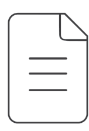
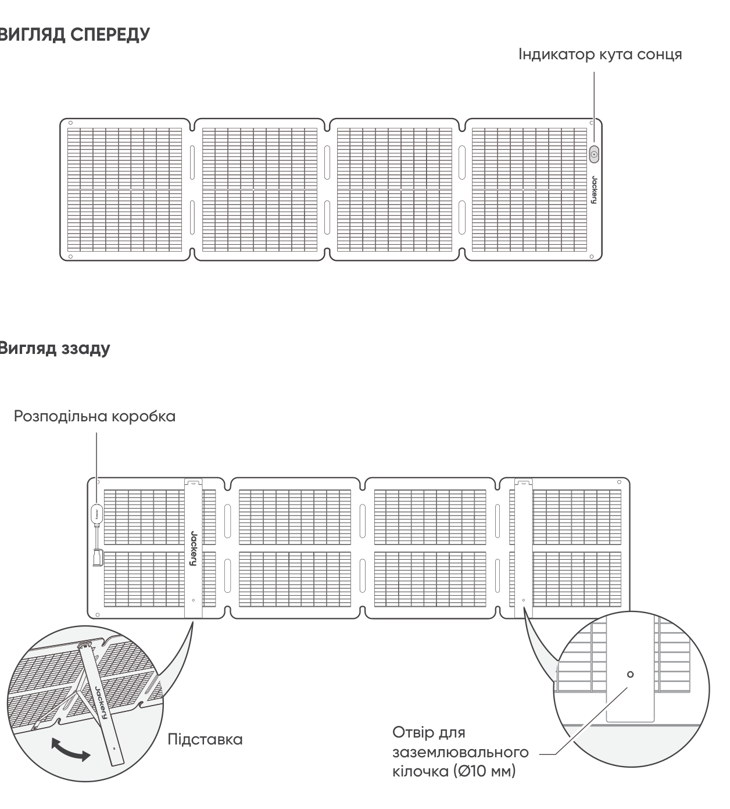
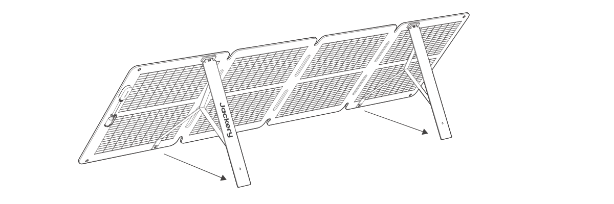
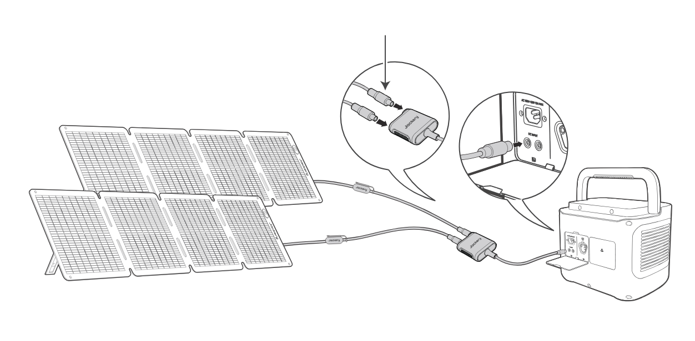

# ПОРАДИ З БЕЗПЕКИ

- Будь ласка, спочатку прочитайте посібник користувача перед використанням цього продукту.

- Не згинайте сонячні панелі.

- Не використовуйте сонячні панелі під деревами, будівлями або в інших затінених місцях.

- Не занурюйте сонячні панелі у воду або будь-яку іншу рідину на тривалий час.

- Обережно протріть їх вологою тканиною.

- Не використовуйте та не зберігайте сонячні панелі поблизу відкритого вогню або легкозаймистих матеріалів.

- Не подряпуйте сонячні панелі гострими предметами.

- Тримайте корозійні речовини подалі від сонячних панелей.

- Не ставайте на сонячні панелі та не кладіть на них важкі предмети.

- Не розбирайте сонячні панелі.

- Вихідне коло сонячної панелі повинно бути правильно підключене до обладнання; суворо забороняється зворотне підключення позитивного та негативного полюсів.

- Перед використанням перевірте стан з\'єднань усіх компонентів, проводів і роз\'ємів.

- Не кидайте продукт, оскільки це може спричинити внутрішнє пошкодження та зробити його непридатним до використання.

- Сонячна панель не призначена для постійного монтажу. Під час сильного вітру, граду або іншої негоди приберіть сонячні панелі, щоб уникнути пошкоджень або потенційних небезпек.

- За нормальних умов сонячні панелі можуть піддаватися впливу вищих струмів або напруг, ніж за стандартних умов випробувань. Під час розрахунку номінальної напруги компонентів, номінального струму провідників і параметрів пристрою керування, підключеного до виходу ФЕ, помножте значення струму короткого замикання (Isc) та напруги розімкнутого кола (Voc), зазначені на табличці панелі, на коефіцієнт 1,25.

- Будь-яке пошкодження виробу може призвести до ураження електричним струмом або пожежі.

- Не піддавайте сонячні панелі дії штучних прожекторів.

- Не підключайте сонячну панель до інших сонячних панелей або джерел живлення без захисту від зворотного струму та перенапруги.

# КОМПЛЕКТАЦІЯ

<figure aria-label="КОМПЛЕКТАЦІЯ" class="hb-inbox-composition" data-card-count="5" data-component-id="HB-SPECIAL-INBOX" data-inbox-variant="responsive-card-grid"><ol class="hb-inbox-grid"><li class="hb-inbox-card" data-item-number="1">

<strong>Jackery SolarSaga 100 Air</strong>

</li><li class="hb-inbox-card" data-item-number="2">

<strong>Сумка для зберігання</strong>

</li><li class="hb-inbox-card" data-item-number="3">

<strong>* Багатофункціональний кабель для сонячного заряджання (3 м)</strong>

</li><li class="hb-inbox-card" data-item-number="4">

<strong>Перехідник DC8020 на DC7909</strong>

</li><li class="hb-inbox-card" data-item-number="5">

<strong>Керівництво користувача</strong>

</li></ol>

<strong>ПРИМІТКА</strong>

Багатофункціональний кабель для заряджання від сонця сумісний лише з сонячною панеллю SolarSaga 100 Air (JS-100I). Не використовуйте його з іншими моделями сонячних панелей.

</figure>

# ЯК КОРИСТУВАТИСЯ

<figure class="manual-step-figure">

<figcaption>
ВИГЛЯД СПЕРЕДУ · Вигляд ззаду · Індикатор кута сонця · Розподільна коробка · Підставка · Отвір для заземлювального кілочка (Ø10 мм)
</figcaption>
</figure>

# РОЗКЛАДАННЯ СОНЯЧНОЇ ПАНЕЛІ

<figure class="manual-step-figure">

<figcaption aria-hidden="true">
1. Дістаньте сонячну панель із сумки для зберігання.
</figcaption>
</figure>

<figure class="manual-step-figure">

<figcaption aria-hidden="true">
2. Розкладіть сонячну панель поетапно, як показано на ілюстрації.
</figcaption>
</figure>

<figure class="manual-step-figure">

<figcaption aria-hidden="true">
3. Розкладіть дві опорні ніжки на задній стороні сонячної панелі.
</figcaption>
</figure>

<figure class="manual-step-figure">

<figcaption aria-hidden="true">
4. Спрямуйте панель на сонце, а потім підключіть її до вашої портативної зарядної станції.
</figcaption>
</figure>

# СКЛАДАННЯ СОНЯЧНОЇ ПАНЕЛІ

<figure class="manual-step-figure">

<figcaption aria-hidden="true">
1. Від'єднайте багатофункціональний зарядний кабель і складіть опорні ніжки.
</figcaption>
</figure>

<figure class="manual-step-figure">

<figcaption aria-hidden="true">
2. Складіть сонячну панель по згинах у зазначеному порядку, як показано на ілюстрації.
</figcaption>
</figure>

<figure class="manual-step-figure">

<figcaption aria-hidden="true">
3. Покладіть сонячну панель назад у сумку для зберігання.
</figcaption>
</figure>

# ЗАРЯДЖАННЯ ПОРТАТИВНОЇ ЗАРЯДНОЇ СТАНЦІЇ JACKERY

Підключіть зарядний кабель до сонячної панелі та DC-входу портативної зарядної станції.

## РОЗ\'ЄМ DC8020

Сумісний з портативними зарядними станціями Jackery з вхідним портом (портами) DC8020.

<figure class="manual-step-figure">

<figcaption>
Роз'єм DC8020 (тато)
</figcaption>
</figure>

## ПЕРЕХІДНИК DC8020-DC7909

Сумісний з портативними зарядними станціями Jackery з вхідним портом (портами) DC7909.

<figure class="manual-step-figure">

<figcaption>
Перехідник DC8020-DC7909
</figcaption>
</figure>

## ПЕРЕХІДНИЙ КАБЕЛЬ DC8020 НА USB-C (ПРОДАЄТЬСЯ ОКРЕМО)

Сумісний з портативними зарядними станціями Jackery з вхідним портом (портами) USB-C.

<figure class="manual-step-figure">

<figcaption>
Кабель-перехідник з DC8020 на USB-C
</figcaption>
</figure>

<table class="manual-callout-table" style="width:100%; border-collapse:collapse; margin:0 0 16px 0;"><tbody><tr><td class="manual-callout-label" style="width:16%; border:1px solid #000; padding:6px 8px; vertical-align:top;">
<strong>ПРИМІТКА</strong>
</td><td class="manual-callout-body" style="border:1px solid #000; padding:6px 8px; vertical-align:top;">
Кабель-перехідник з DC8020 на USB-C використовується лише для заряджання портативної станції живлення Jackery. Не використовуйте його для заряджання інших пристроїв.
</td></tr></tbody></table>

## ПРИ ВИКОРИСТАННІ З\'ЄДНУВАЧА СОНЯЧНИХ ПАНЕЛЕЙ (ПРОДАЄТЬСЯ ОКРЕМО)

Підключіть дві сонячні панелі до з\'єднувача сонячних панелей, а потім підключіть з\'єднувач до DC-входу портативної зарядної станції.

<figure class="manual-step-figure">

<figcaption>
Роз'єм DC8020 (тато) · З'єднувач сонячної панелі
</figcaption>
</figure>

※ Переконайтеся, що до входу з\'єднувача підключені лише сонячні панелі тієї самої моделі.

# ІНДИКАТОР КУТА СОНЦЯ

Виріб має індикатор кута сонця. Коли сонячне світло потрапляє на його поверхню, у нижній частині з\'явиться тінь.

<figure class="manual-step-figure">

<figcaption>
Індикатор кута сонця · Індикаторна точка · Тінь
</figcaption>
</figure>

Якщо тінь падає на біле внутрішнє коло в його нижній частині, це означає, що сонячна панель спрямована безпосередньо на сонце, і ви можете отримати оптимальне вироблення енергії; якщо ні, рекомендується регулювати її кут, доки тінь не опиниться в колі.

<figure class="manual-step-figure manual-detail-figure">

<figcaption aria-hidden="true">
Тінь падає в біле внутрішнє коло
</figcaption>
</figure>

<figure class="manual-step-figure manual-detail-figure">

<figcaption aria-hidden="true">
Тінь не падає в біле внутрішнє коло
</figcaption>
</figure>

<table class="manual-callout-table" style="width:100%; border-collapse:collapse; margin:0 0 16px 0;"><tbody><tr><td class="manual-callout-label" style="width:16%; border:1px solid #000; padding:6px 8px; vertical-align:top;">
<strong>ПРИМІТКА</strong>
</td><td class="manual-callout-body" style="border:1px solid #000; padding:6px 8px; vertical-align:top;">
Щоб максимізувати вироблення електроенергії, протягом дня регулюйте орієнтацію Jackery SolarSaga 100 Air, щоб забезпечити повне потрапляння прямих сонячних променів на поверхню панелі.
</td></tr></tbody></table>

## ЖИВІТЬ СВІЙ ПРИСТРІЙ

<figure class="manual-step-figure">

<figcaption>
Jackery SolarSaga 100 Air · Багатофункціональний адаптер · USB-C · Світлодіод · USB-A · Мобільний телефон · Повербанк · Планшет
</figcaption>
</figure>

<figure class="manual-step-figure">

<figcaption>
* Вставляйте гумову заглушку, коли порти USB не використовуються, щоб запобігти потраплянню пилу.
</figcaption>
</figure>

# ТЕХНІЧНІ ПАРАМЕТРИ

## ОСНОВНА ІНФОРМАЦІЯ

<figure aria-label="ОСНОВНА ІНФОРМАЦІЯ" class="hb-spec-table-composition"><table class="hb-spec-table manual-table manual-spec-table"><colgroup><col class="hb-spec-col-label"/><col class="hb-spec-col-value"/></colgroup>
<tbody>
<tr>
<th class="hb-spec-label manual-spec-label" scope="row">Назва продукту</th>
<td class="hb-spec-value manual-spec-value">Jackery SolarSaga 100 Air</td>
</tr>
<tr>
<th class="hb-spec-label manual-spec-label" scope="row">Модель</th>
<td class="hb-spec-value manual-spec-value">JS-100I</td>
</tr>
<tr>
<th class="hb-spec-label manual-spec-label" scope="row">Розміри (у розкладеному стані)</th>
<td class="hb-spec-value manual-spec-value">1630 × 423 × 17 мм</td>
</tr>
<tr>
<th class="hb-spec-label manual-spec-label" scope="row">Розміри (у складеному стані)</th>
<td class="hb-spec-value manual-spec-value">423,5 × 423 × 47 мм</td>
</tr>
<tr>
<th class="hb-spec-label manual-spec-label" scope="row">Вага</th>
<td class="hb-spec-value manual-spec-value">3,2 кг ± 0,2 кг</td>
</tr>
<tr>
<th class="hb-spec-label manual-spec-label" scope="row">Ступінь захисту IP</th>
<td class="hb-spec-value manual-spec-value">IP68</td>
</tr>
<tr>
<th class="hb-spec-label manual-spec-label" scope="row">Діапазон робочих температур</th>
<td class="hb-spec-value manual-spec-value">від -20°C до 65°C</td>
</tr>
</tbody>
</table></figure>

## ЕЛЕКТРИЧНІ ДАНІ

<figure aria-label="ЕЛЕКТРИЧНІ ДАНІ" class="hb-spec-table-composition"><table class="hb-spec-table manual-table manual-spec-table"><colgroup><col class="hb-spec-col-label"/><col class="hb-spec-col-value"/></colgroup>
<tbody>
<tr>
<th class="hb-spec-label manual-spec-label" scope="row">Максимальна потужність (Pmax)</th>
<td class="hb-spec-value manual-spec-value">STC*: 100 Вт ±5% / BNPI*: 110 Вт±5%</td>
</tr>
<tr>
<th class="hb-spec-label manual-spec-label" scope="row">Напруга розімкнутого кола (Voc)</th>
<td class="hb-spec-value manual-spec-value">STC*: 26,0 В±5% / BNPI*: 26,3 В±5%</td>
</tr>
<tr>
<th class="hb-spec-label manual-spec-label" scope="row">Струм короткого замикання (Isc)</th>
<td class="hb-spec-value manual-spec-value">STC*: 4,95 A±5% / BNPI*: 5,38 A±5%</td>
</tr>
<tr>
<th class="hb-spec-label manual-spec-label" scope="row">Напруга при максимальній потужності (Vmp)</th>
<td class="hb-spec-value manual-spec-value">STC*: 21,7 В±5% / BNPI*: 22,0 В±5%</td>
</tr>
<tr>
<th class="hb-spec-label manual-spec-label" scope="row">Струм при максимальній потужності (Imp)</th>
<td class="hb-spec-value manual-spec-value">STC*: 4,67 A±5% / BNPI*: 5,08 A±5%</td>
</tr>
<tr>
<th class="hb-spec-label manual-spec-label" scope="row">Максимальна напруга системи</th>
<td class="hb-spec-value manual-spec-value">80 В</td>
</tr>
<tr>
<th class="hb-spec-label manual-spec-label" scope="row">Максимальний зворотний струм</th>
<td class="hb-spec-value manual-spec-value">15 A</td>
</tr>
<tr>
<th class="hb-spec-label manual-spec-label" scope="row">Клас захисту від ураження електричним струмом</th>
<td class="hb-spec-value manual-spec-value">Клас II</td>
</tr>
<tr>
<th class="hb-spec-label manual-spec-label" scope="row">Коефіцієнт біфаціальності (тильна/лицьова)</th>
<td class="hb-spec-value manual-spec-value">Pmax: &gt;65%, Voc: &gt;97%, Isc: &gt;65%</td>
</tr>
<tr>
<th class="hb-spec-label manual-spec-label" scope="row">Температурний коефіцієнт напруги</th>
<td class="hb-spec-value manual-spec-value">-0,27%/°C</td>
</tr>
<tr>
<th class="hb-spec-label manual-spec-label" scope="row">Температурний коефіцієнт потужності</th>
<td class="hb-spec-value manual-spec-value">-0,33%/°C</td>
</tr>
<tr>
<th class="hb-spec-label manual-spec-label" scope="row">Фотоелектричні споживчі продукти</th>
<td class="hb-spec-value manual-spec-value">IEC TS 63163, категорія 2 споживчих продуктів</td>
</tr>
</tbody>
</table></figure>

## БАГАТОФУНКЦІОНАЛЬНИЙ АДАПТЕР

<figure aria-label="БАГАТОФУНКЦІОНАЛЬНИЙ АДАПТЕР" class="hb-spec-table-composition"><table class="hb-spec-table manual-table manual-spec-table"><colgroup><col class="hb-spec-col-label"/><col class="hb-spec-col-value"/></colgroup>
<tbody>
<tr>
<th class="hb-spec-label manual-spec-label" scope="row">Вихід USB-A</th>
<td class="hb-spec-value manual-spec-value">5 В⎓2,4 А</td>
</tr>
<tr>
<th class="hb-spec-label manual-spec-label" scope="row">Вихід USB-C</th>
<td class="hb-spec-value manual-spec-value">5 В⎓3 А</td>
</tr>
</tbody>
</table></figure>

\* STC (Стандартні умови випробувань, 1000 Вт/м2, 25 °C, AM 1.5)

\* BNPI (Двостороння номінальна опроміненість, передня 1000 Вт/м2, задня 135 Вт/м2, 25 °C, AM 1.5) Розгорніть кронштейн і розмістіть його на рівній поверхні. Розрахункове навантаження становить 1600 Па, а коефіцієнт запасу міцності --- 1,5.

# ГАРАНТІЯ

## Гарантійний період

### 1 РІК --- Стандартна гарантія

На виріб поширюється обмежена гарантія Jackery для першого покупця, що покриває дефекти виготовлення та матеріалів протягом 12 місяців з дати покупки (не покриваються пошкодження внаслідок нормального зносу, модифікацій, неправильного використання, недбалості, нещасного випадку, обслуговування будь-ким, крім авторизованого сервісного центру, або форс-мажору). Протягом гарантійного терміну та після підтвердження дефектів цей виріб буде замінено при поверненні виробу та наданні належного підтвердження покупки.

### 2 РОКИ --- Розширена гарантія

Щоб активувати розширення гарантії, необхідно зареєструвати продукт онлайн або звернутися до нашої служби підтримки за адресою <a href="mailto:hello.eu@jackery.com" class="reference external">hello.eu@jackery.com</a> для продовження стандартного гарантійного терміну.

## КОНТАКТИ

Якщо у вас виникли запитання чи зауваження щодо нашої продукції, надішліть електронного листа на <a href="mailto:hello.eu@jackery.com" class="reference external">hello.eu@jackery.com</a>, і ми відповімо вам якомога швидше. Якщо виникне будь-яка проблема з якістю виробу, ви можете подати заявку на заміну або повернення коштів, надіславши відповідну форму на сайті www.jackery.com.

## СЛУЖБА ПІДТРИМКИ

<a href="mailto:hello.eu@jackery.com" class="reference external">hello.eu@jackery.com</a> Довічна технічна підтримка

## EU Regulations

CE Declaration of Conformity Shenzhen Hello Tech Energy Co., Ltd. hereby declares that this: Jackery SolarSaga 100 Air JS-100I is in compliance with the essential requirements and other relevant provisions of the CE Directive 2014/30/EU, 2011/65/EU+2015/863. The full text of the EU declaration of conformity is available at the following internet address: <a href="https://de.jackery.com/pages/user-guides" class="reference external">https://de.jackery.com/pages/user-guides</a> MANUFACTURER: SHENZHEN HELLO TECH ENERGY CO.,LTD. Address: F2-3, Bldg. 7, Jiaanda Science and technology industrial park factory, the east side of Huafan Road, Tongsheng Community, Dalang Street, Longhua District, Shenzhen, Guangdong, China +86 400 668 9293 <a href="mailto:sales@hello-tech.com" class="reference external">sales@hello-tech.com</a> www.hello-tech.com
