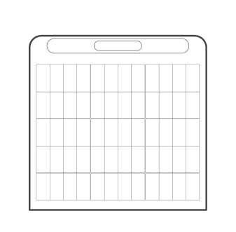
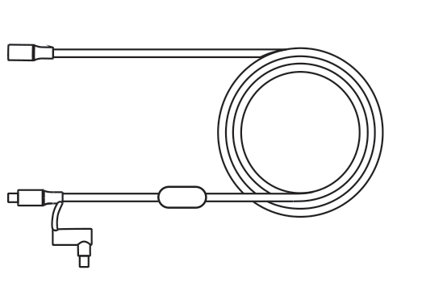
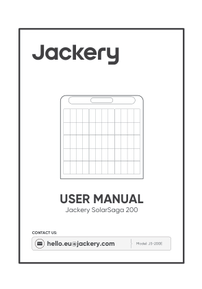
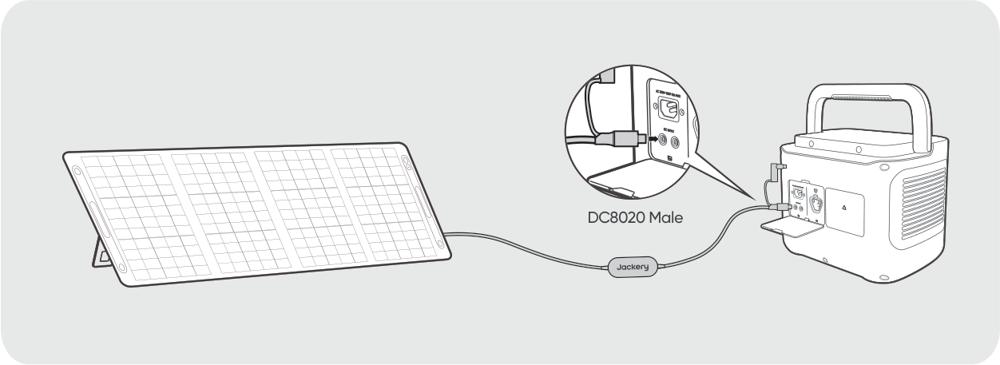
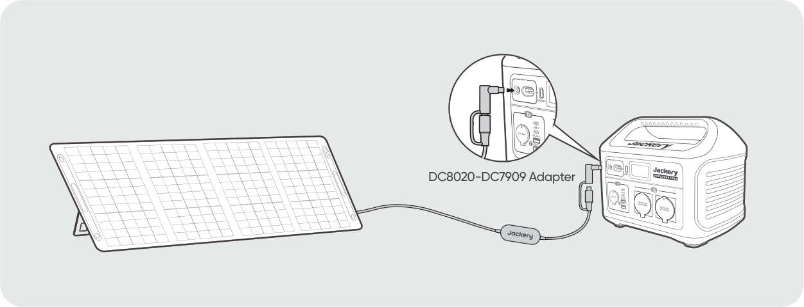
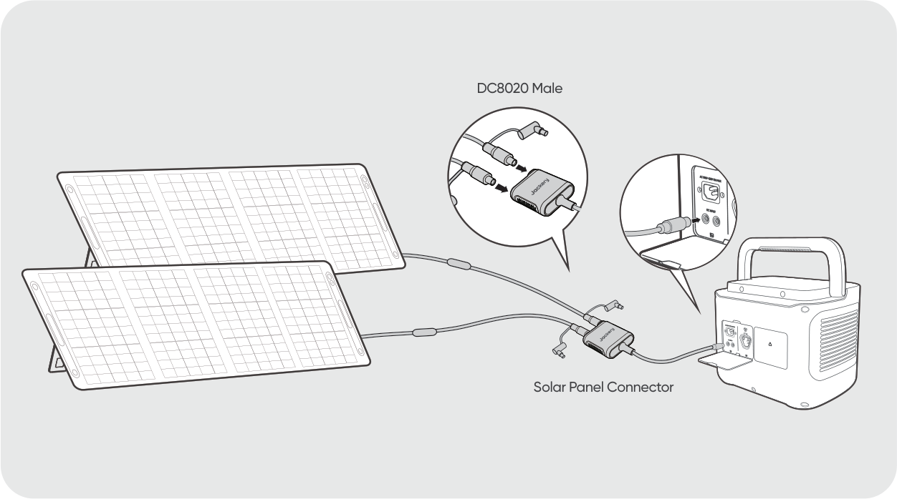
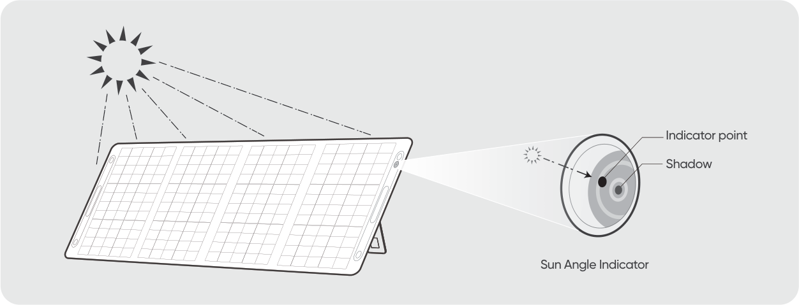
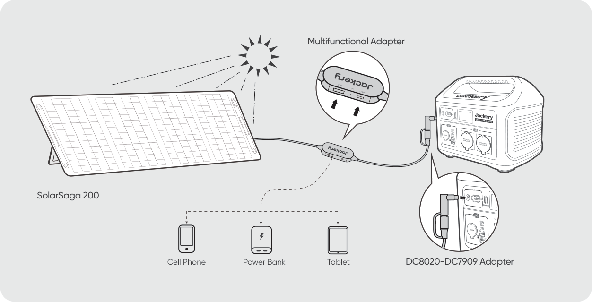
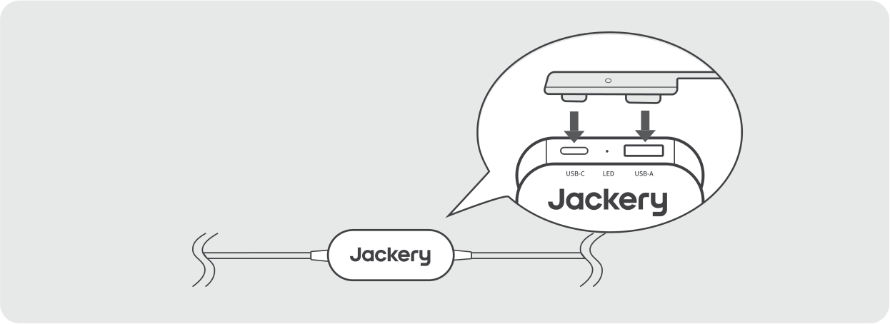

# SAFETY TIPS

- Please read the user guide first before using this product.

- Do not bend the folding solar panels.

- Do not place the folding solar panels in trees, buildings or other shaded areas for use.

- Do not immerse the folding solar panels in water or any other liquid.

- Do not put solar panels in water directly, and use a damp cloth to gently wipe them when cleaning.

- Do not use or store the folding solar panels near open flames or flammable materials.

- Do not scratch the folding solar panels with sharp objects.

- Do not put corrosive substances on the folding solar panels.

- Do not step on or place heavy objects on the folding solar panels.

- Do not disassemble the folding solar panels.

- The output circuit of folding solar panel package must be connected to the equipment properly, and reverse connection of positive and negative poles is strictly prohibited.

- Check the connection status of various components, wires, and plugs before use.

- It is strictly prohibited to drop the products due to the nature of the material. Otherwise, it may cause internal damage to the solar panel, rendering the product unusable.

- This product cannot be fixed for installation. Please put away the portable folding solar panels in case of strong winds, hail and other severe weather to avoid product damage or other hazards.

- Under normal circumstances, PV modules may be exposed to higher currents or voltages than under standard test conditions. Therefore, when calculating the rated voltage of component, the rated current of conductor, and the size of the control device connected to the PV output, it is required to multiply the short-circuit current (Isc) and open circuit voltage (Voc) values marked on the component by a factor of 1.25.

- Any damage to the product may lead to electric shock or fire.

- Do not let artificial spotlight shine directly on the solar modules or panels.

# WHAT\'S IN THE BOX

<figure aria-label="WHAT'S IN THE BOX" class="hb-inbox-composition" data-card-count="3" data-component-id="HB-SPECIAL-INBOX" data-inbox-variant="three-card-responsive"><ol class="hb-inbox-grid"><li class="hb-inbox-card" data-item-number="1">

<strong>Jackery SolarSaga 200</strong>

</li><li class="hb-inbox-card" data-item-number="2">

<strong>Multifunctional Solar Charging Cable</strong>

</li><li class="hb-inbox-card" data-item-number="3">

<strong>User Manual</strong>

</li></ol></figure>

# HOW TO USE

Connect the cable to the solar panel and the DC input port of the portable power station.

<table class="manual-callout-table" style="width:100%; border-collapse:collapse; margin:0 0 16px 0;"><tbody><tr><td class="manual-callout-label" style="width:16%; border:1px solid #000; padding:6px 8px; vertical-align:top;">
<strong>TIP</strong>
</td><td class="manual-callout-body" style="border:1px solid #000; padding:6px 8px; vertical-align:top;">
The cable comes with an adapter that allows it to connect to Jackery portable power station.
</td></tr></tbody></table>

## DC8020 CONNECTOR

Suitable for the DC input port of Jackery portable power station (diameter: 8.1 mm).

# DC8020--DC7909 ADAPTER

Suitable for the DC input port of Jackery portable power station (diameter: 8.0 mm).

## WHEN USING THE SOLAR PANEL CONNECTOR

Connect the two solar panels to the solar panel connector respectively and then connect the solar panel connector to the DC input port of the portable power station.

- Ensure that only solar panels of the same model are connected to the input of the connector.

Note

To maximize the power generation, adjust the orientation of SolarSaga 200 throughout the day to ensure full exposure of the panel surface to direct sunlight.

# SUN ANGLE INDICATOR

The carry handle has a sun angle indicator. When sunlight hits its surface, a shadow will appear at its bottom.

If the shadow falls on the white inner circle at its bottom, it means that the solar panel is facing directly towards sun and you can get optimal power generation; if not, it is suggested to adjust its angle until it does.

## POWER YOUR DEVICE

Note

This multifunctional solar charging cable is only suitable for charging the Jackery SolarSaga 200 (JS-200E) and should not be used with other solar panels.

Note

Insert the rubber plug when USB ports are not in use to prevent dust.

# SPECIFICATIONS

## BASIC INFORMATION

<figure aria-label="BASIC INFORMATION" class="hb-spec-table-composition"><table class="hb-spec-table manual-table manual-spec-table"><colgroup><col class="hb-spec-col-label"/><col class="hb-spec-col-value"/></colgroup>
<tbody>
<tr>
<th class="hb-spec-label manual-spec-label" scope="row">Product Name</th>
<td class="hb-spec-value manual-spec-value">Jackery SolarSaga 200</td>
</tr>
<tr>
<th class="hb-spec-label manual-spec-label" scope="row">Model</th>
<td class="hb-spec-value manual-spec-value">JS-200E</td>
</tr>
</tbody>
</table></figure>

## ELECTRICAL DATA

<figure aria-label="ELECTRICAL DATA" class="hb-spec-table-composition"><table class="hb-spec-table manual-table manual-spec-table"><colgroup><col class="hb-spec-col-label"/><col class="hb-spec-col-value"/></colgroup>
<tbody>
<tr>
<th class="hb-spec-label manual-spec-label" scope="row">Maximum Power (Pₘₐₓ)</th>
<td class="hb-spec-value manual-spec-value">STC*: 200 W ± 5% / BNPI*: 225 W ± 5%</td>
</tr>
<tr>
<th class="hb-spec-label manual-spec-label" scope="row">Open-Circuit Voltage (Vₒ꜀)</th>
<td class="hb-spec-value manual-spec-value">STC*: 22 V ± 5% / BNPI*: 22 V ± 5%</td>
</tr>
<tr>
<th class="hb-spec-label manual-spec-label" scope="row">Short-Circuit Current (Iₛ꜀)</th>
<td class="hb-spec-value manual-spec-value">STC*: 12.5 A ± 5% / BNPI*: 13.5 A ± 5%</td>
</tr>
<tr>
<th class="hb-spec-label manual-spec-label" scope="row">Maximum Power Voltage (Vₘₚ)</th>
<td class="hb-spec-value manual-spec-value">STC*: 18 V ± 5% / BNPI*: 18 V ± 5%</td>
</tr>
<tr>
<th class="hb-spec-label manual-spec-label" scope="row">Maximum Power Current (Iₘₚ)</th>
<td class="hb-spec-value manual-spec-value">STC*: 11.5 A ± 5% / BNPI*: 12.6 A ± 5%</td>
</tr>
<tr>
<th class="hb-spec-label manual-spec-label" scope="row">Maximum System Voltage</th>
<td class="hb-spec-value manual-spec-value">60 V</td>
</tr>
<tr>
<th class="hb-spec-label manual-spec-label" scope="row">Maximum Reverse Current</th>
<td class="hb-spec-value manual-spec-value">15 A</td>
</tr>
<tr>
<th class="hb-spec-label manual-spec-label" scope="row">Protection Class Against Electric Shock</th>
<td class="hb-spec-value manual-spec-value">Class II</td>
</tr>
<tr>
<th class="hb-spec-label manual-spec-label" scope="row">IP Rating</th>
<td class="hb-spec-value manual-spec-value">IP68</td>
</tr>
</tbody>
</table></figure>

## PHYSICAL AND COMPLIANCE

<figure aria-label="PHYSICAL AND COMPLIANCE" class="hb-spec-table-composition"><table class="hb-spec-table manual-table manual-spec-table"><colgroup><col class="hb-spec-col-label"/><col class="hb-spec-col-value"/></colgroup>
<tbody>
<tr>
<th class="hb-spec-label manual-spec-label" scope="row">Operating Temperature Range</th>
<td class="hb-spec-value manual-spec-value">-20°C to 65°C (-4°F to 149°F)</td>
</tr>
<tr>
<th class="hb-spec-label manual-spec-label" scope="row">Dimensions (unfolded)</th>
<td class="hb-spec-value manual-spec-value">2279 × 597 × 25 mm</td>
</tr>
<tr>
<th class="hb-spec-label manual-spec-label" scope="row">Dimensions (folded)</th>
<td class="hb-spec-value manual-spec-value">600 × 597 × 40 mm</td>
</tr>
<tr>
<th class="hb-spec-label manual-spec-label" scope="row">Weight</th>
<td class="hb-spec-value manual-spec-value">6.5 kg ± 0.3 kg</td>
</tr>
<tr>
<th class="hb-spec-label manual-spec-label" scope="row">Bifaciality Coefficient (back/front)</th>
<td class="hb-spec-value manual-spec-value">Pₘₐₓ &gt; 70%, Vₒ꜀ &gt; 95%, Iₛ꜀ &gt; 65%</td>
</tr>
<tr>
<th class="hb-spec-label manual-spec-label" scope="row">Voltage Temperature Coefficient</th>
<td class="hb-spec-value manual-spec-value">-(0.27 ± 0.03)%/°C</td>
</tr>
<tr>
<th class="hb-spec-label manual-spec-label" scope="row">Power Temperature Coefficient</th>
<td class="hb-spec-value manual-spec-value">-(0.33 ± 0.02)%/°C</td>
</tr>
<tr>
<th class="hb-spec-label manual-spec-label" scope="row">Photovoltaic Consumer Products</th>
<td class="hb-spec-value manual-spec-value">IEC TS 63163 Consumer Product Category 2</td>
</tr>
</tbody>
</table></figure>

## MULTIFUNCTIONAL ADAPTER

<figure aria-label="MULTIFUNCTIONAL ADAPTER" class="hb-spec-table-composition"><table class="hb-spec-table manual-table manual-spec-table"><colgroup><col class="hb-spec-col-label"/><col class="hb-spec-col-value"/></colgroup>
<tbody>
<tr>
<th class="hb-spec-label manual-spec-label" scope="row">USB-A Output</th>
<td class="hb-spec-value manual-spec-value">5 V⎓2.4 A</td>
</tr>
<tr>
<th class="hb-spec-label manual-spec-label" scope="row">USB-C Output</th>
<td class="hb-spec-value manual-spec-value">5 V⎓3 A</td>
</tr>
</tbody>
</table></figure>

\* STC (Standard Test Conditions, 1000 W/m², 25°C, AM1.5).

\* BNPI (Bifacial Nameplate Irradiance, Front 1000 W/m², Rear 135 W/m², 25°C, AM1.5).

Unfold the bracket and place it on a flat surface. The design load is 1600 Pa, and the safety factor is 1.5 times.

# WARRANTY

<figure aria-label="WARRANTY" class="hb-warranty-intro-composition" data-component-id="HB-WARRANTY-LEAD">

<strong>Jackery provides a limited warranty to the original purchaser for defects in workmanship and materials.</strong>

The coverage, exclusions, verification and replacement conditions are stated below.

</figure>

## Warranty Period

<figure aria-label="Warranty Period" class="hb-warranty-period-card" data-component-id="HB-WARRANTY-YEARS">

3
<strong class="hb-warranty-years-unit">YEARS</strong><strong class="hb-warranty-period-label">— Standard Warranty</strong>

The product is covered by a limited warranty from Jackery for the original purchaser that covers the product from defects in workmanship and materials for 36 months from the date of purchase (damages from normal wear and tear, alteration, misuse, neglect, accident, service by anyone other than authorized service center, or act of God are not included). During the warranty period and upon verification of defects, this product will be replaced when returned with proper proof of purchase.

2
<strong class="hb-warranty-years-unit">YEARS</strong><strong class="hb-warranty-period-label">— Extended Warranty</strong>

To activate the Warranty Extension, you must register your product online or contact our customer service team at <a class="reference external" href="mailto:hello.eu@jackery.com">hello.eu@jackery.com</a> to extend the standard warranty runtime.

</figure>

## Contact Us

<figure aria-label="Contact Us" class="hb-warranty-card" data-component-id="HB-WARRANTY-SECTION" data-warranty-card-index="2">
For any inquiries or comments concerning our products, please send an email to <a class="reference external" href="mailto:hello.eu@jackery.com">hello.eu@jackery.com</a>, and we will respond to you as soon as possible. If there is any quality-related issue with the product, you may request a replacement or refund by submitting a request form at uk.jackery.com.
</figure>

## Customer Service

<figure aria-label="Customer Service" class="hb-warranty-card" data-component-id="HB-WARRANTY-SECTION" data-warranty-card-index="3">
<strong>3-year limited warranty</strong>

<strong>hello.eu@jackery.com</strong>

Lifetime technical support
</figure>
