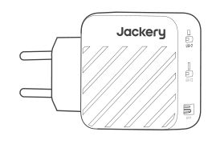
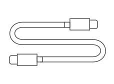
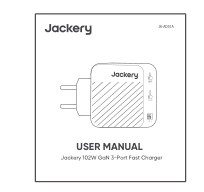
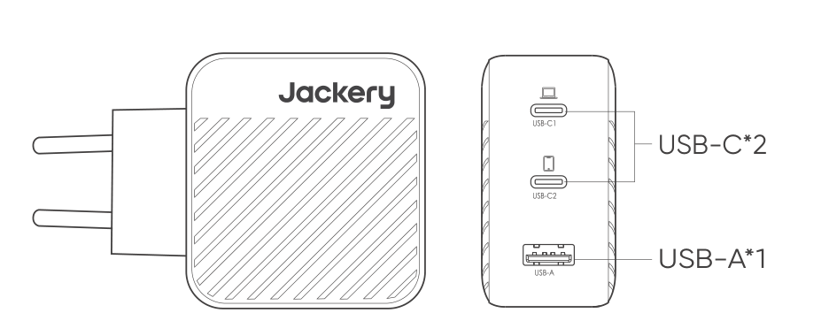
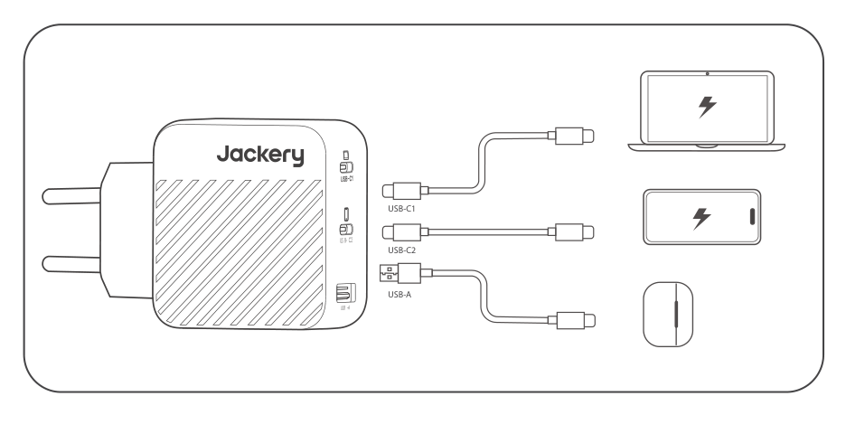

# WHAT\'S IN THE BOX

<figure aria-label="WHAT'S IN THE BOX" class="hb-inbox-composition" data-card-count="3" data-component-id="HB-SPECIAL-INBOX" data-inbox-variant="three-card-responsive"><ol class="hb-inbox-grid"><li class="hb-inbox-card" data-item-number="1">

<strong>Jackery 102W GaN 3-Port Fast Charger</strong>

</li><li class="hb-inbox-card" data-item-number="2">

<strong>100W Charging Cable</strong>

</li><li class="hb-inbox-card" data-item-number="3">

<strong>User Manual</strong>

</li></ol>

<strong>TIP</strong>

To achieve 100W output, the fast charger must be paired with a 100W charging cable.
For safe and fast charging, please use the charging cable included with the product.

</figure>

# PRODUCT OVERVIEW

# SPECIFICATIONS

## GENERAL

<figure aria-label="GENERAL" class="hb-spec-table-composition"><table class="hb-spec-table manual-table manual-spec-table"><colgroup><col class="hb-spec-col-label"/><col class="hb-spec-col-value"/></colgroup>
<tbody>
<tr>
<th class="hb-spec-label manual-spec-label" scope="row">Product Name</th>
<td class="hb-spec-value manual-spec-value">Jackery 102W GaN 3-Port Fast Charger</td>
</tr>
<tr>
<th class="hb-spec-label manual-spec-label" scope="row">Model</th>
<td class="hb-spec-value manual-spec-value">JA-AD01A</td>
</tr>
<tr>
<th class="hb-spec-label manual-spec-label" scope="row">Dimensions</th>
<td class="hb-spec-value manual-spec-value">62*95*33mm</td>
</tr>
<tr>
<th class="hb-spec-label manual-spec-label" scope="row">Weight</th>
<td class="hb-spec-value manual-spec-value">195g±5g</td>
</tr>
<tr>
<th class="hb-spec-label manual-spec-label" scope="row">Input</th>
<td class="hb-spec-value manual-spec-value">100-240V~50/60Hz, 1.8A Max</td>
</tr>
</tbody>
</table></figure>

## SINGLE-PORT OUTPUT

<figure aria-label="SINGLE-PORT OUTPUT" class="hb-spec-table-composition"><table class="hb-spec-table manual-table manual-spec-table"><colgroup><col class="hb-spec-col-label"/><col class="hb-spec-col-value"/></colgroup>
<tbody>
<tr>
<th class="hb-spec-label manual-spec-label" scope="row">USB-C1 output</th>
<td class="hb-spec-value manual-spec-value">100W Max, 5V⎓ 3A, 9V⎓ 3A, 12V⎓ 3A, 15V⎓ 3A, 20V⎓ 5A PPS: 5V-11V⎓4.05A</td>
</tr>
<tr>
<th class="hb-spec-label manual-spec-label" scope="row">USB-C2 output</th>
<td class="hb-spec-value manual-spec-value">100W Max, 5V⎓ 3A, 9V⎓ 3A, 12V⎓ 3A, 15V⎓ 3A, 20V⎓ 5A PPS: 5V-11V⎓4.05A</td>
</tr>
<tr>
<th class="hb-spec-label manual-spec-label" scope="row">USB-A output</th>
<td class="hb-spec-value manual-spec-value">18W Max, 5V⎓ 3A, 9V⎓ 2A, 12V⎓ 1.5A</td>
</tr>
</tbody>
</table></figure>

## DUAL-PORT OUTPUT

<figure aria-label="DUAL-PORT OUTPUT" class="hb-spec-table-composition"><table class="hb-spec-table manual-table manual-spec-table"><colgroup><col class="hb-spec-col-label"/><col class="hb-spec-col-value"/></colgroup>
<tbody>
<tr>
<th class="hb-spec-label manual-spec-label" scope="row">USB-C1+USB-C2 output</th>
<td class="hb-spec-value manual-spec-value">USB-C1 output: 5V⎓ 3A, 9V⎓ 3A, 12V⎓ 3A, 15V⎓ 3A, 20V⎓ 3.25A PPS: 5V-11V⎓ 4.05A USB-C2 output: 5V⎓ 3A, 9V⎓ 3A, 12V⎓ 2.5A PPS: 5V-11V⎓ 2.7A</td>
</tr>
<tr>
<th class="hb-spec-label manual-spec-label" scope="row">USB-C1+USB-A output</th>
<td class="hb-spec-value manual-spec-value">USB-C1 output: 5V⎓ 3A, 9V⎓ 3A, 12V⎓ 3A, 15V⎓ 3A, 20V⎓ 3.25A PPS: 5V-11V⎓ 4.05A USB-A output: 5V⎓ 3A, 9V⎓ 2A, 12V⎓ 1.5A</td>
</tr>
<tr>
<th class="hb-spec-label manual-spec-label" scope="row">USB-C2+USB-A output</th>
<td class="hb-spec-value manual-spec-value">5V⎓ 3A</td>
</tr>
</tbody>
</table></figure>

## TRIPLE-PORT OUTPUT

<figure aria-label="TRIPLE-PORT OUTPUT" class="hb-spec-table-composition"><table class="hb-spec-table manual-table manual-spec-table"><colgroup><col class="hb-spec-col-label"/><col class="hb-spec-col-value"/></colgroup>
<tbody>
<tr>
<th class="hb-spec-label manual-spec-label" scope="row">USB-C1+(USB-C2+USB-A) output</th>
<td class="hb-spec-value manual-spec-value">USB-C1 output: 5V⎓ 3A, 9V⎓ 3A, 12V⎓ 3A, 15V⎓ 3A, 20V⎓ 4.35A PPS: 5V-11V⎓ 4.05A USB-C2+USB-A output: 5V⎓ 3A</td>
</tr>
</tbody>
</table></figure>

# USING YOUR PRODUCT

Connect your devices to the USB ports.

# WARNING

<table class="manual-callout-table" lang="en">
<tbody>
<tr>
<td class="manual-callout-label">WARNING</td>
<td class="manual-callout-body">
<ol>
<li>Please read the below information carefully.</li>
<li>Please do not expose the charger to moisture.</li>
<li>The charger shall be installed according to specification.</li>
<li>The max ambient temperature should not exceed 25°C.</li>
<li>The charger shall not be exposed to dripping or splashing and no objects filled with liquid shall be placed on the charger.</li>
<li>The main plug of this charger is used as disconnect device, the disconnect device shall remain readily operable.</li>
<li>For indoor use only.</li>
<li>This charger is not intended to be repaired by service personnel in case of failure or component defect.</li>
<li>This product must not be disposed together with the domestic waste. This product has to be disposed at an authorized place for recycling of electrical and electronic appliances. By collecting and recycling waste, you help save natural resources, and make sure the product is disposed in an environmentally friendly and healthy way.</li>
<li>Designed to supply power for general use or battery charger use.</li>
<li>To achieve 100W output, the fast charger must be paired with a 100W charging cable. For safe and fast charging, please use the charging cable included with the product.</li>
</ol>
</td>
</tr>
</tbody>
</table>

# WARRANTY

The product is covered by a limited warranty from Jackery for the original purchaser that covers the product from defects in workmanship and materials for 24 months from the date of purchase ( damages from normal wear and tear, alteration, misuse, neglect, accident, service by anyone other than authorized service center, or act of God are not included ).

During the warranty period and upon verification of defects, this product will be replaced when returned with proper proof of purchase.

## CUSTOMER SERVICE

- 24-month limited warranty

- Lifetime technical support

- <a href="mailto:hello.eu@jackery.com" class="reference external">hello.eu@jackery.com</a>

# AUTHORIZED REPRESENTATIVE

JACKERY TECHNOLOGY GMBH

Address: Bahnstraße 9, 40212 Düsseldorf Germany

+49 800 028 0208

<a href="mailto:hello.eu@jackery.com" class="reference external">hello.eu@jackery.com</a>

www.jackery.com

## MANUFACTURER

L LAB CORPORATION (HUIZHOU)LIMITED

Address: West Wing, 2nd Floor, Factory Building A,No.13 Jinda Road, Huiao Hi-Tech Industrial Park, Hui\'ao Way HUIZHOU Guangdong 516000

0752-2143391

<a href="mailto:ryq@llabdynamic.com" class="reference external">ryq@llabdynamic.com</a>
