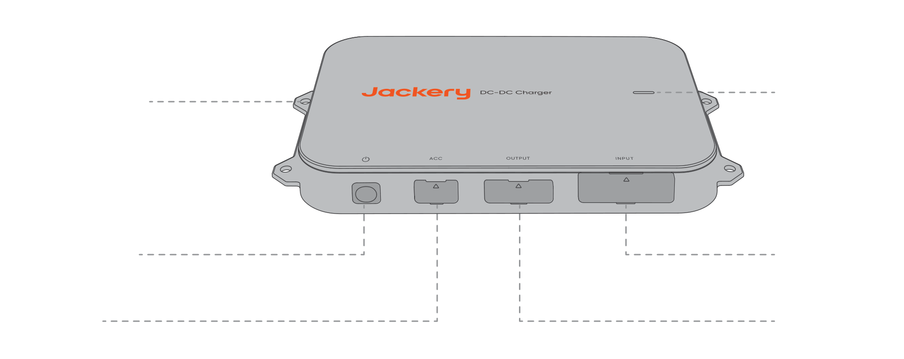

# 1. DISCLAIMER

Welcome, and thank you for choosing the Jackery DC-DC Charger. This manual is your guide to safely installing and using your new product. Please read all instructions carefully before starting and keep this guide for future reference.

Jackery reserves the right to the final interpretation of this document and all related product documents in compliance with legal and regulatory requirements. For any updates, revisions, or discontinuations, please refer to the latest official announcements.

Please note that the following are not covered under warranty:

- Damage due to natural events such as earthquakes, fires, floods, storms, or landslides.

- Damage caused by not storing the product under the conditions specified in this manual.

- Damage caused by negligence, improper operation, failure to follow the instructions in the manual, or intentional misuse.

- Damage caused by unauthorized disassembly of the product, replacement of parts, or modification of software code.

- Damage caused by improper transportation by the customer.

- Damage or adverse consequences resulting from label adjustments, modifications, or removal that violate this manual.

- Damage or adverse effects from using this product to power non-Jackery portable power stations.

- Incidents of personal injury, fire, equipment failure, or other adverse consequences caused by using this product in atomic energy, aviation, medical, or other safety-critical fields.

# 2. TECHNICAL SPECIFICATIONS

## GENERAL

<figure aria-label="GENERAL" class="hb-spec-table-composition"><table class="hb-spec-table manual-table manual-spec-table"><colgroup><col class="hb-spec-col-label"/><col class="hb-spec-col-value"/></colgroup>
<tbody>
<tr>
<th class="hb-spec-label manual-spec-label" scope="row">Product Name</th>
<td class="hb-spec-value manual-spec-value">Jackery DC-DC Charger</td>
</tr>
<tr>
<th class="hb-spec-label manual-spec-label" scope="row">Model</th>
<td class="hb-spec-value manual-spec-value">JA-AD600A</td>
</tr>
<tr>
<th class="hb-spec-label manual-spec-label" scope="row">DC Input</th>
<td class="hb-spec-value manual-spec-value">11.8V–32V⎓, 60A</td>
</tr>
<tr>
<th class="hb-spec-label manual-spec-label" scope="row">Output Voltage</th>
<td class="hb-spec-value manual-spec-value">50V⎓</td>
</tr>
<tr>
<th class="hb-spec-label manual-spec-label" scope="row">Output Current</th>
<td class="hb-spec-value manual-spec-value">12A Max</td>
</tr>
<tr>
<th class="hb-spec-label manual-spec-label" scope="row">Output Power</th>
<td class="hb-spec-value manual-spec-value">600W Max</td>
</tr>
<tr>
<th class="hb-spec-label manual-spec-label" scope="row">Working Temperature</th>
<td class="hb-spec-value manual-spec-value">−20°C–60°C</td>
</tr>
<tr>
<th class="hb-spec-label manual-spec-label" scope="row">Working Humidity</th>
<td class="hb-spec-value manual-spec-value">5%–95%</td>
</tr>
<tr>
<th class="hb-spec-label manual-spec-label" scope="row">Storage Temperature</th>
<td class="hb-spec-value manual-spec-value">−30°C–80°C</td>
</tr>
<tr>
<th class="hb-spec-label manual-spec-label" scope="row">Working Altitude</th>
<td class="hb-spec-value manual-spec-value">≤3000 m</td>
</tr>
<tr>
<th class="hb-spec-label manual-spec-label" scope="row">Protection Rating</th>
<td class="hb-spec-value manual-spec-value">IP40</td>
</tr>
<tr>
<th class="hb-spec-label manual-spec-label" scope="row">Weight</th>
<td class="hb-spec-value manual-spec-value">Around 1.6 kg</td>
</tr>
<tr>
<th class="hb-spec-label manual-spec-label" scope="row">Dimensions</th>
<td class="hb-spec-value manual-spec-value">259 × 154.5 × 39.3 mm</td>
</tr>
</tbody>
</table></figure>

Dimensions

# 3. WHAT'S IN THE BOX

<figure aria-label="3. WHAT’S IN THE BOX" class="hb-inbox-composition" data-card-count="9" data-component-id="HB-SPECIAL-INBOX" data-inbox-variant="responsive-card-grid"><ol class="hb-inbox-grid"><li class="hb-inbox-card" data-item-number="1">

A

<strong>Jackery DC-DC Charger</strong>

</li><li class="hb-inbox-card" data-item-number="2">

B

<strong>6 m Input Cable</strong>

Anderson Connector

</li><li class="hb-inbox-card" data-item-number="3">

C

<strong>Fuse</strong>

OT Terminal

</li><li class="hb-inbox-card" data-item-number="4">

D

<strong>1.5 m Output Cable</strong>

Anderson Connector / DC8020 Connector

</li><li class="hb-inbox-card" data-item-number="5">

E

<strong>6 m ACC Cable</strong>

Anderson Connector

</li><li class="hb-inbox-card" data-item-number="6">

F

<strong>ST5.5 Screw ×4</strong>

</li><li class="hb-inbox-card" data-item-number="7">

G

<strong>M6 Bolt ×4</strong>

</li><li class="hb-inbox-card" data-item-number="8">

H

<strong>M6 Nut ×4</strong>

</li><li class="hb-inbox-card" data-item-number="9">

I

<strong>User Guide</strong>

</li></ol></figure>

# 4. PRODUCT OVERVIEW

<figure class="hb-reference-figure hb-base-art-live-copy" data-component-id="HB-SPECIAL-REFERENCE-FIGURE" data-reference-id="product-overview" data-source-fragment-sha256="703e69604bccd7cf4a385628ff04807a67080f3fc8bdaaeadfed1f96e7c2da5c" data-web-base-art-ref="product_overview_base.png" data-web-presentation-mode="base-art-live-copy" data-web-replace-key="reference.product-overview">

Mounting HoleStatus Indicator LightPower ButtonInput PortACC PortOutput Port

</figure>

# 5. IMPORTANT SAFETY INSTRUCTIONS

During vehicle operation, the DC-DC charger utilizes the generator's surplus power to charge the portable power station. The actual charging power depends on the vehicle's driving conditions, model, and overall condition.

To ensure safe operation, it\'s crucial to observe the following guidelines:

- Keep this manual for future reference.

- Always operate or store the product under the conditions specified in this manual.

- Read all instructions and warnings on this product, the car battery, and the Jackery power station, as well as their respective user manuals.

- Do not disassemble the product or replace its parts without authorization, as this will void the warranty and may damage the product. Seek assistance from Jackery customer service for component replacement.

## Product Compatibility

This product is only compatible with Jackery portable power stations with a DC8020 input port. Users are strictly prohibited from using adapters to connect this product to a DC7909 or USB-C input port of a portable power station. Such connecting may cause device damage, fire, or even explosion, posing serious personal safety risks.

- This product is compatible only with 12V/24V car batteries. Before using the product, ensure that your vehicle\'s rated voltage is either 12V or 24V, and always follow electrical safety guidelines during use.

- This product is compatible with Jackery portable power stations equipped with a DC8020 input port. Refer to the table below for some compatible models. For more information, please contact customer service or visit the official Jackery website.

| Portable Power Station | Capacity | Charging Voltage and Current | Charging Power | Charging Time (0--100%) |
|----|----|----|----|----|
| Explorer 1000 Plus | 1265 Wh | Around 50V 8A | Around 400W | Around 3.5 Hour |
| Explorer 1000 v2 | 1070 Wh | Around 50V 8A | Around 400W | Around 3.0 Hour |
| Explorer 2000 Plus | 2042 Wh | Around 50V 12A | Around 600W | Around 3.7 Hour |
| Explorer 2000 v2 | 2042 Wh | Around 50V 8A | Around 400W | Around 5.6 Hour |
| Explorer 3000 Pro | 3024 Wh | Around 50V 12A | Around 600W | Around 5.5 Hour |
| Explorer 3000 v2 | 3072 Wh | Around 50V 12A | Around 600W | Around 5.6 Hour |

Compatible portable power stations

Note: The charging time data for this product is based on simulated tests conducted under a constant temperature of 25°C. In actual use, charging power may vary due to driving conditions, vehicle model, and overall condition. Charging times may also be affected by changes in ambient temperature.

**Standard Test Environment:** Constant 25°C

**Data Source:** Jackery Lab

Powering On the Product

<ol class="arabic simple">
<li>
<strong>Short press the power button:</strong> When there is no ACC signal input, you can power on the device by briefly pressing the power button.
</li>
<li>
<strong>Powering on via ACC signal:</strong> If the ACC wire is connected, the device will automatically power on when it detects an ACC signal input (e.g., after the vehicle is started).
</li>
</ol>

Standby and Shutdown

When there is no ACC signal input or the voltage falls below the startup threshold, the product will enter standby mode. If standby lasts longer than 24 hours or the voltage drops below the protection threshold, the device will automatically shut down. To restart it, follow the same steps as described above.

While in standby mode, if there is no ACC signal input, you can also manually shut down the device by pressing and holding the power button for 3 seconds.

<table class="hb-source-status-table">
<colgroup>
<col style="width: 18.0%"/>
<col style="width: 18.0%"/>
<col style="width: 25.0%"/>
<col style="width: 39.0%"/>
</colgroup>
<thead>
<tr><th class="head">
Light Status
</th>
<th class="head">
Light Color
</th>
<th class="head">
Product Status
</th>
<th class="head">
Remarks
</th>
</tr>
</thead>
<tbody>
<tr><td>
Solid
</td>
<td>
Green
</td>
<td>
Charging
</td>
<td>
/
</td>
</tr>
<tr><td>
Solid
</td>
<td>
Red
</td>
<td>
Abnormal
</td>
<td>
If any issues are detected, promptly contact Jackery customer service for support.
</td>
</tr>
<tr><td>
Blinking
</td>
<td>
Green
</td>
<td>
Connection is normal, waiting for charging.
</td>
<td>
If the same issue occurs after connecting the portable power station, possible causes include:

<ol class="arabic simple">
<li>
Unstable connection between the output cable and the portable power station.
</li>
<li>
Damaged cable.
</li>
<li>
The portable power station is fully charged.
</li>
</ol>

If the issue persists after troubleshooting, please contact Jackery customer service for support.

</td>
</tr>
<tr><td>
No light
</td>
<td>
No color
</td>
<td>
The product is not powered on.
</td>
<td>
If the problem remains after completing wiring and starting the vehicle, please contact Jackery customer service.
</td>
</tr>
</tbody>
</table>

# 6. FAQ

**Q1: Does installing this product require a professional?**

**A:** To ensure safety and neat wiring, it is recommended to have the installation performed by a professional modification shop. Non-professionals should not attempt to install it themselves.

**Q2: What should be checked during monthly maintenance of the product?**

**A:** 1. Clean the product surface with a dry cloth. For stubborn stains, use a diluted neutral detergent. 2. Check the connectors, wiring, screws, and fuses for any damage or aging. If assistance is needed, contact Jackery customer service. 3. Ensure the product is securely installed and avoid direct sunlight and high-temperature environments.

**Q3: Will this product drain the vehicle's battery?**

**A:** To prevent excessive discharge of the vehicle\'s starter battery or the RV\'s house battery, the product monitors the voltage across the battery terminals. If the voltage drops below the startup threshold, the product will automatically stop operating. When the vehicle is not running, the product will enter standby mode and shut down automatically after 24 hours.

**Q4: Why is the product not working?**

**A:** Some older or specific vehicle models have lower voltage, which may not match the product\'s operating voltage. If the voltage of is higher than the vehicle's system voltage (12V/24V) and the product fails to operate after being switched on, please contact Jackery customer service for assistance.

**Q5: Will this product increase fuel consumption?**

**A:** No. The product utilizes the generator\'s excess power, making it efficient, energy-saving, and environmentally friendly.

**Q6: What safety protection features does this product have?**

**A:** This product includes over-voltage, under-voltage, over-current, overload, short-circuit, and high/low-temperature protection to ensure safe and reliable charging. Additionally, the intelligent voltage detection function prevents excessive battery discharge, ensuring the vehicle starts normally.

**Q7: Why is the charging power unstable?**

**A:** The charging power adjusts dynamically based on the vehicle\'s driving and road conditions. This helps protect the vehicle battery while achieving maximum charging efficiency. Power fluctuations are normal.

**Q8: Will the product's operating noise affect sleep?**

**A:** The product is designed without a fan, and its noise level is below 40dB, meeting sleep environment noise standards.

# 7. PRODUCT INSTALLATION

## 7.1 Installation Diagram

<figure class="hb-reference-figure hb-base-art-live-copy" data-component-id="HB-SPECIAL-REFERENCE-FIGURE" data-reference-id="installation-diagram" data-source-fragment-sha256="ee5c7e11c4eb26d92d4346edad920c0cd48a3f886376b31e7a3c869747611e51" data-web-base-art-ref="installation_diagram_base.png" data-web-presentation-mode="base-art-live-copy" data-web-replace-key="reference.installation-diagram">

Vehicle ACCDC-DC Charger6m Input CableFuse1.5m Output Cable6m ACC CableJackery Portable Power Station* Wiring and cable bundling should be carried out based on the actual conditions of the vehicle.

</figure>

## 7.2 Important Safety Instructions

Warning

follow these basic safety precautions when using this product.

- It is recommended that a professional perform the wiring.

- Before wiring or connecting, take personal protective measures such as wearing safety goggles and insulated gloves, and always follow electrical safety guidelines.

- Always switch off the vehicle before starting any electrical work.

- Keep the product dry during use.

- Do not insert foreign objects into the product's ports.

- Do not use the product if the wiring, connectors, or product itself is damaged.

- Avoid placing wires near high temperatures, sharp objects, or areas prone to friction.

- Secure the wires properly to prevent potential issues caused by wear or loose connections.

- Before starting the vehicle and the product, ensure that the wiring is complete and all screws and connectors are securely tightened.

- Do not use this product to charge damaged or non-rechargeable portable power stations or backup batteries.

- If the product malfunctions after starting the vehicle, check the status indicator light and refer to the manual for troubleshooting.

- Before plugging, unplugging, or modifying wiring, ensure the vehicle is turned off, the product is powered off, and the connection is disconnected.

## 7.3 In Case of Emergency

- In case of an emergency (such as severe impact damage), wear insulated gloves and move the product to an open area away from flammable materials and people. Dispose of the product according to local laws and regulations.

- If the product accidentally falls into water, gets rained on, or has visible moisture on its surface, do not touch the product or the water around directly. Take necessary precautions against electric shock and move the product to a safe, dry, and well-ventilated area. Do not use or touch the product until it is completely dry. If assistance is needed, contact Jackery customer service immediately.

- If the product catches fire, use the following fire-extinguishing methods in order: water or mist, sand, fire blanket, dry powder, or a CO₂ fire extinguisher.

## 7.4 Pre-Installation Checks

1.  Ensure that the vehicle is turned off before installation.

2.  Confirm that the vehicle system voltage is 12V or 24V.

3.  Ensure the output voltage of the product matches the DC input voltage of the portable power station.

4.  Identify the location of the vehicle battery and ensure sufficient space for the input cable to pass through.

5.  Choose a suitable installation position. It is recommended to install the product in the trunk while ensuring at least 20 cm of clearance on all sides to prevent overheating from prolonged operation.

    \* It is recommended to install the product on the same side as the battery. For example, if the battery is on the left side of the vehicle, install the product on the left side.

Warning

The Jackery DC-DC charger is not waterproof. To prevent damage to the device, please install it inside the vehicle to avoid exposure to rain or damp environments.

6.  Check wire length. The product includes a 6-meter input cable. Ensure that this length is sufficient to extend from the vehicle battery to the intended installation location for the DC-DC charger.

7.  Check vehicle panels along the wiring route. To maintain a neat wiring layout, it may be necessary to remove and reinstall some vehicle panels during the process.

8.  Ensure the product is completely dry and undamaged before wiring and installation.

9.  Prepare the necessary tools, including a Phillips screwdriver, hex wrench, adjustable wrench, panel clip removal tool, wire, electrical tape, zip ties, wire cutters, and a test pen.

## 7.5 Wiring Steps

**Precautions:**

- Ensure that the wires are securely fastened to prevent high temperatures or short circuits caused by loose connections.

- When connecting the OT terminal to the vehicle battery, ensure a secure connection to prevent abnormal temperature increases.

- Ensure the vehicle is turned off.

1

Connect the OT terminal of the fuse to the <strong>positive terminal</strong> of the 6m input cable <strong>(in red)</strong> with a torque of 3–4 N·m.

Ensure the correct order of the round terminal, washer, lock washer, and nut, and apply the required torque.

Insufficient torque may cause a loose connection, leading to wire melting, while torque exceeding 6 N·m may break the fuse. During installation, please check and ensure that both ends of fuse terminals ① and ② are securely tightened. It is recommended to tighten them manually until they can no longer be turned. (If using an electric screwdriver, set the torque to 4 N·m before tightening.)

<figure class="hb-reference-figure hb-base-art-live-copy" data-component-id="HB-SPECIAL-REFERENCE-FIGURE" data-reference-id="wiring-fuse" data-source-fragment-sha256="b25924759477f2477174dfb58b5fab47484e3f1baa0e39a993d5cc620b64b03a" data-web-base-art-ref="file:///Users/pika/Documents/Codex/2026-10-07/kan-x/work/auto-manual2/docs/renderers/web/assets/ja_ad600a_eu_shared/wiring_fuse_base.svg" data-web-presentation-mode="base-art-live-copy" data-web-replace-key="reference.wiring-fuse">

Fuse3~4 N·m6m Input  CableNote: Tighten terminals ① and ② with a torque of 3–4 N·m.WasherLock WasherNut

</figure>

2

Connect the OT terminals of the input cable to the positive and negative terminals of the vehicle battery. Ensure that <strong>the red wire</strong> is connected to <strong>the positive terminal</strong> and <strong>the black wire</strong> to <strong>the negative terminal</strong>.

3

Cut the non-connector end of the ACC cable to expose the copper wire and connect it to the vehicle’s ACC line.

※ When connecting the ACC wire, if you are unsure of the wiring location or unclear about the connection method, it is recommended to contact the vehicle manufacturer for confirmation before proceeding with the wiring operation.

<figure class="hb-reference-figure hb-base-art-live-copy" data-component-id="HB-SPECIAL-REFERENCE-FIGURE" data-reference-id="wiring-acc" data-source-fragment-sha256="de3201bd061dd86186af82b8d55404da00e8e399395ed3a9226805d4f3dfdd3c" data-web-base-art-ref="file:///Users/pika/Documents/Codex/2026-10-07/kan-x/work/auto-manual2/docs/renderers/web/assets/ja_ad600a_eu_shared/wiring_acc_base.png" data-web-presentation-mode="base-art-live-copy" data-web-replace-key="reference.wiring-acc">

ACC CableVehicle  ACC Cable

</figure>

## 7.6 Product Installation

Before drilling holes or securing the DC-DC charger, inspect the area behind the intended mounting location to avoid damaging any wiring harnesses or other internal components.

### Method 1: Secure the product to the vehicle body.

1

Maintain at least 20 cm of clearance around the product (top, bottom, left, and right).

2

Mark the drilling positions.

3

Drill holes at the marked positions.

4

Secure the product using self-tapping screws.

### Method 2: Secure the product to a modification panel.

1

Mark the drilling positions on the modification panel.

2

Drill holes at the marked positions.

3

Insert M6 bolts through the product and into the holes, then tighten the M6 nuts.

## 7.7 Connecting the Product with a Portable Power Station

<ol class="arabic simple">
<li>
Connect the Anderson connector of the input cable to the product’s input port.
</li>
<li>
Connect the Anderson connector of the ACC cable to the product’s ACC port.
</li>
<li>
Connect the Anderson connector of the output cable to the product’s output port.
</li>
<li>
Connect the DC8020 connector of the output cable to the portable power station.
</li>
</ol>
<figure class="hb-reference-figure hb-base-art-live-copy" data-component-id="HB-SPECIAL-REFERENCE-FIGURE" data-reference-id="charger-connection" data-source-fragment-sha256="5b3cdf2ab166860d16fcfbf9daa37fcaa636d2a26269dbc33b845baf8fa2fa3a" data-web-base-art-ref="file:///Users/pika/Documents/Codex/2026-10-07/kan-x/work/auto-manual2/docs/renderers/web/assets/ja_ad600a_eu_shared/connection_base.png" data-web-presentation-mode="base-art-live-copy" data-web-replace-key="reference.charger-connection">

ACC CableOutput CableInput Cable with Fuse

</figure>

## 7.8 Post-Installation Checks

1.  Check that all screws in the wiring system are securely tightened.

2.  Inspect and secure all wiring to prevent wear or loosening caused by vehicle movement.

3.  Before starting the vehicle, ensure that all wiring is complete, and screws and cables are in proper condition.

4.  After starting the vehicle, press the power button briefly to turn on the product. If the indicator light turns solid green, the installation is successful.

## 7.9 Daily Usage Precautions

- Do not pull the wiring forcefully when disconnecting the product to avoid damage.

- Prolonged use of the product may cause the outer casing to heat up. Avoid direct contact to prevent burns.

- Regularly check the wiring every month to ensure that the OT terminals are securely connected and that there are no cracks, wear, or corrosion on the wires.

- Use a dry, soft cloth or tissue to clean the product. Do not wash it directly with water.

- When using the product, ensure that no objects are placed within 20 cm of it in any direction to prevent heat from affecting surrounding items.

- If aging, damage, or other issues are found on the product or cables, discontinue use immediately and seek repair or replacement.

- Turn off the power when the product is not in use.

## FCC Compliance Statement

<figure aria-label="FCC Compliance Statement" class="hb-fcc-composition hb-fcc-statement">

This device complies with Part 15 of the FCC Rules. Operation is subject to the following two conditions: (1) This device may not cause harmful interference, and (2) this device must accept any interference received, including interference that may cause undesired operation.

</figure>

# 8. WARRANTY

<strong>We only provide our warranty to customers who purchase from the official Jackery website, Jackery-branded third-party platforms, or local authorized dealers.</strong>

\*Warranty period and details may vary according to local laws, regulations, and authorized dealers.

## Limited Warranty

Jackery warrants to the original consumer purchaser that the Jackery product will be free from defects in workmanship and material under normal consumer use during the applicable warranty period identified in the \'Warranty Period\' section below, subject to the exclusions set forth below. This warranty statement sets forth Jackery\'s total and exclusive warranty obligation. We will not assume, nor authorize any person to assume for us, any other liability in connection with the sale of our products.

## Warranty Period

<table class="hb-source-period-table">
<colgroup>
<col style="width: 25.0%"/>
<col style="width: 75.0%"/>
</colgroup>
<tbody>
<tr><td>
<strong>2</strong>

<strong>YEARS</strong>

Standard Warranty

</td>
<td>
The standard warranty period for Jackery DC-DC Charger is 24 months. In each case, the warranty period is measured starting on the date of purchase by the original consumer purchaser. The sales receipt from the first consumer purchase, or other reasonable documentary proof, is required in order to establish the start date of the warranty period.
</td>
</tr>
</tbody>
</table>

## Warranty Service

If a Jackery product fails to operate during the applicable warranty period due to a defect in workmanship or materials, Jackery will provide warranty service at Jackery's expense in accordance with applicable local laws and Jackery's regional after-sales policy. Warranty service may include repair, replacement, or exchange of the product.

Any repaired, replaced, or exchanged product will be covered for the remaining warranty period of the original product.

## Limited to Original Consumer Buyer

The warranty on Jackery\'s product is limited to the original consumer purchaser and is not transferable to any subsequent owner.

## Exclusions

Jackery\'s warranty does not apply to:

Misused, abused, modified, damaged by accident, or used for anything other than normal consumer use as authorized in Jackery\'s current product literature.

Attempted repair by anyone other than an authorized facility.

Any product purchased through an online auction house.

## Interpretation Rights

The warranty on Jackery\'s product is limited to the original consumer purchaser and is not transferable to any subsequent owner.
