# DISCLAIMER

Welcome, and thank you for choosing the Jackery DC-DC Charger. This manual is your guide to safely installing and using your new product. Please read all instructions carefully before starting and keep this guide for future reference.

Jackery reserves the right to the final interpretation of this document and all related product documents in compliance with legal and regulatory requirements. For any updates, revisions, or discontinuations, please refer to the latest official announcements.

Please note that the following are not covered under warranty:

- Damage due to natural events such as earthquakes, fires, floods, storms, or landslides.

- Damage caused by not storing the product under the conditions specified in this manual.

- Damage caused by negligence, improper operation, failure to follow the instructions in the manual, or intentional misuse.

- Damage caused by unauthorized disassembly of the product, replacement of parts, or modification of software code.

- Damage caused by improper transportation by the customer.

- Damage or adverse consequences resulting from label adjustments, modifications, or removal that violate this manual.

- Damage or adverse effects from using this product to power non-Jackery portable power stations.

- Incidents of personal injury, fire, equipment failure, or other adverse consequences caused by using this product in atomic energy, aviation, medical, or other safety-critical fields.

# SPECIFICATIONS

## GENERAL

<figure aria-label="GENERAL" class="hb-spec-table-composition"><table class="hb-spec-table manual-table manual-spec-table"><colgroup><col class="hb-spec-col-label"/><col class="hb-spec-col-value"/></colgroup>
<tbody>
<tr>
<th class="hb-spec-label manual-spec-label" scope="row">Product Name</th>
<td class="hb-spec-value manual-spec-value">Jackery DC-DC Charger</td>
</tr>
<tr>
<th class="hb-spec-label manual-spec-label" scope="row">Model</th>
<td class="hb-spec-value manual-spec-value">JA-AD600A</td>
</tr>
<tr>
<th class="hb-spec-label manual-spec-label" scope="row">DC Input</th>
<td class="hb-spec-value manual-spec-value">11.8V–32V⎓, 60A</td>
</tr>
<tr>
<th class="hb-spec-label manual-spec-label" scope="row">Output Voltage</th>
<td class="hb-spec-value manual-spec-value">50V⎓</td>
</tr>
<tr>
<th class="hb-spec-label manual-spec-label" scope="row">Output Current</th>
<td class="hb-spec-value manual-spec-value">12A Max</td>
</tr>
<tr>
<th class="hb-spec-label manual-spec-label" scope="row">Output Power</th>
<td class="hb-spec-value manual-spec-value">600W Max</td>
</tr>
<tr>
<th class="hb-spec-label manual-spec-label" scope="row">Working Temperature</th>
<td class="hb-spec-value manual-spec-value">−20°C–60°C</td>
</tr>
<tr>
<th class="hb-spec-label manual-spec-label" scope="row">Working Humidity</th>
<td class="hb-spec-value manual-spec-value">5%–95%</td>
</tr>
<tr>
<th class="hb-spec-label manual-spec-label" scope="row">Storage Temperature</th>
<td class="hb-spec-value manual-spec-value">−30°C–80°C</td>
</tr>
<tr>
<th class="hb-spec-label manual-spec-label" scope="row">Working Altitude</th>
<td class="hb-spec-value manual-spec-value">≤3000 m</td>
</tr>
<tr>
<th class="hb-spec-label manual-spec-label" scope="row">Protection Rating</th>
<td class="hb-spec-value manual-spec-value">IP40</td>
</tr>
<tr>
<th class="hb-spec-label manual-spec-label" scope="row">Weight</th>
<td class="hb-spec-value manual-spec-value">Around 1.6 kg</td>
</tr>
<tr>
<th class="hb-spec-label manual-spec-label" scope="row">Dimensions</th>
<td class="hb-spec-value manual-spec-value">259 × 154.5 × 39.3 mm</td>
</tr>
</tbody>
</table></figure>

# DIMENSIONS

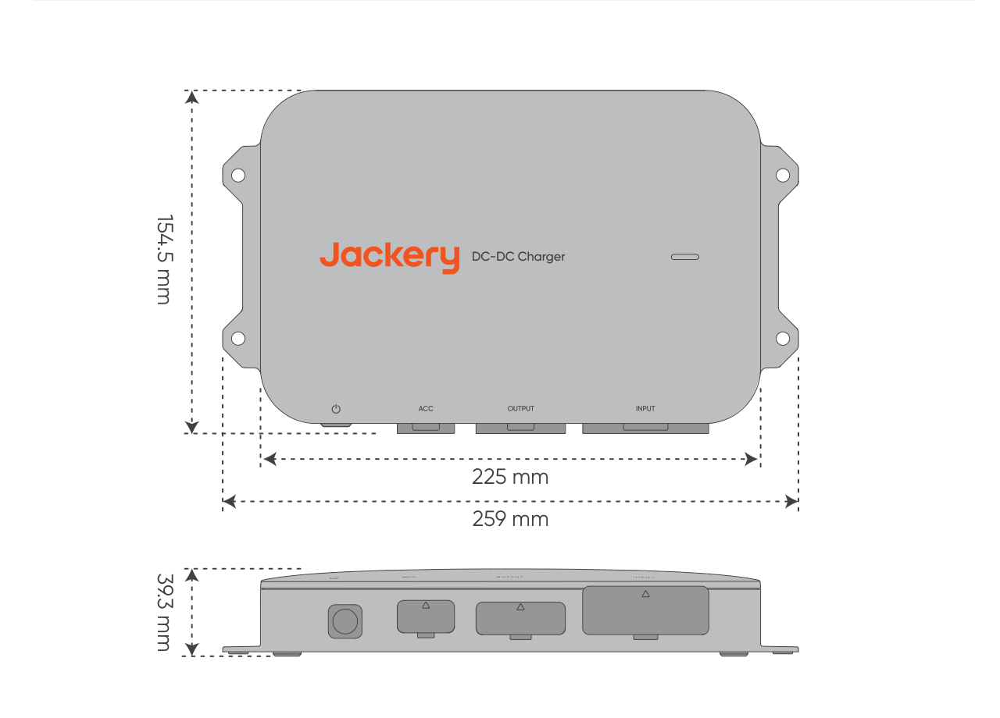

# WHAT\'S IN THE BOX

<figure aria-label="WHAT'S IN THE BOX" class="hb-inbox-composition" data-card-count="9" data-component-id="HB-SPECIAL-INBOX" data-inbox-variant="responsive-card-grid"><ol class="hb-inbox-grid"><li class="hb-inbox-card" data-item-number="1">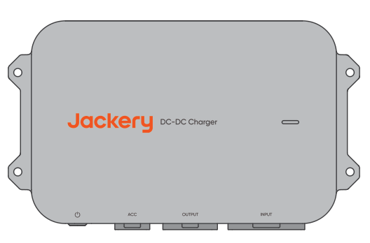

<strong>Jackery DC-DC Charger</strong>

</li><li class="hb-inbox-card" data-item-number="2">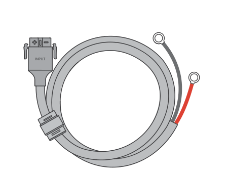

<strong>6 m Input Cable</strong>

</li><li class="hb-inbox-card" data-item-number="3">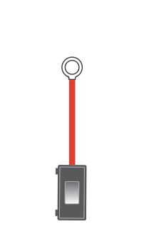

<strong>Fuse</strong>

</li><li class="hb-inbox-card" data-item-number="4">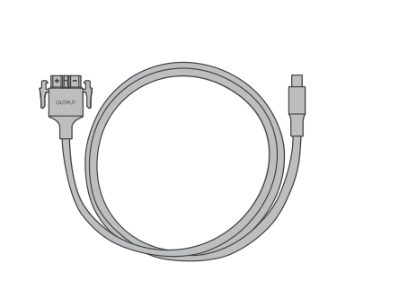

<strong>1.5 m Output Cable</strong>

</li><li class="hb-inbox-card" data-item-number="5">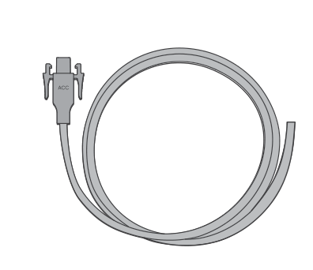

<strong>6 m ACC Cable</strong>

</li><li class="hb-inbox-card" data-item-number="6">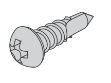

<strong>ST5.5 Screw ×4</strong>

</li><li class="hb-inbox-card" data-item-number="7">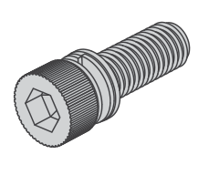

<strong>M6 Bolt ×4</strong>

</li><li class="hb-inbox-card" data-item-number="8">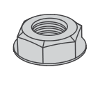

<strong>M6 Nut ×4</strong>

</li><li class="hb-inbox-card" data-item-number="9">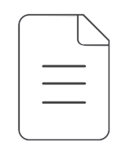

<strong>User Guide</strong>

</li></ol></figure>

# PRODUCT OVERVIEW

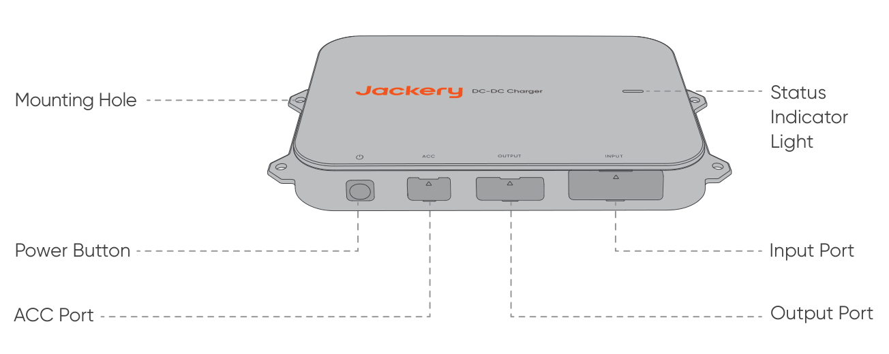

# IMPORTANT SAFETY INSTRUCTIONS

During vehicle operation, the DC-DC charger utilizes the generator\'s surplus power to charge the portable power station. The actual charging power depends on the vehicle\'s driving conditions, model, and overall condition.

To ensure safe operation, it is crucial to observe the following guidelines:

- Keep this manual for future reference.

- Always operate or store the product under the conditions specified in this manual.

- Read all instructions and warnings on this product, the car battery, and the Jackery power station, as well as their respective user manuals.

- Do not disassemble the product or replace its parts without authorization, as this will void the warranty and may damage the product. Seek assistance from Jackery customer service for component replacement.

## Product Compatibility

<table class="manual-callout-table" lang="en">
<tbody><tr>
<td class="manual-callout-label">WARNING</td>
<td class="manual-callout-body">This product is only compatible with Jackery portable power stations with a DC8020 input port. Do not use adapters to connect it to a DC7909 or USB-C input port. Such a connection may cause device damage, fire, or explosion and pose serious personal safety risks.</td>
</tr></tbody>
</table>

- This product is compatible only with 12V/24V car batteries. Before use, ensure that your vehicle\'s rated voltage is either 12V or 24V, and always follow electrical safety guidelines.

- This product is compatible with Jackery portable power stations equipped with a DC8020 input port. Some compatible models are listed below. For more information, contact customer service or visit the official Jackery website.

| Portable Power Station | Capacity | Charging Voltage and Current | Charging Power | Charging Time (0--100%) |
|----|----|----|----|----|
| Explorer 1000 Plus | 1265 Wh | Around 50V 8A | Around 400W | Around 3.5 Hour |
| Explorer 1000 v2 | 1070 Wh | Around 50V 8A | Around 400W | Around 3.0 Hour |
| Explorer 2000 Plus | 2042 Wh | Around 50V 12A | Around 600W | Around 3.7 Hour |
| Explorer 2000 v2 | 2042 Wh | Around 50V 8A | Around 400W | Around 5.6 Hour |
| Explorer 3000 Pro | 3024 Wh | Around 50V 12A | Around 600W | Around 5.5 Hour |
| Explorer 3000 v2 | 3072 Wh | Around 50V 12A | Around 600W | Around 5.6 Hour |

Compatible portable power stations

The charging-time data is based on simulated tests at a constant temperature of 25°C. In actual use, charging power may vary with driving conditions, vehicle model, and overall condition. Charging time may also be affected by ambient temperature.

**Standard Test Environment:** Constant 25°C

**Data Source:** Jackery Lab

## Powering On the Product

- **Short press the power button:** When there is no ACC signal input, briefly press the power button to power on the device.

- **Powering on via ACC signal:** If the ACC wire is connected, the device automatically powers on when it detects an ACC signal input, such as after the vehicle is started.

## Standby and Shutdown

When there is no ACC signal input or the voltage falls below the startup threshold, the product enters standby mode. If standby lasts longer than 24 hours or the voltage drops below the protection threshold, the device automatically shuts down. Restart it using the powering-on steps above.

While in standby mode, if there is no ACC signal input, you can also manually shut down the device by pressing and holding the power button for 3 seconds.

| Light Status | Light Color | Product Status | Remarks |
|----|----|----|----|
| Solid | Green | Charging | --- |
| Solid | Red | Abnormal | If any issues are detected, promptly contact Jackery customer service for support. |
| Blinking | Green | Connection is normal, waiting for charging. | Possible causes are an unstable output-cable connection, a damaged cable, or a fully charged portable power station. If the issue persists after troubleshooting, contact Jackery customer service. |
| No light | No color | The product is not powered on. | If the problem remains after completing wiring and starting the vehicle, contact Jackery customer service. |

Status indicator

# FAQ

## Does installing this product require a professional?

To ensure safety and neat wiring, it is recommended to have the installation performed by a professional modification shop. Non-professionals should not attempt to install it themselves.

## What should be checked during monthly maintenance?

1.  Clean the product surface with a dry cloth. For stubborn stains, use a diluted neutral detergent.

2.  Check the connectors, wiring, screws, and fuses for damage or aging. Contact Jackery customer service if assistance is needed.

3.  Ensure the product is securely installed, and avoid direct sunlight and high-temperature environments.

## Will this product drain the vehicle\'s battery?

To prevent excessive discharge of the vehicle\'s starter battery or the RV\'s house battery, the product monitors the voltage across the battery terminals. If the voltage drops below the startup threshold, the product automatically stops operating. When the vehicle is not running, the product enters standby mode and shuts down automatically after 24 hours.

## Why is the product not working?

Some older or specific vehicle models have lower voltage, which may not match the product\'s operating voltage. If the voltage of is higher than the vehicle\'s system voltage (12V/24V) and the product fails to operate after being switched on, contact Jackery customer service for assistance.

## Will this product increase fuel consumption?

No. The product utilizes the generator\'s excess power, making it efficient, energy-saving, and environmentally friendly.

## What safety protection features does this product have?

This product includes over-voltage, under-voltage, over-current, overload, short-circuit, and high/low-temperature protection to ensure safe and reliable charging. The intelligent voltage-detection function also prevents excessive battery discharge, ensuring that the vehicle starts normally.

## Why is the charging power unstable?

Charging power adjusts dynamically based on the vehicle\'s driving and road conditions. This protects the vehicle battery while achieving maximum charging efficiency. Power fluctuations are normal.

## Will the product\'s operating noise affect sleep?

The product is designed without a fan, and its noise level is below 40dB, meeting sleep-environment noise standards.

# PRODUCT INSTALLATION

## Installation Diagram

<figure class="hb-operation-figure hb-operation-layout-footer-panel" data-component-id="HB-SPECIAL-OPERATION" data-operation-id="installation-diagram" data-source-fragment-sha256="65085dac7b2f61a0dbed35f7daed7f873b3e62d8e26c1a7e5a76238c5b697153" data-web-replace-key="operation.installation-diagram">
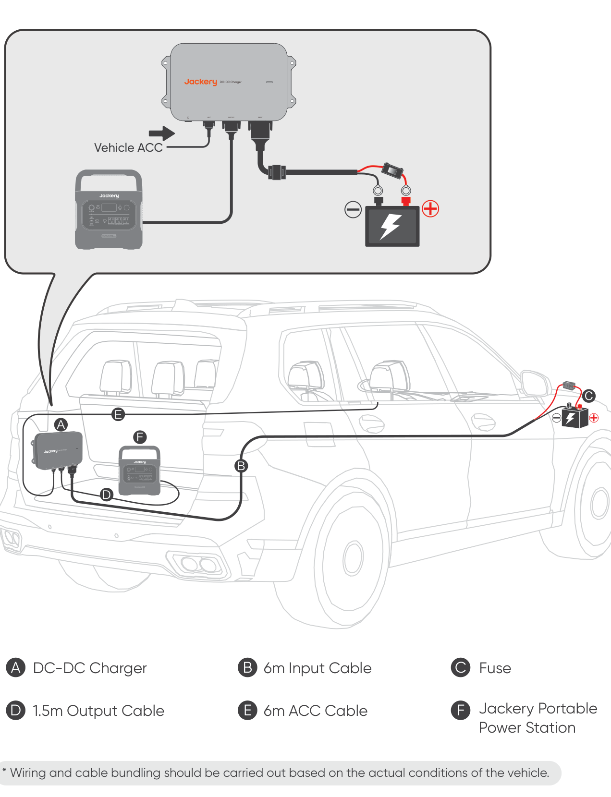

Vehicle installation overview.

</figure>

Wiring and cable bundling should be carried out based on the actual conditions of the vehicle.

## Important Safety Instructions

Follow these basic safety precautions when using this product:

- It is recommended that a professional perform the wiring.

- Before wiring or connecting, take personal protective measures such as wearing safety goggles and insulated gloves, and always follow electrical safety guidelines.

- Always switch off the vehicle before starting any electrical work.

- Keep the product dry during use.

- Do not insert foreign objects into the product\'s ports.

- Do not use the product if the wiring, connectors, or product itself is damaged.

- Avoid placing wires near high temperatures, sharp objects, or areas prone to friction.

- Secure the wires properly to prevent issues caused by wear or loose connections.

- Before starting the vehicle and the product, ensure that wiring is complete and all screws and connectors are securely tightened.

- Do not use this product to charge damaged or non-rechargeable portable power stations or backup batteries.

- If the product malfunctions after starting the vehicle, check the status indicator light and refer to this manual for troubleshooting.

- Before plugging, unplugging, or modifying wiring, ensure that the vehicle and product are powered off and the connection is disconnected.

## In Case of Emergency

- In an emergency such as severe impact damage, wear insulated gloves and move the product to an open area away from flammable materials and people. Dispose of it according to local laws and regulations.

- If the product falls into water, is exposed to rain, or has visible moisture, do not directly touch the product or surrounding water. Take precautions against electric shock and move it to a safe, dry, well-ventilated area. Do not use or touch it until completely dry. Contact Jackery customer service immediately if assistance is needed.

- If the product catches fire, use the following extinguishing methods in order: water or mist, sand, fire blanket, dry powder, or a CO₂ fire extinguisher.

## Pre-Installation Checks

1.  Ensure that the vehicle is turned off before installation.

2.  Confirm that the vehicle system voltage is 12V or 24V.

3.  Ensure that the product output voltage matches the portable power station\'s DC input voltage.

4.  Identify the vehicle battery location and ensure there is sufficient space for the input cable to pass through.

5.  Choose a suitable installation position. Installation in the trunk is recommended, with at least 20 cm of clearance on all sides to prevent overheating during prolonged operation. Install the product on the same side as the battery where possible.

6.  Check the wire length. The included input cable is 6 meters long; ensure it can reach from the vehicle battery to the intended charger location.

7.  Check the vehicle panels along the wiring route. Some panels may need to be removed and reinstalled to maintain a neat wiring layout.

8.  Ensure that the product is completely dry and undamaged before wiring and installation.

9.  Prepare the necessary tools, including a Phillips screwdriver, hex wrench, adjustable wrench, panel clip removal tool, wire, electrical tape, zip ties, wire cutters, and a test pen.

<table class="manual-callout-table" lang="en">
<tbody><tr>
<td class="manual-callout-label">WARNING</td>
<td class="manual-callout-body">The Jackery DC-DC Charger is not waterproof. Install it inside the vehicle to avoid exposure to rain or damp environments.</td>
</tr></tbody>
</table>

## Wiring Steps

Before wiring, ensure that the wires and OT-terminal connections can be securely fastened and that the vehicle is turned off.

<figure class="hb-operation-figure hb-operation-layout-footer-panel" data-component-id="HB-SPECIAL-OPERATION" data-operation-id="wiring-steps" data-source-fragment-sha256="06ee8c8079f2b5142a2c6bc498ccb7ab77823768de651805609fe04fa79055d1" data-web-replace-key="operation.wiring-steps">
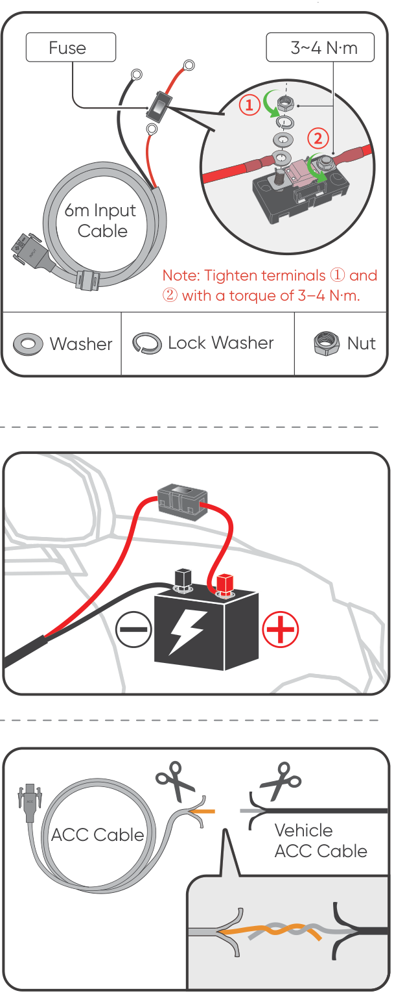

Connect the fuse OT terminal to the red 6 m input cable at 3–4 N·m. Keep the round terminal, washer, lock washer, and nut in the correct order; insufficient torque may melt the wire, while torque above 6 N·m may break the fuse. Verify both fuse terminals are secure.

Connect the input-cable OT terminals to the vehicle battery: red to positive and black to negative.

Cut the non-connector end of the ACC cable, expose the copper wire, and connect it to the vehicle ACC line. If the connection point or method is unclear, confirm it with the vehicle manufacturer first.

</figure>

## Product Installation

Before drilling or securing the charger, inspect behind the intended mounting location to avoid damaging wiring harnesses or other internal components.

### Method 1: Secure the product to the vehicle body

<figure class="hb-operation-figure hb-operation-layout-footer-panel" data-component-id="HB-SPECIAL-OPERATION" data-operation-id="secure-vehicle-body" data-source-fragment-sha256="38f31b3f479a8ba9723d41e573fc51b494f8e982102aa5677d68f02c2c1c7c41" data-web-replace-key="operation.secure-vehicle-body">
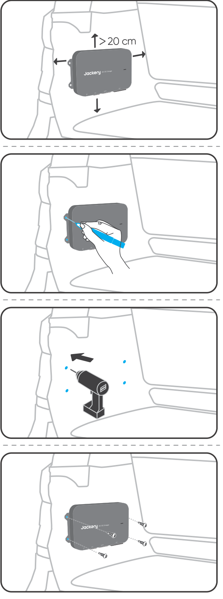

Maintain at least 20 cm of clearance above, below, left, and right of the product.

Mark the installation positions.

Drill holes at the marked positions.

Secure the product with self-tapping screws.

</figure>

### Method 2: Secure the product to a modification panel

<figure class="hb-operation-figure hb-operation-layout-footer-panel" data-component-id="HB-SPECIAL-OPERATION" data-operation-id="secure-modification-panel" data-source-fragment-sha256="ef1171c107760237fc4a51d5a3b4e4b51262fe734149af305e656487754fb04c" data-web-replace-key="operation.secure-modification-panel">
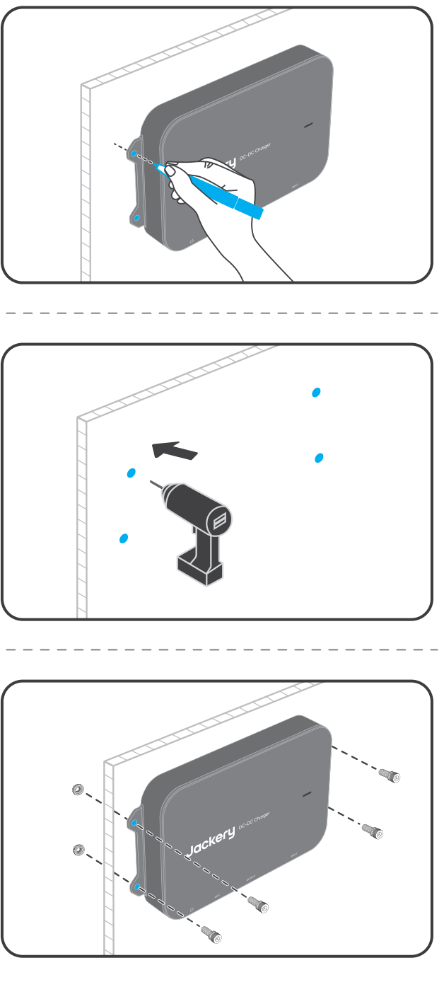

Mark the drilling positions on the modification panel.

Drill holes at the marked positions.

Insert M6 bolts through the product and holes, then tighten the M6 nuts.

</figure>

## Connecting the Product with a Portable Power Station

<figure class="hb-operation-figure hb-operation-layout-footer-panel" data-component-id="HB-SPECIAL-OPERATION" data-operation-id="connection-diagram" data-source-fragment-sha256="e54acea55ed46031b069595de7012804e02119eb4259df4f5da950484c11b932" data-web-replace-key="operation.connection-diagram">
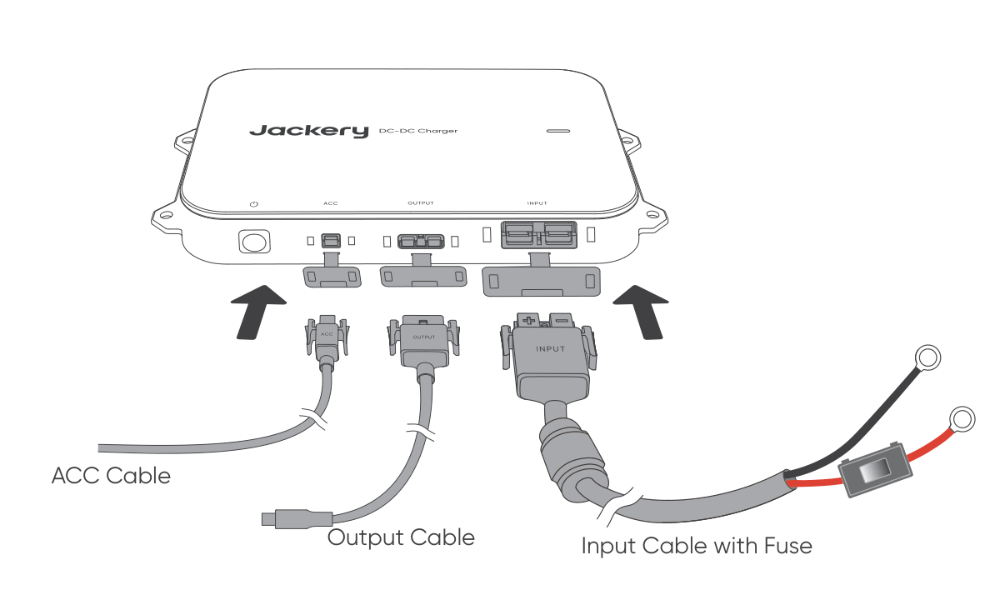

Connect the input cable's Anderson connector to the product input port.

Connect the ACC cable's Anderson connector to the product ACC port.

Connect the output cable's Anderson connector to the product output port.

Connect the output cable's DC8020 connector to the portable power station.

</figure>

## Post-Installation Checks

1.  Check that all screws in the wiring system are securely tightened.

2.  Inspect and secure all wiring to prevent wear or loosening caused by vehicle movement.

3.  Before starting the vehicle, ensure all wiring is complete and screws and cables are in proper condition.

4.  After starting the vehicle, briefly press the power button. A solid green indicator light confirms successful installation.

## Daily Usage Precautions

- Do not pull the wiring forcefully when disconnecting the product.

- Prolonged use may heat the outer casing. Avoid direct contact to prevent burns.

- Check the wiring monthly. Ensure OT terminals are securely connected and wires have no cracks, wear, or corrosion.

- Clean the product with a dry, soft cloth or tissue. Do not wash it directly with water.

- Keep all objects at least 20 cm away from the product in every direction during use.

- If the product or cables show aging, damage, or other issues, discontinue use and seek repair or replacement.

- Turn off the power when the product is not in use.

## FCC Compliance Statement

This device complies with Part 15 of the FCC Rules. Operation is subject to the following two conditions: (1) this device may not cause harmful interference, and (2) this device must accept any interference received, including interference that may cause undesired operation.

# WARRANTY

<figure aria-label="WARRANTY" class="hb-warranty-intro-composition" data-component-id="HB-WARRANTY-LEAD">

<strong>We only provide our warranty to customers who purchase from the official Jackery website, Jackery-branded third-party platforms, or local authorized dealers.</strong>

*Warranty period and details may vary according to local laws, regulations, and authorized dealers.

</figure>

## Limited Warranty

<figure aria-label="Limited Warranty" class="hb-warranty-card" data-component-id="HB-WARRANTY-SECTION" data-warranty-card-index="1">
Jackery warrants to the original consumer purchaser that the Jackery product will be free from defects in workmanship and material under normal consumer use during the applicable warranty period identified in the “Warranty Period” section below, subject to the exclusions set forth below.

This warranty statement sets forth Jackery's total and exclusive warranty obligation. We will not assume, nor authorize any person to assume for us, any other liability in connection with the sale of our products.
</figure>

## Warranty Period

<figure aria-label="Warranty Period" class="hb-warranty-period-card" data-component-id="HB-WARRANTY-YEARS">

2
<strong class="hb-warranty-years-unit">YEARS</strong><strong class="hb-warranty-period-label">— Standard Warranty</strong>

The standard warranty period for the Jackery DC-DC Charger is 24 months. The warranty period starts on the date of purchase by the original consumer purchaser. The sales receipt from the first consumer purchase, or other reasonable documentary proof, is required to establish the start date.

</figure>

## Warranty Service

<figure aria-label="Warranty Service" class="hb-warranty-card" data-component-id="HB-WARRANTY-SECTION" data-warranty-card-index="3">
If a Jackery product fails to operate during the applicable warranty period due to a defect in workmanship or materials, Jackery will provide warranty service at Jackery's expense in accordance with applicable local laws and Jackery's regional after-sales policy. Warranty service may include repair, replacement, or exchange of the product.

Any repaired, replaced, or exchanged product will be covered for the remaining warranty period of the original product.
</figure>

## Limited to Original Consumer Buyer

<figure aria-label="Limited to Original Consumer Buyer" class="hb-warranty-card" data-component-id="HB-WARRANTY-SECTION" data-warranty-card-index="4">
The warranty on Jackery's product is limited to the original consumer purchaser and is not transferable to any subsequent owner.
</figure>

## Exclusions

<figure aria-label="Exclusions" class="hb-warranty-card" data-component-id="HB-WARRANTY-SECTION" data-warranty-card-index="5">
Jackery's warranty does not apply to:
<ul class="simple">
<li>
Products misused, abused, modified, damaged by accident, or used for anything other than normal consumer use as authorized in Jackery's current product literature.
</li>
<li>
Attempted repair by anyone other than an authorized facility.
</li>
<li>
Any product purchased through an online auction house.
</li>
</ul></figure>

## Interpretation Rights

<figure aria-label="Interpretation Rights" class="hb-warranty-card" data-component-id="HB-WARRANTY-SECTION" data-warranty-card-index="6">
The warranty on Jackery's product is limited to the original consumer purchaser and is not transferable to any subsequent owner.
</figure>
