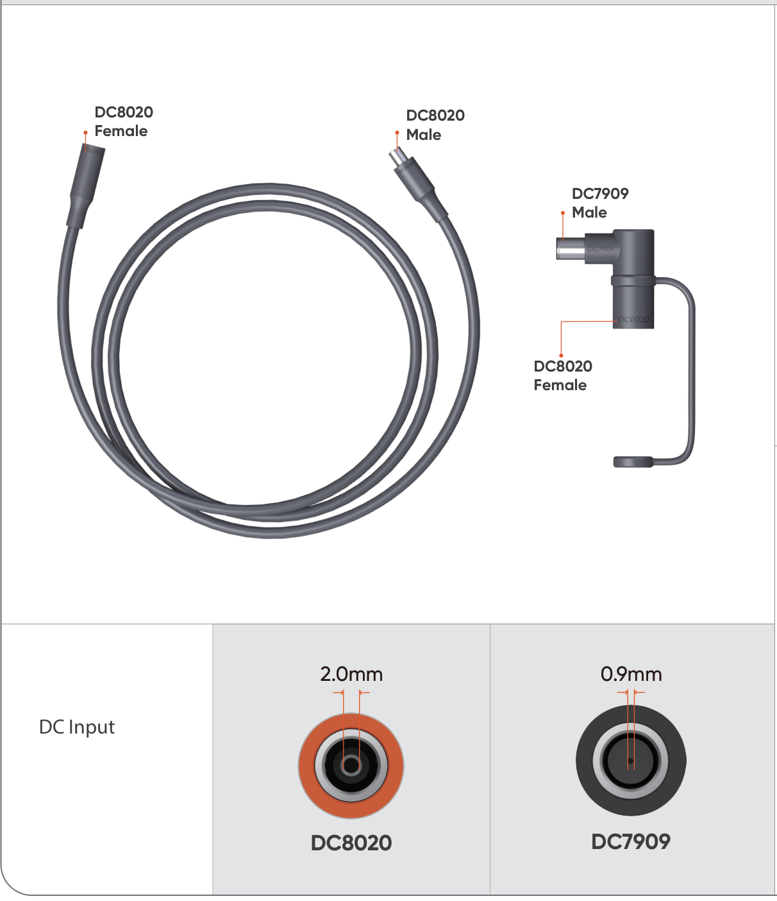
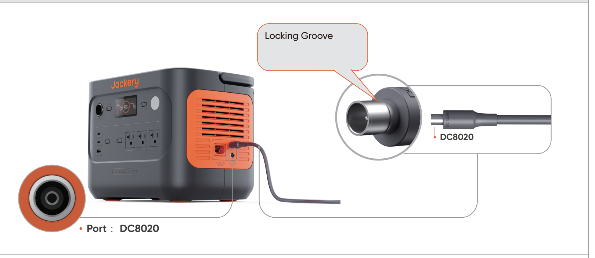
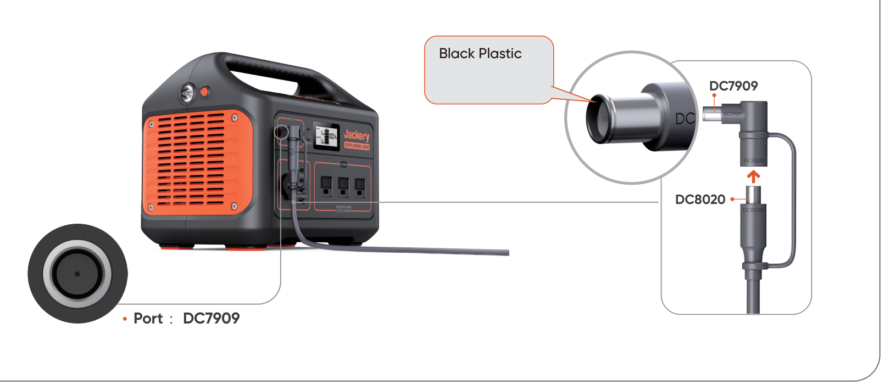

# Jackery Solar Generator Connection Guide

Please refer to the official Jackery website or customer support for the detailed solar generator connection guide.

<table class="manual-callout-table" lang="en">
<tbody><tr>
<td class="manual-callout-label">NOTE</td>
<td class="manual-callout-body">

For the connection issues shown in the diagram, please consider the following solutions.

<em>The DC7909 male connector can be inserted into the DC8020 female port, but it is incompatible and does not allow current to flow.</em>

</td>
</tr></tbody>
</table>

  
