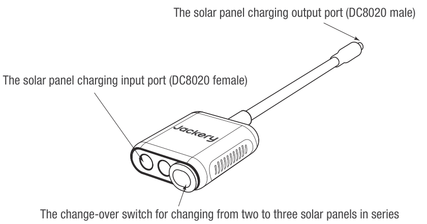
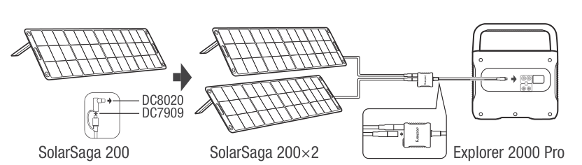
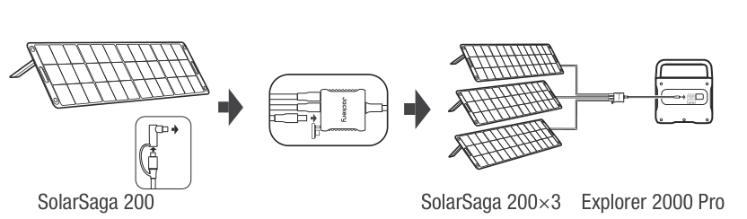
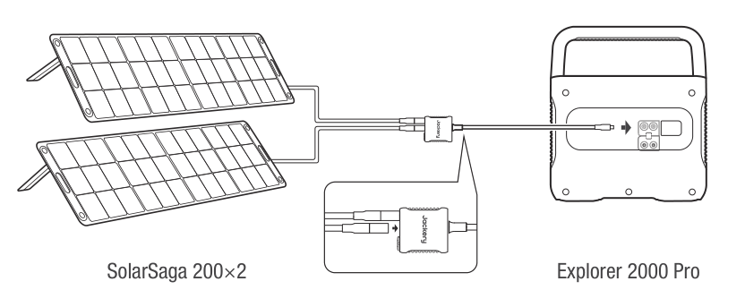
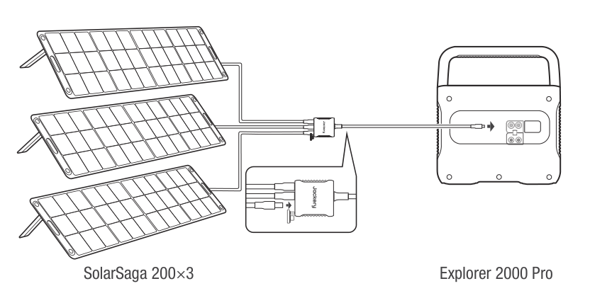
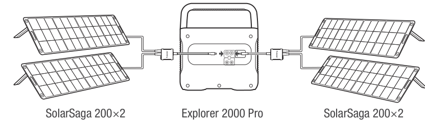
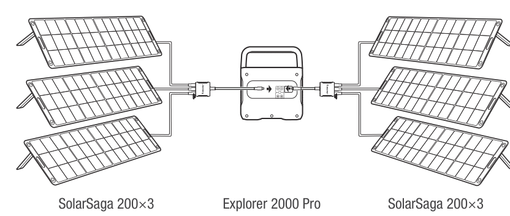
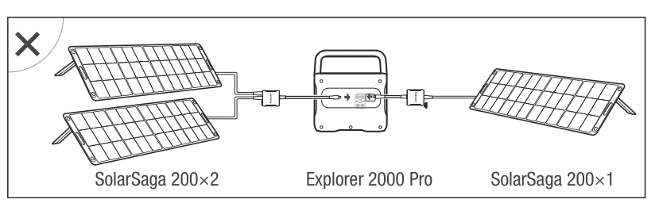
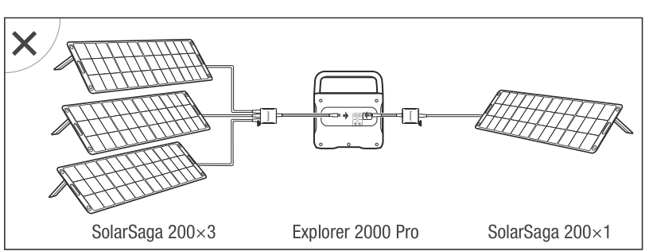
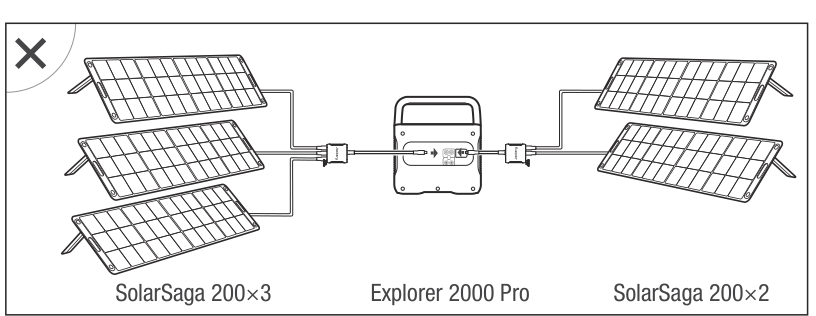

# FUNCTIONS OF MAIN PORTS

Two or three solar panels can be connected in series through this adapter. To ensure that the solar panels can exert the maximum power output, please make sure to use the same type of solar panels when connected in series.

1.  **Solar panel charging output port (DC8020 male):** When charging, plug this port into the DC input port of the Jackery Explorer 2000 Pro.

2.  **Solar panel charging input port (DC8020 female):** When charging, connect the solar panel or panels to this port.

3.  **Change-over switch:** When connecting two solar panels to charge, keep the switch **OFF**; otherwise the system cannot charge. If the switch is **ON**, three solar panels must be connected at the same time.

# HOW TO USE

Jackery SolarSaga solar panels (68W, 100W, and 200W) are equipped with two port types at the output interface. Refer to the following illustrations to connect the solar panel and the adapter.

## Connection Operation Instructions

When charging, connect the adapter to the DC input port of the power station before connecting the solar panel. When the power station is fully charged, remove the solar panel first, then remove the adapter from the power station.

### Connecting two 200W solar panels

### Connecting three 200W solar panels

## SOLAR PANELS CONNECTION GUIDE

### Example 1

### Example 2

### Example 3

### Example 4

<table class="manual-callout-table" lang="en">
<tbody><tr>
<td class="manual-callout-label">CAUTION</td>
<td class="manual-callout-body">When the two inputs are used at the same time, use the same type of solar panel and the same number of solar panels for both inputs. Otherwise, inconsistent voltages between the two channels may damage the equipment or cause charging problems.</td>
</tr></tbody>
</table>

The following connections are prohibited when charging this product:

  
