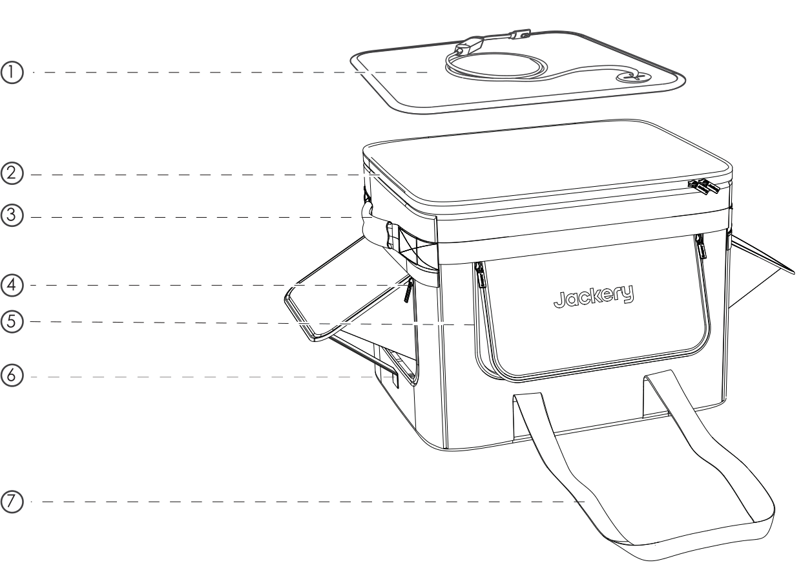
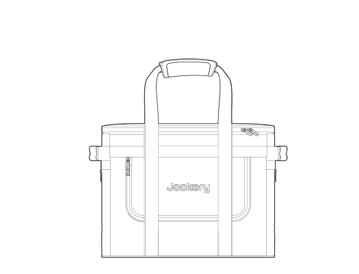
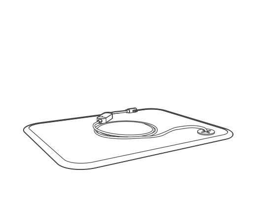
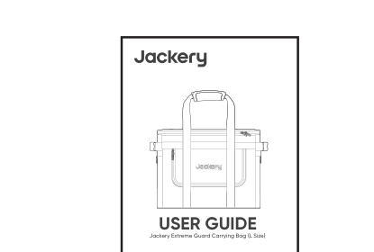
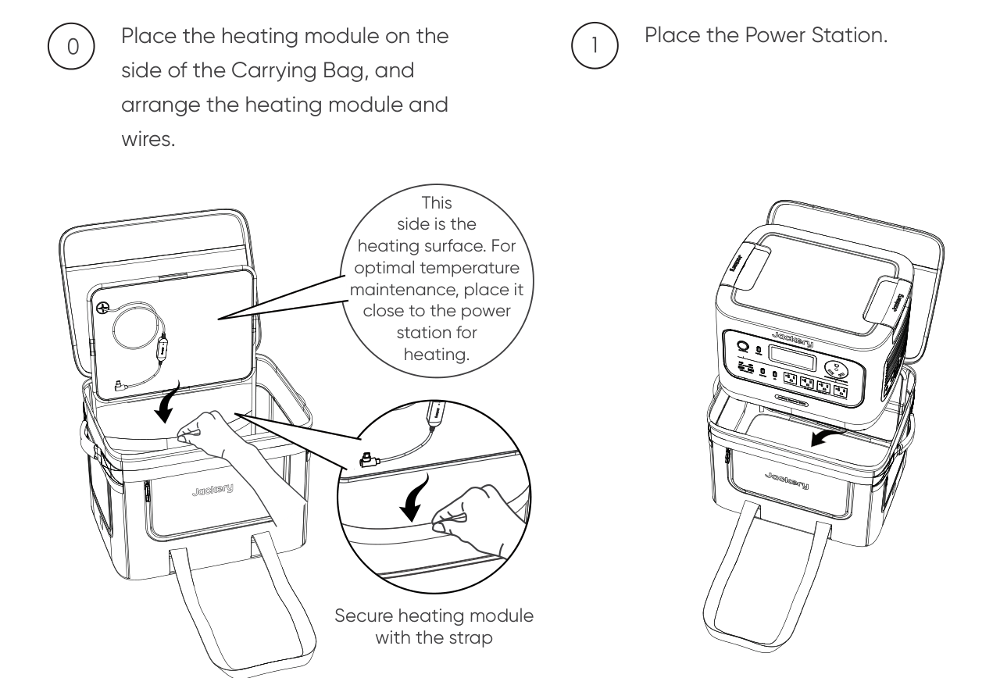
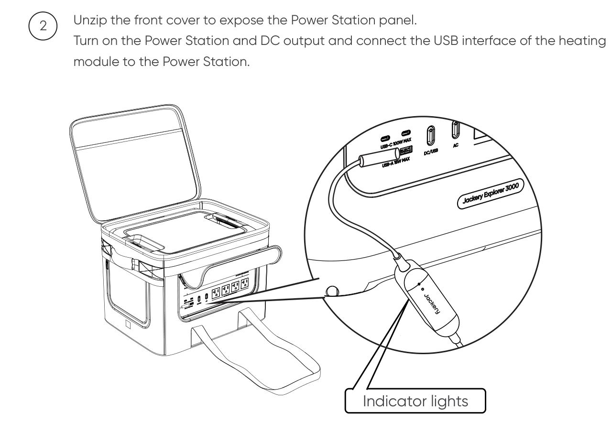
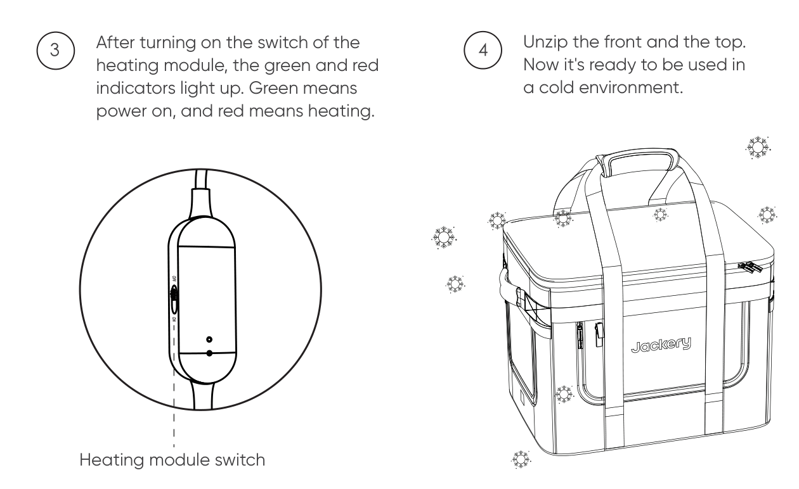
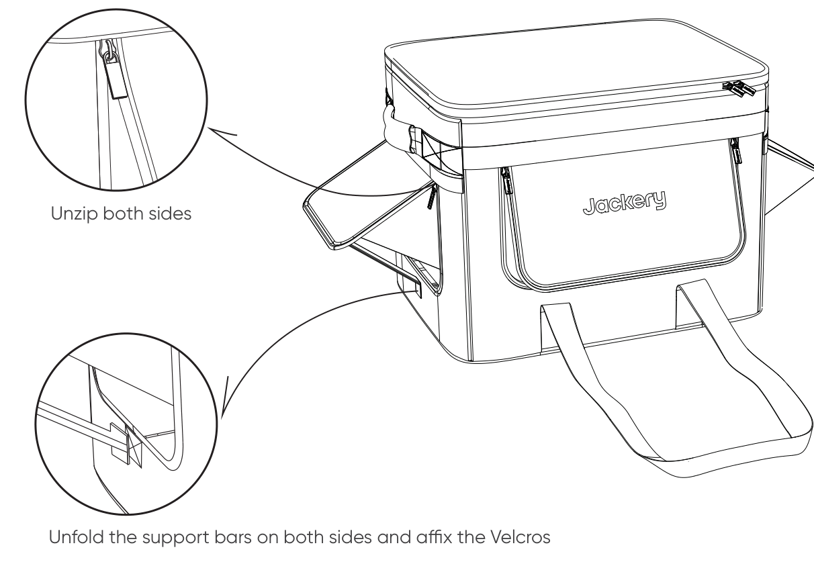

# DISCLAIMER

Thank you for choosing Jackery products. Please read this manual carefully before using the product, particularly the relevant precautions to ensure proper use. Please retain this manual for future reference. In compliance with applicable laws and regulations, the company has the right of final interpretation of this document and all documents related to this product. If there are any updates, revisions, or terminations, please refer to the latest official notice.

# PRODUCT OVERVIEW

|  |  |  |  |
|----|----|----|----|
| **0** | Heating module | **1** | Top zipper |
| **2** | Short handles on both sides | **3** | Side zipper |
| **4** | Front zipper | **5** | Support bar |
| **6** | Long carrying straps on both sides | **7** | Long carrying straps on both sides |

# PRECAUTIONS

1.  Before entering a low-temperature environment, make sure that the Power Station has been put into the Carrying Bag and has started heating to ensure the thermal insulation effect of the product and the discharge performance of the Power Station.

2.  Keep sharp objects away from the product.

# SPECIFICATIONS

## GENERAL

<figure aria-label="GENERAL" class="hb-spec-table-composition"><table class="hb-spec-table manual-table manual-spec-table"><colgroup><col class="hb-spec-col-label"/><col class="hb-spec-col-value"/></colgroup>
<tbody>
<tr>
<th class="hb-spec-label manual-spec-label" scope="row">Product Name</th>
<td class="hb-spec-value manual-spec-value">Jackery Extreme Guard Carrying Bag (L Size)</td>
</tr>
<tr>
<th class="hb-spec-label manual-spec-label" scope="row">Product Model</th>
<td class="hb-spec-value manual-spec-value">JA-CC30A</td>
</tr>
<tr>
<th class="hb-spec-label manual-spec-label" scope="row">Weight</th>
<td class="hb-spec-value manual-spec-value">1.7 kg</td>
</tr>
<tr>
<th class="hb-spec-label manual-spec-label" scope="row">Size</th>
<td class="hb-spec-value manual-spec-value">45 x 36 x 34 cm</td>
</tr>
<tr>
<th class="hb-spec-label manual-spec-label" scope="row">Fabric</th>
<td class="hb-spec-value manual-spec-value">900D leather film material</td>
</tr>
<tr>
<th class="hb-spec-label manual-spec-label" scope="row">Storage Temperature of Heating Module</th>
<td class="hb-spec-value manual-spec-value">−30°C to 85°C</td>
</tr>
<tr>
<th class="hb-spec-label manual-spec-label" scope="row">Operating Temperature of Heating Module</th>
<td class="hb-spec-value manual-spec-value">−20°C to 45°C</td>
</tr>
<tr>
<th class="hb-spec-label manual-spec-label" scope="row">Heating Module Input</th>
<td class="hb-spec-value manual-spec-value">20V⎓ 2.5A</td>
</tr>
<tr>
<th class="hb-spec-label manual-spec-label" scope="row">Heating Module Power</th>
<td class="hb-spec-value manual-spec-value">50W</td>
</tr>
</tbody>
</table></figure>

# PACKAGE LIST

<figure aria-label="PACKAGE LIST" class="hb-inbox-composition" data-card-count="3" data-component-id="HB-SPECIAL-INBOX" data-inbox-variant="three-card-responsive"><ol class="hb-inbox-grid"><li class="hb-inbox-card" data-item-number="1">

<strong>Jackery Extreme Guard Carrying Bag (L Size)</strong>

</li><li class="hb-inbox-card" data-item-number="2">

<strong>Heating Module</strong>

</li><li class="hb-inbox-card" data-item-number="3">

<strong>User Guide</strong>

</li></ol></figure>

# HOW TO USE

  

## UNFOLD BOTH SIDES OF THE CARRYING BAG AND USE THE SUPPORT BARS

When the Power Station needs to dissipate heat or connect to a solar panel, open the zippers on both sides, unfold the support bars at the same time, and fix them with the hook-and-loop fasteners.

# CLEANING AND MAINTENANCE

This product can only be hand washed. Gently wipe it with a wet cloth and keep it in a ventilated area out of direct sunlight. Do not dry clean, put it in a dryer, or bleach it.

# CUSTOMER SERVICE

## Limited Warranty

<table>
<colgroup>
<col style="width: 100%" />
</colgroup>
<tbody>
<tr>
<td>
<strong>2-YEAR LIMITED WARRANTY</strong>

A 2-year warranty is provided from the date of purchase.
</td>
</tr>
</tbody>
</table>

The following circumstances will void the warranty:

- The appearance of the product is damaged after use.

- The product is disassembled or repaired by an unlicensed technician.

- Product performance failure is caused by human error.

- Damage is caused by force majeure such as natural disasters, lightning, or accidents.

## Contact Us

For inquiries or comments concerning our products, email <a href="mailto:hello@jackery.com" class="reference external">hello@jackery.com</a>. For a quality-related issue, you may request a replacement or refund by submitting a request form at www.jackery.com.

# FCC COMPLIANCE STATEMENT

This device complies with Part 15 of the FCC Rules. Operation is subject to the following two conditions: (1) this device may not cause harmful interference, and (2) this device must accept any interference received, including interference that may cause undesired operation.

NOTE: This equipment has been tested and found to comply with the limits for a Class B digital device, pursuant to Part 15 of the FCC Rules. These limits provide reasonable protection against harmful interference in a residential installation. This equipment generates, uses, and can radiate radio-frequency energy and, if not installed and used according to the instructions, may cause harmful interference to radio communications. There is no guarantee that interference will not occur in a particular installation.

If this equipment causes harmful interference to radio or television reception, try one or more of the following measures:

- Reorient or relocate the receiving antenna.

- Increase the separation between the equipment and receiver.

- Connect the equipment to an outlet on a circuit different from that to which the receiver is connected.

- Consult the dealer or an experienced radio or television technician for help.

MODIFICATION: Changes or modifications not expressly approved by the grantee of this device could void the user\'s authority to operate the device.
