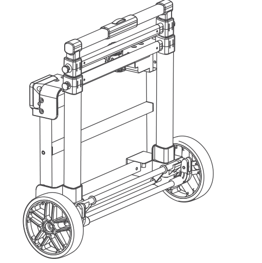
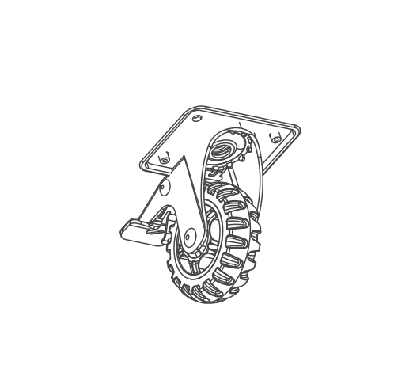
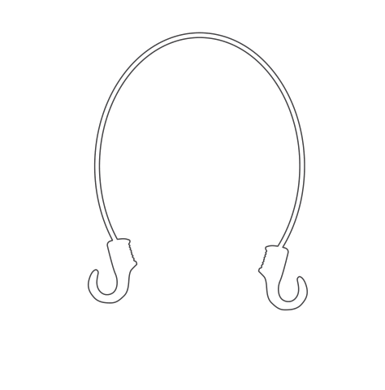
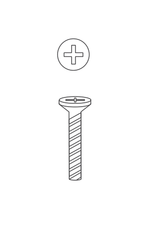
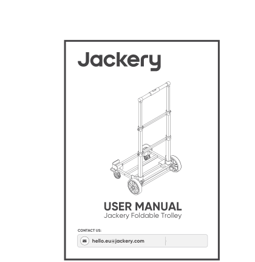
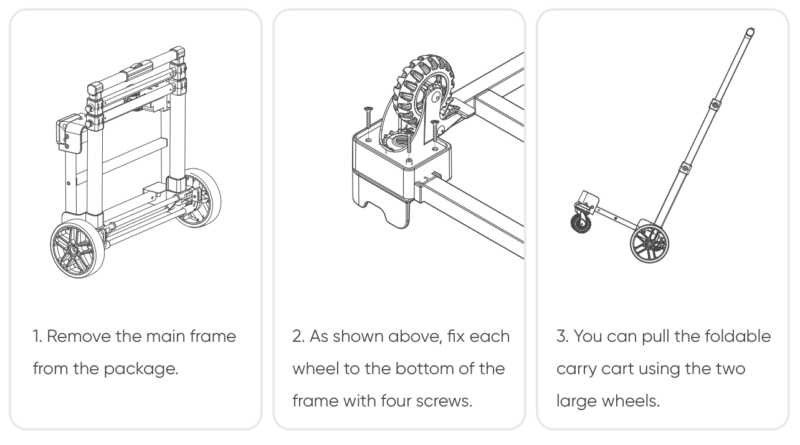
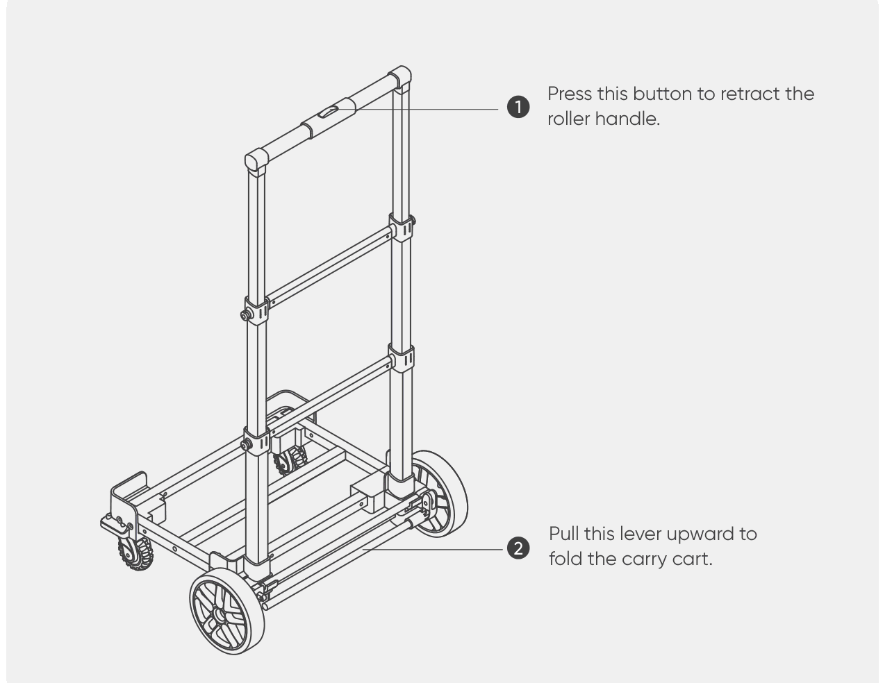

# WHAT\'S IN THE BOX

<figure aria-label="WHAT'S IN THE BOX" class="hb-inbox-composition" data-card-count="5" data-component-id="HB-SPECIAL-INBOX" data-inbox-variant="responsive-card-grid"><ol class="hb-inbox-grid"><li class="hb-inbox-card" data-item-number="1">

<strong>Main Frame ×1</strong>

</li><li class="hb-inbox-card" data-item-number="2">

<strong>Universal Wheels ×2</strong>

</li><li class="hb-inbox-card" data-item-number="3">

<strong>Elastic Hook Ropes ×2</strong>

</li><li class="hb-inbox-card" data-item-number="4">

<strong>Wheel Mounting Screws ×10</strong>

</li><li class="hb-inbox-card" data-item-number="5">

<strong>User Manual ×1</strong>

</li></ol>

<strong>NOTE</strong>

If accessories are damaged or lost, please contact customer support.

</figure>

# SPECIFICATIONS

## GENERAL

<figure aria-label="GENERAL" class="hb-spec-table-composition"><table class="hb-spec-table manual-table manual-spec-table"><colgroup><col class="hb-spec-col-label"/><col class="hb-spec-col-value"/></colgroup>
<tbody>
<tr>
<th class="hb-spec-label manual-spec-label" scope="row">Product Name</th>
<td class="hb-spec-value manual-spec-value">Jackery Foldable Trolley</td>
</tr>
<tr>
<th class="hb-spec-label manual-spec-label" scope="row">Model</th>
<td class="hb-spec-value manual-spec-value">JAAC-WHE-100-EUA1</td>
</tr>
<tr>
<th class="hb-spec-label manual-spec-label" scope="row">Material</th>
<td class="hb-spec-value manual-spec-value">Aluminum Tube + Iron Tube</td>
</tr>
<tr>
<th class="hb-spec-label manual-spec-label" scope="row">Maximum Load</th>
<td class="hb-spec-value manual-spec-value">80 kg</td>
</tr>
<tr>
<th class="hb-spec-label manual-spec-label" scope="row">Weight</th>
<td class="hb-spec-value manual-spec-value">Approx. 4 kg</td>
</tr>
<tr>
<th class="hb-spec-label manual-spec-label" scope="row">Unfolded Dimensions</th>
<td class="hb-spec-value manual-spec-value">Approx. 94x50x40cm</td>
</tr>
<tr>
<th class="hb-spec-label manual-spec-label" scope="row">Folded Dimensions</th>
<td class="hb-spec-value manual-spec-value">Approx. 50x50x25cm</td>
</tr>
</tbody>
</table></figure>

The maximum load capacity of this foldable carry cart is 80 kg.

Use the product only after full assembly.

To avoid affecting the product lifespan of the foldable carry cart, do not leave the portable power station on it for more than 72 hours.

# HOW TO USE THE PRODUCT

 
