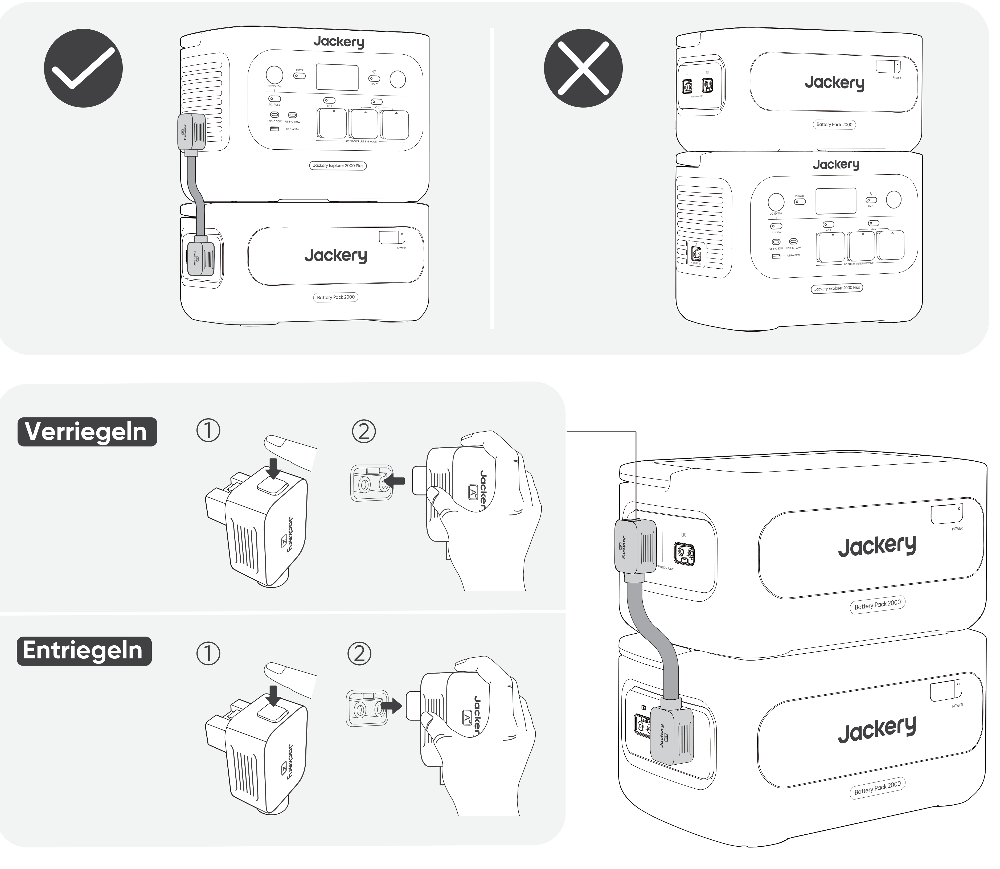

**WICHTIG**

Herzlichen Glückwunsch zu Ihrem neuen Jackery Battery Pack 2000. Bitte lesen Sie dieses Handbuch vor der Verwendung des Produkts sorgfältig durch, insbesondere die relevanten Vorsichtsmaßnahmen, um eine ordnungsgemäße Verwendung sicherzustellen. Bewahren Sie dieses Handbuch an einem zugänglichen Ort auf, damit Sie später darauf zurückgreifen können.

In Übereinstimmung mit Gesetzen und Vorschriften liegt das endgültige Auslegungsrecht für dieses Dokument und alle zugehörigen Dokumente dieses Produkts beim Unternehmen. Obwohl alle Anstrengungen unternommen wurden, um die Genauigkeit dieses Handbuchs sicherzustellen, übernimmt Jackery keine Verantwortung für etwaige Fehler.

Bitte beachten Sie, dass bei Aktualisierung, Überarbeitung oder Einstellung keine weiteren Benachrichtigungen erfolgen. Die neueste Version der Produkthandbücher finden Sie unter support.jackery.com.

\* Die Abbildungen dienen nur als Referenz. Bitte beziehen Sie sich auf das tatsächliche Produkt.

<table class="manual-callout-table" style="width:100%; border-collapse:collapse; margin:0 0 16px 0;"><tbody><tr><td class="manual-callout-label" style="width:16%; border:1px solid #000; padding:6px 8px; vertical-align:top;">
<strong>HINWEIS</strong>
</td><td class="manual-callout-body" style="border:1px solid #000; padding:6px 8px; vertical-align:top;">
Dieses Batteriepack ist mit dem Jackery E2000 Plus V2 und dem Jackery E1000 Plus V2 kompatibel. In diesem Handbuch bezeichnet „die tragbare Powerstation“ eines der beiden Modelle, sofern nicht anders angegeben.
</td></tr></tbody></table>

# SICHERHEITSVORKEHRUNGEN BEI DER VERWENDUNG

Befolgen Sie bei der Verwendung dieses Produkts stets die folgenden grundlegenden Vorsichtsmaßnahmen.

- Bitte lesen Sie alle Anweisungen, bevor Sie dieses Produkt verwenden.

- Lassen Sie Kinder nicht mit dem Produkt spielen. Achten Sie darauf, dass Kinder beaufsichtigt werden, wenn das Produkt in ihrer Nähe verwendet wird.

- Bei der Verwendung von Zubehör, das von nicht professionellen Herstellern empfohlen oder verkauft wird, besteht die Gefahr eines Stromschlags.

- Wenn das Produkt nicht verwendet wird, ziehen Sie bitte den Netzstecker aus der Steckdose des Produkts.

- Zerlegen Sie das Produkt nicht, da dies zu unvorhersehbaren Risiken führen kann, wie Feuer, Explosion oder Stromschlag.

- Verwenden Sie das Produkt nicht mit beschädigten Kabeln oder Steckern oder beschädigten Ausgangskabeln, die einen Stromschlag verursachen können.

- Laden Sie das Gerät in einem gut belüfteten Bereich und beeinträchtigen Sie die Belüftung in keiner Weise.

- Stellen Sie das Gerät an einem gut belüfteten und trockenen Ort auf, um Regen und Feuchtigkeit zu vermeiden, die einen elektrischen Schlag verursachen könnten.

- Setzen Sie das Gerät weder Feuer noch hohen Temperaturen aus (z. B. direkter Sonneneinstrahlung oder großer Hitze im Fahrzeug), da dies zu Unfällen wie Bränden oder Explosionen führen kann.

- Wird dieses Gerät über einen längeren Zeitraum (3-6 Monate) in vollständig entladenem Zustand gelagert, kann es möglicherweise nicht mehr aufgeladen werden.

# BEDEUTUNG DER SYMBOLE

| Symbol | Bedeutung |
|----|----|
| ⚠WARNUNG | Gefährliche Handlungen, die zu schweren Verletzungen, zum Tod und/oder zu Sachschäden führen können. |
| ⚠VORSICHT | Gefährliche Handlungen, die zu Personenschäden und/oder zu Sachschäden führen können. |
| ⚠HINWEIS | Handlungen, die zu Geräteschäden, Datenverlust, Leistungseinbußen oder unerwarteten Ergebnissen führen können. |
| ⚠TIPP | Ergänzt wichtige Informationen oder Bedienhinweise im Text. |

|  |  |  |  |
|----|----|----|----|
| **Symbol** | **Bedeutung** | **Symbol** | **Bedeutung** |
|  | Warn- und Vorsichtssymbole. Lesen Sie diese Hinweise, um auf mögliche Gefahren oder Risiken aufmerksam gemacht zu werden. |  | Halten Sie das Produkt fern von Kindern. |
|  | Lesen Sie vor der Anwendung die Benutzeranleitung. |  | Dieses Symbol weist darauf hin, dass sich im Produkt ein Lithium-Ionen-Akku (Li-Ion) befindet, der ordnungsgemäß entsorgt oder recycelt werden muss. |
|  | Demontieren Sie das Produkt nicht. |  | Dieses Symbol weist darauf hin, dass das Produkt nicht über den Hausmüll entsorgt werden darf, sondern einer ausgewiesenen Sammelstelle zum Recycling zugeführt werden muss. Eine ordnungsgemäße Entsorgung und Wiederverwertung trägt zum Schutz der Umwelt bei. Weitere Informationen zur Entsorgung und zum Recycling dieses Produkts erhalten Sie bei Ihrer Gemeinde, Ihrem Entsorgungsdienst oder Ihrem Händler. |
|  | Rauchen Sie nicht und verwenden Sie keine offenen Flammen. |  | Batterien und Akkumulatoren dürfen nicht über den Hausmüll entsorgt werden. Als Verbraucher sind Sie gesetzlich verpflichtet, alle Batterien und Akkumulatoren an dafür vorgesehenen Sammelstellen zu entsorgen, unabhängig davon, ob sie Schadstoffe enthalten. Bitte geben Sie gebrauchte Batterien und Akkumulatoren an einer örtlichen Sammelstelle, einem Recyclingzentrum oder beim Händler zurück, bei dem sie gekauft wurden. Die ordnungsgemäße Entsorgung gewährleistet eine umweltgerechte Wiederverwertung und verhindert mögliche Schäden für die menschliche Gesundheit und die Umwelt. |

# LIEFERUMFANG

<figure aria-label="LIEFERUMFANG" class="hb-inbox-composition" data-card-count="3" data-component-id="HB-SPECIAL-INBOX" data-inbox-variant="three-card-responsive"><ol class="hb-inbox-grid"><li class="hb-inbox-card" data-item-number="1">

<strong>Jackery Battery Pack 2000</strong>

</li><li class="hb-inbox-card" data-item-number="2">

<strong>Verlängerungskabel</strong>

</li><li class="hb-inbox-card" data-item-number="3">

Benutzerhandbuch

</li></ol></figure>

# PRODUKTÜBERSICHT

## PRODUKTDARSTELLUNG

|                   |         |
|-------------------|---------|
| **Hauptschalter** | **LCD** |

## LINKE SEITENANSICHT

<table>
<colgroup>
<col style="width: 50%" />
<col style="width: 50%" />
</colgroup>
<tbody>
<tr>
<td>
<strong>Ausziehgriff</strong>
</td>
<td>
<strong>DC-Erweiterungsport A</strong>

(Anschluss an Verlängerungskabel Terminal A)
</td>
</tr>
<tr>
<td></td>
<td>
<strong>DC-Erweiterungsport B</strong>

(Anschluss an Verlängerungskabel Terminal B)
</td>
</tr>
</tbody>
</table>

# LCD-ANZEIGE

<table class="longtable lcd-text-only">
<colgroup>
<col style="width: 8%" />
<col style="width: 12%" />
<col style="width: 28%" />
<col style="width: 52%" />
</colgroup>
<tbody>
<tr>
<td>
1
</td>
<td></td>
<td>
Leistungsprozentanzeige/Fehlercode
</td>
<td>Die Anzeige zeigt den aktuellen Akkustand in Prozent an.
Bei einem Systemfehler wird der entsprechende Fehlercode F0-FF angezeigt.</td>
</tr>
<tr>
<td>
2
</td>
<td></td>
<td>
Ladeanzeige
</td>
<td>
Die Anzeige wird während des Ladevorgangs angezeigt und verschwindet, wenn das Gerät vollständig aufgeladen ist.
</td>
</tr>
</tbody>
</table>

# GRUNDLEGENDE OPERATIONEN

## EINSCHALTEN / AUSSCHALTEN

**Ein**

Einmal drücken

**Aus**

3 Sekunden lang gedrückt halten

<table>
<colgroup>
<col style="width: 12%" />
<col style="width: 88%" />
</colgroup>
<tbody>
<tr>
<td>
<strong>HINWEISE</strong>
</td>
<td>
Wenn Sie es mit der tragbaren Powerstation verwenden, können Sie die Stromversorgung des Jackery Battery Pack 2000 über den Hauptschalter der tragbaren Powerstation steuern.

Wenn keine Entladung oder Ladung erfolgt, wird das Produkt nach 2 Stunden automatisch heruntergefahren.
</td>
</tr>
</tbody>
</table>

## LCD-DISPLAY EIN/AUS

Wenn Sie den Hauptschalter drücken oder das Gerät aufladen, wird das LCD-Display beleuchtet. Wenn Sie den Hauptschalter erneut drücken, wird das Display ausgeschaltet.

# ANSCHLÜSSE

Die tragbare Powerstation kann mit bis zu 5 Sätzen dieses Produkts gleichzeitig verwendet werden, um größere Kapazitätsanforderungen zu erfüllen.

<table class="manual-callout-table" style="width:100%; border-collapse:collapse; margin:0 0 16px 0;"><tbody><tr><td class="manual-callout-label" style="width:16%; border:1px solid #000; padding:6px 8px; vertical-align:top;">
<strong>VORSICHT</strong>
</td><td class="manual-callout-body" style="border:1px solid #000; padding:6px 8px; vertical-align:top;"><ul class="simple">
<li>
Stellen Sie sicher, dass alle Geräte ausgeschaltet sind, bevor Sie die tragbare Powerstation an das Jackery Battery Pack 2000 anschließen.
</li>
<li>
Stellen Sie für einen ordnungsgemäßen Betrieb sicher, dass die Lufteinlass- und Abluftöffnungen auf beiden Seiten nicht blockiert sind. Halten Sie zwischen den Lüftungsöffnungen und anderen Gegenständen einen Abstand von mindestens 200 mm ein, um eine ausreichende Wärmeableitung zu gewährleisten.
</li>
</ul>
</td></tr></tbody></table>

<table>
<colgroup>
<col style="width: 12%" />
<col style="width: 88%" />
</colgroup>
<tbody>
<tr>
<td>
<strong>HINWEISE</strong>
</td>
<td><ul>
<li>
Die Anzeige des Verbindungssymbols auf dem LCD-Bildschirm (tragbare Powerstation) zeigt eine erfolgreiche Verbindung zwischen dem Batteriepack und der tragbaren Powerstation an.
</li>
<li>
Stapeln Sie bei der Verwendung des Geräts nicht mehr als drei Batteriepacks übereinander, um ein Umkippen und mögliche Verletzungen zu vermeiden. Stapeln Sie das Gerät nicht auf der tragbaren Powerstation.
</li>
<li>
Stellen Sie die Batteriepacks auf eine ebene, stabile Oberfläche mit ausreichender Tragfähigkeit. Standardmäßig dürfen maximal 3 Batteriepacks gestapelt werden.
</li>
<li>
Wenn 4 oder mehr Batteriepacks erforderlich sind, müssen diese an einem stabilen Standort an einer Wand und vor äußeren Einwirkungen geschützt platziert werden. Zudem müssen die erforderlichen Maßnahmen zur Kippsicherung getroffen werden.
</li>
</ul></td>
</tr>
</tbody>
</table>

# FEHLERSUCHE

Wenn einer der folgenden Fehlercodes angezeigt wird, befolgen Sie die aufgeführten Korrekturmaßnahmen, um das Problem zu beheben. Wenn der Fehler weiterhin besteht, wenden Sie sich bitte an den Jackery-Kundendienst.

<figure aria-label="Fehlercode / Korrekturmaßnahmen" class="hb-troubleshooting-composition" data-component-id="HB-TABLE-TROUBLESHOOTING" tabindex="0"><table class="hb-troubleshooting-table"><colgroup><col class="hb-troubleshooting-col-code"/><col class="hb-troubleshooting-col-measures"/></colgroup><thead><tr><th class="hb-troubleshooting-code" scope="col">
Fehlercode
</th><th class="hb-troubleshooting-measures" scope="col">
Korrekturmaßnahmen
</th></tr></thead><tbody><tr><td class="hb-troubleshooting-code">
F0
</td><td class="hb-troubleshooting-measures">
Starten Sie das Gerät neu.
</td></tr><tr><td class="hb-troubleshooting-code">
F3
</td><td class="hb-troubleshooting-measures">
Starten Sie das Gerät neu.
</td></tr><tr><td class="hb-troubleshooting-code">
F4
</td><td class="hb-troubleshooting-measures">
Schließen Sie das Gerät an Verbraucher an, um die Batterie zu entladen, bis der Fehler verschwindet.
</td></tr><tr><td class="hb-troubleshooting-code">
F5
</td><td class="hb-troubleshooting-measures">
Laden Sie das Gerät über Solarmodule oder eine AC-Wandsteckdose, bis der Fehler verschwindet.
</td></tr><tr><td class="hb-troubleshooting-code">
F8
</td><td class="hb-troubleshooting-measures">
Wenden Sie sich an den Jackery-Kundendienst.
</td></tr><tr><td class="hb-troubleshooting-code">
FE
</td><td class="hb-troubleshooting-measures">
Wenden Sie sich an den Jackery-Kundendienst.
</td></tr><tr><td class="hb-troubleshooting-code">
FF
</td><td class="hb-troubleshooting-measures">
Stellen Sie das Gerät in eine Umgebung mit geeigneter Temperatur und warten Sie, bis der Fehler verschwindet.
</td></tr></tbody></table></figure>

# AUFLADEN

## AUFLADEN ÜBER EINE AC-STECKDOSE

Beim Aufladen über das Hauptstromnetz muss dieses Gerät mit der tragbaren Powerstation verwendet werden.

<table class="manual-callout-table" style="width:100%; border-collapse:collapse; margin:0 0 16px 0;"><tbody><tr><td class="manual-callout-label" style="width:16%; border:1px solid #000; padding:6px 8px; vertical-align:top;">
<strong>WARNUNG</strong>
</td><td class="manual-callout-body" style="border:1px solid #000; padding:6px 8px; vertical-align:top;">
Stellen Sie sicher, dass alle Geräte ausgeschaltet sind, bevor Sie die tragbare Powerstation an das Jackery Battery Pack 2000 anschließen.
</td></tr></tbody></table>

## AUFLADEN ÜBER SOLARPANEL (SEPARAT ERHÄLTLICH)

Laden Sie das Gerät wie in der unten dargestellten Abbildung mit Solarmodulen und der tragbaren Powerstation auf. Weitere Informationen finden Sie im Benutzerhandbuch der tragbaren Powerstation.

# LAGERUNG

Bewahren Sie das Produkt an einem trockenen, sauberen Ort mit ausreichender Belüftung auf. Lagertemperatur und Luftfeuchtigkeit:

- 1 Monat: -20 °C bis 45 °C (0--60 % rL)

- 3 Monate: 0 °C bis 45 °C (0--60 % rL)

- 12 Monate: 0 °C bis 25 °C (0--60 % rL)

Wenn dieses Produkt über einen längeren Zeitraum (3 bis 6 Monate) mit entladener Batterie gelagert wird, kann es sein, dass es danach nicht mehr aufgeladen werden kann. Um dies zu verhindern und die Batterielebensdauer zu erhalten, wird empfohlen, das Produkt alle drei Monate zu überprüfen und aufzuladen sowie mindestens einmal alle 6 bis 12 Monate einen vollständigen Lade- und Entladezyklus durchzuführen.

# Spezifikationen

## ALLGEMEINE INFORMATIONEN

<figure aria-label="ALLGEMEINE INFORMATIONEN" class="hb-spec-table-composition"><table class="hb-spec-table manual-table manual-spec-table"><colgroup><col class="hb-spec-col-label"/><col class="hb-spec-col-value"/></colgroup>
<tbody>
<tr>
<th class="hb-spec-label manual-spec-label" scope="row">Produktname</th>
<td class="hb-spec-value manual-spec-value">Jackery Battery Pack 2000</td>
</tr>
<tr>
<th class="hb-spec-label manual-spec-label" scope="row">Modell-Nr.</th>
<td class="hb-spec-value manual-spec-value">JBP-2000B</td>
</tr>
<tr>
<th class="hb-spec-label manual-spec-label" scope="row">Kapazität</th>
<td class="hb-spec-value manual-spec-value">40 Ah / 51,2 V ⎓ (2048 Wh)</td>
</tr>
<tr>
<th class="hb-spec-label manual-spec-label" scope="row">Zellchemie</th>
<td class="hb-spec-value manual-spec-value">LiFePO₄</td>
</tr>
<tr>
<th class="hb-spec-label manual-spec-label" scope="row">Gewicht</th>
<td class="hb-spec-value manual-spec-value">Ca. 14,8 kg</td>
</tr>
<tr>
<th class="hb-spec-label manual-spec-label" scope="row">Abmessungen</th>
<td class="hb-spec-value manual-spec-value">36,5 × 25,5 × 19,1 cm</td>
</tr>
<tr>
<th class="hb-spec-label manual-spec-label" scope="row">Nutzungsdauer</th>
<td class="hb-spec-value manual-spec-value">6000 Zyklen bei über 70 % Restkapazität</td>
</tr>
</tbody>
</table></figure>

## EINGANGSPORTS

<figure aria-label="EINGANGSPORTS" class="hb-spec-table-composition"><table class="hb-spec-table manual-table manual-spec-table"><colgroup><col class="hb-spec-col-label"/><col class="hb-spec-col-value"/></colgroup>
<tbody>
<tr>
<th class="hb-spec-label manual-spec-label" scope="row">DC-Erweiterungsanschluss (Eingang)</th>
<td class="hb-spec-value manual-spec-value">36,8 V - 57,6 V ⎓ 75 A max.</td>
</tr>
</tbody>
</table></figure>

## AUSGANGSPORTE

<figure aria-label="AUSGANGSPORTE" class="hb-spec-table-composition"><table class="hb-spec-table manual-table manual-spec-table"><colgroup><col class="hb-spec-col-label"/><col class="hb-spec-col-value"/></colgroup>
<tbody>
<tr>
<th class="hb-spec-label manual-spec-label" scope="row">DC-Erweiterungsanschluss (Ausgang)</th>
<td class="hb-spec-value manual-spec-value">36,8 V - 57,6 V ⎓ 75 A max.</td>
</tr>
</tbody>
</table></figure>

## UMGEBUNGSTEMPERATUR IM BETRIEB

<figure aria-label="UMGEBUNGSTEMPERATUR IM BETRIEB" class="hb-spec-table-composition"><table class="hb-spec-table manual-table manual-spec-table"><colgroup><col class="hb-spec-col-label"/><col class="hb-spec-col-value"/></colgroup>
<tbody>
<tr>
<th class="hb-spec-label manual-spec-label" scope="row">Ladetemperatur</th>
<td class="hb-spec-value manual-spec-value">-10°C und 45°C</td>
</tr>
<tr>
<th class="hb-spec-label manual-spec-label" scope="row">Entladetemperatur</th>
<td class="hb-spec-value manual-spec-value">-10°C und 45°C</td>
</tr>
</tbody>
</table></figure>

# GARANTIE

**Wir gewähren unsere Garantie nur Kunden, die über die offizielle Jackery-Website, Jackery-Marken-Drittanbieterplattformen oder lokale autorisierte Händler kaufen.**

\* Die Garantiefrist und -details können je nach lokalen Gesetzen, Vorschriften und autorisierten Händlern variieren.

## Beschränkte Garantie

Jackery garantiert dem Erstkäufer, dass das Jackery-Produkt bei normaler Nutzung durch den Verbraucher während der geltenden Garantiezeit, die im Abschnitt „Garantiezeit" unten angegeben ist, frei von Verarbeitungs- und Materialfehlern ist, vorbehaltlich der unten aufgeführten Ausschlüsse.

Diese Garantieerklärung stellt die gesamte und ausschließliche Garantieverpflichtung von Jackery dar. Wir übernehmen keine weitere Haftung in Verbindung mit dem Verkauf unserer Produkte und ermächtigen auch niemanden, diese für uns zu übernehmen.

## Garantiezeit

<table>
<colgroup>
<col style="width: 50%" />
<col style="width: 50%" />
</colgroup>
<tbody>
<tr>
<td>
<strong>3 JAHRE — Standardgarantie</strong>

Die Standardgarantiezeit für Jackery Battery Pack 2000 beträgt 36 Monate. Die Garantiezeit beginnt in jedem Fall ab dem Kaufdatum durch den ursprünglichen Verbraucherkäufer. Der Kaufbeleg des ersten Verbraucherkaufs oder ein anderer angemessener dokumentarischer Nachweis ist erforderlich, um das Anfangsdatum der Garantiezeit zu bestimmen.
</td>
<td>
<strong>2 JAHRE — Garantieverlängerung</strong>

Um die Garantieverlängerung in Anspruch zu nehmen und die Standardgarantielaufzeit zu verlängern, registrieren Sie Ihr Produkt online oder kontaktieren Sie unseren Kundendienst unter <a href="mailto:hello.eu@jackery.com" class="reference external">hello.eu@jackery.com</a>.
</td>
</tr>
</tbody>
</table>

## Umtausch

Jackery tauscht (auf Kosten von Jackery) jedes Jackery-Produkt aus, das während der geltenden Garantiezeit aufgrund eines Verarbeitungs- oder Materialfehlers nicht mehr funktioniert. Ein Ersatzprodukt übernimmt die Restgarantie des Originalprodukts.

## Begrenzt auf den ursprünglichen Verbraucherkäufer

Die Garantie auf ein Jackery-Produkt ist auf den Erstkäufer beschränkt und kann nicht auf einen nachfolgenden Besitzer übertragen werden.

## Ausschlüsse

Die Garantie von Jackery gilt nicht bei:

- Unsachgemäßer Verwendung, Zweckentfremdung, Modifikation des Geräts, versehentlicher Beschädigung oder Nutzung außerhalb des in der aktuellen Produktliteratur von Jackery vorgesehenen normalen Verbrauchsgebrauchs.

- Versuch einer Reparatur durch eine nicht autorisierte Drittpartei.

- Kauf von Produkten über ein Online-Auktionshaus.

- Die Garantie gilt nicht für die Batteriezelle, es sei denn, sie wird innerhalb von sieben Tagen nach dem Kauf vollständig aufgeladen und anschließend mindestens alle sechs Monate erneut vollständig geladen.

## Auslegungsrecht

Jackery behält sich das Recht auf die endgültige Auslegung der oben genannten Kundendienst-Richtlinien vor.

# EU REGULATIONS

## RED DECLARATION OF CONFORMITY

Shenzhen Hello Tech Energy Co., Ltd. hereby declares that the Jackery Battery Pack 2000 with Bluetooth and Wi-Fi, model JBP-2000B, complies with the essential requirements and other relevant provisions of RED Directive 2014/53/EU. The full text of the EU declaration of conformity is available at:

<a href="https://de.jackery.com/pages/user-guides" class="reference external">https://de.jackery.com/pages/user-guides</a>

## MANUFACTURER

SHENZHEN HELLO TECH ENERGY CO., LTD.

F2-3, Bldg. 7, Jiaanda Science and Technology Industrial Park Factory, east side of Huafan Road, Tongsheng Community, Dalang Street, Longhua District, Shenzhen, Guangdong, China

+86 400 668 9293

<a href="mailto:sales@hello-tech.com" class="reference external">sales@hello-tech.com</a>

www.hello-tech.com
