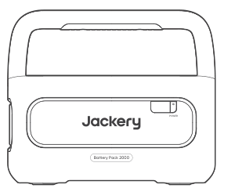
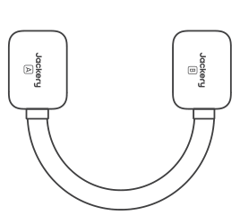
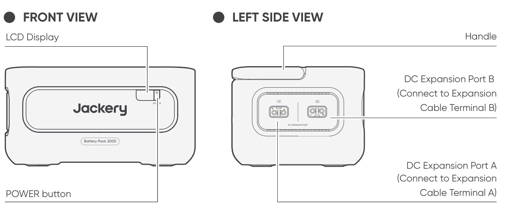
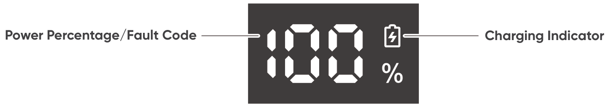
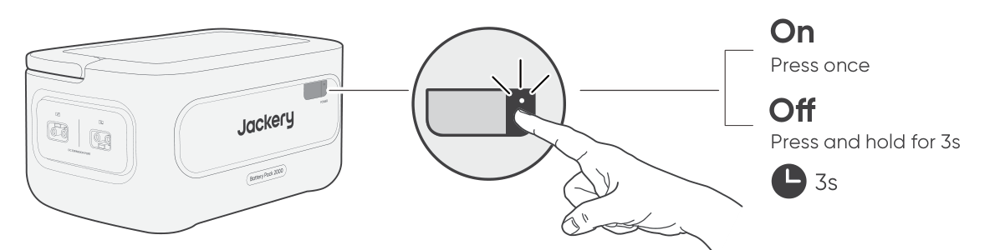
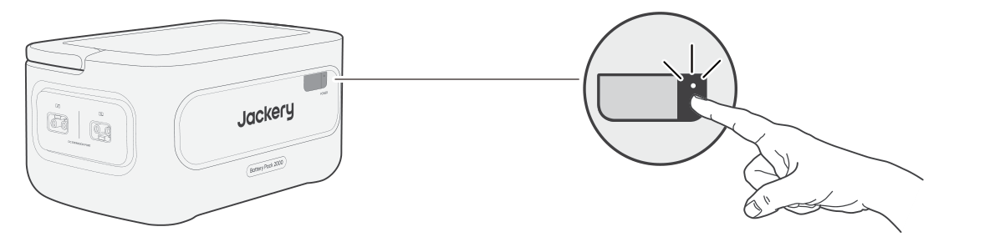
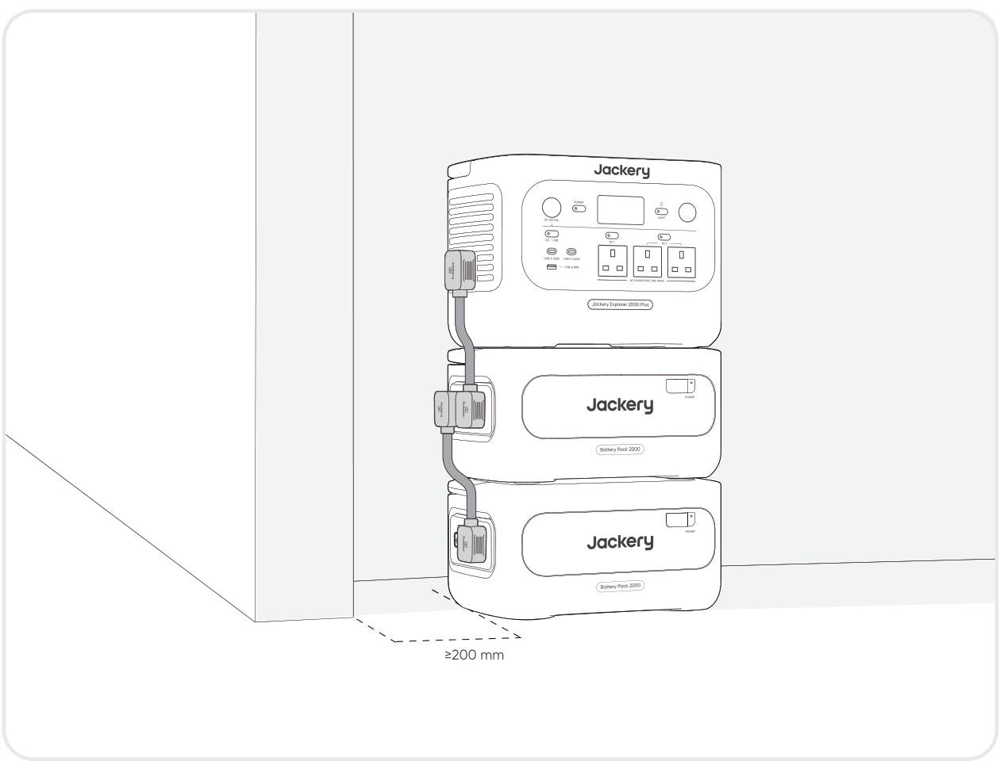
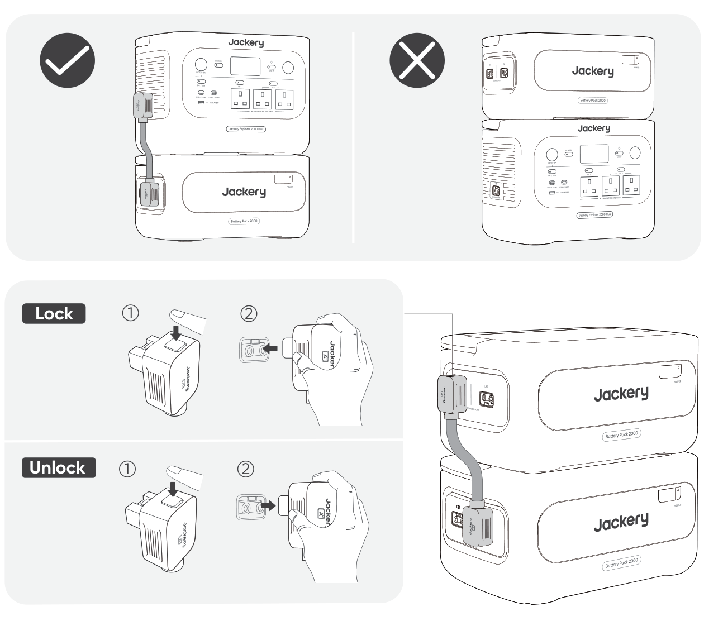
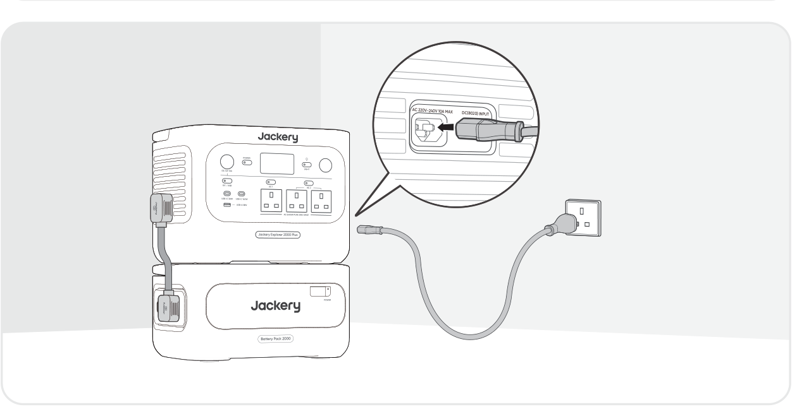
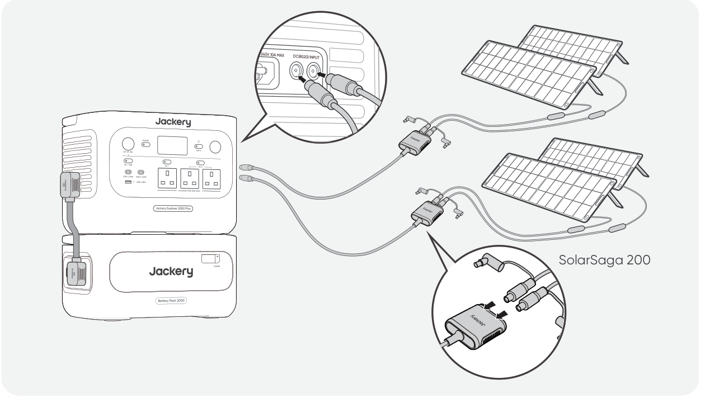

**IMPORTANT**

Congratulations on your new Jackery Battery Pack 2000. Please read this manual carefully before using the product, particularly the relevant precautions to ensure proper use. Keep this manual in an accessible place for future reference.

In compliance with laws and regulations, the right of final interpretation of this document and all related documents of this product resides with the Company. Although every effort has been made to ensure the accuracy of this manual, Jackery assumes no responsibility for any errors that may appear.

Please note that no further notifications will be given in case of any update, revision, or termination. For the latest version of the product manuals, visit support.jackery.com.

\* The images are for reference purposes only. Please refer to the actual product.

<table class="manual-callout-table" style="width:100%; border-collapse:collapse; margin:0 0 16px 0;"><tbody><tr><td class="manual-callout-label" style="width:16%; border:1px solid #000; padding:6px 8px; vertical-align:top;">
<strong>NOTE</strong>
</td><td class="manual-callout-body" style="border:1px solid #000; padding:6px 8px; vertical-align:top;">
This battery pack is compatible with both the Jackery Explorer 2000 Plus and the Jackery Explorer 1000 Plus. Throughout this manual, "the portable power station" refers to either model unless otherwise specified.
</td></tr></tbody></table>

# IMPORTANT SAFETY INFORMATION

The basic safety precautions should be followed when using this product, including:

- Please read all instructions before using this product.

- Close supervision is required when using this product near children to reduce the risk.

- Risk of electric shock may occur when using accessories recommended or sold by non-professional product manufacturers.

- When the product is not in use, please unplug the power plug from the product\'s socket.

- Do not dismantle the product, which may lead to unpredictable risks such as fire, explosion or electric shock.

- Do not use the product through damaged cords or plugs, or damaged output cables, which may cause electric shock.

- Charge the product in a well-ventilated area and do not restrict ventilation in any way.

- Please put the product in a ventilated and dry place to avoid rain and water causing electric shock.

- Do not expose the product to fire or high temperature (under direct sunlight or in a vehicle under high heat), which may cause accidents such as fire or explosion.

- If this product is stored for a long period of time (3 months--6 months) with the power depleted, it may become unchargeable.

# MEANING OF SYMBOLS

| Symbol | Meaning |
|----|----|
| ⚠WARNING | Hazardous practices that may result in severe injury, death, and/or property damage. |
| ⚠CAUTION | Hazardous practices that may result in personal injury and/or property damage. |
| ⚠NOTE | Hazardous practices that may result in equipment damage, data loss, performance deterioration, or unanticipated results. |
| ⚠TIP | Supplements the important information or operation tips in the text. |

|  |  |  |  |
|----|----|----|----|
| **Symbol** | **Meaning** | **Symbol** | **Meaning** |
|  | Warning and Caution Symbols. Alerts individuals to information that must be read to avoid potential hazards or risks. |  | Keep away from children. |
|  | Read the user manual before operation. |  | This symbol indicates that a lithium-ion (Li-ion) battery is inside the product and should be disposed of or recycled properly. |
|  | Do not dismantle the product. |  | This symbol indicates that the product shall not be disposed of as household waste, and should be delivered to a designated collection facility for recycling. Proper disposal and recycling can help protect the environment. For more information about the disposal and recycling of this product, contact your local community, disposal service, or dealer. |
|  | Keep the product away from fire. |  | Batteries and accumulators must not be disposed of with household waste. As a consumer, you are legally required to dispose of all batteries and accumulators at designated collection points, regardless of whether they contain hazardous substances. Please return used batteries and accumulators to a local collection point, recycling center, or to the retailer where they were purchased. Proper disposal ensures environmentally responsible recycling and prevents potential harm to human health and the environment. |

# WHAT\'S IN THE BOX

<figure aria-label="WHAT'S IN THE BOX" class="hb-inbox-composition" data-card-count="3" data-component-id="HB-SPECIAL-INBOX" data-inbox-variant="three-card-responsive"><ol class="hb-inbox-grid"><li class="hb-inbox-card" data-item-number="1">

<strong>Jackery Battery Pack 2000</strong>

</li><li class="hb-inbox-card" data-item-number="2">

<strong>Expansion Cable</strong>

</li><li class="hb-inbox-card" data-item-number="3">

User Manual

</li></ol></figure>

# PRODUCT OVERVIEW

# LCD DISPLAY

<table class="longtable lcd-text-only">
<colgroup>
<col style="width: 8%" />
<col style="width: 12%" />
<col style="width: 28%" />
<col style="width: 52%" />
</colgroup>
<tbody>
<tr>
<td>
1
</td>
<td></td>
<td>
Power Percentage/Fault Code
</td>
<td>The display shows the current power percentage.
When the system fails, it will be displayed as the corresponding fault code F0-FF.</td>
</tr>
<tr>
<td>
2
</td>
<td></td>
<td>
Charging Indicator
</td>
<td>
The indicator is displayed when charging and disappears when it is fully charged.
</td>
</tr>
</tbody>
</table>

# OPERATIONS

## POWER ON/OFF

<table class="manual-callout-table" style="width:100%; border-collapse:collapse; margin:0 0 16px 0;"><tbody><tr><td class="manual-callout-label" style="width:16%; border:1px solid #000; padding:6px 8px; vertical-align:top;">
<strong>NOTE</strong>
</td><td class="manual-callout-body" style="border:1px solid #000; padding:6px 8px; vertical-align:top;">
When using with the portable power station, you can control the power status (on or off) of Jackery Battery Pack 2000 through the main POWER button of the portable power station.

The product will automatically shut down if it is not charged or no loads are connected for 2 hours.

</td></tr></tbody></table>

## LCD DISPLAY ON/OFF

When you press the main POWER button or when charging the product, the LCD display is illuminated. When you press it again, the LCD display will be switched off.

# CONNECTIONS

Up to five battery packs can be used with the portable power station to provide additional capacity.

<table class="manual-callout-table" style="width:100%; border-collapse:collapse; margin:0 0 16px 0;"><tbody><tr><td class="manual-callout-label" style="width:16%; border:1px solid #000; padding:6px 8px; vertical-align:top;">
<strong>CAUTION</strong>
</td><td class="manual-callout-body" style="border:1px solid #000; padding:6px 8px; vertical-align:top;"><ul class="simple">
<li>
Ensure all products are powered off before connecting the portable power station to the Jackery Battery Pack 2000.
</li>
<li>
To ensure proper operation of the product, make sure the air intake and exhaust vents on both sides are unobstructed. Leave at least 200 mm of space between the vents and any objects to allow for proper heat dissipation.
</li>
</ul>
</td></tr></tbody></table>

<table class="manual-callout-table" style="width:100%; border-collapse:collapse; margin:0 0 16px 0;"><tbody><tr><td class="manual-callout-label" style="width:16%; border:1px solid #000; padding:6px 8px; vertical-align:top;">
<strong>NOTES</strong>
</td><td class="manual-callout-body" style="border:1px solid #000; padding:6px 8px; vertical-align:top;"><ul class="simple">
<li>
The display of the connection icon on the LCD screen (the portable power station) signifies a successful connection between the battery pack and the portable power station.
</li>
<li>
Please do not stack the product on the top of the portable power station.
</li>
<li>
Place the battery packs on a flat, stable surface with sufficient load-bearing capacity. The default maximum number of stacked battery packs is 3.
</li>
<li>
If 4 or more battery packs are required, they must be placed in a stable area against a wall, away from external impact, and the necessary anti-tip securing measures must be taken.
</li>
</ul>
</td></tr></tbody></table>

# TROUBLESHOOTING

If any of the following fault codes appear, follow the listed corrective actions to resolve the issue. If the fault persists, please contact Jackery Customer Support.

<figure aria-label="Error Code / Corrective Measures" class="hb-troubleshooting-composition" data-component-id="HB-TABLE-TROUBLESHOOTING" tabindex="0"><table class="hb-troubleshooting-table"><colgroup><col class="hb-troubleshooting-col-code"/><col class="hb-troubleshooting-col-measures"/></colgroup><thead><tr><th class="hb-troubleshooting-code" scope="col">
Error Code
</th><th class="hb-troubleshooting-measures" scope="col">
Corrective Measures
</th></tr></thead><tbody><tr><td class="hb-troubleshooting-code">
F0
</td><td class="hb-troubleshooting-measures">
Restart the product.
</td></tr><tr><td class="hb-troubleshooting-code">
F3
</td><td class="hb-troubleshooting-measures">
Restart the product.
</td></tr><tr><td class="hb-troubleshooting-code">
F4
</td><td class="hb-troubleshooting-measures">
Connect the product to loads to discharge its battery until the fault disappears.
</td></tr><tr><td class="hb-troubleshooting-code">
F5
</td><td class="hb-troubleshooting-measures">
Charge the product via solar panels or AC wall outlet until the fault disappears.
</td></tr><tr><td class="hb-troubleshooting-code">
F8
</td><td class="hb-troubleshooting-measures">
Contact Jackery Customer Support.
</td></tr><tr><td class="hb-troubleshooting-code">
FE
</td><td class="hb-troubleshooting-measures">
Contact Jackery Customer Support.
</td></tr><tr><td class="hb-troubleshooting-code">
FF
</td><td class="hb-troubleshooting-measures">
Place the product in an environment with a proper temperature and wait till the fault disappears.
</td></tr></tbody></table></figure>

# CHARGING

## CHARGING VIA AC WALL OUTLET

To charge the battery pack from an AC wall outlet, connect it to the portable power station.

<table class="manual-callout-table" style="width:100%; border-collapse:collapse; margin:0 0 16px 0;"><tbody><tr><td class="manual-callout-label" style="width:16%; border:1px solid #000; padding:6px 8px; vertical-align:top;">
<strong>WARNING</strong>
</td><td class="manual-callout-body" style="border:1px solid #000; padding:6px 8px; vertical-align:top;">
Ensure all products are powered off before connecting the portable power station to the Jackery Battery Pack 2000.
</td></tr></tbody></table>

## CHARGING VIA SOLAR PANELS (SOLD SEPARATELY)

Charge the battery pack using solar panels and the portable power station, as shown in the figure below. For more information, refer to the user manual for the portable power station.

# STORAGE

Store the product in a dry, clean place with proper ventilation. Storage temperature and humidity:

- 1 month: -20°C to 45°C (0-60%RH)

- 3 months: 0°C to 45°C (0-60%RH)

- 12 months: 0°C to 25°C (0-60%RH)

If this product is stored for a long period of time (3 months - 6 months) with the power depleted, it may become unchargeable. To prevent this and maintain battery health, it is recommended to check and recharge the product every three months and perform a full charge and discharge cycle at least once every 6 to 12 months.

# SPECIFICATIONS

## GENERAL INFO

<figure aria-label="GENERAL INFO" class="hb-spec-table-composition"><table class="hb-spec-table manual-table manual-spec-table"><colgroup><col class="hb-spec-col-label"/><col class="hb-spec-col-value"/></colgroup>
<tbody>
<tr>
<th class="hb-spec-label manual-spec-label" scope="row">Product Name</th>
<td class="hb-spec-value manual-spec-value">Jackery Battery Pack 2000</td>
</tr>
<tr>
<th class="hb-spec-label manual-spec-label" scope="row">Model No.</th>
<td class="hb-spec-value manual-spec-value">JBP-2000B</td>
</tr>
<tr>
<th class="hb-spec-label manual-spec-label" scope="row">Capacity</th>
<td class="hb-spec-value manual-spec-value">2048 Wh (40 Ah/51.2 V ⎓)</td>
</tr>
<tr>
<th class="hb-spec-label manual-spec-label" scope="row">Cell Chemistry</th>
<td class="hb-spec-value manual-spec-value">LiFePO₄</td>
</tr>
<tr>
<th class="hb-spec-label manual-spec-label" scope="row">Weight</th>
<td class="hb-spec-value manual-spec-value">About 14.8 kg</td>
</tr>
<tr>
<th class="hb-spec-label manual-spec-label" scope="row">Dimensions</th>
<td class="hb-spec-value manual-spec-value">36.5 × 25.5 × 19.1 cm</td>
</tr>
<tr>
<th class="hb-spec-label manual-spec-label" scope="row">Cycle Life</th>
<td class="hb-spec-value manual-spec-value">6000 cycles to 70%+ capacity</td>
</tr>
</tbody>
</table></figure>

## INPUT PORTS

<figure aria-label="INPUT PORTS" class="hb-spec-table-composition"><table class="hb-spec-table manual-table manual-spec-table"><colgroup><col class="hb-spec-col-label"/><col class="hb-spec-col-value"/></colgroup>
<tbody>
<tr>
<th class="hb-spec-label manual-spec-label" scope="row">DC Expansion Port (Input)</th>
<td class="hb-spec-value manual-spec-value">36.8V-57.6V⎓75A Max</td>
</tr>
</tbody>
</table></figure>

## OUTPUT PORTS

<figure aria-label="OUTPUT PORTS" class="hb-spec-table-composition"><table class="hb-spec-table manual-table manual-spec-table"><colgroup><col class="hb-spec-col-label"/><col class="hb-spec-col-value"/></colgroup>
<tbody>
<tr>
<th class="hb-spec-label manual-spec-label" scope="row">DC Expansion Port (Output)</th>
<td class="hb-spec-value manual-spec-value">36.8V-57.6V⎓75A Max</td>
</tr>
</tbody>
</table></figure>

## ENVIRONMENTAL OPERATING TEMPERATURE

<figure aria-label="ENVIRONMENTAL OPERATING TEMPERATURE" class="hb-spec-table-composition"><table class="hb-spec-table manual-table manual-spec-table"><colgroup><col class="hb-spec-col-label"/><col class="hb-spec-col-value"/></colgroup>
<tbody>
<tr>
<th class="hb-spec-label manual-spec-label" scope="row">Charge Temperature</th>
<td class="hb-spec-value manual-spec-value">-10°C to 45°C</td>
</tr>
<tr>
<th class="hb-spec-label manual-spec-label" scope="row">Discharge Temperature</th>
<td class="hb-spec-value manual-spec-value">-10°C to 45°C</td>
</tr>
</tbody>
</table></figure>

# WARRANTY

<figure aria-label="WARRANTY" class="hb-warranty-intro-composition" data-component-id="HB-WARRANTY-LEAD">

<strong>This warranty applies only to customers who purchase from the official Jackery website, Jackery-branded third-party platforms, or local authorized dealers.</strong>

*Warranty period and details may vary according to local laws, regulations, and authorized dealers.

</figure>

## Limited Warranty

<figure aria-label="Limited Warranty" class="hb-warranty-card" data-component-id="HB-WARRANTY-SECTION" data-warranty-card-index="1">
Jackery warrants to the original consumer purchaser that the Jackery product will be free from defects in workmanship and material under normal consumer use during the applicable warranty period identified in the 'Warranty Period' section below, subject to the exclusions set forth below.

This warranty statement sets forth Jackery's total and exclusive warranty obligation. We will not assume, nor authorize any person to assume for us, any other liability in connection with the sale of our products.
</figure>

## Warranty Period

<figure aria-label="Warranty Period" class="hb-warranty-period-card" data-component-id="HB-WARRANTY-YEARS">

3
<strong class="hb-warranty-years-unit">YEARS</strong><strong class="hb-warranty-period-label">Standard Warranty</strong>

The standard warranty period for Jackery Battery Pack 2000 is 36 months. In each case, the warranty period is measured starting on the date of purchase by the original consumer purchaser. The sales receipt from the first consumer purchase, or other reasonable documentary proof, is required in order to establish the start date of the warranty period.

2
<strong class="hb-warranty-years-unit">YEARS</strong><strong class="hb-warranty-period-label">Extended Warranty</strong>

To activate the Warranty Extension, you must register your product online or contact our customer service team at <a class="reference external" href="mailto:hello.eu@jackery.com">hello.eu@jackery.com</a> to extend the standard warranty period.

</figure>

## Exchange

<figure aria-label="Exchange" class="hb-warranty-card" data-component-id="HB-WARRANTY-SECTION" data-warranty-card-index="3">
Jackery will replace (at Jackery's expense) any Jackery product that fails to operate during the applicable warranty period due to a defect in workmanship or material. A replacement product assumes the remaining warranty of the original product.
</figure>

## Limited to Original Consumer Buyer

<figure aria-label="Limited to Original Consumer Buyer" class="hb-warranty-card" data-component-id="HB-WARRANTY-SECTION" data-warranty-card-index="4">
The warranty on Jackery's product is limited to the original consumer purchaser and is not transferable to any subsequent owner.
</figure>

## Exclusions

<figure aria-label="Exclusions" class="hb-warranty-card" data-component-id="HB-WARRANTY-SECTION" data-warranty-card-index="5">
Jackery's warranty does not apply to:
<ul class="simple">
<li>
Any product that has been misused, abused, modified, damaged by accident, or used for anything other than normal consumer use as authorized in Jackery's current product literature.
</li>
<li>
Attempted repair by anyone other than an authorized facility.
</li>
<li>
Any product purchased through an online auction house.
</li>
<li>
Jackery's warranty does not apply to the battery cell unless the battery cell is fully charged by you within seven days after you purchase the product and at least once every 6 months thereafter.
</li>
</ul></figure>

## Interpretation Rights

<figure aria-label="Interpretation Rights" class="hb-warranty-card" data-component-id="HB-WARRANTY-SECTION" data-warranty-card-index="6">
Jackery reserves the right to final interpretation of the above customer after-sales policy.
</figure>

# EU REGULATIONS

## RED DECLARATION OF CONFORMITY

Shenzhen Hello Tech Energy Co., Ltd. hereby declares that the Jackery Battery Pack 2000 with Bluetooth and Wi-Fi, model JBP-2000B, complies with the essential requirements and other relevant provisions of RED Directive 2014/53/EU. The full text of the EU declaration of conformity is available at:

<a href="https://de.jackery.com/pages/user-guides" class="reference external">https://de.jackery.com/pages/user-guides</a>

## MANUFACTURER

SHENZHEN HELLO TECH ENERGY CO., LTD.

F2-3, Bldg. 7, Jiaanda Science and Technology Industrial Park Factory, east side of Huafan Road, Tongsheng Community, Dalang Street, Longhua District, Shenzhen, Guangdong, China

+86 400 668 9293

<a href="mailto:sales@hello-tech.com" class="reference external">sales@hello-tech.com</a>

www.hello-tech.com
