# IMPORTANT

Congratulations on your new Jackery FridgeGuard. Please read this manual carefully before using the product, particularly the relevant precautions to ensure proper use. Keep this manual in an accessible place for future reference.

In compliance with laws and regulations, the right of final interpretation of this document and all related documents of this product resides with the Company. Although every effort has been made to ensure the accuracy of this manual, Jackery Inc. assumes no responsibility for any errors that may appear.

Please note that no further notifications will be given in case of any update, revision, or termination. For the latest version of the product manuals, visit support.jackery.com.

- The images are for reference purposes only. Please refer to the actual product.

# IMPORTANT SAFETY INFORMATION

<figure class="hb-symbol-signal-composition hb-safety-instruction"><table class="hb-symbol-signal-table"><colgroup><col style="width:7%"/><col style="width:93%"/></colgroup>
<tbody>
<tr><td>
</td>
<td>
<strong>INSTRUCTIONS PERTAINING TO RISK OF FIRE, ELECTRIC SHOCK, OR INJURY TO PERSONS</strong>
</td>
</tr>
</tbody>
</table></figure>

<table class="manual-two-col-table" style="width:100%; border-collapse:separate; border-spacing:12px 0; margin:0 0 16px 0;">
<colgroup>
<col style="width: 50%" />
<col style="width: 50%" />
</colgroup>
<tbody>
<tr>
<td style="width: 50%; border: none; padding: 0 8px 0 0; vertical-align: top">

<figure class="hb-symbol-signal-composition hb-safety-lead"><table class="hb-symbol-signal-table"><colgroup><col style="width:20%"/><col style="width:80%"/></colgroup>
<tbody>
<tr><td class="hb-symbol-signal-label-cell">
</td>
<td class="hb-symbol-signal-meaning-cell">
<strong>WARNING</strong>

<strong>Always follow these basic precautions when using this product.</strong>

</td>
</tr>
</tbody>
</table></figure>

<ul>
<li>
Read all the instructions before using the product.
</li>
<li>
Do not allow children to play on the product. Close supervision of children is necessary when the product is used near children.
</li>
<li>
Avoid placing hands or fingers inside the product.
</li>
<li>
Stop using the product immediately if it has been physically damaged or modified. Improper use of the product may cause unpredictable behavior, leading to fire, explosion, or injury.
</li>
<li>
If any of the following are observed, including but not limited to overheats, emits unusual odors or smoking, leaks, or burns, stop using the product immediately and contact the dealer or our Customer Support.
</li>
<li>
Never attempt to open, repair, or modify the product. Any tampering, reassembly, or modification of the product can result in electric shock, fire, or battery damage.
</li>
</ul></td>
<td style="width: 50%; border: none; padding: 0 0 0 8px; vertical-align: top"><ul>
<li>
Be aware that liquid ejected from the product may cause irritation or burns. Inappropriate or abusive use may lead to battery leakage. Avoid direct contact with leaking liquid. If the liquid contacts your eyes, seek medical help immediately. If it contacts other body parts, flush with running water and consult a medical professional without delay.
</li>
<li>
Do not expose the product to fire or excessive temperatures. Doing so may result in an explosion if the temperature exceeds 130°C (265°F).
</li>
<li>
Any use of unrecommended or non-supplied materials or parts with the product may result in a risk of fire, electric shock, or personal injury.
</li>
<li>
Do not leave the battery charging unattended for long periods. Always monitor the charging process to ensure safe operation.
</li>
<li>
To reduce the risk of electric shock, unplug the product from any power source before attempting any technical service or troubleshooting.
</li>
</ul></td>
</tr>
</tbody>
</table>

## OPERATING INSTRUCTIONS

<table class="manual-two-col-table" style="width:100%; border-collapse:separate; border-spacing:12px 0; margin:0 0 16px 0;">
<colgroup>
<col style="width: 50%" />
<col style="width: 50%" />
</colgroup>
<tbody>
<tr>
<td style="width: 50%; border: none; padding: 0 8px 0 0; vertical-align: top">
<strong>SAVE THESE INSTRUCTIONS</strong>

<ul>
<li>
Make sure to review your local battery recycling guidelines and find a certified recycling center or collection point near you for defective battery disposal. Never dispose of batteries in regular household waste, as they may leak hazardous chemicals or cause fires.
</li>
<li>
Stop using the product immediately if it shows signs of damage. Discontinue use and contact customer support for assistance.
</li>
<li>
Do not charge the battery in extremely hot or cold environments and strictly adhere to the product's specified operating temperature ranges:

<ul>
<li>
Charging temperature: -4°F to 113°F (-20°C to 45°C )
</li>
<li>
Discharging temperature: -4°F to 113°F (-20°C to 45°C ).
</li>
</ul></li>
<li>
To ensure proper air circulation, keep the product vents uncovered. The area where the product is used must have adequate airflow in a cool, dry environment to prevent overheating.

<ul>
<li>
Charging in damp or poorly ventilated spaces may cause safety hazards.
</li>
<li>
Water can cause short circuits or damage to the charger, leading to safety risks.
</li>
</ul></li>
<li>
Unplug the power cord from a power outlet during a storm.
</li>
<li>
Immediately turn off the product by pressing the power button if it has fallen, been dropped, or exposed to vibrations.
</li>
<li>
Ensure the device(s) are powered off before connecting it to the product.
</li>
<li>
Do not charge the product using a damaged or broken charging cord or plug.
</li>
<li>
Do not use the product to charge any device with a damaged or broken cable or plug.
</li>
<li>
Always unplug the charging cord by pulling the plug, not the cord, to reduce the risk of damage.
</li>
<li>
Ensure the product is properly secured when transporting it in a moving vehicle.
</li>
<li>
DO NOT place the unit upside down or on its side during use or storage.
</li>
<li>
DO NOT place the product on the floor or at a height less than 18 inches (457 mm) above the floor during operation in a workshop or repair facility.
</li>
<li>
DO NOT use the product's accessories with other devices or equipment.
</li>
</ul></td>
<td style="width: 50%; border: none; padding: 0 0 0 8px; vertical-align: top"><ul>
<li>
Solar charge time depends on weather conditions. Place your solar panel where it will get as much direct sunlight as possible.
</li>
<li>
The starting power of a refrigerator compressor typically ranges from three to seven times its rated power. This product is rated with a peak power capacity of 1600W, lasting approximately one second. If the starting power of the connected appliance remains below 1600W, this product can theoretically support its startup requirements. In practice, however, factors such as ambient temperature, equipment age, and brand-specific control strategies may trigger overload protection due to transient current fluctuations—even when power specifications appear compatible. Final compatibility must be verified through testing under actual operating conditions. For applications involving the storage of vaccines or other high-value items, it is recommended to monitor the equipment throughout its initial operation to ensure a stable power supply. The company shall not assume liability for power interruptions resulting from exceeding the product's load or startup capacity, nor for any indirect losses arising therefrom.
</li>
</ul>
<h2 id="grounding-instruction">GROUNDING INSTRUCTION</h2>

This product must be grounded. If it should malfunction or breakdown, grounding provides a path of least resistance for electric current to reduce the risk of electric shock. This product is equipped with a cord having an equipment grounding conductor and a grounding plug. The plug must be plugged into an outlet that is properly installed and grounded in accordance with all local codes ordinances.

<strong>WARNING</strong>

Improper connection of the equipment grounding conductor is able to result in a risk of electric shock. Check with a qualified electrician if you are in doubt as to whether the product is properly grounded. Do not modify the plug provided with the product – if it will not fit the outlet, have a proper outlet installed by a qualified electrician.
</td>
</tr>
</tbody>
</table>

<table class="manual-callout-table" style="width:100%; border-collapse:collapse; margin:0 0 16px 0;"><tbody><tr><td class="manual-callout-label" style="width:16%; border:1px solid #000; padding:6px 8px; vertical-align:top;">
<strong>DANGER</strong>
DANGERCAUTIONWARNINGTIPNOTE</td><td class="manual-callout-body" style="border:1px solid #000; padding:6px 8px; vertical-align:top;">
This device is intended for indoor use only (Please place this device in a similar indoor environment when using it outdoors,e.g. Home RVs, tents, cabins, etc.). ※ This device is not waterproof or dustproof. Keep away from rain and humid environments during use.
</td></tr></tbody></table>

## USER MAINTENANCE INSTRUCTIONS

During the lifecycle of energy storage products, a certain degree of capacity and energy degradation is expected. As the number of charge and discharge cycles increases and storage time extends, this degradation will gradually intensify, which is a normal phenomenon consistent with the natural aging of battery cells.

# MEANING OF SYMBOLS

<figure aria-label="Symbol / Meaning" class="hb-symbol-signal-composition" data-component-id="HB-TABLE-SYMBOL-SIGNAL"><table class="hb-symbol-signal-table"><colgroup><col class="hb-symbol-signal-col-label"/><col class="hb-symbol-signal-col-meaning"/></colgroup><thead><tr><th class="hb-symbol-signal-label-heading" scope="col">
Symbol
</th><th class="hb-symbol-signal-meaning-heading" scope="col">
Meaning
</th></tr></thead><tbody><tr><td class="hb-symbol-signal-label-cell">⚠WARNING</td><td class="hb-symbol-signal-meaning-cell">
Hazardous practices that may result in severe injury, death, and/or property damage.
</td></tr><tr><td class="hb-symbol-signal-label-cell">⚠CAUTION</td><td class="hb-symbol-signal-meaning-cell">
Hazardous practices that may result in personal injury and/or property damage.
</td></tr><tr><td class="hb-symbol-signal-label-cell">NOTE</td><td class="hb-symbol-signal-meaning-cell">
Hazardous practices that may result in equipment damage, data loss, performance deterioration, or unanticipated results.
</td></tr><tr><td class="hb-symbol-signal-label-cell">TIP</td><td class="hb-symbol-signal-meaning-cell">
Supplements the important information or operation tips in the text.
</td></tr></tbody></table></figure>

<figure aria-label="Symbol / Meaning" class="hb-symbol-pair-composition" data-component-id="HB-TABLE-SYMBOL-ICON">

<table class="hb-symbol-panel-table"><colgroup><col class="hb-symbol-col-icon"/><col class="hb-symbol-col-meaning"/></colgroup><thead><tr><th class="hb-symbol-icon-heading" scope="col">
Symbol
</th><th class="hb-symbol-meaning-heading" scope="col">
Meaning
</th></tr></thead><tbody><tr><td class="hb-symbol-icon"></td><td class="hb-symbol-meaning">
Warning and Caution Symbols. Must read to alert individuals to potential hazards or risks.
</td></tr><tr><td class="hb-symbol-icon"></td><td class="hb-symbol-meaning">
Read the user manual before operation.
</td></tr><tr><td class="hb-symbol-icon"></td><td class="hb-symbol-meaning">
Do not dismantle the product.
</td></tr><tr><td class="hb-symbol-icon"></td><td class="hb-symbol-meaning">
Keep the product away from fire.
</td></tr><tr><td class="hb-symbol-icon"></td><td class="hb-symbol-meaning">
Keep away from children.
</td></tr></tbody></table>

<table class="hb-symbol-panel-table"><colgroup><col class="hb-symbol-col-icon"/><col class="hb-symbol-col-meaning"/></colgroup><thead><tr><th class="hb-symbol-icon-heading" scope="col">
Symbol
</th><th class="hb-symbol-meaning-heading" scope="col">
Meaning
</th></tr></thead><tbody><tr><td class="hb-symbol-icon"></td><td class="hb-symbol-meaning">
This symbol indicates that a lithium-ion (Liion) battery is inside the product and should be disposed of or recycled properly.
</td></tr><tr><td class="hb-symbol-icon"></td><td class="hb-symbol-meaning">
This symbol indicates that the product shall not be disposed of as household waste, and should be delivered to a designated collection facility for recycling. Proper disposal and recycling can help protect the environment. For more information about the disposal and recycling of this product, contact your local community, disposal service, or dealer.
</td></tr></tbody></table>

</figure>

# FCC

<figure aria-label="FCC" class="hb-fcc-composition" data-component-id="HB-SPECIAL-FCC">

This device complies with part 15 of the FCC Rules. Operation is subject to the following two conditions:

(1) This device may not cause harmful interference, and

(2) This device must accept any interference received, including interference that may cause undesired operation.

<strong>NOTE:</strong> This equipment has been tested and found to comply with the limits for a Class B digital device, pursuant to part 15 of the FCC Rules. These limits are designed to provide reasonable protection against harmful interference in a residential installation. This equipment generates, uses and can radiate radio frequency energy and, if not installed and used in accordance with the instructions, may cause harmful interference to communications. However, there is no guarantee that radio interference will not occur in a particular installation.

If this equipment does cause harmful interference to radio or television reception, which can be determined by turning the equipment off and on, the user is encouraged to try to correct the interference by one or more of the following measures:
<ul class="simple"><li>
Reorient or relocate the receiving antenna.
</li><li>
Increase the separation between the equipment and receiver.
</li><li>
Connect the equipment into an outlet on a circuit different from that to which the receiver is connected.
</li><li>
Consult the dealer or an experienced radio/TV technician for help.
</li></ul>
<strong>MODIFICATION:</strong> Any changes or modifications not expressly approved by the grantee of this device could void the user’s authority to operate the device.

</figure>

# WHAT\'S IN THE BOX

<figure aria-label="WHAT'S IN THE BOX" class="hb-inbox-composition" data-card-count="4" data-component-id="HB-SPECIAL-INBOX" data-inbox-variant="responsive-card-grid"><ol class="hb-inbox-grid"><li class="hb-inbox-card" data-item-number="1">

<strong>Jackery FridgeGuard</strong>

</li><li class="hb-inbox-card" data-item-number="2">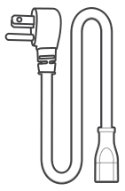

<strong>AC Charging Cable</strong>

</li><li class="hb-inbox-card" data-item-number="3">

<strong>Documents</strong>

</li><li class="hb-inbox-card" data-item-number="4">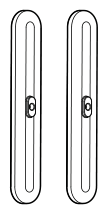

<strong>Vertical Stand</strong>

</li></ol>

<strong>TIP</strong>

The car charging cable is not included but is available for purchase separately on our website. For assistance, please contact Jackery Customer Support.

</figure>

# PRODUCT OVERVIEW

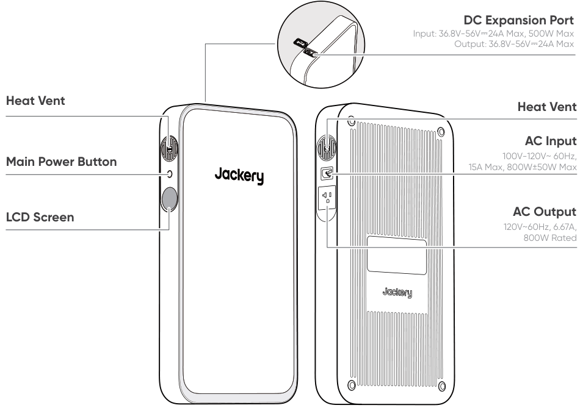

# LCD SCREEN

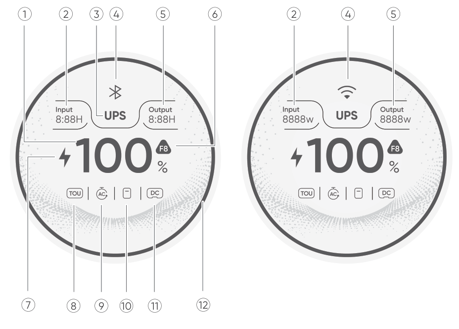

<figure aria-label="LCD icon meanings" class="hb-lcd-table-composition" data-component-id="HB-TABLE-LCD-ICON" tabindex="0"><table class="hb-lcd-icon-table"><colgroup><col class="hb-lcd-col-number"/><col class="hb-lcd-col-icon"/><col class="hb-lcd-col-name"/><col class="hb-lcd-col-description"/></colgroup><tbody><tr><td class="hb-lcd-number">
1
</td><td class="hb-lcd-icon"></td><td class="hb-lcd-name">
Remaining Battery Percentage
</td><td class="hb-lcd-description">
Displays the remaining battery percentage.
</td></tr><tr><td class="hb-lcd-number" rowspan="2">
2
</td><td class="hb-lcd-icon"></td><td class="hb-lcd-name">
Input Power
</td><td class="hb-lcd-description" rowspan="2">
Displays the input power and remaining charging time alternately.
</td></tr><tr><td class="hb-lcd-icon"></td><td class="hb-lcd-name">
Remaining Charge Time
</td></tr><tr><td class="hb-lcd-number">
3
</td><td class="hb-lcd-icon"></td><td class="hb-lcd-name">
UPS
</td><td class="hb-lcd-description">
<strong>On:</strong> The product is in bypass mode, and the switchover time from grid power to the internal battery is 10 ms. <strong>Off:</strong> The product is not in bypass mode.
</td></tr><tr><td class="hb-lcd-number" rowspan="2">
4
</td><td class="hb-lcd-icon"></td><td class="hb-lcd-name">
Wi-Fi
</td><td class="hb-lcd-description">
<strong>On:</strong> Wi-Fi connected. <strong>Blink:</strong> Ready to connect to Wi-Fi. <strong>Off:</strong> Wi-Fi disconnected.
</td></tr><tr><td class="hb-lcd-icon"></td><td class="hb-lcd-name">
Bluetooth
</td><td class="hb-lcd-description">
<strong>On:</strong> Bluetooth connected. <strong>Blink:</strong> Ready to connect to Bluetooth. <strong>Off:</strong> Bluetooth disconnected.
</td></tr><tr><td class="hb-lcd-number" rowspan="2">
5
</td><td class="hb-lcd-icon"></td><td class="hb-lcd-name">
Output Power
</td><td class="hb-lcd-description" rowspan="2">
Displays the output power and remaining discharging time alternately.
</td></tr><tr><td class="hb-lcd-icon">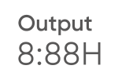</td><td class="hb-lcd-name">
Remaining Discharge Time
</td></tr><tr><td class="hb-lcd-number">
6
</td><td class="hb-lcd-icon"></td><td class="hb-lcd-name">
Fault Code
</td><td class="hb-lcd-description">
A product error has occurred. Please refer to the Troubleshooting section for details.
</td></tr><tr><td class="hb-lcd-number">
7
</td><td class="hb-lcd-icon"></td><td class="hb-lcd-name">
Charging Indicator
</td><td class="hb-lcd-description">
<strong>On:</strong> The Jackery FridgeGuard is in the charging state. <strong>Off:</strong> The Jackery FridgeGuard is not in the charging state.
</td></tr><tr><td class="hb-lcd-number">
8
</td><td class="hb-lcd-icon"></td><td class="hb-lcd-name">
TOU
</td><td class="hb-lcd-description">
<strong>On:</strong> TOU (time-of-use) mode is enabled (default backup SOC: 60%). During peak periods, when the stored energy exceeds the backup SOC, the product prioritizes battery discharge to reduce peak electricity costs. During off-peak periods, the system charges the battery from the grid to achieve peak-shaving and valley-filling. <strong>Off:</strong> TOU mode is disabled. The device does not follow the TOU strategy and operates according to the default power supply and charging logic. Enable/disable this mode in the Jackery App. The setting is retained when the device is powered off.
</td></tr><tr><td class="hb-lcd-number">
9
</td><td class="hb-lcd-icon"></td><td class="hb-lcd-name">
AC Output Delay
</td><td class="hb-lcd-description">
<strong>On:</strong> AC Output Delay mode is enabled. Connected to the AC wall outlet, the device discharges in Bypass Mode. Without AC input, the device pauses discharge and initiates an LCD countdown. Discharge will resume after the countdown ends, unless it is stopped manually beforehand. <strong>Off:</strong> AC Output Delay mode is disabled. Set the AC Output Delay period in the Jackery App.
</td></tr><tr><td class="hb-lcd-number">
10
</td><td class="hb-lcd-icon"></td><td class="hb-lcd-name">
Battery Pack Indicator
</td><td class="hb-lcd-description">
<strong>On:</strong> The battery pack is connected. <strong>Off:</strong> The battery pack is disconnected.
</td></tr><tr><td class="hb-lcd-number">
11
</td><td class="hb-lcd-icon"></td><td class="hb-lcd-name">
DC Input
</td><td class="hb-lcd-description">
<strong>On:</strong> The Jackery DC Input Module is connected. <strong>Off:</strong> The Jackery DC Input Module is disconnected.
</td></tr><tr><td class="hb-lcd-number">
12
</td><td class="hb-lcd-icon"></td><td class="hb-lcd-name">
Battery Power Indicator
</td><td class="hb-lcd-description">
The orange circle indicates the remaining battery level.
</td></tr></tbody></table></figure>

# OPERATIONS

## POWER ON/OFF

<figure class="hb-operation-figure hb-operation-layout-status-right hb-base-art-live-copy" data-component-id="HB-SPECIAL-OPERATION" data-operation-id="main-power" data-source-fragment-sha256="a3570929bf2139e7ea36ff038c274f4e08efbbac5f95c55279841e94dc084469" data-web-base-art-ref="renderers/web/assets/je1000e_sil_us_en/power_art.png" data-web-presentation-mode="base-art-live-copy">

3s

<strong>On</strong>

Press once

<strong>Off</strong>

Press and hold for 3s

<strong>Default standby time:</strong> 12 hours If the Main power button is turned off and there is no charging input or output, the product will automatically shut down after 12 hours.

* The standby time can be set in the Jackery App. Disable this mode when powering low-power loads (&lt;20W), as it may automatically shut down the output.

</figure>

## LCD SCREEN ON/OFF

<figure aria-label="LCD Screen On/Off: Main Power Button location" class="hb-lcd-mode-composition hb-lcd-mode-portrait" data-component-id="HB-TABLE-LCD-MODE">

<table class="hb-lcd-mode-table"><colgroup><col class="hb-lcd-mode-col-state"/><col class="hb-lcd-mode-col-action"/><col class="hb-lcd-mode-col-copy"/></colgroup><tbody><tr><td class="hb-lcd-mode-state" rowspan="3">
Shortly On
</td><td class="hb-lcd-mode-action">
Turn on
</td><td class="hb-lcd-mode-copy">
Press the Main Power Button or when the product is charging.
</td></tr><tr><td class="hb-lcd-mode-action">
Turn off
</td><td class="hb-lcd-mode-copy">
Press the Main Power Button.
</td></tr><tr><td class="hb-lcd-mode-action">
Auto-off
</td><td class="hb-lcd-mode-copy">
The LCD turns off automatically and enters sleep mode after 2 minutes of inactivity.
</td></tr><tr><td class="hb-lcd-mode-state" rowspan="3">
Steady On (in charging or discharging state)
</td><td class="hb-lcd-mode-action">
Turn on
</td><td class="hb-lcd-mode-copy">
Double-press the Main Power Button when the product is powered on.
</td></tr><tr><td class="hb-lcd-mode-action">
Turn off
</td><td class="hb-lcd-mode-copy">
Press the Main Power Button.
</td></tr><tr><td class="hb-lcd-mode-action">
Auto-off
</td><td class="hb-lcd-mode-copy">
The LCD turns off automatically after 2 hours of inactivity.
</td></tr></tbody></table>
</figure>

# UNINTERRUPTIBLE POWER SUPPLY (UPS)

Connect the product to a wall outlet with the AC charging cable, then press the Main Power Button to power your appliances.

<figure class="hb-reference-figure hb-base-art-live-copy" data-component-id="HB-SPECIAL-REFERENCE-FIGURE" data-reference-id="ups-connection" data-source-fragment-sha256="1e969562574e2ed4b02abf219f804607d26e9ad920153be0fa83ec251f5c107f" data-web-base-art-ref="renderers/web/assets/je1000e_sil_us_en/ups_art.png" data-web-presentation-mode="base-art-live-copy" data-web-replace-key="reference.ups-connection">

Step 1Step 2Step 3

</figure>

An Uninterruptible Power Supply (UPS) is a type of continual power system that provides automated backup electric power to a load when the mains grid power fails. In the event of a sudden loss of grid power, the Jackery FridgeGuard will automatically switch to stored power within 10 ms to keep your appliances running. In UPS mode, the unit\'s peak output reaches 800W before power outages. As simultaneous charging/discharging is enabled in Bypass Mode, the actual output power is lower than the rated output power in this mode but returns to rated output power during outages.

<table class="manual-callout-table" style="width:100%; border-collapse:collapse; margin:0 0 16px 0;"><tbody><tr><td class="manual-callout-label" style="width:16%; border:1px solid #000; padding:6px 8px; vertical-align:top;">
<strong>CAUTION</strong>
DANGERCAUTIONWARNINGTIPNOTE</td><td class="manual-callout-body" style="border:1px solid #000; padding:6px 8px; vertical-align:top;">
This product does not support 0 ms switching. Do not connect it to equipment that requires an uninterrupted power supply, such as data servers or workstations.

Before use, please test compatibility with your device multiple times.

It is recommended to connect one device at a time. Do not use multiple devices simultaneously, as this may trigger overload protection.

</td></tr></tbody></table>

<table class="manual-callout-table" style="width:100%; border-collapse:collapse; margin:0 0 16px 0;"><tbody><tr><td class="manual-callout-label" style="width:16%; border:1px solid #000; padding:6px 8px; vertical-align:top;">
<strong>WARNING</strong>
DANGERCAUTIONWARNINGTIPNOTE</td><td class="manual-callout-body" style="border:1px solid #000; padding:6px 8px; vertical-align:top;">
Do not use this product for applications such as data servers or medical devices, where a malfunction could endanger life or cause significant property damage. For the following equipment, a loss of power supply during use could cause serious harm to personal safety or property: · Medical devices and other equipment closely related to life safety. · Critical equipment such as social infrastructure and public services. · Business-critical enterprise equipment, etc. Individuals who wear a cardiac pacemaker (pacemaker implant recipients) must not use this product.
</td></tr></tbody></table>

# INSTALLATION

<table class="manual-callout-table" style="width:100%; border-collapse:collapse; margin:0 0 16px 0;"><tbody><tr><td class="manual-callout-label" style="width:16%; border:1px solid #000; padding:6px 8px; vertical-align:top;">
<strong>CAUTION</strong>
DANGERCAUTIONWARNINGTIPNOTE</td><td class="manual-callout-body" style="border:1px solid #000; padding:6px 8px; vertical-align:top;">
Do not install the product on the non bearing structure, including gypsum board, thermal insulating wall, hollow brick, or the product may fall.

Avoid the electrical wires, water pipes, gas pipes and other facilities inside the walls.

</td></tr></tbody></table>

## VERTICAL STAND

Jackery FridgeGuard installed with the vertical stand can be positioned on the ground. Please follow the installation steps below:

<figure class="hb-reference-figure hb-base-art-live-copy" data-component-id="HB-SPECIAL-REFERENCE-FIGURE" data-reference-id="stand-preparation" data-source-fragment-sha256="262aa6b77c5b442086fe6e8c8d41eaa974ef50677b02e3f83b9737f3b6612577" data-web-base-art-ref="renderers/web/assets/je1000e_sil_us_en/stand_prepare_art.png" data-web-presentation-mode="base-art-live-copy" data-web-replace-key="reference.stand-preparation">

Preparation before installation:

</figure>

<figure class="hb-reference-figure hb-base-art-live-copy" data-component-id="HB-SPECIAL-REFERENCE-FIGURE" data-reference-id="stand-1" data-source-fragment-sha256="f61a9df59444ec017180037681fa8b8b302090f67618b1b2be45dc943b39fe2e" data-web-base-art-ref="renderers/web/assets/je1000e_sil_us_en/stand_1_art.png" data-web-presentation-mode="base-art-live-copy" data-web-replace-key="reference.stand-1">

1. Remove two screws from the bottom of the product.

</figure>

<figure class="hb-reference-figure hb-base-art-live-copy" data-component-id="HB-SPECIAL-REFERENCE-FIGURE" data-reference-id="stand-2" data-source-fragment-sha256="e8b286b42321b639350264c78bd35cdb1b5a19fe0812853ab9fa4560da62b4cb" data-web-base-art-ref="renderers/web/assets/je1000e_sil_us_en/stand_2_art.png" data-web-presentation-mode="base-art-live-copy" data-web-replace-key="reference.stand-2">

2. Align the mounting holes on the bottom of the product with the holes on the vertical stand.

</figure>

<figure class="hb-reference-figure hb-base-art-live-copy" data-component-id="HB-SPECIAL-REFERENCE-FIGURE" data-reference-id="stand-3" data-source-fragment-sha256="27bc5f9464df8da94071282a1631ee122ef5345faa465d86734c9d286508854f" data-web-base-art-ref="renderers/web/assets/je1000e_sil_us_en/stand_3_art.png" data-web-presentation-mode="base-art-live-copy" data-web-replace-key="reference.stand-3">

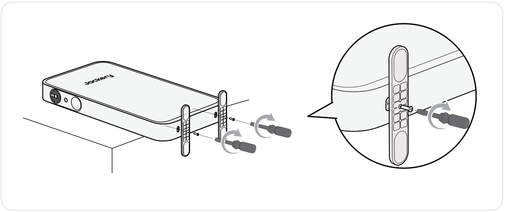3. Tighten the screws.

</figure>

## JACKERY WALL-MOUNTED BRACKET (SOLD SEPARATELY)

Jackery FridgeGuard installed with the mounting bracket can be positioned on the wall. Please follow the installation steps below:

## ON WOODEN WALLS

<figure class="hb-reference-figure hb-base-art-live-copy" data-component-id="HB-SPECIAL-REFERENCE-FIGURE" data-reference-id="wood-prepare" data-source-fragment-sha256="2f42321907ecdca8c7b753d58ee0286e18a4af29ba29e0e498e6abebf784ee67" data-web-base-art-ref="renderers/web/assets/je1000e_sil_us_en/wood_prepare_art.png" data-web-presentation-mode="base-art-live-copy" data-web-replace-key="reference.wood-prepare">

Preparation before installation:<strong>SOLD</strong> <strong>SEPARATELY</strong>

</figure>

<figure class="hb-reference-figure hb-base-art-live-copy" data-component-id="HB-SPECIAL-REFERENCE-FIGURE" data-reference-id="wood-1" data-source-fragment-sha256="0a28cde9dd507dda959d2d0619ae4db68771f9041d39394a3817da15939429f5" data-web-base-art-ref="renderers/web/assets/je1000e_sil_us_en/wood_1_art.png" data-web-presentation-mode="base-art-live-copy" data-web-replace-key="reference.wood-1">

1. Remove two screws from the bottom of the product.

</figure>

<figure class="hb-reference-figure hb-base-art-live-copy" data-component-id="HB-SPECIAL-REFERENCE-FIGURE" data-reference-id="wood-2-3" data-source-fragment-sha256="1071da4a27084e7c42520c51fcb49ca5a93788b6214125aa7936518bee87d59d" data-web-base-art-ref="renderers/web/assets/je1000e_sil_us_en/wood_2_3_art.png" data-web-presentation-mode="base-art-live-copy" data-web-replace-key="reference.wood-2-3">

2. Securely attach the upper and lower mounting brackets to the back of the product.3. Use a stud finder to identify wood studs behind the wall.wood stud

</figure>

<figure class="hb-reference-figure hb-base-art-live-copy" data-component-id="HB-SPECIAL-REFERENCE-FIGURE" data-reference-id="wood-4-5" data-source-fragment-sha256="a2246298c02d9f138f02c788d8731680f7169ce678fcb2e4e7e5e10d1c96a3fb" data-web-base-art-ref="renderers/web/assets/je1000e_sil_us_en/wood_4_5_art.png" data-web-presentation-mode="base-art-live-copy" data-web-replace-key="reference.wood-4-5">

5. Drive the wood screw into the wall at the mounting point, leaving a 2-4mm gap between the screw and the wall.4. Mark the mounting point on the wall.wood studwood stud2~4mm

</figure>

<figure class="hb-reference-figure hb-base-art-live-copy" data-component-id="HB-SPECIAL-REFERENCE-FIGURE" data-reference-id="wood-6" data-source-fragment-sha256="6e9a10c0a9f045c2dd7f63f3d5763e35732149635e01d0469f83b7e68dc7b294" data-web-base-art-ref="renderers/web/assets/je1000e_sil_us_en/wood_6_art.png" data-web-presentation-mode="base-art-live-copy" data-web-replace-key="reference.wood-6">

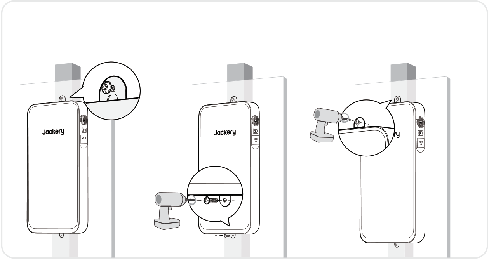6. Hang the product onto the screw vertically. Drive a self tapping screw through the mounting hole in the bottom bracket into the wall and tighten it. Then, fully tighten the wood screw.

</figure>

## ON CONCRETE WALLS

<figure class="hb-reference-figure hb-base-art-live-copy" data-component-id="HB-SPECIAL-REFERENCE-FIGURE" data-reference-id="concrete-prepare" data-source-fragment-sha256="45327406c4357be3a7ea6772644d87eaedbc48b4b205dca8cf6e66238c4bc255" data-web-base-art-ref="renderers/web/assets/je1000e_sil_us_en/concrete_prepare_art.png" data-web-presentation-mode="base-art-live-copy" data-web-replace-key="reference.concrete-prepare">

Preparation before installation:<strong>SOLD</strong> <strong>SEPARATELY</strong>

</figure>

<figure class="hb-reference-figure hb-base-art-live-copy" data-component-id="HB-SPECIAL-REFERENCE-FIGURE" data-reference-id="concrete-1" data-source-fragment-sha256="9fc06c731dd5a531be1a99a97fd3ecdac446e50acfd5ac859da03fee8aa169ff" data-web-base-art-ref="renderers/web/assets/je1000e_sil_us_en/concrete_1_art.png" data-web-presentation-mode="base-art-live-copy" data-web-replace-key="reference.concrete-1">

1. Remove two screws from the bottom of the product.

</figure>

<figure class="hb-reference-figure hb-base-art-live-copy" data-component-id="HB-SPECIAL-REFERENCE-FIGURE" data-reference-id="concrete-2" data-source-fragment-sha256="380bf736060e6344fc1bd30b2170b7c4d9a2385c8852d458b8ed566ae45570a2" data-web-base-art-ref="renderers/web/assets/je1000e_sil_us_en/concrete_2_art.png" data-web-presentation-mode="base-art-live-copy" data-web-replace-key="reference.concrete-2">

2. Securely attach the upper and lower mounting brackets to the back of the product.

</figure>

<figure class="hb-reference-figure hb-base-art-live-copy" data-component-id="HB-SPECIAL-REFERENCE-FIGURE" data-reference-id="concrete-3-4" data-source-fragment-sha256="088b99a71024bcd34333cebdf20c2063097e00e7ac69c533458f38324b64d072" data-web-base-art-ref="renderers/web/assets/je1000e_sil_us_en/concrete_3_4_art.png" data-web-presentation-mode="base-art-live-copy" data-web-replace-key="reference.concrete-3-4">

3. Mark the mounting point on the wall.4. Drill a hole at the mounting point using an 8mm masonry impact drill to a depth of approximately 70mm. Insert an expansion bolt and loosen its nut by 2-4mm.70mm2~4mm8mm

</figure>

<figure class="hb-reference-figure hb-base-art-live-copy" data-component-id="HB-SPECIAL-REFERENCE-FIGURE" data-reference-id="concrete-5-6" data-source-fragment-sha256="64cdd57d44015a259380d2e83681970849d7b8d43dcaf21f5561f267b9950d82" data-web-base-art-ref="renderers/web/assets/je1000e_sil_us_en/concrete_5_6_art.png" data-web-presentation-mode="base-art-live-copy" data-web-replace-key="reference.concrete-5-6">

5. Hang the product onto the expansion bolt vertically and mark the mounting point on the wall.6. Remove the product. Drill a hole at the mounting point and insert an expansion bolt without the nut and washer into the hole.70mm8mm

</figure>

<figure class="hb-reference-figure hb-base-art-live-copy" data-component-id="HB-SPECIAL-REFERENCE-FIGURE" data-reference-id="concrete-7-8" data-source-fragment-sha256="53b6b100fe2b6cc045d322d8cbf7ce69fea33ef1c9c409ed37c1d55a6f20a367" data-web-base-art-ref="renderers/web/assets/je1000e_sil_us_en/concrete_7_8_art.png" data-web-presentation-mode="base-art-live-copy" data-web-replace-key="reference.concrete-7-8">

7. Hang the product onto the upper expansion bolt.8. Lift the product to align the pre-installed bolt and lower it into place. Tighten the nut.

</figure>

# CONNECTIONS

This product can support the battery pack to meet the need for large power capacity. For details on how to use it, please refer to the Jackery Battery Pack User Manual.

<table class="manual-callout-table" style="width:100%; border-collapse:collapse; margin:0 0 16px 0;"><tbody><tr><td class="manual-callout-label" style="width:16%; border:1px solid #000; padding:6px 8px; vertical-align:top;">
<strong>CAUTION</strong>
DANGERCAUTIONWARNINGTIPNOTE</td><td class="manual-callout-body" style="border:1px solid #000; padding:6px 8px; vertical-align:top;">
Ensure all products are powered off before connecting the Jackery Battery Pack to the Jackery FridgeGuard.
</td></tr></tbody></table>

# MAINTENANCE

**Clean the filter regularly:** Remove the silicone cover. Use an M3 cross-head screwdriver to loosen and remove the screw, then take out the plastic piece and the filter for cleaning.

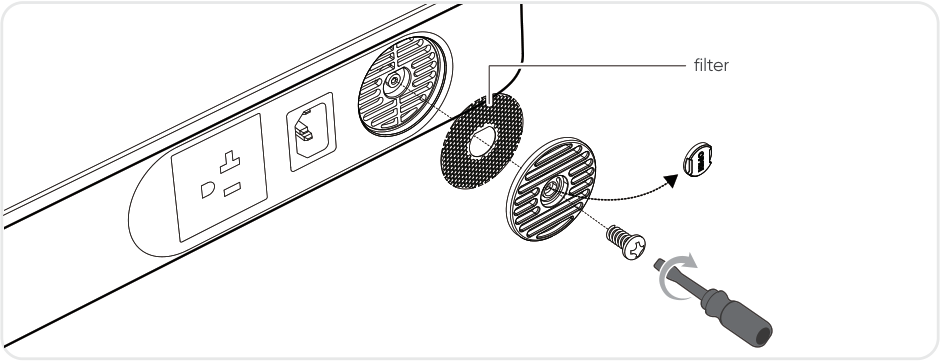

<table class="manual-callout-table" style="width:100%; border-collapse:collapse; margin:0 0 16px 0;"><tbody><tr><td class="manual-callout-label" style="width:16%; border:1px solid #000; padding:6px 8px; vertical-align:top;">
<strong>TIP</strong>
DANGERCAUTIONWARNINGTIPNOTE</td><td class="manual-callout-body" style="border:1px solid #000; padding:6px 8px; vertical-align:top;">
A thorough cleaning is recommended every 3–6 months. If pets are present in the household or the environment is prone to dust, increase the frequency of checks accordingly.

After cleaning, ensure the filter is completely dry before reinstalling it.

</td></tr></tbody></table>

# CHARGING

**Green energy first:** We advocate using the green energy first. This product supports two modes of charging at the same time: solar charging and AC wall charging.

When AC wall charging and solar charging are turned on at the same time, the product will give priority to solar charging and both methods will be used to charge the battery at the maximum permissible power.

**Fully charge the product before its first use.**

<table class="manual-callout-table" style="width:100%; border-collapse:collapse; margin:0 0 16px 0;"><tbody><tr><td class="manual-callout-label" style="width:16%; border:1px solid #000; padding:6px 8px; vertical-align:top;">
<strong>NOTE</strong>
DANGERCAUTIONWARNINGTIPNOTE</td><td class="manual-callout-body" style="border:1px solid #000; padding:6px 8px; vertical-align:top;">
The recommended charging temperature for the product ranges from -4°F to 113°F (-20°C to 45°C), and the discharging temperature ranges from -4°F to 113°F (-20°C to 45°C). Operating the product outside this temperature range may restrict its charging and discharging capabilities, prevent it from charging or discharging.

The charging power and battery capacity of the product may vary due to temperature fluctuations.

</td></tr></tbody></table>

## CHARGING VIA AC WALL OUTLET

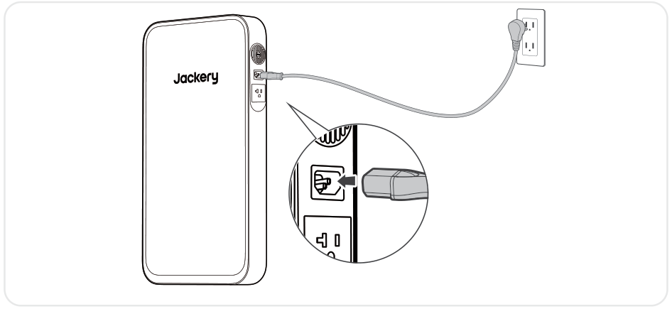

<table class="manual-callout-table" style="width:100%; border-collapse:collapse; margin:0 0 16px 0;"><tbody><tr><td class="manual-callout-label" style="width:16%; border:1px solid #000; padding:6px 8px; vertical-align:top;">
<strong>CAUTION</strong>
DANGERCAUTIONWARNINGTIPNOTE</td><td class="manual-callout-body" style="border:1px solid #000; padding:6px 8px; vertical-align:top;">
Make sure the AC charging cable is fully and securely plugged into the AC input port. An incomplete connection may cause unstable current, overheating, poor contact, or device malfunction.
</td></tr></tbody></table>

## CHARGING VIA SOLAR PANELS

Connected to the Jackery DC Input Module, Jackery FridgeGuard is compatible with the Jackery solar panels. For details on how to use it, please refer to the Jackery DC Input Module User Manual.

<figure class="hb-reference-figure hb-base-art-live-copy" data-component-id="HB-SPECIAL-REFERENCE-FIGURE" data-reference-id="solar-connection" data-source-fragment-sha256="53ae47e92ebfdc1d299c7e11dab6c968180ac04b2aed2991cbd9241903169c61" data-web-base-art-ref="renderers/web/assets/je1000e_sil_us_en/solar_art.png" data-web-presentation-mode="base-art-live-copy" data-web-replace-key="reference.solar-connection">

SolarSaga 500 X※ The solar panels and Jackery DC Input Module are sold separately.

</figure>

It is recommended to use the Jackery solar panel to charge the Jackery FridgeGuard. Ensure that the open-circuit voltage (Voc) of the solar panel falls within the Jackery FridgeGuard\'s DC input voltage range (36.8V-56V). Jackery is not responsible for any losses caused by using solar panels from other brands.

## CHARGING WITH A CAR CHARGER

Connected to the Jackery DC Input Module, Jackery FridgeGuard can be charged by a 12V car charger. Ensure that the car charger and the 12V car power outlet provide a good connection. For details on how to use it, please refer to the Jackery DC Input Module User Manual.

<figure class="hb-reference-figure hb-base-art-live-copy" data-component-id="HB-SPECIAL-REFERENCE-FIGURE" data-reference-id="car-connection" data-source-fragment-sha256="647b77aee9244e3cdd60a4907690cb3493519dd74867f1469ffe497b52f1f42a" data-web-base-art-ref="renderers/web/assets/je1000e_sil_us_en/car_art.png" data-web-presentation-mode="base-art-live-copy" data-web-replace-key="reference.car-connection">

Vehicle※ The car charging cable and Jackery DC Input Module are sold separately.

</figure>

# TROUBLESHOOTING

If any of the following fault codes appear, follow the listed corrective actions to resolve the issue. If the fault persists, please contact Jackery Customer Support.

<figure aria-label="Error Code / Corrective Measures" class="hb-troubleshooting-composition" data-component-id="HB-TABLE-TROUBLESHOOTING" tabindex="0"><table class="hb-troubleshooting-table"><colgroup><col class="hb-troubleshooting-col-code"/><col class="hb-troubleshooting-col-measures"/></colgroup><thead><tr><th class="hb-troubleshooting-code" scope="col">
Error Code
</th><th class="hb-troubleshooting-measures" scope="col">
Corrective Measures
</th></tr></thead><tbody><tr><td class="hb-troubleshooting-code">
F0/F1/F2/F3
</td><td class="hb-troubleshooting-measures">
Restart the product.
</td></tr><tr><td class="hb-troubleshooting-code">
F4
</td><td class="hb-troubleshooting-measures">
Connect the product to loads to discharge its battery until the fault disappears.
</td></tr><tr><td class="hb-troubleshooting-code">
F5
</td><td class="hb-troubleshooting-measures">
Charge the product via solar panels or AC wall outlet until the fault disappears.
</td></tr><tr><td class="hb-troubleshooting-code">
F6
</td><td class="hb-troubleshooting-measures">

1. Wait for the grid to normalize before charging the product via AC wall outlet.

2. Check whether the heat vents are blocked; ensure 0.2 inches (5 cm) clearance on both side of the product.

3. Place the product in a shaded, well-ventilated area where the ambient temperature is below 113°F (45°C).

4. Disconnect all loads from the product, keep it idle and wait until the fault disappears.

5. Restart the product.

</td></tr><tr><td class="hb-troubleshooting-code">
F7
</td><td class="hb-troubleshooting-measures">

1. Remove all DC inputs from the product.

2. If you charge the product via a solar panel, check the open-circuit voltage (Voc) of the connected solar panel. The product allows a maximum DC input voltage of 56V.

3. Restart the product and keep it idle. Wait until the fault disappears.

</td></tr><tr><td class="hb-troubleshooting-code">
F8
</td><td class="hb-troubleshooting-measures">
Contact Jackery Customer Support.
</td></tr><tr><td class="hb-troubleshooting-code">
FC
</td><td class="hb-troubleshooting-measures">

1. Restart the battery pack and the power station, respectively.

2. Disconnect the battery pack from the power station and connect them again.

</td></tr><tr><td class="hb-troubleshooting-code">
FF
</td><td class="hb-troubleshooting-measures">

In high temperature condition:

1. Disconnect all charging and discharging cables to the product (including wall charger, solar panels, car charger, and load devices).

2. Place the product in a shaded, well-ventilated area where the ambient temperature is below 113°F (45°C).

3. Check whether the heat vents are blocked; ensure 0.2 inches (5 cm) clearance on both side of the product.

4. Keep the product idle and wait until the fault disappears.

5. If the fault persists after repeated attempts, please contact the distributor or Jackery Customer Support.

In low temperature condition:

1. Move the product to a warmer environment above 32°F (0°C).

2. Do not use or charge the product outdoors in extremely cold conditions. If necessary, preheat it indoors.

3. If the device is moved indoors from a cold environment, let it sit for a while before use.

4. When the Low Temperature indicator appears, keep the product idle and wait for the system to recover automatically.

5. If the fault persists after repeated attempts, please contact the distributor or Jackery Customer Support.

</td></tr></tbody></table></figure>

# SPECIFICATIONS

## GENERAL INFO

<figure aria-label="GENERAL INFO" class="hb-spec-table-composition"><table class="hb-spec-table manual-table manual-spec-table"><colgroup><col class="hb-spec-col-label"/><col class="hb-spec-col-value"/></colgroup>
<tbody>
<tr>
<th class="hb-spec-label manual-spec-label" scope="row">Product Name</th>
<td class="hb-spec-value manual-spec-value">Jackery FridgeGuard</td>
</tr>
<tr>
<th class="hb-spec-label manual-spec-label" scope="row">Model No.</th>
<td class="hb-spec-value manual-spec-value">JE-1000E-SIL</td>
</tr>
<tr>
<th class="hb-spec-label manual-spec-label" scope="row">Capacity</th>
<td class="hb-spec-value manual-spec-value">20Ah/51.2V DC (1024Wh)</td>
</tr>
<tr>
<th class="hb-spec-label manual-spec-label" scope="row">Cell Chemistry</th>
<td class="hb-spec-value manual-spec-value">LiFePO₄</td>
</tr>
<tr>
<th class="hb-spec-label manual-spec-label" scope="row">Weight</th>
<td class="hb-spec-value manual-spec-value">About 23.2 lbs/10.5 kg</td>
</tr>
<tr>
<th class="hb-spec-label manual-spec-label" scope="row">Dimensions</th>
<td class="hb-spec-value manual-spec-value">23.6 × 12.8 × 2.6 in / 60 × 32.5 × 6.7 cm</td>
</tr>
<tr>
<th class="hb-spec-label manual-spec-label" scope="row">Cycle Life</th>
<td class="hb-spec-value manual-spec-value">6000 cycles to 70%+ capacity</td>
</tr>
</tbody>
</table></figure>

## INPUT PORTS

<figure aria-label="INPUT PORTS" class="hb-spec-table-composition"><table class="hb-spec-table manual-table manual-spec-table"><colgroup><col class="hb-spec-col-label"/><col class="hb-spec-col-value"/></colgroup>
<tbody>
<tr>
<th class="hb-spec-label manual-spec-label" scope="row">AC Input</th>
<td class="hb-spec-value manual-spec-value">100V-120V~ 60Hz, 15A Max, 800W±50W Max</td>
</tr>
<tr>
<th class="hb-spec-label manual-spec-label" scope="row">DC Input</th>
<td class="hb-spec-value manual-spec-value">36.8V-56V⎓24A Max, 500W Max</td>
</tr>
</tbody>
</table></figure>

## OUTPUT PORTS

<figure aria-label="OUTPUT PORTS" class="hb-spec-table-composition"><table class="hb-spec-table manual-table manual-spec-table"><colgroup><col class="hb-spec-col-label"/><col class="hb-spec-col-value"/></colgroup>
<tbody>
<tr>
<th class="hb-spec-label manual-spec-label" scope="row">AC Output</th>
<td class="hb-spec-value manual-spec-value">120V~60Hz, 6.67A, 800W Rated, 1600W Surge peak (-4°F to 113°F / -20°C to 45°C)</td>
</tr>
<tr>
<th class="hb-spec-label manual-spec-label" scope="row">AC Output in Bypass Mode①</th>
<td class="hb-spec-value manual-spec-value">100V-120V~60Hz, 800W Max</td>
</tr>
<tr>
<th class="hb-spec-label manual-spec-label" scope="row">DC Expansion Port</th>
<td class="hb-spec-value manual-spec-value">36.8V-56V⎓24A Max</td>
</tr>
<tr>
<th class="hb-spec-label manual-spec-label" scope="row">Maximum Short Circuit Current and Duration</th>
<td class="hb-spec-value manual-spec-value">1600A/1.25ms</td>
</tr>
</tbody>
</table></figure>

## ENVIRONMENTAL OPERATING TEMPERATURE

<figure aria-label="ENVIRONMENTAL OPERATING TEMPERATURE" class="hb-spec-table-composition"><table class="hb-spec-table manual-table manual-spec-table"><colgroup><col class="hb-spec-col-label"/><col class="hb-spec-col-value"/></colgroup>
<tbody>
<tr>
<th class="hb-spec-label manual-spec-label" scope="row">Charge Temperature</th>
<td class="hb-spec-value manual-spec-value">-4°F to 113°F / -20°C to 45°C</td>
</tr>
<tr>
<th class="hb-spec-label manual-spec-label" scope="row">Discharge Temperature</th>
<td class="hb-spec-value manual-spec-value">-4°F to 113°F / -20°C to 45°C</td>
</tr>
</tbody>
</table></figure>

① The product can charge the battery from the AC wall outlet while delivering power through the AC output ports.

# STORAGE

<figure aria-label="Storage conditions" class="hb-text-panel">

Store the product in a dry, clean place with proper ventilation. Storage temperature and humidity:

<ul>
<li>1 month: -4°F to 113°F / -20°C to 45°C (0-60%RH)</li>
<li>3 months: 32°F to 113°F / 0°C to 45°C (0-60%RH)</li>
<li>12 months: 32°F to 77°F / 0°C to 25°C (0-60%RH)</li>
</ul>

If this product is stored for a long period of time (3 months - 6 months) with the power depleted, it may become unchargeable. To prevent this and maintain battery health, it is recommended to check and recharge the product every three months and perform a full charge and discharge cycle at least once every 6 to 12 months.

</figure>

# WARRANTY

<figure aria-label="WARRANTY" class="hb-warranty-intro-composition" data-component-id="HB-WARRANTY-LEAD">

We only provide our warranty to customers who purchase from the official Jackery website, Jackery-branded third-party platforms, or local authorized dealers.

*Warranty period and details may vary according to local laws, regulations, and authorized dealers.

</figure>

## Limited Warranty

<figure aria-label="Limited Warranty" class="hb-warranty-card" data-component-id="HB-WARRANTY-SECTION" data-warranty-card-index="1">
Jackery Inc. warrants to the original consumer purchaser that the Jackery product will be free from defects in workmanship and material under normal consumer use during the applicable warranty period identified in the 'Warranty Period' section below, subject to the exclusions set forth below.

This warranty statement sets forth Jackery's total and exclusive warranty obligation. We will not assume, nor authorize any person to assume for us, any other liability in connection with the sale of our products.
</figure>

## Warranty Period

<figure aria-label="Warranty Period" class="hb-warranty-period-card" data-component-id="HB-WARRANTY-YEARS">

3
<strong class="hb-warranty-years-unit">YEARS</strong><strong class="hb-warranty-period-label">Standard Warranty</strong>

The standard warranty period for Jackery FridgeGuard is 36 months. In each case, the warranty period is measured starting on the date of purchase by the original consumer purchaser. The sales receipt from the first consumer purchaser, or other reasonable documentary proof, is required in order to establish the start date of the warranty period.

2
<strong class="hb-warranty-years-unit">YEARS</strong><strong class="hb-warranty-period-label">Extended Warranty</strong>

To activate the Warranty Extension, you must register your product online or contact our customer service team at <a class="reference external" href="mailto:hello@jackery.com">hello@jackery.com</a> to extend the standard warranty runtime.

</figure>

## Repair or replacement

<figure aria-label="Repair or replacement" class="hb-warranty-card" data-component-id="HB-WARRANTY-SECTION" data-warranty-card-index="3">
Jackery will repair or replace (at Jackery's expense) any Jackery product that fails to operate during the applicable warranty period due to a defect in workmanship or material. The repaired/replaced product assumes the remaining warranty of the original date of purchase.
</figure>

## Limited to Original Consumer Buyer

<figure aria-label="Limited to Original Consumer Buyer" class="hb-warranty-card" data-component-id="HB-WARRANTY-SECTION" data-warranty-card-index="4">
The warranty on Jackery's product is limited to the original consumer purchaser and is not transferable to any subsequent owner.
</figure>

## Exclusions

<figure aria-label="Exclusions" class="hb-warranty-card" data-component-id="HB-WARRANTY-SECTION" data-warranty-card-index="5">
Jackery's warranty does not apply to:
<ul class="simple">
<li>
Misused, abused, modified, damaged by accident, or used for anything other than normal consumer use as authorized in Jackery's current product literature.
</li>
<li>
Attempted repair by anyone other than an authorized facility.
</li>
<li>
Any product purchased through an online auction house.
</li>
<li>
Jackery's warranty does not apply to the battery cell unless the battery cell is fully charged by you within seven days after you purchase the product and at least once every 6 months thereafter.
</li>
</ul></figure>

## Interpretation Rights

<figure aria-label="Interpretation Rights" class="hb-warranty-card" data-component-id="HB-WARRANTY-SECTION" data-warranty-card-index="6">
Jackery reserves the right to final interpretation of the above customers' after-sales policy.
</figure>

# APP SETUP

## 1. To download the App and log in

<figure aria-label="1. To download the App and log in" class="hb-app-download-composition" data-component-id="HB-SPECIAL-APP">

Search for "Jackery" in Google Play or App Store to install the App. After that, you can register and log in.

Alternatively, scan the QR code below to download and install the App.

</figure>

## 2. To add device

2.1 Click the + button to add your device;

2.2 Press the POWER button on the device to turn on, the Wi-Fi and Bluetooth icons on the device flash to indicate that the device has entered the network configuring mode, tap the "Icon Flashed" button and allow the App to connect to nearby devices and open Bluetooth permissions.

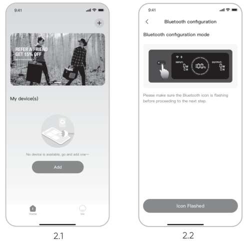 

2.3 After tapping the searched device icon, the App automatically connects the device via Bluetooth.

<table class="manual-callout-table" style="width:100%; border-collapse:collapse; margin:0 0 16px 0;"><tbody><tr><td class="manual-callout-label" style="width:16%; border:1px solid #000; padding:6px 8px; vertical-align:top;">
<strong>NOTE</strong>
DANGERCAUTIONWARNINGTIPNOTE</td><td class="manual-callout-body" style="border:1px solid #000; padding:6px 8px; vertical-align:top;">
If "the device has been bound" is prompted during the binding process, the following two ways can be used for connection:

<ul class="simple">
<li>
The device owner will share this device with other users through the App. • With the device powered off, press and hold the Main Power button for 10 seconds to reset the Wi-Fi and Bluetooth to factory settings, and then re-bind the device.
</li>
</ul>
</td></tr></tbody></table>

2.4 After the device is successfully connected, enter your Wi-Fi password and tap the OK button.

<table class="manual-callout-table" style="width:100%; border-collapse:collapse; margin:0 0 16px 0;"><tbody><tr><td class="manual-callout-label" style="width:16%; border:1px solid #000; padding:6px 8px; vertical-align:top;">
<strong>NOTE</strong>
DANGERCAUTIONWARNINGTIPNOTE</td><td class="manual-callout-body" style="border:1px solid #000; padding:6px 8px; vertical-align:top;">
Please select a Wi-Fi network in 2.4GHz band. The device does not support a Wi-Fi network in 5GHz band.
</td></tr></tbody></table>

2.5 After the device is successfully added on the App, the Wi-Fi icon on the device will be always on.

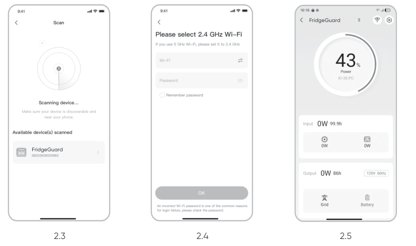

The above screenshots are for reference only.

<table class="manual-callout-table" style="width:100%; border-collapse:collapse; margin:0 0 16px 0;"><tbody><tr><td class="manual-callout-label" style="width:16%; border:1px solid #000; padding:6px 8px; vertical-align:top;">
<strong>NOTE</strong>
DANGERCAUTIONWARNINGTIPNOTE</td><td class="manual-callout-body" style="border:1px solid #000; padding:6px 8px; vertical-align:top;">
The Jackery App can connect to only one power station via Bluetooth at a time. Returning to the device list automatically disconnects Bluetooth. Tap the power station in the list again to reconnect automatically.
</td></tr></tbody></table>

## 3. To unbind the device

Click the Settings icon in the upper right corner of the main interface of the device to enter the settings page, and click the Unbind button at the bottom of the page to unbind the device.

## 4. Notes

**4.1 Wi-Fi and Bluetooth Status**

Wi-Fi and Bluetooth are automatically turned on/off with the device, and the Wi-Fi and Bluetooth icons on the screen light on/off.

**4.2 To reset Wi-Fi and Bluetooth**

With the device powered off, press and hold the Main Power button for 10 seconds to reset the Wi-Fi and Bluetooth to factory settings, and then re-bind the device.
