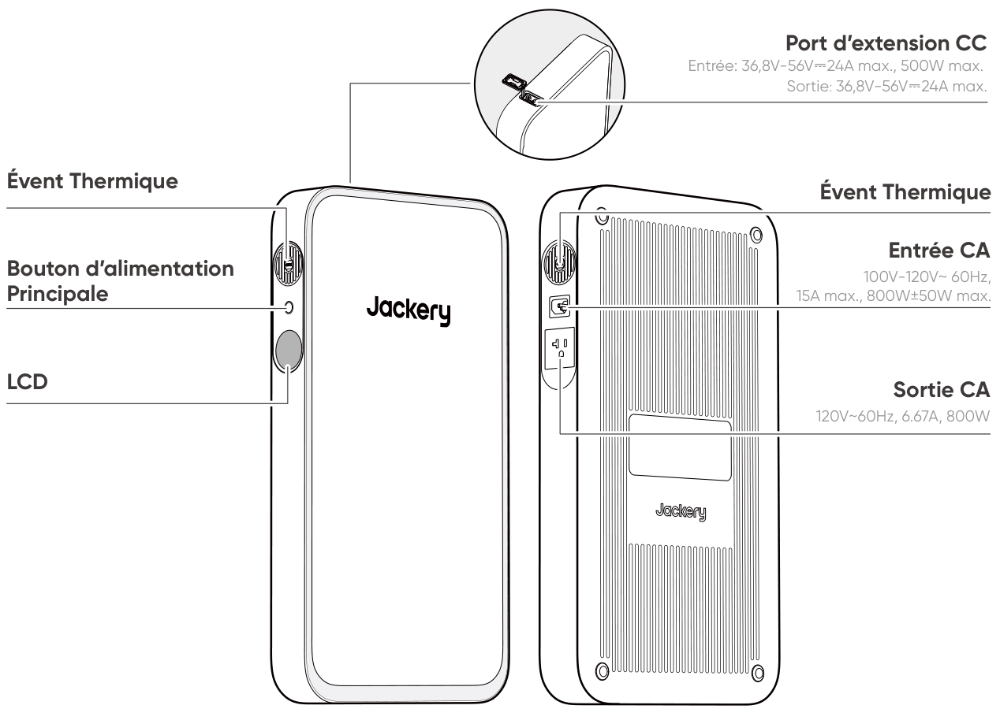
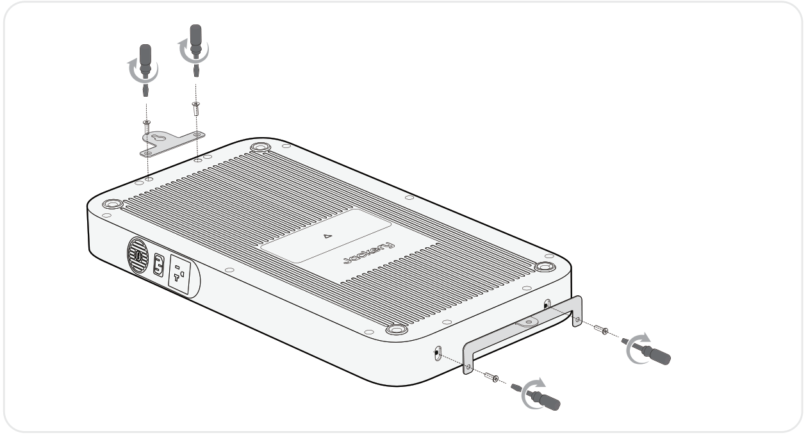
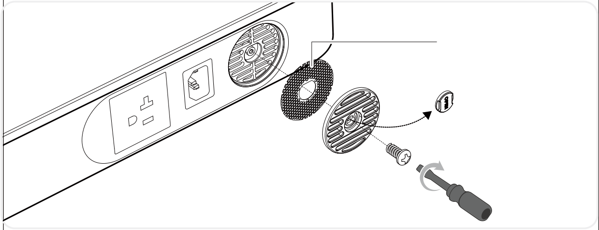
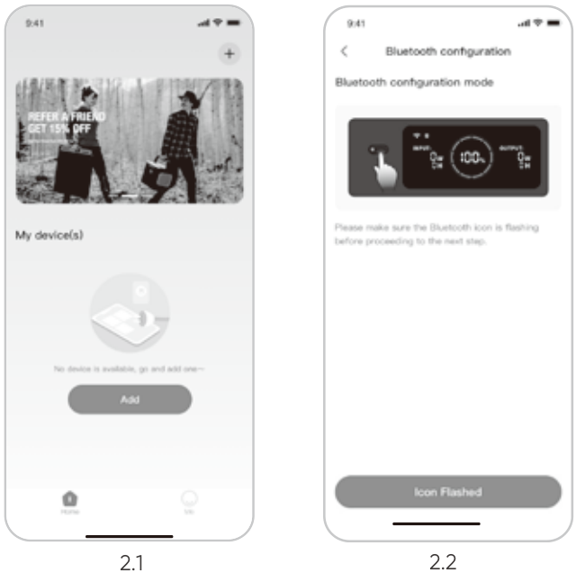
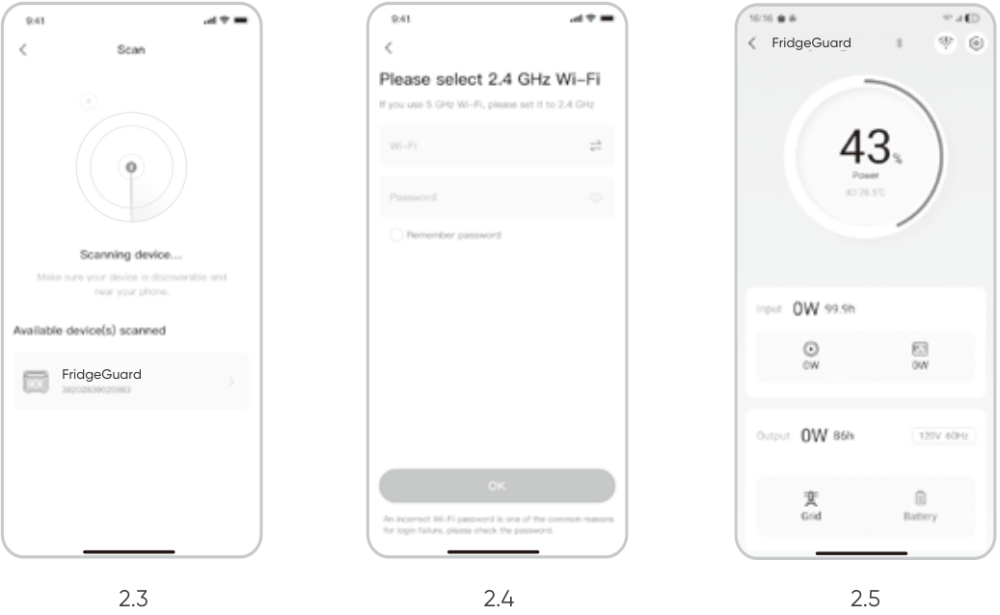

# IMPORTANT

Félicitations pour votre nouveau Jackery FridgeGuard. Veuillez lire attentivement ce manuel avant d\'utiliser le produit, en particulier les précautions à prendre pour garantir une utilisation correcte du produit. Conservez ce manuel dans un endroit accessible pour pouvoir vous y référer ultérieurement.

Conformément aux lois et réglementations en vigueur, le droit d\'interprétation final de ce document et de tous les documents associés à ce produit appartient à l\'entreprise. Bien que tous les efforts aient été déployés pour garantir l\'exactitude de ce manuel, Jackery Inc. n\'assume aucune responsabilité pour les erreurs qui pourraient y figurer.

Veuillez noter qu\'aucune autre notification ne sera faite en cas de mise à jour, de révision ou de résiliation. Pour la dernière version des manuels du produit, consultez support.jackery.com.

- Les chiffres sont donnés à titre indicatif uniquement. Veuillez vous référer au produit réel.

# INFORMATIONS DE SÉCURITÉ IMPORTANTES

<figure class="hb-symbol-signal-composition hb-safety-instruction"><table class="hb-symbol-signal-table"><colgroup><col style="width:7%"/><col style="width:93%"/></colgroup><tbody><tr><td></td><td>
<strong>INSTRUCTIONS CONCERNANT LES RISQUES D’INCENDIE, DE CHOC ÉLECTRIQUE OU DE BLESSURES</strong>
</td></tr></tbody></table></figure>

<table class="manual-two-col-table" style="width:100%; border-collapse:separate; border-spacing:12px 0; margin:0 0 16px 0;">
<colgroup>
<col style="width: 50%" />
<col style="width: 50%" />
</colgroup>
<tbody>
<tr>
<td style="width: 50%; border: none; padding: 0 8px 0 0; vertical-align: top">

<figure class="hb-symbol-signal-composition hb-safety-lead"><table class="hb-symbol-signal-table"><colgroup><col style="width:20%"/><col style="width:80%"/></colgroup><tbody><tr><td class="hb-symbol-signal-label-cell"></td><td class="hb-symbol-signal-meaning-cell">
<strong>AVERTISSEMENT</strong>

<strong>Respectez toujours les précautions suivantes lors de l’utilisation du produit.</strong>
</td></tr></tbody></table></figure>

<ul>
<li>Lisez toutes les instructions avant d’utiliser le produit.</li>
<li>Ne laissez pas les enfants jouer avec du produit. Une surveillance étroite est nécessaire lorsque le produit est utilisé à proximité d’enfants.</li>
<li>Évitez de placer les mains ou les doigts à l’intérieur du produit.</li>
<li>Arrêtez immédiatement d’utiliser le produit s’il a été endommagé physiquement ou modifié. Une mauvaise utilisation peut entraîner un comportement imprévisible, un incendie, une explosion ou des blessures.</li>
<li>Si vous constatez une surchauffe, une odeur inhabituelle, de la fumée, des fuites ou des brûlures, cessez immédiatement l’utilisation et contactez le revendeur ou notre service client.</li>
<li>Ne tentez jamais d’ouvrir, de réparer ou de modifier le produit. Toute altération ou réassemblage peut entraîner un choc électrique, un incendie ou des dommages à la batterie.</li>
</ul></td>
<td style="width: 50%; border: none; padding: 0 0 0 8px; vertical-align: top"><ul>
<li>Soyez conscient que le liquide éjecté peut causer une irritation ou des brûlures. Une mauvaise utilisation peut provoquer des fuites. Évitez tout contact direct. En cas de contact avec les yeux, consultez immédiatement un médecin. En cas de contact avec la peau, rincez abondamment à l’eau claire et consultez un professionnel de santé sans tarder.</li>
<li>N’exposez pas le produit au feu ni à des températures excessives. Une température supérieure à 130°C peut entraîner une explosion.</li>
<li>L’utilisation de pièces non recommandées ou non fournies peut entraîner un risque d’incendie, de choc électrique ou de blessures.</li>
<li>Ne laissez jamais la batterie en charge sans surveillance pendant de longues périodes. Surveillez toujours la charge pour assurer une utilisation sûre.</li>
<li>Pour réduire le risque de choc électrique, débranchez le produit de toute source d’alimentation avant d’effectuer un entretien technique ou un dépannage.</li>
</ul></td>
</tr>
</tbody>
</table>

## INSTRUCTIONS D'UTILISATION

<table class="manual-two-col-table" style="width:100%; border-collapse:separate; border-spacing:12px 0; margin:0 0 16px 0;">
<colgroup>
<col style="width: 50%" />
<col style="width: 50%" />
</colgroup>
<tbody>
<tr>
<td style="width: 50%; border: none; padding: 0 8px 0 0; vertical-align: top"><strong>CONSERVEZ CES INSTRUCTIONS</strong>
<ul>
<li>Cessez immédiatement d’utiliser le produit s’il présente des signes de dommage. Arrêtez l’utilisation et contactez l’assistance clientèle pour obtenir de l’aide.</li>
<li>Ne rechargez pas la batterie dans un environnement extrêmement chaud ou froid, et respectez strictement les plages de températures d’utilisation spécifiées du produit : -Température de charge : -4°F à 113°F (-20°C à 45°C) -Température de décharge : -4°F à 113°F (-20°C à 45°C)</li>
<li>Pour garantir une bonne circulation de l’air, gardez les orifices de ventilation du produit dégagés. Utilisez-le dans un endroit bien aéré, frais et sec pour éviter toute surchauffe.</li>
<li>La charge dans un environnement humide ou mal ventilé peut présenter des risques pour la sécurité.</li>
<li>L’eau peut provoquer des courts-circuits ou endommager le chargeur, entraînant des risques.</li>
<li>Débranchez le cordon d’alimentation de la prise secteur pendant un orage.</li>
<li>Éteignez immédiatement le produit à l’aide du bouton d’alimentation s’il est tombé, a subi un choc ou des vibrations.</li>
<li>Assurez-vous que les appareils sont éteints avant de les connecter au produit.</li>
<li>Ne rechargez pas le produit avec un câble ou une fiche endommagé(e).</li>
<li>N’utilisez pas le produit pour charger un appareil équipé d’un câble ou d’une fiche endommagé(e).</li>
<li>Débranchez toujours le cordon de charge en tirant sur la fiche, jamais sur le câble, afin d’éviter tout dommage.</li>
<li>Veillez à ce que le produit soit correctement fixé lors du transport dans un véhicule en mouvement.</li>
<li>NE placez PAS l’appareil à l’envers ou sur le côté pendant l’utilisation ou le stockage.</li>
<li>NE placez PAS le produit sur le sol ou à une hauteur inférieure à 457 mm (18 pouces) lors de son utilisation dans un atelier ou un centre de réparation.</li>
<li>N’utilisez PAS les accessoires du produit avec d’autres appareils ou équipements.</li>
<li>Le temps de charge solaire dépend des conditions météorologiques. Placez le panneau solaire dans un endroit exposé au soleil direct autant que possible.</li>
</ul></td>
<td style="width: 50%; border: none; padding: 0 0 0 8px; vertical-align: top"><ul>
<li>La puissance de démarrage d’un compresseur de réfrigérateur varie généralement entre trois et sept fois sa puissance nominale. Ce produit est évalué avec une capacité de puissance de pointe de 1600 W, pendant environ une seconde. Si la puissance de démarrage de l’appareil connecté reste inférieure à 1600 W, ce produit peut théoriquement répondre à ses exigences de démarrage. En pratique, toutefois, des facteurs tels que la température ambiante, l’âge de l’équipement et les stratégies de contrôle propres à la marque peuvent déclencher la protection contre les surcharges en raison de fluctuations de courant transitoires, même lorsque les spécifications de puissance semblent compatibles. La compatibilité finale doit être vérifiée par des tests dans des conditions réelles d’utilisation. Pour les applications impliquant le stockage de vaccins ou d’autres articles de grande valeur, il est recommandé de surveiller l’équipement lors de sa mise en marche initiale afin d’assurer une alimentation stable. L’entreprise n’assume aucune responsabilité pour les interruptions d’alimentation résultant d’un dépassement de la charge ou de la capacité de démarrage du produit, ni pour toute perte indirecte en découlant.</li>
</ul>
<h2 id="instruction-de-mise-à-la-terre">INSTRUCTION DE MISE À LA TERRE</h2>
<ul>
<li>Ce produit doit être mis à la terre. En cas de dysfonctionnement ou de panne, la mise à la terre fournit un chemin de moindre résistance au courant électrique afin de réduire le risque de choc électrique. Ce produit est équipé d'un cordon avec un conducteur de mise à la terre et d'une fiche de mise à la terre. La fiche doit être branchée dans une prise correctement installée et mise à la terre conformément à tous les codes et règlements locaux.</li>
</ul>
<strong>AVERTISSEMENT</strong>
<ul>
<li>Une connexion incorrecte du conducteur de mise à la terre peut entraîner un risque de choc électrique. Consultez un électricien qualifié si vous avez des doutes quant à la mise à la terre correcte du produit. Ne modifiez pas la fiche fournie avec le produit – si elle ne correspond pas à la prise, faites installer une prise appropriée par un électricien qualifié.</li>
</ul></td>
</tr>
</tbody>
</table>

<table class="manual-callout-table" style="width:100%; border-collapse:collapse; margin:0 0 16px 0;"><tbody><tr><td class="manual-callout-label" style="width:16%; border:1px solid #000; padding:6px 8px; vertical-align:top;">
<strong>AVERTISSEMENT</strong>
AVERTISSEMENTATTENTIONCONSEILSREMARQUE</td><td class="manual-callout-body" style="border:1px solid #000; padding:6px 8px; vertical-align:top;">
Cet appareil est destiné à un usage intérieur uniquement (veuillez placer cet appareil dans un environnement intérieur similaire lors de son utilisation à l’extérieur, par exemple dans des VR résidentiels, des tentes, des chalets, etc.). ※ Cet appareil n’est pas étanche ni résistant à la poussière. Éloignez-le de la pluie et des environnements humides pendant son utilisation.
</td></tr></tbody></table>

## INSTRUCTIONS D'ENTRETIEN PAR L'UTILISATEUR

Au cours du cycle des produits de stockage d'énergie, une certaine dégradation de la capacité et de l'énergie se produira. À mesure que le nombre de cycles d'utilisation augmente et que la durée de stockage s'allonge, cette dégradation s'intensifiera progressivement, ce qui est un phénomène normal conforme au modèle de vieillissement naturel des cellules de batterie.

# SIGNIFICATION DES SYMBOLES

<figure aria-label="Symbole / Signification" class="hb-symbol-signal-composition" data-component-id="HB-TABLE-SYMBOL-SIGNAL"><table class="hb-symbol-signal-table"><colgroup><col class="hb-symbol-signal-col-label"/><col class="hb-symbol-signal-col-meaning"/></colgroup><thead><tr><th class="hb-symbol-signal-label-heading" scope="col">
Symbole
</th><th class="hb-symbol-signal-meaning-heading" scope="col">
Signification
</th></tr></thead><tbody><tr><td class="hb-symbol-signal-label-cell">⚠AVERTISSEMENT</td><td class="hb-symbol-signal-meaning-cell">
Pratiques dangereuses pouvant entraîner des blessures graves, la mort et/ou des dommages matériels.
</td></tr><tr><td class="hb-symbol-signal-label-cell">⚠ATTENTION</td><td class="hb-symbol-signal-meaning-cell">
Pratiques dangereuses pouvant entraîner des blessures corporelles et/ou des dommages matériels.
</td></tr><tr><td class="hb-symbol-signal-label-cell">REMARQUE</td><td class="hb-symbol-signal-meaning-cell">
Pratiques dangereuses pouvant entraîner des dommages à l'équipement, une perte de données, une détérioration des performances ou des résultats inattendus.
</td></tr><tr><td class="hb-symbol-signal-label-cell">CONSEILS</td><td class="hb-symbol-signal-meaning-cell">
Complémente les informations importantes ou les conseils d'utilisation dans le texte.
</td></tr></tbody></table></figure>

<figure aria-label="Symbole / Signification" class="hb-symbol-pair-composition" data-component-id="HB-TABLE-SYMBOL-ICON">

<table class="hb-symbol-panel-table"><colgroup><col class="hb-symbol-col-icon"/><col class="hb-symbol-col-meaning"/></colgroup><thead><tr><th class="hb-symbol-icon-heading" scope="col">
Symbole
</th><th class="hb-symbol-meaning-heading" scope="col">
Signification
</th></tr></thead><tbody><tr><td class="hb-symbol-icon"></td><td class="hb-symbol-meaning">
Mlise en garde! Le non-respect des messages d’avertissement peut entraîner des blessures.
</td></tr><tr><td class="hb-symbol-icon"></td><td class="hb-symbol-meaning">
Lire le manuel de l’opérateur
</td></tr><tr><td class="hb-symbol-icon"></td><td class="hb-symbol-meaning">
Ne démontez pas le produit.
</td></tr><tr><td class="hb-symbol-icon"></td><td class="hb-symbol-meaning">
Ne pas fumer ni utiliser de flamme nue
</td></tr><tr><td class="hb-symbol-icon"></td><td class="hb-symbol-meaning">
Les enfants ne sont pas admis
</td></tr></tbody></table>

<table class="hb-symbol-panel-table"><colgroup><col class="hb-symbol-col-icon"/><col class="hb-symbol-col-meaning"/></colgroup><thead><tr><th class="hb-symbol-icon-heading" scope="col">
Symbole
</th><th class="hb-symbol-meaning-heading" scope="col">
Signification
</th></tr></thead><tbody><tr><td class="hb-symbol-icon"></td><td class="hb-symbol-meaning">
Ce symbole indique que le produit contient une batterie lithium-ion (Li-ion), qui doit être éliminée ou recyclée de manière appropriée.
</td></tr><tr><td class="hb-symbol-icon"></td><td class="hb-symbol-meaning">
Ce symbole indique que le produit ne doit pas être jeté avec les ordures ménagères. Il doit être apporté à un point de collecte désigné pour un recyclage approprié. Une élimination et un recyclage corrects contribuent à la protection de l’environnement. Pour plus d’informations, veuillez contacter votre autorité locale, le service de gestion des déchets ou le revendeur du produit.
</td></tr></tbody></table>

</figure>

# FCC

<figure aria-label="FCC" class="hb-fcc-composition" data-component-id="HB-SPECIAL-FCC">

Cet appareil est conforme à la partie 15 des règles de la FCC. Son fonctionnement est soumis aux deux conditions suivantes : (1) cet appareil ne doit pas causer d’interférences nuisibles, et (2) cet appareil doit accepter toute interférence reçue, y compris les interférences pouvant entraîner un fonctionnement indésirable.

<strong>REMARQUE :</strong> Cet équipement a été testé et déclaré conforme aux limites concernant les appareils numériques de classe B, conformément à la partie 15 du règlement de la FCC. Ces limites sont conçues pour offrir une protection raisonnable contre les interférences dangereuses dans le cadre d’une installation résidentielle. Cet équipement génère, utilise et émet des ondes radios qui peuvent, si cet équipement n’est pas installé et utilisé conformément aux instructions, perturber les communications radios. Toutefois, il n’y a aucune garantie qu’aucune interférence ne se produise lors d’une installation particulière.

Si cet équipement trouble la réception de la radio ou de la télévision, ce qui peut être déterminé en éteignant et en allumant cet équipement, l’utilisateur est encouragé à tenter de corriger ces interférences en essayant une ou plusieurs des mesures suivantes :
<ul class="simple"><li>
Réorientez ou déplacez l’antenne de réception.
</li><li>
Éloignez l’équipement du récepteur.
</li><li>
Connectez l’équipement à une prise d’un autre circuit que celui auquel le récepteur est connecté.
</li><li>
Consultez le revendeur ou bien demandez de l’aide à un technicien de radio/télévision expérimenté.
</li></ul>
<strong>MODIFICATION :</strong> Tout changement ou modification non expressément approuvé par le titulaire de cet appareil pourrait annuler l’autorisation de l’utilisateur à utiliser l’appareil.

</figure>

# CONTENU DE LA BOÎTE

<figure aria-label="CONTENU DE LA BOÎTE" class="hb-inbox-composition" data-card-count="4" data-component-id="HB-SPECIAL-INBOX" data-inbox-variant="responsive-card-grid"><ol class="hb-inbox-grid"><li class="hb-inbox-card" data-item-number="1">

<strong>Jackery FridgeGuard</strong>

</li><li class="hb-inbox-card" data-item-number="2">

<strong>Câble de charge CA</strong>

</li><li class="hb-inbox-card" data-item-number="3">

<strong>Documents</strong>

</li><li class="hb-inbox-card" data-item-number="4">

<strong>Support Vertical</strong>

</li></ol>

<strong>CONSEILS</strong>

Le câble de chargement pour voiture n’est pas inclus, mais peut être acheté séparément sur notre site Web. Pour obtenir de l’aide, veuillez contacter le service à la clientèle de Jackery.

</figure>

# APERÇU DU PRODUIT

# AFFICHAGE LCD

<figure aria-label="LCD icon meanings" class="hb-lcd-table-composition" data-component-id="HB-TABLE-LCD-ICON" tabindex="0"><table class="hb-lcd-icon-table"><colgroup><col class="hb-lcd-col-number"/><col class="hb-lcd-col-icon"/><col class="hb-lcd-col-name"/><col class="hb-lcd-col-description"/></colgroup><tbody><tr><td class="hb-lcd-number">
1
</td><td class="hb-lcd-icon"></td><td class="hb-lcd-name">
Pourcentage de Batterie Restant
</td><td class="hb-lcd-description">
Affiche le pourcentage de batterie restant.
</td></tr><tr><td class="hb-lcd-number" rowspan="2">
2
</td><td class="hb-lcd-icon"></td><td class="hb-lcd-name">
Puissance d’Entrée
</td><td class="hb-lcd-description" rowspan="2">
Affiche alternativement la puissance d'entrée et le temps de charge restant.
</td></tr><tr><td class="hb-lcd-icon"></td><td class="hb-lcd-name">
Temps de Charge Restant
</td></tr><tr><td class="hb-lcd-number">
3
</td><td class="hb-lcd-icon"></td><td class="hb-lcd-name">
UPS
</td><td class="hb-lcd-description">
Allumé : Le produit est en mode bypass, durant lequel le temps de commutation de l'alimentation électrique du réseau à la batterie est de 10 ms. Éteint : Le produit n'est pas en mode bypass.
</td></tr><tr><td class="hb-lcd-number" rowspan="2">
4
</td><td class="hb-lcd-icon"></td><td class="hb-lcd-name">
Wi-Fi
</td><td class="hb-lcd-description">
Allumé : Wi-Fi connecté. Clignotant : Prêt à se connecter au Wi-Fi. Éteint : Wi-Fi déconnecté.
</td></tr><tr><td class="hb-lcd-icon"></td><td class="hb-lcd-name">
Bluetooth
</td><td class="hb-lcd-description">
Allumé : Bluetooth connecté. Clignotant : Prêt à se connecter au Bluetooth. Éteint : Bluetooth déconnecté.
</td></tr><tr><td class="hb-lcd-number" rowspan="2">
5
</td><td class="hb-lcd-icon"></td><td class="hb-lcd-name">
Puissance de Sortie
</td><td class="hb-lcd-description" rowspan="2">
Affiche alternativement la puissance de sortie et le temps de décharge restant.
</td></tr><tr><td class="hb-lcd-icon"></td><td class="hb-lcd-name">
Temps de Décharge Restant
</td></tr><tr><td class="hb-lcd-number">
6
</td><td class="hb-lcd-icon"></td><td class="hb-lcd-name">
Code d’erreur
</td><td class="hb-lcd-description">
Une erreur produit s’est produite. Veuillez consulter la section « Dépannage » pour plus de détails.
</td></tr><tr><td class="hb-lcd-number">
7
</td><td class="hb-lcd-icon"></td><td class="hb-lcd-name">
Indicateur de charge
</td><td class="hb-lcd-description">
Allumé : Le Jackery FridgeGuard est en cours de charge. Éteint : Le Jackery FridgeGuard n'est pas en cours de charge.
</td></tr><tr><td class="hb-lcd-number">
8
</td><td class="hb-lcd-icon"></td><td class="hb-lcd-name">
Mode TOU
</td><td class="hb-lcd-description">
Activé : Le mode TOU est activé (SOC de secours par défaut : 60 %). Pendant les heures de pointe, le produit privilégie la décharge de la batterie afin de réduire les coûts liés à la consommation en période de pointe, lorsque l’énergie stockée dépasse le SOC de réserve. Pendant les heures creuses, le système recharge la batterie à partir du réseau afin de réaliser l’écrêtage des pics et le remplissage des creux. Désactivé : Le mode TOU est désactivé. L’appareil ne suit pas la stratégie TOU (heures pleines / heures creuses) et fonctionne selon la logique d’alimentation et de charge par défaut. Veuillez activer/désactiver cette fonction dans l’application. Le réglage est conservé lorsque l’appareil est mis hors tension.
</td></tr><tr><td class="hb-lcd-number">
9
</td><td class="hb-lcd-icon"></td><td class="hb-lcd-name">
Délai de sortie CA
</td><td class="hb-lcd-description">
Allumé: le mode de délai de sortie CA est activé. Branché à la prise murale CA, l'appareil se décharge en mode Bypass. Sans entrée CA, l'appareil interrompt la décharge et lance un compte à rebours sur l'écran LCD. La décharge reprendra à la fin du compte à rebours, sauf si elle est arrêtée manuellement avant. Éteint: le mode de délai de sortie CA est désactivé. Définissez la période de délai de sortie CA dans l'application Jackery.
</td></tr><tr><td class="hb-lcd-number">
10
</td><td class="hb-lcd-icon"></td><td class="hb-lcd-name">
Indicateur du bloc-piles
</td><td class="hb-lcd-description">
Allumé : Le bloc-piles est connecté. Éteint : Le bloc-piles est déconnecté.
</td></tr><tr><td class="hb-lcd-number">
11
</td><td class="hb-lcd-icon"></td><td class="hb-lcd-name">
Entrée CC
</td><td class="hb-lcd-description">
Activé : Le module d'entrée CC Jackery est connecté. Désactivé : Le module d'entrée CC Jackery est déconnecté.
</td></tr><tr><td class="hb-lcd-number">
12
</td><td class="hb-lcd-icon"></td><td class="hb-lcd-name">
Indicateur de Puissance de la Batterie
</td><td class="hb-lcd-description">
Le cercle orange indique le niveau de batterie restant.
</td></tr></tbody></table></figure>

# FONCTIONNEMENT

## MARCHE/ARRÊT

<figure class="hb-operation-figure hb-operation-layout-status-right hb-base-art-live-copy" data-component-id="HB-SPECIAL-OPERATION" data-operation-id="main-power" data-source-fragment-sha256="8414f12ece1cb71724b13f919878330e124068eabe6815e7e94d4562f80f0ffd" data-web-base-art-ref="renderers/web/assets/je1000e_sil_us_en/power_art.png" data-web-presentation-mode="base-art-live-copy">

3s

<strong>Marche</strong>

Appuyez une fois

<strong>Arrêt</strong>

Appuyez et maintenez pendant 3 secondes

Temps de veille par défaut: 2 heures Si le bouton d'alimentation est éteint et qu'il n'y a pas d'entrée ou de sortie de charge, le produit s'éteindra automatiquement après 2 heures.

* Le temps de veille peut être réglé dans l’application Jackery.

</figure>

## AFFICHAGE LCD MARCHE/ARRÊT

<figure aria-label="LCD Screen On/Off: Main Power Button location" class="hb-lcd-mode-composition hb-lcd-mode-portrait" data-component-id="HB-TABLE-LCD-MODE">

<table class="hb-lcd-mode-table"><colgroup><col class="hb-lcd-mode-col-state"/><col class="hb-lcd-mode-col-action"/><col class="hb-lcd-mode-col-copy"/></colgroup><tbody><tr><td class="hb-lcd-mode-state" rowspan="3">
Allumer en discontinu
</td><td class="hb-lcd-mode-action">
Allumer
</td><td class="hb-lcd-mode-copy">
Appuyez sur le bouton d'alimentation principal ou lorsque le produit est en charge.
</td></tr><tr><td class="hb-lcd-mode-action">
Éteindre
</td><td class="hb-lcd-mode-copy">
Appuyez sur le bouton d'alimentation principal.
</td></tr><tr><td class="hb-lcd-mode-action">
Arrêt automatique
</td><td class="hb-lcd-mode-copy">
L'écran LCD s'éteint automatiquement et entre en mode veille après 2 minutes d'inactivité.
</td></tr><tr><td class="hb-lcd-mode-state" rowspan="3">
Allumer en continu (en cours de charge ou de décharge)
</td><td class="hb-lcd-mode-action">
Allumer
</td><td class="hb-lcd-mode-copy">
Appuyez deux fois sur le bouton d'alimentation principal lorsque le produit est allumé.
</td></tr><tr><td class="hb-lcd-mode-action">
Éteindre
</td><td class="hb-lcd-mode-copy">
Appuyez sur le bouton d'alimentation principal.
</td></tr><tr><td class="hb-lcd-mode-action">
Arrêt automatique
</td><td class="hb-lcd-mode-copy">
Le mode Allumer en continu s'éteint automatiquement après 2 heures d'inactivité.
</td></tr></tbody></table>
</figure>

# ALIMENTATION SANS INTERRUPTION (ASI)

Connectez le produit à une prise murale à l'aide du câble de charge CA, puis appuyez sur le bouton de sortie CA pour alimenter vos appareils en même temps.

<figure class="hb-reference-figure hb-base-art-live-copy" data-component-id="HB-SPECIAL-REFERENCE-FIGURE" data-reference-id="ups-connection" data-source-fragment-sha256="5f91758fd2f6ce34b6aadf0b69fc5c22ffb8420aef7bd411faa3d64c2389896b" data-web-base-art-ref="renderers/web/assets/je1000e_sil_us_en/ups_art.png" data-web-presentation-mode="base-art-live-copy" data-web-replace-key="reference.ups-connection">

123

</figure>

Une alimentation sans coupure (UPS) est un système d'alimentation continue qui fournit automatiquement une alimentation électrique de secours à une charge lorsque l'alimentation du réseau principal est interrompue.

En cas de perte soudaine de l'alimentation du réseau, le Jackery FridgeGuard basculera automatiquement sur l'alimentation stockée en moins de 10 ms pour maintenir vos appareils en fonctionnement.

En mode UPS, la puissance de crête de sortie de l'appareil atteint 800 W avant les coupures de courant. Comme la charge et la décharge simultanées sont activées en mode dérivation, la puissance de sortie réelle est inférieure à la puissance nominale en mode dérivation, mais revient à la puissance nominale lors des coupures.

<table class="manual-callout-table" style="width:100%; border-collapse:collapse; margin:0 0 16px 0;"><tbody><tr><td class="manual-callout-label" style="width:16%; border:1px solid #000; padding:6px 8px; vertical-align:top;">
<strong>ATTENTION</strong>
AVERTISSEMENTATTENTIONCONSEILSREMARQUE</td><td class="manual-callout-body" style="border:1px solid #000; padding:6px 8px; vertical-align:top;"><ul class="hb-list"><li>Ce produit ne prend pas en charge un basculement instantané (0 ms). Ne le connectez pas à des équipements nécessitant une alimentation sans interruption, tels que des serveurs de données ou des stations de travail.</li><li>Avant toute utilisation, testez plusieurs fois la compatibilité avec votre appareil.</li><li>Il est recommandé de connecter un seul appareil à la fois. N’utilisez pas plusieurs appareils en même temps, car cela pourrait déclencher la protection contre les surcharges.</li></ul></td></tr></tbody></table>

# INSTALLATION

<table class="manual-callout-table" style="width:100%; border-collapse:collapse; margin:0 0 16px 0;"><tbody><tr><td class="manual-callout-label" style="width:16%; border:1px solid #000; padding:6px 8px; vertical-align:top;">
<strong>ATTENTION</strong>
AVERTISSEMENTATTENTIONCONSEILSREMARQUE</td><td class="manual-callout-body" style="border:1px solid #000; padding:6px 8px; vertical-align:top;"><ul class="hb-list"><li>N’installez pas le produit sur une structure non porteuse, comme les cloisons en placoplâtre, les murs isolants ou les briques creuses, car le produit pourrait tomber.</li><li>Évitez les fils électriques, les conduites d'eau, les conduites de gaz et autres installations à l'intérieur des murs.</li></ul></td></tr></tbody></table>

## SUPPORT VERTICAL

Le Jackery FridgeGuard installé avec le support vertical peut être posé au sol. Veuillez suivre les étapes d\'installation ci-dessous :

<figure class="hb-reference-figure hb-base-art-live-copy" data-component-id="HB-SPECIAL-REFERENCE-FIGURE" data-reference-id="stand-preparation" data-source-fragment-sha256="f60a923817ee5ddef2d523cfc2a5cb75b4d64e50b4381e0551ed99a125d03a90" data-web-base-art-ref="renderers/web/assets/je1000e_sil_us_en/stand_prepare_art.png" data-web-presentation-mode="base-art-live-copy" data-web-replace-key="reference.stand-preparation">

Préparation avant l'installation :

</figure>

<figure class="hb-reference-figure hb-base-art-live-copy" data-component-id="HB-SPECIAL-REFERENCE-FIGURE" data-reference-id="stand-1" data-source-fragment-sha256="560a08a3c8cc0e342dae9fe8838d1fa803b97e7e6b49ef3e3a831e575539c072" data-web-base-art-ref="renderers/web/assets/je1000e_sil_us_en/stand_1_art.png" data-web-presentation-mode="base-art-live-copy" data-web-replace-key="reference.stand-1">

1. Retirez deux vis du bas du produit.

</figure>

<figure class="hb-reference-figure hb-base-art-live-copy" data-component-id="HB-SPECIAL-REFERENCE-FIGURE" data-reference-id="stand-2" data-source-fragment-sha256="fa3314d399c70fe797e797769e8fadd79ea01a9560dfa816895b230e2d81a972" data-web-base-art-ref="renderers/web/assets/je1000e_sil_us_en/stand_2_art.png" data-web-presentation-mode="base-art-live-copy" data-web-replace-key="reference.stand-2">

2. Alignez les trous de montage sur le bas du produit avec les trous sur le support vertical.

</figure>

<figure class="hb-reference-figure hb-base-art-live-copy" data-component-id="HB-SPECIAL-REFERENCE-FIGURE" data-reference-id="stand-3" data-source-fragment-sha256="bdcd76fb2f35f71fe5aeedc349922287a5bc740b3d848756291060a6415debf2" data-web-base-art-ref="renderers/web/assets/je1000e_sil_us_en/stand_3_art.png" data-web-presentation-mode="base-art-live-copy" data-web-replace-key="reference.stand-3">

3.Serrez les vis.

</figure>

## JACKERY WALL-MOUNTED BRACKET (VENDUS SÉPARÉMENT)

Le Jackery FridgeGuard installé avec le support de montage peut être fixé au mur. Veuillez suivre les étapes d\'installation ci-dessous :

## SUR LES MURS EN BOIS

<figure class="hb-reference-figure hb-base-art-live-copy" data-component-id="HB-SPECIAL-REFERENCE-FIGURE" data-reference-id="wood-prepare" data-source-fragment-sha256="595bea7721ec3580f8f8fac15e9ff33dd7f1d0acfd44d0f862ac390359199202" data-web-base-art-ref="renderers/web/assets/je1000e_sil_us_en/wood_prepare_art.png" data-web-presentation-mode="base-art-live-copy" data-web-replace-key="reference.wood-prepare">

Préparation avant l'installation :VENDUS SÉPARÉMENT

</figure>

<figure class="hb-reference-figure hb-base-art-live-copy" data-component-id="HB-SPECIAL-REFERENCE-FIGURE" data-reference-id="wood-1" data-source-fragment-sha256="d353d7aeea4f49be671bd5ee19b0b4911456b3a649140f11b2e051e5aaf0aec3" data-web-base-art-ref="renderers/web/assets/je1000e_sil_us_en/wood_1_art.png" data-web-presentation-mode="base-art-live-copy" data-web-replace-key="reference.wood-1">

1. Retirez deux vis du bas du produit.

</figure>

<figure class="hb-reference-figure hb-base-art-live-copy" data-component-id="HB-SPECIAL-REFERENCE-FIGURE" data-reference-id="wood-2-3" data-source-fragment-sha256="fa8fbd99116ea3059edff1c22b391f6280e1dbadd3ec70df8d802c815c2b6ffb" data-web-base-art-ref="renderers/web/assets/je1000e_sil_us_en/wood_2_3_art.png" data-web-presentation-mode="base-art-live-copy" data-web-replace-key="reference.wood-2-3">

2. Fixez solidement les supports de montage supérieur et inférieur à l'arrière du produit.3. Utilisez un détecteur de montants pour identifier les montants de bois derrière le mur.Ossature en bois

</figure>

<figure class="hb-reference-figure hb-base-art-live-copy" data-component-id="HB-SPECIAL-REFERENCE-FIGURE" data-reference-id="wood-4-5" data-source-fragment-sha256="4552b55c0927f982df86b3a914a0bfd34fdd0f68429d1ddc849c18f583aff84e" data-web-base-art-ref="renderers/web/assets/je1000e_sil_us_en/wood_4_5_art.png" data-web-presentation-mode="base-art-live-copy" data-web-replace-key="reference.wood-4-5">

4. Marquez le point de montage sur le montant en bois du mur.5. Enfoncez la vis à bois dans le mur au point de montage, en laissant un espace de 2-4 mm entre la vis et le mur.Ossature en boisOssature en bois2~4mm

</figure>

<figure class="hb-reference-figure hb-base-art-live-copy" data-component-id="HB-SPECIAL-REFERENCE-FIGURE" data-reference-id="wood-6" data-source-fragment-sha256="dc624434f1812905fa268a1ded3f7f919a86bbb129765e6e506be3b63c010905" data-web-base-art-ref="renderers/web/assets/je1000e_sil_us_en/wood_6_art.png" data-web-presentation-mode="base-art-live-copy" data-web-replace-key="reference.wood-6">

6. Accrochez le produit verticalement sur la vis. Enfoncez la vis auto-taraudeuse à travers le trou de montage du support inférieur dans le mur et serrez-la. Ensuite, serrez complètement la vis à bois.

</figure>

## SUR LES MURS EN BÉTON

<figure class="hb-reference-figure hb-base-art-live-copy" data-component-id="HB-SPECIAL-REFERENCE-FIGURE" data-reference-id="concrete-prepare" data-source-fragment-sha256="8c8390f5327b241675c21521b3433016c28e7f9398d3b1eb4680d414aee84bc3" data-web-base-art-ref="renderers/web/assets/je1000e_sil_us_en/concrete_prepare_art.png" data-web-presentation-mode="base-art-live-copy" data-web-replace-key="reference.concrete-prepare">

Préparation avant l'installation ：VENDUS SÉPARÉMENT

</figure>

<figure class="hb-reference-figure hb-base-art-live-copy" data-component-id="HB-SPECIAL-REFERENCE-FIGURE" data-reference-id="concrete-1" data-source-fragment-sha256="fd4b595503e3e0b138d4a3215aa83e4681e05742c0a27f3d2db02e75b6c61783" data-web-base-art-ref="renderers/web/assets/je1000e_sil_us_en/concrete_1_art.png" data-web-presentation-mode="base-art-live-copy" data-web-replace-key="reference.concrete-1">

1.Retirez deux vis du bas du produit.

</figure>

<figure class="hb-reference-figure hb-base-art-live-copy" data-component-id="HB-SPECIAL-REFERENCE-FIGURE" data-reference-id="concrete-2" data-source-fragment-sha256="55569a383318a9270e6a6293e1426306bf2c48aafd2e0b61f1505c9337291e26" data-web-base-art-ref="renderers/web/assets/je1000e_sil_us_en/concrete_2_art.png" data-web-presentation-mode="base-art-live-copy" data-web-replace-key="reference.concrete-2">

2. Fixez solidement les supports de montage supérieur et inférieur à l'arrière du produit.

</figure>

<figure class="hb-reference-figure hb-base-art-live-copy" data-component-id="HB-SPECIAL-REFERENCE-FIGURE" data-reference-id="concrete-3-4" data-source-fragment-sha256="104404b2020bfc0c3aa05ab6c9a12ce8c841c5cbbf72bb1ccaad6d51d7aeba8f" data-web-base-art-ref="renderers/web/assets/je1000e_sil_us_en/concrete_3_4_art.png" data-web-presentation-mode="base-art-live-copy" data-web-replace-key="reference.concrete-3-4">

3. Marquez le point de montage sur le mur.4. Percez un trou au point de montage à l'aide d'une perceuse à percussion pour maçonnerie de 8 mm, jusqu'à une profondeur d'environ 70 mm. Insérez une cheville d'expansion et desserrez son écrou de 2 à 4 mm.70mm2~4mm8mm

</figure>

<figure class="hb-reference-figure hb-base-art-live-copy" data-component-id="HB-SPECIAL-REFERENCE-FIGURE" data-reference-id="concrete-5-6" data-source-fragment-sha256="8cdc838a3159132ac49cdb3227a99aa3594fe8b22fe842c9ca739dd7fbfc1028" data-web-base-art-ref="renderers/web/assets/je1000e_sil_us_en/concrete_5_6_art.png" data-web-presentation-mode="base-art-live-copy" data-web-replace-key="reference.concrete-5-6">

5. Accrochez le produit verticalement sur la cheville d'expansion et marquez le point de montage sur le mur.6. Retirez le produit. Percez un trou au point de montage et insérez une cheville d'expansion sans écrou ni rondelle dans le trou.70mm8mm

</figure>

<figure class="hb-reference-figure hb-base-art-live-copy" data-component-id="HB-SPECIAL-REFERENCE-FIGURE" data-reference-id="concrete-7-8" data-source-fragment-sha256="8737c9f86fa65ed4b6d5f0c60347b3c7a2ec46a79852d8e81f8968babde48101" data-web-base-art-ref="renderers/web/assets/je1000e_sil_us_en/concrete_7_8_art.png" data-web-presentation-mode="base-art-live-copy" data-web-replace-key="reference.concrete-7-8">

7. Accrochez le produit sur la cheville d'expansion supérieure.8. Soulevez le produit pour aligner le boulon préinstallé et abaissez-le en place. Serrez l'écrou.

</figure>

# CONNEXIONS

## CONNECTER AU(X) PACK(S) BATTERIE (VENDU SÉPARÉMENT)

Ce produit peut supporter une batterie pour répondre aux besoins d\'une grande capacité d\'alimentation. Pour les détails sur son utilisation, veuillez vous référer au manuel d'utilisation du Jackery FridgeGuard.

<table class="manual-callout-table" style="width:100%; border-collapse:collapse; margin:0 0 16px 0;"><tbody><tr><td class="manual-callout-label" style="width:16%; border:1px solid #000; padding:6px 8px; vertical-align:top;">
<strong>ATTENTION</strong>
AVERTISSEMENTATTENTIONCONSEILSREMARQUE</td><td class="manual-callout-body" style="border:1px solid #000; padding:6px 8px; vertical-align:top;"><ul class="hb-list"><li>Assurez-vous que tous les produits sont éteints avant de connecter le Jackery FridgeGuard au(x) Jackery Battery Pack.</li></ul></td></tr></tbody></table>

# ENTRETIEN

Nettoyez le filtre régulièrement: Retirez le couvercle en silicone. Utilisez un tournevis cruciforme M3 pour desserrer et retirer la vis, puis sortez la pièce en plastique et le filtre pour les nettoyer.

<figure class="hb-reference-figure hb-base-art-live-copy" data-component-id="HB-SPECIAL-REFERENCE-FIGURE" data-reference-id="maintenance-filter" data-source-fragment-sha256="839aaa201a5bd74ab0c386faf6d6600c35f39dbbd50ea89873086b5c013d4509" data-web-base-art-ref="renderers/web/assets/je1000e_sil_us_fr/maintenance_art.png" data-web-presentation-mode="base-art-live-copy" data-web-replace-key="reference.maintenance-filter">

filtre

</figure>

<table class="manual-callout-table" style="width:100%; border-collapse:collapse; margin:0 0 16px 0;"><tbody><tr><td class="manual-callout-label" style="width:16%; border:1px solid #000; padding:6px 8px; vertical-align:top;">
<strong>CONSEILS</strong>
AVERTISSEMENTATTENTIONCONSEILSREMARQUE</td><td class="manual-callout-body" style="border:1px solid #000; padding:6px 8px; vertical-align:top;"><ul class="hb-list"><li>Un nettoyage en profondeur est recommandé tous les 3 à 6 mois. Si des animaux sont présents dans le foyer ou si l’environnement est propice à la poussière, augmentez la fréquence des vérifications en conséquence.</li><li>Après le nettoyage, assurez-vous que le filtre est complètement sec avant de le réinstaller.</li></ul></td></tr></tbody></table>

# CHARGE

L'énergie verte d'abord : nous préconisons l'utilisation de l'énergie verte en premier. Ce produit prend en charge deux modes de recharge simultanés : la recharge solaire et la recharge par prise murale CA. Quand la recharge par prise murale CA et la recharge solaire sont effectuées en même temps, le produit privilégie la recharge solaire. Les deux méthodes sont utilisées pour charger la batterie à la puissance maximalement autorisée.

**Chargez complètement le produit avant sa première utilisation.**

<table class="manual-callout-table" style="width:100%; border-collapse:collapse; margin:0 0 16px 0;"><tbody><tr><td class="manual-callout-label" style="width:16%; border:1px solid #000; padding:6px 8px; vertical-align:top;">
<strong>REMARQUE</strong>
AVERTISSEMENTATTENTIONCONSEILSREMARQUE</td><td class="manual-callout-body" style="border:1px solid #000; padding:6px 8px; vertical-align:top;"><ul class="hb-list"><li>La température de charge recommandée pour le produit est comprise entre -4°F à 113°F (-20°C à 45°C), et la température de décharge est comprise entre -4°F à 113°F (-20°C à 45°C). Utiliser le produit en dehors de cette plage de températures peut limiter ses capacités de charge et de décharge, voire empêcher la charge ou la décharge.</li><li>La puissance de charge et la capacité de la batterie du produit peuvent varier en raison des fluctuations de température.</li></ul></td></tr></tbody></table>

<table class="manual-callout-table" style="width:100%; border-collapse:collapse; margin:0 0 16px 0;"><tbody><tr><td class="manual-callout-label" style="width:16%; border:1px solid #000; padding:6px 8px; vertical-align:top;">
<strong>ATTENTION</strong>
AVERTISSEMENTATTENTIONCONSEILSREMARQUE</td><td class="manual-callout-body" style="border:1px solid #000; padding:6px 8px; vertical-align:top;"><ul class="hb-list"><li>Assurez-vous que le câble de charge CA est complètement et fermement inséré dans le port d’entrée CA. Une connexion incomplète peut entraîner un courant instable, une surchauffe, un mauvais contact ou un dysfonctionnement de l’appareil.</li></ul></td></tr></tbody></table>

## CARGA MEDIANTE PANELES SOLARES

Connecté au module d\'entrée CC Jackery, Jackery FridgeGuard est compatible avec les panneaux solaires Jackery. Pour plus de détails sur son utilisation, veuillez consulter le manuel d\'utilisation du module d\'entrée CC Jackery.

<figure class="hb-reference-figure hb-base-art-live-copy" data-component-id="HB-SPECIAL-REFERENCE-FIGURE" data-reference-id="solar-connection" data-source-fragment-sha256="7e337872a2093a064b46706f31dfbf92dba21a5c0d5520dd1717c8c53404b328" data-web-base-art-ref="renderers/web/assets/je1000e_sil_us_en/solar_art.png" data-web-presentation-mode="base-art-live-copy" data-web-replace-key="reference.solar-connection">

SolarSaga 500 X※ Les panneaux solaires et le Jackery DC Input Module sont vendus séparément.

</figure>

Il est recommandé d'utiliser le panneau solaire Jackery pour charger le Jackery FridgeGuard. Assurez-vous que la tension en circuit ouvert (Voc) du panneau solaire se situe dans la plage de tension d'entrée CC du Jackery FridgeGuard (36,8V-56V). Jackery décline toute responsabilité en cas de pertes causées par l'utilisation de panneaux solaires d'autres marques.

## CHARGEMENT PAR PRISE DE VOITURE

Connecté au module d\'entrée CC Jackery, Jackery FridgeGuard peut être chargé par un chargeur de voiture 12 V. Assurez-vous que le chargeur pour voiture et la prise allume-cigare 12 V du véhicule sont bien connectés. Pour plus de détails sur son utilisation, veuillez consulter le manuel d\'utilisation du module d\'entrée CC Jackery.

<figure class="hb-reference-figure hb-base-art-live-copy" data-component-id="HB-SPECIAL-REFERENCE-FIGURE" data-reference-id="car-connection" data-source-fragment-sha256="8ec51e0ac026437fb86535c5efe71889d8fdc289b2e8679a49e50a31b1c63cdd" data-web-base-art-ref="renderers/web/assets/je1000e_sil_us_en/car_art.png" data-web-presentation-mode="base-art-live-copy" data-web-replace-key="reference.car-connection">

Vehícule※ Le câble de charge pour voiture et le Jackery DC Input Module sont vendus séparément.

</figure>

# DÉPANNAGE

Si l'un des codes d'erreur suivants apparaît, suivez les actions correctives indiquées pour résoudre le problème.Si l'erreur persiste, veuillez contacter le service à la clientèle de Jackery.

<figure aria-label="Código de error / Mesures correctives" class="hb-troubleshooting-composition" data-component-id="HB-TABLE-TROUBLESHOOTING" tabindex="0"><table class="hb-troubleshooting-table"><colgroup><col class="hb-troubleshooting-col-code"/><col class="hb-troubleshooting-col-measures"/></colgroup><thead><tr><th class="hb-troubleshooting-code" scope="col">
Código de error
</th><th class="hb-troubleshooting-measures" scope="col">
Mesures correctives
</th></tr></thead><tbody><tr><td class="hb-troubleshooting-code">F0/F1/F2/F3</td><td class="hb-troubleshooting-measures">
Redémarrez le produit.
</td></tr><tr><td class="hb-troubleshooting-code">F4</td><td class="hb-troubleshooting-measures">
Connectez le produit à des charges pour décharger sa batterie jusqu’à ce que l’erreur disparaisse.
</td></tr><tr><td class="hb-troubleshooting-code">F5</td><td class="hb-troubleshooting-measures">
Chargez le produit via des panneaux solaires ou une prise murale CA jusqu’à ce que l’erreur disparaisse.
</td></tr><tr><td class="hb-troubleshooting-code">F6</td><td class="hb-troubleshooting-measures">
1. Attendez que le réseau se normalise avant de charger le produit via une prise murale CA. 2. Vérifiez si les entrées et sorties d’air sont obstruées; assurez un espace de 0,2 pouces (5 cm) de chaque côté du produit. 3. Placez le produit dans un endroit qui n’est pas exposé à la lumière directe du soleil ou à des températures ambiantes élevées. 4. Déconnectez toutes les charges du produit. Laissez le produit inactif et attendez que l’erreur disparaisse. 5. Redémarrez le produit.
</td></tr><tr><td class="hb-troubleshooting-code">F7</td><td class="hb-troubleshooting-measures">
1. Retirez toutes les entrées CC du produit. 2. Si vous chargez le produit via un panneau solaire, vérifiez la tension en circuit ouvert (Voc) du panneau connecté. Le produit autorise une tension d’entrée CC maximale de 56V. 3. Redémarrez le produit et laissez-le inactif. Attendez que le défaut disparaisse.
</td></tr><tr><td class="hb-troubleshooting-code">F8</td><td class="hb-troubleshooting-measures">
Contacter le service à la clientèle de Jackery.
</td></tr><tr><td class="hb-troubleshooting-code">FC</td><td class="hb-troubleshooting-measures">
1. Redémarrez respectivement les batteries et le Jackery FridgeGuard. 2. Si l'erreur persiste, déconnectez la batterie du Jackery FridgeGuard et reconnectez-les.
</td></tr><tr><td class="hb-troubleshooting-code">FF</td><td class="hb-troubleshooting-measures">
En condition de température élevée : 1. Débranchez tous les câbles de charge et de décharge du produit (y compris le chargeur mural, les panneaux solaires, le chargeur de voiture et les appareils de charge). 2. Placez le produit dans un endroit ombragé et bien ventilé où la température ambiante est inférieure à 113°F (45 °C). 3. Vérifiez si les orifices d'admission et d'échappement d'air sont obstrués ; assurez-vous d'un dégagement de 0,2 pouces (5 cm) de chaque côté du produit. 4. Maintenez le produit au repos et attendez que le défaut disparaisse. 5. Si le défaut persiste après plusieurs tentatives, veuillez contacter le distributeur ou le service à la clientèle de Jackery.

En condition de basse température : 1. Déplacez le produit vers un environnement plus chaud au-dessus de 32°F (0 °C). 2. N’utilisez pas et ne rechargez pas le produit à l'extérieur dans des conditions extrêmement froides. Si nécessaire, préchauffez-le à l'intérieur. 3. Si l'appareil est déplacé de l'extérieur vers l'intérieur depuis un environnement froid, laissez-le reposer un moment avant de l’utiliser. 4. Lorsque l'indicateur de basse température apparaît, maintenez le produit au repos et attendez que le système se rétablisse automatiquement. 5. Si le défaut persiste après plusieurs tentatives, veuillez contacter le distributeur ou le service à la clientèle de Jackery.
</td></tr></tbody></table></figure>

# SPÉCIFICATIONS

## INFORMATIONS GÉNÉRALES

<figure aria-label="INFORMATIONS GÉNÉRALES" class="hb-spec-table-composition"><table class="hb-spec-table manual-table manual-spec-table"><colgroup><col class="hb-spec-col-label"/><col class="hb-spec-col-value"/></colgroup>
<tbody>
<tr>
<th class="hb-spec-label manual-spec-label" scope="row">Nom du produit</th>
<td class="hb-spec-value manual-spec-value">Jackery FridgeGuard</td>
</tr>
<tr>
<th class="hb-spec-label manual-spec-label" scope="row">N° modèle</th>
<td class="hb-spec-value manual-spec-value">JE-1000E-SIL</td>
</tr>
<tr>
<th class="hb-spec-label manual-spec-label" scope="row">Capacité</th>
<td class="hb-spec-value manual-spec-value">20Ah/51,2V DC (1024Wh)</td>
</tr>
<tr>
<th class="hb-spec-label manual-spec-label" scope="row">Cellule Chimique</th>
<td class="hb-spec-value manual-spec-value">LiFePO₄</td>
</tr>
<tr>
<th class="hb-spec-label manual-spec-label" scope="row">Poids</th>
<td class="hb-spec-value manual-spec-value">Environ 23,2 lbs/10.5 kg</td>
</tr>
<tr>
<th class="hb-spec-label manual-spec-label" scope="row">Dimensions</th>
<td class="hb-spec-value manual-spec-value">23,6 × 12,8 × 2,6 pouces / 60 × 32,5 × 6,7 cm</td>
</tr>
<tr>
<th class="hb-spec-label manual-spec-label" scope="row">Durée de vie</th>
<td class="hb-spec-value manual-spec-value">Capacité de 6000 cycles à 70 % ou plus</td>
</tr>
</tbody>
</table></figure>

## PORTS D'ENTRÉE

<figure aria-label="PORTS D’ENTRÉE" class="hb-spec-table-composition"><table class="hb-spec-table manual-table manual-spec-table"><colgroup><col class="hb-spec-col-label"/><col class="hb-spec-col-value"/></colgroup>
<tbody>
<tr>
<th class="hb-spec-label manual-spec-label" scope="row">Entrée CA</th>
<td class="hb-spec-value manual-spec-value">100V-120V~ 60Hz, 15A max., 800W±50W max.</td>
</tr>
<tr>
<th class="hb-spec-label manual-spec-label" scope="row">Entrée CC</th>
<td class="hb-spec-value manual-spec-value">36,8V-56V⎓24A max., 500W max.</td>
</tr>
</tbody>
</table></figure>

## PORTS DE SORTIE

<figure aria-label="PORTS DE SORTIE" class="hb-spec-table-composition"><table class="hb-spec-table manual-table manual-spec-table"><colgroup><col class="hb-spec-col-label"/><col class="hb-spec-col-value"/></colgroup>
<tbody>
<tr>
<th class="hb-spec-label manual-spec-label" scope="row">Sortie CA</th>
<td class="hb-spec-value manual-spec-value">120V~60Hz, 6,67A max., 800W, 1600W crête (-4 °F à 113 °F/-20 °C à 45 °C)</td>
</tr>
<tr>
<th class="hb-spec-label manual-spec-label" scope="row">Sortie CA en mode dérivation①</th>
<td class="hb-spec-value manual-spec-value">100V~120V~60Hz, 800W max.</td>
</tr>
<tr>
<th class="hb-spec-label manual-spec-label" scope="row">Port d’extension CC</th>
<td class="hb-spec-value manual-spec-value">36,8V-56V⎓24A max.</td>
</tr>
<tr>
<th class="hb-spec-label manual-spec-label" scope="row">Courant et durée maximum du court-circuit</th>
<td class="hb-spec-value manual-spec-value">1600A/1.25ms</td>
</tr>
</tbody>
</table></figure>

## TEMPÉRATURE DE FONCTIONNEMENT

<figure aria-label="TEMPÉRATURE DE FONCTIONNEMENT" class="hb-spec-table-composition"><table class="hb-spec-table manual-table manual-spec-table"><colgroup><col class="hb-spec-col-label"/><col class="hb-spec-col-value"/></colgroup>
<tbody>
<tr>
<th class="hb-spec-label manual-spec-label" scope="row">Température de charge</th>
<td class="hb-spec-value manual-spec-value">-4 °F à 113 °F/-20 °C à 45 °C</td>
</tr>
<tr>
<th class="hb-spec-label manual-spec-label" scope="row">Température de décharge</th>
<td class="hb-spec-value manual-spec-value">-4 °F à 113 °F/-20 °C à 45 °C</td>
</tr>
</tbody>
</table></figure>

① Le produit peut charger la batterie à partir d'une prise murale CA tout en fournissant de l'énergie via les ports de sortie CA.

# STOCKAGE

<figure class="hb-text-panel">
Conservez le produit dans un endroit propre et sec avec une ventilation adéquate.Température et humidité de stockage :
<ul class="hb-list"><li>1 mois : -4°F à 113°F / -20 à 45°C (0-60% HR)</li><li>3 mois : 32°F à 113°F / 0 à 45°C (0-60% HR)</li><li>12 mois : 32°F à 77°F / 0 à 25°C (0-60% HR)</li></ul>
Si ce produit est stocké pendant une longue période (3 à 6 mois) avec la batterie déchargée, il peut devenir impossible de le recharger. Pour éviter cela et préserver la santé de la batterie, il est recommandé de vérifier et de recharger le produit tous les trois mois, et d’effectuer un cycle de charge et de décharge complet au moins une fois tous les 6 à 12 mois.
</figure>

# GARANTIE

<figure aria-label="GARANTIE" class="hb-warranty-intro-composition" data-component-id="HB-WARRANTY-LEAD">

Nous ne fournissons notre garantie qu’aux clients qui achètent sur le site officiel de Jackery, sur des plateformes tierces portant la marque Jackery, ou auprès de revendeurs autorisés locaux.

*La durée et les détails de la garantie peuvent varier en fonction des lois, réglementations et revendeurs autorisés locaux.

</figure>

## Garantie limitée

<figure aria-label="Garantie limitée" class="hb-warranty-card" data-component-id="HB-WARRANTY-SECTION" data-warranty-card-index="1">
Jackery Inc. garantit à l’acheteur et consommateur d’origine que le produit de Jackery sera exempt de tout défaut de fabrication et de matériaux dans le cadre d’une utilisation normale pendant toute la durée de la période de garantie applicable identifiée dans la section « Période de garantie » ci-dessous, sous réserve des exceptions énoncées ci-dessous.

Cette déclaration de garantie énonce les obligations totales et exclusives de garantie de Jackery. Nous n’assumerons pas et nous n’autorisons personne à assumer pour nous toute autre responsabilité en lien avec la vente de nos produits.
</figure>

## Période de garantie

<figure aria-label="Période de garantie" class="hb-warranty-period-card" data-component-id="HB-WARRANTY-YEARS">

3
<strong class="hb-warranty-years-unit">ANS</strong><strong class="hb-warranty-period-label">Garantie standard</strong>

La période de garantie standard du Jackery FridgeGuard est de 36 mois. Dans tous les cas, la période de garantie commence à compter de la date d’achat par l’acheteur et consommateur d’origine. La facture du premier achat du consommateur ou toute autre preuve documentaire raisonnable est nécessaire afin d’établir la date de début de la période de garantie.

2
<strong class="hb-warranty-years-unit">ANS</strong><strong class="hb-warranty-period-label">Garantie prolongée</strong>

Pour activer l’extension de garantie, vous devez enregistrer votre produit en ligne ou bien contacter notre service client à hello@jackery.com afin de prolonger la durée de la garantie standard.

</figure>

## Réparation ou remplacement

<figure aria-label="Réparation ou remplacement" class="hb-warranty-card" data-component-id="HB-WARRANTY-SECTION" data-warranty-card-index="3">
Jackery réparera ou remplacera (aux frais de Jackery) tout produit Jackery qui cesse de fonctionner pendant la période de garantie applicable en raison d’un défaut de fabrication ou de matériau. Le produit réparé ou remplacé bénéficie de la garantie restante de la date d’achat d’origine.
</figure>

## Limitée à l'acheteur et consommateur d'origine

<figure aria-label="Limitée à l’acheteur et consommateur d’origine" class="hb-warranty-card" data-component-id="HB-WARRANTY-SECTION" data-warranty-card-index="4">
La garantie d’un produit Jackery est limitée à l’acheteur et consommateur d’origine, elle ne peut pas être transférée à un autre propriétaire.
</figure>

## Exclusions

<figure aria-label="Exclusions" class="hb-warranty-card" data-component-id="HB-WARRANTY-SECTION" data-warranty-card-index="5">
La garantie de Jackery ne s’applique pas à :
<ul class="simple">
<li>
Une utilisation incorrecte, abusée, modifiée, aux dégâts provoqués par un accident ou toute autre utilisation qui n’est pas une utilisation normale de ce produit et autorisée par la documentation actuelle du produit de Jackery.
</li>
<li>
À une réparation tentée par quelqu’un d’autre qu’un établissement agréé.
</li>
<li>
Tout autre produit acheté par l’intermédiaire d’une vente aux enchères en ligne.
</li>
<li>
La garantie de Jackery ne s’applique pas aux cellules de la batterie, sauf si vous avez entièrement chargé les cellules de la batterie dans les sept jours suivant l’achat du produit et au moins une fois tous les 6 mois par la suite.
</li>
</ul></figure>

## Droits d'interprétation

<figure aria-label="Droits d’interprétation" class="hb-warranty-card" data-component-id="HB-WARRANTY-SECTION" data-warranty-card-index="6">
Jackery Inc. se réserve le droit d’interpréter de manière définitive la politique après-vente des clients ci-dessus.
</figure>

# CONFIGURATION DE L'APPLICATION

## 1. Pour télécharger l'application et se connecter

<figure aria-label="1. Pour télécharger l’application et se connecter" class="hb-app-download-composition" data-component-id="HB-SPECIAL-APP">

Recherchez « Jackery » dans Google Play ou dans l’App Store pour installer l’application. Une fois que c’est fait, vous pouvez vous inscrire et vous connecter.

Vous pouvez également scanner le code QR ci-dessous pour télécharger et installer l’application.

</figure>

## 2. Pour ajouter un appareil

2.1 Cliquez sur le bouton pour ajouter un appareil .

2.2 Maintenez enfoncé le bouton « POWER » sur l'appareil pour l'allumer. Les icônes Wi-Fi et Bluetooth clignotent sur l'appareil afin d'indiquer qu'il est entré dans le mode Configuration réseau. Cliquez sur le bouton «icône qui clignotante» et autorisez l'application à se connecter aux appareils alentour, puis ouvrez les autorisations Bluetooth.

<figure class="hb-reference-figure hb-base-art-live-copy" data-component-id="HB-SPECIAL-REFERENCE-FIGURE" data-reference-id="app-power-label" data-source-fragment-sha256="2887a153a1b94988d228124ed94df2eced72eb47ab097e33d9cfe8d78553b3a1" data-web-base-art-ref="renderers/web/assets/je1000e_sil_us_fr/app_power_art.png" data-web-presentation-mode="base-art-live-copy" data-web-replace-key="reference.app-power-label">

Bouton d’alimentation principale

</figure>

2.3 Une fois que vous avez appuyé sur l'icône de recherche d'appareils, l'appareil est automatiquement associé à l'application via le Bluetooth.

<table class="manual-callout-table" style="width:100%; border-collapse:collapse; margin:0 0 16px 0;"><tbody><tr><td class="manual-callout-label" style="width:16%; border:1px solid #000; padding:6px 8px; vertical-align:top;">
<strong>REMARQUE</strong>
AVERTISSEMENTATTENTIONCONSEILSREMARQUE</td><td class="manual-callout-body" style="border:1px solid #000; padding:6px 8px; vertical-align:top;"><ul class="hb-list"><li>Si le message «l’appareil a été associé» s’affiche pendant l’appairage, vous pouvez suivre l’une de ces deux étapes pour procéder à la connexion.</li><li>Le propriétaire de l’appareil peut partager ce dernier avec d’autres utilisateurs dans l’application.</li><li>Lorsque l’appareil est éteint, maintenez enfoncé le bouton d’alimentation principal pendant 10 secondes pour réinitialiser le Wi-Fi et le Bluetooth aux paramètres d’usine, puis reconnectez l’appareil.re-bind the device.</li></ul></td></tr></tbody></table>

2.4 Une fois l'appairage réalisé avec succès, vous devrez saisir le nom et le mot de passe du Wi-Fi pour que l'appareil se connecte automatiquement au réseau Wi-Fi.

<table class="manual-callout-table" style="width:100%; border-collapse:collapse; margin:0 0 16px 0;"><tbody><tr><td class="manual-callout-label" style="width:16%; border:1px solid #000; padding:6px 8px; vertical-align:top;">
<strong>REMARQUE</strong>
AVERTISSEMENTATTENTIONCONSEILSREMARQUE</td><td class="manual-callout-body" style="border:1px solid #000; padding:6px 8px; vertical-align:top;"><ul class="hb-list"><li>Veuillez choisir un réseau Wi-Fi 2,4 GHz. L’appareil ne prend pas en charge le réseau Wi-Fi 5 GHz.</li></ul></td></tr></tbody></table>

2.5 Une fois l'appareil ajouté à la page d'accueil, l'icône Wi-Fi de l'appareil restera allumée.

Les captures d'écran ci-dessus sont fournies à titre indicatif.

<table class="manual-callout-table" style="width:100%; border-collapse:collapse; margin:0 0 16px 0;"><tbody><tr><td class="manual-callout-label" style="width:16%; border:1px solid #000; padding:6px 8px; vertical-align:top;">
<strong>REMARQUE</strong>
AVERTISSEMENTATTENTIONCONSEILSREMARQUE</td><td class="manual-callout-body" style="border:1px solid #000; padding:6px 8px; vertical-align:top;"><ul class="hb-list"><li>L’application Jackery ne peut se connecter qu’à une seule station d’énergie à la fois via Bluetooth. Revenir à la liste des appareils déconnecte automatiquement le Bluetooth. Touchez à nouveau la station d’énergie dans la liste pour vous reconnecter automatiquement.</li></ul></td></tr></tbody></table>

## 3. Pour dissocier l'appareil

Cliquez sur le bouton des paramètres en haut à droite de l'interface principale pour accéder à la page des paramètres. Cliquez sur le bouton de dissociation en bas de la page pour dissocier l'appareil.

## 4. Remarques

**4.1 État du Wi-Fi et du Bluetooth**

- Le Wi-Fi et le Bluetooth s'allument et s'éteignent automatiquement avec l'appareil, et les icônes Wi-Fi et Bluetooth à l'écran s'allument et s'éteignent.

**4.2 Pour réinitialiser le Wi-Fi et le Bluetooth**

- Lorsque l'appareil est éteint, maintenez enfoncé le bouton d'alimentation principal pendant 10 secondes pour réinitialiser le Wi-Fi et le Bluetooth aux paramètres d'usine, puis reconnectez l'appareil.
