English

**IMPORTANT**

Congratulations on your new Jackery Explorer 1000. Please read this manual carefully before using the product, particularly the relevant precautions to ensure proper use. Keep this manual in an accessible place for future reference.

In compliance with laws and regulations, the right of final interpretation of this document and all related documents of this product resides with the Company. Although every effort has been made to ensure the accuracy of this manual, Jackery assumes no responsibility for any errors that may appear.

Please note that no further notifications will be given in case of any update, revision, or termination. For the latest version of the product manuals, visit support.jackery.com.

\* The images are for reference purposes only. Please refer to the actual product.

# IMPORTANT SAFETY INFORMATION

<table class="manual-callout-table" style="width:100%; border-collapse:collapse; margin:0 0 16px 0;"><tbody><tr><td class="manual-callout-label" style="width:16%; border:1px solid #000; padding:6px 8px; vertical-align:top;">
<strong>WARNING</strong>
</td><td class="manual-callout-body" style="border:1px solid #000; padding:6px 8px; vertical-align:top;">
INSTRUCTIONS PERTAINING TO RISK OF FIRE, ELECTRIC SHOCK, OR INJURY TO PERSONS
</td></tr></tbody></table>

Always follow these basic precautions when using this product.

- Read all instructions before using this product.
- Do not allow children to play with the product. Close supervision is necessary when the product is used near children.
- Risk of electric shock may occur if using accessories that are not recommended or sold by professional product manufacturers.
- When the product is not in use, unplug the power plug from the product outlet.
- Do not disassemble the product, as this may cause unpredictable risks such as fire, explosion, or electric shock.
- Do not use the product with damaged cords, plugs, or output cables, as this may cause electric shock.
- To ensure proper air circulation, keep the product vents uncovered. The area where the product is used must have adequate airflow in a cool, dry environment to prevent overheating.
  - Charging in damp or poorly ventilated spaces may cause safety hazards.
  - Water can cause short circuits or damage to the charger, leading to safety risks.
- Do not expose the product to fire, high temperatures, direct sunlight, or hot environments such as the interior of a parked vehicle. Such exposure may cause fire or explosion.

# USER MAINTENANCE INSTRUCTIONS

During the lifecycle of energy storage products, a certain degree of capacity and energy degradation is expected. As the number of charge and discharge cycles increases and storage time extends, this degradation will gradually intensify, which is a normal phenomenon consistent with the natural aging of battery cells.

# MEANING OF SYMBOLS

<figure aria-label="Symbol / Meaning" class="hb-symbol-signal-composition" data-component-id="HB-TABLE-SYMBOL-SIGNAL"><table class="hb-symbol-signal-table"><colgroup><col class="hb-symbol-signal-col-label"/><col class="hb-symbol-signal-col-meaning"/></colgroup><thead><tr><th class="hb-symbol-signal-label-heading" scope="col">
Symbol
</th><th class="hb-symbol-signal-meaning-heading" scope="col">
Meaning
</th></tr></thead><tbody><tr><td class="hb-symbol-signal-label-cell">⚠WARNING</td><td class="hb-symbol-signal-meaning-cell">
Hazardous practices that may result in severe injury, death, and/or property damage.
</td></tr><tr><td class="hb-symbol-signal-label-cell">⚠CAUTION</td><td class="hb-symbol-signal-meaning-cell">
Hazardous practices that may result in personal injury and/or property damage.
</td></tr><tr><td class="hb-symbol-signal-label-cell">⚠NOTE</td><td class="hb-symbol-signal-meaning-cell">
Hazardous practices that may result in equipment damage, data loss, performance deterioration, or unanticipated results.
</td></tr><tr><td class="hb-symbol-signal-label-cell">⚠TIP</td><td class="hb-symbol-signal-meaning-cell">
Supplements the important information or operation tips in the text.
</td></tr></tbody></table></figure>

<figure aria-label="Symbol / Meaning" class="hb-symbol-pair-composition" data-component-id="HB-TABLE-SYMBOL-ICON">

<table class="hb-symbol-panel-table"><colgroup><col class="hb-symbol-col-icon"/><col class="hb-symbol-col-meaning"/></colgroup><thead><tr><th class="hb-symbol-icon-heading" scope="col">
<strong>Symbol</strong>
</th><th class="hb-symbol-meaning-heading" scope="col">
<strong>Meaning</strong>
</th></tr></thead><tbody><tr><td class="hb-symbol-icon"></td><td class="hb-symbol-meaning">
Warning and Caution Symbols. Alerts individuals to information that must be read to avoid potential hazards or risks.
</td></tr><tr><td class="hb-symbol-icon"></td><td class="hb-symbol-meaning">
Read the user manual before operation.
</td></tr><tr><td class="hb-symbol-icon"></td><td class="hb-symbol-meaning">
Do not dismantle the product.
</td></tr><tr><td class="hb-symbol-icon"></td><td class="hb-symbol-meaning">
Keep the product away from fire.
</td></tr></tbody></table>

<table class="hb-symbol-panel-table"><colgroup><col class="hb-symbol-col-icon"/><col class="hb-symbol-col-meaning"/></colgroup><thead><tr><th class="hb-symbol-icon-heading" scope="col">
<strong>Symbol</strong>
</th><th class="hb-symbol-meaning-heading" scope="col">
<strong>Meaning</strong>
</th></tr></thead><tbody><tr><td class="hb-symbol-icon"></td><td class="hb-symbol-meaning">
Keep away from children.
</td></tr><tr><td class="hb-symbol-icon"></td><td class="hb-symbol-meaning">
This symbol indicates that a lithium-ion (Li-ion) battery is inside the product and should be disposed of or recycled properly.
</td></tr><tr><td class="hb-symbol-icon"></td><td class="hb-symbol-meaning">
This symbol indicates that the product shall not be disposed of as household waste, and should be delivered to a designated collection facility for recycling. Proper disposal and recycling can help protect the environment. For more information about the disposal and recycling of this product, contact your local community, disposal service, or dealer.
</td></tr></tbody></table>

</figure>

# WHAT\'S IN THE BOX

<figure aria-label="WHAT'S IN THE BOX" class="hb-inbox-composition" data-card-count="3" data-component-id="HB-SPECIAL-INBOX" data-inbox-variant="three-card-responsive"><ol class="hb-inbox-grid"><li class="hb-inbox-card" data-item-number="1">

<strong>Jackery Explorer 1000</strong>

</li><li class="hb-inbox-card" data-item-number="2">

<strong>AC Charging Cable</strong>

</li><li class="hb-inbox-card" data-item-number="3">

User Manual

</li></ol>

<strong>TIP</strong>

The car charging cable is not included but is available for purchase separately on our website.
For assistance, please contact Jackery customer service.

</figure>

# PRODUCT OVERVIEW

## FRONT VIEW

<figure class="hb-annotated-figure hb-has-composite-art" data-figure-id="product-overview-front" data-source-fragment-sha256="58b968c6267988c7d7d8c1f4f0e04bec15bfd28b4d7e40436267f463aded4065" data-web-composite-asset-key="web-composite/je1000f_eu/product-overview.front" data-web-composite-locale="en" data-web-composite-sha256="29bdd9e2f9e601bf4e508c86279d43697a281fb74622f67f2156f53aacdfd99a" data-web-replace-key="product-overview.front">
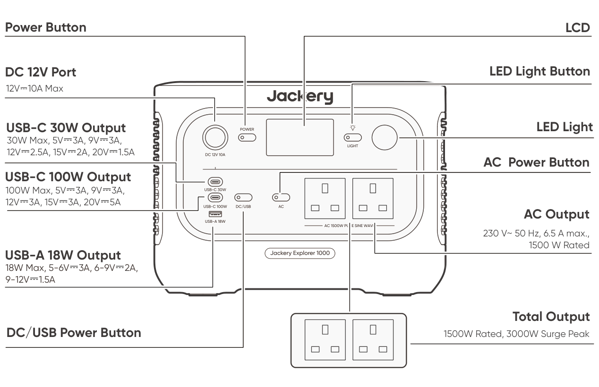

<svg aria-hidden="true" class="hb-leader-layer" focusable="false" preserveAspectRatio="none" viewBox="0 0 100 100"><polyline class="hb-leader" data-callout-id="overview.front.power" points="1.101,8.518 41.169,8.518 41.169,33.378"></polyline><polyline class="hb-leader" data-callout-id="overview.front.lcd" points="99.005,8.519 51.04,8.519 51.04,33.506"></polyline><polyline class="hb-leader" data-callout-id="overview.front.dc12" points="1.101,25.722 35.787,25.722 35.787,35.193"></polyline><polyline class="hb-leader" data-callout-id="overview.front.led_button" points="99.006,21.853 59.042,21.853 59.042,32.851"></polyline><polyline class="hb-leader" data-callout-id="overview.front.usb_c_30" points="1.101,43.854 29.645,43.854 29.645,49.175 34.437,49.175"></polyline><polyline class="hb-leader" data-callout-id="overview.front.led" points="99.389,36.855 66.946,36.855"></polyline><polyline class="hb-leader" data-callout-id="overview.front.usb_c_100" points="1.486,57.141 33.346,57.141 33.346,53.33 34.353,53.33"></polyline><polyline class="hb-leader" data-callout-id="overview.front.ac_power" points="98.843,47.914 46.994,47.914 46.994,52.076"></polyline><polyline class="hb-leader" data-callout-id="overview.front.usb_a" points="1.124,78.5 35.787,78.5 35.787,61.68"></polyline><polyline class="hb-leader" data-callout-id="overview.front.ac_output" points="99.006,69.051 62.833,69.051 62.833,60.586"></polyline><polyline class="hb-leader" data-callout-id="overview.front.dc_usb" points="1.226,95.303 40.866,95.303 40.866,57.434"></polyline><polyline class="hb-leader" data-callout-id="overview.front.total" points="99.389,94.297 68.813,94.297"></polyline><polyline class="hb-leader-decoration" data-decoration-id="overview.front.decoration-1" points="58.644,60.581 58.644,85.435"></polyline></svg>

<strong>POWER Button</strong>

<strong>LCD</strong>

<strong>DC 12 V Port</strong>

12 V⎓10 A max.

<strong>LED Light Button</strong>

<strong>USB-C 30 W Output</strong>

30 W max., 5 V⎓3 A, 9 V⎓3 A, 12 V⎓2.5 A, 15 V⎓2 A, 20 V⎓1.5 A

<strong>LED Light</strong>

<strong>USB-C 100 W Output</strong>

100 W max., 5 V⎓3 A, 9 V⎓3 A, 12 V⎓3 A, 15 V⎓3 A, 20 V⎓5 A

<strong>AC Power Button</strong>

<strong>USB-A 18 W Output</strong>

18 W max., 5-6 V⎓3 A, 6-9 V⎓2 A, 9-12 V⎓1.5 A

<strong>AC Output</strong>

230 V~ 50 Hz, 6.5 A max., 1500 W Rated

<strong>DC / USB Power Button</strong>

<strong>Total Output</strong>

1500 W Rated, 3000 W Surge Peak

</figure>

## RIGHT SIDE VIEW

<figure class="hb-annotated-figure hb-has-composite-art" data-figure-id="product-overview-right" data-source-fragment-sha256="ddea23a86d6496e833646524236550847d6a45d6b1a9743b688bc5f99913d816" data-web-composite-asset-key="web-composite/je1000f_eu/product-overview.right" data-web-composite-locale="en" data-web-composite-sha256="51e55d14c7f2ff6b7b6b9b87867c15bab685aafd08dbe95c04eb52d33a9b8e1e" data-web-replace-key="product-overview.right">
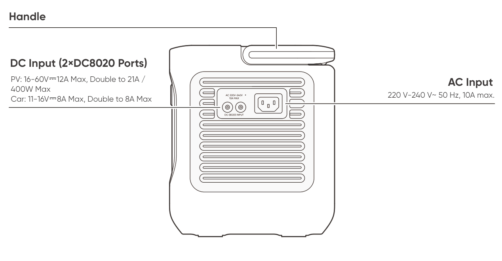

<svg aria-hidden="true" class="hb-leader-layer" focusable="false" preserveAspectRatio="none" viewBox="0 0 100 100"><polyline class="hb-leader" data-callout-id="overview.right.handle" points="1.416,9.834 55.045,9.834 55.045,18.308"></polyline><polyline class="hb-leader" data-callout-id="overview.right.dc_input" points="1.416,41.989 43.752,41.989"></polyline><polyline class="hb-leader" data-callout-id="overview.right.ac_input" points="98.813,40.483 56.874,40.483"></polyline></svg>

<strong>Handle</strong>

<strong>DC Input (2×DC8020 Ports)</strong>

PV: 16-60 V⎓12 A max., Double to 21 A / 400 W max.

Car: 11-16 V⎓8 A max., Double to 8 A max.

<strong>AC Input</strong>

220 V-240 V~ 50 Hz, 10 A max.

</figure>

# LCD DISPLAY

<figure aria-label="LCD icon meanings" class="hb-lcd-table-composition" data-component-id="HB-TABLE-LCD-ICON" tabindex="0"><table class="hb-lcd-icon-table"><colgroup><col class="hb-lcd-col-number"/><col class="hb-lcd-col-icon"/><col class="hb-lcd-col-name"/><col class="hb-lcd-col-description"/></colgroup><tbody><tr><td class="hb-lcd-number">
1
</td><td class="hb-lcd-icon"></td><td class="hb-lcd-name">
Wi-Fi
</td><td class="hb-lcd-description">

<strong>On:</strong> Wi-Fi connected.

<strong>Blink:</strong> Ready to connect to Wi-Fi.

<strong>Off:</strong> Wi-Fi disconnected.

</td></tr><tr><td class="hb-lcd-number">
2
</td><td class="hb-lcd-icon"></td><td class="hb-lcd-name">
Bluetooth
</td><td class="hb-lcd-description">

<strong>On:</strong> Bluetooth connected.

<strong>Blink:</strong> Ready to connect to Bluetooth.

<strong>Off:</strong> Bluetooth disconnected.

</td></tr><tr><td class="hb-lcd-number">
3
</td><td class="hb-lcd-icon"></td><td class="hb-lcd-name">
Quiet Charging Mode
</td><td class="hb-lcd-description">

<strong>On:</strong> The noise during charging is significantly minimized, while the charging power is reduced and the charging speed slows down.

<strong>Off:</strong> Quiet Charging Mode is disabled.

Enable/disable this feature in the Jackery App. The setting is retained when the device is powered off.

</td></tr><tr><td class="hb-lcd-number">
4
</td><td class="hb-lcd-icon"></td><td class="hb-lcd-name">
Charging Plan
</td><td class="hb-lcd-description">

Customizes the charging time of the Jackery Explorer 1000. Suitable for situations with fluctuating electricity prices, it allows for charging plans based on peak and off-peak electricity times, reducing electricity costs.

Enable/disable this feature in the Jackery App. The setting is retained when the device is powered off.

</td></tr><tr><td class="hb-lcd-number">
5
</td><td class="hb-lcd-icon"></td><td class="hb-lcd-name">
Self-powered Mode
</td><td class="hb-lcd-description">

Maximizes the use of solar energy and reduces reliance on grid electricity by prioritizing stored solar energy, reducing electricity costs. The power station must be connected to both solar panels and the grid simultaneously, with the load power limited by bypass power.

Enable/disable this feature in the Jackery App. The setting is retained when the device is powered off.

</td></tr><tr><td class="hb-lcd-number">
6
</td><td class="hb-lcd-icon"></td><td class="hb-lcd-name">
TOU Mode
</td><td class="hb-lcd-description">

<strong>On:</strong> TOU mode is enabled (default backup SOC: 60%). During peak periods, the product prioritizes discharging the battery to reduce peak electricity costs when the stored energy exceeds the backup SOC. During off peak periods, the product charges the battery from the grid to achieve peak shaving and valley filling.

<strong>Off:</strong> TOU mode is disabled. The product does not follow the TOU (time of use) strategy and operates according to the default power supply and charging logic.

Enable/disable this feature in the Jackery App. The setting is retained when the device is powered off.

</td></tr><tr><td class="hb-lcd-number">
7
</td><td class="hb-lcd-icon"></td><td class="hb-lcd-name">
UPS
</td><td class="hb-lcd-description">

<strong>On:</strong> The product is operating in bypass mode. Loads connected to the AC ports consume power from the grid instead of the power station. If the grid suddenly fails, the product automatically switches to its battery power within 10 ms.

<strong>Off:</strong> The product is not in bypass mode. Loads connected to the AC ports are powered by the internal battery of the power station.

</td></tr><tr><td class="hb-lcd-number">
8
</td><td class="hb-lcd-icon"></td><td class="hb-lcd-name">
AC Power Indicator
</td><td class="hb-lcd-description">
The AC output (pure sine wave) is on.
</td></tr><tr><td class="hb-lcd-number">
9
</td><td class="hb-lcd-icon"></td><td class="hb-lcd-name">
Output Voltage and Frequency
</td><td class="hb-lcd-description">
Displays the output voltage and frequency when the AC output is turned on.
</td></tr><tr><td class="hb-lcd-number">
10
</td><td class="hb-lcd-icon"></td><td class="hb-lcd-name">
Input Power
</td><td class="hb-lcd-description">
Displays the input power in watts.
</td></tr><tr><td class="hb-lcd-number">
11
</td><td class="hb-lcd-icon"></td><td class="hb-lcd-name">
Remaining Charge Time
</td><td class="hb-lcd-description">
Displays the remaining charging time.
</td></tr><tr><td class="hb-lcd-number">
12
</td><td class="hb-lcd-icon"></td><td class="hb-lcd-name">
AC Wall Charging Indicator
</td><td class="hb-lcd-description">
The product is charged via the AC Input using grid power.
</td></tr><tr><td class="hb-lcd-number">
13
</td><td class="hb-lcd-icon"></td><td class="hb-lcd-name">
Car Charging Indicator
</td><td class="hb-lcd-description">
The product is charged via the DC Input (DC8020) using DC 12V (car charging).
</td></tr><tr><td class="hb-lcd-number">
14
</td><td class="hb-lcd-icon"></td><td class="hb-lcd-name">
Solar Charging Indicator
</td><td class="hb-lcd-description">
The product is charged via the DC Input (DC8020) using solar panel(s).
</td></tr><tr><td class="hb-lcd-number">
15
</td><td class="hb-lcd-icon"></td><td class="hb-lcd-name">
Battery Saving Mode
</td><td class="hb-lcd-description">

<strong>On:</strong> Battery Saving Mode is enabled. Charge and discharge limits are applied to help extend battery lifespan.

<strong>Off:</strong> Battery Saving Mode is disabled.

Enable/disable this feature in the Jackery App. The setting is retained when the device is powered off.

When this feature is enabled, the product occasionally performs a full charge and discharge cycle to calibrate the SOC.

</td></tr><tr><td class="hb-lcd-number">
16
</td><td class="hb-lcd-icon"></td><td class="hb-lcd-name">
Charging Power Limit
</td><td class="hb-lcd-description">

<strong>On:</strong> Charging Power limit is enabled in the Jackery App.

<strong>Off:</strong> Charging Power limit is disabled in the Jackery App.

The setting is retained when the device is powered off.

</td></tr><tr><td class="hb-lcd-number">
17
</td><td class="hb-lcd-icon"></td><td class="hb-lcd-name">
Battery Power Indicator
</td><td class="hb-lcd-description">
When the product is being charged, the orange circle around the battery percentage will light up in sequence. When charging other devices, the orange circle will stay on.
</td></tr><tr><td class="hb-lcd-number">
18
</td><td class="hb-lcd-icon"></td><td class="hb-lcd-name">
Low Battery Indicator
</td><td class="hb-lcd-description">

<strong>On:</strong> The battery level is below 20%.

<strong>Blink:</strong> The battery level is below 5%.

<strong>Off:</strong> The battery level is above 20% or the product is charging.

</td></tr><tr><td class="hb-lcd-number">
19
</td><td class="hb-lcd-icon"></td><td class="hb-lcd-name">
Remaining Battery Percentage
</td><td class="hb-lcd-description">
Displays the remaining battery percentage.
</td></tr><tr><td class="hb-lcd-number">
20
</td><td class="hb-lcd-icon"></td><td class="hb-lcd-name">
Discharge Timer
</td><td class="hb-lcd-description">

<strong>On:</strong> A discharge timer is set.

<strong>Off:</strong> No discharge timer is set.

Enable/disable this feature in the Jackery App. The setting is not retained when the device is powered off.

</td></tr><tr><td class="hb-lcd-number">
21
</td><td class="hb-lcd-icon"></td><td class="hb-lcd-name">
Energy Saving Mode
</td><td class="hb-lcd-description">

When the AC or DC output is turned on by pressing the AC or DC/USB power button:

<strong>On:</strong> Energy Saving Mode is enabled.

<strong>Off:</strong> Energy Saving Mode is disabled.

The setting is retained when the device is powered off.

</td></tr><tr><td class="hb-lcd-number">
22
</td><td class="hb-lcd-icon"></td><td class="hb-lcd-name">
High Temperature Indicator
</td><td class="hb-lcd-description">
High temperature protection is triggered. The product may stop functioning until its temperature returns to the normal operating range.
</td></tr><tr><td class="hb-lcd-number">
22
</td><td class="hb-lcd-icon"></td><td class="hb-lcd-name">
Low Temperature Indicator
</td><td class="hb-lcd-description">

Low temperature protection is triggered.

The product may stop functioning until its temperature returns to the normal operating range.

</td></tr><tr><td class="hb-lcd-number">
23
</td><td class="hb-lcd-icon"></td><td class="hb-lcd-name">
Fault code
</td><td class="hb-lcd-description">
A product error has occurred. Please refer to the Troubleshooting section for details.
</td></tr><tr><td class="hb-lcd-number">
24
</td><td class="hb-lcd-icon"></td><td class="hb-lcd-name">
Output Power
</td><td class="hb-lcd-description">
Displays the output power in watts.
</td></tr><tr><td class="hb-lcd-number">
25
</td><td class="hb-lcd-icon"></td><td class="hb-lcd-name">
Remaining Discharge Time
</td><td class="hb-lcd-description">
Displays the remaining discharging time.
</td></tr></tbody></table></figure>

# OPERATIONS

## POWER ON/OFF

<figure class="hb-operation-figure hb-operation-layout-status-right hb-has-composite-art" data-component-id="HB-SPECIAL-OPERATION" data-operation-id="main-power" data-source-fragment-sha256="01f995ade5e371cb39f73d74d82b19870877b65b485c117e0286a4b4ee81bcb6" data-web-composite-asset-key="web-composite/je1000f_eu/operation.main-power" data-web-composite-locale="en" data-web-composite-sha256="d146a09b705bc34e26589e29286c303c529044936772d8621f71865cf4644471" data-web-replace-key="operation.main-power">
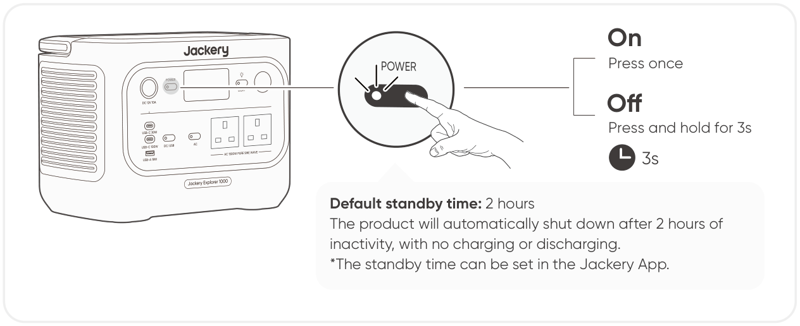

On: Press once.

Off: Press and hold for 3s.

<strong>Default standby time:</strong> 2 hours.

The product will automatically shut down after 2 hours of inactivity, with no charging or discharging.

*The standby time can be set in the Jackery App.

</figure>

When Energy Saving Mode is enabled, the product will automatically shut down after 12 hours if the AC or DC/USB power button is ON but the product is neither charging nor discharging.

## AC OUTPUT ON/OFF

<figure class="hb-operation-figure hb-operation-layout-status-right hb-has-composite-art" data-component-id="HB-SPECIAL-OPERATION" data-operation-id="ac-output" data-source-fragment-sha256="0e29b06a0a636991126862b686c09f3237a2a385d16c9e58421dea059cf3b84a" data-web-composite-asset-key="web-composite/je1000f_eu/operation.ac-output" data-web-composite-locale="en" data-web-composite-sha256="d775fac753d482ca3a40c0f61f6bfc28c74280d746b9ee220c671a24b444e019" data-web-replace-key="operation.ac-output">
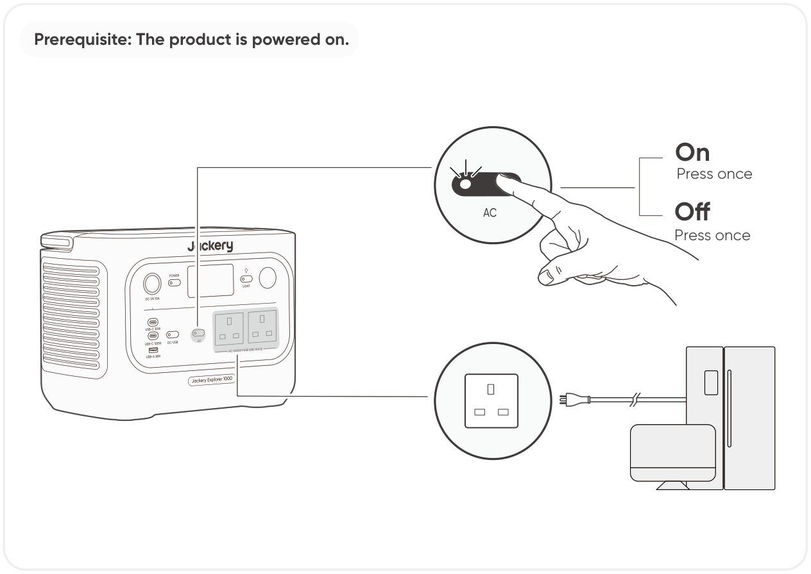

<strong>Prerequisite</strong>: The product is powered on.

<strong>On</strong>

Press once

<strong>Off</strong>

Press once

</figure>

## DC 12V/USB OUTPUT ON/OFF

<figure class="hb-operation-figure hb-operation-layout-status-right hb-has-composite-art" data-component-id="HB-SPECIAL-OPERATION" data-operation-id="dc-usb-output" data-source-fragment-sha256="be51378ed387cb0ef0aad1d604334be5de0cd40315893e4b1b024adc5cc737ca" data-web-composite-asset-key="web-composite/je1000f_eu/operation.dc-usb-output" data-web-composite-locale="en" data-web-composite-sha256="8d9c9faed173010decc8adc7513a284aea7def5bd2f94e51c46a6fccc6b22e8c" data-web-replace-key="operation.dc-usb-output">
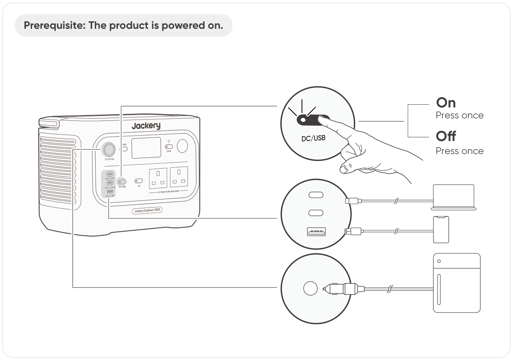

<strong>Prerequisite</strong>: The product is powered on.

<strong>On</strong>

Press once

<strong>Off</strong>

Press once

</figure>

<table class="manual-callout-table" style="width:100%; border-collapse:collapse; margin:0 0 16px 0;"><tbody><tr><td class="manual-callout-label" style="width:16%; border:1px solid #000; padding:6px 8px; vertical-align:top;">
<strong>CAUTION</strong>
</td><td class="manual-callout-body" style="border:1px solid #000; padding:6px 8px; vertical-align:top;"><ul class="simple">
<li>
<strong>USB-C 100W is a USB-PD Power Source 3 (PS3) high-power output port.</strong> If the connected user device or accessory does not meet safety requirements, there may be a fire risk. Before using these ports, ensure that the connected device or accessory has fire safety protection.
</li>
<li>
Only connect Jackery Explorer 1000 to devices or accessories that comply with clauses 6.3, 6.4, and 6.5 of IEC/EN/UL 62368-1 (or other equivalent standards).
</li>
<li>
To obtain maximum output power, use the USB-C to USB-C 5A cable (20V DC/5A, 100W).
</li>
</ul>
</td></tr></tbody></table>

The product can charge your car battery using the Jackery 12V automobile battery charging cable, which is sold separately and available on our website.

<table class="manual-callout-table" style="width:100%; border-collapse:collapse; margin:0 0 16px 0;"><tbody><tr><td class="manual-callout-label" style="width:16%; border:1px solid #000; padding:6px 8px; vertical-align:top;">
<strong>CAUTION</strong>
</td><td class="manual-callout-body" style="border:1px solid #000; padding:6px 8px; vertical-align:top;"><ul class="simple">
<li>
The DC 12V port is only compatible with 12V car batteries and not suitable for 24V systems.
</li>
<li>
Do not start the car while the product is charging the car battery through the 12V DC output port, as this may damage the product.
</li>
<li>
This feature is intended for emergency use only and cannot charge a dead or damaged car battery.
</li>
</ul>
</td></tr></tbody></table>

## ENERGY SAVING MODE

To prevent unnecessary battery consumption from forgetting to turn off the output, the product enables Energy Saving Mode by default. When the AC or DC/USB output is turned on, the Energy Saving Mode icon will be displayed on the LCD screen. In this mode, if no device is connected or the connected device\'s power consumption is below a certain threshold (25 W AC output or 2 W DC/USB output), the corresponding output will automatically turns off after the set time. The default setting is 12 hours. The Energy Saving Mode duration can be set in the Jackery App to 1H, 2 H, 8 H, 12 H or 24 H. If it is set to Never Off, Energy Saving Mode will be disabled.

To disable the energy saving mode, press and hold both the AC power button and the main POWER button for more than 3 seconds. Once Energy Saving Mode is disabled, the icon will no longer appear on the LCD screen, and the product will not automatically turn off the AC or USB output.

When powering low-power devices (AC ≤ 25 W or DC/USB ≤ 2 W), disable Energy Saving Mode to prevent the output from shutting down automatically during operation.

<figure class="hb-operation-figure hb-operation-layout-footer-overlay hb-has-composite-art" data-component-id="HB-SPECIAL-OPERATION" data-operation-id="energy-saving" data-source-fragment-sha256="d1e471435b17fcf3e0ec6ec54938f66e5fcf1be9a061b3302a965404f8c25a12" data-web-composite-asset-key="web-composite/je1000f_eu/operation.energy-saving" data-web-composite-locale="en" data-web-composite-sha256="0172891c9485e9d554a4f81b2a688af4492834a3a505fd96d3e107089196aa55" data-web-replace-key="operation.energy-saving">
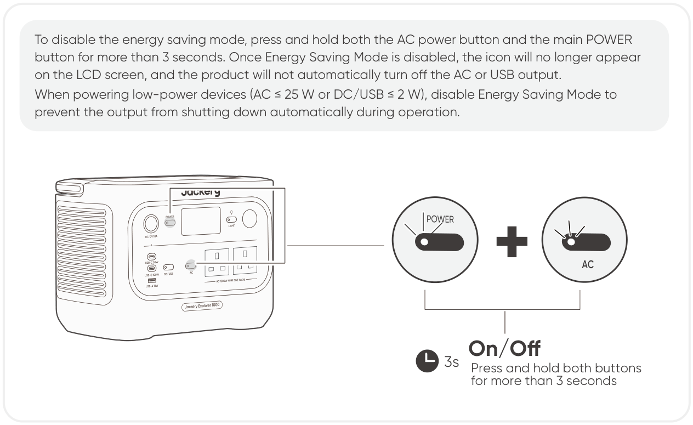

Press and hold both buttons for more than 3 seconds.

</figure>

<table class="manual-callout-table" style="width:100%; border-collapse:collapse; margin:0 0 16px 0;"><tbody><tr><td class="manual-callout-label" style="width:16%; border:1px solid #000; padding:6px 8px; vertical-align:top;">
<strong>NOTE</strong>
</td><td class="manual-callout-body" style="border:1px solid #000; padding:6px 8px; vertical-align:top;">
Energy Saving Mode resumes its previous state after powering on. Manual switching is required for mode changes.
</td></tr></tbody></table>

## LED LIGHT ON/OFF

<figure class="hb-operation-figure hb-operation-layout-footer-panel hb-has-composite-art" data-component-id="HB-SPECIAL-OPERATION" data-operation-id="led-light" data-source-fragment-sha256="67650270634ec2e587ab7a5195585f20c0d92faccd0a2f622af14cd8b713e3d9" data-web-composite-asset-key="web-composite/je1000f_eu/operation.led-light" data-web-composite-locale="en" data-web-composite-sha256="ca664bce037561c5ac6e172569be4f2a3248401d4b5189be16b8c07842dd4ed7" data-web-replace-key="operation.led-light">
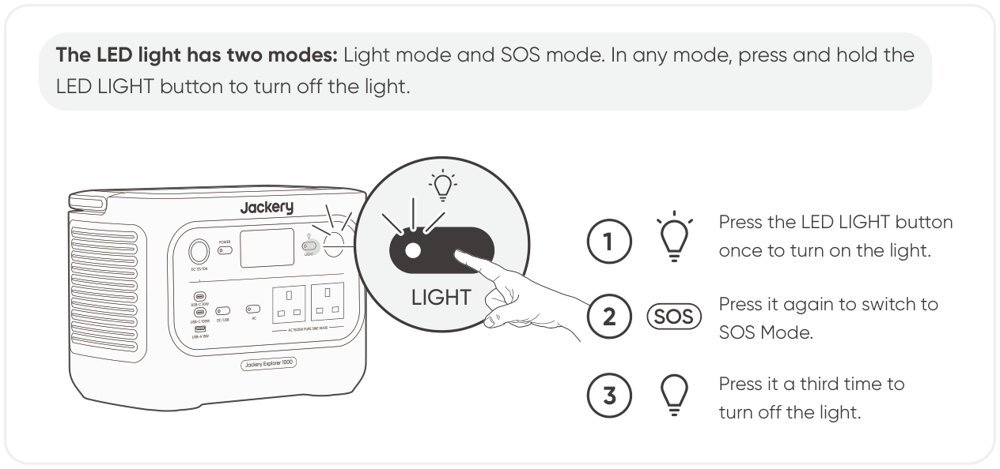

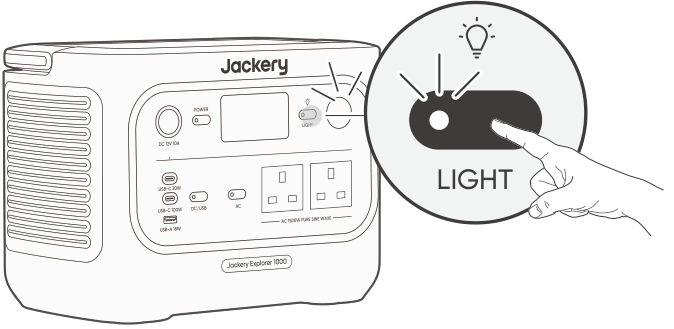

The LED light has two modes: Light mode and SOS mode. In any mode, press and hold the LED light button to turn off the light.

Press the LED Light button once to turn on the light.

Press it again to switch to SOS Mode.

Press it a third time to turn off the light.

</figure>

## LCD SCREEN

<figure aria-label="LCD display mode placeholder." class="hb-lcd-mode-composition" data-component-id="HB-TABLE-LCD-MODE">

<table class="hb-lcd-mode-table"><colgroup><col class="hb-lcd-mode-col-state"/><col class="hb-lcd-mode-col-action"/><col class="hb-lcd-mode-col-copy"/></colgroup><tbody><tr><td class="hb-lcd-mode-state" rowspan="3">Shortly On</td><td class="hb-lcd-mode-action">Turn on</td><td class="hb-lcd-mode-copy">Press the main POWER button or when the product is charging.</td></tr><tr><td class="hb-lcd-mode-action">Turn off</td><td class="hb-lcd-mode-copy">Press the main POWER button.</td></tr><tr><td class="hb-lcd-mode-action">Auto-off</td><td class="hb-lcd-mode-copy">The LCD turns off automatically and enters sleep mode after 2 minutes of inactivity.</td></tr><tr><td class="hb-lcd-mode-state" rowspan="3">Steady On (in charging or discharging state)</td><td class="hb-lcd-mode-action">Turn on</td><td class="hb-lcd-mode-copy">Press the main POWER button twice when the product is powered on.</td></tr><tr><td class="hb-lcd-mode-action">Turn off</td><td class="hb-lcd-mode-copy">Press the main POWER button.</td></tr><tr><td class="hb-lcd-mode-action">Auto-off</td><td class="hb-lcd-mode-copy">The LCD turns off automatically after 2 hours of inactivity.</td></tr></tbody></table>
</figure>

You can also set the screen display mode in the Jackery App.

## AC and DC Output Resume Function

This function memorizes the output status and automatically resumes AC and DC outputs under defined conditions.

<figure aria-label="Auto Resume Conditions / Not Auto Resume Conditions" class="hb-auto-resume-composition"><table class="hb-auto-resume-table"><colgroup><col class="hb-auto-resume-col"/><col class="hb-auto-resume-col"/></colgroup>
<thead>
<tr><th class="head hb-auto-resume-left" scope="col">
Auto Resume Conditions
</th>
<th class="head hb-auto-resume-right" scope="col">
Not Auto Resume Conditions
</th>
</tr>
</thead>
<tbody>
<tr><td class="hb-auto-resume-left">
Power-on/Restart after shutdown or restart
</td>
<td class="hb-auto-resume-right">
Manual output off (button/App)
</td>
</tr>
<tr><td class="hb-auto-resume-left" rowspan="2">
Battery SOC ≥ discharge limit +10% after reaching limit
</td>
<td class="hb-auto-resume-right">
Energy Saving mode output off
</td>
</tr>
<tr><td class="hb-auto-resume-right">
Protection-triggered output off
</td>
</tr>
<tr><td class="hb-auto-resume-left">
OTA upgrade completed
</td>
<td class="hb-auto-resume-right">
Discharge timer-triggered output off
</td>
</tr>
</tbody>
</table></figure>

## KEY COMBINATION

<figure aria-label="Buttons / Operation / Function" class="hb-key-combination-composition" tabindex="0"><table class="hb-key-combination-table"><colgroup><col class="hb-key-col-buttons"/><col class="hb-key-col-operation"/><col class="hb-key-col-function"/></colgroup>
<thead>
<tr><th class="head hb-key-buttons" scope="col">
Buttons
</th>
<th class="head hb-key-operation" scope="col">
Operation
</th>
<th class="head hb-key-function" scope="col">
Function
</th>
</tr>
</thead>
<tbody>
<tr><td class="hb-key-buttons">
Main POWER button + AC Power Button
</td>
<td class="hb-key-operation">
Press and hold both for 3s
</td>
<td class="hb-key-function">
Turn on/off the Energy Saving Mode
</td>
</tr>
<tr><td class="hb-key-buttons">
Main POWER button + DC/USB Power Button
</td>
<td class="hb-key-operation">
Press and hold both for 3s
</td>
<td class="hb-key-function">
Reset Wi-Fi and Bluetooth
</td>
</tr>
<tr><td class="hb-key-buttons">
DC/USB Power Button + AC Power Button
</td>
<td class="hb-key-operation">
Press and hold both for 1s
</td>
<td class="hb-key-function">
Turn on/off Wi-Fi and Bluetooth
</td>
</tr>
<tr><td class="hb-key-buttons">
Main POWER button + LED Light button
</td>
<td class="hb-key-operation">
Press and hold both for 1s
</td>
<td class="hb-key-function">
Turn on/off Emergency Charging Mode
</td>
</tr>
</tbody>
</table></figure>

# UNINTERRUPTIBLE POWER SUPPLY (UPS)

Connect the product to a wall outlet with the AC charging cable, then press the AC power button and power your appliances at the same time.

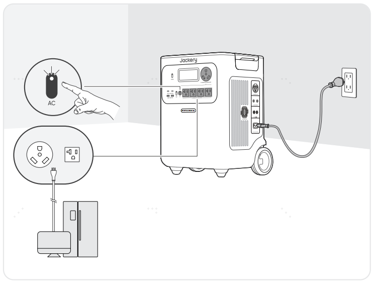

An uninterruptible power supply (UPS) is a type of continual power system that provides automated backup electric power to a load when the mains grid power fails.

In the event of a sudden loss of grid power, Jackery Explorer 1000 will automatically switch to stored power within 10 ms to keep your appliances running.

In UPS mode, the unit\'s peak output reaches 1500 W before power outages. As simultaneous charging/discharging is enabled in Bypass Mode,

the actual output power is lower than the rated output power in this mode but returns to rated output power during outages.

<table class="manual-callout-table" style="width:100%; border-collapse:collapse; margin:0 0 16px 0;"><tbody><tr><td class="manual-callout-label" style="width:16%; border:1px solid #000; padding:6px 8px; vertical-align:top;">
<strong>CAUTION</strong>
</td><td class="manual-callout-body" style="border:1px solid #000; padding:6px 8px; vertical-align:top;"><ul class="simple">
<li>
This product does not support 0 ms switching. Do not connect it to equipment that requires a 0 ms switching power supply, such as data servers or workstations.
</li>
<li>
Before use, please test compatibility with your device multiple times.
</li>
<li>
Do not connect loads exceeding the maximum output power of the product. Otherwise, overload protection will be triggered.
</li>
</ul>
</td></tr></tbody></table>

# CHARGING

**Green energy first:** We advocate using green energy first. This product supports two modes of charging at the same time: solar charging and AC wall charging. When AC wall charging and solar charging are turned on at the same time, the product will give priority to solar charging, and both methods will be used to charge the battery at the maximum permissible power.

**Fully charge the product before its first use.**

<table class="manual-callout-table" style="width:100%; border-collapse:collapse; margin:0 0 16px 0;"><tbody><tr><td class="manual-callout-label" style="width:16%; border:1px solid #000; padding:6px 8px; vertical-align:top;">
<strong>NOTE</strong>
</td><td class="manual-callout-body" style="border:1px solid #000; padding:6px 8px; vertical-align:top;"><ul class="simple">
<li>
The recommended charging temperature for the product ranges from 0 °C to 45 °C, and the discharging temperature ranges from -10 °C to 45 °C.
</li>
<li>
Operating the product beyond this temperature range may restrict its charging and discharging capabilities, or even prevent it from charging or discharging.
</li>
<li>
The charging power and battery capacity of the product may vary due to temperature fluctuations.
</li>
</ul>
</td></tr></tbody></table>

## CHARGING VIA AC WALL OUTLET

<figure class="hb-reference-figure hb-has-composite-art" data-component-id="HB-SPECIAL-REFERENCE-FIGURE" data-reference-id="charging-ac-wall" data-source-fragment-sha256="cd4f99e6cc22ddd8c44bcf810fcf23d3fb4c65c4377a0c851173e60cc47759f8" data-step-captions="embedded" data-web-composite-asset-key="web-composite/je1000f_eu/reference.charging-ac-wall" data-web-composite-locale="en" data-web-composite-sha256="4f2729db0ddb09e4125d08171902dbc761bb1a5deb236b5b9c91f5188d8ef9ef" data-web-replace-key="reference.charging-ac-wall">
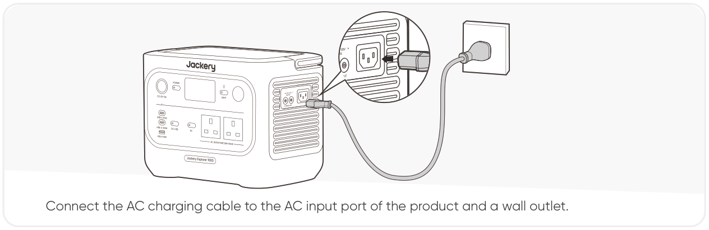

Connect the AC charging cable to the AC input port of the product and a wall outlet.

</figure>

<table class="manual-callout-table" style="width:100%; border-collapse:collapse; margin:0 0 16px 0;"><tbody><tr><td class="manual-callout-label" style="width:16%; border:1px solid #000; padding:6px 8px; vertical-align:top;">
<strong>CAUTION</strong>
</td><td class="manual-callout-body" style="border:1px solid #000; padding:6px 8px; vertical-align:top;">
Make sure the AC charging cable is fully and securely plugged into the AC input port. An incomplete connection may cause unstable current, overheating, poor contact, or device malfunction.
</td></tr></tbody></table>

**Emergency Charging Mode**

Under this mode, you can rapidly power up the portable power station using the AC charging method. This emergency charge function can be activated or deactivated through the Jackery App. When in emergency charging mode, the circular light indicating the state of charge (SOC) will blink at an increased pace.

\*To maximize battery lifespan, it is best to charge at normal speed. Use emergency charging mode only when necessary. It\'s not recommended for regular, long-term use.

## CHARGING VIA SOLAR PANELS (SOLD SEPARATELY)

Jackery Explorer 1000 has two DC8020 input ports and is compatible with the Jackery solar panels.

<figure class="hb-reference-figure hb-has-composite-art" data-component-id="HB-SPECIAL-REFERENCE-FIGURE" data-reference-id="charging-solar-direct" data-source-fragment-sha256="6631fa89f0f18188b6701f43b926411d6b553914ccf6c79f41f642a46466ce2d" data-step-captions="embedded" data-web-composite-asset-key="web-composite/je1000f_eu/reference.charging-solar-direct" data-web-composite-locale="en" data-web-composite-sha256="5c91e2f80ff4ac164680ff48fe9419a32abbf67e8c11de357695c72a82b75e50" data-web-replace-key="reference.charging-solar-direct">
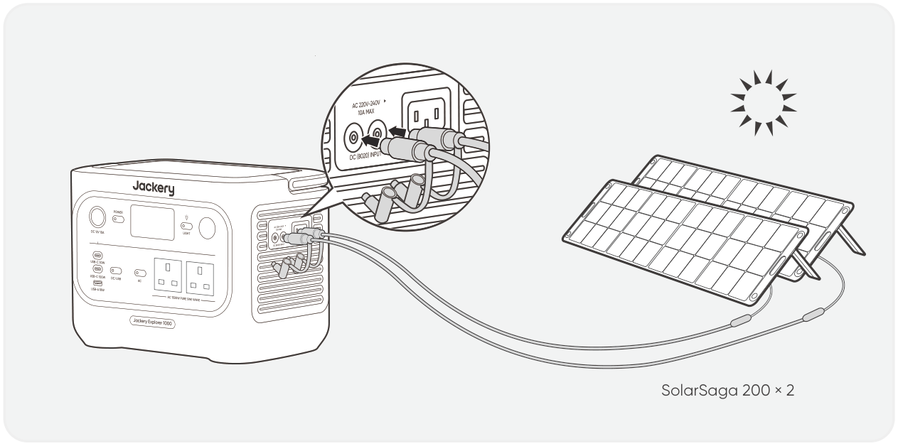

</figure>

If one DC8020 input port needs to connect two solar panels simultaneously, please refer to the figure below for charging through the solar panel connector (sold separately, not included as standard).

<figure class="hb-reference-figure hb-has-composite-art" data-component-id="HB-SPECIAL-REFERENCE-FIGURE" data-reference-id="charging-solar-adapter" data-source-fragment-sha256="04f1cf78c699f357ee7cd5e8308c801210a80abbbca6a3a93fab145f1e6ffdac" data-step-captions="embedded" data-web-composite-asset-key="web-composite/je1000f_eu/reference.charging-solar-adapter" data-web-composite-locale="en" data-web-composite-sha256="c57e7dbb85f0c3833192c7331fc7495c233e8dd62845a380ed97eddd601d335b" data-web-replace-key="reference.charging-solar-adapter">
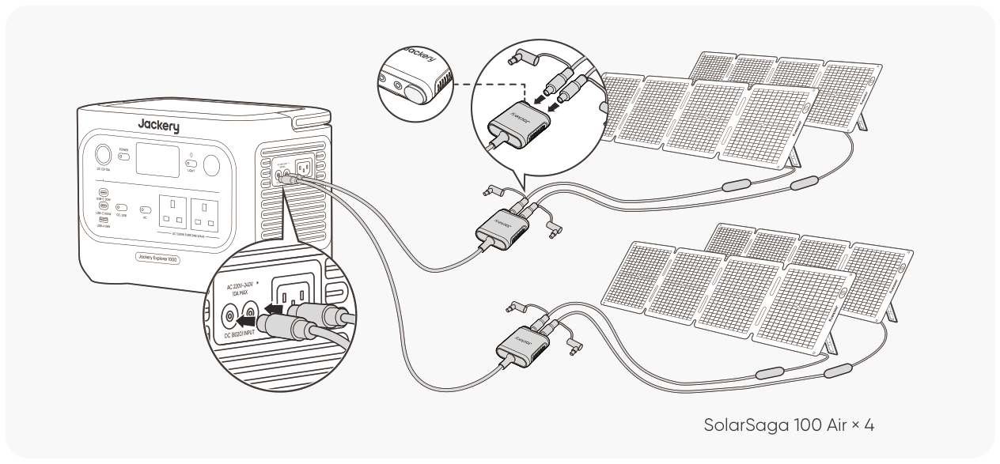

</figure>

<table class="manual-callout-table" style="width:100%; border-collapse:collapse; margin:0 0 16px 0;"><tbody><tr><td class="manual-callout-label" style="width:16%; border:1px solid #000; padding:6px 8px; vertical-align:top;">
<strong>CAUTION</strong>
</td><td class="manual-callout-body" style="border:1px solid #000; padding:6px 8px; vertical-align:top;">
One DC8020 input port can be connected to at most two solar panels.
</td></tr></tbody></table>

<table class="manual-callout-table" style="width:100%; border-collapse:collapse; margin:0 0 16px 0;"><tbody><tr><td class="manual-callout-label" style="width:16%; border:1px solid #000; padding:6px 8px; vertical-align:top;">
<strong>CAUTION</strong>
</td><td class="manual-callout-body" style="border:1px solid #000; padding:6px 8px; vertical-align:top;">
Ensure that the input voltage for both DC input ports is the same. Failure to do so may damage the product. For example:

<ul class="simple">
<li>
Use the same model of Jackery solar panels and the same number of panels when connecting solar panels to both DC8020 Input ports.
</li>
<li>
Do not charge the product using both a car charger and a solar panel simultaneously. Doing so may blow the car fuse or result in charging failure.
</li>
</ul>
</td></tr></tbody></table>

It is recommended to use the Jackery solar panel to charge the product. Ensure that the open-circuit voltage (Voc) of the solar panel is within the DC input range (16V-60V) of Jackery Explorer 1000. Jackery is not responsible for any damage or loss resulting from the use of third-party solar panels.

## CHARGING VIA A CAR CHARGER (SOLD SEPARATELY)

This product can be charged using a 12V car charger. Ensure that the car charger and the 12V car power outlet (car cigarette lighter) provide a good connection.

<figure class="hb-reference-figure hb-has-composite-art" data-component-id="HB-SPECIAL-REFERENCE-FIGURE" data-reference-id="charging-car" data-source-fragment-sha256="517541c7cc5ac5bbfc6c28beb4d4514ed19ba8bf30a4f84262ec77f599bf867e" data-web-composite-asset-key="web-composite/je1000f_eu/reference.charging-car" data-web-composite-locale="en" data-web-composite-sha256="11ef39e9a1133dff3b94e994203d796a24250aa5732f153f85a04f11f00ebcae" data-web-replace-key="reference.charging-car">
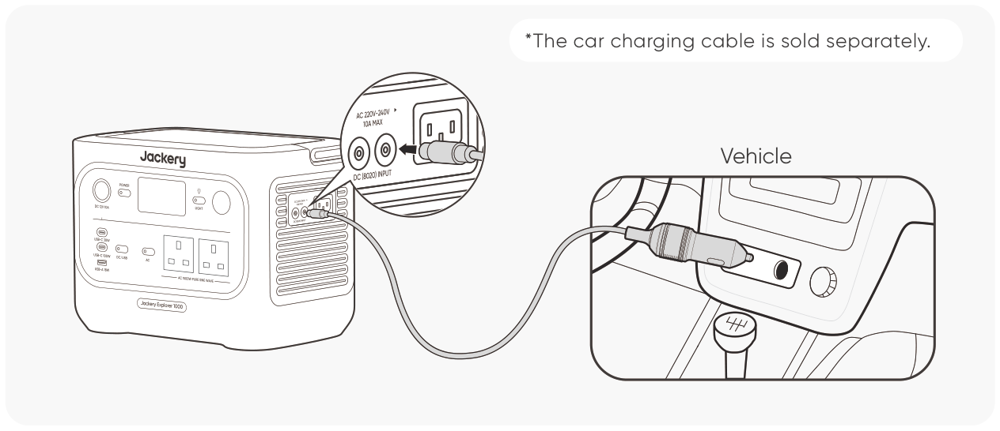

Vehicle

*The car charging cable is sold separately.

</figure>

<table class="manual-callout-table" style="width:100%; border-collapse:collapse; margin:0 0 16px 0;"><tbody><tr><td class="manual-callout-label" style="width:16%; border:1px solid #000; padding:6px 8px; vertical-align:top;">
<strong>CAUTION</strong>
</td><td class="manual-callout-body" style="border:1px solid #000; padding:6px 8px; vertical-align:top;"><ul class="simple">
<li>
Please start the vehicle before charging your power station.
</li>
<li>
If the vehicle is running on bumpy roads, it is forbidden to use the car charger in case it causes non-standard operation. The Company will not be responsible for any loss caused by non-standard operation.
</li>
<li>
Vehicle charging is only applicable to vehicles with 12V DC, not 24V DC. Please do not charge this product in a 24V vehicle to avoid personal injury and property loss.
</li>
</ul>
</td></tr></tbody></table>

# STORAGE

Store the product in a dry, clean place with proper ventilation. Storage temperature and humidity:

- 1 month: -20 °C to 45 °C (0-60 % RH)

- 3 months: 0 °C to 45 °C (0-60 % RH)

- 12 months: 0 °C to 25 °C (0-60 % RH)

If this product is stored for a long period of time (3 months - 6 months) with the power depleted, it may become unchargeable. To prevent this and maintain battery health, it is recommended to check and recharge the product every three months and perform a full charge and discharge cycle at least once every 6 to 12 months.

# TROUBLESHOOTING

If any of the following fault codes appear, follow the listed corrective actions to resolve the issue. If the fault persists, please contact Jackery Customer Support.

<figure aria-label="Error Code / Corrective Measures" class="hb-troubleshooting-composition" data-component-id="HB-TABLE-TROUBLESHOOTING" tabindex="0"><table class="hb-troubleshooting-table"><colgroup><col class="hb-troubleshooting-col-code"/><col class="hb-troubleshooting-col-measures"/></colgroup><thead><tr><th class="hb-troubleshooting-code" scope="col">
Error Code
</th><th class="hb-troubleshooting-measures" scope="col">
Corrective Measures
</th></tr></thead><tbody><tr><td class="hb-troubleshooting-code">
F0
</td><td class="hb-troubleshooting-measures">
Restart the product.
</td></tr><tr><td class="hb-troubleshooting-code">
F1
</td><td class="hb-troubleshooting-measures">
Restart the product.
</td></tr><tr><td class="hb-troubleshooting-code">
F2
</td><td class="hb-troubleshooting-measures">
Restart the product.
</td></tr><tr><td class="hb-troubleshooting-code">
F3
</td><td class="hb-troubleshooting-measures">
Restart the product.
</td></tr><tr><td class="hb-troubleshooting-code">
F4
</td><td class="hb-troubleshooting-measures">
Connect the product to loads to discharge its battery until the fault disappears.
</td></tr><tr><td class="hb-troubleshooting-code">
F5
</td><td class="hb-troubleshooting-measures">
Charge the product via solar panels or an AC wall outlet until the fault disappears.
</td></tr><tr><td class="hb-troubleshooting-code">
F6
</td><td class="hb-troubleshooting-measures">

1. Wait for the grid to normalize before charging the product via an AC wall outlet.

2. Check whether the air intake and exhaust vents are blocked; ensure 0.66 ft (20 cm) clearance on both sides of the product.

3. Place the product in a location that is not exposed to direct sunlight or high environmental temperatures.

4. Disconnect all loads from the product. Keep the product idle and wait until the fault disappears.

5. Restart the product.

</td></tr><tr><td class="hb-troubleshooting-code">
F7
</td><td class="hb-troubleshooting-measures">

1. Remove all DC inputs from the product.

2. Check the open-circuit voltage (Voc) of the connected solar panels. The product allows a maximum DC input voltage of 60V.

3. Restart the product and keep it idle. Wait until the fault disappears.

</td></tr><tr><td class="hb-troubleshooting-code">
F8
</td><td class="hb-troubleshooting-measures">
Contact Jackery Customer Support.
</td></tr><tr><td class="hb-troubleshooting-code">
F9
</td><td class="hb-troubleshooting-measures">
Remove the load connected to the USB ports of the product. Wait until the fault disappears.
</td></tr><tr><td class="hb-troubleshooting-code">
FE
</td><td class="hb-troubleshooting-measures">
Contact Jackery Customer Support.
</td></tr></tbody></table></figure>

# SPECIFICATIONS

## GENERAL INFO

<figure aria-label="GENERAL INFO" class="hb-spec-table-composition"><table class="hb-spec-table manual-table manual-spec-table"><colgroup><col class="hb-spec-col-label"/><col class="hb-spec-col-value"/></colgroup>
<tbody>
<tr>
<th class="hb-spec-label manual-spec-label" scope="row">Product Name</th>
<td class="hb-spec-value manual-spec-value">Jackery Explorer 1000</td>
</tr>
<tr>
<th class="hb-spec-label manual-spec-label" scope="row">Model No.</th>
<td class="hb-spec-value manual-spec-value">JE-1000F</td>
</tr>
<tr>
<th class="hb-spec-label manual-spec-label" scope="row">Capacity</th>
<td class="hb-spec-value manual-spec-value">1024 Wh (20 Ah / 51.2 V DC)</td>
</tr>
<tr>
<th class="hb-spec-label manual-spec-label" scope="row">Cell Chemistry</th>
<td class="hb-spec-value manual-spec-value">LiFePO₄</td>
</tr>
<tr>
<th class="hb-spec-label manual-spec-label" scope="row">Weight</th>
<td class="hb-spec-value manual-spec-value">About 10.6 kg</td>
</tr>
<tr>
<th class="hb-spec-label manual-spec-label" scope="row">Dimensions</th>
<td class="hb-spec-value manual-spec-value">31.4 x 20.1 x 23.4 cm</td>
</tr>
<tr>
<th class="hb-spec-label manual-spec-label" scope="row">Cycle Life</th>
<td class="hb-spec-value manual-spec-value">4000 cycles to 70%+ capacity</td>
</tr>
</tbody>
</table></figure>

## INPUT PORTS

<figure aria-label="INPUT PORTS" class="hb-spec-table-composition"><table class="hb-spec-table manual-table manual-spec-table"><colgroup><col class="hb-spec-col-label"/><col class="hb-spec-col-value"/></colgroup>
<tbody>
<tr>
<th class="hb-spec-label manual-spec-label" scope="row">1 × AC Input</th>
<td class="hb-spec-value manual-spec-value">Charge Mode: 220 V-240 V~ 50 Hz, 10 A max.</td>
</tr>
<tr>
<th class="hb-spec-label manual-spec-label" scope="row">2 × DC8020 Ports</th>
<td class="hb-spec-value manual-spec-value">11 V-16 V⎓8 A max., Double to 8 A max. 16 V-60 V⎓12 A max., Double to 21 A / 400 W max.</td>
</tr>
</tbody>
</table></figure>

## OUTPUT PORTS

<figure aria-label="OUTPUT PORTS" class="hb-spec-table-composition"><table class="hb-spec-table manual-table manual-spec-table"><colgroup><col class="hb-spec-col-label"/><col class="hb-spec-col-value"/></colgroup>
<tbody>
<tr>
<th class="hb-spec-label manual-spec-label" scope="row">2 × AC</th>
<td class="hb-spec-value manual-spec-value">230 V~ 50 Hz, 6.5 A max., 1500 W Rated per port, 1500 W in Total, 3000 W Surge Peak</td>
</tr>
<tr>
<th class="hb-spec-label manual-spec-label" scope="row">AC Output in Bypass Mode①</th>
<td class="hb-spec-value manual-spec-value">220 V-240 V~ 50 Hz, 1500 W</td>
</tr>
<tr>
<th class="hb-spec-label manual-spec-label" scope="row">1 × USB-C 30 W</th>
<td class="hb-spec-value manual-spec-value">30 W max., 5 V⎓3 A, 9 V⎓3 A, 12 V⎓2.5 A, 15 V⎓2 A, 20 V⎓1.5 A</td>
</tr>
<tr>
<th class="hb-spec-label manual-spec-label" scope="row">1 × USB-C 100 W</th>
<td class="hb-spec-value manual-spec-value">100 W max., 5 V⎓3 A, 9 V⎓3 A, 12 V⎓3 A, 15 V⎓3 A, 20 V⎓5 A</td>
</tr>
<tr>
<th class="hb-spec-label manual-spec-label" scope="row">1 × USB-A</th>
<td class="hb-spec-value manual-spec-value">18 W max., 5-6 V⎓3 A, 6-9 V⎓2 A, 9-12 V⎓1.5 A</td>
</tr>
<tr>
<th class="hb-spec-label manual-spec-label" scope="row">1 × DC 12 V Port</th>
<td class="hb-spec-value manual-spec-value">12 V⎓10 A max.</td>
</tr>
</tbody>
</table></figure>

## ENVIRONMENTAL OPERATING TEMPERATURE

<figure aria-label="ENVIRONMENTAL OPERATING TEMPERATURE" class="hb-spec-table-composition"><table class="hb-spec-table manual-table manual-spec-table"><colgroup><col class="hb-spec-col-label"/><col class="hb-spec-col-value"/></colgroup>
<tbody>
<tr>
<th class="hb-spec-label manual-spec-label" scope="row">Charging Temperature</th>
<td class="hb-spec-value manual-spec-value">0 °C to 45 °C</td>
</tr>
<tr>
<th class="hb-spec-label manual-spec-label" scope="row">Discharging Temperature</th>
<td class="hb-spec-value manual-spec-value">-10 °C to 45 °C</td>
</tr>
</tbody>
</table></figure>

※ USB Type-C® and USB-C® are registered trademarks of USB Implementers Forum.

① The product can charge the battery from the AC wall outlet while delivering power through the AC output ports.

# WARRANTY

<figure aria-label="WARRANTY" class="hb-warranty-intro-composition" data-component-id="HB-WARRANTY-LEAD">

<strong>This warranty applies only to customers who purchase from the official Jackery website, Jackery-branded third-party platforms, or local authorized dealers.</strong>

*Warranty period and details may vary according to local laws, regulations, and authorized dealers.

</figure>

## Limited Warranty

<figure aria-label="Limited Warranty" class="hb-warranty-card" data-component-id="HB-WARRANTY-SECTION" data-warranty-card-index="1">
Jackery warrants to the original consumer purchaser that the Jackery product will be free from defects in workmanship and material under normal consumer use during the applicable warranty period identified in the 'Warranty Period' section below, subject to the exclusions set forth below.

This warranty statement sets forth Jackery's total and exclusive warranty obligation. We will not assume, nor authorize any person to assume for us, any other liability in connection with the sale of our products.
</figure>

## Warranty Period

<figure aria-label="Warranty Period" class="hb-warranty-period-card" data-component-id="HB-WARRANTY-YEARS">

3
<strong class="hb-warranty-years-unit">YEARS</strong><strong class="hb-warranty-period-label">Standard Warranty</strong>

The standard warranty period for Jackery Explorer 1000 is 36 months.
In each case, the warranty period is measured starting on the date of purchase by the original consumer purchaser.
The sales receipt from the first consumer purchaser, or other reasonable documentary proof, is required in order to establish the start date of the warranty period.

2
<strong class="hb-warranty-years-unit">YEARS</strong><strong class="hb-warranty-period-label">Extended Warranty</strong>

To activate the Warranty Extension, you must register your product online or contact our customer service team at <a class="reference external" href="mailto:hello.eu@jackery.com">hello.eu@jackery.com</a> to extend the standard warranty period.

</figure>

## Exchange

<figure aria-label="Exchange" class="hb-warranty-card" data-component-id="HB-WARRANTY-SECTION" data-warranty-card-index="3">
Jackery will replace (at Jackery's expense) any Jackery product that fails to operate during the applicable warranty period due to a defect in workmanship or material. A replacement product assumes the remaining warranty of the original product.
</figure>

## Limited to Original Consumer Buyer

<figure aria-label="Limited to Original Consumer Buyer" class="hb-warranty-card" data-component-id="HB-WARRANTY-SECTION" data-warranty-card-index="4">
The warranty on Jackery's product is limited to the original consumer purchaser and is not transferable to any subsequent owner.
</figure>

## Exclusions

<figure aria-label="Exclusions" class="hb-warranty-card" data-component-id="HB-WARRANTY-SECTION" data-warranty-card-index="5">
Jackery's warranty does not apply to:
<ul class="simple">
<li>
Any product that has been misused, abused, modified, damaged by accident, or used for anything other than normal consumer use as authorized in Jackery's current product literature.
</li>
<li>
Attempted repair by anyone other than an authorized facility.
</li>
<li>
Any product purchased through an online auction house.
</li>
<li>
Jackery's warranty does not apply to the battery cell unless the battery cell is fully charged by you within seven days after you purchase the product and at least once every 6 months thereafter.
</li>
</ul></figure>

## Interpretation Rights

<figure aria-label="Interpretation Rights" class="hb-warranty-card" data-component-id="HB-WARRANTY-SECTION" data-warranty-card-index="6">
Jackery reserves the right to final interpretation of the above after-sales policy.
</figure>

# APP SETUP

## 1. Download the App and log in

<figure aria-label="1. Download the App and log in" class="hb-app-download-composition" data-component-id="HB-SPECIAL-APP">

Search for "Jackery" in Google Play or App Store to install the App. After that, you can register and log in.

Alternatively, scan the QR code below to download and install the App.

</figure>

## 2. Add device

2.1 Click the + button to add your device.

2.2 Press the POWER button on the device to turn on, the Wi-Fi and Bluetooth icons on the device flash to indicate that the device has entered the network configuration mode, tap the \"**Icon Flashed**\" button, and allow the App to connect to nearby devices and open Bluetooth permissions.

<figure class="hb-app-add-device-composition" data-component-id="HB-SPECIAL-APP" data-reference-id="app-add-device" data-step-captions="embedded">

POWER ButtonAC Power ButtonDC / USB Power Button
</figure>

2.3 After tapping the searched device icon, the App automatically connects the device via Bluetooth.

<table class="manual-callout-table" style="width:100%; border-collapse:collapse; margin:0 0 16px 0;"><tbody><tr><td class="manual-callout-label" style="width:16%; border:1px solid #000; padding:6px 8px; vertical-align:top;">
<strong>NOTE</strong>
</td><td class="manual-callout-body" style="border:1px solid #000; padding:6px 8px; vertical-align:top;">
If "<strong>the device has been bound</strong>" is prompted during the binding process, the following two ways can be used for connection:

<ul class="simple">
<li>
The device owner will share this device with other users through the App.
</li>
<li>
Press and hold POWER button + DC / USB power button for 3 seconds to reset the device's Wi-Fi and Bluetooth, and then re-bind the device.
</li>
</ul>
</td></tr></tbody></table>

2.4 After the device is successfully connected, enter your Wi-Fi password and tap the **OK** button.

<table class="manual-callout-table" style="width:100%; border-collapse:collapse; margin:0 0 16px 0;"><tbody><tr><td class="manual-callout-label" style="width:16%; border:1px solid #000; padding:6px 8px; vertical-align:top;">
<strong>NOTE</strong>
</td><td class="manual-callout-body" style="border:1px solid #000; padding:6px 8px; vertical-align:top;"><ul class="simple">
<li>
Please select a Wi-Fi network in the 2.4 GHz band. The device does not support a Wi-Fi network in the 5 GHz band.
</li>
</ul>
</td></tr></tbody></table>

2.5 After the device is successfully added to the App, the Wi-Fi icon on the device will always be on.

<figure class="hb-reference-figure hb-has-composite-art" data-component-id="HB-SPECIAL-REFERENCE-FIGURE" data-reference-id="app-connect-result" data-source-fragment-sha256="7a8700a6aa1dee58a471d51dac7f12f96dc512196cf2308ec569f5ea6e0f5f62" data-step-captions="embedded" data-web-composite-asset-key="web-composite/je1000f_eu/reference.app-connect-result" data-web-composite-locale="shared" data-web-composite-sha256="a41b6db31865f5091511b0d8ca830221cf328b45efdb4454fd864dba0132f059" data-web-replace-key="reference.app-connect-result">

</figure>

The above screenshots are for reference only.

<table class="manual-callout-table" style="width:100%; border-collapse:collapse; margin:0 0 16px 0;"><tbody><tr><td class="manual-callout-label" style="width:16%; border:1px solid #000; padding:6px 8px; vertical-align:top;">
<strong>CAUTION</strong>
</td><td class="manual-callout-body" style="border:1px solid #000; padding:6px 8px; vertical-align:top;">
The Jackery App can connect to only one power station via Bluetooth at a time. Returning to the device list automatically disconnects Bluetooth. Tap the power station in the list again to reconnect automatically.
</td></tr></tbody></table>

## 3. Unbind the device

Click the **Settings** icon in the upper right corner of the main interface of the device to enter the settings page, and click the **Unbind** button at the bottom of the page to unbind the device.

## 4. Notes

### 4.1 To turn on Wi-Fi and Bluetooth

- Wi-Fi and Bluetooth are automatically turned on after the device is on, and the Wi-Fi and Bluetooth icons on the screen light up.

- Hold DC / USB power button + AC power button at the same time until the Wi-Fi and Bluetooth icons on the screen light up.

### 4.2 To turn off Wi-Fi and Bluetooth

Hold DC / USB power button + AC power button at the same time until the Wi-Fi and Bluetooth icons on the screen are off.

### 4.3 To reset Wi-Fi and Bluetooth

Hold POWER button + DC / USB power button at the same time for 3 seconds to reset Wi-Fi and Bluetooth to factory settings. The connected App account will be unbound.
