**IMPORTANT**

Congratulations on your new Jackery Explorer 1000. Please read this manual carefully before using the product, particularly the relevant precautions to ensure proper use. Keep this manual in an accessible place for future reference.

In compliance with laws and regulations, the right of final interpretation of this document and all related documents of this product resides with the Company. Although every effort has been made to ensure the accuracy of this manual, Jackery Inc. assumes no responsibility for any errors that may appear.

Please note that no further notifications will be given in case of any update, revision, or termination. For the latest version of the product manuals, visit support.jackery.com.

\* The images are for reference purposes only. Please refer to the actual product.

**FR IMPORTANT**

Félicitations pour votre nouveau Jackery Explorer 1000. Veuillez lire attentivement ce manuel avant d\'utiliser le produit, en particulier les précautions à prendre pour garantir une utilisation correcte du produit. Conservez ce manuel dans un endroit accessible pour pouvoir vous y référer ultérieurement.

Conformément aux lois et réglementations en vigueur, le droit d\'interprétation final de ce document et de tous les documents associés à ce produit appartient à l\'entreprise. Bien que tous les efforts aient été déployés pour garantir l\'exactitude de ce manuel, Jackery Inc. n\'assume aucune responsabilité pour les erreurs qui pourraient y figurer.

Veuillez noter qu\'aucune autre notification ne sera faite en cas de mise à jour, de révision ou de résiliation. Pour la dernière version des manuels du produit, consultez support.jackery.com.

\* Les chiffres sont donnés à titre indicatif uniquement. Veuillez vous référer au produit réel.

**ES IMPORTANTE**

Felicitaciones por su nuevo Jackery Explorer 1000. Antes de utilizar el producto, lea cuidadosamente este manual, especialmente las precauciones relevantes para asegurar un uso adecuado. Mantenga este manual en un lugar accesible para futuras consultas.

De acuerdo con las leyes y regulaciones, el derecho de interpretación final de este documento y todos los documentos relacionados con este producto corresponde a la Empresa. Aunque se ha hecho todo lo posible para garantizar la exactitud de este manual, Jackery Inc. no asume ninguna responsabilidad por los errores que puedan aparecer.

Tenga en cuenta que no se emitirán notificaciones adicionales en caso de actualizaciones, revisiones o terminación. Para obtener la última versión de los manuales del producto, visite support.jackery.com.

\* Las cifras son sólo de referencia. Consulte el producto real.

# IMPORTANT SAFETY INFORMATION

<table class="manual-callout-table" style="width:100%; border-collapse:collapse; margin:0 0 16px 0;"><tbody><tr><td class="manual-callout-label" style="width:16%; border:1px solid #000; padding:6px 8px; vertical-align:top;">
<strong>WARNING</strong>
</td><td class="manual-callout-body" style="border:1px solid #000; padding:6px 8px; vertical-align:top;">
INSTRUCTIONS PERTAINING TO RISK OF FIRE, ELECTRIC SHOCK, OR INJURY TO PERSONS
</td></tr></tbody></table>

<table class="manual-two-col-table" style="width:100%; border-collapse:separate; border-spacing:12px 0; margin:0 0 16px 0;">
<colgroup>
<col style="width: 50%" />
<col style="width: 50%" />
</colgroup>
<tbody>
<tr>
<td style="width: 50%; border: none; padding: 0 8px 0 0; vertical-align: top">
Always follow these basic precautions when using this product.

<ul>
<li>Read all the instructions before using the product.</li>
<li>Do not allow children to play on the product. Close supervision of children is necessary when the product is used near children.</li>
<li>Avoid placing hands or fingers inside the product.</li>
<li>Stop using the product immediately if it has been physically damaged or modified. Improper use of the product may cause unpredictable behavior, leading to fire, explosion, or injury.</li>
<li>If any of the following are observed, including but not limited to overheating, emits unusual odors or smoking, leaks, or burns, stop using the product immediately and contact the dealer or our Customer Support.</li>
<li>Never attempt to open, repair, or modify the product. Any tampering, reassembly, or modification of the product can result in electric shock, fire, or battery damage.</li>
</ul></td>
<td style="width: 50%; border: none; padding: 0 0 0 8px; vertical-align: top"><ul>
<li>Be aware that liquid ejected from the product may cause irritation or burns. Inappropriate or abusive use may lead to battery leakage. Avoid direct contact with leaking liquid. If the liquid contacts your eyes, seek medical help immediately. If it contacts other body parts, flush with running water and consult a medical professional without delay.</li>
<li>Do not expose the product to fire or excessive temperatures. Doing so may result in an explosion if the temperature exceeds 130°C (265°F).</li>
<li>Any use of unrecommended or non-supplied materials or parts with the product may result in a risk of fire, electric shock, or personal injury.</li>
<li>Do not leave the battery charging unattended for long periods. Always monitor the charging process to ensure safe operation.</li>
<li>To reduce the risk of electric shock, unplug the product from any power source before attempting any technical service or troubleshooting.</li>
</ul></td>
</tr>
</tbody>
</table>

## OPERATING INSTRUCTIONS

<table class="manual-two-col-table" style="width:100%; border-collapse:separate; border-spacing:12px 0; margin:0 0 16px 0;">
<colgroup>
<col style="width: 50%" />
<col style="width: 50%" />
</colgroup>
<tbody>
<tr>
<td style="width: 50%; border: none; padding: 0 8px 0 0; vertical-align: top">
SAVE THESE INSTRUCTIONS

<ul>
<li>Stop using the product immediately if it shows signs of damage. Discontinue use and contact customer support for assistance.</li>
<li>Do not charge the battery in extremely hot or cold environments and strictly adhere to the product's specified operating temperature ranges:
<ul>
<li>Charging temperature: 32°F to 113°F / 0°C to 45°C</li>
<li>Discharging temperature: 14°F to 113°F / -10°C to 45°C</li>
</ul></li>
<li>To ensure proper air circulation, keep the product vents uncovered. The area where the product is used must have adequate airflow in a cool, dry environment to prevent overheating.
<ul>
<li>Charging in damp or poorly ventilated spaces may cause safety hazards.</li>
<li>Water can cause short circuits or damage to the charger, leading to safety risks.</li>
</ul></li>
<li>Unplug the power cord from a power outlet during a storm.</li>
<li>Immediately turn off the product by pressing the POWER button if it has fallen, been dropped, or exposed to vibrations.</li>
<li>Ensure the device(s) are powered off before connecting them to the product.</li>
<li>Do not charge the product using a damaged or broken charging cord or plug.</li>
</ul></td>
<td style="width: 50%; border: none; padding: 0 0 0 8px; vertical-align: top"><ul>
<li>Do not use the product to charge any device with a damaged or broken cable or plug.</li>
<li>Always unplug the charging cord by pulling the plug, not the cord, to reduce the risk of damage.</li>
<li>Ensure the product is properly secured when transporting it in a moving vehicle.</li>
<li>DO NOT place the unit upside down or on its side during use or storage.</li>
<li>DO NOT place the product on the floor or at a height less than 18 inches (457 mm) above the floor during operation in a workshop or repair facility.</li>
<li>DO NOT use the product's accessories with other devices or equipment.</li>
<li>Solar charge time depends on weather conditions. Place your solar panel where it will get as much direct sunlight as possible.</li>
<li>GROUNDING INSTRUCTION-This product must be grounded. If it should malfunction or breakdown, grounding provides a path of least resistance for electric current to reduce the risk of electric shock. This product is equipped with a cord having an equipment grounding conductor and a grounding plug. The plug must be plugged into an outlet that is properly installed and grounded in accordance with all local codes and ordinances.</li>
</ul></td>
</tr>
</tbody>
</table>

<table class="manual-callout-table" style="width:100%; border-collapse:collapse; margin:0 0 16px 0;"><tbody><tr><td class="manual-callout-label" style="width:16%; border:1px solid #000; padding:6px 8px; vertical-align:top;">
<strong>WARNING</strong>
</td><td class="manual-callout-body" style="border:1px solid #000; padding:6px 8px; vertical-align:top;">
Improper connection of the equipment grounding conductor is able to result in a risk of electric shock. Check with a qualified electrician if you are in doubt as to whether the product is properly grounded. Do not modify the plug provided with the product – if it will not fit the outlet, have a proper outlet installed by a qualified electrician.

  </td></tr></tbody></table>

<table class="manual-callout-table" style="width:100%; border-collapse:collapse; margin:0 0 16px 0;"><tbody><tr><td class="manual-callout-label" style="width:16%; border:1px solid #000; padding:6px 8px; vertical-align:top;">
<strong>DANGER</strong>
</td><td class="manual-callout-body" style="border:1px solid #000; padding:6px 8px; vertical-align:top;">
This device is intended for indoor use only (Please place this device in a similar indoor environment when using it outdoors, e.g., Home, RVs, tents, cabins, etc.). ※ This device is not waterproof or dustproof. Keep away from rain and humid environments during use.

</td></tr></tbody></table>

## USER MAINTENANCE INSTRUCTIONS

During the lifecycle of energy storage products, a certain degree of capacity and energy degradation is expected. As the number of charge and discharge cycles increases and storage time extends, this degradation will gradually intensify, which is a normal phenomenon consistent with the natural aging of battery cells.

# MEANING OF SYMBOLS

<figure aria-label="Symbol / Meaning" class="hb-symbol-signal-composition"><table class="hb-symbol-signal-table"><colgroup><col class="hb-symbol-signal-col-label"/><col class="hb-symbol-signal-col-meaning"/></colgroup>

<thead>
<tr><th class="hb-symbol-signal-label-heading" scope="col">
Symbol
</th>
<th class="hb-symbol-signal-meaning-heading" scope="col">
Meaning
</th>
</tr>
</thead>
<tbody>
<tr><td class="hb-symbol-signal-label-cell">⚠WARNING</td>
<td class="hb-symbol-signal-meaning-cell">
Hazardous practices that may result in severe injury, death, and/or property damage.
</td>
</tr>
<tr><td class="hb-symbol-signal-label-cell">⚠CAUTION</td>
<td class="hb-symbol-signal-meaning-cell">
Hazardous practices that may result in personal injury and/or property damage.
</td>
</tr>
<tr><td class="hb-symbol-signal-label-cell">⚠NOTE</td>
<td class="hb-symbol-signal-meaning-cell">
Hazardous practices that may result in equipment damage, data loss, performance deterioration, or unanticipated results.
</td>
</tr>
<tr><td class="hb-symbol-signal-label-cell">⚠TIP</td>
<td class="hb-symbol-signal-meaning-cell">
Supplements the important information or operation tips in the text.
</td>
</tr>
</tbody>
</table></figure>

<figure aria-label="Symbol / Meaning" class="hb-symbol-pair-composition">

<table class="hb-symbol-panel-table"><colgroup><col class="hb-symbol-col-icon"/><col class="hb-symbol-col-meaning"/></colgroup><thead><tr><th class="hb-symbol-icon-heading" scope="col">
<strong>Symbol</strong>
</th><th class="hb-symbol-meaning-heading" scope="col">
<strong>Meaning</strong>
</th></tr></thead><tbody><tr><td class="hb-symbol-icon">
</td><td class="hb-symbol-meaning">
Warning and Caution Symbols. Alerts individuals to information that must be read to avoid potential hazards or risks.
</td></tr><tr><td class="hb-symbol-icon">
</td><td class="hb-symbol-meaning">
Read the user manual before operation.
</td></tr><tr><td class="hb-symbol-icon">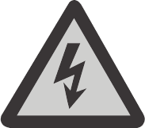
</td><td class="hb-symbol-meaning">
Risk of electric shock.
</td></tr><tr><td class="hb-symbol-icon">
</td><td class="hb-symbol-meaning">
Battery charging
</td></tr><tr><td class="hb-symbol-icon">
</td><td class="hb-symbol-meaning">
Explosive material
</td></tr><tr><td class="hb-symbol-icon">
</td><td class="hb-symbol-meaning">
Heavy object
</td></tr></tbody></table>

<table class="hb-symbol-panel-table"><colgroup><col class="hb-symbol-col-icon"/><col class="hb-symbol-col-meaning"/></colgroup><thead><tr><th class="hb-symbol-icon-heading" scope="col">
<strong>Symbol</strong>
</th><th class="hb-symbol-meaning-heading" scope="col">
<strong>Meaning</strong>
</th></tr></thead><tbody><tr><td class="hb-symbol-icon">
</td><td class="hb-symbol-meaning">
Do not dismantle the product.
</td></tr><tr><td class="hb-symbol-icon">
</td><td class="hb-symbol-meaning">
Keep the product away from fire.
</td></tr><tr><td class="hb-symbol-icon">
</td><td class="hb-symbol-meaning">
Keep away from children.
</td></tr><tr><td class="hb-symbol-icon">
</td><td class="hb-symbol-meaning">
This symbol indicates that a lithium-ion (Li-ion) battery is inside the product and should be disposed of or recycled properly.
</td></tr><tr><td class="hb-symbol-icon">
</td><td class="hb-symbol-meaning">
This symbol indicates that the product shall not be disposed of as household waste, and should be delivered to a designated collection facility for recycling. Proper disposal and recycling can help protect the environment. For more information about the disposal and recycling of this product, contact your local community, disposal service, or dealer.
</td></tr></tbody></table>

</figure>

# FCC

<figure aria-label="FCC" class="hb-fcc-composition" data-component-id="HB-SPECIAL-FCC">

This device complies with part 15 of the FCC Rules. Operation is subject to the following two conditions:

(1) This device may not cause harmful interference, and

(2) This device must accept any interference received, including interference that may cause undesired operation.

<strong>NOTE:</strong> This equipment has been tested and found to comply with the limits for a Class B digital device, pursuant to part 15 of the FCC Rules. These limits are designed to provide reasonable protection against harmful interference in a residential installation. This equipment generates, uses, and can radiate radio frequency energy and, if not installed and used in accordance with the instructions, may cause harmful interference to communications. However, there is no guarantee that radio interference will not occur in a particular installation.

If this equipment does cause harmful interference to radio or television reception, which can be determined by turning the equipment off and on, the user is encouraged to try to correct the interference by one or more of the following measures:
<ul class="simple"><li>
Reorient or relocate the receiving antenna.
</li><li>
Increase the separation between the equipment and receiver.
</li><li>
Connect the equipment into an outlet on a circuit different from that to which the receiver is connected.
</li><li>
Consult the dealer or an experienced radio/TV technician for help.
</li></ul>
<strong>MODIFICATION:</strong> Any changes or modifications not expressly approved by the grantee of this device could void the user's authority to operate the device.

</figure>

# WHAT\'S IN THE BOX

<figure aria-label="WHAT'S IN THE BOX" class="hb-inbox-composition" data-component-id="HB-SPECIAL-INBOX"><ol class="hb-inbox-grid"><li class="hb-inbox-card" data-item-number="1">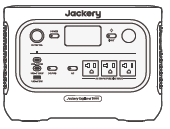

<strong>Jackery Explorer 1000</strong>

</li><li class="hb-inbox-card" data-item-number="2">

<strong>AC Charging Cable</strong>

</li><li class="hb-inbox-card" data-item-number="3">

Documents

</li></ol>

<strong>TIP</strong>

The car charging cable is not included but is available for purchase separately on our website.
For assistance, please contact Jackery customer service.

</figure>

# PRODUCT OVERVIEW

## FRONT VIEW

<figure class="hb-annotated-figure hb-has-composite-art" data-figure-id="product-overview-front" data-source-fragment-sha256="e276f6fdbe207295d589cb256559ede3cd420a66faeefdc0f6eda9c6b9e3a079" data-web-replace-key="product-overview.front">
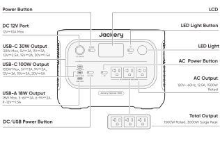

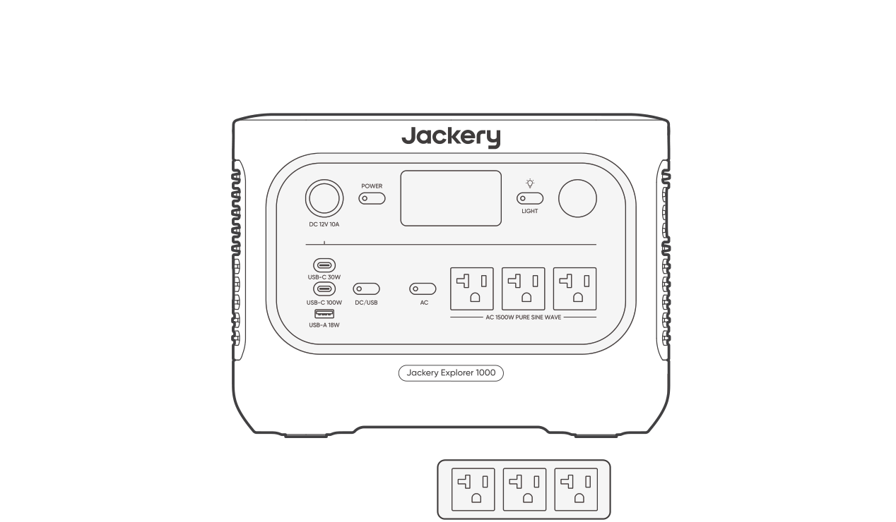<svg aria-hidden="true" class="hb-leader-layer" focusable="false" preserveAspectRatio="none" viewBox="0 0 100 100"><polyline class="hb-leader" data-callout-id="overview.front.power" points="1.101,8.518 41.169,8.518 41.169,33.378"></polyline><polyline class="hb-leader" data-callout-id="overview.front.lcd" points="99.005,8.519 51.04,8.519 51.04,33.506"></polyline><polyline class="hb-leader" data-callout-id="overview.front.dc12" points="1.101,25.722 35.787,25.722 35.787,35.193"></polyline><polyline class="hb-leader" data-callout-id="overview.front.led_button" points="99.006,21.853 59.042,21.853 59.042,32.851"></polyline><polyline class="hb-leader" data-callout-id="overview.front.usb_c_30" points="1.101,43.854 29.645,43.854 29.645,49.175 34.437,49.175"></polyline><polyline class="hb-leader" data-callout-id="overview.front.led" points="99.389,36.855 66.946,36.855"></polyline><polyline class="hb-leader" data-callout-id="overview.front.usb_c_100" points="1.486,57.141 33.346,57.141 33.346,53.33 34.353,53.33"></polyline><polyline class="hb-leader" data-callout-id="overview.front.ac_power" points="98.843,47.914 46.994,47.914 46.994,52.076"></polyline><polyline class="hb-leader" data-callout-id="overview.front.usb_a" points="1.124,78.5 35.787,78.5 35.787,61.68"></polyline><polyline class="hb-leader" data-callout-id="overview.front.ac_output" points="99.006,69.051 62.833,69.051 62.833,60.586"></polyline><polyline class="hb-leader" data-callout-id="overview.front.dc_usb" points="1.226,95.303 40.866,95.303 40.866,57.434"></polyline><polyline class="hb-leader" data-callout-id="overview.front.total" points="99.389,94.297 68.813,94.297"></polyline><polyline class="hb-leader-decoration" data-decoration-id="overview.front.decoration-1" points="58.644,60.581 58.644,85.435"></polyline></svg>

<strong>POWER Button</strong>

<strong>LCD</strong>

<strong>DC 12 V Port</strong>

12 V / 10 A max.

<strong>LED Light Button</strong>

<strong>USB-C 30 W Output</strong>

30 W max., 5 V⎓3 A, 9 V⎓3 A, 12 V⎓2.5 A, 15 V⎓2 A, 20 V⎓1.5 A

<strong>LED Light</strong>

<strong>USB-C 100 W Output</strong>

100 W max., 5 V⎓3 A, 9 V⎓3 A, 12 V⎓3 A, 15 V⎓3 A, 20 V⎓5 A

<strong>AC Power Button</strong>

<strong>USB-A 18 W Output</strong>

18 W max., 5-6 V⎓3 A, 6-9 V⎓2 A, 9-12 V⎓1.5 A

<strong>AC Output</strong>

120 V~ 60 Hz, 12.5 A max., 1500 W Rated

<strong>DC / USB Power Button</strong>

<strong>Total Output</strong>

1500 W Rated, 3000 W Surge Peak

</figure>

## RIGHT SIDE VIEW

<figure class="hb-annotated-figure hb-has-composite-art" data-figure-id="product-overview-right" data-source-fragment-sha256="c1035fe32507c54d3804e7bcf98e4020b8694766a5358d5da597cd50b977bca3" data-web-replace-key="product-overview.right">
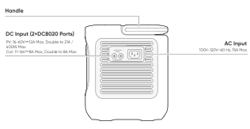

<svg aria-hidden="true" class="hb-leader-layer" focusable="false" preserveAspectRatio="none" viewBox="0 0 100 100"><polyline class="hb-leader" data-callout-id="overview.right.handle" points="1.416,9.834 55.045,9.834 55.045,18.308"></polyline><polyline class="hb-leader" data-callout-id="overview.right.dc_input" points="1.416,41.989 43.752,41.989"></polyline><polyline class="hb-leader" data-callout-id="overview.right.ac_input" points="98.813,40.483 56.874,40.483"></polyline></svg>

<strong>Handle</strong>

<strong>DC Input (2×DC8020 Ports)</strong>

PV: 16-60 V⎓12 A max., Double to 21 A / 400 W max.

Car: 11-16 V⎓8 A max., Double to 8 A max.

<strong>AC Input</strong>

100 V-120 V~ 60 Hz, 15 A max.

</figure>

# LCD DISPLAY

<figure aria-label="LCD icon meanings" class="hb-lcd-table-composition"><table class="longtable hb-lcd-icon-table"><colgroup><col class="hb-lcd-col-number"/><col class="hb-lcd-col-icon"/><col class="hb-lcd-col-name"/><col class="hb-lcd-col-description"/></colgroup>

<tbody>
<tr><td class="hb-lcd-number">
1
</td>
<td class="hb-lcd-icon">
</td>
<td class="hb-lcd-name">
Wi-Fi
</td>
<td class="hb-lcd-description">

<strong>On:</strong> Wi-Fi connected.

<strong>Blink:</strong> Ready to connect to Wi-Fi.

<strong>Off:</strong> Wi-Fi disconnected.

</td>
</tr>
<tr><td class="hb-lcd-number">
2
</td>
<td class="hb-lcd-icon">
</td>
<td class="hb-lcd-name">
Bluetooth
</td>
<td class="hb-lcd-description">

<strong>On:</strong> Bluetooth connected.

<strong>Blink:</strong> Ready to connect to Bluetooth.

<strong>Off:</strong> Bluetooth disconnected.

</td>
</tr>
<tr><td class="hb-lcd-number">
3
</td>
<td class="hb-lcd-icon">
</td>
<td class="hb-lcd-name">
Quiet Charging Mode
</td>
<td class="hb-lcd-description">

<strong>On:</strong> The noise during charging is significantly minimized, while the charging power is reduced and the charging speed slows down.

<strong>Off:</strong> Quiet Charging Mode is disabled.

Enable/disable this feature in the Jackery App. The setting is retained when the device is powered off.

</td>
</tr>
<tr><td class="hb-lcd-number">
4
</td>
<td class="hb-lcd-icon">
</td>
<td class="hb-lcd-name">
Charging Plan
</td>
<td class="hb-lcd-description">

Customizes the charging time of the Jackery Explorer 1000. Suitable for situations with fluctuating electricity prices, it allows for charging plans based on peak and off-peak electricity times, reducing electricity costs.

Enable/disable this feature in the Jackery App. The setting is retained when the device is powered off.

</td>
</tr>
<tr><td class="hb-lcd-number">
5
</td>
<td class="hb-lcd-icon">
</td>
<td class="hb-lcd-name">
Self-powered Mode
</td>
<td class="hb-lcd-description">

Maximizes the use of solar energy and reduces reliance on grid electricity by prioritizing stored solar energy, reducing electricity costs. The power station must be connected to both solar panels and the grid simultaneously, with the load power limited by bypass power.

Enable/disable this feature in the Jackery App. The setting is retained when the device is powered off.

</td>
</tr>
<tr><td class="hb-lcd-number">
6
</td>
<td class="hb-lcd-icon">
</td>
<td class="hb-lcd-name">
TOU Mode
</td>
<td class="hb-lcd-description">

<strong>On:</strong> TOU mode is enabled (default backup SOC: 60%). During peak periods, the product prioritizes discharging the battery to reduce peak electricity costs when the stored energy exceeds the backup SOC. During off peak periods, the product charges the battery from the grid to achieve peak shaving and valley filling.

<strong>Off:</strong> TOU mode is disabled. The product does not follow the TOU (time of use) strategy and operates according to the default power supply and charging logic.

Enable/disable this feature in the Jackery App. The setting is retained when the device is powered off.

</td>
</tr>
<tr><td class="hb-lcd-number">
7
</td>
<td class="hb-lcd-icon">
</td>
<td class="hb-lcd-name">
UPS
</td>
<td class="hb-lcd-description">

<strong>On:</strong> The product is operating in bypass mode. Loads connected to the AC ports consume power from the grid instead of the power station. If the grid suddenly fails, the product automatically switches to its battery power within 10 ms.

<strong>Off:</strong> The product is not in bypass mode. Loads connected to the AC ports are powered by the internal battery of the power station.

</td>
</tr>
<tr><td class="hb-lcd-number">
8
</td>
<td class="hb-lcd-icon">
</td>
<td class="hb-lcd-name">
AC Power Indicator
</td>
<td class="hb-lcd-description">
The AC output (pure sine wave) is on.
</td>
</tr>
<tr><td class="hb-lcd-number">
9
</td>
<td class="hb-lcd-icon">
</td>
<td class="hb-lcd-name">
Output Voltage and Frequency
</td>
<td class="hb-lcd-description">
Displays the output voltage and frequency when the AC output is turned on.
</td>
</tr>
<tr><td class="hb-lcd-number">
10
</td>
<td class="hb-lcd-icon">
</td>
<td class="hb-lcd-name">
Input Power
</td>
<td class="hb-lcd-description">
Displays the input power in watts.
</td>
</tr>
<tr><td class="hb-lcd-number">
11
</td>
<td class="hb-lcd-icon">
</td>
<td class="hb-lcd-name">
Remaining Charge Time
</td>
<td class="hb-lcd-description">
Displays the remaining charging time.
</td>
</tr>
<tr><td class="hb-lcd-number">
12
</td>
<td class="hb-lcd-icon">
</td>
<td class="hb-lcd-name">
AC Wall Charging Indicator
</td>
<td class="hb-lcd-description">
The product is charged via the AC Input using grid power.
</td>
</tr>
<tr><td class="hb-lcd-number">
13
</td>
<td class="hb-lcd-icon">
</td>
<td class="hb-lcd-name">
Car Charging Indicator
</td>
<td class="hb-lcd-description">
The product is charged via the DC Input (DC8020) using DC 12V (car charging).
</td>
</tr>
<tr><td class="hb-lcd-number">
14
</td>
<td class="hb-lcd-icon">
</td>
<td class="hb-lcd-name">
Solar Charging Indicator
</td>
<td class="hb-lcd-description">
The product is charged via the DC Input (DC8020) using solar panel(s).
</td>
</tr>
<tr><td class="hb-lcd-number">
15
</td>
<td class="hb-lcd-icon">
</td>
<td class="hb-lcd-name">
Battery Saving Mode
</td>
<td class="hb-lcd-description">

<strong>On:</strong> Battery Saving Mode is enabled. Charge and discharge limits are applied to help extend battery lifespan.

<strong>Off:</strong> Battery Saving Mode is disabled.

Enable/disable this feature in the Jackery App. The setting is retained when the device is powered off.

When this feature is enabled, the product occasionally performs a full charge and discharge cycle to calibrate the SOC.

</td>
</tr>
<tr><td class="hb-lcd-number">
16
</td>
<td class="hb-lcd-icon">
</td>
<td class="hb-lcd-name">
Charging Power Limit
</td>
<td class="hb-lcd-description">

<strong>On:</strong> Charging Power limit is enabled in the Jackery App.

<strong>Off:</strong> Charging Power limit is disabled in the Jackery App.

The setting is retained when the device is powered off.

</td>
</tr>
<tr><td class="hb-lcd-number">
17
</td>
<td class="hb-lcd-icon">
</td>
<td class="hb-lcd-name">
Battery Power Indicator
</td>
<td class="hb-lcd-description">
When the product is being charged, the orange circle around the battery percentage will light up in sequence. When charging other devices, the orange circle will stay on.
</td>
</tr>
<tr><td class="hb-lcd-number">
18
</td>
<td class="hb-lcd-icon">
</td>
<td class="hb-lcd-name">
Remaining Battery Percentage
</td>
<td class="hb-lcd-description">
Displays the remaining battery percentage.
</td>
</tr>
<tr><td class="hb-lcd-number">
19
</td>
<td class="hb-lcd-icon">
</td>
<td class="hb-lcd-name">
Low Battery Indicator
</td>
<td class="hb-lcd-description">

<strong>On:</strong> The battery level is below 20%.

<strong>Blink:</strong> The battery level is below 5%.

<strong>Off:</strong> The battery level is not below 20% or the product is charging.

</td>
</tr>
<tr><td class="hb-lcd-number">
20
</td>
<td class="hb-lcd-icon">
</td>
<td class="hb-lcd-name">
Discharge Timer
</td>
<td class="hb-lcd-description">

<strong>On:</strong> A discharge timer is set.

<strong>Off:</strong> No discharge timer is set.

Enable/disable this feature in the Jackery App. The setting is not retained when the device is powered off.

</td>
</tr>
<tr><td class="hb-lcd-number">
22
</td>
<td class="hb-lcd-icon">
</td>
<td class="hb-lcd-name">
Energy Saving Mode
</td>
<td class="hb-lcd-description">

When the AC or DC output is turned on by pressing the AC or DC/USB power button:

<strong>On:</strong> Energy Saving Mode is enabled.

<strong>Off:</strong> Energy Saving Mode is disabled.

The setting is retained when the device is powered off.

</td>
</tr>
<tr><td class="hb-lcd-number">
23
</td>
<td class="hb-lcd-icon">
</td>
<td class="hb-lcd-name">
High Temperature Indicator
</td>
<td class="hb-lcd-description">
High temperature protection is triggered. The product may stop functioning until its temperature returns to the normal operating range.
</td>
</tr>
<tr><td class="hb-lcd-number">
24
</td>
<td class="hb-lcd-icon">
</td>
<td class="hb-lcd-name">
Low Temperature Indicator
</td>
<td class="hb-lcd-description">

Low temperature protection is triggered.

The product may stop functioning until its temperature returns to the normal operating range.

</td>
</tr>
<tr><td class="hb-lcd-number">
25
</td>
<td class="hb-lcd-icon">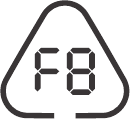
</td>
<td class="hb-lcd-name">
Fault code
</td>
<td class="hb-lcd-description">
A product error has occurred. Please refer to the Troubleshooting section for details.
</td>
</tr>
<tr><td class="hb-lcd-number">
26
</td>
<td class="hb-lcd-icon">
</td>
<td class="hb-lcd-name">
Output Power
</td>
<td class="hb-lcd-description">
Displays the output power in watts.
</td>
</tr>
<tr><td class="hb-lcd-number">
27
</td>
<td class="hb-lcd-icon">
</td>
<td class="hb-lcd-name">
Remaining Discharge Time
</td>
<td class="hb-lcd-description">
Displays the remaining discharging time.
</td>
</tr>
</tbody>
</table></figure>

# OPERATIONS

## POWER ON/OFF

<figure class="hb-operation-figure hb-operation-layout-status-right hb-has-composite-art" data-operation-id="main-power" data-source-fragment-sha256="01f995ade5e371cb39f73d74d82b19870877b65b485c117e0286a4b4ee81bcb6" data-web-replace-key="operation.main-power">
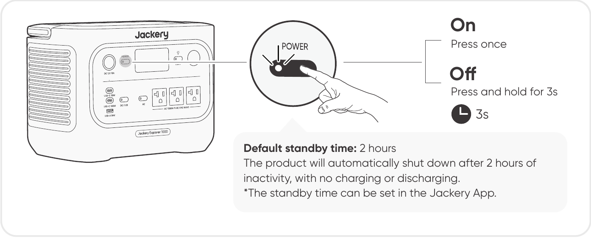

On: Press once.

Off: Press and hold for 3s.

<strong>Default standby time:</strong> 2 hours.

The product will automatically shut down after 2 hours of inactivity, with no charging or discharging.

*The standby time can be set in the Jackery App.

</figure>

When Energy Saving Mode is enabled, the product will automatically shut down after 12 hours if the AC or DC/USB power button is ON but the product is neither charging nor discharging.

## AC OUTPUT ON/OFF

<figure class="hb-operation-figure hb-operation-layout-status-right hb-has-composite-art" data-operation-id="ac-output" data-source-fragment-sha256="0e29b06a0a636991126862b686c09f3237a2a385d16c9e58421dea059cf3b84a" data-web-replace-key="operation.ac-output">
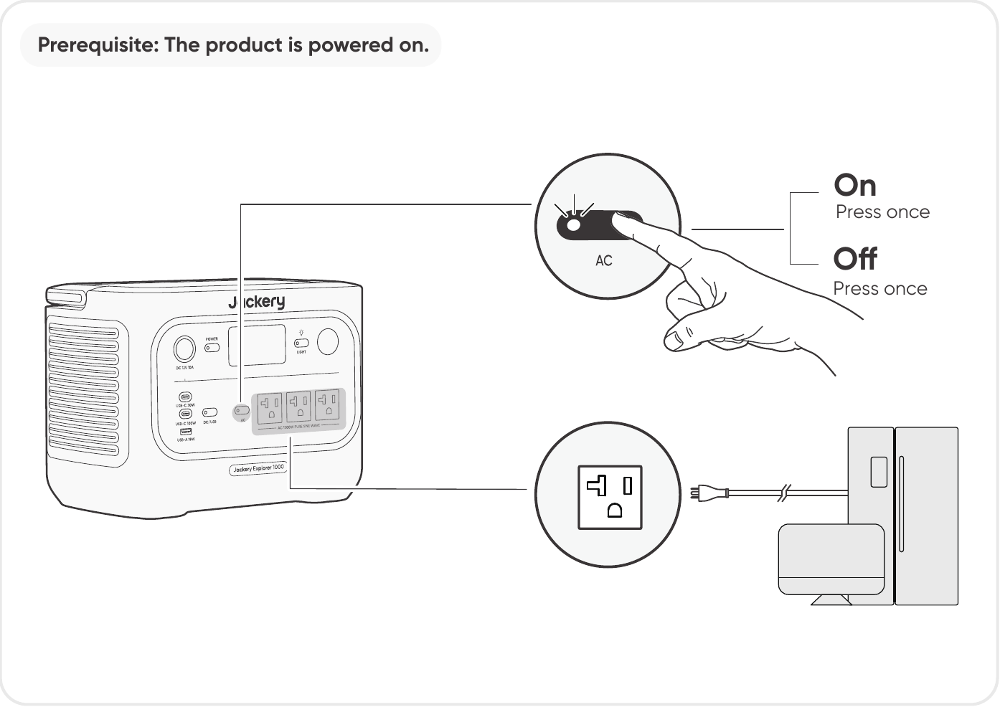

<strong>Prerequisite</strong>: The product is powered on.

<strong>On</strong>

Press once

<strong>Off</strong>

Press once

</figure>

## DC 12V/USB OUTPUT ON/OFF

<figure class="hb-operation-figure hb-operation-layout-status-right hb-has-composite-art" data-operation-id="dc-usb-output" data-source-fragment-sha256="be51378ed387cb0ef0aad1d604334be5de0cd40315893e4b1b024adc5cc737ca" data-web-replace-key="operation.dc-usb-output">
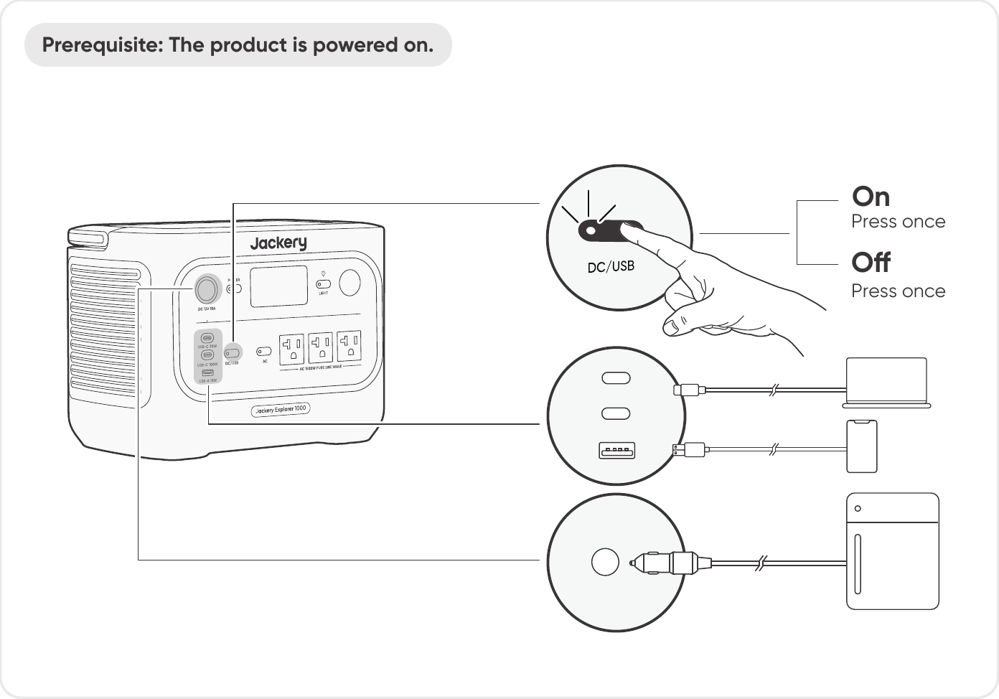

<strong>Prerequisite</strong>: The product is powered on.

<strong>On</strong>

Press once

<strong>Off</strong>

Press once

</figure>

<table class="manual-callout-table" style="width:100%; border-collapse:collapse; margin:0 0 16px 0;"><tbody><tr><td class="manual-callout-label" style="width:16%; border:1px solid #000; padding:6px 8px; vertical-align:top;">
<strong>CAUTION</strong>
</td><td class="manual-callout-body" style="border:1px solid #000; padding:6px 8px; vertical-align:top;"><ul class="simple">
<li>
<strong>USB-C 100W is a USB-PD Power Source 3 (PS3) high-power output port.</strong> If the connected user device or accessory does not meet safety requirements, there may be a fire risk. Before using these ports, ensure that the connected device or accessory has fire safety protection.
</li>
<li>
Only connect Jackery Explorer 1000 to devices or accessories that comply with clauses 6.3, 6.4, and 6.5 of IEC/EN/UL 62368-1 (or other equivalent standards).
</li>
<li>
To obtain maximum output power, use the USB-C to USB-C 5A cable (20V DC/5A, 100W).
</li>
</ul>
</td></tr></tbody></table>

The product can charge your car battery using the Jackery 12V automobile battery charging cable, which is sold separately and available on our website.

<table class="manual-callout-table" style="width:100%; border-collapse:collapse; margin:0 0 16px 0;"><tbody><tr><td class="manual-callout-label" style="width:16%; border:1px solid #000; padding:6px 8px; vertical-align:top;">
<strong>CAUTION</strong>
</td><td class="manual-callout-body" style="border:1px solid #000; padding:6px 8px; vertical-align:top;"><ul class="simple">
<li>
The DC 12V port is only compatible with 12V car batteries and not suitable for 24V systems.
</li>
<li>
Do not start the car while the product is charging the car battery through the 12V DC output port, as this may damage the product.
</li>
<li>
This feature is intended for emergency use only and cannot charge a dead or damaged car battery.
</li>
</ul>
</td></tr></tbody></table>

## ENERGY SAVING MODE

To prevent unnecessary battery consumption from forgetting to turn off the output, the product enables Energy Saving Mode by default. When the AC or DC/USB output is turned on, the Energy Saving Mode icon will be displayed on the LCD screen. In this mode, if no device is connected or the connected device\'s power consumption is below a certain threshold (25 W AC output or 2 W DC/USB output), the corresponding output will automatically turns off after the set time. The default setting is 12 hours. The Energy Saving Mode duration can be set in the Jackery App to 1 H, 2 H, 8 H, 12 H or 24 H. If it is set to Never Off, Energy Saving Mode will be disabled.

To disable the energy saving mode, press and hold both the AC power button and the POWER button for more than 3 seconds. Once Energy Saving Mode is disabled, the icon will no longer appear on the LCD screen, and the product will not automatically turn off the AC or USB output.

When powering low-power devices (AC ≤ 25 W or DC/USB ≤ 2 W), disable Energy Saving Mode to prevent the output from shutting down automatically during operation.

<figure class="hb-operation-figure hb-operation-layout-footer-overlay hb-has-composite-art" data-operation-id="energy-saving" data-source-fragment-sha256="d1e471435b17fcf3e0ec6ec54938f66e5fcf1be9a061b3302a965404f8c25a12" data-web-replace-key="operation.energy-saving">
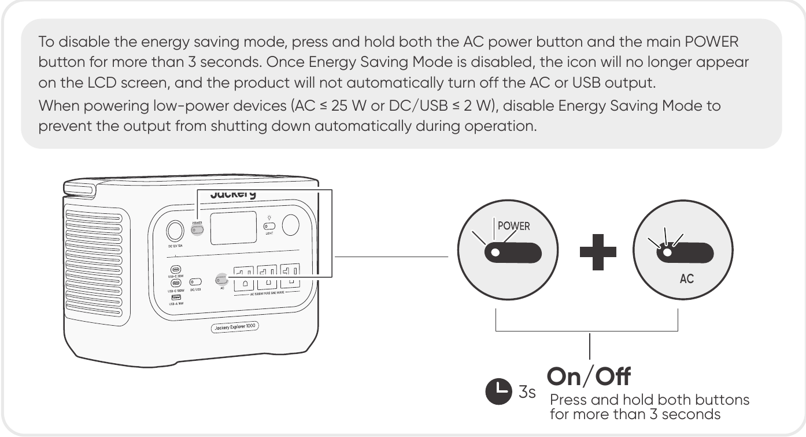

Press and hold both buttons for more than 3 seconds.

</figure>

<table class="manual-callout-table" style="width:100%; border-collapse:collapse; margin:0 0 16px 0;"><tbody><tr><td class="manual-callout-label" style="width:16%; border:1px solid #000; padding:6px 8px; vertical-align:top;">
<strong>NOTE</strong>
</td><td class="manual-callout-body" style="border:1px solid #000; padding:6px 8px; vertical-align:top;">
Energy Saving Mode resumes its previous state after powering on. Manual switching is required for mode changes.
</td></tr></tbody></table>

## LED LIGHT ON/OFF

<figure class="hb-operation-figure hb-operation-layout-footer-panel" data-operation-id="led-light" data-source-fragment-sha256="67650270634ec2e587ab7a5195585f20c0d92faccd0a2f622af14cd8b713e3d9" data-web-replace-key="operation.led-light">

The LED light has two modes: Light mode and SOS mode. In any mode, press and hold the LED light button to turn off the light.

Press the LED Light button once to turn on the light.

Press it again to switch to SOS Mode.

Press it a third time to turn off the light.

</figure>

## AC and DC Output Resume Function

The AC/DC Output Resume Function is disabled by default. Enable this function in the App to allow the device to memorize the AC/DC output status and automatically resume AC and DC outputs under defined conditions.

<figure aria-label="Auto Resume Conditions / Not Auto Resume Conditions" class="hb-auto-resume-composition"><table class="hb-auto-resume-table"><colgroup><col class="hb-auto-resume-col"/><col class="hb-auto-resume-col"/></colgroup>
<thead>
<tr><th class="head hb-auto-resume-left" scope="col">
Auto Resume Conditions
</th>
<th class="head hb-auto-resume-right" scope="col">
Not Auto Resume Conditions
</th>
</tr>
</thead>
<tbody>
<tr><td class="hb-auto-resume-left">
Power-on/Restart after shutdown or restart
</td>
<td class="hb-auto-resume-right">
Manual output off (button/App)
</td>
</tr>
<tr><td class="hb-auto-resume-left" rowspan="2">
Battery SOC ≥ discharge limit +10% after reaching limit
</td>
<td class="hb-auto-resume-right">
Energy Saving mode output off
</td>
</tr>
<tr>
<td class="hb-auto-resume-right">
Protection-triggered output off
</td>
</tr>
<tr><td class="hb-auto-resume-left">
OTA upgrade completed
</td>
<td class="hb-auto-resume-right">
Discharge timer-triggered output off
</td>
</tr>
</tbody>
</table></figure>

## LCD SCREEN

<figure aria-label="LCD display mode placeholder." class="hb-lcd-mode-composition">

<table class="hb-lcd-mode-table"><colgroup><col class="hb-lcd-mode-col-state"/><col class="hb-lcd-mode-col-action"/><col class="hb-lcd-mode-col-copy"/></colgroup>
<tr>

<td class="hb-lcd-mode-state" rowspan="3">Shortly On</td>
<td class="hb-lcd-mode-action">Turn on</td>
<td class="hb-lcd-mode-copy">Press the POWER button or when the product is charging.</td>
</tr>
<tr>
<td class="hb-lcd-mode-action">Turn off</td>
<td class="hb-lcd-mode-copy">Press the POWER button.</td>
</tr>
<tr>
<td class="hb-lcd-mode-action">Auto-off</td>
<td class="hb-lcd-mode-copy">The LCD turns off automatically and enters sleep mode after 2 minutes of inactivity.</td>
</tr>
<tr>
<td class="hb-lcd-mode-state" rowspan="3">Steady On (in charging or discharging state)</td>
<td class="hb-lcd-mode-action">Turn on</td>
<td class="hb-lcd-mode-copy">Press the POWER button twice when the product is powered on.</td>
</tr>
<tr>
<td class="hb-lcd-mode-action">Turn off</td>
<td class="hb-lcd-mode-copy">Press the POWER button.</td>
</tr>
<tr>
<td class="hb-lcd-mode-action">Auto-off</td>
<td class="hb-lcd-mode-copy">The LCD turns off automatically after 2 hours of inactivity.</td>
</tr>
</table>
</figure>

You can also set the screen display mode in the Jackery App.

## KEY COMBINATION

| Buttons | Operation | Function |
|----|----|----|
| POWER button + AC Power Button | Press and hold both for 3s | Turn on/off the Energy Saving Mode |
| POWER button + DC/USB Power Button | Press and hold both for 3s | Reset Wi-Fi and Bluetooth |
| DC/USB Power Button + AC Power Button | Press and hold both for 1s | Turn on/off Wi-Fi and Bluetooth |
| POWER button + LED Light button | Press and hold both for 1s | Turn on/off Emergency Charging Mode |

# UNINTERRUPTIBLE POWER SUPPLY (UPS)

Connect the product to a wall outlet with the AC charging cable, then press the AC power button and power your appliances at the same time.

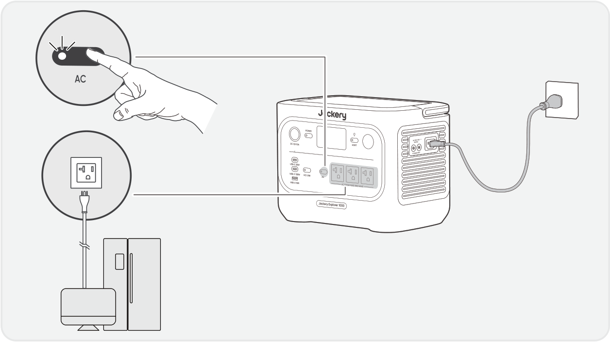

An uninterruptible power supply (UPS) is a type of continual power system that provides automated backup electric power to a load when the mains grid power fails.

In the event of a sudden loss of grid power, Jackery Explorer 1000 will automatically switch to stored power within 10 ms to keep your appliances running.

In UPS mode, the unit\'s peak output reaches 12 A before power outages. As simultaneous charging/discharging is enabled in Bypass Mode,

the actual output power is lower than the rated output power in this mode but returns to rated output power during outages.

<table class="manual-callout-table" style="width:100%; border-collapse:collapse; margin:0 0 16px 0;"><tbody><tr><td class="manual-callout-label" style="width:16%; border:1px solid #000; padding:6px 8px; vertical-align:top;">
<strong>CAUTION</strong>
</td><td class="manual-callout-body" style="border:1px solid #000; padding:6px 8px; vertical-align:top;"><ul class="simple">
<li>
This product does not support 0 ms switching. Do not connect it to equipment that requires a 0 ms switching power supply, such as data servers or workstations.
</li>
<li>
Before use, please test compatibility with your device multiple times.
</li>
<li>
Do not connect loads exceeding the maximum output power of the product. Otherwise, overload protection will be triggered.
</li>
</ul>
</td></tr></tbody></table>

# CHARGING

**Green energy first:** We advocate using green energy first. This product supports two modes of charging at the same time: solar charging and AC wall charging. When AC wall charging and solar charging are turned on at the same time, the product will give priority to solar charging, and both methods will be used to charge the battery at the maximum permissible power.

**Fully charge the product before its first use.**

<table class="manual-callout-table" style="width:100%; border-collapse:collapse; margin:0 0 16px 0;"><tbody><tr><td class="manual-callout-label" style="width:16%; border:1px solid #000; padding:6px 8px; vertical-align:top;">
<strong>NOTE</strong>
</td><td class="manual-callout-body" style="border:1px solid #000; padding:6px 8px; vertical-align:top;"><ul class="simple">
<li>
The recommended charging temperature for the product ranges from 32°F to 113°F / 0°C to 45°C, and the discharging temperature ranges from 14°F to 113°F / -10°C to 45°C.
</li>
<li>
Operating the product beyond this temperature range may restrict its charging and discharging capabilities, or even prevent it from charging or discharging.
</li>
<li>
The charging power and battery capacity of the product may vary due to temperature fluctuations.
</li>
</ul>
</td></tr></tbody></table>

## CHARGING VIA AC WALL OUTLET

Connect the AC charging cable to the AC input port of the product and a wall outlet.

<table class="manual-callout-table" style="width:100%; border-collapse:collapse; margin:0 0 16px 0;"><tbody><tr><td class="manual-callout-label" style="width:16%; border:1px solid #000; padding:6px 8px; vertical-align:top;">
<strong>CAUTION</strong>
</td><td class="manual-callout-body" style="border:1px solid #000; padding:6px 8px; vertical-align:top;">
Make sure the AC charging cable is fully and securely plugged into the AC input port. An incomplete connection may cause unstable current, overheating, poor contact, or device malfunction.
</td></tr></tbody></table>

**Emergency Charging Mode**

Under this mode, you can rapidly power up the portable power station using the AC charging method. This emergency charge function can be activated or deactivated through the Jackery App. When in emergency charging mode, the circular light indicating the state of charge (SOC) will blink at an increased pace.

\*To maximize battery lifespan, it is best to charge at normal speed. Use emergency charging mode only when necessary. It\'s not recommended for regular, long-term use.

## CHARGING VIA SOLAR PANELS (SOLD SEPARATELY)

Jackery Explorer 1000 has two DC8020 input ports and is compatible with the Jackery solar panels.

If one DC8020 input port needs to connect two solar panels simultaneously, please refer to the figure below for charging through the solar panel connector (sold separately, not included as standard).

<table class="manual-callout-table" style="width:100%; border-collapse:collapse; margin:0 0 16px 0;"><tbody><tr><td class="manual-callout-label" style="width:16%; border:1px solid #000; padding:6px 8px; vertical-align:top;">
<strong>CAUTION</strong>
</td><td class="manual-callout-body" style="border:1px solid #000; padding:6px 8px; vertical-align:top;">
One DC8020 input port can be connected to at most two solar panels.
</td></tr></tbody></table>

<table class="manual-callout-table" style="width:100%; border-collapse:collapse; margin:0 0 16px 0;"><tbody><tr><td class="manual-callout-label" style="width:16%; border:1px solid #000; padding:6px 8px; vertical-align:top;">
<strong>CAUTION</strong>
</td><td class="manual-callout-body" style="border:1px solid #000; padding:6px 8px; vertical-align:top;">
Ensure that the input voltage for both DC input ports is the same. Failure to do so may damage the product. For example:

<ul class="simple">
<li>
Use the same model of Jackery solar panels and the same number of panels when connecting solar panels to both DC8020 Input ports.
</li>
<li>
Do not charge the product using both a car charger and a solar panel simultaneously. Doing so may blow the car fuse or result in charging failure.
</li>
</ul>
</td></tr></tbody></table>

It is recommended to use the Jackery solar panel to charge the product. Ensure that the open-circuit voltage (Voc) of the solar panel is within the DC input range (16V-60V) of Jackery Explorer 1000. Jackery is not responsible for any damage or loss resulting from the use of third-party solar panels.

## CHARGING VIA A CAR CHARGER (SOLD SEPARATELY)

This product can be charged using a 12V car charger. Ensure that the car charger and the 12V car power outlet (car cigarette lighter) provide a good connection.

<figure class="hb-reference-figure hb-has-composite-art" data-reference-id="charging-car" data-source-fragment-sha256="517541c7cc5ac5bbfc6c28beb4d4514ed19ba8bf30a4f84262ec77f599bf867e" data-web-replace-key="reference.charging-car">
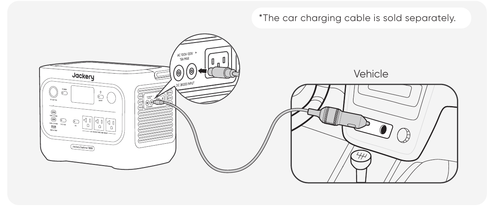

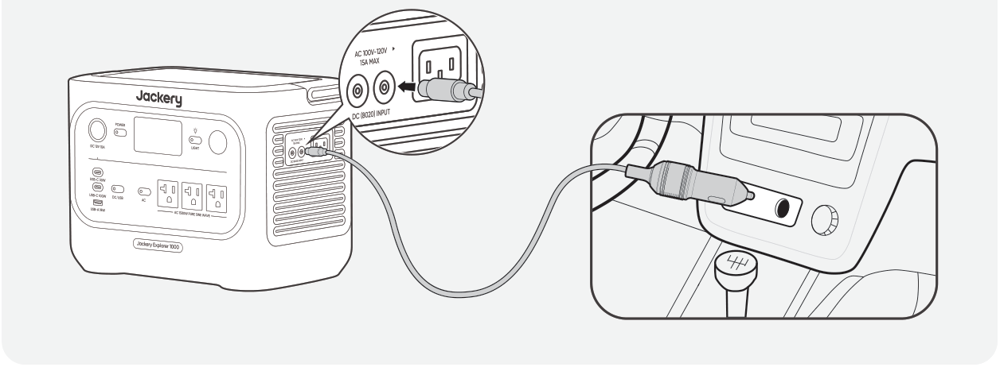

Vehicle

*The car charging cable is sold separately.

</figure>

<table class="manual-callout-table" style="width:100%; border-collapse:collapse; margin:0 0 16px 0;"><tbody><tr><td class="manual-callout-label" style="width:16%; border:1px solid #000; padding:6px 8px; vertical-align:top;">
<strong>CAUTION</strong>
</td><td class="manual-callout-body" style="border:1px solid #000; padding:6px 8px; vertical-align:top;"><ul class="simple">
<li>
Please start the vehicle before charging your power station.
</li>
<li>
If the vehicle is running on bumpy roads, it is forbidden to use the car charger in case it causes non-standard operation. The Company will not be responsible for any loss caused by non-standard operation.
</li>
<li>
Vehicle charging is only applicable to vehicles with 12V DC, not 24V DC. Please do not charge this product in a 24V vehicle to avoid personal injury and property loss.
</li>
</ul>
</td></tr></tbody></table>

# STORAGE

Store the product in a dry, clean place with proper ventilation. Storage temperature and humidity:

- 1 month: -4 °F to 113 °F / -20 °C to 45 °C (0-60 % RH)

- 3 months: 32 °F to 113 °F / 0 °C to 45°C (0-60 % RH)

- 12 months: 32 °F to 77°F / 0 °C to 25°C (0-60 % RH)

If this product is stored for a long period of time (3 months - 6 months) with the power depleted, it may become unchargeable. To prevent this and maintain battery health, it is recommended to check and recharge the product every three months and perform a full charge and discharge cycle at least once every 6 to 12 months.

# TROUBLESHOOTING

If any of the following fault codes appear, follow the listed corrective actions to resolve the issue. If the fault persists, please contact Jackery Customer Support.

<figure aria-label="Error Code / Corrective Measures" class="hb-troubleshooting-composition"><table class="longtable hb-troubleshooting-table"><colgroup><col class="hb-troubleshooting-col-code"/><col class="hb-troubleshooting-col-measures"/></colgroup>

<thead>
<tr><th class="head hb-troubleshooting-code" scope="col">
Error Code
</th>
<th class="head hb-troubleshooting-measures" scope="col">
Corrective Measures
</th>
</tr>
</thead>
<tbody>
<tr><td class="hb-troubleshooting-code">
F0
</td>
<td class="hb-troubleshooting-measures">
Restart the product.
</td>
</tr>
<tr><td class="hb-troubleshooting-code">
F1
</td>
<td class="hb-troubleshooting-measures">
Restart the product.
</td>
</tr>
<tr><td class="hb-troubleshooting-code">
F2
</td>
<td class="hb-troubleshooting-measures">
Restart the product.
</td>
</tr>
<tr><td class="hb-troubleshooting-code">
F3
</td>
<td class="hb-troubleshooting-measures">
Restart the product.
</td>
</tr>
<tr><td class="hb-troubleshooting-code">
F4
</td>
<td class="hb-troubleshooting-measures">
Connect the product to loads to discharge its battery until the fault disappears.
</td>
</tr>
<tr><td class="hb-troubleshooting-code">
F5
</td>
<td class="hb-troubleshooting-measures">
Charge the product via solar panels or an AC wall outlet until the fault disappears.
</td>
</tr>
<tr><td class="hb-troubleshooting-code">
F6
</td>
<td class="hb-troubleshooting-measures">

1. Wait for the grid to normalize before charging the product via an AC wall outlet.

2. Check whether the air intake and exhaust vents are blocked; ensure 0.66 ft (20 cm) clearance on both sides of the product.

3. Place the product in a location that is not exposed to direct sunlight or high environmental temperatures.

4. Disconnect all loads from the product. Keep the product idle and wait until the fault disappears.

5. Restart the product.

</td>
</tr>
<tr><td class="hb-troubleshooting-code">
F7
</td>
<td class="hb-troubleshooting-measures">

1. Remove all DC inputs from the product.

2. Check the open-circuit voltage (Voc) of the connected solar panels. The product allows a maximum DC input voltage of 60V.

3. Restart the product and keep it idle. Wait until the fault disappears.

</td>
</tr>
<tr><td class="hb-troubleshooting-code">
F8
</td>
<td class="hb-troubleshooting-measures">
Contact Jackery Customer Support.
</td>
</tr>
<tr><td class="hb-troubleshooting-code">
F9
</td>
<td class="hb-troubleshooting-measures">
Remove the load connected to the USB ports of the product. Wait until the fault disappears.
</td>
</tr>
<tr><td class="hb-troubleshooting-code">
FE
</td>
<td class="hb-troubleshooting-measures">
Contact Jackery Customer Support.
</td>
</tr>
</tbody>
</table></figure>

# SPECIFICATIONS

## GENERAL INFO

<figure aria-label="GENERAL INFO" class="hb-spec-table-composition"><table class="manual-table manual-spec-table hb-spec-table"><colgroup><col class="hb-spec-col-label"/><col class="hb-spec-col-value"/></colgroup><tbody><tr><th class="manual-spec-label hb-spec-label" scope="row">Product Name</th><td class="manual-spec-value hb-spec-value">Jackery Explorer 1000</td></tr><tr><th class="manual-spec-label hb-spec-label" scope="row">Model No.</th><td class="manual-spec-value hb-spec-value">JE-1000F / JE-1000F-SG</td></tr><tr><th class="manual-spec-label hb-spec-label" scope="row">Capacity</th><td class="manual-spec-value hb-spec-value">1024 Wh (20 Ah / 51.2 V DC)</td></tr><tr><th class="manual-spec-label hb-spec-label" scope="row">Cell Chemistry</th><td class="manual-spec-value hb-spec-value">LiFePO₄</td></tr><tr><th class="manual-spec-label hb-spec-label" scope="row">Weight</th><td class="manual-spec-value hb-spec-value">About 23.4 lbs / 10.6 kg</td></tr><tr><th class="manual-spec-label hb-spec-label" scope="row">Dimensions</th><td class="manual-spec-value hb-spec-value">12.4 x 7.9 x 9.2 in / 31.4 x 20.1 x 23.4 cm</td></tr><tr><th class="manual-spec-label hb-spec-label" scope="row">Cycle Life</th><td class="manual-spec-value hb-spec-value">4000 cycles to 70%+ capacity</td></tr></tbody></table></figure>

## INPUT PORTS

<figure aria-label="INPUT PORTS" class="hb-spec-table-composition"><table class="manual-table manual-spec-table hb-spec-table"><colgroup><col class="hb-spec-col-label"/><col class="hb-spec-col-value"/></colgroup><tbody><tr><th class="manual-spec-label hb-spec-label" rowspan="2" scope="row">1 × AC Input</th><td class="manual-spec-value hb-spec-value">Charge Mode: 100-120 V~ 60 Hz, 15 A max.</td></tr><tr><td class="manual-spec-value hb-spec-value">Bypass Mode①: 100-120 V~ 60 Hz, 12 A max.</td></tr><tr><th class="manual-spec-label hb-spec-label" rowspan="2" scope="row">2 × DC8020 Ports</th><td class="manual-spec-value hb-spec-value">11 V-16 V⎓8 A max., Double to 8 A max.</td></tr><tr><td class="manual-spec-value hb-spec-value">16 V-60 V⎓12 A, Double to 21 A / 400 W max.</td></tr></tbody></table></figure>

## OUTPUT PORTS

<figure aria-label="OUTPUT PORTS" class="hb-spec-table-composition"><table class="manual-table manual-spec-table hb-spec-table"><colgroup><col class="hb-spec-col-label"/><col class="hb-spec-col-value"/></colgroup><tbody><tr><th class="manual-spec-label hb-spec-label" scope="row">3 × AC</th><td class="manual-spec-value hb-spec-value">120 V~ 60 Hz, 12.5 A max., 1500 W Rated per port, 1500 W in Total, 3000 W Surge Peak</td></tr><tr><th class="manual-spec-label hb-spec-label" scope="row">AC Output in Bypass Mode①</th><td class="manual-spec-value hb-spec-value">100V-120V~60Hz, 12A max.</td></tr><tr><th class="manual-spec-label hb-spec-label" rowspan="2" scope="row">2 × USB-C</th><td class="manual-spec-value hb-spec-value">30 W max., 5 V⎓3 A, 9 V⎓3 A, 12 V⎓2.5 A, 15 V⎓2 A, 20 V⎓1.5 A</td></tr><tr><td class="manual-spec-value hb-spec-value">100 W max., 5 V⎓3 A, 9 V⎓3 A, 12 V⎓3 A, 15 V⎓3 A, 20 V⎓5 A</td></tr><tr><th class="manual-spec-label hb-spec-label" scope="row">1 × USB-A</th><td class="manual-spec-value hb-spec-value">18 W max., 5-6 V⎓3 A, 6-9 V⎓2 A, 9-12 V⎓1.5 A</td></tr><tr><th class="manual-spec-label hb-spec-label" scope="row">1 × DC 12 V Port</th><td class="manual-spec-value hb-spec-value">12 V⎓10 A max.</td></tr></tbody></table></figure>

## ENVIRONMENTAL OPERATING TEMPERATURE

<figure aria-label="ENVIRONMENTAL OPERATING TEMPERATURE" class="hb-spec-table-composition"><table class="manual-table manual-spec-table hb-spec-table"><colgroup><col class="hb-spec-col-label"/><col class="hb-spec-col-value"/></colgroup><tbody><tr><th class="manual-spec-label hb-spec-label" scope="row">Charging Temperature</th><td class="manual-spec-value hb-spec-value">32°F to 113°F / 0°C to 45°C</td></tr><tr><th class="manual-spec-label hb-spec-label" scope="row">Discharging Temperature</th><td class="manual-spec-value hb-spec-value">14°F to 113°F / -10°C to 45°C</td></tr></tbody></table></figure>

 

※ USB Type-C® and USB-C® are registered trademarks of USB Implementers Forum.

① The product can charge the battery from the AC wall outlet while delivering power through the AC output ports.

# WARRANTY

<figure aria-label="WARRANTY" class="hb-warranty-intro-composition">

<strong>This warranty applies only to customers who purchase from the official Jackery website, Jackery-branded third-party platforms, or local authorized dealers.</strong>

*Warranty period and details may vary according to local laws, regulations, and authorized dealers.

</figure>

## Limited Warranty

<figure aria-label="Limited Warranty" class="hb-warranty-card" data-warranty-card-index="1">
Jackery Inc. warrants to the original consumer purchaser that the Jackery product will be free from defects in workmanship and material under normal consumer use during the applicable warranty period identified in the 'Warranty Period' section below, subject to the exclusions set forth below.

This warranty statement sets forth Jackery's total and exclusive warranty obligation. We will not assume, nor authorize any person to assume for us, any other liability in connection with the sale of our products.
</figure>

## Warranty Period

<figure aria-label="Warranty Period" class="hb-warranty-period-card">

3
<strong class="hb-warranty-years-unit">YEARS</strong><strong class="hb-warranty-period-label">Standard Warranty</strong>

The standard warranty period for Jackery Explorer 1000 is 36 months.
In each case, the warranty period is measured starting on the date of purchase by the original consumer purchaser.
The sales receipt from the first consumer purchaser, or other reasonable documentary proof, is required in order to establish the start date of the warranty period.

2
<strong class="hb-warranty-years-unit">YEARS</strong><strong class="hb-warranty-period-label">Extended Warranty</strong>

To activate the Warranty Extension, you must register your product online or contact our customer service team at <a class="reference external" href="mailto:hello@jackery.com">hello@jackery.com</a> to extend the standard warranty period.

</figure>

## Repair or replacement

<figure aria-label="Repair or replacement" class="hb-warranty-card" data-warranty-card-index="3">
Jackery will repair or replace (at Jackery's expense) any Jackery product that fails to operate during the applicable warranty period due to a defect in workmanship or materials.
The repaired/replaced product assumes the remaining warranty of the original date of purchase.
</figure>

## Limited to Original Consumer Buyer

<figure aria-label="Limited to Original Consumer Buyer" class="hb-warranty-card" data-warranty-card-index="4">
The warranty on Jackery's product is limited to the original consumer purchaser and is not transferable to any subsequent owner.
</figure>

## Exclusions

<figure aria-label="Exclusions" class="hb-warranty-card" data-warranty-card-index="5">
Jackery's warranty does not apply to:
<ul class="simple">
<li>
Any product that has been misused, abused, modified, damaged by accident, or used for anything other than normal consumer use as authorized in Jackery's current product literature.
</li>
<li>
Attempted repair by anyone other than an authorized facility.
</li>
<li>
Any product purchased through an online auction house.
</li>
<li>
Jackery's warranty does not apply to the battery cell unless the battery cell is fully charged by you within seven days after you purchase the product and at least once every 6 months thereafter.
</li>
</ul></figure>

## Interpretation Rights

<figure aria-label="Interpretation Rights" class="hb-warranty-card" data-warranty-card-index="6">
Jackery reserves the right to the final interpretation of the above customer after-sales policy.
</figure>

# APP SETUP

## 1. Download the App and log in

<figure aria-label="1. Download the App and log in" class="hb-app-download-composition">

Search for "Jackery" in Google Play or App Store to install the App. After that, you can register and log in.

Alternatively, scan the QR code below to download and install the App.

</figure>

## 2. Add device

2.1 Click the + button to add your device.

2.2 Press the POWER button on the device to turn on, the Wi-Fi and Bluetooth icons on the device flash to indicate that the device has entered the network configuration mode, tap the \"**Icon Flashed**\" button, and allow the App to connect to nearby devices and open Bluetooth permissions.

<figure class="hb-app-add-device-composition" data-reference-id="app-add-device" data-step-captions="embedded">

POWER ButtonAC Power ButtonDC / USB Power Button
</figure>

2.3 After tapping the searched device icon, the App automatically connects the device via Bluetooth.

<table class="manual-callout-table" style="width:100%; border-collapse:collapse; margin:0 0 16px 0;"><tbody><tr><td class="manual-callout-label" style="width:16%; border:1px solid #000; padding:6px 8px; vertical-align:top;">
<strong>NOTE</strong>
</td><td class="manual-callout-body" style="border:1px solid #000; padding:6px 8px; vertical-align:top;">
If "<strong>the device has been bound</strong>" is prompted during the binding process, the following two ways can be used for connection:

<ul class="simple">
<li>
The device owner will share this device with other users through the App.
</li>
<li>
Press and hold POWER button + DC / USB power button for 3 seconds to reset the device's Wi-Fi and Bluetooth, and then re-bind the device.
</li>
</ul>
</td></tr></tbody></table>

2.4 After the device is successfully connected, enter your Wi-Fi password and tap the **OK** button.

<table class="manual-callout-table" style="width:100%; border-collapse:collapse; margin:0 0 16px 0;"><tbody><tr><td class="manual-callout-label" style="width:16%; border:1px solid #000; padding:6px 8px; vertical-align:top;">
<strong>NOTE</strong>
</td><td class="manual-callout-body" style="border:1px solid #000; padding:6px 8px; vertical-align:top;"><ul class="simple">
<li>
Please select a Wi-Fi network in the 2.4 GHz band. The device does not support a Wi-Fi network in the 5 GHz band.
</li>
</ul>
</td></tr></tbody></table>

2.5 After the device is successfully added to the App, the Wi-Fi icon on the device will always be on.

<figure class="hb-reference-figure hb-has-composite-art" data-reference-id="app-connect-result" data-source-fragment-sha256="7a8700a6aa1dee58a471d51dac7f12f96dc512196cf2308ec569f5ea6e0f5f62" data-step-captions="embedded" data-web-replace-key="reference.app-connect-result">
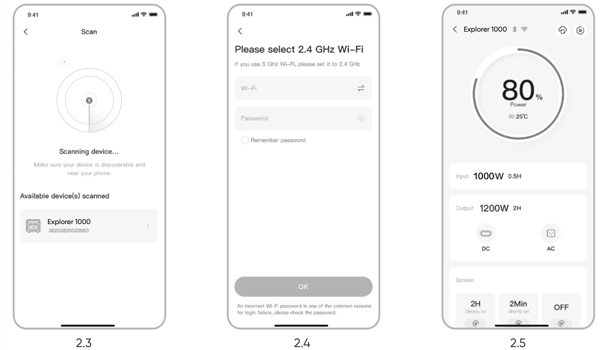

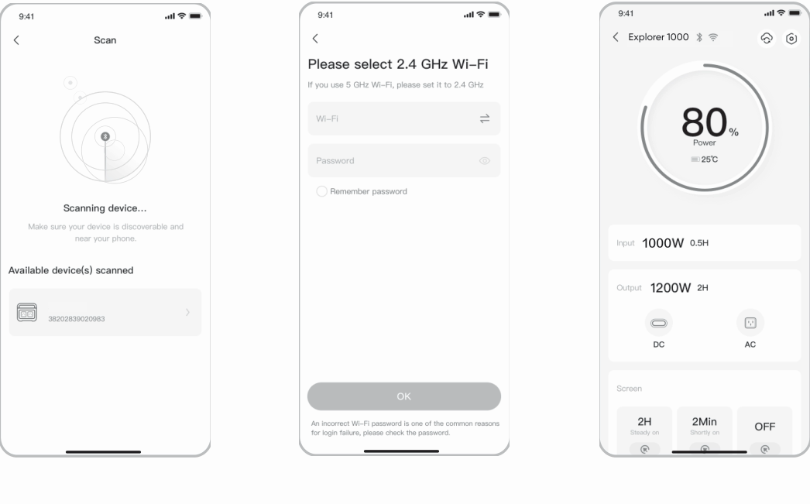
</figure>

The above screenshots are for reference only.

<table class="manual-callout-table" style="width:100%; border-collapse:collapse; margin:0 0 16px 0;"><tbody><tr><td class="manual-callout-label" style="width:16%; border:1px solid #000; padding:6px 8px; vertical-align:top;">
<strong>CAUTION</strong>
</td><td class="manual-callout-body" style="border:1px solid #000; padding:6px 8px; vertical-align:top;">
The Jackery App can connect to only one power station via Bluetooth at a time. Returning to the device list automatically disconnects Bluetooth. Tap the power station in the list again to reconnect automatically.
</td></tr></tbody></table>

## 3. Unbind the device

Click the **Settings** icon in the upper right corner of the main interface of the device to enter the settings page, and click the **Unbind** button at the bottom of the page to unbind the device.

## 4. Notes

### 4.1 To turn on Wi-Fi and Bluetooth

- Wi-Fi and Bluetooth are automatically turned on after the device is on, and the Wi-Fi and Bluetooth icons on the screen light up.

- Hold DC / USB power button + AC power button at the same time until the Wi-Fi and Bluetooth icons on the screen light up.

### 4.2 To turn off Wi-Fi and Bluetooth

Hold DC / USB power button + AC power button at the same time until the Wi-Fi and Bluetooth icons on the screen are off.

### 4.3 To reset Wi-Fi and Bluetooth

Hold POWER button + DC / USB power button at the same time for 3 seconds to reset Wi-Fi and Bluetooth to factory settings. The connected App account will be unbound.

# INFORMATIONS DE SÉCURITÉ IMPORTANTES

<table class="manual-callout-table" style="width:100%; border-collapse:collapse; margin:0 0 16px 0;"><tbody><tr><td class="manual-callout-label" style="width:16%; border:1px solid #000; padding:6px 8px; vertical-align:top;">
<strong>AVERTISSEMENT</strong>
</td><td class="manual-callout-body" style="border:1px solid #000; padding:6px 8px; vertical-align:top;">
INSTRUCTIONS CONCERNANT LES RISQUES D’INCENDIE, DE CHOC ÉLECTRIQUE OU DE BLESSURES
</td></tr></tbody></table>

<table class="manual-two-col-table" style="width:100%; border-collapse:separate; border-spacing:12px 0; margin:0 0 16px 0;">
<colgroup>
<col style="width: 50%" />
<col style="width: 50%" />
</colgroup>
<tbody>
<tr>
<td style="width: 50%; border: none; padding: 0 8px 0 0; vertical-align: top">
Respectez toujours les précautions de base lors de l'utilisation de ce produit.

<ul>
<li>Lisez toutes les instructions avant d’utiliser le produit.</li>
<li>Ne laissez pas les enfants jouer avec du produit. Une surveillance étroite est nécessaire lorsque le produit est utilisé à proximité d’enfants.</li>
<li>Évitez de placer les mains ou les doigts à l’intérieur du produit.</li>
<li>Arrêtez immédiatement d’utiliser le produit s’il a été endommagé physiquement ou modifié. Une mauvaise utilisation peut entraîner un comportement imprévisible, un incendie, une explosion ou des blessures.</li>
<li>Si vous constatez une surchauffe, une odeur inhabituelle, de la fumée, des fuites ou des brûlures, cessez immédiatement l’utilisation et contactez le revendeur ou notre service client.</li>
<li>Ne tentez jamais d’ouvrir, de réparer ou de modifier le produit. Toute altération ou réassemblage peut entraîner un choc électrique, un incendie ou des dommages à la batterie.</li>
</ul></td>
<td style="width: 50%; border: none; padding: 0 0 0 8px; vertical-align: top"><ul>
<li>Soyez conscient que le liquide éjecté peut causer une irritation ou des brûlures. Une mauvaise utilisation peut provoquer des fuites. Évitez tout contact direct. En cas de contact avec les yeux, consultez immédiatement un médecin. En cas de contact avec la peau, rincez abondamment à l’eau claire et consultez un professionnel de santé sans tarder.</li>
<li>N’exposez pas le produit au feu ni à des températures excessives. Une température supérieure à 130°C peut entraîner une explosion.</li>
<li>L’utilisation de pièces non recommandées ou non fournies peut entraîner un risque d’incendie, de choc électrique ou de blessures.</li>
<li>Ne laissez jamais la batterie en charge sans surveillance pendant de longues périodes. Surveillez toujours la charge pour assurer une utilisation sûre.</li>
<li>Pour réduire le risque de choc électrique, débranchez le produit de toute source d’alimentation avant d’effectuer un entretien technique ou un dépannage.</li>
</ul></td>
</tr>
</tbody>
</table>

## INSTRUCTIONS D\'UTILISATION

<table class="manual-two-col-table" style="width:100%; border-collapse:separate; border-spacing:12px 0; margin:0 0 16px 0;">
<colgroup>
<col style="width: 50%" />
<col style="width: 50%" />
</colgroup>
<tbody>
<tr>
<td style="width: 50%; border: none; padding: 0 8px 0 0; vertical-align: top">
CONSERVEZ CES INSTRUCTIONS

<ul>
<li>Cessez immédiatement d’utiliser le produit s’il présente des signes de dommage. Arrêtez l’utilisation et contactez l’assistance clientèle pour obtenir de l’aide.</li>
<li>Ne rechargez pas la batterie dans un environnement extrêmement chaud ou froid, et respectez strictement les plages de températures d’utilisation spécifiées du produit :
<ul>
<li>Température de charge : 32 °F à 113 °F / 0 °C à 45 °C</li>
<li>Température de décharge : 14°F à 113°F / -10°C à 45°C</li>
</ul></li>
<li>Pour garantir une bonne circulation de l’air, gardez les orifices de ventilation du produit dégagés. Utilisez-le dans un endroit bien aéré, frais et sec pour éviter toute surchauffe.
<ul>
<li>La charge dans un environnement humide ou mal ventilé peut présenter des risques pour la sécurité.</li>
<li>L’eau peut provoquer des courts-circuits ou endommager le chargeur, entraînant des risques.</li>
</ul></li>
<li>Débranchez le cordon d’alimentation de la prise secteur pendant un orage.</li>
<li>Éteignez immédiatement le produit à l’aide du bouton d’alimentation s’il est tombé, a subi un choc ou des vibrations.</li>
<li>Assurez-vous que les appareils sont éteints avant de les connecter au produit.</li>
<li>Ne rechargez pas le produit avec un câble ou une fiche endommagé(e).</li>
</ul></td>
<td style="width: 50%; border: none; padding: 0 0 0 8px; vertical-align: top"><ul>
<li>N’utilisez pas le produit pour charger un appareil équipé d’un câble ou d’une fiche endommagé(e).</li>
<li>Débranchez toujours le cordon de charge en tirant sur la fiche, jamais sur le câble, afin d’éviter tout dommage.</li>
<li>Veillez à ce que le produit soit correctement fixé lors du transport dans un véhicule en mouvement.</li>
<li>NE placez PAS l’appareil à l’envers ou sur le côté pendant l’utilisation ou le stockage.</li>
<li>NE placez PAS le produit sur le sol ou à une hauteur inférieure à 457 mm (18 pouces) lors de son utilisation dans un atelier ou un centre de réparation.</li>
<li>N’utilisez PAS les accessoires du produit avec d’autres appareils ou équipements.</li>
<li>Le temps de charge solaire dépend des conditions météorologiques. Placez le panneau solaire dans un endroit exposé au soleil direct autant que possible.</li>
<li>INSTRUCTION DE MISE À LA TERRE - Ce produit doit être mis à la terre. En cas de dysfonctionnement ou de panne, la mise à la terre fournit un chemin de moindre résistance au courant électrique afin de réduire le risque de choc électrique. Ce produit est équipé d'un cordon avec un conducteur de mise à la terre et d'une fiche de mise à la terre. La fiche doit être branchée dans une prise correctement installée et mise à la terre conformément à tous les codes et règlements locaux.</li>
</ul></td>
</tr>
</tbody>
</table>

<table class="manual-callout-table" style="width:100%; border-collapse:collapse; margin:0 0 16px 0;"><tbody><tr><td class="manual-callout-label" style="width:16%; border:1px solid #000; padding:6px 8px; vertical-align:top;">
<strong>AVERTISSEMENT</strong>
</td><td class="manual-callout-body" style="border:1px solid #000; padding:6px 8px; vertical-align:top;">
Une connexion incorrecte du conducteur de mise à la terre peut entraîner un risque de choc électrique. Consultez un électricien qualifié si vous avez des doutes quant à la mise à la terre correcte du produit. Ne modifiez pas la fiche fournie avec le produit – si elle ne correspond pas à la prise, faites installer une prise appropriée par un électricien qualifié.

  </td></tr></tbody></table>

<table class="manual-callout-table" style="width:100%; border-collapse:collapse; margin:0 0 16px 0;"><tbody><tr><td class="manual-callout-label" style="width:16%; border:1px solid #000; padding:6px 8px; vertical-align:top;">
<strong>DANGER</strong>
</td><td class="manual-callout-body" style="border:1px solid #000; padding:6px 8px; vertical-align:top;">
Cet appareil est destiné à un usage intérieur uniquement (veuillez placer cet appareil dans un environnement intérieur similaire lors de son utilisation à l'extérieur, par exemple, maison, VR, tentes, cabines, etc.). ※ Cet appareil n'est ni étanche ni résistant à la poussière. Gardez-le à l'abri de la pluie et des environnements humides pendant l'utilisation.

</td></tr></tbody></table>

## INSTRUCTIONS D\'ENTRETIEN PAR L\'UTILISATEUR

Pendant le cycle de vie des produits de stockage d\'énergie, une certaine dégradation de la capacité et de l\'énergie est attendue. À mesure que le nombre de cycles de charge et de décharge augmente et que la durée de stockage s\'allonge, cette dégradation s\'intensifie progressivement. Il s\'agit d\'un phénomène normal, conforme au vieillissement naturel des cellules de batterie.

# SIGNIFICATION DES SYMBOLES

<figure aria-label="Symbole / Signification" class="hb-symbol-signal-composition"><table class="hb-symbol-signal-table"><colgroup><col class="hb-symbol-signal-col-label"/><col class="hb-symbol-signal-col-meaning"/></colgroup>

<thead>
<tr><th class="hb-symbol-signal-label-heading" scope="col">
Symbole
</th>
<th class="hb-symbol-signal-meaning-heading" scope="col">
Signification
</th>
</tr>
</thead>
<tbody>
<tr><td class="hb-symbol-signal-label-cell">⚠AVERTISSEMENT</td>
<td class="hb-symbol-signal-meaning-cell">
Pratiques dangereuses pouvant entraîner des blessures graves, la mort et/ou des dommages matériels.
</td>
</tr>
<tr><td class="hb-symbol-signal-label-cell">⚠ATTENTION</td>
<td class="hb-symbol-signal-meaning-cell">
Pratiques dangereuses pouvant entraîner des blessures corporelles et/ou des dommages matériels.
</td>
</tr>
<tr><td class="hb-symbol-signal-label-cell">⚠REMARQUE</td>
<td class="hb-symbol-signal-meaning-cell">
Pratiques dangereuses pouvant entraîner des dommages à l'équipement, une perte de données, une détérioration des performances ou des résultats inattendus.
</td>
</tr>
<tr><td class="hb-symbol-signal-label-cell">⚠CONSEIL</td>
<td class="hb-symbol-signal-meaning-cell">
Complète les informations importantes ou les conseils d'utilisation dans le texte.
</td>
</tr>
</tbody>
</table></figure>

<figure aria-label="Symbole / Signification" class="hb-symbol-pair-composition">

<table class="hb-symbol-panel-table"><colgroup><col class="hb-symbol-col-icon"/><col class="hb-symbol-col-meaning"/></colgroup><thead><tr><th class="hb-symbol-icon-heading" scope="col">
<strong>Symbole</strong>
</th><th class="hb-symbol-meaning-heading" scope="col">
<strong>Signification</strong>
</th></tr></thead><tbody><tr><td class="hb-symbol-icon">
</td><td class="hb-symbol-meaning">
Symboles d’avertissement et de mise en garde. Signalent aux personnes des informations qui doivent être lues afin d’éviter les dangers ou risques potentiels.
</td></tr><tr><td class="hb-symbol-icon">
</td><td class="hb-symbol-meaning">
Lire le manuel de l'opérateur
</td></tr><tr><td class="hb-symbol-icon">
</td><td class="hb-symbol-meaning">
Risque de choc électrique
</td></tr><tr><td class="hb-symbol-icon">
</td><td class="hb-symbol-meaning">
Chargement de la batterie
</td></tr><tr><td class="hb-symbol-icon">
</td><td class="hb-symbol-meaning">
Matière explosive
</td></tr><tr><td class="hb-symbol-icon">
</td><td class="hb-symbol-meaning">
Objet lourd
</td></tr></tbody></table>

<table class="hb-symbol-panel-table"><colgroup><col class="hb-symbol-col-icon"/><col class="hb-symbol-col-meaning"/></colgroup><thead><tr><th class="hb-symbol-icon-heading" scope="col">
<strong>Symbole</strong>
</th><th class="hb-symbol-meaning-heading" scope="col">
<strong>Signification</strong>
</th></tr></thead><tbody><tr><td class="hb-symbol-icon">
</td><td class="hb-symbol-meaning">
Ne démontez pas le produit.
</td></tr><tr><td class="hb-symbol-icon">
</td><td class="hb-symbol-meaning">
Tenir le produit à l’écart du feu.
</td></tr><tr><td class="hb-symbol-icon">
</td><td class="hb-symbol-meaning">
Les enfants ne sont pas admis
</td></tr><tr><td class="hb-symbol-icon">
</td><td class="hb-symbol-meaning">
Ce symbole indique que le produit contient une batterie lithium-ion (Li-ion), qui doit être éliminée ou recyclée de manière appropriée.
</td></tr><tr><td class="hb-symbol-icon">
</td><td class="hb-symbol-meaning">
Ce symbole indique que le produit ne doit pas être jeté avec les ordures ménagères. Il doit être apporté à un point de collecte désigné pour un recyclage approprié.
Une élimination et un recyclage corrects contribuent à la protection de l’environnement. Pour plus d’informations, veuillez contacter votre autorité locale, le service de gestion des déchets ou le revendeur du produit.
</td></tr></tbody></table>

</figure>

# FCC

<figure aria-label="FCC" class="hb-fcc-composition" data-component-id="HB-SPECIAL-FCC">

Cet appareil est conforme à la partie 15 du règlement de la FCC. Le fonctionnement dépend des deux conditions suivantes :

(1) Cet appareil ne doit pas provoquer d'interférences dangereuses, et

(2) Cet appareil doit accepter toute interférence reçue, y compris les interférences pouvant provoquer un fonctionnement non désiré.

<strong>REMARQUE :</strong> Cet équipement a été testé et déclaré conforme aux limites concernant les appareils numériques de classe B, conformément à la partie 15 du règlement de la FCC. Ces limites sont conçues pour offrir une protection raisonnable contre les interférences dangereuses dans le cadre d'une installation résidentielle. Cet équipement génère, utilise et émet des ondes radios qui peuvent, si cet équipement n'est pas installé et utilisé conformément aux instructions, perturber les communications radios. Toutefois, il n'y a aucune garantie qu'aucune interférence ne se produise lors d'une installation particulière.

Si cet équipement trouble la réception de la radio ou de la télévision, ce qui peut être déterminé en éteignant et en allumant cet équipement, l'utilisateur est encouragé à tenter de corriger ces interférences en essayant une ou plusieurs des mesures suivantes :
<ul class="simple"><li>
Réorientez ou déplacez l'antenne de réception.
</li><li>
Éloignez l'équipement du récepteur.
</li><li>
Connectez l'équipement à une prise d'un autre circuit que celui auquel le récepteur est connecté.
</li><li>
Consultez le revendeur ou bien demandez de l'aide à un technicien de radio/télévision expérimenté.
</li></ul>
<strong>MODIFICATION :</strong> Tout changement ou modification non expressément approuvé par le titulaire de cet appareil pourrait annuler l'autorisation de l'utilisateur à utiliser l'appareil.

</figure>

# CONTENU DE LA BOÎTE

<figure aria-label="CONTENU DE LA BOÎTE" class="hb-inbox-composition" data-component-id="HB-SPECIAL-INBOX"><ol class="hb-inbox-grid"><li class="hb-inbox-card" data-item-number="1">

<strong>Jackery Explorer 1000</strong>

</li><li class="hb-inbox-card" data-item-number="2">

<strong>Câble de charge CA</strong>

</li><li class="hb-inbox-card" data-item-number="3">

Documents

</li></ol>

<strong>CONSEILS</strong>

Le câble de chargement pour voiture n'est pas inclus, mais peut être acheté séparément sur notre site Web.
Pour obtenir de l'aide, veuillez contacter le service client Jackery.

</figure>

# APERÇU DU PRODUIT

## VUE DE FACE

<figure class="hb-annotated-figure" data-figure-id="product-overview-front" data-source-fragment-sha256="5bd310134741a62acc11586b59628e6e952002fc2e6d6ba77651361b57f45c77" data-web-replace-key="product-overview.front">
<svg aria-hidden="true" class="hb-leader-layer" focusable="false" preserveAspectRatio="none" viewBox="0 0 100 100"><polyline class="hb-leader" data-callout-id="overview.front.power" points="1.101,8.518 41.169,8.518 41.169,33.378"></polyline><polyline class="hb-leader" data-callout-id="overview.front.lcd" points="99.005,8.519 51.04,8.519 51.04,33.506"></polyline><polyline class="hb-leader" data-callout-id="overview.front.dc12" points="1.101,25.722 35.787,25.722 35.787,35.193"></polyline><polyline class="hb-leader" data-callout-id="overview.front.led_button" points="99.006,21.853 59.042,21.853 59.042,32.851"></polyline><polyline class="hb-leader" data-callout-id="overview.front.usb_c_30" points="1.101,43.854 29.645,43.854 29.645,49.175 34.437,49.175"></polyline><polyline class="hb-leader" data-callout-id="overview.front.led" points="99.389,36.855 66.946,36.855"></polyline><polyline class="hb-leader" data-callout-id="overview.front.usb_c_100" points="1.486,57.141 33.346,57.141 33.346,53.33 34.353,53.33"></polyline><polyline class="hb-leader" data-callout-id="overview.front.ac_power" points="98.843,47.914 46.994,47.914 46.994,52.076"></polyline><polyline class="hb-leader" data-callout-id="overview.front.usb_a" points="1.124,78.5 35.787,78.5 35.787,61.68"></polyline><polyline class="hb-leader" data-callout-id="overview.front.ac_output" points="99.006,69.051 62.833,69.051 62.833,60.586"></polyline><polyline class="hb-leader" data-callout-id="overview.front.dc_usb" points="1.226,95.303 40.866,95.303 40.866,57.434"></polyline><polyline class="hb-leader" data-callout-id="overview.front.total" points="99.389,94.297 68.813,94.297"></polyline><polyline class="hb-leader-decoration" data-decoration-id="overview.front.decoration-1" points="58.644,60.581 58.644,85.435"></polyline></svg>

<strong>Bouton POWER</strong>

<strong>LCD</strong>

<strong>Port 12 V CC</strong>

12 V⎓10 A max.

<strong>Bouton lumière LED</strong>

<strong>Sortie USB-C 30 W</strong>

30 W max., 5 V⎓3 A, 9 V⎓3 A, 12 V⎓2,5 A, 15 V⎓2 A, 20 V⎓1,5 A

<strong>Lumière LED</strong>

<strong>Sortie USB-C 100 W</strong>

100 W max., 5 V⎓3 A, 9 V⎓3 A, 12 V⎓3 A, 15 V⎓3 A, 20 V⎓5 A

<strong>Bouton Power CA</strong>

<strong>Sortie USB-A 18 W</strong>

18 W max., 5-6 V⎓3 A, 6-9 V⎓2 A, 9-12 V⎓1,5 A

<strong>Sortie CA</strong>

120 V~ 60 Hz, 12,5 A max., 1500 W Nominal

<strong>Bouton d’alimentation CC / USB</strong>

<strong>Sortie totale</strong>

1500 W nominal, 3000 W crête

</figure>

## VUE LATÉRALE DROITE

<figure class="hb-annotated-figure hb-has-composite-art" data-figure-id="product-overview-right" data-source-fragment-sha256="3f619ecbc444357411e8a7188858b4ab1bd8649a0796def134ea63fbdecf587f" data-web-replace-key="product-overview.right">
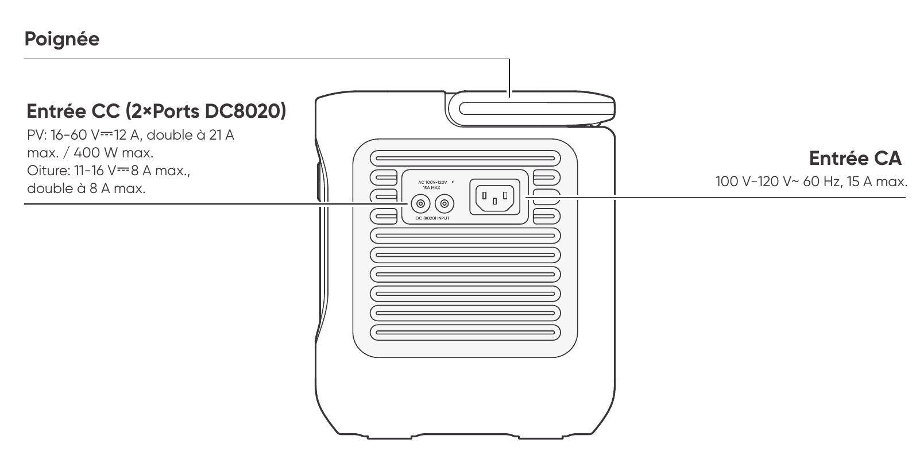

<svg aria-hidden="true" class="hb-leader-layer" focusable="false" preserveAspectRatio="none" viewBox="0 0 100 100"><polyline class="hb-leader" data-callout-id="overview.right.handle" points="1.416,9.834 55.045,9.834 55.045,18.308"></polyline><polyline class="hb-leader" data-callout-id="overview.right.dc_input" points="1.416,41.989 43.752,41.989"></polyline><polyline class="hb-leader" data-callout-id="overview.right.ac_input" points="98.813,40.483 56.874,40.483"></polyline></svg>

<strong>Poignée</strong>

<strong>Entrée CC (2×Ports DC8020)</strong>

PV : 16-60 V⎓12 A max., double à 21 A max. / 400 W max.

Véhicule : 11-16 V⎓8 A max., double à 8 A max.

<strong>Entrée CA</strong>

100 V-120 V~ 60 Hz, 15 A max.

</figure>

# AFFICHAGE LCD

<figure aria-label="LCD icon meanings" class="hb-lcd-table-composition"><table class="longtable hb-lcd-icon-table"><colgroup><col class="hb-lcd-col-number"/><col class="hb-lcd-col-icon"/><col class="hb-lcd-col-name"/><col class="hb-lcd-col-description"/></colgroup>

<tbody>
<tr><td class="hb-lcd-number">
1
</td>
<td class="hb-lcd-icon">
</td>
<td class="hb-lcd-name">
Wi-Fi
</td>
<td class="hb-lcd-description">

<strong>Allumé :</strong> Wi-Fi connecté.

<strong>Clignotant :</strong> Prêt à se connecter au Wi-Fi.

<strong>Éteint :</strong> Wi-Fi déconnecté.

</td>
</tr>
<tr><td class="hb-lcd-number">
2
</td>
<td class="hb-lcd-icon">
</td>
<td class="hb-lcd-name">
Bluetooth
</td>
<td class="hb-lcd-description">

<strong>Allumé :</strong> Bluetooth connecté.

<strong>Clignotant :</strong> Prêt à se connecter au Bluetooth.

<strong>Éteint :</strong> Bluetooth déconnecté.

</td>
</tr>
<tr><td class="hb-lcd-number">
3
</td>
<td class="hb-lcd-icon">
</td>
<td class="hb-lcd-name">
Mode de Charge Silencieuse
</td>
<td class="hb-lcd-description">

<strong>Allumé :</strong> Le bruit pendant la charge est considérablement réduit, tandis que la puissance de la charge connectée est limitée par la puissance de dérivation.

<strong>Éteint :</strong> Le mode de charge silencieuse est désactivé. Activez/désactivez cette fonction dans l'application Jackery. Le réglage est conservé lorsque l’appareil est mis hors tension.

</td>
</tr>
<tr><td class="hb-lcd-number">
4
</td>
<td class="hb-lcd-icon">
</td>
<td class="hb-lcd-name">
Plan de Charge
</td>
<td class="hb-lcd-description">

Personnalisez le temps de charge du Jackery Explorer 1000. Adapté aux situations avec des tarifs d’électricité variables, il permet d’établir des plans de charge en fonction des heures pleines et creuses, afin de réduire les coûts d’électricité.

Veuillez configurer cette fonction dans l’application Jackery. Le réglage est conservé lorsque l’appareil est mis hors tension.

</td>
</tr>
<tr><td class="hb-lcd-number">
5
</td>
<td class="hb-lcd-icon">
</td>
<td class="hb-lcd-name">
Mode Autonome
</td>
<td class="hb-lcd-description">

Maximise l’utilisation de l’énergie solaire et réduit la dépendance à l’électricité du réseau en donnant la priorité à l’énergie solaire stockée, ce qui diminue les coûts d’électricité. La station d’énergie doit être connectée simultanément aux panneaux solaires et au réseau, la puissance de charge étant limitée par la puissance de dérivation.

Veuillez activer/désactiver cette fonction dans l’application. Le réglage est conservé lorsque l’appareil est mis hors tension.

</td>
</tr>
<tr><td class="hb-lcd-number">
6
</td>
<td class="hb-lcd-icon">
</td>
<td class="hb-lcd-name">
Mode TOU
</td>
<td class="hb-lcd-description">

<strong>Allumé :</strong> Le mode TOU est activé (SOC de secours par défaut : 60 %). Pendant les heures de pointe, le produit privilégie la décharge de la batterie afin de réduire les coûts liés à la consommation en période de pointe, lorsque l’énergie stockée dépasse le SOC de réserve. Pendant les heures creuses, le système recharge la batterie à partir du réseau afin de réaliser l’écrêtage des pics et le remplissage des creux.

<strong>Éteint :</strong> Le mode TOU est désactivé. L’appareil ne suit pas la stratégie TOU (heures pleines / heures creuses) et fonctionne selon la logique d’alimentation et de charge par défaut.

Veuillez activer/désactiver cette fonction dans l’application. Le réglage est conservé lorsque l’appareil est mis hors tension.

</td>
</tr>
<tr><td class="hb-lcd-number">
7
</td>
<td class="hb-lcd-icon">
</td>
<td class="hb-lcd-name">
UPS (ASI)
</td>
<td class="hb-lcd-description">

<strong>Allumé :</strong> Le produit fonctionne en mode bypass. Les charges connectées aux ports CA sont alimentées par le réseau électrique au lieu de la station d’énergie.

En cas de coupure soudaine du réseau, le produit bascule automatiquement sur son alimentation par batterie en 10 ms.

<strong>Éteint :</strong> Le produit n’est pas en mode bypass. Les charges connectées aux ports CA sont alimentées par la batterie interne de la station d’énergie.

</td>
</tr>
<tr><td class="hb-lcd-number">
8
</td>
<td class="hb-lcd-icon">
</td>
<td class="hb-lcd-name">
Indicateur d'alimentation CA
</td>
<td class="hb-lcd-description">
La sortie CA (onde sinusoïdale pure) est activée.
</td>
</tr>
<tr><td class="hb-lcd-number">
9
</td>
<td class="hb-lcd-icon">
</td>
<td class="hb-lcd-name">
Tension et fréquence de sortie
</td>
<td class="hb-lcd-description">
Affiche la tension et la fréquence de sortie lorsque la sortie CA est activée.
</td>
</tr>
<tr><td class="hb-lcd-number">
10
</td>
<td class="hb-lcd-icon">
</td>
<td class="hb-lcd-name">
Puissance d’Entrée
</td>
<td class="hb-lcd-description">
Affiche la puissance d'entrée en watts.
</td>
</tr>
<tr><td class="hb-lcd-number">
11
</td>
<td class="hb-lcd-icon">
</td>
<td class="hb-lcd-name">
Temps de Charge Restant
</td>
<td class="hb-lcd-description">
Affiche le temps de charge restant.
</td>
</tr>
<tr><td class="hb-lcd-number">
12
</td>
<td class="hb-lcd-icon">
</td>
<td class="hb-lcd-name">
Indicateur de Charge sur Prise Murale CA
</td>
<td class="hb-lcd-description">
Le produit est chargé via l'entrée CA en utilisant l'énergie du réseau.
</td>
</tr>
<tr><td class="hb-lcd-number">
13
</td>
<td class="hb-lcd-icon">
</td>
<td class="hb-lcd-name">
Indicateur de Charge Voiture
</td>
<td class="hb-lcd-description">
Le produit est chargé via l’entrée CC (DC8020) en utilisant du CC 12V (charge via voiture).
</td>
</tr>
<tr><td class="hb-lcd-number">
14
</td>
<td class="hb-lcd-icon">
</td>
<td class="hb-lcd-name">
Indicateur de Charge Solaire
</td>
<td class="hb-lcd-description">
Le produit est chargé via l’entrée CC (DC8020) à l’aide de panneaux solaires.
</td>
</tr>
<tr><td class="hb-lcd-number">
15
</td>
<td class="hb-lcd-icon">
</td>
<td class="hb-lcd-name">
Mode d’Économie de Batterie
</td>
<td class="hb-lcd-description">

<strong>Allumé :</strong> Le mode d’économie de batterie est activé. Des limites de charge et de décharge sont appliquées afin de prolonger la durée de vie de la batterie.

<strong>Éteint :</strong> Le mode d'économie de batterie est désactivé.

Activez/désactivez cette fonction dans l'application Jackery. Le réglage est conservé lorsque l’appareil est mis hors tension.

Lorsque cette fonction est activée, le produit effectue occasionnellement un cycle de charge-décharge complet pour calibrer le SOC.

</td>
</tr>
<tr><td class="hb-lcd-number">
16
</td>
<td class="hb-lcd-icon">
</td>
<td class="hb-lcd-name">
Limite de puissance de charge
</td>
<td class="hb-lcd-description">

<strong>Allumé :</strong> La limite de puissance de charge est activée dans l'application Jackery.

<strong>Éteint :</strong> La limite de puissance de charge est désactivée dans l'application Jackery.

Le réglage est conservé lorsque l’appareil est mis hors tension.

</td>
</tr>
<tr><td class="hb-lcd-number">
17
</td>
<td class="hb-lcd-icon">
</td>
<td class="hb-lcd-name">
Indicateur de Puissance de la Batterie
</td>
<td class="hb-lcd-description">
Lorsque le produit est en charge, le cercle orange autour du pourcentage de batterie s’allume en séquence. Lorsqu’il charge d’autres appareils, le cercle orange reste allumé.
</td>
</tr>
<tr><td class="hb-lcd-number">
18
</td>
<td class="hb-lcd-icon">
</td>
<td class="hb-lcd-name">
Pourcentage de Batterie Restant
</td>
<td class="hb-lcd-description">
Affiche le pourcentage de batterie restant.
</td>
</tr>
<tr><td class="hb-lcd-number">
19
</td>
<td class="hb-lcd-icon">
</td>
<td class="hb-lcd-name">
Indicateur de Batterie Faible
</td>
<td class="hb-lcd-description">

<strong>Allumé :</strong> Le niveau de la batterie est inférieur à 20 %.

<strong>Clignotant :</strong> Le niveau de la batterie est inférieur à 5 %.

<strong>Éteint :</strong> Le niveau de la batterie n'est pas inférieur à 20 % ou le produit est en charge.

</td>
</tr>
<tr><td class="hb-lcd-number">
20
</td>
<td class="hb-lcd-icon">
</td>
<td class="hb-lcd-name">
Minuterie de décharge
</td>
<td class="hb-lcd-description">

<strong>Allumé :</strong> une minuterie de décharge est définie.

<strong>Éteint :</strong> aucune minuterie de décharge n’est définie.

Activez/désactivez cette fonction dans l'application Jackery. Le réglage n'est pas conservé lorsque l'appareil est mis hors tension.

</td>
</tr>
<tr><td class="hb-lcd-number">
22
</td>
<td class="hb-lcd-icon">
</td>
<td class="hb-lcd-name">
Mode d’Économie d’Énergie
</td>
<td class="hb-lcd-description">

Lorsque la sortie CA ou CC est activée en appuyant sur le bouton CA ou le bouton CC / USB :

<strong>Allumé :</strong> Mode d'économie d'énergie activé.

<strong>Éteint :</strong> Mode d'économie d'énergie désactivé.

Le réglage est conservé lorsque l’appareil est mis hors tension.

</td>
</tr>
<tr><td class="hb-lcd-number">
23
</td>
<td class="hb-lcd-icon">
</td>
<td class="hb-lcd-name">
Indicateur de Température Élevée
</td>
<td class="hb-lcd-description">
La protection contre les températures élevées est déclenchée. Le produit peut cesser de fonctionner jusqu'à ce que sa température revienne dans la plage de fonctionnement normale.
</td>
</tr>
<tr><td class="hb-lcd-number">
24
</td>
<td class="hb-lcd-icon">
</td>
<td class="hb-lcd-name">
Indicateur de Basse Température
</td>
<td class="hb-lcd-description">
La protection contre les basses températures est déclenchée. Le produit peut cesser de fonctionner jusqu'à ce que sa température revienne dans la plage de fonctionnement normale.
</td>
</tr>
<tr><td class="hb-lcd-number">
25
</td>
<td class="hb-lcd-icon">
</td>
<td class="hb-lcd-name">
Code d’erreur
</td>
<td class="hb-lcd-description">
Une erreur produit s’est produite. Veuillez consulter la section « Dépannage » pour plus de détails.
</td>
</tr>
<tr><td class="hb-lcd-number">
26
</td>
<td class="hb-lcd-icon">
</td>
<td class="hb-lcd-name">
Puissance de Sortie
</td>
<td class="hb-lcd-description">
Affiche la puissance de sortie en watts.
</td>
</tr>
<tr><td class="hb-lcd-number">
27
</td>
<td class="hb-lcd-icon">
</td>
<td class="hb-lcd-name">
Temps de Décharge Restant
</td>
<td class="hb-lcd-description">
Affiche le temps de décharge restant.
</td>
</tr>
</tbody>
</table></figure>

# FONCTIONNEMENT

## MARCHE/ARRÊT

<figure class="hb-operation-figure hb-operation-layout-status-right" data-operation-id="main-power" data-source-fragment-sha256="97b21fb6e6b8d5c660db79fa93c0a87c08b376e45f1a2caed6575e783296c920" data-web-replace-key="operation.main-power">

Marche : appuyez une fois.

Arrêt : appuyez et maintenez pendant 3 secondes.

<strong>Temps de veille par défaut :</strong> 2 heures.

Le produit s'éteindra automatiquement après 2 heures d'inactivité, sans charge ni décharge.

*Le temps de veille peut être réglé dans l'application Jackery.

</figure>

Lorsque le mode d\'économie d\'énergie est activé, le produit s\'éteindra automatiquement après 12 heures si le bouton d'alimentation CA ou le bouton d'alimentation CC / USB est activé mais que le produit ne charge ni ne décharge.

## SORTIE CA MARCHE/ARRÊT

<figure class="hb-operation-figure hb-operation-layout-status-right" data-operation-id="ac-output" data-source-fragment-sha256="836c350900ea2dedfbda4a3171bd0dc63c2bd0bd4d2221047c186abd6c938281" data-web-replace-key="operation.ac-output">

<strong>Prérequis :</strong> Le produit est allumé.

<strong>Marche</strong>

appuyez une fois

<strong>Arrêt</strong>

appuyez une fois

</figure>

## SORTIE CC 12V/USB MARCHE/ARRÊT

<figure class="hb-operation-figure hb-operation-layout-status-right" data-operation-id="dc-usb-output" data-source-fragment-sha256="450dd714aa04f409e32a339b3b9b94bc0f5f360e4e72585450e1ab714d3fe837" data-web-replace-key="operation.dc-usb-output">

<strong>Prérequis :</strong> Le produit est allumé.

<strong>Marche</strong>

appuyez une fois

<strong>Arrêt</strong>

appuyez une fois

</figure>

<table class="manual-callout-table" style="width:100%; border-collapse:collapse; margin:0 0 16px 0;"><tbody><tr><td class="manual-callout-label" style="width:16%; border:1px solid #000; padding:6px 8px; vertical-align:top;">
<strong>ATTENTION</strong>
</td><td class="manual-callout-body" style="border:1px solid #000; padding:6px 8px; vertical-align:top;"><ul class="simple">
<li>
<strong>Les ports USB-C de 100 W sont des ports de sortie haute puissance de type Source d'alimentation 3 (PS3) selon USB-PD.</strong> Si l'appareil utilisateur ou l'accessoire connecté ne répond pas aux exigences de sécurité, il peut présenter un risque d'incendie. Avant d'utiliser ces ports, assurez-vous que l'appareil ou l'accessoire connecté dispose d'une protection contre les incendies.
</li>
<li>
Ne connectez Jackery Explorer 1000 qu'à des appareils ou accessoires conformes aux clauses 6.3, 6.4 et 6.5 de la norme IEC/EN/UL 62368-1 (ou autres normes équivalentes).
</li>
<li>
Pour obtenir la puissance de sortie maximale, utilisez le câble USB-C vers USB-C 5 A (20 V CC/5A, 100 W).
</li>
</ul>
</td></tr></tbody></table>

Le produit peut charger la batterie de votre voiture à l\'aide du câble de charge de batterie automobile Jackery 12V, vendu séparément et disponible sur notre site web.

<table class="manual-callout-table" style="width:100%; border-collapse:collapse; margin:0 0 16px 0;"><tbody><tr><td class="manual-callout-label" style="width:16%; border:1px solid #000; padding:6px 8px; vertical-align:top;">
<strong>ATTENTION</strong>
</td><td class="manual-callout-body" style="border:1px solid #000; padding:6px 8px; vertical-align:top;"><ul class="simple">
<li>
Le port CC 12V est uniquement compatible avec les batteries de voiture 12V et ne convient pas aux systèmes 24V.
</li>
<li>
Ne démarrez pas la voiture pendant que le produit charge la batterie via le port de sortie CC 12V, car cela pourrait endommager le produit.
</li>
<li>
Cette fonctionnalité est destinée à un usage d'urgence uniquement et ne peut pas charger une batterie de voiture morte ou endommagée.
</li>
</ul>
</td></tr></tbody></table>

## MODE D\'ÉCONOMIE D\'ÉNERGIE

Pour éviter une consommation inutile de la batterie due à l\'oubli de désactiver la sortie, le produit active par défaut le mode d\'économie d\'énergie. Lorsque la sortie CA ou CC/USB est activée, l\'icône du mode d\'économie d\'énergie s\'affiche sur l\'écran LCD. Dans ce mode, si aucun appareil n\'est connecté ou si la consommation de l\'appareil connecté est inférieure à un certain seuil (sortie CA de 25 W ou sortie CC/USB de 2 W), la sortie correspondante s\'éteint automatiquement après la durée définie. Le réglage par défaut est 12 heures. La durée du mode d\'économie d\'énergie peut être réglée dans l\'application Jackery sur 1 H, 2 H, 8 H, 12 H ou 24 H. Si l\'option \"Never Off\" est sélectionnée, le mode d\'économie d\'énergie sera désactivé.

Pour désactiver le mode d\'économie d\'énergie, appuyez simultanément sur le bouton d'alimentation CA et sur le bouton POWER pendant plus de 3 secondes. Une fois le mode d\'économie d\'énergie désactivé, l\'icône ne s\'affichera plus sur l\'écran LCD et le produit n\'éteindra pas automatiquement la sortie CA ou CC/USB.

Lors de l\'alimentation d\'appareils à faible puissance (CA ≤ 25 W ou CC/USB ≤ 2 W), désactivez le mode d\'économie d\'énergie afin d\'éviter l\'arrêt automatique de la sortie pendant le fonctionnement.

<figure class="hb-operation-figure hb-operation-layout-footer-overlay hb-has-composite-art" data-operation-id="energy-saving" data-source-fragment-sha256="661fc4397ed2e5fa368b20b1c4579cf9ca7720e7f607871043c6c4471628c80e" data-web-replace-key="operation.energy-saving">
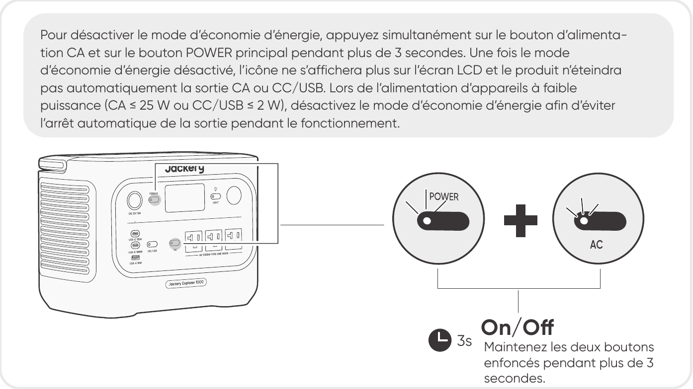

Maintenez les deux boutons enfoncés pendant plus de 3 secondes.

</figure>

<table class="manual-callout-table" style="width:100%; border-collapse:collapse; margin:0 0 16px 0;"><tbody><tr><td class="manual-callout-label" style="width:16%; border:1px solid #000; padding:6px 8px; vertical-align:top;">
<strong>REMARQUE</strong>
</td><td class="manual-callout-body" style="border:1px solid #000; padding:6px 8px; vertical-align:top;">
Le mode d'économie d'énergie reprend l'état précédent après l'allumage. Toute modification du mode doit être effectuée manuellement.
</td></tr></tbody></table>

## LAMPE LED MARCHE/ARRÊT

<figure class="hb-operation-figure hb-operation-layout-footer-panel" data-operation-id="led-light" data-source-fragment-sha256="de6fa1f4a42f07a3424a9084c93d931249a9abab95fb55a56e9431567070310d" data-web-replace-key="operation.led-light">

La lampe LED dispose de deux modes : mode éclairage et mode SOS. Dans n'importe quel mode, appuyez et maintenez sur le bouton pour éteindre la lumière.

Appuyez une fois sur le bouton de la lampe LED pour l'allumer.

Appuyez de nouveau pour passer en mode SOS.

Appuyez une troisième fois pour éteindre la lampe.

</figure>

## Fonction de reprise de Sortie CA et CC

Cette fonction mémorise l'état de la sortie et reprend automatiquement les sorties CA et CC sous certaines conditions définies.

<figure aria-label="Conditions de reprise automatique / Conditions sans reprise automatique" class="hb-auto-resume-composition"><table class="hb-auto-resume-table"><colgroup><col class="hb-auto-resume-col"/><col class="hb-auto-resume-col"/></colgroup>
<thead>
<tr><th class="head hb-auto-resume-left" scope="col">
Conditions de reprise automatique
</th>
<th class="head hb-auto-resume-right" scope="col">
Conditions sans reprise automatique
</th>
</tr>
</thead>
<tbody>
<tr><td class="hb-auto-resume-left">
Mise sous tension/redémarrage après arrêt ou redémarrage
</td>
<td class="hb-auto-resume-right">
Sortie désactivée manuellement (bouton/App)
</td>
</tr>
<tr><td class="hb-auto-resume-left" rowspan="2">
SOC de la batterie ≥ limite de décharge +10% après avoir atteint
la limite
</td>
<td class="hb-auto-resume-right">
Sortie désactivée en mode économie d’énergie
</td>
</tr>
<tr><td class="hb-auto-resume-right">
Sortie désactivée suite à un déclenchement de protection
</td>
</tr>
<tr><td class="hb-auto-resume-left">
Mise à niveau OTA terminée
</td>
<td class="hb-auto-resume-right">
Sortie désactivée par le minuteur de décharge
</td>
</tr>
</tbody>
</table></figure>

## AFFICHAGE LCD

<figure aria-label="Mode d'affichage LCD." class="hb-lcd-mode-composition">

<table class="hb-lcd-mode-table"><colgroup><col class="hb-lcd-mode-col-state"/><col class="hb-lcd-mode-col-action"/><col class="hb-lcd-mode-col-copy"/></colgroup>
<tr>

<td class="hb-lcd-mode-state" rowspan="3">Allumer en discontinu</td>
<td class="hb-lcd-mode-action">Allumer</td>
<td class="hb-lcd-mode-copy">Appuyez sur le bouton POWER ou lorsque le produit est en charge.</td>
</tr>
<tr>
<td class="hb-lcd-mode-action">Éteindre</td>
<td class="hb-lcd-mode-copy">Appuyez sur le bouton POWER.</td>
</tr>
<tr>
<td class="hb-lcd-mode-action">Arrêt automatique</td>
<td class="hb-lcd-mode-copy">L'écran LCD s'éteint automatiquement et entre en mode veille après 2 minutes d'inactivité.</td>
</tr>
<tr>
<td class="hb-lcd-mode-state" rowspan="3">Allumer en continu (en cours de charge ou de décharge)</td>
<td class="hb-lcd-mode-action">Allumer</td>
<td class="hb-lcd-mode-copy">Appuyez deux fois sur le bouton POWER lorsque le produit est allumé.</td>
</tr>
<tr>
<td class="hb-lcd-mode-action">Éteindre</td>
<td class="hb-lcd-mode-copy">Appuyez sur le bouton POWER.</td>
</tr>
<tr>
<td class="hb-lcd-mode-action">Arrêt automatique</td>
<td class="hb-lcd-mode-copy">L'écran LCD s'éteint automatiquement après 2 heures d'inactivité.</td>
</tr>
</table>
</figure>

Vous pouvez également définir le mode d\'affichage de l\'écran dans l\'application Jackery.

## FONCTIONNEMENT DES BOUTONS

| Boutons | Utilisation | Fonction |
|----|----|----|
| Bouton POWER + Bouton d\'alimentation CA | Appuyer 3 secondes sur les deux | Activer/désactiver le mode économie d\'énergie |
| Bouton POWER + Bouton d\'alimentation **CC/USB** | Appuyer 3 secondes sur les deux | Réinitialiser le Wi-Fi et le Bluetooth |
| Bouton d\'alimentation **CC/USB** + Bouton d\'alimentation CA | Appuyer 1 seconde sur les deux | Activer/désactiver le Wi-Fi et le Bluetooth |
| Bouton POWER + Bouton d\'éclairage LED | Appuyer 1 seconde sur les deux | Activer/désactiver le mode d\'urgence |

# ALIMENTATION SANS INTERRUPTION (ASI)

Connectez le produit à une prise murale à l\'aide du câble de charge CA, puis appuyez sur le bouton d'alimentation CA pour alimenter vos appareils en même temps.

Une alimentation sans coupure (UPS) est un système d\'alimentation continue qui fournit automatiquement une alimentation électrique de secours à une charge lorsque l\'alimentation du réseau principal est interrompue.

En cas de perte soudaine de l\'alimentation du réseau, le Jackery Explorer 1000 basculera automatiquement sur l\'alimentation stockée en moins de 10 ms pour maintenir vos appareils en fonctionnement.

En mode UPS, la puissance de crête de sortie de l\'appareil atteint 12 A avant les coupures de courant. Comme la charge et la décharge simultanées sont activées en mode bypass, la puissance de sortie réelle est inférieure à la puissance nominale en mode bypass, mais revient à la puissance nominale lors des coupures.

<table class="manual-callout-table" style="width:100%; border-collapse:collapse; margin:0 0 16px 0;"><tbody><tr><td class="manual-callout-label" style="width:16%; border:1px solid #000; padding:6px 8px; vertical-align:top;">
<strong>ATTENTION</strong>
</td><td class="manual-callout-body" style="border:1px solid #000; padding:6px 8px; vertical-align:top;"><ul class="simple">
<li>
Ce produit ne prend pas en charge un basculement instantané (0 ms). Ne le connectez pas à des équipements nécessitant une alimentation avec commutation en 0 ms, tels que des serveurs de données ou des stations de travail.
</li>
<li>
Avant toute utilisation, testez plusieurs fois la compatibilité avec votre appareil.
</li>
<li>
Ne connectez pas de charges dépassant la puissance maximale de sortie du produit. Sinon, la protection contre les surcharges sera déclenchée.
</li>
</ul>
</td></tr></tbody></table>

# CHARGE

**L\'énergie verte d\'abord :** nous préconisons l\'utilisation de l\'énergie verte en premier. Ce produit prend en charge deux modes de recharge simultanés : la recharge solaire et la recharge par prise murale CA.

Quand la recharge par prise murale CA et la recharge solaire sont effectuées en même temps, le produit privilégie la recharge solaire. Les deux méthodes sont utilisées pour charger la batterie à la puissance maximalement autorisée.

**Chargez complètement le produit avant sa première utilisation.**

<table class="manual-callout-table" style="width:100%; border-collapse:collapse; margin:0 0 16px 0;"><tbody><tr><td class="manual-callout-label" style="width:16%; border:1px solid #000; padding:6px 8px; vertical-align:top;">
<strong>REMARQUE</strong>
</td><td class="manual-callout-body" style="border:1px solid #000; padding:6px 8px; vertical-align:top;"><ul class="simple">
<li>
La température de charge recommandée pour le produit est de 32 °F à 113 °F / 0 °C à 45 °C, et la température de décharge est de 14°F à 113°F / -10°C à 45°C.
</li>
<li>
Utiliser le produit en dehors de cette plage de températures peut limiter ses capacités de charge et de décharge, voire empêcher la charge ou la décharge.
</li>
<li>
La puissance de charge et la capacité de la batterie du produit peuvent varier en raison des fluctuations de température.
</li>
</ul>
</td></tr></tbody></table>

## CHARGEMENT PAR PRISE MURALE CA

Connectez le câble de charge CA au port d\'entrée CA de l\'appareil et à une prise murale.

<table class="manual-callout-table" style="width:100%; border-collapse:collapse; margin:0 0 16px 0;"><tbody><tr><td class="manual-callout-label" style="width:16%; border:1px solid #000; padding:6px 8px; vertical-align:top;">
<strong>ATTENTION</strong>
</td><td class="manual-callout-body" style="border:1px solid #000; padding:6px 8px; vertical-align:top;">
Assurez-vous que le câble de charge CA est entièrement et solidement inséré dans le port d’entrée CA. Une connexion incomplète peut entraîner un courant instable, une surchauffe, un mauvais contact ou un dysfonctionnement de l'appareil.
</td></tr></tbody></table>

**Mode de charge d\'urgence**

Dans ce mode, vous pouvez recharger rapidement la station d'énergie portable en utilisant la méthode de charge CA. Cette fonction de charge d\'urgence peut être activée ou désactivée via l\'application Jackery. En mode de charge d\'urgence, la lumière circulaire indiquant l\'état de charge (SOC) clignote plus rapidement.

\*Pour prolonger au maximum la durée de vie de la batterie, il est préférable de charger à la vitesse standard. La charge d\'urgence doit être utilisée uniquement pour des situations nécessitant un boost rapide en énergie et n\'est pas recommandée pour un usage régulier sur le long terme.

## CHARGEMENT PAR PANNEAUX SOLAIRES (Vendu séparément)

Le Jackery Explorer 1000 dispose de deux ports d'entrée DC8020 et est compatible avec les panneaux solaires de Jackery.

Si un seul port d'entrée DC8020 doit être connecté à deux panneaux solaires simultanément, veuillez vous référer au schéma ci-dessous pour le branchement via le connecteur de panneau solaire (vendu séparément, non inclus en standard).

<table class="manual-callout-table" style="width:100%; border-collapse:collapse; margin:0 0 16px 0;"><tbody><tr><td class="manual-callout-label" style="width:16%; border:1px solid #000; padding:6px 8px; vertical-align:top;">
<strong>ATTENTION</strong>
</td><td class="manual-callout-body" style="border:1px solid #000; padding:6px 8px; vertical-align:top;">
Un port d’entrée DC8020 peut être connecté à un maximum de deux panneaux solaires.
</td></tr></tbody></table>

<table class="manual-callout-table" style="width:100%; border-collapse:collapse; margin:0 0 16px 0;"><tbody><tr><td class="manual-callout-label" style="width:16%; border:1px solid #000; padding:6px 8px; vertical-align:top;">
<strong>ATTENTION</strong>
</td><td class="manual-callout-body" style="border:1px solid #000; padding:6px 8px; vertical-align:top;">
Assurez-vous que la tension d’entrée pour les deux ports d’entrée CC est la même. Sinon, le produit pourrait être endommagé. Par exemple:

<ul class="simple">
<li>
Utiliser le même modèle de panneaux solaires Jackery et le même nombre de panneaux lors de la connexion des panneaux solaires aux deux ports d’entrée DC8020.
</li>
<li>
Ne chargez pas le produit à la fois avec un chargeur de voiture et un panneau solaire simultanément. Cela pourrait faire sauter le fusible de la voiture ou entraîner un échec de la charge.
</li>
</ul>
</td></tr></tbody></table>

Il est recommandé d'utiliser le panneau solaire Jackery pour charger le Jackery Explorer 1000. Assurez-vous que la tension en circuit ouvert (Voc) du panneau solaire se situe dans la plage de tension d'entrée CC de Jackery Explorer 1000 (16V--60V). Jackery décline toute responsabilité pour tout dommage ou toute perte résultant de l'utilisation de panneaux solaires tiers.

## CHARGEMENT PAR PRISE DE VOITURE (Vendu séparément)

Ce produit peut être chargé à l\'aide d\'un chargeur de voiture 12 V. Assurez-vous que le chargeur de voiture est correctement connecté à la prise 12 V du véhicule (allume-cigare).

<figure class="hb-reference-figure hb-has-composite-art" data-reference-id="charging-car" data-source-fragment-sha256="eab0cde24a6e3dfb259883beb54e6e7a1498e82eb9c87f2bb8a6be49184acf16" data-web-replace-key="reference.charging-car">
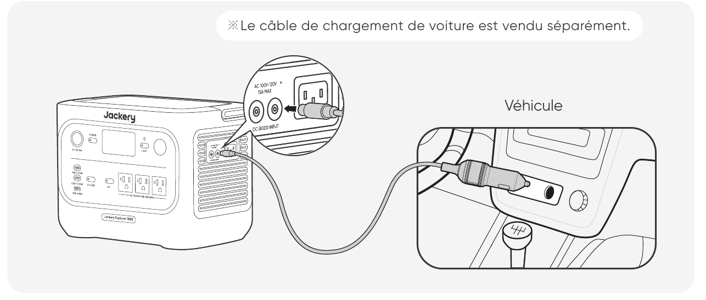

Véhicule

※Le câble de chargement de voiture est vendu séparément.

</figure>

<table class="manual-callout-table" style="width:100%; border-collapse:collapse; margin:0 0 16px 0;"><tbody><tr><td class="manual-callout-label" style="width:16%; border:1px solid #000; padding:6px 8px; vertical-align:top;">
<strong>ATTENTION</strong>
</td><td class="manual-callout-body" style="border:1px solid #000; padding:6px 8px; vertical-align:top;"><ul class="simple">
<li>
Veuillez démarrer le véhicule avant de charger votre station d'énergie.
</li>
<li>
Si le véhicule roule sur des routes accidentées, il est interdit d'utiliser le chargeur de voiture afin d'éviter tout risque de surchauffe dû à une mauvaise connexion. La société ne sera pas responsable des pertes causées par une utilisation non conforme.
</li>
<li>
La charge par véhicule est uniquement applicable aux véhicules en 12 V CC, pas en 24 V CC. Veuillez ne pas charger ce produit dans un véhicule 24 V afin d'éviter tout risque de blessure ou de dommage matériel.
</li>
</ul>
</td></tr></tbody></table>

# STOCKAGE

Conservez le produit dans un endroit propre et sec avec une ventilation adéquate. Température et humidité de stockage :

- 1 mois : -4 °F à 113 °F / -20 °C à 45 °C (0-60 % HR)

- 3 mois : 32 °F à 113 °F / 0 °C à 45 °C (0-60 % HR)

- 12 mois : 32 °F à 77 °F / 0 °C à 25 °C (0-60 % HR)

Si ce produit est stocké pendant une longue période (3 à 6 mois) avec la batterie déchargée, il peut devenir impossible de le recharger. Pour éviter cela et préserver la santé de la batterie, il est recommandé de vérifier et de recharger le produit tous les trois mois, et d\'effectuer un cycle de charge et de décharge complet au moins une fois tous les 6 à 12 mois.

# DÉPANNAGE

Si l\'un des codes d\'erreur suivants apparaît, suivez les actions correctives indiquées pour résoudre le problème. Si l\'erreur persiste, veuillez contacter le service client Jackery.

<figure aria-label="Code d'erreur / Mesures correctives" class="hb-troubleshooting-composition"><table class="longtable hb-troubleshooting-table"><colgroup><col class="hb-troubleshooting-col-code"/><col class="hb-troubleshooting-col-measures"/></colgroup>

<thead>
<tr><th class="head hb-troubleshooting-code" scope="col">
Code d'erreur
</th>
<th class="head hb-troubleshooting-measures" scope="col">
Mesures correctives
</th>
</tr>
</thead>
<tbody>
<tr><td class="hb-troubleshooting-code">
F0
</td>
<td class="hb-troubleshooting-measures">
Redémarrez le produit.
</td>
</tr>
<tr><td class="hb-troubleshooting-code">
F1
</td>
<td class="hb-troubleshooting-measures">
Redémarrez le produit.
</td>
</tr>
<tr><td class="hb-troubleshooting-code">
F2
</td>
<td class="hb-troubleshooting-measures">
Redémarrez le produit.
</td>
</tr>
<tr><td class="hb-troubleshooting-code">
F3
</td>
<td class="hb-troubleshooting-measures">
Redémarrez le produit.
</td>
</tr>
<tr><td class="hb-troubleshooting-code">
F4
</td>
<td class="hb-troubleshooting-measures">
Connectez le produit à des charges pour décharger sa batterie jusqu'à ce que l'erreur disparaisse.
</td>
</tr>
<tr><td class="hb-troubleshooting-code">
F5
</td>
<td class="hb-troubleshooting-measures">
Chargez le produit via des panneaux solaires ou une prise murale CA jusqu'à ce que l'erreur disparaisse.
</td>
</tr>
<tr><td class="hb-troubleshooting-code">
F6
</td>
<td class="hb-troubleshooting-measures">

1. Attendez que le réseau se normalise avant de charger le produit via une prise murale CA.

2. Vérifiez si les entrées et sorties d'air sont obstruées; assurez un espace de 0,66 pied (20 cm) de chaque côté du produit.

3. Placez le produit dans un endroit qui n'est pas exposé à la lumière directe du soleil ou à des températures ambiantes élevées.

4. Déconnectez toutes les charges du produit. Laissez le produit inactif et attendez que l'erreur disparaisse.

5. Redémarrez le produit.

</td>
</tr>
<tr><td class="hb-troubleshooting-code">
F7
</td>
<td class="hb-troubleshooting-measures">

1. Retirez toutes les entrées CC du produit.

2. Vérifiez la tension en circuit ouvert (Voc) des panneaux solaires connectés. Le produit accepte une tension d'entrée CC maximale de 60V.

3. Redémarrez le produit et laissez-le inactif. Attendez que l'erreur disparaisse.

</td>
</tr>
<tr><td class="hb-troubleshooting-code">
F8
</td>
<td class="hb-troubleshooting-measures">
Contacter le service à la clientèle de Jackery.
</td>
</tr>
<tr><td class="hb-troubleshooting-code">
F9
</td>
<td class="hb-troubleshooting-measures">
Retirez la charge connectée aux ports USB du produit. Attendez que l'erreur disparaisse.
</td>
</tr>
<tr><td class="hb-troubleshooting-code">
FE
</td>
<td class="hb-troubleshooting-measures">
Contacter le service à la clientèle de Jackery.
</td>
</tr>
</tbody>
</table></figure>

# SPÉCIFICATIONS

## INFORMATIONS GÉNÉRALES

<figure aria-label="INFORMATIONS GÉNÉRALES" class="hb-spec-table-composition"><table class="manual-table manual-spec-table hb-spec-table"><colgroup><col class="hb-spec-col-label"/><col class="hb-spec-col-value"/></colgroup><tbody><tr><th class="manual-spec-label hb-spec-label" scope="row">Nom du produit</th><td class="manual-spec-value hb-spec-value">Jackery Explorer 1000</td></tr><tr><th class="manual-spec-label hb-spec-label" scope="row">N° modèle</th><td class="manual-spec-value hb-spec-value">JE-1000F / JE-1000F-SG</td></tr><tr><th class="manual-spec-label hb-spec-label" scope="row">Capacité</th><td class="manual-spec-value hb-spec-value">1024 Wh (20 Ah / 51,2 V CC)</td></tr><tr><th class="manual-spec-label hb-spec-label" scope="row">Cellule Chimique</th><td class="manual-spec-value hb-spec-value">LiFePO₄</td></tr><tr><th class="manual-spec-label hb-spec-label" scope="row">Poids</th><td class="manual-spec-value hb-spec-value">Environ 23,4 lbs / 10.6 kg</td></tr><tr><th class="manual-spec-label hb-spec-label" scope="row">Dimensions</th><td class="manual-spec-value hb-spec-value">12,4 x 7,9 x 9,2 in / 31,4 x 20,1 x 23,4 cm</td></tr><tr><th class="manual-spec-label hb-spec-label" scope="row">Durée de vie</th><td class="manual-spec-value hb-spec-value">Capacité de 6000 cycles à 70 % ou plus</td></tr></tbody></table></figure>

## PORTS D'ENTRÉE

<figure aria-label="PORTS D’ENTRÉE" class="hb-spec-table-composition"><table class="manual-table manual-spec-table hb-spec-table"><colgroup><col class="hb-spec-col-label"/><col class="hb-spec-col-value"/></colgroup><tbody><tr><th class="manual-spec-label hb-spec-label" rowspan="2" scope="row">1 × Entrée CA</th><td class="manual-spec-value hb-spec-value">Mode de charge: 100-120 V~ 60 Hz, 15 A max.</td></tr><tr><td class="manual-spec-value hb-spec-value">Mode de dérivation①: 100-120 V~ 60 Hz, 12 A max.</td></tr><tr><th class="manual-spec-label hb-spec-label" rowspan="2" scope="row">2 × Ports DC8020</th><td class="manual-spec-value hb-spec-value">11 V-16 V⎓8 A max., Double à 8 A max.</td></tr><tr><td class="manual-spec-value hb-spec-value">16 V-60 V⎓12 A max., double à 21 A / 400 W max.</td></tr></tbody></table></figure>

## PORTS DE SORTIE

<figure aria-label="PORTS DE SORTIE" class="hb-spec-table-composition"><table class="manual-table manual-spec-table hb-spec-table"><colgroup><col class="hb-spec-col-label"/><col class="hb-spec-col-value"/></colgroup><tbody><tr><th class="manual-spec-label hb-spec-label" scope="row">3 × Sortie CA</th><td class="manual-spec-value hb-spec-value">120 V~ 60 Hz, 12,5 A max., 1500 W Nominal par port, 1500 W Total, 3000 W crête</td></tr><tr><th class="manual-spec-label hb-spec-label" scope="row">Sortie CA en mode dérivation①</th><td class="manual-spec-value hb-spec-value">120 V~, 60 Hz, 12 A max.</td></tr><tr><th class="manual-spec-label hb-spec-label" rowspan="2" scope="row">2 × Sortie USB-C</th><td class="manual-spec-value hb-spec-value">30 W max., 5 V⎓3 A, 9 V⎓3 A, 12 V⎓2,5 A, 15 V⎓2 A, 20 V⎓1,5 A</td></tr><tr><td class="manual-spec-value hb-spec-value">100 W max., 5 V⎓3 A, 9 V⎓3 A, 12 V⎓3 A, 15 V⎓3 A, 20 V⎓5 A</td></tr><tr><th class="manual-spec-label hb-spec-label" scope="row">1 × Sortie USB-A</th><td class="manual-spec-value hb-spec-value">18 W max., 5-6 V⎓3 A, 6-9 V⎓2 A, 9-12 V⎓1,5 A</td></tr><tr><th class="manual-spec-label hb-spec-label" scope="row">1 × Port CC 12V</th><td class="manual-spec-value hb-spec-value">12 V⎓10 A max.</td></tr></tbody></table></figure>

## TEMPÉRATURE DE FONCTIONNEMENT

<figure aria-label="TEMPÉRATURE DE FONCTIONNEMENT" class="hb-spec-table-composition"><table class="manual-table manual-spec-table hb-spec-table"><colgroup><col class="hb-spec-col-label"/><col class="hb-spec-col-value"/></colgroup><tbody><tr><th class="manual-spec-label hb-spec-label" scope="row">Température de charge</th><td class="manual-spec-value hb-spec-value">32 °F à 113 °F / 0 °C à 45 °C</td></tr><tr><th class="manual-spec-label hb-spec-label" scope="row">Température de décharge</th><td class="manual-spec-value hb-spec-value">14°F à 113°F / -10°C à 45°C</td></tr></tbody></table></figure>

 

※ USB Type-C® et USB-C® sont des marques déposées de USB Implementers Forum.

① Le produit peut charger la batterie à partir d\'une prise murale CA tout en fournissant de l\'énergie via les ports de sortie CA.

# GARANTIE

<figure aria-label="GARANTIE" class="hb-warranty-intro-composition">

<strong>Nous ne fournissons notre garantie qu'aux clients qui achètent sur le site officiel de Jackery, sur des plateformes tierces portant la marque Jackery, ou auprès de revendeurs autorisés locaux.</strong>

*La durée et les détails de la garantie peuvent varier en fonction des lois, réglementations et revendeurs autorisés locaux.

</figure>

## Garantie limitée

<figure aria-label="Garantie limitée" class="hb-warranty-card" data-warranty-card-index="1">
Jackery Inc. garantit à l'acheteur et consommateur d'origine que le produit de Jackery sera exempt de tout défaut de fabrication et de matériaux dans le cadre d'une utilisation normale pendant toute la durée de la période de garantie applicable identifiée dans la section « Période de garantie » ci-dessous, sous réserve des exceptions énoncées ci-dessous.

Cette déclaration de garantie énonce les obligations totales et exclusives de garantie de Jackery. Nous n'assumerons pas et nous n'autorisons personne à assumer pour nous toute autre responsabilité en lien avec la vente de nos produits.
</figure>

## Période de garantie

<figure aria-label="Période de garantie" class="hb-warranty-period-card">

3
<strong class="hb-warranty-years-unit">ANS</strong><strong class="hb-warranty-period-label">Garantie standard</strong>

La période de garantie standard de Jackery Explorer 1000 est de 36 mois. Dans tous les cas, la période de garantie commence à compter de la date d'achat par l'acheteur et consommateur d'origine. La facture du premier achat du consommateur ou toute autre preuve documentaire raisonnable est nécessaire afin d'établir la date de début de la période de garantie.

2
<strong class="hb-warranty-years-unit">ANS</strong><strong class="hb-warranty-period-label">Garantie prolongée</strong>

Pour activer l'extension de garantie, vous devez enregistrer votre produit en ligne ou bien contacter notre service client à <a class="reference external" href="mailto:hello@jackery.com">hello@jackery.com</a> afin de prolonger la durée de la garantie standard.

</figure>

## Réparation ou remplacement

<figure aria-label="Réparation ou remplacement" class="hb-warranty-card" data-warranty-card-index="3">
Jackery réparera ou remplacera (aux frais de Jackery) tout produit Jackery qui ne fonctionne pas pendant la période de garantie applicable en raison d'un défaut de fabrication ou de matériau. Le produit réparé/remplacé bénéficie de la garantie restante à compter de la date d'achat initiale.
</figure>

## Limitée à l\'acheteur et consommateur d\'origine

<figure aria-label="Limitée à l'acheteur et consommateur d'origine" class="hb-warranty-card" data-warranty-card-index="4">
La garantie d'un produit Jackery est limitée à l'acheteur et consommateur d'origine, elle ne peut pas être transférée à un autre propriétaire.
</figure>

## Exclusions

<figure aria-label="Exclusions" class="hb-warranty-card" data-warranty-card-index="5">
La garantie de Jackery ne s'applique pas à :
<ul class="simple">
<li>
Une utilisation incorrecte, abusée, modifiée, aux dégâts provoqués par un accident ou toute autre utilisation qui n'est pas une utilisation normale de ce produit et autorisée par la documentation actuelle du produit de Jackery.
</li>
<li>
À une réparation tentée par quelqu'un d'autre qu'un établissement agréé.
</li>
<li>
Tout autre produit acheté par l'intermédiaire d'une vente aux enchères en ligne.
</li>
<li>
La garantie de Jackery ne s'applique pas aux cellules de la batterie, sauf si vous avez entièrement chargé les cellules de la batterie dans les sept jours suivant l'achat du produit et au moins une fois tous les 6 mois par la suite.
</li>
</ul></figure>

## Droits d\'interprétation

<figure aria-label="Droits d'interprétation" class="hb-warranty-card" data-warranty-card-index="6">
Jackery Inc. se réserve le droit d'interpréter de manière définitive la politique après-vente des clients ci-dessus.
</figure>

# CONFIGURATION DE L\'APPLICATION

## 1. Télécharger l\'application et se connecter

<figure aria-label="1. Télécharger l'application et se connecter" class="hb-app-download-composition">

Recherchez "Jackery" dans Google Play ou dans l'App Store pour installer l'application. Une fois que c'est fait, vous pouvez vous inscrire et vous connecter.

Vous pouvez également scanner le code QR ci-dessous pour télécharger et installer l'application.

</figure>

## 2. Ajouter un appareil

2.1 Cliquez sur le bouton + pour ajouter un appareil.

2.2 Appuyez sur le bouton POWER de l'appareil pour l'allumer. Les icônes Wi-Fi et Bluetooth clignotent sur l'appareil afin d'indiquer qu'il est entré dans le mode Configuration réseau. Cliquez sur le bouton « Icône qui clignote » et autorisez l'application à se connecter aux appareils alentour, puis ouvrez les autorisations Bluetooth.

<figure class="hb-app-add-device-composition" data-reference-id="app-add-device" data-step-captions="embedded">

Bouton POWERBouton d’alimentation CC / USBBouton Power CA
</figure>

2.3 Après avoir appuyé sur l'icône de l'appareil détecté, l'application se connecte automatiquement à l'appareil via Bluetooth.

<table class="manual-callout-table" style="width:100%; border-collapse:collapse; margin:0 0 16px 0;"><tbody><tr><td class="manual-callout-label" style="width:16%; border:1px solid #000; padding:6px 8px; vertical-align:top;">
<strong>REMARQUE</strong>
</td><td class="manual-callout-body" style="border:1px solid #000; padding:6px 8px; vertical-align:top;">
Si le message «l'appareil a été associé» s'affiche pendant l'appairage, vous pouvez suivre l'une de ces deux étapes pour procéder à la connexion.

<ul class="simple">
<li>
Le propriétaire de l'appareil peut partager ce dernier avec d'autres utilisateurs dans l'application.
</li>
<li>
Maintenez le bouton POWER et le bouton d’alimentation CC / USB enfoncés pendant 3 secondes pour réinitialiser le Wi-Fi et le Bluetooth de l'appareil et l'associer de nouveau.
</li>
</ul>
</td></tr></tbody></table>

2.4 Une fois l'appairage réalisé avec succès, saisissez le nom et le mot de passe du Wi-Fi pour que l'appareil se connecte automatiquement au réseau Wi-Fi.

<table class="manual-callout-table" style="width:100%; border-collapse:collapse; margin:0 0 16px 0;"><tbody><tr><td class="manual-callout-label" style="width:16%; border:1px solid #000; padding:6px 8px; vertical-align:top;">
<strong>REMARQUE</strong>
</td><td class="manual-callout-body" style="border:1px solid #000; padding:6px 8px; vertical-align:top;"><ul class="simple">
<li>
Veuillez choisir un réseau Wi-Fi 2,4 GHz. L'appareil ne prend pas en charge le réseau Wi-Fi 5 GHz.
</li>
</ul>
</td></tr></tbody></table>

2.5 Une fois l\'appareil ajouté à la page d\'accueil, l\'icône Wi-Fi de l\'appareil restera allumée.

<figure class="hb-reference-figure hb-has-composite-art" data-reference-id="app-connect-result" data-source-fragment-sha256="7a8700a6aa1dee58a471d51dac7f12f96dc512196cf2308ec569f5ea6e0f5f62" data-step-captions="embedded" data-web-replace-key="reference.app-connect-result">

</figure>

Les captures d\'écran ci-dessus sont fournies à titre indicatif.

<table class="manual-callout-table" style="width:100%; border-collapse:collapse; margin:0 0 16px 0;"><tbody><tr><td class="manual-callout-label" style="width:16%; border:1px solid #000; padding:6px 8px; vertical-align:top;">
<strong>ATTENTION</strong>
</td><td class="manual-callout-body" style="border:1px solid #000; padding:6px 8px; vertical-align:top;">
L'application Jackery ne peut se connecter qu'à une seule station d'énergie à la fois via Bluetooth. Revenir à la liste des appareils déconnecte automatiquement le Bluetooth. Touchez à nouveau la station d'énergie dans la liste pour vous reconnecter automatiquement.
</td></tr></tbody></table>

## 3. Dissocier l\'appareil

Cliquez sur le bouton des paramètres en haut à droite de l\'interface principale pour accéder à la page des paramètres. Cliquez sur le bouton de dissociation en bas de la page pour dissocier l\'appareil.

## 4. Remarques

### 4.1 Pour activer le Wi-Fi et le Bluetooth

- Le Wi-Fi et le Bluetooth sont automatiquement activés, une fois l\'appareil allumé. Leurs icônes s\'allument sur l\'écran.

- Appuyez simultanément sur le bouton d'alimentation CC / USB et le bouton power CA jusqu\'à ce que les icônes Wi-Fi et Bluetooth s\'allument sur l\'écran.

### 4.2 Pour désactiver le Wi-Fi et le Bluetooth

Appuyez simultanément sur le bouton d'alimentation CC / USB et le bouton power CA jusqu'à ce que les icônes Wi-Fi et Bluetooth s'éteignent sur l'écran.

### 4.3 Pour réinitialiser le Wi-Fi et le Bluetooth

Maintenez le bouton POWER et le bouton d'alimentation CC / USB enfoncés simultanément pendant 3 secondes pour réinitialiser le Wi-Fi et le Bluetooth aux paramètres d'usine. Le compte connecté dans l'application sera dissocié.

# INFORMACIÓN IMPORTANTE DE SEGURIDAD

<table class="manual-callout-table" style="width:100%; border-collapse:collapse; margin:0 0 16px 0;"><tbody><tr><td class="manual-callout-label" style="width:16%; border:1px solid #000; padding:6px 8px; vertical-align:top;">
<strong>ADVERTENCIA</strong>
</td><td class="manual-callout-body" style="border:1px solid #000; padding:6px 8px; vertical-align:top;">
INSTRUCCIONES RELATIVAS AL RIESGO DE INCENDIO, DESCARGA ELÉCTRICA O LESIONES PERSONALES
</td></tr></tbody></table>

<table class="manual-two-col-table" style="width:100%; border-collapse:separate; border-spacing:12px 0; margin:0 0 16px 0;">
<colgroup>
<col style="width: 50%" />
<col style="width: 50%" />
</colgroup>
<tbody>
<tr>
<td style="width: 50%; border: none; padding: 0 8px 0 0; vertical-align: top">
Sigue siempre estas precauciones básicas al usar este producto.

<ul>
<li>Lee todas las instrucciones antes de usar el producto.</li>
<li>No permitas que los niños jueguen sobre del producto. Se requiere la supervisión cercana de adultos cuando se use cerca de niños.</li>
<li>Evita colocar las manos o los dedos dentro del producto.</li>
<li>Deja de usar el producto de inmediato si ha sufrido daños físicos o modificaciones. El uso inadecuado puede causar un comportamiento impredecible, provocando incendio, explosión o lesiones.</li>
<li>Si se observan los siguientes síntomas —(incluyendo sobrecalentamiento, olores extraños o humo, fugas o quemaduras)— deja de usar el producto de inmediato y contacta al distribuidor o a nuestro servicio al cliente.</li>
<li>Nunca intentes abrir, reparar o modificar el producto. Cualquier manipulación, re ensamblaje o modificación puede resultar en descarga eléctrica, incendio o daños a la batería.</li>
</ul></td>
<td style="width: 50%; border: none; padding: 0 0 0 8px; vertical-align: top"><ul>
<li>Ten en cuenta que el líquido expulsado del producto puede causar irritación o quemaduras. El uso inapropiado o abusivo puede causar fugas en la batería. Evita el contacto directo con líquidos que se filtren. Si el líquido entra en contacto con los ojos, busca atención médica de inmediato. Si entra en contacto con otras partes del cuerpo, enjuaga con agua corriente y consulta a un médico de inmediato.</li>
<li>No expongas el producto al fuego o a temperaturas extremas. Hacerlo puede provocar una explosión si la temperatura supera los 130 °C (265 °F).</li>
<li>El uso de materiales o piezas no recomendadas o no suministradas puede implicar riesgo de incendio, descarga eléctrica o lesiones personales.</li>
<li>No dejes la batería cargando sin supervisión durante periodos prolongados. Supervisa siempre el proceso de carga para garantizar un funcionamiento seguro.</li>
<li>Para reducir el riesgo de descarga eléctrica, desconecta el producto de cualquier fuente de energía antes de realizar servicio técnico o resolución de problemas.</li>
</ul></td>
</tr>
</tbody>
</table>

## INSTRUCCIONES DE USO

<table class="manual-two-col-table" style="width:100%; border-collapse:separate; border-spacing:12px 0; margin:0 0 16px 0;">
<colgroup>
<col style="width: 50%" />
<col style="width: 50%" />
</colgroup>
<tbody>
<tr>
<td style="width: 50%; border: none; padding: 0 8px 0 0; vertical-align: top">
GUARDE ESTAS INSTRUCCIONES

<ul>
<li>Deja de usar el producto de inmediato si muestra signos de daño. Suspende el uso y contacta al servicio al cliente para recibir asistencia.</li>
<li>No cargues la batería en ambientes extremadamente calientes o fríos y cumple estrictamente con los rangos de temperatura especificados por el producto:
<ul>
<li>Temperatura de carga: 32 °F a 113 °F / 0 °C a 45 °C</li>
<li>Temperatura de descarga: 14°F a 113°F / -10°C a 45°C</li>
</ul></li>
<li>Para garantizar una circulación de aire adecuada, no cubras las rejillas de ventilación del producto. El área donde se use el producto debe tener un flujo de aire adecuado en un entorno fresco y seco para evitar el sobrecalentamiento.
<ul>
<li>Cargar en espacios húmedos o mal ventilados puede representar riesgos para la seguridad.</li>
<li>El agua puede provocar cortocircuitos o dañar el cargador, generando riesgos para la seguridad.</li>
</ul></li>
<li>Desconecta el cable de alimentación de la toma de corriente durante tormentas eléctricas.</li>
<li>Apaga el producto de inmediato presionando el botón de encendido si se ha caído, golpeado o expuesto a vibraciones.</li>
<li>Asegúrate de que los dispositivos estén apagados antes de conectarlos al producto.</li>
<li>No cargues el producto con un cable o enchufe dañado o roto.</li>
</ul></td>
<td style="width: 50%; border: none; padding: 0 0 0 8px; vertical-align: top"><ul>
<li>No uses el producto para cargar dispositivos con cable o enchufe dañado o roto.</li>
<li>Siempre desconecta el cable de carga tirando del enchufe, no del cable, para evitar daños.</li>
<li>Asegúrate de que el producto esté bien asegurado al transportarlo en un vehículo en movimiento.</li>
<li>NO coloques la unidad boca abajo ni de lado durante el uso o almacenamiento.</li>
<li>NO coloques el producto en el suelo o a una altura menor de 18 pulgadas (457 mm) sobre el suelo durante el funcionamiento en un taller o centro de reparación.</li>
<li>NO uses los accesorios del producto con otros dispositivos o equipos.</li>
<li>El tiempo de carga solar depende de las condiciones meteorológicas. Coloque su panel solar donde reciba la mayor cantidad posible de luz solar directa.</li>
<li>INSTRUCCIONES PARA LA CONEXIÓN A TIERRA-Este producto debe estar conectado a tierra. Si presenta mal funcionamiento o fallas, la conexión a tierra proporciona una ruta de menor resistencia para la corriente eléctrica y reduce el riesgo de descarga eléctrica. Este producto está equipado con un cable que tiene un conductor de conexión a tierra y un enchufe con polo a tierra. El enchufe debe conectarse a un tomacorriente que esté instalado y conectado a tierra correctamente, de acuerdo con todos los códigos y ordenanzas locales.</li>
</ul></td>
</tr>
</tbody>
</table>

<table class="manual-callout-table" style="width:100%; border-collapse:collapse; margin:0 0 16px 0;"><tbody><tr><td class="manual-callout-label" style="width:16%; border:1px solid #000; padding:6px 8px; vertical-align:top;">
<strong>ADVERTENCIA</strong>
</td><td class="manual-callout-body" style="border:1px solid #000; padding:6px 8px; vertical-align:top;">
Una conexión incorrecta del conductor de conexión a tierra del equipo puede provocar riesgo de descarga eléctrica. Consulte con un electricista cualificado si tiene dudas sobre si el producto está conectado a tierra correctamente. No modifique el enchufe proporcionado con el producto; si no se ajusta al tomacorriente, haga que un electricista cualificado instale un tomacorriente adecuado.

  </td></tr></tbody></table>

<table class="manual-callout-table" style="width:100%; border-collapse:collapse; margin:0 0 16px 0;"><tbody><tr><td class="manual-callout-label" style="width:16%; border:1px solid #000; padding:6px 8px; vertical-align:top;">
<strong>PELIGRO</strong>
</td><td class="manual-callout-body" style="border:1px solid #000; padding:6px 8px; vertical-align:top;">
Este dispositivo está diseñado únicamente para uso en interiores (coloque este dispositivo en un entorno interior similar cuando lo use en exteriores, por ejemplo, hogar, RV, tiendas de campaña, cabañas, etc.). ※ Este dispositivo no es resistente al agua ni al polvo. Manténgalo alejado de la lluvia y de ambientes húmedos durante el uso.

</td></tr></tbody></table>

## INSTRUCCIONES DE MANTENIMIENTO PARA EL USUARIO

Durante el ciclo de vida de los productos de almacenamiento de energía, se espera cierto grado de degradación de la capacidad y de la energía. A medida que aumenta el número de ciclos de carga y descarga y se prolonga el tiempo de almacenamiento, esta degradación se intensificará gradualmente. Esta es una condición normal coherente con el envejecimiento natural de las celdas de la batería.

# SIGNIFICADO DE LOS SÍMBOLOS

<figure aria-label="Símbolo / Significado" class="hb-symbol-signal-composition"><table class="hb-symbol-signal-table"><colgroup><col class="hb-symbol-signal-col-label"/><col class="hb-symbol-signal-col-meaning"/></colgroup>

<thead>
<tr><th class="hb-symbol-signal-label-heading" scope="col">
Símbolo
</th>
<th class="hb-symbol-signal-meaning-heading" scope="col">
Significado
</th>
</tr>
</thead>
<tbody>
<tr><td class="hb-symbol-signal-label-cell">⚠ADVERTENCIA</td>
<td class="hb-symbol-signal-meaning-cell">
Prácticas peligrosas que pueden resultar en lesiones graves, muerte y/o daños a la propiedad.
</td>
</tr>
<tr><td class="hb-symbol-signal-label-cell">⚠PRECAUCIÓN</td>
<td class="hb-symbol-signal-meaning-cell">
Prácticas peligrosas que pueden resultar en lesiones personales y/o daños a la propiedad.
</td>
</tr>
<tr><td class="hb-symbol-signal-label-cell">⚠NOTA</td>
<td class="hb-symbol-signal-meaning-cell">
Prácticas peligrosas que pueden resultar en daños en el equipo, pérdida de datos, deterioro del rendimiento o resultados inesperados.
</td>
</tr>
<tr><td class="hb-symbol-signal-label-cell">⚠CONSEJOS</td>
<td class="hb-symbol-signal-meaning-cell">
Complementa la información importante o consejos de operación en el texto.
</td>
</tr>
</tbody>
</table></figure>

<figure aria-label="Símbolo / Significado" class="hb-symbol-pair-composition">

<table class="hb-symbol-panel-table"><colgroup><col class="hb-symbol-col-icon"/><col class="hb-symbol-col-meaning"/></colgroup><thead><tr><th class="hb-symbol-icon-heading" scope="col">
<strong>Símbolo</strong>
</th><th class="hb-symbol-meaning-heading" scope="col">
<strong>Significado</strong>
</th></tr></thead><tbody><tr><td class="hb-symbol-icon">
</td><td class="hb-symbol-meaning">
Símbolos de advertencia y precaución. Alertan a las personas sobre información que debe leerse para evitar posibles peligros o riesgos.
</td></tr><tr><td class="hb-symbol-icon">
</td><td class="hb-symbol-meaning">
Lea el manual del operador
</td></tr><tr><td class="hb-symbol-icon">
</td><td class="hb-symbol-meaning">
Riesgo de descarga eléctrica
</td></tr><tr><td class="hb-symbol-icon">
</td><td class="hb-symbol-meaning">
Carga de batería
</td></tr><tr><td class="hb-symbol-icon">
</td><td class="hb-symbol-meaning">
Material explosivo
</td></tr><tr><td class="hb-symbol-icon">
</td><td class="hb-symbol-meaning">
Objeto pesado
</td></tr></tbody></table>

<table class="hb-symbol-panel-table"><colgroup><col class="hb-symbol-col-icon"/><col class="hb-symbol-col-meaning"/></colgroup><thead><tr><th class="hb-symbol-icon-heading" scope="col">
<strong>Símbolo</strong>
</th><th class="hb-symbol-meaning-heading" scope="col">
<strong>Significado</strong>
</th></tr></thead><tbody><tr><td class="hb-symbol-icon">
</td><td class="hb-symbol-meaning">
No desarme el producto.
</td></tr><tr><td class="hb-symbol-icon">
</td><td class="hb-symbol-meaning">
Mantenga el producto alejado del fuego.
</td></tr><tr><td class="hb-symbol-icon">
</td><td class="hb-symbol-meaning">
No se permiten niños
</td></tr><tr><td class="hb-symbol-icon">
</td><td class="hb-symbol-meaning">
Este símbolo indica que el producto contiene una batería de iones de litio (Li-ion), la cual debe desecharse o reciclarse de forma adecuada.
</td></tr><tr><td class="hb-symbol-icon">
</td><td class="hb-symbol-meaning">
Este símbolo indica que el producto no debe desecharse con los residuos domésticos. En su lugar, debe llevarse a un punto de recogida designado para su correcto reciclaje.
El desecho y reciclaje adecuados ayudan a proteger el medioambiente. Para más información, póngase en contacto con su autoridad local, el servicio de gestión de residuos o el distribuidor del producto.
</td></tr></tbody></table>

</figure>

# FCC

<figure aria-label="FCC" class="hb-fcc-composition" data-component-id="HB-SPECIAL-FCC">

Este dispositivo cumple con la parte 15 de las Reglas de la FCC. El funcionamiento está sujeto a las siguientes dos condiciones:

(1) Este dispositivo no debe causar interferencias dañinas, y

(2) Este dispositivo debe aceptar cualquier interferencia recibida, incluidas las interferencias que puedan causar un funcionamiento no deseado.

<strong>NOTA:</strong> Este aparato ha sido probado y cumple con los límites para un dispositivo digital de Clase B, de acuerdo con el Apartado 15 de las Reglas de la FCC. Estos límites están diseñados para proporcionar una protección razonable contra interferencias perjudiciales en una instalación residencial. Este aparato genera, usa y puede irradiar energía de radiofrecuencia y, si no se instala y utiliza de acuerdo con las instrucciones, puede causar interferencias perjudiciales en las comunicaciones por radio. Sin embargo, no hay garantía de que no se produzcan interferencias en una instalación concreta.

Si este aparato causa interferencias dañinas en la recepción de radio o televisión, lo cual puede determinarse encendiendo y apagando el equipo, se recomienda al usuario que intente corregir la interferencia mediante una o varias de las siguientes medidas:
<ul class="simple"><li>
Reorientar o reubicar la antena receptora.
</li><li>
Aumentar la separación entre el equipo y el receptor.
</li><li>
Conecte el aparato a una toma de corriente en un circuito diferente al que está conectado el receptor.
</li><li>
Consulte con el distribuidor o con un técnico de radio o TV experimentado para recibir ayuda.
</li></ul>
<strong>MODIFICACIÓN:</strong> Cualquier cambio o modificación no aprobado expresamente por el cesionario de este dispositivo podría anular la autoridad del usuario para utilizar el dispositivo.

</figure>

# CONTENIDO DE LA CAJA

<figure aria-label="CONTENIDO DE LA CAJA" class="hb-inbox-composition" data-component-id="HB-SPECIAL-INBOX"><ol class="hb-inbox-grid"><li class="hb-inbox-card" data-item-number="1">

<strong>Jackery Explorer 1000</strong>

</li><li class="hb-inbox-card" data-item-number="2">

<strong>Cable de carga de CA</strong>

</li><li class="hb-inbox-card" data-item-number="3">

<strong>Documentos</strong>

</li></ol>

<strong>CONSEJOS</strong>

El cable de carga para vehículo no está incluido, pero está disponible para su compra por separado en nuestro sitio web.
Para obtener asistencia, comunícate con el servicio al cliente de Jackery.

</figure>

# DESCRIPCIÓN GENERAL DEL PRODUCTO

## VISTA FRONTAL

<figure class="hb-annotated-figure" data-figure-id="product-overview-front" data-source-fragment-sha256="2045d094981cfe21f7988f8bf24a1092ad568ca43be6ab510d6a79e41dd70238" data-web-replace-key="product-overview.front">
<svg aria-hidden="true" class="hb-leader-layer" focusable="false" preserveAspectRatio="none" viewBox="0 0 100 100"><polyline class="hb-leader" data-callout-id="overview.front.power" points="1.101,8.518 41.169,8.518 41.169,33.378"></polyline><polyline class="hb-leader" data-callout-id="overview.front.lcd" points="99.005,8.519 51.04,8.519 51.04,33.506"></polyline><polyline class="hb-leader" data-callout-id="overview.front.dc12" points="1.101,25.722 35.787,25.722 35.787,35.193"></polyline><polyline class="hb-leader" data-callout-id="overview.front.led_button" points="99.006,21.853 59.042,21.853 59.042,32.851"></polyline><polyline class="hb-leader" data-callout-id="overview.front.usb_c_30" points="1.101,43.854 29.645,43.854 29.645,49.175 34.437,49.175"></polyline><polyline class="hb-leader" data-callout-id="overview.front.led" points="99.389,36.855 66.946,36.855"></polyline><polyline class="hb-leader" data-callout-id="overview.front.usb_c_100" points="1.486,57.141 33.346,57.141 33.346,53.33 34.353,53.33"></polyline><polyline class="hb-leader" data-callout-id="overview.front.ac_power" points="98.843,47.914 46.994,47.914 46.994,52.076"></polyline><polyline class="hb-leader" data-callout-id="overview.front.usb_a" points="1.124,78.5 35.787,78.5 35.787,61.68"></polyline><polyline class="hb-leader" data-callout-id="overview.front.ac_output" points="99.006,69.051 62.833,69.051 62.833,60.586"></polyline><polyline class="hb-leader" data-callout-id="overview.front.dc_usb" points="1.226,95.303 40.866,95.303 40.866,57.434"></polyline><polyline class="hb-leader" data-callout-id="overview.front.total" points="99.389,94.297 68.813,94.297"></polyline><polyline class="hb-leader-decoration" data-decoration-id="overview.front.decoration-1" points="58.644,60.581 58.644,85.435"></polyline></svg>

<strong>Botón POWER</strong>

<strong>LCD</strong>

<strong>Puerto CC 12 V</strong>

12 V⎓10 A máx.

<strong>Botón de luz LED</strong>

<strong>Salida USB-C 30 W</strong>

30 W máx.,5 V⎓3 A,9 V⎓3 A,12 V⎓2,5 A,15 V⎓2 A,20 V⎓1,5 A

<strong>Luz LED</strong>

<strong>Salida USB-C 100 W</strong>

100 W máx.,5 V⎓3 A,9 V⎓3 A,12 V⎓3 A,15 V⎓3 A,20 V⎓5 A

<strong>Botón Power CA</strong>

<strong>Salida USB-A 18 W</strong>

18 W máx.,5-6 V⎓3 A,6-9 V⎓2 A,9-12 V⎓1,5 A

<strong>Salidas de CA</strong>

120 V~ 60 Hz,12,5 A máx.,1500 W nominales

<strong>Botón de energía CC / USB</strong>

<strong>Salida total</strong>

1500 W nominales,3000 W pico de sobretensión

</figure>

## VISTA LATERAL DERECHA

<figure class="hb-annotated-figure hb-has-composite-art" data-figure-id="product-overview-right" data-source-fragment-sha256="e36da5117180115168603d122ef8b290ad90d77c801774ee4c2d12e143a89a4a" data-web-replace-key="product-overview.right">
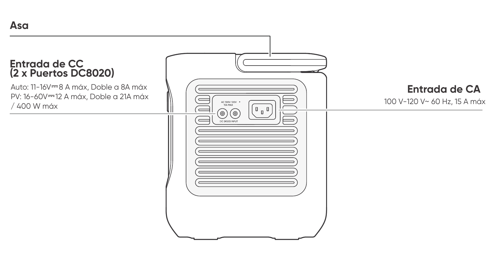

<svg aria-hidden="true" class="hb-leader-layer" focusable="false" preserveAspectRatio="none" viewBox="0 0 100 100"><polyline class="hb-leader" data-callout-id="overview.right.handle" points="1.416,9.834 55.045,9.834 55.045,18.308"></polyline><polyline class="hb-leader" data-callout-id="overview.right.dc_input" points="1.416,41.989 43.752,41.989"></polyline><polyline class="hb-leader" data-callout-id="overview.right.ac_input" points="98.813,40.483 56.874,40.483"></polyline></svg>

<strong>Asa</strong>

<strong>Entrada de CC (2 × Puertos DC8020)</strong>

Coche: 11-16 V⎓8 A máx., Doble a 8 A máx.

PV: 16-60 V⎓12 A máx., Doble a 21 A máx. / 400 W máx.

<strong>Entrada de CA</strong>

100 V-120 V~ 60 Hz,15 A máx.

</figure>

# PANTALLA LCD

<figure aria-label="LCD icon meanings" class="hb-lcd-table-composition"><table class="longtable hb-lcd-icon-table"><colgroup><col class="hb-lcd-col-number"/><col class="hb-lcd-col-icon"/><col class="hb-lcd-col-name"/><col class="hb-lcd-col-description"/></colgroup>

<tbody>
<tr><td class="hb-lcd-number">
1
</td>
<td class="hb-lcd-icon">
</td>
<td class="hb-lcd-name">
Wi-Fi
</td>
<td class="hb-lcd-description">

<strong>Encendido:</strong> Wi-Fi conectado.

<strong>Parpadeo:</strong> listo para conectarse al Wi-Fi.

<strong>Apagado:</strong> Wi-Fi desconectado.

</td>
</tr>
<tr><td class="hb-lcd-number">
2
</td>
<td class="hb-lcd-icon">
</td>
<td class="hb-lcd-name">
Bluetooth
</td>
<td class="hb-lcd-description">

<strong>Encendido:</strong> Bluetooth conectado.

<strong>Parpadeo:</strong> listo para conectarse al Bluetooth.

<strong>Apagado:</strong> Bluetooth desconectado.

</td>
</tr>
<tr><td class="hb-lcd-number">
3
</td>
<td class="hb-lcd-icon">
</td>
<td class="hb-lcd-name">
Modo de Carga Silenciosa
</td>
<td class="hb-lcd-description">

<strong>Encendido:</strong> el ruido durante la carga se minimiza significativamente, mientras que la potencia de carga se reduce y la velocidad de carga disminuye.

<strong>Apagado:</strong> El modo de carga silenciosa está desactivado.

Activar/desactivar esta función en la App Jackery. Cuando el dispositivo se apaga, se retiene la configuración.

</td>
</tr>
<tr><td class="hb-lcd-number">
4
</td>
<td class="hb-lcd-icon">
</td>
<td class="hb-lcd-name">
Plan de Carga
</td>
<td class="hb-lcd-description">

Personaliza el tiempo de carga del Jackery Explorer 1000. Adecuado para situaciones con tarifas eléctricas variables, permite establecer planes de carga según las horas pico y valle, reduciendo así los costos de electricidad.

Por favor, configure esta función en la aplicación Jackery. Cuando el dispositivo se apaga, se retiene la configuración.

</td>
</tr>
<tr><td class="hb-lcd-number">
5
</td>
<td class="hb-lcd-icon">
</td>
<td class="hb-lcd-name">
Modo Autónomo
</td>
<td class="hb-lcd-description">

Maximiza el uso de la energía solar y reduce la dependencia de la electricidad de la red al priorizar la energía solar almacenada, reduciendo los costos eléctricos. La estación de energía debe estar conectada simultáneamente a los paneles solares y a la red, con la potencia de carga limitada por la potencia de derivación.

Por favor, active/desactive esta función en la aplicación. Cuando el dispositivo se apaga, se retiene la configuración.

</td>
</tr>
<tr><td class="hb-lcd-number">
6
</td>
<td class="hb-lcd-icon">
</td>
<td class="hb-lcd-name">
Modo TOU
</td>
<td class="hb-lcd-description">

<strong>Encendido:</strong> el modo TOU está habilitado (SOC de respaldo predeterminado: 60 %). Durante las horas pico, el producto prioriza la descarga de la batería para reducir los costos de  la electricidad en momentos de alta demanda, cuando la energía almacenada supera el SOC de respaldo. Durante las horas valle, el sistema carga la batería desde la red para lograr recortar los picos y llenar los valles.

<strong>Apagado:</strong> el modo TOU está deshabilitado. El dispositivo no sigue la estrategia TOU (tarifa por periodo de uso) y opera según la lógica predeterminada de suministro de energía y carga.

Por favor, active/desactive esta función en la aplicación. Cuando el dispositivo se apaga, se retiene la configuración.

</td>
</tr>
<tr><td class="hb-lcd-number">
7
</td>
<td class="hb-lcd-icon">
</td>
<td class="hb-lcd-name">
UPS
</td>
<td class="hb-lcd-description">

<strong>Encendido:</strong> El producto está funcionando en modo bypass. Las cargas conectadas a los puertos de CA consumen energía de la red eléctrica en lugar de la estación de energía.

Si la red eléctrica falla repentinamente, el producto cambia automáticamente a la alimentación de la batería en 10 ms.

<strong>Apagado:</strong> El producto no está en modo bypass. Las cargas conectadas a los puertos de CA son alimentadas por la batería interna de la estación de energía.

</td>
</tr>
<tr><td class="hb-lcd-number">
8
</td>
<td class="hb-lcd-icon">
</td>
<td class="hb-lcd-name">
Indicador de Energía de CA
</td>
<td class="hb-lcd-description">
La salida CA (onda sinusoidal pura) está activada.
</td>
</tr>
<tr><td class="hb-lcd-number">
9
</td>
<td class="hb-lcd-icon">
</td>
<td class="hb-lcd-name">
Voltaje y frecuencia de salida
</td>
<td class="hb-lcd-description">
Muestra el voltaje y la frecuencia de salida cuando la salida de CA está encendida.
</td>
</tr>
<tr><td class="hb-lcd-number">
10
</td>
<td class="hb-lcd-icon">
</td>
<td class="hb-lcd-name">
Potencia de Entrada
</td>
<td class="hb-lcd-description">
Muestra la potencia de entrada en vatios.
</td>
</tr>
<tr><td class="hb-lcd-number">
11
</td>
<td class="hb-lcd-icon">
</td>
<td class="hb-lcd-name">
Tiempo de Carga Restante
</td>
<td class="hb-lcd-description">
Muestra el tiempo de carga restante.
</td>
</tr>
<tr><td class="hb-lcd-number">
12
</td>
<td class="hb-lcd-icon">
</td>
<td class="hb-lcd-name">
Indicador de Carga desde Toma de Corriente CA
</td>
<td class="hb-lcd-description">
El producto se carga a través de la entrada CA utilizando energía de la red eléctrica.
</td>
</tr>
<tr><td class="hb-lcd-number">
13
</td>
<td class="hb-lcd-icon">
</td>
<td class="hb-lcd-name">
Indicador de Carga desde Vehículo
</td>
<td class="hb-lcd-description">
El producto se carga a través de la entrada CC (DC8020) utilizando CC 12V (carga desde el vehículo).
</td>
</tr>
<tr><td class="hb-lcd-number">
14
</td>
<td class="hb-lcd-icon">
</td>
<td class="hb-lcd-name">
Indicador de Carga Solar
</td>
<td class="hb-lcd-description">
El producto se carga a través de la entrada CC (DC8020) utilizando paneles solares.
</td>
</tr>
<tr><td class="hb-lcd-number">
15
</td>
<td class="hb-lcd-icon">
</td>
<td class="hb-lcd-name">
Modo de Ahorro de Batería
</td>
<td class="hb-lcd-description">

<strong>Encendido:</strong> el modo de ahorro de batería está activado. Se aplican límites de carga y descarga para ayudar a prolongar la vida útil de la batería.

<strong>Apagado:</strong> el modo de ahorro de batería está desactivado.

Activar/desactivar esta función en la App Jackery. Cuando el dispositivo se apaga, se retiene la configuración.

Cuando esta función está habilitada, el producto ocasionalmente realiza un ciclo completo de carga-descarga para calibrar el SOC.

</td>
</tr>
<tr><td class="hb-lcd-number">
16
</td>
<td class="hb-lcd-icon">
</td>
<td class="hb-lcd-name">
Límite de potencia de carga
</td>
<td class="hb-lcd-description">

<strong>Encendido:</strong> El límite de potencia de carga está activado en la aplicación Jackery.

<strong>Apagado:</strong> El límite de potencia de carga está desactivado en la aplicación Jackery.

Cuando el dispositivo se apaga, se retiene la configuración.

</td>
</tr>
<tr><td class="hb-lcd-number">
17
</td>
<td class="hb-lcd-icon">
</td>
<td class="hb-lcd-name">
Indicador de Potencia de la Batería
</td>
<td class="hb-lcd-description">
Cuando el producto se está cargando, el círculo naranja alrededor del porcentaje de batería se ilumina secuencialmente. Cuando está cargando otros dispositivos, el círculo naranja permanece encendido.
</td>
</tr>
<tr><td class="hb-lcd-number">
18
</td>
<td class="hb-lcd-icon">
</td>
<td class="hb-lcd-name">
Porcentaje de Batería Restante
</td>
<td class="hb-lcd-description">
Muestra el porcentaje de batería restante.
</td>
</tr>
<tr><td class="hb-lcd-number">
19
</td>
<td class="hb-lcd-icon">
</td>
<td class="hb-lcd-name">
Indicador de Batería Baja
</td>
<td class="hb-lcd-description">

<strong>Encendido:</strong> el nivel de la batería está por debajo del 20 %.

<strong>Parpadeo:</strong> el nivel de la batería está por debajo del 5 %.

<strong>Apagado:</strong> el nivel de la batería no está por debajo del 20 % o el producto se está cargando.

</td>
</tr>
<tr><td class="hb-lcd-number">
20
</td>
<td class="hb-lcd-icon">
</td>
<td class="hb-lcd-name">
Temporizador de descarga
</td>
<td class="hb-lcd-description">

<strong>Encendido:</strong> se ha configurado un temporizador de descarga.

<strong>Apagado:</strong> no se ha configurado un temporizador de descarga.

Activar/desactivar esta función en la App Jackery. Cuando el dispositivo esté apagado, este ajuste no se conservará.

</td>
</tr>
<tr><td class="hb-lcd-number">
22
</td>
<td class="hb-lcd-icon">
</td>
<td class="hb-lcd-name">
Modo de Ahorro de Energía
</td>
<td class="hb-lcd-description">

Cuando las salidas CA o CC se encienden presionando los botones de encendido CA o CC/USB:

<strong>Encendido:</strong> Modo de ahorro de energía activado.

<strong>Apagado:</strong> Modo de ahorro de energía desactivado.

Cuando el dispositivo se apaga, se retiene la configuración.

</td>
</tr>
<tr><td class="hb-lcd-number">
23
</td>
<td class="hb-lcd-icon">
</td>
<td class="hb-lcd-name">
Indicador de Alta Temperatura
</td>
<td class="hb-lcd-description">
Se activó la protección por alta temperatura. El producto puede dejar de funcionar hasta que su temperatura vuelva al rango normal de operación.
</td>
</tr>
<tr><td class="hb-lcd-number">
24
</td>
<td class="hb-lcd-icon">
</td>
<td class="hb-lcd-name">
Indicador de Baja Temperatura
</td>
<td class="hb-lcd-description">
Se activó la protección por baja temperatura. El producto puede dejar de funcionar hasta que su temperatura vuelva al rango normal de operación.
</td>
</tr>
<tr><td class="hb-lcd-number">
25
</td>
<td class="hb-lcd-icon">
</td>
<td class="hb-lcd-name">
Código de fallo
</td>
<td class="hb-lcd-description">
Se ha producido un error en el producto. Por favor, consulte la sección de solución de problemas para más detalles.
</td>
</tr>
<tr><td class="hb-lcd-number">
26
</td>
<td class="hb-lcd-icon">
</td>
<td class="hb-lcd-name">
Potencia de Salida
</td>
<td class="hb-lcd-description">
Muestra la potencia de salida en vatios.
</td>
</tr>
<tr><td class="hb-lcd-number">
27
</td>
<td class="hb-lcd-icon">
</td>
<td class="hb-lcd-name">
Tiempo de Descarga Restante
</td>
<td class="hb-lcd-description">
Muestra el tiempo de descarga restante.
</td>
</tr>
</tbody>
</table></figure>

# OPERACIONES

## ENCENDIDO/APAGADO

<figure class="hb-operation-figure hb-operation-layout-status-right" data-operation-id="main-power" data-source-fragment-sha256="c29619354cf6c55e4252baefd2c413bdbe203f4cb6e59bf8821956e9d07e37dc" data-web-replace-key="operation.main-power">

<strong>Encendido</strong>

Presione una vez

<strong>Apagado</strong>

Mantenga presionado durante más de 3 segundos

<strong>Tiempo de espera predeterminado:</strong> 2 horas.

El producto se apagará automáticamente después de 2 horas de inactividad, sin carga ni descarga.

*El tiempo de espera puede configurarse en la aplicación Jackery.

</figure>

Cuando el modo de ahorro de energía está activado, el producto se apagará automáticamente después de 12 horas si el botón de energía CA o el botón de energía CC / USB está encendido, pero el producto no está cargando ni descargando.

## ENCENDER/APAGAR SALIDA CA

<figure class="hb-operation-figure hb-operation-layout-status-right hb-has-composite-art" data-operation-id="ac-output" data-source-fragment-sha256="2999006952f2b11383aeab7c10bb6cae2bbb025b5fb2e41ad84a1cb82cfcd8e6" data-web-replace-key="operation.ac-output">
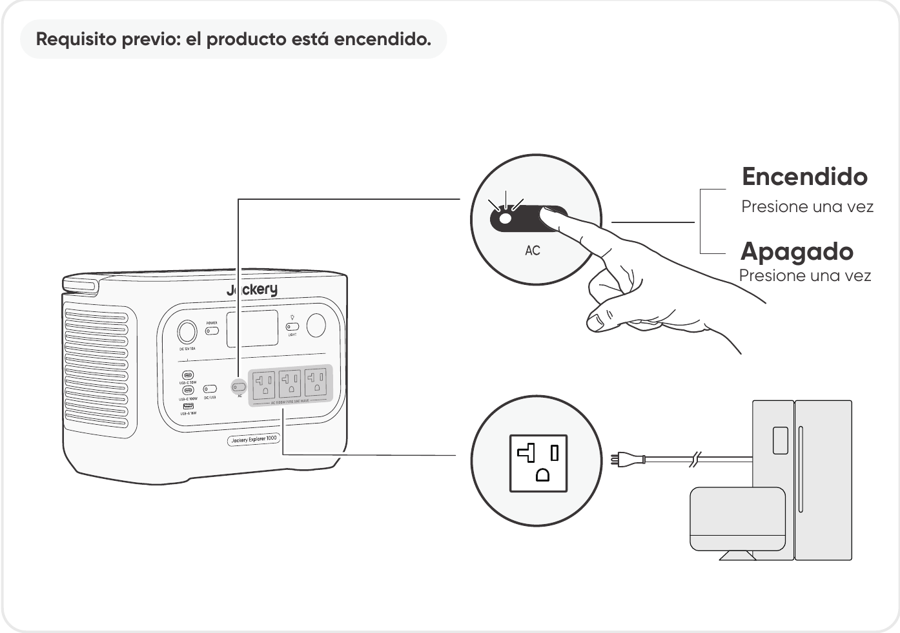

<strong>Requisito previo:</strong> el producto está encendido.

<strong>Encendido</strong>

Presione una vez

<strong>Apagado</strong>

Presione una vez

</figure>

## ENCENDER/APAGAR SALIDA CC 12V/USB

<figure class="hb-operation-figure hb-operation-layout-status-right hb-has-composite-art" data-operation-id="dc-usb-output" data-source-fragment-sha256="27e2bc835766afe080395ab6885c86a1b8a1f3f8694f7a370a3444bd3e8cca83" data-web-replace-key="operation.dc-usb-output">
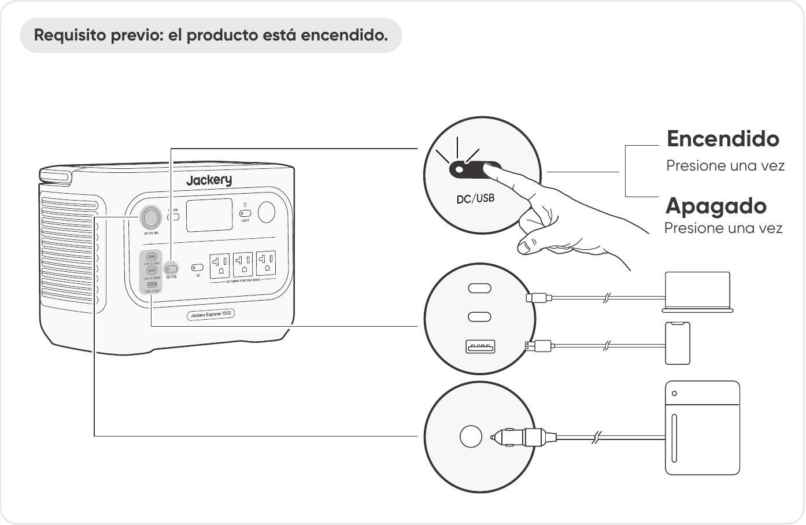

<strong>Requisito previo:</strong> el producto está encendido.

<strong>Encendido</strong>

Presione una vez

<strong>Apagado</strong>

Presione una vez

</figure>

<table class="manual-callout-table" style="width:100%; border-collapse:collapse; margin:0 0 16px 0;"><tbody><tr><td class="manual-callout-label" style="width:16%; border:1px solid #000; padding:6px 8px; vertical-align:top;">
<strong>PRECAUCIÓN</strong>
</td><td class="manual-callout-body" style="border:1px solid #000; padding:6px 8px; vertical-align:top;"><ul class="simple">
<li>
El puerto USB‑C de 100 W es una salida de alta potencia de tipo Fuente de Alimentación 3 (PS3) según USB‑PD. Si el dispositivo del usuario o accesorio conectado no cumple con los requisitos de seguridad, puede existir riesgo de incendio. Antes de usar estos puertos, asegúrese de que el dispositivo o accesorio conectado tenga protección contra incendios.
</li>
<li>
Solo conecte el Jackery Explorer 1000 a dispositivos o accesorios que cumplan con las cláusulas 6.3, 6.4 y 6.5 de IEC/EN/UL 62368-1 (u otros estándares equivalentes).
</li>
<li>
Para obtener la potencia máxima de salida, utilice el cable USB-C a USB-C de 5 A (20 V CC/5 A, 100W).
</li>
</ul>
</td></tr></tbody></table>

El producto puede cargar la batería de su automóvil utilizando el cable de carga de batería para automóvil Jackery de 12 V, que se vende por separado y está disponible en nuestro sitio web.

<table class="manual-callout-table" style="width:100%; border-collapse:collapse; margin:0 0 16px 0;"><tbody><tr><td class="manual-callout-label" style="width:16%; border:1px solid #000; padding:6px 8px; vertical-align:top;">
<strong>PRECAUCIÓN</strong>
</td><td class="manual-callout-body" style="border:1px solid #000; padding:6px 8px; vertical-align:top;"><ul class="simple">
<li>
El puerto CC de 12 V solo es compatible con baterías de automóvil de 12 V y no es adecuado para sistemas de 24 V.
</li>
<li>
No arranque el automóvil mientras el producto está cargando la batería del automóvil a través del puerto de salida CC de 12V, ya que esto podría dañar el producto.
</li>
<li>
Esta función está diseñada únicamente para uso de emergencia y no puede cargar una batería de automóvil descargada o dañada.
</li>
</ul>
</td></tr></tbody></table>

## MODO DE AHORRO DE ENERGÍA

Para evitar un consumo innecesario de batería por olvidar apagar la salida, el producto activa por defecto el Modo de Ahorro de Energía. Cuando la salida de CA o CC/USB está encendida, el icono del modo de ahorro de energía se mostrará en la pantalla LCD. En este modo, si no hay ningún dispositivo conectado o si el consumo del dispositivo conectado está por debajo de cierto umbral (25 W en salida de CA o 2 W en salida de CC/USB), la salida correspondiente se apagará automáticamente después del tiempo configurado. La configuración predeterminada es 12 horas. La duración del Modo de Ahorro de Energía puede configurarse en la aplicación Jackery en 1 H, 2 H, 8 H, 12 H o 24 H. Si se establece en \"Never Off\", el Modo de Ahorro de Energía se desactivará.

Para desactivar el modo de ahorro de energía, mantenga pulsados simultáneamente el botón de energía CA y el botón POWER durante más de 3 segundos. Una vez desactivado el modo de ahorro de energía, el icono dejará de mostrarse en la pantalla LCD y el producto no apagará automáticamente la salida de CA o CC/USB.

Cuando alimente dispositivos de baja potencia (CA ≤ 25 W o CC/USB ≤ 2 W), desactive el modo de ahorro de energía para evitar que la salida se apague automáticamente durante el funcionamiento.

<figure class="hb-operation-figure hb-operation-layout-footer-overlay hb-has-composite-art" data-operation-id="energy-saving" data-source-fragment-sha256="f25aae3ea854de546f4ffd9be29bdd77b5c35e64a872e47dea8b9163317eb652" data-web-replace-key="operation.energy-saving">
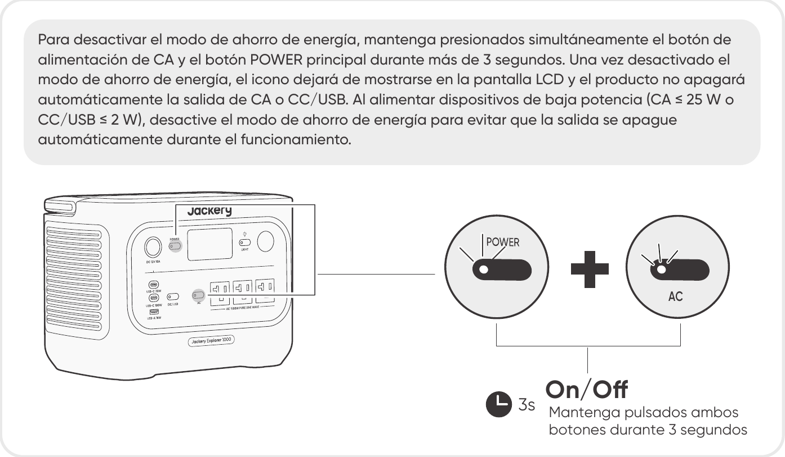

Mantenga pulsados ambos botones durante 3 segundos.

</figure>

<table class="manual-callout-table" style="width:100%; border-collapse:collapse; margin:0 0 16px 0;"><tbody><tr><td class="manual-callout-label" style="width:16%; border:1px solid #000; padding:6px 8px; vertical-align:top;">
<strong>NOTA</strong>
</td><td class="manual-callout-body" style="border:1px solid #000; padding:6px 8px; vertical-align:top;">
El modo de ahorro de energía reanuda el estado anterior después de encender. Se requiere un cambio manual para modificar el modo.
</td></tr></tbody></table>

## ENCENDER/APAGAR LUZ LED

<figure class="hb-operation-figure hb-operation-layout-footer-panel hb-has-composite-art" data-operation-id="led-light" data-source-fragment-sha256="7741a2f81595f2fc83cb9fc4074b3cf6658fb6c1de20927071131f71452c2ad1" data-web-replace-key="operation.led-light">
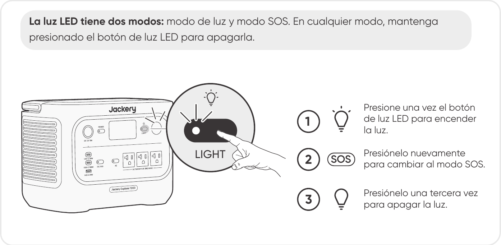

La luz LED tiene dos modos: modo de luz y modo SOS. En cualquier modo, mantenga presionado el botón de luz LED para apagarla.

Presione una vez el botón de la luz LED para encenderla.

Presiónelo nuevamente para cambiar al modo SOS.

Presiónelo una tercera vez para apagar la luz.

</figure>

## Función de reanudación de Salida de CA y CC

Esta función memoriza el estado de la salida y reanuda automáticamente las salidas de CA y CC bajo condiciones definidas.

<figure aria-label="Condiciones de reanudación automática / Condiciones sin reanudación automática" class="hb-auto-resume-composition"><table class="hb-auto-resume-table"><colgroup><col class="hb-auto-resume-col"/><col class="hb-auto-resume-col"/></colgroup>
<thead>
<tr><th class="head hb-auto-resume-left" scope="col">
Condiciones de reanudación automática
</th>
<th class="head hb-auto-resume-right" scope="col">
Condiciones sin reanudación automática
</th>
</tr>
</thead>
<tbody>
<tr><td class="hb-auto-resume-left">
Encendido/Reiniciar después de apagado o reinicio
</td>
<td class="hb-auto-resume-right">
Apagado manual de la salida (botón/App)
</td>
</tr>
<tr><td class="hb-auto-resume-left" rowspan="2">
SOC de la batería ≥ límite de descarga +10 % después de alcanzar
el límite
</td>
<td class="hb-auto-resume-right">
Apagado de salida en modo de ahorro de energía
</td>
</tr>
<tr><td class="hb-auto-resume-right">
Apagado de salida activado por protección
</td>
</tr>
<tr><td class="hb-auto-resume-left">
Actualización OTA completada
</td>
<td class="hb-auto-resume-right">
Apagado de salida activado por temporizador de descarga
</td>
</tr>
</tbody>
</table></figure>

## PANTALLA LCD

<figure aria-label="Modo de pantalla LCD." class="hb-lcd-mode-composition">

<table class="hb-lcd-mode-table"><colgroup><col class="hb-lcd-mode-col-state"/><col class="hb-lcd-mode-col-action"/><col class="hb-lcd-mode-col-copy"/></colgroup>
<tr>

<td class="hb-lcd-mode-state" rowspan="3">En breve</td>
<td class="hb-lcd-mode-action">Encender</td>
<td class="hb-lcd-mode-copy">Presione el botón POWER o cuando el producto se esté cargando.</td>
</tr>
<tr>
<td class="hb-lcd-mode-action">Apagar</td>
<td class="hb-lcd-mode-copy">Presione el botón POWER.</td>
</tr>
<tr>
<td class="hb-lcd-mode-action">Apagado automático</td>
<td class="hb-lcd-mode-copy">La pantalla LCD se apaga automáticamente y entra en modo de suspensión después de 2 minutos de inactividad.</td>
</tr>
<tr>
<td class="hb-lcd-mode-state" rowspan="3">Estable en (durante el estado de carga o descarga)</td>
<td class="hb-lcd-mode-action">Encender</td>
<td class="hb-lcd-mode-copy">Presione dos veces el botón POWER cuando el producto esté encendido.</td>
</tr>
<tr>
<td class="hb-lcd-mode-action">Apagar</td>
<td class="hb-lcd-mode-copy">Presione el botón POWER.</td>
</tr>
<tr>
<td class="hb-lcd-mode-action">Apagado automático</td>
<td class="hb-lcd-mode-copy">La pantalla LCD se apaga automáticamente después de 2 horas de inactividad.</td>
</tr>
</table>
</figure>

También puede configurar el modo de visualización de la pantalla en la aplicación Jackery.

## COMBINACIONES DE TECLAS

| Botones | Operación | Función |
|----|----|----|
| Botón POWER + botón de energía de CA | Mantenga pulsados ambos botones durante 3 segundos | Encender/apagar el modo de ahorro de energía |
| Botón POWER + botón de energía CC/USB | Mantenga pulsados ambos botones durante 3 segundos | Restablecer Wi-Fi y Bluetooth |
| Botón de energía CC/USB + botón de energía de CA | Mantenga pulsados ambos botones durante 1 segundo | Encender/apagar Wi-Fi y Bluetooth |
| Botón POWER + botón de luz LED | Mantenga pulsados ambos botones durante 1 segundo | Activar/desactivar el modo de carga de emergencia |

# FUENTE DE ALIMENTACIÓN ININTERRUMPIDA (UPS)

Conecte el producto a una toma de corriente con el cable de carga de CA, luego presione el botón de energía CA y alimente sus electrodomésticos al mismo tiempo.

Un sistema de alimentación ininterrumpida (UPS) es un tipo de sistema de energía continua que proporciona energía eléctrica de respaldo automática a una carga cuando falla la energía de la red principal.

En caso de una pérdida repentina de energía de la red, Jackery Explorer 1000 cambiará automáticamente a la energía almacenada en menos de 10 ms para mantener sus electrodomésticos en funcionamiento.

En modo UPS, la potencia máxima de salida de la unidad alcanza 12 A antes de los cortes de energía. Como la carga y descarga simultáneas están habilitadas en modo bypass,

la potencia de salida real es inferior a la potencia nominal en este modo, pero vuelve a la potencia nominal durante los cortes.

<table class="manual-callout-table" style="width:100%; border-collapse:collapse; margin:0 0 16px 0;"><tbody><tr><td class="manual-callout-label" style="width:16%; border:1px solid #000; padding:6px 8px; vertical-align:top;">
<strong>PRECAUCIÓN</strong>
</td><td class="manual-callout-body" style="border:1px solid #000; padding:6px 8px; vertical-align:top;"><ul class="simple">
<li>
Este producto no admite conmutación de 0 ms. No lo conecte a equipos que requieran una fuente de alimentación con conmutación de 0 ms, como servidores de datos o estaciones de trabajo.
</li>
<li>
Antes de usar, pruebe la compatibilidad con su dispositivo varias veces.
</li>
<li>
No conectes cargas que excedan la potencia máxima de salida del producto. De lo contrario, se activará la protección contra sobrecarga.
</li>
</ul>
</td></tr></tbody></table>

# CARGANDO

**Energía renovable primero:** Abogamos por utilizar primero energía renovable. Este producto admite dos modos de carga al mismo tiempo: carga solar y carga de pared de CA.

Cuando la carga en la pared de CA y la carga solar están activadas al mismo tiempo, el producto dará prioridad a la carga solar y se utilizarán ambos métodos para cargar la batería a la máxima potencia permitida.

**Carga completamente el producto antes de usarlo por primera vez.**

<table class="manual-callout-table" style="width:100%; border-collapse:collapse; margin:0 0 16px 0;"><tbody><tr><td class="manual-callout-label" style="width:16%; border:1px solid #000; padding:6px 8px; vertical-align:top;">
<strong>NOTA</strong>
</td><td class="manual-callout-body" style="border:1px solid #000; padding:6px 8px; vertical-align:top;"><ul class="simple">
<li>
La temperatura de carga recomendada para el producto es de 32 °F a 113 °F / 0 °C a 45 °C, y la temperatura de descarga es de 14°F a 113°F / -10°C a 45°C.
</li>
<li>
Operar el producto fuera de este rango de temperatura puede limitar sus capacidades de carga y descarga, e incluso impedir la carga o descarga.
</li>
<li>
La potencia de carga y la capacidad de la batería del producto pueden variar debido a las fluctuaciones de temperatura.
</li>
</ul>
</td></tr></tbody></table>

## CARGA MEDIANTE UNA TOMA DE CORRIENTE DE PARED ALTERNA

Conecte el cable de carga de CA al puerto de entrada de CA del producto y a una toma de corriente.

<table class="manual-callout-table" style="width:100%; border-collapse:collapse; margin:0 0 16px 0;"><tbody><tr><td class="manual-callout-label" style="width:16%; border:1px solid #000; padding:6px 8px; vertical-align:top;">
<strong>PRECAUCIÓN</strong>
</td><td class="manual-callout-body" style="border:1px solid #000; padding:6px 8px; vertical-align:top;">
Asegúrese de que el cable de carga de CA esté completamente y firmemente insertado en el puerto de entrada de CA. Una conexión incompleta puede causar corriente inestable, sobrecalentamiento, mal contacto o fallos en el funcionamiento del producto.
</td></tr></tbody></table>

**Modo de Carga de Emergencia**

Bajo este modo, puedes cargar rápidamente la estación de energía portátil utilizando el método de carga de CA. Esta función de carga de emergencia se puede activar o desactivar a través de la aplicación Jackery. Cuando está en modo de carga de emergencia, la luz circular que indica el estado de carga (SOC) parpadeará más rápido. \*Para maximizar la vida útil de la batería, es mejor cargar a la velocidad estándar. La carga de emergencia debe reservarse para situaciones que requieren un aumento rápido de energía y no se recomienda para un uso regular y prolongado.

## CARGA MEDIANTE PANELES SOLARES (SE VENDEN POR SEPARADO)

Jackery Explorer 1000 cuenta con dos puertos de entrada DC8020 y es compatible con los paneles solares de Jackery.

Si se necesita conectar dos paneles solares a un solo puerto de entrada DC8020 al mismo tiempo, consulte la figura siguiente para la carga mediante el conector de panel solar (se vende por separado y no se incluye de serie).

<table class="manual-callout-table" style="width:100%; border-collapse:collapse; margin:0 0 16px 0;"><tbody><tr><td class="manual-callout-label" style="width:16%; border:1px solid #000; padding:6px 8px; vertical-align:top;">
<strong>PRECAUCIÓN</strong>
</td><td class="manual-callout-body" style="border:1px solid #000; padding:6px 8px; vertical-align:top;">
Un puerto de entrada DC8020 puede conectarse como máximo a dos paneles solares.
</td></tr></tbody></table>

<table class="manual-callout-table" style="width:100%; border-collapse:collapse; margin:0 0 16px 0;"><tbody><tr><td class="manual-callout-label" style="width:16%; border:1px solid #000; padding:6px 8px; vertical-align:top;">
<strong>PRECAUCIÓN</strong>
</td><td class="manual-callout-body" style="border:1px solid #000; padding:6px 8px; vertical-align:top;">
Asegúrese de que el voltaje de entrada para ambos puertos de entrada de CC sea el mismo. De lo contrario, podría dañar el producto. Por ejemplo:

<ul class="simple">
<li>
Utilizar paneles solares Jackery del mismo modelo y la misma cantidad de paneles al conectar paneles solares a ambos puertos de entrada DC8020.
</li>
<li>
No cargue el producto utilizando simultáneamente un cargador de vehículo y un panel solar. Esto puede fundir el fusible del vehículo o provocar un fallo de carga.
</li>
</ul>
</td></tr></tbody></table>

Se recomienda usar el panel solar Jackery para cargar el Jackery Explorer 1000. Asegúrese de que el voltaje en circuito abierto (Voc) del panel solar se sitúe dentro del rango de entrada de CC de Jackery Explorer 1000 (16V-60V). Jackery no se hace responsable de pérdidas causadas por el uso de paneles solares de otras marcas.

## CARGA CON UN CARGADOR PARA VEHÍCULO (SE VENDE POR SEPARADO)

Este producto puede cargarse usando un cargador para vehículo de 12 V. Asegúrese de que el cargador de vehículo y el encendedor de vehículo ofrezcan una buena conexión.

<figure class="hb-reference-figure" data-reference-id="charging-car" data-source-fragment-sha256="d3390e4dfab4156ab727b1b6694fd841a865ee0aecc4c3ff8d6db3327fd2c95a" data-web-replace-key="reference.charging-car">

Vehículo

※El cable de carga para vehículo se vende por separado.

</figure>

<table class="manual-callout-table" style="width:100%; border-collapse:collapse; margin:0 0 16px 0;"><tbody><tr><td class="manual-callout-label" style="width:16%; border:1px solid #000; padding:6px 8px; vertical-align:top;">
<strong>PRECAUCIÓN</strong>
</td><td class="manual-callout-body" style="border:1px solid #000; padding:6px 8px; vertical-align:top;"><ul class="simple">
<li>
Por favor, encienda el vehículo antes de cargar su estación de energía.
</li>
<li>
Si el vehículo circula por caminos accidentados, está prohibido usar el cargador de vehículo para evitar un funcionamiento no conforme. La empresa no se responsabilizará por ninguna pérdida causada por un funcionamiento no conforme.
</li>
<li>
La carga en vehículo solo es aplicable a vehículos con 12 V CC, no a 24 V CC. Por favor, no cargue este producto en vehículos de 24 V para evitar lesiones personales y daños materiales.
</li>
</ul>
</td></tr></tbody></table>

# ALMACENAMIENTO

Almacene el producto en un lugar seco y limpio con ventilación adecuada. Temperatura y humedad de almacenamiento:

- 1 mes: -4°F a 113°F / -20°C a 45°C (0-60 % HR)

- 3 meses: 32°F a 113°F / 0°C a 45°C (0-60 % HR)

- 12 meses: 32°F a 77°F / 0°C a 25°C (0-60 % HR)

Si este producto se almacena durante un período prolongado (de 3 a 6 meses) con la batería descargada, podría volverse imposible recargarlo. Para evitar esto y mantener la salud de la batería, se recomienda revisar y recargar el producto cada tres meses, y realizar un ciclo completo de carga y descarga al menos una vez cada 6 a 12 meses.

# RESOLUCIÓN DE PROBLEMAS

Si aparece alguno de los siguientes códigos de fallo, siga las acciones correctivas listadas para resolver el problema. Si el fallo persiste, por favor contacte con atención al cliente de Jackery.

<figure aria-label="Código de fallo / Medidas correctivas" class="hb-troubleshooting-composition"><table class="longtable hb-troubleshooting-table"><colgroup><col class="hb-troubleshooting-col-code"/><col class="hb-troubleshooting-col-measures"/></colgroup>

<thead>
<tr><th class="head hb-troubleshooting-code" scope="col">
Código de fallo
</th>
<th class="head hb-troubleshooting-measures" scope="col">
Medidas correctivas
</th>
</tr>
</thead>
<tbody>
<tr><td class="hb-troubleshooting-code">
F0
</td>
<td class="hb-troubleshooting-measures">
Reiniciar el producto.
</td>
</tr>
<tr><td class="hb-troubleshooting-code">
F1
</td>
<td class="hb-troubleshooting-measures">
Reiniciar el producto.
</td>
</tr>
<tr><td class="hb-troubleshooting-code">
F2
</td>
<td class="hb-troubleshooting-measures">
Reiniciar el producto.
</td>
</tr>
<tr><td class="hb-troubleshooting-code">
F3
</td>
<td class="hb-troubleshooting-measures">
Reiniciar el producto.
</td>
</tr>
<tr><td class="hb-troubleshooting-code">
F4
</td>
<td class="hb-troubleshooting-measures">
Conecte el producto a cargas para descargar la batería hasta que la falla desaparezca.
</td>
</tr>
<tr><td class="hb-troubleshooting-code">
F5
</td>
<td class="hb-troubleshooting-measures">
Cargue el producto mediante paneles solares o una toma de corriente CA hasta que la falla desaparezca.
</td>
</tr>
<tr><td class="hb-troubleshooting-code">
F6
</td>
<td class="hb-troubleshooting-measures">

1. Espere a que la red eléctrica se normalice antes de cargar el producto a través de una toma de corriente CA.

2. Verifique si las rejillas de entrada y salida de aire están obstruidas; asegure un espacio libre de 0,66 pies (20 cm) a ambos lados del producto.

3. Coloque el producto en un lugar que no esté expuesto a la luz solar directa ni a altas temperaturas ambientales.

4. Desconecte todas las cargas del producto. Mantenga el producto inactivo y espere hasta que la falla desaparezca.

5. Reinicie el producto.

</td>
</tr>
<tr><td class="hb-troubleshooting-code">
F7
</td>
<td class="hb-troubleshooting-measures">

1. Retire todas las entradas de CC del producto.

2. Si carga el producto mediante un panel solar, verifique el voltaje en circuito abierto (Voc) del panel solar conectado. El producto admite un voltaje máximo de entrada de CC de 60 V.

3. Reinicie el producto y déjelo inactivo. Espere hasta que la falla desaparezca.

</td>
</tr>
<tr><td class="hb-troubleshooting-code">
F8
</td>
<td class="hb-troubleshooting-measures">
Contacte con atención al cliente de Jackery.
</td>
</tr>
<tr><td class="hb-troubleshooting-code">
F9
</td>
<td class="hb-troubleshooting-measures">
Retire la carga conectada a los puertos USB del producto. Espere hasta que la falla desaparezca.
</td>
</tr>
<tr><td class="hb-troubleshooting-code">
FE
</td>
<td class="hb-troubleshooting-measures">
Contacte con atención al cliente de Jackery.
</td>
</tr>
</tbody>
</table></figure>

# ESPECIFICACIONES

## INFORMACIÓN GENERAL

<figure aria-label="INFORMACIÓN GENERAL" class="hb-spec-table-composition"><table class="manual-table manual-spec-table hb-spec-table"><colgroup><col class="hb-spec-col-label"/><col class="hb-spec-col-value"/></colgroup><tbody><tr><th class="manual-spec-label hb-spec-label" scope="row">Nombre del producto</th><td class="manual-spec-value hb-spec-value">Jackery Explorer 1000</td></tr><tr><th class="manual-spec-label hb-spec-label" scope="row">N° de modelo</th><td class="manual-spec-value hb-spec-value">JE-1000F / JE-1000F-SG</td></tr><tr><th class="manual-spec-label hb-spec-label" scope="row">Capacidad</th><td class="manual-spec-value hb-spec-value">1024 Wh (20 Ah / 51,2 V CC)</td></tr><tr><th class="manual-spec-label hb-spec-label" scope="row">Química Celular</th><td class="manual-spec-value hb-spec-value">LiFePO₄</td></tr><tr><th class="manual-spec-label hb-spec-label" scope="row">Peso</th><td class="manual-spec-value hb-spec-value">Aproximadamente 23,4 libras / 10,6 kg</td></tr><tr><th class="manual-spec-label hb-spec-label" scope="row">Dimensiones</th><td class="manual-spec-value hb-spec-value">12,4 x 7,9 x 9,2 pulgadas / 31,4 x 20,1 x 23,4 cm</td></tr><tr><th class="manual-spec-label hb-spec-label" scope="row">Ciclo de vida</th><td class="manual-spec-value hb-spec-value">6000 ciclos de carga hasta 70 % + de capacidad</td></tr></tbody></table></figure>

## PUERTOS DE ENTRADA

<figure aria-label="PUERTOS DE ENTRADA" class="hb-spec-table-composition"><table class="manual-table manual-spec-table hb-spec-table"><colgroup><col class="hb-spec-col-label"/><col class="hb-spec-col-value"/></colgroup><tbody><tr><th class="manual-spec-label hb-spec-label" rowspan="2" scope="row">1 × Entrada CA</th><td class="manual-spec-value hb-spec-value">Modo de carga: 100-120 V~ 60 Hz,15 A máx.</td></tr><tr><td class="manual-spec-value hb-spec-value">Modo de derivación①: 100-120 V~ 60 Hz,12 A máx.</td></tr><tr><th class="manual-spec-label hb-spec-label" rowspan="2" scope="row">2 × Puertos DC8020</th><td class="manual-spec-value hb-spec-value">11 V-16 V⎓8 A máx.,doble a 8 A máx.</td></tr><tr><td class="manual-spec-value hb-spec-value">16 V-60 V⎓12 A,doble a 21 A / 400 W máx.</td></tr></tbody></table></figure>

## PUERTOS DE SALIDA

<figure aria-label="PUERTOS DE SALIDA" class="hb-spec-table-composition"><table class="manual-table manual-spec-table hb-spec-table"><colgroup><col class="hb-spec-col-label"/><col class="hb-spec-col-value"/></colgroup><tbody><tr><th class="manual-spec-label hb-spec-label" scope="row">3 × Salidas CA</th><td class="manual-spec-value hb-spec-value">120 V~ 60 Hz, 12,5 A máx., 1500 W nominales por puerto,1500 W en total, pico de sobretensión de 3000 W</td></tr><tr><th class="manual-spec-label hb-spec-label" scope="row">Salida de CA en modo derivación①</th><td class="manual-spec-value hb-spec-value">120 V~, 60 Hz, 12 A máx.</td></tr><tr><th class="manual-spec-label hb-spec-label" rowspan="2" scope="row">2 × Salidas USB-C</th><td class="manual-spec-value hb-spec-value">30 W máx.,5 V⎓3 A,9 V⎓3 A,12 V⎓2.5 A,15 V⎓2 A,20 V⎓1,5 A</td></tr><tr><td class="manual-spec-value hb-spec-value">100 W máx.,5 V⎓3 A,9 V⎓3 A,12 V⎓3 A,15 V⎓3 A,20 V⎓5 A</td></tr><tr><th class="manual-spec-label hb-spec-label" scope="row">1 × Salida USB-A</th><td class="manual-spec-value hb-spec-value">18 W máx.,5-6 V⎓3 A,6-9 V⎓2 A,9-12 V⎓1.5 A</td></tr><tr><th class="manual-spec-label hb-spec-label" scope="row">1 × Puerto DC 12V</th><td class="manual-spec-value hb-spec-value">12 V⎓10 A máx.</td></tr></tbody></table></figure>

## TEMPERATURA DE FUNCIONAMIENTO

<figure aria-label="TEMPERATURA DE FUNCIONAMIENTO" class="hb-spec-table-composition"><table class="manual-table manual-spec-table hb-spec-table"><colgroup><col class="hb-spec-col-label"/><col class="hb-spec-col-value"/></colgroup><tbody><tr><th class="manual-spec-label hb-spec-label" scope="row">Temperatura de carga</th><td class="manual-spec-value hb-spec-value">32 °F a 113 °F / 0 °C a 45 °C</td></tr><tr><th class="manual-spec-label hb-spec-label" scope="row">Temperatura de descarga</th><td class="manual-spec-value hb-spec-value">14°F a 113°F / -10°C a 45°C</td></tr></tbody></table></figure>

 

※ USB Type-C® y USB-C® son marcas registradas de USB Implementers Forum.

① El producto puede cargar la batería desde una toma de corriente CA mientras suministra energía a través de los puertos de salida CA.

# GARANTÍA

<figure aria-label="GARANTÍA" class="hb-warranty-intro-composition">

<strong>Solo ofrecemos nuestra garantía a clientes que compren en el sitio web oficial de Jackery, plataformas de terceros con la marca Jackery o distribuidores autorizados locales.</strong>

*El período de garantía y los detalles pueden variar según las leyes, regulaciones y distribuidores autorizados locales.

</figure>

## Garantía limitada

<figure aria-label="Garantía limitada" class="hb-warranty-card" data-warranty-card-index="1">
Jackery Inc. garantiza al consumidor original que el producto Jackery estará libre de defectos relativos al acabado y a los materiales en condiciones normales de uso por parte del consumidor durante el período de garantía aplicable identificado en la sección "Período de garantía" que figura a continuación, sujeto a las exclusiones que se establecen a continuación.

Esta declaración de garantía establece la obligación de garantía total y exclusiva de Jackery. No asumiremos ni autorizaremos que ninguna persona asuma por nosotros ninguna otra responsabilidad en relación con la venta de nuestros productos.
</figure>

## Período de garantía

<figure aria-label="Período de garantía" class="hb-warranty-period-card">

3
<strong class="hb-warranty-years-unit">AÑOS</strong><strong class="hb-warranty-period-label">Garantía estándar</strong>

El período de garantía estándar de Jackery Explorer 1000 es de 36 meses. En cada caso, el período de garantía se mide a partir de la fecha de compra por parte del comprador consumidor original. Para establecer la fecha de inicio del período de garantía, se necesita el recibo de venta de la primera compra del consumidor u otra prueba documental razonable.

2
<strong class="hb-warranty-years-unit">AÑOS</strong><strong class="hb-warranty-period-label">Garantía extendida</strong>

Para activar la ampliación de garantía, debe registrar su producto en línea o ponerse en contacto con nuestro equipo de atención al cliente en <a class="reference external" href="mailto:hello@jackery.com">hello@jackery.com</a> para ampliar el período de garantía estándar.

</figure>

## Reparación o sustitución

<figure aria-label="Reparación o sustitución" class="hb-warranty-card" data-warranty-card-index="3">
Jackery reparará o sustituirá (a cargo de Jackery) cualquier producto Jackery que no funcione, durante el período de garantía aplicable, debido a defectos de acabado o de material. Un producto de sustitución asume la garantía restante del producto original.
</figure>

## Limitado al comprador consumidor original

<figure aria-label="Limitado al comprador consumidor original" class="hb-warranty-card" data-warranty-card-index="4">
La garantía del producto de Jackery se limita al consumidor original y no es transferible a ningún propietario posterior.
</figure>

## Exclusiones

<figure aria-label="Exclusiones" class="hb-warranty-card" data-warranty-card-index="5">
La garantía de Jackery no se aplica a:
<ul class="simple">
<li>
Cualquier producto que haya sido mal utilizado, abusado, modificado, dañado por accidente, o usado para cualquier cosa distinta del uso normal del consumidor según lo autorizado en la documentación actual del producto de Jackery.
</li>
<li>
Intento de reparación por cualquier persona que no sea un centro autorizado.
</li>
<li>
Cualquier producto adquirido a través de una casa de subastas en línea.
</li>
<li>
La garantía de Jackery no se aplica a la célula de la batería a menos que usted la cargue completamente en los siete días siguientes a la compra del producto y, a partir de entonces, al menos una vez cada 6 meses.
</li>
</ul></figure>

## Derechos de interpretación

<figure aria-label="Derechos de interpretación" class="hb-warranty-card" data-warranty-card-index="6">
Jackery se reserva el derecho de interpretación final de la política de postventa descrita anteriormente.
</figure>

# CONFIGURACIÓN DE LA APLICACIÓN

## 1. Descargar la aplicación e iniciar sesión

<figure aria-label="1. Descargar la aplicación e iniciar sesión" class="hb-app-download-composition">

Buscar "Jackery" en Google Play o en la App Store para instalar la aplicación. Después, podrá registrarse e iniciar sesión.

Alternativamente, escanee el código QR a continuación para descargar e instalar la app.

</figure>

## 2. Añadir un dispositivo

2.1 Haga clic en el botón +.

2.2 Presione una vez el botón POWER del dispositivo para encenderlo. Los iconos del wifi y del Bluetooth del dispositivo parpadearán para indicar que el dispositivo ha entrado en el modo de configuración de red. A continuación, pulse el botón \"icono parpadeante\" y permita que la aplicación se conecte a los dispositivos cercanos y abra los permisos de Bluetooth.

<figure class="hb-app-add-device-composition" data-reference-id="app-add-device" data-step-captions="embedded">

Botón POWERBotón de energía CC / USBBotón Power CA
</figure>

2.3 Tras hacer clic en el icono del dispositivo buscado, la aplicación conecta automáticamente el dispositivo a través de Bluetooth.

<table class="manual-callout-table" style="width:100%; border-collapse:collapse; margin:0 0 16px 0;"><tbody><tr><td class="manual-callout-label" style="width:16%; border:1px solid #000; padding:6px 8px; vertical-align:top;">
<strong>NOTA</strong>
</td><td class="manual-callout-body" style="border:1px solid #000; padding:6px 8px; vertical-align:top;">
Si durante el proceso de vinculación se indica que "el dispositivo ha sido vinculado", se pueden utilizar las dos formas siguientes para la conexión:

<ul class="simple">
<li>
El propietario del dispositivo lo compartirá con otros usuarios a través de la App.
</li>
<li>
Mantenga pulsados el botón POWER y botón de energía CC / USB durante 3 segundos para reiniciar el Wi‑Fi y el Bluetooth del dispositivo y, a continuación, vuelva a vincularlo.
</li>
</ul>
</td></tr></tbody></table>

2.4 Una vez que el dispositivo se haya conectado correctamente, introduzca el nombre y la contraseña de la red Wi-Fi. Una vez introducidos, el dispositivo se conectará automáticamente a la red Wi-Fi.

<table class="manual-callout-table" style="width:100%; border-collapse:collapse; margin:0 0 16px 0;"><tbody><tr><td class="manual-callout-label" style="width:16%; border:1px solid #000; padding:6px 8px; vertical-align:top;">
<strong>NOTA</strong>
</td><td class="manual-callout-body" style="border:1px solid #000; padding:6px 8px; vertical-align:top;">
Selecciona una red Wi-Fi en la banda de 2,4 GHz. El dispositivo no admite una red Wi-Fi en la banda de 5 GHz.
</td></tr></tbody></table>

2.5 Después de agregar exitosamente el dispositivo en la App, el icono del Wi-Fi en el dispositivo permanecerá siempre encendido.

<figure class="hb-reference-figure hb-has-composite-art" data-reference-id="app-connect-result" data-source-fragment-sha256="7a8700a6aa1dee58a471d51dac7f12f96dc512196cf2308ec569f5ea6e0f5f62" data-step-captions="embedded" data-web-replace-key="reference.app-connect-result">

</figure>

Las capturas de pantalla anteriores sirven solo de referencia.

<table class="manual-callout-table" style="width:100%; border-collapse:collapse; margin:0 0 16px 0;"><tbody><tr><td class="manual-callout-label" style="width:16%; border:1px solid #000; padding:6px 8px; vertical-align:top;">
<strong>PRECAUCIÓN</strong>
</td><td class="manual-callout-body" style="border:1px solid #000; padding:6px 8px; vertical-align:top;">
La aplicación Jackery solo puede conectarse a una estación de energía a la vez mediante Bluetooth. Regresar a la lista de dispositivos desconecta automáticamente Bluetooth. Toque la estación de energía en la lista nuevamente para reconectarse automáticamente.
</td></tr></tbody></table>

## 3. Desvincular el dispositivo

Haga clic en el icono **Configuración**, en la esquina superior derecha de la interfaz principal del dispositivo, para acceder a la página de configuración. A continuación, haga clic en el botón **Desvincular**, situado en la parte inferior de la página, para desvincular el dispositivo.

## 4. Notas

### 4.1 Para activar Wi-Fi y Bluetooth

- El wifi y el Bluetooth se encienden automáticamente al encender el dispositivo y se iluminan los iconos de wifi y Bluetooth de la pantalla.

- Pulse el botón de energía CC / USB y botón Power CA al mismo tiempo hasta que se enciendan los iconos de wifi y Bluetooth en la pantalla.

### 4.2 Para desactivar Wi-Fi y Bluetooth

Mantenga pulsados botón de energía CC / USB y botón Power CA al mismo tiempo hasta que se apaguen los iconos de wifi y Bluetooth en la pantalla.

### 4.3 Para restablecer Wi-Fi y Bluetooth

Pulsa el botón POWER y botón de energía CC / USB al mismo tiempo durante 3 segundos para restablecer los ajustes de fábrica de Wi-Fi y Bluetooth. Se desvinculará la cuenta de la aplicación conectada.
