# INFORMACIÓN IMPORTANTE DE SEGURIDAD

<table class="manual-callout-table" style="width:100%; border-collapse:collapse; margin:0 0 16px 0;"><tbody><tr><td class="manual-callout-label" style="width:16%; border:1px solid #000; padding:6px 8px; vertical-align:top;">
<strong>ADVERTENCIA</strong>
</td><td class="manual-callout-body" style="border:1px solid #000; padding:6px 8px; vertical-align:top;">
INSTRUCCIONES DE SEGURIDAD PARA PREVENIR INCENDIOS, DESCARGAS ELÉCTRICAS O LESIONES
</td></tr></tbody></table>

Sigue siempre estas precauciones básicas al usar este producto.

- Lee todas las instrucciones antes de usar este producto.
- No permitas que los niños jueguen con el producto. Se requiere supervisión estrecha cuando el producto se utilice cerca de niños.
- Puede existir riesgo de descarga eléctrica si se utilizan accesorios recomendados o vendidos por fabricantes no profesionales.
- Cuando el producto no esté en uso, desconecta el enchufe de alimentación de la toma del producto.
- No desmontes el producto, ya que esto puede causar riesgos imprevisibles como incendio, explosión o descarga eléctrica.
- No utilices el producto con cables, enchufes o cables de salida dañados, ya que esto puede provocar una descarga eléctrica.
- Para garantizar una circulación de aire adecuada, mantén descubiertas las rejillas de ventilación del producto. El área donde se utilice el producto debe tener un flujo de aire adecuado en un entorno fresco y seco para evitar el sobrecalentamiento.
  - Cargar en espacios húmedos o mal ventilados puede representar riesgos para la seguridad.
  - El agua puede provocar cortocircuitos o dañar el cargador, generando riesgos para la seguridad.
- No expongas el producto al fuego, a altas temperaturas, a la luz solar directa ni a entornos calurosos como el interior de un vehículo estacionado. Dicha exposición puede causar un incendio o una explosión.

## INSTRUCCIONES DE MANTENIMIENTO PARA EL USUARIO

Durante el ciclo de vida de los productos de almacenamiento de energía, se espera cierto grado de degradación de la capacidad y de la energía. A medida que aumenta el número de ciclos de carga y descarga y se prolonga el tiempo de almacenamiento, esta degradación se intensificará gradualmente. Esta es una condición normal coherente con el envejecimiento natural de las celdas de la batería.

# SIGNIFICADO DE LOS SÍMBOLOS

<figure aria-label="Símbolo / Significados" class="hb-symbol-signal-composition" data-component-id="HB-TABLE-SYMBOL-SIGNAL"><table class="hb-symbol-signal-table"><colgroup><col class="hb-symbol-signal-col-label"/><col class="hb-symbol-signal-col-meaning"/></colgroup><thead><tr><th class="hb-symbol-signal-label-heading" scope="col">
Símbolo
</th><th class="hb-symbol-signal-meaning-heading" scope="col">
Significados
</th></tr></thead><tbody><tr><td class="hb-symbol-signal-label-cell">⚠ADVERTENCIA</td><td class="hb-symbol-signal-meaning-cell">
Prácticas peligrosas que pueden resultar en lesiones graves, muerte y/o daños a la propiedad.
</td></tr><tr><td class="hb-symbol-signal-label-cell">⚠PRECAUCIÓN</td><td class="hb-symbol-signal-meaning-cell">
Prácticas peligrosas que pueden resultar en lesiones personales y/o daños a la propiedad.
</td></tr><tr><td class="hb-symbol-signal-label-cell">⚠NOTA</td><td class="hb-symbol-signal-meaning-cell">
Prácticas peligrosas que pueden resultar en daño al equipo, pérdida de datos, deterioro del rendimiento o resultados inesperados.
</td></tr><tr><td class="hb-symbol-signal-label-cell">⚠CONSEJOS</td><td class="hb-symbol-signal-meaning-cell">
Complementa la información importante o consejos de operación en el texto.
</td></tr></tbody></table></figure>

<figure aria-label="Símbolo / Significados" class="hb-symbol-pair-composition" data-component-id="HB-TABLE-SYMBOL-ICON">

<table class="hb-symbol-panel-table"><colgroup><col class="hb-symbol-col-icon"/><col class="hb-symbol-col-meaning"/></colgroup><thead><tr><th class="hb-symbol-icon-heading" scope="col">
<strong>Símbolo</strong>
</th><th class="hb-symbol-meaning-heading" scope="col">
<strong>Significados</strong>
</th></tr></thead><tbody><tr><td class="hb-symbol-icon"></td><td class="hb-symbol-meaning">
Precaución! El incumplimiento de los mensajes de advertencia puede provocar lesiones.
</td></tr><tr><td class="hb-symbol-icon"></td><td class="hb-symbol-meaning">
Lea el manual del operador
</td></tr><tr><td class="hb-symbol-icon"></td><td class="hb-symbol-meaning">
No desarme el producto.
</td></tr><tr><td class="hb-symbol-icon"></td><td class="hb-symbol-meaning">
No fumar ni hacer llamas abiertas
</td></tr></tbody></table>

<table class="hb-symbol-panel-table"><colgroup><col class="hb-symbol-col-icon"/><col class="hb-symbol-col-meaning"/></colgroup><thead><tr><th class="hb-symbol-icon-heading" scope="col">
<strong>Símbolo</strong>
</th><th class="hb-symbol-meaning-heading" scope="col">
<strong>Significados</strong>
</th></tr></thead><tbody><tr><td class="hb-symbol-icon"></td><td class="hb-symbol-meaning">
No se permiten niños
</td></tr><tr><td class="hb-symbol-icon"></td><td class="hb-symbol-meaning">
Este símbolo indica que el producto contiene una batería de iones de litio (Li-ion), la cual debe desecharse o reciclarse de forma adecuada.
</td></tr><tr><td class="hb-symbol-icon"></td><td class="hb-symbol-meaning">
Este símbolo indica que el producto no debe desecharse con los residuos domésticos. En su lugar, debe llevarse a un punto de recogida designado para su correcto reciclaje. El desecho y reciclaje adecuados ayudan a proteger el medioambiente. Para más información, póngase en contacto con su autoridad local, el servicio de gestión de residuos o el distribuidor del producto.
</td></tr></tbody></table>

</figure>

# CONTENIDO DE LA CAJA

<figure aria-label="CONTENIDO DE LA CAJA" class="hb-inbox-composition" data-card-count="3" data-component-id="HB-SPECIAL-INBOX" data-inbox-variant="three-card-responsive"><ol class="hb-inbox-grid"><li class="hb-inbox-card" data-item-number="1">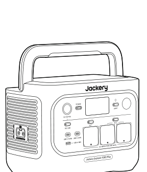

<strong>Jackery Explorer 1000 Plus</strong>

</li><li class="hb-inbox-card" data-item-number="2">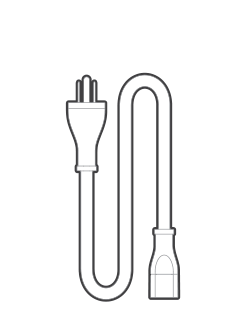

<strong>Cable de carga de CA</strong>

</li><li class="hb-inbox-card" data-item-number="3">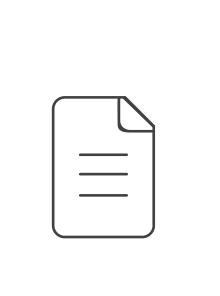

<strong>Manual del usuario</strong>

</li></ol>

<strong>CONSEJOS</strong>

El cable de carga para vehículo no está incluido, pero está disponible para su compra por separado en nuestro sitio web.
Para obtener asistencia, comunícate con el servicio al cliente de Jackery.

</figure>

# DESCRIPCIÓN GENERAL DEL PRODUCTO

## VISTA FRONTAL

## VISTA LATERAL DERECHA

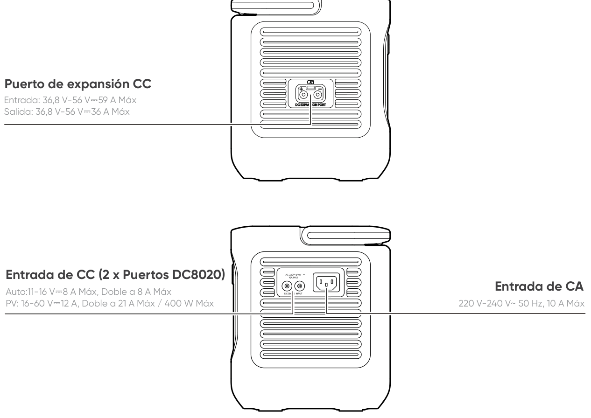

# PANTALLA LCD

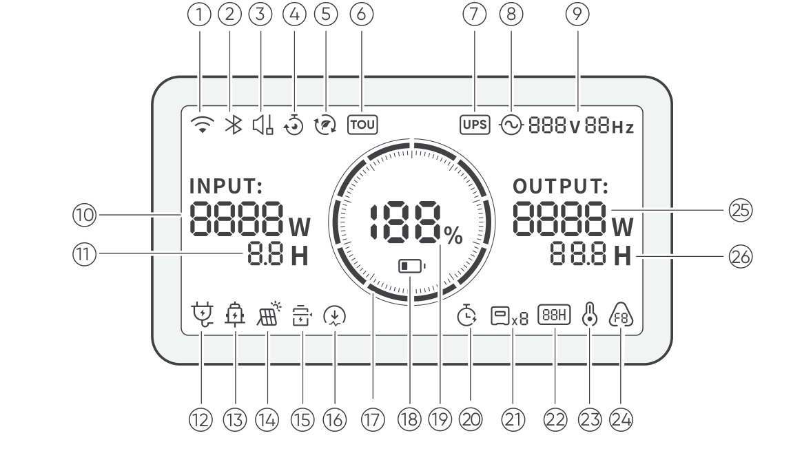

<table class="longtable lcd-text-only">
<colgroup>
<col style="width: 8%" />
<col style="width: 12%" />
<col style="width: 28%" />
<col style="width: 52%" />
</colgroup>
<tbody>
<tr>
<td>
1
</td>
<td></td>
<td>
Wi-Fi
</td>
<td><strong>Encendido:</strong> Wi-Fi conectado.
<strong>Parpadeo:</strong> listo para conectarse al Wi-Fi.
<strong>Apagado:</strong> Wi-Fi desconectado.</td>
</tr>
<tr>
<td>
2
</td>
<td></td>
<td>
Bluetooth
</td>
<td><strong>Encendido:</strong> Bluetooth conectado.
<strong>Parpadeo:</strong> listo para conectarse al Bluetooth.
<strong>Apagado:</strong> Bluetooth desconectado.</td>
</tr>
<tr>
<td>
3
</td>
<td></td>
<td>
Modo de Carga Silenciosa
</td>
<td><strong>Encendido:</strong> el ruido durante la carga se minimiza significativamente, mientras que la potencia de carga se reduce y la velocidad de carga disminuye.
<strong>Apagado:</strong> El modo de carga silenciosa está desactivado. Activar/desactivar esta función en la App Jackery. Cuando el dispositivo se apaga, se retiene la configuración.</td>
</tr>
<tr>
<td>
4
</td>
<td></td>
<td>
Plan de Carga
</td>
<td>Personaliza el tiempo de carga del Jackery Explorer 1000 Plus. Adecuado para situaciones con tarifas eléctricas variables, permite establecer planes de carga según las horas pico y valle, reduciendo así los costos de electricidad.
Por favor, configure esta función en la aplicación Jackery. Cuando el dispositivo se apaga, se retiene la configuración.</td>
</tr>
<tr>
<td>
5
</td>
<td></td>
<td>
Modo Autónomo
</td>
<td>Maximiza el uso de la energía solar y reduce la dependencia de la electricidad de la red al priorizar la energía solar
almacenada, reduciendo los costos eléctricos. La estación de energía debe estar conectada simultáneamente a los paneles solares y a la red, con la potencia de carga limitada por la potencia de derivación.
Por favor, active/desactive esta función en la aplicación. Cuando el dispositivo se apaga, se retiene la configuración.</td>
</tr>
<tr>
<td>
6
</td>
<td></td>
<td>
Modo TOU
</td>
<td>Activado: el modo TOU está habilitado (SOC de respaldo predetermina- do: 60 %). Durante las horas pico, el producto prioriza la descarga de la batería para reducir los costos de la electricidad en momentos de alta demanda, cuando la energía almacenada supera el SOC de respaldo. Durante las horas valle, el sistema carga la batería desde la red para lograr recortar los picos y llenar los valles.
Desactivado: el modo TOU está deshabilitado. El dispositivo no sigue la estrategia TOU (tarifa por periodo de uso) y opera según la lógica predeterminada de suministro de energía y carga.
Por favor, active/desactive esta función en la aplicación. Cuando el dispositivo se apaga, se retiene la configuración.</td>
</tr>
<tr>
<td>
7
</td>
<td></td>
<td>
UPS
</td>
<td><strong>Encendido:</strong> El producto está en modo bypass, en el cual el tiempo de cambio de la energía de la red a la batería interna es de 10 ms.
<strong>Apagado:</strong> El producto no está en modo bypass.</td>
</tr>
<tr>
<td>
8
</td>
<td></td>
<td>
Indicador de Energía de CA
</td>
<td>
La salida CA (onda sinusoidal pura) está activada.
</td>
</tr>
<tr>
<td>
9
</td>
<td></td>
<td>
Voltaje y frecuencia de salida
</td>
<td>
Muestra el voltaje y la frecuencia de salida cuando la salida de CA está encendida.
</td>
</tr>
<tr>
<td>
10
</td>
<td></td>
<td>
Potencia de Entrada
</td>
<td>
Muestra la potencia de entrada en vatios.
</td>
</tr>
<tr>
<td>
11
</td>
<td></td>
<td>
Tiempo de Carga Restante
</td>
<td>
Muestra el tiempo de carga restante.
</td>
</tr>
<tr>
<td>
12
</td>
<td></td>
<td>
Indicador de Carga desde Toma de Corriente CA
</td>
<td>
El producto se carga a través de la entrada CA utilizando energía de la red eléctrica.
</td>
</tr>
<tr>
<td>
13
</td>
<td></td>
<td>
Indicador de Carga desde Coche
</td>
<td>
El producto se carga a través de la entrada CC (DC8020) utilizando CC 12V (carga desde el coche).
</td>
</tr>
<tr>
<td>
14
</td>
<td></td>
<td>
Indicador de Carga Solar
</td>
<td>
El producto se carga a través de la entrada CC (DC8020) utilizando paneles solares.
</td>
</tr>
<tr>
<td>
15
</td>
<td></td>
<td>
Modo de Ahorro de Batería
</td>
<td><strong>Encendido:</strong> limita la capacidad máxima utilizable de la batería para prolongar su vida útil.
<strong>Apagado:</strong> el modo de ahorro de batería está desactivado. Activar/desactivar esta función en la App Jackery. Cuando el dispositivo se apaga, se retiene la configuración.
Esta función no está disponible cuando el producto está conectado a paquetes de baterías.
Cuando esta función está habilitada, el producto ocasionalmente realiza un ciclo completo de carga-descarga para calibrar el SOC.</td>
</tr>
<tr>
<td>
16
</td>
<td></td>
<td>
Límite de potencia de carga
</td>
<td><strong>Encendido:</strong> El límite de potencia de carga está activado en la aplicación Jackery.
<strong>Apagado:</strong> El límite de potencia de carga está desactivado en la aplicación Jackery. Cuando el dispositivo se apaga, se retiene la configuración.</td>
</tr>
<tr>
<td>
17
</td>
<td></td>
<td>
Indicador de Potencia de la Batería
</td>
<td>
Cuando el producto se está cargando, el círculo naranja alrededor del porcentaje de batería se ilumina secuencialmente. Cuando está cargando otros dispositivos, el círculo naranja permanece encendido.
</td>
</tr>
<tr>
<td>
18
</td>
<td></td>
<td>
Indicador de Batería Baja
</td>
<td><strong>Encendido:</strong> el nivel de la batería está por debajo del 20 %.
<strong>Parpadeo:</strong> el nivel de la batería está por debajo del 5 %.
<strong>Apagado:</strong> el nivel de la batería no está por debajo del 20 % o el producto se está cargando.</td>
</tr>
<tr>
<td>
19
</td>
<td></td>
<td>
Porcentaje de Batería Restante
</td>
<td>
Muestra el porcentaje de batería restante.
</td>
</tr>
<tr>
<td>
20
</td>
<td></td>
<td>
Temporizador de descarga
</td>
<td>Activado: se ha configurado un temporizador de descarga.
Desactivado: no se ha configurado un temporizador de descarga. Activar/desactivar esta función en la App Jackery.</td>
</tr>
<tr>
<td>
21
</td>
<td></td>
<td>
Baterías conectadas
</td>
<td>
Indica que el producto está conectado al número especificado de baterías adicionales 2000.
</td>
</tr>
<tr>
<td>
22
</td>
<td></td>
<td>
Modo de Ahorro de Energía
</td>
<td>Cuando las salidas CA o CC se encienden presionando los botones de encendido CA1/2 o CC/USB:
<strong>Encendido:</strong> Modo de ahorro de energía activado.
<strong>Apagado:</strong> Modo de ahorro de energía desactivado.</td>
</tr>
<tr>
<td>
23
</td>
<td></td>
<td>
Indicador de Alta Temperatura
</td>
<td>
Se activó la protección por alta temperatura. El producto puede dejar de funcionar hasta que su temperatura vuelva al rango normal de operación.
</td>
</tr>
<tr>
<td>
23
</td>
<td></td>
<td>
Indicador de Baja Temperatura
</td>
<td>
Se activó la protección por baja temperatura. El producto puede dejar de funcionar hasta que su temperatura vuelva al rango normal de operación.
</td>
</tr>
<tr>
<td>
24
</td>
<td></td>
<td>
Código de fallo
</td>
<td>
Se ha producido un error en el producto. Por favor, consulte la sección de solución de problemas para más detalles.
</td>
</tr>
<tr>
<td>
25
</td>
<td></td>
<td>
Potencia de Salida
</td>
<td>
Muestra la potencia de salida en vatios.
</td>
</tr>
<tr>
<td>
26
</td>
<td></td>
<td>
Tiempo de Descarga Restante
</td>
<td>
Muestra el tiempo de descarga restante.
</td>
</tr>
</tbody>
</table>

# OPERACIONES

## ENCENDIDO/APAGADO

## ENCENDER/APAGAR SALIDA CA

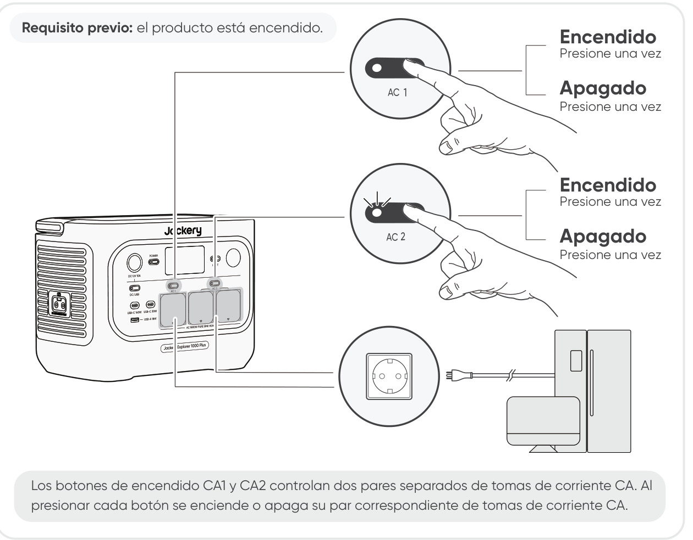

## ENCENDER/APAGAR SALIDA CC 12V/USB

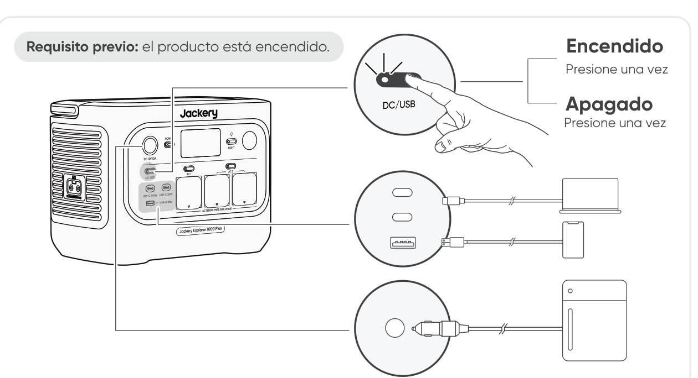

<table class="manual-callout-table" style="width:100%; border-collapse:collapse; margin:0 0 16px 0;"><tbody><tr><td class="manual-callout-label" style="width:16%; border:1px solid #000; padding:6px 8px; vertical-align:top;">
<strong>PRECAUCIÓN</strong>
</td><td class="manual-callout-body" style="border:1px solid #000; padding:6px 8px; vertical-align:top;"><ul class="simple">
<li>
El puerto USB‑C de 100 W es una salida de alta potencia de tipo Fuente de Alimentación 3 (PS3) según USB‑PD. Si el dispositivo del usuario o accesorio conectado no cumple con los requisitos de seguridad, puede existir riesgo de incendio. Antes de usar estos puertos, asegúrese de que el dispositivo o accesorio conectado tenga protección contra incendios.
</li>
<li>
Solo conecte el Jackery Explorer 1000 Plus a dispositivos o accesorios que cumplan con las cláusulas 6.3, 6.4 y 6.5 de IEC/EN/UL 62368-1 (u otros estándares equivalentes).
</li>
<li>
Para obtener la potencia máxima de salida, utilice el cable USB-C a USB-C de 5 A (20 V CC/5 A, 100W).
</li>
</ul>
</td></tr></tbody></table>

El producto puede cargar la batería de su vehículo utilizando el cable de carga de batería para vehículo Jackery de 12 V, que se vende por separado y está disponible en nuestro sitio web.

<table class="manual-callout-table" style="width:100%; border-collapse:collapse; margin:0 0 16px 0;"><tbody><tr><td class="manual-callout-label" style="width:16%; border:1px solid #000; padding:6px 8px; vertical-align:top;">
<strong>PRECAUCIÓN</strong>
</td><td class="manual-callout-body" style="border:1px solid #000; padding:6px 8px; vertical-align:top;"><ul class="simple">
<li>
El puerto CC de 12 V solo es compatible con baterías de vehículo de 12 V y no es adecuado para sistemas de 24 V.
</li>
<li>
No arranque el vehículo mientras el producto está cargando la batería del vehículo a través del puerto de salida CC de 12V, ya que esto podría dañar el producto.
</li>
<li>
Esta función está diseñada únicamente para uso de emergencia y no puede cargar una batería de vehículo descargada o dañada.
</li>
</ul>
</td></tr></tbody></table>

## MODO DE AHORRO DE ENERGÍA

Para evitar un consumo innecesario de batería por olvidar apagar la salida, el producto activa por defecto el Modo de Ahorro de Energía. Cuando la salida de CA o CC/USB está encendida, el icono del modo de ahorro de energía se mostrará en la pantalla LCD. En este modo, si no hay ningún dispositivo conectado o si el consumo del dispositivo conectado está por debajo de cierto umbral (25 W en salida de CA o 2 W en salida de CC/USB), la salida correspondiente se apagará automáticamente después del tiempo configurado. La configuración predeterminada es 12 horas. La duración del Modo de Ahorro de Energía puede configurarse en la aplicación Jackery en 1H, 2 H, 8 H, 12 H o 24 H. Si se establece en \"Never Off\", el Modo de Ahorro de Energía se desactivará.

Cuando alimente dispositivos de baja potencia (CA ≤ 25 W o CC/USB ≤ 2 W), desactive el modo de ahorro de energía para evitar que la salida se apague automáticamente durante el funcionamiento.

<table class="manual-callout-table" style="width:100%; border-collapse:collapse; margin:0 0 16px 0;"><tbody><tr><td class="manual-callout-label" style="width:16%; border:1px solid #000; padding:6px 8px; vertical-align:top;">
<strong>NOTA</strong>
</td><td class="manual-callout-body" style="border:1px solid #000; padding:6px 8px; vertical-align:top;">
El modo de ahorro de energía reanuda el estado anterior después de encender. Se requiere un cambio manual para modificar el modo.
</td></tr></tbody></table>

## ENCENDER/APAGAR LUZ LED

## Función de reanudación de Salida de CA y CC

La función de reanudación de salida de CA/CC está desactivada de forma predeterminada. Active esta función en la aplicación para que el dispositivo memorice el estado de salida de CA/CC y reanude automáticamente las salidas de CA y CC en las condiciones definidas.

<figure aria-label="Condiciones de reanudación automática / Condiciones sin reanudación automática" class="hb-auto-resume-composition"><table class="hb-auto-resume-table"><colgroup><col class="hb-auto-resume-col"/><col class="hb-auto-resume-col"/></colgroup>
<thead>
<tr><th class="head hb-auto-resume-left" scope="col">
Condiciones de reanudación automática
</th>
<th class="head hb-auto-resume-right" scope="col">
Condiciones sin reanudación automática
</th>
</tr>
</thead>
<tbody>
<tr><td class="hb-auto-resume-left">
Encendido/Reiniciar después de apagado o reinicio
</td>
<td class="hb-auto-resume-right">
Apagado manual de la salida (botón/App)
</td>
</tr>
<tr><td class="hb-auto-resume-left" rowspan="2">
SOC de la batería ≥ límite de descarga +10 % tras alcanzar el límite
</td>
<td class="hb-auto-resume-right">
Apagado de salida en modo de ahorro de energía
</td>
</tr>
<tr><td class="hb-auto-resume-right">
Apagado de salida activado por protección
</td>
</tr>
<tr><td class="hb-auto-resume-left">
Actualización OTA completada
</td>
<td class="hb-auto-resume-right">
Apagado de salida activado por temporizador de descarga
</td>
</tr>
</tbody>
</table></figure>

## PANTALLA LCD

<figure aria-label="Modo de pantalla LCD." class="hb-lcd-mode-composition" data-component-id="HB-TABLE-LCD-MODE">
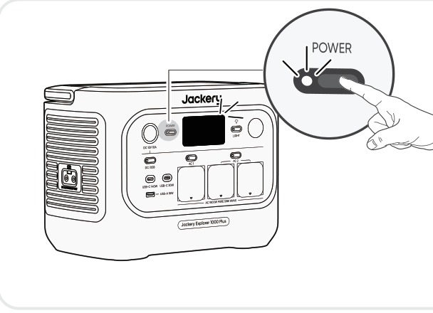

<table class="hb-lcd-mode-table"><colgroup><col class="hb-lcd-mode-col-state"/><col class="hb-lcd-mode-col-action"/><col class="hb-lcd-mode-col-copy"/></colgroup><tbody><tr><td class="hb-lcd-mode-state" rowspan="3">Encendido breve</td><td class="hb-lcd-mode-action">Encender</td><td class="hb-lcd-mode-copy">Presione el botón POWER principal o cuando el producto se esté cargando.</td></tr><tr><td class="hb-lcd-mode-action">Apagar</td><td class="hb-lcd-mode-copy">Presione el botón POWER principal.</td></tr><tr><td class="hb-lcd-mode-action">Apagado automático</td><td class="hb-lcd-mode-copy">La pantalla LCD se apaga automáticamente y entra en modo de suspensión después de 2 minutos de inactividad.</td></tr><tr><td class="hb-lcd-mode-state" rowspan="3">Estable en (durante el estado de carga o descarga)</td><td class="hb-lcd-mode-action">Encender</td><td class="hb-lcd-mode-copy">Presione dos veces el botón POWER principal cuando el producto esté encendido.</td></tr><tr><td class="hb-lcd-mode-action">Apagar</td><td class="hb-lcd-mode-copy">Presione el botón POWER principal.</td></tr><tr><td class="hb-lcd-mode-action">Apagado automático</td><td class="hb-lcd-mode-copy">La pantalla LCD se apaga automáticamente después de 2 horas de inactividad.</td></tr></tbody></table>
</figure>

También puede configurar el modo de visualización de la pantalla en la aplicación Jackery.

## COMBINACIONES DE TECLAS

<figure aria-label="Botones / Operación / Función" class="hb-key-combination-composition" tabindex="0"><table class="hb-key-combination-table"><colgroup><col class="hb-key-col-buttons"/><col class="hb-key-col-operation"/><col class="hb-key-col-function"/></colgroup>
<thead>
<tr><th class="head hb-key-buttons" scope="col">
Botones
</th>
<th class="head hb-key-operation" scope="col">
Operación
</th>
<th class="head hb-key-function" scope="col">
Función
</th>
</tr>
</thead>
<tbody>
<tr><td class="hb-key-buttons">
Botón POWER principal + Botón CA
</td>
<td class="hb-key-operation">
Mantenga pulsados ambos botones durante 3 segundos
</td>
<td class="hb-key-function">
Encender/apagar el modo de ahorro de energía
</td>
</tr>
<tr><td class="hb-key-buttons">
Botón POWER principal + botón CC/USB
</td>
<td class="hb-key-operation">
Mantenga pulsados ambos botones durante 3 segundos
</td>
<td class="hb-key-function">
Restablecer Wi-Fi y Bluetooth
</td>
</tr>
<tr><td class="hb-key-buttons">
Botón CC/USB + Botón CA
</td>
<td class="hb-key-operation">
Mantenga pulsados ambos botones durante 1 segundo
</td>
<td class="hb-key-function">
Encender/apagar Wi-Fi y Bluetooth
</td>
</tr>
<tr><td class="hb-key-buttons">
Botón POWER principal + botón de luz LED
</td>
<td class="hb-key-operation">
Mantenga pulsados ambos botones durante 1 segundo
</td>
<td class="hb-key-function">
Activar/desactivar el modo de carga de emergencia
</td>
</tr>
</tbody>
</table></figure>

# FUENTE DE ALIMENTACIÓN ININTERRUMPIDA (UPS)

Conecte el producto a una toma de corriente con el cable de carga de CA, luego presione el botón de energía CA y alimente sus electrodomésticos al mismo tiempo.

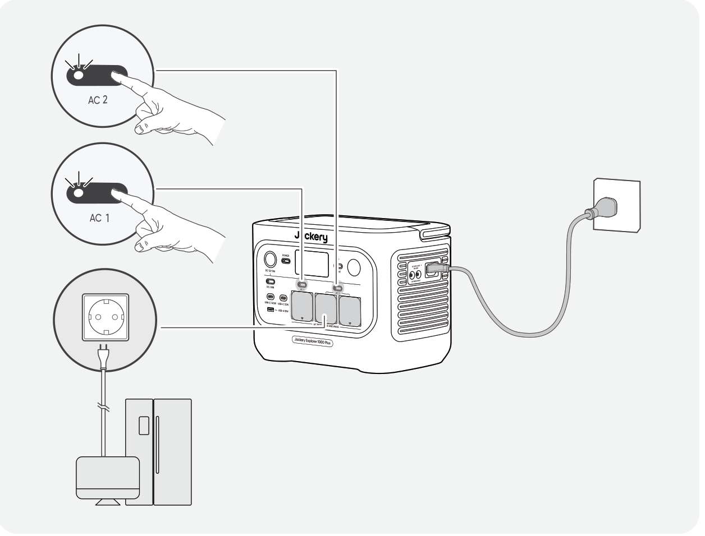

Un sistema de alimentación ininterrumpida (UPS) es un tipo de sistema de energía continua que proporciona energía eléctrica de respaldo automática a una carga cuando falla la energía de la red principal.

En caso de una pérdida repentina de energía de la red, Jackery Explorer 1000 Plus cambiará automáticamente a la energía almacenada en menos de 10 ms para mantener sus electrodomésticos en funcionamiento.

En modo UPS, la potencia máxima de salida de la unidad alcanza 10 A antes de los cortes de energía. Como la carga y descarga simultáneas están habilitadas en modo bypass,

la potencia de salida real es inferior a la potencia nominal en este modo, pero vuelve a la potencia nominal durante los cortes.

<table class="manual-callout-table" style="width:100%; border-collapse:collapse; margin:0 0 16px 0;"><tbody><tr><td class="manual-callout-label" style="width:16%; border:1px solid #000; padding:6px 8px; vertical-align:top;">
<strong>PRECAUCIÓN</strong>
</td><td class="manual-callout-body" style="border:1px solid #000; padding:6px 8px; vertical-align:top;"><ul class="simple">
<li>
Este producto no admite conmutación de 0 ms. No lo conecte a equipos que requieran una fuente de alimentación con conmutación de 0 ms, como servidores de datos o estaciones de trabajo.
</li>
<li>
Antes de usar, pruebe la compatibilidad con su dispositivo varias veces.
</li>
<li>
No conectes cargas que excedan la potencia máxima de salida del producto. De lo contrario, se activará la protección contra sobrecarga.
</li>
</ul>
</td></tr></tbody></table>

# CONECTAR AL/LOS PAQUETE(S) DE BATERÍAS SE (VENDE POR SEPARADO)

Este producto puede soportar hasta 5 paquetes de baterías para satisfacer la necesidad de una gran capacidad de energía. Para detalles sobre su uso, consulte el manual de usuario del Jackery Battery Pack 2000.

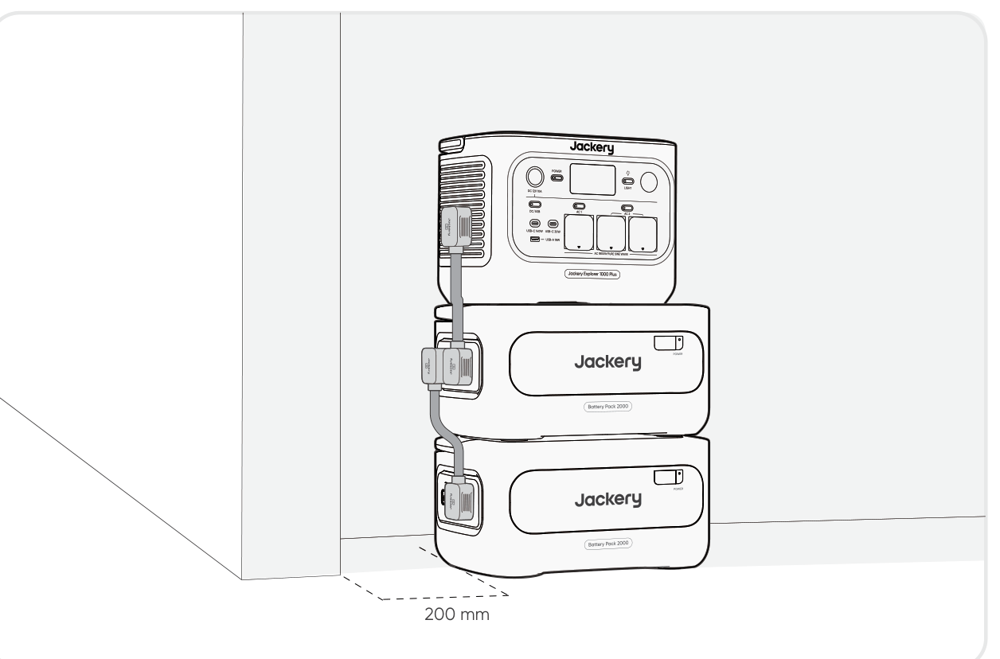

<table class="manual-callout-table" style="width:100%; border-collapse:collapse; margin:0 0 16px 0;"><tbody><tr><td class="manual-callout-label" style="width:16%; border:1px solid #000; padding:6px 8px; vertical-align:top;">
<strong>PRECAUCIÓN</strong>
</td><td class="manual-callout-body" style="border:1px solid #000; padding:6px 8px; vertical-align:top;"><ul class="simple">
<li>
Asegúrese de que todos los productos estén apagados antes de conectar el Jackery Battery Pack 2000 al paquete de Jackery Explorer 1000 Plus.
</li>
<li>
Para asegurar el funcionamiento adecuado del producto, asegúrese de que las rejillas de entrada y salida de aire en ambos lados estén despejadas. Deje al menos 0,66 pies (200 mm) de espacio entre las rejillas y cualquier objeto para permitir una disipación de calor adecuada.
</li>
<li>
Cuando el producto se utilice con baterías adicionales conectadas, el número máximo predeterminado de baterías adicionales apiladas es de 3, y el producto debe colocarse sobre una superficie plana, estable y con suficiente capacidad de carga.
</li>
<li>
Si es necesario apilar 4 o más baterías adicionales, el producto debe colocarse en una zona estable, apoyado contra una pared y protegida de impactos externos, y deben adoptarse las medidas necesarias de fijación antivuelco.
</li>
</ul>
</td></tr></tbody></table>

|                               |                        |                |
|-------------------------------|------------------------|----------------|
| **Jackery Battery Pack 2000** | **Cable de expansión** | **Documentos** |

# CARGANDO

**Energía renovable primero:** Abogamos por utilizar primero energía renovable. Este producto admite dos modos de carga al mismo tiempo: carga solar y carga de pared de CA.

Cuando la carga en la pared de CA y la carga solar están activadas al mismo tiempo, el producto dará prioridad a la carga solar y se utilizarán ambos métodos para cargar la batería a la máxima potencia permitida.

**Carga completamente el producto antes de usarlo por primera vez.**

<table class="manual-callout-table" style="width:100%; border-collapse:collapse; margin:0 0 16px 0;"><tbody><tr><td class="manual-callout-label" style="width:16%; border:1px solid #000; padding:6px 8px; vertical-align:top;">
<strong>NOTA</strong>
</td><td class="manual-callout-body" style="border:1px solid #000; padding:6px 8px; vertical-align:top;"><ul class="simple">
<li>
La temperatura de carga recomendada para el producto es de -10 °C a 45 °C, y la temperatura de descarga es de -10 °C a 45 °C.
</li>
<li>
Operar el producto fuera de este rango de temperatura puede limitar sus capacidades de carga y descarga, e incluso impedir la carga o descarga.
</li>
<li>
La potencia de carga y la capacidad de la batería del producto pueden variar debido a las fluctuaciones de temperatura.
</li>
</ul>
</td></tr></tbody></table>

## CARGA MEDIANTE UNA TOMA DE CORRIENTE DE PARED ALTERNA

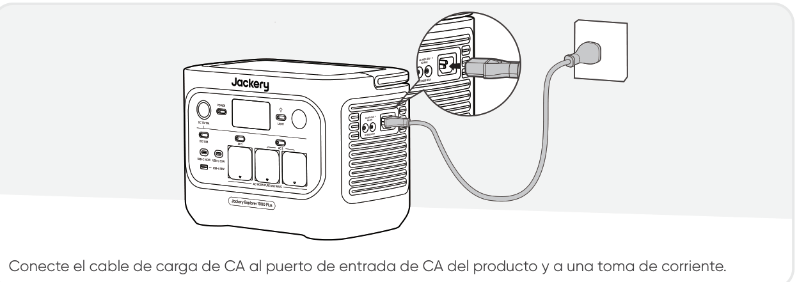

<table class="manual-callout-table" style="width:100%; border-collapse:collapse; margin:0 0 16px 0;"><tbody><tr><td class="manual-callout-label" style="width:16%; border:1px solid #000; padding:6px 8px; vertical-align:top;">
<strong>PRECAUCIÓN</strong>
</td><td class="manual-callout-body" style="border:1px solid #000; padding:6px 8px; vertical-align:top;">
Asegúrese de que el cable de carga de CA esté completamente y firmemente insertado en el puerto de entrada de CA. Una conexión incompleta puede causar corriente inestable, sobrecalentamiento, mal contacto o fallos en el funcionamiento del producto.
</td></tr></tbody></table>

**Modo de Carga de Emergencia**

Bajo este modo, puedes cargar rápidamente la estación de energía portátil utilizando el método de carga de CA. Esta función de carga de emergencia se puede activar o desactivar a través de la aplicación Jackery. Cuando está en modo de carga de emergencia, la luz circular que indica el estado de carga (SOC) parpadeará más rápido. \*Para maximizar la vida útil de la batería, es mejor cargar a la velocidad estándar. La carga de emergencia debe reservarse para situaciones que requieren un aumento rápido de energía y no se recomienda para un uso regular y prolongado.

## CARGA MEDIANTE PANELES SOLARES (SE VENDEN POR SEPARADO)

Jackery Explorer 1000 Plus cuenta con dos puertos de entrada DC8020 y es compatible con los paneles solares de Jackery.

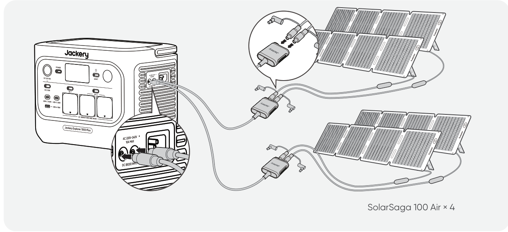

Si se necesita conectar dos paneles solares a un solo puerto de entrada DC8020 al mismo tiempo, consulte la figura siguiente para la carga mediante el conector de panel solar (se vende por separado y no se incluye de serie).

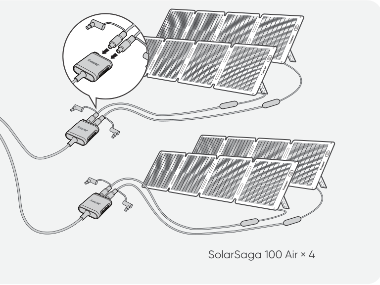

<table class="manual-callout-table" style="width:100%; border-collapse:collapse; margin:0 0 16px 0;"><tbody><tr><td class="manual-callout-label" style="width:16%; border:1px solid #000; padding:6px 8px; vertical-align:top;">
<strong>PRECAUCIÓN</strong>
</td><td class="manual-callout-body" style="border:1px solid #000; padding:6px 8px; vertical-align:top;">
Un puerto de entrada DC8020 puede conectarse como máximo a dos paneles solares.
</td></tr></tbody></table>

<table class="manual-callout-table" style="width:100%; border-collapse:collapse; margin:0 0 16px 0;"><tbody><tr><td class="manual-callout-label" style="width:16%; border:1px solid #000; padding:6px 8px; vertical-align:top;">
<strong>PRECAUCIÓN</strong>
</td><td class="manual-callout-body" style="border:1px solid #000; padding:6px 8px; vertical-align:top;">
Asegúrese de que el voltaje de entrada para ambos puertos de entrada de CC sea el mismo. De lo contrario, podría dañar el producto. Por ejemplo:

<ul class="simple">
<li>
Utilizar paneles solares Jackery del mismo modelo y la misma cantidad de paneles al conectar paneles solares a ambos puertos de entrada DC8020.
</li>
<li>
No cargue el producto utilizando simultáneamente un cargador de vehículo y un panel solar. Esto puede fundir el fusible del vehículo o provocar un fallo de carga.
</li>
</ul>
</td></tr></tbody></table>

Se recomienda usar el panel solar Jackery para cargar el Jackery Explorer 1000 Plus. Asegúrese de que el voltaje en circuito abierto (Voc) del panel solar se sitúe dentro del rango de entrada de CC de Jackery Explorer 1000 Plus (16V-60V). Jackery no se hace responsable de pérdidas causadas por el uso de paneles solares de otras marcas.

## CARGA CON UN CARGADOR PARA VEHÍCULO (SE VENDE POR SEPARADO)

Este producto puede cargarse usando un cargador para vehículo de 12 V. Asegúrese de que el cargador de vehículo y el encendedor de vehículo ofrezcan una buena conexión.

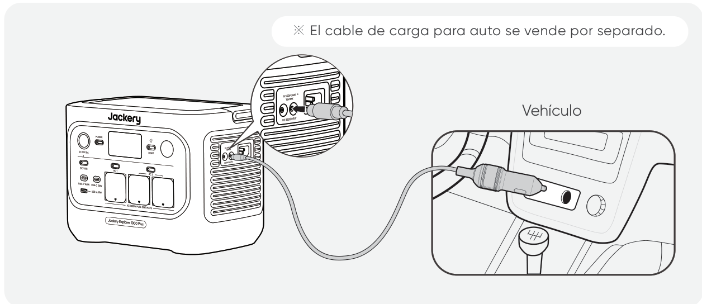

<table class="manual-callout-table" style="width:100%; border-collapse:collapse; margin:0 0 16px 0;"><tbody><tr><td class="manual-callout-label" style="width:16%; border:1px solid #000; padding:6px 8px; vertical-align:top;">
<strong>PRECAUCIÓN</strong>
</td><td class="manual-callout-body" style="border:1px solid #000; padding:6px 8px; vertical-align:top;"><ul class="simple">
<li>
Por favor, encienda el vehículo antes de cargar su estación de energía.
</li>
<li>
Si el vehículo circula por caminos accidentados, está prohibido usar el cargador de vehículo para evitar un funcionamiento no conforme. La empresa no se responsabilizará por ninguna pérdida causada por un funcionamiento no conforme.
</li>
<li>
La carga en vehículo solo es aplicable a vehículos con 12 V CC, no a 24 V CC. Por favor, no cargue este producto en vehículos de 24 V para evitar lesiones personales y daños materiales.
</li>
</ul>
</td></tr></tbody></table>

# ALMACENAMIENTO

Almacene el producto en un lugar seco y limpio con ventilación adecuada. Temperatura y humedad de almacenamiento:

- 1 month: -20 °C a 45 °C (0-60 % HR)

- 3 months: 0 °C a 45 °C (0-60 % HR)

- 12 months: 0 °C a 25 °C (0-60 % HR)

Si este producto se almacena durante un período prolongado (de 3 a 6 meses) con la batería descargada, podría volverse imposible recargarlo. Para evitar esto y mantener la salud de la batería, se recomienda revisar y recargar el producto cada tres meses, y realizar un ciclo completo de carga y descarga al menos una vez cada 6 a 12 meses.

# RESOLUCIÓN DE PROBLEMAS

Si aparece alguno de los siguientes códigos de fallo, siga las acciones correctivas listadas para resolver el problema. Si el fallo persiste, por favor contacte con atención al cliente de Jackery.

<figure aria-label="Código de fallo / Medidas correctivas" class="hb-troubleshooting-composition" data-component-id="HB-TABLE-TROUBLESHOOTING" tabindex="0"><table class="hb-troubleshooting-table"><colgroup><col class="hb-troubleshooting-col-code"/><col class="hb-troubleshooting-col-measures"/></colgroup><thead><tr><th class="hb-troubleshooting-code" scope="col">
Código de fallo
</th><th class="hb-troubleshooting-measures" scope="col">
Medidas correctivas
</th></tr></thead><tbody><tr><td class="hb-troubleshooting-code">
F0
</td><td class="hb-troubleshooting-measures">
Reiniciar el producto.
</td></tr><tr><td class="hb-troubleshooting-code">
F1
</td><td class="hb-troubleshooting-measures">
Reiniciar el producto.
</td></tr><tr><td class="hb-troubleshooting-code">
F2
</td><td class="hb-troubleshooting-measures">
Reiniciar el producto.
</td></tr><tr><td class="hb-troubleshooting-code">
F3
</td><td class="hb-troubleshooting-measures">
Reiniciar el producto.
</td></tr><tr><td class="hb-troubleshooting-code">
F4
</td><td class="hb-troubleshooting-measures">
Conecte el producto a cargas para descargar su batería hasta que la falla desaparezca.
</td></tr><tr><td class="hb-troubleshooting-code">
F5
</td><td class="hb-troubleshooting-measures">
Cargue el producto mediante paneles solares o toma de corriente CA hasta que la falla desaparezca.
</td></tr><tr><td class="hb-troubleshooting-code">
F6
</td><td class="hb-troubleshooting-measures">

1. Espere a que la red eléctrica se normalice antes de cargar el producto a través de una toma de corriente CA.

2. Verifique si las rejillas de entrada y salida de aire están obstruidas; asegure un espacio libre de 20 cm a ambos lados del producto.

3. Coloque el producto en un lugar que no esté expuesto a la luz solar directa o a altas temperaturas ambientales.

4. Desconecte todas las cargas del producto. Mantenga el producto inactivo y espere hasta que la falla desaparezca.

5. Reiniciar el producto.

</td></tr><tr><td class="hb-troubleshooting-code">
F7
</td><td class="hb-troubleshooting-measures">

1. Retire todas las entradas de CC del producto.

2. Si carga el producto mediante un panel solar, verifique el voltaje en circuito abierto (Voc) del panel solar conectado. El producto permite un voltaje máximo de entrada de CC de 60 V. 3. Reinicie el producto y déjelo en reposo. Espere hasta que la falla desaparezca.

</td></tr><tr><td class="hb-troubleshooting-code">
F8
</td><td class="hb-troubleshooting-measures">
Contacte con atención al cliente de Jackery.
</td></tr><tr><td class="hb-troubleshooting-code">
F9
</td><td class="hb-troubleshooting-measures">
Retire la carga conectada a los puertos CC/USB del producto. Espere hasta que la falla desaparezca.
</td></tr><tr><td class="hb-troubleshooting-code">
FC
</td><td class="hb-troubleshooting-measures">

1. Reinicie los paquetes de baterías y el Jackery Explorer 1000 Plus respectivamente.

2. Si la falla persiste, desconecte el paquete de baterías del Jackery Explorer 1000 Plus y reconéctelos.

</td></tr><tr><td class="hb-troubleshooting-code">
FE
</td><td class="hb-troubleshooting-measures">
Contacte con atención al cliente de Jackery.
</td></tr></tbody></table></figure>

# ESPECIFICACIONES

## INFORMACIÓN GENERAL

<figure aria-label="INFORMACIÓN GENERAL" class="hb-spec-table-composition"><table class="hb-spec-table manual-table manual-spec-table"><colgroup><col class="hb-spec-col-label"/><col class="hb-spec-col-value"/></colgroup>
<tbody>
<tr>
<th class="hb-spec-label manual-spec-label" scope="row">Product Name</th>
<td class="hb-spec-value manual-spec-value">Jackery Explorer 1000 Plus</td>
</tr>
<tr>
<th class="hb-spec-label manual-spec-label" scope="row">Model No.</th>
<td class="hb-spec-value manual-spec-value">JE-1000H</td>
</tr>
<tr>
<th class="hb-spec-label manual-spec-label" scope="row">Capacidad</th>
<td class="hb-spec-value manual-spec-value">1024 Wh (20 Ah/51,2 V DC</td>
</tr>
<tr>
<th class="hb-spec-label manual-spec-label" scope="row">Cell Chemistry</th>
<td class="hb-spec-value manual-spec-value">LiFePO₄</td>
</tr>
<tr>
<th class="hb-spec-label manual-spec-label" scope="row">Peso</th>
<td class="hb-spec-value manual-spec-value">Aproximadamente 10,8 kg</td>
</tr>
<tr>
<th class="hb-spec-label manual-spec-label" scope="row">Dimensiones</th>
<td class="hb-spec-value manual-spec-value">313,5 × 201 × 233,5 mm</td>
</tr>
<tr>
<th class="hb-spec-label manual-spec-label" scope="row">Ciclo de vida</th>
<td class="hb-spec-value manual-spec-value">6000 ciclos de carga hasta 70 %</td>
</tr>
</tbody>
</table></figure>

## PUERTOS DE ENTRADA

<figure aria-label="PUERTOS DE ENTRADA" class="hb-spec-table-composition"><table class="hb-spec-table manual-table manual-spec-table"><colgroup><col class="hb-spec-col-label"/><col class="hb-spec-col-value"/></colgroup>
<tbody>
<tr>
<th class="hb-spec-label manual-spec-label" scope="row">1 × Entrada CA</th>
<td class="hb-spec-value manual-spec-value">Charge Mode: 220 V-240 V~50 Hz, 10 A Máx Bypass Mode①: 220 V-240 V~50 Hz, 7,83 A</td>
</tr>
<tr>
<th class="hb-spec-label manual-spec-label" scope="row">2 × Puertos DC8020</th>
<td class="hb-spec-value manual-spec-value">11 V-16 V 8 A Máx, Doble a 8 A Máx 16 V-60 V 12 A, Doble a 21 A Máx/400 W Máx</td>
</tr>
<tr>
<th class="hb-spec-label manual-spec-label" scope="row">1 × Puerto de expansión CC</th>
<td class="hb-spec-value manual-spec-value">36,8 V-56 V 59 A Máx</td>
</tr>
</tbody>
</table></figure>

## PUERTOS DE SALIDA

<figure aria-label="PUERTOS DE SALIDA" class="hb-spec-table-composition"><table class="hb-spec-table manual-table manual-spec-table"><colgroup><col class="hb-spec-col-label"/><col class="hb-spec-col-value"/></colgroup>
<tbody>
<tr>
<th class="hb-spec-label manual-spec-label" scope="row">3 × Salidas CA</th>
<td class="hb-spec-value manual-spec-value">230 V~50 Hz, 7,83 A Máx, 1800 W nomi</td>
</tr>
<tr>
<th class="hb-spec-label manual-spec-label" scope="row">CA Salida total 2②</th>
<td class="hb-spec-value manual-spec-value">1800 W nominales, 3600 W pico</td>
</tr>
<tr>
<th class="hb-spec-label manual-spec-label" scope="row">Salida de CA en modo bypass①</th>
<td class="hb-spec-value manual-spec-value">220 V-240 V~50 Hz, 7,83 A</td>
</tr>
<tr>
<th class="hb-spec-label manual-spec-label" scope="row">2 × Salidas USB-C</th>
<td class="hb-spec-value manual-spec-value">USB-C 30W: 30 W Máx, 5 V 3 A, 9 V 3 A, 12 V 2,5 A, 15 V 2 A, 20 V 1,5 A USB-C 140W: 140 W Máx, 5 V 3 A, 9 V 3 A, 12 V 3 A, 15 V 3 A, 20 V 5 A, 28 V 5 A</td>
</tr>
<tr>
<th class="hb-spec-label manual-spec-label" scope="row">1 × Salida USB-A</th>
<td class="hb-spec-value manual-spec-value">18W Máx, 5-6 V 3 A, 6-9 V 2 A, 9-12 V 1,5 A</td>
</tr>
<tr>
<th class="hb-spec-label manual-spec-label" scope="row">1 × Puerto DC 12V</th>
<td class="hb-spec-value manual-spec-value">12 V 10 A Máx</td>
</tr>
<tr>
<th class="hb-spec-label manual-spec-label" scope="row">1× Puerto de expansión CC</th>
<td class="hb-spec-value manual-spec-value">36,8 V-56 V 36 A Máx</td>
</tr>
</tbody>
</table></figure>

## TEMPERATURA DE FUNCIONAMIENTO

<figure aria-label="TEMPERATURA DE FUNCIONAMIENTO" class="hb-spec-table-composition"><table class="hb-spec-table manual-table manual-spec-table"><colgroup><col class="hb-spec-col-label"/><col class="hb-spec-col-value"/></colgroup>
<tbody>
<tr>
<th class="hb-spec-label manual-spec-label" scope="row">Temperatura de carga</th>
<td class="hb-spec-value manual-spec-value">-10 °C a 45 °C</td>
</tr>
<tr>
<th class="hb-spec-label manual-spec-label" scope="row">Temperatura de descarga</th>
<td class="hb-spec-value manual-spec-value">-10 °C a 45 °C</td>
</tr>
</tbody>
</table></figure>

※ USB Type-C® y USB-C® son marcas registradas de USB Implementers Forum.

① El producto puede cargar la batería desde una toma de corriente CA mientras suministra energía a través de los puertos de salida CA.

② Indica que dos o más puertos de salida CA trabajan en conjunto.

# GARANTÍA

<figure aria-label="GARANTÍA" class="hb-warranty-intro-composition" data-component-id="HB-WARRANTY-LEAD">

<strong>Solo ofrecemos nuestra garantía a clientes que compren en el sitio web oficial de Jackery, plataformas de terceros con la marca Jackery o distribuidores autorizados locales.</strong>

*El período de garantía y los detalles pueden variar según las leyes, regulaciones y distribuidores autorizados locales.

</figure>

## Garantía limitada

<figure aria-label="Garantía limitada" class="hb-warranty-card" data-component-id="HB-WARRANTY-SECTION" data-warranty-card-index="1">
Jackery garantiza al consumidor original que el producto Jackery estará libre de defectos relativos al acabado y a los materiales en condiciones normales de uso por parte del consumidor durante el período de garantía aplicable identificado en la sección "Período de garantía" que figura a continuación, sujeto a las exclusiones que se establecen a continuación.

Esta declaración de garantía establece la obligación de garantía total y exclusiva de Jackery. No asumiremos ni autorizaremos que ninguna persona asuma por nosotros ninguna otra responsabilidad en relación con la venta de nuestros productos.
</figure>

## Período de garantía

<figure aria-label="Período de garantía" class="hb-warranty-period-card" data-component-id="HB-WARRANTY-YEARS">

3
<strong class="hb-warranty-years-unit">AÑOS</strong><strong class="hb-warranty-period-label">Garantía estándar</strong>

El período de garantía estándar de Jackery Explorer 1000 Plus es de 36 meses. En cada caso, el período de garantía se mide a partir de la fecha de compra por parte del comprador consumidor original. Para establecer la fecha de inicio del período de garantía, se necesita el recibo de venta de la primera compra del consumidor u otra prueba documental razonable.

2
<strong class="hb-warranty-years-unit">AÑOS</strong><strong class="hb-warranty-period-label">Garantía extendida</strong>

Para activar la ampliación de garantía, debe registrar su producto en línea o ponerse en contacto con nuestro equipo de atención al cliente en <a class="reference external" href="mailto:hello.eu@jackery.com">hello.eu@jackery.com</a> para ampliar el período de garantía estándar.

</figure>

## Cambio

<figure aria-label="Cambio" class="hb-warranty-card" data-component-id="HB-WARRANTY-SECTION" data-warranty-card-index="3">
Jackery sustituirá (a cargo de Jackery) cualquier producto Jackery que no funcione, durante el período de garantía aplicable, debido a defectos de acabado o de material. Un producto de sustitución asume la garantía restante del producto original.
</figure>

## Limitado al comprador consumidor original

<figure aria-label="Limitado al comprador consumidor original" class="hb-warranty-card" data-component-id="HB-WARRANTY-SECTION" data-warranty-card-index="4">
La garantía del producto de Jackery se limita al consumidor original y no es transferible a ningún propietario posterior.
</figure>

## Exclusiones

<figure aria-label="Exclusiones" class="hb-warranty-card" data-component-id="HB-WARRANTY-SECTION" data-warranty-card-index="5">
La garantía de Jackery no se aplica a:
<ul class="simple">
<li>
Cualquier producto que haya sido mal utilizado, abusado, modificado, dañado por accidente, o usado para cualquier cosa distinta del uso normal del consumidor según lo autorizado en la documentación actual del producto de Jackery.
</li>
<li>
Intento de reparación por cualquier persona que no sea un centro autorizado.
</li>
<li>
Cualquier producto adquirido a través de una casa de subastas en línea.
</li>
<li>
La garantía de Jackery no se aplica a la célula de la batería a menos que usted la cargue completamente en los siete días siguientes a la compra del producto y, a partir de entonces, al menos una vez cada 6 meses.
</li>
</ul></figure>

## Derechos de interpretación

<figure aria-label="Derechos de interpretación" class="hb-warranty-card" data-component-id="HB-WARRANTY-SECTION" data-warranty-card-index="6">
Jackery se reserva el derecho de interpretación final de la política de postventa descrita anteriormente.
</figure>

# CONFIGURACIÓN DE LA APLICACIÓN

## 1. Descargar la aplicación e iniciar sesión

## 2. Añadir un dispositivo

2.1 Haga clic en el botón **+** para añadir el dispositivo.

2.2 Presione una vez el botón de encendido principal del dispositivo para encenderlo. Los iconos del wifi y del Bluetooth del dispositivo parpadearán para indicar que el dispositivo ha entrado en el modo de configuración de red. A continuación, pulse el botón \"icono parpadeante\" y permita que la aplicación se conecte a los dispositivos cercanos y abra los permisos de Bluetooth.

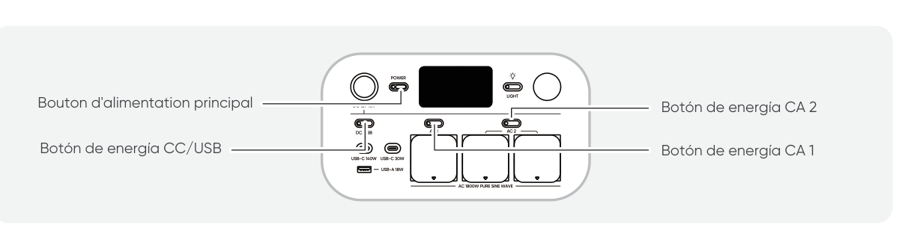

2.3 Tras hacer clic en el icono del dispositivo buscado, la aplicación conecta automáticamente el dispositivo a través de Bluetooth.

<table class="manual-callout-table" style="width:100%; border-collapse:collapse; margin:0 0 16px 0;"><tbody><tr><td class="manual-callout-label" style="width:16%; border:1px solid #000; padding:6px 8px; vertical-align:top;">
<strong>NOTA</strong>
</td><td class="manual-callout-body" style="border:1px solid #000; padding:6px 8px; vertical-align:top;">
Si durante el proceso de vinculación se indica que "el dispositivo ha sido vinculado", se pueden utilizar las dos formas siguientes para la conexión:

<ul class="simple">
<li>
El propietario del dispositivo lo compartirá con otros usuarios a través de la App.
</li>
<li>
Mantenga pulsados el botón de encendido principal y botón de energía CC/USB durante 3 segundos para reiniciar el Wi‑Fi y el Bluetooth del dispositivo y, a continuación, vuelva a vincularlo.
</li>
</ul>
</td></tr></tbody></table>

2.4 Una vez que el dispositivo se haya conectado correctamente, introduzca el nombre y la contraseña de la red Wi-Fi. Una vez introducidos, el dispositivo se conectará automáticamente a la red Wi-Fi.

<table class="manual-callout-table" style="width:100%; border-collapse:collapse; margin:0 0 16px 0;"><tbody><tr><td class="manual-callout-label" style="width:16%; border:1px solid #000; padding:6px 8px; vertical-align:top;">
<strong>NOTA</strong>
</td><td class="manual-callout-body" style="border:1px solid #000; padding:6px 8px; vertical-align:top;">
Selecciona una red Wi-Fi en la banda de 2,4 GHz. El dispositivo no admite una red Wi-Fi en la banda de 5 GHz.
</td></tr></tbody></table>

Después de agregar exitosamente el dispositivo en la App, el icono del Wi-Fi en el dispositivo permanecerá siempre encendido.

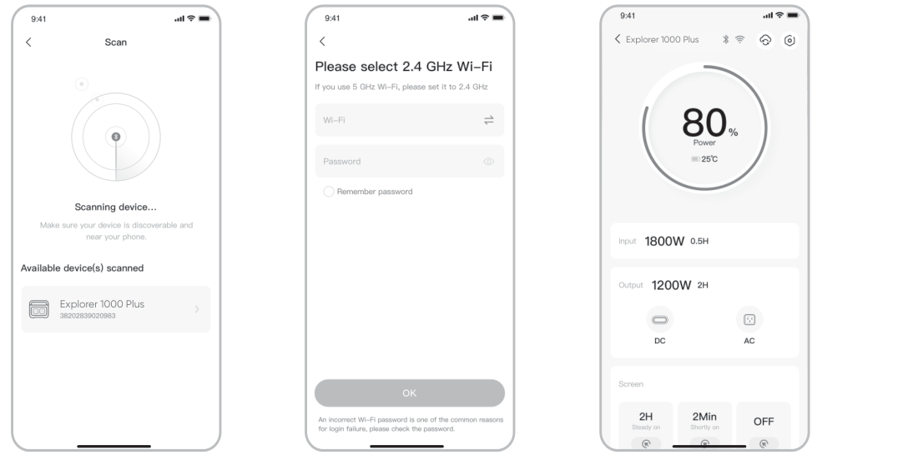

Las capturas de pantalla anteriores sirven solo de referencia.

<table class="manual-callout-table" style="width:100%; border-collapse:collapse; margin:0 0 16px 0;"><tbody><tr><td class="manual-callout-label" style="width:16%; border:1px solid #000; padding:6px 8px; vertical-align:top;">
<strong>PRECAUCIÓN</strong>
</td><td class="manual-callout-body" style="border:1px solid #000; padding:6px 8px; vertical-align:top;">
La aplicación Jackery solo puede conectarse a una estación de energía a la vez mediante Bluetooth. Regresar a la lista de dispositivos desconecta automáticamente Bluetooth. Toque la estación de energía en la lista nuevamente para reconectarse automáticamente.
</td></tr></tbody></table>

## 3. Desvincular el dispositivo

Haga clic en el icono **Configuración**, en la esquina superior derecha de la interfaz principal del dispositivo, para acceder a la página de configuración. A continuación, haga clic en el botón **Desvincular**, situado en la parte inferior de la página, para desvincular el dispositivo.

## 4. Notas

### 4.1 Para activar Wi-Fi y Bluetooth

- El wifi y el Bluetooth se encienden automáticamente al encender el dispositivo y se iluminan los iconos de wifi y Bluetooth de la pantalla.

- Pulse el botón de energía CC/USB y botón de energía CA 1/2 al mismo tiempo hasta que se enciendan los iconos de wifi y Bluetooth en la pantalla.

### 4.2 Para desactivar Wi-Fi y Bluetooth

Mantenga pulsados botón de energía CC/USB y botón de energía CA 1/2 al mismo tiempo hasta que se apaguen los iconos de wifi y Bluetooth en la pantalla.

### 4.3 Para restablecer Wi-Fi y Bluetooth

Pulsa el botón de encendido principal y botón de energía CC/USB al mismo tiempo durante 3 segundos para restablecer los ajustes de fábrica de Wi-Fi y Bluetooth. Se desvinculará la cuenta de la aplicación conectada.
