# INFORMAZIONI IMPORTANTI SULLA SICUREZZA

<table class="manual-callout-table" style="width:100%; border-collapse:collapse; margin:0 0 16px 0;"><tbody><tr><td class="manual-callout-label" style="width:16%; border:1px solid #000; padding:6px 8px; vertical-align:top;">
<strong>AVVERTENZA</strong>
</td><td class="manual-callout-body" style="border:1px solid #000; padding:6px 8px; vertical-align:top;">
ISTRUZIONI RELATIVE AI RISCHI DI INCENDIO, SCOSSA ELETTRICA O LESIONI ALLE PERSONE
</td></tr></tbody></table>

Seguire sempre queste precauzioni di base durante l\'utilizzo di questo prodotto.

- Leggere tutte le istruzioni prima di utilizzare il prodotto.
- Non consentire ai bambini di giocare con il prodotto. È necessaria una stretta supervisione quando il prodotto viene utilizzato vicino a bambini.
- Il rischio di scossa elettrica può verificarsi se si utilizzano accessori non raccomandati o non venduti da produttori professionali.
- Quando il prodotto non è in uso, scollegare la spina di alimentazione dalla presa del prodotto.
- Non smontare il prodotto, poiché ciò può comportare rischi imprevedibili come incendi, esplosioni o scosse elettriche.
- Non utilizzare il prodotto con cavi di alimentazione, spine o cavi di uscita danneggiati, poiché ciò può causare scosse elettriche.
- Per garantire una corretta circolazione dell\'aria, non coprire le prese d\'aria del prodotto. L\'area in cui si utilizza il prodotto deve essere ben ventilata, fresca e asciutta per evitare il surriscaldamento.
  - La ricarica in ambienti umidi o poco ventilati può comportare rischi per la sicurezza.
  - L\'acqua può causare cortocircuiti o danni al caricatore, con conseguenti rischi per la sicurezza.
- Non esporre il prodotto al fuoco, ad alte temperature, alla luce solare diretta o ad ambienti molto caldi come l\'interno di un veicolo parcheggiato. Tali condizioni possono causare incendi o esplosioni.

## ISTRUZIONI PER LA MANUTENZIONE DA PARTE DELL\'UTENTE

Durante il ciclo di vita dei prodotti per l\'accumulo di energia, è previsto un certo grado di degrado della capacità e dell\'energia. Con l\'aumentare dei cicli di carica e scarica e il prolungarsi del tempo di immagazzinamento, tale degrado tenderà a intensificarsi gradualmente. Si tratta di un fenomeno normale, coerente con il naturale invecchiamento delle celle della batteria.

# SIGNIFICATO DEI SIMBOLI

<figure aria-label="Simbolo / Significato" class="hb-symbol-signal-composition" data-component-id="HB-TABLE-SYMBOL-SIGNAL"><table class="hb-symbol-signal-table"><colgroup><col class="hb-symbol-signal-col-label"/><col class="hb-symbol-signal-col-meaning"/></colgroup><thead><tr><th class="hb-symbol-signal-label-heading" scope="col">
Simbolo
</th><th class="hb-symbol-signal-meaning-heading" scope="col">
Significato
</th></tr></thead><tbody><tr><td class="hb-symbol-signal-label-cell">⚠AVVERTENZA</td><td class="hb-symbol-signal-meaning-cell">
Pratiche pericolose che possono causare gravi lesioni, morte e/o danni materiali.
</td></tr><tr><td class="hb-symbol-signal-label-cell">⚠ATTENZIONE</td><td class="hb-symbol-signal-meaning-cell">
Pratiche pericolose che possono causare lesioni personali e/o danni materiali.
</td></tr><tr><td class="hb-symbol-signal-label-cell">⚠NOTA</td><td class="hb-symbol-signal-meaning-cell">
Pratiche pericolose che possono causare danni all'apparecchiatura, perdita di dati, deterioramento delle prestazioni o risultati imprevisti.
</td></tr><tr><td class="hb-symbol-signal-label-cell">⚠SUGGERIMENTO</td><td class="hb-symbol-signal-meaning-cell">
Integra le informazioni importanti o i consigli operativi presenti nel testo.
</td></tr></tbody></table></figure>

<figure aria-label="Simbolo / Significato" class="hb-symbol-pair-composition" data-component-id="HB-TABLE-SYMBOL-ICON">

<table class="hb-symbol-panel-table"><colgroup><col class="hb-symbol-col-icon"/><col class="hb-symbol-col-meaning"/></colgroup><thead><tr><th class="hb-symbol-icon-heading" scope="col">
<strong>Simbolo</strong>
</th><th class="hb-symbol-meaning-heading" scope="col">
<strong>Significato</strong>
</th></tr></thead><tbody><tr><td class="hb-symbol-icon"></td><td class="hb-symbol-meaning">
Simboli di avvertenza e cautela. Da leggere assolutamente per avvisare le persone di potenziali pericoli o rischi.
</td></tr><tr><td class="hb-symbol-icon"></td><td class="hb-symbol-meaning">
Prima dell’utilizzo, leggere il manuale d’istruzioni.
</td></tr><tr><td class="hb-symbol-icon"></td><td class="hb-symbol-meaning">
Non smontare il prodotto.
</td></tr><tr><td class="hb-symbol-icon"></td><td class="hb-symbol-meaning">
Tenere il prodotto lontano da fiamme.
</td></tr></tbody></table>

<table class="hb-symbol-panel-table"><colgroup><col class="hb-symbol-col-icon"/><col class="hb-symbol-col-meaning"/></colgroup><thead><tr><th class="hb-symbol-icon-heading" scope="col">
<strong>Simbolo</strong>
</th><th class="hb-symbol-meaning-heading" scope="col">
<strong>Significato</strong>
</th></tr></thead><tbody><tr><td class="hb-symbol-icon"></td><td class="hb-symbol-meaning">
Tenere lontano dalla portata dei bambini.
</td></tr><tr><td class="hb-symbol-icon"></td><td class="hb-symbol-meaning">
Questo simbolo indica che all’interno del prodotto è presente una batteria agli ioni di litio (Li-ion), la quale va smaltita o riciclata adeguatamente.
</td></tr><tr><td class="hb-symbol-icon"></td><td class="hb-symbol-meaning">
Questo simbolo indica che il prodotto non va smaltito come rifiuto domestico e deve essere consegnato per il riciclaggio a un centro di raccolta designato. Smaltire adeguatamente e riciclare aiuta a proteggere l’ambiente. Per maggiori informazioni riguardo lo smaltimento e il riciclaggio di questo prodotto, contattare la propria comunità locale, i servizi di smaltimento o il proprio fornitore.
</td></tr></tbody></table>

</figure>

# CONTENUTO DELLA CONFEZIONE

<figure aria-label="CONTENUTO DELLA CONFEZIONE" class="hb-inbox-composition" data-card-count="3" data-component-id="HB-SPECIAL-INBOX" data-inbox-variant="three-card-responsive"><ol class="hb-inbox-grid"><li class="hb-inbox-card" data-item-number="1">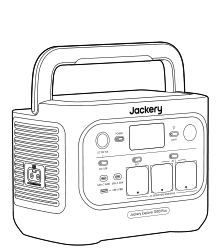

<strong>Jackery Explorer 1000 Plus</strong>

</li><li class="hb-inbox-card" data-item-number="2">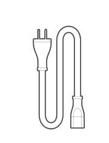

<strong>Cavo di ricarica CA</strong>

</li><li class="hb-inbox-card" data-item-number="3">

Manuale utente

</li></ol>

<strong>SUGGERIMENTO</strong>

Il cavo di ricarica per auto non è incluso, ma è disponibile per l'acquisto separato sul nostro sito web.
Per assistenza, contatta il servizio clienti Jackery.

</figure>

# PANORAMICA DEL PRODOTTO

## VISTA FRONTALE

## VISTA LATO DESTRO

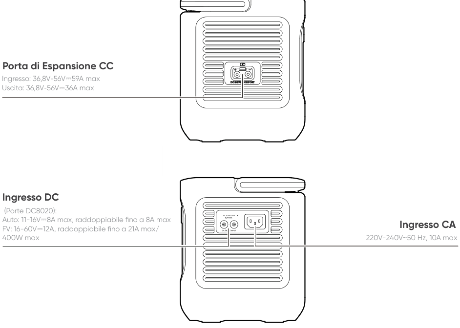

# DISPLAY LCD

<table class="longtable lcd-text-only">
<colgroup>
<col style="width: 8%" />
<col style="width: 12%" />
<col style="width: 28%" />
<col style="width: 52%" />
</colgroup>
<tbody>
<tr>
<td>
1
</td>
<td></td>
<td>
Wi-Fi
</td>
<td><strong>Acceso:</strong> Wi-Fi connesso.
<strong>Lampeggiante:</strong> pronto per la connessione Wi-Fi.
<strong>Spento:</strong> Wi-Fi disconnesso.</td>
</tr>
<tr>
<td>
2
</td>
<td></td>
<td>
Bluetooth
</td>
<td><strong>Acceso:</strong> Bluetooth connesso.
<strong>Lampeggiante:</strong> pronto per la connessione Bluetooth.
<strong>Spento:</strong> Bluetooth disconnesso.</td>
</tr>
<tr>
<td>
3
</td>
<td></td>
<td>
Modalità di ricarica silenziosa
</td>
<td><strong>Acceso:</strong> il rumore durante la ricarica è significativamente ridotto, mentre la potenza e la velocità di ricarica diminuiscono.
<strong>Spento:</strong> la modalità di ricarica silenziosa è disattivata. Questa funzione può essere attivata o disattivata tramite l'app Jackery.</td>
</tr>
<tr>
<td>
4
</td>
<td></td>
<td>
Piano di ricarica
</td>
<td>Customizes the charging time of the Jackery Explorer 1000 Plus. Suitable for situations with fluctuating electricity prices, it allows for charging plans based on peak and off-peak electricity times, reducing electricity costs.
Enable/disable this feature in the Jackery App. The setting is retained when the device is powered off.</td>
</tr>
<tr>
<td>
5
</td>
<td></td>
<td>
Modalità autoalimentata
</td>
<td>Massimizza l'uso dell'energia solare e riduce la dipendenza dalla rete elettrica, dando priorità all'energia solare immagazzinata e riducendo i costi dell'elettricità (abilitare/disabilitare questa funzione nell'app). La stazione di alimentazione deve essere collegata contemporanea- mente
sia ai pannelli solari che alla rete elettrica, con la potenza di carico limitata dalla potenza di bypass.</td>
</tr>
<tr>
<td>
6
</td>
<td></td>
<td>
Modalità TOU
</td>
<td>On: la modalità TOU (time-of-use) è abilitata (SOC di backup predefinito: 60%). Durante i periodi di picco, quando l’energia immagazzinata supera il SOC di backup, il prodotto dà priorità alla scarica della batteria per ridurre i costi dell’elettricità nelle ore di punta. Durante i periodi fuori punta, il sistema carica la batteria dalla rete elettrica per ottenere il livellamento dei picchi e il riempimento delle valli.
Off: la modalità TOU è disabilitata. Il dispositivo non segue la strategia TOU e funziona secondo la logica predefinita di alimentazione e in carica. Abilita/disabilita questa modalità nell’app Jackery. L’impostazione viene mantenuta quando il dispositivo è spento.</td>
</tr>
<tr>
<td>
7
</td>
<td></td>
<td>
UPS
</td>
<td>On: il prodotto è in modalità bypass e il tempo di commutazione dalla rete elettrica alla batteria interna è di 10 ms.
Off: il prodotto non è in modalità bypass.</td>
</tr>
<tr>
<td>
8
</td>
<td></td>
<td>
Indicatore di alimentazione CA
</td>
<td>
L’uscita AC (onda sinusoidale pura) è attiva.
</td>
</tr>
<tr>
<td>
9
</td>
<td></td>
<td>
Tensione e frequenza di uscita
</td>
<td>
Visualizza la tensione e la frequenza di uscita.
</td>
</tr>
<tr>
<td>
10
</td>
<td></td>
<td>
Potenza in ingresso
</td>
<td>
Visualizza la potenza di ingresso in watt.
</td>
</tr>
<tr>
<td>
11
</td>
<td></td>
<td>
Verbleibende Aufladezeit
</td>
<td>
Visualizza il tempo residuo di carica.
</td>
</tr>
<tr>
<td>
12
</td>
<td></td>
<td>
Indicatore di ricarica da auto
</td>
<td>
Il prodotto viene ricaricato tramite l’ingresso DC (DC8020) utilizzando 12V DC (ricarica da auto).
</td>
</tr>
<tr>
<td>
13
</td>
<td></td>
<td>
Autoladeanzeige
</td>
<td>
Il prodotto viene ricaricato tramite l’ingresso DC (DC8020) utilizzando uno o più pannelli solari.
</td>
</tr>
<tr>
<td>
14
</td>
<td></td>
<td>
Indicatore di ricarica solare
</td>
<td>
Il prodotto viene ricaricato tramite l’ingresso DC (DC8020) utilizzando uno o più pannelli solari.
</td>
</tr>
<tr>
<td>
15
</td>
<td></td>
<td>
Modalità di risparmio della batteria
</td>
<td><strong>Acceso:</strong> limita la capacità massima della batteria utilizzabile per prolungarne la durata.
<strong>Spento:</strong> la modalità di risparmio batteria è disattivata. Questa funzione può essere attivata o disattivata tramite l'app Jackery. L’impostazione viene mantenuta quando il dispositivo è spento.
Nota 1: questa funzione non è disponibile quando il prodotto è collegato a uno o più pacchi batteria.
Nota 2: Quando questa funzione è abilitata, il prodotto esegue occasionalmente un ciclo completo di carica-scarica per calibrare il SOC.</td>
</tr>
<tr>
<td>
16
</td>
<td></td>
<td>
Limite di potenza di ricarica
</td>
<td>On: il limite di potenza di ricarica è abilitato nell’app Jackery.
Off: il limite di potenza di ricarica è disabilitato nell’app Jackery. L’impostazione viene mantenuta quando il dispositivo è spento.</td>
</tr>
<tr>
<td>
17
</td>
<td></td>
<td>
Indicatore di carica della batteria
</td>
<td>
Quando il prodotto è in carica, il cerchio arancione attorno alla percentuale della batteria si accende in sequenza. Durante la ricarica di altri dispositivi, il cerchio arancione rimarrà acceso.
</td>
</tr>
<tr>
<td>
18
</td>
<td></td>
<td>
Indicatore di batteria scarica
</td>
<td><strong>Acceso:</strong> il livello della batteria è inferiore al 20%.
<strong>Lampeggiante:</strong> il livello della batteria è inferiore al 5%.
<strong>Spento:</strong> il livello della batteria non è inferiore al 20% oppure il prodotto è in carica.</td>
</tr>
<tr>
<td>
19
</td>
<td></td>
<td>
Percentuale di batteria residua
</td>
<td>
Mostra la percentuale residua della batteria.
</td>
</tr>
<tr>
<td>
20
</td>
<td></td>
<td>
Timer di scarica
</td>
<td>Attivato: è impostato un timer di scarica.
Disattivato: non è impostato alcun timer di scarica.
Questa funzione può essere attivata o disattivata tramite l'app Jackery. L'impostazione non viene mantenuta quando il dispositivo è spento.</td>
</tr>
<tr>
<td>
21
</td>
<td></td>
<td>
Indicatore del pacco batteria e numero di batterie collegate
</td>
<td>
Visualizza il numero di pacchi batteria collegati, se presenti.
</td>
</tr>
<tr>
<td>
22
</td>
<td></td>
<td>
Modalità di risparmio energetico
</td>
<td>Quando l'uscita AC 1/2 o DC/USB è accesa premendo il rispettivo pulsante di alimentazione:
<strong>Acceso:</strong> La modalità di risparmio energetico è attivata. Spento: La modalità di risparmio energetico è disattivata.</td>
</tr>
<tr>
<td>
23
</td>
<td></td>
<td>
Indicatore di temperatura elevata
</td>
<td>
La protezione da alta temperatura è stata attivata. Il prodotto potrebbe smettere di funzionare finché la temperatura non rientra nel normale intervallo operativo.
</td>
</tr>
<tr>
<td>
23
</td>
<td></td>
<td>
Indicatore di bassa temperatura
</td>
<td>
È stata attivata la protezione da bassa temperatura. Il prodotto potrebbe smettere di funzionare finché la temperatura non rientra nel normale intervallo operativo.
</td>
</tr>
<tr>
<td>
24
</td>
<td></td>
<td>
Codice di errore
</td>
<td>
Si è verificato un errore del prodotto. Per maggiori dettagli, consultare la sezione “Risoluzione dei problemi”.
</td>
</tr>
<tr>
<td>
25
</td>
<td></td>
<td>
Potenza in uscita
</td>
<td>
Visualizza la potenza di uscita in watt.
</td>
</tr>
<tr>
<td>
26
</td>
<td></td>
<td>
Tempo di scarica rimanente
</td>
<td>
Visualizza il tempo residuo di scarica.
</td>
</tr>
</tbody>
</table>

# OPERAZIONI

## ACCENSIONE/SPEGNIMENTO

## USCITA CA ATTIVA/DISATTIVA

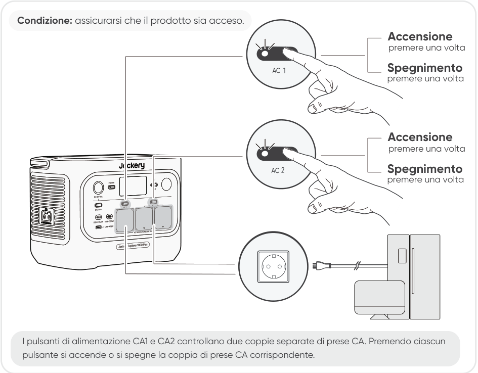

## USCITA CC 12 V/ USB ATTIVA/DISATTIVA

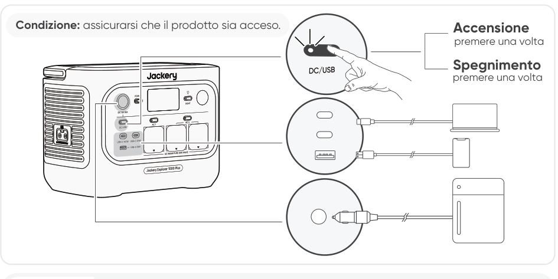

<table class="manual-callout-table" style="width:100%; border-collapse:collapse; margin:0 0 16px 0;"><tbody><tr><td class="manual-callout-label" style="width:16%; border:1px solid #000; padding:6px 8px; vertical-align:top;">
<strong>ATTENZIONE</strong>
</td><td class="manual-callout-body" style="border:1px solid #000; padding:6px 8px; vertical-align:top;"><ul class="simple">
<li>
<strong>USB-C 100W è una porta di uscita ad alta potenza USB-PD Power Source 3 (PS3).</strong> Se il dispositivo o l'accessorio collegato non soddisfa i requisiti di sicurezza, potrebbe esserci un rischio di incendio. Prima di utilizzare queste porte, assicurarsi che il dispositivo o l'accessorio collegato sia dotato di protezione antincendio.
</li>
<li>
Collega Jackery Explorer 1000 Plus solo a dispositivi o accessori conformi alle clausole 6.3, 6.4 e 6.5 della norma IEC/EN/UL 62368-1 (o di altri standard equivalenti).
</li>
<li>
Per ottenere la massima potenza di uscita, usa il cavo da USB-C a USB-C da 5 A (20 V CC/5 A, 100 W).
</li>
</ul>
</td></tr></tbody></table>

Il prodotto può ricaricare la batteria dell\'auto utilizzando il cavo Jackery per la ricarica della batteria dell\'auto a 12 V, venduto separatamente e disponibile sul nostro sito web.

<table class="manual-callout-table" style="width:100%; border-collapse:collapse; margin:0 0 16px 0;"><tbody><tr><td class="manual-callout-label" style="width:16%; border:1px solid #000; padding:6px 8px; vertical-align:top;">
<strong>ATTENZIONE</strong>
</td><td class="manual-callout-body" style="border:1px solid #000; padding:6px 8px; vertical-align:top;"><ul class="simple">
<li>
La porta CC 12 V è compatibile solo con batterie per auto da 12 V e non è adatta a sistemi da 24 V.
</li>
<li>
Non avviare l'auto mentre il prodotto sta ricaricando la batteria dell'auto tramite la porta di uscita CC da 12 V, poiché ciò potrebbe danneggiare il prodotto.
</li>
<li>
Questa funzione è destinata solo all'uso di emergenza e non può ricaricare una batteria dell'auto completamente scarica o danneggiata.
</li>
</ul>
</td></tr></tbody></table>

## MODALITÀ RISPARMIO ENERGETICO

Per evitare un consumo inutile della batteria dovuto al mancato spegnimento dell\'uscita, il prodotto abilita per impostazione predefinita la Modalità risparmio energetico. Quando l\'uscita CA o CC è attiva, l\'icona della Modalità risparmio energetico viene visualizzata sullo schermo LCD. In questa modalità, se non è collegato alcun dispositivo oppure il consumo del dispositivo collegato è inferiore a una certa soglia (25 W per l\'uscita CA o 2 W per l\'uscita DC/USB), l\'uscita corrispondente si spegnerà automaticamente dopo il tempo impostato. L\'impostazione predefinita e 12 ore. La durata della Modalità risparmio energetico può essere impostata nell\'App Jackery su 1 H, 2 H, 8 H, 12 H o 24 H. Se viene impostata su Mai spegnimento, la Modalità risparmio energetico sarà disattivata.

Quando si alimentano dispositivi a basso consumo (CA \<= 25 W oppure DC/USB \<= 2 W), disattiva la Modalità risparmio energetico per evitare che l\'uscita si spenga automaticamente durante il funzionamento.

<table class="manual-callout-table" style="width:100%; border-collapse:collapse; margin:0 0 16px 0;"><tbody><tr><td class="manual-callout-label" style="width:16%; border:1px solid #000; padding:6px 8px; vertical-align:top;">
<strong>NOTA</strong>
</td><td class="manual-callout-body" style="border:1px solid #000; padding:6px 8px; vertical-align:top;">
La Modalità risparmio energetico riprende il suo stato precedente dopo l'accensione. Per cambiare modalità è necessario un intervento manuale.
</td></tr></tbody></table>

## LUCE LED ON/OFF

## Funzione di ripristino delle uscite CA e CC

La funzione di ripristino delle uscite CA e CC è disattivata per impostazione predefinita. Attivare questa funzione nell'App Jackery per consentire al dispositivo di memorizzare lo stato delle uscite CA e CC e ripristinare automaticamente le uscite CA e CC in condizioni definite.

<figure aria-label="Condizioni di ripristino automatico / Condizioni senza ripristino automatico" class="hb-auto-resume-composition"><table class="hb-auto-resume-table"><colgroup><col class="hb-auto-resume-col"/><col class="hb-auto-resume-col"/></colgroup>
<thead>
<tr><th class="head hb-auto-resume-left" scope="col">
Condizioni di ripristino automatico
</th>
<th class="head hb-auto-resume-right" scope="col">
Condizioni senza ripristino automatico
</th>
</tr>
</thead>
<tbody>
<tr><td class="hb-auto-resume-left">
Accensione/Riavvio dopo lo spegnimento o il riavvio
</td>
<td class="hb-auto-resume-right">
Spegnimento manuale delle uscite (pulsante/App)
</td>
</tr>
<tr><td class="hb-auto-resume-left" rowspan="2">
SOC batteria ≥ limite di scarica +10% al raggiungimento del limite
</td>
<td class="hb-auto-resume-right">
Spegnimento delle uscite in modalità risparmio energetico
</td>
</tr>
<tr><td class="hb-auto-resume-right">
Spegnimento delle uscite attivato da protezione
</td>
</tr>
<tr><td class="hb-auto-resume-left">
Aggiornamento OTA completato
</td>
<td class="hb-auto-resume-right">
Spegnimento delle uscite attivato dal timer di scarica
</td>
</tr>
</tbody>
</table></figure>

## SCHERMO LCD

<figure aria-label="Segnaposto modalità display LCD." class="hb-lcd-mode-composition" data-component-id="HB-TABLE-LCD-MODE">
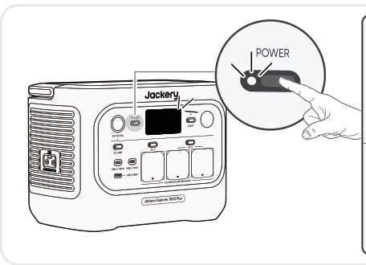

<table class="hb-lcd-mode-table"><colgroup><col class="hb-lcd-mode-col-state"/><col class="hb-lcd-mode-col-action"/><col class="hb-lcd-mode-col-copy"/></colgroup><tbody><tr><td class="hb-lcd-mode-state" rowspan="3">Acceso brevemente</td><td class="hb-lcd-mode-action">Accendi</td><td class="hb-lcd-mode-copy">Premi il pulsante POWER principale oppure quando il prodotto è in carica.</td></tr><tr><td class="hb-lcd-mode-action">Spegni</td><td class="hb-lcd-mode-copy">Premi il pulsante POWER principale.</td></tr><tr><td class="hb-lcd-mode-action">Spegnimento automatico</td><td class="hb-lcd-mode-copy">Lo schermo LCD si spegne automaticamente ed entra in modalità sleep dopo 2 minuti di inattività.</td></tr><tr><td class="hb-lcd-mode-state" rowspan="3">Acceso fisso (in carica o in scarica)</td><td class="hb-lcd-mode-action">Accendi</td><td class="hb-lcd-mode-copy">Premi due volte il pulsante POWER principale quando il prodotto è acceso.</td></tr><tr><td class="hb-lcd-mode-action">Spegni</td><td class="hb-lcd-mode-copy">Premi il pulsante POWER principale.</td></tr><tr><td class="hb-lcd-mode-action">Spegnimento automatico</td><td class="hb-lcd-mode-copy">Lo schermo LCD si spegne automaticamente dopo 2 ore di inattività.</td></tr></tbody></table>
</figure>

Puoi anche impostare la modalità di visualizzazione dello schermo nell\'App Jackery.

## COMBINAZIONI DI TASTI

<figure aria-label="Pulsanti / Operazione / Funzione" class="hb-key-combination-composition" tabindex="0"><table class="hb-key-combination-table"><colgroup><col class="hb-key-col-buttons"/><col class="hb-key-col-operation"/><col class="hb-key-col-function"/></colgroup>
<thead>
<tr><th class="head hb-key-buttons" scope="col">
Pulsanti
</th>
<th class="head hb-key-operation" scope="col">
Operazione
</th>
<th class="head hb-key-function" scope="col">
Funzione
</th>
</tr>
</thead>
<tbody>
<tr><td class="hb-key-buttons">
Pulsante POWER principale + Pulsante CA
</td>
<td class="hb-key-operation">
Tieni premuti entrambi per 3 s
</td>
<td class="hb-key-function">
Attiva/disattiva la Modalità risparmio energetico
</td>
</tr>
<tr><td class="hb-key-buttons">
Pulsante POWER principale + Pulsante DC/USB
</td>
<td class="hb-key-operation">
Tieni premuti entrambi per 3 s
</td>
<td class="hb-key-function">
Ripristina Wi-Fi e Bluetooth
</td>
</tr>
<tr><td class="hb-key-buttons">
Pulsante DC/USB + Pulsante CA
</td>
<td class="hb-key-operation">
Tieni premuti entrambi per 1 s
</td>
<td class="hb-key-function">
Attiva/disattiva Wi-Fi e Bluetooth
</td>
</tr>
<tr><td class="hb-key-buttons">
Pulsante POWER principale + Pulsante luce LED
</td>
<td class="hb-key-operation">
Tieni premuti entrambi per 1 s
</td>
<td class="hb-key-function">
Attiva/disattiva la Modalità di ricarica di emergenza
</td>
</tr>
</tbody>
</table></figure>

# GRUPPO DI CONTINUITÀ (UPS)

Collega il prodotto a una presa a muro con il cavo di ricarica CA, quindi premi il pulsante AC 1/2 e alimenta contemporaneamente i tuoi apparecchi.

Un gruppo di continuità (UPS) è un sistema di alimentazione continua che fornisce automaticamente energia di riserva a un carico quando viene a mancare l\'alimentazione della rete elettrica.

In caso di improvvisa interruzione dell\'alimentazione di rete, Jackery Explorer 1000 Plus passerà automaticamente all\'alimentazione accumulata entro 10 ms per mantenere in funzione i tuoi apparecchi.

In modalità UPS, la potenza di picco dell\'unità raggiunge 10 A prima dei interruzioni di corrente. Poiché in modalità bypass sono abilitati la carica e la scarica simultanee,

la potenza di uscita effettiva in questa modalità è inferiore alla potenza nominale, ma torna alla potenza nominale durante i interruzioni di corrente.

<table class="manual-callout-table" style="width:100%; border-collapse:collapse; margin:0 0 16px 0;"><tbody><tr><td class="manual-callout-label" style="width:16%; border:1px solid #000; padding:6px 8px; vertical-align:top;">
<strong>ATTENZIONE</strong>
</td><td class="manual-callout-body" style="border:1px solid #000; padding:6px 8px; vertical-align:top;"><ul class="simple">
<li>
Questo prodotto non supporta la commutazione a 0 ms. Non collegarlo ad apparecchiature che richiedono un'alimentazione con commutazione a 0 ms, come server di dati o workstation.
</li>
<li>
Prima dell'uso, verifica più volte la compatibilità con il tuo dispositivo.
</li>
<li>
Non collegare carichi che superano la potenza massima di uscita del prodotto. In caso contrario, verrà attivata la protezione da sovraccarico.
</li>
</ul>
</td></tr></tbody></table>

# COLLEGAMENTO AL PACCO BATTERIA (VENDUTI SEPARATAMENTE)

Questo prodotto può supportare fino a 5 pacchi batteria per soddisfare l\'esigenza di grande capacità di alimentazione. Per i dettagli su come utilizzarlo, consultare il manuale d\'uso del Jackery Battery Pack 2000.

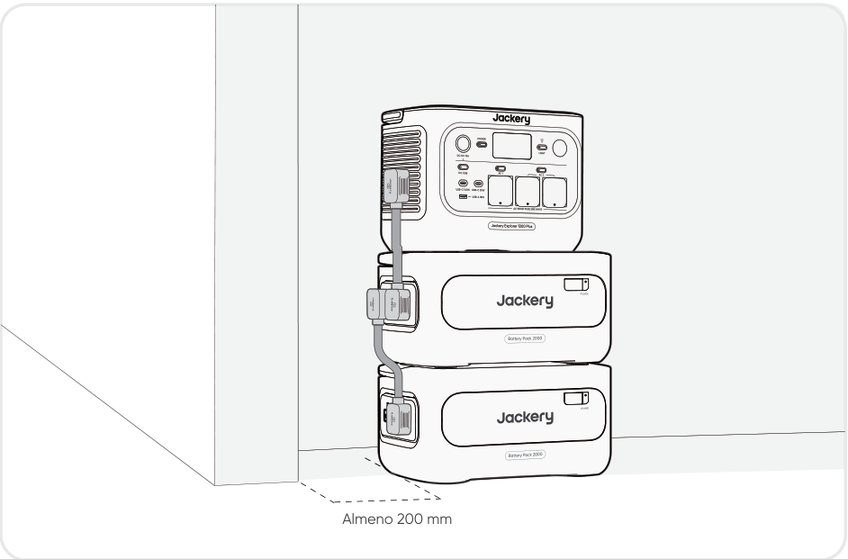

<table class="manual-callout-table" style="width:100%; border-collapse:collapse; margin:0 0 16px 0;"><tbody><tr><td class="manual-callout-label" style="width:16%; border:1px solid #000; padding:6px 8px; vertical-align:top;">
<strong>ATTENZIONE</strong>
</td><td class="manual-callout-body" style="border:1px solid #000; padding:6px 8px; vertical-align:top;"><ul class="simple">
<li>
Assicurarsi che tutti i prodotti siano spenti prima di collegare l'Jackery Explorer 1000 Plus al Jackery Battery Pack 2000.
</li>
<li>
Per garantire il corretto funzionamento del prodotto, assicurarsi che le prese d'aria di aspirazione e bocchette di scarico su entrambi i lati non siano ostruite. Lasciare almeno 200 mm di spazio tra le prese d'aria e qualsiasi oggetto per consentire un'adeguata dissipazione del calore.
</li>
<li>
Quando il prodotto viene utilizzato con pacchi batteria collegati, il numero massimo predefinito di pacchi batteria impilabili è 3 e il prodotto deve essere posizionato su una superficie piana e stabile, con adeguata capacità di carico.
</li>
<li>
Se è necessario impilare 4 o più pacchi batteria, il prodotto deve essere posizionato in un’area stabile contro una parete e protetto da urti esterni, adottando le necessarie misure di sicurezza antiribaltamento.
</li>
</ul>
</td></tr></tbody></table>

|                               |                        |                    |
|-------------------------------|------------------------|--------------------|
| **Jackery Battery Pack 2000** | **Cavo di espansione** | **Manuale d\'uso** |

# RICARICA

**L\'energia verde prima di tutto:** promuoviamo l\'uso prioritario dell\'energia verde. Questo prodotto supporta due modalità di ricarica contemporaneamente: ricarica solare e ricarica CA da presa a muro. Quando la ricarica CA da presa a muro e la ricarica solare sono attive contemporaneamente, il prodotto darà priorità alla ricarica solare e userà entrambi i metodi per caricare la batteria alla massima potenza consentita.

**Caricare completamente il prodotto prima del primo utilizzo.**

<table class="manual-callout-table" style="width:100%; border-collapse:collapse; margin:0 0 16px 0;"><tbody><tr><td class="manual-callout-label" style="width:16%; border:1px solid #000; padding:6px 8px; vertical-align:top;">
<strong>NOTA</strong>
</td><td class="manual-callout-body" style="border:1px solid #000; padding:6px 8px; vertical-align:top;"><ul class="simple">
<li>
La temperatura di ricarica consigliata per il prodotto varia nell'intervallo tra -10 °C e 45 °C e la temperatura di scarica varia nell'intervallo tra -10 °C e 45 °C.
</li>
<li>
L'utilizzo del prodotto al di fuori di questo intervallo di temperatura può limitarne le capacità di carica e scarica, o addirittura impedirne la carica o la scarica.
</li>
<li>
La potenza di ricarica e la capacità della batteria del prodotto possono variare a causa delle fluttuazioni di temperatura.
</li>
</ul>
</td></tr></tbody></table>

## RICARICA TRAMITE PRESA A MURO CA

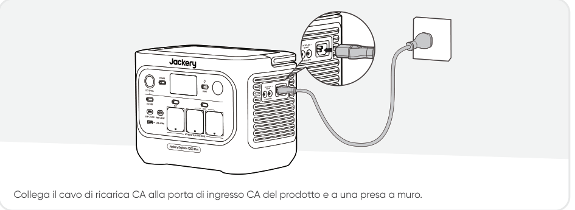

<table class="manual-callout-table" style="width:100%; border-collapse:collapse; margin:0 0 16px 0;"><tbody><tr><td class="manual-callout-label" style="width:16%; border:1px solid #000; padding:6px 8px; vertical-align:top;">
<strong>ATTENZIONE</strong>
</td><td class="manual-callout-body" style="border:1px solid #000; padding:6px 8px; vertical-align:top;">
Assicurarsi che il cavo di ricarica CA sia inserito completamente e saldamente nella porta di ingresso CA. Un collegamento incompleto può causare corrente instabile, surriscaldamento, cattivo contatto o malfunzionamento del dispositivo.
</td></tr></tbody></table>

**Modalità di ricarica di emergenza**

In questa modalità, è possibile ricaricare rapidamente la power station portatile utilizzando il metodo di ricarica CA. Questa funzione di ricarica di emergenza può essere attivata o disattivata tramite l\'app Jackery. Quando la modalità di ricarica di emergenza è attiva, la luce circolare che indica lo stato di carica (SOC) lampeggia più rapidamente.

\*Per massimizzare la durata della batteria, è preferibile caricare a velocità normale. Utilizzare la modalità di ricarica di emergenza solo quando necessario. Non è consigliata per un uso regolare e prolungato.

## RICARICA TRAMITE PANNELLI SOLARI (VENDUTI SEPARATAMENTE)

Jackery Explorer 1000 Plus dispone di due porte di ingresso DC8020 ed è compatibile con i pannelli solari Jackery.

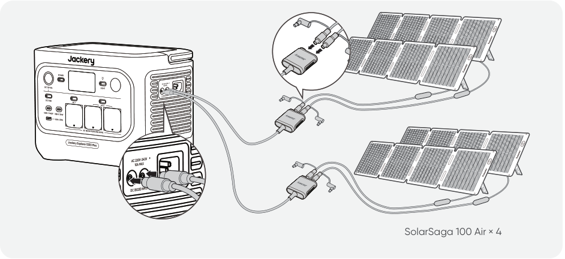

Se una porta di ingresso DC8020 deve collegare contemporaneamente due pannelli solari, fare riferimento alla figura seguente per la ricarica tramite il connettore per pannelli solari (venduto separatamente, non incluso di serie).

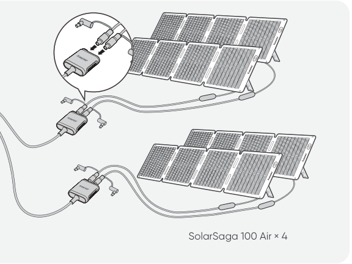

<table class="manual-callout-table" style="width:100%; border-collapse:collapse; margin:0 0 16px 0;"><tbody><tr><td class="manual-callout-label" style="width:16%; border:1px solid #000; padding:6px 8px; vertical-align:top;">
<strong>ATTENZIONE</strong>
</td><td class="manual-callout-body" style="border:1px solid #000; padding:6px 8px; vertical-align:top;">
Una porta di ingresso DC8020 può essere collegata al massimo a due pannelli solari.
</td></tr></tbody></table>

<table class="manual-callout-table" style="width:100%; border-collapse:collapse; margin:0 0 16px 0;"><tbody><tr><td class="manual-callout-label" style="width:16%; border:1px solid #000; padding:6px 8px; vertical-align:top;">
<strong>ATTENZIONE</strong>
</td><td class="manual-callout-body" style="border:1px solid #000; padding:6px 8px; vertical-align:top;">
Assicurarsi che la tensione di ingresso di entrambe le porte di ingresso CC sia la stessa. In caso contrario, il prodotto potrebbe danneggiarsi. Ad esempio:

<ul class="simple">
<li>
Utilizzare lo stesso modello di pannelli solari Jackery e lo stesso numero di pannelli quando si collegano pannelli solari a entrambe le porte di ingresso DC8020.
</li>
<li>
Non caricare il prodotto utilizzando contemporaneamente un caricatore per auto e un pannello solare. In caso contrario, il fusibile dell'auto potrebbe saltare oppure la ricarica potrebbe non riuscire.
</li>
</ul>
</td></tr></tbody></table>

Si consiglia di utilizzare il pannello solare Jackery per caricare il prodotto. Assicurarsi che la tensione a circuito aperto (Voc) del pannello solare rientri nell\'intervallo di ingresso CC (16V-60V) di Jackery Explorer 1000 Plus. Jackery non è responsabile di eventuali danni o perdite derivanti dall\'uso di pannelli solari di terze parti.

## RICARICA TRAMITE CARICATORE PER AUTO (VENDUTI SEPARATAMENTE)

Questo prodotto può essere caricato con un caricabatterie per auto da 12 V. Assicurarsi che il caricabatterie e l\'accendisigari dell\'auto siano ben collegati.

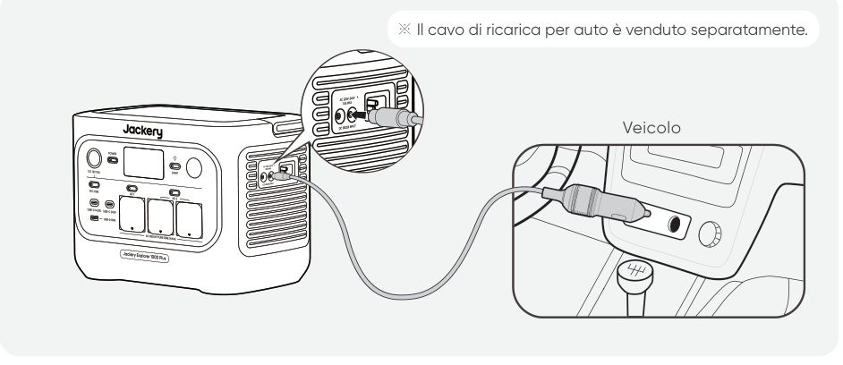

<table class="manual-callout-table" style="width:100%; border-collapse:collapse; margin:0 0 16px 0;"><tbody><tr><td class="manual-callout-label" style="width:16%; border:1px solid #000; padding:6px 8px; vertical-align:top;">
<strong>ATTENZIONE</strong>
</td><td class="manual-callout-body" style="border:1px solid #000; padding:6px 8px; vertical-align:top;"><ul class="simple">
<li>
Avviare il veicolo prima di caricare la power station.
</li>
<li>
Se il veicolo percorre strade sconnesse, è vietato utilizzare il caricatore per auto poiché ciò potrebbe causare un funzionamento non conforme. L'Azienda non sarà responsabile di eventuali perdite causate da un funzionamento non conforme.
</li>
<li>
La ricarica tramite veicolo è applicabile solo ai veicoli con 12V CC, non a 24V CC. Non caricare questo prodotto in un veicolo da 24V per evitare lesioni personali e danni materiali.
</li>
</ul>
</td></tr></tbody></table>

# CONSERVAZIONE

Conserva il prodotto in un luogo asciutto, pulito e ben ventilato. Temperatura e umidità di conservazione:

- 1 month: da -20 °C a 45 °C (0-60% UR)

- 3 months: da 0 °C a 45 °C (0-60% UR)

- 12 months: da 0 °C a 25 °C (0-60% UR)

Se il prodotto viene conservato a lungo termine (da 3 a 6 mesi) con la batteria scarica, potrebbe non essere più possibile ricaricarlo. Per evitarlo e mantenere la salute della batteria, si consiglia di controllare e ricaricare il prodotto ogni tre mesi e di eseguire almeno un ciclo completo di carica e scarica ogni 6-12 mesi.

# RISOLUZIONE DEI PROBLEMI

Se viene visualizzato uno dei seguenti codici di errore, segui le azioni correttive elencate per risolvere il problema. Se l\'errore persiste, contatta l\'Assistenza clienti Jackery.

<figure aria-label="Codice errore / Misure correttive" class="hb-troubleshooting-composition" data-component-id="HB-TABLE-TROUBLESHOOTING" tabindex="0"><table class="hb-troubleshooting-table"><colgroup><col class="hb-troubleshooting-col-code"/><col class="hb-troubleshooting-col-measures"/></colgroup><thead><tr><th class="hb-troubleshooting-code" scope="col">
Codice errore
</th><th class="hb-troubleshooting-measures" scope="col">
Misure correttive
</th></tr></thead><tbody><tr><td class="hb-troubleshooting-code">
F0
</td><td class="hb-troubleshooting-measures">
Riavviare il prodotto.
</td></tr><tr><td class="hb-troubleshooting-code">
F1
</td><td class="hb-troubleshooting-measures">
Riavviare il prodotto.
</td></tr><tr><td class="hb-troubleshooting-code">
F2
</td><td class="hb-troubleshooting-measures">
Riavviare il prodotto.
</td></tr><tr><td class="hb-troubleshooting-code">
F3
</td><td class="hb-troubleshooting-measures">
Riavviare il prodotto.
</td></tr><tr><td class="hb-troubleshooting-code">
F4
</td><td class="hb-troubleshooting-measures">
Collegare il prodotto ai carichi per scaricare la batteria fino a quando l'errore non scompare.
</td></tr><tr><td class="hb-troubleshooting-code">
F5
</td><td class="hb-troubleshooting-measures">
Caricare il prodotto tramite pannelli solari o Presa di corrente CA fino a quando l'errore non scompare.
</td></tr><tr><td class="hb-troubleshooting-code">
F6
</td><td class="hb-troubleshooting-measures">

1. 1Attendere che la rete elettrica si normalizzi prima di caricare il prodotto tramite presa di corrente CA.

2. Verificare che le prese d'aria di aspirazione e le bocchette di scarico non siano ostruite; assicurare uno spazio libero di 20 cm su entrambi i lati del prodotto.

3. Posizionare il prodotto in un luogo non esposto alla luce diretta del sole o a temperature ambientali elevate.

4. Disconnettere tutti i carichi dal prodotto, lasciarlo inattivo e attendere che l'errore scompaia. 5. Riavviare il prodotto.

</td></tr><tr><td class="hb-troubleshooting-code">
F7
</td><td class="hb-troubleshooting-measures">

1. Rimuovere tutti gli ingressi CC dal prodotto.

2. Se si ricarica il prodotto tramite un pannello solare, verificare la tensione a circuito aperto (Voc) del pannello solare collegato. Il prodotto consente una tensione di ingresso CC massima di 60V. 3. Riavviare il prodotto e lasciarlo inattivo. Attendere che l'errore scompaia.

</td></tr><tr><td class="hb-troubleshooting-code">
F8
</td><td class="hb-troubleshooting-measures">
Contattare il distributore o l'assistenza clienti Jackery.
</td></tr><tr><td class="hb-troubleshooting-code">
F9
</td><td class="hb-troubleshooting-measures">
Rimuovere il carico collegato alle porte USB del prodotto. Attendere che l'errore scompaia.
</td></tr><tr><td class="hb-troubleshooting-code">
FC
</td><td class="hb-troubleshooting-measures">

1. Riavviare rispettivamente i pacchi batteria e il Jackery Explorer 1000 Plus.

2. Se il guasto persiste, scollegare il pacco batteria dal Jackery Explorer 1000 Plus e ricollegarlo.

</td></tr><tr><td class="hb-troubleshooting-code">
FE
</td><td class="hb-troubleshooting-measures">
Contattare il distributore o l'assistenza clienti Jackery.
</td></tr></tbody></table></figure>

# SPECIFICHE TECNICHE

## INFORMAZIONI GENERALI

<figure aria-label="INFORMAZIONI GENERALI" class="hb-spec-table-composition"><table class="hb-spec-table manual-table manual-spec-table"><colgroup><col class="hb-spec-col-label"/><col class="hb-spec-col-value"/></colgroup>
<tbody>
<tr>
<th class="hb-spec-label manual-spec-label" scope="row">Product Name</th>
<td class="hb-spec-value manual-spec-value">Jackery Explorer 1000 Plus</td>
</tr>
<tr>
<th class="hb-spec-label manual-spec-label" scope="row">Model No.</th>
<td class="hb-spec-value manual-spec-value">JE-1000H</td>
</tr>
<tr>
<th class="hb-spec-label manual-spec-label" scope="row">Capacità</th>
<td class="hb-spec-value manual-spec-value">1024 Wh (20 Ah/51,2 V DC</td>
</tr>
<tr>
<th class="hb-spec-label manual-spec-label" scope="row">Cell Chemistry</th>
<td class="hb-spec-value manual-spec-value">LiFePO₄</td>
</tr>
<tr>
<th class="hb-spec-label manual-spec-label" scope="row">Peso</th>
<td class="hb-spec-value manual-spec-value">Circa 10,8 kg</td>
</tr>
<tr>
<th class="hb-spec-label manual-spec-label" scope="row">Dimensioni</th>
<td class="hb-spec-value manual-spec-value">313,5 × 201 × 233,5 mm</td>
</tr>
<tr>
<th class="hb-spec-label manual-spec-label" scope="row">Durata del ciclo</th>
<td class="hb-spec-value manual-spec-value">6000 cicli fino all' 70% di</td>
</tr>
</tbody>
</table></figure>

## PORTE IN INGRESSO

<figure aria-label="PORTE IN INGRESSO" class="hb-spec-table-composition"><table class="hb-spec-table manual-table manual-spec-table"><colgroup><col class="hb-spec-col-label"/><col class="hb-spec-col-value"/></colgroup>
<tbody>
<tr>
<th class="hb-spec-label manual-spec-label" scope="row">1 × Ingresso CA</th>
<td class="hb-spec-value manual-spec-value">Charge Mode: 220 V-240 V~50 Hz, 10 A max Bypass Mode①: 220 V-240 V~50 Hz, 7,83 A</td>
</tr>
<tr>
<th class="hb-spec-label manual-spec-label" scope="row">2 porte DC8020</th>
<td class="hb-spec-value manual-spec-value">11 V-16 V 8 A max, raddoppia fino a 8 A 16 V-60 V 12 A, raddoppia fino a 21 A / 400 W Max</td>
</tr>
<tr>
<th class="hb-spec-label manual-spec-label" scope="row">1 × Porta di Espansione CC</th>
<td class="hb-spec-value manual-spec-value">36,8 V-56 V 59 A max</td>
</tr>
</tbody>
</table></figure>

## PORTE IN USCITA

<figure aria-label="PORTE IN USCITA" class="hb-spec-table-composition"><table class="hb-spec-table manual-table manual-spec-table"><colgroup><col class="hb-spec-col-label"/><col class="hb-spec-col-value"/></colgroup>
<tbody>
<tr>
<th class="hb-spec-label manual-spec-label" scope="row">3 × uscite CA</th>
<td class="hb-spec-value manual-spec-value">230V~ 50Hz, 7,83A, 1800W nomi</td>
</tr>
<tr>
<th class="hb-spec-label manual-spec-label" scope="row">Uscita totale CA 2②</th>
<td class="hb-spec-value manual-spec-value">1800W nominali, 3600W picc</td>
</tr>
<tr>
<th class="hb-spec-label manual-spec-label" scope="row">Uscita CA in modalità bypass①</th>
<td class="hb-spec-value manual-spec-value">220 V-240 V~50Hz, 7,83 A USB</td>
</tr>
<tr>
<th class="hb-spec-label manual-spec-label" scope="row">2 × Uscita USB-C</th>
<td class="hb-spec-value manual-spec-value">USB-C 30W: 30 W max, 5 V 3 A, 9 V 3 A, 12 V 2,5 A, 15 V 2 A, 20 V 1,5A USB-C 140W: 140 W max, 5 V 3 A, 9 V 3 A, 12 V 3 A, 15 V 3 A, 20 V 5 A, 28 V 5 A</td>
</tr>
<tr>
<th class="hb-spec-label manual-spec-label" scope="row">1 × Uscita USB-A</th>
<td class="hb-spec-value manual-spec-value">18 W max, 5-6 V 3 A, 6-9 V 2 A, 9-12 V 1,5 A</td>
</tr>
<tr>
<th class="hb-spec-label manual-spec-label" scope="row">1 × Porta CC 12 V</th>
<td class="hb-spec-value manual-spec-value">12 V 10 A max</td>
</tr>
<tr>
<th class="hb-spec-label manual-spec-label" scope="row">1 ×  Porta di Espansione CC</th>
<td class="hb-spec-value manual-spec-value">36,8 V-56 V 36 A max</td>
</tr>
</tbody>
</table></figure>

## ENVIRONMENTAL OPERATING TEMPERATURE

<figure aria-label="ENVIRONMENTAL OPERATING TEMPERATURE" class="hb-spec-table-composition"><table class="hb-spec-table manual-table manual-spec-table"><colgroup><col class="hb-spec-col-label"/><col class="hb-spec-col-value"/></colgroup>
<tbody>
<tr>
<th class="hb-spec-label manual-spec-label" scope="row">Temperatura di ricarica</th>
<td class="hb-spec-value manual-spec-value">tra -10 °C e 45 °C</td>
</tr>
<tr>
<th class="hb-spec-label manual-spec-label" scope="row">Temperatura di scarico</th>
<td class="hb-spec-value manual-spec-value">tra -10 °C e 45 °C</td>
</tr>
</tbody>
</table></figure>

※ USB Type-C® und USB-C® sono marchi registrati di USB Implementers Forum.

① Il prodotto può caricare la batteria dalla presa a muro CA mentre fornisce energia tramite le porte di uscita CA.

② Indica che due o più porte di uscita CA funzionano insieme.

# GARANZIA

<figure aria-label="GARANZIA" class="hb-warranty-intro-composition" data-component-id="HB-WARRANTY-LEAD">

<strong>Forniamo la nostra garanzia solo ai clienti che acquistano dal sito web ufficiale di Jackery, dalle piattaforme di terze parti con marchio Jackery o dai rivenditori autorizzati locali.</strong>

* Il periodo e i dettagli della garanzia possono variare in base alle leggi locali, ai regolamenti e ai rivenditori autorizzati.

</figure>

## Garanzia limitata

<figure aria-label="Garanzia limitata" class="hb-warranty-card" data-component-id="HB-WARRANTY-SECTION" data-warranty-card-index="1">
Jackery garantisce all'acquirente originale che il prodotto Jackery sarà esente da difetti di fabbricazione e materiali in condizioni di normale utilizzo da parte dell' acquirente durante il periodo di garanzia applicabile identificato nella sezione "Periodo di garanzia" di seguito, fatte salve le esclusioni indicate di seguito.

Questa dichiarazione di garanzia stabilisce l'obbligo di garanzia totale ed esclusivo di Jackery. Non ci assumeremo, né autorizzeremo alcuna persona ad assumersi per noi, qualsiasi altra responsabilità in relazione alla vendita dei nostri prodotti.
</figure>

## Periodo di garanzia

<figure aria-label="Periodo di garanzia" class="hb-warranty-period-card" data-component-id="HB-WARRANTY-YEARS">

3
<strong class="hb-warranty-years-unit">ANNI</strong><strong class="hb-warranty-period-label">Garanzia standard</strong>

Il periodo di garanzia standard per Jackery Explorer 1000 Plus è di 36 mesi.
In ogni caso, il periodo di garanzia è misurato a partire dalla data di acquisto da parte dell'acquirente consumatore originario.
Per stabilire la data di inizio del periodo di garanzia è necessaria la ricevuta del primo acquisto da parte del consumatore, o altra prova documentale ragionevole.

2
<strong class="hb-warranty-years-unit">ANNI</strong><strong class="hb-warranty-period-label">Garanzia estesa</strong>

Per attivare l'estensione della garanzia, è necessario registrare il prodotto online, oppure contattare il nostro servizio clienti all'indirizzo <strong>hello.eu@jackery.com</strong> per estendere il periodo di garanzia standard.

</figure>

## Sostituzione

<figure aria-label="Sostituzione" class="hb-warranty-card" data-component-id="HB-WARRANTY-SECTION" data-warranty-card-index="3">
Jackery sostituirà (a spese di Jackery) qualsiasi prodotto Jackery mal funzionante durante il periodo di garanzia applicabile a causa di difetti di fabbricazione o materiali. Un prodotto sostitutivo assume la garanzia residua del prodotto originale.
</figure>

## Limitata all\'acquirente consumatore originale

<figure aria-label="Limitata all'acquirente consumatore originale" class="hb-warranty-card" data-component-id="HB-WARRANTY-SECTION" data-warranty-card-index="4">
La garanzia sul prodotto Jackery è limitata all'acquirente originale e non è trasferibile a nessun proprietario successivo.
</figure>

## Esclusioni

<figure aria-label="Esclusioni" class="hb-warranty-card" data-component-id="HB-WARRANTY-SECTION" data-warranty-card-index="5">
La garanzia Jackery non si applica a:
<ul class="simple">
<li>
Uso improprio, abuso, modifica, danneggiamento accidentale o utilizzo diverso dal normale uso da parte del consumatore, come autorizzato nella documentazione di questo prodotto Jackery.
</li>
<li>
Tentativi di riparazione effettuati da persone diverse da un centro autorizzato.
</li>
<li>
Qualsiasi prodotto acquistato tramite una casa d'aste online.
</li>
<li>
La garanzia di Jackery non si applica alla batteria, a meno che questa non venga caricata completamente dall'utente entro sette giorni dall'acquisto del prodotto, e successivamente almeno una volta ogni 6 mesi.
</li>
</ul></figure>

## Diritti di interpretazione

<figure aria-label="Diritti di interpretazione" class="hb-warranty-card" data-component-id="HB-WARRANTY-SECTION" data-warranty-card-index="6">
Jackery si riserva il diritto di interpretazione finale della politica post-vendita sopra riportata.
</figure>

# CONFIGURAZIONE DELL\'APP

## 1. Per scaricare l\'app e accedere

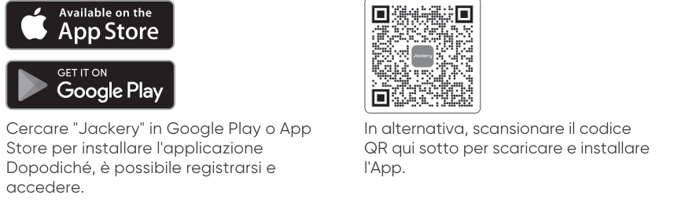

## 2. Per aggiungere il dispositivo

2.1 Fai clic sul pulsante **+** per aggiungere il dispositivo.

2.2 Premi il pulsante di alimentazione principale sul dispositivo per accenderlo; le icone Wi-Fi e Bluetooth sul dispositivo lampeggiano per indicare che il dispositivo è entrato nella modalità di configurazione di rete. Fai clic sul pulsante \"**Icon Flashed**\" (icona lampeggiante) e consenti all\'app di connettersi ai dispositivi vicini e di aprire le autorizzazioni Bluetooth.

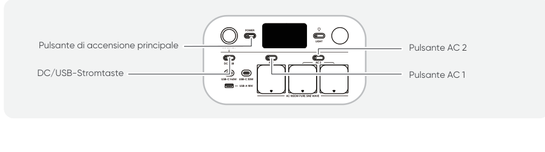

2.3 Dopo aver toccato l\'icona del dispositivo trovato, l\'app si connette automaticamente al dispositivo tramite Bluetooth.

<table class="manual-callout-table" style="width:100%; border-collapse:collapse; margin:0 0 16px 0;"><tbody><tr><td class="manual-callout-label" style="width:16%; border:1px solid #000; padding:6px 8px; vertical-align:top;">
<strong>NOTA</strong>
</td><td class="manual-callout-body" style="border:1px solid #000; padding:6px 8px; vertical-align:top;">
Se durante la procedura di associazione viene visualizzato il messaggio "<strong>il dispositivo è già stato associato</strong>", puoi usare i due metodi seguenti per la connessione:

<ul class="simple">
<li>
Il proprietario del dispositivo condividerà questo dispositivo con altri utenti tramite l'app.
</li>
<li>
Tieni premuti pulsante di alimentazione principale + pulsante alimentazione DC/USB per 3 secondi per ripristinare il Wi-Fi e il Bluetooth del dispositivo, quindi associa nuovamente il dispositivo.
</li>
</ul>
</td></tr></tbody></table>

2.4 Dopo che il dispositivo è stato collegato correttamente, inserisci la password Wi-Fi e tocca il pulsante **OK**.

<table class="manual-callout-table" style="width:100%; border-collapse:collapse; margin:0 0 16px 0;"><tbody><tr><td class="manual-callout-label" style="width:16%; border:1px solid #000; padding:6px 8px; vertical-align:top;">
<strong>NOTA</strong>
</td><td class="manual-callout-body" style="border:1px solid #000; padding:6px 8px; vertical-align:top;"><ul class="simple">
<li>
Seleziona una rete Wi-Fi nella banda da 2,4 GHz. Il dispositivo non supporta reti Wi-Fi nella banda da 5 GHz.
</li>
</ul>
</td></tr></tbody></table>

Dopo che il dispositivo è stato aggiunto con successo all\'app, l\'icona Wi-Fi sul dispositivo resterà sempre accesa.

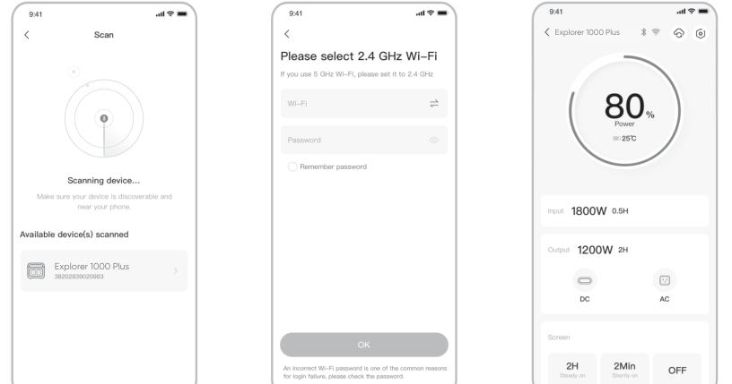

Le schermate sopra sono solo a scopo illustrativo.

<table class="manual-callout-table" style="width:100%; border-collapse:collapse; margin:0 0 16px 0;"><tbody><tr><td class="manual-callout-label" style="width:16%; border:1px solid #000; padding:6px 8px; vertical-align:top;">
<strong>ATTENZIONE</strong>
</td><td class="manual-callout-body" style="border:1px solid #000; padding:6px 8px; vertical-align:top;">
L'app Jackery può connettersi a una sola stazione di alimentazione tramite Bluetooth alla volta. Tornando all'elenco dei dispositivi, il Bluetooth si disconnette automaticamente. Tocca di nuovo la stazione di alimentazione nell'elenco per riconnetterti automaticamente.
</td></tr></tbody></table>

## 3. Disassocia il dispositivo

Fai clic sull\'icona **Impostazioni** nell\'angolo in alto a destra dell\'interfaccia principale del dispositivo per accedere alla pagina delle impostazioni, quindi fai clic sul pulsante **Disassocia** in basso alla pagina per disassociare il dispositivo.

## 4. Note

### 4.1 Per attivare Wi-Fi e Bluetooth

- Wi-Fi e Bluetooth si attivano automaticamente dopo l\'accensione del dispositivo e le icone Wi-Fi e Bluetooth sullo schermo si illuminano.

- Tieni premuti contemporaneamente pulsante alimentazione DC/USB + pulsante AC 1/2 finché le icone Wi-Fi e Bluetooth sullo schermo si illuminano.

### 4.2 Per disattivare Wi-Fi e Bluetooth

Tieni premuti contemporaneamente pulsante alimentazione DC/USB + pulsante AC 1/2 finché le icone Wi-Fi e Bluetooth sullo schermo si spengono.

### 4.3 Per ripristinare Wi-Fi e Bluetooth

Tieni premuti contemporaneamente pulsante di alimentazione principale + pulsante alimentazione DC/USB per 3 secondi per ripristinare Wi-Fi e Bluetooth alle impostazioni di fabbrica. L\'account dell\'app collegato verrà disassociato.
