
<strong>WAŻNE</strong>

Gratulujemy zakupu nowego urządzenia Jackery Explorer 1000 Plus. Prosimy o dokładne przeczytanie niniejszej instrukcji przed użyciem produktu, ze szczególnym uwzględnieniem środków ostrożności, aby zapewnić prawidłowe użytkowanie. Niniejszą instrukcję należy przechowywać w dostępnym miejscu, aby móc z niej korzystać w przyszłości.

Zgodnie z przepisami prawo ostatecznej interpretacji niniejszego dokumentu oraz wszystkich dokumentów związanych z tym produktem przysługuje firmie. Chociaż dołożono wszelkich starań, aby niniejsza instrukcja była dokładna, firma Jackery nie ponosi odpowiedzialności za ewentualne błędy.

Należy pamiętać, że w przypadku jakichkolwiek aktualizacji, zmian lub zakończenia publikacji nie będą wysyłane żadne dodatkowe powiadomienia. Najnowszą wersję instrukcji obsługi produktu można znaleźć na stronie support.jackery.com.

* Obrazy służą wyłącznie do celów poglądowych. Należy kierować się rzeczywistym produktem.

# WAŻNE INFORMACJE DOTYCZĄCE BEZPIECZEŃSTWA

<table class="manual-callout-table manual-callout-table"><tbody><tr><td class="manual-callout-label">OSTRZE</td><td class="manual-callout-body">
<strong>INSTRUKCJE DOTYCZĄCE RYZYKA POŻARU, PORAŻENIA PRĄDEM LUB OBRAŻEŃ CIAŁA EŻENIE</strong>
</td></tr></tbody></table>

Podczas korzystania z tego produktu należy zawsze przestrzegać wskazanych podstawowych środków ostrożności.

<ul><li>
Przed przystąpieniem do korzystania z produktu należy przeczytać wszystkie instrukcje.
</li><li>
Dzieciom nie wolno bawić się produktem. Gdy produkt będzie używany w pobliżu dzieci, należy szczególnie uważnie ich pilnować.
</li><li>
W przypadku korzystania z akcesoriów, które nie są zalecane ani sprzedawane przez producenta produktu, może występować ryzyko porażenia prądem.
</li><li>
Gdy produkt nie jest używany, należy odłączyć wtyczkę zasilania od gniazda produktu.
</li><li>
Nie wolno rozmontowywać produktu, ponieważ może to prowadzić do nieprzewidywalnych zagrożeń, takich jak pożar, wybuch lub porażenie prądem.
</li><li>
Nie używać produktu z uszkodzonymi przewodami, wtyczkami lub kablami wyjściowymi, gdyż może to spowodować porażenie prądem.
</li><li>
Aby zapewnić prawidłową cyrkulację powietrza, nie wolno zasłaniać otworów wentylacyjnych produktu. Produktu należy używać w suchym i chłodnym miejscu, o odpowiedniej cyrkulacji powietrza. Inaczej może dochodzić do jego przegrzania. - Ładowanie w wilgotnych lub słabo wentylowanych pomieszczeniach może stwarzać zagrożenie dla bezpieczeństwa. - Woda może powodować zwarcia lub uszkodzenie stacji ładowania, stwarzając zagrożenia dla bezpieczeństwa.
</li><li>
Nie narażać produktu na działanie ognia, wysokich temperatur, bezpośredniego światła słonecznego ani środowisk o wysokiej temperaturze, takich jak wnętrze zaparkowanego pojazdu. Mogłoby to doprowadzić do pożaru lub wybuchu. środków ostrożności.
</li></ul>

# INSTRUKCJE KONSERWACJI DLA UŻYTKOWNIKA

W cyklu życia produktów do magazynowania energii należy spodziewać się pewnej degradacji pojemności i energii. Wraz ze wzrostem liczby cykli ładowania i rozładowywania oraz wydłużeniem czasu przechowywania, degradacja ta będzie się stopniowo nasilać, co jest normalnym zjawiskiem zgodnym z naturalnym starzeniem się ogniw baterii.

# ZNACZENIE SYMBOLI

<figure aria-label="ZNACZENIE SYMBOLI" class="hb-symbol-signal-composition" data-component-id="HB-TABLE-SYMBOL-SIGNAL"><table class="hb-symbol-signal-table"><colgroup><col class="hb-symbol-signal-col-label"/><col class="hb-symbol-signal-col-meaning"/></colgroup><thead><tr><th class="hb-symbol-signal-label-heading" scope="col">Symbol</th><th class="hb-symbol-signal-meaning-heading" scope="col">Znaczenie</th></tr></thead><tbody><tr><td class="hb-symbol-signal-label-cell">⚠OSTRZEŻENIE</td><td class="hb-symbol-signal-meaning-cell">Niebezpieczne praktyki, które mogą prowadzić do poważnych obrażeń, śmierci i/lub szkód materialnych.</td></tr><tr><td class="hb-symbol-signal-label-cell">⚠PRZESTROGA</td><td class="hb-symbol-signal-meaning-cell">Niebezpieczne praktyki, które mogą skutkować obrażeniami ciała i/lub szkodami materialnymi.</td></tr><tr><td class="hb-symbol-signal-label-cell">⚠Uwaga</td><td class="hb-symbol-signal-meaning-cell">Niebezpieczne praktyki, które mogą prowadzić do uszkodzenia sprzętu, utraty danych, pogorszenia wydajności lub nieprzewidzianych wyników.</td></tr><tr><td class="hb-symbol-signal-label-cell">⚠WSKAZÓWKA</td><td class="hb-symbol-signal-meaning-cell">Uzupełnia ważne informacje lub wskazówki dotyczące obsługi zawarte w tekście.</td></tr></tbody></table></figure>

<figure aria-label="ZNACZENIE SYMBOLI" class="hb-symbol-pair-composition" data-component-id="HB-TABLE-SYMBOL-ICON">

<table class="hb-symbol-panel-table"><colgroup><col class="hb-symbol-col-icon"/><col class="hb-symbol-col-meaning"/></colgroup><thead><tr><th class="hb-symbol-icon-heading" scope="col">Symbol</th><th class="hb-symbol-meaning-heading" scope="col">Znaczenie</th></tr></thead><tbody><tr><td class="hb-symbol-icon"></td><td class="hb-symbol-meaning">Symbole ostrzeżeń i środków ostrożności. Należy koniecznie przeczytać, aby poznać potencjalne zagrożenia lub ryzyka.</td></tr><tr><td class="hb-symbol-icon"></td><td class="hb-symbol-meaning">Przed przystąpieniem do użytkowania przeczytaj instrukcję obsługi.</td></tr><tr><td class="hb-symbol-icon"></td><td class="hb-symbol-meaning">Nie rozmontowuj produktu.</td></tr><tr><td class="hb-symbol-icon"></td><td class="hb-symbol-meaning">Trzymaj produkt z dala od ognia.</td></tr></tbody></table>

<table class="hb-symbol-panel-table"><colgroup><col class="hb-symbol-col-icon"/><col class="hb-symbol-col-meaning"/></colgroup><thead><tr><th class="hb-symbol-icon-heading" scope="col">Symbol</th><th class="hb-symbol-meaning-heading" scope="col">Znaczenie</th></tr></thead><tbody><tr><td class="hb-symbol-icon"></td><td class="hb-symbol-meaning">Przechowuj w miejscu niedostępnym dla dzieci.</td></tr><tr><td class="hb-symbol-icon"></td><td class="hb-symbol-meaning">Ten symbol oznacza, że wewnątrz produktu znajduje się bateria litowo-jonowa (Li-ion), którą należy prawidłowo utylizować lub poddać recyklingowi.</td></tr><tr><td class="hb-symbol-icon"></td><td class="hb-symbol-meaning">Ten symbol oznacza, że produktu nie wolno wyrzucać razem z odpadami domowymi i należy go dostarczyć do wyznaczonego punktu zbiórki w celu recyklingu. Prawidłowa utylizacja i recykling przyczynią się do ochrony środowiska. Aby uzyskać więcej informacji na temat utylizacji i recyklingu tego produktu, skontaktuj się z lokalną gminą, firmą zajmującą się utylizacją lub sprzedawcą.</td></tr></tbody></table>

</figure>

# ZAWARTOŚĆ OPAKOWANIA

<figure aria-label="ZAWARTOŚĆ OPAKOWANIA" class="hb-inbox-composition" data-card-count="3" data-component-id="HB-SPECIAL-INBOX" data-inbox-variant="three-card-responsive"><ol class="hb-inbox-grid"><li class="hb-inbox-card" data-item-number="1">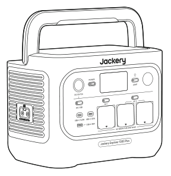

Jackery Explorer 1000 Plus

</li><li class="hb-inbox-card" data-item-number="2">

Przewód sieciowy do ładowania

</li><li class="hb-inbox-card" data-item-number="3">

Dokumenty

</li></ol>

* WSKAZÓWKI

Przewód do ładowania samochodowego nie jest dołączony do zestawu, ale można go kupić osobno na naszej stronie internetowej. W celu uzyskania pomocy skontaktuj się z działem obsługi klienta Jackery.

</figure>

# WIDOK OGÓLNY PRODUKTU

## WIDOK Z PRZODU

<figure class="hb-reference-figure" data-component-id="HB-SPECIAL-REFERENCE-FIGURE" data-reference-id="overview_front_view" data-source-fragment-sha256="1dddb4b435c4772947ae6bbe92577e3878da856cbc457ece327e4a22c7662302">
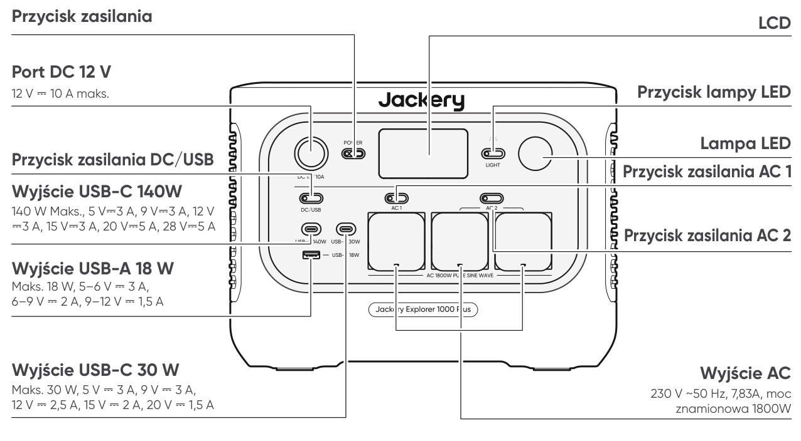
WIDOK Z PRZODU Przycisk lampy LED Wyjście USB-C 140W 140 W Maks., 5 V⎓3 A, 9 V⎓3 A, 12 V ⎓3 A, 15 V⎓3 A, 20 V⎓5 A, 28 V⎓5 A 230 V ~50 Hz, 7,83A, moc znamionowa 1800W Wyjście USB-C 30 W Maks. 30 W, 5 V ⎓ 3 A, 9 V ⎓ 3 A, 12 V ⎓ 2,5 A, 15 V ⎓ 2 A, 20 V ⎓ 1,5 A Wyjście USB-A 18 W Maks. 18 W, 5–6 V ⎓ 3 A, 6–9 V ⎓ 2 A, 9–12 V ⎓ 1,5 A Przycisk zasilania LCD Przycisk zasilania DC/USB 12 V ⎓ 10 A maks. Port DC 12 V Lampa LED Wyjście AC Przycisk zasilania AC 1 Przycisk zasilania AC 2

</figure>

## WIDOK Z LEWEJ STRONY

<figure class="hb-reference-figure" data-component-id="HB-SPECIAL-REFERENCE-FIGURE" data-reference-id="overview_left_view" data-source-fragment-sha256="b9821296a676002635d08b32489f1285499d0662eebd3568832c46d2697bd6b6">

WIDOK Z LEWEJ STRONY Wejście: 36,8 V – 56 V ⎓ maks. 59 A Wyjście: 36,8 V – 56 V ⎓ maks. 36 A Port rozszerzeń DC

</figure>

## WIDOK Z PRAWEJ STRONY

<figure class="hb-reference-figure" data-component-id="HB-SPECIAL-REFERENCE-FIGURE" data-reference-id="overview_right_view" data-source-fragment-sha256="b8e53ed9eb74a40c61c978ff820fb234cfc58fab2609f75e47cb725f214eeeff">
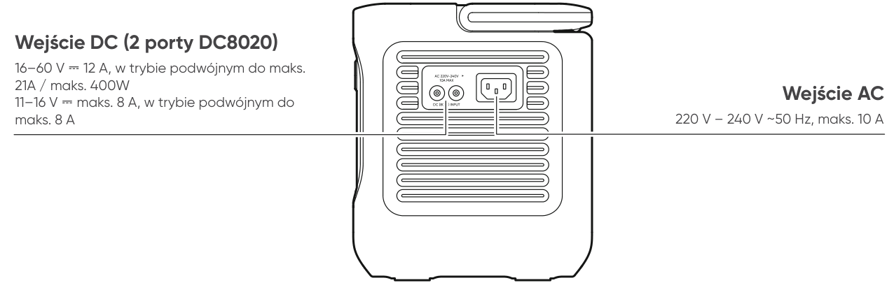
WIDOK Z PRAWEJ STRONY 16–60 V ⎓ 12 A, w trybie podwójnym do maks. 21A / maks. 400W 11–16 V ⎓ maks. 8 A, w trybie podwójnym do maks. 8 A Wejście DC (2 porty DC8020) 220 V – 240 V ~50 Hz, maks. 10 A Wejście AC

</figure>

# WYŚWIETLACZ LCD

<figure class="hb-reference-figure" data-component-id="HB-SPECIAL-REFERENCE-FIGURE" data-reference-id="lcd-map" data-source-fragment-sha256="bbaa1be4e3820e16eb4a845ffcf982220bf4cf19df21f03f74473d8b56820afc">
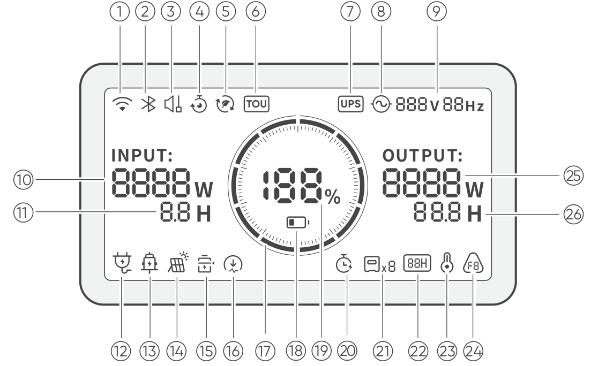
</figure>

<figure aria-label="WYŚWIETLACZ LCD" class="hb-lcd-table-composition" data-component-id="HB-TABLE-LCD-ICON" tabindex="0"><table class="hb-lcd-icon-table"><colgroup><col class="hb-lcd-col-number"/><col class="hb-lcd-col-icon"/><col class="hb-lcd-col-name"/><col class="hb-lcd-col-description"/></colgroup><tbody><tr><td class="hb-lcd-number">
1
</td><td class="hb-lcd-icon"></td><td class="hb-lcd-name">
Wi-Fi
</td><td class="hb-lcd-description">
<strong>Wł.:</strong> Połączono z Wi-Fi. <strong>Miga:</strong> Gotowość do połączenia z Wi-Fi. <strong>Wył.:</strong> Rozłączono z Wi-Fi.
</td></tr><tr><td class="hb-lcd-number">
2
</td><td class="hb-lcd-icon"></td><td class="hb-lcd-name">
Bluetooth
</td><td class="hb-lcd-description">
<strong>Wł.:</strong> Połączono z Bluetooth. <strong>Miga:</strong> Gotowość do połączenia z Bluetooth. <strong>Wył.:</strong> Rozłączono z Bluetooth.
</td></tr><tr><td class="hb-lcd-number">
3
</td><td class="hb-lcd-icon"></td><td class="hb-lcd-name">
Tryb cichego ładowania
</td><td class="hb-lcd-description">
<strong>Wł.:</strong> Hałas podczas ładowania jest znacznie zminimalizowany, przy czym moc ładowania jest zmniejszona, a prędkość ładowania maleje. <strong>Wył.:</strong> Tryb cichego ładowania jest wyłączony. Tę funkcję można włączyć lub wyłączyć w aplikacji Jackery. Ustawienie jest zapamiętywane po wyłączeniu urządzenia.
</td></tr><tr><td class="hb-lcd-number">
4
</td><td class="hb-lcd-icon"></td><td class="hb-lcd-name">
Plan ładowania
</td><td class="hb-lcd-description">
Dostosowuje czas ładowania urządzenia Jackery Explorer 1000 Plus. W sytuacjach, gdy ceny energii elektrycznej są zmienne, pozwala planować ładowanie w godzinach szczytu i poza szczytem, co obniża koszty energii elektrycznej. Tę funkcję można włączyć lub wyłączyć w aplikacji Jackery. Ustawienie jest zapamiętywane po wyłączeniu urządzenia.
</td></tr><tr><td class="hb-lcd-number">
5
</td><td class="hb-lcd-icon"></td><td class="hb-lcd-name">
Tryb samozasilania
</td><td class="hb-lcd-description">
Maksymalizuje wykorzystanie energii słonecznej i zmniejsza zależność od energii elektrycznej z sieci, dając pierwszeństwo zmagazynowanej energii słonecznej, co obniża koszty energii elektrycznej. Stacja zasilająca musi być jednocześnie podłączona do paneli słonecznych i sieci energetycznej, a moc urządzeń odbiorczych jest ograniczona przez moc obejściową. Tę funkcję można włączyć lub wyłączyć w aplikacji Jackery. Ustawienie jest zapamiętywane po wyłączeniu urządzenia.
</td></tr><tr><td class="hb-lcd-number">
6
</td><td class="hb-lcd-icon"></td><td class="hb-lcd-name">
Tryb taryfy czasowej (TOU)
</td><td class="hb-lcd-description">
<strong>Wł.:</strong> Tryb taryfy czasowej (TOU) jest włączony (domyślna rezerwa – stan naładowania SOC: 60%). W godzinach szczytu, gdy zmagazynowana energia przekracza rezerwowy poziom naładowania (SOC), produkt w pierwszej kolejności rozładowuje baterię, aby obniżyć koszty energii elektrycznej. W okresach poza szczytem produkt ładuje akumulator z sieci, aby spłaszczyć szczyty i wypełnić dołki. <strong>Wył.:</strong> Tryb taryfy czasowej (TOU) jest wyłączony. Produkt nie stosuje strategii taryfy czasowej i działa zgodnie z domyślną logiką zasilania i ładowania. Tę funkcję można włączyć lub wyłączyć w aplikacji Jackery. Ustawienie jest zapamiętywane po wyłączeniu urządzenia.
</td></tr><tr><td class="hb-lcd-number">
7
</td><td class="hb-lcd-icon"></td><td class="hb-lcd-name">
UPS
</td><td class="hb-lcd-description">
<strong>Wł.:</strong> Produkt pracuje w trybie obejściowym, a czas przełączenia z zasilania sieciowego na baterię wewnętrzną wynosi 10 ms. <strong>Wył.:</strong> Produkt nie pracuje w trybie obejściowym.
</td></tr><tr><td class="hb-lcd-number">
8
</td><td class="hb-lcd-icon"></td><td class="hb-lcd-name">
Wskaźnik zasilania AC
</td><td class="hb-lcd-description">
Wyjście AC (czysta sinusoida) jest włączone.
</td></tr><tr><td class="hb-lcd-number">
9
</td><td class="hb-lcd-icon"></td><td class="hb-lcd-name">
Napięcie wyjściowe i częstotliwość
</td><td class="hb-lcd-description">
Gdy wyjście AC jest włączone, wyświetla wartości wyjściowe napięcia i częstotliwości.
</td></tr><tr><td class="hb-lcd-number">
10
</td><td class="hb-lcd-icon"></td><td class="hb-lcd-name">
Moc wejściowa
</td><td class="hb-lcd-description">
Wyświetla moc wejściową w watach.
</td></tr><tr><td class="hb-lcd-number">
11
</td><td class="hb-lcd-icon"></td><td class="hb-lcd-name">
Pozostały czas ładowania
</td><td class="hb-lcd-description">
Wyświetla pozostały czas ładowania.
</td></tr><tr><td class="hb-lcd-number">
12
</td><td class="hb-lcd-icon"></td><td class="hb-lcd-name">
Wskaźnik ładowania z sieci AC
</td><td class="hb-lcd-description">
Produkt jest ładowany przez wejście AC z sieci elektrycznej.
</td></tr><tr><td class="hb-lcd-number">
13
</td><td class="hb-lcd-icon"></td><td class="hb-lcd-name">
Wskaźnik ładowania z gniazda samochodowego
</td><td class="hb-lcd-description">
Produkt jest ładowany przez wejście DC (DC8020) przy użyciu zasilania DC 12 V (z ładowarki samochodowej).
</td></tr><tr><td class="hb-lcd-number">
14
</td><td class="hb-lcd-icon"></td><td class="hb-lcd-name">
Wskaźnik ładowania z paneli słonecznych
</td><td class="hb-lcd-description">
Produkt jest ładowany przez wejście DC (DC8020) za pomocą paneli słonecznych.
</td></tr><tr><td class="hb-lcd-number">
15
</td><td class="hb-lcd-icon"></td><td class="hb-lcd-name">
Tryb oszczędzania baterii
</td><td class="hb-lcd-description">
<strong>Wł.:</strong> Ogranicza maksymalną użyteczną pojemność baterii, aby przedłużyć jej żywotność. <strong>Wył.:</strong> Tryb oszczędzania baterii jest wyłączony. Tę funkcję można włączyć lub wyłączyć w aplikacji Jackery. Ustawienie jest zapamiętywane po wyłączeniu urządzenia. Uwaga 1: Ta funkcja nie jest dostępna, gdy produkt jest podłączony do co najmniej jednego zestawu baterii. Uwaga 2: Gdy ta funkcja jest włączona, produkt od czasu do czasu wykonuje pełny cykl ładowania i rozładowania, aby skalibrować stan naładowania (SOC).
</td></tr><tr><td class="hb-lcd-number">
16
</td><td class="hb-lcd-icon"></td><td class="hb-lcd-name">
Limit mocy ładowania
</td><td class="hb-lcd-description">
<strong>Wł.:</strong> Limit mocy ładowania jest włączony w aplikacji Jackery. <strong>Wył.:</strong> Limit mocy ładowania jest wyłączony w aplikacji Jackery. Ustawienie jest zapamiętywane po wyłączeniu urządzenia.
</td></tr><tr><td class="hb-lcd-number">
17
</td><td class="hb-lcd-icon"></td><td class="hb-lcd-name">
Wskaźnik poziomu baterii
</td><td class="hb-lcd-description">
W trakcie ładowania produktu pomarańczowy pierścień wokół wartości procentowej baterii będzie się zapalał sekwencyjnie. Podczas ładowania innych urządzeń pomarańczowy pierścień będzie stale zaświecony.
</td></tr><tr><td class="hb-lcd-number">
18
</td><td class="hb-lcd-icon"></td><td class="hb-lcd-name">
Wskaźnik niskiego poziomu baterii
</td><td class="hb-lcd-description">
<strong>Wł.:</strong> Poziom naładowania baterii jest niższy niż 20%. <strong>Miga:</strong> Poziom naładowania baterii jest niższy niż 5%. <strong>Wył.:</strong> Poziom baterii nie jest niższy niż 20% lub produkt jest ładowany.
</td></tr><tr><td class="hb-lcd-number">
19
</td><td class="hb-lcd-icon"></td><td class="hb-lcd-name">
Pozostały procent baterii
</td><td class="hb-lcd-description">
Wyświetla pozostały procent baterii.
</td></tr><tr><td class="hb-lcd-number">
20
</td><td class="hb-lcd-icon"></td><td class="hb-lcd-name">
Licznik czasu rozładowania
</td><td class="hb-lcd-description">
<strong>Wł.:</strong> Ustawiono licznik czasu rozładowania. <strong>Wył.:</strong> Nie ustawiono licznika czasu rozładowania. Tę funkcję można włączyć lub wyłączyć w aplikacji Jackery. Ustawienie nie jest zapamiętywane po wyłączeniu urządzenia.
</td></tr><tr><td class="hb-lcd-number">
21
</td><td class="hb-lcd-icon"></td><td class="hb-lcd-name">
Podłączone zestawy baterii
</td><td class="hb-lcd-description">
Wyświetla liczbę zestawów baterii, jeśli są podłączone.
</td></tr><tr><td class="hb-lcd-number">
22
</td><td class="hb-lcd-icon"></td><td class="hb-lcd-name">
Tryb oszczędzania energii
</td><td class="hb-lcd-description">
Gdy wyjście AC lub DC zostanie włączone po naciśnięciu przycisku zasilania AC1/2 lub DC/USB: <strong>Wł.:</strong> Tryb oszczędzania energii jest włączony. <strong>Wył.:</strong> Tryb oszczędzania energii jest wyłączony.
</td></tr><tr><td class="hb-lcd-number">
23
</td><td class="hb-lcd-icon"></td><td class="hb-lcd-name">
Wskaźnik wysokiej temperatury Wskaźnik niskiej temperatury
</td><td class="hb-lcd-description">
Zadziałało zabezpieczenie przed wysoką temperaturą. Produkt może nie działać do czasu przywrócenia temperatury do normalnego zakresu roboczego. Zadziałało zabezpieczenie przed niską temperaturą. Produkt może nie działać do czasu przywrócenia temperatury do normalnego zakresu roboczego.
</td></tr><tr><td class="hb-lcd-number">
24
</td><td class="hb-lcd-icon"></td><td class="hb-lcd-name">
Kod błędu
</td><td class="hb-lcd-description">
Wystąpił błąd produktu. Szczegóły można znaleźć w sekcji Rozwiązywanie problemów.
</td></tr><tr><td class="hb-lcd-number">
25
</td><td class="hb-lcd-icon"></td><td class="hb-lcd-name">
Moc wyjściowa
</td><td class="hb-lcd-description">
Wyświetla moc wyjściową w watach.
</td></tr><tr><td class="hb-lcd-number">
26
</td><td class="hb-lcd-icon"></td><td class="hb-lcd-name">
Pozostały czas zasilania urządzeń odbiorczych
</td><td class="hb-lcd-description">
Wyświetla pozostały czas do rozładowania.
</td></tr></tbody></table></figure>

# OBSŁUGA

## WŁ./WYŁ. ZASILANIA

<figure class="hb-operation-figure hb-operation-layout-status-right hb-base-art-live-copy" data-component-id="HB-SPECIAL-OPERATION" data-operation-id="main-power" data-source-fragment-sha256="c345a9f8cff50f5c47ec1b00bd8159f70e8a898ef97aaf6510292176e1dcfab0" data-web-base-art-ref="operation/main_power" data-web-presentation-mode="base-art-live-copy" data-web-replace-key="operation.main-power">

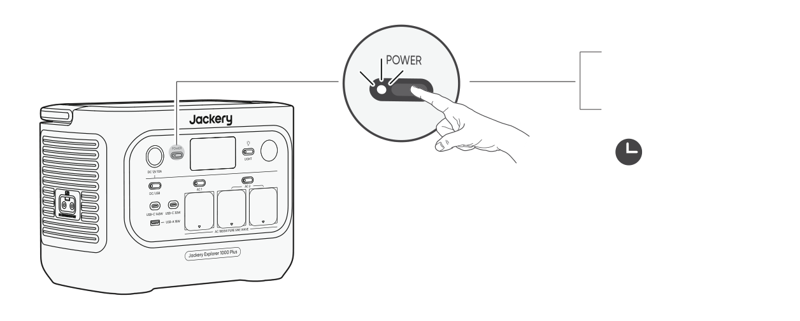
3s

<strong>Wł.</strong>

Naciśnij raz

<strong>Wył.</strong>

Naciśnij i przytrzymaj przez 3 s

Domyślny czas czuwania: 2 godziny

Produkt automatycznie wyłączy się po 2 godzinach bezczynności, bez ładowania i zasilania urządzeń

odbiorczych. *Czas czuwania można ustawić w aplikacji Jackery.

</figure>

Gdy tryb oszczędzania energii jest włączony, a przycisk zasilania AC 1 / AC 2 lub DC/USB jest włączony w pozycji ON, ale produkt nie ładuje się ani nie zasila urządzeń odbiorczych, produkt wyłączy się automatycznie po 12 godzinach.

## WŁ./WYŁ. WYJŚCIA AC

Wymaganie wstępne: Produkt musi być włączony.

<figure class="hb-operation-figure hb-operation-layout-status-right hb-base-art-live-copy" data-component-id="HB-SPECIAL-OPERATION" data-operation-id="ac-output" data-source-fragment-sha256="9fee58b9139b0407e48683e30d63780b9748d8e0802870783f21348e42d65854" data-web-base-art-ref="operation/ac_output" data-web-presentation-mode="base-art-live-copy" data-web-replace-key="operation.ac-output">

<strong>Wł.</strong>

Naciśnij raz

<strong>Wył.</strong>

Naciśnij raz

<strong>Wł.</strong>

Naciśnij raz

<strong>Wył.</strong>

Naciśnij raz

Przyciski zasilania AC1 i AC2 sterują dwiema oddzielnymi parami wyjść AC. Naciśnięcie każdego przycisku włącza lub wyłącza odpowiadającą mu parę wyjść AC.

</figure>

## WŁ./WYŁ. WYJŚCIA DC/USB

Wymaganie wstępne: Produkt musi być włączony.

<figure class="hb-operation-figure hb-operation-layout-status-right hb-base-art-live-copy" data-component-id="HB-SPECIAL-OPERATION" data-operation-id="dc-usb-output" data-source-fragment-sha256="27af648d5d7ffb7b8d299b903059a73172cb5290395d55e58ca7bbf32ea9c3bd" data-web-base-art-ref="operation/dc_usb_output" data-web-presentation-mode="base-art-live-copy" data-web-replace-key="operation.dc-usb-output">

<strong>Wł.</strong>

Naciśnij raz

<strong>Wył.</strong>

Naciśnij raz

</figure>

<table class="manual-callout-table manual-callout-table"><tbody><tr><td class="manual-callout-label">PRZESTROGA</td><td class="manual-callout-body"><ul><li>Port USB-C 140W to port wyjściowy dużej mocy zgodny ze standardem USB-PD Power Source 3 (PS3). Jeśli podłączone urządzenie użytkownika lub akcesorium nie spełnia wymogów bezpieczeństwa, może występować ryzyko pożaru. Przed użyciem tych portów należy się upewnić, że podłączone urządzenie lub akcesorium ma zabezpieczenie przeciwpożarowe.</li><li>Stację Jackery Explorer 1000 Plus należy podłączać wyłącznie do urządzeń lub akcesoriów spełniających wymagania przewidziane w punktach 6.3, 6.4 i 6.5 normy IEC/EN/UL 62368-1 (lub innych równoważnych norm).</li><li>Aby uzyskać maksymalną moc wyjściową, należy użyć kabla USB-C do USB-C 5 A (20 V DC/5 A, 100 W; 28 V DC / 5 A, 140 W).</li></ul></td></tr></tbody></table>

Produkt można wykorzystać do ładowania akumulatora samochodowego za pomocą kabla Jackery 12 V do ładowania akumulatora samochodowego, który jest sprzedawany osobno i dostępny na naszej stronie internetowej.

<table class="manual-callout-table manual-callout-table"><tbody><tr><td class="manual-callout-label">PRZESTROGA</td><td class="manual-callout-body"><ul><li>Port DC 12 V jest zgodny wyłącznie z akumulatorami samochodowymi 12 V i nie nadaje się do instalacji 24 V.</li><li>Nie uruchamiać samochodu, gdy produkt ładuje akumulator samochodowy przez port wyjściowy DC 12 V, ponieważ może to uszkodzić produkt.</li><li>Funkcja ta jest przeznaczona wyłącznie do użytku awaryjnego i nie jest w stanie naładować całkowicie rozładowanego lub uszkodzonego akumulatora samochodowego.</li></ul></td></tr></tbody></table>

## WŁ./WYŁ. LAMPY LED

<figure class="hb-operation-figure hb-operation-layout-footer-panel hb-base-art-live-copy" data-component-id="HB-SPECIAL-OPERATION" data-operation-id="led-light" data-source-fragment-sha256="ba6729da30f9e265098c34158c94ba526522e4dcfcd431b7ffb612c799955f80" data-web-base-art-ref="operation/led_light" data-web-presentation-mode="base-art-live-copy" data-web-replace-key="operation.led-light">

<strong>Lampa LED ma dwa tryby:</strong> tryb oświetlenia i tryb SOS. W dowolnym trybie naciśnij i przytrzymaj przycisk lampy LED LIGHT, aby wyłączyć światło.

Naciśnij przycisk LED LIGHT raz, aby włączyć światło.

SOS
Naciśnij go ponownie, aby przełączyć na tryb SOS.

Naciśnij go po raz trzeci, aby wyłączyć światło.

</figure>

## WYŚWIETLACZ LCD

<figure aria-label="WYŚWIETLACZ LCD" class="hb-lcd-mode-composition" data-component-id="HB-TABLE-LCD-MODE">

<table class="hb-lcd-mode-table"><colgroup><col class="hb-lcd-mode-col-state"/><col class="hb-lcd-mode-col-action"/><col class="hb-lcd-mode-col-copy"/></colgroup><tbody><tr><td class="hb-lcd-mode-state" rowspan="3">Zaświeca się na krótką chwilę</td><td class="hb-lcd-mode-action">Włączanie</td><td class="hb-lcd-mode-copy">Naciśnij przycisk POWER, gdy produkt się ładuje.</td></tr><tr><td class="hb-lcd-mode-action">Wyłączanie</td><td class="hb-lcd-mode-copy">Naciśnij przycisk POWER.</td></tr><tr><td class="hb-lcd-mode-action">Automatyczne wyłączanie</td><td class="hb-lcd-mode-copy">Ekran LCD wyłącza się automatycznie i przechodzi w tryb uśpienia po 2 minutach bezczynności.</td></tr><tr><td class="hb-lcd-mode-state" rowspan="3">Świeci ciągle (w stanie ładowania lub rozładowania)</td><td class="hb-lcd-mode-action">Włączanie</td><td class="hb-lcd-mode-copy">Naciśnij dwukrotnie przycisk POWER, gdy produkt jest włączony.</td></tr><tr><td class="hb-lcd-mode-action">Wyłączanie</td><td class="hb-lcd-mode-copy">Naciśnij przycisk POWER.</td></tr><tr><td class="hb-lcd-mode-action">Automatyczne wyłączanie</td><td class="hb-lcd-mode-copy">Ekran LCD wyłącza się automatycznie po 2 godzinach bezczynności.</td></tr></tbody></table>
</figure>

Tryb pracy wyświetlacza ekranu można również ustawić w aplikacji Jackery.

## TRYB OSZCZĘDZANIA ENERGII

Aby zapobiec niepotrzebnemu zużyciu baterii spowodowanemu zapomnieniem o wyłączeniu wyjścia, produkt domyślnie włącza tryb oszczędzania energii. Gdy wyjście AC 1 / AC 2 lub DC/USB jest włączone, na ekranie LCD będzie wyświetlana ikona trybu oszczędzania energii. Jeżeli przez 12 godzin nie jest podłączone żadne urządzenie lub pobór mocy podłączonego urządzenia nie przekracza wartości progowej (25 W dla wyjścia AC lub 2 W dla wyjścia DC/USB), produkt automatycznie wyłącza zasilanie na wyjściach. Czas oczekiwania w trybie oszczędzania energii można ustawić w aplikacji Jackery.

<figure class="hb-reference-figure" data-component-id="HB-SPECIAL-REFERENCE-FIGURE" data-reference-id="energy_saving" data-source-fragment-sha256="2884473bdcaf62c9f6ae793cd86c77f635663822f5e5e953ea02cf9f3bb6eaa3">
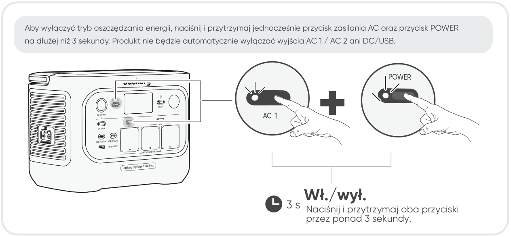
Wł./wył. Aby wyłączyć tryb oszczędzania energii, naciśnij i przytrzymaj jednocześnie przycisk zasilania AC oraz przycisk POWER na dłużej niż 3 sekundy. Produkt nie będzie automatycznie wyłączać wyjścia AC 1 / AC 2 ani DC/USB. 3 s Naciśnij i przytrzymaj oba przyciski przez ponad 3 sekundy.

</figure>

UWAGA Po włączeniu zasilania tryb oszczędzania energii powraca do poprzedniego stanu. Zmiana trybu wymaga ręcznego przełączenia.

## FUNKCJA AUTOMATYCZNEGO WZNAWIANIA WYJŚĆ AC I DC

Ta funkcja zapamiętuje stan wyjść i automatycznie wznawia zasilanie na wyjściach AC i DC w określonych warunkach.

<figure aria-label="Warunki automatycznego wznawiania / Warunki braku automatycznego wznawiania" class="hb-auto-resume-composition" data-component-id="HB-TABLE-AUTO-RESUME" tabindex="0"><table class="hb-auto-resume-table"><colgroup><col class="hb-auto-resume-col"/><col class="hb-auto-resume-col"/></colgroup><thead><tr><th class="hb-auto-resume-left" scope="col">Warunki automatycznego wznawiania</th><th class="hb-auto-resume-right" scope="col">Warunki braku automatycznego wznawiania</th></tr></thead><tbody><tr><td class="hb-auto-resume-left">Włączenie/ponowne uruchomienie po wyłączeniu lub restarcie</td><td class="hb-auto-resume-right">Włączenie/ponowne uruchomienie po wyłączeniu lub restarcie Ręczne wyłączenie wyjścia (przyciskiem lub w aplikacji)</td></tr><tr><td class="hb-auto-resume-left" rowspan="2">Poziom naładowania baterii (SOC) ≥ limit rozładowania +10% po osiągnięciu limitu</td><td class="hb-auto-resume-right">Wyłączenie wyjścia przez tryb oszczędzania energii</td></tr><tr><td class="hb-auto-resume-right">Wyłączenie wyjścia w wyniku zadziałania zabezpieczenia</td></tr><tr><td class="hb-auto-resume-left">Zakończenie aktualizacji oprogramowania układowego</td><td class="hb-auto-resume-right">Wyłączenie wyjścia przez licznik czasu rozładowania</td></tr></tbody></table></figure>

## KOMBINACJE KLAWISZY

<figure aria-label="Przyciski / Czynność / Funkcja" class="hb-key-combination-composition" data-component-id="HB-TABLE-KEY-COMBINATIONS" tabindex="0"><table class="hb-key-combination-table"><colgroup><col class="hb-key-col-buttons"/><col class="hb-key-col-operation"/><col class="hb-key-col-function"/></colgroup><thead><tr><th class="hb-key-buttons" scope="col">Przyciski</th><th class="hb-key-operation" scope="col">Czynność</th><th class="hb-key-function" scope="col">Funkcja</th></tr></thead><tbody><tr><td class="hb-key-buttons">Przycisk zasilania + Przycisk zasilania AC1</td><td class="hb-key-operation">3 s Naciśnij i przytrzymaj oba przyciski przez 3 s.</td><td class="hb-key-function">Włączanie/wyłączanie trybu oszczędzania energii</td></tr><tr><td class="hb-key-buttons">Przycisk zasilania + Przycisk zasilania DC/USB</td><td class="hb-key-operation">3 s Naciśnij i przytrzymaj oba przyciski przez 3 s.</td><td class="hb-key-function">Resetowanie Wi-Fi i Bluetooth</td></tr><tr><td class="hb-key-buttons">Przycisk zasilania DC/USB + Przycisk zasilania AC1</td><td class="hb-key-operation">1 s Naciśnij i przytrzymaj oba przyciski przez 1 s.</td><td class="hb-key-function">Wł./wył. Wi-Fi i Bluetooth</td></tr><tr><td class="hb-key-buttons">Przycisk zasilania + Przycisk lampy LED</td><td class="hb-key-operation">1 s Naciśnij i przytrzymaj oba przyciski przez 1 s.</td><td class="hb-key-function">Włączanie/wyłączanie trybu ładowania awaryjnego</td></tr></tbody></table></figure>

# ZASILACZ BEZPRZERWOWY (UPS)

Podłącz produkt do gniazdka ściennego za pomocą przewodu sieciowego do ładowania AC, następnie naciśnij przycisk przy wyjściu AC 1 / AC 2, aby równocześnie zasilać urządzenia odbiorcze.

<figure class="hb-reference-figure" data-component-id="HB-SPECIAL-REFERENCE-FIGURE" data-reference-id="ups_connection" data-source-fragment-sha256="317117bc28293f776ecc9858e450efeadf1268b6b028c42fc29e9cc0b47576e2">
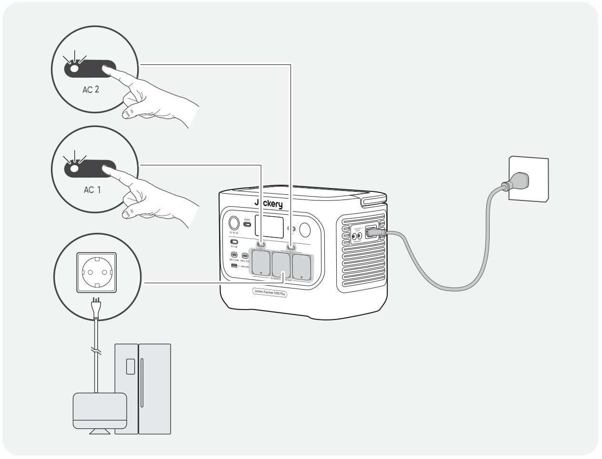
</figure>

Awaryjny zasilacz bezprzerwowy (UPS) to rodzaj systemu ciągłego zasilania, który automatycznie dostarcza rezerwową energię elektryczną do urządzenia odbiorczego w przypadku zaniku napięcia w sieci energetycznej.

W przypadku nagłego zaniku zasilania sieciowego, Jackery Explorer 1000 Plus automatycznie przełączy się na zasilanie z baterii w ciągu 10 ms, aby podtrzymać pracę urządzeń.

W trybie UPS maksymalna moc wyjściowa urządzenia osiąga 7,83A przed wystąpieniem awarii zasilania. Ponieważ w trybie obejściowym możliwe jest jednoczesne ładowanie i zasilania urządzeń odbiorczych, rzeczywista moc wyjściowa jest niższa od mocy znamionowej, ale podczas awarii przywracana jest moc znamionowa.

<table class="manual-callout-table manual-callout-table"><tbody><tr><td class="manual-callout-label">PRZESTROGA</td><td class="manual-callout-body"><ul><li>Produkt nie obsługuje przełączania w czasie 0 ms. Nie należy podłączać go do urządzeń wymagających zasilania z przełączaniem w czasie 0 ms, takich jak serwery danych lub stacje robocze.</li><li>Przed użyciem należy kilkakrotnie przetestować zgodność z urządzeniem.</li><li>Nie podłączać urządzeń odbiorczych o mocy przekraczającej maksymalną moc wyjściową produktu. W przeciwnym razie zadziała zabezpieczenie przeciążeniowe.</li></ul></td></tr></tbody></table>

# PODŁĄCZANIE DO ZESTAWU BATERII (SPRZEDAWANEGO ODDZIELNIE)

W razie dużego zapotrzebowania na pojemność energetyczną do tego produktu można podłączyć maksymalnie 5 zestawów baterii. Szczegółowe informacje na temat użytkowania można znaleźć w instrukcji obsługi urządzenia Jackery Battery Pack 2000.

<figure class="hb-reference-figure" data-component-id="HB-SPECIAL-REFERENCE-FIGURE" data-reference-id="battery_stack" data-source-fragment-sha256="7acf81fb25a5d18db950ae03d32249c14b91ea228cd9672ce37217bbdccd22c3">
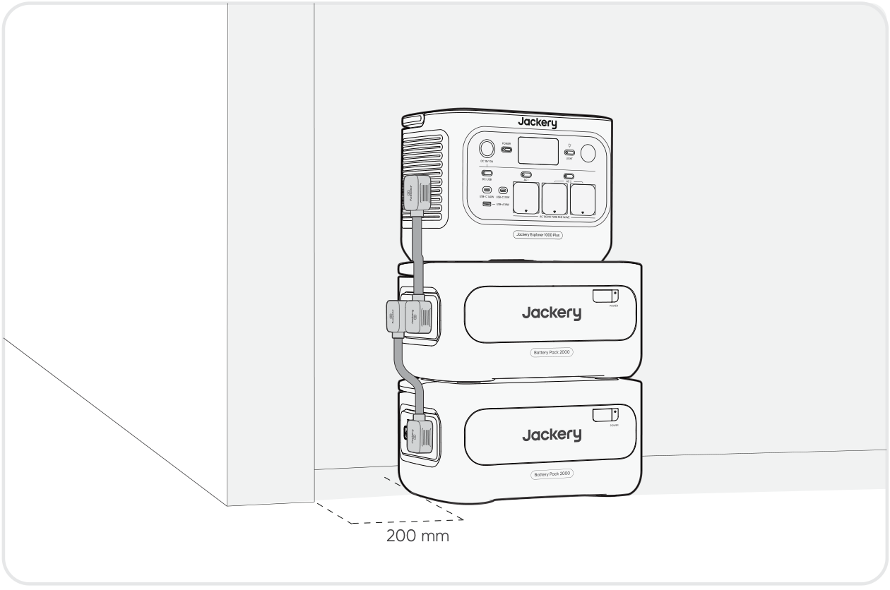
200 mm

</figure>

<figure class="hb-reference-figure" data-component-id="HB-SPECIAL-REFERENCE-FIGURE" data-reference-id="battery_items" data-source-fragment-sha256="cf44ef1f1ab2424ed5e0b2bc2c99dc65921493ef36511f2addb037a136198d3b">
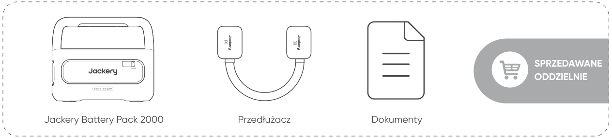
Jackery Battery Pack 2000 Przedłużacz Dokumenty SPRZEDAWANE ODDZIELNIE

</figure>

<table class="manual-callout-table manual-callout-table"><tbody><tr><td class="manual-callout-label">PRZESTROGA</td><td class="manual-callout-body"><ul><li>Przed podłączeniem urządzenia Jackery Battery Pack 2000 do urządzenia Jackery Explorer 1000 Plus upewnij się, że wszystkie urządzenia są wyłączone.</li><li>Aby zapewnić prawidłowe działanie produktu, upewnij się, że wlotowe i wylotowe otwory wentylacyjne po obu stronach są odsłonięte. Zachowaj co najmniej 200 mm odstępu między otworami wentylacyjnymi a jakimikolwiek przedmiotami, aby zapewnić prawidłowe odprowadzanie ciepła.</li><li>Gdy produkt jest używany z podłączonymi zestawami baterii, domyślna maksymalna liczba zestawów baterii w stosie wynosi 3, a produkt należy ustawić na płaskiej, stabilnej powierzchni o odpowiedniej nośności.</li><li>Jeśli konieczne jest ułożenie w stos 4 lub większej liczby zestawów baterii, produkt należy umieścić w stabilnym miejscu przy ścianie, chronić przed uderzeniami zewnętrznymi i zastosować niezbędne środki zabezpieczające go przed przewróceniem.</li></ul></td></tr></tbody></table>

# ŁADOWANIE

Ekologiczna energia przede wszystkim! Propagujemy korzystanie w pierwszej kolejności z energii ekologicznej. Ten produkt obsługuje jednocześnie dwa tryby ładowania: ładowanie z paneli słonecznych i ładowanie z gniazdka ściennego AC. Gdy ładowanie z gniazdka ściennego AC i ładowanie z paneli słonecznych są włączone jednocześnie, produkt będzie preferować ładowanie z paneli, a obie metody będą ładować baterię z maksymalną dopuszczalną mocą.

Przed pierwszym użyciem w pełni naładuj produkt.

<table class="manual-callout-table manual-callout-table"><tbody><tr><td class="manual-callout-label">Uwaga</td><td class="manual-callout-body"><ul><li>Zalecany zakres temperatury otoczenia podczas ładowania produktu wynosi od -10°C do 45°C, a zakres temperatury otoczenia podczas zasilania urządzeń odbiorczych – od -10°C do 45°C. Eksploatacja produktu poza tym zakresem temperatur może ograniczyć możliwości ładowania i zasilania urządzeń odbiorczych, a nawet uniemożliwić te czynności.</li><li>Moc ładowania i pojemność baterii produktu mogą się zmieniać w zależności od wahań temperatury.</li></ul></td></tr></tbody></table>

## ŁADOWANIE Z SIECIOWEGO GNIAZDKA ŚCIENNEGO AC

<figure class="hb-reference-figure" data-component-id="HB-SPECIAL-REFERENCE-FIGURE" data-reference-id="ac_wall_charging" data-source-fragment-sha256="931c2360552d88448b0656ab482bcc90512a2834884b1347e5baa721753c2fcd">
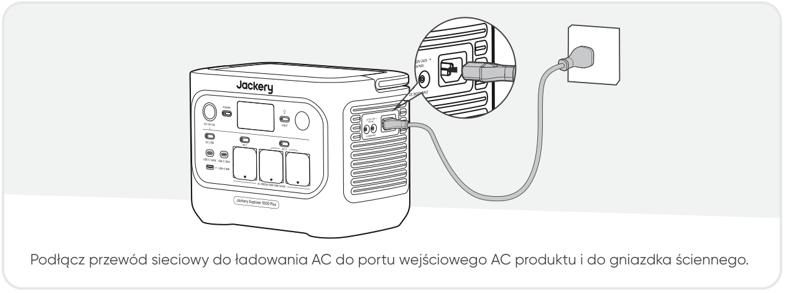
Podłącz przewód sieciowy do ładowania AC do portu wejściowego AC produktu i do gniazdka ściennego.

</figure>

<table class="manual-callout-table manual-callout-table"><tbody><tr><td class="manual-callout-label">PRZESTROGA</td><td class="manual-callout-body">
Upewnij się, że przewód ładowania AC jest solidnie i bezpiecznie podłączony do portu wejściowego AC. Niedokładne podpięcie przewodu może powodować niestabilność prądu, przegrzanie, słaby styk lub awarię urządzenia.
</td></tr></tbody></table>

<strong>Tryb ładowania awaryjnego</strong>

W tym trybie można szybko naładować przenośną stację zasilającą z gniazdka sieciowego AC. Tę funkcję ładowania awaryjnego można aktywować lub dezaktywować za pomocą aplikacji Jackery. W trybie ładowania awaryjnego okrągły wskaźnik stanu naładowania (SOC) będzie migać z większą częstotliwością.

* Aby zmaksymalizować żywotność baterii, najlepiej ładować urządzenie z normalną prędkością. Trybu ładowania awaryjnego należy używać tylko w razie konieczności. Nie jest zalecany przy regularnym, długotrwałym użytkowaniu.

## ŁADOWANIE Z PANELI SŁONECZNYCH (SPRZEDAWANYCH ODDZIELNIE)

Stacja Jackery Explorer 1000 Plus ma dwa porty wejściowe DC8020 i jest kompatybilna z panelami słonecznymi Jackery. Jeśli do jednego portu wejściowego DC8020 trzeba podłączyć jednocześnie dwa panele słoneczne, należy skorzystać z poniższego rysunku ilustrującego ładowanie przez łącznik paneli słonecznych (sprzedawany oddzielnie, nie wchodzi w skład standardowego wyposażenia).

<figure class="hb-reference-figure" data-component-id="HB-SPECIAL-REFERENCE-FIGURE" data-reference-id="solar_four" data-source-fragment-sha256="107c926d7df87c33c175b4f59189642fdedcf9c15ae5007b141fab1a54aeea13">
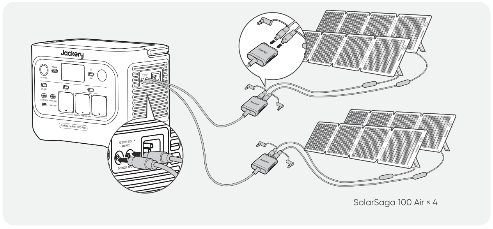
SolarSaga 100 Air × 4

</figure>

<table class="manual-callout-table manual-callout-table"><tbody><tr><td class="manual-callout-label">PRZESTROGA</td><td class="manual-callout-body">
Do jednego portu wejściowego DC8020 można podłączyć maksymalnie dwa panele słoneczne.
</td></tr></tbody></table>

<table class="manual-callout-table manual-callout-table"><tbody><tr><td class="manual-callout-label">PRZESTROGA</td><td class="manual-callout-body">
Należy się upewnić, że napięcie wejściowe na obu portach DC jest takie samo. Nieprzestrzeganie

tego zalecenia może uszkodzić produkt. Na przykład:
<ul><li>W przypadku podłączania paneli słonecznych do obu portów wejściowych DC8020 zaleca się używanie tych samych modeli paneli słonecznych Jackery i jednakowej liczby paneli.</li><li>Nie ładować produktu jednocześnie za pomocą ładowarki samochodowej i panelu słonecznego. Może to spowodować przepalenie bezpiecznika samochodowego lub awarię ładowania.</li></ul></td></tr></tbody></table>

Do ładowania produktu zaleca się korzystanie z panelu słonecznego Jackery. Należy upewnić się, że napięcie obwodu otwartego (VOC) panelu słonecznego mieści się w zakresie wejściowym DC (16 V – 60 V) urządzenia Jackery Explorer 1000 Plus. Jackery nie ponosi odpowiedzialności za jakiekolwiek szkody lub straty wynikające z użycia paneli słonecznych innych producentów.

## ŁADOWANIE ZA POMOCĄ ŁADOWARKI SAMOCHODOWEJ (SPRZEDAWANEJ ODDZIELNIE)

Produkt ten można ładować za pomocą ładowarki samochodowej 12 V. Należy zapewnić właściwe połączenie między ładowarką samochodową a gniazdem zasilania 12 V (zapalniczką samochodową).

<figure class="hb-reference-figure" data-component-id="HB-SPECIAL-REFERENCE-FIGURE" data-reference-id="car_charging" data-source-fragment-sha256="ee7d3b0234281ce2d70d2569bd3391417c04e40be7dfb4042156419225d5254a">
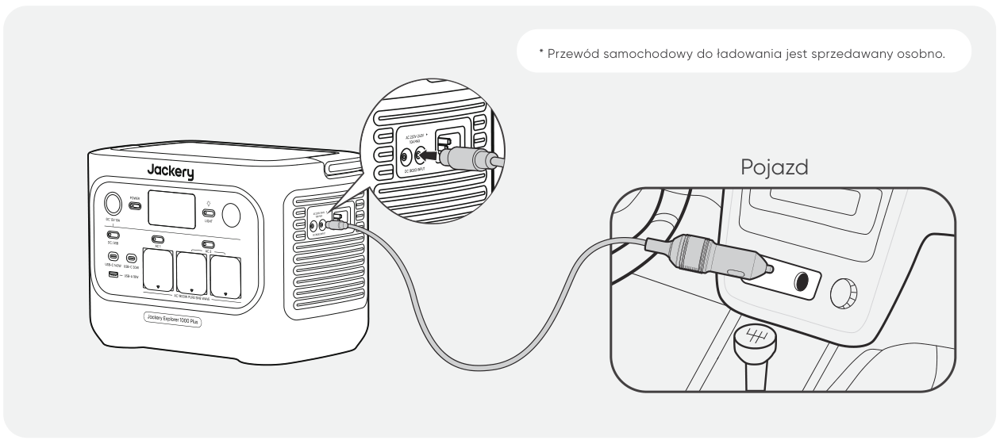
* Przewód samochodowy do ładowania jest sprzedawany osobno. Pojazd

</figure>

<ul><li>Uruchomić pojazd przed przystąpieniem do ładowania stacji zasilającej.</li></ul>

<table class="manual-callout-table manual-callout-table"><tbody><tr><td class="manual-callout-label">PRZESTROGA</td><td class="manual-callout-body"><ul><li>Jeśli pojazd porusza się po wyboistych drogach, zabrania się korzystania z ładowarki samochodowej, aby uniknąć niestandardowego działania. Firma nie ponosi odpowiedzialności za jakiekolwiek straty spowodowane niestandardowym działaniem.</li></ul><ul><li>Ładowanie z pojazdu jest możliwe wyłącznie w pojazdach z instalacją 12 V DC, a nie 24 V DC. Nie wolno ładować tego produktu w pojeździe z instalacją 24 V, gdyż mogłoby to doprowadzić do obrażeń ciała i strat materialnych.</li></ul></td></tr></tbody></table>

# PRZECHOWYWANIE

Produkt należy przechowywać w suchym, czystym i dobrze wentylowanym miejscu. Temperatura i wilgotność w miejscu przechowywania:

<ul><li>1 miesiąc: -20°C do 45°C (0–60% wilgotności względnej)</li></ul>

<ul><li>3 miesiące: 0°C do 45°C (0–60% wilgotności względnej)</li></ul>

<ul><li>12 miesiące: 0°C do 25°C (0–60% wilgotności względnej)</li></ul>

Jeśli produkt będzie przechowywany przez długi czas (3–6 miesięcy) z rozładowaną baterią, jego naładowanie może okazać się niemożliwe. Aby temu zapobiec i zadbać o kondycję baterii, zaleca się sprawdzanie i ładowanie produktu co trzy miesiące oraz przeprowadzanie pełnego cyklu ładowania i rozładowania co najmniej raz na 6–12 miesięcy.

# ROZWIĄZYWANIE PROBLEMÓW

Jeśli pojawi się którykolwiek z poniższych kodów błędów, wykonaj wymienione działania naprawcze, aby rozwiązać problem. Jeśli usterka nie ustąpi, skontaktuj się z działem wsparcia Jackery.

<figure aria-label="Kod błędu / Działania naprawcze" class="hb-troubleshooting-composition" data-component-id="HB-TABLE-TROUBLESHOOTING" tabindex="0"><table class="hb-troubleshooting-table"><colgroup><col class="hb-troubleshooting-col-code"/><col class="hb-troubleshooting-col-measures"/></colgroup><thead><tr><th class="hb-troubleshooting-code" scope="col">Kod błędu</th><th class="hb-troubleshooting-measures" scope="col">Działania naprawcze</th></tr></thead><tbody><tr><td class="hb-troubleshooting-code">F0/F1/ F2/F3</td><td class="hb-troubleshooting-measures">Uruchom produkt ponownie.</td></tr><tr><td class="hb-troubleshooting-code">F4</td><td class="hb-troubleshooting-measures">Podłącz produkt do urządzeń odbiorczych, aby rozładować baterię, aż usterka zniknie.</td></tr><tr><td class="hb-troubleshooting-code">F5</td><td class="hb-troubleshooting-measures">Naładuj produkt za pomocą paneli słonecznych lub z gniazdka ściennego AC do momentu, aż usterka zniknie.</td></tr><tr><td class="hb-troubleshooting-code">F6</td><td class="hb-troubleshooting-measures">1. Przed przystąpieniem do ładowania produktu z gniazdka ściennego AC poczekaj, aż napięcie w sieci się ustabilizuje. 2. Sprawdź, czy wlotowe i wylotowe otwory wentylacyjne nie są zablokowane. Pozostaw 20 cm odstępu po obu stronach produktu. 3. Trzymaj produkt w miejscu nienarażonym na bezpośrednie działanie promieni słonecznych ani na wysokie temperatury otoczenia. 4. Odłącz wszystkie urządzenia odbiorcze od produktu. Pozostaw produkt w stanie bezczynności i poczekaj, aż usterka zniknie. 5. Uruchom produkt ponownie.</td></tr><tr><td class="hb-troubleshooting-code">F7</td><td class="hb-troubleshooting-measures">1. Odłącz wszystkie wtyki DC podłączone do produktu. 2. Jeśli ładujesz produkt za pomocą panelu słonecznego, sprawdź napięcie obwodu otwartego (VOC) podłączonego panelu słonecznego. Produkt dopuszcza maksymalne napięcie wejściowe DC wynoszące 60 V. 3. Zrestartuj produkt i pozostaw go w stanie bezczynności. Poczekaj, aż usterka zniknie.</td></tr><tr><td class="hb-troubleshooting-code">F8</td><td class="hb-troubleshooting-measures">Skontaktuj się z działem obsługi klienta Jackery.</td></tr><tr><td class="hb-troubleshooting-code">F9</td><td class="hb-troubleshooting-measures">Odłącz urządzenia odbiorcze podłączone do portów USB produktu. Poczekaj, aż usterka zniknie.</td></tr><tr><td class="hb-troubleshooting-code">FC</td><td class="hb-troubleshooting-measures">1. Zrestartuj osobno zestawy baterii oraz urządzenie Jackery Explorer 1000 Plus. 2. Jeśli usterka nie ustąpi, odłącz zestaw baterii od urządzenia Jackery Explorer 1000 Plus i podłącz go ponownie.</td></tr><tr><td class="hb-troubleshooting-code">FE</td><td class="hb-troubleshooting-measures">Skontaktuj się z działem obsługi klienta Jackery.</td></tr></tbody></table></figure>

# DANE TECHNICZNE

## INFORMACJE OGÓLNE

<figure aria-label="INFORMACJE OGÓLNE" class="hb-spec-table-composition"><table class="manual-table manual-spec-table hb-spec-table"><colgroup><col class="hb-spec-col-label"/><col class="hb-spec-col-value"/></colgroup><tbody><tr><th class="manual-spec-label hb-spec-label" scope="row">Nazwa produktu</th><td class="manual-spec-value hb-spec-value">Jackery Explorer 1000 Plus</td></tr><tr><th class="manual-spec-label hb-spec-label" scope="row">Numer modelu</th><td class="manual-spec-value hb-spec-value">JE-1000H</td></tr><tr><th class="manual-spec-label hb-spec-label" scope="row">Pojemność</th><td class="manual-spec-value hb-spec-value">1024 Wh (20 Ah / 51,2 V DC)</td></tr><tr><th class="manual-spec-label hb-spec-label" scope="row">Typ ogniw</th><td class="manual-spec-value hb-spec-value">LiFePO4</td></tr><tr><th class="manual-spec-label hb-spec-label" scope="row">Waga</th><td class="manual-spec-value hb-spec-value">Około 10,8 kg</td></tr><tr><th class="manual-spec-label hb-spec-label" scope="row">Wymiary</th><td class="manual-spec-value hb-spec-value">313,5 × 201 × 233,5 mm</td></tr><tr><th class="manual-spec-label hb-spec-label" scope="row">Żywotność</th><td class="manual-spec-value hb-spec-value">6000 cykli do 70%+ pojemności</td></tr></tbody></table></figure>

## PORTY WEJŚCIOWE

<figure aria-label="PORTY WEJŚCIOWE" class="hb-spec-table-composition"><table class="manual-table manual-spec-table hb-spec-table"><colgroup><col class="hb-spec-col-label"/><col class="hb-spec-col-value"/></colgroup><tbody><tr><th class="manual-spec-label hb-spec-label" scope="row">1 × wejście AC</th><td class="manual-spec-value hb-spec-value">220 V – 240 V ~50Hz, maks. 10 A Tryb obejściowy 1: 220 V – 240 V ~50 Hz, 7,83 A</td></tr><tr><th class="manual-spec-label hb-spec-label" scope="row">2 porty DC8020</th><td class="manual-spec-value hb-spec-value">Samochód: 11 V – 16 V ⎓ 8 A maks., po podwojeniu do 8 A maks. Fotowoltaika: 16 V – 60 V ⎓ 12 A, w trybie podwójnym do maks. 21 A / maks. 400 W</td></tr><tr><th class="manual-spec-label hb-spec-label" scope="row">1 port rozszerzeń DC</th><td class="manual-spec-value hb-spec-value">36,8 V – 56 V ⎓ maks. 59 A</td></tr></tbody></table></figure>

## PORTY WYJŚCIOWE

<figure aria-label="PORTY WYJŚCIOWE" class="hb-spec-table-composition"><table class="manual-table manual-spec-table hb-spec-table"><colgroup><col class="hb-spec-col-label"/><col class="hb-spec-col-value"/></colgroup><tbody><tr><th class="manual-spec-label hb-spec-label" scope="row">3 × AC</th><td class="manual-spec-value hb-spec-value">230 V ~50 Hz, 7,83A, moc znamionowa 1800W</td></tr><tr><th class="manual-spec-label hb-spec-label" scope="row">Całkowita moc wyjściowa AC 2</th><td class="manual-spec-value hb-spec-value">Moc znamionowa 1800W, moc szczytowa 3600W</td></tr><tr><th class="manual-spec-label hb-spec-label" scope="row">Wyjście AC w trybie obejściowym 1</th><td class="manual-spec-value hb-spec-value">220–240 V ~50Hz, 7,83A</td></tr><tr><th class="manual-spec-label hb-spec-label" scope="row">2 × USB-C</th><td class="manual-spec-value hb-spec-value">USB-C 30 W:maks. 30 W, 5 V ⎓ 3 A, 9 V ⎓ 3 A, 12 V ⎓ 2,5 A, 15 V ⎓ 2 A, 20 V ⎓ 1,5 A USB-C 140 W:maks. 140 W , 5 V ⎓ 3 A, 9 V ⎓ 3 A, 12 V ⎓ 3 A, 15 V ⎓ 3 A, 20 V ⎓ 5 A, 28 V ⎓ 5 A</td></tr><tr><th class="manual-spec-label hb-spec-label" scope="row">1 × USB-A</th><td class="manual-spec-value hb-spec-value">Maks. 18 W, 5–6 V ⎓ 3 A, 6–9 V ⎓ 2 A, 9–12 V ⎓ 1,5 A</td></tr><tr><th class="manual-spec-label hb-spec-label" scope="row">1 port DC 12V</th><td class="manual-spec-value hb-spec-value">12 V ⎓ 10 A maks.</td></tr><tr><th class="manual-spec-label hb-spec-label" scope="row">1 port rozszerzeń DC</th><td class="manual-spec-value hb-spec-value">36,8 V – 56 V ⎓ maks. 36 A</td></tr></tbody></table></figure>

## TEMPERATURA OTOCZENIA ROBOCZEGO

<figure aria-label="TEMPERATURA OTOCZENIA ROBOCZEGO" class="hb-spec-table-composition"><table class="manual-table manual-spec-table hb-spec-table"><colgroup><col class="hb-spec-col-label"/><col class="hb-spec-col-value"/></colgroup><tbody><tr><th class="manual-spec-label hb-spec-label" scope="row">Temperatura ładowania</th><td class="manual-spec-value hb-spec-value">-10°C do 45°C</td></tr><tr><th class="manual-spec-label hb-spec-label" scope="row">Temperatura rozładowania</th><td class="manual-spec-value hb-spec-value">-10°C do 45°C</td></tr></tbody></table></figure>

1. Baterię produktu można ładować z gniazdka ściennego AC, jednocześnie zapewniając zasilanie innych urządzeń przez porty wyjściowe AC.

2. Wskazuje, że co najmniej dwa porty wyjściowe AC współpracują ze sobą.

※ USB Type-C i USB-C są zastrzeżonymi znakami towarowymi organizacji USB Implementers Forum. ® ®

# GWARANCJA

<figure aria-label="GWARANCJA" class="hb-warranty-intro-composition" data-component-id="HB-WARRANTY-LEAD">

<strong>Gwarancji udzielamy wyłącznie klientom, którzy dokonali zakupu na oficjalnej stronie Jackery, na platformach zewnętrznych marki Jackery lub u lokalnych autoryzowanych sprzedawców.</strong>

*Okres i szczegóły gwarancji mogą się różnić w zależności od lokalnych przepisów prawa, regulacji oraz autoryzowanych sprzedawców.

</figure>

## Ograniczona gwarancja

<figure aria-label="Ograniczona gwarancja" class="hb-warranty-card" data-component-id="HB-WARRANTY-SECTION" data-warranty-card-index="1">
Jackery gwarantuje pierwotnemu nabywcy konsumenckiemu, że produkt Jackery będzie wolny od wad wykonania i materiałowych przy normalnym użytkowaniu konsumenckim w odpowiednim okresie gwarancyjnym określonym w sekcji „Okres gwarancji” poniżej, z zastrzeżeniem wyłączeń określonych poniżej. Niniejsze oświadczenie gwarancyjne określa wszystkie i jedyne zobowiązania gwarancyjne Jackery. Nie przyjmujemy ani nie upoważniamy żadnej osoby do przyjmowania w naszym imieniu jakiejkolwiek innej odpowiedzialności w związku ze sprzedażą naszych produktów.
</figure>

## Okres gwarancji

<figure aria-label="Okres gwarancji" class="hb-warranty-period-card" data-component-id="HB-WARRANTY-YEARS">

3
<strong class="hb-warranty-years-unit">LATA</strong><strong class="hb-warranty-period-label">Gwarancja standardowa</strong>

Standardowy okres gwarancji dla urządzenia Jackery Explorer 1000 Plus wynosi 36 miesięcy. W każdym przypadku okres gwarancji liczony jest od daty zakupu przez pierwotnego nabywcę konsumenckiego. W celu ustalenia daty rozpoczęcia okresu gwarancyjnego wymagany jest paragon lub inny wiarygodny dowód zakupu od pierwszego nabywcy.

2
<strong class="hb-warranty-years-unit">LATA</strong><strong class="hb-warranty-period-label">Przedłużona gwarancja</strong>

Aby aktywować przedłużenie gwarancji, należy zarejestrować produkt online lub skontaktować się z naszym zespołem obsługi klienta pod adresem hello.eu@- jackery.com w celu przedłużenia standardowego okresu gwarancji.

</figure>

## Wymiana

<figure aria-label="Wymiana" class="hb-warranty-card" data-component-id="HB-WARRANTY-SECTION" data-warranty-card-index="2">
Jackery wymieni na swój koszt każdy produkt Jackery, który nie będzie działać w odpowiednim okresie gwarancyjnym z powodu wady wykonania lub materiałowej. Produkt zastępczy przejmuje pozostały okres gwarancji pierwotnego produktu.
</figure>

## Ograniczenie do pierwotnego nabywcy konsumenckiego

<figure aria-label="Ograniczenie do pierwotnego nabywcy konsumenckiego" class="hb-warranty-card" data-component-id="HB-WARRANTY-SECTION" data-warranty-card-index="3">
Gwarancja na produkt Jackery jest ograniczona do pierwotnego nabywcy konsumenckiego i nie podlega przeniesieniu na żadnego kolejnego właściciela.
</figure>

## Wyłączenia

<figure aria-label="Wyłączenia" class="hb-warranty-card" data-component-id="HB-WARRANTY-SECTION" data-warranty-card-index="4">
Gwarancja Jackery nie obejmuje:
<ul><li>Produktu, który był niewłaściwie użytkowany, używany niezgodnie z przeznaczeniem, modyfikowany, uszkodzony w wyniku wypadku lub używany do celów innych niż normalne użytkowanie konsumenckie zgodnie z aktualną dokumentacją produktową Jackery.</li><li>Prób naprawy podejmowanych przez osoby inne niż autoryzowany serwis.</li><li>Jakiegokolwiek produktu zakupionego za pośrednictwem internetowego serwisu aukcyjnego.</li><li>Gwarancja Jackery nie obejmuje ogniwa baterii, chyba że ogniwo zostanie w pełni naładowane przez użytkownika w ciągu siedmiu dni od zakupu produktu oraz co najmniej raz na 6 miesięcy w późniejszym okresie.</li></ul></figure>

## Prawo do interpretacji

<figure aria-label="Prawo do interpretacji" class="hb-warranty-card" data-component-id="HB-WARRANTY-SECTION" data-warranty-card-index="5">
Jackery zastrzega sobie prawo do ostatecznej interpretacji powyższej polityki posprzedażowej względem klientów.
</figure>

# KONFIGURACJA APLIKACJI

## 1. Pobierz aplikację i się zaloguj

<figure aria-label="1. Pobierz aplikację i się zaloguj" class="hb-app-download-composition" data-component-id="HB-SPECIAL-APP">

Wyszukaj „Jackery” w Google Play lub App Store, aby zainstalować aplikację. Wówczas pojawi się możliwość zarejestrowania i zalogowania.

Alternatywnie zeskanuj kod QR poniżej, aby pobrać i zainstalować aplikację.

</figure>

## 2. Dodaj urządzenie

2.1 Kliknij przycisk + , aby dodać urządzenie.

2.2 Naciśnij przycisk POWER na urządzeniu, aby je włączyć. Ikony Wi-Fi i Bluetooth na urządzeniu migają, wskazując, że urządzenie weszło w tryb konfiguracji sieci. Naciśnij przycisk „Icon Flashed” potwierdzający, że ikona zamigała, i zezwól aplikacji na łączenie się z pobliskimi urządzeniami oraz przyznaj jej uprawnienia Bluetooth.

<figure class="hb-app-add-device-composition hb-has-reference-captions" data-component-id="HB-SPECIAL-APP" data-reference-id="app-add-device" data-step-captions="live">

<figcaption class="hb-reference-caption-grid" data-caption-count="2" data-caption-layout="equal" style="--hb-caption-count:2;width:min(100%,44rem)">2.12.2</figcaption>
Przycisk zasilaniaPrzycisk zasilania DC/USBPrzycisk zasilania AC 1Przycisk zasilania AC 2
</figure>

2.3 Po dotknięciu ikony wyszukanego urządzenia aplikacja automatycznie łączy się z urządzeniem przez Bluetooth.

<table class="manual-callout-table manual-callout-table"><tbody><tr><td class="manual-callout-label">Uwaga</td><td class="manual-callout-body">
Jeśli podczas parowania pojawi się komunikat „Urządzenie zostało już sparowane”, można skorzystać z następujących dwóch sposobów połączenia:
<ul><li>Właściciel urządzenia może udostępnić to urządzenie innym użytkownikom za pośrednictwem aplikacji.</li><li>Można nacisnąć i przytrzymać przycisk POWER oraz przycisk zasilania DC/USB przez 3 sekundy, aby zresetować Wi-Fi i Bluetooth urządzenia, a następnie ponownie sparować urządzenie.</li></ul></td></tr></tbody></table>

2.4 Po pomyślnym podłączeniu urządzenia wprowadź hasło Wi-Fi i naciśnij przycisk OK.

<table class="manual-callout-table manual-callout-table"><tbody><tr><td class="manual-callout-label">Uwaga</td><td class="manual-callout-body">
Wybierz sieć Wi-Fi w paśmie 2,4 GHz. Urządzenie nie obsługuje sieci Wi-Fi w paśmie 5 GHz.
</td></tr></tbody></table>

Po pomyślnym dodaniu urządzenia do aplikacji ikona Wi-Fi na urządzeniu będzie zawsze włączona.

<figure class="hb-reference-figure hb-has-reference-captions" data-component-id="HB-SPECIAL-REFERENCE-FIGURE" data-reference-id="app-connect-result" data-source-fragment-sha256="fc2c261140139b268c4b14a9e289555c6cdff72aa4267fe9fd1a56f53e1b0075">

<figcaption class="hb-reference-caption-grid" data-caption-count="3" data-caption-layout="equal" style="--hb-caption-count:3">2.32.42.5</figcaption></figure>

Powyższe zrzuty ekranu mają charakter wyłącznie poglądowy.

<table class="manual-callout-table manual-callout-table"><tbody><tr><td class="manual-callout-label">PRZESTROGA</td><td class="manual-callout-body">
Aplikacja Jackery może łączyć się jednocześnie tylko z jedną stacją zasilającą poprzez Bluetooth. Powrót do listy urządzeń automatycznie rozłącza połączenie Bluetooth. Ponowne kliknięcie stacji zasilającej na liście spowoduje automatycznie ponowne połączenie.
</td></tr></tbody></table>

## 3. Usuń sparowane urządzenie

Kliknij ikonę ustawień w prawym górnym rogu głównego interfejsu urządzenia, aby przejść do strony ustawień, a następnie kliknij przycisk Unbind (Usuń parowanie) u dołu strony, aby usunąć sparowane urządzenie.

## 4. Uwagi

### 4.1 Włączanie Wi-Fi i Bluetooth:

<ul><li>Wi-Fi i Bluetooth włączają się automatycznie po uruchomieniu urządzenia, a ikony Wi-Fi i Bluetooth na ekranie zaświecają się.</li><li>Przytrzymaj jednocześnie przycisk zasilania DC/USB oraz przycisk zasilania AC 1, aż ikony Wi-Fi i Bluetooth na ekranie się zaświecą.</li></ul>

### 4.2 Wyłączanie Wi-Fi i Bluetooth:

<ul><li>Przytrzymaj jednocześnie przycisk zasilania DC/USB oraz przycisk zasilania AC 1, aż ikony Wi-Fi i Bluetooth na ekranie zgasną.</li></ul>

### 4.3 Resetowanie Wi-Fi i Bluetooth:

Przytrzymaj jednocześnie przycisk POWER oraz przycisk zasilania DC/USB przez 3 sekundy, aby zresetować Wi-Fi i Bluetooth do ustawień fabrycznych. Parowanie z połączonym kontem w aplikacji zostanie usunięte.

# EU declaration and manufacturer

Download the Jackery Mobile App

Téléchargez l’application mobile Jackery

Descargar la aplicación móvil Jackery

Laden Sie sich die Jackery Mobiltelefon-App herunter

Scarica l'applicazione mobile Jackery

Завантажте мобільний застосунок Jackery

## DECLARATION OF CONFORMITY

Wi-Fi 2.4 GHz Frequency Range: 2412-2472 MHz (20 MHz) Maximum RF Output Power: ≤ 20 dBm

Bluetooth Frequency Range: 2402-2480 MHz Maximum RF Output Power: ≤ 10 dBm

EU Regulations

RED Declaration of Conformity Shenzhen Hello Tech Energy Co., Ltd. hereby declares that this: Jackery Explorer 1000 Plus with Bluetooth and Wi-Fi JE-1000H is in compliance with the essential requirements and other relevant provisions of the RED Directive 2014/53/EU,The full text of the EU declaration of conformity is available at the following internet address: https://de.jackery.com/pages/user-guides

## MANUFACTURER: SHENZHEN HELLO TECH ENERGY CO., LTD.

Address: F2-3, Bldg. 7, Jiaanda Science and technology industrial park factory, the east side of Huafan Road, Tongsheng Community, Dalang Street, Longhua District, Shenzhen, Guangdong, China

sales@hello-tech.com

+86 400 668 9293 www.hello-tech.com

