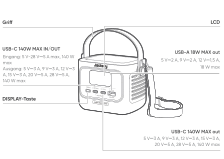
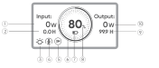
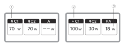
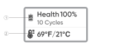
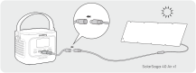
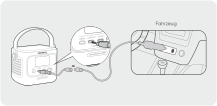

# SICHERHEITSVORKEHRUNGEN BEI DER VERWENDUNG

<strong>SICHERHEITSHINWEISE ZUR VERMEIDUNG VON BRANDGEFAHR, STROMSCHLAG ODER VERLETZUNGEN</strong>

<table class="manual-callout-table" data-callout-variant="warning" lang="de" style="width:100%; border-collapse:collapse; margin:0 0 16px 0;"><tbody><tr><td class="manual-callout-label" style="width:16%; border:1px solid #000; padding:6px 8px; vertical-align:top;">
<strong>WARNUNG</strong>
WARNUNGVORSICHTHINWEIS</td><td class="manual-callout-body" style="border:1px solid #000; padding:6px 8px; vertical-align:top;">
<strong>Befolgen Sie bei der Verwendung dieses Produkts stets die folgenden grundlegenden Vorsichtsmaßnahmen.</strong>

</td></tr></tbody></table>

- Bitte lesen Sie alle Anweisungen, bevor Sie dieses Produkt verwenden.

- Um die Verletzungsgefahr zu verringern, achten Sie darauf, dass Kinder beaufsichtigt werden, wenn das Produkt in ihrer Nähe verwendet wird.

- Stecken Sie keine Finger oder Hände in das Produkt.

- Setzen Sie die Powerbank weder Regen noch Schnee aus.

- Setzen Sie die Powerbank keiner Hitze oder offenem Feuer aus. Bewahren Sie sie nicht in direktem Sonnenlicht oder in einem Fahrzeug auf.

- Die Verwendung eines Netzteils oder Ladegeräts, das nicht vom Hersteller der Powerbank empfohlen oder verkauft wird, kann zu Brandgefahr oder Verletzungen von Personen führen.

- Verwenden Sie die Powerbank nicht über ihre Nennausgangsleistung hinaus. Eine Überlastung der Ausgänge über den Nennwert hinaus kann zu Brandgefahr oder Verletzungen von Personen führen.

- Verwenden Sie keine beschädigte oder modifizierte Powerbank. Beschädigte oder modifizierte Akkus können sich unvorhersehbar verhalten, was zu Feuer, Explosion oder Verletzungsgefahr führen kann.

- Zerlegen Sie die Powerbank nicht. Bringen Sie sie zu einem qualifizierten Fachmann, wenn eine Wartung oder Reparatur erforderlich ist. Ein falscher Zusammenbau kann zu Brandgefahr oder Verletzungen von Personen führen.

- Setzen Sie die Powerbank weder Feuer noch übermäßigen Temperaturen aus. Die Einwirkung von Feuer oder Temperaturen über 60°C kann eine Explosion verursachen.

- Lassen Sie Wartungsarbeiten nur von einem qualifizierten Service- oder Reparaturfachmann und ausschließlich mit identischen Ersatzteilen durchführen. Dadurch wird gewährleistet, dass die Sicherheit des Produkts erhalten bleibt.

- Schalten Sie die Powerbank aus, wenn sie nicht verwendet wird.

BEWAHREN SIE DIESE ANWEISUNGEN AUF

<table class="manual-callout-table" data-callout-variant="caution" lang="de" style="width:100%; border-collapse:collapse; margin:0 0 16px 0;"><tbody><tr><td class="manual-callout-label" style="width:16%; border:1px solid #000; padding:6px 8px; vertical-align:top;">
<strong>VORSICHT</strong>
WARNUNGVORSICHTHINWEIS</td><td class="manual-callout-body" style="border:1px solid #000; padding:6px 8px; vertical-align:top;">
Brand- und Verbrennungsgefahr. Nicht öffnen, quetschen, über 60 °C hinaus erhitzen oder verbrennen. Befolgen Sie die Anweisungen des Herstellers.

</td></tr></tbody></table>

Die Entsorgung einer Batterie in Feuer oder einem heißen Ofen oder das mechanische Zerdrücken oder Zerschneiden einer Batterie, was zu einer Explosion führen kann; das Aufbewahren einer Batterie in einer Umgebung mit extrem hoher Temperatur, was zu einer Explosion oder zum Auslaufen von entflammbarer Flüssigkeit oder Gas führen kann; und eine Batterie, die extrem niedrigem Luftdruck ausgesetzt ist, was zu einer Explosion oder zum Auslaufen von entflammbarer Flüssigkeit oder Gas führen kann.

# ANWEISUNGEN ZUR BENUTZERWARTUNG

Im Lebenszyklus von Energiespeicherprodukten ist ein gewisser Kapazitäts- und Energieverlust zu erwarten. Mit zunehmender Anzahl von Lade- und Entladezyklen sowie längerer Lagerzeit nimmt dieser Verlust allmählich zu. Dies ist ein normaler Vorgang, der mit der natürlichen Alterung der Batteriezellen einhergeht.

# BEDEUTUNG DER SYMBOLE

<figure aria-label="BEDEUTUNG DER SYMBOLE" class="hb-symbol-signal-composition" data-component-id="HB-TABLE-SYMBOL-SIGNAL"><table class="hb-symbol-signal-table"><colgroup><col class="hb-symbol-signal-col-label"/><col class="hb-symbol-signal-col-meaning"/></colgroup><thead><tr><th class="hb-symbol-signal-label-heading" scope="col">
Symbol
</th><th class="hb-symbol-signal-meaning-heading" scope="col">
Bedeutung
</th></tr></thead><tbody><tr><td class="hb-symbol-signal-label-cell">⚠WARNUNG</td><td class="hb-symbol-signal-meaning-cell">
Gefährliche Handlungen, die zu schweren Verletzungen, Todesfällen und/oder Sachschäden führen können.
</td></tr><tr><td class="hb-symbol-signal-label-cell">⚠VORSICHT</td><td class="hb-symbol-signal-meaning-cell">
Gefährliche Handlungen, die zu Personenschäden und/oder Sachschäden führen können.
</td></tr><tr><td class="hb-symbol-signal-label-cell">HINWEIS</td><td class="hb-symbol-signal-meaning-cell">
Gefährliche Handlungen, die zu Geräteschäden, Datenverlust, Leistungsverschlechterung oder unvorhergesehenen Ergebnissen führen können.
</td></tr><tr><td class="hb-symbol-signal-label-cell">TIPP</td><td class="hb-symbol-signal-meaning-cell">
Ergänzt wichtige Informationen oder Bedienungshinweise im Text.
</td></tr></tbody></table></figure>

<figure aria-label="Symbol / Bedeutung" class="hb-symbol-pair-composition" data-component-id="HB-TABLE-SYMBOL-ICON">

<table class="hb-symbol-panel-table"><colgroup><col class="hb-symbol-col-icon"/><col class="hb-symbol-col-meaning"/></colgroup><thead><tr><th class="hb-symbol-icon-heading" scope="col">
Symbol
</th><th class="hb-symbol-meaning-heading" scope="col">
Bedeutung
</th></tr></thead><tbody><tr><td class="hb-symbol-icon"></td><td class="hb-symbol-meaning">
Warn- und Sicherheitssymbole. Unbedingt lesen, um auf mögliche Gefahren oder Risiken aufmerksam zu machen.
</td></tr><tr><td class="hb-symbol-icon"></td><td class="hb-symbol-meaning">
Lesen Sie vor der Anwendung die Benutzeranleitung.
</td></tr><tr><td class="hb-symbol-icon"></td><td class="hb-symbol-meaning">
Dieses Symbol zeigt an, dass das Produkt nicht als Haushaltsabfall entsorgt werden soll und an eine dafür vorgesehene Sammelstelle zur Entsorgung und Recycling gebracht werden sollte. Eine ordnungsgemäße Entsorgung und Recycling kann dazu beitragen, die Umwelt zu schützen. Für weitere Informationen zur Entsorgung und Recycling dieses Produkts wenden Sie sich an Ihre örtliche Gemeinde, Entsorgungsdienstleistungen oder Ihren Händler.
</td></tr><tr><td class="hb-symbol-icon"></td><td class="hb-symbol-meaning">
Batterien und Akkumulatoren dürfen nicht mit dem Hausmüll entsorgt werden. Als Verbraucher sind Sie gesetzlich verpflichtet, alle Batterien und Akkumulatoren an ausgewiesenen Sammelstellen zu entsorgen, unabhängig davon, ob sie gefährliche Stoffe enthalten. Bitte geben Sie gebrauchte Batterien und Akkumulatoren bei einer örtlichen Sammelstelle, einem Recyclingzentrum oder dem Händler zurück, bei dem sie gekauft wurden. Eine ordnungsgemäße Entsorgung gewährleistet ein umweltgerechtes Recycling und verhindert mögliche Schäden für die menschliche Gesundheit und die Umwelt.
</td></tr></tbody></table>

<table class="hb-symbol-panel-table"><colgroup><col class="hb-symbol-col-icon"/><col class="hb-symbol-col-meaning"/></colgroup><thead><tr><th class="hb-symbol-icon-heading" scope="col">
Symbol
</th><th class="hb-symbol-meaning-heading" scope="col">
Bedeutung
</th></tr></thead><tbody><tr><td class="hb-symbol-icon"></td><td class="hb-symbol-meaning">
Vermeiden Sie Hitze.
</td></tr><tr><td class="hb-symbol-icon"></td><td class="hb-symbol-meaning">
Demontieren Sie das Produkt nicht.
</td></tr><tr><td class="hb-symbol-icon"></td><td class="hb-symbol-meaning">
Halten Sie das Produkt fern von Kindern.
</td></tr><tr><td class="hb-symbol-icon"></td><td class="hb-symbol-meaning">
Dieses Symbol zeigt an, dass sich ein Lithium-Ionen-Akku (Li-Ion) im Produkt befindet und ordnungsgemäß entsorgt oder recycelt werden sollte.
</td></tr></tbody></table>

</figure>

# LIEFERUMFANG

<figure aria-label="LIEFERUMFANG" class="hb-inbox-composition" data-card-count="3" data-component-id="HB-SPECIAL-INBOX" data-inbox-variant="three-card-responsive"><ol class="hb-inbox-grid"><li class="hb-inbox-card" data-item-number="1">

<strong>Jackery Explorer 100D</strong>

</li><li class="hb-inbox-card" data-item-number="2">

<strong>USB-C-Kabel</strong>

</li><li class="hb-inbox-card" data-item-number="3">

<strong>Benutzerhandbuch</strong>

</li></ol></figure>

# PRODUKTÜBERSICHT

<figure>

</figure>

<strong>Zusätzliche Tragegurte können separat erworben und an den Seiten des Produkts befestigt werden.</strong>

# LCD-ANZEIGE

## SCHNITTSTELLE 1

<figure aria-label="LCD icon meanings" class="hb-lcd-table-composition" data-component-id="HB-TABLE-LCD-ICON" tabindex="0"><table class="hb-lcd-icon-table"><colgroup><col class="hb-lcd-col-number"/><col class="hb-lcd-col-icon"/><col class="hb-lcd-col-name"/><col class="hb-lcd-col-description"/></colgroup><tbody><tr><td class="hb-lcd-number">
1
</td><td class="hb-lcd-icon"></td><td class="hb-lcd-name">
Eingangsleistung
</td><td class="hb-lcd-description">
Zeigt die Eingangsleistung in Watt an.
</td></tr><tr><td class="hb-lcd-number">
2
</td><td class="hb-lcd-icon"></td><td class="hb-lcd-name">
Verbleibende Aufladezeit
</td><td class="hb-lcd-description">
Anzeige der verbleibenden Ladezeit.
</td></tr><tr><td class="hb-lcd-number">
3
</td><td class="hb-lcd-icon"></td><td class="hb-lcd-name">
Dauerbetrieb-Modus
</td><td class="hb-lcd-description">
Ein: Dauerbetrieb ist aktiviert.

Aus: Dauerbetrieb ist deaktiviert.
</td></tr><tr><td class="hb-lcd-number">
4
</td><td class="hb-lcd-icon"></td><td class="hb-lcd-name">
Thermische Leistungsbegrenzung
</td><td class="hb-lcd-description">
Ein: Die Batterietemperatur ist hoch. Entladeleistungsbegrenzung ist aktiviert.

Aus: Entladeleistungsbegrenzung ist deaktiviert.
</td></tr><tr><td class="hb-lcd-number">
5
</td><td class="hb-lcd-icon"></td><td class="hb-lcd-name">
Energiesparmodus
</td><td class="hb-lcd-description">
Ein: Der Energiesparmodus ist aktiviert.

Aus: Der Energiesparmodus ist deaktiviert.
</td></tr><tr><td class="hb-lcd-number">
6
</td><td class="hb-lcd-icon"></td><td class="hb-lcd-name">
Batteriezustandsanzeige
</td><td class="hb-lcd-description">
Wenn das Produkt geladen wird, leuchtet der orangefarbene Kreis um die Batterieanzeige nacheinander auf. Beim Laden anderer Geräte bleibt der orangefarbene Kreis dauerhaft eingeschaltet.
</td></tr><tr><td class="hb-lcd-number">
7
</td><td class="hb-lcd-icon"></td><td class="hb-lcd-name">
Batterietiefstandsanzeige
</td><td class="hb-lcd-description">
Ein: Der Batteriestand liegt unter 20 %.

Blinkt: Der Batteriestand liegt unter 5 %.

Aus: Der Batteriestand liegt nicht unter 20 % oder das Produkt wird aufgeladen.
</td></tr><tr><td class="hb-lcd-number">
8
</td><td class="hb-lcd-icon"></td><td class="hb-lcd-name">
Verbleibender Batterieprozentsatz
</td><td class="hb-lcd-description">
Zeigt den verbleibenden Batteriestand an.
</td></tr><tr><td class="hb-lcd-number">
9
</td><td class="hb-lcd-icon"></td><td class="hb-lcd-name">
Verbleibende Entladezeit
</td><td class="hb-lcd-description">
Anzeige der verbleibenden Entladezeit.
</td></tr><tr><td class="hb-lcd-number">
10
</td><td class="hb-lcd-icon"></td><td class="hb-lcd-name">
Ausgangsleistung
</td><td class="hb-lcd-description">
Zeigt die Ausgangsleistung in Watt an.
</td></tr></tbody></table></figure>

<figure aria-label="LCD icon meanings" class="hb-lcd-table-composition" data-component-id="HB-TABLE-LCD-ICON" tabindex="0"><table class="hb-lcd-icon-table"><colgroup><col class="hb-lcd-col-icon"/><col class="hb-lcd-col-name"/><col class="hb-lcd-col-description"/></colgroup><tbody><tr><td class="hb-lcd-icon"></td><td class="hb-lcd-name">
Fehlermeldung
</td><td class="hb-lcd-description">
Entfernen Sie die Last oder ziehen Sie den Ladestecker ab. Wenn das Problem nicht behoben werden kann, wenden Sie sich bitte an den Jackery Kundendienst.
</td></tr><tr><td class="hb-lcd-icon"></td><td class="hb-lcd-name">
Warnung vor hoher Temperatur
</td><td class="hb-lcd-description">
Der Hochtemperaturschutz wurde aktiviert. Das Produkt kann die Funktion einstellen, bis die Temperatur wieder im normalen Betriebsbereich liegt.
</td></tr><tr><td class="hb-lcd-icon"></td><td class="hb-lcd-name">
Warnung bei niedriger Temperatur
</td><td class="hb-lcd-description">
Der Niedrigtemperaturschutz wurde aktiviert. Das Produkt kann die Funktion einstellen, bis die Temperatur wieder im normalen Betriebsbereich liegt.
</td></tr></tbody></table></figure>

## SCHNITTSTELLE 2

<figure aria-label="LCD icon meanings" class="hb-lcd-table-composition" data-component-id="HB-TABLE-LCD-ICON" tabindex="0"><table class="hb-lcd-icon-table"><colgroup><col class="hb-lcd-col-number"/><col class="hb-lcd-col-icon"/><col class="hb-lcd-col-name"/><col class="hb-lcd-col-description"/></colgroup><tbody><tr><td class="hb-lcd-number">
1
</td><td class="hb-lcd-icon"></td><td class="hb-lcd-name">
Entladeanzeige
</td><td class="hb-lcd-description">
Dieser USB-Anschluss gibt Strom ab.
</td></tr><tr><td class="hb-lcd-number">
2
</td><td class="hb-lcd-icon"></td><td class="hb-lcd-name">
Ladeanzeige
</td><td class="hb-lcd-description">
Dieser USB-Anschluss lädt.
</td></tr><tr><td class="hb-lcd-number">
3
</td><td class="hb-lcd-icon"></td><td class="hb-lcd-name">
Lade- oder Entladeleistung
</td><td class="hb-lcd-description">
Zeigt die Lade- oder Entladeleistung des entsprechenden Anschlusses an.
</td></tr></tbody></table></figure>

## SCHNITTSTELLE 3

<figure aria-label="LCD icon meanings" class="hb-lcd-table-composition" data-component-id="HB-TABLE-LCD-ICON" tabindex="0"><table class="hb-lcd-icon-table"><colgroup><col class="hb-lcd-col-number"/><col class="hb-lcd-col-icon"/><col class="hb-lcd-col-name"/><col class="hb-lcd-col-description"/></colgroup><tbody><tr><td class="hb-lcd-number">
1
</td><td class="hb-lcd-icon"></td><td class="hb-lcd-name">
Batteriezustand und Zyklusanzahl
</td><td class="hb-lcd-description">
Zeigt den aktuellen Batteriezustand in Prozent sowie die Anzahl der Lade-/Entladezyklen an.

<ul class="simple">
<li>
Grün: Der Batteriezustand ist sehr gut.
</li>
<li>
Gelb: Der Batteriezustand ist mittelmäßig.
</li>
<li>
Rot: Der Batteriezustand ist schlecht.
</li>
</ul></td></tr><tr><td class="hb-lcd-number">
2
</td><td class="hb-lcd-icon"></td><td class="hb-lcd-name">
Batterietemperatur
</td><td class="hb-lcd-description">
Zeigt die aktuelle Batterietemperatur an.
</td></tr></tbody></table></figure>

# GRUNDLEGENDE OPERATIONEN

## AUSGANG EIN/AUS

Schließen Sie eine Last an, um den Ausgang zu aktivieren.

<table class="manual-callout-table" data-callout-variant="caution" lang="de" style="width:100%; border-collapse:collapse; margin:0 0 16px 0;"><tbody><tr><td class="manual-callout-label" style="width:16%; border:1px solid #000; padding:6px 8px; vertical-align:top;">
<strong>VORSICHT</strong>
WARNUNGVORSICHTHINWEIS</td><td class="manual-callout-body" style="border:1px solid #000; padding:6px 8px; vertical-align:top;"><ul class="simple">
<li>
Der USB-C-140-W-MAX-Anschluss ist ein USB-PD Power Source 3 (PS3) Hochleistungs-Ausgangsport. Wenn das angeschlossene Benutzergerät oder Zubehör die Sicherheitsanforderungen nicht erfüllt, kann Brandgefahr bestehen. Bevor Sie diese Anschlüsse verwenden, stellen Sie sicher, dass das angeschlossene Gerät oder Zubehör über einen Brandschutz verfügt.
</li>
<li>
Schließen Sie den Jackery Explorer 100D nur an Geräte oder Zubehör an, die den Abschnitten 6.3, 6.4 und 6.5 der IEC/EN/UL 62368-1 (oder gleichwertigen Normen) entsprechen.
</li>
<li>
Um die maximale Ausgangsleistung zu erreichen, verwenden Sie das USB-C-auf-USB-C-5A-Kabel (20 V DC/5 A, 100 W; 28V DC/5A, 140W).
</li>
</ul>
</td></tr></tbody></table>

## ENERGIESPARMODUS

Der Energiesparmodus ist standardmäßig deaktiviert. Um unnötigen Batterieverbrauch zu vermeiden, wenn der Ausgang versehentlich eingeschaltet bleibt, halten Sie die DISPLAY-Taste gedrückt, um den Energiesparmodus zu aktivieren. Wenn kein Gerät angeschlossen ist oder die Leistungsaufnahme des angeschlossenen Geräts 2 Stunden lang unter 2 W liegt, schaltet das Produkt die Ausgänge automatisch aus. Wenn der Ausgang aktiviert ist, erscheint das Symbol „2H“ auf dem Bildschirm.

3 s gedrückt halten, um den Energiesparmodus zu aktivieren/deaktivieren

<table class="manual-callout-table" data-callout-variant="note" lang="de" style="width:100%; border-collapse:collapse; margin:0 0 16px 0;"><tbody><tr><td class="manual-callout-label" style="width:16%; border:1px solid #000; padding:6px 8px; vertical-align:top;">
<strong>HINWEIS</strong>
WARNUNGVORSICHTHINWEIS</td><td class="manual-callout-body" style="border:1px solid #000; padding:6px 8px; vertical-align:top;">
Nach dem Einschalten nimmt der Energiesparmodus den vorherigen Zustand wieder an. Ein Wechsel des Modus erfordert manuelles Umschalten.

</td></tr></tbody></table>

## LCD-BILDSCHIRM EIN/AUS

<figure aria-label="LCD-BILDSCHIRM EIN/AUS" class="hb-reference-composition hb-reference-lcd-actions-compact" data-component-id="HB-TABLE-REFERENCE" data-component-variant="lcd-actions-compact" tabindex="0"><table class="hb-reference-table"><thead><tr><th scope="col">
Funktion
</th><th scope="col">
Beschreibung
</th></tr></thead><tbody><tr><td>
Bildschirmaktivierung
</td><td>
Leuchtet auf, wenn die DISPLAY-Taste kurz gedrückt wird, oder automatisch beim Laden oder Entladen.
</td></tr><tr><td>
Bildschirm dauerhaft eingeschaltet
</td><td>
Drücken Sie bei eingeschaltetem Bildschirm zweimal die DISPLAY-Taste.
</td></tr><tr><td>
Bildschirmumschaltung
</td><td>
Drücken Sie nach dem Einschalten des Bildschirms kurz die DISPLAY-Taste, um die Seite zu wechseln.
</td></tr><tr><td>
Dauerhaft eingeschalteten Bildschirm deaktivieren
</td><td>
Drücken Sie erneut zweimal die DISPLAY-Taste.
</td></tr><tr><td>
Automatische Bildschirmabschaltung
</td><td>
10 Sekunden nach dem Einschalten ohne Bedienung oder 2 Stunden nach dem Aktivieren des Dauerbetriebs.
</td></tr></tbody></table></figure>

# AUFLADEN

Laden Sie das Gerät vor der ersten Verwendung vollständig auf.

<table class="manual-callout-table" data-callout-variant="note" lang="de" style="width:100%; border-collapse:collapse; margin:0 0 16px 0;"><tbody><tr><td class="manual-callout-label" style="width:16%; border:1px solid #000; padding:6px 8px; vertical-align:top;">
<strong>HINWEIS</strong>
WARNUNGVORSICHTHINWEIS</td><td class="manual-callout-body" style="border:1px solid #000; padding:6px 8px; vertical-align:top;"><ul class="simple">
<li>
Die empfohlene Temperatur zum Laden des Produkts liegt zwischen 0°C und 45°C, und die Entladungstemperatur ebenfalls zwischen -20°C und 45°C. Wird das Produkt außerhalb dieses Temperaturbereichs betrieben, kann dies die Lade- und Entladefähigkeit einschränken oder sogar dazu führen, dass kein Laden oder Entladen möglich ist.
</li>
<li>
Die Ladeleistung und die Batteriekapazität des Produkts können aufgrund von Temperaturschwankungen variieren.
</li>
</ul>
</td></tr></tbody></table>

## AUFLADEN ÜBER EIN USB-C-LADEGERÄT

<strong>USB-C-Ladegerät separat erhältlich.</strong>

## AUFLADEN ÜBER SOLARPANEL (SEPARAT ERHÄLTLICH)

Dieses Produkt unterstützt eine maximale Solar-Ladeleistung von 100 W und kann mit Solarmodulen der Jackery SolarSaga-Serie verwendet werden.

Geladen mit einem 40 W oder 100 W Solarpanel:

<strong>Das DC8020-auf-USB-C-Kabel ist separat erhältlich.</strong>

Es wird empfohlen, das Jackery-Solarmodul zum Aufladen des Explorer 100D zu verwenden. Stellen Sie sicher, dass die Leerlaufspannung (Voc) des Solarmoduls innerhalb des DC-Eingangsspannungsbereichs des Explorer 100D liegt (10 V--30 V). Jackery übernimmt keine Verantwortung für Schäden oder Verluste, die durch die Verwendung von Solarmodulen anderer Hersteller entstehen.

## AUFLADEN ÜBER DAS AUTOLADEGERÄT (SEPARAT ERHÄLTLICH)

Dieses Produkt kann mit 12 V und 24 V Autoladegeräten geladen werden. Vergewissern Sie sich, dass das Autoladegerät und der Zigarettenanzünder im Auto eine gute Verbindung haben.

<strong>Das Autoladekabel und das DC8020-auf-USB-C-Kabel sind separat erhältlich.</strong>

<table class="manual-callout-table" data-callout-variant="caution" lang="de" style="width:100%; border-collapse:collapse; margin:0 0 16px 0;"><tbody><tr><td class="manual-callout-label" style="width:16%; border:1px solid #000; padding:6px 8px; vertical-align:top;">
<strong>VORSICHT</strong>
WARNUNGVORSICHTHINWEIS</td><td class="manual-callout-body" style="border:1px solid #000; padding:6px 8px; vertical-align:top;"><ul class="simple">
<li>
Bitte starten Sie das Fahrzeug, bevor Sie Ihre Powerbank aufladen.
</li>
<li>
Wenn das Fahrzeug auf holprigen Straßen fährt, ist es verboten, das Autoladegerät zu benutzen, da es aufgrund einer schlechten Verbindung durchbrennen könnte. Das Unternehmen haftet nicht für Schäden, die durch einen nicht normgerechten Betrieb entstehen.
</li>
</ul>
</td></tr></tbody></table>

# LAGERUNG

Bewahren Sie das Produkt an einem trockenen, sauberen Ort mit ausreichender Belüftung auf. Lagertemperatur und Luftfeuchtigkeit:

- Lagertemperatur: -20°C bis 60°C

- Lagerfeuchtigkeit: 5-95% RH

Wenn dieses Produkt über einen längeren Zeitraum (3 bis 6 Monate) mit entladener Batterie gelagert wird, kann es sein, dass es danach nicht mehr aufgeladen werden kann. Um dies zu verhindern und die Batterielebensdauer zu erhalten, wird empfohlen, das Produkt alle drei Monate zu überprüfen und aufzuladen sowie mindestens einmal alle 6 bis 12 Monate einen vollständigen Lade- und Entladezyklus durchzuführen.

# TECHNISCHE DATEN

## ALLGEMEINE INFORMATIONEN

<figure aria-label="ALLGEMEINE INFORMATIONEN" class="hb-spec-table-composition"><table class="hb-source-specification hb-spec-table manual-table manual-spec-table"><colgroup><col class="hb-spec-col-label"/><col class="hb-spec-col-value"/></colgroup>
<tbody>
<tr><th class="manual-spec-label hb-spec-label" scope="row">
Produktname
</th>
<td class="manual-spec-value hb-spec-value">
Jackery Explorer 100D
</td>
</tr>
<tr><th class="manual-spec-label hb-spec-label" scope="row">
Modell-Nr.
</th>
<td class="manual-spec-value hb-spec-value">
JE-100C
</td>
</tr>
<tr><th class="manual-spec-label hb-spec-label" scope="row">
Kapazität
</th>
<td class="manual-spec-value hb-spec-value">
96 Wh (5 Ah/19,2 V DC)
</td>
</tr>
<tr><th class="manual-spec-label hb-spec-label" scope="row">
Zellchemie
</th>
<td class="manual-spec-value hb-spec-value">
Li-ion LFP
</td>
</tr>
<tr><th class="manual-spec-label hb-spec-label" scope="row">
Gewicht
</th>
<td class="manual-spec-value hb-spec-value">
855 g ± 10 g
</td>
</tr>
<tr><th class="manual-spec-label hb-spec-label" scope="row">
Abmessungen
</th>
<td class="manual-spec-value hb-spec-value">
(118,7 ± 1) × (82,6 ± 0,5) × (85,68 ± 0,8) mm
</td>
</tr>
<tr><th class="manual-spec-label hb-spec-label" scope="row">
Nutzungsdauer
</th>
<td class="manual-spec-value hb-spec-value">
3000 Zyklen bis über 80% Kapazität
</td>
</tr>
</tbody>
</table></figure>

## EINGANGSANSCHLÜSSE

<figure aria-label="EINGANGSANSCHLÜSSE" class="hb-spec-table-composition"><table class="hb-source-specification hb-spec-table manual-table manual-spec-table"><colgroup><col class="hb-spec-col-label"/><col class="hb-spec-col-value"/></colgroup>
<tbody>
<tr><th class="manual-spec-label hb-spec-label" scope="row">
USB-C1
</th>
<td class="manual-spec-value hb-spec-value">
5 V⎓3 A, 9 V⎓3 A, 12 V⎓3 A, 15 V⎓3 A, 20 V⎓5 A, 28 V⎓5 A, 140 W max

Auto: 12 V⎓5 A max, 24 V⎓5 A max

PV: 10 V-30 V⎓, 5 A max, 100 W max

</td>
</tr>
</tbody>
</table></figure>

## AUSGANGSANSCHLÜSSE

<figure aria-label="AUSGANGSANSCHLÜSSE" class="hb-spec-table-composition"><table class="hb-source-specification hb-spec-table manual-table manual-spec-table"><colgroup><col class="hb-spec-col-label"/><col class="hb-spec-col-value"/></colgroup>
<tbody>
<tr><th class="manual-spec-label hb-spec-label" scope="row">
USB-A
</th>
<td class="manual-spec-value hb-spec-value">
5 V⎓2 A, 9 V⎓2 A, 12 V⎓1,5 A, 18 W max
</td>
</tr>
<tr><th class="manual-spec-label hb-spec-label" scope="row">
USB-C1 / USB-C2
</th>
<td class="manual-spec-value hb-spec-value">
5 V⎓3 A, 9 V⎓3 A, 12 V⎓3 A, 15 V⎓3 A, 20 V⎓5 A, 28 V⎓5 A, 140 W max
</td>
</tr>
</tbody>
</table></figure>

## GESAMTAUSGANGSLEISTUNG

<figure aria-label="GESAMTAUSGANGSLEISTUNG" class="hb-spec-table-composition"><table class="hb-source-specification hb-spec-table manual-table manual-spec-table"><colgroup><col class="hb-spec-col-label"/><col class="hb-spec-col-value"/></colgroup>
<tbody>
<tr><th class="manual-spec-label hb-spec-label" scope="row">
USB-C1 + USB-C2
</th>
<td class="manual-spec-value hb-spec-value">
( 70W + 70W ) max
</td>
</tr>
<tr><th class="manual-spec-label hb-spec-label" scope="row">
USB-C1 + USB-A / USB-C2 + USB-A
</th>
<td class="manual-spec-value hb-spec-value">
( 140W + 18W ) max
</td>
</tr>
<tr><th class="manual-spec-label hb-spec-label" scope="row">
USB-C1 + USB-C2 + USB-A
</th>
<td class="manual-spec-value hb-spec-value">
( 70W + 70W + 18W ) max
</td>
</tr>
</tbody>
</table></figure>

## UMGEBUNGSBETRIEBSTEMPERATUR

<figure aria-label="UMGEBUNGSBETRIEBSTEMPERATUR" class="hb-spec-table-composition"><table class="hb-source-specification hb-spec-table manual-table manual-spec-table"><colgroup><col class="hb-spec-col-label"/><col class="hb-spec-col-value"/></colgroup>
<tbody>
<tr><th class="manual-spec-label hb-spec-label" scope="row">
Ladetemperatur
</th>
<td class="manual-spec-value hb-spec-value">
0°C bis 45°C
</td>
</tr>
<tr><th class="manual-spec-label hb-spec-label" scope="row">
Entladetemperatur
</th>
<td class="manual-spec-value hb-spec-value">
-20°C bis 45°C
</td>
</tr>
</tbody>
</table></figure>

※ USB Type-C® und USB-C® sind eingetragene Marken des USB Implementers Forum.

# GARANTIE

Kontakt

Bei Fragen oder Anmerkungen zu unseren Produkten senden Sie bitte eine E-Mail an <a class="reference external" href="mailto:hello.eu@jackery.com">hello.eu@jackery.com</a>. Wir werden Ihnen so schnell wie möglich antworten. Bei qualitätsbezogenen Problemen mit dem Produkt können Sie über www.jackery.com ein Anfrageformular einreichen, um Ersatz oder eine Rückerstattung zu beantragen.

Kundendienst

2 Jahre eingeschränkte Garantie

<a class="reference external" href="mailto:hello.eu@jackery.com">hello.eu@jackery.com</a>

Lebenslanger technischer Support

