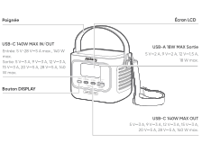
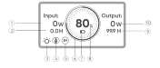
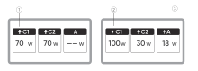
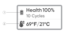
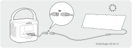
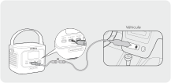

# INFORMATIONS DE SÉCURITÉ IMPORTANTES

<strong>INSTRUCTIONS CONCERNANT LES RISQUES D’INCENDIE, DE CHOC ÉLECTRIQUE OU DE BLESSURES</strong>

<table class="manual-callout-table" data-callout-variant="warning" lang="fr" style="width:100%; border-collapse:collapse; margin:0 0 16px 0;"><tbody><tr><td class="manual-callout-label" style="width:16%; border:1px solid #000; padding:6px 8px; vertical-align:top;">
<strong>AVERTISSEMENT:</strong>
AVERTISSEMENT:ATTENTIONREMARQUE</td><td class="manual-callout-body" style="border:1px solid #000; padding:6px 8px; vertical-align:top;">
<strong>Respectez toujours les précautions suivantes lors de l’utilisation du produit.</strong>

</td></tr></tbody></table>

- Lisez toutes les instructions avant d'utiliser le produit.

- Afin de réduire le risque de blessures, une surveillance étroite est nécessaire lorsque le produit est utilisé à proximité d'enfants.

- Ne mettez pas les doigts ou les mains dans le produit.

- N\'exposez pas la batterie externe à la pluie ou à la neige.

- N'exposez pas la batterie externe à la chaleur ou au feu. Ne la rangez pas à la lumière directe du soleil ni dans un véhicule.

- L\'utilisation d\'une alimentation ou d\'un chargeur non recommandé ou non vendu par le fabricant de la batterie externe peut entraîner un risque d\'incendie ou de blessures corporelles.

- N\'utilisez pas la batterie externe au-delà de sa puissance de sortie nominale. Une surcharge des sorties au-delà de la valeur nominale peut entraîner un risque d\'incendie ou de blessures corporelles.

- N\'utilisez pas une batterie externe endommagée ou modifiée. Les batteries endommagées ou modifiées peuvent avoir un comportement imprévisible pouvant provoquer un incendie, une explosion ou un risque de blessures.

- Ne démontez pas la batterie externe. Confiez-la à un réparateur qualifié lorsqu'un entretien ou une réparation est nécessaire. Un remontage incorrect peut entraîner un risque d'incendie ou de blessures corporelles.

- N'exposez pas la batterie externe au feu ni à des températures excessives. L'exposition au feu ou à une température supérieure à 60 °C peut provoquer une explosion.

- Faites effectuer l\'entretien par un technicien de service ou de réparation qualifié utilisant uniquement des pièces de rechange identiques. Cela garantira le maintien de la sécurité du produit.

- Éteignez la batterie externe lorsqu\'elle n\'est pas utilisée.

CONSERVEZ CES INSTRUCTIONS

<table class="manual-callout-table" data-callout-variant="caution" lang="fr" style="width:100%; border-collapse:collapse; margin:0 0 16px 0;"><tbody><tr><td class="manual-callout-label" style="width:16%; border:1px solid #000; padding:6px 8px; vertical-align:top;">
<strong>ATTENTION</strong>
AVERTISSEMENT:ATTENTIONREMARQUE</td><td class="manual-callout-body" style="border:1px solid #000; padding:6px 8px; vertical-align:top;">
Risque d’incendie et de brûlures. Ne pas ouvrir, écraser, chauffer au-delà de 60 °C ni incinérer. Suivre les instructions du fabricant.

</td></tr></tbody></table>

La mise au rebut d\'une batterie dans le feu ou dans un four chaud, ou l\'écrasement ou le découpage mécanique d\'une batterie, pouvant entraîner une explosion ; le fait de laisser une batterie dans un environnement à température extrêmement élevée pouvant entraîner une explosion ou une fuite de liquide ou de gaz inflammable ; et une batterie soumise à une pression d\'air extrêmement basse pouvant entraîner une explosion ou une fuite de liquide ou de gaz inflammable.

# INSTRUCTIONS D'ENTRETIEN PAR L'UTILISATEUR

Au cours du cycle des produits de stockage d\'énergie, une certaine dégradation de la capacité et de l\'énergie se produira. À mesure que le nombre de cycles d\'utilisation augmente et que la durée de stockage s\'allonge, cette dégradation s\'intensifiera progressivement, ce qui est un phénomène normal conforme au modèle de vieillissement naturel des cellules de batterie.

# SIGNIFICATION DES SYMBOLES

<figure aria-label="SIGNIFICATION DES SYMBOLES" class="hb-symbol-signal-composition" data-component-id="HB-TABLE-SYMBOL-SIGNAL"><table class="hb-symbol-signal-table"><colgroup><col class="hb-symbol-signal-col-label"/><col class="hb-symbol-signal-col-meaning"/></colgroup><thead><tr><th class="hb-symbol-signal-label-heading" scope="col">
Symbole
</th><th class="hb-symbol-signal-meaning-heading" scope="col">
Signification
</th></tr></thead><tbody><tr><td class="hb-symbol-signal-label-cell">⚠AVERTISSEMENT</td><td class="hb-symbol-signal-meaning-cell">
Pratiques dangereuses pouvant entraîner des blessures graves, la mort et/ou des dommages matériels.
</td></tr><tr><td class="hb-symbol-signal-label-cell">⚠ATTENTION</td><td class="hb-symbol-signal-meaning-cell">
Pratiques dangereuses pouvant entraîner des blessures corporelles et/ou des dommages matériels.
</td></tr><tr><td class="hb-symbol-signal-label-cell">REMARQUE</td><td class="hb-symbol-signal-meaning-cell">
Pratiques dangereuses pouvant entraîner des dommages à l'équipement, une perte de données, une détérioration des performances ou des résultats inattendus.
</td></tr><tr><td class="hb-symbol-signal-label-cell">CONSEILS</td><td class="hb-symbol-signal-meaning-cell">
Complémente les informations importantes ou les conseils d'utilisation dans le texte.
</td></tr></tbody></table></figure>

<figure aria-label="Symbole / Signification" class="hb-symbol-pair-composition" data-component-id="HB-TABLE-SYMBOL-ICON">

<table class="hb-symbol-panel-table"><colgroup><col class="hb-symbol-col-icon"/><col class="hb-symbol-col-meaning"/></colgroup><thead><tr><th class="hb-symbol-icon-heading" scope="col">
Symbole
</th><th class="hb-symbol-meaning-heading" scope="col">
Signification
</th></tr></thead><tbody><tr><td class="hb-symbol-icon"></td><td class="hb-symbol-meaning">
Mlise en garde! Le non-respect des messages d'avertissement peut entraîner des blessures.
</td></tr><tr><td class="hb-symbol-icon"></td><td class="hb-symbol-meaning">
Lire le manuel de l'opérateur.
</td></tr><tr><td class="hb-symbol-icon"></td><td class="hb-symbol-meaning">
Ce symbole indique que le produit ne doit pas être jeté avec les ordures ménagères. Il doit être apporté à un point de collecte désigné pour un recyclage approprié. Une élimination et un recyclage corrects contribuent à la protection de l’environnement. Pour plus d’informations, veuillez contacter votre autorité locale, le service de gestion des déchets ou le revendeur du produit.
</td></tr><tr><td class="hb-symbol-icon"></td><td class="hb-symbol-meaning">
Les piles et accumulateurs ne doivent pas être jetés avec les ordures ménagères. En tant que consommateur, vous êtes légalement tenu de déposer toutes les piles et accumulateurs dans des points de collecte désignés, qu'ils contiennent ou non des substances dangereuses. Veuillez rapporter les piles et accumulateurs usagés à un point de collecte local, un centre de recyclage ou au détaillant où ils ont été achetés. Une élimination appropriée garantit un recyclage respectueux de l'environnement et prévient les dommages potentiels pour la santé humaine et l'environnement.
</td></tr></tbody></table>

<table class="hb-symbol-panel-table"><colgroup><col class="hb-symbol-col-icon"/><col class="hb-symbol-col-meaning"/></colgroup><thead><tr><th class="hb-symbol-icon-heading" scope="col">
Symbole
</th><th class="hb-symbol-meaning-heading" scope="col">
Signification
</th></tr></thead><tbody><tr><td class="hb-symbol-icon"></td><td class="hb-symbol-meaning">
Ne démontez pas le produit.
</td></tr><tr><td class="hb-symbol-icon"></td><td class="hb-symbol-meaning">
Ne pas fumer ni utiliser de flamme nue
</td></tr><tr><td class="hb-symbol-icon"></td><td class="hb-symbol-meaning">
Les enfants ne sont pas admis.
</td></tr><tr><td class="hb-symbol-icon"></td><td class="hb-symbol-meaning">
Ce symbole indique que le produit contient une batterie lithium-ion (Li-ion), qui doit être éliminée ou recyclée de manière appropriée.
</td></tr></tbody></table>

</figure>

# CONTENU DE LA BOÎTE

<figure aria-label="CONTENU DE LA BOÎTE" class="hb-inbox-composition" data-card-count="3" data-component-id="HB-SPECIAL-INBOX" data-inbox-variant="three-card-responsive"><ol class="hb-inbox-grid"><li class="hb-inbox-card" data-item-number="1">

<strong>Jackery Explorer 100D</strong>

</li><li class="hb-inbox-card" data-item-number="2">

<strong>Câble USB-C</strong>

</li><li class="hb-inbox-card" data-item-number="3">

<strong>Manuel d'utilisation</strong>

</li></ol></figure>

# APERÇU DU PRODUIT

<figure>

</figure>

<strong>Des sangles supplémentaires peuvent être achetées et fixées sur les côtés du produit.</strong>

# AFFICHAGE LCD

## INTERFACE 1

<figure aria-label="LCD icon meanings" class="hb-lcd-table-composition" data-component-id="HB-TABLE-LCD-ICON" tabindex="0"><table class="hb-lcd-icon-table"><colgroup><col class="hb-lcd-col-number"/><col class="hb-lcd-col-icon"/><col class="hb-lcd-col-name"/><col class="hb-lcd-col-description"/></colgroup><tbody><tr><td class="hb-lcd-number">
1
</td><td class="hb-lcd-icon"></td><td class="hb-lcd-name">
Puissance d’Entrée
</td><td class="hb-lcd-description">
Affiche la puissance d'entrée en watts.
</td></tr><tr><td class="hb-lcd-number">
2
</td><td class="hb-lcd-icon"></td><td class="hb-lcd-name">
Temps de Charge Restant
</td><td class="hb-lcd-description">
Affiche le temps de charge restant.
</td></tr><tr><td class="hb-lcd-number">
3
</td><td class="hb-lcd-icon"></td><td class="hb-lcd-name">
Mode continu
</td><td class="hb-lcd-description">
Allumé : Le mode continu est activé.

Éteint : Le mode continu est désactivé.
</td></tr><tr><td class="hb-lcd-number">
4
</td><td class="hb-lcd-icon"></td><td class="hb-lcd-name">
Limitation de puissance thermique
</td><td class="hb-lcd-description">
Allumé : La température de la batterie est élevée. La limite de puissance de décharge est activée.

Éteint : La limite de puissance de décharge est désactivée.
</td></tr><tr><td class="hb-lcd-number">
5
</td><td class="hb-lcd-icon"></td><td class="hb-lcd-name">
Mode d’Économie d’Énergie
</td><td class="hb-lcd-description">
Allumé : Mode d'économie d'énergie activé.

Éteint : Mode d'économie d'énergie désactivé.
</td></tr><tr><td class="hb-lcd-number">
6
</td><td class="hb-lcd-icon"></td><td class="hb-lcd-name">
Indicateur de Puissance de la Batterie
</td><td class="hb-lcd-description">
Lorsque le produit est en charge, le cercle orange autour du pourcentage de batterie s’allume en séquence. Lorsqu’il charge d’autres appareils, le cercle orange reste allumé.
</td></tr><tr><td class="hb-lcd-number">
7
</td><td class="hb-lcd-icon"></td><td class="hb-lcd-name">
Indicateur de Batterie Faible
</td><td class="hb-lcd-description">
Allumé : Le niveau de la batterie est inférieur à 20 %.

Clignotant : Le niveau de la batterie est inférieur à 5 %.

Éteint : Le niveau de la batterie n'est pas inférieur à 20 % ou le produit est en charge.
</td></tr><tr><td class="hb-lcd-number">
8
</td><td class="hb-lcd-icon"></td><td class="hb-lcd-name">
Pourcentage de Batterie Restant
</td><td class="hb-lcd-description">
Affiche le pourcentage de batterie restant.
</td></tr><tr><td class="hb-lcd-number">
9
</td><td class="hb-lcd-icon"></td><td class="hb-lcd-name">
Temps de Décharge Restant
</td><td class="hb-lcd-description">
Affiche le temps de décharge restant.
</td></tr><tr><td class="hb-lcd-number">
10
</td><td class="hb-lcd-icon"></td><td class="hb-lcd-name">
Puissance de Sortie
</td><td class="hb-lcd-description">
Affiche la puissance de sortie en watts.
</td></tr></tbody></table></figure>

<figure aria-label="LCD icon meanings" class="hb-lcd-table-composition" data-component-id="HB-TABLE-LCD-ICON" tabindex="0"><table class="hb-lcd-icon-table"><colgroup><col class="hb-lcd-col-icon"/><col class="hb-lcd-col-name"/><col class="hb-lcd-col-description"/></colgroup><tbody><tr><td class="hb-lcd-icon"></td><td class="hb-lcd-name">
Code d’erreur
</td><td class="hb-lcd-description">
Retirez la charge ou débranchez la prise de charge. Si le problème persiste, veuillez contacter le service à la clientèle de Jackery.
</td></tr><tr><td class="hb-lcd-icon"></td><td class="hb-lcd-name">
Indicateur de Température Élevée
</td><td class="hb-lcd-description">
La protection contre les températures élevées est déclenchée. Le produit peut cesser de fonctionner jusqu'à ce que sa température revienne dans la plage de fonctionnement normale.
</td></tr><tr><td class="hb-lcd-icon"></td><td class="hb-lcd-name">
Indicateur de Basse Température
</td><td class="hb-lcd-description">
La protection contre les basses températures est déclenchée. Le produit peut cesser de fonctionner jusqu'à ce que sa température revienne dans la plage de fonctionnement normale.
</td></tr></tbody></table></figure>

## INTERFACE 2

<figure aria-label="LCD icon meanings" class="hb-lcd-table-composition" data-component-id="HB-TABLE-LCD-ICON" tabindex="0"><table class="hb-lcd-icon-table"><colgroup><col class="hb-lcd-col-number"/><col class="hb-lcd-col-icon"/><col class="hb-lcd-col-name"/><col class="hb-lcd-col-description"/></colgroup><tbody><tr><td class="hb-lcd-number">
1
</td><td class="hb-lcd-icon"></td><td class="hb-lcd-name">
Indicateur de décharge
</td><td class="hb-lcd-description">
Ce port USB est en cours de décharge.
</td></tr><tr><td class="hb-lcd-number">
2
</td><td class="hb-lcd-icon"></td><td class="hb-lcd-name">
Indicateur de charge
</td><td class="hb-lcd-description">
Ce port USB est en cours de charge.
</td></tr><tr><td class="hb-lcd-number">
3
</td><td class="hb-lcd-icon"></td><td class="hb-lcd-name">
Puissance de charge ou de décharge
</td><td class="hb-lcd-description">
Affiche la puissance de charge ou de décharge du port correspondant.
</td></tr></tbody></table></figure>

## INTERFACE 3

<figure aria-label="LCD icon meanings" class="hb-lcd-table-composition" data-component-id="HB-TABLE-LCD-ICON" tabindex="0"><table class="hb-lcd-icon-table"><colgroup><col class="hb-lcd-col-number"/><col class="hb-lcd-col-icon"/><col class="hb-lcd-col-name"/><col class="hb-lcd-col-description"/></colgroup><tbody><tr><td class="hb-lcd-number">
1
</td><td class="hb-lcd-icon"></td><td class="hb-lcd-name">
Santé de la batterie et nombre de cycles
</td><td class="hb-lcd-description">
Affiche le pourcentage actuel de l’état de santé de la batterie et le nombre de cycles de charge/décharge.

<ul class="simple">
<li>
Vert : L’état de santé de la batterie est élevée.
</li>
<li>
Jaune : L’état de santé de la batterie est modérée.
</li>
<li>
Rouge : L’état de santé de la batterie est faible.
</li>
</ul></td></tr><tr><td class="hb-lcd-number">
2
</td><td class="hb-lcd-icon"></td><td class="hb-lcd-name">
Température de la batterie
</td><td class="hb-lcd-description">
Affiche la température actuelle de la batterie.
</td></tr></tbody></table></figure>

# FONCTIONNEMENT

## SORTIE ON/OFF

Connectez une charge pour démarrer la sortie.

<table class="manual-callout-table" data-callout-variant="caution" lang="fr" style="width:100%; border-collapse:collapse; margin:0 0 16px 0;"><tbody><tr><td class="manual-callout-label" style="width:16%; border:1px solid #000; padding:6px 8px; vertical-align:top;">
<strong>ATTENTION</strong>
AVERTISSEMENT:ATTENTIONREMARQUE</td><td class="manual-callout-body" style="border:1px solid #000; padding:6px 8px; vertical-align:top;"><ul class="simple">
<li>
USB-C 140W MAX est le port de sortie haute puissance Source d'alimentation USB-PD 3 (PS3). Si l'appareil utilisateur ou l'accessoire connecté ne répond pas aux exigences de sécurité, il peut présenter un risque d'incendie. Avant d'utiliser ces ports, assurez-vous que l'appareil ou l'accessoire connecté dispose d'une protection contre les incendies.
</li>
<li>
Ne connectez le Jackery Explorer 100D qu'à des appareils ou accessoires conformes aux clauses 6.3, 6.4 et 6.5 de la norme IEC/EN/UL 62368-1 (ou autres normes équivalentes).
</li>
<li>
Pour obtenir la puissance de sortie maximale, utilisez le câble USB-C vers USB-C 5A (20 V CC/5A, 100 W ; 28 V CC/5A, 140 W).
</li>
</ul>
</td></tr></tbody></table>

## MODE D'ÉCONOMIE D'ÉNERGIE

Le mode Économie d'énergie est désactivé par défaut. Pour éviter une décharge inutile de la batterie causée par l’oubli d’éteindre la sortie, maintenez enfoncé le bouton DISPLAY pour activer le mode d'économie d'énergie. Si aucun appareil n’est connecté ou si la consommation électrique de l’appareil connecté est inférieure à 2 W pendant 2 heures, le produit éteint automatiquement les sorties. Lorsque la sortie est activée, l’icône « 2H » s’affiche à l’écran.

Maintenez enfoncé pendant 3 s pour activer/désactiver le mode Économie d'énergie

<table class="manual-callout-table" data-callout-variant="note" lang="fr" style="width:100%; border-collapse:collapse; margin:0 0 16px 0;"><tbody><tr><td class="manual-callout-label" style="width:16%; border:1px solid #000; padding:6px 8px; vertical-align:top;">
<strong>REMARQUE</strong>
AVERTISSEMENT:ATTENTIONREMARQUE</td><td class="manual-callout-body" style="border:1px solid #000; padding:6px 8px; vertical-align:top;">
Le mode d'économie d'énergie reprend l'état précédent après l'allumage. Un changement de mode nécessite un commutateur manuel.

</td></tr></tbody></table>

## AFFICHAGE LCD

<figure aria-label="AFFICHAGE LCD" class="hb-reference-composition hb-reference-lcd-actions-compact" data-component-id="HB-TABLE-REFERENCE" data-component-variant="lcd-actions-compact" tabindex="0"><table class="hb-reference-table"><thead><tr><th scope="col">
Fonction
</th><th scope="col">
Description
</th></tr></thead><tbody><tr><td>
Activation de l'écran
</td><td>
S'allume lorsque le bouton DISPLAY est brièvement pressé, ou automatiquement lors de la charge ou de la décharge.
</td></tr><tr><td>
Écran toujours allumé
</td><td>
Lorsque l'écran est allumé, appuyez deux fois sur le bouton DISPLAY.
</td></tr><tr><td>
Changement d'écran
</td><td>
Une fois l'écran allumé, appuyez brièvement sur le bouton DISPLAY pour changer de page.
</td></tr><tr><td>
Désactiver l'écran toujours allumé
</td><td>
Appuyez de nouveau deux fois sur le bouton DISPLAY.
</td></tr><tr><td>
Extinction automatique de l'écran
</td><td>
10 secondes après l'allumage sans aucune opération, ou 2 heures après le passage en mode toujours allumé.
</td></tr></tbody></table></figure>

# CHARGE

Chargez complètement le produit avant sa première utilisation.

<table class="manual-callout-table" data-callout-variant="note" lang="fr" style="width:100%; border-collapse:collapse; margin:0 0 16px 0;"><tbody><tr><td class="manual-callout-label" style="width:16%; border:1px solid #000; padding:6px 8px; vertical-align:top;">
<strong>REMARQUE</strong>
AVERTISSEMENT:ATTENTIONREMARQUE</td><td class="manual-callout-body" style="border:1px solid #000; padding:6px 8px; vertical-align:top;"><ul class="simple">
<li>
La température de charge recommandée pour le produit est comprise entre 0°C à 45°C, et la température de décharge est comprise entre -20°C à 45°C. Utiliser le produit en dehors de cette plage de températures peut limiter ses capacités de charge et de décharge, voire empêcher la charge ou la décharge.
</li>
<li>
La puissance de charge et la capacité de la batterie du produit peuvent varier en raison des fluctuations de température.
</li>
</ul>
</td></tr></tbody></table>

## CHARGEMENT PAR CHARGEUR USB-C

<strong>Chargeur USB-C vendu séparément.</strong>

## CHARGEMENT PAR PANNEAUX SOLAIRES (VENDU SÉPARÉMENT)

Ce produit prend en charge une puissance de charge solaire maximale de 100 W et peut être utilisé avec les panneaux solaires de la série Jackery SolarSaga.

Chargé par un panneau solaire de 40 W ou 100 W :

<strong>Le câble DC8020 vers USB-C est vendu séparément.</strong>

Il est recommandé d'utiliser le panneau solaire Jackery pour charger le Jackery Explorer 100D. Assurez-vous que la tension en circuit ouvert (Voc) du panneau solaire se situe dans la plage de tension d'entrée CC du Jackery Explorer 100D (10 V--30 V). Jackery décline toute responsabilité en cas de pertes causées par l'utilisation de panneaux solaires d'autres marques.

## CHARGEMENT PAR PRISE DE VOITURE (VENDU SÉPARÉMENT)

Ce produit peut être chargé à l'aide de chargeurs de voiture 12 V et 24 V. Assurez-vous que le chargeur allume-cigare et l'allume-cigare de la voiture sont bien branchés.

<strong>Le câble de chargeur de voiture et le câble DC8020 vers USB-C sont vendus séparément.</strong>

<table class="manual-callout-table" data-callout-variant="caution" lang="fr" style="width:100%; border-collapse:collapse; margin:0 0 16px 0;"><tbody><tr><td class="manual-callout-label" style="width:16%; border:1px solid #000; padding:6px 8px; vertical-align:top;">
<strong>ATTENTION</strong>
AVERTISSEMENT:ATTENTIONREMARQUE</td><td class="manual-callout-body" style="border:1px solid #000; padding:6px 8px; vertical-align:top;"><ul class="simple">
<li>
Veuillez démarrer le véhicule avant de charger votre batterie externe.
</li>
<li>
Si le véhicule roule sur des routes accidentées, il est interdit d’utiliser le chargeur de voiture afin d’éviter tout risque de surchauffe dû à une mauvaise connexion. La société ne sera pas responsable des pertes causées par une utilisation non conforme.
</li>
</ul>
</td></tr></tbody></table>

# STOCKAGE

Conservez le produit dans un endroit propre et sec avec une ventilation adéquate. Température et humidité de stockage :

- Température de stockage: -20°C à 60°C

- Humidité de stockage: 5-95% RH

Si ce produit est stocké pendant une longue période (3 à 6 mois) avec la batterie déchargée, il peut devenir impossible de le recharger. Pour éviter cela et préserver la santé de la batterie, il est recommandé de vérifier et de recharger le produit tous les trois mois, et d\'effectuer un cycle de charge et de décharge complet au moins une fois tous les 6 à 12 mois.

# SPÉCIFICATIONS

## INFORMATIONS GÉNÉRALES

<figure aria-label="INFORMATIONS GÉNÉRALES" class="hb-spec-table-composition"><table class="hb-source-specification hb-spec-table manual-table manual-spec-table"><colgroup><col class="hb-spec-col-label"/><col class="hb-spec-col-value"/></colgroup>
<tbody>
<tr><th class="manual-spec-label hb-spec-label" scope="row">
Nom du produit
</th>
<td class="manual-spec-value hb-spec-value">
Jackery Explorer 100D
</td>
</tr>
<tr><th class="manual-spec-label hb-spec-label" scope="row">
N° modèle
</th>
<td class="manual-spec-value hb-spec-value">
JE-100C
</td>
</tr>
<tr><th class="manual-spec-label hb-spec-label" scope="row">
Capacité
</th>
<td class="manual-spec-value hb-spec-value">
96 Wh (5 Ah/19,2 V DC)
</td>
</tr>
<tr><th class="manual-spec-label hb-spec-label" scope="row">
Cellule Chimique
</th>
<td class="manual-spec-value hb-spec-value">
Li-ion LFP
</td>
</tr>
<tr><th class="manual-spec-label hb-spec-label" scope="row">
Poids
</th>
<td class="manual-spec-value hb-spec-value">
855 g ± 10 g
</td>
</tr>
<tr><th class="manual-spec-label hb-spec-label" scope="row">
Dimensions
</th>
<td class="manual-spec-value hb-spec-value">
(118,7 ± 1) × (82,6 ± 0,5) × (85,68 ± 0,8) mm
</td>
</tr>
<tr><th class="manual-spec-label hb-spec-label" scope="row">
Durée de vie
</th>
<td class="manual-spec-value hb-spec-value">
Capacité de 3000 cycles à 80 % ou plus
</td>
</tr>
</tbody>
</table></figure>

## PORTS D\'ENTRÉE

<figure aria-label="PORTS D'ENTRÉE" class="hb-spec-table-composition"><table class="hb-source-specification hb-spec-table manual-table manual-spec-table"><colgroup><col class="hb-spec-col-label"/><col class="hb-spec-col-value"/></colgroup>
<tbody>
<tr><th class="manual-spec-label hb-spec-label" scope="row">
USB-C1
</th>
<td class="manual-spec-value hb-spec-value">
5V⎓3A, 9V⎓3A, 12V⎓3A, 15V⎓3A, 20V⎓5A, 28V⎓5A, 140W Max

Auto : 12V⎓5A Max, 24V⎓5A Max

PV: 10V-30V⎓, 5A Max, 100W Max

</td>
</tr>
</tbody>
</table></figure>

## PORTS DE SORTIE

<figure aria-label="PORTS DE SORTIE" class="hb-spec-table-composition"><table class="hb-source-specification hb-spec-table manual-table manual-spec-table"><colgroup><col class="hb-spec-col-label"/><col class="hb-spec-col-value"/></colgroup>
<tbody>
<tr><th class="manual-spec-label hb-spec-label" scope="row">
USB-A
</th>
<td class="manual-spec-value hb-spec-value">
5V⎓2A, 9V⎓2A, 12V⎓1.5A, 18W Max
</td>
</tr>
<tr><th class="manual-spec-label hb-spec-label" scope="row">
USB-C1 / USB-C2
</th>
<td class="manual-spec-value hb-spec-value">
5V⎓3A, 9V⎓3A, 12V⎓3A, 15V⎓3A, 20V⎓5A, 28V⎓5A, 140W Max
</td>
</tr>
</tbody>
</table></figure>

## SORTIE TOTALE

<figure aria-label="SORTIE TOTALE" class="hb-spec-table-composition"><table class="hb-source-specification hb-spec-table manual-table manual-spec-table"><colgroup><col class="hb-spec-col-label"/><col class="hb-spec-col-value"/></colgroup>
<tbody>
<tr><th class="manual-spec-label hb-spec-label" scope="row">
USB-C1 + USB-C2
</th>
<td class="manual-spec-value hb-spec-value">
( 70W + 70W ) Max
</td>
</tr>
<tr><th class="manual-spec-label hb-spec-label" scope="row">
USB-C1 + USB-A / USB-C2 + USB-A
</th>
<td class="manual-spec-value hb-spec-value">
( 140W + 18W ) Max
</td>
</tr>
<tr><th class="manual-spec-label hb-spec-label" scope="row">
USB-C1 + USB-C2 + USB-A
</th>
<td class="manual-spec-value hb-spec-value">
( 70W + 70W + 18W ) Max
</td>
</tr>
</tbody>
</table></figure>

## TEMPÉRATURE DE FONCTIONNEMENT

<figure aria-label="TEMPÉRATURE DE FONCTIONNEMENT" class="hb-spec-table-composition"><table class="hb-source-specification hb-spec-table manual-table manual-spec-table"><colgroup><col class="hb-spec-col-label"/><col class="hb-spec-col-value"/></colgroup>
<tbody>
<tr><th class="manual-spec-label hb-spec-label" scope="row">
Température de charge
</th>
<td class="manual-spec-value hb-spec-value">
0°C à 45°C
</td>
</tr>
<tr><th class="manual-spec-label hb-spec-label" scope="row">
Température de décharge
</th>
<td class="manual-spec-value hb-spec-value">
-20°C à 45°C
</td>
</tr>
</tbody>
</table></figure>

※ USB Type-C® et USB-C® sont des marques déposées de USB Implementers Forum.

# GARANTIE

Contactez-nous

Pour toute question ou tout commentaire concernant nos produits, veuillez envoyer un courriel à <a class="reference external" href="mailto:hello.eu@jackery.com">hello.eu@jackery.com</a>, et nous vous répondrons dès que possible. En cas de problème de qualité avec le produit, vous pouvez demander un remplacement ou un remboursement en soumettant un formulaire de demande à www.jackery.com.

Service à la clientèle

Garantie limitée de 2 ans

<a class="reference external" href="mailto:hello.eu@jackery.com">hello.eu@jackery.com</a>

Soutien technique à vie

