# PRECAUZIONI DI SICUREZZA

<strong>ISTRUZIONI RELATIVE AI RISCHI DI INCENDIO, SCOSSA ELETTRICA O LESIONI ALLE PERSONE</strong>

<table class="manual-callout-table" data-callout-variant="warning" lang="it" style="width:100%; border-collapse:collapse; margin:0 0 16px 0;"><tbody><tr><td class="manual-callout-label" style="width:16%; border:1px solid #000; padding:6px 8px; vertical-align:top;">
<strong>AVVERTENZA</strong>
AVVERTENZAATTENZIONENOTA</td><td class="manual-callout-body" style="border:1px solid #000; padding:6px 8px; vertical-align:top;">
<strong>Seguire sempre queste precauzioni di base durante l’utilizzo di questo prodotto.</strong>

</td></tr></tbody></table>

- Leggere tutte le istruzioni prima di utilizzare il prodotto.

- Per ridurre il rischio di lesioni, è necessaria una stretta supervisione quando il prodotto viene utilizzato vicino a bambini.

- Non introdurre le dita o le mani nel prodotto.

- Non esporre il power bank alla pioggia o alla neve.

- Non esporre il power bank al calore o al fuoco. Non conservarlo alla luce diretta del sole o all\'interno di un veicolo.

- L\'uso di un alimentatore o di un caricabatterie non raccomandato o non venduto dal produttore del power bank può comportare il rischio di incendio o di lesioni alle persone.

- Non utilizzare il power bank oltre la sua potenza di uscita nominale. Il sovraccarico delle uscite oltre il valore nominale può comportare il rischio di incendio o di lesioni alle persone.

- Non utilizzare un power bank danneggiato o modificato. Le batterie danneggiate o modificate possono presentare comportamenti imprevedibili, con conseguente rischio di incendio, esplosione o lesioni.

- Non smontare il power bank. Rivolgersi a un tecnico qualificato quando sono necessari interventi di manutenzione o riparazione. Un riassemblaggio errato può comportare il rischio di incendio o di lesioni alle persone.

- Non esporre il power bank al fuoco o a temperature eccessive. L'esposizione al fuoco o a temperature superiori a 60 °C può causare un'esplosione.

- Fare eseguire la manutenzione da un tecnico qualificato utilizzando esclusivamente parti di ricambio identiche. In questo modo si garantisce il mantenimento della sicurezza del prodotto.

- Spegnere il power bank quando non è in uso.

CONSERVARE QUESTE ISTRUZIONI

<table class="manual-callout-table" data-callout-variant="caution" lang="it" style="width:100%; border-collapse:collapse; margin:0 0 16px 0;"><tbody><tr><td class="manual-callout-label" style="width:16%; border:1px solid #000; padding:6px 8px; vertical-align:top;">
<strong>ATTENZIONE</strong>
AVVERTENZAATTENZIONENOTA</td><td class="manual-callout-body" style="border:1px solid #000; padding:6px 8px; vertical-align:top;">
Rischio di incendio e ustioni. Non aprire, schiacciare, riscaldare oltre 60 °C né incenerire. Seguire le istruzioni del produttore.

</td></tr></tbody></table>

Lo smaltimento di una batteria nel fuoco o in un forno caldo, oppure lo schiacciamento o il taglio meccanico di una batteria, che può provocare un\'esplosione; lasciare una batteria in un ambiente a temperatura estremamente elevata, che può provocare un\'esplosione o la fuoriuscita di liquidi o gas infiammabili; e una batteria sottoposta a una pressione dell\'aria estremamente bassa, che può provocare un\'esplosione o la fuoriuscita di liquidi o gas infiammabili.

# ISTRUZIONI PER LA MANUTENZIONE DA PARTE DELL'UTENTE

Durante il ciclo di vita dei prodotti per l'accumulo di energia, è previsto un certo grado di degrado della capacità e dell'energia. Con l'aumentare dei cicli di carica e scarica e il prolungarsi del tempo di immagazzinamento, tale degrado tenderà a intensificarsi gradualmente. Si tratta di un fenomeno normale, coerente con il naturale invecchiamento delle celle della batteria.

# SIGNIFICATO DEI SIMBOLI

<figure aria-label="SIGNIFICATO DEI SIMBOLI" class="hb-symbol-signal-composition" data-component-id="HB-TABLE-SYMBOL-SIGNAL"><table class="hb-symbol-signal-table"><colgroup><col class="hb-symbol-signal-col-label"/><col class="hb-symbol-signal-col-meaning"/></colgroup><thead><tr><th class="hb-symbol-signal-label-heading" scope="col">
Simbolo
</th><th class="hb-symbol-signal-meaning-heading" scope="col">
Significato
</th></tr></thead><tbody><tr><td class="hb-symbol-signal-label-cell">⚠AVVERTENZA</td><td class="hb-symbol-signal-meaning-cell">
Pratiche pericolose che possono causare gravi lesioni, morte e/o danni materiali.
</td></tr><tr><td class="hb-symbol-signal-label-cell">⚠ATTENZIONE</td><td class="hb-symbol-signal-meaning-cell">
Pratiche pericolose che possono causare lesioni personali e/o danni materiali.
</td></tr><tr><td class="hb-symbol-signal-label-cell">NOTA</td><td class="hb-symbol-signal-meaning-cell">
Pratiche pericolose che possono causare danni all'apparecchiatura, perdita di dati, deterioramento delle prestazioni o risultati imprevisti.
</td></tr><tr><td class="hb-symbol-signal-label-cell">SUGGERIMENTO</td><td class="hb-symbol-signal-meaning-cell">
Integra le informazioni importanti o i consigli operativi presenti nel testo.
</td></tr></tbody></table></figure>

<figure aria-label="Simbolo / Significato" class="hb-symbol-pair-composition" data-component-id="HB-TABLE-SYMBOL-ICON">

<table class="hb-symbol-panel-table"><colgroup><col class="hb-symbol-col-icon"/><col class="hb-symbol-col-meaning"/></colgroup><thead><tr><th class="hb-symbol-icon-heading" scope="col">
Simbolo
</th><th class="hb-symbol-meaning-heading" scope="col">
Significato
</th></tr></thead><tbody><tr><td class="hb-symbol-icon"></td><td class="hb-symbol-meaning">
Simboli di avvertenza e cautela. Da leggere assolutamente per avvisare le persone di potenziali pericoli o rischi.
</td></tr><tr><td class="hb-symbol-icon"></td><td class="hb-symbol-meaning">
Prima dell’utilizzo, leggere il manuale d’istruzioni.
</td></tr><tr><td class="hb-symbol-icon"></td><td class="hb-symbol-meaning">
Questo simbolo indica che il prodotto non va smaltito come rifiuto domestico e deve essere consegnato per il riciclaggio a un centro di raccolta designato. Smaltire adeguatamente e riciclare aiuta a proteggere l’ambiente. Per maggiori informazioni riguardo lo smaltimento e il riciclaggio di questo prodotto, contattare la propria comunità locale, i servizi di smaltimento o il proprio fornitore.
</td></tr><tr><td class="hb-symbol-icon"></td><td class="hb-symbol-meaning">
Batterie e accumulatori non devono essere smaltiti insieme ai rifiuti domestici. In qualità di consumatore, sei legalmente tenuto a smaltire tutte le batterie e gli accumulatori presso punti di raccolta designati, indipendentemente dal fatto che contengano sostanze pericolose. Restituisci le batterie e gli accumulatori usati a un punto di raccolta locale, a un centro di riciclo o al rivenditore presso il quale sono stati acquistati. Uno smaltimento corretto garantisce un riciclo rispettoso dell'ambiente e previene potenziali danni alla salute umana e all'ambiente.
</td></tr></tbody></table>

<table class="hb-symbol-panel-table"><colgroup><col class="hb-symbol-col-icon"/><col class="hb-symbol-col-meaning"/></colgroup><thead><tr><th class="hb-symbol-icon-heading" scope="col">
Simbolo
</th><th class="hb-symbol-meaning-heading" scope="col">
Significato
</th></tr></thead><tbody><tr><td class="hb-symbol-icon"></td><td class="hb-symbol-meaning">
Vermeiden Sie Hitze.
</td></tr><tr><td class="hb-symbol-icon"></td><td class="hb-symbol-meaning">
Tenere il prodotto lontano da fiamme.
</td></tr><tr><td class="hb-symbol-icon"></td><td class="hb-symbol-meaning">
Tenere lontano dalla portata dei bambini.
</td></tr><tr><td class="hb-symbol-icon"></td><td class="hb-symbol-meaning">
Questo simbolo indica che all’interno del prodotto è presente una batteria agli ioni di litio (Li-ion), la quale va smaltita o riciclata adeguatamente.
</td></tr></tbody></table>

</figure>

# CONTENUTO DELLA CONFEZIONE

<figure aria-label="CONTENUTO DELLA CONFEZIONE" class="hb-inbox-composition" data-card-count="3" data-component-id="HB-SPECIAL-INBOX" data-inbox-variant="three-card-responsive"><ol class="hb-inbox-grid"><li class="hb-inbox-card" data-item-number="1">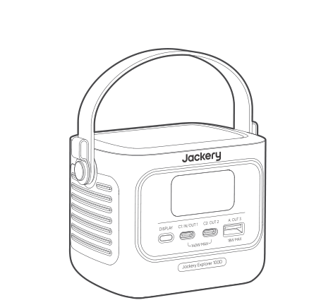

<strong>Jackery Explorer 100D</strong>

</li><li class="hb-inbox-card" data-item-number="2">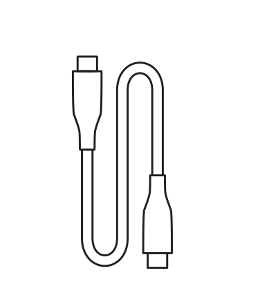

<strong>Cavo USB-C</strong>

</li><li class="hb-inbox-card" data-item-number="3">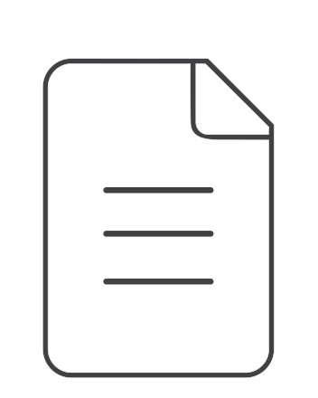

<strong>Manuale d'uso</strong>

</li></ol></figure>

# PANORAMICA DEL PRODOTTO

<figure>
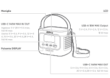
</figure>

<strong>È possibile acquistare cinghie aggiuntive e fissarle ai lati del prodotto.</strong>

# DISPLAY LCD

## INTERFACCIA 1

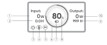

<figure aria-label="LCD icon meanings" class="hb-lcd-table-composition" data-component-id="HB-TABLE-LCD-ICON" tabindex="0"><table class="hb-lcd-icon-table"><colgroup><col class="hb-lcd-col-number"/><col class="hb-lcd-col-icon"/><col class="hb-lcd-col-name"/><col class="hb-lcd-col-description"/></colgroup><tbody><tr><td class="hb-lcd-number">
1
</td><td class="hb-lcd-icon"></td><td class="hb-lcd-name">
Potenza in ingresso
</td><td class="hb-lcd-description">
Visualizza la potenza di ingresso in watt.
</td></tr><tr><td class="hb-lcd-number">
2
</td><td class="hb-lcd-icon"></td><td class="hb-lcd-name">
Tempo di carica rimanente
</td><td class="hb-lcd-description">
Visualizza il tempo residuo di carica.
</td></tr><tr><td class="hb-lcd-number">
3
</td><td class="hb-lcd-icon"></td><td class="hb-lcd-name">
Modalità sempre attiva
</td><td class="hb-lcd-description">
On: la modalità sempre attiva è abilitata.

Off: la modalità sempre attiva è disabilitata.
</td></tr><tr><td class="hb-lcd-number">
4
</td><td class="hb-lcd-icon"></td><td class="hb-lcd-name">
Limitazione termica della potenza
</td><td class="hb-lcd-description">
On: la temperatura della batteria è elevata. Il limite di potenza in scarica è abilitato.

Off: il limite di potenza in scarica è disabilitato.
</td></tr><tr><td class="hb-lcd-number">
5
</td><td class="hb-lcd-icon"></td><td class="hb-lcd-name">
Modalità di risparmio energetico
</td><td class="hb-lcd-description">
Acceso: La modalità di risparmio energetico è attivata.

Spento: La modalità di risparmio energetico è disattivata.
</td></tr><tr><td class="hb-lcd-number">
6
</td><td class="hb-lcd-icon">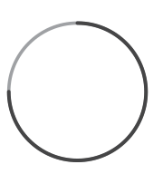</td><td class="hb-lcd-name">
Indicatore di carica della batteria
</td><td class="hb-lcd-description">
Quando il prodotto è in carica, il cerchio arancione attorno alla percentuale della batteria si accende in sequenza. Durante la ricarica di altri dispositivi, il cerchio arancione rimarrà acceso.
</td></tr><tr><td class="hb-lcd-number">
7
</td><td class="hb-lcd-icon"></td><td class="hb-lcd-name">
Indicatore di batteria scarica
</td><td class="hb-lcd-description">
Acceso: il livello della batteria è inferiore al 20%.

Lampeggiante: il livello della batteria è inferiore al 5%.

Spento: il livello della batteria non è inferiore al 20% oppure il prodotto è in carica.
</td></tr><tr><td class="hb-lcd-number">
8
</td><td class="hb-lcd-icon"></td><td class="hb-lcd-name">
Percentuale di batteria residua
</td><td class="hb-lcd-description">
Mostra la percentuale residua della batteria.
</td></tr><tr><td class="hb-lcd-number">
9
</td><td class="hb-lcd-icon"></td><td class="hb-lcd-name">
Tempo di scarica rimanente
</td><td class="hb-lcd-description">
Visualizza il tempo residuo di scarica.
</td></tr><tr><td class="hb-lcd-number">
10
</td><td class="hb-lcd-icon"></td><td class="hb-lcd-name">
Potenza in uscita
</td><td class="hb-lcd-description">
Visualizza la potenza di uscita in watt.
</td></tr></tbody></table></figure>

<figure aria-label="LCD icon meanings" class="hb-lcd-table-composition" data-component-id="HB-TABLE-LCD-ICON" tabindex="0"><table class="hb-lcd-icon-table"><colgroup><col class="hb-lcd-col-icon"/><col class="hb-lcd-col-name"/><col class="hb-lcd-col-description"/></colgroup><tbody><tr><td class="hb-lcd-icon"></td><td class="hb-lcd-name">
Codice di errore
</td><td class="hb-lcd-description">
Rimuovere il carico o scollegare la spina di ricarica. Se il problema persiste, contattare l’assistenza clienti Jackery.
</td></tr><tr><td class="hb-lcd-icon"></td><td class="hb-lcd-name">
Indicatore di temperatura elevata
</td><td class="hb-lcd-description">
La protezione da alta temperatura è stata attivata. Il prodotto potrebbe smettere di funzionare finché la temperatura non rientra nel normale intervallo operativo.
</td></tr><tr><td class="hb-lcd-icon"></td><td class="hb-lcd-name">
Indicatore di bassa temperatura
</td><td class="hb-lcd-description">
È stata attivata la protezione da bassa temperatura. Il prodotto potrebbe smettere di funzionare finché la temperatura non rientra nel normale intervallo operativo.
</td></tr></tbody></table></figure>

## INTERFACCIA 2

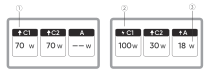

<figure aria-label="LCD icon meanings" class="hb-lcd-table-composition" data-component-id="HB-TABLE-LCD-ICON" tabindex="0"><table class="hb-lcd-icon-table"><colgroup><col class="hb-lcd-col-number"/><col class="hb-lcd-col-icon"/><col class="hb-lcd-col-name"/><col class="hb-lcd-col-description"/></colgroup><tbody><tr><td class="hb-lcd-number">
1
</td><td class="hb-lcd-icon"></td><td class="hb-lcd-name">
Indicatore di scarica
</td><td class="hb-lcd-description">
Questa porta USB è in scarica.
</td></tr><tr><td class="hb-lcd-number">
2
</td><td class="hb-lcd-icon"></td><td class="hb-lcd-name">
Indicatore di carica
</td><td class="hb-lcd-description">
Questa porta USB è in carica.
</td></tr><tr><td class="hb-lcd-number">
3
</td><td class="hb-lcd-icon"></td><td class="hb-lcd-name">
Potenza in carica o in scarica
</td><td class="hb-lcd-description">
Visualizza la potenza in carica o in scarica della porta corrispondente.
</td></tr></tbody></table></figure>

## INTERFACCIA 3

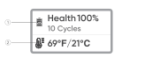

<figure aria-label="LCD icon meanings" class="hb-lcd-table-composition" data-component-id="HB-TABLE-LCD-ICON" tabindex="0"><table class="hb-lcd-icon-table"><colgroup><col class="hb-lcd-col-number"/><col class="hb-lcd-col-icon"/><col class="hb-lcd-col-name"/><col class="hb-lcd-col-description"/></colgroup><tbody><tr><td class="hb-lcd-number">
1
</td><td class="hb-lcd-icon"></td><td class="hb-lcd-name">
Stato della batteria e numero di cicli
</td><td class="hb-lcd-description">
Visualizza la percentuale attuale dello stato di salute della batteria e il numero di cicli di carica/scarica.

<ul class="simple">
<li>
Verde: lo stato di salute della batteria è ottimale.
</li>
<li>
Giallo: lo stato di salute della batteria è moderato.
</li>
<li>
Rosso: lo stato di salute della batteria è basso.
</li>
</ul></td></tr><tr><td class="hb-lcd-number">
2
</td><td class="hb-lcd-icon"></td><td class="hb-lcd-name">
Temperatura della batteria
</td><td class="hb-lcd-description">
Visualizza la temperatura attuale della batteria.
</td></tr></tbody></table></figure>

# OPERAZIONI

## ATTIVAZIONE/DISATTIVAZIONE DELL\'USCITA

Collegare un carico per attivare l’uscita.

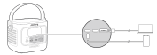

<table class="manual-callout-table" data-callout-variant="caution" lang="it" style="width:100%; border-collapse:collapse; margin:0 0 16px 0;"><tbody><tr><td class="manual-callout-label" style="width:16%; border:1px solid #000; padding:6px 8px; vertical-align:top;">
<strong>ATTENZIONE</strong>
AVVERTENZAATTENZIONENOTA</td><td class="manual-callout-body" style="border:1px solid #000; padding:6px 8px; vertical-align:top;"><ul class="simple">
<li>
USB-C 140W MAX è una porta di uscita ad alta potenza USB-PD Power Source 3 (PS3). Se il dispositivo o l'accessorio collegato non soddisfa i requisiti di sicurezza, potrebbe esserci un rischio di incendio. Prima di utilizzare queste porte, assicurarsi che il dispositivo o l'accessorio collegato sia dotato di protezione antincendio.
</li>
<li>
Collegare Jackery Explorer 100D solo a dispositivi o accessori conformi alle clausole 6.3, 6.4 e 6.5 della norma IEC/EN/UL 62368-1 (o altre norme equivalenti).
</li>
<li>
Per ottenere la massima potenza in uscita, utilizzare il cavo ufficiale Jackery USB-C to USB-C 5A (20V CC/5A, 100W; 28V DC/5A, 140W).
</li>
</ul>
</td></tr></tbody></table>

## MODALITÀ DI RISPARMIO ENERGETICO

La Modalità risparmio energetico è disabilitata per impostazione predefinita. Per evitare un inutile consumo della batteria causato dal mancato spegnimento dell’uscita, tenere premuto il Pulsante DISPLAY per abilitare la Modalità risparmio energetico Se non è collegato alcun dispositivo o se il consumo energetico del dispositivo collegato rimane inferiore a 2 W per 2 ore, il prodotto disattiva automaticamente le uscite. Quando l’uscita è attiva, sullo schermo compare l'icona "2H".

Tenere premuto per 3 secondi per abilitare/disabilitare la Modalità risparmio energetico

<table class="manual-callout-table" data-callout-variant="note" lang="it" style="width:100%; border-collapse:collapse; margin:0 0 16px 0;"><tbody><tr><td class="manual-callout-label" style="width:16%; border:1px solid #000; padding:6px 8px; vertical-align:top;">
<strong>NOTA</strong>
AVVERTENZAATTENZIONENOTA</td><td class="manual-callout-body" style="border:1px solid #000; padding:6px 8px; vertical-align:top;">
La Modalità di risparmio energetico ripristina lo stato precedente dopo l'accensione. Per cambiare modalità è necessario un intervento manuale.

</td></tr></tbody></table>

## ACCENSIONE/SPEGNIMENTO SCHERMO LCD

<figure aria-label="ACCENSIONE/SPEGNIMENTO SCHERMO LCD" class="hb-reference-composition hb-reference-lcd-actions-compact" data-component-id="HB-TABLE-REFERENCE" data-component-variant="lcd-actions-compact" tabindex="0"><table class="hb-reference-table"><thead><tr><th scope="col">
Funzione
</th><th scope="col">
Descrizione
</th></tr></thead><tbody><tr><td>
Attivazione dello schermo
</td><td>
Si accende premendo brevemente il pulsante DISPLAY, oppure automaticamente durante la carica o la scarica.
</td></tr><tr><td>
Schermo sempre acceso
</td><td>
Quando lo schermo è acceso, premere due volte il pulsante DISPLAY.
</td></tr><tr><td>
Cambio schermata
</td><td>
Dopo l'accensione dello schermo, premere brevemente il pulsante DISPLAY per cambiare pagina.
</td></tr><tr><td>
Disattivare lo schermo sempre acceso
</td><td>
Premere di nuovo due volte il pulsante DISPLAY.
</td></tr><tr><td>
Spegnimento automatico dello schermo
</td><td>
10 secondi dopo l'accensione senza alcuna operazione, oppure 2 ore dopo l'attivazione della modalità sempre acceso.
</td></tr></tbody></table></figure>

# RICARICA

Caricare completamente il dispositivo prima del primo utilizzo.

<table class="manual-callout-table" data-callout-variant="note" lang="it" style="width:100%; border-collapse:collapse; margin:0 0 16px 0;"><tbody><tr><td class="manual-callout-label" style="width:16%; border:1px solid #000; padding:6px 8px; vertical-align:top;">
<strong>NOTA</strong>
AVVERTENZAATTENZIONENOTA</td><td class="manual-callout-body" style="border:1px solid #000; padding:6px 8px; vertical-align:top;"><ul class="simple">
<li>
La temperatura consigliata per caricare il prodotto è compresa tra 0 °C e 45 °C, e la temperatura di scarica è anch’essa compresa tra -20 °C e 45 °C. Utilizzare il prodotto al di fuori di questo intervallo di temperatura può limitare le capacità di carica e scarica, o persino impedire la carica o la scarica.
</li>
<li>
La potenza di carica e la capacità della batteria del prodotto possono variare a causa delle fluttuazioni di temperatura.
</li>
</ul>
</td></tr></tbody></table>

## RICARICA TRAMITE CARICATORE USB-C

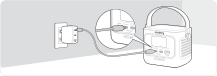

<strong>Caricatore USB-C venduto separatamente.</strong>

## RICARICA TRAMITE PANNELLI SOLARI (VENDUTI SEPARATAMENTE)

Questo prodotto supporta una potenza massima di ricarica solare di 100 W ed è compatibile con i pannelli solari della serie Jackery SolarSaga.

Ricarica tramite un pannello solare da 40 W o 100 W:

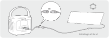

<strong>Il cavo da DC8020 a USB-C è venduto separatamente.</strong>

Si consiglia di utilizzare il pannello solare Jackery per caricare l'Explorer 100D. Assicurarsi che la tensione a circuito aperto (Voc) del pannello solare rientri nell'intervallo di tensione di ingresso CC dell'Explorer 100D (10 V--30 V). Jackery non è responsabile per eventuali danni o perdite derivanti dall'uso di pannelli solari di terze parti.

## RICARICA TRAMITE CARICATORE DA AUTO (VENDUTI SEPARATAMENTE)

Questo prodotto può essere ricaricato utilizzando caricabatterie per auto da 12 V e 24 V. Assicurarsi che il caricabatterie e l\'accendisigari dell\'auto siano ben collegati.

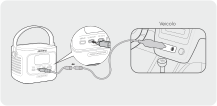

<strong>Il cavo di ricarica per auto e il cavo da DC8020 a USB-C sono venduti separatamente.</strong>

<table class="manual-callout-table" data-callout-variant="caution" lang="it" style="width:100%; border-collapse:collapse; margin:0 0 16px 0;"><tbody><tr><td class="manual-callout-label" style="width:16%; border:1px solid #000; padding:6px 8px; vertical-align:top;">
<strong>ATTENZIONE</strong>
AVVERTENZAATTENZIONENOTA</td><td class="manual-callout-body" style="border:1px solid #000; padding:6px 8px; vertical-align:top;"><ul class="simple">
<li>
Avviare il veicolo prima di caricare il prodotto.
</li>
<li>
Se il veicolo si trova su strade dissestate, è vietato utilizzare il caricabatterie per auto per evitare il rischio di surriscaldamento dovuto a un cattivo collegamento. L’ azienda non sarà responsabile per eventuali danni causati da un utilizzo non conforme.
</li>
</ul>
</td></tr></tbody></table>

# STOCCAGGIO

Conservare il prodotto in un luogo pulito e asciutto, con una ventilazione adeguata. Temperatura e umidità di stoccaggio:

- Temperatura di conservazione: tra -20°C e 60°C

- Umidità di conservazione: 5-95% RH

Se il prodotto viene conservato a lungo termine (da 3 a 6 mesi) con la batteria scarica, potrebbe non essere più possibile ricaricarlo. Per evitarlo e mantenere la salute della batteria, si consiglia di controllare e ricaricare il prodotto ogni tre mesi e di eseguire almeno un ciclo completo di carica e scarica ogni 6-12 mesi.

# SPECIFICHE TECNICHE

## INFORMAZIONI GENERALI

<figure aria-label="INFORMAZIONI GENERALI" class="hb-spec-table-composition"><table class="hb-source-specification hb-spec-table manual-table manual-spec-table"><colgroup><col class="hb-spec-col-label"/><col class="hb-spec-col-value"/></colgroup>
<tbody>
<tr><th class="manual-spec-label hb-spec-label" scope="row">
Nome del prodotto
</th>
<td class="manual-spec-value hb-spec-value">
Jackery Explorer 100D
</td>
</tr>
<tr><th class="manual-spec-label hb-spec-label" scope="row">
Modello n.
</th>
<td class="manual-spec-value hb-spec-value">
JE-100C
</td>
</tr>
<tr><th class="manual-spec-label hb-spec-label" scope="row">
Capacità
</th>
<td class="manual-spec-value hb-spec-value">
96 Wh (5 Ah/19,2 V DC)
</td>
</tr>
<tr><th class="manual-spec-label hb-spec-label" scope="row">
Chimica celle batteria
</th>
<td class="manual-spec-value hb-spec-value">
Li-ion LFP
</td>
</tr>
<tr><th class="manual-spec-label hb-spec-label" scope="row">
Peso
</th>
<td class="manual-spec-value hb-spec-value">
855 g ± 10 g
</td>
</tr>
<tr><th class="manual-spec-label hb-spec-label" scope="row">
Dimensioni
</th>
<td class="manual-spec-value hb-spec-value">
(118,7 ± 1) × (82,6 ± 0,5) × (85,68 ± 0,8) mm
</td>
</tr>
<tr><th class="manual-spec-label hb-spec-label" scope="row">
Durata del ciclo
</th>
<td class="manual-spec-value hb-spec-value">
3000 cicli fino all'80% di capacità
</td>
</tr>
</tbody>
</table></figure>

## PORTE IN INGRESSO

<figure aria-label="PORTE IN INGRESSO" class="hb-spec-table-composition"><table class="hb-source-specification hb-spec-table manual-table manual-spec-table"><colgroup><col class="hb-spec-col-label"/><col class="hb-spec-col-value"/></colgroup>
<tbody>
<tr><th class="manual-spec-label hb-spec-label" scope="row">
USB-C1
</th>
<td class="manual-spec-value hb-spec-value">
5 V⎓3 A, 9 V⎓3 A, 12 V⎓3 A, 15 V⎓3 A, 20 V⎓5 A, 28 V⎓5 A, 140 W max

Auto: 12 V⎓5 A max, 24 V⎓5 A max

PV: 10 V-30 V⎓, 5 A max, 100 W max

</td>
</tr>
</tbody>
</table></figure>

## PORTE IN USCITA

<figure aria-label="PORTE IN USCITA" class="hb-spec-table-composition"><table class="hb-source-specification hb-spec-table manual-table manual-spec-table"><colgroup><col class="hb-spec-col-label"/><col class="hb-spec-col-value"/></colgroup>
<tbody>
<tr><th class="manual-spec-label hb-spec-label" scope="row">
USB-A
</th>
<td class="manual-spec-value hb-spec-value">
5 V⎓2 A, 9 V⎓2 A, 12 V⎓1,5 A, 18 W max
</td>
</tr>
<tr><th class="manual-spec-label hb-spec-label" scope="row">
USB-C1 / USB-C2
</th>
<td class="manual-spec-value hb-spec-value">
5 V⎓3 A, 9 V⎓3 A, 12 V⎓3 A, 15 V⎓3 A, 20 V⎓5 A, 28 V⎓5 A, 140 W max
</td>
</tr>
</tbody>
</table></figure>

## POTENZA TOTALE IN USCITA

<figure aria-label="POTENZA TOTALE IN USCITA" class="hb-spec-table-composition"><table class="hb-source-specification hb-spec-table manual-table manual-spec-table"><colgroup><col class="hb-spec-col-label"/><col class="hb-spec-col-value"/></colgroup>
<tbody>
<tr><th class="manual-spec-label hb-spec-label" scope="row">
USB-C1 + USB-C2
</th>
<td class="manual-spec-value hb-spec-value">
( 70W + 70W ) max
</td>
</tr>
<tr><th class="manual-spec-label hb-spec-label" scope="row">
USB-C1 + USB-A / USB-C2 + USB-A
</th>
<td class="manual-spec-value hb-spec-value">
( 140W + 18W ) max
</td>
</tr>
<tr><th class="manual-spec-label hb-spec-label" scope="row">
USB-C1 + USB-C2 + USB-A
</th>
<td class="manual-spec-value hb-spec-value">
( 70W + 70W + 18W ) max
</td>
</tr>
</tbody>
</table></figure>

## TEMPERATURA DI FUNZIONAMENTO

<figure aria-label="TEMPERATURA DI FUNZIONAMENTO" class="hb-spec-table-composition"><table class="hb-source-specification hb-spec-table manual-table manual-spec-table"><colgroup><col class="hb-spec-col-label"/><col class="hb-spec-col-value"/></colgroup>
<tbody>
<tr><th class="manual-spec-label hb-spec-label" scope="row">
Temperatura di carica
</th>
<td class="manual-spec-value hb-spec-value">
tra 0°C e 45°C
</td>
</tr>
<tr><th class="manual-spec-label hb-spec-label" scope="row">
Temperatura di scarica
</th>
<td class="manual-spec-value hb-spec-value">
tra -20°C e 45°C
</td>
</tr>
</tbody>
</table></figure>

※ USB Type-C® e USB-C® sono marchi registrati di USB Implementers Forum.

# GARANZIA

Contattaci

Per qualsiasi domanda o commento sui nostri prodotti, inviare un'email a <a class="reference external" href="mailto:hello.eu@jackery.com">hello.eu@jackery.com</a> e risponderemo il prima possibile. Se si verifica un problema relativo alla qualità del prodotto, è possibile richiedere una sostituzione o un rimborso compilando un modulo di richiesta all'indirizzo www.jackery.com.

Servizio clienti

Garanzia limitata di 2 anni

<a class="reference external" href="mailto:hello.eu@jackery.com">hello.eu@jackery.com</a>

Assistenza tecnica a vita

