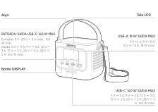
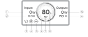
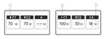
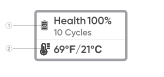
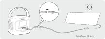
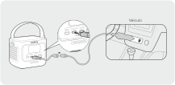

# INFORMAÇÕES IMPORTANTES DE SEGURANÇA

<strong>INSTRUÇÕES RELATIVAS AO RISCO DE INCÊNDIO, CHOQUE ELÉTRICO OU LESÕES PESSOAIS</strong>

<table class="manual-callout-table" data-callout-variant="warning" lang="pt" style="width:100%; border-collapse:collapse; margin:0 0 16px 0;"><tbody><tr><td class="manual-callout-label" style="width:16%; border:1px solid #000; padding:6px 8px; vertical-align:top;">
<strong>AVISO:</strong>
AVISO:CUIDADONOTA</td><td class="manual-callout-body" style="border:1px solid #000; padding:6px 8px; vertical-align:top;">
<strong>Sempre siga estas precauções básicas ao usar este produto.</strong>

</td></tr></tbody></table>

- Leia todas as instruções antes de usar o produto.

- Para reduzir o risco de ferimentos, é necessária supervisão constante quando o produto for utilizado perto de crianças.

- Não coloque os dedos ou as mãos dentro do produto.

- Não exponha o power bank à chuva ou à neve.

- Não exponha o power bank ao calor ou ao fogo. Não armazene sob luz solar direta ou dentro de um veículo.

- O uso de uma fonte de alimentação ou de um carregador que não sejam recomendados ou vendidos pelo fabricante do power bank pode resultar em risco de incêndio ou ferimentos pessoais.

- Não use o power bank acima de sua capacidade nominal de saída. Sobrecarregar as saídas acima da capacidade nominal pode resultar em risco de incêndio ou ferimentos pessoais.

- Não use o power bank danificado ou modificado. Baterias danificadas ou modificadas podem apresentar comportamento imprevisível, resultando em incêndio, explosão ou risco de ferimentos.

- Não desmonte o power bank. Leve-o a um técnico qualificado quando for necessário serviço ou reparo. A remontagem incorreta pode resultar em risco de incêndio ou lesões.

- Não exponha um power bank ao fogo ou à temperatura excessiva. A exposição ao fogo ou à temperatura acima de 60°C pode causar explosão.

- A manutenção deve ser realizada por um técnico qualificado, utilizando apenas peças de reposição idênticas. Isso garantirá que a segurança do produto seja mantida.

- Desligue o power bank quando não estiver em uso.

GUARDE ESTAS INSTRUÇÕES

<table class="manual-callout-table" data-callout-variant="caution" lang="pt" style="width:100%; border-collapse:collapse; margin:0 0 16px 0;"><tbody><tr><td class="manual-callout-label" style="width:16%; border:1px solid #000; padding:6px 8px; vertical-align:top;">
<strong>CUIDADO</strong>
AVISO:CUIDADONOTA</td><td class="manual-callout-body" style="border:1px solid #000; padding:6px 8px; vertical-align:top;">
Risco de incêndio e queimaduras. Não abra, não esmague, não aqueça acima de (60°C) nem incinere. Siga as instruções do fabricante.

</td></tr></tbody></table>

Descartar uma bateria no fogo ou em um forno quente, ou esmagá-la ou cortá-la mecanicamente, pode resultar em explosão; Deixar uma bateria em um ambiente com temperatura extremamente alta pode resultar em explosão ou vazamento de líquido ou gás inflamável; e uma bateria submetida a pressão atmosférica extremamente baixa pode resultar em explosão ou vazamento de líquido ou gás inflamável.

# INSTRUÇÕES DE MANUTENÇÃO DO USUÁRIO

Durante o ciclo de vida de produtos de armazenamento de energia, é esperado certo grau de degradação da capacidade e da energia. À medida que o número de ciclos de carga e descarga aumenta e o tempo de armazenamento se prolonga, essa degradação se intensifica gradualmente, o que é um fenômeno normal consistente com o envelhecimento natural das células da bateria.

# SIGNIFICADO DOS SÍMBOLOS

<figure aria-label="SIGNIFICADO DOS SÍMBOLOS" class="hb-symbol-signal-composition" data-component-id="HB-TABLE-SYMBOL-SIGNAL"><table class="hb-symbol-signal-table"><colgroup><col class="hb-symbol-signal-col-label"/><col class="hb-symbol-signal-col-meaning"/></colgroup><thead><tr><th class="hb-symbol-signal-label-heading" scope="col">
Símbolo
</th><th class="hb-symbol-signal-meaning-heading" scope="col">
Significado
</th></tr></thead><tbody><tr><td class="hb-symbol-signal-label-cell">⚠AVISO</td><td class="hb-symbol-signal-meaning-cell">
Práticas perigosas que podem resultar em lesões graves, morte e/ou danos materiais.
</td></tr><tr><td class="hb-symbol-signal-label-cell">⚠CUIDADO</td><td class="hb-symbol-signal-meaning-cell">
Práticas perigosas que podem resultar em lesões pessoais e/ou danos materiais.
</td></tr><tr><td class="hb-symbol-signal-label-cell">NOTA</td><td class="hb-symbol-signal-meaning-cell">
Práticas perigosas que podem resultar em danos ao equipamento, perda de dados, deterioração do desempenho ou resultados imprevistos.
</td></tr><tr><td class="hb-symbol-signal-label-cell">DICA</td><td class="hb-symbol-signal-meaning-cell">
Complementa informações importantes ou dicas de operação no texto.
</td></tr></tbody></table></figure>

<figure aria-label="Símbolo / Significado" class="hb-symbol-pair-composition" data-component-id="HB-TABLE-SYMBOL-ICON">

<table class="hb-symbol-panel-table"><colgroup><col class="hb-symbol-col-icon"/><col class="hb-symbol-col-meaning"/></colgroup><thead><tr><th class="hb-symbol-icon-heading" scope="col">
Símbolo
</th><th class="hb-symbol-meaning-heading" scope="col">
Significado
</th></tr></thead><tbody><tr><td class="hb-symbol-icon"></td><td class="hb-symbol-meaning">
Símbolos de Advertência e Cuidado. Deve ser lido para alertar sobre potenciais perigos ou riscos.
</td></tr><tr><td class="hb-symbol-icon"></td><td class="hb-symbol-meaning">
Leia o manual do usuário antes de operar.
</td></tr><tr><td class="hb-symbol-icon"></td><td class="hb-symbol-meaning">
Este símbolo indica que o produto não deve ser descartado como lixo doméstico e deve ser encaminhado a um ponto de coleta designado para reciclagem. O descarte e a reciclagem adequados podem ajudar a proteger o meio ambiente. Para obter mais informações sobre o descarte e a reciclagem deste produto, entre em contato com a autoridade local, o serviço de coleta ou o revendedor.
</td></tr><tr><td class="hb-symbol-icon"></td><td class="hb-symbol-meaning">
As baterias e os acumuladores não devem ser descartados junto com o lixo doméstico. Como consumidor, você é legalmente obrigado a descartar todas as baterias e acumuladores em pontos de coleta designados, independentemente de conterem substâncias perigosas. Devolva as baterias e acumuladores usados a um ponto de coleta local, centro de reciclagem ou ao revendedor onde foram comprados. O descarte adequado garante a reciclagem ambientalmente responsável e evita danos potenciais à saúde humana e ao meio ambiente.
</td></tr></tbody></table>

<table class="hb-symbol-panel-table"><colgroup><col class="hb-symbol-col-icon"/><col class="hb-symbol-col-meaning"/></colgroup><thead><tr><th class="hb-symbol-icon-heading" scope="col">
Símbolo
</th><th class="hb-symbol-meaning-heading" scope="col">
Significado
</th></tr></thead><tbody><tr><td class="hb-symbol-icon"></td><td class="hb-symbol-meaning">
Não desmonte o produto.
</td></tr><tr><td class="hb-symbol-icon"></td><td class="hb-symbol-meaning">
Mantenha o produto longe de fogo.
</td></tr><tr><td class="hb-symbol-icon"></td><td class="hb-symbol-meaning">
Mantenha fora do alcance de crianças.
</td></tr><tr><td class="hb-symbol-icon"></td><td class="hb-symbol-meaning">
Este símbolo indica que há uma bateria de íons de lítio (Li-ion) dentro do produto e que ela deve ser descartada ou reciclada corretamente.
</td></tr></tbody></table>

</figure>

# CONTEÚDO DA EMBALAGEM

<figure aria-label="CONTEÚDO DA EMBALAGEM" class="hb-inbox-composition" data-card-count="3" data-component-id="HB-SPECIAL-INBOX" data-inbox-variant="three-card-responsive"><ol class="hb-inbox-grid"><li class="hb-inbox-card" data-item-number="1">

<strong>Jackery Explorer 100D</strong>

</li><li class="hb-inbox-card" data-item-number="2">

<strong>Cabo USB-C</strong>

</li><li class="hb-inbox-card" data-item-number="3">

<strong>Manual do usuário</strong>

</li></ol></figure>

# VISÃO GERAL DO PRODUTO

<figure>

</figure>

<strong>Alças adicionais podem ser compradas e fixadas nas laterais do produto.</strong>

# DISPLAY LCD

## INTERFACE 1

<figure aria-label="LCD icon meanings" class="hb-lcd-table-composition" data-component-id="HB-TABLE-LCD-ICON" tabindex="0"><table class="hb-lcd-icon-table"><colgroup><col class="hb-lcd-col-number"/><col class="hb-lcd-col-icon"/><col class="hb-lcd-col-name"/><col class="hb-lcd-col-description"/></colgroup><tbody><tr><td class="hb-lcd-number">
1
</td><td class="hb-lcd-icon"></td><td class="hb-lcd-name">
Potência de entrada
</td><td class="hb-lcd-description">
Exibe a potência de entrada em watts.
</td></tr><tr><td class="hb-lcd-number">
2
</td><td class="hb-lcd-icon"></td><td class="hb-lcd-name">
Tempo restante de carregamento
</td><td class="hb-lcd-description">
Exibe o tempo de carregamento restante.
</td></tr><tr><td class="hb-lcd-number">
3
</td><td class="hb-lcd-icon"></td><td class="hb-lcd-name">
Modo Sempre Ligado
</td><td class="hb-lcd-description">
Ligado: O Modo Sempre Ligado está ativado.

Desligado: O Modo Sempre Ligado está desativado.
</td></tr><tr><td class="hb-lcd-number">
4
</td><td class="hb-lcd-icon"></td><td class="hb-lcd-name">
Limitação de Potência Térmica
</td><td class="hb-lcd-description">
Ligado: A temperatura da bateria está alta. O limite de potência de descarga está ativado.

Desligado: O limite de potência de descarga está desativado.
</td></tr><tr><td class="hb-lcd-number">
5
</td><td class="hb-lcd-icon"></td><td class="hb-lcd-name">
Modo de economia de energia
</td><td class="hb-lcd-description">
Ligado: O Modo de economia de energia está ativado.

Desligado: O Modo de economia de energia está desativado.
</td></tr><tr><td class="hb-lcd-number">
6
</td><td class="hb-lcd-icon"></td><td class="hb-lcd-name">
Indicador de energia da bateria
</td><td class="hb-lcd-description">
Quando o produto estiver sendo carregado, o círculo laranja ao redor da porcentagem da bateria acenderá em sequência. Ao carregar outros dispositivos, o círculo laranja permanece aceso.
</td></tr><tr><td class="hb-lcd-number">
7
</td><td class="hb-lcd-icon"></td><td class="hb-lcd-name">
Indicador de energia da bateria
</td><td class="hb-lcd-description">
Ligado: O nível da bateria está abaixo de 20%.

Pisca: O nível da bateria está abaixo de 5%.

Desligado: O nível da bateria não está abaixo de 20% ou o produto está carregando.
</td></tr><tr><td class="hb-lcd-number">
8
</td><td class="hb-lcd-icon"></td><td class="hb-lcd-name">
Porcentagem de bateria restante
</td><td class="hb-lcd-description">
Exibe a porcentagem de bateria restante.
</td></tr><tr><td class="hb-lcd-number">
9
</td><td class="hb-lcd-icon"></td><td class="hb-lcd-name">
Tempo de descarga restante
</td><td class="hb-lcd-description">
Exibe o tempo de descarga restante.
</td></tr><tr><td class="hb-lcd-number">
10
</td><td class="hb-lcd-icon"></td><td class="hb-lcd-name">
Potência de saída
</td><td class="hb-lcd-description">
Exibe a potência de saída em watts.
</td></tr></tbody></table></figure>

<figure aria-label="LCD icon meanings" class="hb-lcd-table-composition" data-component-id="HB-TABLE-LCD-ICON" tabindex="0"><table class="hb-lcd-icon-table"><colgroup><col class="hb-lcd-col-icon"/><col class="hb-lcd-col-name"/><col class="hb-lcd-col-description"/></colgroup><tbody><tr><td class="hb-lcd-icon"></td><td class="hb-lcd-name">
Código de falha
</td><td class="hb-lcd-description">
Remova a carga ou desconecte o plugue de carregamento. Se o problema não puder ser resolvido, entre em contato com o Suporte ao Cliente da Jackery.
</td></tr><tr><td class="hb-lcd-icon"></td><td class="hb-lcd-name">
Indicador de alta temperatura
</td><td class="hb-lcd-description">
A proteção contra alta temperatura foi ativada. O produto pode parar de funcionar até que sua temperatura retorne à faixa normal de operação.
</td></tr><tr><td class="hb-lcd-icon"></td><td class="hb-lcd-name">
Indicador de temperatura baixa
</td><td class="hb-lcd-description">
A proteção contra baixa temperatura foi ativada. O produto pode parar de funcionar até que sua temperatura retorne à faixa normal de operação.
</td></tr></tbody></table></figure>

## INTERFACE 2

<figure aria-label="LCD icon meanings" class="hb-lcd-table-composition" data-component-id="HB-TABLE-LCD-ICON" tabindex="0"><table class="hb-lcd-icon-table"><colgroup><col class="hb-lcd-col-number"/><col class="hb-lcd-col-icon"/><col class="hb-lcd-col-name"/><col class="hb-lcd-col-description"/></colgroup><tbody><tr><td class="hb-lcd-number">
1
</td><td class="hb-lcd-icon"></td><td class="hb-lcd-name">
Indicador de descarga
</td><td class="hb-lcd-description">
Esta porta USB está descarregando.
</td></tr><tr><td class="hb-lcd-number">
2
</td><td class="hb-lcd-icon"></td><td class="hb-lcd-name">
Indicador de Carregamento
</td><td class="hb-lcd-description">
Esta porta USB está carregando.
</td></tr><tr><td class="hb-lcd-number">
3
</td><td class="hb-lcd-icon"></td><td class="hb-lcd-name">
Potência de carga ou descarga
</td><td class="hb-lcd-description">
Exibe a potência de carga ou descarga da porta correspondente.
</td></tr></tbody></table></figure>

## INTERFACE 3

<figure aria-label="LCD icon meanings" class="hb-lcd-table-composition" data-component-id="HB-TABLE-LCD-ICON" tabindex="0"><table class="hb-lcd-icon-table"><colgroup><col class="hb-lcd-col-number"/><col class="hb-lcd-col-icon"/><col class="hb-lcd-col-name"/><col class="hb-lcd-col-description"/></colgroup><tbody><tr><td class="hb-lcd-number">
1
</td><td class="hb-lcd-icon"></td><td class="hb-lcd-name">
Saúde da Bateria e Contagem de Ciclos
</td><td class="hb-lcd-description">
Exibe o percentual atual da saúde da bateria e o número de ciclos de carga e descarga.

<ul class="simple">
<li>
Verde: O estado da bateria está bom.
</li>
<li>
Amarelo: O estado da bateria está razoável.
</li>
<li>
Vermelho: O estado da bateria está ruim.
</li>
</ul></td></tr><tr><td class="hb-lcd-number">
2
</td><td class="hb-lcd-icon"></td><td class="hb-lcd-name">
Temperatura da Bateria
</td><td class="hb-lcd-description">
Exibe a temperatura atual da bateria.
</td></tr></tbody></table></figure>

# OPERAÇÕES

## SAÍDA LIGA/DESLIGA

Conecte a uma carga para iniciar a saída.

<table class="manual-callout-table" data-callout-variant="caution" lang="pt" style="width:100%; border-collapse:collapse; margin:0 0 16px 0;"><tbody><tr><td class="manual-callout-label" style="width:16%; border:1px solid #000; padding:6px 8px; vertical-align:top;">
<strong>CUIDADO</strong>
AVISO:CUIDADONOTA</td><td class="manual-callout-body" style="border:1px solid #000; padding:6px 8px; vertical-align:top;"><ul class="simple">
<li>
USB-C 140 W MÁX. é uma porta de saída de alta potência compatível com USB-PD Power Source 3 (PS3). Se o dispositivo do usuário ou acessório conectado não atender aos requisitos de segurança, pode haver risco de incêndio. Antes de usar essas portas, certifique-se de que o dispositivo ou acessório conectado possua proteção contra incêndio.
</li>
<li>
Conecte o 100D apenas a dispositivos ou acessórios que estejam em conformidade com as cláusulas 6.3, 6.4 e 6.5 da IEC/EN/UL 62368-1 (ou outras normas equivalentes).
</li>
<li>
Para obter a potência máxima de saída, use o cabo USB-C para USB-C de 5 A (20 V CC/5 A, 100 W; 28 V CC/5 A, 140 W).
</li>
</ul>
</td></tr></tbody></table>

## MODO DE ECONOMIA DE ENERGIA

O Modo de Economia de Energia vem desativado por padrão. Para evitar descarga desnecessária da bateria causada por esquecer de desligar a saída, pressione e segure o botão DISPLAY para ativar o Modo de Economia de Energia. Se nenhum dispositivo estiver conectado ou se o consumo de energia do dispositivo conectado for inferior a 2 W por 2 horas, o produto desliga automaticamente as saídas. Quando a saída estiver ligada, o ícone "2H" aparecerá na tela.

Mantenha pressionado por 3 s para ativar/desativar o modo de economia de energia.

<table class="manual-callout-table" data-callout-variant="note" lang="pt" style="width:100%; border-collapse:collapse; margin:0 0 16px 0;"><tbody><tr><td class="manual-callout-label" style="width:16%; border:1px solid #000; padding:6px 8px; vertical-align:top;">
<strong>NOTA</strong>
AVISO:CUIDADONOTA</td><td class="manual-callout-body" style="border:1px solid #000; padding:6px 8px; vertical-align:top;">
O Modo de Economia de Energia retoma o estado anterior após ligar o produto. É necessário alternar manualmente para mudar o modo.

</td></tr></tbody></table>

## TELA LCD

<figure aria-label="TELA LCD" class="hb-reference-composition hb-reference-lcd-actions-compact" data-component-id="HB-TABLE-REFERENCE" data-component-variant="lcd-actions-compact" tabindex="0"><table class="hb-reference-table"><thead><tr><th scope="col">
Função
</th><th scope="col">
Descrição
</th></tr></thead><tbody><tr><td>
Ativação da tela
</td><td>
Acende quando o botão DISPLAY é pressionado brevemente, ou automaticamente durante carga ou descarga.
</td></tr><tr><td>
Tela sempre ligada
</td><td>
Enquanto a tela estiver acesa, pressione duas vezes o botão DISPLAY.
</td></tr><tr><td>
Alternância de tela
</td><td>
Após a tela acender, pressione brevemente o botão DISPLAY para alternar entre as páginas.
</td></tr><tr><td>
Desativar a função de tela sempre ligada
</td><td>
Pressione duas vezes o botão DISPLAY novamente.
</td></tr><tr><td>
Desligamento automático da tela
</td><td>
10 segundos após acender, se não houver nenhuma operação, ou 2 horas após entrar no modo de funcionamento contínuo.
</td></tr></tbody></table></figure>

# CARREGANDO

Carregue totalmente o produto antes do primeiro uso.

<table class="manual-callout-table" data-callout-variant="caution" lang="pt" style="width:100%; border-collapse:collapse; margin:0 0 16px 0;"><tbody><tr><td class="manual-callout-label" style="width:16%; border:1px solid #000; padding:6px 8px; vertical-align:top;">
<strong>CUIDADO</strong>
AVISO:CUIDADONOTA</td><td class="manual-callout-body" style="border:1px solid #000; padding:6px 8px; vertical-align:top;"><ul class="simple">
<li>
A temperatura de carregamento recomendada para o produto varia de 0 °C a 45 °C, e a temperatura de descarga varia de -20°C a 45 °C. Operar o produto fora dessa faixa de temperatura pode limitar sua capacidade de carregamento e descarga ou até mesmo impedir que ele seja carregado ou descarregado.
</li>
<li>
A potência de carregamento e a capacidade da bateria do produto podem variar devido a flutuações de temperatura.
</li>
</ul>
</td></tr></tbody></table>

## CARREGAMENTO COM UM CARREGADOR USB-C

<strong>Carregador USB-C vendido separadamente.</strong>

## CARREGAMENTO VIA PAINÉIS SOLARES (VENDIDOS SEPARADAMENTE)

Este produto suporta potência máxima de carregamento solar de 100 W e pode ser usado com os painéis solares da série Jackery SolarSaga.

Carregamento por painel solar de 40 W ou 100 W:

<strong>O cabo DC8020 para USB-C é vendido separadamente.</strong>

Recomenda-se usar o painel solar Jackery para carregar o produto. Garanta que a tensão de circuito aberto (Voc) do painel solar esteja dentro da faixa de entrada CC (10 V-30 V) do 100D. A Jackery não se responsabiliza por quaisquer danos ou perdas resultantes do uso de painéis solares de terceiros.

## CARREGAMENTO COM CARREGADOR VEICULAR (VENDIDO SEPARADAMENTE)

Este produto pode ser carregado usando carregadores automotivos de 12 V e 24 V. Garanta que o carregador veicular e a tomada de alimentação do veículo (acendedor de cigarros) estejam bem conectados.

<strong>O cabo de carregamento veicular e o cabo DC8020 para USB-C são vendidos separadamente.</strong>

<table class="manual-callout-table" data-callout-variant="caution" lang="pt" style="width:100%; border-collapse:collapse; margin:0 0 16px 0;"><tbody><tr><td class="manual-callout-label" style="width:16%; border:1px solid #000; padding:6px 8px; vertical-align:top;">
<strong>CUIDADO</strong>
AVISO:CUIDADONOTA</td><td class="manual-callout-body" style="border:1px solid #000; padding:6px 8px; vertical-align:top;"><ul class="simple">
<li>
Ligue o veículo antes de carregar o power bank.
</li>
<li>
Se o veículo estiver em uma estrada irregular, é proibido usar o carregador veicular para evitar superaquecimento devido a uma conexão inadequada. A empresa não será responsável por quaisquer perdas causadas por operação inadequada.
</li>
</ul>
</td></tr></tbody></table>

# ARMAZENAMENTO

Armazene o produto em local seco, limpo e com ventilação adequada. Temperatura e umidade de armazenamento:

- Temperatura de armazenamento: -20°C a 60°C

- Umidade de armazenamento: 5-95% UR

Se este produto for armazenado por um longo período (3 meses - 6 meses) com a bateria descarregada, ele pode não voltar a carregar. Para evitar isso e manter a saúde da bateria, recomenda-se verificar e recarregar o produto a cada três meses e realizar um ciclo completo de carga e descarga pelo menos uma vez a cada 6 a 12 meses.

# ESPECIFICAÇÕES

## INFORMAÇÕES GERAIS

<figure aria-label="INFORMAÇÕES GERAIS" class="hb-spec-table-composition"><table class="hb-source-specification hb-spec-table manual-table manual-spec-table"><colgroup><col class="hb-spec-col-label"/><col class="hb-spec-col-value"/></colgroup>
<tbody>
<tr><th class="manual-spec-label hb-spec-label" scope="row">
Nome do produto
</th>
<td class="manual-spec-value hb-spec-value">
Jackery Explorer 100D
</td>
</tr>
<tr><th class="manual-spec-label hb-spec-label" scope="row">
Nº do modelo
</th>
<td class="manual-spec-value hb-spec-value">
JE-100C
</td>
</tr>
<tr><th class="manual-spec-label hb-spec-label" scope="row">
Capacidade
</th>
<td class="manual-spec-value hb-spec-value">
96 Wh (5 Ah/19,2 V CC)
</td>
</tr>
<tr><th class="manual-spec-label hb-spec-label" scope="row">
Química da célula
</th>
<td class="manual-spec-value hb-spec-value">
Li-ion LFP
</td>
</tr>
<tr><th class="manual-spec-label hb-spec-label" scope="row">
Peso
</th>
<td class="manual-spec-value hb-spec-value">
855 g ± 10 g
</td>
</tr>
<tr><th class="manual-spec-label hb-spec-label" scope="row">
Dimensões
</th>
<td class="manual-spec-value hb-spec-value">
(118,7 ± 1) × (82,6 ± 0,5) × (85,68 ± 0,8) mm
</td>
</tr>
<tr><th class="manual-spec-label hb-spec-label" scope="row">
Vida útil em ciclos
</th>
<td class="manual-spec-value hb-spec-value">
3000 ciclos até 80% ou mais da capacidade
</td>
</tr>
</tbody>
</table></figure>

## PORTAS DE ENTRADA

<figure aria-label="PORTAS DE ENTRADA" class="hb-spec-table-composition"><table class="hb-source-specification hb-spec-table manual-table manual-spec-table"><colgroup><col class="hb-spec-col-label"/><col class="hb-spec-col-value"/></colgroup>
<tbody>
<tr><th class="manual-spec-label hb-spec-label" scope="row">
USB-C1
</th>
<td class="manual-spec-value hb-spec-value">
5 V⎓3 A, 9 V⎓3 A, 12 V⎓3 A, 15 V⎓3 A, 20 V⎓5 A,28 V⎓5 A, 140 W máx.

Veículo: 12 V⎓5 A máx., 24 V⎓5 A máx.

PV: 10 V-30 V⎓, 5 A máx., 100 W máx.

</td>
</tr>
</tbody>
</table></figure>

## PORTAS DE SAÍDA

<figure aria-label="PORTAS DE SAÍDA" class="hb-spec-table-composition"><table class="hb-source-specification hb-spec-table manual-table manual-spec-table"><colgroup><col class="hb-spec-col-label"/><col class="hb-spec-col-value"/></colgroup>
<tbody>
<tr><th class="manual-spec-label hb-spec-label" scope="row">
USB-A
</th>
<td class="manual-spec-value hb-spec-value">
5 V⎓2 A, 9 V⎓2 A, 12 V⎓1,5 A, 18 W máx.
</td>
</tr>
<tr><th class="manual-spec-label hb-spec-label" scope="row">
USB-C1 / USB-C2
</th>
<td class="manual-spec-value hb-spec-value">
5 V ⎓ 3 A, 9 V ⎓ 3 A, 12 V ⎓ 3 A, 15 V ⎓ 3 A, 20 V ⎓ 5 A, 28 V ⎓ 5 A, 140 W máx.
</td>
</tr>
</tbody>
</table></figure>

## Saída Total

<figure aria-label="Saída Total" class="hb-spec-table-composition"><table class="hb-source-specification hb-spec-table manual-table manual-spec-table"><colgroup><col class="hb-spec-col-label"/><col class="hb-spec-col-value"/></colgroup>
<tbody>
<tr><th class="manual-spec-label hb-spec-label" scope="row">
USB-C1 + USB-C2
</th>
<td class="manual-spec-value hb-spec-value">
( 70 W + 70 W ) máx.
</td>
</tr>
<tr><th class="manual-spec-label hb-spec-label" scope="row">
USB-C1 + USB-A / USB-C2 + USB-A
</th>
<td class="manual-spec-value hb-spec-value">
( 140 W + 18 W ) máx.
</td>
</tr>
<tr><th class="manual-spec-label hb-spec-label" scope="row">
USB-C1 + USB-C2 + USB-A
</th>
<td class="manual-spec-value hb-spec-value">
( 70 W + 70 W + 18 W ) máx.
</td>
</tr>
</tbody>
</table></figure>

## TEMPERATURA AMBIENTE DE OPERAÇÃO

<figure aria-label="TEMPERATURA AMBIENTE DE OPERAÇÃO" class="hb-spec-table-composition"><table class="hb-source-specification hb-spec-table manual-table manual-spec-table"><colgroup><col class="hb-spec-col-label"/><col class="hb-spec-col-value"/></colgroup>
<tbody>
<tr><th class="manual-spec-label hb-spec-label" scope="row">
Temperatura de carregamento
</th>
<td class="manual-spec-value hb-spec-value">
0°C a 45°C
</td>
</tr>
<tr><th class="manual-spec-label hb-spec-label" scope="row">
Temperatura de descarga
</th>
<td class="manual-spec-value hb-spec-value">
-20°C a 45°C
</td>
</tr>
</tbody>
</table></figure>

※ USB Type-C® e USB-C® são marcas registradas do USB Implementers Forum.

# GARANTIA

Fale Conosco

Para quaisquer dúvidas ou comentários sobre nossos produtos, envie um e-mail para <a class="reference external" href="mailto:hello.eu@jackery.com">hello.eu@jackery.com</a> e responderemos o mais breve possível. Se houver qualquer problema relacionado à qualidade do produto, você pode solicitar uma substituição ou reembolso enviando um formulário de solicitação em www.jackery.com.

Atendimento ao Cliente

Garantia limitada de 2 anos

<a class="reference external" href="mailto:hello.eu@jackery.com">hello.eu@jackery.com</a>

Suporte técnico vitalício

