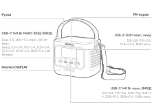
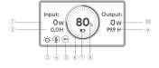
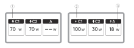
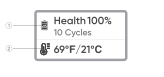
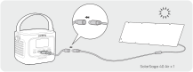
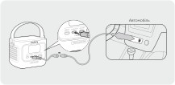

# ВАЖЛИВА ІНФОРМАЦІЯ З БЕЗПЕКИ

<strong>ІНСТРУКЦІЇ ЩОДО РИЗИКУ ПОЖЕЖІ, УРАЖЕННЯ ЕЛЕКТРИЧНИМ СТРУМОМ АБО ТРАВМУВАННЯ ЛЮДЕЙ</strong>

<table class="manual-callout-table" data-callout-variant="warning" lang="uk" style="width:100%; border-collapse:collapse; margin:0 0 16px 0;"><tbody><tr><td class="manual-callout-label" style="width:16%; border:1px solid #000; padding:6px 8px; vertical-align:top;">
<strong>ПОПЕРЕДЖЕННЯ:</strong>
ПОПЕРЕДЖЕННЯ:УВАГАПРИМІТКА</td><td class="manual-callout-body" style="border:1px solid #000; padding:6px 8px; vertical-align:top;">
<strong>Завжди дотримуйтеся цих базових заходів безпеки під час використання цього продукту.</strong>

</td></tr></tbody></table>

- Прочитайте всі інструкції перед використанням продукту.

- Щоб зменшити ризик травмування, необхідний ретельний нагляд, коли продукт використовується поблизу дітей.

- Не вставляйте пальці або руки у продукт.

- Не піддавайте павербанк впливу дощу або снігу.

- Не піддавайте павербанк впливу тепла або вогню. Не зберігайте під прямим сонячним промінням або у транспортному засобі.

- Використання джерела живлення або зарядного пристрою, не рекомендованого чи не проданого виробником павербанка, може призвести до ризику пожежі або травмування людей.

- Не використовуйте павербанк понад його номінальну вихідну потужність. Перевантаження виходу понад номінальне значення може призвести до ризику пожежі або травмування людей.

- Не використовуйте пошкоджений або модифікований павербанк. Пошкоджені або модифіковані акумулятори можуть поводитися непередбачувано, що може призвести до пожежі, вибуху або ризику травмування.

- Не розбирайте павербанк. Віднесіть його до кваліфікованого фахівця, якщо потрібне обслуговування або ремонт. Неправильне складання може призвести до ризику пожежі або травмування людей.

- Не піддавайте павербанк впливу вогню або надмірної температури. Вплив вогню або температури вище 60°C може спричинити вибух.

- Обслуговування або ремонт має виконуватися кваліфікованим фахівцем з використанням лише ідентичних запасних частин. Це забезпечить збереження безпеки продукту.

- Вимкніть павербанк, коли він не використовується.

ЗБЕРЕЖІТЬ ЦІ ІНСТРУКЦІЇ

<table class="manual-callout-table" data-callout-variant="caution" lang="uk" style="width:100%; border-collapse:collapse; margin:0 0 16px 0;"><tbody><tr><td class="manual-callout-label" style="width:16%; border:1px solid #000; padding:6px 8px; vertical-align:top;">
<strong>УВАГА</strong>
ПОПЕРЕДЖЕННЯ:УВАГАПРИМІТКА</td><td class="manual-callout-body" style="border:1px solid #000; padding:6px 8px; vertical-align:top;">
Ризик пожежі та опіків. Не відкривайте, не розчавлюйте, не нагрівайте вище 60°C та не спалюйте. Дотримуйтесь інструкцій виробника.

</td></tr></tbody></table>

Утилізація батареї у вогні або гарячій печі, або механічне розчавлення чи різання батареї, що може призвести до вибуху; Залишення батареї в середовищі з надзвичайно високою температурою, що може призвести до вибуху або витоку займистої рідини чи газу; а також перебування батареї під дією надзвичайно низького тиску повітря, що може призвести до вибуху або витоку займистої рідини чи газу.

# ІНСТРУКЦІЇ З ОБСЛУГОВУВАННЯ КОРИСТУВАЧЕМ

Протягом життєвого циклу продуктів накопичення енергії очікується певний ступінь зниження ємності та енергетичних характеристик. Зі збільшенням кількості циклів заряджання та розряджання і тривалості зберігання ця деградація поступово посилюється, що є нормальним явищем і відповідає природному старінню акумуляторних елементів.

# ЗНАЧЕННЯ СИМВОЛІВ

<figure aria-label="ЗНАЧЕННЯ СИМВОЛІВ" class="hb-symbol-signal-composition" data-component-id="HB-TABLE-SYMBOL-SIGNAL"><table class="hb-symbol-signal-table"><colgroup><col class="hb-symbol-signal-col-label"/><col class="hb-symbol-signal-col-meaning"/></colgroup><thead><tr><th class="hb-symbol-signal-label-heading" scope="col">
Символ
</th><th class="hb-symbol-signal-meaning-heading" scope="col">
Значення
</th></tr></thead><tbody><tr><td class="hb-symbol-signal-label-cell">⚠ПОПЕРЕДЖЕННЯ</td><td class="hb-symbol-signal-meaning-cell">
Небезпечні практики, які можуть призвести до серйозних травм, смерті та/або майнової шкоди.
</td></tr><tr><td class="hb-symbol-signal-label-cell">⚠УВАГА</td><td class="hb-symbol-signal-meaning-cell">
Небезпечні дії, які можуть призвести до травм та/або майнової шкоди.
</td></tr><tr><td class="hb-symbol-signal-label-cell">ПРИМІТКА</td><td class="hb-symbol-signal-meaning-cell">
Небезпечні дії, які можуть призвести до пошкодження обладнання, втрати даних, погіршення продуктивності або непередбачуваних результатів.
</td></tr><tr><td class="hb-symbol-signal-label-cell">ПОРАДА</td><td class="hb-symbol-signal-meaning-cell">
Доповнює важливу інформацію або операційні підказки в тексті.
</td></tr></tbody></table></figure>

<figure aria-label="Символ / Значення" class="hb-symbol-pair-composition" data-component-id="HB-TABLE-SYMBOL-ICON">

<table class="hb-symbol-panel-table"><colgroup><col class="hb-symbol-col-icon"/><col class="hb-symbol-col-meaning"/></colgroup><thead><tr><th class="hb-symbol-icon-heading" scope="col">
Символ
</th><th class="hb-symbol-meaning-heading" scope="col">
Значення
</th></tr></thead><tbody><tr><td class="hb-symbol-icon"></td><td class="hb-symbol-meaning">
Попереджувальні та застережні символи. Обов’язково прочитайте, щоб попередити користувачів про потенційні небезпеки або ризики.
</td></tr><tr><td class="hb-symbol-icon"></td><td class="hb-symbol-meaning">
Перед використанням прочитайте посібник користувача.
</td></tr><tr><td class="hb-symbol-icon"></td><td class="hb-symbol-meaning">
Цей символ вказує, що продукт не можна утилізувати разом із побутовими відходами, і його слід передати до спеціалізованого пункту збору для переробки. Правильна утилізація та переробка допомагають захистити довкілля. Для отримання додаткової інформації щодо утилізації та переробки цього продукту зверніться до місцевої громади, служби утилізації або дилера.
</td></tr><tr><td class="hb-symbol-icon"></td><td class="hb-symbol-meaning">
Батарейки та акумулятори не можна викидати разом із побутовими відходами. Як споживач ви юридично зобов’язані здавати всі батарейки та акумулятори у визначені пункти збору, незалежно від того, чи містять вони небезпечні речовини. Будь ласка, повертайте використані батарейки та акумулятори до місцевих пунктів збору, центрів переробки або до продавця, у якого їх було придбано. Правильна утилізація забезпечує екологічно безпечну переробку та запобігає потенційній шкоді для здоров’я людей і довкілля.
</td></tr></tbody></table>

<table class="hb-symbol-panel-table"><colgroup><col class="hb-symbol-col-icon"/><col class="hb-symbol-col-meaning"/></colgroup><thead><tr><th class="hb-symbol-icon-heading" scope="col">
Символ
</th><th class="hb-symbol-meaning-heading" scope="col">
Значення
</th></tr></thead><tbody><tr><td class="hb-symbol-icon"></td><td class="hb-symbol-meaning">
Не розбирайте продукт.
</td></tr><tr><td class="hb-symbol-icon"></td><td class="hb-symbol-meaning">
Тримайте продукт подалі від вогню.
</td></tr><tr><td class="hb-symbol-icon"></td><td class="hb-symbol-meaning">
Тримайте подалі від дітей.
</td></tr><tr><td class="hb-symbol-icon"></td><td class="hb-symbol-meaning">
Цей символ вказує, що всередині продукту є літій-іонна (Li-ion) батарея, яку необхідно утилізувати або переробити належним чином.
</td></tr></tbody></table>

</figure>

# КОМПЛЕКТАЦІЯ

<figure aria-label="КОМПЛЕКТАЦІЯ" class="hb-inbox-composition" data-card-count="3" data-component-id="HB-SPECIAL-INBOX" data-inbox-variant="three-card-responsive"><ol class="hb-inbox-grid"><li class="hb-inbox-card" data-item-number="1">

<strong>Jackery Explorer 100D</strong>

</li><li class="hb-inbox-card" data-item-number="2">

<strong>Кабель USB-C</strong>

</li><li class="hb-inbox-card" data-item-number="3">

<strong>Керівництво користувача</strong>

</li></ol></figure>

# ОГЛЯД ПРОДУКТУ

<figure>

</figure>

<strong>Додаткові ремені можна придбати та закріпити з боків виробу.</strong>

# РК-ДИСПЛЕЙ

## ІНТЕРФЕЙС 1

<figure aria-label="LCD icon meanings" class="hb-lcd-table-composition" data-component-id="HB-TABLE-LCD-ICON" tabindex="0"><table class="hb-lcd-icon-table"><colgroup><col class="hb-lcd-col-number"/><col class="hb-lcd-col-icon"/><col class="hb-lcd-col-name"/><col class="hb-lcd-col-description"/></colgroup><tbody><tr><td class="hb-lcd-number">
1
</td><td class="hb-lcd-icon"></td><td class="hb-lcd-name">
Вхідна потужність
</td><td class="hb-lcd-description">
Відображає вхідну потужність у ватах.
</td></tr><tr><td class="hb-lcd-number">
2
</td><td class="hb-lcd-icon"></td><td class="hb-lcd-name">
Залишковий час заряджання
</td><td class="hb-lcd-description">
Відображає залишковий час заряджання.
</td></tr><tr><td class="hb-lcd-number">
3
</td><td class="hb-lcd-icon"></td><td class="hb-lcd-name">
Режим Steady-on
</td><td class="hb-lcd-description">
Увімкнення: Режим Steady-on увімкнено.

Вимкнення: Режим Steady-on вимкнено.
</td></tr><tr><td class="hb-lcd-number">
4
</td><td class="hb-lcd-icon"></td><td class="hb-lcd-name">
Обмеження теплової потужності
</td><td class="hb-lcd-description">
Увімкнення: Температура батареї висока. Обмеження потужності розряджання ввімкнено.

Вимкнення: Обмеження потужності розряджання вимкнено.
</td></tr><tr><td class="hb-lcd-number">
5
</td><td class="hb-lcd-icon"></td><td class="hb-lcd-name">
РЕЖИМ ЕНЕРГОЗБЕРЕЖЕННЯ
</td><td class="hb-lcd-description">
Увімкнення: Режим енергозбереження увімкнено.

Вимкнення: Режим енергозбереження вимкнено.
</td></tr><tr><td class="hb-lcd-number">
6
</td><td class="hb-lcd-icon"></td><td class="hb-lcd-name">
Індикатор заряду акумулятора
</td><td class="hb-lcd-description">
Коли пристрій заряджається, помаранчеве коло навколо відсотка заряду акумулятора почергово засвічуватиметься. Під час заряджання інших пристроїв помаранчеве коло світитиметься постійно.
</td></tr><tr><td class="hb-lcd-number">
7
</td><td class="hb-lcd-icon"></td><td class="hb-lcd-name">
Індикатор заряду акумулятора
</td><td class="hb-lcd-description">
Увімкнення: Рівень заряду батареї нижче 20%.

Блимає: Рівень заряду батареї нижче 5%.

Вимкнення: Рівень заряду батареї не нижче 20% або пристрій заряджається.
</td></tr><tr><td class="hb-lcd-number">
8
</td><td class="hb-lcd-icon"></td><td class="hb-lcd-name">
Залишковий відсоток заряду батареї
</td><td class="hb-lcd-description">
Відображає відсоток заряду акумулятора, що залишився.
</td></tr><tr><td class="hb-lcd-number">
9
</td><td class="hb-lcd-icon"></td><td class="hb-lcd-name">
Час, що залишився до розряджання
</td><td class="hb-lcd-description">
Відображає залишковий час розряджання.
</td></tr><tr><td class="hb-lcd-number">
10
</td><td class="hb-lcd-icon"></td><td class="hb-lcd-name">
Вихідна потужність
</td><td class="hb-lcd-description">
Відображає вихідну потужність у ватах.
</td></tr></tbody></table></figure>

<figure aria-label="LCD icon meanings" class="hb-lcd-table-composition" data-component-id="HB-TABLE-LCD-ICON" tabindex="0"><table class="hb-lcd-icon-table"><colgroup><col class="hb-lcd-col-icon"/><col class="hb-lcd-col-name"/><col class="hb-lcd-col-description"/></colgroup><tbody><tr><td class="hb-lcd-icon"></td><td class="hb-lcd-name">
Код помилки
</td><td class="hb-lcd-description">
Від'єднайте навантаження або вийміть зарядну вилку. Якщо проблему не вдається вирішити, зверніться до служби підтримки Jackery.
</td></tr><tr><td class="hb-lcd-icon"></td><td class="hb-lcd-name">
Індикатор високої температури
</td><td class="hb-lcd-description">
Активовано захист від високої температури. Продукт може припинити роботу, доки його температура не повернеться до нормального робочого діапазону.
</td></tr><tr><td class="hb-lcd-icon"></td><td class="hb-lcd-name">
Індикатор низької температури
</td><td class="hb-lcd-description">
Активовано захист від низької температури. Продукт може припинити роботу, доки його температура не повернеться до нормального робочого діапазону.
</td></tr></tbody></table></figure>

## ІНТЕРФЕЙС 2

<figure aria-label="LCD icon meanings" class="hb-lcd-table-composition" data-component-id="HB-TABLE-LCD-ICON" tabindex="0"><table class="hb-lcd-icon-table"><colgroup><col class="hb-lcd-col-number"/><col class="hb-lcd-col-icon"/><col class="hb-lcd-col-name"/><col class="hb-lcd-col-description"/></colgroup><tbody><tr><td class="hb-lcd-number">
1
</td><td class="hb-lcd-icon"></td><td class="hb-lcd-name">
Індикатор розряджання
</td><td class="hb-lcd-description">
Цей USB-порт розряджає.
</td></tr><tr><td class="hb-lcd-number">
2
</td><td class="hb-lcd-icon"></td><td class="hb-lcd-name">
Індикатор заряджання
</td><td class="hb-lcd-description">
Цей USB-порт заряджає.
</td></tr><tr><td class="hb-lcd-number">
3
</td><td class="hb-lcd-icon"></td><td class="hb-lcd-name">
Потужність заряджання або розряджання
</td><td class="hb-lcd-description">
Показує потужність заряджання або розряджання відповідного порту.
</td></tr></tbody></table></figure>

## ІНТЕРФЕЙС 3

<figure aria-label="LCD icon meanings" class="hb-lcd-table-composition" data-component-id="HB-TABLE-LCD-ICON" tabindex="0"><table class="hb-lcd-icon-table"><colgroup><col class="hb-lcd-col-number"/><col class="hb-lcd-col-icon"/><col class="hb-lcd-col-name"/><col class="hb-lcd-col-description"/></colgroup><tbody><tr><td class="hb-lcd-number">
1
</td><td class="hb-lcd-icon"></td><td class="hb-lcd-name">
Стан батареї та кількість циклів
</td><td class="hb-lcd-description">
Відображає поточний відсоток здоров'я батареї та кількість циклів заряду/розряду.

<ul class="simple">
<li>
Зелений: здоров'я батареї високе.
</li>
<li>
Жовтий: здоров'я батареї середнє.
</li>
<li>
Червоний: здоров'я батареї низьке.
</li>
</ul></td></tr><tr><td class="hb-lcd-number">
2
</td><td class="hb-lcd-icon"></td><td class="hb-lcd-name">
Температура батареї
</td><td class="hb-lcd-description">
Відображає поточну температуру батареї.
</td></tr></tbody></table></figure>

# ОПЕРАЦІЇ

## ВИХІД УВІМК./ВИМК.

Підключіть навантаження, щоб увімкнути вихід.

<table class="manual-callout-table" data-callout-variant="caution" lang="uk" style="width:100%; border-collapse:collapse; margin:0 0 16px 0;"><tbody><tr><td class="manual-callout-label" style="width:16%; border:1px solid #000; padding:6px 8px; vertical-align:top;">
<strong>УВАГА</strong>
ПОПЕРЕДЖЕННЯ:УВАГАПРИМІТКА</td><td class="manual-callout-body" style="border:1px solid #000; padding:6px 8px; vertical-align:top;"><ul class="simple">
<li>
USB-C 140 Вт макс. — це високопотужний вихідний порт USB-PD Power Source 3 (PS3). Якщо підключений пристрій або аксесуар не відповідає вимогам безпеки, може виникнути ризик пожежі. Перед використанням цих портів переконайтеся, що підключений пристрій або аксесуар має захист від пожежі.
</li>
<li>
Підключайте пристрій 100D лише до пристроїв або аксесуарів, які відповідають пунктам 6.3, 6.4 та 6.5 стандарту IEC/EN/UL 62368-1 (або іншим еквівалентним стандартам).
</li>
<li>
Щоб отримати максимальну вихідну потужність, використовуйте кабель USB-C до USB-C 5А (20 В пост. струму/5 А, 100 Вт; 28 В пост. струму/5 А, 140 Вт).
</li>
</ul>
</td></tr></tbody></table>

## РЕЖИМ ЕНЕРГОЗБЕРЕЖЕННЯ

Режим енергозбереження вимкнено за замовчуванням. Щоб запобігти зайвому розряду акумулятора, якщо ви забули вимкнути вихід, натисніть і утримуйте кнопку DISPLAY, щоб увімкнути режим енергозбереження. Якщо пристрій не підключено або споживана потужність підключеного пристрою менша за 2 Вт протягом 2 годин, виріб автоматично вимикає виходи. Коли вихід увімкнено, на екрані з’явиться значок «2H».

Натисніть та утримуйте 3 с, щоб увімкнути/вимкнути режим енергозбереження

<table class="manual-callout-table" data-callout-variant="note" lang="uk" style="width:100%; border-collapse:collapse; margin:0 0 16px 0;"><tbody><tr><td class="manual-callout-label" style="width:16%; border:1px solid #000; padding:6px 8px; vertical-align:top;">
<strong>ПРИМІТКА</strong>
ПОПЕРЕДЖЕННЯ:УВАГАПРИМІТКА</td><td class="manual-callout-body" style="border:1px solid #000; padding:6px 8px; vertical-align:top;">
Режим енергозбереження відновлює свій попередній стан після увімкнення. Для зміни режиму потрібне ручне перемикання.

</td></tr></tbody></table>

## РК-ЕКРАН

<figure aria-label="РК-ЕКРАН" class="hb-reference-composition hb-reference-lcd-actions-compact" data-component-id="HB-TABLE-REFERENCE" data-component-variant="lcd-actions-compact" tabindex="0"><table class="hb-reference-table"><thead><tr><th scope="col">
Функція
</th><th scope="col">
Опис
</th></tr></thead><tbody><tr><td>
Пробудження екрана
</td><td>
Світиться при короткому натисканні кнопки DISPLAY або автоматично під час заряджання чи розряджання.
</td></tr><tr><td>
Постійне увімкнення екрана
</td><td>
Поки екран світиться, двічі натисніть кнопку DISPLAY.
</td></tr><tr><td>
Перемикання екрана
</td><td>
Після увімкнення екрана коротко натисніть кнопку DISPLAY, щоб перемкнути сторінки.
</td></tr><tr><td>
Вимкнення постійного увімкнення екрана
</td><td>
Знову двічі натисніть кнопку DISPLAY.
</td></tr><tr><td>
Автоматичне вимкнення екрана
</td><td>
Через 10 секунд після увімкнення без дій, або через 2 години після входу в режим постійного увімкнення.
</td></tr></tbody></table></figure>

# ЗАРЯДЖАННЯ

Повністю зарядіть продукт перед першим використанням.

<table class="manual-callout-table" data-callout-variant="caution" lang="uk" style="width:100%; border-collapse:collapse; margin:0 0 16px 0;"><tbody><tr><td class="manual-callout-label" style="width:16%; border:1px solid #000; padding:6px 8px; vertical-align:top;">
<strong>УВАГА</strong>
ПОПЕРЕДЖЕННЯ:УВАГАПРИМІТКА</td><td class="manual-callout-body" style="border:1px solid #000; padding:6px 8px; vertical-align:top;"><ul class="simple">
<li>
Рекомендована температура заряджання продукту становить від 0 °C до 45 °C, а температура розряджання — від -20 °C до 45 °C. Експлуатація продукту за межами цього діапазону температур може обмежити його здатність до заряджання та розряджання або навіть унеможливити заряджання чи розряджання.
</li>
<li>
Потужність заряджання та ємність акумулятора продукту можуть змінюватися через коливання температури.
</li>
</ul>
</td></tr></tbody></table>

## ЗАРЯДЖАННЯ ЗА ДОПОМОГОЮ ЗАРЯДНОГО ПРИСТРОЮ USB-C

<strong>Зарядний пристрій USB-C продається окремо.</strong>

## ЗАРЯДЖАННЯ ВІД СОНЯЧНИХ ПАНЕЛЕЙ (ПРОДАЮТЬСЯ ОКРЕМО)

Цей виріб підтримує максимальну потужність сонячного заряджання 100 Вт і може використовуватися з сонячними панелями серії Jackery SolarSaga.

Заряджання від сонячної панелі потужністю 40 Вт або 100 Вт:

<strong>Кабель DC8020 до USB-C продається окремо.</strong>

Рекомендується використовувати сонячні панелі Jackery для заряджання продукту. Переконайтеся, що напруга холостого ходу (Voc) сонячної панелі знаходиться в межах діапазону вхідної напруги постійного струму (10 В-30 В) пристрою 100D. Jackery не несе відповідальності за будь-які пошкодження або збитки, спричинені використанням сторонніх сонячних панелей.

## ЗАРЯДЖАННЯ ВІД АВТОМОБІЛЬНОГО ЗАРЯДНОГО ПРИСТРОЮ (ПРОДАЄТЬСЯ ОКРЕМО)

Цей виріб можна заряджати за допомогою автомобільних зарядних пристроїв на 12 В та 24 В. Переконайтеся, що автомобільний зарядний пристрій і автомобільна розетка (прикурювач) мають надійне з\'єднання.

<strong>Автомобільний зарядний кабель і кабель DC8020 до USB-C продаються окремо.</strong>

<table class="manual-callout-table" data-callout-variant="caution" lang="uk" style="width:100%; border-collapse:collapse; margin:0 0 16px 0;"><tbody><tr><td class="manual-callout-label" style="width:16%; border:1px solid #000; padding:6px 8px; vertical-align:top;">
<strong>УВАГА</strong>
ПОПЕРЕДЖЕННЯ:УВАГАПРИМІТКА</td><td class="manual-callout-body" style="border:1px solid #000; padding:6px 8px; vertical-align:top;"><ul class="simple">
<li>
Запустіть двигун автомобіля перед заряджанням вашого павербанка.
</li>
<li>
Якщо автомобіль рухається нерівною дорогою, заборонено використовувати автомобільний зарядний пристрій, щоб уникнути перегріву через погане з’єднання. Компанія не несе відповідальності за будь-які збитки, спричинені неналежною експлуатацією.
</li>
</ul>
</td></tr></tbody></table>

# ЗБЕРІГАННЯ

Зберігайте продукт у сухому, чистому місці з належною вентиляцією. Температура та вологість зберігання:

- Температура зберігання: від -20°C до 60°C

- Вологість зберігання: 5-95% відносної вологості

Якщо цей продукт зберігається протягом тривалого часу (3 місяці --- 6 місяців) із розрядженим акумулятором, він може втратити здатність до заряджання. Щоб запобігти цьому та підтримувати стан акумулятора, рекомендується перевіряти та підзаряджати продукт кожні три місяці, а також виконувати повний цикл заряджання та розряджання щонайменше один раз на 6--12 місяців.

# ТЕХНІЧНІ ХАРАКТЕРИСТИКИ

## Загальна інформація

<figure aria-label="Загальна інформація" class="hb-spec-table-composition"><table class="hb-source-specification hb-spec-table manual-table manual-spec-table"><colgroup><col class="hb-spec-col-label"/><col class="hb-spec-col-value"/></colgroup>
<tbody>
<tr><th class="manual-spec-label hb-spec-label" scope="row">
Назва продукту
</th>
<td class="manual-spec-value hb-spec-value">
Jackery Explorer 100D
</td>
</tr>
<tr><th class="manual-spec-label hb-spec-label" scope="row">
Номер моделі
</th>
<td class="manual-spec-value hb-spec-value">
JE-100C
</td>
</tr>
<tr><th class="manual-spec-label hb-spec-label" scope="row">
Ємність
</th>
<td class="manual-spec-value hb-spec-value">
96 Вт·год (5 A·год/19,2 В DC)
</td>
</tr>
<tr><th class="manual-spec-label hb-spec-label" scope="row">
Хімічний склад елементів
</th>
<td class="manual-spec-value hb-spec-value">
Li-ion LFP
</td>
</tr>
<tr><th class="manual-spec-label hb-spec-label" scope="row">
Вага
</th>
<td class="manual-spec-value hb-spec-value">
855 г ± 10 г
</td>
</tr>
<tr><th class="manual-spec-label hb-spec-label" scope="row">
Розміри
</th>
<td class="manual-spec-value hb-spec-value">
(118,7 ± 1) × (82,6 ± 0,5) × (85,68 ± 0,8) мм
</td>
</tr>
<tr><th class="manual-spec-label hb-spec-label" scope="row">
Ресурс циклів
</th>
<td class="manual-spec-value hb-spec-value">
3000 циклів до 80%+ ємності
</td>
</tr>
</tbody>
</table></figure>

## Вхідні порти

<figure aria-label="Вхідні порти" class="hb-spec-table-composition"><table class="hb-source-specification hb-spec-table manual-table manual-spec-table"><colgroup><col class="hb-spec-col-label"/><col class="hb-spec-col-value"/></colgroup>
<tbody>
<tr><th class="manual-spec-label hb-spec-label" scope="row">
USB-C1
</th>
<td class="manual-spec-value hb-spec-value">
5 В⎓3 А, 9 В⎓3 А, 12 В⎓3 А, 15 В⎓3 А, 20 В ⎓5 А, 28 В⎓5 А, 140Вт макс.

Автомобіль: 12 В⎓5 А макс., 24 В⎓5 А макс.

ФЕ: 10В-30В⎓, 5А макс., 100Вт макс.

</td>
</tr>
</tbody>
</table></figure>

## Вихідні порти

<figure aria-label="Вихідні порти" class="hb-spec-table-composition"><table class="hb-source-specification hb-spec-table manual-table manual-spec-table"><colgroup><col class="hb-spec-col-label"/><col class="hb-spec-col-value"/></colgroup>
<tbody>
<tr><th class="manual-spec-label hb-spec-label" scope="row">
USB-A
</th>
<td class="manual-spec-value hb-spec-value">
5 В⎓2 А, 9 В⎓2 А, 12 В⎓1,5 А, 18 Вт макс.
</td>
</tr>
<tr><th class="manual-spec-label hb-spec-label" scope="row">
USB-C1 / USB-C2
</th>
<td class="manual-spec-value hb-spec-value">
5 В⎓3 А, 9 В⎓3 А, 12 В⎓3 А, 15 В⎓3 А, 20 В⎓5 А, 28 В⎓5 А, 140Вт макс.
</td>
</tr>
</tbody>
</table></figure>

## Загальна вихідна потужність

<figure aria-label="Загальна вихідна потужність" class="hb-spec-table-composition"><table class="hb-source-specification hb-spec-table manual-table manual-spec-table"><colgroup><col class="hb-spec-col-label"/><col class="hb-spec-col-value"/></colgroup>
<tbody>
<tr><th class="manual-spec-label hb-spec-label" scope="row">
USB-C1 + USB-C2
</th>
<td class="manual-spec-value hb-spec-value">
( 70 Вт + 70 Вт ) макс.
</td>
</tr>
<tr><th class="manual-spec-label hb-spec-label" scope="row">
USB-C1 + USB-A / USB-C2 + USB-A
</th>
<td class="manual-spec-value hb-spec-value">
( 140 Вт + 18 Вт ) макс.
</td>
</tr>
<tr><th class="manual-spec-label hb-spec-label" scope="row">
USB-C1 + USB-C2 + USB-A
</th>
<td class="manual-spec-value hb-spec-value">
( 70 Вт + 70 Вт + 18 Вт ) макс.
</td>
</tr>
</tbody>
</table></figure>

## РОБОЧА ТЕМПЕРАТУРА НАВКОЛИШНЬОГО СЕРЕДОВИЩА

<figure aria-label="РОБОЧА ТЕМПЕРАТУРА НАВКОЛИШНЬОГО СЕРЕДОВИЩА" class="hb-spec-table-composition"><table class="hb-source-specification hb-spec-table manual-table manual-spec-table"><colgroup><col class="hb-spec-col-label"/><col class="hb-spec-col-value"/></colgroup>
<tbody>
<tr><th class="manual-spec-label hb-spec-label" scope="row">
Температура заряджання
</th>
<td class="manual-spec-value hb-spec-value">
від 0°C до 45°C
</td>
</tr>
<tr><th class="manual-spec-label hb-spec-label" scope="row">
Температура розряду
</th>
<td class="manual-spec-value hb-spec-value">
від -20°C до 45°C
</td>
</tr>
</tbody>
</table></figure>

※ USB Type-C® та USB-C® є зареєстрованими торговельними марками USB Implementers Forum.

# ГАРАНТІЯ

КОНТАКТИ

Якщо у вас виникли запитання чи зауваження щодо нашої продукції, надішліть електронного листа на <a class="reference external" href="mailto:hello.eu@jackery.com">hello.eu@jackery.com</a>, і ми відповімо вам якомога швидше. Якщо виникне будь-яка проблема з якістю виробу, ви можете подати заявку на заміну або повернення коштів, надіславши відповідну форму на сайті www.jackery.com.

СЛУЖБА ПІДТРИМКИ

2-річна обмежена гарантія

<a class="reference external" href="mailto:hello.eu@jackery.com">hello.eu@jackery.com</a>

Довічна технічна підтримка

