# ВАЖЛИВА ІНФОРМАЦІЯ З БЕЗПЕКИ

<table class="manual-callout-table" style="width:100%; border-collapse:collapse; margin:0 0 16px 0;"><tbody><tr><td class="manual-callout-label" style="width:16%; border:1px solid #000; padding:6px 8px; vertical-align:top;">
<strong>ПОПЕРЕДЖЕННЯ</strong>
</td><td class="manual-callout-body" style="border:1px solid #000; padding:6px 8px; vertical-align:top;">
ІНСТРУКЦІЇ З БЕЗПЕКИ ДЛЯ ЗАПОБІГАННЯ ПОЖЕЖІ, УРАЖЕННЮ ЕЛЕКТРИЧНИМ СТРУМОМ АБО ТРАВМАМ
</td></tr></tbody></table>

Завжди дотримуйтеся цих базових запобіжних заходів під час використання цього виробу.

- Прочитайте всі інструкції перед використанням цього виробу.
- Не дозволяйте дітям гратися з виробом. Потрібен постійний нагляд за дітьми, коли виріб використовується поблизу них.
- Ризик ураження електричним струмом може виникнути, якщо використовуються аксесуари, рекомендовані або продані непрофесійними виробниками.
- Коли виріб не використовується, від'єднайте вилку живлення від розетки виробу.
- Не розбирайте виріб, оскільки це може спричинити непередбачувані ризики, як-от пожежу, вибух або ураження електричним струмом.
- Не використовуйте виріб із пошкодженими шнурами, вилками або вихідними кабелями, оскільки це може спричинити ураження електричним струмом.
- Щоб забезпечити належну циркуляцію повітря, не закривайте вентиляційні отвори виробу. Місце використання виробу має мати достатній потік повітря в прохолодному сухому середовищі, щоб запобігти перегріванню.
  - Заряджання у вологих або погано вентильованих місцях може створити загрозу безпеці.
  - Вода може спричинити коротке замикання або пошкодити зарядний пристрій, що створює ризики для безпеки.
- Не піддавайте виріб впливу вогню, високих температур, прямого сонячного світла або гарячих середовищ, наприклад салону припаркованого автомобіля. Такий вплив може спричинити пожежу або вибух.

## ІНСТРУКЦІЇ З ТЕХНІЧНОГО ОБСЛУГОВУВАННЯ КОРИСТУВАЧЕМ

Протягом життєвого циклу виробів для накопичення енергії очікується певний ступінь деградації ємності та енергії. Зі збільшенням кількості циклів заряджання й розряджання та подовженням часу зберігання ця деградація поступово посилюватиметься. Це нормальний стан, що відповідає природному старінню елементів батареї.

# ЗНАЧЕННЯ СИМВОЛІВ

<figure aria-label="Символ / Значення" class="hb-symbol-signal-composition" data-component-id="HB-TABLE-SYMBOL-SIGNAL"><table class="hb-symbol-signal-table"><colgroup><col class="hb-symbol-signal-col-label"/><col class="hb-symbol-signal-col-meaning"/></colgroup><thead><tr><th class="hb-symbol-signal-label-heading" scope="col">
Символ
</th><th class="hb-symbol-signal-meaning-heading" scope="col">
Значення
</th></tr></thead><tbody><tr><td class="hb-symbol-signal-label-cell">⚠ПОПЕРЕДЖЕННЯ</td><td class="hb-symbol-signal-meaning-cell">
Небезпечні дії, які можуть призвести до тяжких травм, смерті та/або пошкодження майна.
</td></tr><tr><td class="hb-symbol-signal-label-cell">⚠УВАГА</td><td class="hb-symbol-signal-meaning-cell">
Небезпечні дії, які можуть призвести до травмування людей та/або пошкодження майна.
</td></tr><tr><td class="hb-symbol-signal-label-cell">⚠ПРИМІТКА</td><td class="hb-symbol-signal-meaning-cell">
Дії, які можуть призвести до пошкодження обладнання, втрати даних, погіршення продуктивності або неочікуваних результатів.
</td></tr><tr><td class="hb-symbol-signal-label-cell">⚠ПОРАДА</td><td class="hb-symbol-signal-meaning-cell">
Доповнює важливу інформацію або поради з експлуатації в тексті.
</td></tr></tbody></table></figure>

<figure aria-label="Символ / Значення" class="hb-symbol-pair-composition" data-component-id="HB-TABLE-SYMBOL-ICON">

<table class="hb-symbol-panel-table"><colgroup><col class="hb-symbol-col-icon"/><col class="hb-symbol-col-meaning"/></colgroup><thead><tr><th class="hb-symbol-icon-heading" scope="col">
<strong>Символ</strong>
</th><th class="hb-symbol-meaning-heading" scope="col">
<strong>Значення</strong>
</th></tr></thead><tbody><tr><td class="hb-symbol-icon"></td><td class="hb-symbol-meaning">
Попереджувальні та застережні символи. Повідомляють користувачам про інформацію, яку необхідно прочитати, щоб уникнути потенційних небезпек або ризиків.
</td></tr><tr><td class="hb-symbol-icon"></td><td class="hb-symbol-meaning">
Перед використанням прочитайте посібник користувача.
</td></tr><tr><td class="hb-symbol-icon"></td><td class="hb-symbol-meaning">
Не розбирайте продукт.
</td></tr><tr><td class="hb-symbol-icon"></td><td class="hb-symbol-meaning">
Тримайте продукт подалі від вогню.
</td></tr></tbody></table>

<table class="hb-symbol-panel-table"><colgroup><col class="hb-symbol-col-icon"/><col class="hb-symbol-col-meaning"/></colgroup><thead><tr><th class="hb-symbol-icon-heading" scope="col">
<strong>Символ</strong>
</th><th class="hb-symbol-meaning-heading" scope="col">
<strong>Значення</strong>
</th></tr></thead><tbody><tr><td class="hb-symbol-icon"></td><td class="hb-symbol-meaning">
Тримайте подалі від дітей.
</td></tr><tr><td class="hb-symbol-icon"></td><td class="hb-symbol-meaning">
Цей символ вказує, що всередині продукту є літій-іонна (Li-ion) батарея, яку необхідно утилізувати або переробити належним чином.
</td></tr><tr><td class="hb-symbol-icon"></td><td class="hb-symbol-meaning">
Цей символ вказує, що продукт не можна утилізувати разом із побутовими відходами, і його слід передати до спеціалізованого пункту збору для переробки.
Правильна утилізація та переробка допомагають захистити довкілля. Для отримання додаткової інформації щодо утилізації та переробки цього продукту зверніться до місцевої громади, служби утилізації або дилера.
</td></tr><tr><td class="hb-symbol-icon"></td><td class="hb-symbol-meaning">
Батарейки та акумулятори не можна викидати разом із побутовими відходами.
Як споживач ви юридично зобов’язані здавати всі батарейки та акумулятори у визначені пункти збору, незалежно від того, чи містять вони небезпечні речовини.
Будь ласка, повертайте використані батарейки та акумулятори до місцевих пунктів збору, центрів переробки або до продавця, у якого їх було придбано. Правильна утилізація забезпечує екологічно безпечну переробку та запобігає потенційній шкоді для здоров’я людей і довкілля.
</td></tr></tbody></table>

</figure>

# ЩО В КОРОБЦІ

<figure aria-label="ЩО В КОРОБЦІ" class="hb-inbox-composition" data-card-count="3" data-component-id="HB-SPECIAL-INBOX" data-inbox-variant="three-card-responsive"><ol class="hb-inbox-grid"><li class="hb-inbox-card" data-item-number="1">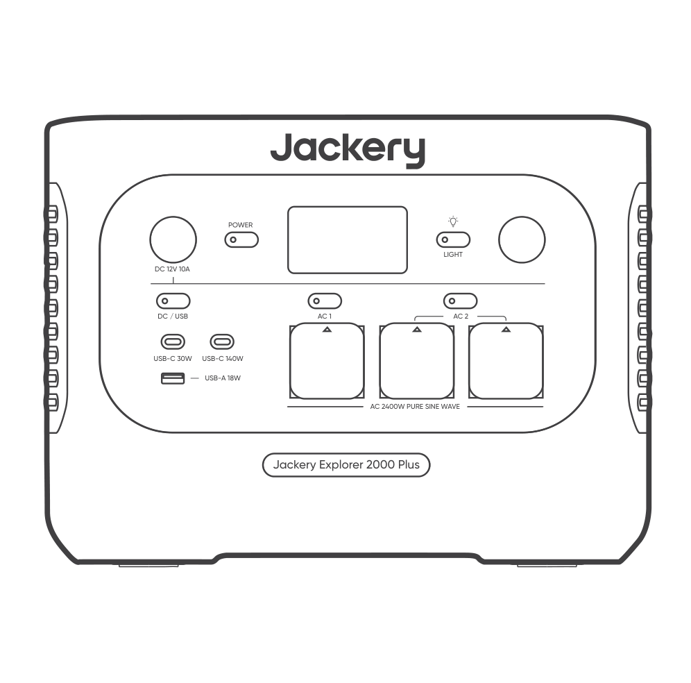

<strong>Jackery Explorer 2000 Plus</strong>

</li><li class="hb-inbox-card" data-item-number="2">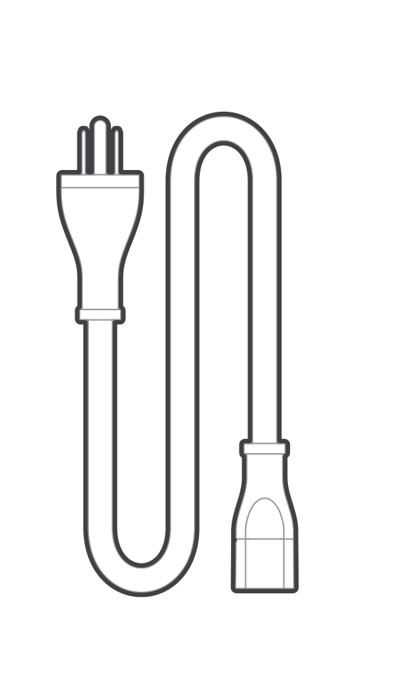

<strong>Кабель для заряджання AC</strong>

</li><li class="hb-inbox-card" data-item-number="3">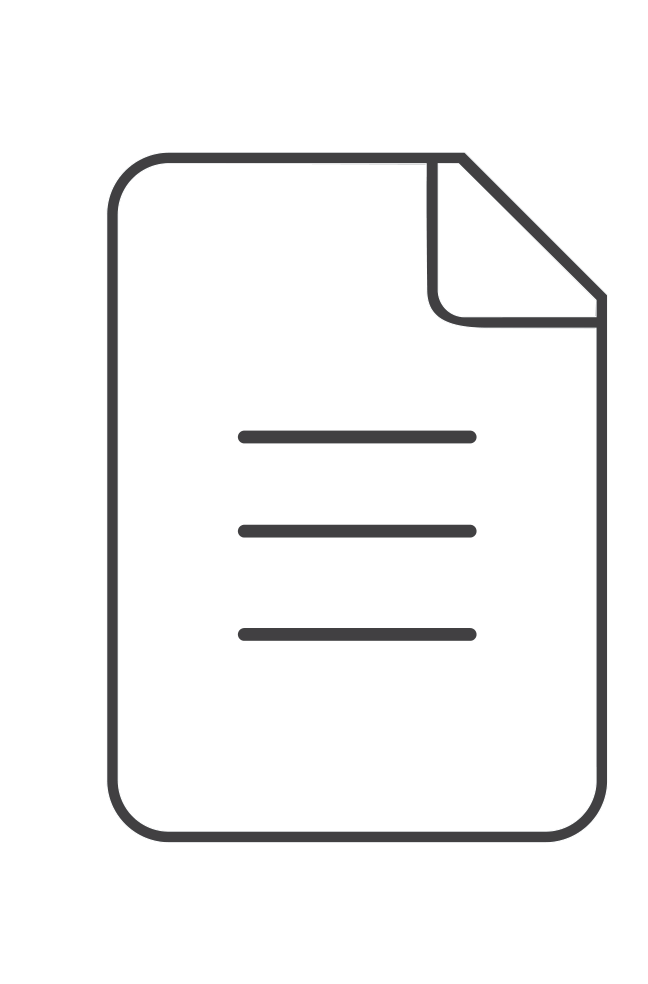

Посібник користувача

</li></ol>

<strong>ПОРАДИ</strong>

Кабель для заряджання від автомобіля не входить до комплекту, але його можна придбати окремо на нашому вебсайті.
Для отримання допомоги зверніться до служби підтримки Jackery.

</figure>

# ОГЛЯД ПРОДУКТУ

## ВИГЛЯД СПЕРЕДУ

## ВИГЛЯД З ЛІВОГО ТА ПРАВОГО БОКІВ

# ЕКРАН LCD

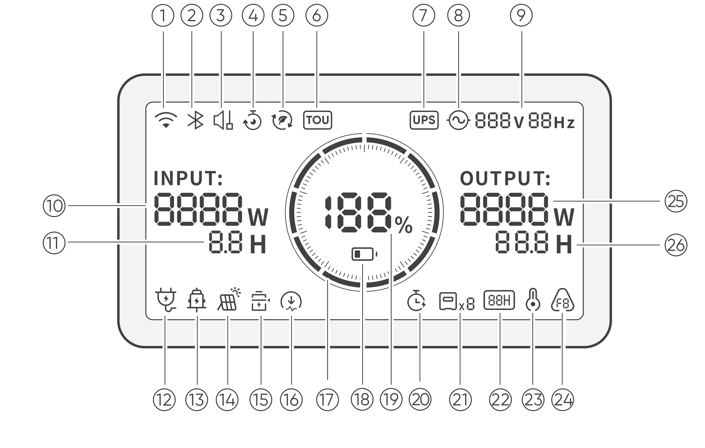

<figure aria-label="LCD icon meanings" class="hb-lcd-table-composition" data-component-id="HB-TABLE-LCD-ICON" tabindex="0"><table class="hb-lcd-icon-table"><colgroup><col class="hb-lcd-col-number"/><col class="hb-lcd-col-icon"/><col class="hb-lcd-col-name"/><col class="hb-lcd-col-description"/></colgroup><tbody><tr><td class="hb-lcd-number">
1
</td><td class="hb-lcd-icon"></td><td class="hb-lcd-name">
Wi-Fi
</td><td class="hb-lcd-description">

<strong>Увімкнено:</strong> Wi-Fi підключено.

<strong>Блимає:</strong> Готово до підключення до Wi-Fi.

<strong>Вимкнено:</strong> Wi-Fi відключено.

</td></tr><tr><td class="hb-lcd-number">
2
</td><td class="hb-lcd-icon"></td><td class="hb-lcd-name">
Bluetooth
</td><td class="hb-lcd-description">

<strong>Увімкнено:</strong> Bluetooth підключено.

<strong>Блимає:</strong> Готово до підключення до Bluetooth.

<strong>Вимкнено:</strong> Bluetooth відключено.

</td></tr><tr><td class="hb-lcd-number">
3
</td><td class="hb-lcd-icon"></td><td class="hb-lcd-name">
Тихий режим заряджання
</td><td class="hb-lcd-description">

<strong>Увімкнено:</strong> Рівень шуму під час заряджання значно зменшується, водночас знижується потужність заряджання і сповільнюється швидкість заряджання.

<strong>Вимкнено:</strong> Тихий режим заряджання вимкнено.

Увімкніть/вимкніть цю функцію в Jackery App.

Налаштування зберігається після вимкнення пристрою.

</td></tr><tr><td class="hb-lcd-number">
4
</td><td class="hb-lcd-icon"></td><td class="hb-lcd-name">
План заряджання
</td><td class="hb-lcd-description">

Налаштовує час заряджання Jackery Explorer 2000 Plus. Підходить для умов із коливаннями цін на електроенергію; дозволяє створювати плани заряджання на основі пікових і непікових періодів, зменшуючи витрати на електроенергію.

Увімкніть/вимкніть цю функцію в Jackery App. Налаштування зберігається після вимкнення пристрою.

</td></tr><tr><td class="hb-lcd-number">
5
</td><td class="hb-lcd-icon"></td><td class="hb-lcd-name">
Автономний режим
</td><td class="hb-lcd-description">

Максимізує використання сонячної енергії та зменшує залежність від електромережі, віддаючи пріоритет накопиченій сонячній енергії, що знижує витрати на електроенергію. Електростанцію необхідно одночасно підключити до сонячних панелей і електромережі, при цьому потужність навантаження обмежується байпасною потужністю.

Увімкніть/вимкніть цю функцію в Jackery App. Налаштування зберігається після вимкнення пристрою.

</td></tr><tr><td class="hb-lcd-number">
6
</td><td class="hb-lcd-icon"></td><td class="hb-lcd-name">
Режим TOU
</td><td class="hb-lcd-description">

<strong>Увімкнено:</strong> Режим TOU увімкнено (стандартний резервний SOC: 60%). У пікові періоди продукт надає пріоритет розряджанню батареї для зменшення витрат на електроенергію, коли накопичена енергія перевищує резервний SOC. У непікові періоди продукт заряджає батарею від електромережі для зрізання піків і заповнення провалів.

<strong>Вимкнено:</strong> Режим TOU вимкнено. Продукт не дотримується стратегії TOU (time of use) і працює за стандартною логікою живлення та заряджання.

Увімкніть/вимкніть цю функцію в Jackery App. Налаштування зберігається після вимкнення пристрою.

</td></tr><tr><td class="hb-lcd-number">
7
</td><td class="hb-lcd-icon"></td><td class="hb-lcd-name">
UPS
</td><td class="hb-lcd-description">

<strong>Увімкнено:</strong> У режимі байпасу навантаження, підключені до портів змінного струму, живляться від електромережі, а не від електростанції. У разі раптового збою електромережі продукт автоматично перемикається на живлення від батареї протягом 10 мс.

<strong>Вимкнено:</strong> Продукт не перебуває в режимі байпасу. Навантаження, підключені до портів змінного струму, живляться від внутрішньої батареї електростанції.

</td></tr><tr><td class="hb-lcd-number">
8
</td><td class="hb-lcd-icon"></td><td class="hb-lcd-name">
Індикатор живлення змінного струму
</td><td class="hb-lcd-description">
Вихід змінного струму (чиста синусоїда) увімкнено.
</td></tr><tr><td class="hb-lcd-number">
9
</td><td class="hb-lcd-icon"></td><td class="hb-lcd-name">
Вихідна напруга та частота
</td><td class="hb-lcd-description">
Відображає вихідну напругу та частоту, коли вихід змінного струму увімкнено.
</td></tr><tr><td class="hb-lcd-number">
10
</td><td class="hb-lcd-icon"></td><td class="hb-lcd-name">
Вхідна потужність
</td><td class="hb-lcd-description">
Відображає вхідну потужність у ватах.
</td></tr><tr><td class="hb-lcd-number">
11
</td><td class="hb-lcd-icon"></td><td class="hb-lcd-name">

Час, що залишився до повного

заряджання

</td><td class="hb-lcd-description">
Відображає залишковий час заряджання.
</td></tr><tr><td class="hb-lcd-number">
12
</td><td class="hb-lcd-icon"></td><td class="hb-lcd-name">

Індикатор заряджання від мережі

змінного струму

</td><td class="hb-lcd-description">
Пристрій заряджається через вхід змінного струму від електромережі.
</td></tr><tr><td class="hb-lcd-number">
13
</td><td class="hb-lcd-icon"></td><td class="hb-lcd-name">
Індикатор заряджання від автомобіля
</td><td class="hb-lcd-description">
Пристрій заряджається через вхід постійного струму (DC8020) із використанням 12 В постійного струму (автомобільне заряджання).
</td></tr><tr><td class="hb-lcd-number">
14
</td><td class="hb-lcd-icon"></td><td class="hb-lcd-name">

Індикатор заряджання від сонячної

панелі

</td><td class="hb-lcd-description">
Пристрій заряджається через вхід постійного струму (DC8020) із використанням сонячної(-их) панелі(-ей).
</td></tr><tr><td class="hb-lcd-number">
15
</td><td class="hb-lcd-icon"></td><td class="hb-lcd-name">
Режим енергозбереження акумулятора
</td><td class="hb-lcd-description">

<strong>Увімкнено:</strong> Режим енергозбереження акумулятора увімкнено. Обмеження заряджання та розряджання застосовуються, щоб подовжити термін служби акумулятора.

<strong>Вимкнено:</strong> Режим енергозбереження акумулятора вимкнено. Увімкніть/вимкніть цю функцію в Jackery App. Налаштування зберігається після вимкнення пристрою.

Коли цю функцію увімкнено, продукт періодично виконує повний цикл заряджання та розряджання для калібрування SOC.

</td></tr><tr><td class="hb-lcd-number">
16
</td><td class="hb-lcd-icon"></td><td class="hb-lcd-name">
Обмеження потужності заряджання
</td><td class="hb-lcd-description">

<strong>Увімкнено:</strong> Обмеження потужності заряджання активовано в Jackery App.

<strong>Вимкнено:</strong> Обмеження потужності заряджання вимкнено в Jackery App.

Налаштування зберігається після вимкнення пристрою.

</td></tr><tr><td class="hb-lcd-number">
17
</td><td class="hb-lcd-icon"></td><td class="hb-lcd-name">
Індикатор заряду акумулятора
</td><td class="hb-lcd-description">
Коли пристрій заряджається, помаранчеве коло навколо відсотка заряду акумулятора почергово засвічуватиметься. Під час заряджання інших пристроїв помаранчеве коло світитиметься постійно.
</td></tr><tr><td class="hb-lcd-number">
18
</td><td class="hb-lcd-icon"></td><td class="hb-lcd-name">

Залишковий відсоток заряду

акумулятора

</td><td class="hb-lcd-description">
Відображає залишковий відсоток заряду акумулятора.
</td></tr><tr><td class="hb-lcd-number">
19
</td><td class="hb-lcd-icon"></td><td class="hb-lcd-name">

Індикатор низького рівня заряду

батареї

</td><td class="hb-lcd-description">

<strong>Увімкнено:</strong> Рівень заряду батареї нижче 20%.

<strong>Блимає:</strong> Рівень заряду батареї нижче 5%.

<strong>Вимкнено:</strong> Рівень заряду батареї не нижче 20% або пристрій заряджається.

</td></tr><tr><td class="hb-lcd-number">
20
</td><td class="hb-lcd-icon"></td><td class="hb-lcd-name">
Таймер розряджання
</td><td class="hb-lcd-description">

<strong>Увімкнено:</strong> Таймер розряджання встановлено.

<strong>Вимкнено:</strong> Таймер розряджання не встановлено.

Увімкніть/вимкніть цю функцію в Jackery App. Налаштування не зберігається після вимкнення пристрою.

</td></tr><tr><td class="hb-lcd-number">
21
</td><td class="hb-lcd-icon">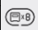</td><td class="hb-lcd-name">
Підключені акумулятори
</td><td class="hb-lcd-description">
Відображає кількість акумуляторних блоків, якщо вони підключені.
</td></tr><tr><td class="hb-lcd-number">
22
</td><td class="hb-lcd-icon"></td><td class="hb-lcd-name">
РЕЖИМ ЕНЕРГОЗБЕРЕЖЕННЯ
</td><td class="hb-lcd-description">

Коли вихід AC або DC/USB увімкнено натисканням відповідної кнопки AC або DC/USB:

<strong>Увімкнено:</strong> режим енергозбереження увімкнено.

<strong>Вимкнено:</strong> режим енергозбереження вимкнено.

Налаштування зберігається після вимкнення пристрою.

</td></tr><tr><td class="hb-lcd-number">
23
</td><td class="hb-lcd-icon"></td><td class="hb-lcd-name">
Індикатор високої температури
</td><td class="hb-lcd-description">
Активовано захист від високої температури. Продукт може припинити роботу, доки його температура не повернеться до нормального робочого діапазону.
</td></tr><tr><td class="hb-lcd-number">
24
</td><td class="hb-lcd-icon"></td><td class="hb-lcd-name">
Індикатор низької температури
</td><td class="hb-lcd-description">

Активовано захист від низької температури.

Продукт може припинити роботу, доки його температура не повернеться до нормального робочого діапазону.

</td></tr><tr><td class="hb-lcd-number">
25
</td><td class="hb-lcd-icon"></td><td class="hb-lcd-name">
Код помилки
</td><td class="hb-lcd-description">
Виникла помилка продукту. Будь ласка, зверніться до розділу «Усунення несправностей» для отримання детальної інформації.
</td></tr><tr><td class="hb-lcd-number">
26
</td><td class="hb-lcd-icon"></td><td class="hb-lcd-name">
Вихідна потужність
</td><td class="hb-lcd-description">
Відображає вихідну потужність у ватах.
</td></tr><tr><td class="hb-lcd-number">
27
</td><td class="hb-lcd-icon"></td><td class="hb-lcd-name">
Час, що залишився до розряджання
</td><td class="hb-lcd-description">
Відображає залишковий час розряджання.
</td></tr></tbody></table></figure>

# ОПЕРАЦІЇ

## ВКЛ./ВИКЛ.

## УВІМК./ВИМК. ВИХОДУ AC

## УВІМК./ВИМК. ВИХОДУ DC 12 В / USB

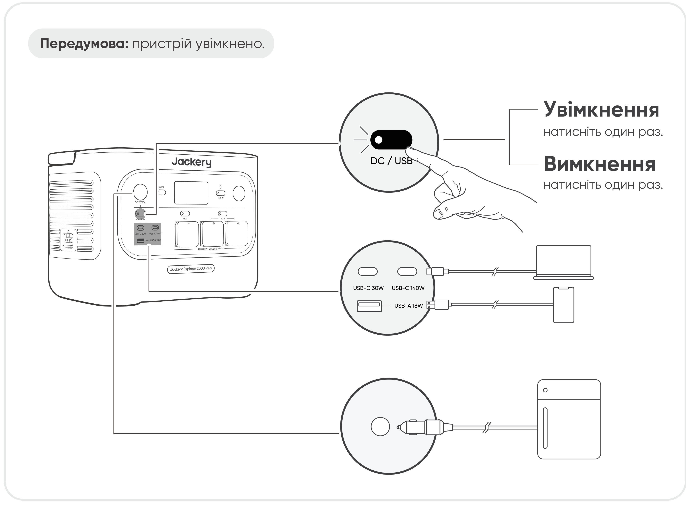

<table class="manual-callout-table" style="width:100%; border-collapse:collapse; margin:0 0 16px 0;"><tbody><tr><td class="manual-callout-label" style="width:16%; border:1px solid #000; padding:6px 8px; vertical-align:top;">
<strong>УВАГА</strong>
</td><td class="manual-callout-body" style="border:1px solid #000; padding:6px 8px; vertical-align:top;"><ul class="simple">
<li>
<strong>USB-C 140 Вт є високопотужним вихідним портом USB-PD Power Source 3 (PS3).</strong> Якщо підключений пристрій користувача або аксесуар не відповідає вимогам безпеки, існує ризик пожежі. Перед використанням цих портів переконайтеся, що підключений пристрій або аксесуар має захист від пожежі.
</li>
<li>
Підключайте Jackery Explorer 2000 Plus лише до пристроїв або аксесуарів, що відповідають пунктам 6.3, 6.4 і 6.5 IEC/EN/UL 62368-1 (або іншим еквівалентним стандартам).
</li>
<li>
Щоб отримати максимальну вихідну потужність, використовуйте кабель USB-C до USB-C 5 A (28 В DC/5 A, 140 Вт).
</li>
</ul>
</td></tr></tbody></table>

Пристрій може заряджати акумулятор вашого автомобіля за допомогою автомобільного кабелю заряджання Jackery 12 В, який продається окремо та доступний на нашому вебсайті.

<table class="manual-callout-table" style="width:100%; border-collapse:collapse; margin:0 0 16px 0;"><tbody><tr><td class="manual-callout-label" style="width:16%; border:1px solid #000; padding:6px 8px; vertical-align:top;">
<strong>УВАГА</strong>
</td><td class="manual-callout-body" style="border:1px solid #000; padding:6px 8px; vertical-align:top;"><ul class="simple">
<li>
Порт DC 12 В сумісний лише з автомобільними акумуляторами 12 В і не підходить для систем 24 В.
</li>
<li>
Не запускайте автомобіль, поки пристрій заряджає автомобільний акумулятор через вихідний порт DC 12 В, оскільки це може пошкодити пристрій.
</li>
<li>
Ця функція призначена лише для екстреного використання і не може зарядити повністю розряджений або пошкоджений автомобільний акумулятор.
</li>
</ul>
</td></tr></tbody></table>

## РЕЖИМ ЕНЕРГОЗБЕРЕЖЕННЯ

<table class="manual-callout-table" style="width:100%; border-collapse:collapse; margin:0 0 16px 0;"><tbody><tr><td class="manual-callout-label" style="width:16%; border:1px solid #000; padding:6px 8px; vertical-align:top;">
<strong>ПРИМІТКА</strong>
</td><td class="manual-callout-body" style="border:1px solid #000; padding:6px 8px; vertical-align:top;">
Після ввімкнення пристрій відновлює попередній стан режиму енергозбереження. Для зміни режиму потрібне ручне перемикання.
</td></tr></tbody></table>

## ВКЛ./ВИКЛ. LED-СВІТЛА

## Функція відновлення виходів AC і DC

Функцію відновлення виходів AC і DC за замовчуванням вимкнено. Увімкніть цю функцію в Додатку Jackery, щоб пристрій запам'ятовував стан виходів AC/DC та автоматично відновлював виходи AC і DC за визначених умов.

<table>
<thead>
<tr>
<th class="head">
Умови автоматичного відновлення
</th>
<th class="head">
Умови без автоматичного відновлення
</th>
</tr>
</thead>
<tbody>
<tr>
<td>
Увімкнення/перезапуск після вимкнення або перезапуску
</td>
<td>
Ручне вимкнення виходу (кнопкою/у Додатку)
</td>
</tr>
<tr>
<td rowspan="2">
SOC батареї ≥ ліміт розряджання +10% після досягнення ліміту
</td>
<td>
Вихід вимкнено в режимі енергозбереження
</td>
</tr>
<tr>
<td>
Вихід вимкнено через спрацювання захисту
</td>
</tr>
<tr>
<td>
Оновлення OTA завершено
</td>
<td>
Вихід вимкнено таймером розряджання
</td>
</tr>
</tbody>
</table>

## ЕКРАН LCD

<table style="width:100%; border-collapse:collapse; margin:0.75rem 0 0.5rem 0;">
<tbody>
<tr>
<td rowspan="6" style="text-align: center; width: 24%; border: 1px solid #cfcfcf; padding: 8px; vertical-align: top;">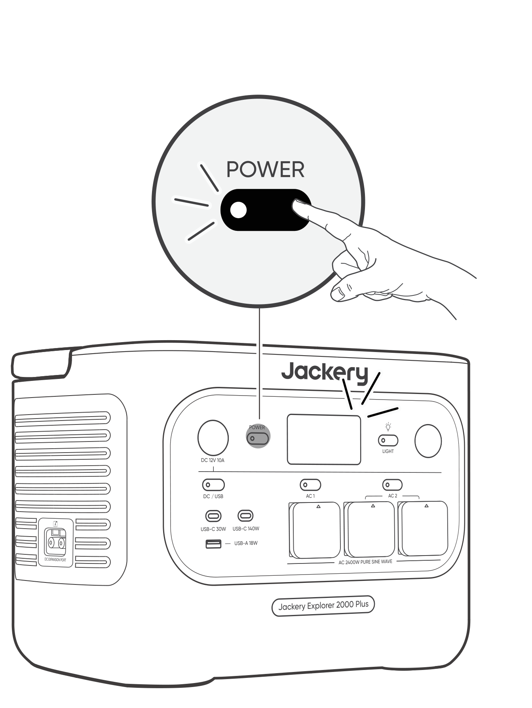</td>
<td rowspan="3" style="width: 18%; border: 1px solid #cfcfcf; padding: 8px; vertical-align: top">Короткочасне увімкнення</td>
<td style="width: 12%; border: 1px solid #cfcfcf; padding: 8px; vertical-align: top">Увімкнути</td>
<td style="width: 46%; border: 1px solid #cfcfcf; padding: 8px; vertical-align: top">Натисніть кнопку POWER або коли пристрій заряджається.</td>
</tr>
<tr>
<td style="border: 1px solid #cfcfcf; padding: 8px; vertical-align: top">Вимкнути</td>
<td style="border: 1px solid #cfcfcf; padding: 8px; vertical-align: top">Натисніть кнопку POWER.</td>
</tr>
<tr>
<td style="border: 1px solid #cfcfcf; padding: 8px; vertical-align: top">Автовимкнення</td>
<td style="border: 1px solid #cfcfcf; padding: 8px; vertical-align: top">LCD автоматично вимикається та переходить у режим сну після 2 хвилин бездіяльності.</td>
</tr>
<tr>
<td rowspan="3" style="border: 1px solid #cfcfcf; padding: 8px; vertical-align: top">Постійно увімкнено (під час заряджання або розряджання)</td>
<td style="border: 1px solid #cfcfcf; padding: 8px; vertical-align: top">Увімкнути</td>
<td style="border: 1px solid #cfcfcf; padding: 8px; vertical-align: top">Натисніть кнопку POWER двічі, коли пристрій увімкнено.</td>
</tr>
<tr>
<td style="border: 1px solid #cfcfcf; padding: 8px; vertical-align: top">Вимкнути</td>
<td style="border: 1px solid #cfcfcf; padding: 8px; vertical-align: top">Натисніть кнопку POWER.</td>
</tr>
<tr>
<td style="border: 1px solid #cfcfcf; padding: 8px; vertical-align: top">Автовимкнення</td>
<td style="border: 1px solid #cfcfcf; padding: 8px; vertical-align: top">LCD автоматично вимикається після 2 годин бездіяльності.</td>
</tr>
</tbody>
</table>

Ви також можете встановити режим відображення екрана в Додатку Jackery.

## КОМБІНАЦІЯ КНОПОК

| Кнопки | Дія | Функція |
|----|----|----|
| Головна кнопка POWER + Кнопка AC1 | Натисніть і утримуйте обидві протягом 3 с | Увімк./вимк. режим енергозбереження |
| Головна кнопка POWER + кнопка DC / USB | Натисніть і утримуйте обидві протягом 3 с | Скинути Wi-Fi та Bluetooth |
| кнопка DC / USB + Кнопка AC1 | Натисніть і утримуйте обидві протягом 1 с | Увімк./вимк. Wi-Fi та Bluetooth |
| Головна кнопка POWER + кнопка LED Light | Натисніть і утримуйте обидві протягом 1 с | Увімк./вимк. аварійний режим заряджання |

# ДЖЕРЕЛО БЕЗПЕРЕБІЙНОГО ЖИВЛЕННЯ (UPS)

Підключіть виріб до настінної розетки за допомогою кабелю для заряджання AC, потім натисніть кнопку AC і одночасно подавайте живлення на свої прилади.

У режимі UPS пікова вихідна потужність пристрою досягає 10 A перед відключенням електроенергії. Оскільки в режимі байпасу ввімкнено одночасне заряджання та розряджання,

фактична вихідна потужність у цьому режимі нижча за номінальну, але під час відключення електроенергії вона повертається до номінальної.

<table class="manual-callout-table" style="width:100%; border-collapse:collapse; margin:0 0 16px 0;"><tbody><tr><td class="manual-callout-label" style="width:16%; border:1px solid #000; padding:6px 8px; vertical-align:top;">
<strong>УВАГА</strong>
</td><td class="manual-callout-body" style="border:1px solid #000; padding:6px 8px; vertical-align:top;"><ul class="simple">
<li>
Цей пристрій не підтримує перемикання 0 мс. Не підключайте його до обладнання, яке потребує джерела живлення з перемиканням 0 мс, наприклад до серверів даних або робочих станцій.
</li>
<li>
Перед використанням кілька разів перевірте сумісність із вашим пристроєм.
</li>
<li>
Не підключайте навантаження, що перевищують максимальну вихідну потужність виробу. Інакше спрацює захист від перевантаження.
</li>
</ul>
</td></tr></tbody></table>

# ПІДКЛЮЧЕННЯ ДО БАТАРЕЙНОГО МОДУЛЯ(ІВ) (ПРОДАЄТЬСЯ ОКРЕМО)

## ПІДКЛЮЧЕННЯ ДО БАТАРЕЙНОГО МОДУЛЯ(ІВ) (ПРОДАЄТЬСЯ ОКРЕМО)

Цей пристрій підтримує до 5 батарейних модулів, щоб задовольнити потребу у великій ємності накопичення енергії. Докладніше про використання див. у *Посібнику користувача Jackery Battery Pack 2000*.

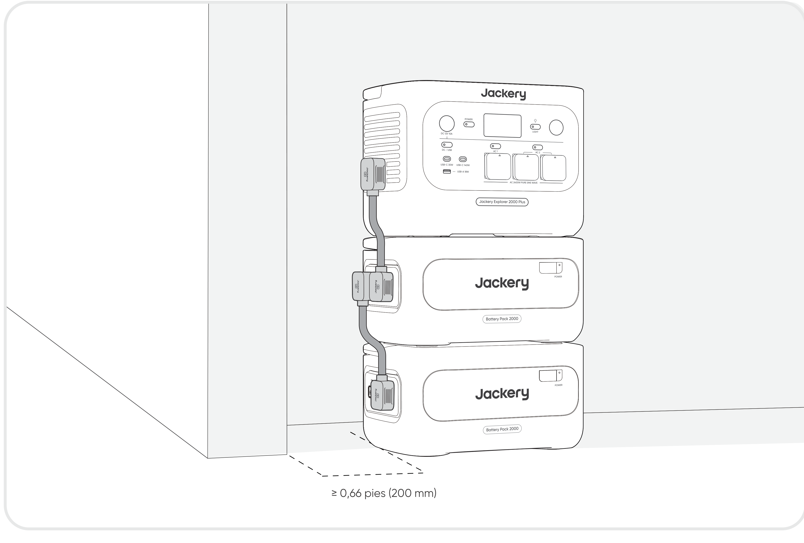

<table class="manual-callout-table" style="width:100%; border-collapse:collapse; margin:0 0 16px 0;"><tbody><tr><td class="manual-callout-label" style="width:16%; border:1px solid #000; padding:6px 8px; vertical-align:top;">
<strong>УВАГА</strong>
</td><td class="manual-callout-body" style="border:1px solid #000; padding:6px 8px; vertical-align:top;"><ul class="simple">
<li>
Перед підключенням Jackery Explorer 2000 Plus до Jackery Battery Pack 2000 переконайтеся, що всі вироби вимкнені.
</li>
<li>
Щоб забезпечити належну роботу пристрою, переконайтеся, що вентиляційні отвори для забору та викиду повітря з обох боків не перекриті. Залиште щонайменше 200 мм простору між отворами та будь-якими об'єктами для належного відведення тепла.
</li>
<li>
Коли пристрій використовується з підключеними батарейними модулями, стандартна максимальна кількість модулів у стеку становить 3, і пристрій потрібно розмістити на рівній, стійкій поверхні з достатньою несучою здатністю.
</li>
<li>
Якщо потрібно встановити 4 або більше батарейних модулів, пристрій слід розмістити в стійкому місці біля стіни, захистити від зовнішнього удару та вжити необхідних заходів для запобігання перекиданню.
</li>
</ul>
</td></tr></tbody></table>

|  |  |  |
|----|----|----|
| **Jackery Battery Pack 2000** | **Кабель розширення** | **Посібник користувача** |

## ЗАРЯДЖАННЯ

**Спочатку зелена енергія:** ми підтримуємо використання зеленої енергії в першу чергу. Цей пристрій підтримує два режими заряджання одночасно: заряджання від сонячних панелей і заряджання від настінної розетки AC. Коли заряджання від настінної розетки AC і сонячне заряджання увімкнені одночасно, пристрій надаватиме пріоритет сонячному заряджанню, а обидва способи використовуватимуться для заряджання батареї з максимально допустимою потужністю.

**Повністю зарядіть пристрій перед першим використанням.**

<table class="manual-callout-table" style="width:100%; border-collapse:collapse; margin:0 0 16px 0;"><tbody><tr><td class="manual-callout-label" style="width:16%; border:1px solid #000; padding:6px 8px; vertical-align:top;">
<strong>ПРИМІТКА</strong>
</td><td class="manual-callout-body" style="border:1px solid #000; padding:6px 8px; vertical-align:top;"><ul class="simple">
<li>
Рекомендований діапазон температури заряджання для пристрою становить від -10 °C до 45 °C, а діапазон температури розряджання - від -10 °C до 45 °C.
</li>
<li>
Робота пристрою поза цим температурним діапазоном може обмежити його можливості заряджання та розряджання або навіть унеможливити заряджання чи розряджання.
</li>
<li>
Потужність заряджання та ємність батареї пристрою можуть змінюватися через коливання температури.
</li>
</ul>
</td></tr></tbody></table>

### ЗАРЯДЖАННЯ ЧЕРЕЗ НАСТІННУ РОЗЕТКУ AC

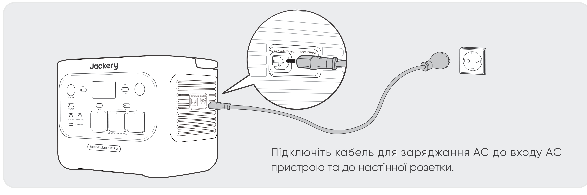

<table class="manual-callout-table" style="width:100%; border-collapse:collapse; margin:0 0 16px 0;"><tbody><tr><td class="manual-callout-label" style="width:16%; border:1px solid #000; padding:6px 8px; vertical-align:top;">
<strong>УВАГА</strong>
</td><td class="manual-callout-body" style="border:1px solid #000; padding:6px 8px; vertical-align:top;">
Переконайтеся, що кабель для заряджання AC повністю та надійно вставлений у вхід AC. Неповне підключення може спричинити нестабільний струм, перегрів, поганий контакт або несправність пристрою.
</td></tr></tbody></table>

**Аварійний режим заряджання**

У цьому режимі ви можете швидко зарядити портативну електростанцію за допомогою заряджання AC. Цю функцію аварійного заряджання можна ввімкнути або вимкнути через додаток Jackery. Під час аварійного режиму заряджання круговий індикатор стану заряду (SOC) блиматиме швидше.

\*Щоб максимально продовжити термін служби батареї, найкраще заряджати її зі звичайною швидкістю. Використовуйте аварійний режим заряджання лише за потреби. Його не рекомендується застосовувати регулярно або тривалий час.

## ЗАРЯДЖАННЯ ВІД СОНЯЧНИХ ПАНЕЛЕЙ (ПРОДАЮТЬСЯ ОКРЕМО)

Jackery Explorer 2000 Plus має два вхідні порти DC8020 і сумісний із сонячними панелями Jackery.

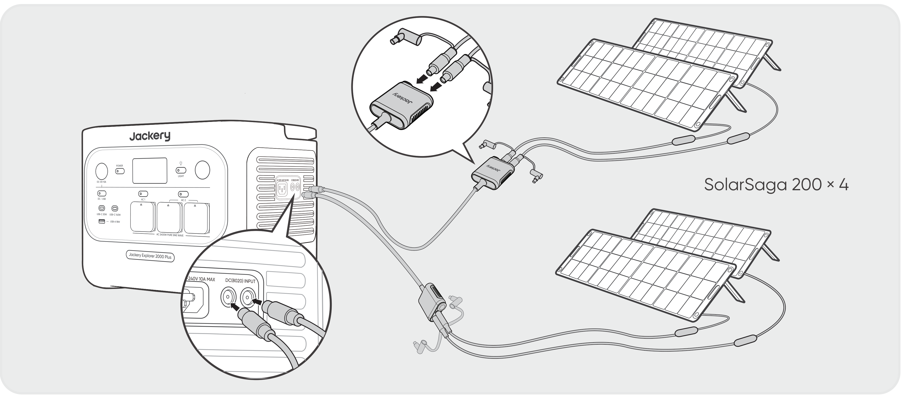

Якщо до одного входу DC8020 потрібно одночасно підключити дві сонячні панелі, зверніться до наведеної нижче схеми заряджання через з\'єднувач сонячних панелей (продається окремо, до стандартної комплектації не входить).

<table class="manual-callout-table" style="width:100%; border-collapse:collapse; margin:0 0 16px 0;"><tbody><tr><td class="manual-callout-label" style="width:16%; border:1px solid #000; padding:6px 8px; vertical-align:top;">
<strong>УВАГА</strong>
</td><td class="manual-callout-body" style="border:1px solid #000; padding:6px 8px; vertical-align:top;">
До одного входу DC8020 можна підключити не більше двох сонячних панелей.
</td></tr></tbody></table>

<table class="manual-callout-table" style="width:100%; border-collapse:collapse; margin:0 0 16px 0;"><tbody><tr><td class="manual-callout-label" style="width:16%; border:1px solid #000; padding:6px 8px; vertical-align:top;">
<strong>УВАГА</strong>
</td><td class="manual-callout-body" style="border:1px solid #000; padding:6px 8px; vertical-align:top;">
Переконайтеся, що вхідна напруга для обох портів DC однакова. Інакше можна пошкодити пристрій. Наприклад:

<ul class="simple">
<li>
Використовуйте сонячні панелі Jackery однієї моделі та однакову кількість панелей, якщо підключаєте сонячні панелі до обох входів DC8020.
</li>
<li>
Не заряджайте пристрій одночасно від автомобільного зарядного пристрою та сонячної панелі. Це може призвести до перегорання автомобільного запобіжника або до збою заряджання.
</li>
</ul>
</td></tr></tbody></table>

Рекомендується використовувати сонячну панель Jackery для заряджання пристрою. Переконайтеся, що напруга холостого ходу (Voc) сонячної панелі входить до діапазону входу DC (16 V-60 V) Jackery Explorer 2000 Plus. Jackery не несе відповідальності за будь-які пошкодження або втрати, спричинені використанням сонячних панелей сторонніх виробників.

## ЗАРЯДЖАННЯ ЧЕРЕЗ АВТОМОБІЛЬНИЙ ЗАРЯДНИЙ ПРИСТРІЙ (ПРОДАЄТЬСЯ ОКРЕМО)

Цей пристрій можна заряджати за допомогою автомобільного зарядного пристрою 12 В. Переконайтеся, що автомобільний зарядний пристрій і автомобільна розетка живлення 12 В (прикурювач) мають надійне з\'єднання.

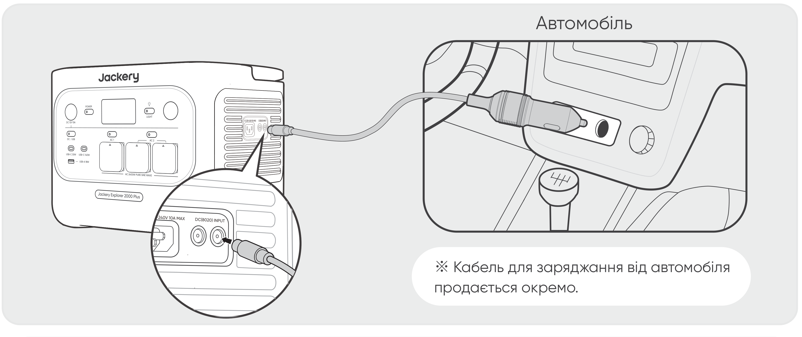

<table class="manual-callout-table" style="width:100%; border-collapse:collapse; margin:0 0 16px 0;"><tbody><tr><td class="manual-callout-label" style="width:16%; border:1px solid #000; padding:6px 8px; vertical-align:top;">
<strong>УВАГА</strong>
</td><td class="manual-callout-body" style="border:1px solid #000; padding:6px 8px; vertical-align:top;"><ul class="simple">
<li>
Перед заряджанням електростанції обов'язково запустіть транспортний засіб.
</li>
<li>
Якщо транспортний засіб рухається нерівними дорогами, використовувати автомобільний зарядний пристрій заборонено, оскільки це може спричинити нестандартну роботу. Компанія не несе відповідальності за будь-які втрати, спричинені нестандартною роботою.
</li>
<li>
Автомобільне заряджання застосовується лише для транспортних засобів із 12 В DC, але не для 24 В DC. Будь ласка, не заряджайте цей пристрій у транспортному засобі з 24 В, щоб уникнути травмування людей і матеріальних збитків.
</li>
</ul>
</td></tr></tbody></table>

# ЗБЕРІГАННЯ

Зберігайте пристрій у сухому, чистому та добре вентильованому місці. Температура та вологість під час зберігання:

- 1 місяць: від -20 °C до 45 °C (0-60 % RH)

- 3 місяці: від 0 °C до 45 °C (0-60 % RH)

- 12 місяців: від 0 °C до 25 °C (0-60 % RH)

Якщо цей пристрій зберігати тривалий час (3-6 місяців) із розрядженим акумулятором, він може стати нездатним до заряджання. Щоб уникнути цього та зберегти стан батареї, рекомендується перевіряти та заряджати пристрій кожні три місяці, а також виконувати повний цикл заряджання та розряджання щонайменше раз на 6-12 місяців.

# УСУНЕННЯ НЕСПРАВНОСТЕЙ

Якщо з\'являється будь-який із наведених нижче кодів помилки, виконайте вказані дії для усунення проблеми. Якщо несправність не зникає, зверніться до служби підтримки Jackery.

<figure aria-label="Код помилки / Способи усунення" class="hb-troubleshooting-composition" data-component-id="HB-TABLE-TROUBLESHOOTING" tabindex="0"><table class="hb-troubleshooting-table"><colgroup><col class="hb-troubleshooting-col-code"/><col class="hb-troubleshooting-col-measures"/></colgroup><thead><tr><th class="hb-troubleshooting-code" scope="col">
Код помилки
</th><th class="hb-troubleshooting-measures" scope="col">
Способи усунення
</th></tr></thead><tbody><tr><td class="hb-troubleshooting-code">
F0
</td><td class="hb-troubleshooting-measures">
Перезапустіть пристрій.
</td></tr><tr><td class="hb-troubleshooting-code">
F1
</td><td class="hb-troubleshooting-measures">
Перезапустіть пристрій.
</td></tr><tr><td class="hb-troubleshooting-code">
F2
</td><td class="hb-troubleshooting-measures">
Перезапустіть пристрій.
</td></tr><tr><td class="hb-troubleshooting-code">
F3
</td><td class="hb-troubleshooting-measures">
Перезапустіть пристрій.
</td></tr><tr><td class="hb-troubleshooting-code">
F4
</td><td class="hb-troubleshooting-measures">
Підключіть до пристрою навантаження, щоб розрядити батарею, доки несправність не зникне.
</td></tr><tr><td class="hb-troubleshooting-code">
F5
</td><td class="hb-troubleshooting-measures">
Заряджайте пристрій через сонячні панелі або настінну розетку AC, доки несправність не зникне.
</td></tr><tr><td class="hb-troubleshooting-code">
F6
</td><td class="hb-troubleshooting-measures">

1. Дочекайтеся, поки мережа стабілізується, перш ніж заряджати пристрій через настінну розетку AC.

2. Перевірте, чи не заблоковані вентиляційні отвори для забору та викиду повітря; забезпечте зазор 20 см з обох боків пристрою.

3. Розташуйте пристрій у місці, не відкритому для прямого сонячного світла або високої температури навколишнього середовища.

4. Від'єднайте від пристрою всі навантаження. Залиште пристрій без роботи та дочекайтеся, поки несправність не зникне.

5. Перезапустіть пристрій.

</td></tr><tr><td class="hb-troubleshooting-code">
F7
</td><td class="hb-troubleshooting-measures">

1. Від'єднайте від пристрою всі входи DC.

2. Перевірте напругу холостого ходу (Voc) підключених сонячних панелей. Пристрій допускає максимальну вхідну напругу DC 60 В.

3. Перезапустіть пристрій і залиште його без роботи. Дочекайтеся, поки несправність не зникне.

</td></tr><tr><td class="hb-troubleshooting-code">
F8
</td><td class="hb-troubleshooting-measures">
Зверніться до служби підтримки Jackery.
</td></tr><tr><td class="hb-troubleshooting-code">
F9
</td><td class="hb-troubleshooting-measures">
Від'єднайте навантаження, підключене до DC/USB-портів пристрою. Дочекайтеся, поки несправність не зникне.
</td></tr><tr><td class="hb-troubleshooting-code">
FE
</td><td class="hb-troubleshooting-measures">
Зверніться до служби підтримки Jackery.
</td></tr></tbody></table></figure>

# Специфікації

## ЗАГАЛЬНА ІНФОРМАЦІЯ

<figure aria-label="ЗАГАЛЬНА ІНФОРМАЦІЯ" class="hb-spec-table-composition"><table class="hb-spec-table manual-table manual-spec-table"><colgroup><col class="hb-spec-col-label"/><col class="hb-spec-col-value"/></colgroup>
<tbody>
<tr>
<th class="hb-spec-label manual-spec-label" scope="row">Назва продукту</th>
<td class="hb-spec-value manual-spec-value">Jackery Explorer 2000 Plus</td>
</tr>
<tr>
<th class="hb-spec-label manual-spec-label" scope="row">Номер моделі</th>
<td class="hb-spec-value manual-spec-value">JE-2000E</td>
</tr>
<tr>
<th class="hb-spec-label manual-spec-label" scope="row">Ємність</th>
<td class="hb-spec-value manual-spec-value">2048 Вт-год (40 A-год / 51,2 В постійного струму)</td>
</tr>
<tr>
<th class="hb-spec-label manual-spec-label" scope="row">Хімічний склад елементів</th>
<td class="hb-spec-value manual-spec-value">LiFePO₄</td>
</tr>
<tr>
<th class="hb-spec-label manual-spec-label" scope="row">Вага</th>
<td class="hb-spec-value manual-spec-value">Близько 18,8 кг</td>
</tr>
<tr>
<th class="hb-spec-label manual-spec-label" scope="row">Розміри</th>
<td class="hb-spec-value manual-spec-value">36,6 × 25,5 × 27,2 см</td>
</tr>
<tr>
<th class="hb-spec-label manual-spec-label" scope="row">Ресурс циклів</th>
<td class="hb-spec-value manual-spec-value">6000 циклів до 70%+ ємності</td>
</tr>
</tbody>
</table></figure>

## ВХІДНІ ПОРТИ

<figure aria-label="ВХІДНІ ПОРТИ" class="hb-spec-table-composition"><table class="hb-spec-table manual-table manual-spec-table"><colgroup><col class="hb-spec-col-label"/><col class="hb-spec-col-value"/></colgroup>
<tbody>
<tr>
<th class="hb-spec-label manual-spec-label" scope="row">1 вхід змінного струму</th>
<td class="hb-spec-value manual-spec-value">Режим заряджання: 220 В-240 В~ 50 Гц, 10 A макс. Режим байпасу①: 220 В-240 В~ 50 Гц, 10 A макс.</td>
</tr>
<tr>
<th class="hb-spec-label manual-spec-label" scope="row">2 порти DC8020</th>
<td class="hb-spec-value manual-spec-value">PV: 11–16 В⎓8 А макс., до 8 А макс. при використанні двох входів Car: 16–60 В⎓12 А, до 21 А / 800 Вт макс. при використанні двох входів</td>
</tr>
<tr>
<th class="hb-spec-label manual-spec-label" scope="row">1 порт розширення постійного струму</th>
<td class="hb-spec-value manual-spec-value">36.8 V-57.6 V⎓75 A max.</td>
</tr>
</tbody>
</table></figure>

## ВИХІДНІ ПОРТИ

<figure aria-label="ВИХІДНІ ПОРТИ" class="hb-spec-table-composition"><table class="hb-spec-table manual-table manual-spec-table"><colgroup><col class="hb-spec-col-label"/><col class="hb-spec-col-value"/></colgroup>
<tbody>
<tr>
<th class="hb-spec-label manual-spec-label" scope="row">2 виходи змінного струму</th>
<td class="hb-spec-value manual-spec-value">230 В~ 50 Гц, 10 A макс., номінальна потужність 2400 Вт загалом, пікова потужність 4800 Вт</td>
</tr>
<tr>
<th class="hb-spec-label manual-spec-label" scope="row">Вихід змінного струму у байпасному режимі①</th>
<td class="hb-spec-value manual-spec-value">230 В~ 50 Гц, 10 A макс.</td>
</tr>
<tr>
<th class="hb-spec-label manual-spec-label" scope="row">1 вихід USB-A</th>
<td class="hb-spec-value manual-spec-value">18 Вт макс., 5-6 В⎓3 A, 6-9 В⎓2 A, 9-12 В⎓1,5 A</td>
</tr>
<tr>
<th class="hb-spec-label manual-spec-label" scope="row">2 виходи USB-C</th>
<td class="hb-spec-value manual-spec-value">30 Вт макс., 5 В⎓3 A, 9 В⎓3 A, 12 В⎓2,5 A, 15 В⎓2 A, 20 В⎓1,5 A 140 Вт макс., 5 В⎓3 A, 9 В⎓3 A, 12 В⎓3 A, 15 В⎓3 A, 20 В⎓5 A, 28 В⎓5 A</td>
</tr>
<tr>
<th class="hb-spec-label manual-spec-label" scope="row">1 × порт DC 12 В</th>
<td class="hb-spec-value manual-spec-value">12 В⎓10 А макс.</td>
</tr>
<tr>
<th class="hb-spec-label manual-spec-label" scope="row">1 порт розширення постійного струму</th>
<td class="hb-spec-value manual-spec-value">36.8 V-57.6 V⎓55 A max.</td>
</tr>
</tbody>
</table></figure>

## РОБОЧА ТЕМПЕРАТУРА НАВКОЛИШНЬОГО СЕРЕДОВИЩА

<figure aria-label="РОБОЧА ТЕМПЕРАТУРА НАВКОЛИШНЬОГО СЕРЕДОВИЩА" class="hb-spec-table-composition"><table class="hb-spec-table manual-table manual-spec-table"><colgroup><col class="hb-spec-col-label"/><col class="hb-spec-col-value"/></colgroup>
<tbody>
<tr>
<th class="hb-spec-label manual-spec-label" scope="row">Температура заряджання</th>
<td class="hb-spec-value manual-spec-value">від -10 °C до 45 °C</td>
</tr>
<tr>
<th class="hb-spec-label manual-spec-label" scope="row">Температура розряду</th>
<td class="hb-spec-value manual-spec-value">від -10 °C до 45 °C</td>
</tr>
</tbody>
</table></figure>

※ USB Type-C® та USB-C® є зареєстрованими торговельними марками USB Implementers Forum.

① Продукт може заряджати акумулятор від мережевої розетки змінного струму, одночасно подаючи живлення через вихідні порти змінного струму.

# ГАРАНТІЯ

<figure aria-label="ГАРАНТІЯ" class="hb-warranty-intro-composition" data-component-id="HB-WARRANTY-LEAD">

<strong>Ця гарантія поширюється лише на клієнтів, які купують товар на офіційному вебсайті Jackery, на сторонніх платформах під брендом Jackery або в місцевих авторизованих дилерів.</strong>

* Терміни та умови гарантії можуть відрізнятися залежно від місцевих законів, нормативних актів та авторизованих дилерів.

</figure>

## Обмежена гарантія

<figure aria-label="Обмежена гарантія" class="hb-warranty-card" data-component-id="HB-WARRANTY-SECTION" data-warranty-card-index="1">
Jackery гарантує первинному споживачу-покупцеві, що продукт Jackery не матиме дефектів виготовлення та матеріалів під час звичайного споживчого використання протягом відповідного гарантійного періоду, зазначеного в розділі "Гарантійний період" нижче, за умови дотримання виключень, викладених нижче.

Ця гарантійна заява визначає повне та виключне гарантійне зобов'язання Jackery. Ми не беремо на себе і не уповноважуємо жодну особу брати від нашого імені будь-яку іншу відповідальність, пов'язану з продажем нашої продукції.
</figure>

## Гарантійний період

<figure aria-label="Гарантійний період" class="hb-warranty-period-card" data-component-id="HB-WARRANTY-YEARS">

3
<strong class="hb-warranty-years-unit">РОКИ</strong><strong class="hb-warranty-period-label">Стандартна гарантія</strong>

Стандартний гарантійний період для Jackery Explorer 2000 Plus становить 36 місяців.
У кожному випадку гарантійний період обчислюється з дати придбання первинним споживачем-покупцем.
Для визначення дати початку гарантійного періоду потрібен чек про продаж від першого споживача-покупця або інший обґрунтований документальний доказ.

2
<strong class="hb-warranty-years-unit">РОКИ</strong><strong class="hb-warranty-period-label">Подовжена гарантія</strong>

Щоб активувати подовження гарантії, потрібно зареєструвати продукт онлайн або звернутися до нашої служби підтримки за адресою <a class="reference external" href="mailto:hello.eu@jackery.com">hello.eu@jackery.com</a>, щоб продовжити стандартний гарантійний період.

</figure>

## Обмін

<figure aria-label="Обмін" class="hb-warranty-card" data-component-id="HB-WARRANTY-SECTION" data-warranty-card-index="3">
Jackery замінить (за рахунок Jackery) будь-який продукт Jackery, який не працює протягом відповідного гарантійного періоду через дефект матеріалів або виготовлення. Заміна отримує залишок гарантійного терміну оригінального продукту.
</figure>

## Лише для первинного споживача-покупця

<figure aria-label="Лише для первинного споживача-покупця" class="hb-warranty-card" data-component-id="HB-WARRANTY-SECTION" data-warranty-card-index="4">
Гарантія на продукт Jackery поширюється лише на первинного споживача-покупця і не передається жодному наступному власнику.
</figure>

## Винятки

<figure aria-label="Винятки" class="hb-warranty-card" data-component-id="HB-WARRANTY-SECTION" data-warranty-card-index="5">
Гарантія Jackery не поширюється на:
<ul class="simple">
<li>
Будь-який продукт, який було використано неналежним чином, зловживано, модифіковано, пошкоджено внаслідок нещасного випадку або використовувано не за призначенням, відмінним від звичайного споживчого використання, дозволеного в поточній документації Jackery щодо продукту.
</li>
<li>
Спробу ремонту будь-ким, окрім авторизованого сервісного центру.
</li>
<li>
Будь-який продукт, придбаний через онлайн-аукціон.
</li>
<li>
Гарантія Jackery не поширюється на елемент батареї, якщо ви не повністю зарядили цей елемент протягом семи днів після придбання продукту та не заряджали його щонайменше раз на 6 місяців після цього.
</li>
</ul></figure>

## Права на тлумачення

<figure aria-label="Права на тлумачення" class="hb-warranty-card" data-component-id="HB-WARRANTY-SECTION" data-warranty-card-index="6">
Jackery залишає за собою право на остаточне тлумачення вищезазначеної політики післяпродажного обслуговування.
</figure>

# НАЛАШТУВАННЯ ДОДАТКА

## 1. Завантажте додаток і увійдіть

Знайдіть \"Jackery\" у Google Play або App Store, щоб установити додаток. Після цього ви можете зареєструватися та увійти. Або відскануйте QR-код нижче, щоб завантажити та встановити додаток.

## 2. Додайте пристрій

2.1 Натисніть кнопку **+**, щоб додати свій пристрій.

2.2 Натисніть головну кнопку POWER на пристрої, щоб увімкнути його; значки Wi-Fi та Bluetooth на пристрої блимають, що означає перехід пристрою в режим налаштування мережі, торкніться кнопки \"**Значок блимає**\" і дозвольте додатку підключитися до найближчих пристроїв та надати дозвіл Bluetooth.

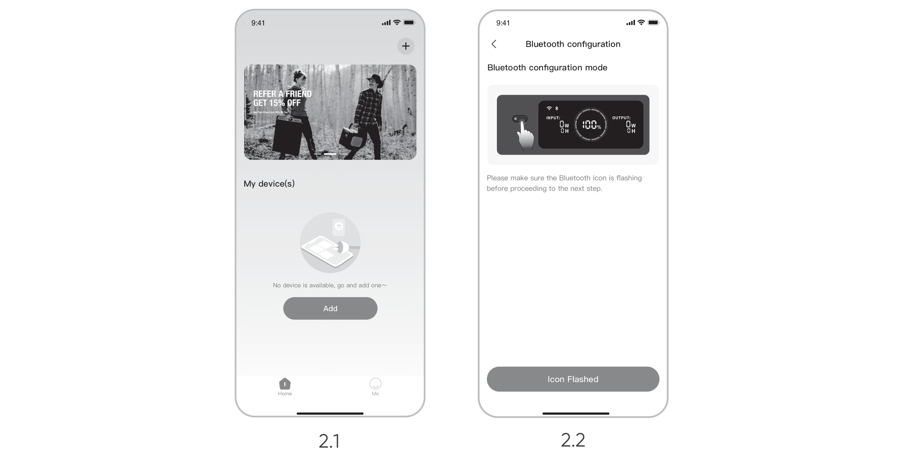

Головна кнопка POWER

Кнопка AC1

Кнопка AC2

Кнопка POWER DC / USB

2.3 Після натискання на значок знайденого пристрою додаток автоматично підключить пристрій через Bluetooth.

<table class="manual-callout-table" style="width:100%; border-collapse:collapse; margin:0 0 16px 0;"><tbody><tr><td class="manual-callout-label" style="width:16%; border:1px solid #000; padding:6px 8px; vertical-align:top;">
<strong>ПРИМІТКА</strong>
</td><td class="manual-callout-body" style="border:1px solid #000; padding:6px 8px; vertical-align:top;">
Якщо під час процесу прив'язування з'являється повідомлення "<strong>пристрій уже прив'язано</strong>", для підключення можна скористатися одним із двох способів:

<ul class="simple">
<li>
Власник пристрою поділиться цим пристроєм з іншими користувачами через додаток.
</li>
<li>
Натисніть і утримуйте головну кнопку POWER + кнопку DC / USB протягом 3 секунд, щоб скинути Wi-Fi та Bluetooth пристрою, а потім знову прив'яжіть пристрій.
</li>
</ul>
</td></tr></tbody></table>

2.4 Після успішного підключення пристрою введіть пароль Wi-Fi та натисніть кнопку **ОК**.

<table class="manual-callout-table" style="width:100%; border-collapse:collapse; margin:0 0 16px 0;"><tbody><tr><td class="manual-callout-label" style="width:16%; border:1px solid #000; padding:6px 8px; vertical-align:top;">
<strong>ПРИМІТКА</strong>
</td><td class="manual-callout-body" style="border:1px solid #000; padding:6px 8px; vertical-align:top;"><ul class="simple">
<li>
Будь ласка, вибирайте мережу Wi-Fi у діапазоні 2,4 ГГц. Пристрій не підтримує мережі Wi-Fi у діапазоні 5 ГГц.
</li>
</ul>
</td></tr></tbody></table>

Після успішного додавання пристрою до додатка значок Wi-Fi на пристрої буде постійно увімкнений.

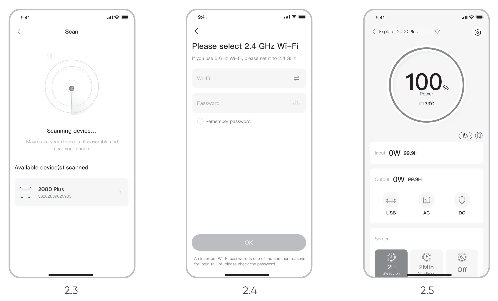

Наведені вище знімки екрана наведено лише для довідки.

<table class="manual-callout-table" style="width:100%; border-collapse:collapse; margin:0 0 16px 0;"><tbody><tr><td class="manual-callout-label" style="width:16%; border:1px solid #000; padding:6px 8px; vertical-align:top;">
<strong>УВАГА</strong>
</td><td class="manual-callout-body" style="border:1px solid #000; padding:6px 8px; vertical-align:top;">
Додаток Jackery може одночасно підключатися лише до однієї електростанції через Bluetooth. Повернення до списку пристроїв автоматично відключає Bluetooth. Щоб знову підключитися автоматично, торкніться електростанції у списку ще раз.
</td></tr></tbody></table>

## 3. Відв\'яжіть пристрій

Торкніться значка **Налаштування** у правому верхньому куті головного інтерфейсу пристрою, щоб перейти на сторінку налаштувань, а потім торкніться кнопки **Відв\'язати** внизу сторінки, щоб відв\'язати пристрій.

## 4. Примітки

### 4.1 Щоб увімкнути Wi-Fi та Bluetooth

- Wi-Fi та Bluetooth автоматично вмикаються після увімкнення пристрою, а значки Wi-Fi та Bluetooth на екрані загоряються.

- Одночасно натисніть і утримуйте кнопку DC / USB + кнопку AC, доки значки Wi-Fi та Bluetooth на екрані не загоряться.

### 4.2 Щоб вимкнути Wi-Fi та Bluetooth

Одночасно натисніть і утримуйте кнопку DC / USB + кнопку AC, доки значки Wi-Fi та Bluetooth на екрані не згаснуть.

### 4.3 Щоб скинути Wi-Fi та Bluetooth

Одночасно натисніть і утримуйте головну кнопку POWER + кнопку DC / USB протягом 3 секунд, щоб скинути Wi-Fi та Bluetooth до заводських налаштувань. Обліковий запис підключеного додатка буде відв\'язано.
