# IMPORTANT

Congratulations on your new Jackery Explorer 300D. Please read this manual carefully before using the product, particularly the relevant precautions to ensure proper use. Keep this manual in an accessible place for frequent reference.

In compliance with laws and regulations, the right of final interpretation of this document and all related documents of this product resides with the Company. Please kindly notice that no further notifications will be given in case of any update, revision or termination.

# IMPORTANT SAFETY INFORMATION

INSTRUCTIONS PERTAINING TO RISK OF FIRE, ELECTRIC SHOCK, OR INJURY TO PERSONS

Warning

Always follow these basic precautions when using this product.

- Read all the instructions before using the product.

- Do not allow children to play with the product. Close supervision of children is necessary when the product is used near children.

- Risk of electric shock may occur if using accessories that are not recommended or sold by professional product manufacturers.

- When the product is not in use, unplug the power plug from the product\'s socket.

- Do not dismantle the product, as this may lead to unpredictable risks such as fire, explosion, or electric shock.

- Do not use the product with damaged cords, plugs, or output cables, as this may cause electric shock.

- To ensure proper air circulation, keep the product vents uncovered. The area where the product is used must have adequate airflow in a cool, dry environment to prevent overheating.

  - Charging in damp or poorly ventilated spaces may cause safety hazards.

  - Water can cause short circuits or damage to the charger, leading to safety risks.

- Do not expose the product to fire, high temperatures, direct sunlight, or high-heat environments such as inside a parked vehicle. Such exposure may result in fire or explosion.

## USER MAINTENANCE INSTRUCTIONS

During the lifecycle of energy storage products, a certain degree of capacity and energy degradation is expected. As the number of charge and discharge cycles increases and storage time extends, this degradation will gradually intensify, which is a normal phenomenon consistent with the natural aging of battery cells.

# MEANING OF SYMBOLS

| Signal word | Meaning |
|----|----|
| **WARNING** | Hazardous practices that may result in severe injury, death, and/or property damage. |
| **CAUTION** | Hazardous practices that may result in personal injury and/or property damage. |
| **NOTE** | Hazardous practices that may result in equipment damage, data loss, performance deterioration, or unanticipated results. |
| **TIP** | Supplements the important information or operation tips in the text. |

|  |  |
|----|----|
| Warning and Caution Symbols. Must read to alert individuals to potential hazards or risks. | This symbol indicates that a lithium-ion (Li-ion) battery is inside the product and should be disposed of or recycled properly. |
| Read the user manual before operation. | This symbol indicates that the product shall not be disposed of as household waste, and should be delivered to a designated collection facility for recycling. |
| Do not dismantle the product. | Proper disposal and recycling can help protect the environment. For more information about the disposal and recycling of this product, contact your local community, disposal service, or dealer. |
| Keep the product away from fire. | Keep away from children. |

# WHAT\'S IN THE BOX

<figure aria-label="WHAT'S IN THE BOX" class="hb-inbox-composition" data-card-count="2" data-component-id="HB-SPECIAL-INBOX" data-inbox-variant="responsive-card-grid"><ol class="hb-inbox-grid"><li class="hb-inbox-card" data-item-number="1">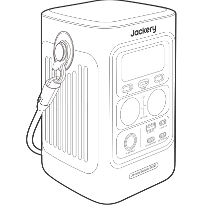

<strong>Jackery Explorer 300D</strong>

</li><li class="hb-inbox-card" data-item-number="2">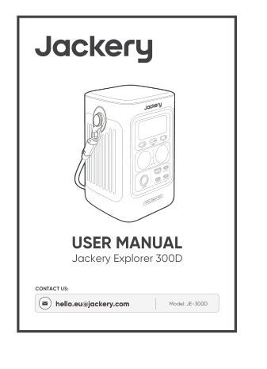

<strong>User Manual</strong>

</li></ol></figure>

Tip

The car charging cable is not included but is available for purchase separately on our website. For assistance, please contact Jackery Customer Support.

# PRODUCT OVERVIEW

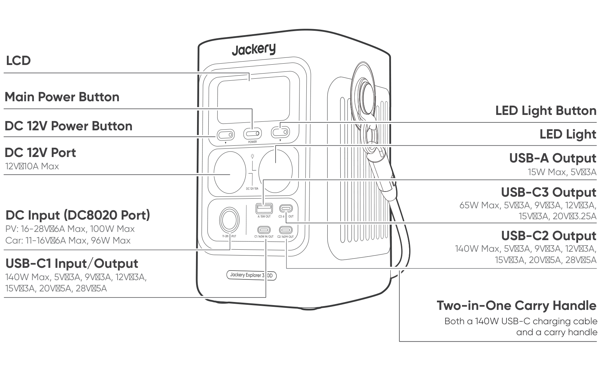 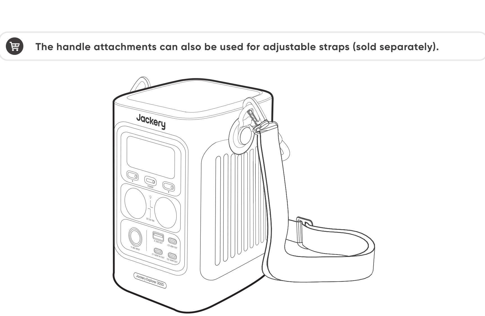

# LCD DISPLAY

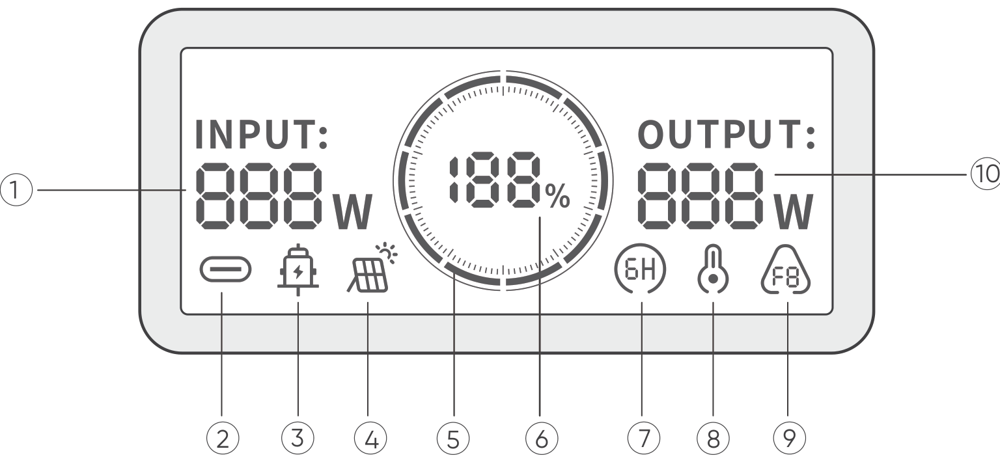

| No. | Indicator | Description |
|----|----|----|
| 1 | Input Power | Displays the input power in watts. |
| 2 | USB-C Charging Indicator | The product is charged via the USB-C port. |
| 3 | Car Charging Indicator | The product is charged via the DC Input (DC8020) using DC 12V (car charging). |
| 4 | Solar Charging Indicator | The product is charged via the DC Input (DC8020) using solar panel(s). |
| 5 | Battery Power Indicator | When the product is being charged, the orange circle around the battery percentage will light up in sequence. When charging other devices, the orange circle will stay on. |
| 6 | Remaining Battery Percentage | Displays the remaining battery percentage. |
| 7 | Energy Saving Mode | On: Energy Saving Mode is enabled. Off: Energy Saving Mode is disabled. |
| 8 | High Temperature Indicator | High temperature protection is triggered. The product may stop functioning until its temperature returns to the normal operating range. |
| 8 | Low Temperature Indicator | Low temperature protection is triggered. The product may stop functioning until its temperature returns to the normal operating range. |
| 9 | Fault Code | A product error has occurred. Please refer to the Troubleshooting section for details. |
| 10 | Output Power | Displays the output power in watts. |

# OPERATIONS

## POWER ON/OFF

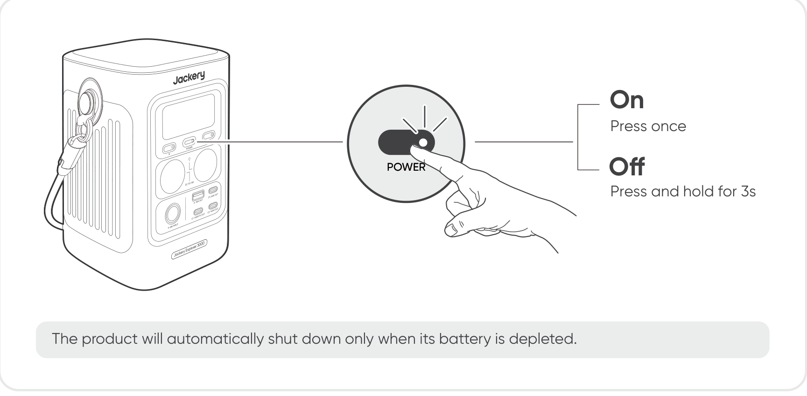

## USB OUTPUT ON/OFF

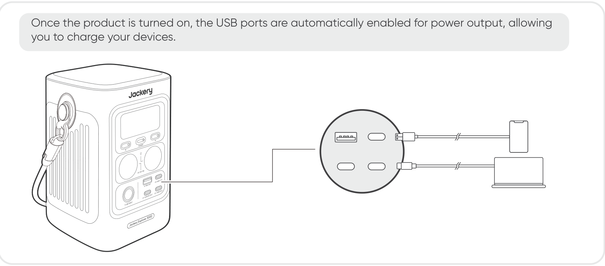

Caution!

- USB-C1 and USB-C2 are USB-PD Power Source 3 (PS3) high-power output ports. If the connected user device or accessory does not meet safety requirements, there may be a fire risk. Before using these ports, ensure that the connected device or accessory has fire safety protection.

- Only connect the Jackery Explorer 300D to devices or accessories that comply with clauses 6.3, 6.4, and 6.5 of IEC/EN/UL 62368-1 (or other equivalent standards).

- To obtain maximum output power, use the official Jackery USB-C to USB-C 5A cable (20V DC/5A, 100W; 28V DC/5A, 140W).

## DC 12V OUTPUT ON/OFF

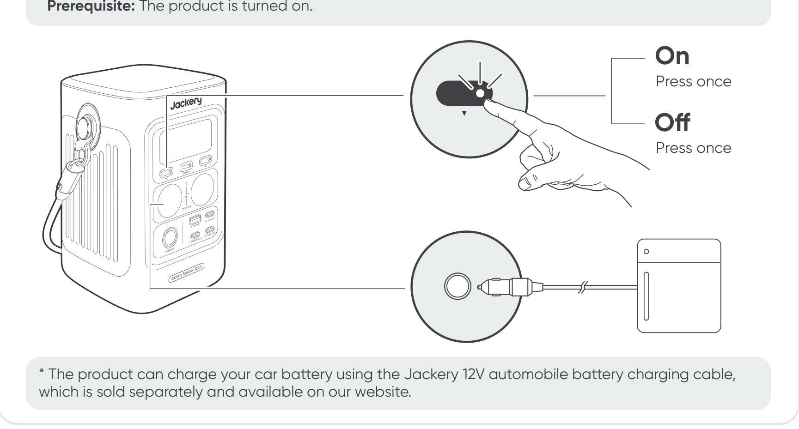

Caution!

- The DC 12V outlet (cigarette lighter port) is only compatible with 12V car batteries and not suitable for 24V systems.

- Do not start the car while the product is charging the car battery through the 12V DC output port (cigarette lighter port), as this may damage the product.

- This feature is intended for emergency use only and cannot charge a dead or damaged car battery.

## ENERGY SAVING MODE

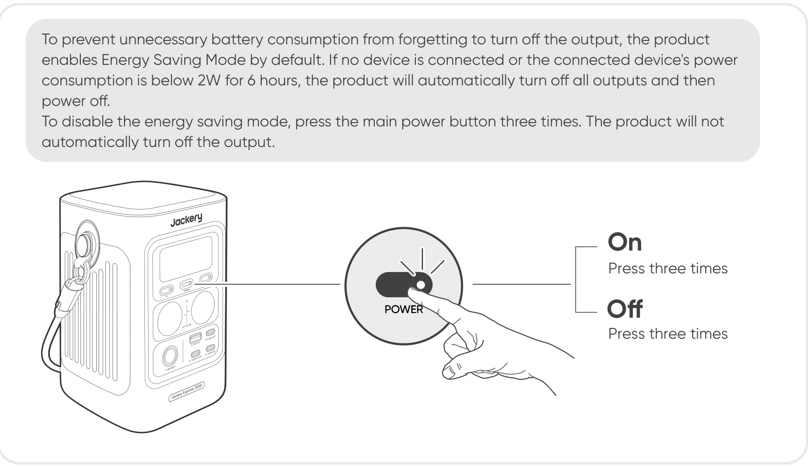

Note

Energy Saving Mode resumes its previous state after power-on. Manual switching is required for mode changes.

## LED LIGHT ON/OFF

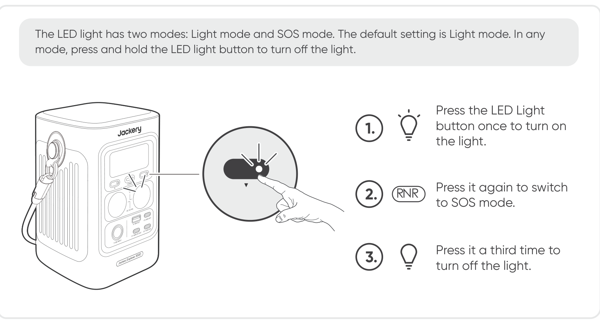

## LCD SCREEN ON/OFF

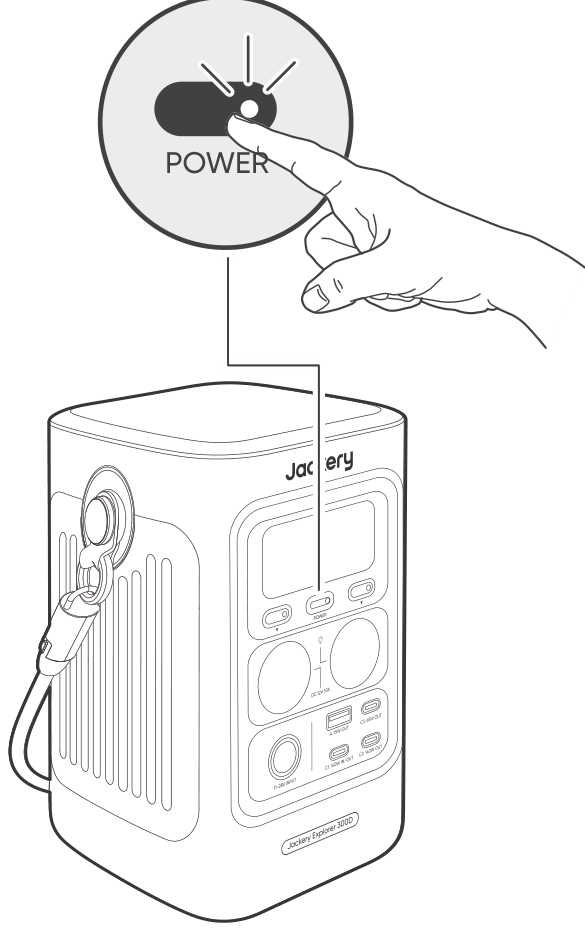

| Mode | Action | Result |
|----|----|----|
| LCD Screen | Turn on | Press the Main Power Button, or connect the product to a charger. In always-on display mode, double-press the Main Power Button. |
| LCD Screen | Turn off | Press the Main Power Button. |
| LCD Screen | Auto-off | The LCD turns off automatically and enters sleep mode after 2 minutes of inactivity. |
| Always-on Display Mode (under charging or discharging state) | Turn on | Double-press the Main Power Button when the LCD screen is on. |
| Always-on Display Mode (under charging or discharging state) | Turn off | Press the Main Power Button. |
| Always-on Display Mode (under charging or discharging state) | Auto-off | The Always-on Display Mode turns off automatically after 2 hours of inactivity. |

# CHARGING

**Green energy first:** We advocate to use the green energy first. This product supports two modes of charging at the same time: solar charging and USB-C charging. When USB-C charging and solar charging are turned on at the same time, the product will give priority to solar charging and both methods will be used to charge the battery at the maximum permissible power.

**Fully charge the product before its first use.**

Note

- The recommended charging temperature for the product ranges from 0°C to 45°C, and the discharging temperature ranges from -15°C to 45°C. Operating the product beyond this temperature range may restrict its charging and discharging capabilities, or even prevent it from charging or discharging.

- The charging power and battery capacity of the product may vary due to temperature fluctuations.

## USB-C CHARGING (140W MAX)

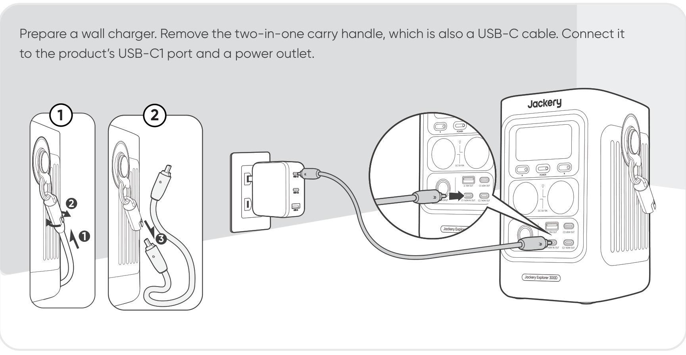

Caution!

When charging through the USB-C port, this product supports up to 140W, which requires a PD charger and cable that both support 140W.

## SOLAR CHARGING (100W MAX)

The Jackery Explorer 300D has one DC8020 input port, which supports direct connection of a solar panel.

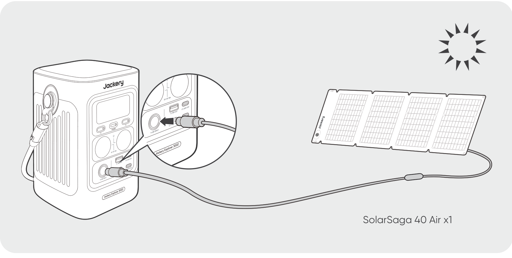

It is recommended to use a Jackery solar panel to charge the product. Ensure that the open-circuit voltage (Voc) of the solar panel falls within the Jackery Explorer 300D\'s DC input voltage range (16V--28V). Jackery is not responsible for any damage or loss resulting from the use of third-party solar panels.

## CAR CHARGING (96W MAX)

This product can be charged using a 12V car charger. Ensure that the car charger and the car cigarette lighter provide a good connection.

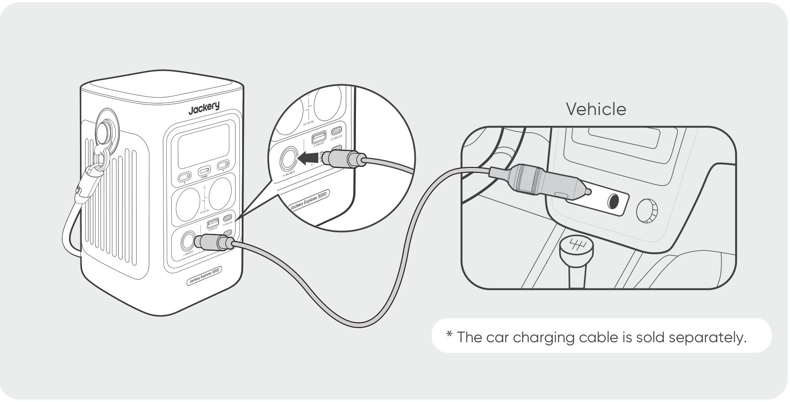

Caution!

- Please start the vehicle before charging your power station.

- If the vehicle is running on bumpy roads, it is forbidden to use the car charger in case it causes non-standard operation. The Company will not be responsible for any loss caused by non-standard operation.

- Vehicle charging is only applicable to vehicles with 12V DC, not 24V DC. Please do not charge this product in a 24V vehicle to avoid personal injury and property loss.

# STORAGE

Store the product in a dry, clean place with proper ventilation. Storage temperature and humidity:

- 1 month: -20°C to 45°C (0-60% RH)

- 3 months: 0°C to 45°C (0-60% RH)

- 12 months: 0°C to 25°C (0-60% RH)

If this product is stored for a long period of time (3 months - 6 months) with the power depleted, it may become unchargeable. To prevent this and maintain battery health, it is recommended to check and recharge the product every three months and perform a full charge and discharge cycle at least once every 6 to 12 months.

# TROUBLESHOOTING

If any of the following fault codes appear, follow the listed corrective actions to resolve the issue. If the fault persists, please contact Jackery Customer Support.

| Error Code | Corrective Measures |
|----|----|
| F0 | Restart the product. |
| F1 | Contact Jackery Customer Support. |
| F2 | Contact Jackery Customer Support. |
| F3 | Restart the product. |
| F4 | Connect the product to loads to discharge its battery until the fault disappears. |
| F5 | Charge the product via USB-C or solar panel until the fault disappears. |
| F6 | Contact Jackery Customer Support. |
| F7 | Remove all DC inputs from the product. If you charge the product via a solar panel, check the open-circuit voltage (Voc) of the connected solar panel. The product allows a maximum DC input voltage of 28V. Restart the product and keep it idle. Wait until the fault disappears. |
| F8 | Contact Jackery Customer Support. |
| F9 | Remove the load connected to the DC 12V/USB ports of the product. Wait until the fault disappears. |

# SPECIFICATIONS

## GENERAL INFO

|                |                              |
|----------------|------------------------------|
| Product Name   | Jackery Explorer 300D        |
| Model No.      | JE-300D                      |
| Capacity       | 15Ah / 19.2V DC (288 Wh)     |
| Cell Chemistry | LiFePO4                      |
| Weight         | About 2.5 kg                 |
| Dimensions     | 11.86 × 12.02 × 18.3 cm      |
| Cycle Life     | 4000 cycles to 70%+ capacity |

## INPUT PORTS

<table>
<colgroup>
<col style="width: 34%" />
<col style="width: 66%" />
</colgroup>
<tbody>
<tr>
<td>
1 × USB-C Input
</td>
<td>
C1: 5V 3A, 9V 3A, 12V 3A, 15V 3A, 20V 5A, 28V 5A, 140W Max
</td>
</tr>
<tr>
<td>
1 × DC8020 Port
</td>
<td>
PV: 16-28V 6A Max, 100W Max

Car: 11-16V 6A Max, 96W Max
</td>
</tr>
</tbody>
</table>

## OUTPUT PORTS

<table>
<colgroup>
<col style="width: 34%" />
<col style="width: 66%" />
</colgroup>
<tbody>
<tr>
<td>
3 × USB-C Port
</td>
<td>
C1: 140W Max, 5V 3A, 9V 3A, 12V 3A, 15V 3A, 20V 5A, 28V 5A

C2: 140W Max, 5V 3A, 9V 3A, 12V 3A, 15V 3A, 20V 5A, 28V 5A

C3: 65W Max, 5V 3A, 9V 3A, 12V 3A, 15V 3A, 20V 3.25A
</td>
</tr>
<tr>
<td>
1 × USB-A Port
</td>
<td>
15W Max, 5V 3A
</td>
</tr>
<tr>
<td>
1 × DC 12V Port
</td>
<td>
12V 10A Max
</td>
</tr>
</tbody>
</table>

## ENVIRONMENTAL OPERATING TEMPERATURE

|                       |               |
|-----------------------|---------------|
| Charge Temperature    | 0°C to 45°C   |
| Discharge Temperature | -15°C to 45°C |

## MULTI-PORT OUTPUT COMBINATIONS

### 1-Port Output

| Port Used   | Max Output |
|-------------|------------|
| USB-C1      | 140W       |
| USB-C2      | 140W       |
| USB-C3      | 65W        |
| USB-A       | 15W        |
| DC 12V Port | 120W       |

\* In some combinations, USB-C1/2/3 may be limited depending on main port priority.

### 2-Port Output

| Combination          | Max Output  |
|----------------------|-------------|
| USB-C1 + USB-C2      | 140W + 140W |
| USB-C1 + USB-C3      | 140W + 65W  |
| USB-C1 + USB-A       | 140W + 15W  |
| USB-C1 + DC 12V Port | 140W + 120W |
| USB-C2 + USB-C3      | 140W + 65W  |
| USB-C2 + USB-A       | 140W + 15W  |
| USB-C2 + DC 12V Port | 140W + 120W |
| USB-C3 + USB-A       | 65W + 15W   |
| USB-C3 + DC 12V Port | 65W + 120W  |
| USB-A + DC 12V Port  | 15W + 120W  |

### 3-Port Output

| Combination                   | Max Output         |
|-------------------------------|--------------------|
| USB-C1 + USB-C2 + USB-C3      | 140W + 140W + 65W  |
| USB-C1 + USB-C2 + USB-A       | 140W + 140W + 15W  |
| USB-C1 + USB-C2 + DC 12V Port | 100W + 100W + 120W |
| USB-C1 + USB-C3 + USB-A       | 140W + 65W + 15W   |
| USB-C1 + USB-C3 + DC 12V Port | 140W + 65W + 120W  |
| USB-C1 + USB-A + DC 12V Port  | 140W + 15W + 120W  |
| USB-C2 + USB-C3 + USB-A       | 140W + 65W + 15W   |
| USB-C2 + USB-C3 + DC 12V Port | 140W + 65W + 120W  |
| USB-C2 + USB-A + DC 12V Port  | 140W + 15W + 120W  |
| USB-C3 + USB-A + DC 12V Port  | 65W + 15W + 120W   |

### 4-Port Output

| Combination                            | Max Output              |
|----------------------------------------|-------------------------|
| USB-C1 + USB-C2 + USB-C3 + USB-A       | 140W + 65W + 65W + 15W  |
| USB-C1 + USB-C2 + USB-C3 + DC 12V Port | 100W + 65W + 30W + 120W |
| USB-C1 + USB-C2 + USB-A + DC 12V Port  | 100W + 65W + 15W + 120W |
| USB-C1 + USB-C3 + USB-A + DC 12V Port  | 100W + 65W + 15W + 120W |
| USB-C2 + USB-C3 + USB-A + DC 12V Port  | 100W + 65W + 15W + 120W |

### 5-Port Output

| All Ports Active | Max Output |
|----|----|
| USB-C1 + USB-C2 + USB-C3 + USB-A + DC 12V Port | 65W + 65W + 30W + 15W + 120W |

※ USB Type-C® and USB-C® are registered trademarks of USB Implementers Forum.

When devices are connected to the high-power ports, the output power may be automatically adjusted by the product\'s temperature protection mechanism. This is normal operation and does not indicate a malfunction. There is no need for concern.

# WARRANTY

<figure aria-label="WARRANTY" class="hb-warranty-intro-composition" data-component-id="HB-WARRANTY-LEAD">

<strong>This warranty applies only to customers who purchase from the official Jackery website, Jackery-branded third-party platforms, or local authorized dealers.</strong>

*Warranty period and details may vary according to local laws, regulations, and authorized dealers.

</figure>

## Limited Warranty

<figure aria-label="Limited Warranty" class="hb-warranty-card" data-component-id="HB-WARRANTY-SECTION" data-warranty-card-index="1">
Jackery warrants to the original consumer purchaser that the Jackery product will be free from defects in workmanship and material under normal consumer use during the applicable warranty period identified in the 'Warranty Period' section below, subject to the exclusions set forth below.

This warranty statement sets forth Jackery's total and exclusive warranty obligation. We will not assume, nor authorize any person to assume for us, any other liability in connection with the sale of our products.
</figure>

## Warranty Period

<figure aria-label="Warranty Period" class="hb-warranty-period-card" data-component-id="HB-WARRANTY-YEARS">

3
<strong class="hb-warranty-years-unit">YEARS</strong><strong class="hb-warranty-period-label">Standard Warranty</strong>

The standard warranty period for Jackery Explorer 300D is 36 months.
In each case, the warranty period is measured starting on the date of purchase by the original consumer purchaser.
The sales receipt from the first consumer purchaser, or other reasonable documentary proof, is required in order to establish the start date of the warranty period.

2
<strong class="hb-warranty-years-unit">YEARS</strong><strong class="hb-warranty-period-label">Extended Warranty</strong>

To activate the Warranty Extension, you must register your product online or contact our customer service team at <a class="reference external" href="mailto:hello.eu@jackery.com">hello.eu@jackery.com</a> to extend the standard warranty period.

</figure>

## Exchange

<figure aria-label="Exchange" class="hb-warranty-card" data-component-id="HB-WARRANTY-SECTION" data-warranty-card-index="3">
Jackery will replace (at Jackery's expense) any Jackery product that fails to operate during the applicable warranty period due to a defect in workmanship or material. A replacement product assumes the remaining warranty of the original product.
</figure>

## Limited to Original Consumer Buyer

<figure aria-label="Limited to Original Consumer Buyer" class="hb-warranty-card" data-component-id="HB-WARRANTY-SECTION" data-warranty-card-index="4">
The warranty on Jackery's product is limited to the original consumer purchaser and is not transferable to any subsequent owner.
</figure>

## Exclusions

<figure aria-label="Exclusions" class="hb-warranty-card" data-component-id="HB-WARRANTY-SECTION" data-warranty-card-index="5">
Jackery's warranty does not apply to:
<ul class="simple">
<li>
Any product that has been misused, abused, modified, damaged by accident, or used for anything other than normal consumer use as authorized in Jackery's current product literature.
</li>
<li>
Attempted repair by anyone other than an authorized facility.
</li>
<li>
Any product purchased through an online auction house.
</li>
<li>
Jackery's warranty does not apply to the battery cell unless the battery cell is fully charged by you within seven days after you purchase the product and at least once every 6 months thereafter.
</li>
</ul></figure>

## Interpretation Rights

<figure aria-label="Interpretation Rights" class="hb-warranty-card" data-component-id="HB-WARRANTY-SECTION" data-warranty-card-index="6">
Jackery reserves the right to the final interpretation of the above customer after-sales policy.
</figure>

# EU REGULATIONS

## EU DECLARATION OF CONFORMITY

Shenzhen Hello Tech Energy Co., Ltd. hereby declares that the Jackery Explorer 300D with model JE-300D is in compliance with the essential requirements and other relevant provisions of the LVD Directive 2014/35/EU, EMC Directive 2014/30/EU and RoHS Directive 2011/65/EU, as amended by 2015/863/EU.

The full text of the EU declaration of conformity is available at:

<a href="https://de.jackery.com/pages/user-guides" class="reference external">https://de.jackery.com/pages/user-guides</a>

## MANUFACTURER

SHENZHEN HELLO TECH ENERGY CO., LTD.

F2-3, Bldg. 7, Jiaanda Science and Technology Industrial Park Factory, the east side of Huafan Road, Tongsheng Community, Dalang Street, Longhua District, Shenzhen, Guangdong, China

<a href="mailto:sales@hello-tech.com" class="reference external">sales@hello-tech.com</a>

+86 400 668 9293

www.hello-tech.com
