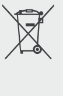
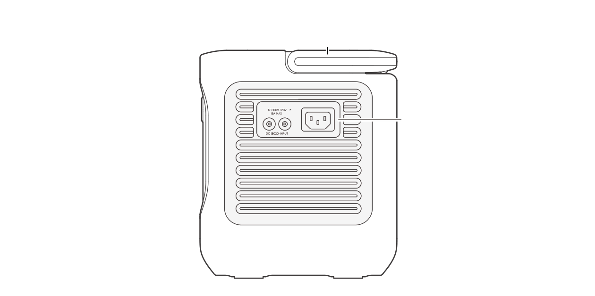
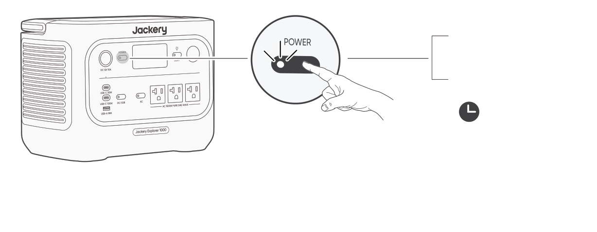
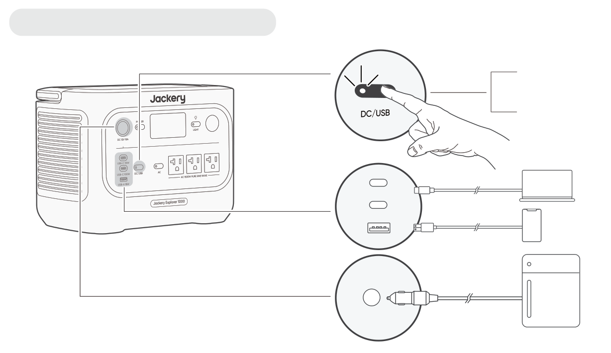
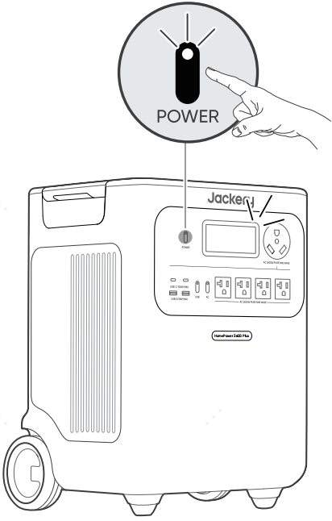
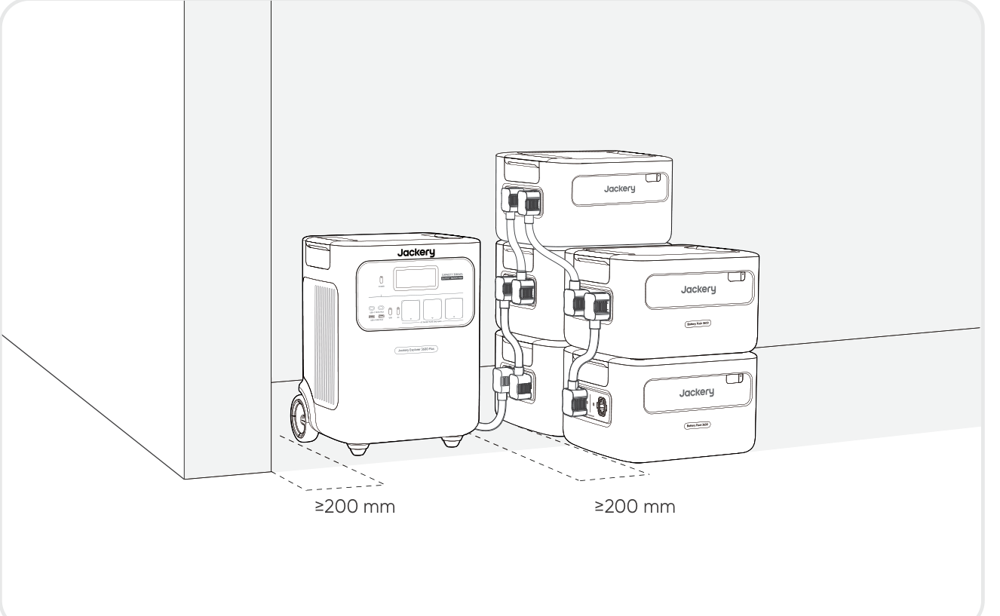
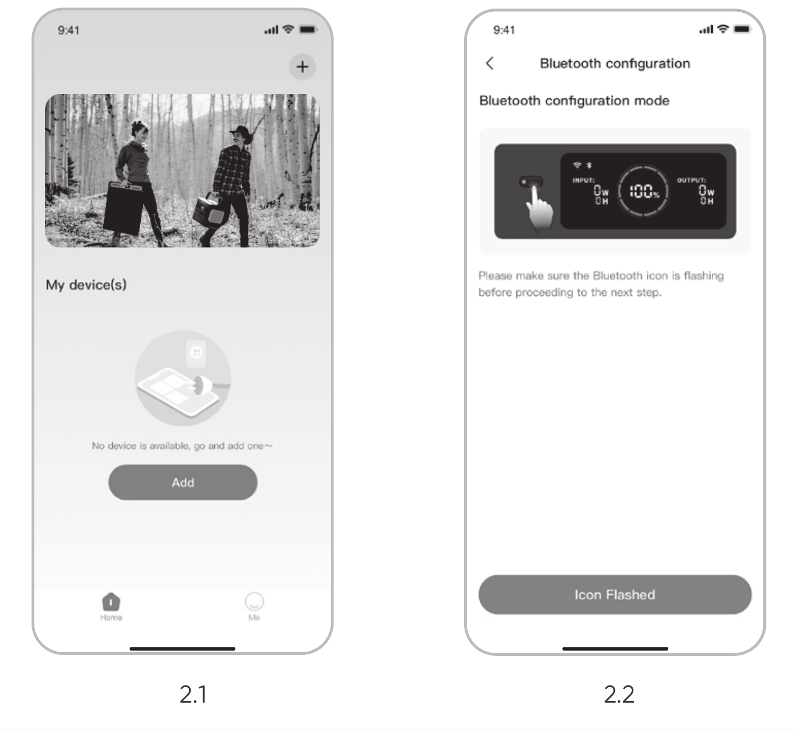

# INFORMACIÓN IMPORTANTE DE SEGURIDAD

<table class="manual-callout-table" style="width:100%; border-collapse:collapse; margin:0 0 16px 0;"><tbody><tr><td class="manual-callout-label" style="width:16%; border:1px solid #000; padding:6px 8px; vertical-align:top;">
<strong>ADVERTENCIA</strong>
</td><td class="manual-callout-body" style="border:1px solid #000; padding:6px 8px; vertical-align:top;">
INSTRUCCIONES DE SEGURIDAD PARA PREVENIR INCENDIOS, DESCARGAS ELÉCTRICAS O LESIONES
</td></tr></tbody></table>

Sigue siempre estas precauciones básicas al usar este producto.

- Lee todas las instrucciones antes de usar este producto.
- No permitas que los niños jueguen con el producto. Se requiere supervisión estrecha cuando el producto se utilice cerca de niños.
- Puede existir riesgo de descarga eléctrica si se utilizan accesorios recomendados o vendidos por fabricantes no profesionales.
- Cuando el producto no esté en uso, desconecta el enchufe de alimentación de la toma del producto.
- No desmontes el producto, ya que esto puede causar riesgos imprevisibles como incendio, explosión o descarga eléctrica.
- No utilices el producto con cables, enchufes o cables de salida dañados, ya que esto puede provocar una descarga eléctrica.
- Para garantizar una circulación de aire adecuada, mantén descubiertas las rejillas de ventilación del producto. El área donde se utilice el producto debe tener un flujo de aire adecuado en un entorno fresco y seco para evitar el sobrecalentamiento.
  - Cargar en espacios húmedos o mal ventilados puede representar riesgos para la seguridad.
  - El agua puede provocar cortocircuitos o dañar el cargador, generando riesgos para la seguridad.
- No expongas el producto al fuego, a altas temperaturas, a la luz solar directa ni a entornos calurosos como el interior de un vehículo estacionado. Dicha exposición puede causar un incendio o una explosión.

## INSTRUCCIONES DE MANTENIMIENTO PARA EL USUARIO

Durante el ciclo de vida de los productos de almacenamiento de energía, se espera cierto grado de degradación de la capacidad y de la energía. A medida que aumenta el número de ciclos de carga y descarga y se prolonga el tiempo de almacenamiento, esta degradación se intensificará gradualmente. Esta es una condición normal coherente con el envejecimiento natural de las celdas de la batería.

# SIGNIFICADO DE LOS SÍMBOLOS

<figure aria-label="Símbolo / Significado" class="hb-symbol-signal-composition" data-component-id="HB-TABLE-SYMBOL-SIGNAL"><table class="hb-symbol-signal-table"><colgroup><col class="hb-symbol-signal-col-label"/><col class="hb-symbol-signal-col-meaning"/></colgroup><thead><tr><th class="hb-symbol-signal-label-heading" scope="col">
Símbolo
</th><th class="hb-symbol-signal-meaning-heading" scope="col">
Significado
</th></tr></thead><tbody><tr><td class="hb-symbol-signal-label-cell">⚠ADVERTENCIA</td><td class="hb-symbol-signal-meaning-cell">
Prácticas peligrosas que pueden resultar en lesiones graves, muerte y/o daños a la propiedad.
</td></tr><tr><td class="hb-symbol-signal-label-cell">⚠PRECAUCIÓN</td><td class="hb-symbol-signal-meaning-cell">
Prácticas peligrosas que pueden resultar en lesiones personales y/o daños a la propiedad.
</td></tr><tr><td class="hb-symbol-signal-label-cell">⚠NOTA</td><td class="hb-symbol-signal-meaning-cell">
Prácticas peligrosas que pueden resultar en daños en el equipo, pérdida de datos, deterioro del rendimiento o resultados inesperados.
</td></tr><tr><td class="hb-symbol-signal-label-cell">⚠CONSEJOS</td><td class="hb-symbol-signal-meaning-cell">
Complementa la información importante o consejos de operación en el texto.
</td></tr></tbody></table></figure>

<figure aria-label="Símbolo / Significado" class="hb-symbol-pair-composition" data-component-id="HB-TABLE-SYMBOL-ICON">

<table class="hb-symbol-panel-table"><colgroup><col class="hb-symbol-col-icon"/><col class="hb-symbol-col-meaning"/></colgroup><thead><tr><th class="hb-symbol-icon-heading" scope="col">
<strong>Símbolo</strong>
</th><th class="hb-symbol-meaning-heading" scope="col">
<strong>Significado</strong>
</th></tr></thead><tbody><tr><td class="hb-symbol-icon"></td><td class="hb-symbol-meaning">
Símbolos de advertencia y precaución. Alertan a las personas sobre información que debe leerse para evitar posibles peligros o riesgos.
</td></tr><tr><td class="hb-symbol-icon"></td><td class="hb-symbol-meaning">
Lea el manual del operador
</td></tr><tr><td class="hb-symbol-icon"></td><td class="hb-symbol-meaning">
No desarme el producto.
</td></tr><tr><td class="hb-symbol-icon"></td><td class="hb-symbol-meaning">
Mantenga el producto alejado del fuego.
</td></tr></tbody></table>

<table class="hb-symbol-panel-table"><colgroup><col class="hb-symbol-col-icon"/><col class="hb-symbol-col-meaning"/></colgroup><thead><tr><th class="hb-symbol-icon-heading" scope="col">
<strong>Símbolo</strong>
</th><th class="hb-symbol-meaning-heading" scope="col">
<strong>Significado</strong>
</th></tr></thead><tbody><tr><td class="hb-symbol-icon"></td><td class="hb-symbol-meaning">
No se permiten niños
</td></tr><tr><td class="hb-symbol-icon"></td><td class="hb-symbol-meaning">
Este símbolo indica que el producto contiene una batería de iones de litio (Li-ion), la cual debe desecharse o reciclarse de forma adecuada.
</td></tr><tr><td class="hb-symbol-icon"></td><td class="hb-symbol-meaning">
Este símbolo indica que el producto no debe desecharse con los residuos domésticos. En su lugar, debe llevarse a un punto de recogida designado para su correcto reciclaje.
El desecho y reciclaje adecuados ayudan a proteger el medioambiente. Para más información, póngase en contacto con su autoridad local, el servicio de gestión de residuos o el distribuidor del producto.
</td></tr><tr><td class="hb-symbol-icon"></td><td class="hb-symbol-meaning">
Las baterías y acumuladores no deben desecharse junto con los residuos domésticos.
Como consumidor, usted está obligado por ley a desechar todas las baterías y acumuladores en los puntos de recolección designados, independientemente de si contienen sustancias peligrosas.
Devuelva las baterías y acumuladores usados a un punto de recolección local, un centro de reciclaje o al minorista donde los compró. La eliminación adecuada garantiza un reciclaje responsable con el medio ambiente y evita posibles daños a la salud humana y al medio ambiente.
</td></tr></tbody></table>

</figure>

# CONTENIDO DE LA CAJA

<figure aria-label="CONTENIDO DE LA CAJA" class="hb-inbox-composition" data-card-count="3" data-component-id="HB-SPECIAL-INBOX" data-inbox-variant="three-card-responsive"><ol class="hb-inbox-grid"><li class="hb-inbox-card" data-item-number="1">

<strong>Jackery Explorer 3600 Plus</strong>

</li><li class="hb-inbox-card" data-item-number="2">

<strong>Cable de carga de CA</strong>

</li><li class="hb-inbox-card" data-item-number="3">

<strong>Manual del usuario</strong>

</li></ol>

<strong>CONSEJOS</strong>

El cable de carga para vehículo no está incluido, pero está disponible para su compra por separado en nuestro sitio web.
Para obtener asistencia, comunícate con el servicio al cliente de Jackery.

</figure>

# DESCRIPCIÓN GENERAL DEL PRODUCTO

## VISTA FRONTAL

## VISTA LATERAL DERECHA

# PANTALLA LCD

<table class="longtable lcd-text-only">
<colgroup>
<col style="width: 8%" />
<col style="width: 12%" />
<col style="width: 28%" />
<col style="width: 52%" />
</colgroup>
<tbody>
<tr>
<td>
1
</td>
<td></td>
<td>
Wi-Fi
</td>
<td>On: Wi-Fi connected.
Blink: Ready to connect to Wi-Fi.
Off: Wi-Fi disconnected.</td>
</tr>
<tr>
<td>
2
</td>
<td></td>
<td>
Bluetooth
</td>
<td>On: Bluetooth connected.
Blink: Ready to connect to Bluetooth.
Off: Bluetooth disconnected.</td>
</tr>
<tr>
<td>
3
</td>
<td></td>
<td>
Quiet Charging Mode
</td>
<td>On: The noise during charging is significantly minimized, while the charging power is reduced and the charging speed slows down.
Off: Quiet Charging Mode is disabled.
Enable/disable this feature in the Jackery App.</td>
</tr>
<tr>
<td>
4
</td>
<td></td>
<td>
Battery Saving Mode / Self-powered Mode
</td>
<td>Battery Saving Mode: Limits the maximum usable battery capacity to extend battery life. Enable/disable this feature in the Jackery App. This feature is not available when the product is connected to battery pack(s).
Self-powered Mode: Maximizes the use of solar energy and reduces reliance on grid electricity by prioritizing stored solar energy. Enable/disable this feature in the Jackery App. The power station must be connected to both solar panels and the grid simultaneously, with load power limited by bypass power.</td>
</tr>
<tr>
<td>
5
</td>
<td></td>
<td>
Charging Plan
</td>
<td>
Customizes the charging time of the Jackery Explorer 3600 Plus. Suitable for situations with fluctuating electricity prices, it allows for charging plans based on peak and off-peak electricity times, reducing electricity costs. Set this feature in the Jackery App.
</td>
</tr>
<tr>
<td>
6
</td>
<td></td>
<td>
AC Power Indicator
</td>
<td>
The AC output (pure sine wave) is on.
</td>
</tr>
<tr>
<td>
7
</td>
<td></td>
<td>
Output Voltage and Frequency
</td>
<td>
Displays the output voltage and frequency when the AC output is turned on.
</td>
</tr>
<tr>
<td>
8
</td>
<td></td>
<td>
Input Power
</td>
<td>
Displays the input power in watts.
</td>
</tr>
<tr>
<td>
9
</td>
<td></td>
<td>
Remaining Charge Time
</td>
<td>
Displays the remaining charging time.
</td>
</tr>
<tr>
<td>
10
</td>
<td></td>
<td>
AC Wall Charging Indicator
</td>
<td>
The product is charged via the AC Input using grid power.
</td>
</tr>
<tr>
<td>
11
</td>
<td></td>
<td>
Car Charging Indicator
</td>
<td>
The product is charged via the DC Input (DC8020) using DC 12 V (car charging).
</td>
</tr>
<tr>
<td>
12
</td>
<td></td>
<td>
Solar Charging Indicator
</td>
<td>
The product is charged via the DC Input (DC8020) using solar panel(s).
</td>
</tr>
<tr>
<td>
13
</td>
<td></td>
<td>
Battery Power Indicator
</td>
<td>
When the product is being charged, the orange circle around the battery percentage will light up in sequence. When charging other devices, the orange circle will stay on.
</td>
</tr>
<tr>
<td>
14
</td>
<td></td>
<td>
Low Battery Indicator
</td>
<td>On: The battery level is below 20%.
Blink: The battery level is below 5%.
Off: The battery level is not below 20% or the product is charging.</td>
</tr>
<tr>
<td>
15
</td>
<td></td>
<td>
Remaining Battery Percentage
</td>
<td>
Displays the remaining battery percentage.
</td>
</tr>
<tr>
<td>
16
</td>
<td></td>
<td>
Battery Pack Indicator and Number of Connected Batteries
</td>
<td>
Displays the quantity of battery packs if any is connected.
</td>
</tr>
<tr>
<td>
17
</td>
<td></td>
<td>
Fault Code
</td>
<td>
A product error has occurred. Please refer to the Troubleshooting section for details.
</td>
</tr>
<tr>
<td>
18
</td>
<td></td>
<td>
High Temperature Indicator / Low Temperature Indicator
</td>
<td>
High temperature protection or low temperature protection is triggered. The product may stop functioning until its temperature returns to the normal operating range.
</td>
</tr>
<tr>
<td>
19
</td>
<td></td>
<td>
Energy Saving Mode
</td>
<td>
When the AC or USB output is turned on by pressing the AC or USB power button: On: Energy Saving Mode is enabled. Off: Energy Saving Mode is disabled.
</td>
</tr>
<tr>
<td>
20
</td>
<td></td>
<td>
Output Power
</td>
<td>
Displays the output power in watts.
</td>
</tr>
<tr>
<td>
21
</td>
<td></td>
<td>
Remaining Discharge Time
</td>
<td>
Displays the remaining discharging time.
</td>
</tr>
</tbody>
</table>

# OPERACIONES

## ENCENDIDO/APAGADO

## ENCENDER/APAGAR SALIDA USB

<table class="manual-callout-table" style="width:100%; border-collapse:collapse; margin:0 0 16px 0;"><tbody><tr><td class="manual-callout-label" style="width:16%; border:1px solid #000; padding:6px 8px; vertical-align:top;">
<strong>PRECAUCIÓN</strong>
</td><td class="manual-callout-body" style="border:1px solid #000; padding:6px 8px; vertical-align:top;"><ul class="simple">
<li>
<strong>Los puertos USB-C son puertos de salida de alta potencia tipo fuente de alimentación 3 (PS3) USB-PD.</strong> Si el dispositivo del usuario o accesorio conectado no cumple con los requisitos de seguridad, puede existir riesgo de incendio. Antes de usar estos puertos, asegúrese de que el dispositivo o accesorio conectado tenga protección contra incendios.
</li>
<li>
Solo conecte Jackery Explorer 3600 Plus a dispositivos o accesorios que cumplan con las cláusulas 6.3, 6.4 y 6.5 de IEC/EN/UL 62368-1 (u otros estándares equivalentes).
</li>
<li>
Para obtener la potencia máxima de salida, utilice el cable oficial Jackery USB-C a USB-C de 5 A (20 V CC/5 A, 100 W).
</li>
</ul>
</td></tr></tbody></table>

## ENCENDER/APAGAR SALIDA CA

## MODO DE AHORRO DE ENERGÍA

<table class="manual-callout-table" style="width:100%; border-collapse:collapse; margin:0 0 16px 0;"><tbody><tr><td class="manual-callout-label" style="width:16%; border:1px solid #000; padding:6px 8px; vertical-align:top;">
<strong>NOTA</strong>
</td><td class="manual-callout-body" style="border:1px solid #000; padding:6px 8px; vertical-align:top;">
El modo de ahorro de energía reanuda el estado anterior después de encender. Se requiere un cambio manual para modificar el modo.
</td></tr></tbody></table>

## PANTALLA LCD

<table style="width:100%; border-collapse:collapse; margin:0.75rem 0 0.5rem 0;">
<tbody>
<tr>
<td rowspan="6" style="text-align: center; width: 24%; border: 1px solid #cfcfcf; padding: 8px; vertical-align: top;"></td>
<td rowspan="3" style="width: 18%; border: 1px solid #cfcfcf; padding: 8px; vertical-align: top">Encendido breve</td>
<td style="width: 12%; border: 1px solid #cfcfcf; padding: 8px">Encender</td>
<td style="border: 1px solid #cfcfcf; padding: 8px">Presione el botón POWER principal o cuando el producto se esté cargando.</td>
</tr>
<tr>
<td style="border: 1px solid #cfcfcf; padding: 8px">Apagar</td>
<td style="border: 1px solid #cfcfcf; padding: 8px">Presione el botón POWER principal.</td>
</tr>
<tr>
<td style="border: 1px solid #cfcfcf; padding: 8px">Apagado automático</td>
<td style="border: 1px solid #cfcfcf; padding: 8px">La pantalla LCD se apaga automáticamente y entra en modo de suspensión después de 2 minutos de inactividad.</td>
</tr>
<tr>
<td rowspan="3" style="border: 1px solid #cfcfcf; padding: 8px; vertical-align: top">Estable en (durante el estado de carga o descarga)</td>
<td style="border: 1px solid #cfcfcf; padding: 8px">Encender</td>
<td style="border: 1px solid #cfcfcf; padding: 8px">Presione dos veces el botón POWER principal cuando el producto esté encendido.</td>
</tr>
<tr>
<td style="border: 1px solid #cfcfcf; padding: 8px">Apagar</td>
<td style="border: 1px solid #cfcfcf; padding: 8px">Presione el botón POWER principal.</td>
</tr>
<tr>
<td style="border: 1px solid #cfcfcf; padding: 8px">Apagado automático</td>
<td style="border: 1px solid #cfcfcf; padding: 8px">La pantalla LCD se apaga automáticamente después de 2 hours de inactividad.</td>
</tr>
</tbody>
</table>

También puedes configurar el modo de visualización de la pantalla en la aplicación Jackery.

# FUENTE DE ALIMENTACIÓN ININTERRUMPIDA (UPS)

Conecte el producto a una toma de corriente con el cable de carga de CA, luego presione el botón de energía CA y alimente sus electrodomésticos al mismo tiempo.

Un sistema de alimentación ininterrumpida (UPS) es un tipo de sistema de energía continua que proporciona energía eléctrica de respaldo automática a una carga cuando falla la energía de la red principal.

En caso de una pérdida repentina de energía de la red, Jackery Explorer 3600 Plus cambiará automáticamente a la energía almacenada en menos de 10 ms para mantener sus electrodomésticos en funcionamiento.

En modo UPS, la potencia máxima de salida de la unidad alcanza 10 A antes de los cortes de energía. Como la carga y descarga simultáneas están habilitadas en modo bypass,

la potencia de salida real es inferior a la potencia nominal en este modo, pero vuelve a la potencia nominal durante los cortes.

<table class="manual-callout-table" style="width:100%; border-collapse:collapse; margin:0 0 16px 0;"><tbody><tr><td class="manual-callout-label" style="width:16%; border:1px solid #000; padding:6px 8px; vertical-align:top;">
<strong>PRECAUCIÓN</strong>
</td><td class="manual-callout-body" style="border:1px solid #000; padding:6px 8px; vertical-align:top;"><ul class="simple">
<li>
Este producto no admite conmutación de 0 ms. No lo conecte a equipos que requieran una fuente de alimentación con conmutación de 0 ms, como servidores de datos o estaciones de trabajo.
</li>
<li>
Antes de usar, pruebe la compatibilidad con su dispositivo varias veces.
</li>
<li>
No conectes cargas que excedan la potencia máxima de salida del producto. De lo contrario, se activará la protección contra sobrecarga.
</li>
</ul>
</td></tr></tbody></table>

# CONEXIONES

Este producto puede soportar hasta 5 paquetes de baterías para satisfacer la necesidad de una gran capacidad de energía. Para detalles sobre su uso, consulte el manual de usuario del Jackery Battery Pack 3600.

<table class="manual-callout-table" style="width:100%; border-collapse:collapse; margin:0 0 16px 0;"><tbody><tr><td class="manual-callout-label" style="width:16%; border:1px solid #000; padding:6px 8px; vertical-align:top;">
<strong>PRECAUCIÓN</strong>
</td><td class="manual-callout-body" style="border:1px solid #000; padding:6px 8px; vertical-align:top;"><ul class="simple">
<li>
Asegúrese de que todos los productos estén apagados antes de conectar el Explorer 3600 Plus al Jackery Battery Pack 3600.
</li>
<li>
Para asegurar el funcionamiento adecuado del producto, asegúrese de que las rejillas de entrada y salida de aire de ambos lados no estén obstruidas. Deje al menos 200 mm de espacio entre las rejillas y cualquier objeto para permitir una disipación adecuada del calor.
</li>
</ul>
</td></tr></tbody></table>

# CARGANDO

**Energía renovable primero:** Abogamos por utilizar primero energía renovable. Este producto admite dos modos de carga al mismo tiempo: carga solar y carga de pared de CA.

Cuando la carga en la pared de CA y la carga solar están activadas al mismo tiempo, el producto dará prioridad a la carga solar y se utilizarán ambos métodos para cargar la batería a la máxima potencia permitida.

**Carga completamente el producto antes de usarlo por primera vez.**

<table class="manual-callout-table" style="width:100%; border-collapse:collapse; margin:0 0 16px 0;"><tbody><tr><td class="manual-callout-label" style="width:16%; border:1px solid #000; padding:6px 8px; vertical-align:top;">
<strong>NOTA</strong>
</td><td class="manual-callout-body" style="border:1px solid #000; padding:6px 8px; vertical-align:top;"><ul class="simple">
<li>
La temperatura de carga recomendada para el producto es de -20 °C to 45 °C, y la temperatura de descarga es de -20 °C to 45 °C.
</li>
<li>
Operar el producto fuera de este rango de temperatura puede limitar sus capacidades de carga y descarga, e incluso impedir la carga o descarga.
</li>
<li>
La potencia de carga y la capacidad de la batería del producto pueden variar debido a las fluctuaciones de temperatura.
</li>
</ul>
</td></tr></tbody></table>

## CARGA MEDIANTE UNA TOMA DE CORRIENTE DE PARED ALTERNA

Conecte el cable de carga de CA al puerto de entrada de CA del producto y a una toma de corriente.

<table class="manual-callout-table" style="width:100%; border-collapse:collapse; margin:0 0 16px 0;"><tbody><tr><td class="manual-callout-label" style="width:16%; border:1px solid #000; padding:6px 8px; vertical-align:top;">
<strong>PRECAUCIÓN</strong>
</td><td class="manual-callout-body" style="border:1px solid #000; padding:6px 8px; vertical-align:top;">
Asegúrese de que el cable de carga de CA esté completamente y firmemente insertado en el puerto de entrada de CA. Una conexión incompleta puede causar corriente inestable, sobrecalentamiento, mal contacto o fallos en el funcionamiento del producto.
</td></tr></tbody></table>

**Modo de Carga de Emergencia**

Bajo este modo, puedes cargar rápidamente la estación de energía portátil utilizando el método de carga de CA. Esta función de carga de emergencia se puede activar o desactivar a través de la aplicación Jackery. Cuando está en modo de carga de emergencia, la luz circular que indica el estado de carga (SOC) parpadeará más rápido. \*Para maximizar la vida útil de la batería, es mejor cargar a la velocidad estándar. La carga de emergencia debe reservarse para situaciones que requieren un aumento rápido de energía y no se recomienda para un uso regular y prolongado.

## CARGA MEDIANTE PANELES SOLARES (SE VENDEN POR SEPARADO)

Jackery Explorer 3600 Plus cuenta con dos puertos de entrada DC8020 y es compatible con los paneles solares de Jackery.

Si se necesita conectar dos paneles solares a un solo puerto de entrada DC8020 al mismo tiempo, consulte la figura siguiente para la carga mediante el conector de panel solar (se vende por separado y no se incluye de serie).

<table class="manual-callout-table" style="width:100%; border-collapse:collapse; margin:0 0 16px 0;"><tbody><tr><td class="manual-callout-label" style="width:16%; border:1px solid #000; padding:6px 8px; vertical-align:top;">
<strong>PRECAUCIÓN</strong>
</td><td class="manual-callout-body" style="border:1px solid #000; padding:6px 8px; vertical-align:top;">
Un puerto de entrada DC8020 puede conectarse como máximo a dos paneles solares.
</td></tr></tbody></table>

<table class="manual-callout-table" style="width:100%; border-collapse:collapse; margin:0 0 16px 0;"><tbody><tr><td class="manual-callout-label" style="width:16%; border:1px solid #000; padding:6px 8px; vertical-align:top;">
<strong>PRECAUCIÓN</strong>
</td><td class="manual-callout-body" style="border:1px solid #000; padding:6px 8px; vertical-align:top;">
Asegúrese de que el voltaje de entrada para ambos puertos de entrada de CC sea el mismo. De lo contrario, podría dañar el producto. Por ejemplo:

<ul class="simple">
<li>
Utilizar paneles solares Jackery del mismo modelo y la misma cantidad de paneles al conectar paneles solares a ambos puertos de entrada DC8020.
</li>
<li>
No cargue el producto utilizando simultáneamente un cargador de vehículo y un panel solar. Esto puede fundir el fusible del vehículo o provocar un fallo de carga.
</li>
</ul>
</td></tr></tbody></table>

Se recomienda usar el panel solar Jackery para cargar el Jackery Explorer 3600 Plus. Asegúrese de que el voltaje en circuito abierto (Voc) del panel solar se sitúe dentro del rango de entrada de CC de Jackery Explorer 3600 Plus (16 V-60 V). Jackery no se hace responsable de pérdidas causadas por el uso de paneles solares de otras marcas.

## CARGA CON UN CARGADOR PARA VEHÍCULO (SE VENDE POR SEPARADO)

Este producto puede cargarse usando un cargador para vehículo de 12 V. Asegúrese de que el cargador de vehículo y el encendedor de vehículo ofrezcan una buena conexión.

Vehículo

※El cable de carga para vehículo se vende por separado.

<table class="manual-callout-table" style="width:100%; border-collapse:collapse; margin:0 0 16px 0;"><tbody><tr><td class="manual-callout-label" style="width:16%; border:1px solid #000; padding:6px 8px; vertical-align:top;">
<strong>PRECAUCIÓN</strong>
</td><td class="manual-callout-body" style="border:1px solid #000; padding:6px 8px; vertical-align:top;"><ul class="simple">
<li>
Por favor, encienda el vehículo antes de cargar su estación de energía.
</li>
<li>
Si el vehículo circula por caminos accidentados, está prohibido usar el cargador de vehículo para evitar un funcionamiento no conforme. La empresa no se responsabilizará por ninguna pérdida causada por un funcionamiento no conforme.
</li>
<li>
La carga en vehículo solo es aplicable a vehículos con 12 V CC, no a 24 V CC. Por favor, no cargue este producto en vehículos de 24 V para evitar lesiones personales y daños materiales.
</li>
</ul>
</td></tr></tbody></table>

# ALMACENAMIENTO

Almacene el producto en un lugar seco y limpio con ventilación adecuada. Temperatura y humedad de almacenamiento:

- 1 month: -20 °C to 45 °C (0-60% RH)

- 3 months: 0 °C to 45 °C (0-60% RH)

- 12 months: 0 °C to 25 °C (0-60% RH)

Si este producto se almacena durante un período prolongado (de 3 a 6 meses) con la batería descargada, podría volverse imposible recargarlo. Para evitar esto y mantener la salud de la batería, se recomienda revisar y recargar el producto cada tres meses, y realizar un ciclo completo de carga y descarga al menos una vez cada 6 a 12 meses.

# RESOLUCIÓN DE PROBLEMAS

Si aparece alguno de los siguientes códigos de fallo, siga las acciones correctivas listadas para resolver el problema. Si el fallo persiste, por favor contacte con atención al cliente de Jackery.

<figure aria-label="Código de fallo / Medidas correctivas" class="hb-troubleshooting-composition" data-component-id="HB-TABLE-TROUBLESHOOTING" tabindex="0"><table class="hb-troubleshooting-table"><colgroup><col class="hb-troubleshooting-col-code"/><col class="hb-troubleshooting-col-measures"/></colgroup><thead><tr><th class="hb-troubleshooting-code" scope="col">
Código de fallo
</th><th class="hb-troubleshooting-measures" scope="col">
Medidas correctivas
</th></tr></thead><tbody><tr><td class="hb-troubleshooting-code">
F0
</td><td class="hb-troubleshooting-measures">
Restart the product.
</td></tr><tr><td class="hb-troubleshooting-code">
F1
</td><td class="hb-troubleshooting-measures">
Restart the product.
</td></tr><tr><td class="hb-troubleshooting-code">
F2
</td><td class="hb-troubleshooting-measures">
Restart the product.
</td></tr><tr><td class="hb-troubleshooting-code">
F3
</td><td class="hb-troubleshooting-measures">
Restart the product.
</td></tr><tr><td class="hb-troubleshooting-code">
F4
</td><td class="hb-troubleshooting-measures">
Connect the product to loads to discharge its battery until the fault disappears.
</td></tr><tr><td class="hb-troubleshooting-code">
F5
</td><td class="hb-troubleshooting-measures">
Charge the product via solar panels or an AC wall outlet until the fault disappears.
</td></tr><tr><td class="hb-troubleshooting-code">
F6
</td><td class="hb-troubleshooting-measures">

1. Wait for the grid to normalize before charging the product via an AC wall outlet.

2. Check whether the air intake and exhaust vents are blocked; ensure 200 mm clearance on both sides of the product.

3. Place the product in a location that is not exposed to direct sunlight or high environmental temperatures.

4. Disconnect all loads from the product. Keep the product idle and wait until the fault disappears.

5. Restart the product.

</td></tr><tr><td class="hb-troubleshooting-code">
F7
</td><td class="hb-troubleshooting-measures">

1. Remove all DC inputs from the product.

2. Check the open-circuit voltage (Voc) of the connected solar panels. The product allows a maximum DC input voltage of 60 V.

3. Restart the product and keep it idle. Wait until the fault disappears.

</td></tr><tr><td class="hb-troubleshooting-code">
F8
</td><td class="hb-troubleshooting-measures">
Contact Jackery Customer Support.
</td></tr><tr><td class="hb-troubleshooting-code">
F9
</td><td class="hb-troubleshooting-measures">
Remove the load connected to the USB ports of the product. Wait until the fault disappears.
</td></tr><tr><td class="hb-troubleshooting-code">
FA
</td><td class="hb-troubleshooting-measures">

1. Turn off the AC output of both units.

2. Press the AC power button on each unit again within 1 minute.

</td></tr><tr><td class="hb-troubleshooting-code">
FC
</td><td class="hb-troubleshooting-measures">

1. Restart the battery packs and the Jackery Explorer 3600 Plus respectively.

2. If the fault persists, disconnect the battery pack from the Jackery Explorer 3600 Plus and connect them again.

</td></tr></tbody></table></figure>

# ESPECIFICACIONES

## INFORMACIÓN GENERAL

<figure aria-label="INFORMACIÓN GENERAL" class="hb-spec-table-composition"><table class="hb-spec-table manual-table manual-spec-table"><colgroup><col class="hb-spec-col-label"/><col class="hb-spec-col-value"/></colgroup>
<tbody>
<tr>
<th class="hb-spec-label manual-spec-label" scope="row">Product Name</th>
<td class="hb-spec-value manual-spec-value">Jackery Explorer 3600 Plus</td>
</tr>
<tr>
<th class="hb-spec-label manual-spec-label" scope="row">Model No.</th>
<td class="hb-spec-value manual-spec-value">JE-3600A</td>
</tr>
<tr>
<th class="hb-spec-label manual-spec-label" scope="row">Capacity</th>
<td class="hb-spec-value manual-spec-value">80 Ah / 44.8 V DC (3584 Wh)</td>
</tr>
<tr>
<th class="hb-spec-label manual-spec-label" scope="row">Cell Chemistry</th>
<td class="hb-spec-value manual-spec-value">LiFePO₄</td>
</tr>
<tr>
<th class="hb-spec-label manual-spec-label" scope="row">Weight</th>
<td class="hb-spec-value manual-spec-value">About 35 kg</td>
</tr>
<tr>
<th class="hb-spec-label manual-spec-label" scope="row">Dimensions</th>
<td class="hb-spec-value manual-spec-value">38.5 × 30.9 × 49.1 cm</td>
</tr>
<tr>
<th class="hb-spec-label manual-spec-label" scope="row">Cycle Life</th>
<td class="hb-spec-value manual-spec-value">6000 cycles to 70%+ capacity</td>
</tr>
<tr>
<th class="hb-spec-label manual-spec-label" scope="row">IEC code</th>
<td class="hb-spec-value manual-spec-value">IFpR41/136[14S4P]M/-20+40/90</td>
</tr>
</tbody>
</table></figure>

## PUERTOS DE ENTRADA

<figure aria-label="PUERTOS DE ENTRADA" class="hb-spec-table-composition"><table class="hb-spec-table manual-table manual-spec-table"><colgroup><col class="hb-spec-col-label"/><col class="hb-spec-col-value"/></colgroup>
<tbody>
<tr>
<th class="hb-spec-label manual-spec-label" scope="row">1 × AC Input</th>
<td class="hb-spec-value manual-spec-value">Charge Mode: 220-240 V~ 50 Hz, 10 A max. Bypass Mode: 220-240 V~ 50 Hz, 10 A max.</td>
</tr>
<tr>
<th class="hb-spec-label manual-spec-label" scope="row">2 × DC8020 Ports</th>
<td class="hb-spec-value manual-spec-value">12-16 V⎓8 A max., double to 8 A max. 16-60 V⎓12 A, double to 24 A max. / 1000 W max.</td>
</tr>
<tr>
<th class="hb-spec-label manual-spec-label" scope="row">1 × DC Expansion Port</th>
<td class="hb-spec-value manual-spec-value">36.4-50.4 V⎓100 A max.</td>
</tr>
</tbody>
</table></figure>

## PUERTOS DE SALIDA

<figure aria-label="PUERTOS DE SALIDA" class="hb-spec-table-composition"><table class="hb-spec-table manual-table manual-spec-table"><colgroup><col class="hb-spec-col-label"/><col class="hb-spec-col-value"/></colgroup>
<tbody>
<tr>
<th class="hb-spec-label manual-spec-label" scope="row">3 × AC Output</th>
<td class="hb-spec-value manual-spec-value">230 V~ 50 Hz, 3600 W</td>
</tr>
<tr>
<th class="hb-spec-label manual-spec-label" scope="row">AC Total Output</th>
<td class="hb-spec-value manual-spec-value">3600 W rated, 7200 W surge peak</td>
</tr>
<tr>
<th class="hb-spec-label manual-spec-label" scope="row">AC Output in Bypass Mode</th>
<td class="hb-spec-value manual-spec-value">220-240 V~ 50 Hz, 10 A max.</td>
</tr>
<tr>
<th class="hb-spec-label manual-spec-label" scope="row">2 × USB-C 100W Output</th>
<td class="hb-spec-value manual-spec-value">100 W max., 5 V⎓3 A, 9 V⎓3 A, 12 V⎓3 A, 15 V⎓3 A, 20 V⎓5 A</td>
</tr>
<tr>
<th class="hb-spec-label manual-spec-label" scope="row">2 × USB-A 18W Output</th>
<td class="hb-spec-value manual-spec-value">18 W max., 5-6 V⎓3 A, 6-9 V⎓2 A, 9-12 V⎓1.5 A</td>
</tr>
<tr>
<th class="hb-spec-label manual-spec-label" scope="row">1 × DC Expansion Port</th>
<td class="hb-spec-value manual-spec-value">36.4-50.4 V⎓60 A max.</td>
</tr>
</tbody>
</table></figure>

## TEMPERATURA DE FUNCIONAMIENTO

<figure aria-label="TEMPERATURA DE FUNCIONAMIENTO" class="hb-spec-table-composition"><table class="hb-spec-table manual-table manual-spec-table"><colgroup><col class="hb-spec-col-label"/><col class="hb-spec-col-value"/></colgroup>
<tbody>
<tr>
<th class="hb-spec-label manual-spec-label" scope="row">Charge Temperature</th>
<td class="hb-spec-value manual-spec-value">-20 °C to 45 °C</td>
</tr>
<tr>
<th class="hb-spec-label manual-spec-label" scope="row">Discharge Temperature</th>
<td class="hb-spec-value manual-spec-value">-20 °C to 45 °C</td>
</tr>
</tbody>
</table></figure>

# GARANTÍA

<figure aria-label="GARANTÍA" class="hb-warranty-intro-composition" data-component-id="HB-WARRANTY-LEAD">

<strong>Solo ofrecemos nuestra garantía a clientes que compren en el sitio web oficial de Jackery, plataformas de terceros con la marca Jackery o distribuidores autorizados locales.</strong>

*El período de garantía y los detalles pueden variar según las leyes, regulaciones y distribuidores autorizados locales.

</figure>

## Garantía limitada

<figure aria-label="Garantía limitada" class="hb-warranty-card" data-component-id="HB-WARRANTY-SECTION" data-warranty-card-index="1">
Jackery garantiza al consumidor original que el producto Jackery estará libre de defectos relativos al acabado y a los materiales en condiciones normales de uso por parte del consumidor durante el período de garantía aplicable identificado en la sección "Período de garantía" que figura a continuación, sujeto a las exclusiones que se establecen a continuación.

Esta declaración de garantía establece la obligación de garantía total y exclusiva de Jackery. No asumiremos ni autorizaremos que ninguna persona asuma por nosotros ninguna otra responsabilidad en relación con la venta de nuestros productos.
</figure>

## Período de garantía

<figure aria-label="Período de garantía" class="hb-warranty-period-card" data-component-id="HB-WARRANTY-YEARS">

3
<strong class="hb-warranty-years-unit">AÑOS</strong><strong class="hb-warranty-period-label">Garantía estándar</strong>

El período de garantía estándar de Jackery Explorer 3600 Plus es de 36 meses. En cada caso, el período de garantía se mide a partir de la fecha de compra por parte del comprador consumidor original. Para establecer la fecha de inicio del período de garantía, se necesita el recibo de venta de la primera compra del consumidor u otra prueba documental razonable.

2
<strong class="hb-warranty-years-unit">AÑOS</strong><strong class="hb-warranty-period-label">Garantía extendida</strong>

Para activar la ampliación de garantía, debe registrar su producto en línea o ponerse en contacto con nuestro equipo de atención al cliente en <a class="reference external" href="mailto:hello.eu@jackery.com">hello.eu@jackery.com</a> para ampliar el período de garantía estándar.

</figure>

## Cambio

<figure aria-label="Cambio" class="hb-warranty-card" data-component-id="HB-WARRANTY-SECTION" data-warranty-card-index="3">
Jackery sustituirá (a cargo de Jackery) cualquier producto Jackery que no funcione, durante el período de garantía aplicable, debido a defectos de acabado o de material. Un producto de sustitución asume la garantía restante del producto original.
</figure>

## Limitado al comprador consumidor original

<figure aria-label="Limitado al comprador consumidor original" class="hb-warranty-card" data-component-id="HB-WARRANTY-SECTION" data-warranty-card-index="4">
La garantía del producto de Jackery se limita al consumidor original y no es transferible a ningún propietario posterior.
</figure>

## Exclusiones

<figure aria-label="Exclusiones" class="hb-warranty-card" data-component-id="HB-WARRANTY-SECTION" data-warranty-card-index="5">
La garantía de Jackery no se aplica a:
<ul class="simple">
<li>
Cualquier producto que haya sido mal utilizado, abusado, modificado, dañado por accidente, o usado para cualquier cosa distinta del uso normal del consumidor según lo autorizado en la documentación actual del producto de Jackery.
</li>
<li>
Intento de reparación por cualquier persona que no sea un centro autorizado.
</li>
<li>
Cualquier producto adquirido a través de una casa de subastas en línea.
</li>
<li>
La garantía de Jackery no se aplica a la célula de la batería a menos que usted la cargue completamente en los siete días siguientes a la compra del producto y, a partir de entonces, al menos una vez cada 6 meses.
</li>
</ul></figure>

## Derechos de interpretación

<figure aria-label="Derechos de interpretación" class="hb-warranty-card" data-component-id="HB-WARRANTY-SECTION" data-warranty-card-index="6">
Jackery se reserva el derecho de interpretación final de la política de postventa descrita anteriormente.
</figure>

# CONFIGURACIÓN DE LA APLICACIÓN

## 1. Descargar la aplicación e iniciar sesión

Buscar \"Jackery\" en Google Play o en la App Store para instalar la aplicación. Después, podrá registrarse e iniciar sesión. Alternativamente, escanee el código QR a continuación para descargar e instalar la app.

## 2. Añadir un dispositivo

2.1 Haga clic en el botón **+** para añadir el dispositivo.

2.2 Presione una vez el power button del dispositivo para encenderlo. Los iconos del wifi y del Bluetooth del dispositivo parpadearán para indicar que el dispositivo ha entrado en el modo de configuración de red. A continuación, pulse el botón \"icono parpadeante\" y permita que la aplicación se conecte a los dispositivos cercanos y abra los permisos de Bluetooth.

<figure class="hb-app-add-device-composition" data-component-id="HB-SPECIAL-APP" data-reference-id="app-add-device" data-step-captions="embedded">

Power ButtonUSB Power ButtonAC Power Button
</figure>

2.3 Tras hacer clic en el icono del dispositivo buscado, la aplicación conecta automáticamente el dispositivo a través de Bluetooth.

<table class="manual-callout-table" style="width:100%; border-collapse:collapse; margin:0 0 16px 0;"><tbody><tr><td class="manual-callout-label" style="width:16%; border:1px solid #000; padding:6px 8px; vertical-align:top;">
<strong>NOTA</strong>
</td><td class="manual-callout-body" style="border:1px solid #000; padding:6px 8px; vertical-align:top;">
Si durante el proceso de vinculación se indica que "el dispositivo ha sido vinculado", se pueden utilizar las dos formas siguientes para la conexión:

<ul class="simple">
<li>
El propietario del dispositivo lo compartirá con otros usuarios a través de la App.
</li>
<li>
Mantenga pulsados el power button y USB power button durante 3 segundos para reiniciar el Wi‑Fi y el Bluetooth del dispositivo y, a continuación, vuelva a vincularlo.
</li>
</ul>
</td></tr></tbody></table>

2.4 Una vez que el dispositivo se haya conectado correctamente, introduzca el nombre y la contraseña de la red Wi-Fi. Una vez introducidos, el dispositivo se conectará automáticamente a la red Wi-Fi.

<table class="manual-callout-table" style="width:100%; border-collapse:collapse; margin:0 0 16px 0;"><tbody><tr><td class="manual-callout-label" style="width:16%; border:1px solid #000; padding:6px 8px; vertical-align:top;">
<strong>NOTA</strong>
</td><td class="manual-callout-body" style="border:1px solid #000; padding:6px 8px; vertical-align:top;">
Selecciona una red Wi-Fi en la banda de 2,4 GHz. El dispositivo no admite una red Wi-Fi en la banda de 5 GHz.
</td></tr></tbody></table>

Después de agregar exitosamente el dispositivo en la App, el icono del Wi-Fi en el dispositivo permanecerá siempre encendido.

Las capturas de pantalla anteriores sirven solo de referencia.

<table class="manual-callout-table" style="width:100%; border-collapse:collapse; margin:0 0 16px 0;"><tbody><tr><td class="manual-callout-label" style="width:16%; border:1px solid #000; padding:6px 8px; vertical-align:top;">
<strong>PRECAUCIÓN</strong>
</td><td class="manual-callout-body" style="border:1px solid #000; padding:6px 8px; vertical-align:top;">
La aplicación Jackery solo puede conectarse a una estación de energía a la vez mediante Bluetooth. Regresar a la lista de dispositivos desconecta automáticamente Bluetooth. Toque la estación de energía en la lista nuevamente para reconectarse automáticamente.
</td></tr></tbody></table>

## 3. Desvincular el dispositivo

Haga clic en el icono **Configuración**, en la esquina superior derecha de la interfaz principal del dispositivo, para acceder a la página de configuración. A continuación, haga clic en el botón **Desvincular**, situado en la parte inferior de la página, para desvincular el dispositivo.

## 4. Notas

### 4.1 Para activar Wi-Fi y Bluetooth

- El wifi y el Bluetooth se encienden automáticamente al encender el dispositivo y se iluminan los iconos de wifi y Bluetooth de la pantalla.

- Pulse el USB power button y AC power button al mismo tiempo hasta que se enciendan los iconos de wifi y Bluetooth en la pantalla.

### 4.2 Para desactivar Wi-Fi y Bluetooth

Mantenga pulsados USB power button y AC power button al mismo tiempo hasta que se apaguen los iconos de wifi y Bluetooth en la pantalla.

### 4.3 Para restablecer Wi-Fi y Bluetooth

Pulsa el power button y USB power button al mismo tiempo durante 3 segundos para restablecer los ajustes de fábrica de Wi-Fi y Bluetooth. Se desvinculará la cuenta de la aplicación conectada.
