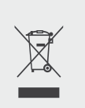

# INFORMATIONS DE SÉCURITÉ IMPORTANTES

<table class="manual-callout-table" style="width:100%; border-collapse:collapse; margin:0 0 16px 0;"><tbody><tr><td class="manual-callout-label" style="width:16%; border:1px solid #000; padding:6px 8px; vertical-align:top;">
<strong>AVERTISSEMENT</strong>
</td><td class="manual-callout-body" style="border:1px solid #000; padding:6px 8px; vertical-align:top;">
INSTRUCTIONS DE SÉCURITÉ POUR PRÉVENIR LES INCENDIES, LES CHOCS ÉLECTRIQUES OU LES BLESSURES
</td></tr></tbody></table>

Respectez toujours les précautions suivantes lors de l'utilisation du produit.

- Lisez toutes les instructions avant d'utiliser ce produit.
- Ne laissez pas les enfants jouer avec le produit. Une surveillance étroite est nécessaire lorsque le produit est utilisé à proximité d'enfants.
- Un risque de choc électrique peut survenir si des accessoires recommandés ou vendus par des fabricants non professionnels sont utilisés.
- Lorsque le produit n'est pas utilisé, débranchez la fiche d'alimentation de la prise du produit.
- Ne démontez pas le produit, car cela peut entraîner des risques imprévisibles tels qu'un incendie, une explosion ou un choc électrique.
- N'utilisez pas le produit avec des cordons, des fiches ou des câbles de sortie endommagés, car cela peut provoquer un choc électrique.
- Pour garantir une bonne circulation de l'air, gardez les orifices de ventilation du produit dégagés. La zone où le produit est utilisé doit disposer d'une circulation d'air suffisante dans un environnement frais et sec afin d'éviter toute surchauffe.
  - La charge dans un espace humide ou mal ventilé peut présenter des risques pour la sécurité.
  - L'eau peut provoquer des courts-circuits ou endommager le chargeur, entraînant des risques pour la sécurité.
- N'exposez pas le produit au feu, à des températures élevées, à la lumière directe du soleil ou à des environnements chauds comme l'intérieur d'un véhicule stationné. Une telle exposition peut provoquer un incendie ou une explosion.

## INSTRUCTIONS D\'ENTRETIEN PAR L\'UTILISATEUR

Pendant le cycle de vie des produits de stockage d\'énergie, une certaine dégradation de la capacité et de l\'énergie est attendue. À mesure que le nombre de cycles de charge et de décharge augmente et que la durée de stockage s\'allonge, cette dégradation s\'intensifie progressivement. Il s\'agit d\'un phénomène normal, conforme au vieillissement naturel des cellules de batterie.

# SIGNIFICATION DES SYMBOLES

<figure aria-label="Symbole / Signification" class="hb-symbol-signal-composition" data-component-id="HB-TABLE-SYMBOL-SIGNAL"><table class="hb-symbol-signal-table"><colgroup><col class="hb-symbol-signal-col-label"/><col class="hb-symbol-signal-col-meaning"/></colgroup><thead><tr><th class="hb-symbol-signal-label-heading" scope="col">
Symbole
</th><th class="hb-symbol-signal-meaning-heading" scope="col">
Signification
</th></tr></thead><tbody><tr><td class="hb-symbol-signal-label-cell">⚠AVERTISSEMENT</td><td class="hb-symbol-signal-meaning-cell">
Pratiques dangereuses pouvant entraîner des blessures graves, la mort et/ou des dommages matériels.
</td></tr><tr><td class="hb-symbol-signal-label-cell">⚠ATTENTION</td><td class="hb-symbol-signal-meaning-cell">
Pratiques dangereuses pouvant entraîner des blessures corporelles et/ou des dommages matériels.
</td></tr><tr><td class="hb-symbol-signal-label-cell">⚠REMARQUE</td><td class="hb-symbol-signal-meaning-cell">
Pratiques dangereuses pouvant entraîner des dommages à l'équipement, une perte de données, une détérioration des performances ou des résultats inattendus.
</td></tr><tr><td class="hb-symbol-signal-label-cell">⚠CONSEIL</td><td class="hb-symbol-signal-meaning-cell">
Complète les informations importantes ou les conseils d'utilisation dans le texte.
</td></tr></tbody></table></figure>

<figure aria-label="Symbole / Signification" class="hb-symbol-pair-composition" data-component-id="HB-TABLE-SYMBOL-ICON">

<table class="hb-symbol-panel-table"><colgroup><col class="hb-symbol-col-icon"/><col class="hb-symbol-col-meaning"/></colgroup><thead><tr><th class="hb-symbol-icon-heading" scope="col">
<strong>Symbole</strong>
</th><th class="hb-symbol-meaning-heading" scope="col">
<strong>Signification</strong>
</th></tr></thead><tbody><tr><td class="hb-symbol-icon"></td><td class="hb-symbol-meaning">
Symboles d’avertissement et de mise en garde. Signalent aux personnes des informations qui doivent être lues afin d’éviter les dangers ou risques potentiels.
</td></tr><tr><td class="hb-symbol-icon"></td><td class="hb-symbol-meaning">
Lire le manuel de l'opérateur
</td></tr><tr><td class="hb-symbol-icon"></td><td class="hb-symbol-meaning">
Ne démontez pas le produit.
</td></tr><tr><td class="hb-symbol-icon"></td><td class="hb-symbol-meaning">
Tenir le produit à l’écart du feu.
</td></tr></tbody></table>

<table class="hb-symbol-panel-table"><colgroup><col class="hb-symbol-col-icon"/><col class="hb-symbol-col-meaning"/></colgroup><thead><tr><th class="hb-symbol-icon-heading" scope="col">
<strong>Symbole</strong>
</th><th class="hb-symbol-meaning-heading" scope="col">
<strong>Signification</strong>
</th></tr></thead><tbody><tr><td class="hb-symbol-icon"></td><td class="hb-symbol-meaning">
Les enfants ne sont pas admis
</td></tr><tr><td class="hb-symbol-icon"></td><td class="hb-symbol-meaning">
Ce symbole indique que le produit contient une batterie lithium-ion (Li-ion), qui doit être éliminée ou recyclée de manière appropriée.
</td></tr><tr><td class="hb-symbol-icon"></td><td class="hb-symbol-meaning">
Ce symbole indique que le produit ne doit pas être jeté avec les ordures ménagères. Il doit être apporté à un point de collecte désigné pour un recyclage approprié.
Une élimination et un recyclage corrects contribuent à la protection de l’environnement. Pour plus d’informations, veuillez contacter votre autorité locale, le service de gestion des déchets ou le revendeur du produit.
</td></tr><tr><td class="hb-symbol-icon"></td><td class="hb-symbol-meaning">
Les piles et accumulateurs ne doivent pas être jetés avec les ordures ménagères.
En tant que consommateur, vous êtes légalement tenu de déposer toutes les piles et accumulateurs dans des points de collecte désignés, qu'ils contiennent ou non des substances dangereuses.
Veuillez rapporter les piles et accumulateurs usagés à un point de collecte local, un centre de recyclage ou au détaillant où ils ont été achetés. Une élimination appropriée garantit un recyclage respectueux de l'environnement et prévient les dommages potentiels pour la santé humaine et l'environnement.
</td></tr></tbody></table>

</figure>

# CONTENU DE LA BOÎTE

<figure aria-label="CONTENU DE LA BOÎTE" class="hb-inbox-composition" data-card-count="3" data-component-id="HB-SPECIAL-INBOX" data-inbox-variant="three-card-responsive"><ol class="hb-inbox-grid"><li class="hb-inbox-card" data-item-number="1">

<strong>Jackery Explorer 3600 Plus</strong>

</li><li class="hb-inbox-card" data-item-number="2">

<strong>Câble de charge CA</strong>

</li><li class="hb-inbox-card" data-item-number="3">

Manuel d’utilisation

</li></ol>

<strong>CONSEILS</strong>

Le câble de chargement pour voiture n'est pas inclus, mais peut être acheté séparément sur notre site Web.
Pour obtenir de l'aide, veuillez contacter le service client Jackery.

</figure>

# APERÇU DU PRODUIT

## VUE DE FACE

## VUE LATÉRALE DROITE

# AFFICHAGE LCD

<table class="longtable lcd-text-only">
<colgroup>
<col style="width: 8%" />
<col style="width: 12%" />
<col style="width: 28%" />
<col style="width: 52%" />
</colgroup>
<tbody>
<tr>
<td>
1
</td>
<td></td>
<td>
Wi-Fi
</td>
<td>On: Wi-Fi connected.
Blink: Ready to connect to Wi-Fi.
Off: Wi-Fi disconnected.</td>
</tr>
<tr>
<td>
2
</td>
<td></td>
<td>
Bluetooth
</td>
<td>On: Bluetooth connected.
Blink: Ready to connect to Bluetooth.
Off: Bluetooth disconnected.</td>
</tr>
<tr>
<td>
3
</td>
<td></td>
<td>
Quiet Charging Mode
</td>
<td>On: The noise during charging is significantly minimized, while the charging power is reduced and the charging speed slows down.
Off: Quiet Charging Mode is disabled.
Enable/disable this feature in the Jackery App.</td>
</tr>
<tr>
<td>
4
</td>
<td></td>
<td>
Battery Saving Mode / Self-powered Mode
</td>
<td>Battery Saving Mode: Limits the maximum usable battery capacity to extend battery life. Enable/disable this feature in the Jackery App. This feature is not available when the product is connected to battery pack(s).
Self-powered Mode: Maximizes the use of solar energy and reduces reliance on grid electricity by prioritizing stored solar energy. Enable/disable this feature in the Jackery App. The power station must be connected to both solar panels and the grid simultaneously, with load power limited by bypass power.</td>
</tr>
<tr>
<td>
5
</td>
<td></td>
<td>
Charging Plan
</td>
<td>
Customizes the charging time of the Jackery Explorer 3600 Plus. Suitable for situations with fluctuating electricity prices, it allows for charging plans based on peak and off-peak electricity times, reducing electricity costs. Set this feature in the Jackery App.
</td>
</tr>
<tr>
<td>
6
</td>
<td></td>
<td>
AC Power Indicator
</td>
<td>
The AC output (pure sine wave) is on.
</td>
</tr>
<tr>
<td>
7
</td>
<td></td>
<td>
Output Voltage and Frequency
</td>
<td>
Displays the output voltage and frequency when the AC output is turned on.
</td>
</tr>
<tr>
<td>
8
</td>
<td></td>
<td>
Input Power
</td>
<td>
Displays the input power in watts.
</td>
</tr>
<tr>
<td>
9
</td>
<td></td>
<td>
Remaining Charge Time
</td>
<td>
Displays the remaining charging time.
</td>
</tr>
<tr>
<td>
10
</td>
<td></td>
<td>
AC Wall Charging Indicator
</td>
<td>
The product is charged via the AC Input using grid power.
</td>
</tr>
<tr>
<td>
11
</td>
<td></td>
<td>
Car Charging Indicator
</td>
<td>
The product is charged via the DC Input (DC8020) using DC 12 V (car charging).
</td>
</tr>
<tr>
<td>
12
</td>
<td></td>
<td>
Solar Charging Indicator
</td>
<td>
The product is charged via the DC Input (DC8020) using solar panel(s).
</td>
</tr>
<tr>
<td>
13
</td>
<td></td>
<td>
Battery Power Indicator
</td>
<td>
When the product is being charged, the orange circle around the battery percentage will light up in sequence. When charging other devices, the orange circle will stay on.
</td>
</tr>
<tr>
<td>
14
</td>
<td></td>
<td>
Low Battery Indicator
</td>
<td>On: The battery level is below 20%.
Blink: The battery level is below 5%.
Off: The battery level is not below 20% or the product is charging.</td>
</tr>
<tr>
<td>
15
</td>
<td></td>
<td>
Remaining Battery Percentage
</td>
<td>
Displays the remaining battery percentage.
</td>
</tr>
<tr>
<td>
16
</td>
<td></td>
<td>
Battery Pack Indicator and Number of Connected Batteries
</td>
<td>
Displays the quantity of battery packs if any is connected.
</td>
</tr>
<tr>
<td>
17
</td>
<td></td>
<td>
Fault Code
</td>
<td>
A product error has occurred. Please refer to the Troubleshooting section for details.
</td>
</tr>
<tr>
<td>
18
</td>
<td></td>
<td>
High Temperature Indicator / Low Temperature Indicator
</td>
<td>
High temperature protection or low temperature protection is triggered. The product may stop functioning until its temperature returns to the normal operating range.
</td>
</tr>
<tr>
<td>
19
</td>
<td></td>
<td>
Energy Saving Mode
</td>
<td>
When the AC or USB output is turned on by pressing the AC or USB power button: On: Energy Saving Mode is enabled. Off: Energy Saving Mode is disabled.
</td>
</tr>
<tr>
<td>
20
</td>
<td></td>
<td>
Output Power
</td>
<td>
Displays the output power in watts.
</td>
</tr>
<tr>
<td>
21
</td>
<td></td>
<td>
Remaining Discharge Time
</td>
<td>
Displays the remaining discharging time.
</td>
</tr>
</tbody>
</table>

# FONCTIONNEMENT

## MARCHE/ARRÊT

## SORTIE USB MARCHE/ARRÊT

<table class="manual-callout-table" style="width:100%; border-collapse:collapse; margin:0 0 16px 0;"><tbody><tr><td class="manual-callout-label" style="width:16%; border:1px solid #000; padding:6px 8px; vertical-align:top;">
<strong>ATTENTION</strong>
</td><td class="manual-callout-body" style="border:1px solid #000; padding:6px 8px; vertical-align:top;"><ul class="simple">
<li>
<strong>Les ports USB-C sont des ports de sortie haute puissance USB-PD Source d'alimentation 3 (PS3).</strong> Si l'appareil utilisateur ou l'accessoire connecté ne répond pas aux exigences de sécurité, il peut présenter un risque d'incendie. Avant d'utiliser ces ports, assurez-vous que l'appareil ou l'accessoire connecté dispose d'une protection contre les incendies.
</li>
<li>
Ne connectez Jackery Explorer 3600 Plus qu'à des appareils ou accessoires conformes aux clauses 6.3, 6.4 et 6.5 de la norme IEC/EN/UL 62368-1 (ou autres normes équivalentes).
</li>
<li>
Pour obtenir la puissance de sortie maximale, utilisez le câble officiel Jackery USB-C vers USB-C 5A (20 V CC/5A, 100 W).
</li>
</ul>
</td></tr></tbody></table>

## SORTIE CA MARCHE/ARRÊT

## MODE D\'ÉCONOMIE D\'ÉNERGIE

<table class="manual-callout-table" style="width:100%; border-collapse:collapse; margin:0 0 16px 0;"><tbody><tr><td class="manual-callout-label" style="width:16%; border:1px solid #000; padding:6px 8px; vertical-align:top;">
<strong>REMARQUE</strong>
</td><td class="manual-callout-body" style="border:1px solid #000; padding:6px 8px; vertical-align:top;">
Le mode d'économie d'énergie reprend l'état précédent après l'allumage. Un changement de mode nécessite un commutateur manuel.
</td></tr></tbody></table>

## AFFICHAGE LCD

<table style="width:100%; border-collapse:collapse; margin:0.75rem 0 0.5rem 0;">
<tbody>
<tr>
<td rowspan="6" style="text-align: center; width: 24%; border: 1px solid #cfcfcf; padding: 8px; vertical-align: top;"></td>
<td rowspan="3" style="width: 18%; border: 1px solid #cfcfcf; padding: 8px; vertical-align: top">Allumer en discontinu</td>
<td style="width: 12%; border: 1px solid #cfcfcf; padding: 8px">Allumer</td>
<td style="border: 1px solid #cfcfcf; padding: 8px">Appuyez sur le bouton POWER principal ou lorsque le produit est en charge.</td>
</tr>
<tr>
<td style="border: 1px solid #cfcfcf; padding: 8px">Éteindre</td>
<td style="border: 1px solid #cfcfcf; padding: 8px">Appuyez sur le bouton POWER principal.</td>
</tr>
<tr>
<td style="border: 1px solid #cfcfcf; padding: 8px">Arrêt automatique</td>
<td style="border: 1px solid #cfcfcf; padding: 8px">L'écran LCD s'éteint automatiquement et entre en mode veille après 2 minutes d'inactivité.</td>
</tr>
<tr>
<td rowspan="3" style="border: 1px solid #cfcfcf; padding: 8px; vertical-align: top">Allumer en continu (en cours de charge ou de décharge)</td>
<td style="border: 1px solid #cfcfcf; padding: 8px">Allumer</td>
<td style="border: 1px solid #cfcfcf; padding: 8px">Appuyez deux fois sur le bouton POWER principal lorsque le produit est allumé.</td>
</tr>
<tr>
<td style="border: 1px solid #cfcfcf; padding: 8px">Éteindre</td>
<td style="border: 1px solid #cfcfcf; padding: 8px">Appuyez sur le bouton POWER principal.</td>
</tr>
<tr>
<td style="border: 1px solid #cfcfcf; padding: 8px">Arrêt automatique</td>
<td style="border: 1px solid #cfcfcf; padding: 8px">L'écran LCD s'éteint automatiquement après 2 hours d'inactivité.</td>
</tr>
</tbody>
</table>

Vous pouvez également définir le mode d\'affichage de l\'écran dans l\'application Jackery.

# ALIMENTATION SANS INTERRUPTION (ASI)

Connectez le produit à une prise murale à l\'aide du câble de charge CA, puis appuyez sur le bouton d'alimentation CA pour alimenter vos appareils en même temps.

Une alimentation sans coupure (UPS) est un système d\'alimentation continue qui fournit automatiquement une alimentation électrique de secours à une charge lorsque l\'alimentation du réseau principal est interrompue.

En cas de perte soudaine de l\'alimentation du réseau, le Jackery Explorer 3600 Plus basculera automatiquement sur l\'alimentation stockée en moins de 10 ms pour maintenir vos appareils en fonctionnement.

En mode UPS, la puissance de crête de sortie de l\'appareil atteint 10 A avant les coupures de courant. Comme la charge et la décharge simultanées sont activées en mode bypass, la puissance de sortie réelle est inférieure à la puissance nominale en mode bypass, mais revient à la puissance nominale lors des coupures.

<table class="manual-callout-table" style="width:100%; border-collapse:collapse; margin:0 0 16px 0;"><tbody><tr><td class="manual-callout-label" style="width:16%; border:1px solid #000; padding:6px 8px; vertical-align:top;">
<strong>ATTENTION</strong>
</td><td class="manual-callout-body" style="border:1px solid #000; padding:6px 8px; vertical-align:top;"><ul class="simple">
<li>
Ce produit ne prend pas en charge un basculement instantané (0 ms). Ne le connectez pas à des équipements nécessitant une alimentation avec commutation en 0 ms, tels que des serveurs de données ou des stations de travail.
</li>
<li>
Avant toute utilisation, testez plusieurs fois la compatibilité avec votre appareil.
</li>
<li>
Ne connectez pas de charges dépassant la puissance maximale de sortie du produit. Sinon, la protection contre les surcharges sera déclenchée.
</li>
</ul>
</td></tr></tbody></table>

# CONNEXIONS

Ce produit peut prendre en charge jusqu\'à 5 packs batterie pour répondre aux besoins d\'une grande capacité énergétique. Pour les détails sur son utilisation, veuillez vous référer au manuel d\'utilisation du Jackery Battery Pack 3600.

<table class="manual-callout-table" style="width:100%; border-collapse:collapse; margin:0 0 16px 0;"><tbody><tr><td class="manual-callout-label" style="width:16%; border:1px solid #000; padding:6px 8px; vertical-align:top;">
<strong>ATTENTION</strong>
</td><td class="manual-callout-body" style="border:1px solid #000; padding:6px 8px; vertical-align:top;"><ul class="simple">
<li>
Assurez-vous que tous les produits sont éteints avant de connecter le Explorer 3600 Plus au(x) Jackery Battery Pack 3600.
</li>
<li>
Pour assurer le bon fonctionnement du produit, assurez-vous que les entrées et sorties d'air sur les deux côtés ne sont pas obstruées. Laissez un espace d'au moins 200 mm entre les ouvertures et tout objet pour permettre une dissipation thermique adéquate.
</li>
</ul>
</td></tr></tbody></table>

# CHARGE

**L\'énergie verte d\'abord :** nous préconisons l\'utilisation de l\'énergie verte en premier. Ce produit prend en charge deux modes de recharge simultanés : la recharge solaire et la recharge par prise murale CA.

Quand la recharge par prise murale CA et la recharge solaire sont effectuées en même temps, le produit privilégie la recharge solaire. Les deux méthodes sont utilisées pour charger la batterie à la puissance maximalement autorisée.

**Chargez complètement le produit avant sa première utilisation.**

<table class="manual-callout-table" style="width:100%; border-collapse:collapse; margin:0 0 16px 0;"><tbody><tr><td class="manual-callout-label" style="width:16%; border:1px solid #000; padding:6px 8px; vertical-align:top;">
<strong>REMARQUE</strong>
</td><td class="manual-callout-body" style="border:1px solid #000; padding:6px 8px; vertical-align:top;"><ul class="simple">
<li>
La température de charge recommandée pour le produit est de -20 °C to 45 °C, et la température de décharge est de -20 °C to 45 °C.
</li>
<li>
Utiliser le produit en dehors de cette plage de températures peut limiter ses capacités de charge et de décharge, voire empêcher la charge ou la décharge.
</li>
<li>
La puissance de charge et la capacité de la batterie du produit peuvent varier en raison des fluctuations de température.
</li>
</ul>
</td></tr></tbody></table>

## CHARGEMENT PAR PRISE MURALE CA

Connectez le câble de charge CA au port d\'entrée CA de l\'appareil et à une prise murale.

<table class="manual-callout-table" style="width:100%; border-collapse:collapse; margin:0 0 16px 0;"><tbody><tr><td class="manual-callout-label" style="width:16%; border:1px solid #000; padding:6px 8px; vertical-align:top;">
<strong>ATTENTION</strong>
</td><td class="manual-callout-body" style="border:1px solid #000; padding:6px 8px; vertical-align:top;">
Assurez-vous que le câble de charge CA est entièrement et solidement inséré dans le port d’entrée CA. Une connexion incomplète peut entraîner un courant instable, une surchauffe, un mauvais contact ou un dysfonctionnement de l'appareil.
</td></tr></tbody></table>

**Mode de charge d\'urgence**

Dans ce mode, vous pouvez recharger rapidement la station d'énergie portable en utilisant la méthode de charge CA. Cette fonction de charge d\'urgence peut être activée ou désactivée via l\'application Jackery. En mode de charge d\'urgence, la lumière circulaire indiquant l\'état de charge (SOC) clignote plus rapidement.

\*Pour prolonger au maximum la durée de vie de la batterie, il est préférable de charger à la vitesse standard. La charge d\'urgence doit être utilisée uniquement pour des situations nécessitant un boost rapide en énergie et n\'est pas recommandée pour un usage régulier sur le long terme.

## CHARGEMENT PAR PANNEAUX SOLAIRES (Vendu séparément)

Le Jackery Explorer 3600 Plus dispose de deux ports d'entrée DC8020 et est compatible avec les panneaux solaires de Jackery.

Si un seul port d'entrée DC8020 doit être connecté à deux panneaux solaires simultanément, veuillez vous référer au schéma ci-dessous pour le branchement via le connecteur de panneau solaire (vendu séparément, non inclus en standard).

<table class="manual-callout-table" style="width:100%; border-collapse:collapse; margin:0 0 16px 0;"><tbody><tr><td class="manual-callout-label" style="width:16%; border:1px solid #000; padding:6px 8px; vertical-align:top;">
<strong>ATTENTION</strong>
</td><td class="manual-callout-body" style="border:1px solid #000; padding:6px 8px; vertical-align:top;">
Un port d’entrée DC8020 peut être connecté à un maximum de deux panneaux solaires.
</td></tr></tbody></table>

<table class="manual-callout-table" style="width:100%; border-collapse:collapse; margin:0 0 16px 0;"><tbody><tr><td class="manual-callout-label" style="width:16%; border:1px solid #000; padding:6px 8px; vertical-align:top;">
<strong>ATTENTION</strong>
</td><td class="manual-callout-body" style="border:1px solid #000; padding:6px 8px; vertical-align:top;">
Assurez-vous que la tension d’entrée pour les deux ports d’entrée CC est la même. Sinon, le produit pourrait être endommagé. Par exemple:

<ul class="simple">
<li>
Utiliser le même modèle de panneaux solaires Jackery et le même nombre de panneaux lors de la connexion des panneaux solaires aux deux ports d’entrée DC8020.
</li>
<li>
Ne chargez pas le produit à la fois avec un chargeur de voiture et un panneau solaire simultanément. Cela pourrait faire sauter le fusible de la voiture ou entraîner un échec de la charge.
</li>
</ul>
</td></tr></tbody></table>

Il est recommandé d'utiliser le panneau solaire Jackery pour charger le Jackery Explorer 3600 Plus. Assurez-vous que la tension en circuit ouvert (Voc) du panneau solaire se situe dans la plage de tension d'entrée CC de Jackery Explorer 3600 Plus (16 V-60 V). Jackery décline toute responsabilité pour tout dommage ou toute perte résultant de l'utilisation de panneaux solaires tiers.

## CHARGEMENT PAR PRISE DE VOITURE (Vendu séparément)

Ce produit peut être chargé à l\'aide d\'un chargeur de voiture 12 V. Assurez-vous que le chargeur de voiture est correctement connecté à la prise 12 V du véhicule (allume-cigare).

Véhicule

※Le câble de chargement de voiture est vendu séparément.

<table class="manual-callout-table" style="width:100%; border-collapse:collapse; margin:0 0 16px 0;"><tbody><tr><td class="manual-callout-label" style="width:16%; border:1px solid #000; padding:6px 8px; vertical-align:top;">
<strong>ATTENTION</strong>
</td><td class="manual-callout-body" style="border:1px solid #000; padding:6px 8px; vertical-align:top;"><ul class="simple">
<li>
Veuillez démarrer le véhicule avant de charger votre station d'énergie.
</li>
<li>
Si le véhicule roule sur des routes accidentées, il est interdit d'utiliser le chargeur de voiture afin d'éviter tout risque de surchauffe dû à une mauvaise connexion. La société ne sera pas responsable des pertes causées par une utilisation non conforme.
</li>
<li>
La charge par véhicule est uniquement applicable aux véhicules en 12 V CC, pas en 24 V CC. Veuillez ne pas charger ce produit dans un véhicule 24 V afin d'éviter tout risque de blessure ou de dommage matériel.
</li>
</ul>
</td></tr></tbody></table>

# STOCKAGE

Conservez le produit dans un endroit propre et sec avec une ventilation adéquate. Température et humidité de stockage :

- 1 month : -20 °C to 45 °C (0-60% RH)

- 3 months : 0 °C to 45 °C (0-60% RH)

- 12 months : 0 °C to 25 °C (0-60% RH)

Si ce produit est stocké pendant une longue période (3 à 6 mois) avec la batterie déchargée, il peut devenir impossible de le recharger. Pour éviter cela et préserver la santé de la batterie, il est recommandé de vérifier et de recharger le produit tous les trois mois, et d\'effectuer un cycle de charge et de décharge complet au moins une fois tous les 6 à 12 mois.

# DÉPANNAGE

Si l\'un des codes d\'erreur suivants apparaît, suivez les actions correctives indiquées pour résoudre le problème. Si l\'erreur persiste, veuillez contacter le service client Jackery.

<figure aria-label="Code d'erreur / Mesures correctives" class="hb-troubleshooting-composition" data-component-id="HB-TABLE-TROUBLESHOOTING" tabindex="0"><table class="hb-troubleshooting-table"><colgroup><col class="hb-troubleshooting-col-code"/><col class="hb-troubleshooting-col-measures"/></colgroup><thead><tr><th class="hb-troubleshooting-code" scope="col">
Code d'erreur
</th><th class="hb-troubleshooting-measures" scope="col">
Mesures correctives
</th></tr></thead><tbody><tr><td class="hb-troubleshooting-code">
F0
</td><td class="hb-troubleshooting-measures">
Restart the product.
</td></tr><tr><td class="hb-troubleshooting-code">
F1
</td><td class="hb-troubleshooting-measures">
Restart the product.
</td></tr><tr><td class="hb-troubleshooting-code">
F2
</td><td class="hb-troubleshooting-measures">
Restart the product.
</td></tr><tr><td class="hb-troubleshooting-code">
F3
</td><td class="hb-troubleshooting-measures">
Restart the product.
</td></tr><tr><td class="hb-troubleshooting-code">
F4
</td><td class="hb-troubleshooting-measures">
Connect the product to loads to discharge its battery until the fault disappears.
</td></tr><tr><td class="hb-troubleshooting-code">
F5
</td><td class="hb-troubleshooting-measures">
Charge the product via solar panels or an AC wall outlet until the fault disappears.
</td></tr><tr><td class="hb-troubleshooting-code">
F6
</td><td class="hb-troubleshooting-measures">

1. Wait for the grid to normalize before charging the product via an AC wall outlet.

2. Check whether the air intake and exhaust vents are blocked; ensure 200 mm clearance on both sides of the product.

3. Place the product in a location that is not exposed to direct sunlight or high environmental temperatures.

4. Disconnect all loads from the product. Keep the product idle and wait until the fault disappears.

5. Restart the product.

</td></tr><tr><td class="hb-troubleshooting-code">
F7
</td><td class="hb-troubleshooting-measures">

1. Remove all DC inputs from the product.

2. Check the open-circuit voltage (Voc) of the connected solar panels. The product allows a maximum DC input voltage of 60 V.

3. Restart the product and keep it idle. Wait until the fault disappears.

</td></tr><tr><td class="hb-troubleshooting-code">
F8
</td><td class="hb-troubleshooting-measures">
Contact Jackery Customer Support.
</td></tr><tr><td class="hb-troubleshooting-code">
F9
</td><td class="hb-troubleshooting-measures">
Remove the load connected to the USB ports of the product. Wait until the fault disappears.
</td></tr><tr><td class="hb-troubleshooting-code">
FA
</td><td class="hb-troubleshooting-measures">

1. Turn off the AC output of both units.

2. Press the AC power button on each unit again within 1 minute.

</td></tr><tr><td class="hb-troubleshooting-code">
FC
</td><td class="hb-troubleshooting-measures">

1. Restart the battery packs and the Jackery Explorer 3600 Plus respectively.

2. If the fault persists, disconnect the battery pack from the Jackery Explorer 3600 Plus and connect them again.

</td></tr></tbody></table></figure>

# SPÉCIFICATIONS

## INFORMATIONS GÉNÉRALES

<figure aria-label="INFORMATIONS GÉNÉRALES" class="hb-spec-table-composition"><table class="hb-spec-table manual-table manual-spec-table"><colgroup><col class="hb-spec-col-label"/><col class="hb-spec-col-value"/></colgroup>
<tbody>
<tr>
<th class="hb-spec-label manual-spec-label" scope="row">Product Name</th>
<td class="hb-spec-value manual-spec-value">Jackery Explorer 3600 Plus</td>
</tr>
<tr>
<th class="hb-spec-label manual-spec-label" scope="row">Model No.</th>
<td class="hb-spec-value manual-spec-value">JE-3600A</td>
</tr>
<tr>
<th class="hb-spec-label manual-spec-label" scope="row">Capacity</th>
<td class="hb-spec-value manual-spec-value">80 Ah / 44.8 V DC (3584 Wh)</td>
</tr>
<tr>
<th class="hb-spec-label manual-spec-label" scope="row">Cell Chemistry</th>
<td class="hb-spec-value manual-spec-value">LiFePO₄</td>
</tr>
<tr>
<th class="hb-spec-label manual-spec-label" scope="row">Weight</th>
<td class="hb-spec-value manual-spec-value">About 35 kg</td>
</tr>
<tr>
<th class="hb-spec-label manual-spec-label" scope="row">Dimensions</th>
<td class="hb-spec-value manual-spec-value">38.5 × 30.9 × 49.1 cm</td>
</tr>
<tr>
<th class="hb-spec-label manual-spec-label" scope="row">Cycle Life</th>
<td class="hb-spec-value manual-spec-value">6000 cycles to 70%+ capacity</td>
</tr>
<tr>
<th class="hb-spec-label manual-spec-label" scope="row">IEC code</th>
<td class="hb-spec-value manual-spec-value">IFpR41/136[14S4P]M/-20+40/90</td>
</tr>
</tbody>
</table></figure>

## PORTS D'ENTRÉE

<figure aria-label="PORTS D’ENTRÉE" class="hb-spec-table-composition"><table class="hb-spec-table manual-table manual-spec-table"><colgroup><col class="hb-spec-col-label"/><col class="hb-spec-col-value"/></colgroup>
<tbody>
<tr>
<th class="hb-spec-label manual-spec-label" scope="row">1 × AC Input</th>
<td class="hb-spec-value manual-spec-value">Charge Mode: 220-240 V~ 50 Hz, 10 A max. Bypass Mode: 220-240 V~ 50 Hz, 10 A max.</td>
</tr>
<tr>
<th class="hb-spec-label manual-spec-label" scope="row">2 × DC8020 Ports</th>
<td class="hb-spec-value manual-spec-value">12-16 V⎓8 A max., double to 8 A max. 16-60 V⎓12 A, double to 24 A max. / 1000 W max.</td>
</tr>
<tr>
<th class="hb-spec-label manual-spec-label" scope="row">1 × DC Expansion Port</th>
<td class="hb-spec-value manual-spec-value">36.4-50.4 V⎓100 A max.</td>
</tr>
</tbody>
</table></figure>

## PORTS DE SORTIE

<figure aria-label="PORTS DE SORTIE" class="hb-spec-table-composition"><table class="hb-spec-table manual-table manual-spec-table"><colgroup><col class="hb-spec-col-label"/><col class="hb-spec-col-value"/></colgroup>
<tbody>
<tr>
<th class="hb-spec-label manual-spec-label" scope="row">3 × AC Output</th>
<td class="hb-spec-value manual-spec-value">230 V~ 50 Hz, 3600 W</td>
</tr>
<tr>
<th class="hb-spec-label manual-spec-label" scope="row">AC Total Output</th>
<td class="hb-spec-value manual-spec-value">3600 W rated, 7200 W surge peak</td>
</tr>
<tr>
<th class="hb-spec-label manual-spec-label" scope="row">AC Output in Bypass Mode</th>
<td class="hb-spec-value manual-spec-value">220-240 V~ 50 Hz, 10 A max.</td>
</tr>
<tr>
<th class="hb-spec-label manual-spec-label" scope="row">2 × USB-C 100W Output</th>
<td class="hb-spec-value manual-spec-value">100 W max., 5 V⎓3 A, 9 V⎓3 A, 12 V⎓3 A, 15 V⎓3 A, 20 V⎓5 A</td>
</tr>
<tr>
<th class="hb-spec-label manual-spec-label" scope="row">2 × USB-A 18W Output</th>
<td class="hb-spec-value manual-spec-value">18 W max., 5-6 V⎓3 A, 6-9 V⎓2 A, 9-12 V⎓1.5 A</td>
</tr>
<tr>
<th class="hb-spec-label manual-spec-label" scope="row">1 × DC Expansion Port</th>
<td class="hb-spec-value manual-spec-value">36.4-50.4 V⎓60 A max.</td>
</tr>
</tbody>
</table></figure>

## TEMPÉRATURE DE FONCTIONNEMENT

<figure aria-label="TEMPÉRATURE DE FONCTIONNEMENT" class="hb-spec-table-composition"><table class="hb-spec-table manual-table manual-spec-table"><colgroup><col class="hb-spec-col-label"/><col class="hb-spec-col-value"/></colgroup>
<tbody>
<tr>
<th class="hb-spec-label manual-spec-label" scope="row">Charge Temperature</th>
<td class="hb-spec-value manual-spec-value">-20 °C to 45 °C</td>
</tr>
<tr>
<th class="hb-spec-label manual-spec-label" scope="row">Discharge Temperature</th>
<td class="hb-spec-value manual-spec-value">-20 °C to 45 °C</td>
</tr>
</tbody>
</table></figure>

# GARANTIE

<figure aria-label="GARANTIE" class="hb-warranty-intro-composition" data-component-id="HB-WARRANTY-LEAD">

<strong>Nous ne fournissons notre garantie qu'aux clients qui achètent sur le site officiel de Jackery, sur des plateformes tierces portant la marque Jackery, ou auprès de revendeurs autorisés locaux.</strong>

*La durée et les détails de la garantie peuvent varier en fonction des lois, réglementations et revendeurs autorisés locaux.

</figure>

## Garantie limitée

<figure aria-label="Garantie limitée" class="hb-warranty-card" data-component-id="HB-WARRANTY-SECTION" data-warranty-card-index="1">
Jackery garantit à l'acheteur et consommateur d'origine que le produit de Jackery sera exempt de tout défaut de fabrication et de matériaux dans le cadre d'une utilisation normale pendant toute la durée de la période de garantie applicable identifiée dans la section « Période de garantie » ci-dessous, sous réserve des exceptions énoncées ci-dessous.

Cette déclaration de garantie énonce les obligations totales et exclusives de garantie de Jackery. Nous n'assumerons pas et nous n'autorisons personne à assumer pour nous toute autre responsabilité en lien avec la vente de nos produits.
</figure>

## Période de garantie

<figure aria-label="Période de garantie" class="hb-warranty-period-card" data-component-id="HB-WARRANTY-YEARS">

3
<strong class="hb-warranty-years-unit">ANS</strong><strong class="hb-warranty-period-label">Garantie standard</strong>

La période de garantie standard de Jackery Explorer 3600 Plus est de 36 mois. Dans tous les cas, la période de garantie commence à compter de la date d'achat par l'acheteur et consommateur d'origine. La facture du premier achat du consommateur ou toute autre preuve documentaire raisonnable est nécessaire afin d'établir la date de début de la période de garantie.

2
<strong class="hb-warranty-years-unit">ANS</strong><strong class="hb-warranty-period-label">Garantie prolongée</strong>

Pour activer l'extension de garantie, vous devez enregistrer votre produit en ligne ou bien contacter notre service client à <a class="reference external" href="mailto:hello.eu@jackery.com">hello.eu@jackery.com</a> afin de prolonger la durée de la garantie standard.

</figure>

## Échanger

<figure aria-label="Échanger" class="hb-warranty-card" data-component-id="HB-WARRANTY-SECTION" data-warranty-card-index="3">
Jackery remplacera (aux frais de Jackery) tout produit Jackery qui ne fonctionne pas pendant la période de garantie applicable en raison d’un défaut de fabrication ou de matériau. Un produit de remplacement bénéficie de la garantie restante du produit d’origine.
</figure>

## Limitée à l\'acheteur et consommateur d\'origine

<figure aria-label="Limitée à l'acheteur et consommateur d'origine" class="hb-warranty-card" data-component-id="HB-WARRANTY-SECTION" data-warranty-card-index="4">
La garantie d'un produit Jackery est limitée à l'acheteur et consommateur d'origine, elle ne peut pas être transférée à un autre propriétaire.
</figure>

## Exclusions

<figure aria-label="Exclusions" class="hb-warranty-card" data-component-id="HB-WARRANTY-SECTION" data-warranty-card-index="5">
La garantie de Jackery ne s'applique pas à :
<ul class="simple">
<li>
Une utilisation incorrecte, abusée, modifiée, aux dégâts provoqués par un accident ou toute autre utilisation qui n'est pas une utilisation normale de ce produit et autorisée par la documentation actuelle du produit de Jackery.
</li>
<li>
À une réparation tentée par quelqu'un d'autre qu'un établissement agréé.
</li>
<li>
Tout autre produit acheté par l'intermédiaire d'une vente aux enchères en ligne.
</li>
<li>
La garantie de Jackery ne s'applique pas aux cellules de la batterie, sauf si vous avez entièrement chargé les cellules de la batterie dans les sept jours suivant l'achat du produit et au moins une fois tous les 6 mois par la suite.
</li>
</ul></figure>

## Droits d\'interprétation

<figure aria-label="Droits d'interprétation" class="hb-warranty-card" data-component-id="HB-WARRANTY-SECTION" data-warranty-card-index="6">
Jackery se réserve le droit d'interpréter de manière définitive la politique après-vente des clients ci-dessus.
</figure>

# CONFIGURATION DE L\'APPLICATION

## 1. Télécharger l\'application et se connecter

Recherchez \"Jackery\" dans Google Play ou dans l\'App Store pour installer l\'application. Une fois que c\'est fait, vous pouvez vous inscrire et vous connecter.

Vous pouvez également scanner le code QR ci-dessous pour télécharger et installer l\'application.

## 2. Ajouter un appareil

2.1 Cliquez sur le bouton **+** pour ajouter un appareil.

2.2 Appuyez sur le bouton d\'alimentation principal de l'appareil pour l'allumer. Les icônes Wi-Fi et Bluetooth clignotent sur l'appareil afin d'indiquer qu'il est entré dans le mode Configuration réseau. Cliquez sur le bouton « Icône qui clignote » et autorisez l'application à se connecter aux appareils alentour, puis ouvrez les autorisations Bluetooth.

2.3 Après avoir appuyé sur l'icône de l'appareil détecté, l'application se connecte automatiquement à l'appareil via Bluetooth.

<table class="manual-callout-table" style="width:100%; border-collapse:collapse; margin:0 0 16px 0;"><tbody><tr><td class="manual-callout-label" style="width:16%; border:1px solid #000; padding:6px 8px; vertical-align:top;">
<strong>REMARQUE</strong>
</td><td class="manual-callout-body" style="border:1px solid #000; padding:6px 8px; vertical-align:top;">
Si le message «l'appareil a été associé» s'affiche pendant l'appairage, vous pouvez suivre l'une de ces deux étapes pour procéder à la connexion.

<ul class="simple">
<li>
Le propriétaire de l'appareil peut partager ce dernier avec d'autres utilisateurs dans l'application.
</li>
<li>
Maintenez le bouton d'alimentation principal et le bouton d'alimentation USB enfoncés pendant 3 secondes pour réinitialiser le Wi-Fi et le Bluetooth de l'appareil et l'associer de nouveau.
</li>
</ul>
</td></tr></tbody></table>

2.4 Une fois l'appairage réalisé avec succès, saisissez le nom et le mot de passe du Wi-Fi pour que l'appareil se connecte automatiquement au réseau Wi-Fi.

<table class="manual-callout-table" style="width:100%; border-collapse:collapse; margin:0 0 16px 0;"><tbody><tr><td class="manual-callout-label" style="width:16%; border:1px solid #000; padding:6px 8px; vertical-align:top;">
<strong>REMARQUE</strong>
</td><td class="manual-callout-body" style="border:1px solid #000; padding:6px 8px; vertical-align:top;"><ul class="simple">
<li>
Veuillez choisir un réseau Wi-Fi 2,4 GHz. L'appareil ne prend pas en charge le réseau Wi-Fi 5 GHz.
</li>
</ul>
</td></tr></tbody></table>

Une fois l\'appareil ajouté à la page d\'accueil, l\'icône Wi-Fi de l\'appareil restera allumée.

Les captures d\'écran ci-dessus sont fournies à titre indicatif.

<table class="manual-callout-table" style="width:100%; border-collapse:collapse; margin:0 0 16px 0;"><tbody><tr><td class="manual-callout-label" style="width:16%; border:1px solid #000; padding:6px 8px; vertical-align:top;">
<strong>ATTENTION</strong>
</td><td class="manual-callout-body" style="border:1px solid #000; padding:6px 8px; vertical-align:top;">
L'application Jackery ne peut se connecter qu'à une seule station d'énergie à la fois via Bluetooth. Revenir à la liste des appareils déconnecte automatiquement le Bluetooth. Touchez à nouveau la station d'énergie dans la liste pour vous reconnecter automatiquement.
</td></tr></tbody></table>

## 3. Dissocier l\'appareil

Cliquez sur le bouton des paramètres en haut à droite de l\'interface principale pour accéder à la page des paramètres. Cliquez sur le bouton de dissociation en bas de la page pour dissocier l\'appareil.

## 4. Remarques

### 4.1 Pour activer le Wi-Fi et le Bluetooth

- Le Wi-Fi et le Bluetooth sont automatiquement activés, une fois l\'appareil allumé. Leurs icônes s\'allument sur l\'écran.

- Appuyez simultanément sur le bouton d\'alimentation USB et le bouton d\'alimentation CA jusqu\'à ce que les icônes Wi-Fi et Bluetooth s\'allument sur l\'écran.

### 4.2 Pour désactiver le Wi-Fi et le Bluetooth

Appuyez simultanément sur le bouton d\'alimentation USB et le bouton d\'alimentation CA jusqu'à ce que les icônes Wi-Fi et Bluetooth s'éteignent sur l'écran.

### 4.3 Pour réinitialiser le Wi-Fi et le Bluetooth

Maintenez le bouton d\'alimentation principal et le bouton d\'alimentation USB enfoncés simultanément pendant 3 secondes pour réinitialiser le Wi-Fi et le Bluetooth aux paramètres d'usine. Le compte connecté dans l'application sera dissocié.
