**IMPORTANT**

Congratulations on your new Jackery Explorer 3600 Plus. Please read this manual carefully before using the product, particularly the relevant precautions to ensure proper use. Keep this manual in an accessible place for future reference.

In compliance with laws and regulations, the right of final interpretation of this document and all related documents of this product resides with the Company. Although every effort has been made to ensure the accuracy of this manual, Jackery assumes no responsibility for any errors that may appear.

Please note that no further notifications will be given in case of any update, revision, or termination. For the latest version of the product manuals, visit support.jackery.com.

\* The images are for reference purposes only. Please refer to the actual product.

# IMPORTANT SAFETY INFORMATION

<table class="manual-callout-table" style="width:100%; border-collapse:collapse; margin:0 0 16px 0;"><tbody><tr><td class="manual-callout-label" style="width:16%; border:1px solid #000; padding:6px 8px; vertical-align:top;">
<strong>WARNING</strong>
</td><td class="manual-callout-body" style="border:1px solid #000; padding:6px 8px; vertical-align:top;">
INSTRUCTIONS PERTAINING TO RISK OF FIRE, ELECTRIC SHOCK, OR INJURY TO PERSONS
</td></tr></tbody></table>

Always follow these basic precautions when using this product.

- Read all instructions before using this product.
- Do not allow children to play with the product. Close supervision is necessary when the product is used near children.
- Risk of electric shock may occur if accessories recommended or sold by non-professional manufacturers are used.
- When the product is not in use, unplug the power plug from the product outlet.
- Do not disassemble the product, as this may cause unpredictable risks such as fire, explosion, or electric shock.
- Do not use the product with damaged cords, plugs, or output cables, as this may cause electric shock.
- To ensure proper air circulation, keep the product vents uncovered. The area where the product is used must have adequate airflow in a cool, dry environment to prevent overheating.
  - Charging in damp or poorly ventilated spaces may cause safety hazards.
  - Water can cause short circuits or damage to the charger, leading to safety risks.
- Do not expose the product to fire, high temperatures, direct sunlight, or hot environments such as the interior of a parked vehicle. Such exposure may cause fire or explosion.

## USER MAINTENANCE INSTRUCTIONS

During the lifecycle of energy storage products, a certain degree of capacity and energy degradation is expected. As the number of charge and discharge cycles increases and storage time extends, this degradation will gradually intensify, which is a normal phenomenon consistent with the natural aging of battery cells.

# MEANING OF SYMBOLS

<figure aria-label="Symbol / Meaning" class="hb-symbol-signal-composition" data-component-id="HB-TABLE-SYMBOL-SIGNAL"><table class="hb-symbol-signal-table"><colgroup><col class="hb-symbol-signal-col-label"/><col class="hb-symbol-signal-col-meaning"/></colgroup><thead><tr><th class="hb-symbol-signal-label-heading" scope="col">
Symbol
</th><th class="hb-symbol-signal-meaning-heading" scope="col">
Meaning
</th></tr></thead><tbody><tr><td class="hb-symbol-signal-label-cell">⚠WARNING</td><td class="hb-symbol-signal-meaning-cell">
Hazardous practices that may result in severe injury, death, and/or property damage.
</td></tr><tr><td class="hb-symbol-signal-label-cell">⚠CAUTION</td><td class="hb-symbol-signal-meaning-cell">
Hazardous practices that may result in personal injury and/or property damage.
</td></tr><tr><td class="hb-symbol-signal-label-cell">⚠NOTE</td><td class="hb-symbol-signal-meaning-cell">
Hazardous practices that may result in equipment damage, data loss, performance deterioration, or unanticipated results.
</td></tr><tr><td class="hb-symbol-signal-label-cell">⚠TIP</td><td class="hb-symbol-signal-meaning-cell">
Supplements the important information or operation tips in the text.
</td></tr></tbody></table></figure>

<figure aria-label="Symbol / Meaning" class="hb-symbol-pair-composition" data-component-id="HB-TABLE-SYMBOL-ICON">

<table class="hb-symbol-panel-table"><colgroup><col class="hb-symbol-col-icon"/><col class="hb-symbol-col-meaning"/></colgroup><thead><tr><th class="hb-symbol-icon-heading" scope="col">
<strong>Symbol</strong>
</th><th class="hb-symbol-meaning-heading" scope="col">
<strong>Meaning</strong>
</th></tr></thead><tbody><tr><td class="hb-symbol-icon"></td><td class="hb-symbol-meaning">
Warning and Caution Symbols. Alerts individuals to information that must be read to avoid potential hazards or risks.
</td></tr><tr><td class="hb-symbol-icon"></td><td class="hb-symbol-meaning">
Read the user manual before operation.
</td></tr><tr><td class="hb-symbol-icon"></td><td class="hb-symbol-meaning">
Do not dismantle the product.
</td></tr><tr><td class="hb-symbol-icon"></td><td class="hb-symbol-meaning">
Keep the product away from fire.
</td></tr></tbody></table>

<table class="hb-symbol-panel-table"><colgroup><col class="hb-symbol-col-icon"/><col class="hb-symbol-col-meaning"/></colgroup><thead><tr><th class="hb-symbol-icon-heading" scope="col">
<strong>Symbol</strong>
</th><th class="hb-symbol-meaning-heading" scope="col">
<strong>Meaning</strong>
</th></tr></thead><tbody><tr><td class="hb-symbol-icon"></td><td class="hb-symbol-meaning">
Keep away from children.
</td></tr><tr><td class="hb-symbol-icon"></td><td class="hb-symbol-meaning">
This symbol indicates that a lithium-ion (Li-ion) battery is inside the product and should be disposed of or recycled properly.
</td></tr><tr><td class="hb-symbol-icon"></td><td class="hb-symbol-meaning">
This symbol indicates that the product shall not be disposed of as household waste, and should be delivered to a designated collection facility for recycling. Proper disposal and recycling can help protect the environment. For more information about the disposal and recycling of this product, contact your local community, disposal service, or dealer.
</td></tr><tr><td class="hb-symbol-icon"></td><td class="hb-symbol-meaning">
Batteries and accumulators must not be disposed of with household waste.
As a consumer, you are legally required to dispose of all batteries and accumulators at designated collection points, regardless of whether they contain hazardous substances.
Please return used batteries and accumulators to a local collection point, recycling center, or to the retailer where they were purchased. Proper disposal ensures environmentally responsible recycling and prevents potential harm to human health and the environment.
</td></tr></tbody></table>

</figure>

# WHAT\'S IN THE BOX

<figure aria-label="WHAT'S IN THE BOX" class="hb-inbox-composition" data-card-count="3" data-component-id="HB-SPECIAL-INBOX" data-inbox-variant="three-card-responsive"><ol class="hb-inbox-grid"><li class="hb-inbox-card" data-item-number="1">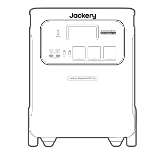

<strong>Jackery Explorer 3600 Plus</strong>

</li><li class="hb-inbox-card" data-item-number="2">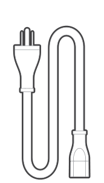

<strong>AC Charging Cable</strong>

</li><li class="hb-inbox-card" data-item-number="3">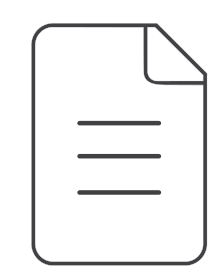

User Manual

</li></ol>

<strong>TIP</strong>

The car charging cable is not included but is available for purchase separately on our website.
For assistance, please contact Jackery customer service.

</figure>

# PRODUCT OVERVIEW

## FRONT VIEW

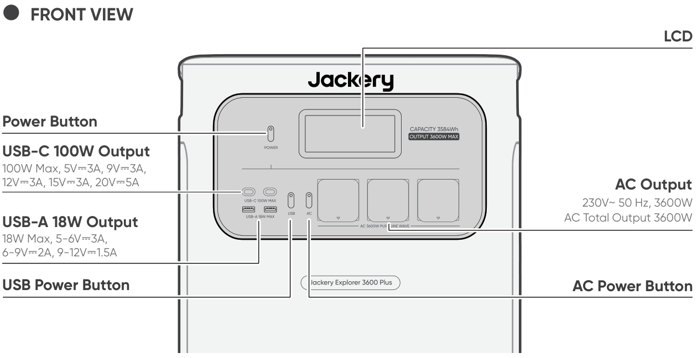

## RIGHT SIDE VIEW

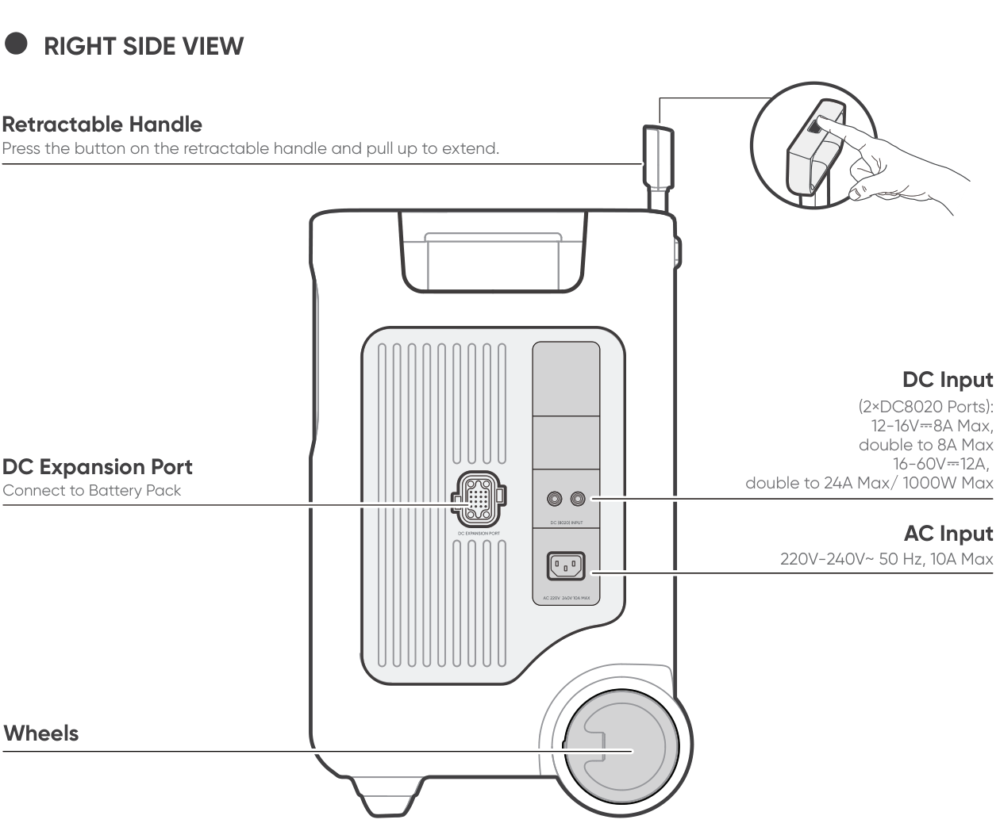

# LCD DISPLAY

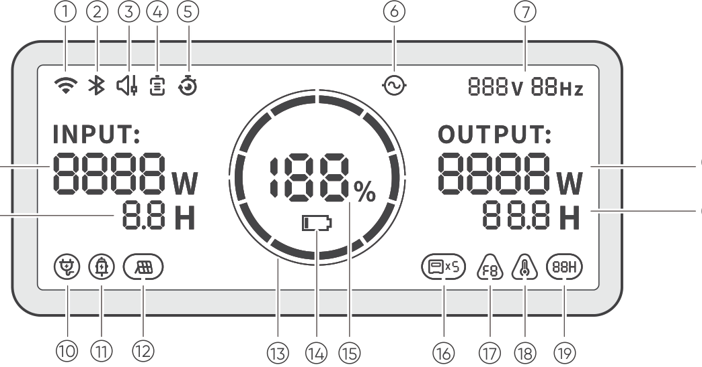

<table class="longtable lcd-text-only">
<colgroup>
<col style="width: 8%" />
<col style="width: 12%" />
<col style="width: 28%" />
<col style="width: 52%" />
</colgroup>
<tbody>
<tr>
<td>
1
</td>
<td></td>
<td>
Wi-Fi
</td>
<td><strong>On:</strong> Wi-Fi connected.
<strong>Blink:</strong> Ready to connect to Wi-Fi.
<strong>Off:</strong> Wi-Fi disconnected.</td>
</tr>
<tr>
<td>
2
</td>
<td></td>
<td>
Bluetooth
</td>
<td><strong>On:</strong> Bluetooth connected.
<strong>Blink:</strong> Ready to connect to Bluetooth.
<strong>Off:</strong> Bluetooth disconnected.</td>
</tr>
<tr>
<td>
3
</td>
<td></td>
<td>
Quiet Charging Mode
</td>
<td><strong>On:</strong> The noise during charging is significantly minimized, while the charging power is reduced and the charging speed slows down.
<strong>Off:</strong> Quiet Charging Mode is disabled.
Enable/disable this feature in the Jackery App.</td>
</tr>
<tr>
<td>
4
</td>
<td></td>
<td>
Battery Saving Mode / Self-powered Mode
</td>
<td>Battery Saving Mode: Limits the maximum usable battery capacity to extend battery life. Enable/disable this feature in the Jackery App. This feature is not available when the product is connected to battery pack(s).
Self-powered Mode: Maximizes the use of solar energy and reduces reliance on grid electricity by prioritizing stored solar energy. Enable/disable this feature in the Jackery App. The power station must be connected to both solar panels and the grid simultaneously, with load power limited by bypass power.</td>
</tr>
<tr>
<td>
5
</td>
<td></td>
<td>
Charging Plan
</td>
<td>
Customizes the charging time of the Jackery Explorer 3600 Plus. Suitable for situations with fluctuating electricity prices, it allows for charging plans based on peak and off-peak electricity times, reducing electricity costs. Set this feature in the Jackery App.
</td>
</tr>
<tr>
<td>
6
</td>
<td></td>
<td>
AC Power Indicator
</td>
<td>
The AC output (pure sine wave) is on.
</td>
</tr>
<tr>
<td>
7
</td>
<td></td>
<td>
Output Voltage and Frequency
</td>
<td>
Displays the output voltage and frequency when the AC output is turned on.
</td>
</tr>
<tr>
<td>
8
</td>
<td></td>
<td>
Input Power
</td>
<td>
Displays the input power in watts.
</td>
</tr>
<tr>
<td>
9
</td>
<td></td>
<td>
Remaining Charge Time
</td>
<td>
Displays the remaining charging time.
</td>
</tr>
<tr>
<td>
10
</td>
<td></td>
<td>
AC Wall Charging Indicator
</td>
<td>
The product is charged via the AC Input using grid power.
</td>
</tr>
<tr>
<td>
11
</td>
<td></td>
<td>
Car Charging Indicator
</td>
<td>
The product is charged via the DC Input (DC8020) using DC 12 V (car charging).
</td>
</tr>
<tr>
<td>
12
</td>
<td></td>
<td>
Solar Charging Indicator
</td>
<td>
The product is charged via the DC Input (DC8020) using solar panel(s).
</td>
</tr>
<tr>
<td>
13
</td>
<td></td>
<td>
Battery Power Indicator
</td>
<td>
When the product is being charged, the orange circle around the battery percentage will light up in sequence. When charging other devices, the orange circle will stay on.
</td>
</tr>
<tr>
<td>
14
</td>
<td></td>
<td>
Low Battery Indicator
</td>
<td><strong>On:</strong> The battery level is below 20%.
<strong>Blink:</strong> The battery level is below 5%.
<strong>Off:</strong> The battery level is not below 20% or the product is charging.</td>
</tr>
<tr>
<td>
15
</td>
<td></td>
<td>
Remaining Battery Percentage
</td>
<td>
Displays the remaining battery percentage.
</td>
</tr>
<tr>
<td>
16
</td>
<td></td>
<td>
Battery Pack Indicator and Number of Connected Batteries
</td>
<td>
Displays the quantity of battery packs if any is connected.
</td>
</tr>
<tr>
<td>
17
</td>
<td></td>
<td>
Fault Code
</td>
<td>
A product error has occurred. Please refer to the Troubleshooting section for details.
</td>
</tr>
<tr>
<td>
18
</td>
<td></td>
<td>
High Temperature Indicator / Low Temperature Indicator
</td>
<td>
High temperature protection or low temperature protection is triggered. The product may stop functioning until its temperature returns to the normal operating range.
</td>
</tr>
<tr>
<td>
19
</td>
<td></td>
<td>
Energy Saving Mode
</td>
<td>
When the AC or USB output is turned on by pressing the AC or USB power button: On: Energy Saving Mode is enabled. Off: Energy Saving Mode is disabled.
</td>
</tr>
<tr>
<td>
20
</td>
<td></td>
<td>
Output Power
</td>
<td>
Displays the output power in watts.
</td>
</tr>
<tr>
<td>
21
</td>
<td></td>
<td>
Remaining Discharge Time
</td>
<td>
Displays the remaining discharging time.
</td>
</tr>
</tbody>
</table>

# OPERATIONS

## POWER ON/OFF

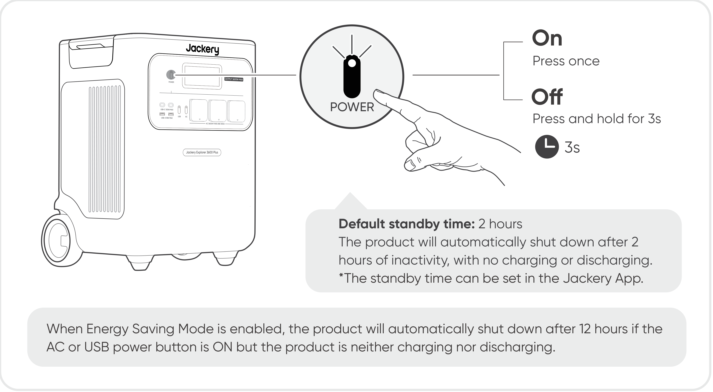

## USB OUTPUT ON/OFF

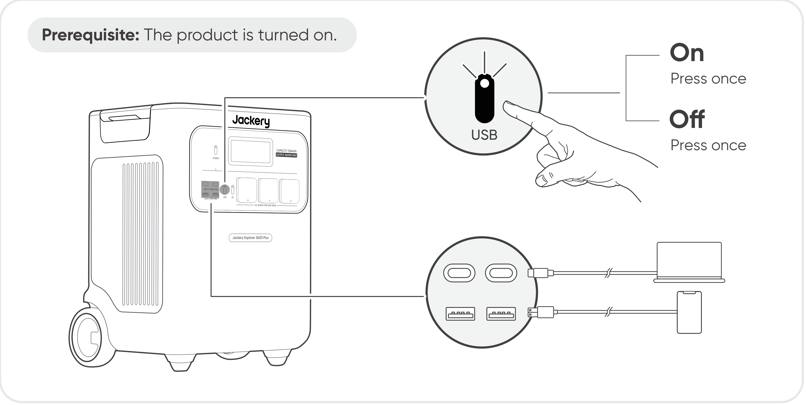

<table class="manual-callout-table" style="width:100%; border-collapse:collapse; margin:0 0 16px 0;"><tbody><tr><td class="manual-callout-label" style="width:16%; border:1px solid #000; padding:6px 8px; vertical-align:top;">
<strong>CAUTION</strong>
</td><td class="manual-callout-body" style="border:1px solid #000; padding:6px 8px; vertical-align:top;"><ul class="simple">
<li>
<strong>USB-C 100W MAX is a USB-PD Power Source 3 (PS3) high-power output port.</strong> If the connected user device or accessory does not meet safety requirements, there may be a fire risk. Before using these ports, ensure that the connected device or accessory has fire safety protection.
</li>
<li>
Only connect Jackery Explorer 3600 Plus to devices or accessories that comply with clauses 6.3, 6.4, and 6.5 of IEC/EN/UL 62368-1 (or other equivalent standards).
</li>
<li>
To obtain maximum output power, use the official Jackery USB-C to USB-C 5A cable (20 V DC/5 A, 100 W).
</li>
</ul>
</td></tr></tbody></table>

## AC OUTPUT ON/OFF

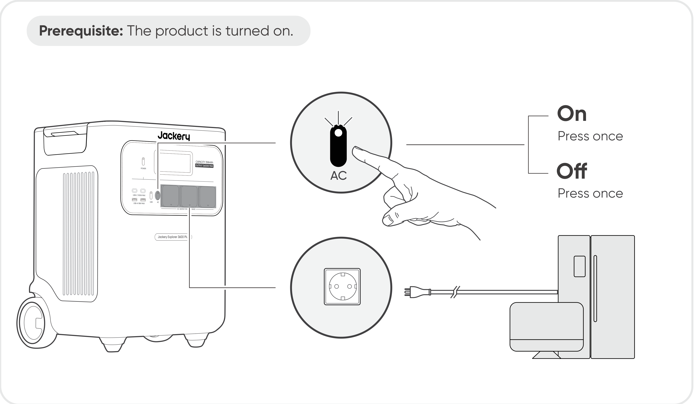

## ENERGY SAVING MODE

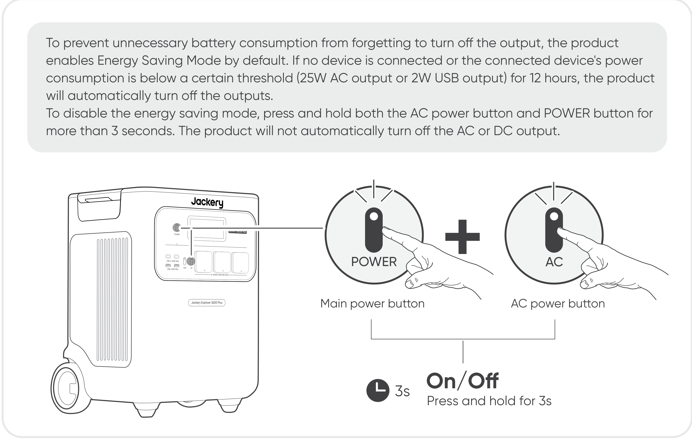

<table class="manual-callout-table" style="width:100%; border-collapse:collapse; margin:0 0 16px 0;"><tbody><tr><td class="manual-callout-label" style="width:16%; border:1px solid #000; padding:6px 8px; vertical-align:top;">
<strong>NOTE</strong>
</td><td class="manual-callout-body" style="border:1px solid #000; padding:6px 8px; vertical-align:top;">
Energy Saving Mode resumes its previous state after powering on. Manual switching is required for mode changes.
</td></tr></tbody></table>

## LCD SCREEN

<table style="width:100%; border-collapse:collapse; margin:0.75rem 0 0.5rem 0;">
<tbody>
<tr>
<td rowspan="6" style="text-align: center; width: 24%; border: 1px solid #cfcfcf; padding: 8px; vertical-align: top;"></td>
<td rowspan="3" style="width: 18%; border: 1px solid #cfcfcf; padding: 8px; vertical-align: top">Shortly On</td>
<td style="width: 12%; border: 1px solid #cfcfcf; padding: 8px">Turn on</td>
<td style="border: 1px solid #cfcfcf; padding: 8px">Press the POWER button or when the product is charging.</td>
</tr>
<tr>
<td style="border: 1px solid #cfcfcf; padding: 8px">Turn off</td>
<td style="border: 1px solid #cfcfcf; padding: 8px">Press the POWER button.</td>
</tr>
<tr>
<td style="border: 1px solid #cfcfcf; padding: 8px">Auto-off</td>
<td style="border: 1px solid #cfcfcf; padding: 8px">The LCD turns off automatically and enters sleep mode after 2 minutes of inactivity.</td>
</tr>
<tr>
<td rowspan="3" style="border: 1px solid #cfcfcf; padding: 8px; vertical-align: top">Steady On (in charging or discharging state)</td>
<td style="border: 1px solid #cfcfcf; padding: 8px">Turn on</td>
<td style="border: 1px solid #cfcfcf; padding: 8px">Press the POWER button twice when the product is powered on.</td>
</tr>
<tr>
<td style="border: 1px solid #cfcfcf; padding: 8px">Turn off</td>
<td style="border: 1px solid #cfcfcf; padding: 8px">Press the POWER button.</td>
</tr>
<tr>
<td style="border: 1px solid #cfcfcf; padding: 8px">Auto-off</td>
<td style="border: 1px solid #cfcfcf; padding: 8px">The LCD turns off automatically after 2 hours of inactivity.</td>
</tr>
</tbody>
</table>

You can also set the screen display mode in the Jackery App.

## KEY COMBINATION

| Buttons | Operation | Function |
|----|----|----|
| POWER button + USB power button | Press and hold both for 3s | Reset Wi-Fi and Bluetooth |
| POWER button + AC power button | Press and hold both for 3s | Turn on/off Energy Saving Mode |
| USB power button + AC power button | Press and hold both for 1s | Turn on/off Wi-Fi and Bluetooth |

# UNINTERRUPTIBLE POWER SUPPLY (UPS)

Connect the product to a wall outlet with the AC charging cable, then press the AC power button and power your appliances at the same time.

In UPS mode, the unit\'s peak output reaches 10 A before power outages. As simultaneous charging/discharging is enabled in Bypass Mode,

the actual output power is lower than the rated output power in this mode but returns to rated output power during outages.

<table class="manual-callout-table" style="width:100%; border-collapse:collapse; margin:0 0 16px 0;"><tbody><tr><td class="manual-callout-label" style="width:16%; border:1px solid #000; padding:6px 8px; vertical-align:top;">
<strong>CAUTION</strong>
</td><td class="manual-callout-body" style="border:1px solid #000; padding:6px 8px; vertical-align:top;"><ul class="simple">
<li>
This product does not support 0 ms switching. Do not connect it to equipment that requires a 0 ms switching power supply, such as data servers or workstations.
</li>
<li>
Before use, please test compatibility with your device multiple times.
</li>
<li>
Do not connect loads exceeding the maximum output power of the product. Otherwise, overload protection will be triggered.
</li>
</ul>
</td></tr></tbody></table>

# CONNECTIONS

This product supports up to five battery packs for applications requiring a larger capacity. For operating instructions, refer to the Jackery Battery Pack 3600 User Manual.

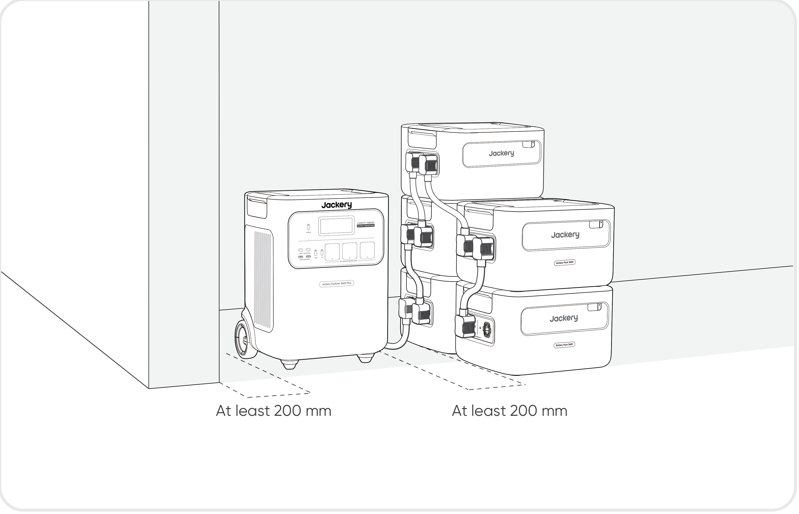

<table class="manual-callout-table" style="width:100%; border-collapse:collapse; margin:0 0 16px 0;"><tbody><tr><td class="manual-callout-label" style="width:16%; border:1px solid #000; padding:6px 8px; vertical-align:top;">
<strong>CAUTION</strong>
</td><td class="manual-callout-body" style="border:1px solid #000; padding:6px 8px; vertical-align:top;"><ul class="simple">
<li>
Ensure all products are powered off before connecting the Explorer 3600 Plus to the Jackery Battery Pack 3600.
</li>
<li>
Keep the air intake and exhaust vents on both sides unobstructed. Leave at least 200 mm between the vents and other objects for heat dissipation.
</li>
</ul>
</td></tr></tbody></table>

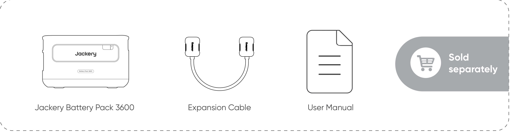

# CHARGING

**Green energy first:** We advocate using green energy first. This product supports two modes of charging at the same time: solar charging and AC wall charging. When AC wall charging and solar charging are turned on at the same time, the product will give priority to solar charging, and both methods will be used to charge the battery at the maximum permissible power.

**Fully charge the product before its first use.**

<table class="manual-callout-table" style="width:100%; border-collapse:collapse; margin:0 0 16px 0;"><tbody><tr><td class="manual-callout-label" style="width:16%; border:1px solid #000; padding:6px 8px; vertical-align:top;">
<strong>NOTE</strong>
</td><td class="manual-callout-body" style="border:1px solid #000; padding:6px 8px; vertical-align:top;"><ul class="simple">
<li>
The recommended charging temperature for the product ranges from -20 °C to 45 °C, and the discharging temperature ranges from -20 °C to 45 °C.
</li>
<li>
Operating the product beyond this temperature range may restrict its charging and discharging capabilities, or even prevent it from charging or discharging.
</li>
<li>
The charging power and battery capacity of the product may vary due to temperature fluctuations.
</li>
</ul>
</td></tr></tbody></table>

## CHARGING VIA AC WALL OUTLET

Connect the AC charging cable to the AC input port of the product and a wall outlet.

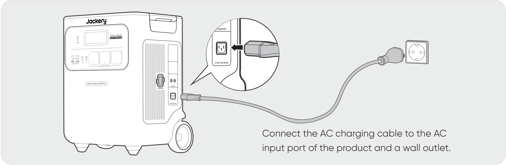

<table class="manual-callout-table" style="width:100%; border-collapse:collapse; margin:0 0 16px 0;"><tbody><tr><td class="manual-callout-label" style="width:16%; border:1px solid #000; padding:6px 8px; vertical-align:top;">
<strong>CAUTION</strong>
</td><td class="manual-callout-body" style="border:1px solid #000; padding:6px 8px; vertical-align:top;">
Make sure the AC charging cable is fully and securely plugged into the AC input port. An incomplete connection may cause unstable current, overheating, poor contact, or device malfunction.
</td></tr></tbody></table>

## CHARGING VIA SOLAR PANELS (SOLD SEPARATELY)

Jackery Explorer 3600 Plus has two DC8020 input ports and is compatible with the Jackery solar panels.

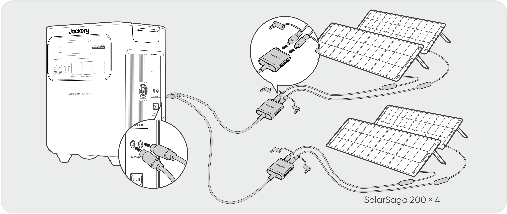

If one DC8020 input port needs to connect two solar panels simultaneously, please refer to the figure below for charging through the solar panel connector (sold separately, not included as standard).

<table class="manual-callout-table" style="width:100%; border-collapse:collapse; margin:0 0 16px 0;"><tbody><tr><td class="manual-callout-label" style="width:16%; border:1px solid #000; padding:6px 8px; vertical-align:top;">
<strong>CAUTION</strong>
</td><td class="manual-callout-body" style="border:1px solid #000; padding:6px 8px; vertical-align:top;">
One DC8020 input port can be connected to at most two solar panels.
</td></tr></tbody></table>

<table class="manual-callout-table" style="width:100%; border-collapse:collapse; margin:0 0 16px 0;"><tbody><tr><td class="manual-callout-label" style="width:16%; border:1px solid #000; padding:6px 8px; vertical-align:top;">
<strong>CAUTION</strong>
</td><td class="manual-callout-body" style="border:1px solid #000; padding:6px 8px; vertical-align:top;">
Ensure that the input voltage for both DC input ports is the same. Failure to do so may damage the product. For example:

<ul class="simple">
<li>
Use the same model of Jackery solar panels and the same number of panels when connecting solar panels to both DC8020 Input ports.
</li>
<li>
Do not charge the product using both a car charger and a solar panel simultaneously. Doing so may blow the car fuse or result in charging failure.
</li>
</ul>
</td></tr></tbody></table>

It is recommended to use the Jackery solar panel to charge the product. Ensure that the open-circuit voltage (Voc) of the solar panel is within the DC input range (16 V-60 V) of Jackery Explorer 3600 Plus. Jackery is not responsible for any damage or loss resulting from the use of third-party solar panels.

## CHARGING VIA A CAR CHARGER (SOLD SEPARATELY)

This product can be charged using a 12V car charger. Ensure that the car charger and the 12V car power outlet (car cigarette lighter) provide a good connection.

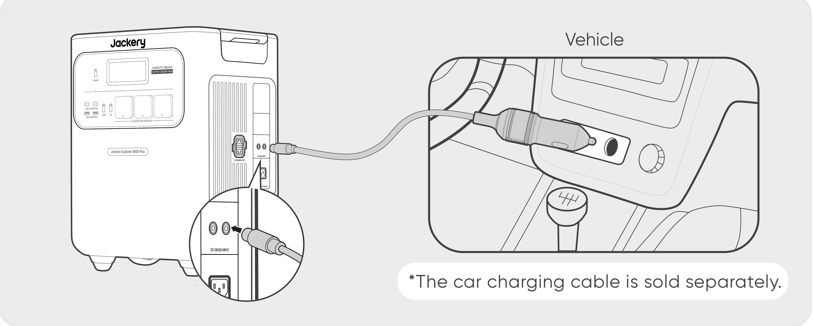

<table class="manual-callout-table" style="width:100%; border-collapse:collapse; margin:0 0 16px 0;"><tbody><tr><td class="manual-callout-label" style="width:16%; border:1px solid #000; padding:6px 8px; vertical-align:top;">
<strong>CAUTION</strong>
</td><td class="manual-callout-body" style="border:1px solid #000; padding:6px 8px; vertical-align:top;"><ul class="simple">
<li>
Please start the vehicle before charging your power station.
</li>
<li>
If the vehicle is running on bumpy roads, it is forbidden to use the car charger in case it causes non-standard operation. The Company will not be responsible for any loss caused by non-standard operation.
</li>
<li>
Vehicle charging is only applicable to vehicles with 12V DC, not 24V DC. Please do not charge this product in a 24V vehicle to avoid personal injury and property loss.
</li>
</ul>
</td></tr></tbody></table>

# STORAGE

Store the product in a dry, clean place with proper ventilation. Storage temperature and humidity:

- 1 month: -20 °C to 45 °C (0-60% RH)

- 3 months: 0 °C to 45 °C (0-60% RH)

- 12 months: 0 °C to 25 °C (0-60% RH)

If this product is stored for a long period of time (3 months - 6 months) with the power depleted, it may become unchargeable. To prevent this and maintain battery health, it is recommended to check and recharge the product every three months and perform a full charge and discharge cycle at least once every 6 to 12 months.

# TROUBLESHOOTING

If any of the following fault codes appear, follow the listed corrective actions to resolve the issue. If the fault persists, please contact Jackery Customer Support.

<figure aria-label="Error Code / Corrective Measures" class="hb-troubleshooting-composition" data-component-id="HB-TABLE-TROUBLESHOOTING" tabindex="0"><table class="hb-troubleshooting-table"><colgroup><col class="hb-troubleshooting-col-code"/><col class="hb-troubleshooting-col-measures"/></colgroup><thead><tr><th class="hb-troubleshooting-code" scope="col">
Error Code
</th><th class="hb-troubleshooting-measures" scope="col">
Corrective Measures
</th></tr></thead><tbody><tr><td class="hb-troubleshooting-code">
F0
</td><td class="hb-troubleshooting-measures">
Restart the product.
</td></tr><tr><td class="hb-troubleshooting-code">
F1
</td><td class="hb-troubleshooting-measures">
Restart the product.
</td></tr><tr><td class="hb-troubleshooting-code">
F2
</td><td class="hb-troubleshooting-measures">
Restart the product.
</td></tr><tr><td class="hb-troubleshooting-code">
F3
</td><td class="hb-troubleshooting-measures">
Restart the product.
</td></tr><tr><td class="hb-troubleshooting-code">
F4
</td><td class="hb-troubleshooting-measures">
Connect the product to loads to discharge its battery until the fault disappears.
</td></tr><tr><td class="hb-troubleshooting-code">
F5
</td><td class="hb-troubleshooting-measures">
Charge the product via solar panels or an AC wall outlet until the fault disappears.
</td></tr><tr><td class="hb-troubleshooting-code">
F6
</td><td class="hb-troubleshooting-measures">

1. Wait for the grid to normalize before charging the product via an AC wall outlet.

2. Check whether the air intake and exhaust vents are blocked; ensure 200 mm clearance on both sides of the product.

3. Place the product in a location that is not exposed to direct sunlight or high environmental temperatures.

4. Disconnect all loads from the product. Keep the product idle and wait until the fault disappears.

5. Restart the product.

</td></tr><tr><td class="hb-troubleshooting-code">
F7
</td><td class="hb-troubleshooting-measures">

1. Remove all DC inputs from the product.

2. Check the open-circuit voltage (Voc) of the connected solar panels. The product allows a maximum DC input voltage of 60 V.

3. Restart the product and keep it idle. Wait until the fault disappears.

</td></tr><tr><td class="hb-troubleshooting-code">
F8
</td><td class="hb-troubleshooting-measures">
Contact Jackery Customer Support.
</td></tr><tr><td class="hb-troubleshooting-code">
F9
</td><td class="hb-troubleshooting-measures">
Remove the load connected to the USB ports of the product. Wait until the fault disappears.
</td></tr><tr><td class="hb-troubleshooting-code">
FA
</td><td class="hb-troubleshooting-measures">

1. Turn off the AC output of both units.

2. Press the AC power button on each unit again within 1 minute.

</td></tr><tr><td class="hb-troubleshooting-code">
FC
</td><td class="hb-troubleshooting-measures">

1. Restart the battery packs and the Jackery Explorer 3600 Plus respectively.

2. If the fault persists, disconnect the battery pack from the Jackery Explorer 3600 Plus and connect them again.

</td></tr></tbody></table></figure>

# SPECIFICATIONS

## GENERAL INFO

<figure aria-label="GENERAL INFO" class="hb-spec-table-composition"><table class="hb-spec-table manual-table manual-spec-table"><colgroup><col class="hb-spec-col-label"/><col class="hb-spec-col-value"/></colgroup>
<tbody>
<tr>
<th class="hb-spec-label manual-spec-label" scope="row">Product Name</th>
<td class="hb-spec-value manual-spec-value">Jackery Explorer 3600 Plus</td>
</tr>
<tr>
<th class="hb-spec-label manual-spec-label" scope="row">Model No.</th>
<td class="hb-spec-value manual-spec-value">JE-3600A</td>
</tr>
<tr>
<th class="hb-spec-label manual-spec-label" scope="row">Capacity</th>
<td class="hb-spec-value manual-spec-value">80 Ah / 44.8 V DC (3584 Wh)</td>
</tr>
<tr>
<th class="hb-spec-label manual-spec-label" scope="row">Cell Chemistry</th>
<td class="hb-spec-value manual-spec-value">LiFePO₄</td>
</tr>
<tr>
<th class="hb-spec-label manual-spec-label" scope="row">Weight</th>
<td class="hb-spec-value manual-spec-value">About 35 kg</td>
</tr>
<tr>
<th class="hb-spec-label manual-spec-label" scope="row">Dimensions</th>
<td class="hb-spec-value manual-spec-value">38.5 × 30.9 × 49.1 cm</td>
</tr>
<tr>
<th class="hb-spec-label manual-spec-label" scope="row">Cycle Life</th>
<td class="hb-spec-value manual-spec-value">6000 cycles to 70%+ capacity</td>
</tr>
<tr>
<th class="hb-spec-label manual-spec-label" scope="row">IEC code</th>
<td class="hb-spec-value manual-spec-value">IFpR41/136[14S4P]M/-20+40/90</td>
</tr>
</tbody>
</table></figure>

## INPUT PORTS

<figure aria-label="INPUT PORTS" class="hb-spec-table-composition"><table class="hb-spec-table manual-table manual-spec-table"><colgroup><col class="hb-spec-col-label"/><col class="hb-spec-col-value"/></colgroup>
<tbody>
<tr>
<th class="hb-spec-label manual-spec-label" scope="row">1 × AC Input</th>
<td class="hb-spec-value manual-spec-value">Charge Mode: 220-240 V~ 50 Hz, 10 A max. Bypass Mode: 220-240 V~ 50 Hz, 10 A max.①</td>
</tr>
<tr>
<th class="hb-spec-label manual-spec-label" scope="row">2 × DC8020 Ports</th>
<td class="hb-spec-value manual-spec-value">12-16 V⎓8 A max., double to 8 A max. 16-60 V⎓12 A, double to 24 A max. / 1000 W max.</td>
</tr>
<tr>
<th class="hb-spec-label manual-spec-label" scope="row">1 × DC Expansion Port</th>
<td class="hb-spec-value manual-spec-value">36.4-50.4 V⎓100 A max.</td>
</tr>
</tbody>
</table></figure>

## OUTPUT PORTS

<figure aria-label="OUTPUT PORTS" class="hb-spec-table-composition"><table class="hb-spec-table manual-table manual-spec-table"><colgroup><col class="hb-spec-col-label"/><col class="hb-spec-col-value"/></colgroup>
<tbody>
<tr>
<th class="hb-spec-label manual-spec-label" scope="row">3 × AC Output</th>
<td class="hb-spec-value manual-spec-value">230 V~ 50 Hz, 3600 W</td>
</tr>
<tr>
<th class="hb-spec-label manual-spec-label" scope="row">AC Total Output</th>
<td class="hb-spec-value manual-spec-value">3600 W rated, 7200 W surge peak②</td>
</tr>
<tr>
<th class="hb-spec-label manual-spec-label" scope="row">AC Output in Bypass Mode</th>
<td class="hb-spec-value manual-spec-value">220-240 V~ 50 Hz, 10 A max.</td>
</tr>
<tr>
<th class="hb-spec-label manual-spec-label" scope="row">2 × USB-C 100W Output</th>
<td class="hb-spec-value manual-spec-value">100 W max., 5 V⎓3 A, 9 V⎓3 A, 12 V⎓3 A, 15 V⎓3 A, 20 V⎓5 A</td>
</tr>
<tr>
<th class="hb-spec-label manual-spec-label" scope="row">2 × USB-A 18W Output</th>
<td class="hb-spec-value manual-spec-value">18 W max., 5-6 V⎓3 A, 6-9 V⎓2 A, 9-12 V⎓1.5 A</td>
</tr>
<tr>
<th class="hb-spec-label manual-spec-label" scope="row">1 × DC Expansion Port</th>
<td class="hb-spec-value manual-spec-value">36.4-50.4 V⎓60 A max.</td>
</tr>
</tbody>
</table></figure>

## ENVIRONMENTAL OPERATING TEMPERATURE

<figure aria-label="ENVIRONMENTAL OPERATING TEMPERATURE" class="hb-spec-table-composition"><table class="hb-spec-table manual-table manual-spec-table"><colgroup><col class="hb-spec-col-label"/><col class="hb-spec-col-value"/></colgroup>
<tbody>
<tr>
<th class="hb-spec-label manual-spec-label" scope="row">Charge Temperature</th>
<td class="hb-spec-value manual-spec-value">-20 °C to 45 °C</td>
</tr>
<tr>
<th class="hb-spec-label manual-spec-label" scope="row">Discharge Temperature</th>
<td class="hb-spec-value manual-spec-value">-20 °C to 45 °C</td>
</tr>
</tbody>
</table></figure>

※ USB Type-C® and USB-C® are registered trademarks of USB Implementers Forum.

① The product can charge the battery from the AC wall outlet while delivering power through the AC output ports.

② Indicates that two or more AC output ports work together.

# WARRANTY

<figure aria-label="WARRANTY" class="hb-warranty-intro-composition" data-component-id="HB-WARRANTY-LEAD">

<strong>This warranty applies only to customers who purchase from the official Jackery website, Jackery-branded third-party platforms, or local authorized dealers.</strong>

*Warranty period and details may vary according to local laws, regulations, and authorized dealers.

</figure>

## Limited Warranty

<figure aria-label="Limited Warranty" class="hb-warranty-card" data-component-id="HB-WARRANTY-SECTION" data-warranty-card-index="1">
Jackery warrants to the original consumer purchaser that the Jackery product will be free from defects in workmanship and material under normal consumer use during the applicable warranty period identified in the 'Warranty Period' section below, subject to the exclusions set forth below.

This warranty statement sets forth Jackery's total and exclusive warranty obligation. We will not assume, nor authorize any person to assume for us, any other liability in connection with the sale of our products.
</figure>

## Warranty Period

<figure aria-label="Warranty Period" class="hb-warranty-period-card" data-component-id="HB-WARRANTY-YEARS">

3
<strong class="hb-warranty-years-unit">YEARS</strong><strong class="hb-warranty-period-label">Standard Warranty</strong>

The standard warranty period for Jackery Explorer 3600 Plus is 36 months.
In each case, the warranty period is measured starting on the date of purchase by the original consumer purchaser.
The sales receipt from the first consumer purchaser, or other reasonable documentary proof, is required in order to establish the start date of the warranty period.

2
<strong class="hb-warranty-years-unit">YEARS</strong><strong class="hb-warranty-period-label">Extended Warranty</strong>

To activate the Warranty Extension, you must register your product online or contact our customer service team at <a class="reference external" href="mailto:hello.eu@jackery.com">hello.eu@jackery.com</a> to extend the standard warranty period.

</figure>

## Exchange

<figure aria-label="Exchange" class="hb-warranty-card" data-component-id="HB-WARRANTY-SECTION" data-warranty-card-index="3">
Jackery will replace (at Jackery's expense) any Jackery product that fails to operate during the applicable warranty period due to a defect in workmanship or material. A replacement product assumes the remaining warranty of the original product.
</figure>

## Limited to Original Consumer Buyer

<figure aria-label="Limited to Original Consumer Buyer" class="hb-warranty-card" data-component-id="HB-WARRANTY-SECTION" data-warranty-card-index="4">
The warranty on Jackery's product is limited to the original consumer purchaser and is not transferable to any subsequent owner.
</figure>

## Exclusions

<figure aria-label="Exclusions" class="hb-warranty-card" data-component-id="HB-WARRANTY-SECTION" data-warranty-card-index="5">
Jackery's warranty does not apply to:
<ul class="simple">
<li>
Any product that has been misused, abused, modified, damaged by accident, or used for anything other than normal consumer use as authorized in Jackery's current product literature.
</li>
<li>
Attempted repair by anyone other than an authorized facility.
</li>
<li>
Any product purchased through an online auction house.
</li>
<li>
Jackery's warranty does not apply to the battery cell unless the battery cell is fully charged by you within seven days after you purchase the product and at least once every 6 months thereafter.
</li>
</ul></figure>

## Interpretation Rights

<figure aria-label="Interpretation Rights" class="hb-warranty-card" data-component-id="HB-WARRANTY-SECTION" data-warranty-card-index="6">
Jackery reserves the right to the final interpretation of the above customer after-sales policy.
</figure>

# APP SETUP

**1. Download the App and log in**

Search for \"Jackery\" in Google Play or the App Store to install the App, then register and log in. Alternatively, scan the QR code.

**2. Add device**

2.1 Tap the button to add your device.

2.2 Press the POWER button to turn on the device. When the Wi-Fi and Bluetooth icons flash, tap **Icon Flashed**, then allow access to nearby devices and Bluetooth.

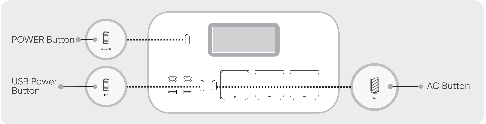

<table class="manual-callout-table" style="width:100%; border-collapse:collapse; margin:0 0 16px 0;"><tbody><tr><td class="manual-callout-label" style="width:16%; border:1px solid #000; padding:6px 8px; vertical-align:top;">
<strong>NOTE</strong>
</td><td class="manual-callout-body" style="border:1px solid #000; padding:6px 8px; vertical-align:top;">
If the powered-on device is not connected to the App within 2 hours, Wi-Fi and Bluetooth turn off automatically. Press and hold the USB power button and AC power button to turn them on again.
</td></tr></tbody></table>

2.3 Tap the detected device icon; the App connects to the device by Bluetooth.

If **the device has been bound** appears, ask the device owner to share it in the App, or press and hold the POWER button and USB power button for 3 seconds to reset the device and bind it again.

2.4 Enter your Wi-Fi password and tap **OK**. Select a 2.4 GHz Wi-Fi network; 5 GHz networks are not supported.

2.5 After the device is added, the Wi-Fi icon remains on.

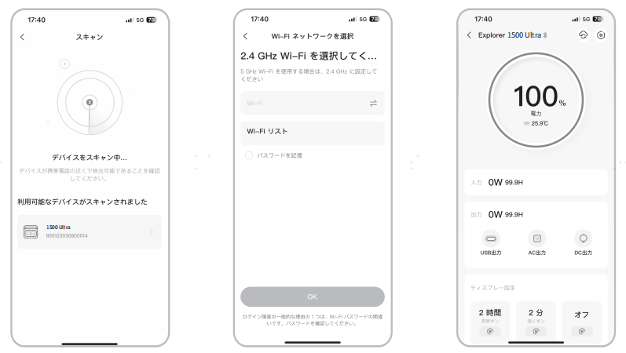

The screenshots are for reference only.

<table class="manual-callout-table" style="width:100%; border-collapse:collapse; margin:0 0 16px 0;"><tbody><tr><td class="manual-callout-label" style="width:16%; border:1px solid #000; padding:6px 8px; vertical-align:top;">
<strong>CAUTION</strong>
</td><td class="manual-callout-body" style="border:1px solid #000; padding:6px 8px; vertical-align:top;">
The Jackery App can connect to only one power station by Bluetooth at a time. Returning to the device list disconnects Bluetooth; tap the power station again to reconnect.
</td></tr></tbody></table>

**3. Unbind the device**

Open **Settings** in the upper-right corner of the device interface and tap **Unbind**.

**4. Notes**

- Wi-Fi and Bluetooth turn on automatically with the device. To turn them on or off manually, hold the USB power button and AC power button together until the icons change state.

- Wi-Fi and Bluetooth turn off automatically if no device connects within 2 hours.

- To reset Wi-Fi and Bluetooth and unbind the connected App account, hold the POWER button and USB power button together for 3 seconds.

# EU REGULATIONS

## DECLARATION OF CONFORMITY

Jackery Explorer 3600 Plus (JE-3600A) with Bluetooth and Wi-Fi is in compliance with the essential requirements and other relevant provisions of Directive 2014/53/EU and Directive 2011/65/EU, as amended by (EU) 2015/863.

The full text of the EU declaration of conformity is available at:

<a href="https://eu.jackery.com/pages/declaration-of-conformity" class="reference external">https://eu.jackery.com/pages/declaration-of-conformity</a>

## RADIO EQUIPMENT

| Radio technology | Frequency band | Maximum RF power |
|------------------|----------------|------------------|
| Wi-Fi (20 MHz)   | 2412-2472 MHz  | ≤ 20 dBm         |
| Bluetooth        | 2402-2480 MHz  | ≤ 10 dBm         |

## MANUFACTURER

SHENZHEN HELLO TECH ENERGY CO., LTD.

F2-3, Bldg. 7, Jiaanda Science and Technology Industrial Park Factory, east side of Huafan Road, Tongsheng Community, Dalang Street, Longhua District, Shenzhen, Guangdong, China

+86 400 668 9293

<a href="mailto:sales@hello-tech.com" class="reference external">sales@hello-tech.com</a>

www.hello-tech.com
